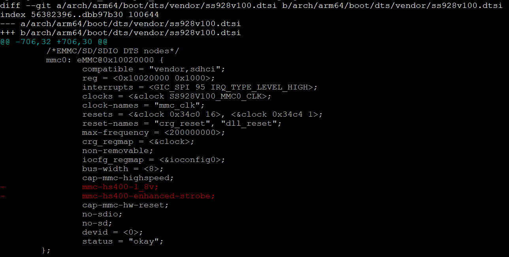
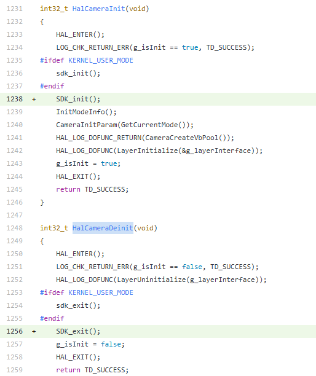
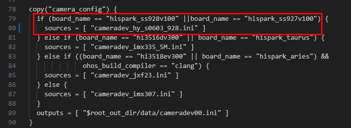

# 前言<a name="ZH-CN_TOPIC_0000002434316444"></a>

**概述<a name="section4537382116410"></a>**

本文章是基于视觉Hi3403V100开发板，进行OpenHarmony 5.1.0 Release小型系统相关功能的移植；主要包括解决方案集成，产品配置添加，内核移植适配、编译，XTS认证，图形增强特性，媒体增强特性的适配案例总结。

**读者对象<a name="section4378592816410"></a>**

本文档主要适用于视觉OpenHarmony Small系统升级的操作人员。操作人员必须具备以下经验和技能：

-   熟悉OpenHarmony源码编译构建。
-   熟悉视觉类芯片SDK版本。

**符号约定<a name="section133020216410"></a>**

在本文中可能出现下列标志，它们所代表的含义如下。

<a name="table2622507016410"></a>
<table><thead align="left"><tr id="row1530720816410"><th class="cellrowborder" valign="top" width="20.580000000000002%" id="mcps1.1.3.1.1"><p id="p6450074116410"><a name="p6450074116410"></a><a name="p6450074116410"></a>符号</p>
</th>
<th class="cellrowborder" valign="top" width="79.42%" id="mcps1.1.3.1.2"><p id="p5435366816410"><a name="p5435366816410"></a><a name="p5435366816410"></a>说明</p>
</th>
</tr>
</thead>
<tbody><tr id="row1372280416410"><td class="cellrowborder" valign="top" width="20.580000000000002%" headers="mcps1.1.3.1.1 "><p id="p3734547016410"><a name="p3734547016410"></a><a name="p3734547016410"></a><a name="image2670064316410"></a><a name="image2670064316410"></a><span></span></p>
</td>
<td class="cellrowborder" valign="top" width="79.42%" headers="mcps1.1.3.1.2 "><p id="p1757432116410"><a name="p1757432116410"></a><a name="p1757432116410"></a>表示如不避免则将会导致死亡或严重伤害的具有高等级风险的危害。</p>
</td>
</tr>
<tr id="row466863216410"><td class="cellrowborder" valign="top" width="20.580000000000002%" headers="mcps1.1.3.1.1 "><p id="p1432579516410"><a name="p1432579516410"></a><a name="p1432579516410"></a><a name="image4895582316410"></a><a name="image4895582316410"></a><span></span></p>
</td>
<td class="cellrowborder" valign="top" width="79.42%" headers="mcps1.1.3.1.2 "><p id="p959197916410"><a name="p959197916410"></a><a name="p959197916410"></a>表示如不避免则可能导致死亡或严重伤害的具有中等级风险的危害。</p>
</td>
</tr>
<tr id="row123863216410"><td class="cellrowborder" valign="top" width="20.580000000000002%" headers="mcps1.1.3.1.1 "><p id="p1232579516410"><a name="p1232579516410"></a><a name="p1232579516410"></a><a name="image1235582316410"></a><a name="image1235582316410"></a><span></span></p>
</td>
<td class="cellrowborder" valign="top" width="79.42%" headers="mcps1.1.3.1.2 "><p id="p123197916410"><a name="p123197916410"></a><a name="p123197916410"></a>表示如不避免则可能导致轻微或中度伤害的具有低等级风险的危害。</p>
</td>
</tr>
<tr id="row5786682116410"><td class="cellrowborder" valign="top" width="20.580000000000002%" headers="mcps1.1.3.1.1 "><p id="p2204984716410"><a name="p2204984716410"></a><a name="p2204984716410"></a><a name="image4504446716410"></a><a name="image4504446716410"></a><span></span></p>
</td>
<td class="cellrowborder" valign="top" width="79.42%" headers="mcps1.1.3.1.2 "><p id="p4388861916410"><a name="p4388861916410"></a><a name="p4388861916410"></a>用于传递设备或环境安全警示信息。如不避免则可能会导致设备损坏、数据丢失、设备性能降低或其它不可预知的结果。</p>
<p id="p1238861916410"><a name="p1238861916410"></a><a name="p1238861916410"></a>“须知”不涉及人身伤害。</p>
</td>
</tr>
<tr id="row2856923116410"><td class="cellrowborder" valign="top" width="20.580000000000002%" headers="mcps1.1.3.1.1 "><p id="p5555360116410"><a name="p5555360116410"></a><a name="p5555360116410"></a><a name="image799324016410"></a><a name="image799324016410"></a><span></span></p>
</td>
<td class="cellrowborder" valign="top" width="79.42%" headers="mcps1.1.3.1.2 "><p id="p4612588116410"><a name="p4612588116410"></a><a name="p4612588116410"></a>对正文中重点信息的补充说明。</p>
<p id="p1232588116410"><a name="p1232588116410"></a><a name="p1232588116410"></a>“说明”不是安全警示信息，不涉及人身、设备及环境伤害信息。</p>
</td>
</tr>
</tbody>
</table>

**修改记录<a name="section2467512116410"></a>**

<a name="table5652mcpsimp"></a>
<table><thead align="left"><tr id="row5658mcpsimp"><th class="cellrowborder" valign="top" width="21%" id="mcps1.1.4.1.1"><p id="p5660mcpsimp"><a name="p5660mcpsimp"></a><a name="p5660mcpsimp"></a>文档版本</p>
</th>
<th class="cellrowborder" valign="top" width="26%" id="mcps1.1.4.1.2"><p id="p5663mcpsimp"><a name="p5663mcpsimp"></a><a name="p5663mcpsimp"></a>发布日期</p>
</th>
<th class="cellrowborder" valign="top" width="53%" id="mcps1.1.4.1.3"><p id="p5666mcpsimp"><a name="p5666mcpsimp"></a><a name="p5666mcpsimp"></a>修改说明</p>
</th>
</tr>
</thead>
<tbody><tr id="row5669mcpsimp"><td class="cellrowborder" valign="top" width="21%" headers="mcps1.1.4.1.1 "><p id="p5671mcpsimp"><a name="p5671mcpsimp"></a><a name="p5671mcpsimp"></a>00B01</p>
</td>
<td class="cellrowborder" valign="top" width="26%" headers="mcps1.1.4.1.2 "><p id="p5673mcpsimp"><a name="p5673mcpsimp"></a><a name="p5673mcpsimp"></a>2025-09-15</p>
</td>
<td class="cellrowborder" valign="top" width="53%" headers="mcps1.1.4.1.3 "><p id="p5675mcpsimp"><a name="p5675mcpsimp"></a><a name="p5675mcpsimp"></a>第1次临时版本发布。</p>
</td>
</tr>
</tbody>
</table>

# 芯片解决方案配置<a name="ZH-CN_TOPIC_0000002434263018"></a>

本方案移植架构上采用Borad和SoC解耦的设计思路，芯片目录规划如下：

-   device\_board\_hisilicon

    本目录用于存放Hi3403V100的开发板相关内容，支持运行小型系统的开发板；介绍了单板、内核、工具链和编译器等信息。

    ```
    device/board/hisilicon/hispark_ss928v100/
    ├── BUILD.gn           
    ├── linux
    │   ├── BUILD.gn
    │   ├── config.gni       #用于描述这个产品样例所使用的单板、内核、工具链、编译器等信息
    │   ├── LICENSE
    ├── ohos.build            #定义一个device_hispark_ss928v100子系统，该设备下module_list字段列出了设备需要加载的模块
    └── README_zh.md
    ```

-   device\_soc\_hisilicon

本目录用于存放芯片相关内容，包含HDI实现（display、media、middleware）、芯片SDK（用户态库、头文件、驱动源码、MPP Sample等）

```
device/soc/hisilicon
├── common
│   ├── hal
│   │   ├── BUILD.gn
│   │   ├── build.sh
│   │   ├── display
│   │   │   ├── BUILD.gn
│   │   │   ├── ...
│   │   │   └── ss928                 #支持Hi3403V100和SS927V100的媒体中间件
│   │   ├── LICENSE
│   │   ├── media
│   │   │   ├── audio
│   │   │   ├── build
│   │   │   ├── BUILD.gn
│   │   │   ├── build.sh
│   │   │   ├── camera
│   │   │   ├── codec
│   │   │   ├── common
│   │   │   ├── format
│   │   │   ├── Makefile
│   │   │   └── ...
│   │   ├── middleware                #媒体中间件
│   │   │   ├── source                #支持Hi3403V100和SS927V100的媒体中间件
│   │   │   └── ...
│   │   └── ...
│   └── ...
└── ss928v100
    ├── burn
    │   └── emmc_burn_table.xml      #烧写emmc介质的镜像分区表
    ├── kernel
    │   └── arch
    ├── NOTICE
    ├── README_zh.md
    ├── sdk_linux
    │   ├── BUILD.gn
    │   ├── build.sh                 #编译SDK入口：编译ko、atf
    │   ├── config.gni
    │   ├── open_source              #编译SDK依赖的开源软件，提供配置指导和定制补丁
    │   ├── smp                      #SDK软件，自研，包括内核驱动源码、sample实例代码，闭源库
    │   ├── ss928v100_sdk_patch_001.patch    #OpenHarmony环境上编译SDK制作的patch
    │   └── ss928v100_sdk_patch_002.patch    #基于编译内核fip.bin ATF制作的patch
    ├── soc.gni
    └── uboot
        └── LICENSE
```

> **说明：** 
>基于device/soc/hisilicon/ss928v100/sdk\_linux主要是基于芯片SDK的适配，下面将展开详细介绍：
>1.  该目录下的smp和open\_source目录内容为芯片SDK提供内容，可以直接从SDK中拷贝使用
>2.  ss928v100\_sdk\_patch\_001.patch和ss928v100\_sdk\_patch\_002.patch：由于SDK和OpenHarmony代码、编译环境差异，需要在OpenHarmony下应用定制补丁
>3.  uboot：已提供源码，需自行编译生成


## SDK编译适配<a name="ZH-CN_TOPIC_0000002482557709"></a>

1.  配置OpenHarmony环境上编译芯片SDK的相关参数。

    修改文件device/soc/hisilicon/ss928v100/sdk\_linux/BUILD.gn，配置芯片SDK编译的相关参数。

    -   ohos\_root\_path：OpenHarmony源码目录；
    -   outdir：编译out目录；
    -   y：是否为Lite型系统；
    -   clang\_dir：编译工具链路径；
    -   linux\_kernel\_version：指定使用的内核版本；
    -   chip：芯片型号。

    ```
    if (defined(ohos_lite)) {
      build_ext_component("sdk_make") {
        exec_path = rebase_path(".", root_build_dir)
        outdir = rebase_path("$root_out_dir")
        clang_dir = ""
        if (ohos_build_compiler_dir != "") {
          clang_dir = rebase_path("$ohos_build_compiler_dir")
        }
        chip = "ss928v100"
        if (board_name == "hispark_ss927v100") {
          chip = "ss927v100"
        }
        command = "./build.sh ${ohos_root_path} ${outdir} y ${clang_dir} ${linux_kernel_version} ${chip}"
        deps = [ "//kernel/linux/build:linux_kernel" ]
      }
      not_needed(sdk_modules_name_list)
    } else {
      sdk_tmp_root_path = root_out_dir
      sdk_tmp_dir = "$sdk_tmp_root_path/sdk_linux/src_tmp"
      sdk_tmp_mods_dir = "$sdk_tmp_dir/out/ko"
    ...
    ```

2.  配置SDK编译工具链。

    SDK包中提供内核驱动源码和Sample源码，可以通过源码进行编译。在编译前，需要配置编译工具链，将编译工具链路径加入到环境变量中。

    将Clang编译工具链路径加到环境变量中，执行：export PATH=/path/to/toolchains:$PATH

    例如，Clang所在的路径为/path/to/llvm\_clang/bin，则执行：export PATH=/path/to/llvm\_clang/bin:$PATH

3.  在OpenHarmony环境上编ko和atf。

    修改device/soc/hisilicon/ss928v100/sdk\_linux/build.sh

    ```
    set -e
    OHOS_ROOT_PATH=$1
    OUTDIR=$2
    OHOS_LITE=$3
    COMPILER_DIR=$4
    CHIP=$6
    
    export KERNEL_VERSION="$5"
    
    if [ -z "${OHOS_ROOT_PATH}" ];then
        OHOS_ROOT_PATH=$(pwd)/../../../..
    else
        echo "OHOS_ROOT_PATH=${OHOS_ROOT_PATH}"
    fi
    
    export OHOS_ROOT_PATH
    if [ ${COMPILER_DIR} != "" ];then
        export COMPILER_PATH=${COMPILER_DIR}/bin
    fi
    
    SDK_LINUX_SRC_PATH=${OHOS_ROOT_PATH}/device/soc/hisilicon/ss928v100/sdk_linux
    SDK_LINUX_TMP_PATH=${OUTDIR}/sdk_linux/src_tmp
    SDK_LINUX_SMP_PATH=${SDK_LINUX_TMP_PATH}/smp
    SDK_LINUX_OPEN_PATH=${SDK_LINUX_TMP_PATH}/open_source
    SDK_LINUX_ATF_PATH=${SDK_LINUX_TMP_PATH}/open_source/trusted-firmware-a
    SYSROOT_PATH=${OHOS_ROOT_PATH}/out/hispark_${CHIP}/ipcamera_hispark_${CHIP}_linux/sysroot
    export SYSROOT_PATH
    OSDRV_CROSS_PATH=${OHOS_ROOT_PATH}/prebuilts/gcc/linux-x86/aarch64/gcc-linaro-7.5.0-2019.12-x86_64_aarch64-linux-gnu/bin/aarch64-linux-gnu
    ...
    
    echo "Add patchs to sdk..."
    pushd ${SDK_LINUX_SMP_PATH}
    patch -p1 < ./ss928v100_sdk_patch_001.patch
    popd
    
    echo "Add patchs to atf..."
    pushd ${SDK_LINUX_ATF_PATH}
    patch -p1 < ./ss928v100_sdk_patch_002.patch
    popd
    
    echo "compile ko..."
     pushd "${SDK_LINUX_SMP_PATH}/a55_linux/mpp/out/obj" && \
        make clean OHOS_LITE=y CHIP="${CHIP}" SYSROOT_PATH="${SYSROOT_PATH}" && \
        make -j OHOS_LITE=y CHIP="${CHIP}" SYSROOT_PATH="${SYSROOT_PATH}" && popd
    echo "compile atf..."
     pushd ${SDK_LINUX_OPEN_PATH}/trusted-firmware-a && make clean OHOS_LITE=y && 
     make -j OHOS_LITE=y CHIP=${CHIP} KERNEL_VER=${KERNEL_VERSION} OSDRV_CROSS=${OSDRV_CROSS_PATH}&& popd
    ...
    
    pushd ${SDK_LINUX_SMP_PATH}/a55_linux/mpp/out/lib
    for lib_name in "${sdk_libs_name_set[@]}"; do
        if [ -f "$lib_name" ]; then
            cp -f $lib_name ${OUTDIR}
        fi
    done
    popd
    
    mkdir -p ${SDK_LINUX_TMP_PATH}/out
    cp -rf ${SDK_LINUX_SMP_PATH}/a55_linux/mpp/out/ko ${SDK_LINUX_TMP_PATH}/out
    
    # copy images and burn_table file
    cp -rf ${SDK_LINUX_SRC_PATH}/../burn/* ${OUTDIR}
    # cp uImage，exe atf, flip.bin改名uImage，并替换掉；
    cp -rf ${SDK_LINUX_OPEN_PATH}/trusted-firmware-a/trusted-firmware-a-2.2/build/${CHIP}/release/fip.bin ${OUTDIR}
    # $(hide) cp -rf $(KERNEL_OBJ_TMP_PATH)/arch/$(KERNEL_ARCH)/boot/uImage $(OUT_DIR)
    ```

    > **说明：** 
    >-   此处重点关注几个关键变量：OHOS\_ROOT\_PATH、COMPILER\_PATH、SYSROOT\_PATH
    >-   编译生成的ko和fip.bin后，会拷贝到outdir下面，最终会一起打包进rootfs

4.  编译SDK sample。

    进入sdk/smp/a55\_linux/mpp/sample，执行：make

    编译完成后，各sample可执行文件位于sdk/smp/a55\_linux/mpp/sample对应的目录下。

    > **说明：** 
    >sample中使用了SDK\_init和SDK\_exit来进行MPP各个模块的初始化和退出。hnr需要使用pqp模块，SDK\_init中默认未初始化pqp模块，因此需要单独对hnr的sample进行重编，具体步骤为：
    >1. 将sdk/smp/a55\_linux/mpp/sample/common/sdk\_module\_init.h头文件中的宏定义INIT\_PQP修改为1；
    >2. 进入hnr目录重编，命令如下。
    >```
    >cd sdk/smp/a55_linux/mpp/sample/hnr
    >make clean
    >make
    >```

## SDK打包进文件系统<a name="ZH-CN_TOPIC_0000002449398202"></a>

修改文件device/soc/hisilicon/ss928v100/sdk\_linux/BUILD.gn，将芯片SDK自带的用户态lib库文件拷贝进outdir中，从而被打包进rootfs中。

sdk\_libs\_name\_set:为在OpenHarmony环境上运行SDK Sample所必须依赖的用户态lib库文件。

```
#####################################################################
sdk_libs_name_set = [
  "libaac_comm.so",
  "libaac_dec.so",
  "libaac_enc.so",
  "libaac_sbr_dec.so",
  "libaac_sbr_enc.so",
  "libaiv.so",
...
]

if (defined(ohos_lite)) {
  lib_lite_abspath = rebase_path("$SDK_LINUX_LIB_LITE_PATH", ".")
  sdk_linux_libs_targets = []

  foreach(lib, sdk_libs_name_set) {
    copy("$lib") {
      sources = [ "$lib_lite_abspath/$lib" ]
      outputs = [ "$root_out_dir/$lib" ]
    }
    sdk_linux_libs_targets += [ ":$lib" ]
  }

  group("sdk_linux_lite_libs") {
    deps = sdk_linux_libs_targets
  }
} else {
  not_needed([
               SDK_LINUX_LIB_LITE_PATH,
               SDK_LINUX_PATH,
             ])
  not_needed(sdk_libs_name_set)
}
```

修改文件third\_party/musl/scripts/build\_lite/BUILD.gn，将运行SDK lib库文件依赖的编译器库文件打包进文件系统。

```
 if (!is_llvm_build) {
    # copy C/C++ runtime libraries to lib out dir
    if (ohos_build_compiler == "clang") {
      runtime_libs = [
        "libc++.so",
        "libc.so",
        "libomp.so",
      ]
      compiler_cmd = "$ohos_current_cxx_command --target=$target_triple --sysroot=$sysroot_path $arch_cflags"
    }
```

ko和fip.bin已经在SDK编译适配说明。

# 产品配置<a name="ZH-CN_TOPIC_0000002434103186"></a>

产品目录规划为：

```
vendor/hisilicon/hispark_ss928v100_linux/    #hispark_ss928v100_linux小系统相关配置
├── BUILD.gn
├── config.json                           #定义当前产品集成subsystem范围，添加到config.json才会加入编译构建
├── fs.yml                    #指导构建打包生成rootfs，将组件编译产物打包设置文件属性、权限、创建软链接，制作文件系统镜像
├── hals
├── hdf_config
├── init_configs
│   ├── BUILD.gn
│   ├── etc                                 #定义系统初始化启动脚本，用于创建和挂载设备节点、加载ko文件等
│   └── init_linux_openharmony.cfg          #定义系统启动时的初始化参数和配置，由init进程解析加载
└── ohos.build
```

# Linux内核适配<a name="ZH-CN_TOPIC_0000002467741653"></a>

OpenHarmony 5.1.0 Release的和Hi3403V100 sdk的内核均是来源于Linux-6.6，内核适配主要是兼容2种内核代码差异，代码模型如[图1](#fig1333314416140)所示。

**图 1**  Hi3403V100内核适配代码模型<a name="fig1333314416140"></a>  



## OpenHarmony内核适配Hi3403V100<a name="ZH-CN_TOPIC_0000002467821525"></a>

基于同一Linux 6.6版本下，Hi3403V100 SDK 的内核适配OpenHarmony主要分为以下3个子仓适配。

> **说明：** 
>-   kernel/linux/config/linux-6.6/arch/arm64/configs/hispark\_ss928v100\_small\_defconfig
>-   kernel/linux/patches/linux-6.6/hispark\_ss928v100\_patch
>以上目录和文件，生成方法见《OpenHarmony内核适配Hi3403V100 SDK 内核6.6特性指导文档》。

1.  kernel/linux/build

    修改文件kernel/linux/build/kernel\_module\_build.sh

    ```
    if [ "$BUILD_TYPE" == "small" ];then
        LINUX_KERNEL_OUT=${OUT_DIR}/kernel/${KERNEL_VERSION}
    elif [ "$BUILD_TYPE" == "standard" ];then
        LINUX_KERNEL_OUT=${OUT_DIR}/kernel/src_tmp/${KERNEL_VERSION}
    fi
    
    if [ "$DEVICE_NAME" == "hispark_ss927v100" ];then
        LINUX_KERNEL_OBJ_OUT=${OUT_DIR}/kernel/${KERNEL_VERSION}
    elif [ "$DEVICE_NAME" == "hispark_ss928v100" ];then
        LINUX_KERNEL_OBJ_OUT=${OUT_DIR}/kernel/${KERNEL_VERSION}
    else
        LINUX_KERNEL_OBJ_OUT=${OUT_DIR}/kernel/OBJ/${KERNEL_VERSION}
    fi
    
    export OHOS_ROOT_PATH=$(pwd)/../../..
    # it needs adaptation for more device target
    kernel_image=""
    if [ "$KERNEL_ARCH" == "arm" ];then
        kernel_image="uImage"
    elif [ "$KERNEL_ARCH" == "arm64" ];then
        kernel_image="Image"
    elif [ "$KERNEL_ARCH" == "x86_64" ];then
        kernel_image="bzImage"
    elif [ "$KERNEL_ARCH" == "loongarch64" ];then
        kernel_image="vmlinuz.efi"
    fi
    
    if [ "$DEVICE_NAME" == "hispark_ss927v100" ] || [ "$DEVICE_NAME" == "hispark_ss928v100" ]; then
        kernel_image="uImage"
    fi
    
    export KERNEL_IMAGE=${kernel_image}
    ```

    修改kernel/linux/build/kernel.mk

    ```
    ...
    KERNEL_SRC_TMP_PATH := $(OUT_DIR)/kernel/${KERNEL_VERSION}
    ifeq ($(DEVICE_NAME), hispark_ss927v100)
        KERNEL_OBJ_TMP_PATH := $(OUT_DIR)/kernel/${KERNEL_VERSION}
    else ifeq ($(DEVICE_NAME), hispark_ss928v100)
        KERNEL_OBJ_TMP_PATH := $(OUT_DIR)/kernel/${KERNEL_VERSION}
    else
        KERNEL_OBJ_TMP_PATH := $(OUT_DIR)/kernel/OBJ/${KERNEL_VERSION}
    endif
    ifeq ($(BUILD_TYPE), standard)
        BOOT_IMAGE_PATH = $(OHOS_BUILD_HOME)/device/board/hisilicon/hispark_taurus/uboot/prebuilts
    ...
    CLANG_CC := $(CLANG_HOST_TOOLCHAIN)/clang
    
    ifeq ($(DEVICE_NAME), hispark_ss928v100)
        KERNEL_ARCH := arm64
        DEVICE_DTS_PATH := $(OHOS_BUILD_HOME)/device/soc/hisilicon/ss928v100/kernel/arch/$(KERNEL_ARCH)/boot/dts/vendor
        KERNEL_TMP_DTS_PATH := $(KERNEL_SRC_TMP_PATH)/arch/arm64/boot/dts/vendor
    else ifeq ($(DEVICE_NAME), hispark_ss927v100)
        KERNEL_ARCH := arm64
        DEVICE_DTS_PATH := $(OHOS_BUILD_HOME)/device/soc/hisilicon/ss927v100/kernel/arch/$(KERNEL_ARCH)/boot/dts/vendor
        KERNEL_TMP_DTS_PATH := $(KERNEL_SRC_TMP_PATH)/arch/arm64/boot/dts/vendor
    endif
    
    KERNEL_CROSS_COMPILE :=
    
    ...
    ifneq ($(DEVICE_NAME), $(filter $(DEVICE_NAME), hispark_ss927v100 hispark_ss928v100))
    export KBUILD_OUTPUT=$(KERNEL_OBJ_TMP_PATH)
    endif
    $(KERNEL_IMAGE_FILE):
    	$(hide) echo "build kernel..."
    ifeq ($(DEVICE_NAME), hispark_phoenix)
    	$(hide) rm -rf $(KERNEL_SRC_TMP_PATH);mkdir -p $(KERNEL_SRC_TMP_PATH);cp -arfP $(KERNEL_SRC_PATH)/* $(KERNEL_SRC_TMP_PATH)/
    	$(hide) cd $(KERNEL_SRC_TMP_PATH)/drivers && rm -rf common && ln -s $(SDK_SOURCE_DIR)/common/drv ./common && cd -
    	$(hide) cd $(KERNEL_SRC_TMP_PATH)/drivers && rm -rf msp && ln -s $(SDK_SOURCE_DIR)/msp/drv ./msp && cd -
    else
    	$(hide) rm -rf $(KERNEL_SRC_TMP_PATH);mkdir -p $(KERNEL_SRC_TMP_PATH);cp -arfL $(KERNEL_SRC_PATH)/* $(KERNEL_SRC_TMP_PATH)/
    endif
    	$(hide) $(OHOS_BUILD_HOME)/drivers/hdf_core/adapter/khdf/linux/patch_hdf.sh $(OHOS_BUILD_HOME) $(KERNEL_SRC_TMP_PATH) $(KERNEL_PATCH_PATH) $(DEVICE_NAME)
    
    
    ifeq ($(DEVICE_NAME), hispark_ss927v100)
    	$(hide) chmod 755 $(DEVICE_PATCH_DIR)/patch_ss927v100.sh
    	$(hide) cd $(KERNEL_SRC_TMP_PATH);$(DEVICE_PATCH_DIR)/patch_ss927v100.sh $(DEVICE_PATCH_DIR)
    else ifeq ($(DEVICE_NAME), hispark_ss928v100)
    	$(hide) chmod 755 $(DEVICE_PATCH_DIR)/patch_ss928v100.sh
    	$(hide) cd $(KERNEL_SRC_TMP_PATH);$(DEVICE_PATCH_DIR)/patch_ss928v100.sh $(DEVICE_PATCH_DIR)
    else ifeq ($(PRODUCT_PATH), vendor/hisilicon/watchos)
    	$(hide) cd $(KERNEL_SRC_TMP_PATH) && patch -p1 < $(PRODUCT_PATCH_FILE)
    else
    	$(hide) cd $(KERNEL_SRC_TMP_PATH) && test -f $(DEVICE_PATCH_FILE) && patch -p1 < $(DEVICE_PATCH_FILE) || true
    endif
    
    ifneq ($(findstring $(BUILD_TYPE), small),)
    ifneq ($(DEVICE_NAME), $(filter $(DEVICE_NAME), hispark_ss927v100 hispark_ss928v100))
    	$(hide) cd $(KERNEL_SRC_TMP_PATH) && patch -p1 < $(SMALL_PATCH_FILE)
    endif
    endif
    ifeq ($(UNIFIED_COLLECTION_PATCH_FILE), $(wildcard $(UNIFIED_COLLECTION_PATCH_FILE)))
    	$(hide) $(UNIFIED_COLLECTION_PATCH_FILE) $(OHOS_BUILD_HOME) $(KERNEL_SRC_TMP_PATH) $(DEVICE_NAME) $(KERNEL_VERSION)
    endif
    	$(hide) cp -rf $(KERNEL_CONFIG_PATH)/. $(KERNEL_SRC_TMP_PATH)/
    	$(hide) $(KERNEL_MAKE) -C $(KERNEL_SRC_TMP_PATH) ARCH=$(KERNEL_ARCH) $(KERNEL_CROSS_COMPILE) distclean
    	$(hide) $(KERNEL_MAKE) -C $(KERNEL_SRC_TMP_PATH) ARCH=$(KERNEL_ARCH) $(KERNEL_CROSS_COMPILE) $(DEFCONFIG_FILE)
    ifeq ($(KERNEL_VERSION), linux-5.10)
    	$(hide) $(KERNEL_MAKE) -C $(KERNEL_SRC_TMP_PATH) ARCH=$(KERNEL_ARCH) $(KERNEL_CROSS_COMPILE) modules_prepare
    endif
    	$(hide) $(KERNEL_MAKE) -C $(KERNEL_SRC_TMP_PATH) ARCH=$(KERNEL_ARCH) $(KERNEL_CROSS_COMPILE) -j64 $(KERNEL_IMAGE)
    endif
    ifeq ($(DEVICE_NAME), $(filter $(DEVICE_NAME), hispark_ss928v100 hispark_ss927v100))
    	echo "$(KERNEL_OBJ_TMP_PATH)/arch/$(KERNEL_ARCH)/boot/uImage"
    	$(hide) cp -rf $(KERNEL_OBJ_TMP_PATH)/arch/$(KERNEL_ARCH)/boot/uImage $(OUT_DIR)
    	$(hide) $(KERNEL_MAKE) -C $(KERNEL_SRC_TMP_PATH) ARCH=$(KERNEL_ARCH) $(KERNEL_CROSS_COMPILE) scripts/module.lds
    endif
    ```

2.  kernel/linux/config

    新增kernel/linux/config/linux-6.6/arch/arm64/configs/hispark\_ss928v100\_small\_defconfig

3.  kernel/linux/patches

新增如下patch目录kernel/linux/patches/linux-6.6/hispark\_ss928v100\_patch，目录结构规划如下。

```
hispark_ss928v100_patch       #ss928 sdk集成oh内核后的patch
├── oh_feature.patch       #OH特性的内核部分patch，和sdk内核代码不存在冲突
├── oh_ss928.patch         #OH特性和ss928 sdk内核特性合并patch
└── patch_ss928v100.sh     #执行应用patch脚本文件
```

## 内核编译调试<a name="ZH-CN_TOPIC_0000002434263022"></a>

-   在OpenHarmony环境下整编kernel。

    在ohos代码根目录下执行命令，整编Linux-6.6内核。

    ```
    ./build.sh --product-name=ipcamera_hispark_ss928v100_linux  --build-target linux_kernel  --ccache --no-prebuilt-sdk
    ```

    > **说明：** 
    >OpenHarmony支持多套内核版本Linux-5.10、Linux-6.6，默认匹配最高的内核版本；若要指定Linux-5.10 内核版本可以增加参数--gn-args linux\_kernel\_version=\\"linux-5.10\\"。
    >可以参考kernel/linux/build/README\_zh.md文档编译。

-   直接使用Makefile编译调试kernel。

1.  通过在kernel/linux/build/BUILD.gn中增加编译kernel的command打印出来，从而实现手动调试Makefile，加粗部分为修改代码。

    ```
    if (os_level == "mini" || os_level == "small") {
      build_ext_component("linux_kernel") {
        no_default_deps = true
        exec_path = rebase_path(".", root_build_dir)
        outdir = rebase_path("$root_out_dir")
        build_type = "small"
        product_path_rebase = rebase_path(product_path, ohos_root_path)
        command = "./kernel_module_build.sh ${outdir} ${build_type} ${target_cpu} ${product_path_rebase} ${board_name} ${linux_kernel_version}"
        print("++++++++ command: $command")
      }
    ```

2.  在ohos目录下整编一次产品。

    ```
    ./build.sh --product-name=ipcamera_hispark_ss928v100_linux  --build-target linux_kernel  --ccache --no-prebuilt-sdk
    ```

    在out/hispark\_ss928v100/ipcamera\_hispark\_ss928v100\_linux/build.log中查找步骤1增加打印，找到执行命令。

3.  在Linux终端下进入kernel/linux/build目录，执行上述步骤1中打印出的调试编译内核的命令即可触发编译。

# XTS最小集子系统适配<a name="ZH-CN_TOPIC_0000002434103190"></a>

OpenHarmony子系统适配只需要在vendor/hisilicon/hispark\_ss928v100\_linux/config.json中增加对应子系统和部件，这样编译系统会将该部件纳入编译目标中。

本章节主要介绍Hi3403V100适配L1（不带屏）设备满足XTS认证的依赖的子系统集，如下仅提供参考。


## 添加依赖的OpenHarmony子系统集<a name="ZH-CN_TOPIC_0000002467741657"></a>

```
  "subsystems": [
    {
      "subsystem": "systemabilitymgr",
      "components": [
        { "component": "samgr_lite", "features":[] },
        { "component": "safwk_lite", "features":[] }
      ]
    },
    {
      "subsystem": "hiviewdfx",
      "components": [
        { "component": "hilog_lite", "features":[] },
        { "component": "faultloggerd", "features":[] }
      ]
    },
    {
      "subsystem": "security",
      "components": [
        { "component": "permission_lite", "features":[] },
        { "component": "appverify", "features":[] },
        { "component": "device_auth", "features":[] },
        { "component": "huks", "features":
          [
            "huks_config_file = \"hks_config_small.h\"",
            "huks_uid_trust_list_define = \"{}\""
          ]
        }
      ]
    },
    {
      "subsystem": "startup",
      "components": [
        { "component": "bootstrap_lite", "features":[] },
        { "component": "init", "features":["init_feature_begetctl_liteos=true"] },
        { "component": "appspawn", "features":[] }
      ]
    },
    {
      "subsystem": "kernel",
      "components": [
        { "component": "linux", "features":[] }
      ]
    },
    {
      "subsystem": "hdf",
      "components": [
        { "component": "hdf_core", "features":[ "hdf_core_platform_test_support = true" ] }
      ]
    },
    {
      "subsystem": "bundlemanager",
      "components": [
        { "component": "bundle_framework_lite", "features":[] }
      ]
    },
    {
      "subsystem": "developtools",
      "components": [
        { "component": "syscap_codec", "features":[] }
      ]
    },
    {
      "subsystem": "xts",
      "components": [
        { "component": "acts", "features":[] },
        { "component": "tools", "features":[] },
        { "component": "device_attest_lite", "features":[] }
      ]
    },
    {
      "subsystem": "communication",
      "components": [
        { "component": "dhcp", "features":[] }
      ]
    }
  ],
```

## 添加系统启动服务配置<a name="ZH-CN_TOPIC_0000002467821529"></a>

修改vendor/hisilicon/hispark\_ss928v100\_linux/init\_configs/init\_linux\_openharmony.cfg新增启动服务。

```
                "start ueventd",
                "start shell",
                "start apphilogcat",
                "start foundation",
                "start bundle_daemon",
                "start faultloggerd",
                "start devattest_service",
                "start huks_server"
```

## 子系统部件适配Hi3403V100<a name="ZH-CN_TOPIC_0000002434263026"></a>

参照添加依赖的OpenHarmony子系统集，适配Hi3403V100修改、解决编译问题。

## 修改acts编译gn文件<a name="ZH-CN_TOPIC_0000002434103194"></a>

修改test/xts/acts/build\_lite/BUILD.gn文件，注释第106行和107行，ActsBundleMgrTest和ActsAbilityMgrTest为带屏设备需要。

```
    } else if (ohos_kernel_type == "linux") {
      all_features += [
        "//test/xts/acts/distributeddatamgr_lite/kv_store_posix:ActsKvStoreTest",
        "//test/xts/acts/startup_lite/syspara_posix:ActsParameterTest",
        "//test/xts/acts/startup_lite/bootstrap_posix:ActsBootstrapTest",
        "//test/xts/acts/communication_lite/lwip_posix:ActsLwipTest",
        "//test/xts/acts/security_lite:securitytest",

        #"//test/xts/acts/multimedia_lite/camera_lite_posix/camera_native:ActsMediaCameraTest",
        #"//test/xts/acts/multimedia_lite/media_lite_posix/player_native:ActsMediaPlayerTest",
        #"//test/xts/acts/multimedia_lite/media_lite_posix/recorder_native:ActsMediaRecorderTest",
        "//test/xts/acts/distributed_schedule_lite/system_ability_manager_posix:ActsSamgrTest",
       #"//test/xts/acts/appexecfwk_lite/appexecfwk_posix:ActsBundleMgrTest",
       #"//test/xts/acts/ability_lite/ability_posix:ActsAbilityMgrTest",
        "//test/xts/acts/ai_lite/ai_engine_posix/base:ActsAiEngineTest",
        "//test/xts/acts/xts_lite/device_attest_lite/device_attestStart_posix:ActsDeviceAttestStartTest",
        "//test/xts/acts/xts_lite/device_attest_lite/device_attestQuerry_posix:ActsDeviceAttestQuerryTest",
      ]
    }
```

## XTS测试用例问题修复<a name="ZH-CN_TOPIC_0000002482804645"></a>

修改test/xts/acts/distributed\_schedule\_lite/system\_ability\_manager\_posix/src/LiteIPCClientTest.cpp文件, 原生代码如下：

此用例是因为了验证SAMGR\_GetRemoteIdentity接口当服务不存在时获取到无效的IPC服务地址，因此加粗部分**svcIdentity.token**返回的是一个无效指针数据值为-1，在64位系统下占用8个字节，与0xffffffff做相等比较时会导致用例无法有效执行。

```
HWTEST_F(LiteIPCClientTest, testIPCClient0130, Function | MediumTest | Level2)
{
    SvcIdentity svcIdentity = SAMGR_GetRemoteIdentity("noExistService", "noExistFeature");
    ASSERT_EQ(svcIdentity.handle == 0xffffffff, TRUE);
    ASSERT_EQ(svcIdentity.token == 0xffffffff, TRUE);
};
```

修改后代码如下：

```
HWTEST_F(LiteIPCClientTest, testIPCClient0130, Function | MediumTest | Level2)
{
    SvcIdentity svcIdentity = SAMGR_GetRemoteIdentity("noExistService", "noExistFeature");
    ASSERT_EQ(svcIdentity.handle == 0xffffffff, TRUE);
    // token type is uintptr_t
    ASSERT_EQ(svcIdentity.token == INVALID_INDEX, TRUE);
};
```

## xts工具问题修复<a name="ZH-CN_TOPIC_0000002449684744"></a>

修改test/xts/tools/lite/build/suite.py文件，源生代码如下：

> **说明：** 
>此部分代码是用于将编译打包xdevice工具打包，当前编译生成的xdevice-0.0.0-py3.11.egg和xdevice\_ohos-0.0.0-py.3.11.egg文件安装默认时，默认会从外网下载xdevice，用户若能正常下载可跳过此章节。

```
class XDeviceBuilder:
    """
    To build XTS as a egg package
    @arguments(project_dir, output_dirs)
    """

    def __init__(self, arguments):
        parser = argparse.ArgumentParser()
        parser.add_argument('--project_dir', help='', required=True)
        parser.add_argument('--output_dirs', help='', required=True)
        self.args = parser.parse_args(arguments)

    def build_xdevice(self):
        """
        build xdevice package
        :return:
        """
        ohos_dir = os.path.join(self.args.project_dir, 'plugins', 'ohos')
        command = [utils.get_python_cmd(), "setup.py", "install", "--user"]
        factory_script = os.path.join(self.args.project_dir, "factory.sh")
        if os.path.exists(factory_script):
            os.chmod(factory_script, 0o775)
            command = factory_script
```

可将xdevice打包改成tar.gz文件格式打包工具。

```
command = [utils.get_python_cmd(), "setup.py", "sdist"]
```

# 带屏XTS最小集子系统适配<a name="ZH-CN_TOPIC_0000002467741665"></a>


## 修改acts编译gn文件<a name="ZH-CN_TOPIC_0000002467821537"></a>

修改test/xts/acts/build\_lite/BUILD.gn文件，放开第106行和107行参与acts套件编译，ActsBundleMgrTest和ActsAbilityMgrTest为带屏设备需要。

```
    } else if (ohos_kernel_type == "linux") {
      all_features += [
        "//test/xts/acts/distributeddatamgr_lite/kv_store_posix:ActsKvStoreTest",
        "//test/xts/acts/startup_lite/syspara_posix:ActsParameterTest",
        "//test/xts/acts/startup_lite/bootstrap_posix:ActsBootstrapTest",
        "//test/xts/acts/communication_lite/lwip_posix:ActsLwipTest",
        "//test/xts/acts/security_lite:securitytest",

        #"//test/xts/acts/multimedia_lite/camera_lite_posix/camera_native:ActsMediaCameraTest",
        #"//test/xts/acts/multimedia_lite/media_lite_posix/player_native:ActsMediaPlayerTest",
        #"//test/xts/acts/multimedia_lite/media_lite_posix/recorder_native:ActsMediaRecorderTest",
        "//test/xts/acts/distributed_schedule_lite/system_ability_manager_posix:ActsSamgrTest",
       "//test/xts/acts/appexecfwk_lite/appexecfwk_posix:ActsBundleMgrTest",
       "//test/xts/acts/ability_lite/ability_posix:ActsAbilityMgrTest",
        "//test/xts/acts/ai_lite/ai_engine_posix/base:ActsAiEngineTest",
        "//test/xts/acts/xts_lite/device_attest_lite/device_attestStart_posix:ActsDeviceAttestStartTest",
        "//test/xts/acts/xts_lite/device_attest_lite/device_attestQuerry_posix:ActsDeviceAttestQuerryTest",
      ]
    }
```

## config.json中添加依赖子系统<a name="ZH-CN_TOPIC_0000002434263030"></a>

在vendor/hisilicon/hispark\_ss928v100\_linux/config.json中增加ability子系统，为带屏测试套件编译所需。

```
    {
      "subsystem": "ability",
      "components": [
        { "component": "ability_lite", "features":[ "ability_lite_enable_ohos_appexecfwk_feature_ability = true" ] },
        { "component": "dmsfwk_lite", "features":[] }
      ]
    },
```

## 添加系统启动服务配置<a name="ZH-CN_TOPIC_0000002434103198"></a>

修改vendor/hisilicon/hispark\_ss928v100\_linux/init\_configs/init\_linux\_openharmony.cfg新增启动服务，加粗部分为新增修改。

```
                "start ueventd",
                "start shell",
                "start apphilogcat",
                "start foundation",
                "start bundle_daemon",
              "start appspawn",
                "start faultloggerd",
                "start devattest_service",
                "start huks_server"
```

完成以上修改acts编译gn文件至添加系统启动服务配置操作就可以运行L1带屏设备的acts套件，若遇到执行**ActsAbilityMgrTest**模块卡死情况，则需要适配security\_appverify组件，解决hap校验问题即可。

## xts测试用例问题修复<a name="ZH-CN_TOPIC_0000002482719505"></a>

修改test/xts/acts/ability\_lite/ability\_posix/src/AbilityMgrTest.cpp测试用例，源生代码如下：

此用例是因为了验证DisConnectAbility接口，而下述代码加粗部分g\_errorcode==16为异常保护，会导致用例无法有效执行；但是DisConnectAbility和ConnectAbility要成对出现，会导致用例失败。

```
HWTEST_F(AbilityMgrTest, testDisConnectAbility, Function | MediumTest | Level1)
{
    printf("------start testDisConnectAbility------\n");
    Want want = { nullptr };
    ElementName element = { nullptr };
    SetElementBundleName(&element, "com.openharmony.testnative");
    SetElementAbilityName(&element, "ServiceAbility");
    SetWantElement(&want, element);
    sem_init(&g_sem, 0, 0);
    int result = ConnectAbility(&want, &g_conn, this);
    struct timespec ts = {};
    clock_gettime(CLOCK_REALTIME, &ts);
    ts.tv_sec += WAIT_TIMEOUT;
    sem_timedwait(&g_sem, &ts);
    printf("sem exit \n");
    printf("ret of connect is %d \n ", result);
    if (g_errorCode == 16) {
        result = DisconnectAbility(&g_conn);
        usleep(900000);
        EXPECT_EQ(result, 0);
        printf("ret of disconnect is %d \n ", result);
    }
    ClearElement(&element);
    ClearWant(&want);
    printf("------end testDisConnectAbility------\n");
}
```

估可以去掉源生g\_errorcode==16，或者将DisConnectAbility和ConnectAbility场景移至最后执行，本文采取去掉异常保护，修改后代码。

```
HWTEST_F(AbilityMgrTest, testDisConnectAbility, Function | MediumTest | Level1)
{
    printf("------start testDisConnectAbility------\n");
    Want want = { nullptr };
    ElementName element = { nullptr };
    SetElementBundleName(&element, "com.openharmony.testnative");
    SetElementAbilityName(&element, "ServiceAbility");
    SetWantElement(&want, element);
    sem_init(&g_sem, 0, 0);
    int result = ConnectAbility(&want, &g_conn, this);
    struct timespec ts = {};
    clock_gettime(CLOCK_REALTIME, &ts);
    ts.tv_sec += WAIT_TIMEOUT;
    sem_timedwait(&g_sem, &ts);
    printf("sem exit \n");
    printf("ret of connect is %d \n ", result);
    result = DisconnectAbility(&g_conn);
    usleep(900000);
    EXPECT_EQ(result, 0);
    printf("ret of disconnect is %d \n ", result);
    ClearElement(&element);
    ClearWant(&want);
    printf("------end testDisConnectAbility------\n");
}
```

## 单步调试xts的testcase<a name="ZH-CN_TOPIC_0000002467741669"></a>

本小节主要介绍xts测试过程中，出现卡死或单个testcase执行失败场景，定位具体用例失败原因。

以ActsAbilityMgrTest为例说明。重新NFS挂载好单板后，在板端执行观察用例执行情况。

```
./ActsAbilityMgrTest.bin --gtest_output=xml:/storage/test_root/aafwk/reportsn --gtest_output=xml:/storage/test_root/aafwk/reports 
```

# 图形<a name="ZH-CN_TOPIC_0000002467821541"></a>

OpenHarmony增加图形子系统，需要在vendor/hisilicon/hispark\_ss928v100\_linux/config.json中增加对应子系统和部件，同时在device/soc/hisilicon目录中是芯片相关的适配，其中图形的适配代码存在于device/soc/hisilicon/common/hal/display中。


## config.json中新增图形子系统依赖的部件<a name="ZH-CN_TOPIC_0000002439697566"></a>

在vendor/hisilicon/hispark\_ss928v100\_linux/config.json文件，"subsystems"标签中添加如下代码：

```
    {
        "subsystem": "arkui",
        "components": [
            { "component": "ui_lite", "features":[ "ui_lite_enable_graphic_font_config = true" ] }
        ]
    },
    {
        "subsystem": "graphic",
        "components": [
           { "component": "graphic_utils_lite", "features":[] },
           { "component": "surface_lite", "features":[] }
        ]
    },
    {
        "subsystem": "window",
        "components": [
            { "component": "window_manager_lite", "features":[] }
        ]
    }
```

## device/soc/hisilicon下新增Hi3403V100图形相关驱动代码<a name="ZH-CN_TOPIC_0000002472857737"></a>

在device/soc/hisilicon/common/hal/display下新增Hi3403V100目录，用于放置Hi3403V100图形驱动相关代码。图形驱动HDI接口的整体介绍可以参考drivers/peripheral/display/README\_zh.md文档中的描述。

**注意：**相比于Hi3516DV300芯片适配，Hi3403V100的sdk经过用户态整改后，需要在用户态先执行sdk各模块的init操作，再调用sdk接口。如果只启动图形功能，需要在InitDisplay里调用SdkInit完成几个模块的初始化接口调用：

```
static void SdkInit()
{
    td_s32 ret;
    ret = osal_init();
    if (ret != 0) {
        HDF_LOGE("%s: osal_init error:%d", __func__, ret);
    }
    ret = ot_base_mod_init();
    if (ret != 0) {
        HDF_LOGE("%s: BaseModInit error:%d", __func__, ret);
    }
    ret = ot_sys_mod_init();
    if (ret != 0) {
        HDF_LOGE("%s: SysModInit error:%d", __func__, ret);
    }
    ret = ot_rgn_mod_init();
    if (ret != 0) {
        HDF_LOGE("%s: ot_rgn_mod_init error:%d", __func__, ret);
    }
    ret = ot_vo_mod_init();
    if (ret != 0) {
        HDF_LOGE("%s: VoModInit error:%d", __func__, ret);
    }
}
```

同时，需要在DeinitDisplay函数里调用SdkExit完成去初始化：

```
static void SdkExit()
{
    ot_vo_mod_exit();
    ot_rgn_mod_exit();
    ot_sys_mod_exit();
    ot_base_mod_exit();
    osal_exit();
}
```

## device/soc/hisilicon下Hi3403V100驱动代码编译适配<a name="ZH-CN_TOPIC_0000002439537698"></a>

在device/soc/hisilicon/common/hal/display/BUILD.GN里增加Hi3403V100的编译命令：

```
if (board_name == "hispark_ss928v100" || board_name == "hispark_ss927v100") {
    shared_library("display_layer") {
      output_name = "display_layer"
      sources = [
        "//drivers/peripheral/display/hal/disp_hal.c",
        "ss928/src/display_layer.c",
        "ss928/src/display_overlay_layer.c",
        "ss928/src/vpss_resmng.c",
        "ss928/src/hdmi.c",
        "ss928/src/vo_parameter_calc.c",
        "ss928/src/bt1120.c"
      ]
      include_dirs = [
        "./ss928/include",
        "./ss928/include/adapt",
        "//drivers/peripheral/base",
        "//drivers/peripheral/display/hal",
        "//drivers/peripheral/display/interfaces/include",
        "//base/hiviewdfx/hilog_lite/interfaces/native/innerkits",
      ]

      deps = [
        "//third_party/bounds_checking_function:libsec_shared",
        "//drivers/hdf_core/adapter/uhdf2/utils:libhdf_utils"
      ]
      defines = ["__USER__"]
      cflags = [
        "-Wall",
        "-Wextra",
        "-Werror",
        "-fsigned-char",
        "-fno-common",
        "-fno-strict-aliasing",
        "-Wno-format",
        "-Wno-format-extra-args",
        "-Wno-error=implicit-function-declaration",
      ]

      if (ohos_kernel_type == "linux") {
      include_dirs += [
        "//device/soc/hisilicon/ss928v100/sdk_linux/include"
      ]
      deps += ["//device/soc/hisilicon/ss928v100/sdk_linux:hispark_ss928v100_sdk"]
      }

      defines += [ "ENABLE_H8" ]
      defines += [ "DISENABLE_DISP" ]
      defines += [ "__HDMI_SUPPORT__" ]
      ldflags = [
        "-lss_mpi",
        "-lss_voice_engine",
        "-lss_hdmi",
        "-lot_osal",
        "-lot_base",
        "-lot_sys",
        "-lot_vo",
        "-lot_rgn",
        "-lot_irq",
      ]
      defines += [ "VPSS_GRP_START_ID=100" ]
      ldflags += [
        "-lss_dnvqe",
        "-lss_upvqe"
      ]
    }

    shared_library("display_gfx") {
      output_name = "display_gfx"
      sources = [ "ss928/src/display_gfx.c" ]
      include_dirs = [
        "./ss928/include",
        "./ss928/include/adapt",
        "//drivers/peripheral/base",
        "//drivers/peripheral/display/hal",
        "//drivers/peripheral/display/interfaces/include",
        "//base/hiviewdfx/hilog_lite/interfaces/native/innerkits",
      ]

      defines = [ "__USER__" ]
      deps = [
        "//third_party/bounds_checking_function:libsec_shared",
        "//drivers/hdf_core/adapter/uhdf2/utils:libhdf_utils"
      ]
      cflags = [
        "-Wall",
        "-Wextra",
        "-Werror",
        "-fsigned-char",
        "-fno-common",
        "-fno-strict-aliasing",
        "-Wno-format",
        "-Wno-format-extra-args",
      ]

      include_dirs += [
        "//device/soc/hisilicon/ss928v100/sdk_linux/include"
      ]
      deps += ["//device/soc/hisilicon/ss928v100/sdk_linux:hispark_ss928v100_sdk"]

      defines += [ "ENABLE_H8" ]
      ldflags = [ "-lss_tde" ]
    }

    shared_library("display_gralloc") {
      output_name = "display_gralloc"
      sources = [ "ss928/src/display_gralloc.c" ]

      include_dirs = [
        "./ss928/include",
        "./ss928/include/adapt",
        "//drivers/peripheral/base",
        "//drivers/peripheral/display/hal",
        "//drivers/peripheral/display/interfaces/include",
        "//base/hiviewdfx/hilog_lite/interfaces/native/innerkits",
      ]

      defines = [ "__USER__" ]
      deps = [
        "//third_party/bounds_checking_function:libsec_shared",
        "//drivers/hdf_core/adapter/uhdf2/utils:libhdf_utils"
      ]
      cflags = [
        "-Wall",
        "-Wextra",
        "-Werror",
        "-fsigned-char",
        "-fno-common",
        "-fno-strict-aliasing",
        "-Wno-format",
        "-Wno-format-extra-args",
      ]

      include_dirs += [
        "//device/soc/hisilicon/ss928v100/sdk_linux/include"
      ]
      deps += ["//device/soc/hisilicon/ss928v100/sdk_linux:hispark_ss928v100_sdk"]

      defines += [ "ENABLE_H8" ]
      ldflags = [
        "-lss_mpi",
        "-lss_voice_engine",
      ]

      ldflags += [
        "-lss_dnvqe",
        "-lss_upvqe"
      ]
    }

    lite_component("hdi_display") {
      features = [
        ":display_layer",
        ":display_gfx",
        ":display_gralloc"
      ]
    }
}
```

## 图形服务开机自启动适配<a name="ZH-CN_TOPIC_0000002439834576"></a>

在vendor/hisilicon/hispark\_ss928v100\_linux/init\_configs/init\_linux\_openharmony.cfg中增加图形子系统的启动命令，并修改图形服务的启动权限，可以在单板商店后自动启动图形服务。

在"cmds"中增加如下行：

```
    "start wms_server",
```

由于SDK用户态整改，图形子系统调用sdk部分接口打开/dev下设备时需要增加权限，在“services”中找到name为wms\_server的项，修改caps如下：

```
    {
        "name" : "wms_server",
        "path" : ["/bin/wms_server"],
        "uid" : 10,
        "gid" : 10,
        "once" : 1,
        "importance" : 0,
        "caps" : [1, 17, 21, 23]
    }
```

# 媒体<a name="ZH-CN_TOPIC_0000002434263034"></a>

OpenHarmony增加媒体子系统，需要在vendor/hisilicon/hispark\_ss928v100\_linux/config.json中增加对应子系统和部件，同时在device/soc/hisilicon目录中是芯片相关的适配，其中图形的适配代码存在于device/soc/hisilicon/common/hal/media中。


## config.json中新增媒体子系统依赖的部件<a name="ZH-CN_TOPIC_0000002440026626"></a>

在vendor/hisilicon/hispark\_ss928v100\_linux/config.json文件，"subsystems"标签中添加如下代码：

```
    {
        "subsystem": "multimedia",
        "components": [
            { "component": "camera_lite", "features":[] },
            { "component": "media_lite", "features":[] },
            { "component": "audio_lite", "features":[] },
            { "component": "camera_service", "features":[] }
        ]
    },
```

## device/soc/hisilicon下适配Hi3403V100媒体代码<a name="ZH-CN_TOPIC_0000002473346617"></a>

在device/soc/hisilicon/common/hal/media下新增Hi3403V100目录，用于放置Hi3403V100媒体相关适配代码。

**注意：**相比于Hi3516DV300芯片适配，Hi3403V100的sdk经过用户态整改后，需要在用户态先执行sdk各模块的init操作，再调用sdk接口。启动媒体功能，需要在HalCameraInit里调用SDK\_init完成几个模块的初始化接口调用，并对应地在HalCameraDeinit调用SDK\_exit完成去初始化，如下图所示：



在对应的device/soc/hisilicon/common/hal/media/camera/source/BUILD.gn文件中新增对sdk发布的部分so的依赖：

```
  ldflags += [ "-lot_osal" ]
  ldflags += [ "-lot_irq" ]
  ldflags += [ "-lss_isp" ]
  ldflags += [ "-lot_mpi_isp" ]
  ldflags += [ "-lot_isp" ]
  ldflags += [ "-lot_base" ]
  ldflags += [ "-lss_crb" ]
  ldflags += [ "-lss_ir_auto" ]
  ldflags += [ "-lss_awb" ]
  ldflags += [ "-lss_ive" ]
  ldflags += [ "-lss_dnvqe" ]
  ldflags += [ "-lss_drc" ]
  ldflags += [ "-lss_ldci" ]
  ldflags += [ "-lss_upvqe" ]
  ldflags += [ "-lss_dehaze" ]
  ldflags += [ "-lss_voice_engine" ]
  ldflags += [ "-lss_ae" ]
  ldflags += [ "-lss_bnr" ]
  ldflags += [ "-lss_acs" ]
  ldflags += [ "-lss_extend_stats" ]
  ldflags += [ "-lss_calcflicker" ]
  ldflags += [ "-lss_hdmi" ]
  ldflags += [ "-lot_sys" ]
  ldflags += [ "-lot_chnl" ]
  ldflags += [ "-lot_rgn" ]
  ldflags += [ "-lot_dis" ]
  ldflags += [ "-lot_vpp" ]
  ldflags += [ "-lot_vi" ]
  ldflags += [ "-lot_vpss" ]
  ldflags += [ "-lot_vo" ]
  ldflags += [ "-lot_vedu" ]
  ldflags += [ "-lot_rc" ]
  ldflags += [ "-lot_venc" ]
  ldflags += [ "-lot_h264e" ]
  ldflags += [ "-lot_h265e" ]
  ldflags += [ "-lot_jpege" ]
  ldflags += [ "-lot_jpegd" ]
  ldflags += [ "-lot_vfmw" ]
  ldflags += [ "-lot_vdec" ]
  ldflags += [ "-lot_aio" ]
  ldflags += [ "-lot_ai" ]
  ldflags += [ "-lot_ao" ]
  ldflags += [ "-lot_aenc" ]
  ldflags += [ "-lot_adec" ]
  ldflags += [ "-lot_acodec" ]
```

**middleware相关适配**

在device/soc/hisilicon/common/hal/middleware/BUILD.gn中，新增分支处理Hi3403V100适配，如下图：


## foundation/multimedia/media\_lite/services下新增sensor相关ini配置<a name="ZH-CN_TOPIC_0000002440913894"></a>

在foundation/multimedia/media\_lite/services下新增cameradev\_hy\_s0603\_928.ini，并在对应的foundation/multimedia/media\_lite/services/BUILD.gn文件中新增Hi3403V100的ini拷贝动作，如下图：



## 媒体服务开机自启动适配<a name="ZH-CN_TOPIC_0000002474151625"></a>

在vendor/hisilicon/hispark\_ss928v100\_linux/init\_configs/init\_linux\_openharmony.cfg中增加媒体子系统的启动命令，在"cmds"中增加如下行：

```
    "start media_server",
```

