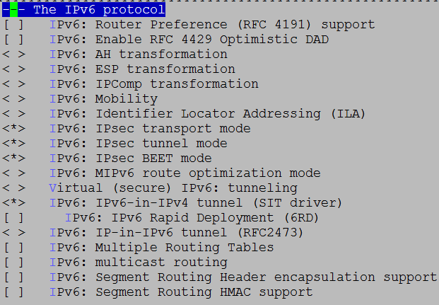
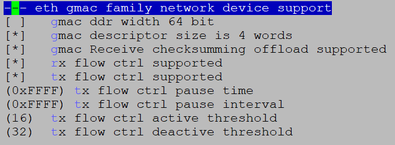

# 前言<a name="ZH-CN_TOPIC_0000002512103553"></a>

**概述<a name="section15117166194219"></a>**

本文档主要是指导使用GMAC、USB和eMMC卡等驱动模块的相关人员，通过一定的步骤和方法对和这些驱动模块相连的外围设备进行控制，主要包括操作准备、操作过程、操作中需要注意的问题以及操作示例。

> **说明：** 
>本文以Hi3403V100描述为例，未有特殊说明，SS927V100与Hi3403V100内容一致。

**产品版本<a name="section10120166104220"></a>**

与本文档相对应的产品版本如下。

<a name="table1612713694220"></a>
<table><thead align="left"><tr id="row13191136144220"><th class="cellrowborder" valign="top" width="31.759999999999998%" id="mcps1.1.3.1.1"><p id="p41918612421"><a name="p41918612421"></a><a name="p41918612421"></a>产品名称</p>
</th>
<th class="cellrowborder" valign="top" width="68.24%" id="mcps1.1.3.1.2"><p id="p14191663422"><a name="p14191663422"></a><a name="p14191663422"></a>产品版本</p>
</th>
</tr>
</thead>
<tbody><tr id="row1819118616425"><td class="cellrowborder" valign="top" width="31.759999999999998%" headers="mcps1.1.3.1.1 "><p id="p81911613425"><a name="p81911613425"></a><a name="p81911613425"></a>Hi3403V100</p>
</td>
<td class="cellrowborder" valign="top" width="68.24%" headers="mcps1.1.3.1.2 "><p id="p91911617427"><a name="p91911617427"></a><a name="p91911617427"></a>V100</p>
</td>
</tr>

</tbody>
</table>

**读者对象<a name="section81264620425"></a>**

本文档（本指南）主要适用于以下工程师：

-   技术支持工程师
-   软件开发工程师

**修改记录<a name="section2467512116410"></a>**

<a name="table1557726816410"></a>
<table><thead align="left"><tr id="row2942532716410"><th class="cellrowborder" valign="top" width="20.72%" id="mcps1.1.4.1.1"><p id="p3778275416410"><a name="p3778275416410"></a><a name="p3778275416410"></a><strong id="b5687322716410"><a name="b5687322716410"></a><a name="b5687322716410"></a>文档版本</strong></p>
</th>
<th class="cellrowborder" valign="top" width="26.119999999999997%" id="mcps1.1.4.1.2"><p id="p5627845516410"><a name="p5627845516410"></a><a name="p5627845516410"></a><strong id="b5800814916410"><a name="b5800814916410"></a><a name="b5800814916410"></a>发布日期</strong></p>
</th>
<th class="cellrowborder" valign="top" width="53.16%" id="mcps1.1.4.1.3"><p id="p2382284816410"><a name="p2382284816410"></a><a name="p2382284816410"></a><strong id="b3316380216410"><a name="b3316380216410"></a><a name="b3316380216410"></a>修改说明</strong></p>
</th>
</tr>
</thead>
<tbody><tr id="row5947359616410"><td class="cellrowborder" valign="top" width="20.72%" headers="mcps1.1.4.1.1 "><p id="p18213152074216"><a name="p18213152074216"></a><a name="p18213152074216"></a>00B01</p>
</td>
<td class="cellrowborder" valign="top" width="26.119999999999997%" headers="mcps1.1.4.1.2 "><p id="p87086249422"><a name="p87086249422"></a><a name="p87086249422"></a>2025-11-15</p>
</td>
<td class="cellrowborder" valign="top" width="53.16%" headers="mcps1.1.4.1.3 "><p id="p492913284427"><a name="p492913284427"></a><a name="p492913284427"></a>第1次临时版本发布</p>
</td>
</tr>
</tbody>
</table>

# Linux<a name="ZH-CN_TOPIC_0000002512063547"></a>


## GMAC操作指南<a name="ZH-CN_TOPIC_0000002512063505"></a>


### 操作示例<a name="ZH-CN_TOPIC_0000002479903676"></a>

> **说明：** 
>默认情况下，相关GMAC模块已全部编入内核，不需要执行加载操作，请直接跳至配置IP地址步骤。

内核下使用网口的操作涉及到以下几个方面：

-   GMAC模块支持TSO功能且默认是打开的，如果用户希望关闭TSO功能，可通过工具ethtool将其关闭。开关TSO功能的方法如下：

    -   关闭TSO：./ethtool –K eth0 tx off
    -   打开TSO：./ethtool –K eth0 tx on

    TSO（TCP Segment Offload）功能简介：

    -   TSO \(TCP Segmentation Offload\)是一种利用网卡分割大数据包，减小CPU负荷的一种技术，也被叫做LSO \(Large Segment Offload\)，如果数据包的类型只能是TCP，则被称之为TSO，如果硬件支持TSO功能的话，也需要同时支持硬件的TCP校验计算和分散-聚集 \(Scatter Gather\) 功能。TSO的实现，其实是由软件和硬件结合起来完成的，具体说来，硬件能够对大的数据包进行分片，并对每个分片附着相关的头部。
    -   芯片使用TSO时，会把一部分由CPU处理的工作转移到由网卡来处理，减轻CPU的压力，提高性能。

-   配置ip地址和子网掩码

    ```
    ifconfig eth0 xxx.xxx.xxx.xxx netmask xxx.xxx.xxx.xxx up
    ```

-   设置缺省网关

    ```
    route add default gw xxx.xxx.xxx.xxx
    ```

-   mount nfs

    ```
    mount -t nfs -o nolock xxx.xxx.xxx.xxx:/your/path /mount-dir
    ```

-   shell下使用tftp上传下载文件

    前提是在server端有tftp服务软件在运行。

    -   下载文件：tftp -r XX.file serverip -g

        其中：XX.file为需要下载的文件，serverip需要下载的文件所在的server的ip地址。

    -   上传文件：tftp -l xx.file remoteip –p

        其中，xx.file为需要上传的文件，remoteip文件需要上传到的server的ip地址。

### IPv6说明<a name="ZH-CN_TOPIC_0000002479903632"></a>

发布包中默认关闭IPv6功能。如果要支持IPv6，需要修改内核选项，并重新编译内核。具体操作如下：

```
cd open_source/linux/linux-4.19.y
cp arch/arm64/configs/ss928v100_defconfig .config
make ARCH=arm64 CROSS_COMPILE=aarch64-mix210-linux- menuconfig
```

进入如下目录，将该页面选项配置如[图1](#_Toc498609228)所示。

```
[*] Networking support  --->
    Networking options  --->
        <*>   The IPv6 protocol  --->
```

**图 1**  IPv6 Protocol配置示意图<a name="_Toc498609228"></a>  


IPv6环境配置如下：

-   配置ip地址及缺省网关

    ```
    ip -6  addr add <ipv6address>/<ipv6_prefixlen> dev <port>
    ```

    ```
    示例：ip -6 addr add 2001:da8:207::9402/64 dev eth0
    ```

-   Ping某个- IPv6地址

    ```
    ping -6  <ipv6address>
    示例：ping -6  2001:da8:207::9403
    ```

### PHY地址配置<a name="ZH-CN_TOPIC_0000002512063519"></a>

-   U-boot下配置方式

    U-boot下可通过修改U-boot配置文件include/configs/ss928v100.h中宏定义 CONFIG\_GMAC\_PHY0\_ADDR和CONFIG\_GMAC\_PHY1\_ADDR的值来配置不同的PHY地址。

-   Kernel下配置方式

    在Kernel下可通过修改 arch/arm64/boot/dts/vendor下的dts配置文件 ss928v100-demb.dts配置PHY地址。如[图1](#_Toc498609229)所示，“reg = <1\>”中的数值1表示PHY地址。

**图 1**  PHY地址配置节点示意图<a name="_Toc498609229"></a>  


### IEEE 802.3x流控功能配置<a name="ZH-CN_TOPIC_0000002480063688"></a>


#### 流控功能描述<a name="ZH-CN_TOPIC_0000002512103529"></a>

GMAC网络支持IEEE 802.3x定义的流控功能，能够发送流控帧和接收处理对端的流控帧。

-   流控帧发送功能：

    在接收方向，若当前接收描述子队列出现紧张，可能无法满足已收到的数据包全部送达软件，则会发送流控帧至对端，告知对端暂停一定时间不发包。

-   流控帧的接收功能：

    当接收到流控帧，GMAC会根据帧内的流控时间字段进行延迟发送，等待计时到达流控时间后，则会再次启动发送，或在等待过程中收到了对端发送的流控时间为0的流控帧，同样会再次启动发送。

#### 流控功能配置<a name="ZH-CN_TOPIC_0000002512103583"></a>

流控功能配置方法如下：

```
cd open_source/linux/linux-4.19.y
cp arch/arm64/configs/ss928v100_defconfig .config
make ARCH=arm64 CROSS_COMPILE=aarch64-mix210-linux- menuconfig
```

对应选项如下：

```
Device Drivers  --->
  [*] Network device support  --->
    [*]   Ethernet driver support  --->
      [*]    Vendor devices
        <*>     eth gmac family network device support  --->
```



用户可配置的流控参数如下：

-   CONFIG\_RX\_FLOW\_CTRL\_SUPPORT接收流控帧功能是否使能；
-   CONFIG\_TX\_FLOW\_CTRL\_SUPPORT发送流控帧功能是否使能；
-   CONFIG\_TX\_FLOW\_CTRL\_ACTIVE\_THRESHOLD发送流控激活水线，当接收队列可用描述子个数小于该值，会启动逻辑发送流控帧的流程；
-   CONFIG\_TX\_FLOW\_CTRL\_DEACTIVE\_THRESHOLD发送流控撤销水线，当接收队列可用描述子个数大于或者等于该值同时正处于流控状态时，解除当前流控状态。

> **说明：** 
>流控功能激活水线值必须小于撤销水线。

#### ethtool配置接口<a name="ZH-CN_TOPIC_0000002480063656"></a>

用户可以通过标准ethtool工具接口进行流控功能的使能。

ethtool  –a  eth0 命令查看eth0口流控功能状态；打印如下：

```
# ./ethtool -a eth0
Pause parameters for eth0:
Autonegotiate:  on
RX:             on
TX:             on
```

其中，RX流控是打开的，TX流控是打开的；

用户可以通过以下命令打开或关闭TX流控：

```
# ./ethtool -A eth0 tx off（关闭TX流控）
# ./ethtool -A eth0 tx on（打开TX流控）
```

### Ipfrag 参数配置<a name="ZH-CN_TOPIC_0000002512063515"></a>

当接收大带宽、报文长度较大的 UDP 数据流，且网络不稳定的情况下，可能导致分片内存被耗尽，协议栈主动丢包，建议适当增大IP 参数 ipfrag\_high\_thresh、ipfrag\_low\_thresh 的值，当前的默认值为 4194304、3145728。

修改方法：xxx 为要设置的值

\~ \# echo xxx \> /proc/sys/net/ipv4/ipfrag\_high\_thresh

\~ \# echo xxx \> /proc/sys/net/ipv4/ipfrag\_low\_thresh

参数说明：

ipfrag\_high\_thresh 参数用来设置内核中可用来做 IP 分段重组的最大内存值。当达到该最大边界时, 负责分段重组的 handler 将会丢弃所有待处理的 ip 分段，直到占用的内存恢复到最小边界值 ipfrag\_low\_thresh。

### 双网口配置<a name="ZH-CN_TOPIC_0000002512063533"></a>

当应用场景需要配置双网口的时候，默认sdk和demo板是不支持双网口的，需要客户自行配置双网口。下述配置例子以GMAC0为千兆网卡\(rgmii\)，phy地址为1，GMAC1为百兆网卡\(rmii\)，phy地址为3为例，具体MAC模式，phy地址根据客户自己的硬件设计来：

GMAC0	1000M\(rgmii\) phy 1

GMAC1	100M\(rmii\) phy 3

U-boot修改点：

进入U-boot目录：vim include/configs/ss928v100.h

修改后值：

```
/*Network configuration*/
#define CONFIG_PHY_GIGE
#ifdef CONFIG_GMACV300_ETH
#define CONFIG_GMAC_NUMS        2
#define CONFIG_GMAC_PHY0_ADDR     1
#define CONFIG_GMAC_PHY0_INTERFACE_MODE       2 /* rgmii 2, rmii 1, mii 0 */
#define CONFIG_GMAC_PHY1_ADDR     3
#define CONFIG_GMAC_PHY1_INTERFACE_MODE       1 /* rgmii 2, rmii 1, mii 0 */
#define CONFIG_GMAC_DESC_4_WORD
#define CONFIG_SYS_FAULT_ECHO_LINK_DOWN 1
#endif
```

Linux修改点：

进入linux目录：vim arch/arm64/boot/dts/vendor/ss928v100-demb.dts

修改后值：

```
&mdio {
        ethphy: ethernet-phy@1 {
                reg = <1>;
        };
};
&mdio1 {
        ethphy1: ethernet-phy@3 {
                reg = <3>;
        };
};
 
&gmac {
        phy-handle = <&ethphy>;
        phy-mode = "rgmii";
};
 
&gmac1 {
        phy-handle = <&ethphy1>;
        phy-mode = "rmii";
};
```

## USB操作指南<a name="ZH-CN_TOPIC_0000002512063507"></a>


### 操作准备<a name="ZH-CN_TOPIC_0000002480063646"></a>

当前产品的USB，均提供最高USB3.0速率。其主从模式（Host/Device）为：USB3\_0口仅支持USB Host模式；USB3\_1口可以在Host模式或者Deivce模式中二选一使用，默认SDK版本使用Device模式。

USB的操作准备如下：

-   U-boot和Linux内核使用SDK发布的U-boot和kernel。
-   文件系统可以使用本地文件系统jffs2、ext4或cramfs，也可以使用NFS。

### 操作过程<a name="ZH-CN_TOPIC_0000002512063493"></a>


#### Uboot 下USB Host操作过程<a name="ZH-CN_TOPIC_0000002480063630"></a>

> **说明：** 
>当前uboot下只支持纯存储类设备，如：U盘，硬盘等。不支持带CD-ROM分区的设备，对接PC看设备盘符，如果有光盘驱动盘符即为有CD-ROM分区。

编译uboot下USB相关的驱动。

1.  进入menuconfig的如下路径，确认以下驱动配置全部选上，默认配置是全选。

    ```
    Command line interface  --->
             Device access commands  --->
                  [*] usb
    Device Drivers  --->
             [*] vendor usb phy driver
             [*] USB support  --->
                  [*]   xHCI HCD (USB 3.0) support
                  [*]   USB Mass Storage support
    ```

2.  编译命令：

    ```
    make ARCH=arm CROSS_COMPILE=aarch64-mix210-linux- menuconfig
    make ARCH=arm CROSS_COMPILE=aarch64-mix210-linux- -j 20
    cp ../../../osdrv/tools/pc/uboot_tools/reg_info.bin .reg
    make ARCH=arm CROSS_COMPILE=aarch64-mix210-linux- u-boot-z.bin
    ```

    编译生成的 u-boot-ss928v100.bin即为可用的u-boot镜像。

#### 内核下USB Host操作过程<a name="ZH-CN_TOPIC_0000002512103591"></a>

1.  启动单板，加载jffs2、ext4或cramfs文件系统，也可以使用NFS。
2.  默认USB Host相关模块已经全部编入内核，不需要再执行加载命令，就可以对U盘、鼠标或者键盘进行相关操作。具体操作请参见“2.3 操作示例”。下面列出所有USB Host相关驱动：
    -   文件系统和存储设备相关模块
        -   vfat
        -   ext4
        -   scsi\_mod
        -   sd\_mod
        -   nls\_ascii
        -   nls\_iso8859-1

    -   键盘相关模块
        -   evdev
        -   usbhid

    -   鼠标相关模块
        -   mousedev
        -   usbhid
        -   evdev

    -   USB Host模块
        -   xhci-hcd
        -   xhci-plat-hcd
        -   usb-storage
        -   phy-vendor-usb3

#### 内核下USB Device操作过程<a name="ZH-CN_TOPIC_0000002480063612"></a>

1.  编译USB Device相关的内核驱动模块。

    -   进入menuconfig的如下路径，USB device作为虚拟u盘、虚拟网口、虚拟串口、_录像机_的配置如下。

        ```
        Device Drivers  --->
                 <*> Multimedia support  --->
                          [*]   Cameras/video grabbers support 
                          [*]   Media USB Adapters  --->
                                   <*>   USB Video Class (UVC)
                                   [*]     UVC input events device support
                          [*]   V4L platform devices  ---> 
                 <*> Sound card support  --->
                          <*>   Advanced Linux Sound Architecture  --->
                                   [*]   USB sound devices  --->  
                 [*] USB support  --->
                          <*>  DesignWare USB3 DRD Core Support
                                   DWC3 Mode Selection (Gadget only mode)  --->
                          <*>  USB Gadget Support  --->
                                   <*>   USB Gadget functions configurable through configfs
                                             [*]   Abstract Control Model (CDC ACM)
                                             [*]   RNDIS
                                             [*]   Mass storage
                                             [*]   Audio Class 1.0
                                             [*]   USB Webcam function
                 PHY Subsystem  --->
                          <*>  VENDOR USB support  --->
                                   [*]    Vendor USB PHY driver
                                   [*]    Vendor USB related configuration  --->
                                             [ ] USB DRD0 Mode Select HOST
                                             [*] USB DRD0 Mode Select DEVICE
        ```

    > **说明：** 
    >DRD0只能host/device二选一。即上述配置中的USB DRD0 Mode Select HOST和USB DRD0 Mode Select DEVICE不能同时选择。
    >并非所有芯片均有device模式，具体芯片规格请查看芯片手册或咨询技术支持。

    -   编译内核模块，生成.ko文件。

        ```
        make ARCH=arm64 CROSS_COMPILE=aarch64-mix210-linux- modules –j 32
        ```

        注意：在编译模块时，要先编译内核，编译内核命令为：

        ```
        make ARCH=arm64 CROSS_COMPILE=aarch64-mix210-linux- uImage –j 32
        ```

2.  启动单板，加载jffs2、ext4或cramfs文件系统，也可以使用NFS。
3.  单板作为Device时，需要加载相关环境变量和配置相关脚本。具体操作请参见“操作示例”。

### 操作示例<a name="ZH-CN_TOPIC_0000002480063640"></a>


#### Uboot下U盘操作示例<a name="ZH-CN_TOPIC_0000002512103597"></a>


##### 上电前插入设备<a name="ZH-CN_TOPIC_0000002512063501"></a>

> **说明：** 
>Uboot下不支持热插拔，系统上电之前需要将设备插入U口。

单板上电，进入uboot命令行，输入命令：usb start，观察是否识别成功。

-   U口插入高速/超速u盘正常情况下串口打印为：

    ```
    # usb start
    USB0:   Register 1000140 NbrPorts 1
    Starting the controller
    USB XHCI 1.10
    scanning bus 0 for devices... 2 USB Device(s) found
    scanning usb for storage devices... 1 Storage Device(s) found
    ```

> **说明：** 
>若usb start后出现识别枚举报错，如：Device not responding to set address等，或者usb start后出现完全无法检测到设备，请在uboot命令行执行：setenv usb\_pgood\_delay XXX，该设置针对某些预热较慢的设备，增加timeout等待设备上电稳定，XXX可根据当前设备的预热快慢设置合理的值，建议取值范围为1000-3000。

识别完成后，再输入命令：usb tree，查看识别速率。

-   U口插入高速/超速u盘正常情况下串口打印为：

    ```
    # usb tree
    USB device tree:
    1  Hub (5 Gb/s, 0mA)
    |  U-Boot XHCI Host Controller
    |
    +-2  Mass Storage (480 Mb/s, 250mA)
    Generic Mass Storage Device 121220130416
    ```

##### 初始化及应用<a name="ZH-CN_TOPIC_0000002512103561"></a>

识别完成以后，进行以下操作。

1.  查看设备信息。

    Uboot命令行执行：usb info \[dev\]，可以查看当前控制器上接的所有设备的设备信息，可在命令后加参数查看单个具体设备的信息，如：usb info 2，正常查看示例如下：

    ```
     # usb info 2
    config for device 2
    2: Mass Storage,  USB Revision 2.0
      - Generic Mass Storage B92AAF26
      - Class: (from Interface) Mass Storage
      - PacketSize: 64  Configurations: 1
      - Vendor: 0x058f  Product 0x6387 Version 1.0
        Configuration: 1
        - Interfaces: 1 Bus Powered 200mA
          Interface: 0
          - Alternate Setting 0, Endpoints: 2
          - Class Mass Storage, Transp. SCSI, Bulk only
          - Endpoint 1 Out Bulk MaxPacket 512
          - Endpoint 2 In Bulk MaxPacket 512
    ```

1.  对U盘进行读操作。

    Uboot命令行执行：usb read addr blk\# cnt，使用命令将起始地址为blk大小为cnt的数据读到DDR地址addr的位置。正常读操作完成示例如下：

    ```
     # usb read 0x82000000 0 2000
    USB read: device 0 block # 0, count 8192 ... 8192 blocks read: OK
    ```

1.  对U盘进行写操作。

    Uboot命令行执行：usb write addr blk\# cnt，使用命令将DDR地址addr的cnt大小的数据写到U盘的blk位置。正常读操作完成示例如下：

    ```
     # usb write 0x82000000 2000 2000
    ```

    ```
    USB write: device 0 block # 8192, count 8192 ... 8192 blocks write: OK
    ```

#### 内核下U盘操作示例<a name="ZH-CN_TOPIC_0000002512103535"></a>


##### 插入检测<a name="ZH-CN_TOPIC_0000002480063692"></a>

直接插入U盘，观察是否枚举成功。

-   USB口插入高速U盘的正常串口打印为：

    ```
    ~ # usb 1-1: new high-speed USB device number 2 using xhci-hcd
    scsi2 : usb-storage 1-1:1.0
    scsi 2:0:0:0: Direct-Access           1.00 PQ: 0 ANSI: 4
    sd 2:0:0:0: [sda] 15131636 512-byte logical blocks: (7.74 GB/7.21 GiB)
    sd 2:0:0:0: [sda] Write Protect is off
    sd 2:0:0:0: [sda] Write cache: disabled, read cache: enabled, doesn't support DPO or FUA
    sda: sda1
    sd 2:0:0:0: [sda] Attached SCSI removable disk
    ```

-   USB口插入超速U盘正常串口打印为：

    ```
    ~ # usb 2-1: new SuperSpeed  USB device number 3 using xhci-hcd
    scsi2 : usb-storage 2-1:1.0
    scsi 2:0:0:0: Direct-Access           1.00 PQ: 0 ANSI: 4
    sd 2:0:0:0: [sda] 15131636 512-byte logical blocks: (7.74 GB/7.21 GiB)
    sd 2:0:0:0: [sda] Write Protect is off
    sd 2:0:0:0: [sda] Write cache: disabled, read cache: enabled, doesn't support DPO or FUA
    sda: sda1
    sd 2:0:0:0: [sda] Attached SCSI removable disk
    ```

其中：sda1表示U盘或移动硬盘上的第一个分区，当存在多个分区时，会出现sda1、sda2、sda3等字样。

##### 初始化及应用<a name="ZH-CN_TOPIC_0000002480063658"></a>

模块插入完成后，进行如下操作：

> **说明：** 
>sdXY中X代表磁盘号，Y代表分区号，请根据具体系统环境进行修改。

-   分区命令操作的具体设备节点为sdX，示例：$ fdisk /dev/sda
-   用mkdosfs工具格式化的具体分区为sdXY：\~ $ mkdosfs –F 32 /dev/sda1
-   挂载的具体分区为sdXY：\~ $ mount -t vfat /dev/sda1 /mnt

1.  查看分区信息。
    -   运行命令“ls /dev”查看系统设备文件，若没有分区信息sdXY，表示还没有分区，请参见“用fdisk工具分区”进行分区后，进入步骤 2。
    -   若有分区信息sdXY，则已经检测到盘，并已经进行分区，进入步骤 2。

2.  查看格式化信息。
    -   若没有格式化，请参见“  用mkdosfs工具格式化”进行格式化后，进入步骤 3。
    -   若已格式化，进入步骤 3。

3.  挂载目录，请参见“挂载目录”。
4.  对硬盘进行读写操作，请参见“读写文件”。

#### 内核下键盘操作示例<a name="ZH-CN_TOPIC_0000002512103585"></a>

键盘操作过程如下：

1.  插入模块。

    插入键盘相关模块后，键盘会在/dev/input目录下生成event0节点。

2.  接收键盘输入。

    执行命令：cat /dev/input/event0

    然后在USB键盘上敲击，可以看到屏幕有输出。

#### 内核下鼠标操作示例<a name="ZH-CN_TOPIC_0000002479903684"></a>

鼠标操作过程如下：

1.  插入模块。

    插入鼠标相关模块后，鼠标会在/dev/input目录下生成mouse0节点。

2.  接收鼠标输入。

    执行命令：cat /dev/input/mouse0

3.  进行鼠标操作（点击、滑动等），可以看到串口打印出相应码值。

#### 内核下虚拟U盘操作示例<a name="ZH-CN_TOPIC_0000002512103525"></a>

单板作为虚拟U盘时，以Flash和SD卡做存储介质为例，操作过程如下：

1.  配置环境变量和脚本。
    -   以Flash作为虚拟U盘的存储介质，操作为：

        ```
        export VID="0x1D6B"
        export PID="0x0001"
        export MANUFACTURER="Vendor"
        export PRODUCT="MassStorage"
        export SERIALNUMBER="123456789012"
        export MEMORY=/dev/mtdblockX
        ./Config_Storage.sh
        ```

        其中，mtdblockX为Flash的第X个分区，请用户根据具体情况选择。

    -   以SD卡作为虚拟U盘的存储介质，操作为：

        ```
        export VID="0x1D6B"
        export PID="0x0001"
        export MANUFACTURER=" Vendor"
        export PRODUCT="MassStorage"
        export SERIALNUMBER="123456789012"
        export MEMORY=/dev/mmcblk0pX
        ./Config_Storage.sh
        ```

        其中，mmcblk0pX为SD卡的第X个分区，请用户根据具体情况选择。

        > **说明：** 
        >1.  上述export所修饰的变量用户可自主适配，变量所表示的含义如下：
        >    -   VID表示厂商ID，使用时必须修改；
        >    -   PID表示产品ID，使用时必须修改；
        >    -   MANUFACTURER表示厂商名，默认发布是Vendor，使用时必须修改；
        >    -   PRODUCT表示产品名，使用时请按需求修改；
        >    -   SERIALNUMBER表示产品序列号，使用时请按需求修改；
        >2.  Config\_Storage.sh为启动mass storage所进行的必要操作，用户可不用修改。
        >    Config\_Storage.sh见附录：虚拟U盘。
        >1.  若要卸载存储功能模块，执行Disable\_Storage.sh即可，脚本内容用户可不用修改。
        >    Disable\_Storage.sh见附录：虚拟U盘。

2.  通过USB将单板与PC端相连，此时PC端可识别到盘符。至此，单板可以当做真正的U盘使用。

#### 内核下虚拟网口操作示例<a name="ZH-CN_TOPIC_0000002480063670"></a>

单板作为虚拟网口设备，操作过程如下：

1.  配置环境变量和脚本。

    ```
    export VID="0x1D6B"
    export PID="0x0002"
    export MANUFACTURER="Vendor"
    export PRODUCT="Ethernet"
    export SERIALNUMBER="123456789012"
    ./Config_Ether.sh
    ```

    > **说明：** 
    >1.  上述export所修饰的变量用户可自主适配，变量所表示的含义如下：
    >    -   VID表示厂商ID，使用时必须修改；
    >    -   PID表示产品ID，使用时必须修改；
    >    -   MANUFACTURER表示厂商名，默认发布是Vendor，使用时必须修改；
    >    -   PRODUCT表示产品名，使用时必须修改；
    >    -   SERIALNUMBER表示产品序列号，使用时请按需求修改；
    >2.  Config\_Ether.sh为启动虚拟网口所进行的必要操作，用户可不用修改。
    >    Config\_Ether.sh见附录：虚拟网口。
    >3.  若要卸载网口功能模块，执行Disable\_ Ether.sh即可，脚本内容用户可不用修改。
    >    Disable\_ Ether.sh见附录：虚拟网口。

2.  通过USB数据线将单板与Host pc端相连，若pc系统为win10系统，pc端会自动加载驱动，在设备管理器的网络适配器部分可以看到Remote NDIS Compatible Device \#x设备，但部分pc可能会识别为串口设备，解决方法见步骤4后的说明；若pc系统为win7系统，第一次可能会失败，需要自行安装驱动，方法为：
    -   右击计算机，进入管理界面；
    -   打开设备管理器；
    -   点击其他设备会看到Ethernet，双击；
    -   打开驱动程序界面，点击更新驱动程序，进入浏览计算机以查找驱动程序软件\(R\)；
    -   把路径指向linux.inf所在的目录，将下面文件下载到本地目录，点击下一步，计算机会自动进行安装驱动程序，安装成功后，点击网络适配器会看到Ethernet Linux USB Ethernet /RNDIS Gadget \#x。

        linux.inf文件取自发布包路径为：\{SDK\_PATH\}/open\_source/linux/linux-4.19.y/Documentation/usb/

3.  在单板端配置IP，命令为：ifconfig usb0 xx.xx.xx.xx netmask 255.255.xxx.0;route add default gw xx.xx.xx.xx。
4.  当单板和pc通过USB数据线相连时，会在PC端生成USB网络节点，具体位置：打开网络和共享中心--\>更改适配器设置---\>Linux USB Ethernet /RNDIS Gadget \#x。对该节点设置网络IP，则单板和PC可以相互ping通，并且通信。

    > **说明：** 
    >Config\_Ether.sh脚本已经针对win10系统进行了适配，但发现部分win10pc会将网口设备识别为串口设备，解决方法为将RNDIS.cat、RNDIS.inf驱动文件放到本地目录，在设备管理器对新增的串口设备进行驱动更新，方法同步骤中win7pc更新驱动方法，更新后网口设备即可正常使用。
    >win10pc需要关闭数字签名后才可以更新驱动，关闭方法可在网上搜索，此处不再赘述。
    >RNDIS.cat和RNDIS.inf文件可通过网络搜索获取。

#### 内核下虚拟串口操作示例<a name="ZH-CN_TOPIC_0000002512103569"></a>

单板作为虚拟串口设备，操作过程如下：

1.  配置环境变量和脚本。

    ```
    export VID="0x1D6B"
    export PID="0x0003"
    export MANUFACTURER="Vendor"
    export PRODUCT="SerialGadget"
    export SERIALNUMBER="123456789012"
    ./Config_Serial.sh
    ```

    > **说明：** 
    >1.  上述export所修饰的变量用户可自主适配，变量所表示的含义如下：
    >    -   VID表示厂商ID，使用时必须修改；
    >    -   PID表示产品ID，使用时必须修改；
    >    -   MANUFACTURER表示厂商名，默认发布是Vendor使用时必须修改；
    >    -   PRODUCT表示产品名，使用时必须修改；
    >    -   SERIALNUMBER表示产品序列号，使用时请按需求修改；
    >1.  Config\_Serial.sh为启动虚拟串口所进行的必要操作，用户可不用修改。
    >    Config\_Serial.sh见附录：虚拟串口。
    >2.  若要卸载串口功能模块，执行Disable\_Serial.sh即可，脚本内容用户可不用修改。
    >    Disable\_Serial.sh见附录：虚拟串口。

2.  在单板端，进行如下操作：

    ```
    vi /etc/inittab
    #::respawn:/sbin/getty -L ttyS000 115200 vt100 -n root -I "Auto login as root ..."
    ::respawn:/sbin/getty -L ttyGS0 115200 vt100 -n root -I "Auto login as root ..."
    ```

    然后重启单板。

3.  通过USB数据线将单板与Host pc端相连，

    若pc系统为win10系统，pc端会自动加载驱动。

    若pc系统为win7系统，第一次可能会失败，需要自行安装驱动，方法为：

    -   右击计算机，进入管理界面；
    -   打开设备管理器；
    -   点击其他设备会看到名为PRODUCT变量的设备（如SerialGadget），双击；
    -   打开驱动程序界面，点击更新驱动程序，进入浏览计算机以查找驱动程序软件\(R\)。
    -   把路径指向linux-cdc-acm.inf所在的目录，将下面文件下载到本地目录，点击下一步，计算机会自动进行安装驱动程序，安装成功后，点击端口（COM和LPT），会看到Gadget Serial（COMx）设备，若pc为win10系统，不需要自行安装驱动即可在端口（COM和LPT）看到USB串行设备（COMx）设备。

        linux-cdc-acm.inf文件取自发布包路径为：\{SDK\_PATH\}/open\_source/linux/linux-4.19.y/Documentation/usb/

#### 内核下录像机操作示例<a name="ZH-CN_TOPIC_0000002512103551"></a>

**表 1**  UVC解决方案特性表

<a name="table6465725141113"></a>
<table><thead align="left"><tr id="row124654254114"><th class="cellrowborder" valign="top" width="5.129487051294871%" id="mcps1.2.5.1.1"><p id="p291729201211"><a name="p291729201211"></a><a name="p291729201211"></a>编号</p>
</th>
<th class="cellrowborder" valign="top" width="18.51814818518148%" id="mcps1.2.5.1.2"><p id="p1846572571112"><a name="p1846572571112"></a><a name="p1846572571112"></a>特性</p>
</th>
<th class="cellrowborder" valign="top" width="33.826617338266175%" id="mcps1.2.5.1.3"><p id="p446516257119"><a name="p446516257119"></a><a name="p446516257119"></a>使用说明</p>
</th>
<th class="cellrowborder" valign="top" width="42.52574742525748%" id="mcps1.2.5.1.4"><p id="p174659259115"><a name="p174659259115"></a><a name="p174659259115"></a>备注</p>
</th>
</tr>
</thead>
<tbody><tr id="row123811666122"><td class="cellrowborder" valign="top" width="5.129487051294871%" headers="mcps1.2.5.1.1 "><p id="p2912293126"><a name="p2912293126"></a><a name="p2912293126"></a>1</p>
</td>
<td class="cellrowborder" valign="top" width="18.51814818518148%" headers="mcps1.2.5.1.2 "><p id="p11381166111214"><a name="p11381166111214"></a><a name="p11381166111214"></a>支持的协议版本(UVC 1.1/1.5)</p>
</td>
<td class="cellrowborder" valign="top" width="33.826617338266175%" headers="mcps1.2.5.1.3 "><p id="p238116141215"><a name="p238116141215"></a><a name="p238116141215"></a>支持UVC 1.1和UVC 1.5协议，可通过配置脚本参数切换。</p>
</td>
<td class="cellrowborder" valign="top" width="42.52574742525748%" headers="mcps1.2.5.1.4 "><p id="p0381126181212"><a name="p0381126181212"></a><a name="p0381126181212"></a>默认使用UVC 1.1版本，切换无需重新编译烧写内核，下文配置脚本说明阐述切换方法。</p>
</td>
</tr>

</tbody>
</table>

【返回值】

<a name="table1093mcpsimp"></a>
<table><thead align="left"><tr id="row1098mcpsimp"><th class="cellrowborder" valign="top" width="50%" id="mcps1.1.3.1.1"><p id="p1100mcpsimp"><a name="p1100mcpsimp"></a><a name="p1100mcpsimp"></a>返回值</p>
</th>
<th class="cellrowborder" valign="top" width="50%" id="mcps1.1.3.1.2"><p id="p1102mcpsimp"><a name="p1102mcpsimp"></a><a name="p1102mcpsimp"></a>描述</p>
</th>
</tr>
</thead>
<tbody><tr id="row1104mcpsimp"><td class="cellrowborder" valign="top" width="50%" headers="mcps1.1.3.1.1 "><p id="p1106mcpsimp"><a name="p1106mcpsimp"></a><a name="p1106mcpsimp"></a>0</p>
</td>
<td class="cellrowborder" valign="top" width="50%" headers="mcps1.1.3.1.2 "><p id="p1108mcpsimp"><a name="p1108mcpsimp"></a><a name="p1108mcpsimp"></a>操作成功</p>
</td>
</tr>
<tr id="row1109mcpsimp"><td class="cellrowborder" valign="top" width="50%" headers="mcps1.1.3.1.1 "><p id="p1111mcpsimp"><a name="p1111mcpsimp"></a><a name="p1111mcpsimp"></a>其它</p>
</td>
<td class="cellrowborder" valign="top" width="50%" headers="mcps1.1.3.1.2 "><p id="p1113mcpsimp"><a name="p1113mcpsimp"></a><a name="p1113mcpsimp"></a>操作失败</p>
</td>
</tr>
</tbody>
</table>

#### uart\_suspend<a name="ZH-CN_TOPIC_0000002479903688"></a>

【描述】

UART设备挂起。

【语法】

```
int uart_suspend(void *data);
```

【参数】

<a name="table1120mcpsimp"></a>
<table><thead align="left"><tr id="row1126mcpsimp"><th class="cellrowborder" valign="top" width="15%" id="mcps1.1.4.1.1"><p id="p1128mcpsimp"><a name="p1128mcpsimp"></a><a name="p1128mcpsimp"></a>参数名称</p>
</th>
<th class="cellrowborder" valign="top" width="69%" id="mcps1.1.4.1.2"><p id="p1130mcpsimp"><a name="p1130mcpsimp"></a><a name="p1130mcpsimp"></a>描述</p>
</th>
<th class="cellrowborder" valign="top" width="16%" id="mcps1.1.4.1.3"><p id="p1132mcpsimp"><a name="p1132mcpsimp"></a><a name="p1132mcpsimp"></a>输入/输出</p>
</th>
</tr>
</thead>
<tbody><tr id="row1134mcpsimp"><td class="cellrowborder" valign="top" width="15%" headers="mcps1.1.4.1.1 "><p id="p1136mcpsimp"><a name="p1136mcpsimp"></a><a name="p1136mcpsimp"></a>data</p>
</td>
<td class="cellrowborder" valign="top" width="69%" headers="mcps1.1.4.1.2 "><p id="p1138mcpsimp"><a name="p1138mcpsimp"></a><a name="p1138mcpsimp"></a>未使用（保留），传入NULL即可</p>
</td>
<td class="cellrowborder" valign="top" width="16%" headers="mcps1.1.4.1.3 "><p id="p1140mcpsimp"><a name="p1140mcpsimp"></a><a name="p1140mcpsimp"></a>无</p>
</td>
</tr>
</tbody>
</table>

【返回值】

<a name="table1142mcpsimp"></a>
<table><thead align="left"><tr id="row1147mcpsimp"><th class="cellrowborder" valign="top" width="50%" id="mcps1.1.3.1.1"><p id="p1149mcpsimp"><a name="p1149mcpsimp"></a><a name="p1149mcpsimp"></a>返回值</p>
</th>
<th class="cellrowborder" valign="top" width="50%" id="mcps1.1.3.1.2"><p id="p1151mcpsimp"><a name="p1151mcpsimp"></a><a name="p1151mcpsimp"></a>描述</p>
</th>
</tr>
</thead>
<tbody><tr id="row1153mcpsimp"><td class="cellrowborder" valign="top" width="50%" headers="mcps1.1.3.1.1 "><p id="p1155mcpsimp"><a name="p1155mcpsimp"></a><a name="p1155mcpsimp"></a>0</p>
</td>
<td class="cellrowborder" valign="top" width="50%" headers="mcps1.1.3.1.2 "><p id="p1157mcpsimp"><a name="p1157mcpsimp"></a><a name="p1157mcpsimp"></a>操作成功</p>
</td>
</tr>
<tr id="row1158mcpsimp"><td class="cellrowborder" valign="top" width="50%" headers="mcps1.1.3.1.1 "><p id="p1160mcpsimp"><a name="p1160mcpsimp"></a><a name="p1160mcpsimp"></a>其它</p>
</td>
<td class="cellrowborder" valign="top" width="50%" headers="mcps1.1.3.1.2 "><p id="p1162mcpsimp"><a name="p1162mcpsimp"></a><a name="p1162mcpsimp"></a>操作失败</p>
</td>
</tr>
</tbody>
</table>

#### uart\_resume<a name="ZH-CN_TOPIC_0000002512103573"></a>

【描述】

UART设备唤醒。

【语法】

```
int uart_resume(void *data);
```

【参数】

<a name="table1169mcpsimp"></a>
<table><thead align="left"><tr id="row1175mcpsimp"><th class="cellrowborder" valign="top" width="15%" id="mcps1.1.4.1.1"><p id="p1177mcpsimp"><a name="p1177mcpsimp"></a><a name="p1177mcpsimp"></a>参数名称</p>
</th>
<th class="cellrowborder" valign="top" width="69%" id="mcps1.1.4.1.2"><p id="p1179mcpsimp"><a name="p1179mcpsimp"></a><a name="p1179mcpsimp"></a>描述</p>
</th>
<th class="cellrowborder" valign="top" width="16%" id="mcps1.1.4.1.3"><p id="p1181mcpsimp"><a name="p1181mcpsimp"></a><a name="p1181mcpsimp"></a>输入/输出</p>
</th>
</tr>
</thead>
<tbody><tr id="row1183mcpsimp"><td class="cellrowborder" valign="top" width="15%" headers="mcps1.1.4.1.1 "><p id="p1185mcpsimp"><a name="p1185mcpsimp"></a><a name="p1185mcpsimp"></a>data</p>
</td>
<td class="cellrowborder" valign="top" width="69%" headers="mcps1.1.4.1.2 "><p id="p1187mcpsimp"><a name="p1187mcpsimp"></a><a name="p1187mcpsimp"></a>未使用（保留），传入NULL即可</p>
</td>
<td class="cellrowborder" valign="top" width="16%" headers="mcps1.1.4.1.3 "><p id="p1189mcpsimp"><a name="p1189mcpsimp"></a><a name="p1189mcpsimp"></a>无</p>
</td>
</tr>
</tbody>
</table>

【返回值】

<a name="table1191mcpsimp"></a>
<table><thead align="left"><tr id="row1196mcpsimp"><th class="cellrowborder" valign="top" width="50%" id="mcps1.1.3.1.1"><p id="p1198mcpsimp"><a name="p1198mcpsimp"></a><a name="p1198mcpsimp"></a>返回值</p>
</th>
<th class="cellrowborder" valign="top" width="50%" id="mcps1.1.3.1.2"><p id="p1200mcpsimp"><a name="p1200mcpsimp"></a><a name="p1200mcpsimp"></a>描述</p>
</th>
</tr>
</thead>
<tbody><tr id="row1202mcpsimp"><td class="cellrowborder" valign="top" width="50%" headers="mcps1.1.3.1.1 "><p id="p1204mcpsimp"><a name="p1204mcpsimp"></a><a name="p1204mcpsimp"></a>0</p>
</td>
<td class="cellrowborder" valign="top" width="50%" headers="mcps1.1.3.1.2 "><p id="p1206mcpsimp"><a name="p1206mcpsimp"></a><a name="p1206mcpsimp"></a>操作成功</p>
</td>
</tr>
<tr id="row1207mcpsimp"><td class="cellrowborder" valign="top" width="50%" headers="mcps1.1.3.1.1 "><p id="p1209mcpsimp"><a name="p1209mcpsimp"></a><a name="p1209mcpsimp"></a>其它</p>
</td>
<td class="cellrowborder" valign="top" width="50%" headers="mcps1.1.3.1.2 "><p id="p1211mcpsimp"><a name="p1211mcpsimp"></a><a name="p1211mcpsimp"></a>操作失败</p>
</td>
</tr>
</tbody>
</table>

### ioctl配置说明<a name="ZH-CN_TOPIC_0000002512103539"></a>

打开UART后，通过ioctl配置UART波特率，dma接收，阻塞读取，线控等。如不配置，采用默认值配置。例如，配置波特率为：

```
ret = ioctl(fd, UART_CFG_BAUDRATE, 9600);
```

> **说明：** 
>相关宏定义在drivers/uart/include/uart.h头文件中，配置说明请查看表1所示。

**表 1**  UART配置说明

<a name="_Ref449603135"></a>
<table><thead align="left"><tr id="row1224mcpsimp"><th class="cellrowborder" valign="top" width="25%" id="mcps1.2.5.1.1"><p id="p1226mcpsimp"><a name="p1226mcpsimp"></a><a name="p1226mcpsimp"></a>命令号</p>
</th>
<th class="cellrowborder" valign="top" width="11%" id="mcps1.2.5.1.2"><p id="p1228mcpsimp"><a name="p1228mcpsimp"></a><a name="p1228mcpsimp"></a>命令码</p>
</th>
<th class="cellrowborder" valign="top" width="14.000000000000002%" id="mcps1.2.5.1.3"><p id="p1230mcpsimp"><a name="p1230mcpsimp"></a><a name="p1230mcpsimp"></a>参数</p>
</th>
<th class="cellrowborder" valign="top" width="50%" id="mcps1.2.5.1.4"><p id="p1232mcpsimp"><a name="p1232mcpsimp"></a><a name="p1232mcpsimp"></a>说明</p>
</th>
</tr>
</thead>
<tbody><tr id="row1234mcpsimp"><td class="cellrowborder" valign="top" width="25%" headers="mcps1.2.5.1.1 "><p id="p1236mcpsimp"><a name="p1236mcpsimp"></a><a name="p1236mcpsimp"></a>UART_CFG_BAUDRATE</p>
</td>
<td class="cellrowborder" valign="top" width="11%" headers="mcps1.2.5.1.2 "><p id="p1238mcpsimp"><a name="p1238mcpsimp"></a><a name="p1238mcpsimp"></a>0x101</p>
</td>
<td class="cellrowborder" valign="top" width="14.000000000000002%" headers="mcps1.2.5.1.3 "><p id="p1240mcpsimp"><a name="p1240mcpsimp"></a><a name="p1240mcpsimp"></a>波特率</p>
</td>
<td class="cellrowborder" valign="top" width="50%" headers="mcps1.2.5.1.4 "><p id="p1242mcpsimp"><a name="p1242mcpsimp"></a><a name="p1242mcpsimp"></a>配置波特率，默认波特率为115200；支持最大波特率为921600。</p>
</td>
</tr>
<tr id="row1244mcpsimp"><td class="cellrowborder" valign="top" width="25%" headers="mcps1.2.5.1.1 "><p id="p1246mcpsimp"><a name="p1246mcpsimp"></a><a name="p1246mcpsimp"></a>UART_CFG_DMA_RX</p>
</td>
<td class="cellrowborder" valign="top" width="11%" headers="mcps1.2.5.1.2 "><p id="p1248mcpsimp"><a name="p1248mcpsimp"></a><a name="p1248mcpsimp"></a>0x102</p>
</td>
<td class="cellrowborder" valign="top" width="14.000000000000002%" headers="mcps1.2.5.1.3 "><p id="p1250mcpsimp"><a name="p1250mcpsimp"></a><a name="p1250mcpsimp"></a>0、1</p>
</td>
<td class="cellrowborder" valign="top" width="50%" headers="mcps1.2.5.1.4 "><p id="p1252mcpsimp"><a name="p1252mcpsimp"></a><a name="p1252mcpsimp"></a>0：配置为中断接收方式；</p>
<p id="p7587141413619"><a name="p7587141413619"></a><a name="p7587141413619"></a>1：配置为DMA接收方式（暂未支持）</p>
<p id="p8480123110715"><a name="p8480123110715"></a><a name="p8480123110715"></a>默认为中断方式</p>
</td>
</tr>
<tr id="row1254mcpsimp"><td class="cellrowborder" valign="top" width="25%" headers="mcps1.2.5.1.1 "><p id="p1256mcpsimp"><a name="p1256mcpsimp"></a><a name="p1256mcpsimp"></a>UART_CFG_DMA_TX</p>
</td>
<td class="cellrowborder" valign="top" width="11%" headers="mcps1.2.5.1.2 "><p id="p1258mcpsimp"><a name="p1258mcpsimp"></a><a name="p1258mcpsimp"></a>0x103</p>
</td>
<td class="cellrowborder" valign="top" width="14.000000000000002%" headers="mcps1.2.5.1.3 "><p id="p1260mcpsimp"><a name="p1260mcpsimp"></a><a name="p1260mcpsimp"></a>0、1</p>
</td>
<td class="cellrowborder" valign="top" width="50%" headers="mcps1.2.5.1.4 "><p id="p1262mcpsimp"><a name="p1262mcpsimp"></a><a name="p1262mcpsimp"></a>暂未支持</p>
</td>
</tr>
<tr id="row1263mcpsimp"><td class="cellrowborder" valign="top" width="25%" headers="mcps1.2.5.1.1 "><p id="p1265mcpsimp"><a name="p1265mcpsimp"></a><a name="p1265mcpsimp"></a>UART_CFG_RD_BLOCK</p>
</td>
<td class="cellrowborder" valign="top" width="11%" headers="mcps1.2.5.1.2 "><p id="p1267mcpsimp"><a name="p1267mcpsimp"></a><a name="p1267mcpsimp"></a>0x104</p>
</td>
<td class="cellrowborder" valign="top" width="14.000000000000002%" headers="mcps1.2.5.1.3 "><p id="p1269mcpsimp"><a name="p1269mcpsimp"></a><a name="p1269mcpsimp"></a>0、1</p>
</td>
<td class="cellrowborder" valign="top" width="50%" headers="mcps1.2.5.1.4 "><p id="p1271mcpsimp"><a name="p1271mcpsimp"></a><a name="p1271mcpsimp"></a>0：配置为非阻塞方式read；</p>
<p id="p1272mcpsimp"><a name="p1272mcpsimp"></a><a name="p1272mcpsimp"></a>1：配置为事件阻塞方式read</p>
<p id="p1273mcpsimp"><a name="p1273mcpsimp"></a><a name="p1273mcpsimp"></a>默认为阻塞方式；</p>
</td>
</tr>
<tr id="row1274mcpsimp"><td class="cellrowborder" valign="top" width="25%" headers="mcps1.2.5.1.1 "><p id="p1276mcpsimp"><a name="p1276mcpsimp"></a><a name="p1276mcpsimp"></a>UART_CFG_ATTR</p>
</td>
<td class="cellrowborder" valign="top" width="11%" headers="mcps1.2.5.1.2 "><p id="p1278mcpsimp"><a name="p1278mcpsimp"></a><a name="p1278mcpsimp"></a>0x105</p>
</td>
<td class="cellrowborder" valign="top" width="14.000000000000002%" headers="mcps1.2.5.1.3 "><p id="p1280mcpsimp"><a name="p1280mcpsimp"></a><a name="p1280mcpsimp"></a>&amp;uart_attr</p>
</td>
<td class="cellrowborder" valign="top" width="50%" headers="mcps1.2.5.1.4 "><p id="p1282mcpsimp"><a name="p1282mcpsimp"></a><a name="p1282mcpsimp"></a>配置校验位，数据位，停止位，FIFO，CTS/RTS等</p>
<p id="p1283mcpsimp"><a name="p1283mcpsimp"></a><a name="p1283mcpsimp"></a>默认值为：无校验位，8位数据位，1位停止位，禁能CTS/RTS。</p>
<p id="p1284mcpsimp"><a name="p1284mcpsimp"></a><a name="p1284mcpsimp"></a>参考头文件struct uart_attr</p>
</td>
</tr>
<tr id="row1285mcpsimp"><td class="cellrowborder" valign="top" width="25%" headers="mcps1.2.5.1.1 "><p id="p1287mcpsimp"><a name="p1287mcpsimp"></a><a name="p1287mcpsimp"></a>UART_CFG_PRIVATE</p>
</td>
<td class="cellrowborder" valign="top" width="11%" headers="mcps1.2.5.1.2 "><p id="p1289mcpsimp"><a name="p1289mcpsimp"></a><a name="p1289mcpsimp"></a>0x110</p>
</td>
<td class="cellrowborder" valign="top" width="14.000000000000002%" headers="mcps1.2.5.1.3 "><p id="p1291mcpsimp"><a name="p1291mcpsimp"></a><a name="p1291mcpsimp"></a>自定义</p>
</td>
<td class="cellrowborder" valign="top" width="50%" headers="mcps1.2.5.1.4 "><p id="p1293mcpsimp"><a name="p1293mcpsimp"></a><a name="p1293mcpsimp"></a>驱动自定命令</p>
</td>
</tr>
</tbody>
</table>

## GPIO操作指南<a name="ZH-CN_TOPIC_0000002512063555"></a>


### 功能介绍<a name="ZH-CN_TOPIC_0000002480063634"></a>

GPIO可配置为输入或者输出，可用于生成特定应用的输出信号或采集特定应用的输入信号。

> **须知：** 
>在MCU侧使用GPIO的中断模式时，请将ARM侧对应的GPIO组关闭，避免两边处理一个GPIO中断，导致出现丢中断的现象。

### 模块编译<a name="ZH-CN_TOPIC_0000002479903634"></a>

源码路径为drivers/gpio，在编译脚本里指定源码路径与头文件路径，编译成功后，out目录下会生成名为libgpio.a的库文件，链接时通过-lgpio指定对应库文件。

> **说明：**  文档中的路径指的是Huawei LiteOS源代码根目录下的相对路径。

### 使用示例<a name="ZH-CN_TOPIC_0000002512063497"></a>


#### 模块初始化<a name="ZH-CN_TOPIC_0000002480063676"></a>

在对GPIO操作之前需要调用初始化函数：

```
gpio_dev_init();
```

#### 通过文件系统访问GPIO<a name="ZH-CN_TOPIC_0000002480063672"></a>

1.  打开GPIO总线对应的设备文件，获取文件描述符。

    ```
    fd = open("/dev/gpio", O_RDWR);
    ```

    > **说明：** 
    >如未完成设备文件的注册工作，可调用gpio\_dev\_init函数注册设备文件。

2.  定义GPIO状态结构体，并初始化。

    ```
    gpio_groupbit_info group_bit_info; 
     group_bit_info.groupnumber = 1; 
     group_bit_info.bitnumber =1; 
    使用ioctl获得GPIO信息
     ioctl(fd, GPIO_GET_DIR, &group_bit_info);
    ```

    > **说明：** 
    >以上示例的作用是获得GPIO的输入输出状态。更多操作的宏定义在drivers/gpio/include/gpio.h头文件。

### API参考<a name="ZH-CN_TOPIC_0000002512063563"></a>

该功能模块提供以下接口：

-   `gpio\_chip\_init`：GPIO初始化接口。
-   `gpio\_chip\_deinit`：GPIO去初始化接口。
-   `gpio\_get\_direction`：获取GPIO方向。
-   `gpio\_direction\_input`：设置GPIO方向为输入。
-   `gpio\_direction\_output`：设置GPIO方向为输出。
-   `gpio\_get\_value`：获取GPIO值。
-   `gpio\_set\_value`：设置GPIO值。
-   `gpio\_irq\_register`：注册GPIO中断。
-   `gpio\_set\_irq\_type`：设置GPIO中断类型。
-   `gpio\_irq\_enable`：使能GPIO中断。
-   `gpio\_get\_irq\_status`：获取中断状态。
-   `gpio\_clear\_irq`：清除GPIO寄存器中断状态。


#### gpio\_chip\_init<a name="ZH-CN_TOPIC_0000002479903662"></a>

【描述】

GPIO初始化接口。

【语法】

```
int gpio_chip_init(struct gpio_descriptor *gd);
```

【参数】

<a name="table1352mcpsimp"></a>
<table><thead align="left"><tr id="row1358mcpsimp"><th class="cellrowborder" valign="top" width="25%" id="mcps1.1.4.1.1"><p id="p1360mcpsimp"><a name="p1360mcpsimp"></a><a name="p1360mcpsimp"></a>参数名称</p>
</th>
<th class="cellrowborder" valign="top" width="59%" id="mcps1.1.4.1.2"><p id="p1362mcpsimp"><a name="p1362mcpsimp"></a><a name="p1362mcpsimp"></a>描述</p>
</th>
<th class="cellrowborder" valign="top" width="16%" id="mcps1.1.4.1.3"><p id="p1364mcpsimp"><a name="p1364mcpsimp"></a><a name="p1364mcpsimp"></a>输入/输出</p>
</th>
</tr>
</thead>
<tbody><tr id="row1366mcpsimp"><td class="cellrowborder" valign="top" width="25%" headers="mcps1.1.4.1.1 "><p id="p1368mcpsimp"><a name="p1368mcpsimp"></a><a name="p1368mcpsimp"></a>gd</p>
</td>
<td class="cellrowborder" valign="top" width="59%" headers="mcps1.1.4.1.2 "><p id="p1370mcpsimp"><a name="p1370mcpsimp"></a><a name="p1370mcpsimp"></a>全局变量，定义于drivers/gpio/src/gpio_pl061.c 中</p>
</td>
<td class="cellrowborder" valign="top" width="16%" headers="mcps1.1.4.1.3 "><p id="p1372mcpsimp"><a name="p1372mcpsimp"></a><a name="p1372mcpsimp"></a>输入</p>
</td>
</tr>
</tbody>
</table>

【注意】

开发者可参考drivers/gpio/src/gpio\_pl061.c中对该接口的调用。

#### gpio\_chip\_deinit<a name="ZH-CN_TOPIC_0000002480063628"></a>

【描述】

GPIO去初始化接口。

【语法】

```
int gpio_chip_deinit(struct gpio_descriptor *gd);
```

【参数】

<a name="table1381mcpsimp"></a>
<table><thead align="left"><tr id="row1387mcpsimp"><th class="cellrowborder" valign="top" width="25%" id="mcps1.1.4.1.1"><p id="p1389mcpsimp"><a name="p1389mcpsimp"></a><a name="p1389mcpsimp"></a>参数名称</p>
</th>
<th class="cellrowborder" valign="top" width="59%" id="mcps1.1.4.1.2"><p id="p1391mcpsimp"><a name="p1391mcpsimp"></a><a name="p1391mcpsimp"></a>描述</p>
</th>
<th class="cellrowborder" valign="top" width="16%" id="mcps1.1.4.1.3"><p id="p1393mcpsimp"><a name="p1393mcpsimp"></a><a name="p1393mcpsimp"></a>输入/输出</p>
</th>
</tr>
</thead>
<tbody><tr id="row1395mcpsimp"><td class="cellrowborder" valign="top" width="25%" headers="mcps1.1.4.1.1 "><p id="p1397mcpsimp"><a name="p1397mcpsimp"></a><a name="p1397mcpsimp"></a>gd</p>
</td>
<td class="cellrowborder" valign="top" width="59%" headers="mcps1.1.4.1.2 "><p id="p1399mcpsimp"><a name="p1399mcpsimp"></a><a name="p1399mcpsimp"></a>全局变量，定义于drivers/gpio/src/gpio_pl061.c 中</p>
</td>
<td class="cellrowborder" valign="top" width="16%" headers="mcps1.1.4.1.3 "><p id="p1401mcpsimp"><a name="p1401mcpsimp"></a><a name="p1401mcpsimp"></a>输入</p>
</td>
</tr>
</tbody>
</table>

【注意】

开发者可参考drivers/gpio/src/gpio\_pl061.c中对该接口的调用。

#### gpio\_get\_direction<a name="ZH-CN_TOPIC_0000002479903640"></a>

【描述】

获取GPIO方向。

【语法】

```
int gpio_get_direction(gpio_groupbit_info * gpio_info);
```

【参数】

<a name="table1410mcpsimp"></a>
<table><thead align="left"><tr id="row1416mcpsimp"><th class="cellrowborder" valign="top" width="20%" id="mcps1.1.4.1.1"><p id="p1418mcpsimp"><a name="p1418mcpsimp"></a><a name="p1418mcpsimp"></a>参数名称</p>
</th>
<th class="cellrowborder" valign="top" width="64%" id="mcps1.1.4.1.2"><p id="p1420mcpsimp"><a name="p1420mcpsimp"></a><a name="p1420mcpsimp"></a>描述</p>
</th>
<th class="cellrowborder" valign="top" width="16%" id="mcps1.1.4.1.3"><p id="p1422mcpsimp"><a name="p1422mcpsimp"></a><a name="p1422mcpsimp"></a>输入/输出</p>
</th>
</tr>
</thead>
<tbody><tr id="row1424mcpsimp"><td class="cellrowborder" valign="top" width="20%" headers="mcps1.1.4.1.1 "><p id="p1426mcpsimp"><a name="p1426mcpsimp"></a><a name="p1426mcpsimp"></a>gpio_info</p>
</td>
<td class="cellrowborder" valign="top" width="64%" headers="mcps1.1.4.1.2 "><p id="p1428mcpsimp"><a name="p1428mcpsimp"></a><a name="p1428mcpsimp"></a>操作的GPIO信息。</p>
<p id="p1429mcpsimp"><a name="p1429mcpsimp"></a><a name="p1429mcpsimp"></a>作输入时必须初始化groupnumber与bitnumber成员</p>
<p id="p1430mcpsimp"><a name="p1430mcpsimp"></a><a name="p1430mcpsimp"></a>获取的方向值将保存在direction成员中。</p>
</td>
<td class="cellrowborder" valign="top" width="16%" headers="mcps1.1.4.1.3 "><p id="p1432mcpsimp"><a name="p1432mcpsimp"></a><a name="p1432mcpsimp"></a>输入</p>
</td>
</tr>
</tbody>
</table>

#### gpio\_direction\_input<a name="ZH-CN_TOPIC_0000002512063567"></a>

【描述】

设置GPIO方向为输入。

【语法】

```
int gpio_direction_input(gpio_groupbit_info * gpio_info);
```

【参数】

<a name="table1439mcpsimp"></a>
<table><thead align="left"><tr id="row1445mcpsimp"><th class="cellrowborder" valign="top" width="20%" id="mcps1.1.4.1.1"><p id="p1447mcpsimp"><a name="p1447mcpsimp"></a><a name="p1447mcpsimp"></a>参数名称</p>
</th>
<th class="cellrowborder" valign="top" width="64%" id="mcps1.1.4.1.2"><p id="p1449mcpsimp"><a name="p1449mcpsimp"></a><a name="p1449mcpsimp"></a>描述</p>
</th>
<th class="cellrowborder" valign="top" width="16%" id="mcps1.1.4.1.3"><p id="p1451mcpsimp"><a name="p1451mcpsimp"></a><a name="p1451mcpsimp"></a>输入/输出</p>
</th>
</tr>
</thead>
<tbody><tr id="row1453mcpsimp"><td class="cellrowborder" valign="top" width="20%" headers="mcps1.1.4.1.1 "><p id="p1455mcpsimp"><a name="p1455mcpsimp"></a><a name="p1455mcpsimp"></a>gpio_info</p>
</td>
<td class="cellrowborder" valign="top" width="64%" headers="mcps1.1.4.1.2 "><p id="p1457mcpsimp"><a name="p1457mcpsimp"></a><a name="p1457mcpsimp"></a>操作的GPIO信息。</p>
<p id="p1458mcpsimp"><a name="p1458mcpsimp"></a><a name="p1458mcpsimp"></a>作输入时必须初始化groupnumber与bitnumber成员</p>
</td>
<td class="cellrowborder" valign="top" width="16%" headers="mcps1.1.4.1.3 "><p id="p1460mcpsimp"><a name="p1460mcpsimp"></a><a name="p1460mcpsimp"></a>输入</p>
</td>
</tr>
</tbody>
</table>

#### gpio\_direction\_output<a name="ZH-CN_TOPIC_0000002479903700"></a>

【描述】

设置GPIO方向为输出。

【语法】

```
int gpio_direction_output(gpio_groupbit_info * gpio_info);
```

【参数】

<a name="table1467mcpsimp"></a>
<table><thead align="left"><tr id="row1473mcpsimp"><th class="cellrowborder" valign="top" width="20%" id="mcps1.1.4.1.1"><p id="p1475mcpsimp"><a name="p1475mcpsimp"></a><a name="p1475mcpsimp"></a>参数名称</p>
</th>
<th class="cellrowborder" valign="top" width="64%" id="mcps1.1.4.1.2"><p id="p1477mcpsimp"><a name="p1477mcpsimp"></a><a name="p1477mcpsimp"></a>描述</p>
</th>
<th class="cellrowborder" valign="top" width="16%" id="mcps1.1.4.1.3"><p id="p1479mcpsimp"><a name="p1479mcpsimp"></a><a name="p1479mcpsimp"></a>输入/输出</p>
</th>
</tr>
</thead>
<tbody><tr id="row1481mcpsimp"><td class="cellrowborder" valign="top" width="20%" headers="mcps1.1.4.1.1 "><p id="p1483mcpsimp"><a name="p1483mcpsimp"></a><a name="p1483mcpsimp"></a>gpio_info</p>
</td>
<td class="cellrowborder" valign="top" width="64%" headers="mcps1.1.4.1.2 "><p id="p1485mcpsimp"><a name="p1485mcpsimp"></a><a name="p1485mcpsimp"></a>操作的GPIO信息。</p>
<p id="p1486mcpsimp"><a name="p1486mcpsimp"></a><a name="p1486mcpsimp"></a>作输入时必须初始化groupnumber与bitnumber成员</p>
</td>
<td class="cellrowborder" valign="top" width="16%" headers="mcps1.1.4.1.3 "><p id="p1488mcpsimp"><a name="p1488mcpsimp"></a><a name="p1488mcpsimp"></a>输入</p>
</td>
</tr>
</tbody>
</table>

#### gpio\_get\_value<a name="ZH-CN_TOPIC_0000002480063690"></a>

【描述】

获取GPIO值。

【语法】

```
int gpio_get_value (gpio_groupbit_info * gpio_info);
```

【参数】

<a name="table1495mcpsimp"></a>
<table><thead align="left"><tr id="row1501mcpsimp"><th class="cellrowborder" valign="top" width="20%" id="mcps1.1.4.1.1"><p id="p1503mcpsimp"><a name="p1503mcpsimp"></a><a name="p1503mcpsimp"></a>参数名称</p>
</th>
<th class="cellrowborder" valign="top" width="64%" id="mcps1.1.4.1.2"><p id="p1505mcpsimp"><a name="p1505mcpsimp"></a><a name="p1505mcpsimp"></a>描述</p>
</th>
<th class="cellrowborder" valign="top" width="16%" id="mcps1.1.4.1.3"><p id="p1507mcpsimp"><a name="p1507mcpsimp"></a><a name="p1507mcpsimp"></a>输入/输出</p>
</th>
</tr>
</thead>
<tbody><tr id="row1509mcpsimp"><td class="cellrowborder" valign="top" width="20%" headers="mcps1.1.4.1.1 "><p id="p1511mcpsimp"><a name="p1511mcpsimp"></a><a name="p1511mcpsimp"></a>gpio_info</p>
</td>
<td class="cellrowborder" valign="top" width="64%" headers="mcps1.1.4.1.2 "><p id="p1513mcpsimp"><a name="p1513mcpsimp"></a><a name="p1513mcpsimp"></a>操作的GPIO信息。</p>
<p id="p1514mcpsimp"><a name="p1514mcpsimp"></a><a name="p1514mcpsimp"></a>作输入时必须初始化groupnumber与bitnumber成员</p>
<p id="p1515mcpsimp"><a name="p1515mcpsimp"></a><a name="p1515mcpsimp"></a>获取的值将保存在value成员里</p>
</td>
<td class="cellrowborder" valign="top" width="16%" headers="mcps1.1.4.1.3 "><p id="p1517mcpsimp"><a name="p1517mcpsimp"></a><a name="p1517mcpsimp"></a>输入</p>
</td>
</tr>
</tbody>
</table>

#### gpio\_set\_value<a name="ZH-CN_TOPIC_0000002479903656"></a>

【描述】

设置GPIO值。

【语法】

```
int gpio_set_value (gpio_groupbit_info * gpio_info);
```

【参数】

<a name="table1524mcpsimp"></a>
<table><thead align="left"><tr id="row1530mcpsimp"><th class="cellrowborder" valign="top" width="20%" id="mcps1.1.4.1.1"><p id="p1532mcpsimp"><a name="p1532mcpsimp"></a><a name="p1532mcpsimp"></a>参数名称</p>
</th>
<th class="cellrowborder" valign="top" width="64%" id="mcps1.1.4.1.2"><p id="p1534mcpsimp"><a name="p1534mcpsimp"></a><a name="p1534mcpsimp"></a>描述</p>
</th>
<th class="cellrowborder" valign="top" width="16%" id="mcps1.1.4.1.3"><p id="p1536mcpsimp"><a name="p1536mcpsimp"></a><a name="p1536mcpsimp"></a>输入/输出</p>
</th>
</tr>
</thead>
<tbody><tr id="row1538mcpsimp"><td class="cellrowborder" valign="top" width="20%" headers="mcps1.1.4.1.1 "><p id="p1540mcpsimp"><a name="p1540mcpsimp"></a><a name="p1540mcpsimp"></a>gpio_info</p>
</td>
<td class="cellrowborder" valign="top" width="64%" headers="mcps1.1.4.1.2 "><p id="p1542mcpsimp"><a name="p1542mcpsimp"></a><a name="p1542mcpsimp"></a>操作的GPIO信息。</p>
<p id="p1543mcpsimp"><a name="p1543mcpsimp"></a><a name="p1543mcpsimp"></a>作输入时必须初始化groupnumber和bitnumber成员</p>
<p id="p1544mcpsimp"><a name="p1544mcpsimp"></a><a name="p1544mcpsimp"></a>并将设置的值保存在value成员里</p>
</td>
<td class="cellrowborder" valign="top" width="16%" headers="mcps1.1.4.1.3 "><p id="p1546mcpsimp"><a name="p1546mcpsimp"></a><a name="p1546mcpsimp"></a>输入</p>
</td>
</tr>
</tbody>
</table>

#### gpio\_irq\_register<a name="ZH-CN_TOPIC_0000002480063686"></a>

【描述】

注册GPIO中断。

【语法】

```
int gpio_irq_register (gpio_groupbit_info * gpio_info);
```

【参数】

<a name="table1553mcpsimp"></a>
<table><thead align="left"><tr id="row1559mcpsimp"><th class="cellrowborder" valign="top" width="18%" id="mcps1.1.4.1.1"><p id="p1561mcpsimp"><a name="p1561mcpsimp"></a><a name="p1561mcpsimp"></a>参数名称</p>
</th>
<th class="cellrowborder" valign="top" width="68%" id="mcps1.1.4.1.2"><p id="p1563mcpsimp"><a name="p1563mcpsimp"></a><a name="p1563mcpsimp"></a>描述</p>
</th>
<th class="cellrowborder" valign="top" width="14.000000000000002%" id="mcps1.1.4.1.3"><p id="p1565mcpsimp"><a name="p1565mcpsimp"></a><a name="p1565mcpsimp"></a>输入/输出</p>
</th>
</tr>
</thead>
<tbody><tr id="row1567mcpsimp"><td class="cellrowborder" valign="top" width="18%" headers="mcps1.1.4.1.1 "><p id="p1569mcpsimp"><a name="p1569mcpsimp"></a><a name="p1569mcpsimp"></a>gpio_info</p>
</td>
<td class="cellrowborder" valign="top" width="68%" headers="mcps1.1.4.1.2 "><p id="p1571mcpsimp"><a name="p1571mcpsimp"></a><a name="p1571mcpsimp"></a>操作的GPIO信息。</p>
<p id="p1572mcpsimp"><a name="p1572mcpsimp"></a><a name="p1572mcpsimp"></a>作输入时必须初始化groupnumber和bitnumber成员。</p>
<p id="p1573mcpsimp"><a name="p1573mcpsimp"></a><a name="p1573mcpsimp"></a>将设置的中断类型保存在irq_type成员里。</p>
<p id="p1574mcpsimp"><a name="p1574mcpsimp"></a><a name="p1574mcpsimp"></a>将设置的中断回调函数地址保存在irq_handler成员里。</p>
<p id="p1575mcpsimp"><a name="p1575mcpsimp"></a><a name="p1575mcpsimp"></a>如有私有数据需要传递到回调函数，将数据地址保存在data成员里，如无则不需要初始化。</p>
</td>
<td class="cellrowborder" valign="top" width="14.000000000000002%" headers="mcps1.1.4.1.3 "><p id="p1577mcpsimp"><a name="p1577mcpsimp"></a><a name="p1577mcpsimp"></a>输入</p>
</td>
</tr>
</tbody>
</table>

#### gpio\_set\_irq\_type<a name="ZH-CN_TOPIC_0000002480063654"></a>

【描述】

设置GPIO中断类型。

【语法】

```
int gpio_set_irq_type(gpio_groupbit_info * gpio_info);
```

【参数】

<a name="table1584mcpsimp"></a>
<table><thead align="left"><tr id="row1590mcpsimp"><th class="cellrowborder" valign="top" width="20%" id="mcps1.1.4.1.1"><p id="p1592mcpsimp"><a name="p1592mcpsimp"></a><a name="p1592mcpsimp"></a>参数名称</p>
</th>
<th class="cellrowborder" valign="top" width="64%" id="mcps1.1.4.1.2"><p id="p1594mcpsimp"><a name="p1594mcpsimp"></a><a name="p1594mcpsimp"></a>描述</p>
</th>
<th class="cellrowborder" valign="top" width="16%" id="mcps1.1.4.1.3"><p id="p1596mcpsimp"><a name="p1596mcpsimp"></a><a name="p1596mcpsimp"></a>输入/输出</p>
</th>
</tr>
</thead>
<tbody><tr id="row1598mcpsimp"><td class="cellrowborder" valign="top" width="20%" headers="mcps1.1.4.1.1 "><p id="p1600mcpsimp"><a name="p1600mcpsimp"></a><a name="p1600mcpsimp"></a>gpio_info</p>
</td>
<td class="cellrowborder" valign="top" width="64%" headers="mcps1.1.4.1.2 "><p id="p1602mcpsimp"><a name="p1602mcpsimp"></a><a name="p1602mcpsimp"></a>操作的GPIO信息。</p>
<p id="p1603mcpsimp"><a name="p1603mcpsimp"></a><a name="p1603mcpsimp"></a>作输入时必须初始化groupnumber和bitnumber成员</p>
<p id="p1604mcpsimp"><a name="p1604mcpsimp"></a><a name="p1604mcpsimp"></a>并将中断类型保存在irq_type成员里。相关值可参考drivers/gpio/include/gpio.h文件中gpio_groupbit_info结构体中定义的宏。</p>
</td>
<td class="cellrowborder" valign="top" width="16%" headers="mcps1.1.4.1.3 "><p id="p1606mcpsimp"><a name="p1606mcpsimp"></a><a name="p1606mcpsimp"></a>输入</p>
</td>
</tr>
</tbody>
</table>

#### gpio\_irq\_enable<a name="ZH-CN_TOPIC_0000002480063638"></a>

【描述】

使能GPIO中断。

【语法】

```
int gpio_irq_enable(gpio_groupbit_info * gpio_info);
```

【参数】

<a name="table1613mcpsimp"></a>
<table><thead align="left"><tr id="row1619mcpsimp"><th class="cellrowborder" valign="top" width="16%" id="mcps1.1.4.1.1"><p id="p1621mcpsimp"><a name="p1621mcpsimp"></a><a name="p1621mcpsimp"></a>参数名称</p>
</th>
<th class="cellrowborder" valign="top" width="68%" id="mcps1.1.4.1.2"><p id="p1623mcpsimp"><a name="p1623mcpsimp"></a><a name="p1623mcpsimp"></a>描述</p>
</th>
<th class="cellrowborder" valign="top" width="16%" id="mcps1.1.4.1.3"><p id="p1625mcpsimp"><a name="p1625mcpsimp"></a><a name="p1625mcpsimp"></a>输入/输出</p>
</th>
</tr>
</thead>
<tbody><tr id="row1627mcpsimp"><td class="cellrowborder" valign="top" width="16%" headers="mcps1.1.4.1.1 "><p id="p1629mcpsimp"><a name="p1629mcpsimp"></a><a name="p1629mcpsimp"></a>gpio_info</p>
</td>
<td class="cellrowborder" valign="top" width="68%" headers="mcps1.1.4.1.2 "><p id="p1631mcpsimp"><a name="p1631mcpsimp"></a><a name="p1631mcpsimp"></a>操作的GPIO信息。</p>
<p id="p1632mcpsimp"><a name="p1632mcpsimp"></a><a name="p1632mcpsimp"></a>作输入时必须初始化groupnumber和bitnumber成员</p>
<p id="p1633mcpsimp"><a name="p1633mcpsimp"></a><a name="p1633mcpsimp"></a>打开中断，则初始化irq_enableGPIO_IRQ_ENABLE</p>
<p id="p1634mcpsimp"><a name="p1634mcpsimp"></a><a name="p1634mcpsimp"></a>否则为GPIO_IRQ_DISABLE</p>
</td>
<td class="cellrowborder" valign="top" width="16%" headers="mcps1.1.4.1.3 "><p id="p1636mcpsimp"><a name="p1636mcpsimp"></a><a name="p1636mcpsimp"></a>输入</p>
</td>
</tr>
</tbody>
</table>

#### gpio\_get\_irq\_status<a name="ZH-CN_TOPIC_0000002512063517"></a>

【描述】

获取GPIO中断状态。

【语法】

```
int gpio_get_irq_status (gpio_groupbit_info * gpio_info);
```

【参数】

<a name="table1643mcpsimp"></a>
<table><thead align="left"><tr id="row1649mcpsimp"><th class="cellrowborder" valign="top" width="16%" id="mcps1.1.4.1.1"><p id="p1651mcpsimp"><a name="p1651mcpsimp"></a><a name="p1651mcpsimp"></a>参数名称</p>
</th>
<th class="cellrowborder" valign="top" width="68%" id="mcps1.1.4.1.2"><p id="p1653mcpsimp"><a name="p1653mcpsimp"></a><a name="p1653mcpsimp"></a>描述</p>
</th>
<th class="cellrowborder" valign="top" width="16%" id="mcps1.1.4.1.3"><p id="p1655mcpsimp"><a name="p1655mcpsimp"></a><a name="p1655mcpsimp"></a>输入/输出</p>
</th>
</tr>
</thead>
<tbody><tr id="row1657mcpsimp"><td class="cellrowborder" valign="top" width="16%" headers="mcps1.1.4.1.1 "><p id="p1659mcpsimp"><a name="p1659mcpsimp"></a><a name="p1659mcpsimp"></a>gpio_info</p>
</td>
<td class="cellrowborder" valign="top" width="68%" headers="mcps1.1.4.1.2 "><p id="p1661mcpsimp"><a name="p1661mcpsimp"></a><a name="p1661mcpsimp"></a>操作的GPIO信息。</p>
<p id="p1662mcpsimp"><a name="p1662mcpsimp"></a><a name="p1662mcpsimp"></a>作输入时必须初始化groupnumber和bitnumber成员</p>
<p id="p1663mcpsimp"><a name="p1663mcpsimp"></a><a name="p1663mcpsimp"></a>获取的中断状态将保存在irq_status成员里</p>
</td>
<td class="cellrowborder" valign="top" width="16%" headers="mcps1.1.4.1.3 "><p id="p1665mcpsimp"><a name="p1665mcpsimp"></a><a name="p1665mcpsimp"></a>输入</p>
</td>
</tr>
</tbody>
</table>

#### gpio\_clear\_irq<a name="ZH-CN_TOPIC_0000002512063573"></a>

【描述】

清除GPIO中断寄存器状态。

【语法】

```
int gpio_clear_irq (gpio_groupbit_info * gpio_info);
```

【参数】

<a name="table1672mcpsimp"></a>
<table><thead align="left"><tr id="row1678mcpsimp"><th class="cellrowborder" valign="top" width="16%" id="mcps1.1.4.1.1"><p id="p1680mcpsimp"><a name="p1680mcpsimp"></a><a name="p1680mcpsimp"></a>参数名称</p>
</th>
<th class="cellrowborder" valign="top" width="68%" id="mcps1.1.4.1.2"><p id="p1682mcpsimp"><a name="p1682mcpsimp"></a><a name="p1682mcpsimp"></a>描述</p>
</th>
<th class="cellrowborder" valign="top" width="16%" id="mcps1.1.4.1.3"><p id="p1684mcpsimp"><a name="p1684mcpsimp"></a><a name="p1684mcpsimp"></a>输入/输出</p>
</th>
</tr>
</thead>
<tbody><tr id="row1686mcpsimp"><td class="cellrowborder" valign="top" width="16%" headers="mcps1.1.4.1.1 "><p id="p1688mcpsimp"><a name="p1688mcpsimp"></a><a name="p1688mcpsimp"></a>gpio_info</p>
</td>
<td class="cellrowborder" valign="top" width="68%" headers="mcps1.1.4.1.2 "><p id="p1690mcpsimp"><a name="p1690mcpsimp"></a><a name="p1690mcpsimp"></a>操作的GPIO信息。</p>
<p id="p1691mcpsimp"><a name="p1691mcpsimp"></a><a name="p1691mcpsimp"></a>作输入时必须初始化groupnumber和bitnumber成员</p>
</td>
<td class="cellrowborder" valign="top" width="16%" headers="mcps1.1.4.1.3 "><p id="p1693mcpsimp"><a name="p1693mcpsimp"></a><a name="p1693mcpsimp"></a>输入</p>
</td>
</tr>
</tbody>
</table>

