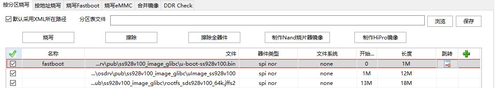
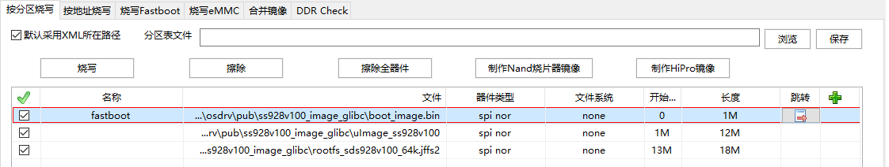

# 前言<a name="ZH-CN_TOPIC_0000002457836533"></a>

**概述<a name="section236mcpsimp"></a>**

本文档主要是指导使用本安全启动方案的相关人员了解整个安全方案的流程，再通过一定的操作步骤和方法来使用本安全启动方案。主要介绍本安全启动的规格和特性，包括安全启动基本流程和key的层级结构与验签逻辑，及其整个安全启动方案的使用。

> **说明：** 
>本文以Hi3403V100描述为例，未有特殊说明，SS927V100与Hi3403V100内容一致。

**产品版本<a name="section239mcpsimp"></a>**

与本文档相对应的产品版本如下。

<a name="table242mcpsimp"></a>
<table><thead align="left"><tr id="row247mcpsimp"><th class="cellrowborder" valign="top" width="32%" id="mcps1.1.3.1.1"><p id="p249mcpsimp"><a name="p249mcpsimp"></a><a name="p249mcpsimp"></a>产品名称</p>
</th>
<th class="cellrowborder" valign="top" width="68%" id="mcps1.1.3.1.2"><p id="p251mcpsimp"><a name="p251mcpsimp"></a><a name="p251mcpsimp"></a>产品版本</p>
</th>
</tr>
</thead>
<tbody><tr id="row253mcpsimp"><td class="cellrowborder" valign="top" width="32%" headers="mcps1.1.3.1.1 "><p id="p255mcpsimp"><a name="p255mcpsimp"></a><a name="p255mcpsimp"></a>Hi3403V100</p>
</td>
<td class="cellrowborder" valign="top" width="68%" headers="mcps1.1.3.1.2 "><p id="p257mcpsimp"><a name="p257mcpsimp"></a><a name="p257mcpsimp"></a>V100</p>
</td>
</tr>

</tbody>
</table>

**读者对象<a name="section258mcpsimp"></a>**

本文档（本指南）主要适用于以下工程师：

-   技术支持工程师
-   软件开发工程师

**符号约定<a name="section133020216410"></a>**

在本文中可能出现下列标志，它们所代表的含义如下。

<a name="table2622507016410"></a>
<table><thead align="left"><tr id="row1530720816410"><th class="cellrowborder" valign="top" width="20.580000000000002%" id="mcps1.1.3.1.1"><p id="p6450074116410"><a name="p6450074116410"></a><a name="p6450074116410"></a><strong id="b2136615816410"><a name="b2136615816410"></a><a name="b2136615816410"></a>符号</strong></p>
</th>
<th class="cellrowborder" valign="top" width="79.42%" id="mcps1.1.3.1.2"><p id="p5435366816410"><a name="p5435366816410"></a><a name="p5435366816410"></a><strong id="b5941558116410"><a name="b5941558116410"></a><a name="b5941558116410"></a>说明</strong></p>
</th>
</tr>
</thead>
<tbody><tr id="row1372280416410"><td class="cellrowborder" valign="top" width="20.580000000000002%" headers="mcps1.1.3.1.1 "><p id="p3734547016410"><a name="p3734547016410"></a><a name="p3734547016410"></a><a name="image2670064316410"></a><a name="image2670064316410"></a><span></span></p>
</td>
<td class="cellrowborder" valign="top" width="79.42%" headers="mcps1.1.3.1.2 "><p id="p1757432116410"><a name="p1757432116410"></a><a name="p1757432116410"></a>表示如不避免则将会导致死亡或严重伤害的具有高等级风险的危害。</p>
</td>
</tr>

    
    
    
    
    </tbody>
    </table>

4.  在./cmd/Makefile文件中添加以下内容，以增加OTP烧写命令编译项。

    ```
    obj-y += write_otp_fun.o
    ```

5.  在./include/configs/ss928v100.h文件添加以下宏定义，使能OTP驱动。

    ```
    #define CONFIG_OTP_ENABLE
    ```

6.  编译带有OTP烧写命令的U-Boot。

    编译U-Boot前，需要用Windows系统进入osdrv/tools/pc/uboot\_tools/目录，打开对应单板的Excel文件，选择main标签，点击“Generate reg bin file”按钮，生成对应平台的U-Boot表格文件reg\_info.bin。然后回到Linux系统执行操作：

    ```
    cp configs/ss928v100_defconfig .config 
    make ARCH=arm CROSS_COMPILE=aarch64-v01c01-linux-gnu- menuconfig 
    make ARCH=arm CROSS_COMPILE=aarch64-v01c01-linux-gnu- -j 20 
    cp ../../../osdrv/tools/pc/uboot_tools/reg_info.bin .reg 
    make ARCH=arm CROSS_COMPILE=aarch64-v01c01-linux-gnu- u-boot-z.bin
    ```

    以上操作以SPI NOR/ NAND启动介质为例，如果启动介质为eMMC，则上述操作中的配置文件“configs/ss928v100\_defconfig”改为“ss928v100\_emmc\_defconfig”。

7.  检验 OTP 配置值（可选步骤）。

    进入osdrv/components/boot-otp/image\_map/目录，打开 oem/otp\_check.json，填充“步骤3”设置的 OTP 值，然后执行命令：

    ```
    # 获取 KDF 工具
    cp ../../../tools/pc/kdf_customer/parameter.bin ./
    tar xf ../../../tools/pc/kdf_customer/KDFTools_V1.0.3.tar.gz --strip-components=1
    # 验证 OTP 配置值（以下命令根据启动场景二选一）
    # 安全启动
    python3 oem/oem_main.py check oem/otp_check.json <Boot Image路径> 
    ```

    命令中的 “<Boot Image路径\>”请用“启动镜像制作步骤”生成实际镜像路径替换。

    打印“Boot Image is OK.”表示 Boot Image 的OTP 配置值校验通过；执行报错表示 OTP 配置值有误。

8.  进入osdrv/components/boot-otp/gsl/目录，编译GSL镜像，得到gsl.bin。

    ```
    make CHIP=ss928v100
    ```

9.  进入osdrv/components/boot-otp/image\_map制作Boot image。

    ```
    cp ../../../../open_source/u-boot/u-boot-otp/u-boot-ss928v100.bin ./u-boot-original.bin
    cp ../../../../open_source/u-boot/u-boot-otp/.reg ./
    cp ../gsl/pub/gsl.bin ./  
    python oem/oem_quick_build.py
    ```

    image/oem/目录下生成的boot\_image.bin具备OTP烧写功能。

10. 将新的image/oem/boot\_image.bin烧写到存储介质。
11. 烧写完成后，复位进入U-Boot，执行write\_otp命令完成OTP烧写。

至此OTP烧写完成，之后可以依照“镜像烧写”中的描述，烧写“启动镜像制作步骤”中制作的启动镜像，并在U-Boot中依照“单板环境变量配置参考”配置环境变量。环境变量配置完成后请复位芯片，检验系统启动是否成功。

> **须知：** 
>-   烧入OTP的秘钥是敏感信息，必须保密。该示例代码只能用于烧写OTP，正式发布时，一定要把U-Boot中用于烧写OTP的write\_otp\_fun.c文件删除，否则会有密钥泄漏风险。
>-   另强烈建议客户在最终产品发布前，将所有的特性/功能开关位对应的值设置好，并且强制锁定！即使默认值满足要求，也要求锁定。
>-   烧写OTP后，OTP值在芯片断电后才生效，或者通过U-Boot中dog\_reset命令使其生效，其通过芯片软复位的形式不会生效。
>-   镜像结构内Unchecked Area for Vendor 区域 SCS\_simulate\_flag 标志可在安全启动未使能的情况下进行安全启动调试。

## 镜像烧写<a name="ZH-CN_TOPIC_0000002457836489"></a>

本节以SPI NOR存储介质为例，介绍如何使用ToolPlatform工具烧写启动镜像。

选用其它存储介质（SPI NAND、eMMC）时，文件系统的类型和烧写长度与SPI NOR不同，其余镜像的大小和烧写布局与SPI NOR相同。


### 快速启动<a name="ZH-CN_TOPIC_0000002424197910"></a>

快速启动的镜像烧写布局如[图1](#_fig1991144012019)所示。

**图 1**  快速启动ToolPlatform烧写分区参考图<a name="_fig1991144012019"></a>  


### 非安全启动和Non-TEE安全启动<a name="ZH-CN_TOPIC_0000002457836497"></a>

镜像烧写布局如[图1](#__Ref55287952)所示。

**图 1**  ToolPlatform烧写分区参考图<a name="__Ref55287952"></a>  


> **须知：** 
>图1和[图1](#__Ref55287952)中烧写的uImage\_ss928v100文件是ATF+Kernel镜像。

## 单板环境变量配置参考<a name="ZH-CN_TOPIC_0000002424357730"></a>

本节基于“镜像烧写”的镜像布局，提供SPI NOR、SPI NAND和eMMC作为启动介质时的环境变量配置示例。

-   SPI NOR

    ```
    setenv bootargs 'mem=128M console=ttyAMA0,115200 root=/dev/mtdblock2 rw rootfstype=jffs2 mtdparts=sfc:1M(boot),12M(kernel),18M(rootfs)';sa  setenv bootcmd 'sf probe 0;sf read 0x42000000 0x100000 0xc00000;bootm 0x42000000';sa
    ```

-   SPI NAND和并口NAND

    ```
    setenv bootargs 'mem=128M console=ttyAMA0,115200 clk_ignore_unused ubi.mtd=2 root=ubi0:ubifs rootfstype=ubifs rw mtdparts=nand:1M(boot),12M(kernel),32M(rootfs.ubifs)';sa   setenv bootcmd 'nand read 0x42000000 0x100000 0xc00000;bootm 0x42000000';sa
    ```

-   eMMC

    ```
    setenv bootargs 'mem=128M console=ttyAMA0,115200 clk_ignore_unused rw rootwait root=/dev/mmcblk0p3 rootfstype=ext4 blkdevparts=mmcblk0:1M(boot),12M(kernel),96M(rootfs)';sa  setenv bootcmd 'mmc read 0 0x42000000 0x800 0x6000; bootm 0x42000000';sa
    ```

# 安全 Boot 镜像备份功能<a name="ZH-CN_TOPIC_0000002457836513"></a>

如需使用安全 Boot 镜像备份功能，请先烧写 OTP 的“uboot\_redundance”字段（详见“OTP配置与烧写”章节）。

烧写的备份 Boot Image 起始地址要求64K对齐且位于存储介质前1MB以内。当主 Boot Image 校验失败，引导程序会从启动介质搜寻可用的备份 Boot Image，并引导启动。

> **注意：** 
>当存储介质为NAND Flash时，请勿擦除介质的首个Block，否则有备份失败的风险。

# 内核及文件系统安全启动验签方案参考<a name="ZH-CN_TOPIC_0000002457836481"></a>

该参考方案是基于上述安全启动方案的特性，在U-Boot验签通过后，再通过在U-Boot上实现验签内核的功能。前一阶段系统引导下一阶段系统前，先对待启动系统进行验签，如果验签成功，再启动Linux系统，否则系统启动失败。验签机制可以保证系统镜像的完整性，如果镜像被篡改或损坏，系统将不会被启动。


## 安全启动流程<a name="ZH-CN_TOPIC_0000002457876633"></a>

本文中描述的只涉及BOOTROM验签后启动U-Boot，U-Boot验签后启动Kernel，如[图1](#fig135231753812)所示。其它文件系统等的验签流程，以及相关数据加解密保护可参照这种模式进行设计开发，本文不进行说明。

方案在制作非安全的U-Boot原始镜像先使其镜像大小16字节对齐，对齐之后再往Boot原始镜像上追加内核的安全验签公钥Key的信息等信息至镜像尾部，再通过“启动镜像制作步骤”对追加信息后U-Boot生成新的安全启动镜像。

**图 1**  内核及文件系统启动验签流程框图<a name="fig135231753812"></a>  


安全启动验签流程涉及的哈希值计算、非对称RSA加解密，请自行查询相关资料，本文不再进行说明。如果需要进一步开发加解密功能，可了解其它加密算法，例如对称AES加密算法。

## 附验证信息U-Boot镜像结构<a name="ZH-CN_TOPIC_0000002424357746"></a>

附验证信息的U-Boot镜像结构如[图1](#fig13141855185214)所示。在U-Boot镜像尾部追加Kernel相关安全信息，再将带Kernel验证信息的U-Boot镜像制作成安全启动镜像。

**图 1**  附验证信息U-Boot镜像结构<a name="fig13141855185214"></a>  


## 安全Kernel镜像结构<a name="ZH-CN_TOPIC_0000002457836509"></a>

安全Kernel镜像由头部信息、Kernel镜像和签名信息等组成，如[图1](#fig47919505579)所示。在原有Kernel镜像结构进行拼接，其中Kernel镜像为压缩镜像。Kernel验签使用的RSA公钥信息保存在U-Boot原始镜像中，随安全镜像一起整合成安全启动镜像。

**图 1**  安全Kernel镜像结构图<a name="fig47919505579"></a>  


## 功能实现<a name="ZH-CN_TOPIC_0000002424197894"></a>

U-Boot验签Kernel部分功能实现请参考[《CIPHER API 参考》](../modules/reference/CIPHER API 参考.md)文档内 RSA签名及验签使用流程章节调用相应API接口实现。

# U-Boot表格增大后代码方案参考<a name="ZH-CN_TOPIC_0000002457876649"></a>

> **注意：** 
>本方法只适用于非安全启动和安全启动，对快速启动无效。
>且修改须保证 gsl.bin大小（对应镜像GSL\_Code\_Area\_Len）+ U-Boot 表格大小（16字节对齐） < 70.76KB大小。


## 目的<a name="ZH-CN_TOPIC_0000002424357762"></a>

将U-Boot表格大小限制，从10.77KB（0x2B10字节）增至16.00KB（0x4000字节）。

## 方法<a name="ZH-CN_TOPIC_0000002457836525"></a>

1.  修改gsl/include/flash\_map.h

    ```
    #define CFG_PARAM_SIZE 0x2B10
    ```

    修改为：

    ```
    #define CFG_PARAM_SIZE 0x4000
    ```

2.  修改image\_map/common/area\_tool.py

    ```
    class AreaCfg:
    CFG_PARAM_SIZE = 0x2B10     # reg table size
    ```

    修改为

    ```
    class AreaCfg:
    CFG_PARAM_SIZE = 0x4000     # reg table size..
    ```

# 错误码列表<a name="ZH-CN_TOPIC_0000002424357770"></a>

**表 1**  错误码列表

<a name="zh-cn_topic_0000001755879218_table17854135394813"></a>
<table><thead align="left"><tr id="zh-cn_topic_0000001755879218_row17854165314482"><th class="cellrowborder" align="left" valign="top" width="12.45%" id="mcps1.2.3.1.1"><p id="zh-cn_topic_0000001755879218_p1485415318484"><a name="zh-cn_topic_0000001755879218_p1485415318484"></a><a name="zh-cn_topic_0000001755879218_p1485415318484"></a>错误码</p>
</th>
<th class="cellrowborder" align="left" valign="top" width="87.55%" id="mcps1.2.3.1.2"><p id="zh-cn_topic_0000001755879218_p285410537485"><a name="zh-cn_topic_0000001755879218_p285410537485"></a><a name="zh-cn_topic_0000001755879218_p285410537485"></a>含义</p>
</th>
</tr>
</thead>
<tbody><tr id="zh-cn_topic_0000001755879218_row17854145364815"><td class="cellrowborder" align="left" valign="top" width="12.45%" headers="mcps1.2.3.1.1 "><p id="zh-cn_topic_0000001755879218_p17854135319489"><a name="zh-cn_topic_0000001755879218_p17854135319489"></a><a name="zh-cn_topic_0000001755879218_p17854135319489"></a>E4D1</p>
</td>
<td class="cellrowborder" align="left" valign="top" width="87.55%" headers="mcps1.2.3.1.2 "><p id="zh-cn_topic_0000001755879218_p3854115364817"><a name="zh-cn_topic_0000001755879218_p3854115364817"></a><a name="zh-cn_topic_0000001755879218_p3854115364817"></a>PCIe 从启动获取数据失败</p>
</td>
</tr>
<tr id="zh-cn_topic_0000001755879218_row38543534487"><td class="cellrowborder" align="left" valign="top" width="12.45%" headers="mcps1.2.3.1.1 "><p id="zh-cn_topic_0000001755879218_p15854753104815"><a name="zh-cn_topic_0000001755879218_p15854753104815"></a><a name="zh-cn_topic_0000001755879218_p15854753104815"></a>E4D2</p>
</td>
<td class="cellrowborder" align="left" valign="top" width="87.55%" headers="mcps1.2.3.1.2 "><p id="zh-cn_topic_0000001755879218_p11855185304820"><a name="zh-cn_topic_0000001755879218_p11855185304820"></a><a name="zh-cn_topic_0000001755879218_p11855185304820"></a>从 UART 下载数据失败</p>
</td>
</tr>
<tr id="row144952937"><td class="cellrowborder" valign="top" width="12.45%" headers="mcps1.2.3.1.1 "><p id="p3449122435"><a name="p3449122435"></a><a name="p3449122435"></a>E4D3</p>
</td>
<td class="cellrowborder" valign="top" width="87.55%" headers="mcps1.2.3.1.2 "><p id="p94494213312"><a name="p94494213312"></a><a name="p94494213312"></a>从 SD 卡获取数据失败</p>
</td>
</tr>
<tr id="row1277314561218"><td class="cellrowborder" valign="top" width="12.45%" headers="mcps1.2.3.1.1 "><p id="p177741956629"><a name="p177741956629"></a><a name="p177741956629"></a>E4D4</p>
</td>
<td class="cellrowborder" valign="top" width="87.55%" headers="mcps1.2.3.1.2 "><p id="p777485613219"><a name="p777485613219"></a><a name="p777485613219"></a>从 USB 下载数据失败</p>
</td>
</tr>
<tr id="zh-cn_topic_0000001755879218_row1185511533481"><td class="cellrowborder" align="left" valign="top" width="12.45%" headers="mcps1.2.3.1.1 "><p id="zh-cn_topic_0000001755879218_p1685545318488"><a name="zh-cn_topic_0000001755879218_p1685545318488"></a><a name="zh-cn_topic_0000001755879218_p1685545318488"></a>E4D5</p>
</td>
<td class="cellrowborder" align="left" valign="top" width="87.55%" headers="mcps1.2.3.1.2 "><p id="zh-cn_topic_0000001755879218_p1885565334817"><a name="zh-cn_topic_0000001755879218_p1885565334817"></a><a name="zh-cn_topic_0000001755879218_p1885565334817"></a>从 Flash 获取备份失败</p>
</td>
</tr>
<tr id="zh-cn_topic_0000001755879218_row8855145344819"><td class="cellrowborder" align="left" valign="top" width="12.45%" headers="mcps1.2.3.1.1 "><p id="zh-cn_topic_0000001755879218_p1985565310489"><a name="zh-cn_topic_0000001755879218_p1985565310489"></a><a name="zh-cn_topic_0000001755879218_p1985565310489"></a>E4D6</p>
</td>
<td class="cellrowborder" align="left" valign="top" width="87.55%" headers="mcps1.2.3.1.2 "><p id="zh-cn_topic_0000001755879218_p18855195311489"><a name="zh-cn_topic_0000001755879218_p18855195311489"></a><a name="zh-cn_topic_0000001755879218_p18855195311489"></a>从 Flash 获取数据失败</p>
</td>
</tr>
<tr id="zh-cn_topic_0000001755879218_row4855453104810"><td class="cellrowborder" align="left" valign="top" width="12.45%" headers="mcps1.2.3.1.1 "><p id="zh-cn_topic_0000001755879218_p18551553104816"><a name="zh-cn_topic_0000001755879218_p18551553104816"></a><a name="zh-cn_topic_0000001755879218_p18551553104816"></a>E4D7</p>
</td>
<td class="cellrowborder" align="left" valign="top" width="87.55%" headers="mcps1.2.3.1.2 "><p id="zh-cn_topic_0000001755879218_p185545313480"><a name="zh-cn_topic_0000001755879218_p185545313480"></a><a name="zh-cn_topic_0000001755879218_p185545313480"></a>从 eMMC 获取备份失败</p>
</td>
</tr>
<tr id="zh-cn_topic_0000001755879218_row185515530482"><td class="cellrowborder" align="left" valign="top" width="12.45%" headers="mcps1.2.3.1.1 "><p id="zh-cn_topic_0000001755879218_p3855125394819"><a name="zh-cn_topic_0000001755879218_p3855125394819"></a><a name="zh-cn_topic_0000001755879218_p3855125394819"></a>E4D8</p>
</td>
<td class="cellrowborder" align="left" valign="top" width="87.55%" headers="mcps1.2.3.1.2 "><p id="zh-cn_topic_0000001755879218_p128552053174819"><a name="zh-cn_topic_0000001755879218_p128552053174819"></a><a name="zh-cn_topic_0000001755879218_p128552053174819"></a>从 eMMC 获取数据失败</p>
</td>
</tr>
<tr id="zh-cn_topic_0000001755879218_row11855153144818"><td class="cellrowborder" align="left" valign="top" width="12.45%" headers="mcps1.2.3.1.1 "><p id="zh-cn_topic_0000001755879218_p1985535354815"><a name="zh-cn_topic_0000001755879218_p1985535354815"></a><a name="zh-cn_topic_0000001755879218_p1985535354815"></a>E6Dx</p>
</td>
<td class="cellrowborder" align="left" valign="top" width="87.55%" headers="mcps1.2.3.1.2 "><p id="zh-cn_topic_0000001755879218_p188551753174820"><a name="zh-cn_topic_0000001755879218_p188551753174820"></a><a name="zh-cn_topic_0000001755879218_p188551753174820"></a>GSL_Third_party_Key Area 校验失败</p>
</td>
</tr>
<tr id="zh-cn_topic_0000001755879218_row2855253114812"><td class="cellrowborder" align="left" valign="top" width="12.45%" headers="mcps1.2.3.1.1 "><p id="zh-cn_topic_0000001755879218_p168551753164819"><a name="zh-cn_topic_0000001755879218_p168551753164819"></a><a name="zh-cn_topic_0000001755879218_p168551753164819"></a>E7Dx</p>
</td>
<td class="cellrowborder" align="left" valign="top" width="87.55%" headers="mcps1.2.3.1.2 "><p id="zh-cn_topic_0000001755879218_p3855155310481"><a name="zh-cn_topic_0000001755879218_p3855155310481"></a><a name="zh-cn_topic_0000001755879218_p3855155310481"></a>GSL_Key_Area 校验失败</p>
</td>
</tr>
<tr id="zh-cn_topic_0000001755879218_row785525304813"><td class="cellrowborder" align="left" valign="top" width="12.45%" headers="mcps1.2.3.1.1 "><p id="zh-cn_topic_0000001755879218_p185515319481"><a name="zh-cn_topic_0000001755879218_p185515319481"></a><a name="zh-cn_topic_0000001755879218_p185515319481"></a>E8D1</p>
</td>
<td class="cellrowborder" align="left" valign="top" width="87.55%" headers="mcps1.2.3.1.2 "><p id="zh-cn_topic_0000001755879218_p11855115374812"><a name="zh-cn_topic_0000001755879218_p11855115374812"></a><a name="zh-cn_topic_0000001755879218_p11855115374812"></a>从 Flash 获取 GSL Code Area 失败</p>
</td>
</tr>
<tr id="zh-cn_topic_0000001755879218_row885516539484"><td class="cellrowborder" align="left" valign="top" width="12.45%" headers="mcps1.2.3.1.1 "><p id="zh-cn_topic_0000001755879218_p2085518532481"><a name="zh-cn_topic_0000001755879218_p2085518532481"></a><a name="zh-cn_topic_0000001755879218_p2085518532481"></a>E8D2</p>
</td>
<td class="cellrowborder" rowspan="2" align="left" valign="top" width="87.55%" headers="mcps1.2.3.1.2 "><p id="zh-cn_topic_0000001755879218_p385595394811"><a name="zh-cn_topic_0000001755879218_p385595394811"></a><a name="zh-cn_topic_0000001755879218_p385595394811"></a>从 EMMC 获取 GSL Code Area 失败</p>
</td>
</tr>
<tr id="zh-cn_topic_0000001755879218_row128551653114812"><td class="cellrowborder" align="left" valign="top" headers="mcps1.2.3.1.1 "><p id="zh-cn_topic_0000001755879218_p1985515313481"><a name="zh-cn_topic_0000001755879218_p1985515313481"></a><a name="zh-cn_topic_0000001755879218_p1985515313481"></a>E8D3</p>
</td>
</tr>
<tr id="zh-cn_topic_0000001755879218_row585595318482"><td class="cellrowborder" align="left" valign="top" width="12.45%" headers="mcps1.2.3.1.1 "><p id="zh-cn_topic_0000001755879218_p17855753144814"><a name="zh-cn_topic_0000001755879218_p17855753144814"></a><a name="zh-cn_topic_0000001755879218_p17855753144814"></a>E9Dx</p>
</td>
<td class="cellrowborder" align="left" valign="top" width="87.55%" headers="mcps1.2.3.1.2 "><p id="zh-cn_topic_0000001755879218_p485595324812"><a name="zh-cn_topic_0000001755879218_p485595324812"></a><a name="zh-cn_topic_0000001755879218_p485595324812"></a>GSL_Code_Area 校验失败</p>
</td>
</tr>
<tr id="row18787107101918"><td class="cellrowborder" valign="top" width="12.45%" headers="mcps1.2.3.1.1 "><p id="p87875711195"><a name="p87875711195"></a><a name="p87875711195"></a>G4S1</p>
</td>
<td class="cellrowborder" valign="top" width="87.55%" headers="mcps1.2.3.1.2 "><p id="p1122357192010"><a name="p1122357192010"></a><a name="p1122357192010"></a>PCIe 从启动获取数据失败</p>
</td>
</tr>
<tr id="row14732102015191"><td class="cellrowborder" valign="top" width="12.45%" headers="mcps1.2.3.1.1 "><p id="p492335018193"><a name="p492335018193"></a><a name="p492335018193"></a>G4S2</p>
</td>
<td class="cellrowborder" valign="top" width="87.55%" headers="mcps1.2.3.1.2 "><p id="p148641414202"><a name="p148641414202"></a><a name="p148641414202"></a>从 UART 下载数据失败</p>
</td>
</tr>
<tr id="row47864132194"><td class="cellrowborder" valign="top" width="12.45%" headers="mcps1.2.3.1.1 "><p id="p1824925131917"><a name="p1824925131917"></a><a name="p1824925131917"></a>G4S3</p>
</td>
<td class="cellrowborder" valign="top" width="87.55%" headers="mcps1.2.3.1.2 "><p id="p87861134191"><a name="p87861134191"></a><a name="p87861134191"></a>从 SD 卡获取数据失败</p>
</td>
</tr>
<tr id="row7161181716198"><td class="cellrowborder" valign="top" width="12.45%" headers="mcps1.2.3.1.1 "><p id="p084435110197"><a name="p084435110197"></a><a name="p084435110197"></a>G4S4</p>
</td>
<td class="cellrowborder" valign="top" width="87.55%" headers="mcps1.2.3.1.2 "><p id="p1262485012018"><a name="p1262485012018"></a><a name="p1262485012018"></a>从 USB 下载数据失败</p>
</td>
</tr>
<tr id="row1464441021917"><td class="cellrowborder" valign="top" width="12.45%" headers="mcps1.2.3.1.1 "><p id="p13348125271911"><a name="p13348125271911"></a><a name="p13348125271911"></a>G4S5</p>
</td>
<td class="cellrowborder" rowspan="2" valign="top" width="87.55%" headers="mcps1.2.3.1.2 "><p id="p1964441091912"><a name="p1964441091912"></a><a name="p1964441091912"></a>从 Flash 获取数据失败</p>
</td>
</tr>
<tr id="row48610515192"><td class="cellrowborder" valign="top" headers="mcps1.2.3.1.1 "><p id="p169349529196"><a name="p169349529196"></a><a name="p169349529196"></a>G4S7</p>
</td>
</tr>
<tr id="row236852121910"><td class="cellrowborder" valign="top" width="12.45%" headers="mcps1.2.3.1.1 "><p id="p12416145371912"><a name="p12416145371912"></a><a name="p12416145371912"></a>G4S6</p>
</td>
<td class="cellrowborder" rowspan="5" valign="top" width="87.55%" headers="mcps1.2.3.1.2 "><p id="p133681126199"><a name="p133681126199"></a><a name="p133681126199"></a>从 eMMC 获取数据失败</p>
</td>
</tr>
<tr id="row1740911412198"><td class="cellrowborder" valign="top" headers="mcps1.2.3.1.1 "><p id="p35461541199"><a name="p35461541199"></a><a name="p35461541199"></a>G4S8</p>
</td>
</tr>
<tr id="row70828182210"><td class="cellrowborder" valign="top" headers="mcps1.2.3.1.1 "><p id="p4949194482219"><a name="p4949194482219"></a><a name="p4949194482219"></a>G4S9</p>
</td>
</tr>
<tr id="row11179135102216"><td class="cellrowborder" valign="top" headers="mcps1.2.3.1.1 "><p id="p1236311479225"><a name="p1236311479225"></a><a name="p1236311479225"></a>G4Sa</p>
</td>
</tr>
<tr id="row18433120229"><td class="cellrowborder" valign="top" headers="mcps1.2.3.1.1 "><p id="p45261251122217"><a name="p45261251122217"></a><a name="p45261251122217"></a>G4Sb</p>
</td>
</tr>
<tr id="zh-cn_topic_0000001755879218_row15855135384818"><td class="cellrowborder" align="left" valign="top" width="12.45%" headers="mcps1.2.3.1.1 "><p id="zh-cn_topic_0000001755879218_p18555533481"><a name="zh-cn_topic_0000001755879218_p18555533481"></a><a name="zh-cn_topic_0000001755879218_p18555533481"></a>G5Sx</p>
</td>
<td class="cellrowborder" align="left" valign="top" width="87.55%" headers="mcps1.2.3.1.2 "><p id="zh-cn_topic_0000001755879218_p128551153144816"><a name="zh-cn_topic_0000001755879218_p128551153144816"></a><a name="zh-cn_topic_0000001755879218_p128551153144816"></a>Boot Key Area 校验失败</p>
</td>
</tr>
<tr id="zh-cn_topic_0000001755879218_row885535320489"><td class="cellrowborder" align="left" valign="top" width="12.45%" headers="mcps1.2.3.1.1 "><p id="zh-cn_topic_0000001755879218_p785685311481"><a name="zh-cn_topic_0000001755879218_p785685311481"></a><a name="zh-cn_topic_0000001755879218_p785685311481"></a>G6Sx</p>
</td>
<td class="cellrowborder" align="left" valign="top" width="87.55%" headers="mcps1.2.3.1.2 "><p id="zh-cn_topic_0000001755879218_p19856105311483"><a name="zh-cn_topic_0000001755879218_p19856105311483"></a><a name="zh-cn_topic_0000001755879218_p19856105311483"></a>Boot Params Area 校验失败</p>
</td>
</tr>
<tr id="zh-cn_topic_0000001755879218_row198562053144819"><td class="cellrowborder" align="left" valign="top" width="12.45%" headers="mcps1.2.3.1.1 "><p id="zh-cn_topic_0000001755879218_p88561953134813"><a name="zh-cn_topic_0000001755879218_p88561953134813"></a><a name="zh-cn_topic_0000001755879218_p88561953134813"></a>G8s1</p>
</td>
<td class="cellrowborder" align="left" valign="top" width="87.55%" headers="mcps1.2.3.1.2 "><p id="zh-cn_topic_0000001755879218_p18856853114811"><a name="zh-cn_topic_0000001755879218_p18856853114811"></a><a name="zh-cn_topic_0000001755879218_p18856853114811"></a>PCIe 从启动获取数据失败</p>
</td>
</tr>
<tr id="zh-cn_topic_0000001755879218_row208561553174813"><td class="cellrowborder" align="left" valign="top" width="12.45%" headers="mcps1.2.3.1.1 "><p id="zh-cn_topic_0000001755879218_p98561953154810"><a name="zh-cn_topic_0000001755879218_p98561953154810"></a><a name="zh-cn_topic_0000001755879218_p98561953154810"></a>G8s2</p>
</td>
<td class="cellrowborder" align="left" valign="top" width="87.55%" headers="mcps1.2.3.1.2 "><p id="zh-cn_topic_0000001755879218_p185613530483"><a name="zh-cn_topic_0000001755879218_p185613530483"></a><a name="zh-cn_topic_0000001755879218_p185613530483"></a>从 UART 下载数据失败</p>
</td>
</tr>
<tr id="row128584301436"><td class="cellrowborder" valign="top" width="12.45%" headers="mcps1.2.3.1.1 "><p id="p985983015318"><a name="p985983015318"></a><a name="p985983015318"></a>G8s3</p>
</td>
<td class="cellrowborder" valign="top" width="87.55%" headers="mcps1.2.3.1.2 "><p id="p28596307315"><a name="p28596307315"></a><a name="p28596307315"></a>从 SD 卡获取数据失败</p>
</td>
</tr>
<tr id="row582251039"><td class="cellrowborder" valign="top" width="12.45%" headers="mcps1.2.3.1.1 "><p id="p88102512311"><a name="p88102512311"></a><a name="p88102512311"></a>G8s4</p>
</td>
<td class="cellrowborder" valign="top" width="87.55%" headers="mcps1.2.3.1.2 "><p id="p18152518312"><a name="p18152518312"></a><a name="p18152518312"></a>从 USB 下载数据失败</p>
</td>
</tr>
<tr id="zh-cn_topic_0000001755879218_row585613539487"><td class="cellrowborder" align="left" valign="top" width="12.45%" headers="mcps1.2.3.1.1 "><p id="zh-cn_topic_0000001755879218_p88561953194814"><a name="zh-cn_topic_0000001755879218_p88561953194814"></a><a name="zh-cn_topic_0000001755879218_p88561953194814"></a>G8s5</p>
</td>
<td class="cellrowborder" align="left" valign="top" width="87.55%" headers="mcps1.2.3.1.2 "><p id="zh-cn_topic_0000001755879218_p108561953114814"><a name="zh-cn_topic_0000001755879218_p108561953114814"></a><a name="zh-cn_topic_0000001755879218_p108561953114814"></a>从 Flash 获取数据失败</p>
</td>
</tr>
<tr id="zh-cn_topic_0000001755879218_row16856253184812"><td class="cellrowborder" align="left" valign="top" width="12.45%" headers="mcps1.2.3.1.1 "><p id="zh-cn_topic_0000001755879218_p1285605344819"><a name="zh-cn_topic_0000001755879218_p1285605344819"></a><a name="zh-cn_topic_0000001755879218_p1285605344819"></a>G8s6</p>
</td>
<td class="cellrowborder" rowspan="4" align="left" valign="top" width="87.55%" headers="mcps1.2.3.1.2 "><p id="zh-cn_topic_0000001755879218_p089241765415"><a name="zh-cn_topic_0000001755879218_p089241765415"></a><a name="zh-cn_topic_0000001755879218_p089241765415"></a>从 eMMC 获取数据失败</p>
</td>
</tr>
<tr id="zh-cn_topic_0000001755879218_row13856125314480"><td class="cellrowborder" align="left" valign="top" headers="mcps1.2.3.1.1 "><p id="zh-cn_topic_0000001755879218_p3856155316482"><a name="zh-cn_topic_0000001755879218_p3856155316482"></a><a name="zh-cn_topic_0000001755879218_p3856155316482"></a>G8s7</p>
</td>
</tr>
<tr id="zh-cn_topic_0000001755879218_row0856105313489"><td class="cellrowborder" align="left" valign="top" headers="mcps1.2.3.1.1 "><p id="zh-cn_topic_0000001755879218_p7856053184812"><a name="zh-cn_topic_0000001755879218_p7856053184812"></a><a name="zh-cn_topic_0000001755879218_p7856053184812"></a>G8s8</p>
</td>
</tr>
<tr id="zh-cn_topic_0000001755879218_row085617532482"><td class="cellrowborder" align="left" valign="top" headers="mcps1.2.3.1.1 "><p id="zh-cn_topic_0000001755879218_p108563536486"><a name="zh-cn_topic_0000001755879218_p108563536486"></a><a name="zh-cn_topic_0000001755879218_p108563536486"></a>G8s9</p>
</td>
</tr>
<tr id="zh-cn_topic_0000001755879218_row285685384818"><td class="cellrowborder" align="left" valign="top" width="12.45%" headers="mcps1.2.3.1.1 "><p id="zh-cn_topic_0000001755879218_p108569533488"><a name="zh-cn_topic_0000001755879218_p108569533488"></a><a name="zh-cn_topic_0000001755879218_p108569533488"></a>G9Sx</p>
</td>
<td class="cellrowborder" align="left" valign="top" width="87.55%" headers="mcps1.2.3.1.2 "><p id="zh-cn_topic_0000001755879218_p2085685314486"><a name="zh-cn_topic_0000001755879218_p2085685314486"></a><a name="zh-cn_topic_0000001755879218_p2085685314486"></a>Boot Area 校验失败</p>
</td>
</tr>
</tbody>
</table>

> **说明：** 
>错误码表中，“x”替代任意数字，例如“G5Sx”指代 “G5S1”、“G5S2”、“G5S3”…

# 缩略语<a name="ZH-CN_TOPIC_0000002424197946"></a>

<a name="table345mcpsimp"></a>
<table><tbody><tr id="row350mcpsimp"><td class="cellrowborder" colspan="2" valign="top"><p id="p352mcpsimp"><a name="p352mcpsimp"></a><a name="p352mcpsimp"></a><strong id="b353mcpsimp"><a name="b353mcpsimp"></a><a name="b353mcpsimp"></a>A</strong></p>
</td>
</tr>
<tr id="row354mcpsimp"><td class="cellrowborder" valign="top" width="16%"><p id="p356mcpsimp"><a name="p356mcpsimp"></a><a name="p356mcpsimp"></a>AES</p>
</td>
<td class="cellrowborder" valign="top" width="84%"><p id="p358mcpsimp"><a name="p358mcpsimp"></a><a name="p358mcpsimp"></a>Advanced Encryption Standard</p>
</td>
</tr>
<tr id="row359mcpsimp"><td class="cellrowborder" valign="top" width="16%"><p id="p361mcpsimp"><a name="p361mcpsimp"></a><a name="p361mcpsimp"></a>ATF</p>
</td>
<td class="cellrowborder" valign="top" width="84%"><p id="p363mcpsimp"><a name="p363mcpsimp"></a><a name="p363mcpsimp"></a>Arm Trust Firmware</p>
</td>
</tr>
<tr id="row364mcpsimp"><td class="cellrowborder" colspan="2" valign="top"><p id="p366mcpsimp"><a name="p366mcpsimp"></a><a name="p366mcpsimp"></a><strong id="b367mcpsimp"><a name="b367mcpsimp"></a><a name="b367mcpsimp"></a>C</strong></p>
</td>
</tr>
<tr id="row368mcpsimp"><td class="cellrowborder" valign="top" width="16%"><p id="p370mcpsimp"><a name="p370mcpsimp"></a><a name="p370mcpsimp"></a>CPU</p>
</td>
<td class="cellrowborder" valign="top" width="84%"><p id="p372mcpsimp"><a name="p372mcpsimp"></a><a name="p372mcpsimp"></a>Central Processing Unit</p>
</td>
</tr>
<tr id="row373mcpsimp"><td class="cellrowborder" colspan="2" valign="top"><p id="p375mcpsimp"><a name="p375mcpsimp"></a><a name="p375mcpsimp"></a><strong id="b376mcpsimp"><a name="b376mcpsimp"></a><a name="b376mcpsimp"></a>G</strong></p>
</td>
</tr>
<tr id="row377mcpsimp"><td class="cellrowborder" valign="top" width="16%"><p id="p379mcpsimp"><a name="p379mcpsimp"></a><a name="p379mcpsimp"></a>GSL</p>
</td>
<td class="cellrowborder" valign="top" width="84%"><p id="p381mcpsimp"><a name="p381mcpsimp"></a><a name="p381mcpsimp"></a>Secure Bootloader</p>
</td>
</tr>
<tr id="row382mcpsimp"><td class="cellrowborder" colspan="2" valign="top"><p id="p384mcpsimp"><a name="p384mcpsimp"></a><a name="p384mcpsimp"></a><strong id="b385mcpsimp"><a name="b385mcpsimp"></a><a name="b385mcpsimp"></a>J</strong></p>
</td>
</tr>
<tr id="row386mcpsimp"><td class="cellrowborder" valign="top" width="16%"><p id="p388mcpsimp"><a name="p388mcpsimp"></a><a name="p388mcpsimp"></a>JTAG</p>
</td>
<td class="cellrowborder" valign="top" width="84%"><p id="p390mcpsimp"><a name="p390mcpsimp"></a><a name="p390mcpsimp"></a>Joint Test Action Group</p>
</td>
</tr>
<tr id="row391mcpsimp"><td class="cellrowborder" colspan="2" valign="top"><p id="p393mcpsimp"><a name="p393mcpsimp"></a><a name="p393mcpsimp"></a><strong id="b394mcpsimp"><a name="b394mcpsimp"></a><a name="b394mcpsimp"></a>K</strong></p>
</td>
</tr>
<tr id="row395mcpsimp"><td class="cellrowborder" valign="top" width="16%"><p id="p397mcpsimp"><a name="p397mcpsimp"></a><a name="p397mcpsimp"></a>KeyLadder</p>
</td>
<td class="cellrowborder" valign="top" width="84%"><p id="p399mcpsimp"><a name="p399mcpsimp"></a><a name="p399mcpsimp"></a>A structured multi-level key mechanism that ensures secure transmission of control words.</p>
</td>
</tr>
<tr id="row400mcpsimp"><td class="cellrowborder" colspan="2" valign="top"><p id="p402mcpsimp"><a name="p402mcpsimp"></a><a name="p402mcpsimp"></a><strong id="b403mcpsimp"><a name="b403mcpsimp"></a><a name="b403mcpsimp"></a>M</strong></p>
</td>
</tr>
<tr id="row404mcpsimp"><td class="cellrowborder" valign="top" width="16%"><p id="p406mcpsimp"><a name="p406mcpsimp"></a><a name="p406mcpsimp"></a>MCipher</p>
</td>
<td class="cellrowborder" valign="top" width="84%"><p id="p408mcpsimp"><a name="p408mcpsimp"></a><a name="p408mcpsimp"></a>Multi-channel Cipher module</p>
</td>
</tr>
<tr id="row409mcpsimp"><td class="cellrowborder" valign="top" width="16%"><p id="p411mcpsimp"><a name="p411mcpsimp"></a><a name="p411mcpsimp"></a>MSID</p>
</td>
<td class="cellrowborder" valign="top" width="84%"><p id="p413mcpsimp"><a name="p413mcpsimp"></a><a name="p413mcpsimp"></a>MarketSegmentID.</p>
</td>
</tr>
<tr id="row414mcpsimp"><td class="cellrowborder" colspan="2" valign="top"><p id="p416mcpsimp"><a name="p416mcpsimp"></a><a name="p416mcpsimp"></a><strong id="b417mcpsimp"><a name="b417mcpsimp"></a><a name="b417mcpsimp"></a>O</strong></p>
</td>
</tr>
<tr id="row418mcpsimp"><td class="cellrowborder" valign="top" width="16%"><p id="p420mcpsimp"><a name="p420mcpsimp"></a><a name="p420mcpsimp"></a>OS</p>
</td>
<td class="cellrowborder" valign="top" width="84%"><p id="p422mcpsimp"><a name="p422mcpsimp"></a><a name="p422mcpsimp"></a>Operating System</p>
</td>
</tr>
<tr id="row423mcpsimp"><td class="cellrowborder" valign="top" width="16%"><p id="p425mcpsimp"><a name="p425mcpsimp"></a><a name="p425mcpsimp"></a>OEM</p>
</td>
<td class="cellrowborder" valign="top" width="84%"><p id="p427mcpsimp"><a name="p427mcpsimp"></a><a name="p427mcpsimp"></a>Original Equipment Manufacturer</p>
</td>
</tr>
<tr id="row428mcpsimp"><td class="cellrowborder" valign="top" width="16%"><p id="p430mcpsimp"><a name="p430mcpsimp"></a><a name="p430mcpsimp"></a>OTP</p>
</td>
<td class="cellrowborder" valign="top" width="84%"><p id="p432mcpsimp"><a name="p432mcpsimp"></a><a name="p432mcpsimp"></a>One Time Programmable</p>
</td>
</tr>
<tr id="row433mcpsimp"><td class="cellrowborder" colspan="2" valign="top"><p id="p435mcpsimp"><a name="p435mcpsimp"></a><a name="p435mcpsimp"></a><strong id="b436mcpsimp"><a name="b436mcpsimp"></a><a name="b436mcpsimp"></a>R</strong></p>
</td>
</tr>
<tr id="row437mcpsimp"><td class="cellrowborder" valign="top" width="16%"><p id="p439mcpsimp"><a name="p439mcpsimp"></a><a name="p439mcpsimp"></a>REE</p>
</td>
<td class="cellrowborder" valign="top" width="84%"><p id="p441mcpsimp"><a name="p441mcpsimp"></a><a name="p441mcpsimp"></a>Rich Execution Environment</p>
</td>
</tr>
<tr id="row442mcpsimp"><td class="cellrowborder" valign="top" width="16%"><p id="p444mcpsimp"><a name="p444mcpsimp"></a><a name="p444mcpsimp"></a>RKP</p>
</td>
<td class="cellrowborder" valign="top" width="84%"><p id="p446mcpsimp"><a name="p446mcpsimp"></a><a name="p446mcpsimp"></a>Root Key Process</p>
</td>
</tr>
<tr id="row447mcpsimp"><td class="cellrowborder" colspan="2" valign="top"><p id="p449mcpsimp"><a name="p449mcpsimp"></a><a name="p449mcpsimp"></a><strong id="b450mcpsimp"><a name="b450mcpsimp"></a><a name="b450mcpsimp"></a>S</strong></p>
</td>
</tr>
<tr id="row451mcpsimp"><td class="cellrowborder" valign="top" width="16%"><p id="p453mcpsimp"><a name="p453mcpsimp"></a><a name="p453mcpsimp"></a>SCS</p>
</td>
<td class="cellrowborder" valign="top" width="84%"><p id="p455mcpsimp"><a name="p455mcpsimp"></a><a name="p455mcpsimp"></a>Secure Chipset Startup</p>
</td>
</tr>
<tr id="row456mcpsimp"><td class="cellrowborder" valign="top" width="16%"><p id="p458mcpsimp"><a name="p458mcpsimp"></a><a name="p458mcpsimp"></a>SMC</p>
</td>
<td class="cellrowborder" valign="top" width="84%"><p id="p460mcpsimp"><a name="p460mcpsimp"></a><a name="p460mcpsimp"></a>Secure Monitor Call</p>
</td>
</tr>
</tbody>
</table>

