# 前言<a name="ZH-CN_TOPIC_0000002530221645"></a>

**概述<a name="section5622mcpsimp"></a>**

PQ Tools图像质量调试工具使用指南主要辅助调试人员进行图像效果及差异化的调节，本文重点阐述相关的调试操作方法。

> **说明：** 
>本文以Hi3403V100描述为例，未有特殊说明，SS927V100与Hi3403V100内容一致。

**产品版本<a name="section5625mcpsimp"></a>**

与本文档相对应的产品版本如下。

<a name="table5628mcpsimp"></a>
<table><thead align="left"><tr id="row5633mcpsimp"><th class="cellrowborder" valign="top" width="32%" id="mcps1.1.3.1.1"><p id="p5635mcpsimp"><a name="p5635mcpsimp"></a><a name="p5635mcpsimp"></a>产品名称</p>
</th>
<th class="cellrowborder" valign="top" width="68%" id="mcps1.1.3.1.2"><p id="p5637mcpsimp"><a name="p5637mcpsimp"></a><a name="p5637mcpsimp"></a>产品版本</p>
</th>
</tr>
</thead>
<tbody><tr id="row5639mcpsimp"><td class="cellrowborder" valign="top" width="32%" headers="mcps1.1.3.1.1 "><p id="p5641mcpsimp"><a name="p5641mcpsimp"></a><a name="p5641mcpsimp"></a>Hi3403V100</p>
</td>
<td class="cellrowborder" valign="top" width="68%" headers="mcps1.1.3.1.2 "><p id="p5643mcpsimp"><a name="p5643mcpsimp"></a><a name="p5643mcpsimp"></a>V100</p>
</td>
</tr>

</tbody>
</table>

**读者对象<a name="section5644mcpsimp"></a>**

本文档（本指南）主要适用于以下工程师：

-   技术支持工程师
-   软件开发工程师

**修改记录<a name="section5650mcpsimp"></a>**

<a name="table5652mcpsimp"></a>
<table><thead align="left"><tr id="row5658mcpsimp"><th class="cellrowborder" valign="top" width="21%" id="mcps1.1.4.1.1"><p id="p5660mcpsimp"><a name="p5660mcpsimp"></a><a name="p5660mcpsimp"></a>文档版本</p>
</th>
<th class="cellrowborder" valign="top" width="26%" id="mcps1.1.4.1.2"><p id="p5663mcpsimp"><a name="p5663mcpsimp"></a><a name="p5663mcpsimp"></a>发布日期</p>
</th>
<th class="cellrowborder" valign="top" width="53%" id="mcps1.1.4.1.3"><p id="p5666mcpsimp"><a name="p5666mcpsimp"></a><a name="p5666mcpsimp"></a>修改说明</p>
</th>
</tr>
</thead>
<tbody><tr id="row9157117152013"><td class="cellrowborder" valign="top" width="21%" headers="mcps1.1.4.1.1 "><p id="p14523111518206"><a name="p14523111518206"></a><a name="p14523111518206"></a>00B02</p>
</td>
<td class="cellrowborder" valign="top" width="26%" headers="mcps1.1.4.1.2 "><p id="p1052321511203"><a name="p1052321511203"></a><a name="p1052321511203"></a>2025-12-25</p>
</td>
<td class="cellrowborder" valign="top" width="53%" headers="mcps1.1.4.1.3 "><p id="p15523171512209"><a name="p15523171512209"></a><a name="p15523171512209"></a>第2次临时版本发布。</p>
<p id="p10140193052014"><a name="p10140193052014"></a><a name="p10140193052014"></a>“Linux系统下板端软件的安装与运行”与“鱼眼镜头标定步骤”小节涉及修改</p>
</td>
</tr>


<tr id="row2841mcpsimp"><td class="cellrowborder" valign="top" width="22.222222222222225%" headers="mcps1.2.4.1.1 "><p id="p2843mcpsimp"><a name="p2843mcpsimp"></a><a name="p2843mcpsimp"></a>FocalLengthY</p>
</td>
<td class="cellrowborder" valign="top" width="34.34343434343434%" headers="mcps1.2.4.1.2 "><p id="p2845mcpsimp"><a name="p2845mcpsimp"></a><a name="p2845mcpsimp"></a>[64,1173417]</p>
</td>
<td class="cellrowborder" valign="top" width="43.43434343434344%" headers="mcps1.2.4.1.3 "><p id="p2847mcpsimp"><a name="p2847mcpsimp"></a><a name="p2847mcpsimp"></a>-</p>
</td>
</tr>
<tr id="row2848mcpsimp"><td class="cellrowborder" valign="top" width="22.222222222222225%" headers="mcps1.2.4.1.1 "><p id="p2850mcpsimp"><a name="p2850mcpsimp"></a><a name="p2850mcpsimp"></a>PrincipalPtX</p>
</td>
<td class="cellrowborder" valign="top" width="34.34343434343434%" headers="mcps1.2.4.1.2 "><p id="p2852mcpsimp"><a name="p2852mcpsimp"></a><a name="p2852mcpsimp"></a>[W*0.35,W*0.65]</p>
</td>
<td class="cellrowborder" valign="top" width="43.43434343434344%" headers="mcps1.2.4.1.3 "><p id="p2854mcpsimp"><a name="p2854mcpsimp"></a><a name="p2854mcpsimp"></a>W为图像宽度</p>
</td>
</tr>
<tr id="row2855mcpsimp"><td class="cellrowborder" valign="top" width="22.222222222222225%" headers="mcps1.2.4.1.1 "><p id="p2857mcpsimp"><a name="p2857mcpsimp"></a><a name="p2857mcpsimp"></a>PrincipalPtY</p>
</td>
<td class="cellrowborder" valign="top" width="34.34343434343434%" headers="mcps1.2.4.1.2 "><p id="p2859mcpsimp"><a name="p2859mcpsimp"></a><a name="p2859mcpsimp"></a>[H*0.35,H*0.65]</p>
</td>
<td class="cellrowborder" valign="top" width="43.43434343434344%" headers="mcps1.2.4.1.3 "><p id="p2861mcpsimp"><a name="p2861mcpsimp"></a><a name="p2861mcpsimp"></a>H为图像高度</p>
</td>
</tr>
<tr id="row2862mcpsimp"><td class="cellrowborder" valign="top" width="22.222222222222225%" headers="mcps1.2.4.1.1 "><p id="p2864mcpsimp"><a name="p2864mcpsimp"></a><a name="p2864mcpsimp"></a>DistCoeff0</p>
</td>
<td class="cellrowborder" valign="top" width="34.34343434343434%" headers="mcps1.2.4.1.2 "><p id="p2866mcpsimp"><a name="p2866mcpsimp"></a><a name="p2866mcpsimp"></a>[-0.7,1]</p>
</td>
<td class="cellrowborder" valign="top" width="43.43434343434344%" headers="mcps1.2.4.1.3 "><p id="p2868mcpsimp"><a name="p2868mcpsimp"></a><a name="p2868mcpsimp"></a>-</p>
</td>
</tr>
<tr id="row2869mcpsimp"><td class="cellrowborder" valign="top" width="22.222222222222225%" headers="mcps1.2.4.1.1 "><p id="p2871mcpsimp"><a name="p2871mcpsimp"></a><a name="p2871mcpsimp"></a>DistCoeff1</p>
</td>
<td class="cellrowborder" valign="top" width="34.34343434343434%" headers="mcps1.2.4.1.2 "><p id="p2873mcpsimp"><a name="p2873mcpsimp"></a><a name="p2873mcpsimp"></a>[-0.5,0.5]</p>
</td>
<td class="cellrowborder" valign="top" width="43.43434343434344%" headers="mcps1.2.4.1.3 "><p id="p2875mcpsimp"><a name="p2875mcpsimp"></a><a name="p2875mcpsimp"></a>-</p>
</td>
</tr>
<tr id="row2876mcpsimp"><td class="cellrowborder" valign="top" width="22.222222222222225%" headers="mcps1.2.4.1.1 "><p id="p2878mcpsimp"><a name="p2878mcpsimp"></a><a name="p2878mcpsimp"></a>DistCoeff2</p>
</td>
<td class="cellrowborder" valign="top" width="34.34343434343434%" headers="mcps1.2.4.1.2 "><p id="p2880mcpsimp"><a name="p2880mcpsimp"></a><a name="p2880mcpsimp"></a>[-0.1,0.1]</p>
</td>
<td class="cellrowborder" valign="top" width="43.43434343434344%" headers="mcps1.2.4.1.3 "><p id="p2882mcpsimp"><a name="p2882mcpsimp"></a><a name="p2882mcpsimp"></a>-</p>
</td>
</tr>
<tr id="row2883mcpsimp"><td class="cellrowborder" valign="top" width="22.222222222222225%" headers="mcps1.2.4.1.1 "><p id="p2885mcpsimp"><a name="p2885mcpsimp"></a><a name="p2885mcpsimp"></a>ImageWidth</p>
</td>
<td class="cellrowborder" valign="top" width="34.34343434343434%" headers="mcps1.2.4.1.2 "><p id="p2887mcpsimp"><a name="p2887mcpsimp"></a><a name="p2887mcpsimp"></a>[1280,8192]</p>
</td>
<td class="cellrowborder" valign="top" width="43.43434343434344%" headers="mcps1.2.4.1.3 "><p id="p2889mcpsimp"><a name="p2889mcpsimp"></a><a name="p2889mcpsimp"></a>-</p>
</td>
</tr>
<tr id="row2890mcpsimp"><td class="cellrowborder" valign="top" width="22.222222222222225%" headers="mcps1.2.4.1.1 "><p id="p2892mcpsimp"><a name="p2892mcpsimp"></a><a name="p2892mcpsimp"></a>ImageHeight</p>
</td>
<td class="cellrowborder" valign="top" width="34.34343434343434%" headers="mcps1.2.4.1.2 "><p id="p2894mcpsimp"><a name="p2894mcpsimp"></a><a name="p2894mcpsimp"></a>[720,8192]</p>
</td>
<td class="cellrowborder" valign="top" width="43.43434343434344%" headers="mcps1.2.4.1.3 "><p id="p2896mcpsimp"><a name="p2896mcpsimp"></a><a name="p2896mcpsimp"></a>-</p>
</td>
</tr>
</tbody>
</table>

度量参数：MaxReprojError表示最大标定误差，AvrReprojError表示平均误差，TotalMatchPts表示成功匹配的角对点。

**表 2**  镜头标定误差评估

<a name="table2898mcpsimp"></a>
<table><thead align="left"><tr id="row2904mcpsimp"><th class="cellrowborder" valign="top" width="23%" id="mcps1.2.3.1.1"><p id="p2906mcpsimp"><a name="p2906mcpsimp"></a><a name="p2906mcpsimp"></a>参数名称</p>
</th>
<th class="cellrowborder" valign="top" width="77%" id="mcps1.2.3.1.2"><p id="p2908mcpsimp"><a name="p2908mcpsimp"></a><a name="p2908mcpsimp"></a>描述</p>
</th>
</tr>
</thead>
<tbody><tr id="row2910mcpsimp"><td class="cellrowborder" valign="top" width="23%" headers="mcps1.2.3.1.1 "><p id="p2912mcpsimp"><a name="p2912mcpsimp"></a><a name="p2912mcpsimp"></a>dMaxReprojErr</p>
</td>
<td class="cellrowborder" valign="top" width="77%" headers="mcps1.2.3.1.2 "><p id="p2914mcpsimp"><a name="p2914mcpsimp"></a><a name="p2914mcpsimp"></a>最大标定反投影误差(以像素为单位)，用于判断标定过程中是否有棋盘格内角点的最差匹配情况，值越小，表示标定效果越好；&lt;=20。</p>
</td>
</tr>
<tr id="row2915mcpsimp"><td class="cellrowborder" valign="top" width="23%" headers="mcps1.2.3.1.1 "><p id="p2917mcpsimp"><a name="p2917mcpsimp"></a><a name="p2917mcpsimp"></a>dAvrReprojErr</p>
</td>
<td class="cellrowborder" valign="top" width="77%" headers="mcps1.2.3.1.2 "><p id="p2919mcpsimp"><a name="p2919mcpsimp"></a><a name="p2919mcpsimp"></a>这是平均反投影错误 (以像素为单位)，用于判断标定过程中是否有棋盘格内角点的平均匹配情况，值越小，表示标定效果越好；&lt;=4。</p>
</td>
</tr>
<tr id="row2920mcpsimp"><td class="cellrowborder" valign="top" width="23%" headers="mcps1.2.3.1.1 "><p id="p2922mcpsimp"><a name="p2922mcpsimp"></a><a name="p2922mcpsimp"></a>u32TotalMatchedPoints</p>
</td>
<td class="cellrowborder" valign="top" width="77%" headers="mcps1.2.3.1.2 "><p id="p2924mcpsimp"><a name="p2924mcpsimp"></a><a name="p2924mcpsimp"></a>指成功的检测出来的角点总数目，与图像数量及棋盘格内角点数相关。</p>
</td>
</tr>
</tbody>
</table>

标定结果可通过下发板端按钮将结果发送到板端，发送的数据立即生效。

此外得到标定结果的同时，工具有时还会返回当前标定过程中相应的Warning提示，如[图2](#fig11924173715115)所示的例子。

**图 2**  DIS标定结果提示举例<a name="fig11924173715115"></a>  
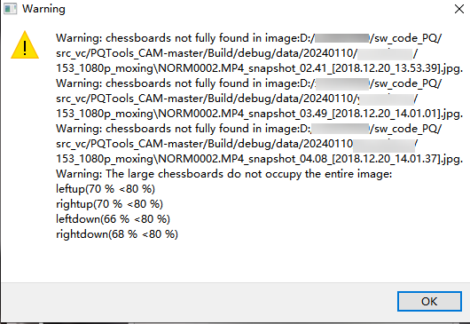

常见Warning解释：

"Warning: chessboards not fully found in image: 图片路径"，表示该图片的棋盘格没有找全，没有加入当前标定结果的计算。

"Warning: The large chessboards do not occupy the entire image: xxx"，表示标定图片中近距离大画面覆盖的图片四周的覆盖情况，目前这个结果仅作为参考值，还不能直接来判断标定的准确性。

"Warning: Missing image containing large chessboard\(chessboardW/imgW \> 60 % or chessboardH/imgH \> 60 %\)"，表示在标定图片中没有找到近距离大画面覆盖的图片，这个情况得考虑补充相应的图片。

#### LDCV3镜头标定工具界面介绍<a name="ZH-CN_TOPIC_0000002498141820"></a>

通过仪器测量出待矫正镜头的物体角度（Object Angle）与图像高度（Image Height）关系表，将图像高度以毫米（mm）为单位，作为一列放在txt文件中，物体角度以度（°）为单位，作为第二列放在txt文件中，用逗号隔开。数据格式如下所示：

3.95386,-65.00008,

3.40029,-62.40004,

最少需要包含4组测量数据，测量结果准备好后，打开Ldcv3标定工具界面，导入txt文件；如[Figure 1](#fig14418439281)所示。

需要配置使用的sensor的像素大小（PixelSize），例如2.9000。图像的宽度（Image Width），图像的高度（Image Height）。

**图 1**  LDCV3镜头标定页面<a name="fig14418439281"></a>  
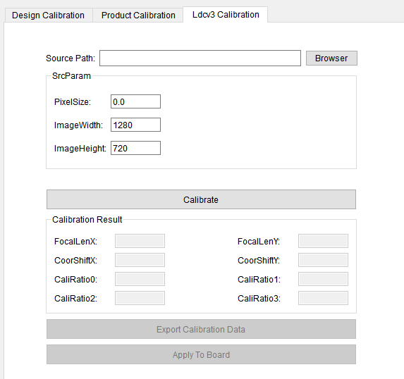

对于LDCV3镜头标定页面来说：

-   结果显示区域：用于显示标定完成后生成的标定结果参数\(Calibration Result\)；
    -   FocalLenX、FocalLenY表示焦距，取值范围\[64, 23420\]
    -   CoorShiftX、CoorShiftY表示光心\[0，8192\]，但具体生效范围：CoorShiftX，\[W\*0.35, W\*0.65\]；CoorShiftY，\[H\*0.35, H\*0.65\]\(W、H表示输入图片宽高\)。
    -   CaliRatio0\~3表示畸变系数。

-   Sensor和镜头装配时要尽量保证sensor中心和镜头光心对齐，没有偏差。如果光心偏差会导致LDCV3矫正效果变差。有条件的情况下，可以拍摄多组棋盘格图片，在DIS标定界面使用模型标定“Design Calibration”，得到PrincipalPtX和PrincipalPtY标定结果，将该值替换CoorShiftX、CoorShiftY值。以获得更好的矫正效果。
-   镜头测试数据中的视场角范围需要尽量大，能覆盖sensor的视场角要求。镜头测量数据的角度间隔需要尽量小，比如间隔一度测量一次。这样的镜头数据才能让LDCV3的矫正效果更好。
-   PixelSize，分辨率值，镜头测量数据，这几个数据需要都填正确，生成的LDCV3参数才能写入板端接口。如果PixelSize不正确，或者镜头测量数据不准确，都有可能导致生成的LDCV3参数报错。这时需要重新检查PixelSize，分辨率值，或者重新测量镜头数据。

    > **须知：** 
    >-   模型、产线标定下发板端前需将VI LDC页面的VI LDC Base项中的LDC base.ldc\_version设置成LDC\_V2并下发板端，下发成功后数据更新至VI LDC页面的VI LDC V2项。
    >-   Ldcv3标定下发板端前需将VI LDC页面的VI LDC Base项中的LDC base.ldc\_version设置成LDC\_V3并下发板端，下发成功后数据更新至VI LDC页面的VI LDC V3项。

### Dis Debug陀螺仪工具使用说明<a name="ZH-CN_TOPIC_0000002498301826"></a>


#### 使用要求<a name="ZH-CN_TOPIC_0000002530061731"></a>

需要sensor支持DIS功能。启动板端业务前需要加载陀螺仪相关ko，启动业务的ini文件中需要有\[motionfusion\]相关配置。

#### 界面介绍<a name="ZH-CN_TOPIC_0000002530221731"></a>

**图 1**  陀螺仪界面<a name="fig04507376612"></a>  

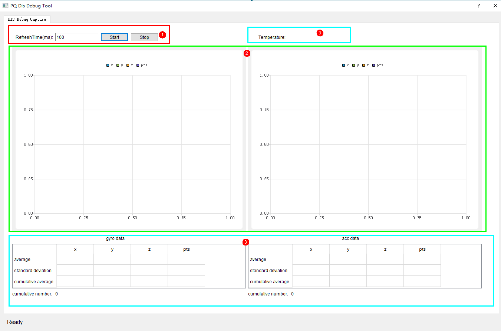

> **须知：** 
>图中①为输入区，②为图像区，③为数据显示区

#### 使用步骤<a name="ZH-CN_TOPIC_0000002530061793"></a>

1.  打开工具后设置RefreshTime后，点击Start按钮开始获取。
2.  需要停止时点击Stop按钮。

获取到数据后，在统计图上左键框选可以放大该区域图像，右键点击可以缩小。

#### 结果说明<a name="ZH-CN_TOPIC_0000002530221685"></a>

**图 1**  显示陀螺仪获取的数据<a name="fig695181311117"></a>  

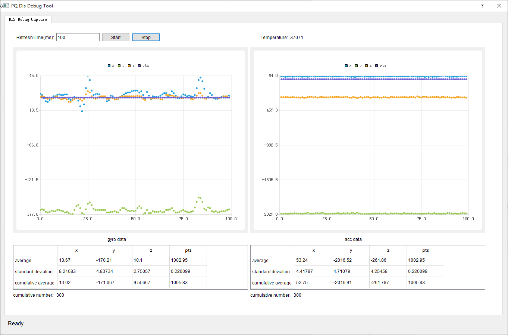

结果分为两部分，左半部分为gyro data，右半部分为acc data。以左半部分为例，图中有x、y、z、pts四种数据，横坐标为数据顺序数，用颜色来区分在图中是哪些点，其中pts为pts的间隔（由于pts的单位是微秒，间隔值较大，为了放入一幅图中，已将其除以100），表中average为平均值，standard deviation为标准差，cumulative average为累计均值，cumulative number为累计数据条数。右上角Temperature为温度。

### 工具参数联动使用说明<a name="ZH-CN_TOPIC_0000002530221621"></a>


#### 参数联动规则<a name="ZH-CN_TOPIC_0000002530061671"></a>

当有约束的参数被用户修改时，满足联动条件约束的一个或多个参数值会被自动修改为最接近的有效值，并下发数据到板端。

#### 参数联动列表<a name="ZH-CN_TOPIC_0000002498301728"></a>

目前已支持的参数列表和限制条件，如[表1](#_table14781114164310)所示。

**表 1**  参数联动列表

<a name="_table14781114164310"></a>
<table><thead align="left"><tr id="row2960mcpsimp"><th class="cellrowborder" valign="top" id="mcps1.2.6.1.1"><p id="p2962mcpsimp"><a name="p2962mcpsimp"></a><a name="p2962mcpsimp"></a>联动参数所属功能模块</p>
</th>
<th class="cellrowborder" colspan="3" valign="top" id="mcps1.2.6.1.2"><p id="p2964mcpsimp"><a name="p2964mcpsimp"></a><a name="p2964mcpsimp"></a>联动参数</p>
</th>
<th class="cellrowborder" valign="top" id="mcps1.2.6.1.3"><p id="p2966mcpsimp"><a name="p2966mcpsimp"></a><a name="p2966mcpsimp"></a>联动规则</p>
</th>
</tr>
</thead>
<tbody><tr id="row2968mcpsimp"><td class="cellrowborder" rowspan="2" valign="top" headers="mcps1.2.6.1.1 "><p id="p2970mcpsimp"><a name="p2970mcpsimp"></a><a name="p2970mcpsimp"></a>AE Route</p>
</td>
<td class="cellrowborder" colspan="3" valign="top" headers="mcps1.2.6.1.2 "><p id="p2972mcpsimp"><a name="p2972mcpsimp"></a><a name="p2972mcpsimp"></a>AE Route. TotalNum</p>
</td>
<td class="cellrowborder" valign="top" headers="mcps1.2.6.1.3 "><p id="p2974mcpsimp"><a name="p2974mcpsimp"></a><a name="p2974mcpsimp"></a>要小于等于RouteNode的节点个数</p>
</td>
</tr>
<tr id="row2975mcpsimp"><td class="cellrowborder" colspan="3" valign="top" headers="mcps1.2.6.1.1 mcps1.2.6.1.2 "><p id="p2977mcpsimp"><a name="p2977mcpsimp"></a><a name="p2977mcpsimp"></a>AE RouteEx. TotalNum</p>
</td>
<td class="cellrowborder" valign="top" headers="mcps1.2.6.1.2 "><p id="p2979mcpsimp"><a name="p2979mcpsimp"></a><a name="p2979mcpsimp"></a>要小于等于RouteExNode的节点个数</p>
</td>
</tr>
<tr id="row2980mcpsimp"><td class="cellrowborder" rowspan="8" valign="top" headers="mcps1.2.6.1.1 "><p id="p2982mcpsimp"><a name="p2982mcpsimp"></a><a name="p2982mcpsimp"></a>WBAttr</p>
</td>
<td class="cellrowborder" rowspan="4" valign="top" headers="mcps1.2.6.1.2 "><p id="p2984mcpsimp"><a name="p2984mcpsimp"></a><a name="p2984mcpsimp"></a>AWBAttr</p>
</td>
<td class="cellrowborder" colspan="2" valign="top" headers="mcps1.2.6.1.2 "><p id="p2986mcpsimp"><a name="p2986mcpsimp"></a><a name="p2986mcpsimp"></a>stCTLimit.HighRgLimit</p>
</td>
<td class="cellrowborder" valign="top" headers="mcps1.2.6.1.3 "><p id="p2988mcpsimp"><a name="p2988mcpsimp"></a><a name="p2988mcpsimp"></a>手动模式下用户设定高色温下的最大R增益，8bit小数精度，取值范围：[0x0, 0xFFF]</p>
</td>
</tr>
<tr id="row2989mcpsimp"><td class="cellrowborder" colspan="2" valign="top" headers="mcps1.2.6.1.1 mcps1.2.6.1.2 "><p id="p2991mcpsimp"><a name="p2991mcpsimp"></a><a name="p2991mcpsimp"></a>stCTLimit.HighBgLimit</p>
</td>
<td class="cellrowborder" valign="top" headers="mcps1.2.6.1.2 "><p id="p2993mcpsimp"><a name="p2993mcpsimp"></a><a name="p2993mcpsimp"></a>手动模式下用户设定高色温下的最小B增益，8bit小数精度，取值范围：[0x0, 0xFFF]</p>
</td>
</tr>
<tr id="row2994mcpsimp"><td class="cellrowborder" colspan="2" valign="top" headers="mcps1.2.6.1.1 mcps1.2.6.1.2 "><p id="p2996mcpsimp"><a name="p2996mcpsimp"></a><a name="p2996mcpsimp"></a>stCTLimit.LowRgLimit</p>
</td>
<td class="cellrowborder" valign="top" headers="mcps1.2.6.1.2 "><p id="p2998mcpsimp"><a name="p2998mcpsimp"></a><a name="p2998mcpsimp"></a>手动模式下用户设定低色温下的最小R增益，8bit小数精度，取值范围：[0x0, u16HighRgLimit)</p>
</td>
</tr>
<tr id="row2999mcpsimp"><td class="cellrowborder" colspan="2" valign="top" headers="mcps1.2.6.1.1 mcps1.2.6.1.2 "><p id="p3001mcpsimp"><a name="p3001mcpsimp"></a><a name="p3001mcpsimp"></a>stCTLimit.LowBgLimit</p>
</td>
<td class="cellrowborder" valign="top" headers="mcps1.2.6.1.2 "><p id="p3003mcpsimp"><a name="p3003mcpsimp"></a><a name="p3003mcpsimp"></a>手动模式下用户设定低色温下的最大B增益，8bit小数精度，取值范围：(u16HighBgLimit, 0xFFF]</p>
</td>
</tr>
<tr id="row3004mcpsimp"><td class="cellrowborder" rowspan="4" valign="top" headers="mcps1.2.6.1.1 "><p id="p3006mcpsimp"><a name="p3006mcpsimp"></a><a name="p3006mcpsimp"></a>AWBAttrEx</p>
</td>
<td class="cellrowborder" colspan="2" valign="top" headers="mcps1.2.6.1.2 "><p id="p3008mcpsimp"><a name="p3008mcpsimp"></a><a name="p3008mcpsimp"></a>stInOrOut.LowStart</p>
</td>
<td class="cellrowborder" valign="top" headers="mcps1.2.6.1.2 "><p id="p3010mcpsimp"><a name="p3010mcpsimp"></a><a name="p3010mcpsimp"></a>将位于低色温范围内的像素权重调低，低色温区起始值，建议5000K</p>
</td>
</tr>
<tr id="row3011mcpsimp"><td class="cellrowborder" colspan="2" valign="top" headers="mcps1.2.6.1.1 mcps1.2.6.1.2 "><p id="p3013mcpsimp"><a name="p3013mcpsimp"></a><a name="p3013mcpsimp"></a>stInOrOut.LowStop</p>
</td>
<td class="cellrowborder" valign="top" headers="mcps1.2.6.1.2 "><p id="p3015mcpsimp"><a name="p3015mcpsimp"></a><a name="p3015mcpsimp"></a>将位于低色温范围内的像素权重调低，低色温区终止值，建议4500K。</p>
<p id="p3016mcpsimp"><a name="p3016mcpsimp"></a><a name="p3016mcpsimp"></a>取值范围：(0, u16LowStart)</p>
</td>
</tr>
<tr id="row3017mcpsimp"><td class="cellrowborder" colspan="2" valign="top" headers="mcps1.2.6.1.1 mcps1.2.6.1.2 "><p id="p3019mcpsimp"><a name="p3019mcpsimp"></a><a name="p3019mcpsimp"></a>stInOrOut.HighStart</p>
</td>
<td class="cellrowborder" valign="top" headers="mcps1.2.6.1.2 "><p id="p3021mcpsimp"><a name="p3021mcpsimp"></a><a name="p3021mcpsimp"></a>将位于高色温范围内的像素权重调低，高色温区起始值，建议6500K。</p>
<p id="p3022mcpsimp"><a name="p3022mcpsimp"></a><a name="p3022mcpsimp"></a>取值范围：(u16LowStart, 0xFFFF]</p>
</td>
</tr>
<tr id="row3023mcpsimp"><td class="cellrowborder" colspan="2" valign="top" headers="mcps1.2.6.1.1 mcps1.2.6.1.2 "><p id="p3025mcpsimp"><a name="p3025mcpsimp"></a><a name="p3025mcpsimp"></a>stInOrOut.HighStop</p>
</td>
<td class="cellrowborder" valign="top" headers="mcps1.2.6.1.2 "><p id="p3027mcpsimp"><a name="p3027mcpsimp"></a><a name="p3027mcpsimp"></a>将位于高色温范围内的像素权重调低，高色温区终止值，建议8000K。</p>
<p id="p3028mcpsimp"><a name="p3028mcpsimp"></a><a name="p3028mcpsimp"></a>取值范围：(u16HighStart, 0xFFFF]</p>
</td>
</tr>
<tr id="row3029mcpsimp"><td class="cellrowborder" rowspan="2" valign="top" headers="mcps1.2.6.1.1 "><p id="p3031mcpsimp"><a name="p3031mcpsimp"></a><a name="p3031mcpsimp"></a>Shading Lut Attr</p>
</td>
<td class="cellrowborder" colspan="3" valign="top" headers="mcps1.2.6.1.2 "><p id="p3033mcpsimp"><a name="p3033mcpsimp"></a><a name="p3033mcpsimp"></a>XGridWidth</p>
</td>
<td class="cellrowborder" rowspan="2" valign="top" headers="mcps1.2.6.1.3 "><p id="p3035mcpsimp"><a name="p3035mcpsimp"></a><a name="p3035mcpsimp"></a>取值范围：[4, 255]</p>
</td>
</tr>
<tr id="row3036mcpsimp"><td class="cellrowborder" colspan="3" valign="top" headers="mcps1.2.6.1.1 mcps1.2.6.1.2 "><p id="p3038mcpsimp"><a name="p3038mcpsimp"></a><a name="p3038mcpsimp"></a>YGridWidth</p>
</td>
</tr>
<tr id="row3039mcpsimp"><td class="cellrowborder" valign="top" headers="mcps1.2.6.1.1 "><p id="p3041mcpsimp"><a name="p3041mcpsimp"></a><a name="p3041mcpsimp"></a>DefectPixel</p>
</td>
<td class="cellrowborder" colspan="3" valign="top" headers="mcps1.2.6.1.2 "><p id="p3043mcpsimp"><a name="p3043mcpsimp"></a><a name="p3043mcpsimp"></a>DP Static Calibrate. CountMax</p>
</td>
<td class="cellrowborder" valign="top" headers="mcps1.2.6.1.3 "><p id="p3045mcpsimp"><a name="p3045mcpsimp"></a><a name="p3045mcpsimp"></a>图像分辨率小于等于4K时，STATIC_DP_COUNT_MAX = 4096</p>
<p id="p3046mcpsimp"><a name="p3046mcpsimp"></a><a name="p3046mcpsimp"></a>图像分辨率大于4K时，STATIC_DP_COUNT_MAX = 8192</p>
</td>
</tr>
<tr id="row3047mcpsimp"><td class="cellrowborder" rowspan="2" valign="top" headers="mcps1.2.6.1.1 "><p id="p3049mcpsimp"><a name="p3049mcpsimp"></a><a name="p3049mcpsimp"></a>RadialCROP</p>
</td>
<td class="cellrowborder" rowspan="2" colspan="2" valign="top" headers="mcps1.2.6.1.2 "><p id="p3051mcpsimp"><a name="p3051mcpsimp"></a><a name="p3051mcpsimp"></a>RadialCROP</p>
</td>
<td class="cellrowborder" valign="top" headers="mcps1.2.6.1.2 "><p id="p3053mcpsimp"><a name="p3053mcpsimp"></a><a name="p3053mcpsimp"></a>stCenterCoor.X</p>
</td>
<td class="cellrowborder" valign="top" headers="mcps1.2.6.1.3 "><p id="p3055mcpsimp"><a name="p3055mcpsimp"></a><a name="p3055mcpsimp"></a>取值范围：[0,u32Width -1]，默认为：u32Width/2</p>
</td>
</tr>
<tr id="row3056mcpsimp"><td class="cellrowborder" valign="top" headers="mcps1.2.6.1.1 "><p id="p3058mcpsimp"><a name="p3058mcpsimp"></a><a name="p3058mcpsimp"></a>stCenterCoor.Y</p>
</td>
<td class="cellrowborder" valign="top" headers="mcps1.2.6.1.2 "><p id="p3060mcpsimp"><a name="p3060mcpsimp"></a><a name="p3060mcpsimp"></a>取值范围：[0,u32Height -1]，默认为：u32Height/2</p>
</td>
</tr>
<tr id="row3061mcpsimp"><td class="cellrowborder" valign="top" headers="mcps1.2.6.1.1 "><p id="p3063mcpsimp"><a name="p3063mcpsimp"></a><a name="p3063mcpsimp"></a>FPN</p>
</td>
<td class="cellrowborder" colspan="2" valign="top" headers="mcps1.2.6.1.2 "><p id="p3065mcpsimp"><a name="p3065mcpsimp"></a><a name="p3065mcpsimp"></a>FPNCalibrate</p>
</td>
<td class="cellrowborder" valign="top" headers="mcps1.2.6.1.2 "><p id="p3067mcpsimp"><a name="p3067mcpsimp"></a><a name="p3067mcpsimp"></a>FrameNum</p>
</td>
<td class="cellrowborder" valign="top" headers="mcps1.2.6.1.3 "><p id="p3069mcpsimp"><a name="p3069mcpsimp"></a><a name="p3069mcpsimp"></a>标定的帧数，取值范围为{1，2，4，8，16}，即为2的整数次幂，FPN不支持在离线模式下进行标定，向下剪切。</p>
</td>
</tr>
<tr id="row3070mcpsimp"><td class="cellrowborder" rowspan="2" valign="top" headers="mcps1.2.6.1.1 "><p id="p3072mcpsimp"><a name="p3072mcpsimp"></a><a name="p3072mcpsimp"></a>Fisheye</p>
</td>
<td class="cellrowborder" rowspan="2" colspan="2" valign="top" headers="mcps1.2.6.1.2 "><p id="p3074mcpsimp"><a name="p3074mcpsimp"></a><a name="p3074mcpsimp"></a>FisheyeAttr</p>
</td>
<td class="cellrowborder" valign="top" headers="mcps1.2.6.1.2 "><p id="p3076mcpsimp"><a name="p3076mcpsimp"></a><a name="p3076mcpsimp"></a>MountMode</p>
</td>
<td class="cellrowborder" valign="top" headers="mcps1.2.6.1.3 "><p id="p3078mcpsimp"><a name="p3078mcpsimp"></a><a name="p3078mcpsimp"></a>360校正模式下不支持壁装，MountMode切换为地装</p>
</td>
</tr>
<tr id="row3079mcpsimp"><td class="cellrowborder" valign="top" headers="mcps1.2.6.1.1 "><p id="p3081mcpsimp"><a name="p3081mcpsimp"></a><a name="p3081mcpsimp"></a>ViewMode</p>
</td>
<td class="cellrowborder" valign="top" headers="mcps1.2.6.1.2 "><p id="p3083mcpsimp"><a name="p3083mcpsimp"></a><a name="p3083mcpsimp"></a>180校正模式下不支持顶装和地装，MountMode切换为壁装</p>
</td>
</tr>
<tr id="row3084mcpsimp"><td class="cellrowborder" rowspan="2" valign="top" headers="mcps1.2.6.1.1 "><p id="p3086mcpsimp"><a name="p3086mcpsimp"></a><a name="p3086mcpsimp"></a>VencEx</p>
</td>
<td class="cellrowborder" rowspan="2" colspan="2" valign="top" headers="mcps1.2.6.1.2 "><p id="p3088mcpsimp"><a name="p3088mcpsimp"></a><a name="p3088mcpsimp"></a>ROI Attributes</p>
</td>
<td class="cellrowborder" valign="top" headers="mcps1.2.6.1.2 "><p id="p3090mcpsimp"><a name="p3090mcpsimp"></a><a name="p3090mcpsimp"></a>Qp</p>
</td>
<td class="cellrowborder" valign="top" headers="mcps1.2.6.1.3 "><p id="p3092mcpsimp"><a name="p3092mcpsimp"></a><a name="p3092mcpsimp"></a>当QP模式为FALSE时，s32Qp为QP偏移，s32Qp范围[-51,51]；</p>
<p id="p3093mcpsimp"><a name="p3093mcpsimp"></a><a name="p3093mcpsimp"></a>当QP模式为TRUE时，s32Qp为宏块QP值，s32Qp范围[0,51]</p>
</td>
</tr>
<tr id="row3094mcpsimp"><td class="cellrowborder" valign="top" headers="mcps1.2.6.1.1 "><p id="p3096mcpsimp"><a name="p3096mcpsimp"></a><a name="p3096mcpsimp"></a>stRect.X/Y/Width/Height</p>
</td>
<td class="cellrowborder" valign="top" headers="mcps1.2.6.1.2 "><p id="p3098mcpsimp"><a name="p3098mcpsimp"></a><a name="p3098mcpsimp"></a>s32X、s32Y、u32Width、u32Height必须是16对齐，向下剪切</p>
</td>
</tr>
<tr id="row3099mcpsimp"><td class="cellrowborder" rowspan="3" valign="top" headers="mcps1.2.6.1.1 "><p id="p3101mcpsimp"><a name="p3101mcpsimp"></a><a name="p3101mcpsimp"></a>FSWDR</p>
</td>
<td class="cellrowborder" rowspan="3" colspan="2" valign="top" headers="mcps1.2.6.1.2 "><p id="p3103mcpsimp"><a name="p3103mcpsimp"></a><a name="p3103mcpsimp"></a>FSWDR</p>
</td>
<td class="cellrowborder" valign="top" headers="mcps1.2.6.1.2 "><p id="p3105mcpsimp"><a name="p3105mcpsimp"></a><a name="p3105mcpsimp"></a>LongThr</p>
</td>
<td class="cellrowborder" valign="top" headers="mcps1.2.6.1.3 "><p id="p3107mcpsimp"><a name="p3107mcpsimp"></a><a name="p3107mcpsimp"></a>取值范围：[0, u16ShortThr]</p>
</td>
</tr>
<tr id="row3108mcpsimp"><td class="cellrowborder" valign="top" headers="mcps1.2.6.1.1 "><p id="p3110mcpsimp"><a name="p3110mcpsimp"></a><a name="p3110mcpsimp"></a>ForceLongLowThr</p>
</td>
<td class="cellrowborder" valign="top" headers="mcps1.2.6.1.2 "><p id="p3112mcpsimp"><a name="p3112mcpsimp"></a><a name="p3112mcpsimp"></a>取值范围：[0, ForceLongHigThr]</p>
</td>
</tr>
<tr id="row3113mcpsimp"><td class="cellrowborder" valign="top" headers="mcps1.2.6.1.1 "><p id="p3115mcpsimp"><a name="p3115mcpsimp"></a><a name="p3115mcpsimp"></a>u8MdThrLowGain</p>
</td>
<td class="cellrowborder" valign="top" headers="mcps1.2.6.1.2 "><p id="p3117mcpsimp"><a name="p3117mcpsimp"></a><a name="p3117mcpsimp"></a>取值范围：[0, u8MdThrHigGain]</p>
</td>
</tr>
<tr id="row3118mcpsimp"><td class="cellrowborder" valign="top" headers="mcps1.2.6.1.1 "><p id="p3120mcpsimp"><a name="p3120mcpsimp"></a><a name="p3120mcpsimp"></a>DRC</p>
</td>
<td class="cellrowborder" colspan="2" valign="top" headers="mcps1.2.6.1.2 "><p id="p3122mcpsimp"><a name="p3122mcpsimp"></a><a name="p3122mcpsimp"></a>Common Params</p>
</td>
<td class="cellrowborder" valign="top" headers="mcps1.2.6.1.2 "><p id="p3124mcpsimp"><a name="p3124mcpsimp"></a><a name="p3124mcpsimp"></a>Auto.StrengthMin</p>
</td>
<td class="cellrowborder" valign="top" headers="mcps1.2.6.1.3 "><p id="p3126mcpsimp"><a name="p3126mcpsimp"></a><a name="p3126mcpsimp"></a>取值范围：[0,StrengthMax]</p>
</td>
</tr>
<tr id="row3127mcpsimp"><td class="cellrowborder" rowspan="11" valign="top" headers="mcps1.2.6.1.1 "><p id="p3129mcpsimp"><a name="p3129mcpsimp"></a><a name="p3129mcpsimp"></a>3DNR X</p>
</td>
<td class="cellrowborder" rowspan="6" colspan="2" valign="top" headers="mcps1.2.6.1.2 "><p id="p3131mcpsimp"><a name="p3131mcpsimp"></a><a name="p3131mcpsimp"></a>VI_3DNRAttr</p>
</td>
<td class="cellrowborder" valign="top" headers="mcps1.2.6.1.2 "><p id="p3133mcpsimp"><a name="p3133mcpsimp"></a><a name="p3133mcpsimp"></a>sth/sthd</p>
</td>
<td class="cellrowborder" valign="top" headers="mcps1.2.6.1.3 "><p id="p3135mcpsimp"><a name="p3135mcpsimp"></a><a name="p3135mcpsimp"></a>sth大等于sthd</p>
</td>
</tr>
<tr id="row3136mcpsimp"><td class="cellrowborder" valign="top" headers="mcps1.2.6.1.1 "><p id="p3138mcpsimp"><a name="p3138mcpsimp"></a><a name="p3138mcpsimp"></a>math/mathd</p>
</td>
<td class="cellrowborder" valign="top" headers="mcps1.2.6.1.2 "><p id="p3140mcpsimp"><a name="p3140mcpsimp"></a><a name="p3140mcpsimp"></a>math大等于mathd</p>
</td>
</tr>
<tr id="row3141mcpsimp"><td class="cellrowborder" valign="top" headers="mcps1.2.6.1.1 "><p id="p3143mcpsimp"><a name="p3143mcpsimp"></a><a name="p3143mcpsimp"></a>Dert</p>
</td>
<td class="cellrowborder" valign="top" headers="mcps1.2.6.1.2 "><p id="p3145mcpsimp"><a name="p3145mcpsimp"></a><a name="p3145mcpsimp"></a>Dert[0]等于0时,SelRt[0]和SelRt[1]值为16</p>
</td>
</tr>
<tr id="row3146mcpsimp"><td class="cellrowborder" valign="top" headers="mcps1.2.6.1.1 "><p id="p3148mcpsimp"><a name="p3148mcpsimp"></a><a name="p3148mcpsimp"></a>Dert</p>
</td>
<td class="cellrowborder" valign="top" headers="mcps1.2.6.1.2 "><p id="p3150mcpsimp"><a name="p3150mcpsimp"></a><a name="p3150mcpsimp"></a>Dert[0]不等于0时, nXsfn[0~2]取值范围[3,max]</p>
</td>
</tr>
<tr id="row3151mcpsimp"><td class="cellrowborder" valign="top" headers="mcps1.2.6.1.1 "><p id="p3153mcpsimp"><a name="p3153mcpsimp"></a><a name="p3153mcpsimp"></a>ref</p>
</td>
<td class="cellrowborder" valign="top" headers="mcps1.2.6.1.2 "><p id="p3155mcpsimp"><a name="p3155mcpsimp"></a><a name="p3155mcpsimp"></a>ref[1]等于0时, ref[0]等于0，en[3]等于0</p>
</td>
</tr>
<tr id="row3156mcpsimp"><td class="cellrowborder" valign="top" headers="mcps1.2.6.1.1 "><p id="p3158mcpsimp"><a name="p3158mcpsimp"></a><a name="p3158mcpsimp"></a>en</p>
</td>
<td class="cellrowborder" valign="top" headers="mcps1.2.6.1.2 "><p id="p3160mcpsimp"><a name="p3160mcpsimp"></a><a name="p3160mcpsimp"></a>en[2]等于0时, en[3]等于0</p>
</td>
</tr>
<tr id="row3161mcpsimp"><td class="cellrowborder" rowspan="5" colspan="2" valign="top" headers="mcps1.2.6.1.1 mcps1.2.6.1.2 "><p id="p3163mcpsimp"><a name="p3163mcpsimp"></a><a name="p3163mcpsimp"></a>VPSS_3DNRAttr</p>
</td>
<td class="cellrowborder" valign="top" headers="mcps1.2.6.1.2 "><p id="p3165mcpsimp"><a name="p3165mcpsimp"></a><a name="p3165mcpsimp"></a>NrMotionMode 等于COMPENSATE</p>
</td>
<td class="cellrowborder" valign="top" headers="mcps1.2.6.1.2 "><p id="p3167mcpsimp"><a name="p3167mcpsimp"></a><a name="p3167mcpsimp"></a>1. biPath[0]、biPath[1]都为0</p>
<p id="p3168mcpsimp"><a name="p3168mcpsimp"></a><a name="p3168mcpsimp"></a>2. AdvMath值为1</p>
</td>
</tr>
<tr id="row3169mcpsimp"><td class="cellrowborder" valign="top" headers="mcps1.2.6.1.1 "><p id="p3171mcpsimp"><a name="p3171mcpsimp"></a><a name="p3171mcpsimp"></a>NrMotionMode等于NORMAL</p>
</td>
<td class="cellrowborder" valign="top" headers="mcps1.2.6.1.2 "><p id="p3173mcpsimp"><a name="p3173mcpsimp"></a><a name="p3173mcpsimp"></a>rftIdx[0]值为2</p>
</td>
</tr>
<tr id="row3174mcpsimp"><td class="cellrowborder" valign="top" headers="mcps1.2.6.1.1 "><p id="p3176mcpsimp"><a name="p3176mcpsimp"></a><a name="p3176mcpsimp"></a>NrMotionMode等于NORMAL 并且AdvMath等于1</p>
</td>
<td class="cellrowborder" valign="top" headers="mcps1.2.6.1.2 "><p id="p3178mcpsimp"><a name="p3178mcpsimp"></a><a name="p3178mcpsimp"></a>mXmabw[0]值为4</p>
</td>
</tr>
<tr id="row3179mcpsimp"><td class="cellrowborder" valign="top" headers="mcps1.2.6.1.1 "><p id="p3181mcpsimp"><a name="p3181mcpsimp"></a><a name="p3181mcpsimp"></a>NrMotionMode等于NORMAL 并且 biPath[0]等于0</p>
</td>
<td class="cellrowborder" valign="top" headers="mcps1.2.6.1.2 "><p id="p3183mcpsimp"><a name="p3183mcpsimp"></a><a name="p3183mcpsimp"></a>1. AdvMath值为0</p>
<p id="p3184mcpsimp"><a name="p3184mcpsimp"></a><a name="p3184mcpsimp"></a>2. mXmabw[0]取值[5,9]</p>
</td>
</tr>
<tr id="row3185mcpsimp"><td class="cellrowborder" valign="top" headers="mcps1.2.6.1.1 "><p id="p3187mcpsimp"><a name="p3187mcpsimp"></a><a name="p3187mcpsimp"></a>NrMotionMode等于NORMAL 并且 biPath[1]等于0</p>
</td>
<td class="cellrowborder" valign="top" headers="mcps1.2.6.1.2 "><p id="p3189mcpsimp"><a name="p3189mcpsimp"></a><a name="p3189mcpsimp"></a>mXmabw[2]取值[5,9]</p>
</td>
</tr>
</tbody>
</table>

## 参数详细说明<a name="ZH-CN_TOPIC_0000002498141708"></a>

下面将详细列出界面上各模块参数对应SDK的API函数参考，这些参数说明请参考表1\~表54。

> **须知：** 
>生态版本不支持拼接、MCF相关功能。


### Hi3403V100参数<a name="ZH-CN_TOPIC_0000002498301796"></a>

**表 1**  TOP设置对应API

<a name="_toc51692651"></a>
<table><thead align="left"><tr id="row3200mcpsimp"><th class="cellrowborder" valign="top" width="34%" id="mcps1.2.3.1.1"><p id="p3202mcpsimp"><a name="p3202mcpsimp"></a><a name="p3202mcpsimp"></a>功能模块</p>
</th>
<th class="cellrowborder" valign="top" width="66%" id="mcps1.2.3.1.2"><p id="p3204mcpsimp"><a name="p3204mcpsimp"></a><a name="p3204mcpsimp"></a>对应SDK API</p>
</th>
</tr>
</thead>
<tbody><tr id="row3206mcpsimp"><td class="cellrowborder" valign="top" width="34%" headers="mcps1.2.3.1.1 "><p id="p3208mcpsimp"><a name="p3208mcpsimp"></a><a name="p3208mcpsimp"></a>Mode Handle</p>
</td>
<td class="cellrowborder" valign="top" width="66%" headers="mcps1.2.3.1.2 "><p id="p3210mcpsimp"><a name="p3210mcpsimp"></a><a name="p3210mcpsimp"></a>无</p>
</td>
</tr>
<tr id="row3211mcpsimp"><td class="cellrowborder" valign="top" width="34%" headers="mcps1.2.3.1.1 "><p id="p3213mcpsimp"><a name="p3213mcpsimp"></a><a name="p3213mcpsimp"></a>Bypass Setting</p>
</td>
<td class="cellrowborder" valign="top" width="66%" headers="mcps1.2.3.1.2 "><p id="p3215mcpsimp"><a name="p3215mcpsimp"></a><a name="p3215mcpsimp"></a>ot_mpi_isp_set_module_ctrl</p>
<p id="p3216mcpsimp"><a name="p3216mcpsimp"></a><a name="p3216mcpsimp"></a>ot_mpi_isp_get_module_ctrl</p>
</td>
</tr>
<tr id="row3217mcpsimp"><td class="cellrowborder" valign="top" width="34%" headers="mcps1.2.3.1.1 "><p id="p3219mcpsimp"><a name="p3219mcpsimp"></a><a name="p3219mcpsimp"></a>Fmw State</p>
</td>
<td class="cellrowborder" valign="top" width="66%" headers="mcps1.2.3.1.2 "><p id="p3221mcpsimp"><a name="p3221mcpsimp"></a><a name="p3221mcpsimp"></a>ot_mpi_isp_set_fmw_state</p>
<p id="p3222mcpsimp"><a name="p3222mcpsimp"></a><a name="p3222mcpsimp"></a>ot_mpi_isp_get_fmw_state</p>
</td>
</tr>
<tr id="row3223mcpsimp"><td class="cellrowborder" valign="top" width="34%" headers="mcps1.2.3.1.1 "><p id="p3225mcpsimp"><a name="p3225mcpsimp"></a><a name="p3225mcpsimp"></a>CTRL Param</p>
</td>
<td class="cellrowborder" valign="top" width="66%" headers="mcps1.2.3.1.2 "><p id="p3227mcpsimp"><a name="p3227mcpsimp"></a><a name="p3227mcpsimp"></a>ot_mpi_isp_set_ctrl_param</p>
<p id="p3228mcpsimp"><a name="p3228mcpsimp"></a><a name="p3228mcpsimp"></a>ot_mpi_isp_get_ctrl_param</p>
</td>
</tr>
<tr id="row3229mcpsimp"><td class="cellrowborder" valign="top" width="34%" headers="mcps1.2.3.1.1 "><p id="p3231mcpsimp"><a name="p3231mcpsimp"></a><a name="p3231mcpsimp"></a>MOD Param</p>
</td>
<td class="cellrowborder" valign="top" width="66%" headers="mcps1.2.3.1.2 "><p id="p3233mcpsimp"><a name="p3233mcpsimp"></a><a name="p3233mcpsimp"></a>ot_mpi_isp_set_mod_param</p>
<p id="p3234mcpsimp"><a name="p3234mcpsimp"></a><a name="p3234mcpsimp"></a>ot_mpi_isp_get_mod_param</p>
</td>
</tr>
</tbody>
</table>

**表 2**  PubAttr设置对应API

<a name="table3235mcpsimp"></a>
<table><thead align="left"><tr id="row3241mcpsimp"><th class="cellrowborder" valign="top" width="34%" id="mcps1.2.3.1.1"><p id="p3243mcpsimp"><a name="p3243mcpsimp"></a><a name="p3243mcpsimp"></a>功能模块</p>
</th>
<th class="cellrowborder" valign="top" width="66%" id="mcps1.2.3.1.2"><p id="p3245mcpsimp"><a name="p3245mcpsimp"></a><a name="p3245mcpsimp"></a>对应SDK API</p>
</th>
</tr>
</thead>
<tbody><tr id="row3247mcpsimp"><td class="cellrowborder" valign="top" width="34%" headers="mcps1.2.3.1.1 "><p id="p3249mcpsimp"><a name="p3249mcpsimp"></a><a name="p3249mcpsimp"></a>PubAttr</p>
</td>
<td class="cellrowborder" valign="top" width="66%" headers="mcps1.2.3.1.2 "><p id="p3251mcpsimp"><a name="p3251mcpsimp"></a><a name="p3251mcpsimp"></a>ot_mpi_isp_set_pub_attr</p>
<p id="p3252mcpsimp"><a name="p3252mcpsimp"></a><a name="p3252mcpsimp"></a>ot_mpi_isp_get_pub_attr</p>
</td>
</tr>
</tbody>
</table>

**表 3**  ISPInfo设置对应API

<a name="table3253mcpsimp"></a>
<table><thead align="left"><tr id="row3259mcpsimp"><th class="cellrowborder" valign="top" width="34%" id="mcps1.2.3.1.1"><p id="p3261mcpsimp"><a name="p3261mcpsimp"></a><a name="p3261mcpsimp"></a>功能模块</p>
</th>
<th class="cellrowborder" valign="top" width="66%" id="mcps1.2.3.1.2"><p id="p3263mcpsimp"><a name="p3263mcpsimp"></a><a name="p3263mcpsimp"></a>对应SDK API</p>
</th>
</tr>
</thead>
<tbody><tr id="row3265mcpsimp"><td class="cellrowborder" valign="top" width="34%" headers="mcps1.2.3.1.1 "><p id="p3267mcpsimp"><a name="p3267mcpsimp"></a><a name="p3267mcpsimp"></a>ISPInfo</p>
</td>
<td class="cellrowborder" valign="top" width="66%" headers="mcps1.2.3.1.2 "><p id="p3269mcpsimp"><a name="p3269mcpsimp"></a><a name="p3269mcpsimp"></a>ot_mpi_isp_query_inner_state_info</p>
</td>
</tr>
</tbody>
</table>

**表 4**  ExposureAttr设置对应API

<a name="table3270mcpsimp"></a>
<table><thead align="left"><tr id="row3276mcpsimp"><th class="cellrowborder" valign="top" width="34%" id="mcps1.2.3.1.1"><p id="p3278mcpsimp"><a name="p3278mcpsimp"></a><a name="p3278mcpsimp"></a>功能模块</p>
</th>
<th class="cellrowborder" valign="top" width="66%" id="mcps1.2.3.1.2"><p id="p3280mcpsimp"><a name="p3280mcpsimp"></a><a name="p3280mcpsimp"></a>对应SDK API</p>
</th>
</tr>
</thead>
<tbody><tr id="row3282mcpsimp"><td class="cellrowborder" valign="top" width="34%" headers="mcps1.2.3.1.1 "><p id="p3284mcpsimp"><a name="p3284mcpsimp"></a><a name="p3284mcpsimp"></a>ExposureAttr</p>
</td>
<td class="cellrowborder" valign="top" width="66%" headers="mcps1.2.3.1.2 "><p id="p3286mcpsimp"><a name="p3286mcpsimp"></a><a name="p3286mcpsimp"></a>ot_mpi_isp_set_exposure_attr</p>
<p id="p3287mcpsimp"><a name="p3287mcpsimp"></a><a name="p3287mcpsimp"></a>ot_mpi_isp_get_exposure_attr</p>
</td>
</tr>
</tbody>
</table>

**表 5**  WDRExposureAttr设置对应API

<a name="table3288mcpsimp"></a>
<table><thead align="left"><tr id="row3294mcpsimp"><th class="cellrowborder" valign="top" width="34%" id="mcps1.2.3.1.1"><p id="p3296mcpsimp"><a name="p3296mcpsimp"></a><a name="p3296mcpsimp"></a>功能模块</p>
</th>
<th class="cellrowborder" valign="top" width="66%" id="mcps1.2.3.1.2"><p id="p3298mcpsimp"><a name="p3298mcpsimp"></a><a name="p3298mcpsimp"></a>对应SDK API</p>
</th>
</tr>
</thead>
<tbody><tr id="row3300mcpsimp"><td class="cellrowborder" valign="top" width="34%" headers="mcps1.2.3.1.1 "><p id="p3302mcpsimp"><a name="p3302mcpsimp"></a><a name="p3302mcpsimp"></a>WDRExposureAttr</p>
</td>
<td class="cellrowborder" valign="top" width="66%" headers="mcps1.2.3.1.2 "><p id="p3304mcpsimp"><a name="p3304mcpsimp"></a><a name="p3304mcpsimp"></a>ot_mpi_isp_set_wdr_exposure_attr</p>
<p id="p3305mcpsimp"><a name="p3305mcpsimp"></a><a name="p3305mcpsimp"></a>ot_mpi_isp_get_wdr_exposure_attr</p>
</td>
</tr>
</tbody>
</table>

**表 6**  SmartExposureAttr设置对应API

<a name="table3306mcpsimp"></a>
<table><thead align="left"><tr id="row3312mcpsimp"><th class="cellrowborder" valign="top" width="34%" id="mcps1.2.3.1.1"><p id="p3314mcpsimp"><a name="p3314mcpsimp"></a><a name="p3314mcpsimp"></a>功能模块</p>
</th>
<th class="cellrowborder" valign="top" width="66%" id="mcps1.2.3.1.2"><p id="p3316mcpsimp"><a name="p3316mcpsimp"></a><a name="p3316mcpsimp"></a>对应SDK API</p>
</th>
</tr>
</thead>
<tbody><tr id="row3318mcpsimp"><td class="cellrowborder" valign="top" width="34%" headers="mcps1.2.3.1.1 "><p id="p3320mcpsimp"><a name="p3320mcpsimp"></a><a name="p3320mcpsimp"></a>SmartExposureAttr</p>
</td>
<td class="cellrowborder" valign="top" width="66%" headers="mcps1.2.3.1.2 "><p id="p3322mcpsimp"><a name="p3322mcpsimp"></a><a name="p3322mcpsimp"></a>ot_mpi_isp_set_smart_exposure_attr</p>
<p id="p3323mcpsimp"><a name="p3323mcpsimp"></a><a name="p3323mcpsimp"></a>ot_mpi_isp_set_smart_exposure_attr</p>
</td>
</tr>
</tbody>
</table>

**表 7**  Exp Convert Param设置对应API

<a name="table3324mcpsimp"></a>
<table><thead align="left"><tr id="row3330mcpsimp"><th class="cellrowborder" valign="top" width="34%" id="mcps1.2.3.1.1"><p id="p3332mcpsimp"><a name="p3332mcpsimp"></a><a name="p3332mcpsimp"></a>功能模块</p>
</th>
<th class="cellrowborder" valign="top" width="66%" id="mcps1.2.3.1.2"><p id="p3334mcpsimp"><a name="p3334mcpsimp"></a><a name="p3334mcpsimp"></a>对应SDK API</p>
</th>
</tr>
</thead>
<tbody><tr id="row3336mcpsimp"><td class="cellrowborder" valign="top" width="34%" headers="mcps1.2.3.1.1 "><p id="p3338mcpsimp"><a name="p3338mcpsimp"></a><a name="p3338mcpsimp"></a>Exp Convert Param</p>
</td>
<td class="cellrowborder" valign="top" width="66%" headers="mcps1.2.3.1.2 "><p id="p3340mcpsimp"><a name="p3340mcpsimp"></a><a name="p3340mcpsimp"></a>ot_mpi_isp_set_exp_convert</p>
<p id="p3341mcpsimp"><a name="p3341mcpsimp"></a><a name="p3341mcpsimp"></a>ot_mpi_isp_get_exp_convert</p>
</td>
</tr>
</tbody>
</table>

**表 8**  AERoute设置对应API

<a name="table3342mcpsimp"></a>
<table><thead align="left"><tr id="row3348mcpsimp"><th class="cellrowborder" valign="top" width="34%" id="mcps1.2.3.1.1"><p id="p3350mcpsimp"><a name="p3350mcpsimp"></a><a name="p3350mcpsimp"></a>功能模块</p>
</th>
<th class="cellrowborder" valign="top" width="66%" id="mcps1.2.3.1.2"><p id="p3352mcpsimp"><a name="p3352mcpsimp"></a><a name="p3352mcpsimp"></a>对应SDK API</p>
</th>
</tr>
</thead>
<tbody><tr id="row3354mcpsimp"><td class="cellrowborder" valign="top" width="34%" headers="mcps1.2.3.1.1 "><p id="p3356mcpsimp"><a name="p3356mcpsimp"></a><a name="p3356mcpsimp"></a>AE Route</p>
</td>
<td class="cellrowborder" valign="top" width="66%" headers="mcps1.2.3.1.2 "><p id="p3358mcpsimp"><a name="p3358mcpsimp"></a><a name="p3358mcpsimp"></a>ot_mpi_isp_set_ae_route_attr</p>
<p id="p3359mcpsimp"><a name="p3359mcpsimp"></a><a name="p3359mcpsimp"></a>ot_mpi_isp_get_ae_route_attr</p>
</td>
</tr>
<tr id="row3360mcpsimp"><td class="cellrowborder" valign="top" width="34%" headers="mcps1.2.3.1.1 "><p id="p3362mcpsimp"><a name="p3362mcpsimp"></a><a name="p3362mcpsimp"></a>AE Route EX</p>
</td>
<td class="cellrowborder" valign="top" width="66%" headers="mcps1.2.3.1.2 "><p id="p3364mcpsimp"><a name="p3364mcpsimp"></a><a name="p3364mcpsimp"></a>ot_mpi_isp_set_ae_route_attr_ex</p>
<p id="p3365mcpsimp"><a name="p3365mcpsimp"></a><a name="p3365mcpsimp"></a>ot_mpi_isp_get_ae_route_attr_ex</p>
</td>
</tr>
<tr id="row3366mcpsimp"><td class="cellrowborder" valign="top" width="34%" headers="mcps1.2.3.1.1 "><p id="p3368mcpsimp"><a name="p3368mcpsimp"></a><a name="p3368mcpsimp"></a>AE Route SF</p>
</td>
<td class="cellrowborder" valign="top" width="66%" headers="mcps1.2.3.1.2 "><p id="p3370mcpsimp"><a name="p3370mcpsimp"></a><a name="p3370mcpsimp"></a>ot_mpi_isp_set_ae_route_sf_attr</p>
<p id="p3371mcpsimp"><a name="p3371mcpsimp"></a><a name="p3371mcpsimp"></a>ot_mpi_isp_get_ae_route_sf_attr</p>
</td>
</tr>
<tr id="row3372mcpsimp"><td class="cellrowborder" valign="top" width="34%" headers="mcps1.2.3.1.1 "><p id="p3374mcpsimp"><a name="p3374mcpsimp"></a><a name="p3374mcpsimp"></a>AE Route SF EX</p>
</td>
<td class="cellrowborder" valign="top" width="66%" headers="mcps1.2.3.1.2 "><p id="p3376mcpsimp"><a name="p3376mcpsimp"></a><a name="p3376mcpsimp"></a>ot_mpi_isp_set_ae_route_sf_attr_ex</p>
<p id="p3377mcpsimp"><a name="p3377mcpsimp"></a><a name="p3377mcpsimp"></a>ot_mpi_isp_get_ae_route_sf_attr_ex</p>
</td>
</tr>
</tbody>
</table>

**表 9**  AutoIris设置对应API

<a name="table3378mcpsimp"></a>
<table><thead align="left"><tr id="row3384mcpsimp"><th class="cellrowborder" valign="top" width="34%" id="mcps1.2.3.1.1"><p id="p3386mcpsimp"><a name="p3386mcpsimp"></a><a name="p3386mcpsimp"></a>功能模块</p>
</th>
<th class="cellrowborder" valign="top" width="66%" id="mcps1.2.3.1.2"><p id="p3388mcpsimp"><a name="p3388mcpsimp"></a><a name="p3388mcpsimp"></a>对应SDK API</p>
</th>
</tr>
</thead>
<tbody><tr id="row3390mcpsimp"><td class="cellrowborder" valign="top" width="34%" headers="mcps1.2.3.1.1 "><p id="p3392mcpsimp"><a name="p3392mcpsimp"></a><a name="p3392mcpsimp"></a>AIAttr</p>
</td>
<td class="cellrowborder" valign="top" width="66%" headers="mcps1.2.3.1.2 "><p id="p3394mcpsimp"><a name="p3394mcpsimp"></a><a name="p3394mcpsimp"></a>ot_mpi_isp_set_iris_attr</p>
<p id="p3395mcpsimp"><a name="p3395mcpsimp"></a><a name="p3395mcpsimp"></a>ot_mpi_isp_get_iris_attr</p>
</td>
</tr>
<tr id="row3396mcpsimp"><td class="cellrowborder" valign="top" width="34%" headers="mcps1.2.3.1.1 "><p id="p3398mcpsimp"><a name="p3398mcpsimp"></a><a name="p3398mcpsimp"></a>DcirisAttr</p>
</td>
<td class="cellrowborder" valign="top" width="66%" headers="mcps1.2.3.1.2 "><p id="p3400mcpsimp"><a name="p3400mcpsimp"></a><a name="p3400mcpsimp"></a>ot_mpi_isp_set_dciris_attr</p>
<p id="p3401mcpsimp"><a name="p3401mcpsimp"></a><a name="p3401mcpsimp"></a>ot_mpi_isp_get_dciris_attr</p>
</td>
</tr>
<tr id="row3402mcpsimp"><td class="cellrowborder" valign="top" width="34%" headers="mcps1.2.3.1.1 "><p id="p3404mcpsimp"><a name="p3404mcpsimp"></a><a name="p3404mcpsimp"></a>PirisAttr</p>
</td>
<td class="cellrowborder" valign="top" width="66%" headers="mcps1.2.3.1.2 "><p id="p3406mcpsimp"><a name="p3406mcpsimp"></a><a name="p3406mcpsimp"></a>ot_mpi_isp_set_piris_attr</p>
<p id="p3407mcpsimp"><a name="p3407mcpsimp"></a><a name="p3407mcpsimp"></a>ot_mpi_isp_get_piris_attr</p>
</td>
</tr>
</tbody>
</table>

**表 10**  ExposureInfo设置对应API

<a name="table3408mcpsimp"></a>
<table><thead align="left"><tr id="row3414mcpsimp"><th class="cellrowborder" valign="top" width="34%" id="mcps1.2.3.1.1"><p id="p3416mcpsimp"><a name="p3416mcpsimp"></a><a name="p3416mcpsimp"></a>功能模块</p>
</th>
<th class="cellrowborder" valign="top" width="66%" id="mcps1.2.3.1.2"><p id="p3418mcpsimp"><a name="p3418mcpsimp"></a><a name="p3418mcpsimp"></a>对应SDK API</p>
</th>
</tr>
</thead>
<tbody><tr id="row3420mcpsimp"><td class="cellrowborder" valign="top" width="34%" headers="mcps1.2.3.1.1 "><p id="p3422mcpsimp"><a name="p3422mcpsimp"></a><a name="p3422mcpsimp"></a>ExposureInfo</p>
</td>
<td class="cellrowborder" valign="top" width="66%" headers="mcps1.2.3.1.2 "><p id="p3424mcpsimp"><a name="p3424mcpsimp"></a><a name="p3424mcpsimp"></a>ot_mpi_isp_query_exposure_info</p>
</td>
</tr>
</tbody>
</table>

**表 11**  WBAttr设置对应API

<a name="table3425mcpsimp"></a>
<table><thead align="left"><tr id="row3431mcpsimp"><th class="cellrowborder" valign="top" width="34%" id="mcps1.2.3.1.1"><p id="p3433mcpsimp"><a name="p3433mcpsimp"></a><a name="p3433mcpsimp"></a>功能模块</p>
</th>
<th class="cellrowborder" valign="top" width="66%" id="mcps1.2.3.1.2"><p id="p3435mcpsimp"><a name="p3435mcpsimp"></a><a name="p3435mcpsimp"></a>对应SDK API</p>
</th>
</tr>
</thead>
<tbody><tr id="row3437mcpsimp"><td class="cellrowborder" valign="top" width="34%" headers="mcps1.2.3.1.1 "><p id="p3439mcpsimp"><a name="p3439mcpsimp"></a><a name="p3439mcpsimp"></a>White Balance</p>
</td>
<td class="cellrowborder" valign="top" width="66%" headers="mcps1.2.3.1.2 "><p id="p3441mcpsimp"><a name="p3441mcpsimp"></a><a name="p3441mcpsimp"></a>ot_mpi_isp_set_wb_attr</p>
<p id="p3442mcpsimp"><a name="p3442mcpsimp"></a><a name="p3442mcpsimp"></a>ot_mpi_isp_get_wb_attr</p>
</td>
</tr>
<tr id="row3443mcpsimp"><td class="cellrowborder" valign="top" width="34%" headers="mcps1.2.3.1.1 "><p id="p3445mcpsimp"><a name="p3445mcpsimp"></a><a name="p3445mcpsimp"></a>AWBAttr</p>
</td>
<td class="cellrowborder" valign="top" width="66%" headers="mcps1.2.3.1.2 "><p id="p3447mcpsimp"><a name="p3447mcpsimp"></a><a name="p3447mcpsimp"></a>ot_mpi_isp_set_wb_attr</p>
<p id="p3448mcpsimp"><a name="p3448mcpsimp"></a><a name="p3448mcpsimp"></a>ot_mpi_isp_get_wb_attr</p>
</td>
</tr>
<tr id="row3449mcpsimp"><td class="cellrowborder" valign="top" width="34%" headers="mcps1.2.3.1.1 "><p id="p3451mcpsimp"><a name="p3451mcpsimp"></a><a name="p3451mcpsimp"></a>MWBAttr</p>
</td>
<td class="cellrowborder" valign="top" width="66%" headers="mcps1.2.3.1.2 "><p id="p3453mcpsimp"><a name="p3453mcpsimp"></a><a name="p3453mcpsimp"></a>ot_mpi_isp_set_wb_attr</p>
<p id="p3454mcpsimp"><a name="p3454mcpsimp"></a><a name="p3454mcpsimp"></a>ot_mpi_isp_get_wb_attr</p>
</td>
</tr>
<tr id="row3455mcpsimp"><td class="cellrowborder" valign="top" width="34%" headers="mcps1.2.3.1.1 "><p id="p3457mcpsimp"><a name="p3457mcpsimp"></a><a name="p3457mcpsimp"></a>AWBAttrEx</p>
</td>
<td class="cellrowborder" valign="top" width="66%" headers="mcps1.2.3.1.2 "><p id="p3459mcpsimp"><a name="p3459mcpsimp"></a><a name="p3459mcpsimp"></a>ot_mpi_isp_set_awb_attr_ex</p>
<p id="p3460mcpsimp"><a name="p3460mcpsimp"></a><a name="p3460mcpsimp"></a>ot_mpi_isp_get_awb_attr_ex</p>
</td>
</tr>
<tr id="row3461mcpsimp"><td class="cellrowborder" valign="top" width="34%" headers="mcps1.2.3.1.1 "><p id="p3463mcpsimp"><a name="p3463mcpsimp"></a><a name="p3463mcpsimp"></a>BlackLevel</p>
</td>
<td class="cellrowborder" valign="top" width="66%" headers="mcps1.2.3.1.2 "><p id="p3465mcpsimp"><a name="p3465mcpsimp"></a><a name="p3465mcpsimp"></a>ot_mpi_isp_set_black_level_attr</p>
<p id="p3466mcpsimp"><a name="p3466mcpsimp"></a><a name="p3466mcpsimp"></a>ot_mpi_isp_get_black_level_attr</p>
</td>
</tr>
</tbody>
</table>

**表 12**  WBInfo设置对应API

<a name="table3467mcpsimp"></a>
<table><thead align="left"><tr id="row3473mcpsimp"><th class="cellrowborder" valign="top" width="34%" id="mcps1.2.3.1.1"><p id="p3475mcpsimp"><a name="p3475mcpsimp"></a><a name="p3475mcpsimp"></a>功能模块</p>
</th>
<th class="cellrowborder" valign="top" width="66%" id="mcps1.2.3.1.2"><p id="p3477mcpsimp"><a name="p3477mcpsimp"></a><a name="p3477mcpsimp"></a>对应SDK API</p>
</th>
</tr>
</thead>
<tbody><tr id="row3479mcpsimp"><td class="cellrowborder" valign="top" width="34%" headers="mcps1.2.3.1.1 "><p id="p3481mcpsimp"><a name="p3481mcpsimp"></a><a name="p3481mcpsimp"></a>WBInfo</p>
</td>
<td class="cellrowborder" valign="top" width="66%" headers="mcps1.2.3.1.2 "><p id="p3483mcpsimp"><a name="p3483mcpsimp"></a><a name="p3483mcpsimp"></a>ot_mpi_isp_query_wb_info</p>
</td>
</tr>
<tr id="row3484mcpsimp"><td class="cellrowborder" valign="top" width="34%" headers="mcps1.2.3.1.1 "><p id="p3486mcpsimp"><a name="p3486mcpsimp"></a><a name="p3486mcpsimp"></a>CalGainByTemp</p>
</td>
<td class="cellrowborder" valign="top" width="66%" headers="mcps1.2.3.1.2 "><p id="p3488mcpsimp"><a name="p3488mcpsimp"></a><a name="p3488mcpsimp"></a>ot_mpi_isp_cal_gain_by_temp</p>
</td>
</tr>
</tbody>
</table>

**表 13**  CCM设置对应API

<a name="table3489mcpsimp"></a>
<table><thead align="left"><tr id="row3495mcpsimp"><th class="cellrowborder" valign="top" width="34%" id="mcps1.2.3.1.1"><p id="p3497mcpsimp"><a name="p3497mcpsimp"></a><a name="p3497mcpsimp"></a>功能模块</p>
</th>
<th class="cellrowborder" valign="top" width="66%" id="mcps1.2.3.1.2"><p id="p3499mcpsimp"><a name="p3499mcpsimp"></a><a name="p3499mcpsimp"></a>对应SDK API</p>
</th>
</tr>
</thead>
<tbody><tr id="row3501mcpsimp"><td class="cellrowborder" valign="top" width="34%" headers="mcps1.2.3.1.1 "><p id="p3503mcpsimp"><a name="p3503mcpsimp"></a><a name="p3503mcpsimp"></a>CCM</p>
</td>
<td class="cellrowborder" valign="top" width="66%" headers="mcps1.2.3.1.2 "><p id="p3505mcpsimp"><a name="p3505mcpsimp"></a><a name="p3505mcpsimp"></a>ot_mpi_isp_set_ccm_attr</p>
<p id="p3506mcpsimp"><a name="p3506mcpsimp"></a><a name="p3506mcpsimp"></a>ot_mpi_isp_get_ccm_attr</p>
</td>
</tr>
<tr id="row3507mcpsimp"><td class="cellrowborder" valign="top" width="34%" headers="mcps1.2.3.1.1 "><p id="p3509mcpsimp"><a name="p3509mcpsimp"></a><a name="p3509mcpsimp"></a>ColorToneAttr</p>
</td>
<td class="cellrowborder" valign="top" width="66%" headers="mcps1.2.3.1.2 "><p id="p3511mcpsimp"><a name="p3511mcpsimp"></a><a name="p3511mcpsimp"></a>ot_mpi_isp_set_color_tone_attr</p>
<p id="p3512mcpsimp"><a name="p3512mcpsimp"></a><a name="p3512mcpsimp"></a>ot_mpi_isp_get_color_tone_attr</p>
</td>
</tr>
</tbody>
</table>

**表 14**  Saturation设置对应API

<a name="table3513mcpsimp"></a>
<table><thead align="left"><tr id="row3519mcpsimp"><th class="cellrowborder" valign="top" width="34%" id="mcps1.2.3.1.1"><p id="p3521mcpsimp"><a name="p3521mcpsimp"></a><a name="p3521mcpsimp"></a>功能模块</p>
</th>
<th class="cellrowborder" valign="top" width="66%" id="mcps1.2.3.1.2"><p id="p3523mcpsimp"><a name="p3523mcpsimp"></a><a name="p3523mcpsimp"></a>对应SDK API</p>
</th>
</tr>
</thead>
<tbody><tr id="row3525mcpsimp"><td class="cellrowborder" valign="top" width="34%" headers="mcps1.2.3.1.1 "><p id="p3527mcpsimp"><a name="p3527mcpsimp"></a><a name="p3527mcpsimp"></a>Saturation</p>
</td>
<td class="cellrowborder" valign="top" width="66%" headers="mcps1.2.3.1.2 "><p id="p3529mcpsimp"><a name="p3529mcpsimp"></a><a name="p3529mcpsimp"></a>ot_mpi_isp_set_saturation_attr</p>
<p id="p3530mcpsimp"><a name="p3530mcpsimp"></a><a name="p3530mcpsimp"></a>ot_mpi_isp_get_saturation_attr</p>
</td>
</tr>
</tbody>
</table>

**表 15**  CLUT设置对应API

<a name="table3531mcpsimp"></a>
<table><thead align="left"><tr id="row3537mcpsimp"><th class="cellrowborder" valign="top" width="34%" id="mcps1.2.3.1.1"><p id="p3539mcpsimp"><a name="p3539mcpsimp"></a><a name="p3539mcpsimp"></a>功能模块</p>
</th>
<th class="cellrowborder" valign="top" width="66%" id="mcps1.2.3.1.2"><p id="p3541mcpsimp"><a name="p3541mcpsimp"></a><a name="p3541mcpsimp"></a>对应SDK API</p>
</th>
</tr>
</thead>
<tbody><tr id="row3543mcpsimp"><td class="cellrowborder" valign="top" width="34%" headers="mcps1.2.3.1.1 "><p id="p3545mcpsimp"><a name="p3545mcpsimp"></a><a name="p3545mcpsimp"></a>CLUT Attr</p>
</td>
<td class="cellrowborder" valign="top" width="66%" headers="mcps1.2.3.1.2 "><p id="p3547mcpsimp"><a name="p3547mcpsimp"></a><a name="p3547mcpsimp"></a>ot_mpi_isp_set_clut_attr</p>
<p id="p3548mcpsimp"><a name="p3548mcpsimp"></a><a name="p3548mcpsimp"></a>ot_mpi_isp_get_clut_attr</p>
</td>
</tr>
<tr id="row3549mcpsimp"><td class="cellrowborder" valign="top" width="34%" headers="mcps1.2.3.1.1 "><p id="p3551mcpsimp"><a name="p3551mcpsimp"></a><a name="p3551mcpsimp"></a>CLUT Lut</p>
</td>
<td class="cellrowborder" valign="top" width="66%" headers="mcps1.2.3.1.2 "><p id="p3553mcpsimp"><a name="p3553mcpsimp"></a><a name="p3553mcpsimp"></a>ot_mpi_isp_set_clut_coeff</p>
<p id="p3554mcpsimp"><a name="p3554mcpsimp"></a><a name="p3554mcpsimp"></a>ot_mpi_isp_get_clut_coeff</p>
</td>
</tr>
</tbody>
</table>

**表 16**  CSC设置对应API

<a name="table3555mcpsimp"></a>
<table><thead align="left"><tr id="row3561mcpsimp"><th class="cellrowborder" valign="top" width="34%" id="mcps1.2.3.1.1"><p id="p3563mcpsimp"><a name="p3563mcpsimp"></a><a name="p3563mcpsimp"></a>功能模块</p>
</th>
<th class="cellrowborder" valign="top" width="66%" id="mcps1.2.3.1.2"><p id="p3565mcpsimp"><a name="p3565mcpsimp"></a><a name="p3565mcpsimp"></a>对应SDK API</p>
</th>
</tr>
</thead>
<tbody><tr id="row3567mcpsimp"><td class="cellrowborder" valign="top" width="34%" headers="mcps1.2.3.1.1 "><p id="p3569mcpsimp"><a name="p3569mcpsimp"></a><a name="p3569mcpsimp"></a>CSC</p>
</td>
<td class="cellrowborder" valign="top" width="66%" headers="mcps1.2.3.1.2 "><p id="p3571mcpsimp"><a name="p3571mcpsimp"></a><a name="p3571mcpsimp"></a>ot_mpi_isp_set_csc_attr</p>
<p id="p3572mcpsimp"><a name="p3572mcpsimp"></a><a name="p3572mcpsimp"></a>ot_mpi_isp_get_csc_attr</p>
</td>
</tr>
</tbody>
</table>

**表 17**  ChromaAdjust设置对应API

<a name="table3573mcpsimp"></a>
<table><thead align="left"><tr id="row3579mcpsimp"><th class="cellrowborder" valign="top" width="34%" id="mcps1.2.3.1.1"><p id="p3581mcpsimp"><a name="p3581mcpsimp"></a><a name="p3581mcpsimp"></a>功能模块</p>
</th>
<th class="cellrowborder" valign="top" width="66%" id="mcps1.2.3.1.2"><p id="p3583mcpsimp"><a name="p3583mcpsimp"></a><a name="p3583mcpsimp"></a>对应SDK API</p>
</th>
</tr>
</thead>
<tbody><tr id="row3585mcpsimp"><td class="cellrowborder" valign="top" width="34%" headers="mcps1.2.3.1.1 "><p id="p3587mcpsimp"><a name="p3587mcpsimp"></a><a name="p3587mcpsimp"></a>CA Attr</p>
</td>
<td class="cellrowborder" valign="top" width="66%" headers="mcps1.2.3.1.2 "><p id="p3589mcpsimp"><a name="p3589mcpsimp"></a><a name="p3589mcpsimp"></a>ot_mpi_isp_set_ca_attr</p>
<p id="p3590mcpsimp"><a name="p3590mcpsimp"></a><a name="p3590mcpsimp"></a>ot_mpi_isp_get_ca_attr</p>
</td>
</tr>
</tbody>
</table>

**表 18**  BNR设置对应API

<a name="table3591mcpsimp"></a>
<table><thead align="left"><tr id="row3597mcpsimp"><th class="cellrowborder" valign="top" width="34%" id="mcps1.2.3.1.1"><p id="p3599mcpsimp"><a name="p3599mcpsimp"></a><a name="p3599mcpsimp"></a>功能模块</p>
</th>
<th class="cellrowborder" valign="top" width="66%" id="mcps1.2.3.1.2"><p id="p3601mcpsimp"><a name="p3601mcpsimp"></a><a name="p3601mcpsimp"></a>对应SDK API</p>
</th>
</tr>
</thead>
<tbody><tr id="row3603mcpsimp"><td class="cellrowborder" valign="top" width="34%" headers="mcps1.2.3.1.1 "><p id="p3605mcpsimp"><a name="p3605mcpsimp"></a><a name="p3605mcpsimp"></a>NR Attr</p>
</td>
<td class="cellrowborder" valign="top" width="66%" headers="mcps1.2.3.1.2 "><p id="p3607mcpsimp"><a name="p3607mcpsimp"></a><a name="p3607mcpsimp"></a>ot_mpi_isp_set_nr_attr</p>
<p id="p3608mcpsimp"><a name="p3608mcpsimp"></a><a name="p3608mcpsimp"></a>ot_mpi_isp_get_nr_attr</p>
</td>
</tr>
</tbody>
</table>

**表 19**  RGBIR设置对应API

<a name="table3609mcpsimp"></a>
<table><thead align="left"><tr id="row3615mcpsimp"><th class="cellrowborder" valign="top" width="34%" id="mcps1.2.3.1.1"><p id="p3617mcpsimp"><a name="p3617mcpsimp"></a><a name="p3617mcpsimp"></a>功能模块</p>
</th>
<th class="cellrowborder" valign="top" width="66%" id="mcps1.2.3.1.2"><p id="p3619mcpsimp"><a name="p3619mcpsimp"></a><a name="p3619mcpsimp"></a>对应SDK API</p>
</th>
</tr>
</thead>
<tbody><tr id="row3621mcpsimp"><td class="cellrowborder" valign="top" width="34%" headers="mcps1.2.3.1.1 "><p id="p3623mcpsimp"><a name="p3623mcpsimp"></a><a name="p3623mcpsimp"></a>RGBIR Attr</p>
</td>
<td class="cellrowborder" valign="top" width="66%" headers="mcps1.2.3.1.2 "><p id="p3625mcpsimp"><a name="p3625mcpsimp"></a><a name="p3625mcpsimp"></a>ot_mpi_isp_set_rgbir_attr</p>
<p id="p3626mcpsimp"><a name="p3626mcpsimp"></a><a name="p3626mcpsimp"></a>ot_mpi_isp_get_rgbir_attr</p>
</td>
</tr>
</tbody>
</table>

**表 20**  Demosaic设置对应API

<a name="table3627mcpsimp"></a>
<table><thead align="left"><tr id="row3633mcpsimp"><th class="cellrowborder" valign="top" width="34%" id="mcps1.2.3.1.1"><p id="p3635mcpsimp"><a name="p3635mcpsimp"></a><a name="p3635mcpsimp"></a>功能模块</p>
</th>
<th class="cellrowborder" valign="top" width="66%" id="mcps1.2.3.1.2"><p id="p3637mcpsimp"><a name="p3637mcpsimp"></a><a name="p3637mcpsimp"></a>对应SDK API</p>
</th>
</tr>
</thead>
<tbody><tr id="row3639mcpsimp"><td class="cellrowborder" valign="top" width="34%" headers="mcps1.2.3.1.1 "><p id="p3641mcpsimp"><a name="p3641mcpsimp"></a><a name="p3641mcpsimp"></a>Demosaic</p>
</td>
<td class="cellrowborder" valign="top" width="66%" headers="mcps1.2.3.1.2 "><p id="p3643mcpsimp"><a name="p3643mcpsimp"></a><a name="p3643mcpsimp"></a>ot_mpi_isp_set_demosaic_attr</p>
<p id="p3644mcpsimp"><a name="p3644mcpsimp"></a><a name="p3644mcpsimp"></a>ot_mpi_isp_get_demosaic_attr</p>
</td>
</tr>
</tbody>
</table>

**表 21**  3DNR\_X/3DNR Curve设置对应API

<a name="table3645mcpsimp"></a>
<table><thead align="left"><tr id="row3651mcpsimp"><th class="cellrowborder" valign="top" width="34%" id="mcps1.2.3.1.1"><p id="p3653mcpsimp"><a name="p3653mcpsimp"></a><a name="p3653mcpsimp"></a>功能模块</p>
</th>
<th class="cellrowborder" valign="top" width="66%" id="mcps1.2.3.1.2"><p id="p3655mcpsimp"><a name="p3655mcpsimp"></a><a name="p3655mcpsimp"></a>对应SDK API</p>
</th>
</tr>
</thead>
<tbody><tr id="row3657mcpsimp"><td class="cellrowborder" valign="top" width="34%" headers="mcps1.2.3.1.1 "><p id="p3659mcpsimp"><a name="p3659mcpsimp"></a><a name="p3659mcpsimp"></a>3DNR_X</p>
</td>
<td class="cellrowborder" valign="top" width="66%" headers="mcps1.2.3.1.2 "><p id="p3661mcpsimp"><a name="p3661mcpsimp"></a><a name="p3661mcpsimp"></a>ot_mpi_vpss_set_grp_param</p>
<p id="p3662mcpsimp"><a name="p3662mcpsimp"></a><a name="p3662mcpsimp"></a>ot_mpi_vpss_get_grp_param</p>
</td>
</tr>
</tbody>
</table>

**表 22**  YuvSharpen设置对应API

<a name="table3663mcpsimp"></a>
<table><thead align="left"><tr id="row3669mcpsimp"><th class="cellrowborder" valign="top" width="34%" id="mcps1.2.3.1.1"><p id="p3671mcpsimp"><a name="p3671mcpsimp"></a><a name="p3671mcpsimp"></a>功能模块</p>
</th>
<th class="cellrowborder" valign="top" width="66%" id="mcps1.2.3.1.2"><p id="p3673mcpsimp"><a name="p3673mcpsimp"></a><a name="p3673mcpsimp"></a>对应SDK API</p>
</th>
</tr>
</thead>
<tbody><tr id="row3675mcpsimp"><td class="cellrowborder" valign="top" width="34%" headers="mcps1.2.3.1.1 "><p id="p3677mcpsimp"><a name="p3677mcpsimp"></a><a name="p3677mcpsimp"></a>YUV Sharpen</p>
</td>
<td class="cellrowborder" valign="top" width="66%" headers="mcps1.2.3.1.2 "><p id="p3679mcpsimp"><a name="p3679mcpsimp"></a><a name="p3679mcpsimp"></a>ot_mpi_isp_set_sharpen_attr</p>
<p id="p3680mcpsimp"><a name="p3680mcpsimp"></a><a name="p3680mcpsimp"></a>ot_mpi_isp_get_sharpen_attr</p>
</td>
</tr>
</tbody>
</table>

**表 23**  BayerShpAttr设置对应API

<a name="table3681mcpsimp"></a>
<table><thead align="left"><tr id="row3687mcpsimp"><th class="cellrowborder" valign="top" width="34%" id="mcps1.2.3.1.1"><p id="p3689mcpsimp"><a name="p3689mcpsimp"></a><a name="p3689mcpsimp"></a>功能模块</p>
</th>
<th class="cellrowborder" valign="top" width="66%" id="mcps1.2.3.1.2"><p id="p3691mcpsimp"><a name="p3691mcpsimp"></a><a name="p3691mcpsimp"></a>对应SDK API</p>
</th>
</tr>
</thead>
<tbody><tr id="row3693mcpsimp"><td class="cellrowborder" valign="top" width="34%" headers="mcps1.2.3.1.1 "><p id="p3695mcpsimp"><a name="p3695mcpsimp"></a><a name="p3695mcpsimp"></a>BayerSharpen Attr</p>
</td>
<td class="cellrowborder" valign="top" width="66%" headers="mcps1.2.3.1.2 "><p id="p3697mcpsimp"><a name="p3697mcpsimp"></a><a name="p3697mcpsimp"></a>ot_mpi_isp_set_bayershp_attr</p>
<p id="p3698mcpsimp"><a name="p3698mcpsimp"></a><a name="p3698mcpsimp"></a>ot_mpi_isp_get_bayershp_attr</p>
</td>
</tr>
</tbody>
</table>

**表 24**  MCF Attr/MCF ALG设置对应API

<a name="table3699mcpsimp"></a>
<table><thead align="left"><tr id="row3705mcpsimp"><th class="cellrowborder" valign="top" width="35%" id="mcps1.2.3.1.1"><p id="p3707mcpsimp"><a name="p3707mcpsimp"></a><a name="p3707mcpsimp"></a>功能模块</p>
</th>
<th class="cellrowborder" valign="top" width="65%" id="mcps1.2.3.1.2"><p id="p3709mcpsimp"><a name="p3709mcpsimp"></a><a name="p3709mcpsimp"></a>对应SDK API</p>
</th>
</tr>
</thead>
<tbody><tr id="row3711mcpsimp"><td class="cellrowborder" valign="top" width="35%" headers="mcps1.2.3.1.1 "><p id="p3713mcpsimp"><a name="p3713mcpsimp"></a><a name="p3713mcpsimp"></a>MCFGrp Attr</p>
</td>
<td class="cellrowborder" valign="top" width="65%" headers="mcps1.2.3.1.2 "><p id="p3715mcpsimp"><a name="p3715mcpsimp"></a><a name="p3715mcpsimp"></a>ot_mpi_mcf_set_grp_attr</p>
<p id="p3716mcpsimp"><a name="p3716mcpsimp"></a><a name="p3716mcpsimp"></a>ot_mpi_mcf_get_grp_attr</p>
</td>
</tr>
<tr id="row3717mcpsimp"><td class="cellrowborder" valign="top" width="35%" headers="mcps1.2.3.1.1 "><p id="p3719mcpsimp"><a name="p3719mcpsimp"></a><a name="p3719mcpsimp"></a>MCF ALG 参数及曲线</p>
</td>
<td class="cellrowborder" valign="top" width="65%" headers="mcps1.2.3.1.2 "><p id="p3721mcpsimp"><a name="p3721mcpsimp"></a><a name="p3721mcpsimp"></a>ot_mpi_mcf_set_alg_param</p>
<p id="p3722mcpsimp"><a name="p3722mcpsimp"></a><a name="p3722mcpsimp"></a>ot_mpi_mcf_get_alg_param</p>
</td>
</tr>
</tbody>
</table>

**表 25**  FSWDR设置对应API

<a name="table3723mcpsimp"></a>
<table><thead align="left"><tr id="row3729mcpsimp"><th class="cellrowborder" valign="top" width="34%" id="mcps1.2.3.1.1"><p id="p3731mcpsimp"><a name="p3731mcpsimp"></a><a name="p3731mcpsimp"></a>功能模块</p>
</th>
<th class="cellrowborder" valign="top" width="66%" id="mcps1.2.3.1.2"><p id="p3733mcpsimp"><a name="p3733mcpsimp"></a><a name="p3733mcpsimp"></a>对应SDK API</p>
</th>
</tr>
</thead>
<tbody><tr id="row3735mcpsimp"><td class="cellrowborder" valign="top" width="34%" headers="mcps1.2.3.1.1 "><p id="p3737mcpsimp"><a name="p3737mcpsimp"></a><a name="p3737mcpsimp"></a>FSWDR</p>
</td>
<td class="cellrowborder" valign="top" width="66%" headers="mcps1.2.3.1.2 "><p id="p3739mcpsimp"><a name="p3739mcpsimp"></a><a name="p3739mcpsimp"></a>ot_mpi_isp_set_fswdr_attr</p>
<p id="p3740mcpsimp"><a name="p3740mcpsimp"></a><a name="p3740mcpsimp"></a>ot_mpi_isp_get_fswdr_attr</p>
</td>
</tr>
</tbody>
</table>

**表 26**  CRB设置对应API

<a name="table3741mcpsimp"></a>
<table><thead align="left"><tr id="row3747mcpsimp"><th class="cellrowborder" valign="top" width="34%" id="mcps1.2.3.1.1"><p id="p3749mcpsimp"><a name="p3749mcpsimp"></a><a name="p3749mcpsimp"></a>功能模块</p>
</th>
<th class="cellrowborder" valign="top" width="66%" id="mcps1.2.3.1.2"><p id="p3751mcpsimp"><a name="p3751mcpsimp"></a><a name="p3751mcpsimp"></a>对应SDK API</p>
</th>
</tr>
</thead>
<tbody><tr id="row3753mcpsimp"><td class="cellrowborder" valign="top" width="34%" headers="mcps1.2.3.1.1 "><p id="p3755mcpsimp"><a name="p3755mcpsimp"></a><a name="p3755mcpsimp"></a>CRB Attr</p>
</td>
<td class="cellrowborder" valign="top" width="66%" headers="mcps1.2.3.1.2 "><p id="p3757mcpsimp"><a name="p3757mcpsimp"></a><a name="p3757mcpsimp"></a>ot_mpi_isp_set_crb_attr</p>
<p id="p3758mcpsimp"><a name="p3758mcpsimp"></a><a name="p3758mcpsimp"></a>ot_mpi_isp_get_crb_attr</p>
</td>
</tr>
</tbody>
</table>

**表 27**  DRC设置对应API

<a name="table3759mcpsimp"></a>
<table><thead align="left"><tr id="row3765mcpsimp"><th class="cellrowborder" valign="top" width="34%" id="mcps1.2.3.1.1"><p id="p3767mcpsimp"><a name="p3767mcpsimp"></a><a name="p3767mcpsimp"></a>功能模块</p>
</th>
<th class="cellrowborder" valign="top" width="66%" id="mcps1.2.3.1.2"><p id="p3769mcpsimp"><a name="p3769mcpsimp"></a><a name="p3769mcpsimp"></a>对应SDK API</p>
</th>
</tr>
</thead>
<tbody><tr id="row3771mcpsimp"><td class="cellrowborder" valign="top" width="34%" headers="mcps1.2.3.1.1 "><p id="p3773mcpsimp"><a name="p3773mcpsimp"></a><a name="p3773mcpsimp"></a>DRC</p>
</td>
<td class="cellrowborder" valign="top" width="66%" headers="mcps1.2.3.1.2 "><p id="p3775mcpsimp"><a name="p3775mcpsimp"></a><a name="p3775mcpsimp"></a>ot_mpi_isp_set_drc_attr</p>
<p id="p3776mcpsimp"><a name="p3776mcpsimp"></a><a name="p3776mcpsimp"></a>ot_mpi_isp_get_drc_attr</p>
</td>
</tr>
</tbody>
</table>

**表 28**  Gamma设置对应API

<a name="table3777mcpsimp"></a>
<table><thead align="left"><tr id="row3783mcpsimp"><th class="cellrowborder" valign="top" width="34%" id="mcps1.2.3.1.1"><p id="p3785mcpsimp"><a name="p3785mcpsimp"></a><a name="p3785mcpsimp"></a>功能模块</p>
</th>
<th class="cellrowborder" valign="top" width="66%" id="mcps1.2.3.1.2"><p id="p3787mcpsimp"><a name="p3787mcpsimp"></a><a name="p3787mcpsimp"></a>对应SDK API</p>
</th>
</tr>
</thead>
<tbody><tr id="row3789mcpsimp"><td class="cellrowborder" valign="top" width="34%" headers="mcps1.2.3.1.1 "><p id="p3791mcpsimp"><a name="p3791mcpsimp"></a><a name="p3791mcpsimp"></a>Gamma</p>
</td>
<td class="cellrowborder" valign="top" width="66%" headers="mcps1.2.3.1.2 "><p id="p3793mcpsimp"><a name="p3793mcpsimp"></a><a name="p3793mcpsimp"></a>ot_mpi_isp_set_gamma_attr</p>
<p id="p3794mcpsimp"><a name="p3794mcpsimp"></a><a name="p3794mcpsimp"></a>ot_mpi_isp_get_gamma_attr</p>
</td>
</tr>
</tbody>
</table>

**表 29**  PreGamma设置对应API

<a name="table3795mcpsimp"></a>
<table><thead align="left"><tr id="row3801mcpsimp"><th class="cellrowborder" valign="top" width="34%" id="mcps1.2.3.1.1"><p id="p3803mcpsimp"><a name="p3803mcpsimp"></a><a name="p3803mcpsimp"></a>功能模块</p>
</th>
<th class="cellrowborder" valign="top" width="66%" id="mcps1.2.3.1.2"><p id="p3805mcpsimp"><a name="p3805mcpsimp"></a><a name="p3805mcpsimp"></a>对应SDK API</p>
</th>
</tr>
</thead>
<tbody><tr id="row3807mcpsimp"><td class="cellrowborder" valign="top" width="34%" headers="mcps1.2.3.1.1 "><p id="p3809mcpsimp"><a name="p3809mcpsimp"></a><a name="p3809mcpsimp"></a>PreGamma</p>
</td>
<td class="cellrowborder" valign="top" width="66%" headers="mcps1.2.3.1.2 "><p id="p3811mcpsimp"><a name="p3811mcpsimp"></a><a name="p3811mcpsimp"></a>ot_mpi_isp_set_pregamma_attr</p>
<p id="p3812mcpsimp"><a name="p3812mcpsimp"></a><a name="p3812mcpsimp"></a>ot_mpi_isp_get_pregamma_attr</p>
</td>
</tr>
</tbody>
</table>

**表 30**  LDCI设置对应API

<a name="table3813mcpsimp"></a>
<table><thead align="left"><tr id="row3819mcpsimp"><th class="cellrowborder" valign="top" width="34%" id="mcps1.2.3.1.1"><p id="p3821mcpsimp"><a name="p3821mcpsimp"></a><a name="p3821mcpsimp"></a>功能模块</p>
</th>
<th class="cellrowborder" valign="top" width="66%" id="mcps1.2.3.1.2"><p id="p3823mcpsimp"><a name="p3823mcpsimp"></a><a name="p3823mcpsimp"></a>对应SDK API</p>
</th>
</tr>
</thead>
<tbody><tr id="row3825mcpsimp"><td class="cellrowborder" valign="top" width="34%" headers="mcps1.2.3.1.1 "><p id="p3827mcpsimp"><a name="p3827mcpsimp"></a><a name="p3827mcpsimp"></a>LDCI Attr</p>
</td>
<td class="cellrowborder" valign="top" width="66%" headers="mcps1.2.3.1.2 "><p id="p3829mcpsimp"><a name="p3829mcpsimp"></a><a name="p3829mcpsimp"></a>ot_mpi_isp_set_ldci_attr</p>
<p id="p3830mcpsimp"><a name="p3830mcpsimp"></a><a name="p3830mcpsimp"></a>ot_mpi_isp_get_ldci_attr</p>
</td>
</tr>
</tbody>
</table>

**表 31**  Dehaze设置对应API

<a name="table3831mcpsimp"></a>
<table><thead align="left"><tr id="row3837mcpsimp"><th class="cellrowborder" valign="top" width="34%" id="mcps1.2.3.1.1"><p id="p3839mcpsimp"><a name="p3839mcpsimp"></a><a name="p3839mcpsimp"></a>功能模块</p>
</th>
<th class="cellrowborder" valign="top" width="66%" id="mcps1.2.3.1.2"><p id="p3841mcpsimp"><a name="p3841mcpsimp"></a><a name="p3841mcpsimp"></a>对应SDK API</p>
</th>
</tr>
</thead>
<tbody><tr id="row3843mcpsimp"><td class="cellrowborder" valign="top" width="34%" headers="mcps1.2.3.1.1 "><p id="p3845mcpsimp"><a name="p3845mcpsimp"></a><a name="p3845mcpsimp"></a>Dehaze</p>
</td>
<td class="cellrowborder" valign="top" width="66%" headers="mcps1.2.3.1.2 "><p id="p3847mcpsimp"><a name="p3847mcpsimp"></a><a name="p3847mcpsimp"></a>ot_mpi_isp_set_dehaze_attr</p>
<p id="p3848mcpsimp"><a name="p3848mcpsimp"></a><a name="p3848mcpsimp"></a>ot_mpi_isp_get_dehaze_attr</p>
</td>
</tr>
</tbody>
</table>

**表 32**  AntiFalseColor设置对应API

<a name="table3849mcpsimp"></a>
<table><thead align="left"><tr id="row3855mcpsimp"><th class="cellrowborder" valign="top" width="34%" id="mcps1.2.3.1.1"><p id="p3857mcpsimp"><a name="p3857mcpsimp"></a><a name="p3857mcpsimp"></a>功能模块</p>
</th>
<th class="cellrowborder" valign="top" width="66%" id="mcps1.2.3.1.2"><p id="p3859mcpsimp"><a name="p3859mcpsimp"></a><a name="p3859mcpsimp"></a>对应SDK API</p>
</th>
</tr>
</thead>
<tbody><tr id="row3861mcpsimp"><td class="cellrowborder" valign="top" width="34%" headers="mcps1.2.3.1.1 "><p id="p3863mcpsimp"><a name="p3863mcpsimp"></a><a name="p3863mcpsimp"></a>AntiFalse</p>
</td>
<td class="cellrowborder" valign="top" width="66%" headers="mcps1.2.3.1.2 "><p id="p3865mcpsimp"><a name="p3865mcpsimp"></a><a name="p3865mcpsimp"></a>ot_mpi_isp_set_anti_false_color_attr</p>
<p id="p3866mcpsimp"><a name="p3866mcpsimp"></a><a name="p3866mcpsimp"></a>ot_mpi_isp_get_anti_false_color_attr</p>
</td>
</tr>
</tbody>
</table>

**表 33**  Crosstalk设置对应API

<a name="table3867mcpsimp"></a>
<table><thead align="left"><tr id="row3873mcpsimp"><th class="cellrowborder" valign="top" width="34%" id="mcps1.2.3.1.1"><p id="p3875mcpsimp"><a name="p3875mcpsimp"></a><a name="p3875mcpsimp"></a>功能模块</p>
</th>
<th class="cellrowborder" valign="top" width="66%" id="mcps1.2.3.1.2"><p id="p3877mcpsimp"><a name="p3877mcpsimp"></a><a name="p3877mcpsimp"></a>对应SDK API</p>
</th>
</tr>
</thead>
<tbody><tr id="row3879mcpsimp"><td class="cellrowborder" valign="top" width="34%" headers="mcps1.2.3.1.1 "><p id="p3881mcpsimp"><a name="p3881mcpsimp"></a><a name="p3881mcpsimp"></a>Crosstalk</p>
</td>
<td class="cellrowborder" valign="top" width="66%" headers="mcps1.2.3.1.2 "><p id="p3883mcpsimp"><a name="p3883mcpsimp"></a><a name="p3883mcpsimp"></a>ot_mpi_isp_set_crosstalk_attr</p>
<p id="p3884mcpsimp"><a name="p3884mcpsimp"></a><a name="p3884mcpsimp"></a>ot_mpi_isp_get_crosstalk_attr</p>
</td>
</tr>
</tbody>
</table>

**表 34**  MeshShading设置对应API

<a name="table3885mcpsimp"></a>
<table><thead align="left"><tr id="row3891mcpsimp"><th class="cellrowborder" valign="top" width="34%" id="mcps1.2.3.1.1"><p id="p3893mcpsimp"><a name="p3893mcpsimp"></a><a name="p3893mcpsimp"></a>功能模块</p>
</th>
<th class="cellrowborder" valign="top" width="66%" id="mcps1.2.3.1.2"><p id="p3895mcpsimp"><a name="p3895mcpsimp"></a><a name="p3895mcpsimp"></a>对应SDK API</p>
</th>
</tr>
</thead>
<tbody><tr id="row3897mcpsimp"><td class="cellrowborder" valign="top" width="34%" headers="mcps1.2.3.1.1 "><p id="p3899mcpsimp"><a name="p3899mcpsimp"></a><a name="p3899mcpsimp"></a>Shading Attr</p>
</td>
<td class="cellrowborder" valign="top" width="66%" headers="mcps1.2.3.1.2 "><p id="p3901mcpsimp"><a name="p3901mcpsimp"></a><a name="p3901mcpsimp"></a>ot_mpi_isp_set_mesh_shading_attr</p>
<p id="p3902mcpsimp"><a name="p3902mcpsimp"></a><a name="p3902mcpsimp"></a>ot_mpi_isp_get_mesh_shading_attr</p>
</td>
</tr>
<tr id="row3903mcpsimp"><td class="cellrowborder" valign="top" width="34%" headers="mcps1.2.3.1.1 "><p id="p3905mcpsimp"><a name="p3905mcpsimp"></a><a name="p3905mcpsimp"></a>Shading Lut Attr</p>
</td>
<td class="cellrowborder" valign="top" width="66%" headers="mcps1.2.3.1.2 "><p id="p3907mcpsimp"><a name="p3907mcpsimp"></a><a name="p3907mcpsimp"></a>ot_mpi_isp_set_mesh_shading_gain_lut_attr</p>
<p id="p3908mcpsimp"><a name="p3908mcpsimp"></a><a name="p3908mcpsimp"></a>ot_mpi_isp_get_mesh_shading_gain_lut_attr</p>
</td>
</tr>
</tbody>
</table>

**表 35**  DefectPixel设置对应API

<a name="table3909mcpsimp"></a>
<table><thead align="left"><tr id="row3915mcpsimp"><th class="cellrowborder" valign="top" width="34%" id="mcps1.2.3.1.1"><p id="p3917mcpsimp"><a name="p3917mcpsimp"></a><a name="p3917mcpsimp"></a>功能模块</p>
</th>
<th class="cellrowborder" valign="top" width="66%" id="mcps1.2.3.1.2"><p id="p3919mcpsimp"><a name="p3919mcpsimp"></a><a name="p3919mcpsimp"></a>对应SDK API</p>
</th>
</tr>
</thead>
<tbody><tr id="row3921mcpsimp"><td class="cellrowborder" valign="top" width="34%" headers="mcps1.2.3.1.1 "><p id="p3923mcpsimp"><a name="p3923mcpsimp"></a><a name="p3923mcpsimp"></a>DP Auto Calibrate</p>
</td>
<td class="cellrowborder" valign="top" width="66%" headers="mcps1.2.3.1.2 "><p id="p3925mcpsimp"><a name="p3925mcpsimp"></a><a name="p3925mcpsimp"></a>ot_mpi_isp_set_dp_dynamic_attr</p>
<p id="p3926mcpsimp"><a name="p3926mcpsimp"></a><a name="p3926mcpsimp"></a>ot_mpi_isp_get_dp_dynamic_attr</p>
</td>
</tr>
<tr id="row3927mcpsimp"><td class="cellrowborder" valign="top" width="34%" headers="mcps1.2.3.1.1 "><p id="p3929mcpsimp"><a name="p3929mcpsimp"></a><a name="p3929mcpsimp"></a>DP Static Calibrate</p>
</td>
<td class="cellrowborder" valign="top" width="66%" headers="mcps1.2.3.1.2 "><p id="p1977815417165"><a name="p1977815417165"></a><a name="p1977815417165"></a>ot_mpi_isp_get_dp_calibrate</p>
<p id="p3931mcpsimp"><a name="p3931mcpsimp"></a><a name="p3931mcpsimp"></a>ot_mpi_isp_get_dp_calibrate</p>
</td>
</tr>
<tr id="row3932mcpsimp"><td class="cellrowborder" valign="top" width="34%" headers="mcps1.2.3.1.1 "><p id="p3934mcpsimp"><a name="p3934mcpsimp"></a><a name="p3934mcpsimp"></a>DPAttr</p>
</td>
<td class="cellrowborder" valign="top" width="66%" headers="mcps1.2.3.1.2 "><p id="p3936mcpsimp"><a name="p3936mcpsimp"></a><a name="p3936mcpsimp"></a>ot_mpi_isp_set_dp_static_attr</p>
<p id="p3937mcpsimp"><a name="p3937mcpsimp"></a><a name="p3937mcpsimp"></a>ot_mpi_isp_get_dp_static_attr</p>
</td>
</tr>
</tbody>
</table>

**表 36**  CAC设置对应API

<a name="table3938mcpsimp"></a>
<table><thead align="left"><tr id="row3944mcpsimp"><th class="cellrowborder" valign="top" width="34%" id="mcps1.2.3.1.1"><p id="p3946mcpsimp"><a name="p3946mcpsimp"></a><a name="p3946mcpsimp"></a>功能模块</p>
</th>
<th class="cellrowborder" valign="top" width="66%" id="mcps1.2.3.1.2"><p id="p3948mcpsimp"><a name="p3948mcpsimp"></a><a name="p3948mcpsimp"></a>对应SDK API</p>
</th>
</tr>
</thead>
<tbody><tr id="row3950mcpsimp"><td class="cellrowborder" valign="top" width="34%" headers="mcps1.2.3.1.1 "><p id="p3952mcpsimp"><a name="p3952mcpsimp"></a><a name="p3952mcpsimp"></a>LocalATTR</p>
</td>
<td class="cellrowborder" valign="top" width="66%" headers="mcps1.2.3.1.2 "><p id="p3954mcpsimp"><a name="p3954mcpsimp"></a><a name="p3954mcpsimp"></a>ot_mpi_isp_set_local_cac_attr</p>
<p id="p3955mcpsimp"><a name="p3955mcpsimp"></a><a name="p3955mcpsimp"></a>ot_mpi_isp_get_local_cac_attr</p>
</td>
</tr>
<tr id="row3956mcpsimp"><td class="cellrowborder" valign="top" width="34%" headers="mcps1.2.3.1.1 "><p id="p3958mcpsimp"><a name="p3958mcpsimp"></a><a name="p3958mcpsimp"></a>Acac Attr</p>
</td>
<td class="cellrowborder" valign="top" width="66%" headers="mcps1.2.3.1.2 "><p id="p3960mcpsimp"><a name="p3960mcpsimp"></a><a name="p3960mcpsimp"></a>ot_mpi_isp_set_acac_attr</p>
<p id="p3961mcpsimp"><a name="p3961mcpsimp"></a><a name="p3961mcpsimp"></a>ot_mpi_isp_get_acac_attr</p>
</td>
</tr>
</tbody>
</table>

**表 37**  LDC设置对应API

<a name="table3962mcpsimp"></a>
<table><thead align="left"><tr id="row3968mcpsimp"><th class="cellrowborder" valign="top" width="34%" id="mcps1.2.3.1.1"><p id="p3970mcpsimp"><a name="p3970mcpsimp"></a><a name="p3970mcpsimp"></a>功能模块</p>
</th>
<th class="cellrowborder" valign="top" width="66%" id="mcps1.2.3.1.2"><p id="p3972mcpsimp"><a name="p3972mcpsimp"></a><a name="p3972mcpsimp"></a>对应SDK API</p>
</th>
</tr>
</thead>
<tbody><tr id="row3974mcpsimp"><td class="cellrowborder" valign="top" width="34%" headers="mcps1.2.3.1.1 "><p id="p3976mcpsimp"><a name="p3976mcpsimp"></a><a name="p3976mcpsimp"></a>LDC</p>
</td>
<td class="cellrowborder" valign="top" width="66%" headers="mcps1.2.3.1.2 "><p id="p3978mcpsimp"><a name="p3978mcpsimp"></a><a name="p3978mcpsimp"></a>ot_mpi_vi_set_chn_ldc_attr</p>
<p id="p3979mcpsimp"><a name="p3979mcpsimp"></a><a name="p3979mcpsimp"></a>ot_mpi_vi_get_chn_ldc_attr</p>
</td>
</tr>
</tbody>
</table>

**表 38**  LDCV2设置对应API

<a name="table3980mcpsimp"></a>
<table><thead align="left"><tr id="row3986mcpsimp"><th class="cellrowborder" valign="top" width="34%" id="mcps1.2.3.1.1"><p id="p3988mcpsimp"><a name="p3988mcpsimp"></a><a name="p3988mcpsimp"></a>功能模块</p>
</th>
<th class="cellrowborder" valign="top" width="66%" id="mcps1.2.3.1.2"><p id="p3990mcpsimp"><a name="p3990mcpsimp"></a><a name="p3990mcpsimp"></a>对应SDK API</p>
</th>
</tr>
</thead>
<tbody><tr id="row3992mcpsimp"><td class="cellrowborder" valign="top" width="34%" headers="mcps1.2.3.1.1 "><p id="p3994mcpsimp"><a name="p3994mcpsimp"></a><a name="p3994mcpsimp"></a>LDCV2</p>
</td>
<td class="cellrowborder" valign="top" width="66%" headers="mcps1.2.3.1.2 "><p id="p3996mcpsimp"><a name="p3996mcpsimp"></a><a name="p3996mcpsimp"></a>ot_mpi_vi_set_chn_ldc_attr</p>
<p id="p3997mcpsimp"><a name="p3997mcpsimp"></a><a name="p3997mcpsimp"></a>ot_mpi_vi_get_chn_ldc_attr</p>
</td>
</tr>
</tbody>
</table>

**表 39**  FPN设置对应API

<a name="table3998mcpsimp"></a>
<table><thead align="left"><tr id="row4004mcpsimp"><th class="cellrowborder" valign="top" width="34%" id="mcps1.2.3.1.1"><p id="p4006mcpsimp"><a name="p4006mcpsimp"></a><a name="p4006mcpsimp"></a>功能模块</p>
</th>
<th class="cellrowborder" valign="top" width="66%" id="mcps1.2.3.1.2"><p id="p4008mcpsimp"><a name="p4008mcpsimp"></a><a name="p4008mcpsimp"></a>对应SDK API</p>
</th>
</tr>
</thead>
<tbody><tr id="row4010mcpsimp"><td class="cellrowborder" valign="top" width="34%" headers="mcps1.2.3.1.1 "><p id="p4012mcpsimp"><a name="p4012mcpsimp"></a><a name="p4012mcpsimp"></a>FPNCalibrate</p>
</td>
<td class="cellrowborder" valign="top" width="66%" headers="mcps1.2.3.1.2 "><p id="p4014mcpsimp"><a name="p4014mcpsimp"></a><a name="p4014mcpsimp"></a>ot_mpi_isp_fpn_calibrate</p>
</td>
</tr>
<tr id="row4015mcpsimp"><td class="cellrowborder" valign="top" width="34%" headers="mcps1.2.3.1.1 "><p id="p4017mcpsimp"><a name="p4017mcpsimp"></a><a name="p4017mcpsimp"></a>FPNCorrection</p>
</td>
<td class="cellrowborder" valign="top" width="66%" headers="mcps1.2.3.1.2 "><p id="p4019mcpsimp"><a name="p4019mcpsimp"></a><a name="p4019mcpsimp"></a>ot_mpi_isp_set_fpn_attr</p>
<p id="p4020mcpsimp"><a name="p4020mcpsimp"></a><a name="p4020mcpsimp"></a>ot_mpi_isp_get_fpn_attr</p>
</td>
</tr>
</tbody>
</table>

**表 40**  RC Attr设置对应API

<a name="table4021mcpsimp"></a>
<table><thead align="left"><tr id="row4027mcpsimp"><th class="cellrowborder" valign="top" width="34%" id="mcps1.2.3.1.1"><p id="p4029mcpsimp"><a name="p4029mcpsimp"></a><a name="p4029mcpsimp"></a>功能模块</p>
</th>
<th class="cellrowborder" valign="top" width="66%" id="mcps1.2.3.1.2"><p id="p4031mcpsimp"><a name="p4031mcpsimp"></a><a name="p4031mcpsimp"></a>对应SDK API</p>
</th>
</tr>
</thead>
<tbody><tr id="row4033mcpsimp"><td class="cellrowborder" valign="top" width="34%" headers="mcps1.2.3.1.1 "><p id="p4035mcpsimp"><a name="p4035mcpsimp"></a><a name="p4035mcpsimp"></a>RC Attr</p>
</td>
<td class="cellrowborder" valign="top" width="66%" headers="mcps1.2.3.1.2 "><p id="p4037mcpsimp"><a name="p4037mcpsimp"></a><a name="p4037mcpsimp"></a>ot_mpi_venc_set_chn_attr</p>
<p id="p4038mcpsimp"><a name="p4038mcpsimp"></a><a name="p4038mcpsimp"></a>ot_mpi_venc_get_chn_attr</p>
</td>
</tr>
</tbody>
</table>

**表 41**  RC Param设置对应API

<a name="table4039mcpsimp"></a>
<table><thead align="left"><tr id="row4045mcpsimp"><th class="cellrowborder" valign="top" width="34%" id="mcps1.2.3.1.1"><p id="p4047mcpsimp"><a name="p4047mcpsimp"></a><a name="p4047mcpsimp"></a>功能模块</p>
</th>
<th class="cellrowborder" valign="top" width="66%" id="mcps1.2.3.1.2"><p id="p4049mcpsimp"><a name="p4049mcpsimp"></a><a name="p4049mcpsimp"></a>对应SDK API</p>
</th>
</tr>
</thead>
<tbody><tr id="row4051mcpsimp"><td class="cellrowborder" valign="top" width="34%" headers="mcps1.2.3.1.1 "><p id="p4053mcpsimp"><a name="p4053mcpsimp"></a><a name="p4053mcpsimp"></a>RC Param</p>
</td>
<td class="cellrowborder" valign="top" width="66%" headers="mcps1.2.3.1.2 "><p id="p4055mcpsimp"><a name="p4055mcpsimp"></a><a name="p4055mcpsimp"></a>ot_mpi_venc_set_rc_param</p>
<p id="p4056mcpsimp"><a name="p4056mcpsimp"></a><a name="p4056mcpsimp"></a>ot_mpi_venc_get_rc_param</p>
</td>
</tr>
</tbody>
</table>

**表 42**  GopMode设置对应API

<a name="table4057mcpsimp"></a>
<table><thead align="left"><tr id="row4063mcpsimp"><th class="cellrowborder" valign="top" width="34%" id="mcps1.2.3.1.1"><p id="p4065mcpsimp"><a name="p4065mcpsimp"></a><a name="p4065mcpsimp"></a>功能模块</p>
</th>
<th class="cellrowborder" valign="top" width="66%" id="mcps1.2.3.1.2"><p id="p4067mcpsimp"><a name="p4067mcpsimp"></a><a name="p4067mcpsimp"></a>对应SDK API</p>
</th>
</tr>
</thead>
<tbody><tr id="row4069mcpsimp"><td class="cellrowborder" valign="top" width="34%" headers="mcps1.2.3.1.1 "><p id="p4071mcpsimp"><a name="p4071mcpsimp"></a><a name="p4071mcpsimp"></a>GopMode</p>
</td>
<td class="cellrowborder" valign="top" width="66%" headers="mcps1.2.3.1.2 "><p id="p4073mcpsimp"><a name="p4073mcpsimp"></a><a name="p4073mcpsimp"></a>ot_mpi_venc_set_chn_attr</p>
<p id="p4074mcpsimp"><a name="p4074mcpsimp"></a><a name="p4074mcpsimp"></a>ot_mpi_venc_get_chn_attr</p>
</td>
</tr>
</tbody>
</table>

**表 43**  VencEx设置对应API

<a name="table4075mcpsimp"></a>
<table><thead align="left"><tr id="row4081mcpsimp"><th class="cellrowborder" valign="top" width="34%" id="mcps1.2.3.1.1"><p id="p4083mcpsimp"><a name="p4083mcpsimp"></a><a name="p4083mcpsimp"></a>功能模块</p>
</th>
<th class="cellrowborder" valign="top" width="66%" id="mcps1.2.3.1.2"><p id="p4085mcpsimp"><a name="p4085mcpsimp"></a><a name="p4085mcpsimp"></a>对应SDK API</p>
</th>
</tr>
</thead>
<tbody><tr id="row4087mcpsimp"><td class="cellrowborder" valign="top" width="34%" headers="mcps1.2.3.1.1 "><p id="p4089mcpsimp"><a name="p4089mcpsimp"></a><a name="p4089mcpsimp"></a>Intra Refresh</p>
</td>
<td class="cellrowborder" valign="top" width="66%" headers="mcps1.2.3.1.2 "><p id="p4091mcpsimp"><a name="p4091mcpsimp"></a><a name="p4091mcpsimp"></a>ot_mpi_venc_set_intra_refresh</p>
<p id="p4092mcpsimp"><a name="p4092mcpsimp"></a><a name="p4092mcpsimp"></a>ot_mpi_venc_get_intra_refresh</p>
</td>
</tr>
<tr id="row4093mcpsimp"><td class="cellrowborder" valign="top" width="34%" headers="mcps1.2.3.1.1 "><p id="p4095mcpsimp"><a name="p4095mcpsimp"></a><a name="p4095mcpsimp"></a>ROI Attributes</p>
</td>
<td class="cellrowborder" valign="top" width="66%" headers="mcps1.2.3.1.2 "><p id="p4097mcpsimp"><a name="p4097mcpsimp"></a><a name="p4097mcpsimp"></a>ot_mpi_venc_set_roi_attr</p>
<p id="p4098mcpsimp"><a name="p4098mcpsimp"></a><a name="p4098mcpsimp"></a>ot_mpi_venc_get_roi_attr</p>
</td>
</tr>
<tr id="row4099mcpsimp"><td class="cellrowborder" valign="top" width="34%" headers="mcps1.2.3.1.1 "><p id="p4101mcpsimp"><a name="p4101mcpsimp"></a><a name="p4101mcpsimp"></a>ROICfgIndex</p>
</td>
<td class="cellrowborder" valign="top" width="66%" headers="mcps1.2.3.1.2 "><p id="p4103mcpsimp"><a name="p4103mcpsimp"></a><a name="p4103mcpsimp"></a>无</p>
</td>
</tr>
<tr id="row4104mcpsimp"><td class="cellrowborder" valign="top" width="34%" headers="mcps1.2.3.1.1 "><p id="p4106mcpsimp"><a name="p4106mcpsimp"></a><a name="p4106mcpsimp"></a>ROIBG_Frame_Rate</p>
</td>
<td class="cellrowborder" valign="top" width="66%" headers="mcps1.2.3.1.2 "><p id="p4108mcpsimp"><a name="p4108mcpsimp"></a><a name="p4108mcpsimp"></a>ot_mpi_venc_set_roi_bg_frame_rate</p>
<p id="p4109mcpsimp"><a name="p4109mcpsimp"></a><a name="p4109mcpsimp"></a>ot_mpi_venc_get_roi_bg_frame_rate</p>
</td>
</tr>
<tr id="row4110mcpsimp"><td class="cellrowborder" valign="top" width="34%" headers="mcps1.2.3.1.1 "><p id="p4112mcpsimp"><a name="p4112mcpsimp"></a><a name="p4112mcpsimp"></a>Color2Grey</p>
</td>
<td class="cellrowborder" valign="top" width="66%" headers="mcps1.2.3.1.2 "><p id="p4114mcpsimp"><a name="p4114mcpsimp"></a><a name="p4114mcpsimp"></a>ot_mpi_venc_set_chn_param</p>
<p id="p4115mcpsimp"><a name="p4115mcpsimp"></a><a name="p4115mcpsimp"></a>ot_mpi_venc_get_chn_param</p>
</td>
</tr>
<tr id="row4116mcpsimp"><td class="cellrowborder" valign="top" width="34%" headers="mcps1.2.3.1.1 "><p id="p4118mcpsimp"><a name="p4118mcpsimp"></a><a name="p4118mcpsimp"></a>REF Parameters</p>
</td>
<td class="cellrowborder" valign="top" width="66%" headers="mcps1.2.3.1.2 "><p id="p4120mcpsimp"><a name="p4120mcpsimp"></a><a name="p4120mcpsimp"></a>ot_mpi_venc_set_ref_param</p>
<p id="p4121mcpsimp"><a name="p4121mcpsimp"></a><a name="p4121mcpsimp"></a>ot_mpi_venc_get_ref_param</p>
</td>
</tr>
<tr id="row4122mcpsimp"><td class="cellrowborder" valign="top" width="34%" headers="mcps1.2.3.1.1 "><p id="p4124mcpsimp"><a name="p4124mcpsimp"></a><a name="p4124mcpsimp"></a>Frame Lost</p>
</td>
<td class="cellrowborder" valign="top" width="66%" headers="mcps1.2.3.1.2 "><p id="p4126mcpsimp"><a name="p4126mcpsimp"></a><a name="p4126mcpsimp"></a>ot_mpi_venc_set_frame_lost_strategy</p>
<p id="p4127mcpsimp"><a name="p4127mcpsimp"></a><a name="p4127mcpsimp"></a>ot_mpi_venc_get_frame_lost_strategy</p>
</td>
</tr>
<tr id="row4128mcpsimp"><td class="cellrowborder" valign="top" width="34%" headers="mcps1.2.3.1.1 "><p id="p4130mcpsimp"><a name="p4130mcpsimp"></a><a name="p4130mcpsimp"></a>Super Frame</p>
</td>
<td class="cellrowborder" valign="top" width="66%" headers="mcps1.2.3.1.2 "><p id="p4132mcpsimp"><a name="p4132mcpsimp"></a><a name="p4132mcpsimp"></a>ot_mpi_venc_set_super_frame_strategy</p>
<p id="p4133mcpsimp"><a name="p4133mcpsimp"></a><a name="p4133mcpsimp"></a>ot_mpi_venc_get_super_frame_strategy</p>
</td>
</tr>
</tbody>
</table>

**表 44**  VencEx2设置对应API

<a name="table4134mcpsimp"></a>
<table><thead align="left"><tr id="row4140mcpsimp"><th class="cellrowborder" valign="top" width="34%" id="mcps1.2.3.1.1"><p id="p4142mcpsimp"><a name="p4142mcpsimp"></a><a name="p4142mcpsimp"></a>功能模块</p>
</th>
<th class="cellrowborder" valign="top" width="66%" id="mcps1.2.3.1.2"><p id="p4144mcpsimp"><a name="p4144mcpsimp"></a><a name="p4144mcpsimp"></a>对应SDK API</p>
</th>
</tr>
</thead>
<tbody><tr id="row4146mcpsimp"><td class="cellrowborder" valign="top" width="34%" headers="mcps1.2.3.1.1 "><p id="p4148mcpsimp"><a name="p4148mcpsimp"></a><a name="p4148mcpsimp"></a>Scene</p>
</td>
<td class="cellrowborder" valign="top" width="66%" headers="mcps1.2.3.1.2 "><p id="p4150mcpsimp"><a name="p4150mcpsimp"></a><a name="p4150mcpsimp"></a>ot_mpi_venc_set_scene_mode</p>
<p id="p4151mcpsimp"><a name="p4151mcpsimp"></a><a name="p4151mcpsimp"></a>ot_mpi_venc_get_scene_mode</p>
</td>
</tr>
<tr id="row4152mcpsimp"><td class="cellrowborder" valign="top" width="34%" headers="mcps1.2.3.1.1 "><p id="p4154mcpsimp"><a name="p4154mcpsimp"></a><a name="p4154mcpsimp"></a>ForeGroundProtect</p>
</td>
<td class="cellrowborder" valign="top" width="66%" headers="mcps1.2.3.1.2 "><p id="p4156mcpsimp"><a name="p4156mcpsimp"></a><a name="p4156mcpsimp"></a>ot_mpi_venc_set_fg_protect</p>
<p id="p4157mcpsimp"><a name="p4157mcpsimp"></a><a name="p4157mcpsimp"></a>ot_mpi_venc_get_fg_protect</p>
</td>
</tr>
</tbody>
</table>

**表 45**  DeBreathEffect设置对应API

<a name="table4158mcpsimp"></a>
<table><thead align="left"><tr id="row4164mcpsimp"><th class="cellrowborder" valign="top" width="34%" id="mcps1.2.3.1.1"><p id="p4166mcpsimp"><a name="p4166mcpsimp"></a><a name="p4166mcpsimp"></a>功能模块</p>
</th>
<th class="cellrowborder" valign="top" width="66%" id="mcps1.2.3.1.2"><p id="p4168mcpsimp"><a name="p4168mcpsimp"></a><a name="p4168mcpsimp"></a>对应SDK API</p>
</th>
</tr>
</thead>
<tbody><tr id="row4170mcpsimp"><td class="cellrowborder" valign="top" width="34%" headers="mcps1.2.3.1.1 "><p id="p4172mcpsimp"><a name="p4172mcpsimp"></a><a name="p4172mcpsimp"></a>DeBreathEffect</p>
</td>
<td class="cellrowborder" valign="top" width="66%" headers="mcps1.2.3.1.2 "><p id="p4174mcpsimp"><a name="p4174mcpsimp"></a><a name="p4174mcpsimp"></a>ot_mpi_venc_set_debreath_effect</p>
<p id="p4175mcpsimp"><a name="p4175mcpsimp"></a><a name="p4175mcpsimp"></a>ot_mpi_venc_get_debreath_effect</p>
</td>
</tr>
</tbody>
</table>

**表 46**  RadialCROP设置对应API

<a name="table4176mcpsimp"></a>
<table><thead align="left"><tr id="row4182mcpsimp"><th class="cellrowborder" valign="top" width="34%" id="mcps1.2.3.1.1"><p id="p4184mcpsimp"><a name="p4184mcpsimp"></a><a name="p4184mcpsimp"></a>功能模块</p>
</th>
<th class="cellrowborder" valign="top" width="66%" id="mcps1.2.3.1.2"><p id="p4186mcpsimp"><a name="p4186mcpsimp"></a><a name="p4186mcpsimp"></a>对应SDK API</p>
</th>
</tr>
</thead>
<tbody><tr id="row4188mcpsimp"><td class="cellrowborder" valign="top" width="34%" headers="mcps1.2.3.1.1 "><p id="p4190mcpsimp"><a name="p4190mcpsimp"></a><a name="p4190mcpsimp"></a>RadialCROP</p>
</td>
<td class="cellrowborder" valign="top" width="66%" headers="mcps1.2.3.1.2 "><p id="p4192mcpsimp"><a name="p4192mcpsimp"></a><a name="p4192mcpsimp"></a>ot_mpi_isp_set_rc_attr</p>
<p id="p4193mcpsimp"><a name="p4193mcpsimp"></a><a name="p4193mcpsimp"></a>ot_mpi_isp_get_rc_attr</p>
</td>
</tr>
</tbody>
</table>

**表 47**  VpssCROP设置对应API

<a name="table4194mcpsimp"></a>
<table><thead align="left"><tr id="row4200mcpsimp"><th class="cellrowborder" valign="top" width="34%" id="mcps1.2.3.1.1"><p id="p4202mcpsimp"><a name="p4202mcpsimp"></a><a name="p4202mcpsimp"></a>功能模块</p>
</th>
<th class="cellrowborder" valign="top" width="66%" id="mcps1.2.3.1.2"><p id="p4204mcpsimp"><a name="p4204mcpsimp"></a><a name="p4204mcpsimp"></a>对应SDK API</p>
</th>
</tr>
</thead>
<tbody><tr id="row4206mcpsimp"><td class="cellrowborder" valign="top" width="34%" headers="mcps1.2.3.1.1 "><p id="p4208mcpsimp"><a name="p4208mcpsimp"></a><a name="p4208mcpsimp"></a>CROP_INFO</p>
</td>
<td class="cellrowborder" valign="top" width="66%" headers="mcps1.2.3.1.2 "><p id="p4210mcpsimp"><a name="p4210mcpsimp"></a><a name="p4210mcpsimp"></a>ot_mpi_vpss_set_grp_crop</p>
<p id="p4211mcpsimp"><a name="p4211mcpsimp"></a><a name="p4211mcpsimp"></a>ot_mpi_vpss_get_grp_crop</p>
</td>
</tr>
</tbody>
</table>

**表 48**  DNG设置对应API

<a name="table4212mcpsimp"></a>
<table><thead align="left"><tr id="row4218mcpsimp"><th class="cellrowborder" valign="top" width="34%" id="mcps1.2.3.1.1"><p id="p4220mcpsimp"><a name="p4220mcpsimp"></a><a name="p4220mcpsimp"></a>功能模块</p>
</th>
<th class="cellrowborder" valign="top" width="66%" id="mcps1.2.3.1.2"><p id="p4222mcpsimp"><a name="p4222mcpsimp"></a><a name="p4222mcpsimp"></a>对应SDK API</p>
</th>
</tr>
</thead>
<tbody><tr id="row4224mcpsimp"><td class="cellrowborder" valign="top" width="34%" headers="mcps1.2.3.1.1 "><p id="p4226mcpsimp"><a name="p4226mcpsimp"></a><a name="p4226mcpsimp"></a>DngColorParam</p>
</td>
<td class="cellrowborder" valign="top" width="66%" headers="mcps1.2.3.1.2 "><p id="p4228mcpsimp"><a name="p4228mcpsimp"></a><a name="p4228mcpsimp"></a>ot_mpi_isp_set_dng_color_param</p>
<p id="p4229mcpsimp"><a name="p4229mcpsimp"></a><a name="p4229mcpsimp"></a>ot_mpi_isp_get_dng_color_param</p>
</td>
</tr>
<tr id="row4230mcpsimp"><td class="cellrowborder" valign="top" width="34%" headers="mcps1.2.3.1.1 "><p id="p4232mcpsimp"><a name="p4232mcpsimp"></a><a name="p4232mcpsimp"></a>DngImageStaticInfo</p>
</td>
<td class="cellrowborder" valign="top" width="66%" headers="mcps1.2.3.1.2 "><p id="p4234mcpsimp"><a name="p4234mcpsimp"></a><a name="p4234mcpsimp"></a>ot_mpi_isp_get_dng_image_static_info</p>
</td>
</tr>
</tbody>
</table>

**表 49**  StatisticsConfig设置对应API

<a name="table4235mcpsimp"></a>
<table><thead align="left"><tr id="row4241mcpsimp"><th class="cellrowborder" valign="top" width="34%" id="mcps1.2.3.1.1"><p id="p4243mcpsimp"><a name="p4243mcpsimp"></a><a name="p4243mcpsimp"></a>功能模块</p>
</th>
<th class="cellrowborder" valign="top" width="66%" id="mcps1.2.3.1.2"><p id="p4245mcpsimp"><a name="p4245mcpsimp"></a><a name="p4245mcpsimp"></a>对应SDK API</p>
</th>
</tr>
</thead>
<tbody><tr id="row4247mcpsimp"><td class="cellrowborder" valign="top" width="34%" headers="mcps1.2.3.1.1 "><p id="p4249mcpsimp"><a name="p4249mcpsimp"></a><a name="p4249mcpsimp"></a>StatisticsConfig</p>
</td>
<td class="cellrowborder" valign="top" width="66%" headers="mcps1.2.3.1.2 "><p id="p4251mcpsimp"><a name="p4251mcpsimp"></a><a name="p4251mcpsimp"></a>ot_mpi_isp_set_stats_cfg</p>
<p id="p4252mcpsimp"><a name="p4252mcpsimp"></a><a name="p4252mcpsimp"></a>ot_mpi_isp_get_stats_cfg</p>
</td>
</tr>
</tbody>
</table>

**表 50**  SpreadCoef设置对应API

<a name="table4253mcpsimp"></a>
<table><thead align="left"><tr id="row4259mcpsimp"><th class="cellrowborder" valign="top" width="34%" id="mcps1.2.3.1.1"><p id="p4261mcpsimp"><a name="p4261mcpsimp"></a><a name="p4261mcpsimp"></a>功能模块</p>
</th>
<th class="cellrowborder" valign="top" width="66%" id="mcps1.2.3.1.2"><p id="p4263mcpsimp"><a name="p4263mcpsimp"></a><a name="p4263mcpsimp"></a>对应SDK API</p>
</th>
</tr>
</thead>
<tbody><tr id="row4265mcpsimp"><td class="cellrowborder" valign="top" width="34%" headers="mcps1.2.3.1.1 "><p id="p4267mcpsimp"><a name="p4267mcpsimp"></a><a name="p4267mcpsimp"></a>VI_Spread</p>
</td>
<td class="cellrowborder" valign="top" width="66%" headers="mcps1.2.3.1.2 "><p id="p4269mcpsimp"><a name="p4269mcpsimp"></a><a name="p4269mcpsimp"></a>ot_mpi_vi_set_chn_spread_attr</p>
<p id="p4270mcpsimp"><a name="p4270mcpsimp"></a><a name="p4270mcpsimp"></a>ot_mpi_vi_get_chn_spread_attr</p>
</td>
</tr>
<tr id="row4271mcpsimp"><td class="cellrowborder" valign="top" width="34%" headers="mcps1.2.3.1.1 "><p id="p4273mcpsimp"><a name="p4273mcpsimp"></a><a name="p4273mcpsimp"></a>VPSS_Spread</p>
</td>
<td class="cellrowborder" valign="top" width="66%" headers="mcps1.2.3.1.2 "><p id="p4275mcpsimp"><a name="p4275mcpsimp"></a><a name="p4275mcpsimp"></a>ot_mpi_vpss_set_chn_spread_attr</p>
<p id="p4276mcpsimp"><a name="p4276mcpsimp"></a><a name="p4276mcpsimp"></a>ot_mpi_vpss_get_chn_spread_attr</p>
</td>
</tr>
</tbody>
</table>

**表 51**  RotateEX设置对应API

<a name="table4277mcpsimp"></a>
<table><thead align="left"><tr id="row4283mcpsimp"><th class="cellrowborder" valign="top" width="34%" id="mcps1.2.3.1.1"><p id="p4285mcpsimp"><a name="p4285mcpsimp"></a><a name="p4285mcpsimp"></a>功能模块</p>
</th>
<th class="cellrowborder" valign="top" width="66%" id="mcps1.2.3.1.2"><p id="p4287mcpsimp"><a name="p4287mcpsimp"></a><a name="p4287mcpsimp"></a>对应SDK API</p>
</th>
</tr>
</thead>
<tbody><tr id="row4289mcpsimp"><td class="cellrowborder" valign="top" width="34%" headers="mcps1.2.3.1.1 "><p id="p4291mcpsimp"><a name="p4291mcpsimp"></a><a name="p4291mcpsimp"></a>RotateEX</p>
</td>
<td class="cellrowborder" valign="top" width="66%" headers="mcps1.2.3.1.2 "><p id="p4293mcpsimp"><a name="p4293mcpsimp"></a><a name="p4293mcpsimp"></a>ot_mpi_vi_set_chn_rotation</p>
<p id="p4294mcpsimp"><a name="p4294mcpsimp"></a><a name="p4294mcpsimp"></a>ot_mpi_vi_get_chn_rotation</p>
</td>
</tr>
</tbody>
</table>

**表 52**  TimingAttr设置对应API

<a name="table4295mcpsimp"></a>
<table><thead align="left"><tr id="row4301mcpsimp"><th class="cellrowborder" valign="top" width="34%" id="mcps1.2.3.1.1"><p id="p4303mcpsimp"><a name="p4303mcpsimp"></a><a name="p4303mcpsimp"></a>功能模块</p>
</th>
<th class="cellrowborder" valign="top" width="66%" id="mcps1.2.3.1.2"><p id="p4305mcpsimp"><a name="p4305mcpsimp"></a><a name="p4305mcpsimp"></a>对应SDK API</p>
</th>
</tr>
</thead>
<tbody><tr id="row4307mcpsimp"><td class="cellrowborder" valign="top" width="34%" headers="mcps1.2.3.1.1 "><p id="p4309mcpsimp"><a name="p4309mcpsimp"></a><a name="p4309mcpsimp"></a>TimingAttr</p>
</td>
<td class="cellrowborder" valign="top" width="66%" headers="mcps1.2.3.1.2 "><p id="p4311mcpsimp"><a name="p4311mcpsimp"></a><a name="p4311mcpsimp"></a>ot_mpi_vi_set_dev_timing_attr</p>
<p id="p4312mcpsimp"><a name="p4312mcpsimp"></a><a name="p4312mcpsimp"></a>ot_mpi_vi_get_dev_timing_attr</p>
</td>
</tr>
</tbody>
</table>

**表 53**  DIS设置对应API

<a name="table4313mcpsimp"></a>
<table><thead align="left"><tr id="row4319mcpsimp"><th class="cellrowborder" valign="top" width="34%" id="mcps1.2.3.1.1"><p id="p4321mcpsimp"><a name="p4321mcpsimp"></a><a name="p4321mcpsimp"></a>功能模块</p>
</th>
<th class="cellrowborder" valign="top" width="66%" id="mcps1.2.3.1.2"><p id="p4323mcpsimp"><a name="p4323mcpsimp"></a><a name="p4323mcpsimp"></a>对应SDK API</p>
</th>
</tr>
</thead>
<tbody><tr id="row4325mcpsimp"><td class="cellrowborder" valign="top" width="34%" headers="mcps1.2.3.1.1 "><p id="p4327mcpsimp"><a name="p4327mcpsimp"></a><a name="p4327mcpsimp"></a>VI_DISATTR</p>
</td>
<td class="cellrowborder" valign="top" width="66%" headers="mcps1.2.3.1.2 "><p id="p4329mcpsimp"><a name="p4329mcpsimp"></a><a name="p4329mcpsimp"></a>ot_mpi_vi_set_chn_dis_attr</p>
<p id="p4330mcpsimp"><a name="p4330mcpsimp"></a><a name="p4330mcpsimp"></a>ot_mpi_vi_get_chn_dis_attr</p>
</td>
</tr>
<tr id="row4331mcpsimp"><td class="cellrowborder" valign="top" width="34%" headers="mcps1.2.3.1.1 "><p id="p4333mcpsimp"><a name="p4333mcpsimp"></a><a name="p4333mcpsimp"></a>VI_DISConfig</p>
</td>
<td class="cellrowborder" valign="top" width="66%" headers="mcps1.2.3.1.2 "><p id="p4335mcpsimp"><a name="p4335mcpsimp"></a><a name="p4335mcpsimp"></a>ot_mpi_vi_set_chn_dis_cfg</p>
<p id="p4336mcpsimp"><a name="p4336mcpsimp"></a><a name="p4336mcpsimp"></a>ot_mpi_vi_get_chn_dis_cfg</p>
</td>
</tr>
<tr id="row4337mcpsimp"><td class="cellrowborder" valign="top" width="34%" headers="mcps1.2.3.1.1 "><p id="p4339mcpsimp"><a name="p4339mcpsimp"></a><a name="p4339mcpsimp"></a>VI_DISParam</p>
</td>
<td class="cellrowborder" valign="top" width="66%" headers="mcps1.2.3.1.2 "><p id="p4341mcpsimp"><a name="p4341mcpsimp"></a><a name="p4341mcpsimp"></a>ot_mpi_vi_set_chn_dis_param</p>
<p id="p4342mcpsimp"><a name="p4342mcpsimp"></a><a name="p4342mcpsimp"></a>ot_mpi_vi_get_chn_dis_param</p>
</td>
</tr>
</tbody>
</table>

**表 54**  Fisheye设置对应API

<a name="_toc51692704"></a>
<table><thead align="left"><tr id="row4348mcpsimp"><th class="cellrowborder" valign="top" width="34%" id="mcps1.2.3.1.1"><p id="p4350mcpsimp"><a name="p4350mcpsimp"></a><a name="p4350mcpsimp"></a>功能模块</p>
</th>
<th class="cellrowborder" valign="top" width="66%" id="mcps1.2.3.1.2"><p id="p4352mcpsimp"><a name="p4352mcpsimp"></a><a name="p4352mcpsimp"></a>对应SDK API</p>
</th>
</tr>
</thead>
<tbody><tr id="row4354mcpsimp"><td class="cellrowborder" valign="top" width="34%" headers="mcps1.2.3.1.1 "><p id="p4356mcpsimp"><a name="p4356mcpsimp"></a><a name="p4356mcpsimp"></a>FisheyeAttr</p>
</td>
<td class="cellrowborder" valign="top" width="66%" headers="mcps1.2.3.1.2 "><p id="p4358mcpsimp"><a name="p4358mcpsimp"></a><a name="p4358mcpsimp"></a>ot_mpi_vi_set_chn_fisheye</p>
<p id="p4359mcpsimp"><a name="p4359mcpsimp"></a><a name="p4359mcpsimp"></a>ot_mpi_vi_get_chn_fisheye</p>
</td>
</tr>
<tr id="row4360mcpsimp"><td class="cellrowborder" valign="top" width="34%" headers="mcps1.2.3.1.1 "><p id="p4362mcpsimp"><a name="p4362mcpsimp"></a><a name="p4362mcpsimp"></a>FisheyeDevConfig</p>
</td>
<td class="cellrowborder" valign="top" width="66%" headers="mcps1.2.3.1.2 "><p id="p4364mcpsimp"><a name="p4364mcpsimp"></a><a name="p4364mcpsimp"></a>ot_mpi_vi_set_pipe_fisheye_cfg</p>
<p id="p4365mcpsimp"><a name="p4365mcpsimp"></a><a name="p4365mcpsimp"></a>ot_mpi_vi_get_pipe_fisheye_cfg</p>
</td>
</tr>
</tbody>
</table>

# 工具应用参考<a name="ZH-CN_TOPIC_0000002498301754"></a>


## 工具的参数如何导入导出？<a name="ZH-CN_TOPIC_0000002530061743"></a>

> **须知：** 
>生态版本不支持参数导入导出功能。


### 使用工具导入导出参数<a name="ZH-CN_TOPIC_0000002530061765"></a>

工具的参数既可以支持PC端的配置文件导入和导出，同时支持工具的参数固化到单板。

若用户希望导入或导出PQTools工具主程序使用的参数文件，请按照"保存调试数据文件"和"打开调试数据文件"章节的说明，进行保存.xml数据文件，以及打开.xml数据文件的操作。

若用户希望将参数导入到单板，或从单板导出参数数据进行备份，则请使用工具提供的“二进制数据处理”功能。请按以下说明进行操作：

-   导入导出板端参数BIN文件

    在连接到单板，并已经打开调试表的状态下，点击工具栏上的“二进制数据处理”按钮（），打开对话框：

-   导入导出参数配置

    当前导入导出BIN文件，支持两种类型的BIN：

    -   演进型：开发阶段使用，保存图像质量AE/AWB/ISP参数，可保证在版本更迭过程中，图像质量结构体发生变动时，上一版本保存的BIN在当前版本使用；
    -   稳定型：支持导入ISP参数以及3DNR参数，如果选择导入3DNR参数到BIN文件，需要在Top页面设置当前3DNR参数业务的pipe或者group号。

**图 1**  二进制数据处理对话框 （演进型）<a name="fig9612133103212"></a>  
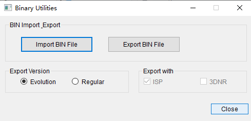

**图 2**  二进制数据处理对话框（稳定型）<a name="fig1675418825310"></a>  


通过[图1](#fig9612133103212)和[图2](#fig1675418825310)中“BIN Import Export”组可完成以下操作：

-   导出板端参数BIN文件：点击“Export BIN File”按钮，并在弹出的文件保存对话框中选择一个保存路径。工具会将板端当前的参数保存到指定的保存路径。
-   导入板端参数BIN文件：点击“Import BIN File”按钮，并在弹出的文件选择对话框中选择一个正确的板端参数BIN文件。工具会将选择的文件发送到板端。发送完成后，数据会即时生效。

> **须知：** 
>-   通过本功能导出的参数BIN文件为板端专用，只能通过BIN对话框的导入功能导入，无法直接在PQTools工具主程序中打开。
>-   BIN保存的ISP模块参数，是ISP模块中非统计信息的数据。
>-   导入的BIN文件需要符合当前业务的场景（VI的分辨率、WDR模式、ISP路数、ViPipe和VpssGrp等基本参数需要相同）才能正常运行。
>-   每次导出的ISP模块参数，地址等信息相较于上一次会有变化。
>-   下章节使用库导入导出图像质量参数不支持演进型BIN导入导出。

### BIN中ISP保存模块<a name="ZH-CN_TOPIC_0000002530061795"></a>

isp\_ext\_config.h头文件中部分功能宏对应的寄存器地址及长度值，具体模块：

VREG\_BLC\_OFFSET + 0x8,     /\* ot\_ext\_system\_black\_level\_change\_write \*/

VREG\_RC\_OFFSET + 0x1,     /\* ot\_ext\_system\_rc\_coef\_update\_en\_write \*/

VREG\_CLUT\_OFFSET + 0x1,     /\* ot\_ext\_system\_clut\_lut\_update\_en\_write \*/

VREG\_CLUT\_OFFSET + 0x8,     /\* ot\_ext\_system\_clut\_ctrl\_update\_en\_write \*/

VREG\_GE\_OFFSET + 0x67,     /\* ot\_ext\_system\_ge\_coef\_update\_en\_write \*/

VREG\_CSC\_OFFSET + 0x58,     /\* ot\_ext\_system\_csc\_attr\_update\_write \*/

VREG\_WDR\_OFFSET + 0x1,     /\* ot\_ext\_system\_wdr\_coef\_update\_en\_write \*/

VREG\_DM\_OFFSET + 0x12,     /\* ot\_ext\_system\_demosaic\_attr\_update\_en\_write \*/

VREG\_AWB\_OFFSET + 0x28,     /\* ot\_ext\_system\_wb\_statistics\_mpi\_update\_en\_write \*/

VREG\_DEHAZE\_OFFSET + 0x142,     /\* ot\_ext\_system\_user\_dehaze\_lut\_update\_write \*/

VREG\_DRC\_OFFSET + 0x1,     /\* ot\_ext\_system\_drc\_param\_updated\_write \*//

VREG\_PREGAMMA\_OFFSET + 0x1,     /\* ot\_ext\_system\_pregamma\_lut\_update\_write \*/

VREG\_CA\_OFFSET + 0x446,     /\* ot\_ext\_system\_ca\_coef\_update\_en\_write \*/

VREG\_GAMMA\_OFFSET + 0x1,     /\* ot\_ext\_system\_gamma\_lut\_update\_write \*/

VREG\_SHARPEN\_OFFSET + 0x3,     /\* ot\_ext\_system\_sharpen\_mpi\_update\_en\_write \*/

VREG\_LSC\_OFFSET + 0x1,     /\* ot\_ext\_system\_isp\_mesh\_shading\_lut\_attr\_updata\_write \*/

VREG\_LSC\_OFFSET + 0x2,     /\* ot\_ext\_system\_isp\_mesh\_shading\_attr\_updata\_write \*/

VREG\_LSC\_OFFSET + 0x4460,     /\* ot\_ext\_system\_isp\_mesh\_shading\_fe\_lut\_attr\_updata\_write \*/

VREG\_LSC\_OFFSET + 0x4461,     /\* ot\_ext\_system\_isp\_mesh\_shading\_fe\_attr\_updata\_write \*/

VREG\_DPC\_OFFSET + 0x5e,     /\* ot\_ext\_system\_dpc\_static\_attr\_update\_write \*/

VREG\_DPC\_OFFSET + 0x5f      /\* ot\_ext\_system\_dpc\_dynamic\_attr\_update\_write \*/

ot\_mpi\_isp.h头文件中clut功能参数，对应set接口ot\_mpi\_isp\_set\_clut\_coeff（方便理解将ISP虚拟寄存器clut读写数据段映射为接口来描述）；

ot\_mpi\_ae.h头文件中get/set接口对应的功能参数；

ot\_mpi\_awb.h头文件中get/set接口对应的功能参数。

### 使用库导入导出图像质量参数<a name="ZH-CN_TOPIC_0000002530221615"></a>

板端工具提供导入导出参数库文件，可根据自己的需要选择功能。


#### 开放参数<a name="ZH-CN_TOPIC_0000002498141686"></a>

```
typedef struct otPQ_BIN_ISP_S { 
    int enable; 
} PQ_BIN_ISP_S; 
  
typedef struct otPQ_BIN_NRX_S{ 
    int enable; 
    int viPipe; 
    int vpssGrp; 
} PQ_BIN_NRX_S; 
  
typedef struct otPQ_BIN_ISP_EVO_S {
    int enable;
    int viPipe;
} PQ_BIN_ISP_EVO_S;

typedef struct otPQ_BIN_MODULE_S{ 
    PQ_BIN_ISP_S stISP; 
    PQ_BIN_NRX_S st3DNR; 
    PQ_BIN_ISP_EVO_S stIspEvo;
} PQ_BIN_MODULE_S;
```

#### 开放接口<a name="ZH-CN_TOPIC_0000002530221675"></a>

-   `OT_PQ_GetISPDataTotalLen`：获取isp参数BIN数据的长度。
-   `OT_PQ_GetStructParamLen`：获取Struct BIN数据的长度。
-   `OT_PQ_BIN_ExportBinData`：导出BIN文件。
-   `OT_PQ_BIN_ImportBinData`：导入BIN文件。

可参考推荐使用流程，如[图1](#fig13565672314)所示。

**图 1**  BIN推荐使用流程<a name="fig13565672314"></a>  


#### 数据类型<a name="ZH-CN_TOPIC_0000002530061651"></a>


##### PQ\_BIN\_ISP\_S<a name="ZH-CN_TOPIC_0000002530061773"></a>

【说明】

设置ISP BIN参数。

【定义】

```
typedef struct otPQ_BIN_ISP_S { 
    int enable; 
} PQ_BIN_ISP_S;
```

【成员】

<a name="table4415mcpsimp"></a>
<table><thead align="left"><tr id="row4420mcpsimp"><th class="cellrowborder" valign="top" width="50%" id="mcps1.1.3.1.1"><p id="p4422mcpsimp"><a name="p4422mcpsimp"></a><a name="p4422mcpsimp"></a>成员名称</p>
</th>
<th class="cellrowborder" valign="top" width="50%" id="mcps1.1.3.1.2"><p id="p4424mcpsimp"><a name="p4424mcpsimp"></a><a name="p4424mcpsimp"></a>描述</p>
</th>
</tr>
</thead>
<tbody><tr id="row4426mcpsimp"><td class="cellrowborder" valign="top" width="50%" headers="mcps1.1.3.1.1 "><p id="p4428mcpsimp"><a name="p4428mcpsimp"></a><a name="p4428mcpsimp"></a>enable</p>
</td>
<td class="cellrowborder" valign="top" width="50%" headers="mcps1.1.3.1.2 "><p id="p4430mcpsimp"><a name="p4430mcpsimp"></a><a name="p4430mcpsimp"></a>ISP参数保存的使能开关</p>
</td>
</tr>
</tbody>
</table>

【注意事项】

无

【相关数据类型及接口】

无

##### PQ\_BIN\_NRX\_S<a name="ZH-CN_TOPIC_0000002530221709"></a>

【说明】

设置NRX结构体保存 BIN参数。

【定义】

```
typedef struct otPQ_BIN_NRX_S { 
    int enable; 
    int viPipe; 
    int vpssGrp; 
} PQ_BIN_NRX_S;
```

【成员】

<a name="table4441mcpsimp"></a>
<table><thead align="left"><tr id="row4446mcpsimp"><th class="cellrowborder" valign="top" width="34%" id="mcps1.1.3.1.1"><p id="p4448mcpsimp"><a name="p4448mcpsimp"></a><a name="p4448mcpsimp"></a>成员名称</p>
</th>
<th class="cellrowborder" valign="top" width="66%" id="mcps1.1.3.1.2"><p id="p4450mcpsimp"><a name="p4450mcpsimp"></a><a name="p4450mcpsimp"></a>描述</p>
</th>
</tr>
</thead>
<tbody><tr id="row4452mcpsimp"><td class="cellrowborder" valign="top" width="34%" headers="mcps1.1.3.1.1 "><p id="p4454mcpsimp"><a name="p4454mcpsimp"></a><a name="p4454mcpsimp"></a>enable</p>
</td>
<td class="cellrowborder" valign="top" width="66%" headers="mcps1.1.3.1.2 "><p id="p4456mcpsimp"><a name="p4456mcpsimp"></a><a name="p4456mcpsimp"></a>ISP参数保存的使能开关</p>
</td>
</tr>
<tr id="row4457mcpsimp"><td class="cellrowborder" valign="top" width="34%" headers="mcps1.1.3.1.1 "><p id="p4459mcpsimp"><a name="p4459mcpsimp"></a><a name="p4459mcpsimp"></a>viPipe</p>
</td>
<td class="cellrowborder" valign="top" width="66%" headers="mcps1.1.3.1.2 "><p id="p4461mcpsimp"><a name="p4461mcpsimp"></a><a name="p4461mcpsimp"></a>viPipe通道号</p>
</td>
</tr>
<tr id="row4462mcpsimp"><td class="cellrowborder" valign="top" width="34%" headers="mcps1.1.3.1.1 "><p id="p4464mcpsimp"><a name="p4464mcpsimp"></a><a name="p4464mcpsimp"></a>vpssGrp</p>
</td>
<td class="cellrowborder" valign="top" width="66%" headers="mcps1.1.3.1.2 "><p id="p4466mcpsimp"><a name="p4466mcpsimp"></a><a name="p4466mcpsimp"></a>vpssGrp的通道号</p>
</td>
</tr>
</tbody>
</table>

【注意事项】

enable使能之后，需要设置对应场景的viPipe号或者是vpssGrp号。

【相关数据类型及接口】

无

##### PQ\_BIN\_ISP\_EVO\_S<a name="ZH-CN_TOPIC_0000002530061769"></a>

【说明】

设置演进版本BIN结构体参数。

【定义】

```
typedef struct otPQ_BIN_ISP_EVO_S {
    int enable;
    int viPipe;
} PQ_BIN_ISP_EVO_S;
```

【成员】

<a name="table4342229205412"></a>
<table><thead align="left"><tr id="row734292911541"><th class="cellrowborder" valign="top" width="34%" id="mcps1.1.3.1.1"><p id="p13342192975419"><a name="p13342192975419"></a><a name="p13342192975419"></a>成员名称</p>
</th>
<th class="cellrowborder" valign="top" width="66%" id="mcps1.1.3.1.2"><p id="p10342202925414"><a name="p10342202925414"></a><a name="p10342202925414"></a>描述</p>
</th>
</tr>
</thead>
<tbody><tr id="row734214294549"><td class="cellrowborder" valign="top" width="34%" headers="mcps1.1.3.1.1 "><p id="p734222925412"><a name="p734222925412"></a><a name="p734222925412"></a>enable</p>
</td>
<td class="cellrowborder" valign="top" width="66%" headers="mcps1.1.3.1.2 "><p id="p133424299541"><a name="p133424299541"></a><a name="p133424299541"></a>是否使用演进版本的BIN，默认置为false</p>
</td>
</tr>
<tr id="row123421229195413"><td class="cellrowborder" valign="top" width="34%" headers="mcps1.1.3.1.1 "><p id="p103422029135411"><a name="p103422029135411"></a><a name="p103422029135411"></a>viPipe</p>
</td>
<td class="cellrowborder" valign="top" width="66%" headers="mcps1.1.3.1.2 "><p id="p5343172914544"><a name="p5343172914544"></a><a name="p5343172914544"></a>演进版本BIN viPipe通道号</p>
</td>
</tr>
</tbody>
</table>

【注意事项】

演进版本是指还未开发完成的版本，即isp未开发完，BIN结构可能会变化.在这个过程中上个版本导出的BIN，在下个版本导入可能就会错位，所以用演进版本BIN，导入时只导入未变化的部分

【相关数据类型及接口】

无

##### PQ\_BIN\_MODULE\_S<a name="ZH-CN_TOPIC_0000002498141796"></a>

【说明】

设置保存BIN数据的参数。

【定义】

```
typedef struct otPQ_BIN_MODULE_S {
    PQ_BIN_ISP_S  stISP;
    PQ_BIN_NRX_S  st3DNR;
    PQ_BIN_ISP_EVO_S stIspEvo;
} PQ_BIN_MODULE_S;
```

【成员】

<a name="table4482mcpsimp"></a>
<table><thead align="left"><tr id="row4487mcpsimp"><th class="cellrowborder" valign="top" width="50%" id="mcps1.1.3.1.1"><p id="p4489mcpsimp"><a name="p4489mcpsimp"></a><a name="p4489mcpsimp"></a>成员名称</p>
</th>
<th class="cellrowborder" valign="top" width="50%" id="mcps1.1.3.1.2"><p id="p4491mcpsimp"><a name="p4491mcpsimp"></a><a name="p4491mcpsimp"></a>描述</p>
</th>
</tr>
</thead>
<tbody><tr id="row4493mcpsimp"><td class="cellrowborder" valign="top" width="50%" headers="mcps1.1.3.1.1 "><p id="p4495mcpsimp"><a name="p4495mcpsimp"></a><a name="p4495mcpsimp"></a>stISP</p>
</td>
<td class="cellrowborder" valign="top" width="50%" headers="mcps1.1.3.1.2 "><p id="p4497mcpsimp"><a name="p4497mcpsimp"></a><a name="p4497mcpsimp"></a>保存ISP参数的相关设置参数</p>
</td>
</tr>
<tr id="row4498mcpsimp"><td class="cellrowborder" valign="top" width="50%" headers="mcps1.1.3.1.1 "><p id="p4500mcpsimp"><a name="p4500mcpsimp"></a><a name="p4500mcpsimp"></a>st3DNR</p>
</td>
<td class="cellrowborder" valign="top" width="50%" headers="mcps1.1.3.1.2 "><p id="p4502mcpsimp"><a name="p4502mcpsimp"></a><a name="p4502mcpsimp"></a>保存3dnr参数的相关设置参数</p>
</td>
</tr>
<tr id="row1825419784614"><td class="cellrowborder" valign="top" width="50%" headers="mcps1.1.3.1.1 "><p id="p1925418717462"><a name="p1925418717462"></a><a name="p1925418717462"></a>stIspEvo</p>
</td>
<td class="cellrowborder" valign="top" width="50%" headers="mcps1.1.3.1.2 "><p id="p15254187194619"><a name="p15254187194619"></a><a name="p15254187194619"></a>保存演进版本BIN的相关设置参数，</p>
</td>
</tr>
</tbody>
</table>

【注意事项】

无

【相关数据类型及接口】

无

#### API参考<a name="ZH-CN_TOPIC_0000002498301802"></a>


##### OT\_PQ\_GetISPDataTotalLen<a name="ZH-CN_TOPIC_0000002498301666"></a>

【描述】

获取isp 参数BIN数据的长度。

【语法】

```
unsigned int OT_PQ_GetISPDataTotalLen();
```

【参数】

无

【返回值】

<a name="table4555mcpsimp"></a>
<table><thead align="left"><tr id="row4560mcpsimp"><th class="cellrowborder" valign="top" width="50%" id="mcps1.1.3.1.1"><p id="p4562mcpsimp"><a name="p4562mcpsimp"></a><a name="p4562mcpsimp"></a>返回值</p>
</th>
<th class="cellrowborder" valign="top" width="50%" id="mcps1.1.3.1.2"><p id="p4564mcpsimp"><a name="p4564mcpsimp"></a><a name="p4564mcpsimp"></a>描述</p>
</th>
</tr>
</thead>
<tbody><tr id="row4566mcpsimp"><td class="cellrowborder" valign="top" width="50%" headers="mcps1.1.3.1.1 "><p id="p4568mcpsimp"><a name="p4568mcpsimp"></a><a name="p4568mcpsimp"></a>长度</p>
</td>
<td class="cellrowborder" valign="top" width="50%" headers="mcps1.1.3.1.2 "><p id="p4570mcpsimp"><a name="p4570mcpsimp"></a><a name="p4570mcpsimp"></a>BIN数据的总长度。</p>
</td>
</tr>
</tbody>
</table>

【错误码】

无

【需求】

-   头文件：ot\_pq\_bin.h
-   库文件：libbin.a

【注意】

此函数必须在调用`OT_PQ_BIN_ExportBinData`接口前调用。

##### OT\_PQ\_GetStructParamLen<a name="ZH-CN_TOPIC_0000002530061633"></a>

【描述】

获取struct BIN数据的长度。

【语法】

```
unsigned int OT_PQ_GetStructParamLen (PQ_BIN_MODULE_S *pstBinParam);
```

【参数】

<a name="table4533mcpsimp"></a>
<table><thead align="left"><tr id="row4539mcpsimp"><th class="cellrowborder" valign="top" width="23%" id="mcps1.1.4.1.1"><p id="p4541mcpsimp"><a name="p4541mcpsimp"></a><a name="p4541mcpsimp"></a>参数名称</p>
</th>
<th class="cellrowborder" valign="top" width="55.00000000000001%" id="mcps1.1.4.1.2"><p id="p4543mcpsimp"><a name="p4543mcpsimp"></a><a name="p4543mcpsimp"></a>描述</p>
</th>
<th class="cellrowborder" valign="top" width="22%" id="mcps1.1.4.1.3"><p id="p4545mcpsimp"><a name="p4545mcpsimp"></a><a name="p4545mcpsimp"></a>输入/输出</p>
</th>
</tr>
</thead>
<tbody><tr id="row4547mcpsimp"><td class="cellrowborder" valign="top" width="23%" headers="mcps1.1.4.1.1 "><p id="p4549mcpsimp"><a name="p4549mcpsimp"></a><a name="p4549mcpsimp"></a>pstBinParam</p>
</td>
<td class="cellrowborder" valign="top" width="55.00000000000001%" headers="mcps1.1.4.1.2 "><p id="p4551mcpsimp"><a name="p4551mcpsimp"></a><a name="p4551mcpsimp"></a>设置BIN文件保存内存和相关通道参数。</p>
</td>
<td class="cellrowborder" valign="top" width="22%" headers="mcps1.1.4.1.3 "><p id="p4553mcpsimp"><a name="p4553mcpsimp"></a><a name="p4553mcpsimp"></a>输入</p>
</td>
</tr>
</tbody>
</table>

【返回值】

<a name="table4555mcpsimp"></a>
<table><thead align="left"><tr id="row4560mcpsimp"><th class="cellrowborder" valign="top" width="50%" id="mcps1.1.3.1.1"><p id="p4562mcpsimp"><a name="p4562mcpsimp"></a><a name="p4562mcpsimp"></a>返回值</p>
</th>
<th class="cellrowborder" valign="top" width="50%" id="mcps1.1.3.1.2"><p id="p4564mcpsimp"><a name="p4564mcpsimp"></a><a name="p4564mcpsimp"></a>描述</p>
</th>
</tr>
</thead>
<tbody><tr id="row4566mcpsimp"><td class="cellrowborder" valign="top" width="50%" headers="mcps1.1.3.1.1 "><p id="p4568mcpsimp"><a name="p4568mcpsimp"></a><a name="p4568mcpsimp"></a>长度</p>
</td>
<td class="cellrowborder" valign="top" width="50%" headers="mcps1.1.3.1.2 "><p id="p4570mcpsimp"><a name="p4570mcpsimp"></a><a name="p4570mcpsimp"></a>Struct参数的实际长度。</p>
</td>
</tr>
</tbody>
</table>

【错误码】

无

【需求】

-   头文件：ot\_pq\_bin.h
-   库文件：libbin.a

【注意】

此函数必须在调用`OT_PQ_BIN_ExportBinData`接口前调用。

##### OT\_PQ\_BIN\_ExportBinData<a name="ZH-CN_TOPIC_0000002498301722"></a>

【描述】

导出BIN数据。

【语法】

```
int OT_PQ_BIN_ExportBinData(PQ_BIN_MODULE_S *pstBinParam, unsigned char* pu8Buffer, unsigned int u32DataLength);
```

【参数】

<a name="table4587mcpsimp"></a>
<table><thead align="left"><tr id="row4593mcpsimp"><th class="cellrowborder" valign="top" width="24.75%" id="mcps1.1.4.1.1"><p id="p4595mcpsimp"><a name="p4595mcpsimp"></a><a name="p4595mcpsimp"></a>参数名称</p>
</th>
<th class="cellrowborder" valign="top" width="53.47%" id="mcps1.1.4.1.2"><p id="p4597mcpsimp"><a name="p4597mcpsimp"></a><a name="p4597mcpsimp"></a>描述</p>
</th>
<th class="cellrowborder" valign="top" width="21.78%" id="mcps1.1.4.1.3"><p id="p4599mcpsimp"><a name="p4599mcpsimp"></a><a name="p4599mcpsimp"></a>输入/输出</p>
</th>
</tr>
</thead>
<tbody><tr id="row4601mcpsimp"><td class="cellrowborder" valign="top" width="24.75%" headers="mcps1.1.4.1.1 "><p id="p4603mcpsimp"><a name="p4603mcpsimp"></a><a name="p4603mcpsimp"></a>pstBinParam</p>
</td>
<td class="cellrowborder" valign="top" width="53.47%" headers="mcps1.1.4.1.2 "><p id="p4605mcpsimp"><a name="p4605mcpsimp"></a><a name="p4605mcpsimp"></a>设置BIN文件保存内存和相关通道参数</p>
</td>
<td class="cellrowborder" valign="top" width="21.78%" headers="mcps1.1.4.1.3 "><p id="p4607mcpsimp"><a name="p4607mcpsimp"></a><a name="p4607mcpsimp"></a>输入</p>
</td>
</tr>
<tr id="row4608mcpsimp"><td class="cellrowborder" valign="top" width="24.75%" headers="mcps1.1.4.1.1 "><p id="p4610mcpsimp"><a name="p4610mcpsimp"></a><a name="p4610mcpsimp"></a>pu8Buffer</p>
</td>
<td class="cellrowborder" valign="top" width="53.47%" headers="mcps1.1.4.1.2 "><p id="p4612mcpsimp"><a name="p4612mcpsimp"></a><a name="p4612mcpsimp"></a>存放BIN的内存空间</p>
</td>
<td class="cellrowborder" valign="top" width="21.78%" headers="mcps1.1.4.1.3 "><p id="p4614mcpsimp"><a name="p4614mcpsimp"></a><a name="p4614mcpsimp"></a>输出</p>
</td>
</tr>
<tr id="row4615mcpsimp"><td class="cellrowborder" valign="top" width="24.75%" headers="mcps1.1.4.1.1 "><p id="p4617mcpsimp"><a name="p4617mcpsimp"></a><a name="p4617mcpsimp"></a>u32DataLength</p>
</td>
<td class="cellrowborder" valign="top" width="53.47%" headers="mcps1.1.4.1.2 "><p id="p4619mcpsimp"><a name="p4619mcpsimp"></a><a name="p4619mcpsimp"></a>BIN数据的长度</p>
</td>
<td class="cellrowborder" valign="top" width="21.78%" headers="mcps1.1.4.1.3 "><p id="p4621mcpsimp"><a name="p4621mcpsimp"></a><a name="p4621mcpsimp"></a>输入</p>
</td>
</tr>
</tbody>
</table>

【返回值】

<a name="table4623mcpsimp"></a>
<table><thead align="left"><tr id="row4628mcpsimp"><th class="cellrowborder" valign="top" width="39%" id="mcps1.1.3.1.1"><p id="p4630mcpsimp"><a name="p4630mcpsimp"></a><a name="p4630mcpsimp"></a>返回值</p>
</th>
<th class="cellrowborder" valign="top" width="61%" id="mcps1.1.3.1.2"><p id="p4632mcpsimp"><a name="p4632mcpsimp"></a><a name="p4632mcpsimp"></a>描述</p>
</th>
</tr>
</thead>
<tbody><tr id="row4634mcpsimp"><td class="cellrowborder" valign="top" width="39%" headers="mcps1.1.3.1.1 "><p id="p4636mcpsimp"><a name="p4636mcpsimp"></a><a name="p4636mcpsimp"></a>0</p>
</td>
<td class="cellrowborder" valign="top" width="61%" headers="mcps1.1.3.1.2 "><p id="p4638mcpsimp"><a name="p4638mcpsimp"></a><a name="p4638mcpsimp"></a>成功</p>
</td>
</tr>
<tr id="row4639mcpsimp"><td class="cellrowborder" valign="top" width="39%" headers="mcps1.1.3.1.1 "><p id="p4641mcpsimp"><a name="p4641mcpsimp"></a><a name="p4641mcpsimp"></a>非0</p>
</td>
<td class="cellrowborder" valign="top" width="61%" headers="mcps1.1.3.1.2 "><p id="p4643mcpsimp"><a name="p4643mcpsimp"></a><a name="p4643mcpsimp"></a>失败，其值为错误码</p>
</td>
</tr>
</tbody>
</table>

【错误码】

<a name="table4645mcpsimp"></a>
<table><thead align="left"><tr id="row4650mcpsimp"><th class="cellrowborder" valign="top" width="28.999999999999996%" id="mcps1.1.3.1.1"><p id="p4652mcpsimp"><a name="p4652mcpsimp"></a><a name="p4652mcpsimp"></a>接口返回值</p>
</th>
<th class="cellrowborder" valign="top" width="71%" id="mcps1.1.3.1.2"><p id="p4654mcpsimp"><a name="p4654mcpsimp"></a><a name="p4654mcpsimp"></a>含义</p>
</th>
</tr>
</thead>
<tbody><tr id="row4656mcpsimp"><td class="cellrowborder" valign="top" width="28.999999999999996%" headers="mcps1.1.3.1.1 "><p id="p4658mcpsimp"><a name="p4658mcpsimp"></a><a name="p4658mcpsimp"></a>0xCB000001</p>
</td>
<td class="cellrowborder" valign="top" width="71%" headers="mcps1.1.3.1.2 "><p id="p4660mcpsimp"><a name="p4660mcpsimp"></a><a name="p4660mcpsimp"></a>入参指针为空</p>
</td>
</tr>
<tr id="row4661mcpsimp"><td class="cellrowborder" valign="top" width="28.999999999999996%" headers="mcps1.1.3.1.1 "><p id="p4663mcpsimp"><a name="p4663mcpsimp"></a><a name="p4663mcpsimp"></a>0xCB000003</p>
</td>
<td class="cellrowborder" valign="top" width="71%" headers="mcps1.1.3.1.2 "><p id="p4665mcpsimp"><a name="p4665mcpsimp"></a><a name="p4665mcpsimp"></a>未分配到内存空间</p>
</td>
</tr>
<tr id="row4666mcpsimp"><td class="cellrowborder" valign="top" width="28.999999999999996%" headers="mcps1.1.3.1.1 "><p id="p4668mcpsimp"><a name="p4668mcpsimp"></a><a name="p4668mcpsimp"></a>0xCB000005</p>
</td>
<td class="cellrowborder" valign="top" width="71%" headers="mcps1.1.3.1.2 "><p id="p4670mcpsimp"><a name="p4670mcpsimp"></a><a name="p4670mcpsimp"></a>数据不完整</p>
</td>
</tr>
<tr id="row4671mcpsimp"><td class="cellrowborder" valign="top" width="28.999999999999996%" headers="mcps1.1.3.1.1 "><p id="p4673mcpsimp"><a name="p4673mcpsimp"></a><a name="p4673mcpsimp"></a>0xCB000008</p>
</td>
<td class="cellrowborder" valign="top" width="71%" headers="mcps1.1.3.1.2 "><p id="p4675mcpsimp"><a name="p4675mcpsimp"></a><a name="p4675mcpsimp"></a>数据损坏</p>
</td>
</tr>
<tr id="row4676mcpsimp"><td class="cellrowborder" valign="top" width="28.999999999999996%" headers="mcps1.1.3.1.1 "><p id="p4678mcpsimp"><a name="p4678mcpsimp"></a><a name="p4678mcpsimp"></a>0xCB000009</p>
</td>
<td class="cellrowborder" valign="top" width="71%" headers="mcps1.1.3.1.2 "><p id="p4680mcpsimp"><a name="p4680mcpsimp"></a><a name="p4680mcpsimp"></a>Mpi接口读写错误</p>
</td>
</tr>
<tr id="row4681mcpsimp"><td class="cellrowborder" valign="top" width="28.999999999999996%" headers="mcps1.1.3.1.1 "><p id="p4683mcpsimp"><a name="p4683mcpsimp"></a><a name="p4683mcpsimp"></a>0xCB00000A</p>
</td>
<td class="cellrowborder" valign="top" width="71%" headers="mcps1.1.3.1.2 "><p id="p4685mcpsimp"><a name="p4685mcpsimp"></a><a name="p4685mcpsimp"></a>数据受保护</p>
</td>
</tr>
</tbody>
</table>

【需求】

-   头文件：ot\_pq\_bin.h
-   库文件：libbin.a

【注意】

调用此函数必须先调用`OT_PQ_GetISPDataTotalLen`或者`OT_PQ_GetStructParamLen`函数，获取数据的大小，否则可能出现内存问题。

##### OT\_PQ\_BIN\_ImportBinData<a name="ZH-CN_TOPIC_0000002498141704"></a>

【描述】

导入BIN数据。

【语法】

```
int OT_PQ_BIN_ImportBinData(PQ_BIN_MODULE_S *pstBinParam，unsigned char* pu8Buffer, unsigned int u32DataLength);
```

【参数】

<a name="table4701mcpsimp"></a>
<table><thead align="left"><tr id="row4707mcpsimp"><th class="cellrowborder" valign="top" width="30%" id="mcps1.1.4.1.1"><p id="p4709mcpsimp"><a name="p4709mcpsimp"></a><a name="p4709mcpsimp"></a>参数名称</p>
</th>
<th class="cellrowborder" valign="top" width="50%" id="mcps1.1.4.1.2"><p id="p4711mcpsimp"><a name="p4711mcpsimp"></a><a name="p4711mcpsimp"></a>描述</p>
</th>
<th class="cellrowborder" valign="top" width="20%" id="mcps1.1.4.1.3"><p id="p4713mcpsimp"><a name="p4713mcpsimp"></a><a name="p4713mcpsimp"></a>输入/输出</p>
</th>
</tr>
</thead>
<tbody><tr id="row4715mcpsimp"><td class="cellrowborder" valign="top" width="30%" headers="mcps1.1.4.1.1 "><p id="p4717mcpsimp"><a name="p4717mcpsimp"></a><a name="p4717mcpsimp"></a>pstBinParam</p>
</td>
<td class="cellrowborder" valign="top" width="50%" headers="mcps1.1.4.1.2 "><p id="p4719mcpsimp"><a name="p4719mcpsimp"></a><a name="p4719mcpsimp"></a>设置BIN文件保存内存和相关通道参数</p>
</td>
<td class="cellrowborder" valign="top" width="20%" headers="mcps1.1.4.1.3 "><p id="p4721mcpsimp"><a name="p4721mcpsimp"></a><a name="p4721mcpsimp"></a>输入</p>
</td>
</tr>
<tr id="row4722mcpsimp"><td class="cellrowborder" valign="top" width="30%" headers="mcps1.1.4.1.1 "><p id="p4724mcpsimp"><a name="p4724mcpsimp"></a><a name="p4724mcpsimp"></a>pu8Buffer</p>
</td>
<td class="cellrowborder" valign="top" width="50%" headers="mcps1.1.4.1.2 "><p id="p4726mcpsimp"><a name="p4726mcpsimp"></a><a name="p4726mcpsimp"></a>BIN的内存空间</p>
</td>
<td class="cellrowborder" valign="top" width="20%" headers="mcps1.1.4.1.3 "><p id="p4728mcpsimp"><a name="p4728mcpsimp"></a><a name="p4728mcpsimp"></a>输入</p>
</td>
</tr>
<tr id="row4729mcpsimp"><td class="cellrowborder" valign="top" width="30%" headers="mcps1.1.4.1.1 "><p id="p4731mcpsimp"><a name="p4731mcpsimp"></a><a name="p4731mcpsimp"></a>u32DataLength</p>
</td>
<td class="cellrowborder" valign="top" width="50%" headers="mcps1.1.4.1.2 "><p id="p4733mcpsimp"><a name="p4733mcpsimp"></a><a name="p4733mcpsimp"></a>BIN大小</p>
</td>
<td class="cellrowborder" valign="top" width="20%" headers="mcps1.1.4.1.3 "><p id="p4735mcpsimp"><a name="p4735mcpsimp"></a><a name="p4735mcpsimp"></a>输入</p>
</td>
</tr>
</tbody>
</table>

【返回值】

<a name="table4737mcpsimp"></a>
<table><thead align="left"><tr id="row4742mcpsimp"><th class="cellrowborder" valign="top" width="51%" id="mcps1.1.3.1.1"><p id="p4744mcpsimp"><a name="p4744mcpsimp"></a><a name="p4744mcpsimp"></a>返回值</p>
</th>
<th class="cellrowborder" valign="top" width="49%" id="mcps1.1.3.1.2"><p id="p4746mcpsimp"><a name="p4746mcpsimp"></a><a name="p4746mcpsimp"></a>描述</p>
</th>
</tr>
</thead>
<tbody><tr id="row4748mcpsimp"><td class="cellrowborder" valign="top" width="51%" headers="mcps1.1.3.1.1 "><p id="p4750mcpsimp"><a name="p4750mcpsimp"></a><a name="p4750mcpsimp"></a>0</p>
</td>
<td class="cellrowborder" valign="top" width="49%" headers="mcps1.1.3.1.2 "><p id="p4752mcpsimp"><a name="p4752mcpsimp"></a><a name="p4752mcpsimp"></a>成功</p>
</td>
</tr>
<tr id="row4753mcpsimp"><td class="cellrowborder" valign="top" width="51%" headers="mcps1.1.3.1.1 "><p id="p4755mcpsimp"><a name="p4755mcpsimp"></a><a name="p4755mcpsimp"></a>非0</p>
</td>
<td class="cellrowborder" valign="top" width="49%" headers="mcps1.1.3.1.2 "><p id="p4757mcpsimp"><a name="p4757mcpsimp"></a><a name="p4757mcpsimp"></a>失败，其值为错误码</p>
</td>
</tr>
</tbody>
</table>

【错误码】

<a name="table4759mcpsimp"></a>
<table><thead align="left"><tr id="row4764mcpsimp"><th class="cellrowborder" valign="top" width="50%" id="mcps1.1.3.1.1"><p id="p4766mcpsimp"><a name="p4766mcpsimp"></a><a name="p4766mcpsimp"></a>接口返回值</p>
</th>
<th class="cellrowborder" valign="top" width="50%" id="mcps1.1.3.1.2"><p id="p4768mcpsimp"><a name="p4768mcpsimp"></a><a name="p4768mcpsimp"></a>含义</p>
</th>
</tr>
</thead>
<tbody><tr id="row4770mcpsimp"><td class="cellrowborder" valign="top" width="50%" headers="mcps1.1.3.1.1 "><p id="p4772mcpsimp"><a name="p4772mcpsimp"></a><a name="p4772mcpsimp"></a>0xCB000001</p>
</td>
<td class="cellrowborder" valign="top" width="50%" headers="mcps1.1.3.1.2 "><p id="p4774mcpsimp"><a name="p4774mcpsimp"></a><a name="p4774mcpsimp"></a>入参指针为空</p>
</td>
</tr>
<tr id="row4775mcpsimp"><td class="cellrowborder" valign="top" width="50%" headers="mcps1.1.3.1.1 "><p id="p4777mcpsimp"><a name="p4777mcpsimp"></a><a name="p4777mcpsimp"></a>0xCB000003</p>
</td>
<td class="cellrowborder" valign="top" width="50%" headers="mcps1.1.3.1.2 "><p id="p4779mcpsimp"><a name="p4779mcpsimp"></a><a name="p4779mcpsimp"></a>申请空间失败</p>
</td>
</tr>
<tr id="row4780mcpsimp"><td class="cellrowborder" valign="top" width="50%" headers="mcps1.1.3.1.1 "><p id="p4782mcpsimp"><a name="p4782mcpsimp"></a><a name="p4782mcpsimp"></a>0xCB000008</p>
</td>
<td class="cellrowborder" valign="top" width="50%" headers="mcps1.1.3.1.2 "><p id="p4784mcpsimp"><a name="p4784mcpsimp"></a><a name="p4784mcpsimp"></a>数据错误</p>
</td>
</tr>
<tr id="row4785mcpsimp"><td class="cellrowborder" valign="top" width="50%" headers="mcps1.1.3.1.1 "><p id="p4787mcpsimp"><a name="p4787mcpsimp"></a><a name="p4787mcpsimp"></a>0xCB000009</p>
</td>
<td class="cellrowborder" valign="top" width="50%" headers="mcps1.1.3.1.2 "><p id="p4789mcpsimp"><a name="p4789mcpsimp"></a><a name="p4789mcpsimp"></a>Mpi接口读写错误</p>
</td>
</tr>
<tr id="row4790mcpsimp"><td class="cellrowborder" valign="top" width="50%" headers="mcps1.1.3.1.1 "><p id="p4792mcpsimp"><a name="p4792mcpsimp"></a><a name="p4792mcpsimp"></a>0xCB00000A</p>
</td>
<td class="cellrowborder" valign="top" width="50%" headers="mcps1.1.3.1.2 "><p id="p4794mcpsimp"><a name="p4794mcpsimp"></a><a name="p4794mcpsimp"></a>数据被保护</p>
</td>
</tr>
</tbody>
</table>

【需求】

-   头文件：ot\_pq\_bin.h
-   库文件：libbin.a

【注意】

无

## 工具如何替换3A算法？<a name="ZH-CN_TOPIC_0000002498301810"></a>

工具可通过配置XML指定修改某一地址对应的值。若要替换3A算法首先更新XML文件中3A算法的地址和格式等配置选项，具体更改配置方法请看“物理/虚拟寄存器的添加与调试”，最后用图像调节工具导入配置好的xml文件即可。

> **须知：** 
>在 LiteOS 系统下替换3A算法，需要手动删除3A相关xml选项，否则程序会有挂死现象。

# 点播工具使用<a name="ZH-CN_TOPIC_0000002530221689"></a>


## 点播软件的安装与运行<a name="ZH-CN_TOPIC_0000002498141770"></a>


### 板端软件执行<a name="ZH-CN_TOPIC_0000002530221775"></a>

直接运行可执行程序，根据实际sensor情况运行PQTools.sh。步骤如下：

1.  把位于发布包中的SSXX\_PQ\_VX.X.X.X.tgz解压到单板上或者服务器上。如果解压到服务器上运行，需先将单板mount到服务器目录下。
2.  板端的工具是根据./PQTools.sh脚本里的配置启动的，需运行脚本即可。启动脚本后需输入启动参数，如下：

    ./ PQTools.sh  -a  sensor目录 ini序列  如 ./ PQTools.sh  -a  XXX  0

    -   sensor目录：应用程序默认在**SSXX\_PQ\_V**X.X.X.X目录下configs目录下读取config\_entry.ini
    -   ini序列在config\_entry.ini中可以查看；也可以配置config\_entry.ini，而不输入ini序列。

### PC端软件执行<a name="ZH-CN_TOPIC_0000002498301664"></a>

点播软件的PC端软件是绿色软件，直接使用解压缩工具（如WinRAR、WinZip等）将PQStream（zip格式）解压缩到任意的可写目录，即可使用。

如果需要支持4K30fps，推荐显卡性能如下：

-   显卡内存：2GB
-   显存位宽：128bit
-   核心频率：900MHz
-   显存频率：5000MHz
-   如果需要支持10bit图像显示，显卡和显示器必须支持10bit。

## 快速入门<a name="ZH-CN_TOPIC_0000002498141688"></a>

运行PQStream软件后，出现登录画面，输入相应的IP地址，点击“确定”按钮，即可进去主界面，如[图1](#fig3954122972511)和[图2](#fig1350914534258)所示。

**图 1**  登录界面<a name="fig3954122972511"></a>  


**图 2**  主界面<a name="fig1350914534258"></a>  


主界面各功能按钮和区域的介绍如下：

> **说明：** 
>\(1\) 预览通道
>\(2\) 预览源（Enc/YUV）
>\(3\) 录像/停止录像
>\(4\) 参数设置
>\(5\) 录像时长
>\(6\) 预览窗口比例
>\(7\) 登录/登出
>\(8\) 视频预览主页面
>\(9\) 当前信息
>\(10\) 通道信息显示
>\(11\) 查看工具版本号

> **须知：** 
>-   录像后的抓JPEG功能已经移到了 control 界面上，stream 上不支持抓JPEG。
>-   当帧率为120时，由于工具当前不支持过高帧率，所以板端会进行帧率控制；建议控制作为30\~60帧。


### 预览<a name="ZH-CN_TOPIC_0000002530061697"></a>

\(1\)预览通道选择：控制预览画面来源于哪一个通道。

\(2\)预览与停止：控制视频预览与停止。点播一路编码预览时，下拉菜单包括Enc、YUV两种预览模式以及停止预览控制，如[图1](#fig5819736192618)所示。

**图 1**  预览下拉菜单<a name="fig5819736192618"></a>  


当程序启动时，会自动链接主程序设置IP地址的设备。可以在左下角查看当前链接状态“\(9\) 当前信息”，链接成功后可视频预览页面“\(8\)视频预览主页面”观察当前视频。

> **说明：** 
>-   点播编码格式可由板端的配置文件配置，修改对应sensor的配置文件中RcMode字段的值即可。
>-   支持多路编码点播工具中，默认启动的是第一路编码点播。若是想要预览其他路，使用预览通道选择。
>-   如需修改编码格式需要在对应sensor配置文件中的venc字段RcMode为所需要的编码格式。支持多路编码预览的工具，修改编码格式需要在对应sensor配置文件中的venc\_X字段RcMode为所需要的编码格式，X为编码通道编号。
>-   配置文件路径为板端发布包中configs文件夹。
>-   点播工具暂不支持YUV预览。

视频窗口可以通过下拉框“\(6\)预览窗口比例”选择缩放比例。目前支持30%、50%、80%或100%的比例缩放。当视频窗口过大时，可以拖动预览窗口的滚动条查看。也可以鼠标拖动应用程序右下角改变其大小。

### 录像<a name="ZH-CN_TOPIC_0000002530061737"></a>

\(3\)录像：控制录像的开始与停止。下拉菜单包括录像的开始、停止和设置，如图2所示。当视频正常链接的时候，点击下拉菜单录像按钮进行录像。开始录像时录像按钮变为且下拉菜单变为。在“\(5\)录像时长”处显示已录像时长。此时当点击下拉列表的停止按钮，停止录像。同时按钮恢复先前状态，“\(5\)录像时长”消失。

### 右键功能菜单<a name="ZH-CN_TOPIC_0000002530061783"></a>


#### 显示方式<a name="ZH-CN_TOPIC_0000002498301744"></a>

在可视频预览页面“\(8\)视频预览主页面”，点击鼠标右键出现右键菜单，第1个VO Type，有2个选项，默认使用BT709。

**图 1**  右键菜单（显示方式）<a name="fig4890mcpsimp"></a>  
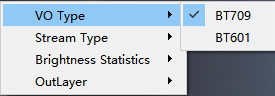

#### 解码方式<a name="ZH-CN_TOPIC_0000002530061715"></a>

在可视频预览页面“\(8\)视频预览主页面”，点击鼠标右键出现右键菜单，第2个Stream Type，有2个选项，默认使用Rate First，Data First一般使用超大I帧的场景。

**图 1**  右键菜单（解码方式）<a name="fig4894mcpsimp"></a>  


#### 区域平均亮度统计<a name="ZH-CN_TOPIC_0000002498141856"></a>

**图 1**  亮度统计开关<a name="fig4897mcpsimp"></a>  
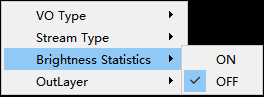

-   打开后在工具的最下方状态栏出现亮度统计显示项。


-   鼠标左键在图像上按住不放，拖动框选想要的区域后，松开鼠标左键。数值就会显示。


此功能比较适合静态场景测试，当图像为高速运动场景时。获取的数据可能和实际鼠标点击时的图像相差较大。

#### 输出图层<a name="ZH-CN_TOPIC_0000002498141830"></a>

在可视频预览页面“\(8\)视频预览主页面”，点击鼠标右键出现右键菜单，第4个OutLayer，有2个选项，默认使用Normal，Original用于隐私保护等特殊使用场景。

**图 1**  输出图层选项<a name="fig13203174711144"></a>  


> **须知：** 
>此功能依赖隐私保护媒体业务，Hi3403V100不支持。

### WDR模式切换<a name="ZH-CN_TOPIC_0000002530061639"></a>

WDR模式切换，可获取当前设备支持的WDR模式，并可快速切换所有支持的WDR模式，画面快速生效，如[图1](#_toc51692635)所示。

**图 1**  WDR模式切换<a name="_toc51692635"></a>  


ViDev选择VI设备，WDR下拉选择要切换的WDR模式，选择即生效。

> **说明：** 
>如当前ViDev仅支持一种WDR模式，该功能即不允许切换操作。

### Stitch数据源切换<a name="ZH-CN_TOPIC_0000002530061631"></a>

Stitch数据源切换功能实现输入到AVSP模块的数据来源快速设置，点播画面立即生效，如[图1](#fig184698372336)所示。

**图 1**  Config-Stitch数据源设置<a name="fig184698372336"></a>  
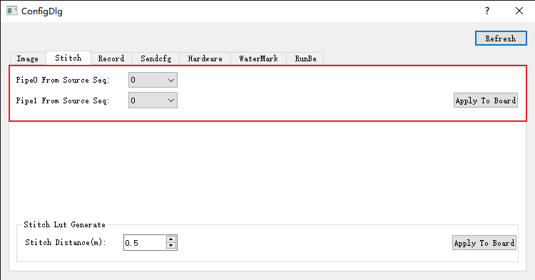

Pipe0 From Source Seq表示pipe0图像数据从镜头x获取，Pipe1 From Source Seq表示pipe1图像数据从镜头y获取，默认设置0,1下发板端，点播画面无变化。设置其他不同值下发板端，点播图像会切换到设置的镜头画面。

> **说明：** 
>AVSP数据源设置前提条件：1、当前avsp模块初始化成功；2、数据源真实存在。

### 录像设置<a name="ZH-CN_TOPIC_0000002530221667"></a>

录像保存路径设置，如[图1](#fig96211046153415)所示。

**图 1**  录像设置<a name="fig96211046153415"></a>  


-   Browse功能

    支持手动选择录像文件储存在PC中的路径。

-   OK

    点击保存设置，可选择退出参数设置窗口。

### Sensor参数设置<a name="ZH-CN_TOPIC_0000002498301760"></a>

Sensor参数设置功能“\(4\)参数设置”实现动态切换配置sensor参数。如[图1](#fig109274101354)所示。

**图 1**  Config功能主界面<a name="fig109274101354"></a>  


-   Browse功能

    支持手动选择PC中的配置文件。

-   选择发送格式

    全部重启和切换wdr格式。

-   Send功能

    把browse选中的配置文件下发到板端并配置到板端。

> **须知：** 
>发送到板端的配置文件格式必须与模板格式一致。
>板端重加载配置时会断开连接，加载成功后自动重连点播。

## ini文件适配<a name="ZH-CN_TOPIC_0000002530221755"></a>

> **须知：** 
>生态版本不支持拼接、MCF相关功能。

**表 1**  ini文件参数一览表

<a name="table4940mcpsimp"></a>
<table><thead align="left"><tr id="row4948mcpsimp"><th class="cellrowborder" valign="top" width="15.151515151515152%" id="mcps1.2.5.1.1"><p id="p4950mcpsimp"><a name="p4950mcpsimp"></a><a name="p4950mcpsimp"></a>Key字段</p>
</th>
<th class="cellrowborder" valign="top" width="19.19191919191919%" id="mcps1.2.5.1.2"><p id="p4952mcpsimp"><a name="p4952mcpsimp"></a><a name="p4952mcpsimp"></a>字段</p>
</th>
<th class="cellrowborder" valign="top" width="23.232323232323232%" id="mcps1.2.5.1.3"><p id="p4954mcpsimp"><a name="p4954mcpsimp"></a><a name="p4954mcpsimp"></a>对应接口</p>
</th>
<th class="cellrowborder" valign="top" width="42.42424242424242%" id="mcps1.2.5.1.4"><p id="p4956mcpsimp"><a name="p4956mcpsimp"></a><a name="p4956mcpsimp"></a>说明</p>
</th>
</tr>
</thead>
<tbody><tr id="row4958mcpsimp"><td class="cellrowborder" rowspan="2" valign="top" width="15.151515151515152%" headers="mcps1.2.5.1.1 "><p id="p4960mcpsimp"><a name="p4960mcpsimp"></a><a name="p4960mcpsimp"></a>isp</p>
</td>
<td class="cellrowborder" valign="top" width="19.19191919191919%" headers="mcps1.2.5.1.2 "><p id="p4962mcpsimp"><a name="p4962mcpsimp"></a><a name="p4962mcpsimp"></a>IspNum</p>
</td>
<td class="cellrowborder" valign="top" width="23.232323232323232%" headers="mcps1.2.5.1.3 "><p id="p4964mcpsimp"><a name="p4964mcpsimp"></a><a name="p4964mcpsimp"></a>工具内部参数</p>
</td>
<td class="cellrowborder" valign="top" width="42.42424242424242%" headers="mcps1.2.5.1.4 "><p id="p4966mcpsimp"><a name="p4966mcpsimp"></a><a name="p4966mcpsimp"></a>isp数目，与isp.x配置项的数目匹配</p>
</td>
</tr>
<tr id="row4967mcpsimp"><td class="cellrowborder" valign="top" headers="mcps1.2.5.1.1 "><p id="p4969mcpsimp"><a name="p4969mcpsimp"></a><a name="p4969mcpsimp"></a>IntBotHalf</p>
</td>
<td class="cellrowborder" valign="top" headers="mcps1.2.5.1.2 "><p id="p4971mcpsimp"><a name="p4971mcpsimp"></a><a name="p4971mcpsimp"></a>ot_mpi_isp_set_mod_param</p>
</td>
<td class="cellrowborder" valign="top" headers="mcps1.2.5.1.3 "><p id="p4973mcpsimp"><a name="p4973mcpsimp"></a><a name="p4973mcpsimp"></a>参考[《ISP开发参考》](../isp/ISP 开发参考（1--2）.md)</p>
</td>
</tr>
<tr id="row4974mcpsimp"><td class="cellrowborder" rowspan="7" valign="top" width="15.151515151515152%" headers="mcps1.2.5.1.1 "><p id="p4976mcpsimp"><a name="p4976mcpsimp"></a><a name="p4976mcpsimp"></a>isp.0</p>
</td>
<td class="cellrowborder" valign="top" width="19.19191919191919%" headers="mcps1.2.5.1.2 "><p id="p4978mcpsimp"><a name="p4978mcpsimp"></a><a name="p4978mcpsimp"></a>DevId</p>
</td>
<td class="cellrowborder" valign="top" width="23.232323232323232%" headers="mcps1.2.5.1.3 "><p id="p4980mcpsimp"><a name="p4980mcpsimp"></a><a name="p4980mcpsimp"></a>ot_mpi_isp_mem_init</p>
<p id="p4981mcpsimp"><a name="p4981mcpsimp"></a><a name="p4981mcpsimp"></a>ot_mpi_isp_init</p>
<p id="p4982mcpsimp"><a name="p4982mcpsimp"></a><a name="p4982mcpsimp"></a>ot_mpi_isp_run</p>
</td>
<td class="cellrowborder" valign="top" width="42.42424242424242%" headers="mcps1.2.5.1.4 "><p id="p4984mcpsimp"><a name="p4984mcpsimp"></a><a name="p4984mcpsimp"></a>启动isp的设备号</p>
</td>
</tr>
<tr id="row4985mcpsimp"><td class="cellrowborder" valign="top" headers="mcps1.2.5.1.1 "><p id="p4987mcpsimp"><a name="p4987mcpsimp"></a><a name="p4987mcpsimp"></a>SensorType</p>
</td>
<td class="cellrowborder" valign="top" headers="mcps1.2.5.1.2 "><p id="p4989mcpsimp"><a name="p4989mcpsimp"></a><a name="p4989mcpsimp"></a>无</p>
</td>
<td class="cellrowborder" valign="top" headers="mcps1.2.5.1.3 "><p id="p4991mcpsimp"><a name="p4991mcpsimp"></a><a name="p4991mcpsimp"></a>ISP_SNS_OBJ_S结构体对象</p>
</td>
</tr>
<tr id="row4992mcpsimp"><td class="cellrowborder" valign="top" headers="mcps1.2.5.1.1 "><p id="p4994mcpsimp"><a name="p4994mcpsimp"></a><a name="p4994mcpsimp"></a>SensorLibFile</p>
</td>
<td class="cellrowborder" valign="top" headers="mcps1.2.5.1.2 "><p id="p4996mcpsimp"><a name="p4996mcpsimp"></a><a name="p4996mcpsimp"></a>工具内部参数</p>
</td>
<td class="cellrowborder" valign="top" headers="mcps1.2.5.1.3 "><p id="p4998mcpsimp"><a name="p4998mcpsimp"></a><a name="p4998mcpsimp"></a>Sensor动态库文件</p>
</td>
</tr>
<tr id="row4999mcpsimp"><td class="cellrowborder" valign="top" headers="mcps1.2.5.1.1 "><p id="p5001mcpsimp"><a name="p5001mcpsimp"></a><a name="p5001mcpsimp"></a>WdrModeNum</p>
<p id="p5002mcpsimp"><a name="p5002mcpsimp"></a><a name="p5002mcpsimp"></a>UseWdrMode</p>
<p id="p5003mcpsimp"><a name="p5003mcpsimp"></a><a name="p5003mcpsimp"></a>WdrMode0</p>
<p id="p5004mcpsimp"><a name="p5004mcpsimp"></a><a name="p5004mcpsimp"></a>UseMipiMode0</p>
</td>
<td class="cellrowborder" valign="top" headers="mcps1.2.5.1.2 "><p id="p5006mcpsimp"><a name="p5006mcpsimp"></a><a name="p5006mcpsimp"></a>工具内部参数</p>
</td>
<td class="cellrowborder" valign="top" headers="mcps1.2.5.1.3 "><p id="p5008mcpsimp"><a name="p5008mcpsimp"></a><a name="p5008mcpsimp"></a>WDR模式配置项，详见表下说明1</p>
</td>
</tr>
<tr id="row5009mcpsimp"><td class="cellrowborder" valign="top" headers="mcps1.2.5.1.1 "><p id="p5011mcpsimp"><a name="p5011mcpsimp"></a><a name="p5011mcpsimp"></a>Isp_x</p>
<p id="p5012mcpsimp"><a name="p5012mcpsimp"></a><a name="p5012mcpsimp"></a>Isp_y</p>
<p id="p5013mcpsimp"><a name="p5013mcpsimp"></a><a name="p5013mcpsimp"></a>Isp_w</p>
<p id="p5014mcpsimp"><a name="p5014mcpsimp"></a><a name="p5014mcpsimp"></a>Isp_h</p>
<p id="p5015mcpsimp"><a name="p5015mcpsimp"></a><a name="p5015mcpsimp"></a>SensorWidth</p>
<p id="p5016mcpsimp"><a name="p5016mcpsimp"></a><a name="p5016mcpsimp"></a>SensorHeight</p>
<p id="p5017mcpsimp"><a name="p5017mcpsimp"></a><a name="p5017mcpsimp"></a>Isp_FrameRate</p>
<p id="p5018mcpsimp"><a name="p5018mcpsimp"></a><a name="p5018mcpsimp"></a>Isp_Bayer</p>
<p id="p5019mcpsimp"><a name="p5019mcpsimp"></a><a name="p5019mcpsimp"></a>SnsMode</p>
</td>
<td class="cellrowborder" valign="top" headers="mcps1.2.5.1.2 "><p id="p5021mcpsimp"><a name="p5021mcpsimp"></a><a name="p5021mcpsimp"></a>ot_mpi_isp_set_pub_attr</p>
</td>
<td class="cellrowborder" valign="top" headers="mcps1.2.5.1.3 "><p id="p5023mcpsimp"><a name="p5023mcpsimp"></a><a name="p5023mcpsimp"></a>参考[《ISP开发参考》](../isp/ISP 开发参考（1--2）.md)</p>
</td>
</tr>
<tr id="row5024mcpsimp"><td class="cellrowborder" valign="top" headers="mcps1.2.5.1.1 "><p id="p5026mcpsimp"><a name="p5026mcpsimp"></a><a name="p5026mcpsimp"></a>SnsType</p>
<p id="p5027mcpsimp"><a name="p5027mcpsimp"></a><a name="p5027mcpsimp"></a>I2cDev</p>
<p id="p5028mcpsimp"><a name="p5028mcpsimp"></a><a name="p5028mcpsimp"></a>SspDev</p>
<p id="p5029mcpsimp"><a name="p5029mcpsimp"></a><a name="p5029mcpsimp"></a>SspCs</p>
</td>
<td class="cellrowborder" valign="top" headers="mcps1.2.5.1.2 "><p id="p5031mcpsimp"><a name="p5031mcpsimp"></a><a name="p5031mcpsimp"></a>pfnSetBusInfo</p>
</td>
<td class="cellrowborder" valign="top" headers="mcps1.2.5.1.3 "><p id="p5033mcpsimp"><a name="p5033mcpsimp"></a><a name="p5033mcpsimp"></a>BusInfo配置项，详见表下说明2</p>
</td>
</tr>
<tr id="row5034mcpsimp"><td class="cellrowborder" valign="top" headers="mcps1.2.5.1.1 "><p id="p5036mcpsimp"><a name="p5036mcpsimp"></a><a name="p5036mcpsimp"></a>ProcParam</p>
<p id="p5037mcpsimp"><a name="p5037mcpsimp"></a><a name="p5037mcpsimp"></a>StatIntvl</p>
<p id="p5038mcpsimp"><a name="p5038mcpsimp"></a><a name="p5038mcpsimp"></a>UpdatePos</p>
<p id="p5039mcpsimp"><a name="p5039mcpsimp"></a><a name="p5039mcpsimp"></a>IntTimeOut</p>
<p id="p5040mcpsimp"><a name="p5040mcpsimp"></a><a name="p5040mcpsimp"></a>PwmNumber</p>
<p id="p5041mcpsimp"><a name="p5041mcpsimp"></a><a name="p5041mcpsimp"></a>PortIntDelay</p>
</td>
<td class="cellrowborder" valign="top" headers="mcps1.2.5.1.2 "><p id="p5043mcpsimp"><a name="p5043mcpsimp"></a><a name="p5043mcpsimp"></a>ot_mpi_isp_set_ctrl_param</p>
</td>
<td class="cellrowborder" valign="top" headers="mcps1.2.5.1.3 "><p id="p5045mcpsimp"><a name="p5045mcpsimp"></a><a name="p5045mcpsimp"></a>参考[《ISP开发参考》](../isp/ISP 开发参考（1--2）.md)</p>
</td>
</tr>
<tr id="row5046mcpsimp"><td class="cellrowborder" rowspan="2" valign="top" width="15.151515151515152%" headers="mcps1.2.5.1.1 "><p id="p5048mcpsimp"><a name="p5048mcpsimp"></a><a name="p5048mcpsimp"></a>mipi</p>
</td>
<td class="cellrowborder" valign="top" width="19.19191919191919%" headers="mcps1.2.5.1.2 "><p id="p5050mcpsimp"><a name="p5050mcpsimp"></a><a name="p5050mcpsimp"></a>lane_divide_mode</p>
</td>
<td class="cellrowborder" valign="top" width="23.232323232323232%" headers="mcps1.2.5.1.3 "><p id="p5052mcpsimp"><a name="p5052mcpsimp"></a><a name="p5052mcpsimp"></a>OT_MIPI_SET_HS_MODE</p>
</td>
<td class="cellrowborder" valign="top" width="42.42424242424242%" headers="mcps1.2.5.1.4 "><p id="p5054mcpsimp"><a name="p5054mcpsimp"></a><a name="p5054mcpsimp"></a>mipi hs_mode配置项</p>
</td>
</tr>
<tr id="row5055mcpsimp"><td class="cellrowborder" valign="top" headers="mcps1.2.5.1.1 "><p id="p5057mcpsimp"><a name="p5057mcpsimp"></a><a name="p5057mcpsimp"></a>MipiModeNum</p>
</td>
<td class="cellrowborder" valign="top" headers="mcps1.2.5.1.2 "><p id="p5059mcpsimp"><a name="p5059mcpsimp"></a><a name="p5059mcpsimp"></a>工具内部参数</p>
</td>
<td class="cellrowborder" valign="top" headers="mcps1.2.5.1.3 "><p id="p5061mcpsimp"><a name="p5061mcpsimp"></a><a name="p5061mcpsimp"></a>mipi数目，与mipi_mode.x配置项的数目匹配</p>
</td>
</tr>
<tr id="row5062mcpsimp"><td class="cellrowborder" valign="top" width="15.151515151515152%" headers="mcps1.2.5.1.1 "><p id="p5064mcpsimp"><a name="p5064mcpsimp"></a><a name="p5064mcpsimp"></a>mipi_mode.0</p>
</td>
<td class="cellrowborder" valign="top" width="19.19191919191919%" headers="mcps1.2.5.1.2 "><p id="p5066mcpsimp"><a name="p5066mcpsimp"></a><a name="p5066mcpsimp"></a>{所有字段}</p>
</td>
<td class="cellrowborder" valign="top" width="23.232323232323232%" headers="mcps1.2.5.1.3 "><p id="p5068mcpsimp"><a name="p5068mcpsimp"></a><a name="p5068mcpsimp"></a>OTMIPI_SET_DEV_ATTR</p>
</td>
<td class="cellrowborder" valign="top" width="42.42424242424242%" headers="mcps1.2.5.1.4 "><p id="p5070mcpsimp"><a name="p5070mcpsimp"></a><a name="p5070mcpsimp"></a>对应combo_dev_attr_t结构，参考[《MIPI使用指南》](../video/MIPI 使用指南.md)</p>
</td>
</tr>
<tr id="row5071mcpsimp"><td class="cellrowborder" rowspan="3" valign="top" width="15.151515151515152%" headers="mcps1.2.5.1.1 "><p id="p5073mcpsimp"><a name="p5073mcpsimp"></a><a name="p5073mcpsimp"></a>vi</p>
</td>
<td class="cellrowborder" valign="top" width="19.19191919191919%" headers="mcps1.2.5.1.2 "><p id="p5075mcpsimp"><a name="p5075mcpsimp"></a><a name="p5075mcpsimp"></a>StitchGrpNum</p>
</td>
<td class="cellrowborder" valign="top" width="23.232323232323232%" headers="mcps1.2.5.1.3 "><p id="p5077mcpsimp"><a name="p5077mcpsimp"></a><a name="p5077mcpsimp"></a>工具内部参数</p>
</td>
<td class="cellrowborder" valign="top" width="42.42424242424242%" headers="mcps1.2.5.1.4 "><p id="p5079mcpsimp"><a name="p5079mcpsimp"></a><a name="p5079mcpsimp"></a>拼接组数目，与stitch_grp.x配置项的数目匹配</p>
</td>
</tr>
<tr id="row5080mcpsimp"><td class="cellrowborder" valign="top" headers="mcps1.2.5.1.1 "><p id="p5082mcpsimp"><a name="p5082mcpsimp"></a><a name="p5082mcpsimp"></a>DevNum</p>
</td>
<td class="cellrowborder" valign="top" headers="mcps1.2.5.1.2 "><p id="p5084mcpsimp"><a name="p5084mcpsimp"></a><a name="p5084mcpsimp"></a>工具内部参数</p>
</td>
<td class="cellrowborder" valign="top" headers="mcps1.2.5.1.3 "><p id="p5086mcpsimp"><a name="p5086mcpsimp"></a><a name="p5086mcpsimp"></a>VI Dev数目，与vi_dev.x、vi_timing.x配置项的数目匹配</p>
</td>
</tr>
<tr id="row5087mcpsimp"><td class="cellrowborder" valign="top" headers="mcps1.2.5.1.1 "><p id="p5089mcpsimp"><a name="p5089mcpsimp"></a><a name="p5089mcpsimp"></a>PipeNum</p>
</td>
<td class="cellrowborder" valign="top" headers="mcps1.2.5.1.2 "><p id="p5091mcpsimp"><a name="p5091mcpsimp"></a><a name="p5091mcpsimp"></a>工具内部参数</p>
</td>
<td class="cellrowborder" valign="top" headers="mcps1.2.5.1.3 "><p id="p5093mcpsimp"><a name="p5093mcpsimp"></a><a name="p5093mcpsimp"></a>VI Pipe数目，与vi_pipe.x、vi_snap.x、vi_fisheye.x配置项的数目匹配</p>
</td>
</tr>
<tr id="row5094mcpsimp"><td class="cellrowborder" valign="top" width="15.151515151515152%" headers="mcps1.2.5.1.1 "><p id="p5096mcpsimp"><a name="p5096mcpsimp"></a><a name="p5096mcpsimp"></a>stitch_grp.0</p>
</td>
<td class="cellrowborder" valign="top" width="19.19191919191919%" headers="mcps1.2.5.1.2 "><p id="p5098mcpsimp"><a name="p5098mcpsimp"></a><a name="p5098mcpsimp"></a>{所有字段}</p>
</td>
<td class="cellrowborder" valign="top" width="23.232323232323232%" headers="mcps1.2.5.1.3 "><p id="p5100mcpsimp"><a name="p5100mcpsimp"></a><a name="p5100mcpsimp"></a>ot_mpi_vi_set_stitch_grp_attr</p>
</td>
<td class="cellrowborder" valign="top" width="42.42424242424242%" headers="mcps1.2.5.1.4 "><p id="p5102mcpsimp"><a name="p5102mcpsimp"></a><a name="p5102mcpsimp"></a>参考[《MPP 媒体处理软件 V5.0 开发参考》](../mpp/01 概述.md)的“视频输入”章节</p>
</td>
</tr>
<tr id="row5103mcpsimp"><td class="cellrowborder" valign="top" width="15.151515151515152%" headers="mcps1.2.5.1.1 "><p id="p5105mcpsimp"><a name="p5105mcpsimp"></a><a name="p5105mcpsimp"></a>vi_dev.0</p>
</td>
<td class="cellrowborder" valign="top" width="19.19191919191919%" headers="mcps1.2.5.1.2 "><p id="p5107mcpsimp"><a name="p5107mcpsimp"></a><a name="p5107mcpsimp"></a>{所有字段}</p>
</td>
<td class="cellrowborder" valign="top" width="23.232323232323232%" headers="mcps1.2.5.1.3 "><p id="p5109mcpsimp"><a name="p5109mcpsimp"></a><a name="p5109mcpsimp"></a>ot_mpi_vi_set_dev_attr</p>
</td>
<td class="cellrowborder" valign="top" width="42.42424242424242%" headers="mcps1.2.5.1.4 "><p id="p5111mcpsimp"><a name="p5111mcpsimp"></a><a name="p5111mcpsimp"></a>参考[《MPP 媒体处理软件 V5.0 开发参考》](../mpp/01 概述.md)的“视频输入”章节</p>
</td>
</tr>
<tr id="row5112mcpsimp"><td class="cellrowborder" valign="top" width="15.151515151515152%" headers="mcps1.2.5.1.1 "><p id="p5114mcpsimp"><a name="p5114mcpsimp"></a><a name="p5114mcpsimp"></a>vi_timing.0</p>
</td>
<td class="cellrowborder" valign="top" width="19.19191919191919%" headers="mcps1.2.5.1.2 "><p id="p5116mcpsimp"><a name="p5116mcpsimp"></a><a name="p5116mcpsimp"></a>{所有字段}</p>
</td>
<td class="cellrowborder" valign="top" width="23.232323232323232%" headers="mcps1.2.5.1.3 "><p id="p5118mcpsimp"><a name="p5118mcpsimp"></a><a name="p5118mcpsimp"></a>ot_mpi_vi_set_dev_timing_attr</p>
</td>
<td class="cellrowborder" valign="top" width="42.42424242424242%" headers="mcps1.2.5.1.4 "><p id="p5120mcpsimp"><a name="p5120mcpsimp"></a><a name="p5120mcpsimp"></a>参考[《MPP 媒体处理软件 V5.0 开发参考》](../mpp/01 概述.md)的“视频输入”章节</p>
</td>
</tr>
<tr id="row5121mcpsimp"><td class="cellrowborder" rowspan="2" valign="top" width="15.151515151515152%" headers="mcps1.2.5.1.1 "><p id="p5123mcpsimp"><a name="p5123mcpsimp"></a><a name="p5123mcpsimp"></a>vi_pipe.0</p>
</td>
<td class="cellrowborder" valign="top" width="19.19191919191919%" headers="mcps1.2.5.1.2 "><p id="p5125mcpsimp"><a name="p5125mcpsimp"></a><a name="p5125mcpsimp"></a>{所有字段}</p>
<p id="p5126mcpsimp"><a name="p5126mcpsimp"></a><a name="p5126mcpsimp"></a>（除RepeatMode、ChnNum外）</p>
</td>
<td class="cellrowborder" valign="top" width="23.232323232323232%" headers="mcps1.2.5.1.3 "><p id="p5128mcpsimp"><a name="p5128mcpsimp"></a><a name="p5128mcpsimp"></a>ot_mpi_vi_create_pipe</p>
</td>
<td class="cellrowborder" valign="top" width="42.42424242424242%" headers="mcps1.2.5.1.4 "><p id="p5130mcpsimp"><a name="p5130mcpsimp"></a><a name="p5130mcpsimp"></a>参考[《MPP 媒体处理软件 V5.0 开发参考》](../mpp/01 概述.md)的“视频输入”章节</p>
</td>
</tr>
<tr id="row5131mcpsimp"><td class="cellrowborder" valign="top" headers="mcps1.2.5.1.1 "><p id="p5133mcpsimp"><a name="p5133mcpsimp"></a><a name="p5133mcpsimp"></a>ChnNum</p>
</td>
<td class="cellrowborder" valign="top" headers="mcps1.2.5.1.2 "><p id="p5135mcpsimp"><a name="p5135mcpsimp"></a><a name="p5135mcpsimp"></a>工具内部参数</p>
</td>
<td class="cellrowborder" valign="top" headers="mcps1.2.5.1.3 "><p id="p5137mcpsimp"><a name="p5137mcpsimp"></a><a name="p5137mcpsimp"></a>VI Chn数目，与vi_chn.x.x、vi_gdc.x.x、vi_dis.x.x、vi_spread.x.x、vi_ldc.x.x配置项的数目匹配</p>
</td>
</tr>
<tr id="row5138mcpsimp"><td class="cellrowborder" rowspan="2" valign="top" width="15.151515151515152%" headers="mcps1.2.5.1.1 "><p id="p5140mcpsimp"><a name="p5140mcpsimp"></a><a name="p5140mcpsimp"></a>vi_fisheye.0</p>
</td>
<td class="cellrowborder" valign="top" width="19.19191919191919%" headers="mcps1.2.5.1.2 "><p id="p5142mcpsimp"><a name="p5142mcpsimp"></a><a name="p5142mcpsimp"></a>Fisheye</p>
</td>
<td class="cellrowborder" valign="top" width="23.232323232323232%" headers="mcps1.2.5.1.3 "><p id="p5144mcpsimp"><a name="p5144mcpsimp"></a><a name="p5144mcpsimp"></a>工具内部参数</p>
</td>
<td class="cellrowborder" valign="top" width="42.42424242424242%" headers="mcps1.2.5.1.4 "><p id="p5146mcpsimp"><a name="p5146mcpsimp"></a><a name="p5146mcpsimp"></a>鱼眼使能标志，详见表下说明3</p>
</td>
</tr>
<tr id="row5147mcpsimp"><td class="cellrowborder" valign="top" headers="mcps1.2.5.1.1 "><p id="p5149mcpsimp"><a name="p5149mcpsimp"></a><a name="p5149mcpsimp"></a>LMFCoef</p>
</td>
<td class="cellrowborder" valign="top" headers="mcps1.2.5.1.2 "><p id="p5151mcpsimp"><a name="p5151mcpsimp"></a><a name="p5151mcpsimp"></a>ot_mpi_vi_set_pipe_fisheye_cfg</p>
</td>
<td class="cellrowborder" valign="top" headers="mcps1.2.5.1.3 "><p id="p5153mcpsimp"><a name="p5153mcpsimp"></a><a name="p5153mcpsimp"></a>参考[《MPP 媒体处理软件 V5.0 开发参考》](../mpp/01 概述.md)的“视频输入”章节</p>
</td>
</tr>
<tr id="row5154mcpsimp"><td class="cellrowborder" valign="top" width="15.151515151515152%" headers="mcps1.2.5.1.1 "><p id="p5156mcpsimp"><a name="p5156mcpsimp"></a><a name="p5156mcpsimp"></a>vi_chn.0.0</p>
</td>
<td class="cellrowborder" valign="top" width="19.19191919191919%" headers="mcps1.2.5.1.2 "><p id="p5158mcpsimp"><a name="p5158mcpsimp"></a><a name="p5158mcpsimp"></a>{所有字段}</p>
</td>
<td class="cellrowborder" valign="top" width="23.232323232323232%" headers="mcps1.2.5.1.3 "><p id="p5160mcpsimp"><a name="p5160mcpsimp"></a><a name="p5160mcpsimp"></a>ot_mpi_vi_set_chn_attr或ot_mpi_vi_set_ext_chn_attr</p>
</td>
<td class="cellrowborder" valign="top" width="42.42424242424242%" headers="mcps1.2.5.1.4 "><p id="p5162mcpsimp"><a name="p5162mcpsimp"></a><a name="p5162mcpsimp"></a>参考[《MPP 媒体处理软件 V5.0 开发参考》](../mpp/01 概述.md)的“视频输入”章节</p>
</td>
</tr>
<tr id="row5163mcpsimp"><td class="cellrowborder" valign="top" width="15.151515151515152%" headers="mcps1.2.5.1.1 "><p id="p5165mcpsimp"><a name="p5165mcpsimp"></a><a name="p5165mcpsimp"></a>vi_gdc.0.1</p>
</td>
<td class="cellrowborder" valign="top" width="19.19191919191919%" headers="mcps1.2.5.1.2 "><p id="p5167mcpsimp"><a name="p5167mcpsimp"></a><a name="p5167mcpsimp"></a>{所有字段}</p>
</td>
<td class="cellrowborder" valign="top" width="23.232323232323232%" headers="mcps1.2.5.1.3 "><p id="p5169mcpsimp"><a name="p5169mcpsimp"></a><a name="p5169mcpsimp"></a>ot_mpi_vi_set_chn_fisheye</p>
</td>
<td class="cellrowborder" valign="top" width="42.42424242424242%" headers="mcps1.2.5.1.4 "><p id="p5171mcpsimp"><a name="p5171mcpsimp"></a><a name="p5171mcpsimp"></a>参考[《MPP 媒体处理软件 V5.0 开发参考》](../mpp/01 概述.md)的“视频输入”章节</p>
</td>
</tr>
<tr id="row5172mcpsimp"><td class="cellrowborder" valign="top" width="15.151515151515152%" headers="mcps1.2.5.1.1 "><p id="p5174mcpsimp"><a name="p5174mcpsimp"></a><a name="p5174mcpsimp"></a>vi_dis.0.0</p>
</td>
<td class="cellrowborder" valign="top" width="19.19191919191919%" headers="mcps1.2.5.1.2 "><p id="p5176mcpsimp"><a name="p5176mcpsimp"></a><a name="p5176mcpsimp"></a>{所有字段}</p>
</td>
<td class="cellrowborder" valign="top" width="23.232323232323232%" headers="mcps1.2.5.1.3 "><p id="p5178mcpsimp"><a name="p5178mcpsimp"></a><a name="p5178mcpsimp"></a>ot_mpi_vi_set_chn_dis_cfg</p>
<p id="p5179mcpsimp"><a name="p5179mcpsimp"></a><a name="p5179mcpsimp"></a>ot_mpi_vi_set_chn_dis_attr</p>
</td>
<td class="cellrowborder" valign="top" width="42.42424242424242%" headers="mcps1.2.5.1.4 "><p id="p5181mcpsimp"><a name="p5181mcpsimp"></a><a name="p5181mcpsimp"></a>参考[《MPP 媒体处理软件 V5.0 开发参考》](../mpp/01 概述.md)的“视频输入”章节</p>
</td>
</tr>
<tr id="row5182mcpsimp"><td class="cellrowborder" valign="top" width="15.151515151515152%" headers="mcps1.2.5.1.1 "><p id="p5184mcpsimp"><a name="p5184mcpsimp"></a><a name="p5184mcpsimp"></a>vi_spread.0.0</p>
</td>
<td class="cellrowborder" valign="top" width="19.19191919191919%" headers="mcps1.2.5.1.2 "><p id="p5186mcpsimp"><a name="p5186mcpsimp"></a><a name="p5186mcpsimp"></a>{所有字段}</p>
</td>
<td class="cellrowborder" valign="top" width="23.232323232323232%" headers="mcps1.2.5.1.3 "><p id="p5188mcpsimp"><a name="p5188mcpsimp"></a><a name="p5188mcpsimp"></a>ot_mpi_vi_set_chn_spread_attr</p>
</td>
<td class="cellrowborder" valign="top" width="42.42424242424242%" headers="mcps1.2.5.1.4 "><p id="p5190mcpsimp"><a name="p5190mcpsimp"></a><a name="p5190mcpsimp"></a>参考[《MPP 媒体处理软件 V5.0 开发参考》](../mpp/01 概述.md)的“视频输入”章节</p>
</td>
</tr>
<tr id="row5191mcpsimp"><td class="cellrowborder" valign="top" width="15.151515151515152%" headers="mcps1.2.5.1.1 "><p id="p5193mcpsimp"><a name="p5193mcpsimp"></a><a name="p5193mcpsimp"></a>vi_ldc.0.0</p>
</td>
<td class="cellrowborder" valign="top" width="19.19191919191919%" headers="mcps1.2.5.1.2 "><p id="p5195mcpsimp"><a name="p5195mcpsimp"></a><a name="p5195mcpsimp"></a>{所有字段}</p>
</td>
<td class="cellrowborder" valign="top" width="23.232323232323232%" headers="mcps1.2.5.1.3 "><p id="p5197mcpsimp"><a name="p5197mcpsimp"></a><a name="p5197mcpsimp"></a>ot_mpi_vi_set_chn_ldc_attr</p>
</td>
<td class="cellrowborder" valign="top" width="42.42424242424242%" headers="mcps1.2.5.1.4 "><p id="p5199mcpsimp"><a name="p5199mcpsimp"></a><a name="p5199mcpsimp"></a>参考[《MPP 媒体处理软件 V5.0 开发参考》](../mpp/01 概述.md)的“视频输入”章节</p>
</td>
</tr>
<tr id="row5200mcpsimp"><td class="cellrowborder" valign="top" width="15.151515151515152%" headers="mcps1.2.5.1.1 "><p id="p5202mcpsimp"><a name="p5202mcpsimp"></a><a name="p5202mcpsimp"></a>vpss_group</p>
</td>
<td class="cellrowborder" valign="top" width="19.19191919191919%" headers="mcps1.2.5.1.2 "><p id="p5204mcpsimp"><a name="p5204mcpsimp"></a><a name="p5204mcpsimp"></a>VpssGrpNum</p>
</td>
<td class="cellrowborder" valign="top" width="23.232323232323232%" headers="mcps1.2.5.1.3 "><p id="p5206mcpsimp"><a name="p5206mcpsimp"></a><a name="p5206mcpsimp"></a>工具内部参数</p>
</td>
<td class="cellrowborder" valign="top" width="42.42424242424242%" headers="mcps1.2.5.1.4 "><p id="p5208mcpsimp"><a name="p5208mcpsimp"></a><a name="p5208mcpsimp"></a>VPSS Grp数目，与vpss_group.x配置项的数目匹配</p>
</td>
</tr>
<tr id="row5209mcpsimp"><td class="cellrowborder" rowspan="2" valign="top" width="15.151515151515152%" headers="mcps1.2.5.1.1 "><p id="p5211mcpsimp"><a name="p5211mcpsimp"></a><a name="p5211mcpsimp"></a>vpss_group.0</p>
</td>
<td class="cellrowborder" valign="top" width="19.19191919191919%" headers="mcps1.2.5.1.2 "><p id="p5213mcpsimp"><a name="p5213mcpsimp"></a><a name="p5213mcpsimp"></a>{所有字段}</p>
<p id="p5214mcpsimp"><a name="p5214mcpsimp"></a><a name="p5214mcpsimp"></a>（除VpssChnNum外）</p>
</td>
<td class="cellrowborder" valign="top" width="23.232323232323232%" headers="mcps1.2.5.1.3 "><p id="p5216mcpsimp"><a name="p5216mcpsimp"></a><a name="p5216mcpsimp"></a>ot_mpi_vpss_create_grp</p>
</td>
<td class="cellrowborder" valign="top" width="42.42424242424242%" headers="mcps1.2.5.1.4 "><p id="p5218mcpsimp"><a name="p5218mcpsimp"></a><a name="p5218mcpsimp"></a>参考[《MPP 媒体处理软件 V5.0 开发参考》](../mpp/01 概述.md)的“视频处理子系统”章节</p>
</td>
</tr>
<tr id="row5219mcpsimp"><td class="cellrowborder" valign="top" headers="mcps1.2.5.1.1 "><p id="p5221mcpsimp"><a name="p5221mcpsimp"></a><a name="p5221mcpsimp"></a>VpssChnNum</p>
</td>
<td class="cellrowborder" valign="top" headers="mcps1.2.5.1.2 "><p id="p5223mcpsimp"><a name="p5223mcpsimp"></a><a name="p5223mcpsimp"></a>工具内部参数</p>
</td>
<td class="cellrowborder" valign="top" headers="mcps1.2.5.1.3 "><p id="p5225mcpsimp"><a name="p5225mcpsimp"></a><a name="p5225mcpsimp"></a>VPSS Chn数目，与vpss_chn.x.x配置项的数目匹配</p>
</td>
</tr>
<tr id="row5226mcpsimp"><td class="cellrowborder" valign="top" width="15.151515151515152%" headers="mcps1.2.5.1.1 "><p id="p5228mcpsimp"><a name="p5228mcpsimp"></a><a name="p5228mcpsimp"></a>vpss_chn.0.0</p>
</td>
<td class="cellrowborder" valign="top" width="19.19191919191919%" headers="mcps1.2.5.1.2 "><p id="p5230mcpsimp"><a name="p5230mcpsimp"></a><a name="p5230mcpsimp"></a>{所有字段}</p>
</td>
<td class="cellrowborder" valign="top" width="23.232323232323232%" headers="mcps1.2.5.1.3 "><p id="p5232mcpsimp"><a name="p5232mcpsimp"></a><a name="p5232mcpsimp"></a>ot_mpi_vpss_set_chn_attr或ot_mpi_vpss_set_ext_chn_attr</p>
</td>
<td class="cellrowborder" valign="top" width="42.42424242424242%" headers="mcps1.2.5.1.4 "><p id="p5234mcpsimp"><a name="p5234mcpsimp"></a><a name="p5234mcpsimp"></a>参考[《MPP 媒体处理软件 V5.0 开发参考》](../mpp/01 概述.md)的“视频处理子系统”章节</p>
</td>
</tr>
<tr id="row5235mcpsimp"><td class="cellrowborder" valign="top" width="15.151515151515152%" headers="mcps1.2.5.1.1 "><p id="p5237mcpsimp"><a name="p5237mcpsimp"></a><a name="p5237mcpsimp"></a>vpss_rotation.0.0</p>
</td>
<td class="cellrowborder" valign="top" width="19.19191919191919%" headers="mcps1.2.5.1.2 "><p id="p5239mcpsimp"><a name="p5239mcpsimp"></a><a name="p5239mcpsimp"></a>Rotation</p>
</td>
<td class="cellrowborder" valign="top" width="23.232323232323232%" headers="mcps1.2.5.1.3 "><p id="p5241mcpsimp"><a name="p5241mcpsimp"></a><a name="p5241mcpsimp"></a>ot_mpi_vpss_set_chn_rotation</p>
</td>
<td class="cellrowborder" valign="top" width="42.42424242424242%" headers="mcps1.2.5.1.4 "><p id="p5243mcpsimp"><a name="p5243mcpsimp"></a><a name="p5243mcpsimp"></a>参考[《MPP 媒体处理软件 V5.0 开发参考》](../mpp/01 概述.md)的“视频处理子系统”章节</p>
</td>
</tr>
<tr id="row5244mcpsimp"><td class="cellrowborder" rowspan="2" valign="top" width="15.151515151515152%" headers="mcps1.2.5.1.1 "><p id="p5246mcpsimp"><a name="p5246mcpsimp"></a><a name="p5246mcpsimp"></a>avs</p>
</td>
<td class="cellrowborder" valign="top" width="19.19191919191919%" headers="mcps1.2.5.1.2 "><p id="p5248mcpsimp"><a name="p5248mcpsimp"></a><a name="p5248mcpsimp"></a>AvsGrpNum</p>
</td>
<td class="cellrowborder" valign="top" width="23.232323232323232%" headers="mcps1.2.5.1.3 "><p id="p5250mcpsimp"><a name="p5250mcpsimp"></a><a name="p5250mcpsimp"></a>工具内部参数</p>
</td>
<td class="cellrowborder" valign="top" width="42.42424242424242%" headers="mcps1.2.5.1.4 "><p id="p5252mcpsimp"><a name="p5252mcpsimp"></a><a name="p5252mcpsimp"></a>AVS Grp数目，与avs_grp.x配置项的数目匹配</p>
</td>
</tr>
<tr id="row5253mcpsimp"><td class="cellrowborder" valign="top" headers="mcps1.2.5.1.1 "><p id="p5255mcpsimp"><a name="p5255mcpsimp"></a><a name="p5255mcpsimp"></a>WorkingSetSize</p>
</td>
<td class="cellrowborder" valign="top" headers="mcps1.2.5.1.2 "><p id="p5257mcpsimp"><a name="p5257mcpsimp"></a><a name="p5257mcpsimp"></a>ot_mpi_avs_set_mod_param</p>
</td>
<td class="cellrowborder" valign="top" headers="mcps1.2.5.1.3 "><p id="p5259mcpsimp"><a name="p5259mcpsimp"></a><a name="p5259mcpsimp"></a>参考[《MPP 媒体处理软件 V5.0 开发参考》](../mpp/01 概述.md)的“全景拼接”章节</p>
</td>
</tr>
<tr id="row5260mcpsimp"><td class="cellrowborder" rowspan="2" valign="top" width="15.151515151515152%" headers="mcps1.2.5.1.1 "><p id="p5262mcpsimp"><a name="p5262mcpsimp"></a><a name="p5262mcpsimp"></a>avs_grp.0</p>
</td>
<td class="cellrowborder" valign="top" width="19.19191919191919%" headers="mcps1.2.5.1.2 "><p id="p5264mcpsimp"><a name="p5264mcpsimp"></a><a name="p5264mcpsimp"></a>{所有字段}</p>
<p id="p5265mcpsimp"><a name="p5265mcpsimp"></a><a name="p5265mcpsimp"></a>（除ChnNum外）</p>
</td>
<td class="cellrowborder" valign="top" width="23.232323232323232%" headers="mcps1.2.5.1.3 "><p id="p5267mcpsimp"><a name="p5267mcpsimp"></a><a name="p5267mcpsimp"></a>ot_mpi_avs_create_grp</p>
</td>
<td class="cellrowborder" valign="top" width="42.42424242424242%" headers="mcps1.2.5.1.4 "><p id="p5269mcpsimp"><a name="p5269mcpsimp"></a><a name="p5269mcpsimp"></a>参考[《MPP 媒体处理软件 V5.0 开发参考》](../mpp/01 概述.md)的“全景拼接”章节</p>
</td>
</tr>
<tr id="row5270mcpsimp"><td class="cellrowborder" valign="top" headers="mcps1.2.5.1.1 "><p id="p5272mcpsimp"><a name="p5272mcpsimp"></a><a name="p5272mcpsimp"></a>ChnNum</p>
</td>
<td class="cellrowborder" valign="top" headers="mcps1.2.5.1.2 "><p id="p5274mcpsimp"><a name="p5274mcpsimp"></a><a name="p5274mcpsimp"></a>工具内部参数</p>
</td>
<td class="cellrowborder" valign="top" headers="mcps1.2.5.1.3 "><p id="p5276mcpsimp"><a name="p5276mcpsimp"></a><a name="p5276mcpsimp"></a>AVS Chn数目，与avs_chn.x.x配置项的数目匹配</p>
</td>
</tr>
<tr id="row5277mcpsimp"><td class="cellrowborder" valign="top" width="15.151515151515152%" headers="mcps1.2.5.1.1 "><p id="p5279mcpsimp"><a name="p5279mcpsimp"></a><a name="p5279mcpsimp"></a>avs_chn.0.0</p>
</td>
<td class="cellrowborder" valign="top" width="19.19191919191919%" headers="mcps1.2.5.1.2 "><p id="p5281mcpsimp"><a name="p5281mcpsimp"></a><a name="p5281mcpsimp"></a>{所有字段}</p>
</td>
<td class="cellrowborder" valign="top" width="23.232323232323232%" headers="mcps1.2.5.1.3 "><p id="p5283mcpsimp"><a name="p5283mcpsimp"></a><a name="p5283mcpsimp"></a>ot_mpi_avs_set_chn_attr</p>
</td>
<td class="cellrowborder" valign="top" width="42.42424242424242%" headers="mcps1.2.5.1.4 "><p id="p5285mcpsimp"><a name="p5285mcpsimp"></a><a name="p5285mcpsimp"></a>参考[《MPP 媒体处理软件 V5.0 开发参考》](../mpp/01 概述.md)的“全景拼接”章节</p>
</td>
</tr>
<tr id="row5286mcpsimp"><td class="cellrowborder" valign="top" width="15.151515151515152%" headers="mcps1.2.5.1.1 "><p id="p5288mcpsimp"><a name="p5288mcpsimp"></a><a name="p5288mcpsimp"></a>venc</p>
</td>
<td class="cellrowborder" valign="top" width="19.19191919191919%" headers="mcps1.2.5.1.2 "><p id="p5290mcpsimp"><a name="p5290mcpsimp"></a><a name="p5290mcpsimp"></a>VencNum</p>
</td>
<td class="cellrowborder" valign="top" width="23.232323232323232%" headers="mcps1.2.5.1.3 "><p id="p5292mcpsimp"><a name="p5292mcpsimp"></a><a name="p5292mcpsimp"></a>工具内部参数</p>
</td>
<td class="cellrowborder" valign="top" width="42.42424242424242%" headers="mcps1.2.5.1.4 "><p id="p5294mcpsimp"><a name="p5294mcpsimp"></a><a name="p5294mcpsimp"></a>VENC数目，与venc.x配置项的数目匹配</p>
</td>
</tr>
<tr id="row5295mcpsimp"><td class="cellrowborder" valign="top" width="15.151515151515152%" headers="mcps1.2.5.1.1 "><p id="p5297mcpsimp"><a name="p5297mcpsimp"></a><a name="p5297mcpsimp"></a>venc.0</p>
</td>
<td class="cellrowborder" valign="top" width="19.19191919191919%" headers="mcps1.2.5.1.2 "><p id="p5299mcpsimp"><a name="p5299mcpsimp"></a><a name="p5299mcpsimp"></a>{所有字段}</p>
</td>
<td class="cellrowborder" valign="top" width="23.232323232323232%" headers="mcps1.2.5.1.3 "><p id="p5301mcpsimp"><a name="p5301mcpsimp"></a><a name="p5301mcpsimp"></a>ot_mpi_venc_create_chn</p>
</td>
<td class="cellrowborder" valign="top" width="42.42424242424242%" headers="mcps1.2.5.1.4 "><p id="p5303mcpsimp"><a name="p5303mcpsimp"></a><a name="p5303mcpsimp"></a>参考[《MPP 媒体处理软件 V5.0 开发参考》](../mpp/01 概述.md)的“视频编码”章节</p>
</td>
</tr>
<tr id="row5304mcpsimp"><td class="cellrowborder" rowspan="2" valign="top" width="15.151515151515152%" headers="mcps1.2.5.1.1 "><p id="p5306mcpsimp"><a name="p5306mcpsimp"></a><a name="p5306mcpsimp"></a>vo</p>
</td>
<td class="cellrowborder" valign="top" width="19.19191919191919%" headers="mcps1.2.5.1.2 "><p id="p5308mcpsimp"><a name="p5308mcpsimp"></a><a name="p5308mcpsimp"></a>DevNum</p>
</td>
<td class="cellrowborder" valign="top" width="23.232323232323232%" headers="mcps1.2.5.1.3 "><p id="p5310mcpsimp"><a name="p5310mcpsimp"></a><a name="p5310mcpsimp"></a>工具内部参数</p>
</td>
<td class="cellrowborder" valign="top" width="42.42424242424242%" headers="mcps1.2.5.1.4 "><p id="p5312mcpsimp"><a name="p5312mcpsimp"></a><a name="p5312mcpsimp"></a>VO Dev数目，与vo_dev.x配置项的数目匹配</p>
</td>
</tr>
<tr id="row5313mcpsimp"><td class="cellrowborder" valign="top" headers="mcps1.2.5.1.1 "><p id="p5315mcpsimp"><a name="p5315mcpsimp"></a><a name="p5315mcpsimp"></a>LayerNum</p>
</td>
<td class="cellrowborder" valign="top" headers="mcps1.2.5.1.2 "><p id="p5317mcpsimp"><a name="p5317mcpsimp"></a><a name="p5317mcpsimp"></a>工具内部参数</p>
</td>
<td class="cellrowborder" valign="top" headers="mcps1.2.5.1.3 "><p id="p5319mcpsimp"><a name="p5319mcpsimp"></a><a name="p5319mcpsimp"></a>VO Layer数目，与vo_layer.x配置项的数目匹配</p>
</td>
</tr>
<tr id="row5320mcpsimp"><td class="cellrowborder" valign="top" width="15.151515151515152%" headers="mcps1.2.5.1.1 "><p id="p5322mcpsimp"><a name="p5322mcpsimp"></a><a name="p5322mcpsimp"></a>vo_dev.0</p>
</td>
<td class="cellrowborder" valign="top" width="19.19191919191919%" headers="mcps1.2.5.1.2 "><p id="p5324mcpsimp"><a name="p5324mcpsimp"></a><a name="p5324mcpsimp"></a>{所有字段}</p>
</td>
<td class="cellrowborder" valign="top" width="23.232323232323232%" headers="mcps1.2.5.1.3 "><p id="p5326mcpsimp"><a name="p5326mcpsimp"></a><a name="p5326mcpsimp"></a>ot_mpi_vo_set_pub_attr</p>
</td>
<td class="cellrowborder" valign="top" width="42.42424242424242%" headers="mcps1.2.5.1.4 "><p id="p5328mcpsimp"><a name="p5328mcpsimp"></a><a name="p5328mcpsimp"></a>参考[《MPP 媒体处理软件 V5.0 开发参考》](../mpp/01 概述.md)的“视频输出”章节</p>
</td>
</tr>
<tr id="row5329mcpsimp"><td class="cellrowborder" rowspan="2" valign="top" width="15.151515151515152%" headers="mcps1.2.5.1.1 "><p id="p5331mcpsimp"><a name="p5331mcpsimp"></a><a name="p5331mcpsimp"></a>vo_layer.0</p>
</td>
<td class="cellrowborder" valign="top" width="19.19191919191919%" headers="mcps1.2.5.1.2 "><p id="p5333mcpsimp"><a name="p5333mcpsimp"></a><a name="p5333mcpsimp"></a>{所有字段}</p>
<p id="p5334mcpsimp"><a name="p5334mcpsimp"></a><a name="p5334mcpsimp"></a>（除ChnNum外）</p>
</td>
<td class="cellrowborder" valign="top" width="23.232323232323232%" headers="mcps1.2.5.1.3 "><p id="p5336mcpsimp"><a name="p5336mcpsimp"></a><a name="p5336mcpsimp"></a>ot_mpi_vo_set_video_layer_attr</p>
</td>
<td class="cellrowborder" valign="top" width="42.42424242424242%" headers="mcps1.2.5.1.4 "><p id="p5338mcpsimp"><a name="p5338mcpsimp"></a><a name="p5338mcpsimp"></a>参考[《MPP 媒体处理软件 V5.0 开发参考》](../mpp/01 概述.md)的“视频输出”章节</p>
</td>
</tr>
<tr id="row5339mcpsimp"><td class="cellrowborder" valign="top" headers="mcps1.2.5.1.1 "><p id="p5341mcpsimp"><a name="p5341mcpsimp"></a><a name="p5341mcpsimp"></a>ChnNum</p>
</td>
<td class="cellrowborder" valign="top" headers="mcps1.2.5.1.2 "><p id="p5343mcpsimp"><a name="p5343mcpsimp"></a><a name="p5343mcpsimp"></a>工具内部参数</p>
</td>
<td class="cellrowborder" valign="top" headers="mcps1.2.5.1.3 "><p id="p5345mcpsimp"><a name="p5345mcpsimp"></a><a name="p5345mcpsimp"></a>VO Chn数目，与vo_chn.x.x配置项的数目匹配</p>
</td>
</tr>
<tr id="row5346mcpsimp"><td class="cellrowborder" valign="top" width="15.151515151515152%" headers="mcps1.2.5.1.1 "><p id="p5348mcpsimp"><a name="p5348mcpsimp"></a><a name="p5348mcpsimp"></a>vo_chn</p>
</td>
<td class="cellrowborder" valign="top" width="19.19191919191919%" headers="mcps1.2.5.1.2 "><p id="p5350mcpsimp"><a name="p5350mcpsimp"></a><a name="p5350mcpsimp"></a>{所有字段}</p>
</td>
<td class="cellrowborder" valign="top" width="23.232323232323232%" headers="mcps1.2.5.1.3 "><p id="p5352mcpsimp"><a name="p5352mcpsimp"></a><a name="p5352mcpsimp"></a>ot_mpi_vo_set_chn_attr</p>
</td>
<td class="cellrowborder" valign="top" width="42.42424242424242%" headers="mcps1.2.5.1.4 "><p id="p5354mcpsimp"><a name="p5354mcpsimp"></a><a name="p5354mcpsimp"></a>参考[《MPP 媒体处理软件 V5.0 开发参考》](../mpp/01 概述.md)的“视频输出”章节</p>
</td>
</tr>
<tr id="row5355mcpsimp"><td class="cellrowborder" valign="top" width="15.151515151515152%" headers="mcps1.2.5.1.1 "><p id="p5357mcpsimp"><a name="p5357mcpsimp"></a><a name="p5357mcpsimp"></a>bind</p>
</td>
<td class="cellrowborder" valign="top" width="19.19191919191919%" headers="mcps1.2.5.1.2 "><p id="p5359mcpsimp"><a name="p5359mcpsimp"></a><a name="p5359mcpsimp"></a>BindNum</p>
</td>
<td class="cellrowborder" valign="top" width="23.232323232323232%" headers="mcps1.2.5.1.3 "><p id="p5361mcpsimp"><a name="p5361mcpsimp"></a><a name="p5361mcpsimp"></a>工具内部参数</p>
</td>
<td class="cellrowborder" valign="top" width="42.42424242424242%" headers="mcps1.2.5.1.4 "><p id="p5363mcpsimp"><a name="p5363mcpsimp"></a><a name="p5363mcpsimp"></a>模块间绑定关系数目，详见表下说明5</p>
</td>
</tr>
<tr id="row5364mcpsimp"><td class="cellrowborder" valign="top" width="15.151515151515152%" headers="mcps1.2.5.1.1 "><p id="p5366mcpsimp"><a name="p5366mcpsimp"></a><a name="p5366mcpsimp"></a>bind_attr</p>
</td>
<td class="cellrowborder" valign="top" width="19.19191919191919%" headers="mcps1.2.5.1.2 "><p id="p5368mcpsimp"><a name="p5368mcpsimp"></a><a name="p5368mcpsimp"></a>{所有字段}</p>
</td>
<td class="cellrowborder" valign="top" width="23.232323232323232%" headers="mcps1.2.5.1.3 "><p id="p5370mcpsimp"><a name="p5370mcpsimp"></a><a name="p5370mcpsimp"></a>工具内部参数</p>
</td>
<td class="cellrowborder" valign="top" width="42.42424242424242%" headers="mcps1.2.5.1.4 "><p id="p5372mcpsimp"><a name="p5372mcpsimp"></a><a name="p5372mcpsimp"></a>模块间绑定关系，详见表下说明5</p>
</td>
</tr>
<tr id="row5373mcpsimp"><td class="cellrowborder" valign="top" width="15.151515151515152%" headers="mcps1.2.5.1.1 "><p id="p5375mcpsimp"><a name="p5375mcpsimp"></a><a name="p5375mcpsimp"></a>vb</p>
</td>
<td class="cellrowborder" valign="top" width="19.19191919191919%" headers="mcps1.2.5.1.2 "><p id="p5377mcpsimp"><a name="p5377mcpsimp"></a><a name="p5377mcpsimp"></a>VbNum</p>
</td>
<td class="cellrowborder" valign="top" width="23.232323232323232%" headers="mcps1.2.5.1.3 "><p id="p5379mcpsimp"><a name="p5379mcpsimp"></a><a name="p5379mcpsimp"></a>工具内部参数</p>
</td>
<td class="cellrowborder" valign="top" width="42.42424242424242%" headers="mcps1.2.5.1.4 "><p id="p5381mcpsimp"><a name="p5381mcpsimp"></a><a name="p5381mcpsimp"></a>vb数目，与vbblk.x配置项的数目匹配</p>
</td>
</tr>
<tr id="row5382mcpsimp"><td class="cellrowborder" valign="top" width="15.151515151515152%" headers="mcps1.2.5.1.1 "><p id="p5384mcpsimp"><a name="p5384mcpsimp"></a><a name="p5384mcpsimp"></a>vbblk.0</p>
</td>
<td class="cellrowborder" valign="top" width="19.19191919191919%" headers="mcps1.2.5.1.2 "><p id="p5386mcpsimp"><a name="p5386mcpsimp"></a><a name="p5386mcpsimp"></a>{所有字段}</p>
</td>
<td class="cellrowborder" valign="top" width="23.232323232323232%" headers="mcps1.2.5.1.3 "><p id="p5388mcpsimp"><a name="p5388mcpsimp"></a><a name="p5388mcpsimp"></a>ot_mpi_vb_set_cfg</p>
</td>
<td class="cellrowborder" valign="top" width="42.42424242424242%" headers="mcps1.2.5.1.4 "><p id="p5390mcpsimp"><a name="p5390mcpsimp"></a><a name="p5390mcpsimp"></a>参考[《MPP 媒体处理软件 V5.0 开发参考》](../mpp/01 概述.md)的“系统控制”章节</p>
<p id="p5391mcpsimp"><a name="p5391mcpsimp"></a><a name="p5391mcpsimp"></a>详见表下说明6</p>
</td>
</tr>
<tr id="row5392mcpsimp"><td class="cellrowborder" rowspan="2" valign="top" width="15.151515151515152%" headers="mcps1.2.5.1.1 "><p id="p5394mcpsimp"><a name="p5394mcpsimp"></a><a name="p5394mcpsimp"></a>sys</p>
</td>
<td class="cellrowborder" valign="top" width="19.19191919191919%" headers="mcps1.2.5.1.2 "><p id="p5396mcpsimp"><a name="p5396mcpsimp"></a><a name="p5396mcpsimp"></a>ViVpssMode</p>
</td>
<td class="cellrowborder" valign="top" width="23.232323232323232%" headers="mcps1.2.5.1.3 "><p id="p5398mcpsimp"><a name="p5398mcpsimp"></a><a name="p5398mcpsimp"></a>ot_mpi_sys_set_vi_vpss_mode</p>
</td>
<td class="cellrowborder" valign="top" width="42.42424242424242%" headers="mcps1.2.5.1.4 "><p id="p5400mcpsimp"><a name="p5400mcpsimp"></a><a name="p5400mcpsimp"></a>参考[《MPP 媒体处理软件 V5.0 开发参考》](../mpp/01 概述.md)的“系统控制”章节</p>
</td>
</tr>
<tr id="row5401mcpsimp"><td class="cellrowborder" valign="top" headers="mcps1.2.5.1.1 "><p id="p5403mcpsimp"><a name="p5403mcpsimp"></a><a name="p5403mcpsimp"></a>CompRatio_10Bit</p>
<p id="p5404mcpsimp"><a name="p5404mcpsimp"></a><a name="p5404mcpsimp"></a>CompRatio_12Bit</p>
<p id="p5405mcpsimp"><a name="p5405mcpsimp"></a><a name="p5405mcpsimp"></a>CompRatio_14Bit</p>
</td>
<td class="cellrowborder" valign="top" headers="mcps1.2.5.1.2 "><p id="p5407mcpsimp"><a name="p5407mcpsimp"></a><a name="p5407mcpsimp"></a>ot_mpi_sys_set_raw_frame_compress_param</p>
</td>
<td class="cellrowborder" valign="top" headers="mcps1.2.5.1.3 "><p id="p5409mcpsimp"><a name="p5409mcpsimp"></a><a name="p5409mcpsimp"></a>参考[《MPP 媒体处理软件 V5.0 开发参考》](../mpp/01 概述.md)的“系统控制”章节</p>
</td>
</tr>
</tbody>
</table>

-   说明1：此ini文件支持在多种WDR模式之间切换。WdrModeNum表示可切换的数目；UseWdrMode表示生效的WDR模式，即以该WDR模式启动业务；WdrModex表示可切换的WDR模式的种类，如果WdrModeNum配置为2，则应当配置WdrMode0和WdrMode1；UseMipiModex与WdrModex对应，表示该WDR模式使用的mipimode配置为后面的\[mipi\_mode.x\]。
-   说明2：SnsType、I2cDev、SspDev、SspCs用于配置此isp对应的i2c或ssp设备。SnsType配置为0（ISP\_SNS\_I2C\_TYPE）表示此isp对应i2c设备，此时需配置I2cDev；SnsType配置为1（ISP\_SNS\_SSP\_TYPE）表示此isp对应ssp设备，此时需配置SspDev、SspCs；SnsType配置为2（ISP\_SNS\_TYPE\_BUTT）表示使用默认配置，此时无需配置I2cDev、SspDev、SspCs。
-   说明3：此ini文件支持配置为鱼眼模式。如果\[vi\_fisheye.x\]中的Fisheye配置为FALSE，表示此Pipe不使用鱼眼模式，\[vi\_fisheye.x\]中的其他项目无需配置，\[vi\_gdc.x.x\]也无需配置。
-   说明4：\[bind\]和\[bind\_attr\]用于配置各模块间的绑定关系。如果\[bind\]中的BindNum配置为5，则应当在\[bind\_attr\]配置bind0、bind1、bind2、bind3和bind4。每一项bindx有6个属性，分别对应SrcMod、SrcDev、SrcChn、DstMod、DstDev、DstChn。例如bind0 = 16|0|0|15|0|0表示将VI Pipe0的Chn0作为前端与VO Layer0的Chn0作为后端绑定起来。
-   说明5：\[vb\]和\[vbblk.x\]用于配置系统vb。为方便用户修改width、height时查找替换，\[vbblk.x\]中VbSize使用VbSize = width|height的格式进行配置。最终生效的vb大小为Width x Height x VbCoef / 10，例如VbSize = 3840|2160，VbCoef = 20，则生效的vb大小为3840 x 2160 x 20 / 10 = 16588800
-   说明6：如果配置的场景不需要某个模块，将此模块的数目配置为0即可。例如配置的场景不需要AVS模块，将AvsGrpNum配置为0，此时\[avs\_grp.x\]和\[avs\_chn.x.x\]无需配置。
-   说明7：VENC模块的属性BufSize，在ini中体现如BufCoef的注释：BufSize = PicWidth\*PicHeight\*BufCoef，设置宽、高、系数即可计算BufSize。
-   说明8：同系列芯片ini配置默认为可支持性能最低一款芯片。
-   说明9：修改ini配置，实现从vi灌YUV；

    如用pipe1起业务从VI灌YUV参考如下配置修改ini：

    ```
    {"[isp.0]",          "DevId",             "1"},
    {"[vi]",             "WdrGrpNum",         "0"},
    {"[vi_dev.0]",       "BindPipeId",        "1"},
    {"[vi_pipe.0]",      "pipe_id",           "1"},
    {"[vi_pipe.0]",      "IspBypass",         "TRUE"},
    {"[vi_pipe.0]",      "PixFmt",            "28"},
    {"[vi_pipe.0]",      "BitWidth",          "0"},
    {"[vi_pipe.0]",      "CompressMode",      "0"},
    {"[vpss_group.0]",   "NrEn",              "TRUE"},
    {"[bind_attr]",      "bind0",             "16|1|0|7|0|0"},
    ```

    > **注意：** 
    >-   PixFmt要设置为OT\_PIXEL\_FORMAT\_YVU\_SEMIPLANAR\_420 格式，不同版本之间可能枚举值不同，需适配。
    >-   从VI灌YUV指定的pipe号是否支持需要与芯片保持一致。

-   说明10：一般来说ini里面默认设置可支持PQTools PC软件所有调试、抓灌等功能，但经济型芯片因为DDR非常小，需要通过修改ini多处实现部分功能。

## 新sensor对接，如何支持？<a name="ZH-CN_TOPIC_0000002530221693"></a>

利用发布包中的配置文件，修改对应参数后设置到板端使其生效。

> **注意：** 
>配置文件的格式请与发布包中配置文件格式一致，参考"ini文件适配"。

使参数生效有两种方式：

-   板端启动指定的配置文件。

    启动脚本PQTools.sh，启动方式为：

    ./PQTools.sh 启动业务 业务启动方式 配置文件夹

    启动stream

    ./PQTools.sh -s filepath

    帮助

    ./PQTools.sh -h

    配置文件中包含修改的config\_entry.ini、指定的配置文件

> **注意：** 
>配置文件统一写入工具发布包中的configs文件夹内。

> **说明：** 
>可以用指定的配置文件内容替换到configs里的一个sensor目录里面的ini中。

-   PC端下发配置文件。

1.  启动单板工具。

    按"板端软件执行"启动。

2.  启动PC端工具。

    打开主程序的点播工具插件，点击“config”按钮，点击“Browser”按钮选择配置好的sensor配置文件，点击“send”即可。

# 第三方播放工具使用<a name="ZH-CN_TOPIC_0000002498141746"></a>

支持第三方开源软件VLC进行在线点播。


## 使用VLC硬解ittb\_stream<a name="ZH-CN_TOPIC_0000002530061801"></a>

VLC是一款开源的播放软件，通过[https://www.videolan.org](https://www.videolan.org)  网站可以下载到Windows版本的vlc安装程序，以版本2.2.6为例，双击安装程序，根据提示进行安装。

安装完成之后，使用VLC进行大分辨率大码率的码流点播步骤如下：

1.  打开VLC，在工具-\>首选项，将硬件加速打开，以及网络默认缓存策略改为最低延迟，如[图1](#_toc51692639)所示，点击“保存”按钮并重启VLC。

    **图 1**  VLC参数设置<a name="_toc51692639"></a>  
    

2.  在板端正常启动ittb\_stream业务。
3.  VLC中点Ctrl+N，输入如下URL：rtsp://10.67.20.64:554/0，其中10.67.20.64为单板IP地址，0表示VENC通道号（当前已初始化且有码流的VENC通道），如[图2](#_toc51692640)所示。

    **图 2**  VLC设置播放数据源<a name="_toc51692640"></a>  
    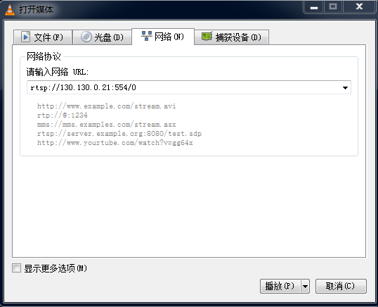

4.  勾选“显示更多选项”，把“正在缓冲”改成100ms，点击播放，如[图3](#_toc51692641)所示。

    **图 3**  设置播放参数<a name="_toc51692641"></a>  
    

    > **须知：** 
    >因为默认跑SmartP，刚开始缺少I帧画面会发绿，且长时间刷不回来，过1\~2分钟后图像就正常了。

# FAQ<a name="ZH-CN_TOPIC_0000002498141690"></a>


## 为什么工具连接单板会提示版本不匹配？<a name="ZH-CN_TOPIC_0000002530221603"></a>

【现象】

正确启动单板对应的图像调节工具且图像调节工具能够正确打开，打开xml文件之后连接单板，工具提示版本不匹配。

【分析】

图像调节工具板端版本与xml版本不匹配。

【解决】

察看当前使用的SDK 版本，更新xml至当前SDK版本对应图像调节工具版本。

## PQTools工具文本文件导入导出异常如何处理<a name="ZH-CN_TOPIC_0000002530221683"></a>

【现象】

PQTools工具部分支持导入导出文本文件的功能界面，如矩阵式寄存器对话框、PreGamma调试界面、Gamma调试界面、LMF转换工具等。

现象一：将记事本中能打开且格式正常的文本文件导入PC端工具时，出现“格式不正确”的提示或者乱码；

现象二：从工具导出的文本文件使用记事本打开，显示乱码。

【分析】

PQTools工具目前仅支持ANSI编码的文本文件，如果导入其他编码格式的文件则无法识别。

【解决】

现象一：导入PQTools工具文本文件前，使用记事本或Notepad++等文本编辑器将原始文件以ANSI编码重新保存。

现象二：使用记事本打开PQTools工具导出的文本文件时需要选择文件的编码格式为ANSI类型。

## 如何处理低照度场景编码I帧过大无法点播<a name="ZH-CN_TOPIC_0000002498141788"></a>

【现象】

灌入低照度场景抓取的RAW后点播画面黑屏，再次连接提示成功但画面仍然黑屏。

【分析】

低照度场景的RAW经过编码后的I帧远大于正常场景，网传buffer和PC端接收码流的buffer受限，不能传输和存储该I帧。

【解决】

用户可在板端配置文件config\_mt.ini通过修改bufcoef配置网传buffer的大小；在PC端点播画面右键选择StreamType为Data First，可保证PC端接收码流的buffer足够存储该I帧。

## 如何读取到RC属性或者GopMode属性<a name="ZH-CN_TOPIC_0000002498301808"></a>

【现象】

在PQTools工具调试界面中，读取RC属性或者GopMode属性都失败。

【分析】

读取RC属性或者GopMode属性时，只能读取对应模式下的属性。如果模式错误，则会读取失败。

【解决】

查看当前RC或者GopMode处于什么模式，读取对应模式下的属性。如果需要读取其他模式下的属性，需要设置RC或者GopMode到对应的模式，并同时对该模式属性进行写操作。

## 如何解决因内存不够导致的抓/灌RAW/YUV等操作失败<a name="ZH-CN_TOPIC_0000002530061721"></a>

【现象】

在control界面上，执行抓多帧RAW/YUV、会出现因vb块数不够而导致失败。

【分析】

板端缓存RAW和YUV数据，是从媒体业务创建的vb pool中获取上来的，当vb块数不够时，抓RAW或YUV的MPI接口就会失败返回，导致抓RAW/YUV失败。

【解决】

当抓RAW/YUV时，剩余的可用vb块数要大于所抓的帧数。

## 在使用CLUT标定时，出现文件路径解析错误<a name="ZH-CN_TOPIC_0000002530061691"></a>

【现象】

工具的存放路径包含中文时，使用CLUT标定，工具报路径解析错误。如[图1](#_toc51692642)所示。

**图 1**  错误告警信息<a name="_toc51692642"></a>  


【分析】

CLUT工具标定时，会在PQTools工具目录下自动生成临时文件。如果PQTools工具目录在中文目录下，会因为CLUT标定算法库不支持中文路径，无法解析到生成的临时文件而报错。

【解决】

将PQTools工具放在英文路径下运行。

## 使用非SDK提供的 3A库，如何配置XML可调项<a name="ZH-CN_TOPIC_0000002530221771"></a>

【现象】

媒体业务启用的是非SDK提供的3A库，无法使用PQTools工具进行3A参数的调试。

【分析】

PQTools工具提供的XML可调项均为SDK接口，非SDK提供的3A无法与SDK接口一一对应。

【解决】

可在XML中自行添加自定义寄存器调试非SDK提供的 3A参数，参考"物理/虚拟寄存器的添加与调试"。

## 用户的媒体业务起来后，PQTools工具界面不能调节AE、AWB等参数<a name="ZH-CN_TOPIC_0000002498301784"></a>

【现象】

媒体业务起来后，使用PQTools工具进行AE、AWB等参数的调试失败。

【分析】

可能的两个原因：

-   媒体业务IspRun没有运行起来；
-   媒体业务加载非SDK提供的3A库；

【解决】

-   在板端命令查看业务线程，是否存在IspRun线程。
-   在XML中自行添加自定义寄存器调试非SDK提供的3A参数，参考"物理/虚拟寄存器的添加与调试"。

## PQTools工具4K分辨率下部分界面显示异常<a name="ZH-CN_TOPIC_0000002498141774"></a>

【现象】

Win7系统下，PQTools工具运行后，打开“PQ RAW YUV Analyzer”界面显示异常，如图：

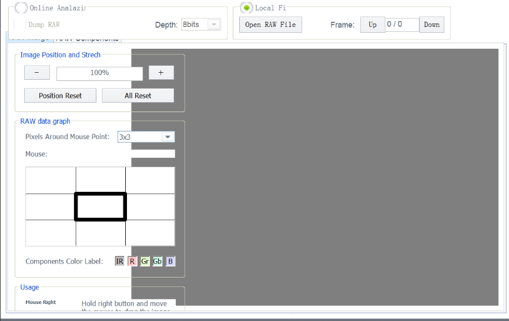

【分析】

高DPI显示设置（125%、150%，甚至更高）下发生显示异常问题；

原因：Win7系统增加了高DPI适配功能，默认支持自动进行高DPI适配，使得界面窗口和控件可以自动放大显示。DPI适配不兼容代码设置的控件位置和大小。

【解决】

-   方案一：修改显示器屏幕文本缩放比例，比如：100%。注销后生效；
-   方案二：修改DPI配置：找到“自定义DPI设置”-\>“使用Windows XP风格DPI缩放比例”，修改显示状态，点击确定-\>点击应用。注销后生效。


## PQTools工具灌RAW之后，图像显示异常<a name="ZH-CN_TOPIC_0000002498301734"></a>

【现象】

Hi3403V100、使用PQ RAW Utilities工具将RAW文件倒灌到板端，图像显示异常，如[图1](#_fig10111422426)所示。

**图 1**  使用RAW Utilities工具后图像异常示意图<a name="_fig10111422426"></a>  
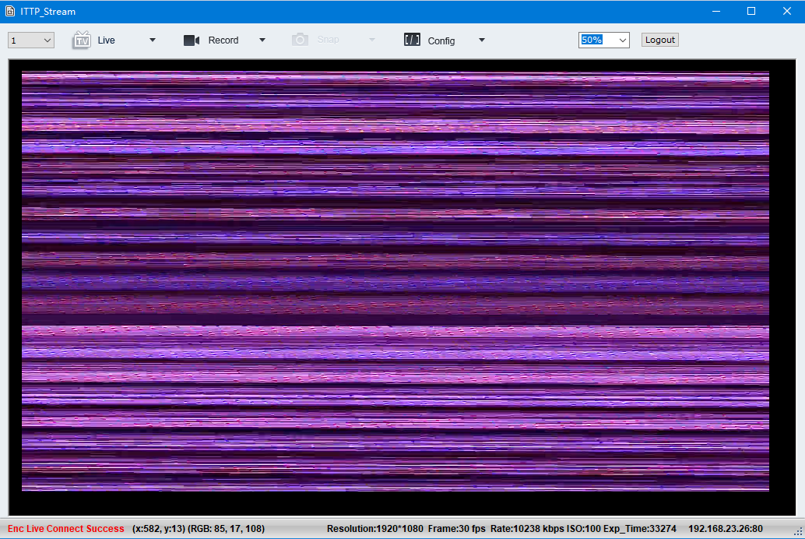

【分析】

灌RAW到FE需要开启自产生时序。

【解决】

灌RAW之前将PQTools主界面的TimingAttr的Enable勾选上。注意：勾选之后不灌RAW，图像异常。

## FPN标定无法存raw文件<a name="ZH-CN_TOPIC_0000002530061735"></a>

【现象】

FPN标定和校正功能，但是FPN标定时无法存Raw文件，并且芯片支持文件系统。

【分析】

为了适配无文件系统的芯片，FPN标定结果默认写到内存中。

【解决】

FPN标定支持写内存和写Raw文件两种方案，当需要存Raw文件时，可以修改config.cfg文件中\[FPNSaveRaw\]节点下的enable值：

-   enable=0时，表示将FPN标定结果写入内存中；
-   enable=1时，表示存Raw文件。

## 8k分辨率ISP工具导入RAW个数受限<a name="ZH-CN_TOPIC_0000002530061785"></a>

【现象】

ISP标定工具，进行AWB标定时导入8k分辨率的RAW数据最多导入13张，继续导入时弹框提示“File to import RAW file‘xxx.raw’:Memory allocation failed.”。

【分析】

所有32位应用程序都有4G的进程地址空间，操作系统保留部分空间（1G，操作系统的内核模式地址空间限定），应用程序拥有的用户模式虚拟地址空间（3G）。

PQTools工具为32位应用程序，ISP标定工具导入RAW数据时内存申请：RAW内存和RGB内存（RAW转成RGB显示）。如：7680x4320分辨率，需要的连续内存为190M：64M\(RAW\)+126M\(RGB\)。

【解决】

1.  根据场景导入合适张数的RAW文件。
2.  AWB标定只和光学器件（镜头、Sensor）相关，使用相同光学套件，采集小分辨率的图像进行数据标定。

## 关闭板端业务命令<a name="ZH-CN_TOPIC_0000002530061725"></a>

-   LiteOS系统端pq\_control业务命令选项添加“stop”字段可关闭 LiteOS系统下的control业务。

    举例：pq\_control stop

-   Linux系统端PQTools.sh业务启动脚本命令选项添加“-as”字段可关闭Linux系统下的板端PQTools业务。

    举例：PQTools.sh –as

## PQTools DIS标定工具convert或apply失败的解决方法<a name="ZH-CN_TOPIC_0000002498301716"></a>

DIS标定工具需要先calibration，再Convert Calibration Data，然后才可以Apply To Board。若未经过Convert Calibration Data会报错误，如[图1](#_toc51692643)所示。

**图 1**  若未经过Convert Calibration Data报错误图<a name="_toc51692643"></a>  


在Convert Calibration Data这一步，可能出现类似上面的报错，这时可能是标定参数超出范围，参考镜头标定算法内参，标定出的算法参数超出范围有2种解决方法：

-   重新添加标定图片，重点添加：棋盘格在画面居中、且占用画面比例较大的图片（需要靠近些镜头）若干张；
-   减少畸变系数DistCoeffType的个数，默认为3，进行递减，直到输出参数在芯片支持的范围内，这时不需要减少图片。

其中第一种方法同时对标定效果有些改进，为首选方法。但第二种方法更快捷。

## 关于隐私保护PQTools工具使用及限制说明<a name="ZH-CN_TOPIC_0000002498301830"></a>

1.  PQStream工具由于缺少相应的解码库，暂时不支持点播隐私保护的码流；
2.  隐私保护的码流被点播时会导致pc端点播工具卡住，以及板端网络层异常，需要重启板端业务方可继续使用正常点播业务。
3.  板端支持业务起来时自动录制隐私保护的码流，在配置对应的隐私保护媒体之后，打开板端码流录制功能，可保存隐私保护的码流。

## 关于Stitch Preview拼接仿真限制说明<a name="ZH-CN_TOPIC_0000002530221701"></a>

Stitch Preview拼接仿真功能对内存消耗较大。分辨率过大时就会造成当前32位工具内存不足。（32位工具最大可用内存是2G，超过时会提示内存不足如[图1](#fig3499334164112)所示）。如果使用出现内存不足的情况，请适当调小分辨率。

**图 1**  拼接仿真内存不足报错<a name="fig3499334164112"></a>  
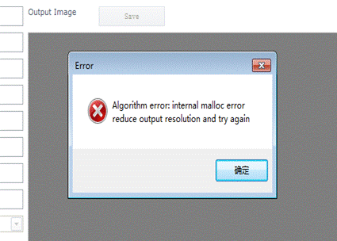

## 关于使用工具抓JPEG图像异常<a name="ZH-CN_TOPIC_0000002530061675"></a>

如果VENC前端绑定模块输出的YUV格式为Tile，会导致VENC 通道抓出的图像如下所示。需要将前端chn 属性中video\_format修改为 OT\_VIDEO\_FORMAT\_LINEAR。

此问题涉及到工具模块：PQ Stitching Tool中Stitch Auto Fine Tuning；Capture Tool中JPEG Image；PQ 3A Analyser；

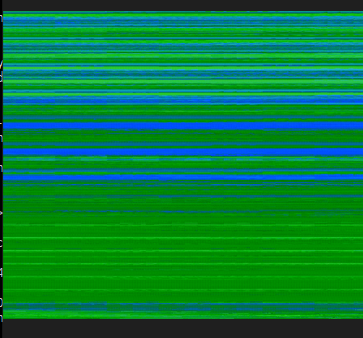

