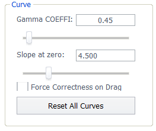
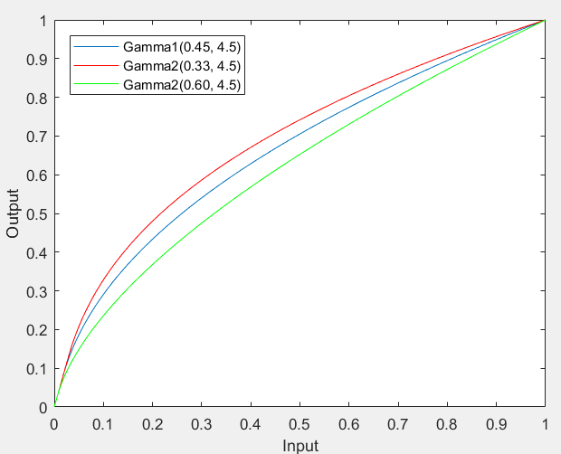
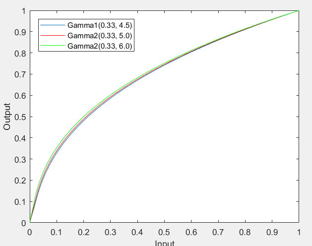
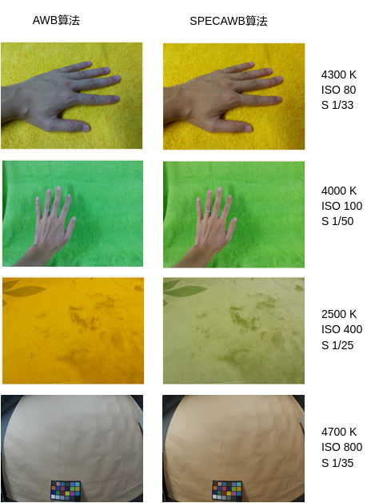
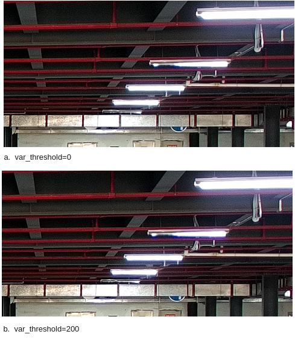
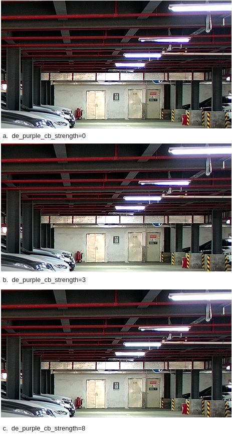

# 前言

**概述**

本文为ISP图像质量调试而写，内部详细介绍了ISP各模块调试方法，目的是为您在开发过程中遇到的问题提供解决办法和帮助。

> **说明：** 
>本文以Hi3403V100描述为例，未有特殊说明，SS927V100与Hi3403V100内容一致。

**产品版本**

与本文档相对应的产品版本如下。

<table><thead align="left"><tr id="row3099mcpsimp"><th class="cellrowborder" valign="top" width="32%" id="mcps1.1.3.1.1">
产品名称

</th>
<th class="cellrowborder" valign="top" width="68%" id="mcps1.1.3.1.2">
产品版本

</th>
</tr>
</thead>
<tbody><tr id="row3105mcpsimp"><td class="cellrowborder" valign="top" width="32%" headers="mcps1.1.3.1.1 ">
Hi3403V100

</td>
<td class="cellrowborder" valign="top" width="68%" headers="mcps1.1.3.1.2 ">
V100

</td>
</tr>

</tbody>
</table>

**读者对象**

本文档（本指南）主要适用于以下工程师：

-   技术支持工程师
-   软件开发工程师

**符号约定**

在本文中可能出现下列标志，它们所代表的含义如下。

<table><thead align="left"><tr id="row1530720816410"><th class="cellrowborder" valign="top" width="20.580000000000002%" id="mcps1.1.3.1.1">
<strong id="b2136615816410">符号</strong>

</th>
<th class="cellrowborder" valign="top" width="79.42%" id="mcps1.1.3.1.2">
<strong id="b5941558116410">说明</strong>

</th>
</tr>
</thead>
<tbody><tr id="row1372280416410"><td class="cellrowborder" valign="top" width="20.580000000000002%" headers="mcps1.1.3.1.1 ">

</td>
<td class="cellrowborder" valign="top" width="79.42%" headers="mcps1.1.3.1.2 ">
表示如不避免则将会导致死亡或严重伤害的具有高等级风险的危害。

</td>
</tr>

<tr id="row607mcpsimp"><td class="cellrowborder" valign="top" headers="mcps1.2.4.1.1 ">
mesh_strength

</td>
<td class="cellrowborder" valign="top" headers="mcps1.2.4.1.1 ">
用来全局纠正LSC标定后的强度。当镜头shading很严重的时候，画面四个角补偿的增益很大，容易导致噪声很大，而且画面有格子现象。这个调整mesh_strength小于一倍强度，可以减少LSC的补偿值，让四个角的补偿增益较小一些，达到优化噪声和画面格子问题。

取值范围：[0, 65535]

</td>
</tr>
<tr id="row614mcpsimp"><td class="cellrowborder" valign="top" headers="mcps1.2.4.1.1 ">
blend_ratio

</td>
<td class="cellrowborder" valign="top" headers="mcps1.2.4.1.1 ">
两张增益表的融合比例

取值范围：[0, 256]

</td>
</tr>
<tr id="row621mcpsimp"><td class="cellrowborder" valign="top" headers="mcps1.2.4.1.1 ">
bnr_lsc_auto_en

</td>
<td class="cellrowborder" valign="top" headers="mcps1.2.4.1.1 ">
BNR LSC的表参考Mesh LSC表的使能。默认关，使用用户配置的bnr_lsc_gain_lut表；开启后参考会lsc_gain_lut的表，自动刷新bnr_lsc_gain_lut。

取值范围：[0,1]

</td>
</tr>
<tr id="row627mcpsimp"><td class="cellrowborder" rowspan="5" valign="top" width="18%" headers="mcps1.2.4.1.1 ">
ot_isp_shading_lut_attr

</td>
<td class="cellrowborder" valign="top" width="22%" headers="mcps1.2.4.1.1 ">
mesh_scale

</td>
<td class="cellrowborder" valign="top" width="60%" headers="mcps1.2.4.1.2 ">
增益表精度控制参数

取值范围：[0, 7]

</td>
</tr>
<tr id="row636mcpsimp"><td class="cellrowborder" valign="top" headers="mcps1.2.4.1.1 ">
x_grid_width [(OT_ISP_LSC_GRID_COL - 1)/2]

</td>
<td class="cellrowborder" valign="top" headers="mcps1.2.4.1.1 ">
用来储存各GRID分区宽度大小信息。该接口各分量最小值为4，总和应为原画面宽度的四分之一。（例如原画面大小为1080p，则该接口各参数总和应为480）

取值范围：[4, width/4 - 60]，width为原画面的宽度

</td>
</tr>
<tr id="row643mcpsimp"><td class="cellrowborder" valign="top" headers="mcps1.2.4.1.1 ">
y_grid_width[(OT_ISP_LSC_GRID_ROW - 1)/2]

</td>
<td class="cellrowborder" valign="top" headers="mcps1.2.4.1.1 ">
用来储存各GRID分区高度大小信息。该接口各分量最小值为4，总和应为原画面高度的四分之一。（例如原画面大小为1080p，则该接口各参数总和应为270）

取值范围：[4,height/4 - 60]，height为原画面的高度

</td>
</tr>
<tr id="row650mcpsimp"><td class="cellrowborder" valign="top" headers="mcps1.2.4.1.1 ">
lsc_gain_lut[2]

</td>
<td class="cellrowborder" valign="top" headers="mcps1.2.4.1.1 ">
两组色温下的增益表配置。硬件基于这两组表以及blend_ratio进行当前色温下校正增益表的计算

取值范围：[0, 1023]

</td>
</tr>
<tr id="row657mcpsimp"><td class="cellrowborder" valign="top" headers="mcps1.2.4.1.1 ">
bnr_lsc_gain_lut

</td>
<td class="cellrowborder" valign="top" headers="mcps1.2.4.1.1 ">
用于BNR LSC参考所用的增益表。

取值范围：[0, 65535]

</td>
</tr>
</tbody>
</table>

### 调试步骤

Shading是与一种镜头有关的缺陷，对于每个镜头都需按照[《图像质量调试工具使用指南》](../ai/图像质量调试工具使用指南.md)LSC部分所描述的步骤进行数据的采集与标定，将获取的标定结果写入cmos\_ex.h文件中或直接导入到PQTools上。具体每个参数的作用和对图像的影响可参考上表中的描述。

> **须知：** 
>-   增益表的默认配置与ot\_isp\_cmos\_alg\_key中的bit1\_lsc 标志位有关，如果bit1\_lsc=1\)，则采用cmos\_ex.h中的配置值作为默认值；否则默认配置为1倍增益。具体请参考[《ISP开发参考》](ISP 开发参考（1--2）.md)。
>-   在标定时，如果看到“Please set Mesh scale to \*”说明所标定图像的增益超过了所设定的mesh\_scale的增益范围，应当把mesh\_scale设定为推荐的数值，重新进行Mesh Shading的标定。

## Gamma

### 功能描述

Gamma模块对图像进行亮度空间非线性转换以适配输出设备。Gamma模块校正R、G、B时调用同一组Gamma表，Gamma表各节点之间的间距相同，节点之间的图像像素值使用线性插值生成。

### 关键参数

**表 1**  Gamma关键参数

<table><thead align="left"><tr id="row1395mcpsimp"><th class="cellrowborder" valign="top" width="36%" id="mcps1.2.3.1.1">
参数名称

</th>
<th class="cellrowborder" valign="top" width="64%" id="mcps1.2.3.1.2">
描述

</th>
</tr>
</thead>
<tbody><tr id="row1401mcpsimp"><td class="cellrowborder" valign="top" width="36%" headers="mcps1.2.3.1.1 ">
enable

</td>
<td class="cellrowborder" valign="top" width="64%" headers="mcps1.2.3.1.2 ">
Gamma校正功能使能。

TD_FALSE：关闭；

TD_TRUE：使能。

默认值为TD_TRUE。

</td>
</tr>
<tr id="row1413mcpsimp"><td class="cellrowborder" valign="top" width="36%" headers="mcps1.2.3.1.1 ">
curve_type

</td>
<td class="cellrowborder" valign="top" width="64%" headers="mcps1.2.3.1.2 ">
Gamma曲线选择。

默认值为OT_ISP_GAMMA_CURVE_DEFAULT。

SDR模式为 OT_ISP_GAMMA_CURVE_SRGB

HDR模式为 OT_ISP_GAMMA_CURVE_HDR，不支持该选项

用户自定义模式为OT_ISP_GAMMA_CURVE_USER_DEFINE

</td>
</tr>
<tr id="row1424mcpsimp"><td class="cellrowborder" valign="top" width="36%" headers="mcps1.2.3.1.1 ">
table[OT_ISP_GAMMA_NODE_NUM]

</td>
<td class="cellrowborder" valign="top" width="64%" headers="mcps1.2.3.1.2 ">
Gamma表。

取值范围：[0, 0xFFF]

</td>
</tr>
</tbody>
</table>

### 调试步骤

用户自定义Gamma曲线时，必须确保Gamma表配置正确。WDR模式下的Gamma曲线与线性模式不一样，WDR模式下Gamma应配置为线性模式（Y=X）。

HDR模式下应配置为OT\_ISP\_GAMMA\_CURVE\_HDR模式。

不同场景下Gamma曲线配置不同，按关注点进行相应的曲线调整。

### Gamma参数

如果使用用户自定义Gamma曲线时，也可以通过PQ工具上，Curve区域的相关参数进行配置并生成Gamma曲线。

**图 1**  Gamma参数配置选项Curve区域  

Curve区域由两个参数组成，Gamma COEFFI和Slope at zero。其中Gamma COEFFI用来控制Gamma生成的形状，Slope at zero用来控制Gamma曲线的零点斜率大小。

两个参数对曲线形状的影响具体如下：

如果Slope at zero的值一致，则曲线起始阶段斜率一致，值也基本相同，曲线由于Gamma COEFFI参数的不同而形状不同，变化趋势如下。

**图 2**  Gamma COEFFI对Gamma曲线的影响  

-   如果是COEFFI不变，而只是Slope at zero有变化，则曲线整体形状不变，只是在0点斜率处发生变化（会导致整体曲线发生轻微位移）。

**图 3**  Gamma COEFFI对Gamma曲线的影响  

**图 4**  Gamma COEFFI对Gamma曲线的影响（零点斜率处放大）  

## White Balance

### 功能描述

同一物体在不同光源照射下呈现的颜色是不同的，受光源色温的影响。低色温光源下，白色物体偏红，高色温光源下，白色物体偏蓝。人眼可根据大脑的记忆判断，识别物体的真实颜色。AWB（Auto White Balance）算法的功能是降低外界光源对物体真实颜色的影响，使得我们采集的颜色信息转变为在理想日光光源下的无偏色信息。

AWB算法的基本原理是，根据场景内灰色物体的颜色信息，计算R, G, B颜色通道的增益，乘以增益后，RGB三个通道达到平衡。

AWB的增益是全局的，因此，在混合光源下，不能达到所有灰色区域的RGB三通道平衡。

目前我们提供两种AWB算法，分别为AWB与SPECAWB。SPECAWB应用了机器学习算法, 通过学习大量场景内的Wb Gain值获得不同亮度下的光源分布概率，结合实际场景内的白点来还原颜色。当场景内缺乏灰色参考,或者大面积肤色时SPECAWB算法可以获得更好的性能。相比AWB算法的主要效果提升如[图1](#fig13215624131819)所示。

**图 1**  AWB和SPECAWB算法  

### 关键参数\(AWB\)

**表 1**  AWB标定参数

<table><thead align="left"><tr id="row738mcpsimp"><th class="cellrowborder" valign="top" width="26%" id="mcps1.2.3.1.1">
参数名称

</th>
<th class="cellrowborder" valign="top" width="74%" id="mcps1.2.3.1.2">
描述

</th>
</tr>
</thead>
<tbody><tr id="row744mcpsimp"><td class="cellrowborder" valign="top" width="26%" headers="mcps1.2.3.1.1 ">
ref_color_temp

</td>
<td class="cellrowborder" valign="top" width="74%" headers="mcps1.2.3.1.2 ">
静态白平衡系数标定的环境色温，单位Kelvin。推荐在Macbeth D50标准光源环境或室外晴天环境捕获24色卡Raw数据进行标定。

取值范围：[0x0, 0xFFFF]

</td>
</tr>
<tr id="row750mcpsimp"><td class="cellrowborder" valign="top" width="26%" headers="mcps1.2.3.1.1 ">
static_wb[4]

</td>
<td class="cellrowborder" valign="top" width="74%" headers="mcps1.2.3.1.2 ">
静态白平衡系数，由AWB标定工具给出。

取值范围：[0x0, 0xFFF]

</td>
</tr>
<tr id="row756mcpsimp"><td class="cellrowborder" valign="top" width="26%" headers="mcps1.2.3.1.1 ">
curve_para[0-2]

</td>
<td class="cellrowborder" valign="top" width="74%" headers="mcps1.2.3.1.2 ">
普朗克曲线系数，由AWB标定工具给出。普朗克曲线描绘白色块在不同色温的标准光源下的颜色表现。

</td>
</tr>
<tr id="row762mcpsimp"><td class="cellrowborder" valign="top" width="26%" headers="mcps1.2.3.1.1 ">
curve_para[3-5]

</td>
<td class="cellrowborder" valign="top" width="74%" headers="mcps1.2.3.1.2 ">
色温曲线系数，由AWB标定工具给出。色温曲线描绘白色块的颜色表现与色温的对应关系。

</td>
</tr>
</tbody>
</table>

**表 2**  AWB参数

<table><thead align="left"><tr id="row774mcpsimp"><th class="cellrowborder" valign="top" width="26%" id="mcps1.2.3.1.1">
参数名称

</th>
<th class="cellrowborder" valign="top" width="74%" id="mcps1.2.3.1.2">
描述

</th>
</tr>
</thead>
<tbody><tr id="row780mcpsimp"><td class="cellrowborder" valign="top" width="26%" headers="mcps1.2.3.1.1 ">
alg_type

</td>
<td class="cellrowborder" valign="top" width="74%" headers="mcps1.2.3.1.2 ">
白平衡的算法类型属性，支持OT_ISP_AWB_ALG_LOWCOST和OT_ISP_AWB_ALG_ADVANCE可选。OT_ISP_AWB_ALG_LOWCOST CPU占用较少，对光源的适应性较好。OT_ISP_AWB_ALG_ADVANCE提升了AWB精度。

</td>
</tr>
<tr id="row785mcpsimp"><td class="cellrowborder" valign="top" width="26%" headers="mcps1.2.3.1.1 ">
speed

</td>
<td class="cellrowborder" valign="top" width="74%" headers="mcps1.2.3.1.2 ">
AWB收敛速度，值越大，AWB收敛越快。

取值范围：[0x0, 0xFFF]

</td>
</tr>
<tr id="row791mcpsimp"><td class="cellrowborder" valign="top" width="26%" headers="mcps1.2.3.1.1 ">
high_color_temp

</td>
<td class="cellrowborder" valign="top" width="74%" headers="mcps1.2.3.1.2 ">
AWB支持的色温上限，推荐取值在[10000, 15000]。

色温上限越大，蓝色物体对AWB的干扰越大。

</td>
</tr>
<tr id="row797mcpsimp"><td class="cellrowborder" valign="top" width="26%" headers="mcps1.2.3.1.1 ">
low_color_temp

</td>
<td class="cellrowborder" valign="top" width="74%" headers="mcps1.2.3.1.2 ">
AWB支持的色温下限，推荐取值在[1500, 2500]。

色温下限越小，橙色、红色物体对AWB的干扰越大。

</td>
</tr>
<tr id="row803mcpsimp"><td class="cellrowborder" valign="top" width="26%" headers="mcps1.2.3.1.1 ">
ct_limit

</td>
<td class="cellrowborder" valign="top" width="74%" headers="mcps1.2.3.1.2 ">
检测色温超出色温范围时，AWB算法的动作。检测色温在色温范围内时，该模块不生效。

支持Manual和Auto两种方式，Manual模式下，由用户定义色温超限时AWB的增益；Auto模式下，根据AWB标定参数，确定色温超限时AWB的增益。

</td>
</tr>
<tr id="row809mcpsimp"><td class="cellrowborder" valign="top" width="26%" headers="mcps1.2.3.1.1 ">
shift_limit

</td>
<td class="cellrowborder" valign="top" width="74%" headers="mcps1.2.3.1.2 ">
以普朗克曲线为中心点，shift_limit为半径确定AWB支持的光源范围。取值越大，对特殊光源的支持越广，影响特定场景下AWB精度。推荐取值0x30-0x50。

</td>
</tr>
<tr id="row814mcpsimp"><td class="cellrowborder" valign="top" width="26%" headers="mcps1.2.3.1.1 ">
gain_norm_en

</td>
<td class="cellrowborder" valign="top" width="74%" headers="mcps1.2.3.1.2 ">
AWB最终增益是否做归一化，使能后，可提高低照、低色温下的信噪比。

</td>
</tr>
<tr id="row819mcpsimp"><td class="cellrowborder" valign="top" width="26%" headers="mcps1.2.3.1.1 ">
rg_strength

bg_strength

</td>
<td class="cellrowborder" valign="top" width="74%" headers="mcps1.2.3.1.2 ">
AWB校正强度，推荐rg_strength= bg_strength，且设置值&lt;=0x80。

rg_strength=0x80时，白色恢复为白色；

rg_strength&gt;0x80时，白色与光源反向，低色温偏蓝，高色温偏红；

rg_strength&lt;0x80时，白色与光源同向，低色温偏红，高色温偏蓝。

</td>
</tr>
<tr id="row840mcpsimp"><td class="cellrowborder" valign="top" width="26%" headers="mcps1.2.3.1.1 ">
cb_cr_track

</td>
<td class="cellrowborder" valign="top" width="74%" headers="mcps1.2.3.1.2 ">
不同ISO下白点条件，cr_max, cr_min, cb_max, cb_min等四组查找表。

推荐用户针对sensor调整以上参数，可优化低照度效果。

</td>
</tr>
</tbody>
</table>

**表 3**  AWB Ext扩展参数

<table><thead align="left"><tr id="row852mcpsimp"><th class="cellrowborder" valign="top" width="25%" id="mcps1.2.3.1.1">
参数名称

</th>
<th class="cellrowborder" valign="top" width="75%" id="mcps1.2.3.1.2">
描述

</th>
</tr>
</thead>
<tbody><tr id="row858mcpsimp"><td class="cellrowborder" valign="top" width="25%" headers="mcps1.2.3.1.1 ">
tolerance

</td>
<td class="cellrowborder" valign="top" width="75%" headers="mcps1.2.3.1.2 ">
帧间相关的容忍度。设置为0时，AWB每2帧刷新一次增益系数；设置为非0值时，AWB判断场景是否有变化，仅在变化时刷新增益系数。

</td>
</tr>
<tr id="row863mcpsimp"><td class="cellrowborder" valign="top" width="25%" headers="mcps1.2.3.1.1 ">
zone_radius

</td>
<td class="cellrowborder" valign="top" width="75%" headers="mcps1.2.3.1.2 ">
分块统计信息分类的半径。不同亮度灰色块感光一致性较差时，可适当放大该参数。WDR模式下，可适当放大该参数。

</td>
</tr>
<tr id="row868mcpsimp"><td class="cellrowborder" valign="top" width="25%" headers="mcps1.2.3.1.1 ">
light_info

</td>
<td class="cellrowborder" valign="top" width="75%" headers="mcps1.2.3.1.2 ">
支持特殊光源点。

</td>
</tr>
<tr id="row873mcpsimp"><td class="cellrowborder" valign="top" width="25%" headers="mcps1.2.3.1.1 ">
in_or_out

</td>
<td class="cellrowborder" valign="top" width="75%" headers="mcps1.2.3.1.2 ">
室内外检测参数。推荐客户根据sensor感光调整out_thresh参数。感光较弱的sensor，可适当放大该参数。

</td>
</tr>
</tbody>
</table>

### 关键参数\(SPECAWB\)

**表 1**  SPECAWB标定参数

<table><thead align="left"><tr id="row3352mcpsimp"><th class="cellrowborder" valign="top" width="25%" id="mcps1.2.3.1.1">
参数名称

</th>
<th class="cellrowborder" valign="top" width="75%" id="mcps1.2.3.1.2">
描述

</th>
</tr>
</thead>
<tbody><tr id="row3358mcpsimp"><td class="cellrowborder" valign="top" width="25%" headers="mcps1.2.3.1.1 ">
wb_center

</td>
<td class="cellrowborder" valign="top" width="75%" headers="mcps1.2.3.1.2 ">
光源权重分布表坐标系中心位置，由标定得到

</td>
</tr>
<tr id="row3363mcpsimp"><td class="cellrowborder" valign="top" width="25%" headers="mcps1.2.3.1.1 ">
black_body_tbl

</td>
<td class="cellrowborder" valign="top" width="75%" headers="mcps1.2.3.1.2 ">
普朗克曲线坐标(WB Gain值描述),由标定得到

</td>
</tr>
<tr id="row3368mcpsimp"><td class="cellrowborder" valign="top" width="25%" headers="mcps1.2.3.1.1 ">
fact_element

</td>
<td class="cellrowborder" valign="top" width="75%" headers="mcps1.2.3.1.2 ">
光源权重分布表，由标定得到

</td>
</tr>
<tr id="row3373mcpsimp"><td class="cellrowborder" valign="top" width="25%" headers="mcps1.2.3.1.1 ">
fono

</td>
<td class="cellrowborder" valign="top" width="75%" headers="mcps1.2.3.1.2 ">
镜头光圈大小F1.4=14,F2.8=28,F36 =360...，该值需要根据具体使用的镜头光圈大小来设定。

</td>
</tr>
</tbody>
</table>

**表 2**  SPECAWB参数

<table><thead align="left"><tr id="row3384mcpsimp"><th class="cellrowborder" valign="top" width="25%" id="mcps1.2.3.1.1">
参数名称

</th>
<th class="cellrowborder" valign="top" width="75%" id="mcps1.2.3.1.2">
描述

</th>
</tr>
</thead>
<tbody><tr id="row3390mcpsimp"><td class="cellrowborder" valign="top" width="25%" headers="mcps1.2.3.1.1 ">
kelvin_con

</td>
<td class="cellrowborder" valign="top" width="75%" headers="mcps1.2.3.1.2 ">
色温转换表，支持根据不同bv值配置最多8组原色温与目的色温，当结果色温落入转换表覆盖范围内，会以线性差值的方式将色温转换为用户设定的目的色温

原色温与目的色温的取值范围[2000,15000]。

</td>
</tr>
<tr id="row3396mcpsimp"><td class="cellrowborder" valign="top" width="25%" headers="mcps1.2.3.1.1 ">
wb_cnv_tbl

</td>
<td class="cellrowborder" valign="top" width="75%" headers="mcps1.2.3.1.2 ">
Firmware中实际使用的色温转换lut,用户需要使用PQ工具结合学习库与标定结果来生成。

</td>
</tr>
</tbody>
</table>

### 调试步骤

准确的标定系数，是AWB正常工作的前提。确认镜头、滤光片等器件正常后，按照[《图像质量调试工具使用指南》](../ai/图像质量调试工具使用指南.md)完成AWB标定工作。

标定完成后，测试标准光源下AWB精度，评估客观指标。出现偏色后，需要检查以下参数配置是否合理。

AWB:

-   检测色温是否在\[low\_color\_temp、 high\_color\_temp\]范围内，如果不在，调整色温上下限。
-   室内外检测是否正确，如果检测错误，调整out\_thresh参数。
-   打开PQ Tools的AWB分析界面，观察白色点是否在当前参数划定的白色区域内，如果不在，调整参数，扩大白色区域，将其概括进来。对特殊的光源，可通过添加独立光源点的方式支持。
-   场景内是否有敏感色\(肤色、暗绿色、浅黄色、浅蓝色等\)干扰了AWB表现。
-   低照度下出现了偏色，需要调整cb\_cr\_track的cr\_max, cr\_min, cb\_max, cb\_min等四组查找表。

SPECAWB:

-   检查统计信息配置，SPECAWB将统计信息cr\_max，cb\_max设定为4095； cr\_min，cb\_min设定为0。WhiteLevel设定为61000。该统计信息配置为SPECAWB算法需要，若被修改为不同值，需要将其复原。
-   检查色温转换表配置，打开PQ Tools的WB info界面获取当前色温及环境bv值。然后进入SpecAwb色温转换曲线设定界面找到该bv所属的色温转换曲线，观察当前环境色温是否被色温转换曲线进行了较大的shift。
-   参考[《ISP 颜色调优说明》](ISP 颜色调优说明.md)中关于SPECAWB调试步骤的说明。

## CCM

### 功能描述

Sensor RGB三分量对光谱的响应，与人眼对光谱的响应通常是有偏差的，可通过一个色彩校正矩阵校正光谱响应的交叉效应和响应强度，使前端捕获的图片与人眼视觉在色彩上保持一致。

CCM标定工具支持对24色卡进行3x3 Color Correction Matrix的预校正。Hi3403V100支持多组不同色温的CCM，在ISP运行时，FW根据当前的光照强度，调整饱和度，实现CCM（Color Correction Matrix）矩阵系数的动态调整。

### 关键参数

**表 1**  CCM关键参数

<table><thead align="left"><tr id="row960mcpsimp"><th class="cellrowborder" valign="top" width="46%" id="mcps1.2.3.1.1">
参数名称

</th>
<th class="cellrowborder" valign="top" width="54%" id="mcps1.2.3.1.2">
描述

</th>
</tr>
</thead>
<tbody><tr id="row966mcpsimp"><td class="cellrowborder" valign="top" width="46%" headers="mcps1.2.3.1.1 ">
iso_act_en

</td>
<td class="cellrowborder" valign="top" width="54%" headers="mcps1.2.3.1.2 ">
是否使能低照度下CCM Bypass功能。

</td>
</tr>
<tr id="row971mcpsimp"><td class="cellrowborder" valign="top" width="46%" headers="mcps1.2.3.1.1 ">
temp_act_en

</td>
<td class="cellrowborder" valign="top" width="54%" headers="mcps1.2.3.1.2 ">
是否使能高、低色温下CCM Bypass功能。

</td>
</tr>
<tr id="row976mcpsimp"><td class="cellrowborder" valign="top" width="46%" headers="mcps1.2.3.1.1 ">
color_temp

</td>
<td class="cellrowborder" valign="top" width="54%" headers="mcps1.2.3.1.2 ">
当前配置的CCM对应的色温。

取值范围：[500, 30000]

</td>
</tr>
<tr id="row982mcpsimp"><td class="cellrowborder" valign="top" width="46%" headers="mcps1.2.3.1.1 ">
ccm[OT_ISP_CCM_MATRIX_SIZE]

</td>
<td class="cellrowborder" valign="top" width="54%" headers="mcps1.2.3.1.2 ">
不同色温下的颜色校正矩阵，8bit小数精度。bit 15是符号位，0表示正数，1表示负数，例如0x8010表示-16。

取值范围：[0x0, 0xFFFF]

</td>
</tr>
<tr id="row989mcpsimp"><td class="cellrowborder" valign="top" width="46%" headers="mcps1.2.3.1.1 ">
ccm_tab_num

</td>
<td class="cellrowborder" valign="top" width="54%" headers="mcps1.2.3.1.2 ">
当前配置的CCM的组数。

取值范围：[3, 7]

</td>
</tr>
<tr id="row995mcpsimp"><td class="cellrowborder" valign="top" width="46%" headers="mcps1.2.3.1.1 ">
ccm_tab[OT_ISP_CCM_MATRIX_NUM]

</td>
<td class="cellrowborder" valign="top" width="54%" headers="mcps1.2.3.1.2 ">
不同色温下的颜色校正矩阵和对应的色温值。

</td>
</tr>
<tr id="row1000mcpsimp"><td class="cellrowborder" valign="top" width="46%" headers="mcps1.2.3.1.1 ">
sat_en

</td>
<td class="cellrowborder" valign="top" width="54%" headers="mcps1.2.3.1.2 ">
手动CCM模式下，饱和度是否生效。

</td>
</tr>
<tr id="row1005mcpsimp"><td class="cellrowborder" valign="top" width="46%" headers="mcps1.2.3.1.1 ">
ccm[OT_ISP_CCM_MATRIX_SIZE]

</td>
<td class="cellrowborder" valign="top" width="54%" headers="mcps1.2.3.1.2 ">
手动颜色校正矩阵，8bit小数精度。bit 15是符号位，0表示正数，1表示负数，例如0x8010表示-16。

取值范围：[0x0, 0xFFFF]

</td>
</tr>
<tr id="row1012mcpsimp"><td class="cellrowborder" valign="top" width="46%" headers="mcps1.2.3.1.1 ">
sat[OT_ISP_AUTO_ISO_NUM]

</td>
<td class="cellrowborder" valign="top" width="54%" headers="mcps1.2.3.1.2 ">
自动饱和度值。

</td>
</tr>
</tbody>
</table>

### 调试步骤

按照[《图像质量调试工具使用指南》](../ai/图像质量调试工具使用指南.md)完成CCM标定工作。

在标准D50光源下，调整光源亮度，确定sat 自动饱和度联动数组取值。

## CAC

### 功能概述

色差\(Chromatic Aberration\)是指光学上透镜无法将各种波长的光聚焦在同一点上的现象，是一种与镜头有关的缺陷，它产生的主要原因是不同波长的光具有不同的折射率（色散现象）。

**图 1**  色差图解  

如[图1](#fig253220313565)所示，色差可以分为两类：

-   轴向色差（Axial Chromatic Aberration）
    -   不同波长的光经由光学系统之后聚焦在不同的焦平面上，大口径镜头容易产生这种色差，缩小光圈可以减弱轴向色差
    -   人眼对于G通道更敏感，一般G通道可以正确对焦，从而引起R、B的模糊，造成高光区与低光区交界处出现明显的紫边表现
    -   轴向色差具有明显的局部特性，因此在校正时采用Local CAC对其进行校正

-   横向色差\(Lateral Chromatic Aberration\)
    -   透镜的放大倍数也与折射率有关，它使得不同波长光线的像高不同，即不同波长的光会聚焦在焦平面上不同的位置，会造成R、G、B 3通道具有不同的影像高度，在影像上产生色的错位，横向色差严重时，会使得物体的像带有彩色的边缘
    -   越偏离图像中心，横向色差越明显，一般横向色差表现为物体相对两侧边缘出现不同的颜色，但具体表现为什么颜色与镜头组密切相关，不同的镜头组会表现出不同种类的颜色边缘
    -   具有全局特性，在校正时采用ACAC

### Local CAC

Local CAC主要用来消除图像中出现的紫边问题。

#### 关键参数

**表 1**  Local CAC关键参数

<table><thead align="left"><tr id="row1123mcpsimp"><th class="cellrowborder" valign="top" width="32%" id="mcps1.2.3.1.1">
参数名称

</th>
<th class="cellrowborder" valign="top" width="68%" id="mcps1.2.3.1.2">
描述

</th>
</tr>
</thead>
<tbody><tr id="row1129mcpsimp"><td class="cellrowborder" valign="top" width="32%" headers="mcps1.2.3.1.1 ">
en

</td>
<td class="cellrowborder" valign="top" width="68%" headers="mcps1.2.3.1.2 ">
紫边校正使能。

取值范围：[0, 1]

</td>
</tr>
<tr id="row1135mcpsimp"><td class="cellrowborder" valign="top" width="32%" headers="mcps1.2.3.1.1 ">
purple_detect_range

</td>
<td class="cellrowborder" valign="top" width="68%" headers="mcps1.2.3.1.2 ">
紫色检测的范围

值越大，越多非高亮区域的紫色被界定为紫边区域

取值范围：[0, 410]

</td>
</tr>
<tr id="row1142mcpsimp"><td class="cellrowborder" valign="top" width="32%" headers="mcps1.2.3.1.1 ">
var_threshold

</td>
<td class="cellrowborder" valign="top" width="68%" headers="mcps1.2.3.1.2 ">
边缘检测阈值

取值范围：[0, 4095]

</td>
</tr>
<tr id="row1148mcpsimp"><td class="cellrowborder" valign="top" width="32%" headers="mcps1.2.3.1.1 ">
r_detect_threshold [3]

</td>
<td class="cellrowborder" valign="top" width="68%" headers="mcps1.2.3.1.2 ">
高亮区域检测R分量阈值

取值范围：[0, 4095]

</td>
</tr>
<tr id="row1154mcpsimp"><td class="cellrowborder" valign="top" width="32%" headers="mcps1.2.3.1.1 ">
g_detect_threshold [3]

</td>
<td class="cellrowborder" valign="top" width="68%" headers="mcps1.2.3.1.2 ">
高亮区域检测G分量阈值

取值范围：[0, 4095]

</td>
</tr>
<tr id="row1160mcpsimp"><td class="cellrowborder" valign="top" width="32%" headers="mcps1.2.3.1.1 ">
b_detect_threshold [3]

</td>
<td class="cellrowborder" valign="top" width="68%" headers="mcps1.2.3.1.2 ">
高亮区域检测B分量阈值

取值范围：[0, 4095]

</td>
</tr>
<tr id="row1166mcpsimp"><td class="cellrowborder" valign="top" width="32%" headers="mcps1.2.3.1.1 ">
l_detect_threshold [3]

</td>
<td class="cellrowborder" valign="top" width="68%" headers="mcps1.2.3.1.2 ">
高亮区域检测亮度阈值

取值范围：[0, 4095]

</td>
</tr>
<tr id="row1172mcpsimp"><td class="cellrowborder" valign="top" width="32%" headers="mcps1.2.3.1.1 ">
cb_cr_ratio [3]

</td>
<td class="cellrowborder" valign="top" width="68%" headers="mcps1.2.3.1.2 ">
紫边检测，区域颜色配置下限

取值范围：[-2048, 2047]

</td>
</tr>
<tr id="row1178mcpsimp"><td class="cellrowborder" valign="top" width="32%" headers="mcps1.2.3.1.1 ">
op_type

</td>
<td class="cellrowborder" valign="top" width="68%" headers="mcps1.2.3.1.2 ">
紫边校正工作模式

取值范围：[0, 1]

</td>
</tr>
<tr id="row1184mcpsimp"><td class="cellrowborder" valign="top" width="32%" headers="mcps1.2.3.1.1 ">
de_purple_cr_strength

</td>
<td class="cellrowborder" valign="top" width="68%" headers="mcps1.2.3.1.2 ">
R通道的校正强度

取值范围：[0, 8]

</td>
</tr>
<tr id="row1190mcpsimp"><td class="cellrowborder" valign="top" width="32%" headers="mcps1.2.3.1.1 ">
de_purple_cb_strength

</td>
<td class="cellrowborder" valign="top" width="68%" headers="mcps1.2.3.1.2 ">
B通道的校正强度

取值范围：[0, 8]

</td>
</tr>
</tbody>
</table>

#### 调试步骤

紫边表现与镜头特性有直接关系，有些镜头的紫边会扩散至十多个像素，受限于算法能力，很难在不引入副作用的情况下对其完全的校正，可以遵循如下的步骤进行调试，以期减弱紫边的表现：

-   r\_detect\_threshold、g\_detect\_threshold、b\_detect\_threshold、l\_detect\_threshold、cb\_cr\_ratio均有可调节的3个节点，其实际生效值由purple\_detect\_range的大小决定，purple\_detect\_range的值越大，越多非高亮区域的紫色被界定为紫边区域。
-   首先依据场景中的紫边表现以及校正需求，来调整purple\_detect\_range：如果采用默认值，高亮处有明显紫边没有被检测出来校正掉，需要适当增大purple\_detect\_range使得更多的区域被检测为紫边区域；相反的如果图像中有正常非明显高亮处的紫色被校正掉，则需要减小purple\_detect\_range的值，来保护正常区域的紫色表现。
-   [图1](#fig1513620551827)展示了purple\_detect\_range取不同值时图像的紫边效果，为0时检测范围最小，图像中的紫边基本上没有被检测到；为60时灯管上的紫边被检测出来，并且风车紫色叶片没有出现误检；继续增大purple\_detect\_range的值，比如为410时，可以看到风车紫色叶片出现明显灰度化。

**图 1**  purple\_detect\_range效果图  

-   若只需要校正强边缘处的紫色，则可以增加var\_threshold的值；var\_threshold的值越小，所能校正的紫边的范围越大，如[图2](#fig133951171378)所示，var\_threshold=0时所能检测的紫边范围不受强边缘条件的现在，所能检测校正的范围较宽，而当var\_threshold=200时，只能检测靠近灯管边缘的几个紫边像素能被检测校正掉。

**图 2**  var\_threshold效果图  

-   在配置完上述的检测参数之后，可以调整de\_purple\_cr\_strength、de\_purple\_cb\_strength来确定R、B通道的校正强度，校正强度调节的太大，可能会造成紫边处明显的灰度化，如[图3](#fig4334816181020)所示，调节至可接受的紫边校正强度即可。一般紫边的颜色表现为蓝紫色，即在高光区过渡到低光区时，B通道的衰减更慢，对于紫边出现的贡献更大，这个时候就需要将de\_purple\_cb\_strength的值调整的更大一些。

**图 3**  de\_purple\_cb\_strength效果图  

#### 注意事项

紫边表现与镜头特性有直接关系，有些镜头的紫边会扩散至十多个像素，受限于算法能力，在紫边很宽的时候，CAC容易引入锯齿问题和紫色块和蓝色块噪声跳动问题。其中，锯齿问题是因为紫边太宽导致部分紫边去除，部分紫边残留而形成锯齿。紫色块和蓝色块噪声跳动问题是因为CAC调试太强，导致紫色块和蓝色块的部分颜色去除，部分没有去除而形成噪声跳动。所以在WDR模式下调节CAC要注意var\_threshold的调节：

-   var\_threshold 是指区域方差的阈值，在非宽动态场景，曝光比比较小的情况下，此时短帧上的噪声较小，var\_threshold可以调比较小，可以去除比较多的紫边，降低锯齿的风险。
-   在曝光比较大的情况下，短帧上的噪声大，var\_threshold要相应的调高，才能区分边缘和平坦区域。从而解决因为CAC误判断导致蓝色块和紫色块噪声跳动问题。
-   有一些紫边比较严重的场景，R或者B容易出现饱和的情况，这时，b\_detect\_threshold或者r\_detect\_threshold在最大值附近有去除紫边不平滑的现象。需要跟de\_purple\_cr\_strength和de\_purple\_cb\_strength联合调整，比如把de\_purple\_cr\_strength和de\_purple\_cb\_strength调小。

### ACAC

ACAC不仅可以对纵向色差校正，还可以对横向色差校正。

#### 关键参数

**表 1**  ACAC关键参数

<table><thead align="left"><tr id="row2783mcpsimp"><th class="cellrowborder" valign="top" width="27%" id="mcps1.2.3.1.1">
参数名称

</th>
<th class="cellrowborder" valign="top" width="73%" id="mcps1.2.3.1.2">
描述

</th>
</tr>
</thead>
<tbody><tr id="row2789mcpsimp"><td class="cellrowborder" valign="top" width="27%" headers="mcps1.2.3.1.1 ">
en

</td>
<td class="cellrowborder" valign="top" width="73%" headers="mcps1.2.3.1.2 ">
色差校正使能。

取值范围：[0,1]

</td>
</tr>
<tr id="row2795mcpsimp"><td class="cellrowborder" valign="top" width="27%" headers="mcps1.2.3.1.1 ">
detect_mode

</td>
<td class="cellrowborder" valign="top" width="73%" headers="mcps1.2.3.1.2 ">
边缘检测的模式，它有2种模式。

0：普通模式。

1：宽紫边模式。

默认为0.不建议调试。

</td>
</tr>
<tr id="row2803mcpsimp"><td class="cellrowborder" valign="top" width="27%" headers="mcps1.2.3.1.1 ">
op_type

</td>
<td class="cellrowborder" valign="top" width="73%" headers="mcps1.2.3.1.2 ">
ACAC的工作模式：

<ul id="ul2808mcpsimp"><li>OT_OP_MODE_AUTO：自动；</li><li>OT_OP_MODE_MANUAL：手动。</li></ul>

默认值为OT_OP_MODE_AUTO。

</td>
</tr>
<tr id="row2812mcpsimp"><td class="cellrowborder" valign="top" width="27%" headers="mcps1.2.3.1.1 ">
edge_threshold[OT_ISP_ACAC_THR_NUM]

</td>
<td class="cellrowborder" valign="top" width="73%" headers="mcps1.2.3.1.2 ">
ACAC的边缘检测阈值，两个阈值分别代表高低阈值，小于edge_thd[0]的为平坦区域，大于edge_thd[1]的是强边缘。

取值范围：[0,4095]

</td>
</tr>
<tr id="row2818mcpsimp"><td class="cellrowborder" valign="top" width="27%" headers="mcps1.2.3.1.1 ">
edge_gain

</td>
<td class="cellrowborder" valign="top" width="73%" headers="mcps1.2.3.1.2 ">
ACAC的边缘检测强度，该值越大，检测的边缘越多。

取值范围：[0,1023]

</td>
</tr>
<tr id="row2824mcpsimp"><td class="cellrowborder" valign="top" width="27%" headers="mcps1.2.3.1.1 ">
purple_upper_limit

</td>
<td class="cellrowborder" valign="top" width="73%" headers="mcps1.2.3.1.2 ">
ACAC的紫色检测范围上限，具体见下图示意。其中purple_upper_limit必须大于purple_lower_limit。

取值范围：[-511,511]

</td>
</tr>
<tr id="row2830mcpsimp"><td class="cellrowborder" valign="top" width="27%" headers="mcps1.2.3.1.1 ">
purple_lower_limit

</td>
<td class="cellrowborder" valign="top" width="73%" headers="mcps1.2.3.1.2 ">
ACAC的紫色检测范围下限，具体见下图示意。

取值范围：[-511,511]

</td>
</tr>
<tr id="row2836mcpsimp"><td class="cellrowborder" valign="top" width="27%" headers="mcps1.2.3.1.1 ">
purple_sat_threshold

</td>
<td class="cellrowborder" valign="top" width="73%" headers="mcps1.2.3.1.2 ">
ACAC的紫色检测饱和度阈值。大于该阈值的方为紫色的区域。

取值范围：[0, 2047]

</td>
</tr>
<tr id="row2842mcpsimp"><td class="cellrowborder" valign="top" width="27%" headers="mcps1.2.3.1.1 ">
purple_alpha

</td>
<td class="cellrowborder" valign="top" width="73%" headers="mcps1.2.3.1.2 ">
ACAC参考紫色的权重。该值越大，表示ACAC参考紫色进行校正色差的越多。

取值范围：[0, 63]

</td>
</tr>
<tr id="row2848mcpsimp"><td class="cellrowborder" valign="top" width="27%" headers="mcps1.2.3.1.1 ">
edge_alpha

</td>
<td class="cellrowborder" valign="top" width="73%" headers="mcps1.2.3.1.2 ">
ACAC参考边缘的权重。该值越大，表示ACAC参考边缘进行校正色差的越多。

取值范围：[0, 63]

</td>
</tr>
<tr id="row2854mcpsimp"><td class="cellrowborder" valign="top" width="27%" headers="mcps1.2.3.1.1 ">
fcc_y_strength

</td>
<td class="cellrowborder" valign="top" width="73%" headers="mcps1.2.3.1.2 ">
ACAC根据亮度进行校正的强度，该值越大，表示ACAC校正越强。

取值范围：[0, 4095]

</td>
</tr>
<tr id="row2860mcpsimp"><td class="cellrowborder" valign="top" width="27%" headers="mcps1.2.3.1.1 ">
fcc_rb_strength

</td>
<td class="cellrowborder" valign="top" width="73%" headers="mcps1.2.3.1.2 ">
ACAC根据R,B通道强弱进行校正的强度，该值越大，表示ACAC校正越强。

取值范围：[0, 511]

</td>
</tr>
</tbody>
</table>

#### 调试步骤

紫边表现与镜头特性有直接关系，有些镜头的紫边会扩散至十多个像素，受限于算法能力，很难在不引入副作用的情况下对其完全的校正，可以遵循如下的步骤进行调试，以期减弱紫边的表现：

1.  紫色判断机制是在色度平面上根据Cr和Cb的比值将蓝紫色的区域划分出，依据场景中的紫边的颜色，一般有偏紫红色的，也有偏蓝色的，这时候可以调整purple\_upper\_limit和purple\_lower\_limit，一般建议，偏紫红的紫边，把purple\_upper\_limit调大一点，识别区域包含更多紫红色，偏蓝色的情况，把purple\_lower\_limit调小一点，识别区域包含更多蓝色。
2.  根据紫边的严重程度调整fcc\_y\_strength，fcc\_rb\_strength以及purple\_alpha。这四个参数的效果都是调试越大，去除越干净。他们的调试步骤可以这样，purple\_alpha调最大，然后再慢慢调大fcc\_y\_strength，fcc\_rb\_strength。
3.  如果图像出现纵向色差引入的非紫色的边缘，这时候，需要调整edge\_gain和edge\_alpha以及fcc\_y\_strength，fcc\_rb\_strength去实现色差校正。调整的步骤可以如下：先把edge\_alpha为63，保持步骤2中fcc\_y\_strength，fcc\_rb\_strength的值，看色差校正情况，如果去除过多引入了副作用，则慢慢减少edge\_alpha的值，如果去除还不够，则慢慢增大edge\_gain的值，再增大fcc\_y\_strength，fcc\_rb\_strength的值。
4.  如果紫边很严重，步骤2.3都去除不了，则需要结合LCAC一起去除。具体LCAC的调试方法参考LCAC的调试步骤。

    **图 1**  紫色检测范围示意图  
    

#### 注意事项

-   若场景中有一些较严重的紫边，需要加强去除紫边能力，将fcc\_y\_strength，fcc\_rb\_strength的值设置得较大，且edge\_alpha也设置得较大，注意这种情况下容易导致正常的物体边缘颜色呈灰色。
-   当fcc\_y\_strength调节不足时可能出现紫边分层的现象。
-   detect\_mode建议调试为0模式，1模式下只针对紫边做了扩充，对其他颜色的边，如红边，黄边，绿边作用可能减弱，若要去除镜头色差产生其他颜色的边建议采用0模式。

## CA

### 功能概述

颜色调整模块支持在YUV空间进行色域调整的操作，这个模块下有两个模式，一个是CA模式，另外一个是CP模式（热成像上色），工作的时候，两者只能二选一。

在CA模式下，通过下面的公式可以将一个像素点（Y，U，V）映射到另一个像素点（Y', U', V'）。

Y'=Y;  U'=aU;  V'=aV;

其中a是转换系数，采用这组公式可以在一定程度上保持亮度和色调的恒定，对像素点的饱和度做一个调整。转换系数a和像素点亮度Y联系，就可以根据亮度的变化来调整饱和度，达到局部调整饱和度的目的，亮处的颜色更鲜艳，暗处的色噪不明显。同时在CP模式下，热成像的图像只有亮度信息，该模式下通过亮度信息Y查找上色的色板，查找对应的YUV的值作为输出的值。其中，色板是通过YUV格式存储的，转换系数a和ISP的ISO值联系，达到降低低照度下的暗处色噪的目的。

### 关键参数

**表 1**  CA关键参数

<table><thead align="left"><tr id="row393mcpsimp"><th class="cellrowborder" valign="top" width="16%" id="mcps1.2.3.1.1">
参数名称

</th>
<th class="cellrowborder" valign="top" width="84%" id="mcps1.2.3.1.2">
描述

</th>
</tr>
</thead>
<tbody><tr id="row399mcpsimp"><td class="cellrowborder" valign="top" width="16%" headers="mcps1.2.3.1.1 ">
y_ratio_lut

</td>
<td class="cellrowborder" valign="top" width="84%" headers="mcps1.2.3.1.2 ">
CA模式，根据亮度Y查找的调整色度UV的增益。意思是将亮度划分成256等分，对应的设定256个调整系数A，用于调整UV的值。建议调整的时候Y值越小（也就是比较暗的地方）对应的增益A越小，这样可以有效的抑制暗区的色噪。亮度的增益设置大一些，亮区的颜色会鲜艳一些。

取值范围：[0, 2047]

</td>
</tr>
<tr id="row405mcpsimp"><td class="cellrowborder" valign="top" width="16%" headers="mcps1.2.3.1.1 ">
iso_ratio

</td>
<td class="cellrowborder" valign="top" width="84%" headers="mcps1.2.3.1.2 ">
CA模式，根据ISO值查找的调整色度UV的增益B。这是一个全局的增益，也就是ISO固定，图像所有像素点的UV的调整增益都是B。建议在低ISO的时候对应的增益B可以设置大一些，高ISO（低照度）对应的增益B可以设置小一些，可以降低低照度下的暗处色噪的目的。

取值范围：[0, 2047]

</td>
</tr>
<tr id="row411mcpsimp"><td class="cellrowborder" valign="top" width="16%" headers="mcps1.2.3.1.1 ">
cp_lut_y

</td>
<td class="cellrowborder" valign="top" width="84%" headers="mcps1.2.3.1.2 ">
CP模式，根据亮度Y查找色板中的Y值，色板有256个YUV值，一般来说，色板有固定的模板，可以参考色板的颜色转换成YUV填写对应的Y值。

取值范围：[0,255]

</td>
</tr>
<tr id="row417mcpsimp"><td class="cellrowborder" valign="top" width="16%" headers="mcps1.2.3.1.1 ">
cp_lut_u

</td>
<td class="cellrowborder" valign="top" width="84%" headers="mcps1.2.3.1.2 ">
CP模式，根据亮度Y查找色板中的U值，色板有256个YUV值，一般来说，色板有固定的模板，可以参考色板的颜色转换成YUV填写对应的U值。

取值范围：[0,255]

</td>
</tr>
<tr id="row423mcpsimp"><td class="cellrowborder" valign="top" width="16%" headers="mcps1.2.3.1.1 ">
cp_lut_v

</td>
<td class="cellrowborder" valign="top" width="84%" headers="mcps1.2.3.1.2 ">
CP模式，根据亮度Y查找色板中的V值，色板有256个YUV值，一般来说，色板有固定的模板，可以参考色板的颜色转换成YUV填写对应的V值。

取值范围：[0,255]

</td>
</tr>
</tbody>
</table>

### 注意事项

CA和CP只能开其中的一个，并不能同时打开。

## Expander

### 功能描述

部分sensor内部会做多帧曝光的融合，融合后数据位宽会增大，导致输出成本增大。为减少输出的成本，sensor内部会做数据分段压缩，将数据压缩到一个比较小的位宽。在ISP中为了将数据还原，需要将sensor内部压缩的数据，进行解压缩。

### 关键参数

**表 1**  Expander关键参数

<table><thead align="left"><tr id="row3410mcpsimp"><th class="cellrowborder" valign="top" width="28.000000000000004%" id="mcps1.2.3.1.1">
参数名称

</th>
<th class="cellrowborder" valign="top" width="72%" id="mcps1.2.3.1.2">
描述

</th>
</tr>
</thead>
<tbody><tr id="row3416mcpsimp"><td class="cellrowborder" valign="top" width="28.000000000000004%" headers="mcps1.2.3.1.1 ">
enable

</td>
<td class="cellrowborder" valign="top" width="72%" headers="mcps1.2.3.1.2 ">
Expander功能使能。

0：关闭；

1：开启；

</td>
</tr>
<tr id="row3423mcpsimp"><td class="cellrowborder" valign="top" width="28.000000000000004%" headers="mcps1.2.3.1.1 ">
bit_depth_in

</td>
<td class="cellrowborder" valign="top" width="72%" headers="mcps1.2.3.1.2 ">
输入数据位宽，取值范围：[0xC,0x14]

</td>
</tr>
<tr id="row3428mcpsimp"><td class="cellrowborder" valign="top" width="28.000000000000004%" headers="mcps1.2.3.1.1 ">
bit_depth_out

</td>
<td class="cellrowborder" valign="top" width="72%" headers="mcps1.2.3.1.2 ">
输出数据位宽。取值范围：[0xC,0x14]

</td>
</tr>
<tr id="row3433mcpsimp"><td class="cellrowborder" valign="top" width="28.000000000000004%" headers="mcps1.2.3.1.1 ">
knee_point_num

</td>
<td class="cellrowborder" valign="top" width="72%" headers="mcps1.2.3.1.2 ">
拐点坐标的数目。取值范围：[1,256]

</td>
</tr>
<tr id="row3438mcpsimp"><td class="cellrowborder" valign="top" width="28.000000000000004%" headers="mcps1.2.3.1.1 ">
knee_point_coord[256]

</td>
<td class="cellrowborder" valign="top" width="72%" headers="mcps1.2.3.1.2 ">
解压的拐点（包括横纵坐标）

</td>
</tr>
</tbody>
</table>

### 调试过程

在sensor手册中会给出sensor内部压缩时使用的拐点，Expander的配置需要将这几个拐点进行转换，然后配置到cmos\_ex.h中即可。

转换原则如下：

-   knee\_point\_coord的横坐标x需要根据sensor压缩曲线转换到0\~256之间（8bit），例如sensor压缩输出的后有效数据位宽是12bit，则需要将sensor压缩曲线拐点的纵坐标右移4bit得到knee\_point\_coord的横坐标x；
-   knee\_point\_coord的纵坐标y需要根据sensor压缩曲线转换到0\~1048576之间（20bit），例如sensor合成有效数据未压缩之前有效位宽是16bit，则需要将sensor压缩曲线的拐点的横坐标左移4bit，得到knee\_point\_coord的纵坐标y。

## Radial Crop

### 功能描述

Hi3403V100是在YUV域对图像进行radial crop操作，将设定半径之外的地方直接拉黑掉。

### 关键参数

**表 1**  Radial Crop关键参数

<table><thead align="left"><tr id="row888mcpsimp"><th class="cellrowborder" valign="top" width="20%" id="mcps1.2.3.1.1">
参数名称

</th>
<th class="cellrowborder" valign="top" width="80%" id="mcps1.2.3.1.2">
描述

</th>
</tr>
</thead>
<tbody><tr id="row894mcpsimp"><td class="cellrowborder" valign="top" width="20%" headers="mcps1.2.3.1.1 ">
en

</td>
<td class="cellrowborder" valign="top" width="80%" headers="mcps1.2.3.1.2 ">
使能Radial Crop 功能。

取值范围：[0,1]

0：禁止；1：使能。默认值0

</td>
</tr>

<tr id="row1037mcpsimp"><td class="cellrowborder" valign="top" width="46%" headers="mcps1.2.3.1.1 ">
b_gain_limit

</td>
<td class="cellrowborder" valign="top" width="54%" headers="mcps1.2.3.1.2 ">
CRB自动蓝色通道增益。

取值范围：[0x1FF, 0x7FF]

</td>
</tr>
</tbody>
</table>

### 调试步骤

在WDR模式下，高亮区域附近的暗区会发生偏红的现象，如需减弱这种现象，可以调节r\_gain\_limit来减弱红色。1024为1.0倍增益，建议根据偏红的程度来调节，r\_gain\_limit最大不超过0.9倍增益，b\_gain\_limit在1.0倍附近调节。

在WDR模式下，暗区偏红的问题一般会随着曝光比的增大而变严重。可以调节好各个曝光比下需要的r\_gain\_limit，b\_gain\_limit。自动参数对应的10挡曝光比分别为：128, 256, 512, 1024, 1536, 2048, 2560, 3072, 3584, 4096。

