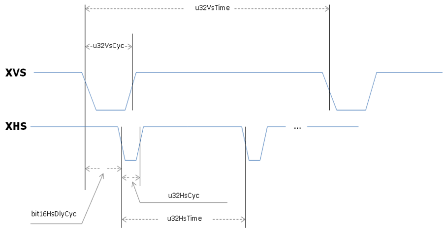
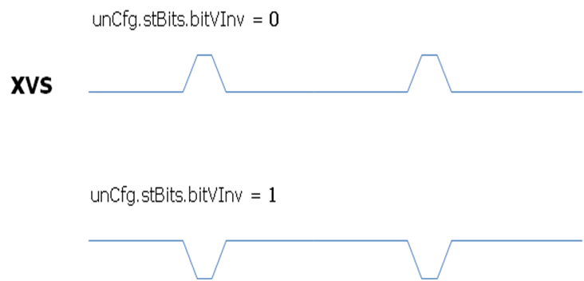

# 前言<a name="ZH-CN_TOPIC_0000002506567571"></a>

**概述<a name="section102mcpsimp"></a>**

本文为使用ISP开发的程序员而写，目的是为您在开发过程中遇到的问题提供解决办法和帮助。

> **说明：** 
>本文以Hi3403V100描述为例，未有特殊说明，SS927V100与Hi3403V100内容一致。

**产品版本<a name="section105mcpsimp"></a>**

与本文档相对应的产品版本如下。

<a name="table108mcpsimp"></a>
<table><thead align="left"><tr id="row113mcpsimp"><th class="cellrowborder" valign="top" width="32%" id="mcps1.1.3.1.1"><p id="p115mcpsimp"><a name="p115mcpsimp"></a><a name="p115mcpsimp"></a>产品名称</p>
</th>
<th class="cellrowborder" valign="top" width="68%" id="mcps1.1.3.1.2"><p id="p117mcpsimp"><a name="p117mcpsimp"></a><a name="p117mcpsimp"></a>产品版本</p>
</th>
</tr>
</thead>
<tbody><tr id="row119mcpsimp"><td class="cellrowborder" valign="top" width="32%" headers="mcps1.1.3.1.1 "><p id="p121mcpsimp"><a name="p121mcpsimp"></a><a name="p121mcpsimp"></a>Hi3403V100</p>
</td>
<td class="cellrowborder" valign="top" width="68%" headers="mcps1.1.3.1.2 "><p id="p123mcpsimp"><a name="p123mcpsimp"></a><a name="p123mcpsimp"></a>V100</p>
</td>
</tr>

</tbody>
</table>

**读者对象<a name="section124mcpsimp"></a>**

本文档（本指南）主要适用于以下工程师：

-   技术支持工程师
-   软件开发工程师

**符号约定<a name="section130mcpsimp"></a>**

在本文中可能出现下列标志，它们所代表的含义如下。

<a name="table133mcpsimp"></a>
<table><thead align="left"><tr id="row138mcpsimp"><th class="cellrowborder" valign="top" width="20%" id="mcps1.1.3.1.1"><p id="p140mcpsimp"><a name="p140mcpsimp"></a><a name="p140mcpsimp"></a>符号</p>
</th>
<th class="cellrowborder" valign="top" width="80%" id="mcps1.1.3.1.2"><p id="p142mcpsimp"><a name="p142mcpsimp"></a><a name="p142mcpsimp"></a>说明</p>
</th>
</tr>
</thead>
<tbody><tr id="row144mcpsimp"><td class="cellrowborder" valign="top" width="20%" headers="mcps1.1.3.1.1 "><p class="msonormal" id="p146mcpsimp"><a name="p146mcpsimp"></a><a name="p146mcpsimp"></a><a name="image102"></a><a name="image102"></a><span></span></p>
</td>
<td class="cellrowborder" valign="top" width="80%" headers="mcps1.1.3.1.2 "><p id="p148mcpsimp"><a name="p148mcpsimp"></a><a name="p148mcpsimp"></a>表示如不避免则将会导致死亡或严重伤害的具有高等级风险的危害。</p>
</td>
</tr>


</tbody>
</table>

【注意事项】

图像宽度应小于sensor输出的图像宽度；图像高度应小于sensor输出的图像高度。

【相关数据类型及接口】

无

### ot\_color\_gamut<a name="ZH-CN_TOPIC_0000002504084785"></a>

【说明】

定义通道色域属性。

【定义】

```
typedef enum  {
    OT_COLOR_GAMUT_BT601 = 0,
    OT_COLOR_GAMUT_BT709,
    OT_COLOR_GAMUT_BT2020,
    OT_COLOR_GAMUT_USER,
    OT_COLOR_GAMUT_BUTT
} ot_color_gamut;
```

【成员】

<a name="table4391mcpsimp"></a>
<table><thead align="left"><tr id="row4396mcpsimp"><th class="cellrowborder" valign="top" width="56.99999999999999%" id="mcps1.1.3.1.1"><p id="p4398mcpsimp"><a name="p4398mcpsimp"></a><a name="p4398mcpsimp"></a>成员名称</p>
</th>
<th class="cellrowborder" valign="top" width="43%" id="mcps1.1.3.1.2"><p id="p4400mcpsimp"><a name="p4400mcpsimp"></a><a name="p4400mcpsimp"></a>描述</p>
</th>
</tr>
</thead>
<tbody><tr id="row4402mcpsimp"><td class="cellrowborder" valign="top" width="56.99999999999999%" headers="mcps1.1.3.1.1 "><p id="p4404mcpsimp"><a name="p4404mcpsimp"></a><a name="p4404mcpsimp"></a>OT_COLOR_GAMUT_BT601</p>
</td>
<td class="cellrowborder" valign="top" width="43%" headers="mcps1.1.3.1.2 "><p id="p4406mcpsimp"><a name="p4406mcpsimp"></a><a name="p4406mcpsimp"></a>色域范围为BT.601。</p>
</td>
</tr>
<tr id="row4407mcpsimp"><td class="cellrowborder" valign="top" width="56.99999999999999%" headers="mcps1.1.3.1.1 "><p id="p4409mcpsimp"><a name="p4409mcpsimp"></a><a name="p4409mcpsimp"></a>OT_COLOR_GAMUT_BT709</p>
</td>
<td class="cellrowborder" valign="top" width="43%" headers="mcps1.1.3.1.2 "><p id="p4411mcpsimp"><a name="p4411mcpsimp"></a><a name="p4411mcpsimp"></a>色域范围为BT.709。</p>
</td>
</tr>
<tr id="row4412mcpsimp"><td class="cellrowborder" valign="top" width="56.99999999999999%" headers="mcps1.1.3.1.1 "><p id="p4414mcpsimp"><a name="p4414mcpsimp"></a><a name="p4414mcpsimp"></a>OT_COLOR_GAMUT_BT2020</p>
</td>
<td class="cellrowborder" valign="top" width="43%" headers="mcps1.1.3.1.2 "><p id="p4416mcpsimp"><a name="p4416mcpsimp"></a><a name="p4416mcpsimp"></a>色域范围为BT.2020。</p>
</td>
</tr>
<tr id="row4417mcpsimp"><td class="cellrowborder" valign="top" width="56.99999999999999%" headers="mcps1.1.3.1.1 "><p id="p4419mcpsimp"><a name="p4419mcpsimp"></a><a name="p4419mcpsimp"></a>OT_COLOR_GAMUT_USER</p>
</td>
<td class="cellrowborder" valign="top" width="43%" headers="mcps1.1.3.1.2 "><p id="p4421mcpsimp"><a name="p4421mcpsimp"></a><a name="p4421mcpsimp"></a>用户自定义色域范围。</p>
</td>
</tr>
</tbody>
</table>

【注意事项】

无。

【相关数据类型及接口】

[ot\_isp\_pub\_attr](#ot_isp_pub_attr)

### ot\_isp\_pub\_attr<a name="ZH-CN_TOPIC_0000002471085026"></a>

【说明】

定义ISP公共属性。

【定义】

```
typedef struct {
    ot_rect              wnd_rect;
    ot_size              sns_size;
    ot_float             frame_rate;
    ot_isp_bayer_format  bayer_format;
    ot_wdr_mode         wdr_mode;
    td_u8                sns_mode;
    td_bool              sensor_flip_en;
    td_bool              sensor_mirror_en;
    ot_mipi_crop_attr      mipi_crop_attr;
} ot_isp_pub_attr;
```

【成员】

<a name="table4447mcpsimp"></a>
<table><thead align="left"><tr id="row4452mcpsimp"><th class="cellrowborder" valign="top" width="25%" id="mcps1.1.3.1.1"><p id="p4454mcpsimp"><a name="p4454mcpsimp"></a><a name="p4454mcpsimp"></a>成员名称</p>
</th>
<th class="cellrowborder" valign="top" width="75%" id="mcps1.1.3.1.2"><p id="p4456mcpsimp"><a name="p4456mcpsimp"></a><a name="p4456mcpsimp"></a>描述</p>
</th>
</tr>
</thead>
<tbody><tr id="row4458mcpsimp"><td class="cellrowborder" valign="top" width="25%" headers="mcps1.1.3.1.1 "><p id="p4460mcpsimp"><a name="p4460mcpsimp"></a><a name="p4460mcpsimp"></a>wnd_rect</p>
</td>
<td class="cellrowborder" valign="top" width="75%" headers="mcps1.1.3.1.2 "><p id="p4462mcpsimp"><a name="p4462mcpsimp"></a><a name="p4462mcpsimp"></a>裁剪窗口起始位置和图像宽高。wnd_rect里的水平方向起始位置值x和垂直方向起始位置值y需要2对齐。</p>
</td>
</tr>
<tr id="row4463mcpsimp"><td class="cellrowborder" valign="top" width="25%" headers="mcps1.1.3.1.1 "><p id="p4465mcpsimp"><a name="p4465mcpsimp"></a><a name="p4465mcpsimp"></a>sns_size</p>
</td>
<td class="cellrowborder" valign="top" width="75%" headers="mcps1.1.3.1.2 "><p id="p4467mcpsimp"><a name="p4467mcpsimp"></a><a name="p4467mcpsimp"></a>Sensor输出的图像宽高。</p>
</td>
</tr>
<tr id="row4468mcpsimp"><td class="cellrowborder" valign="top" width="25%" headers="mcps1.1.3.1.1 "><p id="p4470mcpsimp"><a name="p4470mcpsimp"></a><a name="p4470mcpsimp"></a>frame_rate</p>
</td>
<td class="cellrowborder" valign="top" width="75%" headers="mcps1.1.3.1.2 "><p id="p4472mcpsimp"><a name="p4472mcpsimp"></a><a name="p4472mcpsimp"></a>输入图像帧率，取值范围：(0.00, 65535.00]</p>
</td>
</tr>
<tr id="row4473mcpsimp"><td class="cellrowborder" valign="top" width="25%" headers="mcps1.1.3.1.1 "><p id="p4475mcpsimp"><a name="p4475mcpsimp"></a><a name="p4475mcpsimp"></a>bayer_format</p>
</td>
<td class="cellrowborder" valign="top" width="75%" headers="mcps1.1.3.1.2 "><p id="p4477mcpsimp"><a name="p4477mcpsimp"></a><a name="p4477mcpsimp"></a>Bayer数据格式。</p>
</td>
</tr>
<tr id="row4478mcpsimp"><td class="cellrowborder" valign="top" width="25%" headers="mcps1.1.3.1.1 "><p id="p4480mcpsimp"><a name="p4480mcpsimp"></a><a name="p4480mcpsimp"></a>wdr_mode</p>
</td>
<td class="cellrowborder" valign="top" width="75%" headers="mcps1.1.3.1.2 "><p id="p4482mcpsimp"><a name="p4482mcpsimp"></a><a name="p4482mcpsimp"></a>WDR模式选择。</p>
</td>
</tr>
<tr id="row4483mcpsimp"><td class="cellrowborder" valign="top" width="25%" headers="mcps1.1.3.1.1 "><p id="p4485mcpsimp"><a name="p4485mcpsimp"></a><a name="p4485mcpsimp"></a>sns_mode</p>
</td>
<td class="cellrowborder" valign="top" width="75%" headers="mcps1.1.3.1.2 "><p id="p4487mcpsimp"><a name="p4487mcpsimp"></a><a name="p4487mcpsimp"></a>用于进行Sensor初始化序列的选择，在分辨率和帧率相同时，配置不同的sns_mode对应不同的初始化序列；其他情况，sns_mode默认配置为0，可通过sns_size和frame_rate进行初始化序列的选择。</p>
</td>
</tr>
<tr id="row4488mcpsimp"><td class="cellrowborder" valign="top" width="25%" headers="mcps1.1.3.1.1 "><p id="p4490mcpsimp"><a name="p4490mcpsimp"></a><a name="p4490mcpsimp"></a>sensor_flip_en</p>
</td>
<td class="cellrowborder" valign="top" width="75%" headers="mcps1.1.3.1.2 "><p id="p4492mcpsimp"><a name="p4492mcpsimp"></a><a name="p4492mcpsimp"></a>用于指导DynamicBlc模块修改ob区统计范围。Sensor内部翻转开启且OB区被转移到下方，将该参数设置为1。Sensor内部翻转关闭，将该参数设置为0。</p>
</td>
</tr>
<tr id="row4493mcpsimp"><td class="cellrowborder" valign="top" width="25%" headers="mcps1.1.3.1.1 "><p id="p4495mcpsimp"><a name="p4495mcpsimp"></a><a name="p4495mcpsimp"></a>sensor_mirror_en</p>
</td>
<td class="cellrowborder" valign="top" width="75%" headers="mcps1.1.3.1.2 "><p id="p4497mcpsimp"><a name="p4497mcpsimp"></a><a name="p4497mcpsimp"></a>用于指导DynamicBlc模块修改ob区统计范围。Sensor内部镜像映射开启且OB区从左方被映射到右方，将该参数设置为1。Sensor内部镜像映射关闭，将该参数设置为0。</p>
</td>
</tr>
<tr id="row4498mcpsimp"><td class="cellrowborder" valign="top" width="25%" headers="mcps1.1.3.1.1 "><p id="p4500mcpsimp"><a name="p4500mcpsimp"></a><a name="p4500mcpsimp"></a>mipi_crop_attr</p>
</td>
<td class="cellrowborder" valign="top" width="75%" headers="mcps1.1.3.1.2 "><p id="p4502mcpsimp"><a name="p4502mcpsimp"></a><a name="p4502mcpsimp"></a>用于指导DynamicBlc模块修改ob区统计范围。该参数配置需要与mipi裁剪的参数一致。</p>
</td>
</tr>
</tbody>
</table>

【注意事项】

-   若sensor\_flip\_en为0时，mipi\_crop\_attr.y应设为0.
-   若sensor\_flip\_en为1时，mipi\_crop\_attr.y加mipi\_crop\_attr.height应等于sensor输出高度。

【相关数据类型及接口】

无

### ot\_op\_mode<a name="ZH-CN_TOPIC_0000002471084900"></a>

【说明】

定义模块运行状态。

【定义】

```
typedef enum  {
    OT_OP_MODE_AUTO   = 0,
    OT_OP_MODE_MANUAL = 1,
    OT_OP_MODE_BUTT
} ot_op_mode;
```

【成员】

<a name="table4519mcpsimp"></a>
<table><thead align="left"><tr id="row4524mcpsimp"><th class="cellrowborder" valign="top" width="56.00000000000001%" id="mcps1.1.3.1.1"><p id="p4526mcpsimp"><a name="p4526mcpsimp"></a><a name="p4526mcpsimp"></a>成员名称</p>
</th>
<th class="cellrowborder" valign="top" width="44%" id="mcps1.1.3.1.2"><p id="p4528mcpsimp"><a name="p4528mcpsimp"></a><a name="p4528mcpsimp"></a>描述</p>
</th>
</tr>
</thead>
<tbody><tr id="row4530mcpsimp"><td class="cellrowborder" valign="top" width="56.00000000000001%" headers="mcps1.1.3.1.1 "><p id="p4532mcpsimp"><a name="p4532mcpsimp"></a><a name="p4532mcpsimp"></a>OT_OP_MODE_AUTO</p>
</td>
<td class="cellrowborder" valign="top" width="44%" headers="mcps1.1.3.1.2 "><p id="p4534mcpsimp"><a name="p4534mcpsimp"></a><a name="p4534mcpsimp"></a>运行在自动模式下。</p>
</td>
</tr>
<tr id="row4535mcpsimp"><td class="cellrowborder" valign="top" width="56.00000000000001%" headers="mcps1.1.3.1.1 "><p id="p4537mcpsimp"><a name="p4537mcpsimp"></a><a name="p4537mcpsimp"></a>OT_OP_MODE_MANUAL</p>
</td>
<td class="cellrowborder" valign="top" width="44%" headers="mcps1.1.3.1.2 "><p id="p4539mcpsimp"><a name="p4539mcpsimp"></a><a name="p4539mcpsimp"></a>运行在手动模式下。</p>
</td>
</tr>
</tbody>
</table>

【注意事项】

无

【相关数据类型及接口】

-   ot\_isp\_fswdr\_mdt\_attr
-   ot\_isp\_drc\_attr
-   ot\_isp\_ldci\_attr
-   ot\_isp\_crb\_attr
-   ot\_isp\_dp\_dynamic\_attr
-   ot\_isp\_nr\_attr
-   ot\_isp\_sharpen\_attr
-   ot\_isp\_anti\_false\_color\_attr
-   ot\_isp\_demosaic\_attr
-   ot\_isp\_fpn\_attr
-   ot\_isp\_dehaze\_attr
-   ot\_isp\_local\_cac\_attr
-   ot\_isp\_acac\_attr
-   ot\_isp\_bayershp\_attr
-   ot\_isp\_iris\_attr
-   ot\_isp\_me\_attr
-   ot\_isp\_exposure\_attr
-   ot\_isp\_wdr\_exposure\_attr
-   ot\_isp\_hdr\_exposure\_attr
-   ot\_isp\_smart\_exposure\_attr
-   ot\_isp\_awb\_ct\_limit\_attr
-   ot\_isp\_awb\_in\_out\_attr
-   ot\_isp\_awb\_lum\_histgram\_attr
-   ot\_isp\_wb\_attr
-   ot\_isp\_color\_matrix\_attr
-   ot\_isp\_saturation\_attr

### ot\_isp\_fmw\_state<a name="ZH-CN_TOPIC_0000002471084930"></a>

【说明】

定义ISPfirmware状态。

【定义】

```
typedef enum {
    OT_ISP_FMW_STATE_RUN = 0,
    OT_ISP_FMW_STATE_FREEZE,
    OT_ISP_FMW_STATE_BUTT
} ot_isp_fmw_state;
```

【成员】

<a name="table4607mcpsimp"></a>
<table><thead align="left"><tr id="row4612mcpsimp"><th class="cellrowborder" valign="top" width="56.00000000000001%" id="mcps1.1.3.1.1"><p id="p4614mcpsimp"><a name="p4614mcpsimp"></a><a name="p4614mcpsimp"></a>成员名称</p>
</th>
<th class="cellrowborder" valign="top" width="44%" id="mcps1.1.3.1.2"><p id="p4616mcpsimp"><a name="p4616mcpsimp"></a><a name="p4616mcpsimp"></a>描述</p>
</th>
</tr>
</thead>
<tbody><tr id="row4617mcpsimp"><td class="cellrowborder" valign="top" width="56.00000000000001%" headers="mcps1.1.3.1.1 "><p id="p4619mcpsimp"><a name="p4619mcpsimp"></a><a name="p4619mcpsimp"></a>OT_ISP_FMW_STATE_RUN</p>
</td>
<td class="cellrowborder" valign="top" width="44%" headers="mcps1.1.3.1.2 "><p id="p4621mcpsimp"><a name="p4621mcpsimp"></a><a name="p4621mcpsimp"></a>Firmware正常运行状态。</p>
</td>
</tr>
<tr id="row4622mcpsimp"><td class="cellrowborder" valign="top" width="56.00000000000001%" headers="mcps1.1.3.1.1 "><p id="p4624mcpsimp"><a name="p4624mcpsimp"></a><a name="p4624mcpsimp"></a>OT_ISP_FMW_STATE_FREEZE</p>
</td>
<td class="cellrowborder" valign="top" width="44%" headers="mcps1.1.3.1.2 "><p id="p4626mcpsimp"><a name="p4626mcpsimp"></a><a name="p4626mcpsimp"></a>Firmware冻结状态。</p>
</td>
</tr>
</tbody>
</table>

【注意事项】

无

【相关数据类型及接口】

无

### ot\_isp\_slave\_sns\_sync<a name="ZH-CN_TOPIC_0000002471085028"></a>

【说明】

定义从模式sensor同步信号配置。

【定义】

```
typedef struct {
    union {
        struct {
            td_u32  bit16_reserved      :  16;
            td_u32  bit_h_inv           :  1;
            td_u32  bit_v_inv           :  1;
            td_u32  bit12_reserved      :  12;
            td_u32  bit_h_enable        :  1;
            td_u32  bit_v_enable        :  1;
        } bits;
        td_u32 bytes;
    } cfg;
    td_u32  vs_time;
    td_u32  hs_time;
    td_u32  vs_cyc;
    td_u32  hs_cyc;
    td_u32  hs_dly_cyc;
    td_u32  slave_mode_time;
} ot_isp_slave_sns_sync;
```

【成员】

<a name="table4657mcpsimp"></a>
<table><thead align="left"><tr id="row4662mcpsimp"><th class="cellrowborder" valign="top" width="24%" id="mcps1.1.3.1.1"><p id="p4664mcpsimp"><a name="p4664mcpsimp"></a><a name="p4664mcpsimp"></a>成员名称</p>
</th>
<th class="cellrowborder" valign="top" width="76%" id="mcps1.1.3.1.2"><p id="p4666mcpsimp"><a name="p4666mcpsimp"></a><a name="p4666mcpsimp"></a>描述</p>
</th>
</tr>
</thead>
<tbody><tr id="row4668mcpsimp"><td class="cellrowborder" valign="top" width="24%" headers="mcps1.1.3.1.1 "><p id="p4670mcpsimp"><a name="p4670mcpsimp"></a><a name="p4670mcpsimp"></a>bit16_reserved</p>
</td>
<td class="cellrowborder" valign="top" width="76%" headers="mcps1.1.3.1.2 "><p id="p4672mcpsimp"><a name="p4672mcpsimp"></a><a name="p4672mcpsimp"></a>保留字段。</p>
</td>
</tr>
<tr id="row4673mcpsimp"><td class="cellrowborder" valign="top" width="24%" headers="mcps1.1.3.1.1 "><p id="p4675mcpsimp"><a name="p4675mcpsimp"></a><a name="p4675mcpsimp"></a>bit_h_inv</p>
</td>
<td class="cellrowborder" valign="top" width="76%" headers="mcps1.1.3.1.2 "><p id="p4677mcpsimp"><a name="p4677mcpsimp"></a><a name="p4677mcpsimp"></a>XHS极性配置。</p>
<a name="ul4678mcpsimp"></a><a name="ul4678mcpsimp"></a><ul id="ul4678mcpsimp"><li>0表示正极；</li><li>1表示负极。</li></ul>
</td>
</tr>
<tr id="row4681mcpsimp"><td class="cellrowborder" valign="top" width="24%" headers="mcps1.1.3.1.1 "><p id="p4683mcpsimp"><a name="p4683mcpsimp"></a><a name="p4683mcpsimp"></a>bit_v_inv</p>
</td>
<td class="cellrowborder" valign="top" width="76%" headers="mcps1.1.3.1.2 "><p id="p4685mcpsimp"><a name="p4685mcpsimp"></a><a name="p4685mcpsimp"></a>XVS极性配置。</p>
</td>
</tr>
<tr id="row4686mcpsimp"><td class="cellrowborder" valign="top" width="24%" headers="mcps1.1.3.1.1 "><p id="p4688mcpsimp"><a name="p4688mcpsimp"></a><a name="p4688mcpsimp"></a>bit12_reserved</p>
</td>
<td class="cellrowborder" valign="top" width="76%" headers="mcps1.1.3.1.2 "><p id="p4690mcpsimp"><a name="p4690mcpsimp"></a><a name="p4690mcpsimp"></a>保留字段。</p>
</td>
</tr>
<tr id="row4691mcpsimp"><td class="cellrowborder" valign="top" width="24%" headers="mcps1.1.3.1.1 "><p id="p4693mcpsimp"><a name="p4693mcpsimp"></a><a name="p4693mcpsimp"></a>bit_h_enable</p>
</td>
<td class="cellrowborder" valign="top" width="76%" headers="mcps1.1.3.1.2 "><p id="p4695mcpsimp"><a name="p4695mcpsimp"></a><a name="p4695mcpsimp"></a>XHS输出使能。</p>
</td>
</tr>
<tr id="row4696mcpsimp"><td class="cellrowborder" valign="top" width="24%" headers="mcps1.1.3.1.1 "><p id="p4698mcpsimp"><a name="p4698mcpsimp"></a><a name="p4698mcpsimp"></a>bit_v_enable</p>
</td>
<td class="cellrowborder" valign="top" width="76%" headers="mcps1.1.3.1.2 "><p id="p4700mcpsimp"><a name="p4700mcpsimp"></a><a name="p4700mcpsimp"></a>XVS输出使能。</p>
</td>
</tr>
<tr id="row4701mcpsimp"><td class="cellrowborder" valign="top" width="24%" headers="mcps1.1.3.1.1 "><p id="p4703mcpsimp"><a name="p4703mcpsimp"></a><a name="p4703mcpsimp"></a>vs_time</p>
</td>
<td class="cellrowborder" valign="top" width="76%" headers="mcps1.1.3.1.2 "><p id="p4705mcpsimp"><a name="p4705mcpsimp"></a><a name="p4705mcpsimp"></a>XVS信号周期，单位：sensor输入时钟周期。</p>
</td>
</tr>
<tr id="row4706mcpsimp"><td class="cellrowborder" valign="top" width="24%" headers="mcps1.1.3.1.1 "><p id="p4708mcpsimp"><a name="p4708mcpsimp"></a><a name="p4708mcpsimp"></a>hs_time</p>
</td>
<td class="cellrowborder" valign="top" width="76%" headers="mcps1.1.3.1.2 "><p id="p4710mcpsimp"><a name="p4710mcpsimp"></a><a name="p4710mcpsimp"></a>XHS信号周期，单位：sensor输入时钟周期。</p>
</td>
</tr>
<tr id="row4711mcpsimp"><td class="cellrowborder" valign="top" width="24%" headers="mcps1.1.3.1.1 "><p id="p4713mcpsimp"><a name="p4713mcpsimp"></a><a name="p4713mcpsimp"></a>vs_cyc</p>
</td>
<td class="cellrowborder" valign="top" width="76%" headers="mcps1.1.3.1.2 "><p id="p4715mcpsimp"><a name="p4715mcpsimp"></a><a name="p4715mcpsimp"></a>XVS有效电平宽度，单位：sensor输入时钟周期。</p>
</td>
</tr>
<tr id="row4716mcpsimp"><td class="cellrowborder" valign="top" width="24%" headers="mcps1.1.3.1.1 "><p id="p4718mcpsimp"><a name="p4718mcpsimp"></a><a name="p4718mcpsimp"></a>hs_cyc</p>
</td>
<td class="cellrowborder" valign="top" width="76%" headers="mcps1.1.3.1.2 "><p id="p4720mcpsimp"><a name="p4720mcpsimp"></a><a name="p4720mcpsimp"></a>XHS有效电平宽度，单位：sensor输入时钟周期。</p>
</td>
</tr>
<tr id="row4721mcpsimp"><td class="cellrowborder" valign="top" width="24%" headers="mcps1.1.3.1.1 "><p id="p4723mcpsimp"><a name="p4723mcpsimp"></a><a name="p4723mcpsimp"></a>hs_dly_cyc</p>
</td>
<td class="cellrowborder" valign="top" width="76%" headers="mcps1.1.3.1.2 "><p id="p4725mcpsimp"><a name="p4725mcpsimp"></a><a name="p4725mcpsimp"></a>XHS脉冲输出相对XVS脉冲的延迟周期配置，单位：sensor输入时钟周期。</p>
</td>
</tr>
<tr id="row4726mcpsimp"><td class="cellrowborder" valign="top" width="24%" headers="mcps1.1.3.1.1 "><p id="p4728mcpsimp"><a name="p4728mcpsimp"></a><a name="p4728mcpsimp"></a>slave_mode_time</p>
</td>
<td class="cellrowborder" valign="top" width="76%" headers="mcps1.1.3.1.2 "><p id="p4730mcpsimp"><a name="p4730mcpsimp"></a><a name="p4730mcpsimp"></a>Sensor从模式时序配置选择寄存器：</p>
<p id="p4731mcpsimp"><a name="p4731mcpsimp"></a><a name="p4731mcpsimp"></a>0：选择SENSOR0 timing 配置；</p>
<p id="p4732mcpsimp"><a name="p4732mcpsimp"></a><a name="p4732mcpsimp"></a>1：选择SENSOR1 timing 配置；</p>
<p id="p4733mcpsimp"><a name="p4733mcpsimp"></a><a name="p4733mcpsimp"></a>2：选择SENSOR2 timing 配置；</p>
<p id="p4734mcpsimp"><a name="p4734mcpsimp"></a><a name="p4734mcpsimp"></a>3：选择SENSOR3 timing 配置。</p>
</td>
</tr>
</tbody>
</table>

【注意事项】

如图1\~图3所示，说明了同步信号发生模块配置参数的含义。

**图 1**  同步信号配置时序图<a name="_Ref440016125"></a>  


**图 2**  同步信号极性翻转<a name="fig4740mcpsimp"></a>  


**图 3**  同步信号使能<a name="_Ref440016130"></a>  


【相关数据类型及接口】

无

### ot\_isp\_wdr\_mode<a name="ZH-CN_TOPIC_0000002504085073"></a>

【说明】

定义ISP宽动态模式。

【定义】

```
typedef struct {
    ot_wdr_mode  wdr_mode;
} ot_isp_wdr_mode;
```

【成员】

<a name="table4755mcpsimp"></a>
<table><thead align="left"><tr id="row4760mcpsimp"><th class="cellrowborder" valign="top" width="45%" id="mcps1.1.3.1.1"><p id="p4762mcpsimp"><a name="p4762mcpsimp"></a><a name="p4762mcpsimp"></a>成员名称</p>
</th>
<th class="cellrowborder" valign="top" width="55.00000000000001%" id="mcps1.1.3.1.2"><p id="p4764mcpsimp"><a name="p4764mcpsimp"></a><a name="p4764mcpsimp"></a>描述</p>
</th>
</tr>
</thead>
<tbody><tr id="row4765mcpsimp"><td class="cellrowborder" valign="top" width="45%" headers="mcps1.1.3.1.1 "><p id="p4767mcpsimp"><a name="p4767mcpsimp"></a><a name="p4767mcpsimp"></a>wdr_mode</p>
</td>
<td class="cellrowborder" valign="top" width="55.00000000000001%" headers="mcps1.1.3.1.2 "><p id="p4769mcpsimp"><a name="p4769mcpsimp"></a><a name="p4769mcpsimp"></a>宽动态模式。</p>
</td>
</tr>
</tbody>
</table>

【注意事项】

无

【相关数据类型及接口】

无

### ot\_wdr\_mode<a name="ZH-CN_TOPIC_0000002504084745"></a>

【说明】

定义宽动态模式。

【定义】

```
typedef enum {
    OT_WDR_MODE_NONE = 0,
    OT_WDR_MODE_BUILT_IN,
    OT_WDR_MODE_QUDRA,
    OT_WDR_MODE_2To1_LINE,
    OT_WDR_MODE_2To1_FRAME,
    OT_WDR_MODE_3To1_LINE,
    OT_WDR_MODE_3To1_FRAME,
    OT_WDR_MODE_4To1_LINE,
    OT_WDR_MODE_4To1_FRAME,
    OT_WDR_MODE_BUTT,
} ot_wdr_mode;
```

【成员】

<a name="table4794mcpsimp"></a>
<table><thead align="left"><tr id="row4799mcpsimp"><th class="cellrowborder" valign="top" width="56.00000000000001%" id="mcps1.1.3.1.1"><p id="p4801mcpsimp"><a name="p4801mcpsimp"></a><a name="p4801mcpsimp"></a>成员名称</p>
</th>
<th class="cellrowborder" valign="top" width="44%" id="mcps1.1.3.1.2"><p id="p4803mcpsimp"><a name="p4803mcpsimp"></a><a name="p4803mcpsimp"></a>描述</p>
</th>
</tr>
</thead>
<tbody><tr id="row4805mcpsimp"><td class="cellrowborder" valign="top" width="56.00000000000001%" headers="mcps1.1.3.1.1 "><p id="p4807mcpsimp"><a name="p4807mcpsimp"></a><a name="p4807mcpsimp"></a>OT_WDR_MODE_NONE</p>
</td>
<td class="cellrowborder" valign="top" width="44%" headers="mcps1.1.3.1.2 "><p id="p4809mcpsimp"><a name="p4809mcpsimp"></a><a name="p4809mcpsimp"></a>线性模式。</p>
</td>
</tr>
<tr id="row4810mcpsimp"><td class="cellrowborder" valign="top" width="56.00000000000001%" headers="mcps1.1.3.1.1 "><p id="p4812mcpsimp"><a name="p4812mcpsimp"></a><a name="p4812mcpsimp"></a>OT_WDR_MODE_BUILT_IN</p>
</td>
<td class="cellrowborder" valign="top" width="44%" headers="mcps1.1.3.1.2 "><p id="p4814mcpsimp"><a name="p4814mcpsimp"></a><a name="p4814mcpsimp"></a>Sensor合成WDR模式。</p>
</td>
</tr>
<tr id="row4815mcpsimp"><td class="cellrowborder" valign="top" width="56.00000000000001%" headers="mcps1.1.3.1.1 "><p id="p4817mcpsimp"><a name="p4817mcpsimp"></a><a name="p4817mcpsimp"></a>OT_WDR_MODE_QUDRA</p>
</td>
<td class="cellrowborder" valign="top" width="44%" headers="mcps1.1.3.1.2 "><p id="p4819mcpsimp"><a name="p4819mcpsimp"></a><a name="p4819mcpsimp"></a>Qudra模式</p>
</td>
</tr>
<tr id="row4820mcpsimp"><td class="cellrowborder" valign="top" width="56.00000000000001%" headers="mcps1.1.3.1.1 "><p id="p4822mcpsimp"><a name="p4822mcpsimp"></a><a name="p4822mcpsimp"></a>OT_WDR_MODE_2To1_LINE</p>
</td>
<td class="cellrowborder" valign="top" width="44%" headers="mcps1.1.3.1.2 "><p id="p4824mcpsimp"><a name="p4824mcpsimp"></a><a name="p4824mcpsimp"></a>2帧合成行WDR模式。</p>
</td>
</tr>
<tr id="row4825mcpsimp"><td class="cellrowborder" valign="top" width="56.00000000000001%" headers="mcps1.1.3.1.1 "><p id="p4827mcpsimp"><a name="p4827mcpsimp"></a><a name="p4827mcpsimp"></a>OT_WDR_MODE_2To1_FRAME</p>
</td>
<td class="cellrowborder" valign="top" width="44%" headers="mcps1.1.3.1.2 "><p id="p4829mcpsimp"><a name="p4829mcpsimp"></a><a name="p4829mcpsimp"></a>2帧合成帧WDR模式。</p>
</td>
</tr>
<tr id="row4830mcpsimp"><td class="cellrowborder" valign="top" width="56.00000000000001%" headers="mcps1.1.3.1.1 "><p id="p4832mcpsimp"><a name="p4832mcpsimp"></a><a name="p4832mcpsimp"></a>OT_WDR_MODE_3To1_LINE</p>
</td>
<td class="cellrowborder" valign="top" width="44%" headers="mcps1.1.3.1.2 "><p id="p4834mcpsimp"><a name="p4834mcpsimp"></a><a name="p4834mcpsimp"></a>3帧合成行WDR模式。</p>
</td>
</tr>
<tr id="row4835mcpsimp"><td class="cellrowborder" valign="top" width="56.00000000000001%" headers="mcps1.1.3.1.1 "><p id="p4837mcpsimp"><a name="p4837mcpsimp"></a><a name="p4837mcpsimp"></a>OT_WDR_MODE_3To1_FRAME</p>
</td>
<td class="cellrowborder" valign="top" width="44%" headers="mcps1.1.3.1.2 "><p id="p4839mcpsimp"><a name="p4839mcpsimp"></a><a name="p4839mcpsimp"></a>3帧合成帧WDR模式。</p>
</td>
</tr>
<tr id="row4840mcpsimp"><td class="cellrowborder" valign="top" width="56.00000000000001%" headers="mcps1.1.3.1.1 "><p id="p4842mcpsimp"><a name="p4842mcpsimp"></a><a name="p4842mcpsimp"></a>OT_WDR_MODE_4To1_LINE</p>
</td>
<td class="cellrowborder" valign="top" width="44%" headers="mcps1.1.3.1.2 "><p id="p4844mcpsimp"><a name="p4844mcpsimp"></a><a name="p4844mcpsimp"></a>4帧合成行WDR模式。</p>
</td>
</tr>
<tr id="row4845mcpsimp"><td class="cellrowborder" valign="top" width="56.00000000000001%" headers="mcps1.1.3.1.1 "><p id="p4847mcpsimp"><a name="p4847mcpsimp"></a><a name="p4847mcpsimp"></a>OT_WDR_MODE_4To1_FRAME</p>
</td>
<td class="cellrowborder" valign="top" width="44%" headers="mcps1.1.3.1.2 "><p id="p4849mcpsimp"><a name="p4849mcpsimp"></a><a name="p4849mcpsimp"></a>4帧合成帧WDR模式。</p>
</td>
</tr>
</tbody>
</table>

【注意事项】

OT\_WDR\_MODE\_BUILT\_IN需要sensor支持。

【相关数据类型及接口】

无

### ot\_isp\_module\_ctrl<a name="ZH-CN_TOPIC_0000002504085031"></a>

【说明】

定义ISP功能模块的控制。

【定义】

```
typedef union {
    td_u64  key;
    struct {
        td_u64  bit_bypass_isp_d_gain        : 1;   /* RW;[0] */
        td_u64  bit_bypass_anti_false_color  : 1;   /* RW;[1] */
        td_u64  bit_bypass_crosstalk_removal : 1;   /* RW;[2] */
        td_u64  bit_bypass_dpc            : 1;   /* RW;[3] */
        td_u64  bit_bypass_nr             : 1;   /* RW;[4] */
       td_u64  bit_bypass_dehaze         : 1;   /* RW;[5] */
        td_u64  bit_bypass_wb_gain        : 1;   /* RW;[6] */
        td_u64  bit_bypass_mesh_shading   : 1;   /* RW;[7] */
        td_u64  bit_bypass_drc            : 1;   /* RW;[8] */
        td_u64  bit_bypass_demosaic       : 1;   /* RW;[9] */
        td_u64  bit_bypass_color_matrix   : 1;   /* RW;[10] */
        td_u64  bit_bypass_gamma          : 1;   /* RW;[11] */
        td_u64  bit_bypass_fswdr          : 1;   /* RW;[12] */
        td_u64  bit_bypass_ca             : 1;   /* RW;[13] */
        td_u64  bit_bypass_csc            : 1;   /* RW;[14] */
        td_u64  bit_bypass_radial_crop    : 1;   /* RW;[15] */
        td_u64  bit_bypass_sharpen        : 1;   /* RW;[16] */
        td_u64  bit_bypass_local_cac      : 1;   /* RW;[17] */
        td_u64  bit_bypass_acac           : 1;   /* RW;[18]; */
        td_u64  bit2_chn_select           : 2;   /* RW;[19:20] */
        td_u64  bit_bypass_ldci           : 1;   /* RW;[21] */
        td_u64  bit_bypass_pregamma       : 1;   /* RW;[22] */
        td_u64  bit_bypass_ae_stat_fe     : 1;   /* RW;[23] */
        td_u64  bit_bypass_ae_stat_be     : 1;   /* RW;[24] */
        td_u64  bit_bypass_mg_stat        : 1;   /* RW;[25] */
        td_u64  bit_bypass_af_stat_fe     : 1;   /* RW;[26] */
        td_u64  bit_bypass_af_stat_be     : 1;   /* RW;[27] */
        td_u64  bit_bypass_awb_stat       : 1;   /* RW;[28] */
        td_u64  bit_bypass_clut           : 1;   /* RW;[29] */
        td_u64  bit_bypass_rgbir          : 1;   /* RW;[30]  */
        td_u64  bit_bypass_agamma         : 1;   /* RW;[31]  */
        td_u64  bit_bypass_adgamma        : 1;   /* RW;[32]  */
        td_u64  bit_bypass_crb            : 1;   /* RW [33]  */
        td_u64  bit_reserved30            : 30;  /* H; [34:63] */    };
} ot_isp_module_ctrl;
```

【成员】

<a name="table4900mcpsimp"></a>
<table><thead align="left"><tr id="row4905mcpsimp"><th class="cellrowborder" valign="top" width="37%" id="mcps1.1.3.1.1"><p id="p4907mcpsimp"><a name="p4907mcpsimp"></a><a name="p4907mcpsimp"></a>成员名称</p>
</th>
<th class="cellrowborder" valign="top" width="63%" id="mcps1.1.3.1.2"><p id="p4909mcpsimp"><a name="p4909mcpsimp"></a><a name="p4909mcpsimp"></a>描述</p>
</th>
</tr>
</thead>
<tbody><tr id="row4911mcpsimp"><td class="cellrowborder" valign="top" width="37%" headers="mcps1.1.3.1.1 "><p id="p4913mcpsimp"><a name="p4913mcpsimp"></a><a name="p4913mcpsimp"></a>key</p>
</td>
<td class="cellrowborder" valign="top" width="63%" headers="mcps1.1.3.1.2 "><p id="p4915mcpsimp"><a name="p4915mcpsimp"></a><a name="p4915mcpsimp"></a>结构体枚举的整型值。</p>
</td>
</tr>
<tr id="row4916mcpsimp"><td class="cellrowborder" valign="top" width="37%" headers="mcps1.1.3.1.1 "><p id="p4918mcpsimp"><a name="p4918mcpsimp"></a><a name="p4918mcpsimp"></a>bit_bypass_isp_d_gain</p>
</td>
<td class="cellrowborder" valign="top" width="63%" headers="mcps1.1.3.1.2 "><p id="p4920mcpsimp"><a name="p4920mcpsimp"></a><a name="p4920mcpsimp"></a>旁路数字增益。</p>
</td>
</tr>
<tr id="row4921mcpsimp"><td class="cellrowborder" valign="top" width="37%" headers="mcps1.1.3.1.1 "><p id="p4923mcpsimp"><a name="p4923mcpsimp"></a><a name="p4923mcpsimp"></a>bit_bypass_anti_false_color</p>
</td>
<td class="cellrowborder" valign="top" width="63%" headers="mcps1.1.3.1.2 "><p id="p4925mcpsimp"><a name="p4925mcpsimp"></a><a name="p4925mcpsimp"></a>旁路去伪彩功能。</p>
</td>
</tr>
<tr id="row4926mcpsimp"><td class="cellrowborder" valign="top" width="37%" headers="mcps1.1.3.1.1 "><p id="p4928mcpsimp"><a name="p4928mcpsimp"></a><a name="p4928mcpsimp"></a>bit_bypass_crosstalk_removal</p>
</td>
<td class="cellrowborder" valign="top" width="63%" headers="mcps1.1.3.1.2 "><p id="p4930mcpsimp"><a name="p4930mcpsimp"></a><a name="p4930mcpsimp"></a>旁路Crosstalk Removal。</p>
</td>
</tr>
<tr id="row4931mcpsimp"><td class="cellrowborder" valign="top" width="37%" headers="mcps1.1.3.1.1 "><p id="p4933mcpsimp"><a name="p4933mcpsimp"></a><a name="p4933mcpsimp"></a>bit_bypass_dpc</p>
</td>
<td class="cellrowborder" valign="top" width="63%" headers="mcps1.1.3.1.2 "><p id="p4935mcpsimp"><a name="p4935mcpsimp"></a><a name="p4935mcpsimp"></a>旁路坏点校正。</p>
</td>
</tr>
<tr id="row4936mcpsimp"><td class="cellrowborder" valign="top" width="37%" headers="mcps1.1.3.1.1 "><p id="p4938mcpsimp"><a name="p4938mcpsimp"></a><a name="p4938mcpsimp"></a>bit_bypass_nr</p>
</td>
<td class="cellrowborder" valign="top" width="63%" headers="mcps1.1.3.1.2 "><p id="p4940mcpsimp"><a name="p4940mcpsimp"></a><a name="p4940mcpsimp"></a>旁路去噪。</p>
</td>
</tr>
<tr id="row4941mcpsimp"><td class="cellrowborder" valign="top" width="37%" headers="mcps1.1.3.1.1 "><p id="p4943mcpsimp"><a name="p4943mcpsimp"></a><a name="p4943mcpsimp"></a>bit_bypass_dehaze</p>
</td>
<td class="cellrowborder" valign="top" width="63%" headers="mcps1.1.3.1.2 "><p id="p4945mcpsimp"><a name="p4945mcpsimp"></a><a name="p4945mcpsimp"></a>旁路去雾。</p>
</td>
</tr>
<tr id="row4946mcpsimp"><td class="cellrowborder" valign="top" width="37%" headers="mcps1.1.3.1.1 "><p id="p4948mcpsimp"><a name="p4948mcpsimp"></a><a name="p4948mcpsimp"></a>bit_bypass_wb_gain</p>
</td>
<td class="cellrowborder" valign="top" width="63%" headers="mcps1.1.3.1.2 "><p id="p4950mcpsimp"><a name="p4950mcpsimp"></a><a name="p4950mcpsimp"></a>旁路白平衡增益和偏移量。</p>
</td>
</tr>
<tr id="row4951mcpsimp"><td class="cellrowborder" valign="top" width="37%" headers="mcps1.1.3.1.1 "><p id="p4953mcpsimp"><a name="p4953mcpsimp"></a><a name="p4953mcpsimp"></a>bit_bypass_mesh_shading</p>
</td>
<td class="cellrowborder" valign="top" width="63%" headers="mcps1.1.3.1.2 "><p id="p4955mcpsimp"><a name="p4955mcpsimp"></a><a name="p4955mcpsimp"></a>旁路镜头阴影校正。</p>
</td>
</tr>
<tr id="row4956mcpsimp"><td class="cellrowborder" valign="top" width="37%" headers="mcps1.1.3.1.1 "><p id="p4958mcpsimp"><a name="p4958mcpsimp"></a><a name="p4958mcpsimp"></a>bit_bypass_drc</p>
</td>
<td class="cellrowborder" valign="top" width="63%" headers="mcps1.1.3.1.2 "><p id="p4960mcpsimp"><a name="p4960mcpsimp"></a><a name="p4960mcpsimp"></a>旁路DRC。</p>
</td>
</tr>
<tr id="row4961mcpsimp"><td class="cellrowborder" valign="top" width="37%" headers="mcps1.1.3.1.1 "><p id="p4963mcpsimp"><a name="p4963mcpsimp"></a><a name="p4963mcpsimp"></a>bit_bypass_demosaic</p>
</td>
<td class="cellrowborder" valign="top" width="63%" headers="mcps1.1.3.1.2 "><p id="p4965mcpsimp"><a name="p4965mcpsimp"></a><a name="p4965mcpsimp"></a>旁路去马赛克模块。</p>
</td>
</tr>
<tr id="row4966mcpsimp"><td class="cellrowborder" valign="top" width="37%" headers="mcps1.1.3.1.1 "><p id="p4968mcpsimp"><a name="p4968mcpsimp"></a><a name="p4968mcpsimp"></a>bit_bypass_color_matrix</p>
</td>
<td class="cellrowborder" valign="top" width="63%" headers="mcps1.1.3.1.2 "><p id="p4970mcpsimp"><a name="p4970mcpsimp"></a><a name="p4970mcpsimp"></a>旁路颜色矩阵。</p>
</td>
</tr>
<tr id="row4971mcpsimp"><td class="cellrowborder" valign="top" width="37%" headers="mcps1.1.3.1.1 "><p id="p4973mcpsimp"><a name="p4973mcpsimp"></a><a name="p4973mcpsimp"></a>bit_bypass_gamma</p>
</td>
<td class="cellrowborder" valign="top" width="63%" headers="mcps1.1.3.1.2 "><p id="p4975mcpsimp"><a name="p4975mcpsimp"></a><a name="p4975mcpsimp"></a>旁路Gamma表。</p>
</td>
</tr>
<tr id="row4976mcpsimp"><td class="cellrowborder" valign="top" width="37%" headers="mcps1.1.3.1.1 "><p id="p4978mcpsimp"><a name="p4978mcpsimp"></a><a name="p4978mcpsimp"></a>bit_bypass_fswdr</p>
</td>
<td class="cellrowborder" valign="top" width="63%" headers="mcps1.1.3.1.2 "><p id="p4980mcpsimp"><a name="p4980mcpsimp"></a><a name="p4980mcpsimp"></a>旁路多帧合成WDR。</p>
</td>
</tr>
<tr id="row4981mcpsimp"><td class="cellrowborder" valign="top" width="37%" headers="mcps1.1.3.1.1 "><p id="p4983mcpsimp"><a name="p4983mcpsimp"></a><a name="p4983mcpsimp"></a>bit_bypass_ca</p>
</td>
<td class="cellrowborder" valign="top" width="63%" headers="mcps1.1.3.1.2 "><p id="p4985mcpsimp"><a name="p4985mcpsimp"></a><a name="p4985mcpsimp"></a>旁路CA。</p>
</td>
</tr>
<tr id="row4986mcpsimp"><td class="cellrowborder" valign="top" width="37%" headers="mcps1.1.3.1.1 "><p id="p4988mcpsimp"><a name="p4988mcpsimp"></a><a name="p4988mcpsimp"></a>bit_bypass_csc</p>
</td>
<td class="cellrowborder" valign="top" width="63%" headers="mcps1.1.3.1.2 "><p id="p4990mcpsimp"><a name="p4990mcpsimp"></a><a name="p4990mcpsimp"></a>旁路CSC转换。</p>
</td>
</tr>
<tr id="row4991mcpsimp"><td class="cellrowborder" valign="top" width="37%" headers="mcps1.1.3.1.1 "><p id="p4993mcpsimp"><a name="p4993mcpsimp"></a><a name="p4993mcpsimp"></a>bit_bypass_radial_crop</p>
</td>
<td class="cellrowborder" valign="top" width="63%" headers="mcps1.1.3.1.2 "><p id="p4995mcpsimp"><a name="p4995mcpsimp"></a><a name="p4995mcpsimp"></a>旁路RadialCrop</p>
</td>
</tr>
<tr id="row4996mcpsimp"><td class="cellrowborder" valign="top" width="37%" headers="mcps1.1.3.1.1 "><p id="p4998mcpsimp"><a name="p4998mcpsimp"></a><a name="p4998mcpsimp"></a>bit_bypass_sharpen</p>
</td>
<td class="cellrowborder" valign="top" width="63%" headers="mcps1.1.3.1.2 "><p id="p5000mcpsimp"><a name="p5000mcpsimp"></a><a name="p5000mcpsimp"></a>旁路Sharpen。</p>
</td>
</tr>
<tr id="row5001mcpsimp"><td class="cellrowborder" valign="top" width="37%" headers="mcps1.1.3.1.1 "><p id="p5003mcpsimp"><a name="p5003mcpsimp"></a><a name="p5003mcpsimp"></a>bit_bypass_local_cac</p>
</td>
<td class="cellrowborder" valign="top" width="63%" headers="mcps1.1.3.1.2 "><p id="p5005mcpsimp"><a name="p5005mcpsimp"></a><a name="p5005mcpsimp"></a>旁路Local CAC。</p>
</td>
</tr>
<tr id="row5006mcpsimp"><td class="cellrowborder" valign="top" width="37%" headers="mcps1.1.3.1.1 "><p id="p5008mcpsimp"><a name="p5008mcpsimp"></a><a name="p5008mcpsimp"></a>bit_bypass_acac</p>
</td>
<td class="cellrowborder" valign="top" width="63%" headers="mcps1.1.3.1.2 "><p id="p5010mcpsimp"><a name="p5010mcpsimp"></a><a name="p5010mcpsimp"></a>旁路ACAC</p>
</td>
</tr>
<tr id="row5011mcpsimp"><td class="cellrowborder" valign="top" width="37%" headers="mcps1.1.3.1.1 "><p id="p5013mcpsimp"><a name="p5013mcpsimp"></a><a name="p5013mcpsimp"></a>bit2_chn_select</p>
</td>
<td class="cellrowborder" valign="top" width="63%" headers="mcps1.1.3.1.2 "><p id="p5015mcpsimp"><a name="p5015mcpsimp"></a><a name="p5015mcpsimp"></a>WDR模式主路数据来源，一般在旁路多帧合成WDR模块后用于debug。</p>
<p id="p5016mcpsimp"><a name="p5016mcpsimp"></a><a name="p5016mcpsimp"></a>0：主路数据来源于超短帧；</p>
<p id="p5017mcpsimp"><a name="p5017mcpsimp"></a><a name="p5017mcpsimp"></a>1：主路数据来源于短帧；</p>
<p id="p5018mcpsimp"><a name="p5018mcpsimp"></a><a name="p5018mcpsimp"></a>2：主路数据来源于中帧；</p>
<p id="p5019mcpsimp"><a name="p5019mcpsimp"></a><a name="p5019mcpsimp"></a>3：主路数据来源于长帧。</p>
</td>
</tr>
<tr id="row5020mcpsimp"><td class="cellrowborder" valign="top" width="37%" headers="mcps1.1.3.1.1 "><p id="p5022mcpsimp"><a name="p5022mcpsimp"></a><a name="p5022mcpsimp"></a>bit_bypass_ldci</p>
</td>
<td class="cellrowborder" valign="top" width="63%" headers="mcps1.1.3.1.2 "><p id="p5024mcpsimp"><a name="p5024mcpsimp"></a><a name="p5024mcpsimp"></a>旁路Local DCI。</p>
</td>
</tr>
<tr id="row5025mcpsimp"><td class="cellrowborder" valign="top" width="37%" headers="mcps1.1.3.1.1 "><p id="p5027mcpsimp"><a name="p5027mcpsimp"></a><a name="p5027mcpsimp"></a>bit_bypass_pregamma</p>
</td>
<td class="cellrowborder" valign="top" width="63%" headers="mcps1.1.3.1.2 "><p id="p5029mcpsimp"><a name="p5029mcpsimp"></a><a name="p5029mcpsimp"></a>旁路PreGamma。</p>
</td>
</tr>
<tr id="row5030mcpsimp"><td class="cellrowborder" valign="top" width="37%" headers="mcps1.1.3.1.1 "><p id="p5032mcpsimp"><a name="p5032mcpsimp"></a><a name="p5032mcpsimp"></a>bit_bypass_ae_stat_fe</p>
</td>
<td class="cellrowborder" valign="top" width="63%" headers="mcps1.1.3.1.2 "><p id="p5034mcpsimp"><a name="p5034mcpsimp"></a><a name="p5034mcpsimp"></a>旁路位于FE的AE统计信息。</p>
</td>
</tr>
<tr id="row5035mcpsimp"><td class="cellrowborder" valign="top" width="37%" headers="mcps1.1.3.1.1 "><p id="p5037mcpsimp"><a name="p5037mcpsimp"></a><a name="p5037mcpsimp"></a>bit_bypass_ae_stat_be</p>
</td>
<td class="cellrowborder" valign="top" width="63%" headers="mcps1.1.3.1.2 "><p id="p5039mcpsimp"><a name="p5039mcpsimp"></a><a name="p5039mcpsimp"></a>旁路位于BE的AE统计信息。</p>
</td>
</tr>
<tr id="row5040mcpsimp"><td class="cellrowborder" valign="top" width="37%" headers="mcps1.1.3.1.1 "><p id="p5042mcpsimp"><a name="p5042mcpsimp"></a><a name="p5042mcpsimp"></a>bit_bypass_mg_stat</p>
</td>
<td class="cellrowborder" valign="top" width="63%" headers="mcps1.1.3.1.2 "><p id="p5044mcpsimp"><a name="p5044mcpsimp"></a><a name="p5044mcpsimp"></a>旁路MG统计信息。</p>
</td>
</tr>
<tr id="row5045mcpsimp"><td class="cellrowborder" valign="top" width="37%" headers="mcps1.1.3.1.1 "><p id="p5047mcpsimp"><a name="p5047mcpsimp"></a><a name="p5047mcpsimp"></a>bit_bypass_af_stat_fe</p>
</td>
<td class="cellrowborder" valign="top" width="63%" headers="mcps1.1.3.1.2 "><p id="p5049mcpsimp"><a name="p5049mcpsimp"></a><a name="p5049mcpsimp"></a>旁路位于FE的AF统计信息。</p>
</td>
</tr>
<tr id="row5050mcpsimp"><td class="cellrowborder" valign="top" width="37%" headers="mcps1.1.3.1.1 "><p id="p5052mcpsimp"><a name="p5052mcpsimp"></a><a name="p5052mcpsimp"></a>bit_bypass_af_stat_be</p>
</td>
<td class="cellrowborder" valign="top" width="63%" headers="mcps1.1.3.1.2 "><p id="p5054mcpsimp"><a name="p5054mcpsimp"></a><a name="p5054mcpsimp"></a>旁路位于BE的AF统计信息。</p>
</td>
</tr>
<tr id="row5055mcpsimp"><td class="cellrowborder" valign="top" width="37%" headers="mcps1.1.3.1.1 "><p id="p5057mcpsimp"><a name="p5057mcpsimp"></a><a name="p5057mcpsimp"></a>bit_bypass_awb_stat</p>
</td>
<td class="cellrowborder" valign="top" width="63%" headers="mcps1.1.3.1.2 "><p id="p5059mcpsimp"><a name="p5059mcpsimp"></a><a name="p5059mcpsimp"></a>旁路AWB统计信息。</p>
</td>
</tr>
<tr id="row5060mcpsimp"><td class="cellrowborder" valign="top" width="37%" headers="mcps1.1.3.1.1 "><p id="p5062mcpsimp"><a name="p5062mcpsimp"></a><a name="p5062mcpsimp"></a>bit_bypass_clut</p>
</td>
<td class="cellrowborder" valign="top" width="63%" headers="mcps1.1.3.1.2 "><p id="p5064mcpsimp"><a name="p5064mcpsimp"></a><a name="p5064mcpsimp"></a>旁路CLUT。</p>
</td>
</tr>
<tr id="row5065mcpsimp"><td class="cellrowborder" valign="top" width="37%" headers="mcps1.1.3.1.1 "><p id="p5067mcpsimp"><a name="p5067mcpsimp"></a><a name="p5067mcpsimp"></a>bit_bypass_rgbir</p>
</td>
<td class="cellrowborder" valign="top" width="63%" headers="mcps1.1.3.1.2 "><p id="p5069mcpsimp"><a name="p5069mcpsimp"></a><a name="p5069mcpsimp"></a>旁路RGBIR。</p>
</td>
</tr>
<tr id="row5075mcpsimp"><td class="cellrowborder" valign="top" width="37%" headers="mcps1.1.3.1.1 "><p id="p5077mcpsimp"><a name="p5077mcpsimp"></a><a name="p5077mcpsimp"></a>bit_bypass_agamma</p>
</td>
<td class="cellrowborder" valign="top" width="63%" headers="mcps1.1.3.1.2 "><p id="p5079mcpsimp"><a name="p5079mcpsimp"></a><a name="p5079mcpsimp"></a>旁路aGamma，不支持</p>
</td>
</tr>
<tr id="row5080mcpsimp"><td class="cellrowborder" valign="top" width="37%" headers="mcps1.1.3.1.1 "><p id="p5082mcpsimp"><a name="p5082mcpsimp"></a><a name="p5082mcpsimp"></a>bit_bypass_adgamma</p>
</td>
<td class="cellrowborder" valign="top" width="63%" headers="mcps1.1.3.1.2 "><p id="p5084mcpsimp"><a name="p5084mcpsimp"></a><a name="p5084mcpsimp"></a>旁路aDgamma，不支持</p>
</td>
</tr>
<tr id="row5085mcpsimp"><td class="cellrowborder" valign="top" width="37%" headers="mcps1.1.3.1.1 "><p id="p5087mcpsimp"><a name="p5087mcpsimp"></a><a name="p5087mcpsimp"></a>bit_bypass_crb</p>
</td>
<td class="cellrowborder" valign="top" width="63%" headers="mcps1.1.3.1.2 "><p id="p5089mcpsimp"><a name="p5089mcpsimp"></a><a name="p5089mcpsimp"></a>旁路CRB</p>
</td>
</tr>
<tr id="row5090mcpsimp"><td class="cellrowborder" valign="top" width="37%" headers="mcps1.1.3.1.1 "><p id="p5092mcpsimp"><a name="p5092mcpsimp"></a><a name="p5092mcpsimp"></a>bit_reserved30</p>
</td>
<td class="cellrowborder" valign="top" width="63%" headers="mcps1.1.3.1.2 "><p id="p5094mcpsimp"><a name="p5094mcpsimp"></a><a name="p5094mcpsimp"></a>保留位。</p>
</td>
</tr>
</tbody>
</table>

【注意事项】

WDR模式下，开关WDR模块的使能，图像会有几帧颜色表现异常。

【相关数据类型及接口】

无

### ot\_isp\_dump\_frame\_pos<a name="ZH-CN_TOPIC_0000002504084887"></a>

【说明】

定义获取的帧数据在ISP BE中的位置。

【定义】

```
typedef enum {
    OT_ISP_DUMP_FRAME_POS_NORMAL    = 0,
    OT_ISP_DUMP_FRAME_POS_AFTER_WDR = 1,
    OT_ISP_DUMP_FRAME_POS_BUTT
} ot_isp_dump_frame_pos;
```

【成员】

<a name="table5109mcpsimp"></a>
<table><thead align="left"><tr id="row5114mcpsimp"><th class="cellrowborder" valign="top" width="56.99999999999999%" id="mcps1.1.3.1.1"><p id="p5116mcpsimp"><a name="p5116mcpsimp"></a><a name="p5116mcpsimp"></a>成员名称</p>
</th>
<th class="cellrowborder" valign="top" width="43%" id="mcps1.1.3.1.2"><p id="p5118mcpsimp"><a name="p5118mcpsimp"></a><a name="p5118mcpsimp"></a>描述</p>
</th>
</tr>
</thead>
<tbody><tr id="row5119mcpsimp"><td class="cellrowborder" valign="top" width="56.99999999999999%" headers="mcps1.1.3.1.1 "><p id="p5121mcpsimp"><a name="p5121mcpsimp"></a><a name="p5121mcpsimp"></a>OT_ISP_DUMP_FRAME_POS_NORMAL</p>
</td>
<td class="cellrowborder" valign="top" width="43%" headers="mcps1.1.3.1.2 "><p id="p5123mcpsimp"><a name="p5123mcpsimp"></a><a name="p5123mcpsimp"></a>获取经过ISP BE所有模块处理后的数据</p>
</td>
</tr>
<tr id="row5124mcpsimp"><td class="cellrowborder" valign="top" width="56.99999999999999%" headers="mcps1.1.3.1.1 "><p id="p5126mcpsimp"><a name="p5126mcpsimp"></a><a name="p5126mcpsimp"></a>OT_ISP_DUMP_FRAME_POS_AFTER_WDR</p>
</td>
<td class="cellrowborder" valign="top" width="43%" headers="mcps1.1.3.1.2 "><p id="p5128mcpsimp"><a name="p5128mcpsimp"></a><a name="p5128mcpsimp"></a>获取WDR合成后的raw数据</p>
</td>
</tr>
</tbody>
</table>

【注意事项】

无

【相关数据类型及接口】

[ot\_isp\_be\_frame\_attr](#ot_isp_be_frame_attr)

### ot\_isp\_be\_frame\_attr<a name="ZH-CN_TOPIC_0000002504085027"></a>

【说明】

定义be frame的相关配置信息。

【定义】

```
typedef struct {
    ot_isp_dump_frame_pos frame_pos;
} ot_isp_be_frame_attr;
```

【成员】

<a name="table5144mcpsimp"></a>
<table><thead align="left"><tr id="row5149mcpsimp"><th class="cellrowborder" valign="top" width="26%" id="mcps1.1.3.1.1"><p id="p5151mcpsimp"><a name="p5151mcpsimp"></a><a name="p5151mcpsimp"></a>成员名称</p>
</th>
<th class="cellrowborder" valign="top" width="74%" id="mcps1.1.3.1.2"><p id="p5153mcpsimp"><a name="p5153mcpsimp"></a><a name="p5153mcpsimp"></a>描述</p>
</th>
</tr>
</thead>
<tbody><tr id="row5154mcpsimp"><td class="cellrowborder" valign="top" width="26%" headers="mcps1.1.3.1.1 "><p id="p5156mcpsimp"><a name="p5156mcpsimp"></a><a name="p5156mcpsimp"></a>frame_pos</p>
</td>
<td class="cellrowborder" valign="top" width="74%" headers="mcps1.1.3.1.2 "><p xml:lang="sv-SE" id="p5158mcpsimp"><a name="p5158mcpsimp"></a><a name="p5158mcpsimp"></a>获取的帧数据在ISP BE中的位置。</p>
</td>
</tr>
</tbody>
</table>

【注意事项】

无

【相关数据类型及接口】

[ot\_isp\_dump\_frame\_pos](#ot_isp_dump_frame_pos)

### ot\_isp\_vd\_type<a name="ZH-CN_TOPIC_0000002470925008"></a>

【说明】

定义ISP场同步信号。

【定义】

```
typedef enum {
    OT_ISP_VD_FE_START   = 0,
    OT_ISP_VD_FE_END,
    OT_ISP_VD_BE_END,
    OT_ISP_VD_BUTT
} ot_isp_vd_type;
```

【成员】

<a name="table5177mcpsimp"></a>
<table><thead align="left"><tr id="row5182mcpsimp"><th class="cellrowborder" valign="top" width="65%" id="mcps1.1.3.1.1"><p id="p5184mcpsimp"><a name="p5184mcpsimp"></a><a name="p5184mcpsimp"></a>成员名称</p>
</th>
<th class="cellrowborder" valign="top" width="35%" id="mcps1.1.3.1.2"><p id="p5186mcpsimp"><a name="p5186mcpsimp"></a><a name="p5186mcpsimp"></a>描述</p>
</th>
</tr>
</thead>
<tbody><tr id="row5188mcpsimp"><td class="cellrowborder" valign="top" width="65%" headers="mcps1.1.3.1.1 "><p id="OT_ISP_VD_FE_START"><a name="OT_ISP_VD_FE_START"></a><a name="OT_ISP_VD_FE_START"></a>OT_ISP_VD_FE_START</p>
</td>
<td class="cellrowborder" valign="top" width="35%" headers="mcps1.1.3.1.2 "><p id="p5191mcpsimp"><a name="p5191mcpsimp"></a><a name="p5191mcpsimp"></a>FE帧起始。</p>
</td>
</tr>
<tr id="row5192mcpsimp"><td class="cellrowborder" valign="top" width="65%" headers="mcps1.1.3.1.1 "><p id="OT_ISP_VD_FE_END"><a name="OT_ISP_VD_FE_END"></a><a name="OT_ISP_VD_FE_END"></a>OT_ISP_VD_FE_END</p>
</td>
<td class="cellrowborder" valign="top" width="35%" headers="mcps1.1.3.1.2 "><p id="p5195mcpsimp"><a name="p5195mcpsimp"></a><a name="p5195mcpsimp"></a>FE帧结束。</p>
</td>
</tr>
<tr id="row5196mcpsimp"><td class="cellrowborder" valign="top" width="65%" headers="mcps1.1.3.1.1 "><p id="OT_ISP_VD_BE_END"><a name="OT_ISP_VD_BE_END"></a><a name="OT_ISP_VD_BE_END"></a>OT_ISP_VD_BE_END</p>
</td>
<td class="cellrowborder" valign="top" width="35%" headers="mcps1.1.3.1.2 "><p id="p5199mcpsimp"><a name="p5199mcpsimp"></a><a name="p5199mcpsimp"></a>BE帧结束。</p>
</td>
</tr>
</tbody>
</table>

【注意事项】

在线和并行模式下不支持OT\_ISP\_VD\_BE\_END方式。

【相关数据类型及接口】

无

### ot\_isp\_sns\_attr\_info<a name="ZH-CN_TOPIC_0000002504084741"></a>

【说明】

定义ISP sensor属性。

【定义】

```
typedef struct {
    ot_sensor_id            sensor_id;
} ot_isp_sns_attr_info;
```

【成员】

<a name="table5214mcpsimp"></a>
<table><thead align="left"><tr id="row5219mcpsimp"><th class="cellrowborder" valign="top" width="40%" id="mcps1.1.3.1.1"><p id="p5221mcpsimp"><a name="p5221mcpsimp"></a><a name="p5221mcpsimp"></a>成员名称</p>
</th>
<th class="cellrowborder" valign="top" width="60%" id="mcps1.1.3.1.2"><p id="p5223mcpsimp"><a name="p5223mcpsimp"></a><a name="p5223mcpsimp"></a>描述</p>
</th>
</tr>
</thead>
<tbody><tr id="row5224mcpsimp"><td class="cellrowborder" valign="top" width="40%" headers="mcps1.1.3.1.1 "><p id="p5226mcpsimp"><a name="p5226mcpsimp"></a><a name="p5226mcpsimp"></a>sensor_id</p>
</td>
<td class="cellrowborder" valign="top" width="60%" headers="mcps1.1.3.1.2 "><p id="p5228mcpsimp"><a name="p5228mcpsimp"></a><a name="p5228mcpsimp"></a>Sensor ID 号。</p>
</td>
</tr>
</tbody>
</table>

【注意事项】

无。

【相关数据类型及接口】

无

### ot\_isp\_sensor\_register<a name="ZH-CN_TOPIC_0000002504084795"></a>

【说明】

定义sensor注册结构体。

【定义】

```
typedef struct {
    ot_isp_sensor_exp_func  sns_exp;
} ot_isp_sensor_register;
```

【成员】

<a name="table5244mcpsimp"></a>
<table><thead align="left"><tr id="row5249mcpsimp"><th class="cellrowborder" valign="top" width="25%" id="mcps1.1.3.1.1"><p id="p5251mcpsimp"><a name="p5251mcpsimp"></a><a name="p5251mcpsimp"></a>成员名称</p>
</th>
<th class="cellrowborder" valign="top" width="75%" id="mcps1.1.3.1.2"><p id="p5253mcpsimp"><a name="p5253mcpsimp"></a><a name="p5253mcpsimp"></a>描述</p>
</th>
</tr>
</thead>
<tbody><tr id="row5254mcpsimp"><td class="cellrowborder" valign="top" width="25%" headers="mcps1.1.3.1.1 "><p id="p5256mcpsimp"><a name="p5256mcpsimp"></a><a name="p5256mcpsimp"></a>sns_exp</p>
</td>
<td class="cellrowborder" valign="top" width="75%" headers="mcps1.1.3.1.2 "><p id="p5258mcpsimp"><a name="p5258mcpsimp"></a><a name="p5258mcpsimp"></a>Sensor注册的回调函数结构体。</p>
</td>
</tr>
</tbody>
</table>

【注意事项】

封装的目的是为了扩展。

【相关数据类型及接口】

[ot\_isp\_sensor\_exp\_func](#ot_isp_sensor_exp_func)

### ot\_isp\_sensor\_exp\_func<a name="ZH-CN_TOPIC_0000002503964953"></a>

【说明】

定义sensor回调函数结构体。

【定义】

```
typedef struct {
    ot_void (*pfn_cmos_sensor_init)(ot_vi_pipe vi_pipe);
    ot_void (*pfn_cmos_sensor_exit)(ot_vi_pipe vi_pipe);
    ot_void (*pfn_cmos_sensor_global_init)(ot_vi_pipe vi_pipe);
    td_s32 (*pfn_cmos_set_image_mode)(ot_vi_pipe vi_pipe, ot_isp_cmos_sensor_image_mode *sensor_image_mode);
    td_s32 (*pfn_cmos_set_wdr_mode)(ot_vi_pipe vi_pipe, td_u8 mode);
 
    td_s32 (*pfn_cmos_get_isp_default)(ot_vi_pipe vi_pipe, ot_isp_cmos_default *def);
    td_s32 (*pfn_cmos_get_isp_black_level)(ot_vi_pipe vi_pipe, ot_isp_cmos_black_level *black_level);
    td_s32 (*pfn_cmos_get_blc_clamp_info)(ot_vi_pipe vi_pipe, td_bool *clamp_en);
    td_s32 (*pfn_cmos_get_sns_reg_info)(ot_vi_pipe vi_pipe, ot_isp_sns_regs_info *sns_regs_info);
 
    ot_void (*pfn_cmos_set_pixel_detect)(ot_vi_pipe vi_pipe, td_bool enable);
    td_s32 (*pfn_cmos_get_awb_gains)(ot_vi_pipe vi_pipe, td_u32 *sensor_awb_gain);
} ot_isp_sensor_exp_func;
```

【成员】

<a name="table5284mcpsimp"></a>
<table><thead align="left"><tr id="row5289mcpsimp"><th class="cellrowborder" valign="top" width="39%" id="mcps1.1.3.1.1"><p id="p5291mcpsimp"><a name="p5291mcpsimp"></a><a name="p5291mcpsimp"></a>成员名称</p>
</th>
<th class="cellrowborder" valign="top" width="61%" id="mcps1.1.3.1.2"><p id="p5293mcpsimp"><a name="p5293mcpsimp"></a><a name="p5293mcpsimp"></a>描述</p>
</th>
</tr>
</thead>
<tbody><tr id="row5295mcpsimp"><td class="cellrowborder" valign="top" width="39%" headers="mcps1.1.3.1.1 "><p id="p5297mcpsimp"><a name="p5297mcpsimp"></a><a name="p5297mcpsimp"></a>pfn_cmos_sensor_init</p>
</td>
<td class="cellrowborder" valign="top" width="61%" headers="mcps1.1.3.1.2 "><p id="p5299mcpsimp"><a name="p5299mcpsimp"></a><a name="p5299mcpsimp"></a>初始化sensor的回调函数指针。</p>
</td>
</tr>
<tr id="row5300mcpsimp"><td class="cellrowborder" valign="top" width="39%" headers="mcps1.1.3.1.1 "><p id="p5302mcpsimp"><a name="p5302mcpsimp"></a><a name="p5302mcpsimp"></a>pfn_cmos_sensor_exit</p>
</td>
<td class="cellrowborder" valign="top" width="61%" headers="mcps1.1.3.1.2 "><p id="p5304mcpsimp"><a name="p5304mcpsimp"></a><a name="p5304mcpsimp"></a>sensor的回调退出函数指针。</p>
</td>
</tr>
<tr id="row5305mcpsimp"><td class="cellrowborder" valign="top" width="39%" headers="mcps1.1.3.1.1 "><p id="p5307mcpsimp"><a name="p5307mcpsimp"></a><a name="p5307mcpsimp"></a>pfn_cmos_sensor_global_init</p>
</td>
<td class="cellrowborder" valign="top" width="61%" headers="mcps1.1.3.1.2 "><p id="p5309mcpsimp"><a name="p5309mcpsimp"></a><a name="p5309mcpsimp"></a>初始化全局变量的回调函数指针。</p>
</td>
</tr>
<tr id="row5310mcpsimp"><td class="cellrowborder" valign="top" width="39%" headers="mcps1.1.3.1.1 "><p id="p5312mcpsimp"><a name="p5312mcpsimp"></a><a name="p5312mcpsimp"></a>pfn_cmos_set_image_mode</p>
</td>
<td class="cellrowborder" valign="top" width="61%" headers="mcps1.1.3.1.2 "><p id="p5314mcpsimp"><a name="p5314mcpsimp"></a><a name="p5314mcpsimp"></a>设置分辨率和帧率切换的回调函数指针。返回值0表示sensor模式发生改变，ISP会调用pfn_cmos_sensor_init重新配置sensor；返回值为-2 sensor模式没有变化，ISP不会重新配置sensor。</p>
</td>
</tr>
<tr id="row5315mcpsimp"><td class="cellrowborder" valign="top" width="39%" headers="mcps1.1.3.1.1 "><p id="p5317mcpsimp"><a name="p5317mcpsimp"></a><a name="p5317mcpsimp"></a>pfn_cmos_set_wdr_mode</p>
</td>
<td class="cellrowborder" valign="top" width="61%" headers="mcps1.1.3.1.2 "><p id="p5319mcpsimp"><a name="p5319mcpsimp"></a><a name="p5319mcpsimp"></a>设置wdr模式的回调函数指针。</p>
</td>
</tr>
<tr id="row5320mcpsimp"><td class="cellrowborder" valign="top" width="39%" headers="mcps1.1.3.1.1 "><p id="p5322mcpsimp"><a name="p5322mcpsimp"></a><a name="p5322mcpsimp"></a>pfn_cmos_get_isp_default</p>
</td>
<td class="cellrowborder" valign="top" width="61%" headers="mcps1.1.3.1.2 "><p id="p5324mcpsimp"><a name="p5324mcpsimp"></a><a name="p5324mcpsimp"></a>获取ISP基础算法的初始值的回调函数指针。</p>
</td>
</tr>
<tr id="row5325mcpsimp"><td class="cellrowborder" valign="top" width="39%" headers="mcps1.1.3.1.1 "><p id="p5327mcpsimp"><a name="p5327mcpsimp"></a><a name="p5327mcpsimp"></a>pfn_cmos_get_isp_black_level</p>
</td>
<td class="cellrowborder" valign="top" width="61%" headers="mcps1.1.3.1.2 "><p id="p5329mcpsimp"><a name="p5329mcpsimp"></a><a name="p5329mcpsimp"></a>获取sensor的黑电平值的回调函数指针，支持根据sensor增益动态调整黑电平值。若此处动态调整黑电平值，则外部只能通过接口<span xml:lang="sv-SE" id="ph207571616101715"><a name="ph207571616101715"></a><a name="ph207571616101715"></a>ss_mpi_isp_set_black_level_attr</span>的手动模式设置黑电平。</p>
</td>
</tr>
<tr id="row5332mcpsimp"><td class="cellrowborder" valign="top" width="39%" headers="mcps1.1.3.1.1 "><p xml:lang="sv-SE" id="p5334mcpsimp"><a name="p5334mcpsimp"></a><a name="p5334mcpsimp"></a>pfn_cmos_get_blc_clamp_info</p>
</td>
<td class="cellrowborder" valign="top" width="61%" headers="mcps1.1.3.1.2 "><p id="p5336mcpsimp"><a name="p5336mcpsimp"></a><a name="p5336mcpsimp"></a>获取sensor内部黑电平开关信息的回调函数指针。</p>
</td>
</tr>
<tr id="row5337mcpsimp"><td class="cellrowborder" valign="top" width="39%" headers="mcps1.1.3.1.1 "><p id="p5339mcpsimp"><a name="p5339mcpsimp"></a><a name="p5339mcpsimp"></a>pfn_cmos_get_sns_reg_info</p>
</td>
<td class="cellrowborder" valign="top" width="61%" headers="mcps1.1.3.1.2 "><p id="p5341mcpsimp"><a name="p5341mcpsimp"></a><a name="p5341mcpsimp"></a>获取sensor寄存器信息的回调函数指针，用于实现内核态配置AE信息。</p>
</td>
</tr>
<tr id="row5342mcpsimp"><td class="cellrowborder" valign="top" width="39%" headers="mcps1.1.3.1.1 "><p id="p5344mcpsimp"><a name="p5344mcpsimp"></a><a name="p5344mcpsimp"></a>pfn_cmos_set_pixel_detect</p>
</td>
<td class="cellrowborder" valign="top" width="61%" headers="mcps1.1.3.1.2 "><p id="p5346mcpsimp"><a name="p5346mcpsimp"></a><a name="p5346mcpsimp"></a>设置坏点校正开关的回调函数指针。</p>
</td>
</tr>
<tr id="row5347mcpsimp"><td class="cellrowborder" valign="top" width="39%" headers="mcps1.1.3.1.1 "><p id="p5349mcpsimp"><a name="p5349mcpsimp"></a><a name="p5349mcpsimp"></a>pfn_cmos_get_awb_gains</p>
</td>
<td class="cellrowborder" valign="top" width="61%" headers="mcps1.1.3.1.2 "><p id="p5351mcpsimp"><a name="p5351mcpsimp"></a><a name="p5351mcpsimp"></a>获取AWB增益的回调函数指针。</p>
</td>
</tr>
</tbody>
</table>

【注意事项】

-   pfn\_cmos\_sensor\_init, pfn\_cmos\_get\_isp\_default, pfn\_cmos\_get\_isp\_black\_level, pfn\_cmos\_set\_pixel\_detect和pfn\_cmos\_get\_sns\_reg\_info必须赋值，其他回调函数指针如果不需要赋值，应置为NULL。例如有的sensor不支持切换分辨率，那么pfn\_cmos\_set\_image\_mode需要置为NULL。
-   Hi3403V100不支持AWB增益在sensor配置，仅支持sensor侧获取当前AWB增益。
-   不支持切换AWB增益配置位置。

【相关数据类型及接口】

-   [ot\_isp\_sensor\_register](#ot_isp_sensor_register)
-   [ot\_isp\_sns\_state](#ot_isp_sns_state)
-   [ot\_isp\_cmos\_default](#ot_isp_cmos_default)

### ot\_isp\_cmos\_sensor\_image\_mode<a name="ZH-CN_TOPIC_0000002503965049"></a>

【说明】

定义sensor输出的宽高和帧率属性。

【定义】

```
typedef struct {
    td_u16   width;
    td_u16   height;
    ot_float fps;
    td_u8    sns_mode;
} ot_isp_cmos_sensor_image_mode;
```

【成员】

<a name="table5383mcpsimp"></a>
<table><thead align="left"><tr id="row5388mcpsimp"><th class="cellrowborder" valign="top" width="15%" id="mcps1.1.3.1.1"><p id="p5390mcpsimp"><a name="p5390mcpsimp"></a><a name="p5390mcpsimp"></a>成员名称</p>
</th>
<th class="cellrowborder" valign="top" width="85%" id="mcps1.1.3.1.2"><p id="p5392mcpsimp"><a name="p5392mcpsimp"></a><a name="p5392mcpsimp"></a>描述</p>
</th>
</tr>
</thead>
<tbody><tr id="row5393mcpsimp"><td class="cellrowborder" valign="top" width="15%" headers="mcps1.1.3.1.1 "><p id="p5395mcpsimp"><a name="p5395mcpsimp"></a><a name="p5395mcpsimp"></a>width</p>
</td>
<td class="cellrowborder" valign="top" width="85%" headers="mcps1.1.3.1.2 "><p id="p5397mcpsimp"><a name="p5397mcpsimp"></a><a name="p5397mcpsimp"></a>Sensor输出的宽度。</p>
</td>
</tr>
<tr id="row5398mcpsimp"><td class="cellrowborder" valign="top" width="15%" headers="mcps1.1.3.1.1 "><p id="p5400mcpsimp"><a name="p5400mcpsimp"></a><a name="p5400mcpsimp"></a>height</p>
</td>
<td class="cellrowborder" valign="top" width="85%" headers="mcps1.1.3.1.2 "><p id="p5402mcpsimp"><a name="p5402mcpsimp"></a><a name="p5402mcpsimp"></a>Sensor输出的高度。</p>
</td>
</tr>
<tr id="row5403mcpsimp"><td class="cellrowborder" valign="top" width="15%" headers="mcps1.1.3.1.1 "><p id="p5405mcpsimp"><a name="p5405mcpsimp"></a><a name="p5405mcpsimp"></a>fps</p>
</td>
<td class="cellrowborder" valign="top" width="85%" headers="mcps1.1.3.1.2 "><p id="p5407mcpsimp"><a name="p5407mcpsimp"></a><a name="p5407mcpsimp"></a>Sensor输出的帧率。</p>
</td>
</tr>
<tr id="row5408mcpsimp"><td class="cellrowborder" valign="top" width="15%" headers="mcps1.1.3.1.1 "><p id="p5410mcpsimp"><a name="p5410mcpsimp"></a><a name="p5410mcpsimp"></a>sns_mode</p>
</td>
<td class="cellrowborder" valign="top" width="85%" headers="mcps1.1.3.1.2 "><p id="p5412mcpsimp"><a name="p5412mcpsimp"></a><a name="p5412mcpsimp"></a>用于进行Sensor初始化序列的选择，在分辨率和帧率相同时，配置不同的sns_mode对应不同的初始化序列；其他情况，sns_mode默认为0。</p>
</td>
</tr>
</tbody>
</table>

【注意事项】

无

【相关数据类型及接口】

[ot\_isp\_sensor\_exp\_func](#ot_isp_sensor_exp_func)

### ot\_isp\_cmos\_lsc<a name="ZH-CN_TOPIC_0000002504084813"></a>

【说明】

定义LSC 参数。

【定义】

```
typedef struct {
    ot_isp_shading_attr     lsc_attr;
    ot_isp_shading_lut_attr  lsc_lut;
} ot_isp_cmos_lsc;
```

【成员】

<a name="table5432mcpsimp"></a>
<table><thead align="left"><tr id="row5437mcpsimp"><th class="cellrowborder" valign="top" width="26%" id="mcps1.1.3.1.1"><p id="p5439mcpsimp"><a name="p5439mcpsimp"></a><a name="p5439mcpsimp"></a>成员名称</p>
</th>
<th class="cellrowborder" valign="top" width="74%" id="mcps1.1.3.1.2"><p id="p5441mcpsimp"><a name="p5441mcpsimp"></a><a name="p5441mcpsimp"></a>描述</p>
</th>
</tr>
</thead>
<tbody><tr id="row5442mcpsimp"><td class="cellrowborder" valign="top" width="26%" headers="mcps1.1.3.1.1 "><p id="p5444mcpsimp"><a name="p5444mcpsimp"></a><a name="p5444mcpsimp"></a>lsc_attr</p>
</td>
<td class="cellrowborder" valign="top" width="74%" headers="mcps1.1.3.1.2 "><p id="p5446mcpsimp"><a name="p5446mcpsimp"></a><a name="p5446mcpsimp"></a>Mesh Shading<span xml:lang="sv-SE" id="ph5447mcpsimp"><a name="ph5447mcpsimp"></a><a name="ph5447mcpsimp"></a>算法参数。</span></p>
</td>
</tr>
<tr id="row5448mcpsimp"><td class="cellrowborder" valign="top" width="26%" headers="mcps1.1.3.1.1 "><p id="p5450mcpsimp"><a name="p5450mcpsimp"></a><a name="p5450mcpsimp"></a>lsc_lut</p>
</td>
<td class="cellrowborder" valign="top" width="74%" headers="mcps1.1.3.1.2 "><p id="p5452mcpsimp"><a name="p5452mcpsimp"></a><a name="p5452mcpsimp"></a>Mesh Shading<span xml:lang="sv-SE" id="ph5453mcpsimp"><a name="ph5453mcpsimp"></a><a name="ph5453mcpsimp"></a>增益表属性。</span></p>
</td>
</tr>
</tbody>
</table>

【注意事项】

无

【相关数据类型及接口】

[ot\_isp\_cmos\_default](#ot_isp_cmos_default)

### ot\_isp\_acs\_y\_shading\_lut<a name="ZH-CN_TOPIC_0000002503964887"></a>

【说明】

定义Auto Color Shading亮度分量上的校正强度表，也就是Gr/Gb分量的校正强度，用标定工具生成。

【定义】

```
typedef struct {
    td_u16 g_param_high_ct[OT_ISP_LSC_GRID_POINTS];
    td_u16 g_param_low_ct[OT_ISP_LSC_GRID_POINTS];
} ot_isp_acs_y_shading_lut;
```

【成员】

<a name="table5478mcpsimp"></a>
<table><thead align="left"><tr id="row5483mcpsimp"><th class="cellrowborder" valign="top" width="28.999999999999996%" id="mcps1.1.3.1.1"><p id="p5485mcpsimp"><a name="p5485mcpsimp"></a><a name="p5485mcpsimp"></a>成员名称</p>
</th>
<th class="cellrowborder" valign="top" width="71%" id="mcps1.1.3.1.2"><p id="p5487mcpsimp"><a name="p5487mcpsimp"></a><a name="p5487mcpsimp"></a>描述</p>
</th>
</tr>
</thead>
<tbody><tr id="row5489mcpsimp"><td class="cellrowborder" valign="top" width="28.999999999999996%" headers="mcps1.1.3.1.1 "><p id="p5491mcpsimp"><a name="p5491mcpsimp"></a><a name="p5491mcpsimp"></a>g_param_high_ct</p>
</td>
<td class="cellrowborder" valign="top" width="71%" headers="mcps1.1.3.1.2 "><p id="p5493mcpsimp"><a name="p5493mcpsimp"></a><a name="p5493mcpsimp"></a>Gr/Gb分量上的校正强度表，校正强度较大。</p>
</td>
</tr>
<tr id="row5494mcpsimp"><td class="cellrowborder" valign="top" width="28.999999999999996%" headers="mcps1.1.3.1.1 "><p id="p5496mcpsimp"><a name="p5496mcpsimp"></a><a name="p5496mcpsimp"></a>g_param_low_ct</p>
</td>
<td class="cellrowborder" valign="top" width="71%" headers="mcps1.1.3.1.2 "><p id="p5498mcpsimp"><a name="p5498mcpsimp"></a><a name="p5498mcpsimp"></a>Gr/Gb分量上的校正强度表，校正强度较小。</p>
</td>
</tr>
</tbody>
</table>

【注意事项】

算法根据场景从g\_param\_high\_ct和g\_param\_low\_ct两张表中进行插值。

【相关数据类型及接口】

[ot\_isp\_cmos\_acs](#ot_isp_cmos_acs)

### ot\_isp\_acs\_color\_shading\_lut<a name="ZH-CN_TOPIC_0000002504084969"></a>

【说明】

定义Auto Color Shading颜色分量上的Lut表，用标定工具生成，算法会根据R/B分量上的Lut表，动态生成适合当前场景的Lut表。

【定义】

```
typedef struct {
    ot_float avg_rg_map[OT_ISP_LSC_GRID_POINTS];
    ot_float avg_bg_map[OT_ISP_LSC_GRID_POINTS];
    ot_float prof_rg_map[OT_ISP_LSC_GRID_POINTS];
    ot_float prof_bg_map[OT_ISP_LSC_GRID_POINTS];
} ot_isp_acs_color_shading_lut;
```

【成员】

<a name="table5535mcpsimp"></a>
<table><thead align="left"><tr id="row5540mcpsimp"><th class="cellrowborder" valign="top" width="32%" id="mcps1.1.3.1.1"><p id="p5542mcpsimp"><a name="p5542mcpsimp"></a><a name="p5542mcpsimp"></a>成员名称</p>
</th>
<th class="cellrowborder" valign="top" width="68%" id="mcps1.1.3.1.2"><p id="p5544mcpsimp"><a name="p5544mcpsimp"></a><a name="p5544mcpsimp"></a>描述</p>
</th>
</tr>
</thead>
<tbody><tr id="row5546mcpsimp"><td class="cellrowborder" valign="top" width="32%" headers="mcps1.1.3.1.1 "><p id="p5548mcpsimp"><a name="p5548mcpsimp"></a><a name="p5548mcpsimp"></a>avg_rg_map</p>
</td>
<td class="cellrowborder" valign="top" width="68%" headers="mcps1.1.3.1.2 "><p id="p5550mcpsimp"><a name="p5550mcpsimp"></a><a name="p5550mcpsimp"></a>R分量上的Color Shading表。</p>
</td>
</tr>
<tr id="row5551mcpsimp"><td class="cellrowborder" valign="top" width="32%" headers="mcps1.1.3.1.1 "><p id="p5553mcpsimp"><a name="p5553mcpsimp"></a><a name="p5553mcpsimp"></a>avg_bg_map</p>
</td>
<td class="cellrowborder" valign="top" width="68%" headers="mcps1.1.3.1.2 "><p id="p5555mcpsimp"><a name="p5555mcpsimp"></a><a name="p5555mcpsimp"></a>B分量上的Color Shading表。</p>
</td>
</tr>
<tr id="row5556mcpsimp"><td class="cellrowborder" valign="top" width="32%" headers="mcps1.1.3.1.1 "><p id="p5558mcpsimp"><a name="p5558mcpsimp"></a><a name="p5558mcpsimp"></a>prof_rg_map</p>
</td>
<td class="cellrowborder" valign="top" width="68%" headers="mcps1.1.3.1.2 "><p id="p5560mcpsimp"><a name="p5560mcpsimp"></a><a name="p5560mcpsimp"></a>R分量上的Color Shading表。</p>
</td>
</tr>
<tr id="row5561mcpsimp"><td class="cellrowborder" valign="top" width="32%" headers="mcps1.1.3.1.1 "><p id="p5563mcpsimp"><a name="p5563mcpsimp"></a><a name="p5563mcpsimp"></a>prof_bg_map</p>
</td>
<td class="cellrowborder" valign="top" width="68%" headers="mcps1.1.3.1.2 "><p id="p5565mcpsimp"><a name="p5565mcpsimp"></a><a name="p5565mcpsimp"></a>B分量上的Color Shading表。</p>
</td>
</tr>
</tbody>
</table>

【注意事项】

无

【相关数据类型及接口】

[ot\_isp\_cmos\_acs](#ot_isp_cmos_acs)

### ot\_isp\_acs\_calib\_param<a name="ZH-CN_TOPIC_0000002471085078"></a>

【说明】

定义Auto Color Shading的标定参数，用标定工具生成。

【定义】

```
typedef struct {
    td_s16   light_index[OT_ISP_ACS_LIGHT_NUM * OT_ISP_ACS_CHN_NUM];
    ot_float  model_ar_min;
    ot_float  model_ar_step;
    ot_float  model_ab_min;
    ot_float  model_ab_step;
    td_s16   light_type_g_high;
    td_s16   light_type_g_low;
} ot_isp_acs_calib_param;
```

【成员】

<a name="table5594mcpsimp"></a>
<table><thead align="left"><tr id="row5599mcpsimp"><th class="cellrowborder" valign="top" width="30%" id="mcps1.1.3.1.1"><p id="p5601mcpsimp"><a name="p5601mcpsimp"></a><a name="p5601mcpsimp"></a>成员名称</p>
</th>
<th class="cellrowborder" valign="top" width="70%" id="mcps1.1.3.1.2"><p id="p5603mcpsimp"><a name="p5603mcpsimp"></a><a name="p5603mcpsimp"></a>描述</p>
</th>
</tr>
</thead>
<tbody><tr id="row5605mcpsimp"><td class="cellrowborder" valign="top" width="30%" headers="mcps1.1.3.1.1 "><p id="p5607mcpsimp"><a name="p5607mcpsimp"></a><a name="p5607mcpsimp"></a>light_index</p>
</td>
<td class="cellrowborder" valign="top" width="70%" headers="mcps1.1.3.1.2 "><p id="p5609mcpsimp"><a name="p5609mcpsimp"></a><a name="p5609mcpsimp"></a>标定的光源在算法模型当中的光源坐标。</p>
</td>
</tr>
<tr id="row5610mcpsimp"><td class="cellrowborder" valign="top" width="30%" headers="mcps1.1.3.1.1 "><p id="p5612mcpsimp"><a name="p5612mcpsimp"></a><a name="p5612mcpsimp"></a>model_ar_min</p>
</td>
<td class="cellrowborder" valign="top" width="70%" headers="mcps1.1.3.1.2 "><p id="p5614mcpsimp"><a name="p5614mcpsimp"></a><a name="p5614mcpsimp"></a>标定得到的算法模型参数。</p>
</td>
</tr>
<tr id="row5615mcpsimp"><td class="cellrowborder" valign="top" width="30%" headers="mcps1.1.3.1.1 "><p xml:lang="sv-SE" id="p5617mcpsimp"><a name="p5617mcpsimp"></a><a name="p5617mcpsimp"></a>model_ar_step</p>
</td>
<td class="cellrowborder" valign="top" width="70%" headers="mcps1.1.3.1.2 "><p id="p5619mcpsimp"><a name="p5619mcpsimp"></a><a name="p5619mcpsimp"></a>标定得到的算法模型参数。</p>
</td>
</tr>
<tr id="row5620mcpsimp"><td class="cellrowborder" valign="top" width="30%" headers="mcps1.1.3.1.1 "><p id="p5622mcpsimp"><a name="p5622mcpsimp"></a><a name="p5622mcpsimp"></a>model_ab_min</p>
</td>
<td class="cellrowborder" valign="top" width="70%" headers="mcps1.1.3.1.2 "><p id="p5624mcpsimp"><a name="p5624mcpsimp"></a><a name="p5624mcpsimp"></a>标定得到的算法模型参数。</p>
</td>
</tr>
<tr id="row5625mcpsimp"><td class="cellrowborder" valign="top" width="30%" headers="mcps1.1.3.1.1 "><p id="p5627mcpsimp"><a name="p5627mcpsimp"></a><a name="p5627mcpsimp"></a>model_ab_step</p>
</td>
<td class="cellrowborder" valign="top" width="70%" headers="mcps1.1.3.1.2 "><p id="p5629mcpsimp"><a name="p5629mcpsimp"></a><a name="p5629mcpsimp"></a>标定得到的算法模型参数。</p>
</td>
</tr>
<tr id="row5630mcpsimp"><td class="cellrowborder" valign="top" width="30%" headers="mcps1.1.3.1.1 "><p id="p5632mcpsimp"><a name="p5632mcpsimp"></a><a name="p5632mcpsimp"></a>light_type_g_high</p>
</td>
<td class="cellrowborder" valign="top" width="70%" headers="mcps1.1.3.1.2 "><p id="p5634mcpsimp"><a name="p5634mcpsimp"></a><a name="p5634mcpsimp"></a>对于g_param_high_ct表对应的光源坐标。</p>
</td>
</tr>
<tr id="row5635mcpsimp"><td class="cellrowborder" valign="top" width="30%" headers="mcps1.1.3.1.1 "><p id="p5637mcpsimp"><a name="p5637mcpsimp"></a><a name="p5637mcpsimp"></a>light_type_g_low</p>
</td>
<td class="cellrowborder" valign="top" width="70%" headers="mcps1.1.3.1.2 "><p id="p5639mcpsimp"><a name="p5639mcpsimp"></a><a name="p5639mcpsimp"></a>对于g_param_low_ct表对应的光源坐标。</p>
</td>
</tr>
</tbody>
</table>

【注意事项】

无

【相关数据类型及接口】

[ot\_isp\_cmos\_acs](#ot_isp_cmos_acs)

### ot\_isp\_cmos\_acs<a name="ZH-CN_TOPIC_0000002471085168"></a>

【说明】

定义Auto Color Shading的CMOS参数。

【定义】

```
typedef struct {
    ot_isp_acs_attr               acs_attr;
    ot_isp_acs_calib_param        acs_calib_param;
    ot_isp_acs_y_shading_lut      acs_y_shading_lut;
    ot_isp_acs_color_shading_lut  acs_color_shading_lut;
} ot_isp_cmos_acs;
```

【成员】

<a name="table5664mcpsimp"></a>
<table><thead align="left"><tr id="row5669mcpsimp"><th class="cellrowborder" valign="top" width="40%" id="mcps1.1.3.1.1"><p id="p5671mcpsimp"><a name="p5671mcpsimp"></a><a name="p5671mcpsimp"></a>成员名称</p>
</th>
<th class="cellrowborder" valign="top" width="60%" id="mcps1.1.3.1.2"><p id="p5673mcpsimp"><a name="p5673mcpsimp"></a><a name="p5673mcpsimp"></a>描述</p>
</th>
</tr>
</thead>
<tbody><tr id="row5675mcpsimp"><td class="cellrowborder" valign="top" width="40%" headers="mcps1.1.3.1.1 "><p id="p5677mcpsimp"><a name="p5677mcpsimp"></a><a name="p5677mcpsimp"></a>acs_attr</p>
</td>
<td class="cellrowborder" valign="top" width="60%" headers="mcps1.1.3.1.2 "><p id="p5679mcpsimp"><a name="p5679mcpsimp"></a><a name="p5679mcpsimp"></a>参考ot_isp_acs_attr</p>
</td>
</tr>
<tr id="row5681mcpsimp"><td class="cellrowborder" valign="top" width="40%" headers="mcps1.1.3.1.1 "><p id="p5683mcpsimp"><a name="p5683mcpsimp"></a><a name="p5683mcpsimp"></a>acs_calib_param</p>
</td>
<td class="cellrowborder" valign="top" width="60%" headers="mcps1.1.3.1.2 "><p xml:lang="sv-SE" id="p5685mcpsimp"><a name="p5685mcpsimp"></a><a name="p5685mcpsimp"></a><span xml:lang="en-US" id="ph5686mcpsimp"><a name="ph5686mcpsimp"></a><a name="ph5686mcpsimp"></a>参考</span><a href="ot_isp_acs_calib_param.md">ot_isp_acs_calib_param</a></p>
</td>
</tr>
<tr id="row5688mcpsimp"><td class="cellrowborder" valign="top" width="40%" headers="mcps1.1.3.1.1 "><p id="p5690mcpsimp"><a name="p5690mcpsimp"></a><a name="p5690mcpsimp"></a>acs_y_shading_lut</p>
</td>
<td class="cellrowborder" valign="top" width="60%" headers="mcps1.1.3.1.2 "><p xml:lang="sv-SE" id="p5692mcpsimp"><a name="p5692mcpsimp"></a><a name="p5692mcpsimp"></a><span xml:lang="en-US" id="ph5693mcpsimp"><a name="ph5693mcpsimp"></a><a name="ph5693mcpsimp"></a>参考</span><a href="ot_isp_acs_y_shading_lut.md">ot_isp_acs_y_shading_lut</a></p>
</td>
</tr>
<tr id="row5695mcpsimp"><td class="cellrowborder" valign="top" width="40%" headers="mcps1.1.3.1.1 "><p id="p5697mcpsimp"><a name="p5697mcpsimp"></a><a name="p5697mcpsimp"></a>acs_color_shading_lut</p>
</td>
<td class="cellrowborder" valign="top" width="60%" headers="mcps1.1.3.1.2 "><p xml:lang="sv-SE" id="p5699mcpsimp"><a name="p5699mcpsimp"></a><a name="p5699mcpsimp"></a><span xml:lang="en-US" id="ph5700mcpsimp"><a name="ph5700mcpsimp"></a><a name="ph5700mcpsimp"></a>参考</span><a href="ot_isp_acs_color_shading_lut.md">ot_isp_acs_color_shading_lut</a></p>
</td>
</tr>
</tbody>
</table>

【注意事项】

-   增益表的默认配置与`ot_isp_cmos_alg_key`中的bit1\_acs标志位有关，如果bit1\_acs=1，则采用cmos\_ex.h中的配置值作为默认值；否则默认配置都为0。
-   ACS模块的otp通过`ot_isp_cmos_lsc`中的lsc\_lut.lsc\_gain\_lut接口实现，其中lsc\_lut.lsc\_gain\_lut\[0\]配置为golden sample在D50下标定的表，lsc\_lut.lsc\_gain\_lut\[1\[配置为当前镜头模组在D50下标定的表，可以解决镜头的一致性问题，模组与golden之间的差异越小，校正的效果越好。也可以在ISP启动后配置接口ss\_mpi\_isp\_set\_mesh\_shading\_gain\_lut\_attr中的lsc\_gain\_lut\[0\]和lsc\_gain\_lut\[1\]，用法与上面描述一致。

【相关数据类型及接口】

-   [ot\_isp\_cmos\_default](#ot_isp_cmos_default)
-   [ot\_isp\_acs\_y\_shading\_lut](#ot_isp_acs_y_shading_lut)
-   [ot\_isp\_acs\_color\_shading\_lut](#ot_isp_acs_color_shading_lut)
-   [ot\_isp\_acs\_calib\_param](#ot_isp_acs_calib_param)

### ot\_isp\_noise\_calibration<a name="ZH-CN_TOPIC_0000002471085224"></a>

【说明】

定义NOISE 校正参数。

【定义】

```
typedef struct {
    td_double calibration_coef[OT_BAYER_CALIBRATION_PARA_NUM_NEW];
} ot_isp_noise_calibration;
```

【成员】

<a name="table5742mcpsimp"></a>
<table><thead align="left"><tr id="row5747mcpsimp"><th class="cellrowborder" valign="top" width="48%" id="mcps1.1.3.1.1"><p id="p5749mcpsimp"><a name="p5749mcpsimp"></a><a name="p5749mcpsimp"></a>成员名称</p>
</th>
<th class="cellrowborder" valign="top" width="52%" id="mcps1.1.3.1.2"><p id="p5751mcpsimp"><a name="p5751mcpsimp"></a><a name="p5751mcpsimp"></a>描述</p>
</th>
</tr>
</thead>
<tbody><tr id="row5752mcpsimp"><td class="cellrowborder" valign="top" width="48%" headers="mcps1.1.3.1.1 "><p id="p5754mcpsimp"><a name="p5754mcpsimp"></a><a name="p5754mcpsimp"></a>calibration_coef[<a href="OT_BAYER_CALIBRATION_PARA_NUM_NEW.md">OT_BAYER_CALIBRATION_PARA_NUM_NEW</a>]</p>
</td>
<td class="cellrowborder" valign="top" width="52%" headers="mcps1.1.3.1.2 "><p id="p5757mcpsimp"><a name="p5757mcpsimp"></a><a name="p5757mcpsimp"></a>噪声标定表。</p>
</td>
</tr>
</tbody>
</table>

【注意事项】

无

【相关数据类型及接口】

ss\_mpi\_isp\_get\_noise\_calibration

### ot\_isp\_cmos\_sensor\_max\_resolution<a name="ZH-CN_TOPIC_0000002470924998"></a>

【说明】

定义sensor最大分辨率结构体。

【定义】

```
typedef struct {
    td_u32  max_width;
    td_u32  max_height;
} ot_isp_cmos_sensor_max_resolution;
```

【成员】

<a name="table5773mcpsimp"></a>
<table><thead align="left"><tr id="row5778mcpsimp"><th class="cellrowborder" valign="top" width="51%" id="mcps1.1.3.1.1"><p id="p5780mcpsimp"><a name="p5780mcpsimp"></a><a name="p5780mcpsimp"></a>成员名称</p>
</th>
<th class="cellrowborder" valign="top" width="49%" id="mcps1.1.3.1.2"><p id="p5782mcpsimp"><a name="p5782mcpsimp"></a><a name="p5782mcpsimp"></a>描述</p>
</th>
</tr>
</thead>
<tbody><tr id="row5783mcpsimp"><td class="cellrowborder" valign="top" width="51%" headers="mcps1.1.3.1.1 "><p id="p5785mcpsimp"><a name="p5785mcpsimp"></a><a name="p5785mcpsimp"></a>max_width</p>
</td>
<td class="cellrowborder" valign="top" width="49%" headers="mcps1.1.3.1.2 "><p id="p5787mcpsimp"><a name="p5787mcpsimp"></a><a name="p5787mcpsimp"></a>最大宽度。</p>
</td>
</tr>
<tr id="row5788mcpsimp"><td class="cellrowborder" valign="top" width="51%" headers="mcps1.1.3.1.1 "><p id="p5790mcpsimp"><a name="p5790mcpsimp"></a><a name="p5790mcpsimp"></a>max_height</p>
</td>
<td class="cellrowborder" valign="top" width="49%" headers="mcps1.1.3.1.2 "><p id="p5792mcpsimp"><a name="p5792mcpsimp"></a><a name="p5792mcpsimp"></a>最大高度。</p>
</td>
</tr>
</tbody>
</table>

【注意事项】

无

【相关数据类型及接口】

[ot\_isp\_cmos\_default](#ot_isp_cmos_default)

### ot\_isp\_cmos\_clut<a name="ZH-CN_TOPIC_0000002470924898"></a>

【说明】

定义CLUT结构体。

【定义】

```
typedef struct {
    ot_isp_clut_attr clut_attr;
    ot_isp_clut_lut clut_lut;
} ot_isp_cmos_clut;
```

【成员】

<a name="table5812mcpsimp"></a>
<table><thead align="left"><tr id="row5817mcpsimp"><th class="cellrowborder" valign="top" width="43%" id="mcps1.1.3.1.1"><p id="p5819mcpsimp"><a name="p5819mcpsimp"></a><a name="p5819mcpsimp"></a>成员名称</p>
</th>
<th class="cellrowborder" valign="top" width="56.99999999999999%" id="mcps1.1.3.1.2"><p id="p5821mcpsimp"><a name="p5821mcpsimp"></a><a name="p5821mcpsimp"></a>描述</p>
</th>
</tr>
</thead>
<tbody><tr id="row5822mcpsimp"><td class="cellrowborder" valign="top" width="43%" headers="mcps1.1.3.1.1 "><p id="p5824mcpsimp"><a name="p5824mcpsimp"></a><a name="p5824mcpsimp"></a>clut_attr</p>
</td>
<td class="cellrowborder" valign="top" width="56.99999999999999%" headers="mcps1.1.3.1.2 "><p id="p5826mcpsimp"><a name="p5826mcpsimp"></a><a name="p5826mcpsimp"></a>定义clut的增益。</p>
</td>
</tr>
<tr id="row5827mcpsimp"><td class="cellrowborder" valign="top" width="43%" headers="mcps1.1.3.1.1 "><p id="p5829mcpsimp"><a name="p5829mcpsimp"></a><a name="p5829mcpsimp"></a>clut_lut</p>
</td>
<td class="cellrowborder" valign="top" width="56.99999999999999%" headers="mcps1.1.3.1.2 "><p id="p5831mcpsimp"><a name="p5831mcpsimp"></a><a name="p5831mcpsimp"></a>定义clut的查找表。</p>
</td>
</tr>
</tbody>
</table>

【注意事项】

无

【相关数据类型及接口】

[ot\_isp\_cmos\_default](#ot_isp_cmos_default)

### ot\_isp\_cmos\_sensor\_mode<a name="ZH-CN_TOPIC_0000002471085226"></a>

【说明】

定义sensor模式寄存器。

【定义】

```
typedef struct {
    td_u32  sensor_id;
    td_u8   sensor_mode;
    td_bool  valid_dng_raw_format;
    ot_isp_dng_raw_format dng_raw_format;
} ot_isp_cmos_sensor_mode;
```

【成员】

<a name="table5850mcpsimp"></a>
<table><thead align="left"><tr id="row5855mcpsimp"><th class="cellrowborder" valign="top" width="28.999999999999996%" id="mcps1.1.3.1.1"><p id="p5857mcpsimp"><a name="p5857mcpsimp"></a><a name="p5857mcpsimp"></a>成员名称</p>
</th>
<th class="cellrowborder" valign="top" width="71%" id="mcps1.1.3.1.2"><p id="p5859mcpsimp"><a name="p5859mcpsimp"></a><a name="p5859mcpsimp"></a>描述</p>
</th>
</tr>
</thead>
<tbody><tr id="row5860mcpsimp"><td class="cellrowborder" valign="top" width="28.999999999999996%" headers="mcps1.1.3.1.1 "><p id="p5862mcpsimp"><a name="p5862mcpsimp"></a><a name="p5862mcpsimp"></a>sensor_id</p>
</td>
<td class="cellrowborder" valign="top" width="71%" headers="mcps1.1.3.1.2 "><p id="p5864mcpsimp"><a name="p5864mcpsimp"></a><a name="p5864mcpsimp"></a>Sensor id号。</p>
</td>
</tr>
<tr id="row5865mcpsimp"><td class="cellrowborder" valign="top" width="28.999999999999996%" headers="mcps1.1.3.1.1 "><p id="p5867mcpsimp"><a name="p5867mcpsimp"></a><a name="p5867mcpsimp"></a>sensor_mode</p>
</td>
<td class="cellrowborder" valign="top" width="71%" headers="mcps1.1.3.1.2 "><p id="p5869mcpsimp"><a name="p5869mcpsimp"></a><a name="p5869mcpsimp"></a>Sensor自定义工作模式，不同分辨率与帧率对应不同的工作模式。</p>
</td>
</tr>
<tr id="row5870mcpsimp"><td class="cellrowborder" valign="top" width="28.999999999999996%" headers="mcps1.1.3.1.1 "><p id="p5872mcpsimp"><a name="p5872mcpsimp"></a><a name="p5872mcpsimp"></a>valid_dng_raw_format</p>
</td>
<td class="cellrowborder" valign="top" width="71%" headers="mcps1.1.3.1.2 "><p id="p5874mcpsimp"><a name="p5874mcpsimp"></a><a name="p5874mcpsimp"></a>有效的DNG raw格式。</p>
</td>
</tr>
<tr id="row5875mcpsimp"><td class="cellrowborder" valign="top" width="28.999999999999996%" headers="mcps1.1.3.1.1 "><p id="p5877mcpsimp"><a name="p5877mcpsimp"></a><a name="p5877mcpsimp"></a>dng_raw_format</p>
</td>
<td class="cellrowborder" valign="top" width="71%" headers="mcps1.1.3.1.2 "><p id="p5879mcpsimp"><a name="p5879mcpsimp"></a><a name="p5879mcpsimp"></a>DNG Raw格式。</p>
</td>
</tr>
</tbody>
</table>

【注意事项】

无

【相关数据类型及接口】

[ot\_isp\_cmos\_default](#ot_isp_cmos_default)

### ot\_isp\_cmos\_dng\_color\_param<a name="ZH-CN_TOPIC_0000002503964927"></a>

【说明】

定义DNG白平衡校正系数。

【定义】

```
typedef struct {
    ot_isp_dng_wb_gain wb_gain1;
    ot_isp_dng_wb_gain wb_gain2;
} ot_isp_cmos_dng_color_param;
```

【成员】

<a name="table5897mcpsimp"></a>
<table><thead align="left"><tr id="row5902mcpsimp"><th class="cellrowborder" valign="top" width="30%" id="mcps1.1.3.1.1"><p id="p5904mcpsimp"><a name="p5904mcpsimp"></a><a name="p5904mcpsimp"></a>成员名称</p>
</th>
<th class="cellrowborder" valign="top" width="70%" id="mcps1.1.3.1.2"><p id="p5906mcpsimp"><a name="p5906mcpsimp"></a><a name="p5906mcpsimp"></a>描述</p>
</th>
</tr>
</thead>
<tbody><tr id="row5907mcpsimp"><td class="cellrowborder" valign="top" width="30%" headers="mcps1.1.3.1.1 "><p id="p5909mcpsimp"><a name="p5909mcpsimp"></a><a name="p5909mcpsimp"></a>wb_gain1</p>
</td>
<td class="cellrowborder" valign="top" width="70%" headers="mcps1.1.3.1.2 "><p id="p5911mcpsimp"><a name="p5911mcpsimp"></a><a name="p5911mcpsimp"></a>DNG白平衡校正系数1。</p>
</td>
</tr>
<tr id="row5912mcpsimp"><td class="cellrowborder" valign="top" width="30%" headers="mcps1.1.3.1.1 "><p id="p5914mcpsimp"><a name="p5914mcpsimp"></a><a name="p5914mcpsimp"></a>wb_gain2</p>
</td>
<td class="cellrowborder" valign="top" width="70%" headers="mcps1.1.3.1.2 "><p id="p5916mcpsimp"><a name="p5916mcpsimp"></a><a name="p5916mcpsimp"></a>DNG白平衡校正系数2。</p>
</td>
</tr>
</tbody>
</table>

【注意事项】

无

【相关数据类型及接口】

[ot\_isp\_cmos\_default](#ot_isp_cmos_default)

### ot\_isp\_cmos\_wdr\_switch\_attr<a name="ZH-CN_TOPIC_0000002471084926"></a>

【说明】

定义WDR切换属性。

【定义】

```
typedef struct {
    td_u32   exp_ratio[OT_ISP_EXP_RATIO_NUM];
} ot_isp_cmos_wdr_switch_attr;
```

【成员】

<a name="table5932mcpsimp"></a>
<table><thead align="left"><tr id="row5937mcpsimp"><th class="cellrowborder" valign="top" width="42%" id="mcps1.1.3.1.1"><p id="p5939mcpsimp"><a name="p5939mcpsimp"></a><a name="p5939mcpsimp"></a>成员名称</p>
</th>
<th class="cellrowborder" valign="top" width="57.99999999999999%" id="mcps1.1.3.1.2"><p id="p5941mcpsimp"><a name="p5941mcpsimp"></a><a name="p5941mcpsimp"></a>描述</p>
</th>
</tr>
</thead>
<tbody><tr id="row5942mcpsimp"><td class="cellrowborder" valign="top" width="42%" headers="mcps1.1.3.1.1 "><p id="p5944mcpsimp"><a name="p5944mcpsimp"></a><a name="p5944mcpsimp"></a>exp_ratio</p>
</td>
<td class="cellrowborder" valign="top" width="57.99999999999999%" headers="mcps1.1.3.1.2 "><p id="p5946mcpsimp"><a name="p5946mcpsimp"></a><a name="p5946mcpsimp"></a>曝光比期望值</p>
</td>
</tr>
</tbody>
</table>

【注意事项】

在cmos\_get\_isp\_default函数里根据WDR模式给exp\_ratio赋默认值，所赋值要与cmos\_get\_ae\_default中AE初始化的曝光比保持一致性：

-   若ae\_sns\_dft-\>man\_ratio\_enable为TRUE，exp\_ratio与ae\_sns\_dft-\>arr\_ratio的值相同；
-   若ae\_sns\_dft-\>man\_ratio\_enable为FALSE，exp\_ratio为0x40。

【相关数据类型及接口】

[ot\_isp\_cmos\_default](#ot_isp_cmos_default)

### ot\_isp\_cmos\_alg\_key<a name="ZH-CN_TOPIC_0000002471084994"></a>

【说明】

定义ISP的各算法是否采用cmos中的默认配置的标志位。

【定义】

Hi3403V100中定义：

```
typedef union {
    td_u64  key;
    struct {
        td_u64  bit1_drc              : 1 ;   /* [0] */
        td_u64  bit1_demosaic         : 1 ;   /* [1] */
        td_u64  bit1_pregamma         : 1 ;   /* [2] */
        td_u64  bit1_gamma            : 1 ;   /* [3] */
        td_u64  bit1_sharpen          : 1 ;   /* [4] */
        td_u64  bit1_ldci             : 1 ;   /* [5] */
        td_u64  bit1_dpc              : 1 ;   /* [6] */
        td_u64  bit1_lsc              : 1 ;   /* [7] */
        td_u64  bit1_ge               : 1 ;   /* [8] */
        td_u64  bit1_anti_false_color : 1 ;   /* [9] */
        td_u64  bit1_bayer_nr         : 1 ;   /* [10] */
        td_u64  bit1_ca               : 1 ;   /* [11] */
        td_u64  bit1_expander         : 1 ;   /* [12] */
        td_u64  bit1_clut             : 1 ;   /* [13] */
        td_u64  bit1_wdr              : 1 ;   /* [14] */
        td_u64  bit1_dehaze           : 1 ;   /* [15] */
        td_u64  bit1_lcac             : 1 ;   /* [16] */
        td_u64  bit1_acs              : 1 ;   /* [17] */
        td_u64  bit1_rgbir            : 1 ;   /* [18] */
        td_u64  bit1_bshp             : 1 ;   /* [19] */
        td_u64  bit1_acac             : 1 ;   /* [20] */
        td_u64  bit1_crb              : 1 ;   /* [21] */
        td_u64  bit42_reserved        : 42;   /* [22:63] */
    };
} ot_isp_cmos_alg_key;
```

【成员】

<a name="table5990mcpsimp"></a>
<table><thead align="left"><tr id="row5995mcpsimp"><th class="cellrowborder" valign="top" width="30%" id="mcps1.1.3.1.1"><p id="p5997mcpsimp"><a name="p5997mcpsimp"></a><a name="p5997mcpsimp"></a>成员名称</p>
</th>
<th class="cellrowborder" valign="top" width="70%" id="mcps1.1.3.1.2"><p id="p5999mcpsimp"><a name="p5999mcpsimp"></a><a name="p5999mcpsimp"></a>描述</p>
</th>
</tr>
</thead>
<tbody><tr id="row6001mcpsimp"><td class="cellrowborder" valign="top" width="30%" headers="mcps1.1.3.1.1 "><p id="p6003mcpsimp"><a name="p6003mcpsimp"></a><a name="p6003mcpsimp"></a>bit1_drc</p>
</td>
<td class="cellrowborder" valign="top" width="70%" headers="mcps1.1.3.1.2 "><p id="p6005mcpsimp"><a name="p6005mcpsimp"></a><a name="p6005mcpsimp"></a>drc模块是否采用cmos默认配置的标志位。</p>
</td>
</tr>


<tr id="row9232mcpsimp"><td class="cellrowborder" valign="top" width="28.000000000000004%" headers="mcps1.1.3.1.1 "><p id="p9234mcpsimp"><a name="p9234mcpsimp"></a><a name="p9234mcpsimp"></a>proc_param</p>
</td>
<td class="cellrowborder" valign="top" width="72%" headers="mcps1.1.3.1.2 "><p id="p9236mcpsimp"><a name="p9236mcpsimp"></a><a name="p9236mcpsimp"></a>ISP的PROC信息更新频率。默认值30</p>
<p id="p9237mcpsimp"><a name="p9237mcpsimp"></a><a name="p9237mcpsimp"></a>最小值为1，无上限。proc_param为n表示每隔n帧更新一次ISP的PROC信息。</p>
</td>
</tr>
<tr id="row9238mcpsimp"><td class="cellrowborder" valign="top" width="28.000000000000004%" headers="mcps1.1.3.1.1 "><p id="p9240mcpsimp"><a name="p9240mcpsimp"></a><a name="p9240mcpsimp"></a>stat_interval</p>
</td>
<td class="cellrowborder" valign="top" width="72%" headers="mcps1.1.3.1.2 "><p id="p9242mcpsimp"><a name="p9242mcpsimp"></a><a name="p9242mcpsimp"></a>ISP统计信息更新频率。注意：在高帧率业务时，如120fps及其以上帧率，可通过参数stat_interval设置其ISP统计信息更新频率，从而可降低ISP的CPU占用率，同时降低性能消耗。</p>
<p id="p9243mcpsimp"><a name="p9243mcpsimp"></a><a name="p9243mcpsimp"></a>取值范围：(0,0xffffffff]。默认值为1</p>
</td>
</tr>
<tr id="row9244mcpsimp"><td class="cellrowborder" valign="top" width="28.000000000000004%" headers="mcps1.1.3.1.1 "><p id="p9246mcpsimp"><a name="p9246mcpsimp"></a><a name="p9246mcpsimp"></a>update_pos</p>
</td>
<td class="cellrowborder" valign="top" width="72%" headers="mcps1.1.3.1.2 "><p id="p9248mcpsimp"><a name="p9248mcpsimp"></a><a name="p9248mcpsimp"></a>默认值为0。</p>
<p id="p9249mcpsimp"><a name="p9249mcpsimp"></a><a name="p9249mcpsimp"></a>0：根据<a href="ot_isp_sns_regs_info.md"><span xml:lang="sv-SE" id="ph9251mcpsimp"><a name="ph9251mcpsimp"></a><a name="ph9251mcpsimp"></a>ot_isp_sns_regs_info</span></a>结构体中u8IntPos变量的配置值，sensor寄存器在帧起始中断或帧结束中断配置；</p>
<p id="p9252mcpsimp"><a name="p9252mcpsimp"></a><a name="p9252mcpsimp"></a>其他值：sensor寄存器在帧结束中断配置。</p>
<p id="p9253mcpsimp"><a name="p9253mcpsimp"></a><a name="p9253mcpsimp"></a>取值范围：[0,1]</p>
</td>
</tr>
<tr id="row9254mcpsimp"><td class="cellrowborder" valign="top" width="28.000000000000004%" headers="mcps1.1.3.1.1 "><p id="p9256mcpsimp"><a name="p9256mcpsimp"></a><a name="p9256mcpsimp"></a>interrupt_time_out</p>
</td>
<td class="cellrowborder" valign="top" width="72%" headers="mcps1.1.3.1.2 "><p id="p9258mcpsimp"><a name="p9258mcpsimp"></a><a name="p9258mcpsimp"></a>表示中断超时的时间（ms）。默认值为200</p>
</td>
</tr>
<tr id="row9259mcpsimp"><td class="cellrowborder" valign="top" width="28.000000000000004%" headers="mcps1.1.3.1.1 "><p id="p9261mcpsimp"><a name="p9261mcpsimp"></a><a name="p9261mcpsimp"></a>pwm_num</p>
</td>
<td class="cellrowborder" valign="top" width="72%" headers="mcps1.1.3.1.2 "><p id="p9263mcpsimp"><a name="p9263mcpsimp"></a><a name="p9263mcpsimp"></a>表示PWM号。默认值3</p>
</td>
</tr>
<tr id="row9264mcpsimp"><td class="cellrowborder" valign="top" width="28.000000000000004%" headers="mcps1.1.3.1.1 "><p id="p9266mcpsimp"><a name="p9266mcpsimp"></a><a name="p9266mcpsimp"></a>port_interrupt_delay</p>
</td>
<td class="cellrowborder" valign="top" width="72%" headers="mcps1.1.3.1.2 "><p id="p9268mcpsimp"><a name="p9268mcpsimp"></a><a name="p9268mcpsimp"></a>表示Port 中断延时时间，默认值为0。</p>
<p id="p9269mcpsimp"><a name="p9269mcpsimp"></a><a name="p9269mcpsimp"></a>解决部分sensor Half WDR模式下，在前面几行配置sensor寄存器会出现闪烁，需要延时。</p>
<p id="p9270mcpsimp"><a name="p9270mcpsimp"></a><a name="p9270mcpsimp"></a>port_interrupt_delay是按照VI的工作时钟频率计算，以时钟为单位。如：VI时钟是300MHz。延时1ms，port_interrupt_delay的计算如下：</p>
<p id="p9271mcpsimp"><a name="p9271mcpsimp"></a><a name="p9271mcpsimp"></a>port_interrupt_delay（1ms）= 300M/1000ms = 300000</p>
<p id="p9272mcpsimp"><a name="p9272mcpsimp"></a><a name="p9272mcpsimp"></a>注意：port_interrupt_delay仅在Half WDR模式下生效，因为其他模式配置sensor不用Port中断。</p>
</td>
</tr>
<tr id="row9273mcpsimp"><td class="cellrowborder" valign="top" width="28.000000000000004%" headers="mcps1.1.3.1.1 "><p id="p9275mcpsimp"><a name="p9275mcpsimp"></a><a name="p9275mcpsimp"></a>ldci_tpr_flt_en</p>
</td>
<td class="cellrowborder" valign="top" width="72%" headers="mcps1.1.3.1.2 "><p id="p9277mcpsimp"><a name="p9277mcpsimp"></a><a name="p9277mcpsimp"></a>表示LDCI是否使能时域滤波，默认值为0。</p>
</td>
</tr>
<tr id="row9278mcpsimp"><td class="cellrowborder" valign="top" width="28.000000000000004%" headers="mcps1.1.3.1.1 "><p xml:lang="sv-SE" id="p9280mcpsimp"><a name="p9280mcpsimp"></a><a name="p9280mcpsimp"></a>ob_stats_update_pos</p>
</td>
<td class="cellrowborder" valign="top" width="72%" headers="mcps1.1.3.1.2 "><p xml:lang="sv-SE" id="p9282mcpsimp"><a name="p9282mcpsimp"></a><a name="p9282mcpsimp"></a><span xml:lang="en-US" id="ph9283mcpsimp"><a name="ph9283mcpsimp"></a><a name="ph9283mcpsimp"></a>表示</span>读取ob区统计信息的位置。默认值为0。</p>
</td>
</tr>
<tr id="row9284mcpsimp"><td class="cellrowborder" valign="top" width="28.000000000000004%" headers="mcps1.1.3.1.1 "><p xml:lang="sv-SE" id="p9286mcpsimp"><a name="p9286mcpsimp"></a><a name="p9286mcpsimp"></a>alg_run_select</p>
</td>
<td class="cellrowborder" valign="top" width="72%" headers="mcps1.1.3.1.2 "><p id="p9288mcpsimp"><a name="p9288mcpsimp"></a><a name="p9288mcpsimp"></a>ISP算法运行的选择。</p>
<p id="p9289mcpsimp"><a name="p9289mcpsimp"></a><a name="p9289mcpsimp"></a>0：运行ISP的所有算法；</p>
<p id="p9290mcpsimp"><a name="p9290mcpsimp"></a><a name="p9290mcpsimp"></a>1：仅运行ISP FE中的算法。</p>
<p id="p9291mcpsimp"><a name="p9291mcpsimp"></a><a name="p9291mcpsimp"></a>默认值为0。</p>
</td>
</tr>
<tr id="row18230135116541"><td class="cellrowborder" valign="top" width="28.000000000000004%" headers="mcps1.1.3.1.1 "><p id="p1423015185413"><a name="p1423015185413"></a><a name="p1423015185413"></a>isp_run_wakeup_select</p>
</td>
<td class="cellrowborder" valign="top" width="72%" headers="mcps1.1.3.1.2 "><p id="p2230105195414"><a name="p2230105195414"></a><a name="p2230105195414"></a>唤醒ISP中断源的选择。</p>
<p id="p2187172135610"><a name="p2187172135610"></a><a name="p2187172135610"></a>0：ISP被FE帧起始中断唤醒;</p>
<p id="p193561553155718"><a name="p193561553155718"></a><a name="p193561553155718"></a>1：ISP被BE帧结束中断唤醒。</p>
<p id="p398524175815"><a name="p398524175815"></a><a name="p398524175815"></a>默认值为0。</p>
</td>
</tr>
</tbody>
</table>

【注意事项】

-   proc\_param的默认值为30，即每30帧更新一次ISP Proc信息，如果要关闭ISP Proc信息，则在`ss_mpi_isp_mem_init`之前通过接口`ss_mpi_isp_set_ctrl_param`设置ISP控制参数proc\_param为0，不分配存储ISP Proc信息的内存，而且后续不能将proc\_param设置为非0值。
-   通过接口`ss_mpi_isp_set_ctrl_param`第一次设置proc\_param为非0时，必需在`ss_mpi_isp_mem_init`接口调用之前，因为需要分配Proc信息存储的内存，后续设置只能在非0值之间动态切换。
-   ISP Proc信息频繁更新会消耗CPU资源。推荐设为30帧更新一次，或仅Debug时开启。
-   只能在`ss_mpi_isp_mem_init`之前通过接口`ss_mpi_isp_set_ctrl_param`设置update\_pos、pwm\_num、port\_interrupt\_delay、ldci\_tpr\_flt\_en、be\_buf\_num、ob\_stats\_update\_pos和alg\_run\_select，在`ss_mpi_isp_mem_init`之后不可再更改上述7个参数的配置值；而`ss_mpi_isp_get_ctrl_param`接口调用顺序没有限制。
-   可通过接口`ss_mpi_isp_set_ctrl_param`动态更改proc\_param、stat\_interval、interrupt\_time\_out的配置值。
-   不支持加载ko时设置ISP控制参数。
-   离线模式下，若业务量较大时，采用默认的be\_buf\_num，有可能会出现不丢帧但是ISP中有“get FreeBeBuf is fail”错误打印的问题，此时可以增大be\_buf\_num的配置值，缓解此问题；另外对于业务量不繁重、并且对于内存占用要求较高的应用场景，可以适当的减小be\_buf\_num的配置值。
-   只能在物理pipe配置alg\_run\_select为OT\_ISP\_ALG\_RUN\_FE\_ONLY。
-   OT\_ISP\_ALG\_RUN\_FE\_ONLY一般应用在只需要获取FE AE/AF的统计信息而不需要运行BE这种场景下。配置为OT\_ISP\_ALG\_RUN\_FE\_ONLY后ISP只注册和运行FE中的算法模块（blc、FE AE、FE AF、HRS、FE isp\_dgain），不再运行BE的算法、不配置BE的寄存器、不读取BE的统计信息，节省CPU运行时间，与bypass be逻辑效果不一致，建议搭配ss\_mpi\_vi\_set\_pipe\_frame\_source\(vi\_pipe, OT\_VI\_PIPE\_FRAME\_SOURCE\_USER\)一起使用来bypass viproc的处理，ss\_mpi\_vi\_set\_pipe\_frame\_source接口具体信息请参见[《MPP 媒体处理软件V5.0 开发参考》](../mpp/01 概述.md)的VI章节。
-   BE 输入为YUV数据时，OT\_ISP\_ALG\_RUN\_FE\_ONLY配置无效
-   只有在从VI捞帧再灌raw处理的场景下，ISP 需要把中断源选择isp\_run\_wakeup\_select 配置为BE帧结束中断，其他场景下只支持配置为帧起始中断唤醒。
-   当中断源选择isp\_run\_wakeup\_select 配置为BE帧结束中断时，有如下限制：

    1）不支持帧模式wdr。

    2）执行静态坏点标定时，如果灌raw延时较大且时间不均匀，有可能会导致静态坏点标定失败。

    3\)  不支持叠加配置中断底半部使用。

    4）不支持输入YUV格式的处理

【相关数据类型及接口】

-   ss\_mpi\_isp\_set\_ctrl\_param
-   ss\_mpi\_isp\_get\_ctrl\_param

### ot\_isp\_mod\_param<a name="ZH-CN_TOPIC_0000002470925030"></a>

【说明】

定义ISP模块参数结构体。

【定义】

```
typedef struct {
    td_u32 interrupt_bottom_half;
    td_u32 quick_start;           
    td_bool long_frame_interrupt_en;
} ot_isp_mod_param;
```

【成员】

<a name="table9338mcpsimp"></a>
<table><thead align="left"><tr id="row9343mcpsimp"><th class="cellrowborder" valign="top" width="32%" id="mcps1.1.3.1.1"><p id="p9345mcpsimp"><a name="p9345mcpsimp"></a><a name="p9345mcpsimp"></a>成员名称</p>
</th>
<th class="cellrowborder" valign="top" width="68%" id="mcps1.1.3.1.2"><p id="p9347mcpsimp"><a name="p9347mcpsimp"></a><a name="p9347mcpsimp"></a>描述</p>
</th>
</tr>
</thead>
<tbody><tr id="row9349mcpsimp"><td class="cellrowborder" valign="top" width="32%" headers="mcps1.1.3.1.1 "><p id="p9351mcpsimp"><a name="p9351mcpsimp"></a><a name="p9351mcpsimp"></a>interrupt_bottom_half</p>
</td>
<td class="cellrowborder" valign="top" width="68%" headers="mcps1.1.3.1.2 "><p id="p9353mcpsimp"><a name="p9353mcpsimp"></a><a name="p9353mcpsimp"></a>表示ISP中断处理是否采用底半部机制，默认值为0。</p>
<a name="ul9354mcpsimp"></a><a name="ul9354mcpsimp"></a><ul id="ul9354mcpsimp"><li>interrupt_bottom_half =0：ISP内核态处理（读统计信息和配置sensor和ISP同步寄存器）在中断服务程序中完成；</li><li>interrupt_bottom_half =1：ISP内核态处理（读统计信息和配置sensor和ISP同步寄存器）在中断下半部完成。</li></ul>
</td>
</tr>
<tr id="row9357mcpsimp"><td class="cellrowborder" valign="top" width="32%" headers="mcps1.1.3.1.1 "><p id="p9359mcpsimp"><a name="p9359mcpsimp"></a><a name="p9359mcpsimp"></a>quick_start</p>
</td>
<td class="cellrowborder" valign="top" width="68%" headers="mcps1.1.3.1.2 "><p id="p9361mcpsimp"><a name="p9361mcpsimp"></a><a name="p9361mcpsimp"></a>表示ISP是否采用快速启动，默认值为0。</p>
<a name="ul9362mcpsimp"></a><a name="ul9362mcpsimp"></a><ul id="ul9362mcpsimp"><li>quick_start=0：ISP初始化时配置sensor序列</li><li>quick_start=1：ISP初始化时不配置sensor序列。Hi3403V100不支持。</li></ul>
</td>
</tr>
<tr id="row9365mcpsimp"><td class="cellrowborder" valign="top" width="32%" headers="mcps1.1.3.1.1 "><p id="p9367mcpsimp"><a name="p9367mcpsimp"></a><a name="p9367mcpsimp"></a>long_frame_interrupt_en</p>
</td>
<td class="cellrowborder" valign="top" width="68%" headers="mcps1.1.3.1.2 "><p id="p9369mcpsimp"><a name="p9369mcpsimp"></a><a name="p9369mcpsimp"></a>表示WDR 时，ISP是否响应长帧中断，默认值为0。</p>
<p id="p9370mcpsimp"><a name="p9370mcpsimp"></a><a name="p9370mcpsimp"></a>0：不使能；</p>
<p id="p9371mcpsimp"><a name="p9371mcpsimp"></a><a name="p9371mcpsimp"></a>1：使能。</p>
</td>
</tr>
</tbody>
</table>

【注意事项】

-   不支持设置中断底半部；而`ss_mpi_isp_get_mod_param`接口调用顺序没有限制，可查询当前状态。
-   通过接口`ss_mpi_isp_set_mod_param`设置quick\_start快速启动时，接口调用需要在ISP起主业务之前（如：起多路PIPE场景业务时，需要在将接口调用顺序放在起多路主业务之前），且ISP KO已经加载；而`ss_mpi_isp_get_mod_param`接口调用顺序没有限制，可查询当前状态。
-   不支持加载ko时设置ISP模块参数。
-   long\_frame\_interrupt\_en设置为1时，WDR模式时，ISP响应中断次数会增加，会影响ISP中断响应时间。增加cpu负载。
-   中断底半部开启，四路拼接模式、线性模式（1080p,120fps）、寄存器固定在消隐区配置的sensor会出现同步异常的问题。

【相关数据类型及接口】

-   ss\_mpi\_isp\_set\_mod\_param
-   ss\_mpi\_isp\_get\_mod\_param

### ot\_isp\_quick\_start\_param<a name="ZH-CN_TOPIC_0000002504084913"></a>

【说明】

设定不带光敏AE快速启动参数结构体。

【定义】

```
typedef struct {
    td_bool quick_start_enable;
    td_u8 black_frame_num;
    td_bool ir_mode_en;
    td_u32 init_exposure_ir;
    td_u32 iso_thr_ir;
    td_u16 ir_cut_delay_time;
} ot_isp_quick_start_param;
```

【成员】

<a name="table9408mcpsimp"></a>
<table><thead align="left"><tr id="row9413mcpsimp"><th class="cellrowborder" valign="top" width="27%" id="mcps1.1.3.1.1"><p id="p9415mcpsimp"><a name="p9415mcpsimp"></a><a name="p9415mcpsimp"></a>成员名称</p>
</th>
<th class="cellrowborder" valign="top" width="73%" id="mcps1.1.3.1.2"><p id="p9417mcpsimp"><a name="p9417mcpsimp"></a><a name="p9417mcpsimp"></a>描述</p>
</th>
</tr>
</thead>
<tbody><tr id="row9419mcpsimp"><td class="cellrowborder" valign="top" width="27%" headers="mcps1.1.3.1.1 "><p id="p9421mcpsimp"><a name="p9421mcpsimp"></a><a name="p9421mcpsimp"></a>quick_start_enable</p>
</td>
<td class="cellrowborder" valign="top" width="73%" headers="mcps1.1.3.1.2 "><p id="p9423mcpsimp"><a name="p9423mcpsimp"></a><a name="p9423mcpsimp"></a>设置是否打开AE启动快速收敛模式。该值为TD_TRUE时，打开AE开机快速收敛模式，AE启动时会以最快速度进行收敛（对于大部分场景可在10帧内收敛完成）。此模式可以在没有光敏的时候达到启动AE快速收敛的需求。</p>
</td>
</tr>
<tr id="row9424mcpsimp"><td class="cellrowborder" valign="top" width="27%" headers="mcps1.1.3.1.1 "><p id="p9426mcpsimp"><a name="p9426mcpsimp"></a><a name="p9426mcpsimp"></a>black_frame_num</p>
</td>
<td class="cellrowborder" valign="top" width="73%" headers="mcps1.1.3.1.2 "><p id="p9428mcpsimp"><a name="p9428mcpsimp"></a><a name="p9428mcpsimp"></a>Sensor初始输出的坏帧数。此参数在quick_start_enable为TD_TRUE的情况下生效。</p>
</td>
</tr>
<tr id="row9429mcpsimp"><td class="cellrowborder" valign="top" width="27%" headers="mcps1.1.3.1.1 "><p id="p9431mcpsimp"><a name="p9431mcpsimp"></a><a name="p9431mcpsimp"></a>ir_mode_en</p>
</td>
<td class="cellrowborder" valign="top" width="73%" headers="mcps1.1.3.1.2 "><p id="p9433mcpsimp"><a name="p9433mcpsimp"></a><a name="p9433mcpsimp"></a>AE快速收敛模式下，支持红外模式开关。该值为TD_TRUE时，AE快速收敛支持红外模式。此参数在quick_start_enable为TD_TRUE的情况下生效。</p>
</td>
</tr>
<tr id="row9434mcpsimp"><td class="cellrowborder" valign="top" width="27%" headers="mcps1.1.3.1.1 "><p id="p9436mcpsimp"><a name="p9436mcpsimp"></a><a name="p9436mcpsimp"></a>init_exposure_ir</p>
</td>
<td class="cellrowborder" valign="top" width="73%" headers="mcps1.1.3.1.2 "><p id="p9438mcpsimp"><a name="p9438mcpsimp"></a><a name="p9438mcpsimp"></a>红外模式下的初始曝光量，等于曝光时间与曝光增益的乘积，其中曝光时间的单位为微秒(us)。此参数在quick_start_enable和ir_mode_en都为TD_TRUE的情况下生效。</p>
</td>
</tr>
<tr id="row9439mcpsimp"><td class="cellrowborder" valign="top" width="27%" headers="mcps1.1.3.1.1 "><p id="p9441mcpsimp"><a name="p9441mcpsimp"></a><a name="p9441mcpsimp"></a>iso_thr_ir</p>
</td>
<td class="cellrowborder" valign="top" width="73%" headers="mcps1.1.3.1.2 "><p id="p9443mcpsimp"><a name="p9443mcpsimp"></a><a name="p9443mcpsimp"></a>在AE快速收敛模式下，设定切换到红外模式（打开IR CUT、IR LED）的ISO阈值，此参数在quick_start_enable为TD_TRUE的情况下生效。</p>
</td>
</tr>
<tr id="row9444mcpsimp"><td class="cellrowborder" valign="top" width="27%" headers="mcps1.1.3.1.1 "><p id="p9446mcpsimp"><a name="p9446mcpsimp"></a><a name="p9446mcpsimp"></a>ir_cut_delay_time</p>
</td>
<td class="cellrowborder" valign="top" width="73%" headers="mcps1.1.3.1.2 "><p id="p9448mcpsimp"><a name="p9448mcpsimp"></a><a name="p9448mcpsimp"></a>设置打开IR CUT物理上需要的时间。单位为ms。此参数在quick_start_enable为TD_TRUE的情况下生效。</p>
</td>
</tr>
</tbody>
</table>

【注意事项】

-   black\_frame\_num填入Sensor初始输出的坏帧数。因部分Sensor在启动时，会输出若干坏帧。启动时没有坏帧的Sensor则填入值为0。
-   打开AE快速收敛模式状态下，如果外部硬件上没有IR CUT和IR LED，建议将ir\_mode\_en设定为TD\_FALSE。此时AE启动快速收敛模式，不会进行相应的IR快速收敛模式。
-   在打开IR CUT过程中，对Sensor会产生较大的亮度变化，此时AE算法内部会等待IR CUT切换完成。为了保证AE收敛的速度，加快快速收敛的速度，ir\_cut\_delay\_time的值要设定合适，不能远大于实际IR CUT切换的时间。

【相关数据类型及接口】

无。

### ot\_isp\_init\_attr<a name="ZH-CN_TOPIC_0000002504084951"></a>

【说明】

定义ISP第一次启动时AE/AWB的初始化参数结构体。

【定义】

```
typedef struct {
    td_bool is_ir_mode;
    td_u32  ae_comp;
    td_u32 exp_time;
    td_float int_time_accu;
    td_u32 a_gain;
    td_float again_accu;
    td_u32 d_gain;
    td_float dgain_accu;
    td_u32 ispd_gain;
    td_u32 exposure;
    td_u32 init_iso;
    td_u32 lines_per500ms;
    td_u32 piris_fno;
    td_u16 wb_r_gain;
    td_u16 wb_g_gain;
    td_u16 wb_b_gain;
    td_u16 sample_r_gain;
    td_u16 sample_b_gain;
    td_u16 init_ccm[OT_ISP_CCM_MATRIX_SIZE];
    td_bool ae_route_ex_valid;
    td_bool quick_start_en;
    ot_isp_ae_route ae_route;
    ot_isp_ae_route_ex ae_route_ex;
    ot_isp_ae_route ae_route_sf;
    ot_isp_ae_route_ex ae_route_sf_ex;
} ot_isp_init_attr;
```

【成员】

<a name="table9494mcpsimp"></a>
<table><thead align="left"><tr id="row9499mcpsimp"><th class="cellrowborder" valign="top" width="27%" id="mcps1.1.3.1.1"><p id="p9501mcpsimp"><a name="p9501mcpsimp"></a><a name="p9501mcpsimp"></a>成员名称</p>
</th>
<th class="cellrowborder" valign="top" width="73%" id="mcps1.1.3.1.2"><p id="p9503mcpsimp"><a name="p9503mcpsimp"></a><a name="p9503mcpsimp"></a>描述</p>
</th>
</tr>
</thead>
<tbody><tr id="row9505mcpsimp"><td class="cellrowborder" valign="top" width="27%" headers="mcps1.1.3.1.1 "><p id="p9507mcpsimp"><a name="p9507mcpsimp"></a><a name="p9507mcpsimp"></a>is_ir_mode</p>
</td>
<td class="cellrowborder" valign="top" width="73%" headers="mcps1.1.3.1.2 "><p id="p9509mcpsimp"><a name="p9509mcpsimp"></a><a name="p9509mcpsimp"></a>设置ISP启动状态是否红外模式。</p>
</td>
</tr>
<tr id="row1054020132267"><td class="cellrowborder" valign="top" width="27%" headers="mcps1.1.3.1.1 "><p id="p1554061316263"><a name="p1554061316263"></a><a name="p1554061316263"></a>ae_comp</p>
</td>
<td class="cellrowborder" valign="top" width="73%" headers="mcps1.1.3.1.2 "><p id="p11541121316261"><a name="p11541121316261"></a><a name="p11541121316261"></a>设置ISP启动后AE的目标亮度。</p>
</td>
</tr>
<tr id="row9510mcpsimp"><td class="cellrowborder" valign="top" width="27%" headers="mcps1.1.3.1.1 "><p id="p9512mcpsimp"><a name="p9512mcpsimp"></a><a name="p9512mcpsimp"></a>exp_time</p>
</td>
<td class="cellrowborder" valign="top" width="73%" headers="mcps1.1.3.1.2 "><p id="p9514mcpsimp"><a name="p9514mcpsimp"></a><a name="p9514mcpsimp"></a>设置ISP第一次启动时AE初始曝光时间，单位为us，FSWDR模式下，表示当前最短帧(VS)曝光时间。不支持。</p>
</td>
</tr>
<tr id="row281343518283"><td class="cellrowborder" valign="top" width="27%" headers="mcps1.1.3.1.1 "><p id="p581373562815"><a name="p581373562815"></a><a name="p581373562815"></a>int_time_accu</p>
</td>
<td class="cellrowborder" valign="top" width="73%" headers="mcps1.1.3.1.2 "><p id="p381323592819"><a name="p381323592819"></a><a name="p381323592819"></a>设置ISP启动后曝光时间的精度。</p>
</td>
</tr>
<tr id="row9515mcpsimp"><td class="cellrowborder" valign="top" width="27%" headers="mcps1.1.3.1.1 "><p id="p9517mcpsimp"><a name="p9517mcpsimp"></a><a name="p9517mcpsimp"></a>a_gain</p>
</td>
<td class="cellrowborder" valign="top" width="73%" headers="mcps1.1.3.1.2 "><p id="p9519mcpsimp"><a name="p9519mcpsimp"></a><a name="p9519mcpsimp"></a>设置ISP第一次启动时AE初始sensor模拟增益，精度为10bit，不支持。</p>
</td>
</tr>
<tr id="row5744949172616"><td class="cellrowborder" valign="top" width="27%" headers="mcps1.1.3.1.1 "><p id="p374494916261"><a name="p374494916261"></a><a name="p374494916261"></a>again_accu</p>
</td>
<td class="cellrowborder" valign="top" width="73%" headers="mcps1.1.3.1.2 "><p id="p1074410491265"><a name="p1074410491265"></a><a name="p1074410491265"></a>设置ISP启动后sensor模拟增益的精度。</p>
</td>
</tr>
<tr id="row9520mcpsimp"><td class="cellrowborder" valign="top" width="27%" headers="mcps1.1.3.1.1 "><p id="p9522mcpsimp"><a name="p9522mcpsimp"></a><a name="p9522mcpsimp"></a>d_gain</p>
</td>
<td class="cellrowborder" valign="top" width="73%" headers="mcps1.1.3.1.2 "><p id="p9524mcpsimp"><a name="p9524mcpsimp"></a><a name="p9524mcpsimp"></a>设置ISP第一次启动时AE初始sensor数字增益，精度为10bit，不支持。</p>
</td>
</tr>
<tr id="row113909307287"><td class="cellrowborder" valign="top" width="27%" headers="mcps1.1.3.1.1 "><p id="p1439113010283"><a name="p1439113010283"></a><a name="p1439113010283"></a>dgain_accu</p>
</td>
<td class="cellrowborder" valign="top" width="73%" headers="mcps1.1.3.1.2 "><p id="p439173014288"><a name="p439173014288"></a><a name="p439173014288"></a>设置ISP启动后sensor数字增益的精度。</p>
</td>
</tr>
<tr id="row9525mcpsimp"><td class="cellrowborder" valign="top" width="27%" headers="mcps1.1.3.1.1 "><p id="p9527mcpsimp"><a name="p9527mcpsimp"></a><a name="p9527mcpsimp"></a>ispd_gain</p>
</td>
<td class="cellrowborder" valign="top" width="73%" headers="mcps1.1.3.1.2 "><p id="p9529mcpsimp"><a name="p9529mcpsimp"></a><a name="p9529mcpsimp"></a>设置ISP第一次启动时AE初始ISP数字增益，精度为10bit，不支持。</p>
</td>
</tr>
<tr id="row9530mcpsimp"><td class="cellrowborder" valign="top" width="27%" headers="mcps1.1.3.1.1 "><p id="p9532mcpsimp"><a name="p9532mcpsimp"></a><a name="p9532mcpsimp"></a>exposure</p>
</td>
<td class="cellrowborder" valign="top" width="73%" headers="mcps1.1.3.1.2 "><p id="p9534mcpsimp"><a name="p9534mcpsimp"></a><a name="p9534mcpsimp"></a>设置ISP第一次启动时AE初始曝光量，等于曝光时间与曝光增益的乘积，其中曝光时间的单位为微秒(us)。</p>
</td>
</tr>
<tr id="row9535mcpsimp"><td class="cellrowborder" valign="top" width="27%" headers="mcps1.1.3.1.1 "><p id="p9537mcpsimp"><a name="p9537mcpsimp"></a><a name="p9537mcpsimp"></a>init_iso</p>
</td>
<td class="cellrowborder" valign="top" width="73%" headers="mcps1.1.3.1.2 "><p id="p9539mcpsimp"><a name="p9539mcpsimp"></a><a name="p9539mcpsimp"></a>设置ISP第一次启动时AE初始ISO值。</p>
</td>
</tr>
<tr id="row9540mcpsimp"><td class="cellrowborder" valign="top" width="27%" headers="mcps1.1.3.1.1 "><p id="p9542mcpsimp"><a name="p9542mcpsimp"></a><a name="p9542mcpsimp"></a>lines_per500ms</p>
</td>
<td class="cellrowborder" valign="top" width="73%" headers="mcps1.1.3.1.2 "><p id="p9544mcpsimp"><a name="p9544mcpsimp"></a><a name="p9544mcpsimp"></a>设置每500ms对应的曝光行数，用于计算AE初始曝光量。</p>
</td>
</tr>
<tr id="row9545mcpsimp"><td class="cellrowborder" valign="top" width="27%" headers="mcps1.1.3.1.1 "><p id="p9547mcpsimp"><a name="p9547mcpsimp"></a><a name="p9547mcpsimp"></a>piris_fno</p>
</td>
<td class="cellrowborder" valign="top" width="73%" headers="mcps1.1.3.1.2 "><p id="p9549mcpsimp"><a name="p9549mcpsimp"></a><a name="p9549mcpsimp"></a>P-Iris光圈F值对应的等效增益，不支持。</p>
</td>
</tr>
<tr id="row9550mcpsimp"><td class="cellrowborder" valign="top" width="27%" headers="mcps1.1.3.1.1 "><p id="p9552mcpsimp"><a name="p9552mcpsimp"></a><a name="p9552mcpsimp"></a>wb_r_gain</p>
</td>
<td class="cellrowborder" valign="top" width="73%" headers="mcps1.1.3.1.2 "><p id="p9554mcpsimp"><a name="p9554mcpsimp"></a><a name="p9554mcpsimp"></a>设置ISP第一次启动时AWB的R通道增益。</p>
</td>
</tr>
<tr id="row9555mcpsimp"><td class="cellrowborder" valign="top" width="27%" headers="mcps1.1.3.1.1 "><p id="p9557mcpsimp"><a name="p9557mcpsimp"></a><a name="p9557mcpsimp"></a>wb_g_gain</p>
</td>
<td class="cellrowborder" valign="top" width="73%" headers="mcps1.1.3.1.2 "><p id="p9559mcpsimp"><a name="p9559mcpsimp"></a><a name="p9559mcpsimp"></a>设置ISP第一次启动时AWB的G通道增益。</p>
</td>
</tr>
<tr id="row9560mcpsimp"><td class="cellrowborder" valign="top" width="27%" headers="mcps1.1.3.1.1 "><p id="p9562mcpsimp"><a name="p9562mcpsimp"></a><a name="p9562mcpsimp"></a>wb_b_gain</p>
</td>
<td class="cellrowborder" valign="top" width="73%" headers="mcps1.1.3.1.2 "><p id="p9564mcpsimp"><a name="p9564mcpsimp"></a><a name="p9564mcpsimp"></a>设置ISP第一次启动时AWB的B通道增益。</p>
</td>
</tr>
<tr id="row9565mcpsimp"><td class="cellrowborder" valign="top" width="27%" headers="mcps1.1.3.1.1 "><p id="p9567mcpsimp"><a name="p9567mcpsimp"></a><a name="p9567mcpsimp"></a>sample_r_gain</p>
</td>
<td class="cellrowborder" valign="top" width="73%" headers="mcps1.1.3.1.2 "><p id="p9569mcpsimp"><a name="p9569mcpsimp"></a><a name="p9569mcpsimp"></a>设置当前样机AWB在线标定的G/R的值。</p>
</td>
</tr>
<tr id="row9570mcpsimp"><td class="cellrowborder" valign="top" width="27%" headers="mcps1.1.3.1.1 "><p id="p9572mcpsimp"><a name="p9572mcpsimp"></a><a name="p9572mcpsimp"></a>sample_b_gain</p>
</td>
<td class="cellrowborder" valign="top" width="73%" headers="mcps1.1.3.1.2 "><p id="p9574mcpsimp"><a name="p9574mcpsimp"></a><a name="p9574mcpsimp"></a>设置当前样机AWB在线标定的G/B的值。</p>
</td>
</tr>
<tr id="row9575mcpsimp"><td class="cellrowborder" valign="top" width="27%" headers="mcps1.1.3.1.1 "><p id="p9577mcpsimp"><a name="p9577mcpsimp"></a><a name="p9577mcpsimp"></a>init_ccm</p>
</td>
<td class="cellrowborder" valign="top" width="73%" headers="mcps1.1.3.1.2 "><p id="p9579mcpsimp"><a name="p9579mcpsimp"></a><a name="p9579mcpsimp"></a>设置ISP第一次启动时CCM值。</p>
</td>
</tr>
<tr id="row9580mcpsimp"><td class="cellrowborder" valign="top" width="27%" headers="mcps1.1.3.1.1 "><p id="p9582mcpsimp"><a name="p9582mcpsimp"></a><a name="p9582mcpsimp"></a>ae_route_ex_valid</p>
</td>
<td class="cellrowborder" valign="top" width="73%" headers="mcps1.1.3.1.2 "><p id="p9584mcpsimp"><a name="p9584mcpsimp"></a><a name="p9584mcpsimp"></a>设置ISP第一次启动时AE扩展分配路线生效开关, 该值为TD_TRUE时使用扩展分配路线，否则使用普通分配路线。</p>
</td>
</tr>
<tr id="row9585mcpsimp"><td class="cellrowborder" valign="top" width="27%" headers="mcps1.1.3.1.1 "><p id="p9587mcpsimp"><a name="p9587mcpsimp"></a><a name="p9587mcpsimp"></a>quick_start_en</p>
</td>
<td class="cellrowborder" valign="top" width="73%" headers="mcps1.1.3.1.2 "><p id="p9589mcpsimp"><a name="p9589mcpsimp"></a><a name="p9589mcpsimp"></a>设置不带光敏快启相关参数。</p>
</td>
</tr>
<tr id="row9590mcpsimp"><td class="cellrowborder" valign="top" width="27%" headers="mcps1.1.3.1.1 "><p id="p9592mcpsimp"><a name="p9592mcpsimp"></a><a name="p9592mcpsimp"></a>ae_route</p>
</td>
<td class="cellrowborder" valign="top" width="73%" headers="mcps1.1.3.1.2 "><p id="p9594mcpsimp"><a name="p9594mcpsimp"></a><a name="p9594mcpsimp"></a>设置ISP第一次启动时AE的曝光分配路线。</p>
</td>
</tr>
<tr id="row9595mcpsimp"><td class="cellrowborder" valign="top" width="27%" headers="mcps1.1.3.1.1 "><p id="p9597mcpsimp"><a name="p9597mcpsimp"></a><a name="p9597mcpsimp"></a>ae_route_ex</p>
</td>
<td class="cellrowborder" valign="top" width="73%" headers="mcps1.1.3.1.2 "><p id="p9599mcpsimp"><a name="p9599mcpsimp"></a><a name="p9599mcpsimp"></a>设置ISP第一次启动时AE的扩展曝光分配路线。</p>
</td>
</tr>
<tr id="row9600mcpsimp"><td class="cellrowborder" valign="top" width="27%" headers="mcps1.1.3.1.1 "><p id="p9602mcpsimp"><a name="p9602mcpsimp"></a><a name="p9602mcpsimp"></a>ae_route_sf</p>
</td>
<td class="cellrowborder" valign="top" width="73%" headers="mcps1.1.3.1.2 "><p id="p9604mcpsimp"><a name="p9604mcpsimp"></a><a name="p9604mcpsimp"></a>设置ISP第一次启动时AE短帧的曝光分配路线，仅在WDR模式下使用。</p>
</td>
</tr>
<tr id="row9605mcpsimp"><td class="cellrowborder" valign="top" width="27%" headers="mcps1.1.3.1.1 "><p id="p9607mcpsimp"><a name="p9607mcpsimp"></a><a name="p9607mcpsimp"></a>ae_route_sf_ex</p>
</td>
<td class="cellrowborder" valign="top" width="73%" headers="mcps1.1.3.1.2 "><p id="p9609mcpsimp"><a name="p9609mcpsimp"></a><a name="p9609mcpsimp"></a>设置ISP第一次启动时AE短帧的扩展曝光分配路线，仅在WDR模式下使用。</p>
</td>
</tr>
</tbody>
</table>

【注意事项】

-   在ISP启动前，设置初始AWB增益和CCM系数，可改善前后帧颜色的一致性。
-   在ISP启动前，设置初始的AE曝光路线，可以实现帧率改变后，AE算法能够将初始设置的AE route保留并自动生效。

【相关数据类型及接口】

-   [ot\_isp\_sns\_obj](#ot_isp_sns_obj)
-   [ot\_isp\_quick\_start\_param](#ot_isp_quick_start_param)

### ot\_isp\_sns\_mirrorflip\_type<a name="ZH-CN_TOPIC_0000002503964807"></a>

【说明】

定义sensor mirror-flip枚举。

【定义】

```
typedef enum {
    ISP_SNS_NORMAL      = 0,
    ISP_SNS_MIRROR      = 1,
    ISP_SNS_FLIP        = 2,
    ISP_SNS_MIRROR_FLIP = 3,
    ISP_SNS_BUTT
} ot_isp_sns_mirrorflip_type;
```

【成员】

<a name="table9633mcpsimp"></a>
<table><thead align="left"><tr id="row9638mcpsimp"><th class="cellrowborder" valign="top" width="39%" id="mcps1.1.3.1.1"><p id="p9640mcpsimp"><a name="p9640mcpsimp"></a><a name="p9640mcpsimp"></a>成员名称</p>
</th>
<th class="cellrowborder" valign="top" width="61%" id="mcps1.1.3.1.2"><p id="p9642mcpsimp"><a name="p9642mcpsimp"></a><a name="p9642mcpsimp"></a>描述</p>
</th>
</tr>
</thead>
<tbody><tr id="row9644mcpsimp"><td class="cellrowborder" valign="top" width="39%" headers="mcps1.1.3.1.1 "><p id="p9646mcpsimp"><a name="p9646mcpsimp"></a><a name="p9646mcpsimp"></a>ISP_SNS_NORMAL</p>
</td>
<td class="cellrowborder" valign="top" width="61%" headers="mcps1.1.3.1.2 "><p id="p9648mcpsimp"><a name="p9648mcpsimp"></a><a name="p9648mcpsimp"></a>sensor正常输出</p>
</td>
</tr>
<tr id="row9649mcpsimp"><td class="cellrowborder" valign="top" width="39%" headers="mcps1.1.3.1.1 "><p id="p9651mcpsimp"><a name="p9651mcpsimp"></a><a name="p9651mcpsimp"></a>ISP_SNS_MIRROR</p>
</td>
<td class="cellrowborder" valign="top" width="61%" headers="mcps1.1.3.1.2 "><p id="p9653mcpsimp"><a name="p9653mcpsimp"></a><a name="p9653mcpsimp"></a>sensor mirror输出</p>
</td>
</tr>
<tr id="row9654mcpsimp"><td class="cellrowborder" valign="top" width="39%" headers="mcps1.1.3.1.1 "><p id="p9656mcpsimp"><a name="p9656mcpsimp"></a><a name="p9656mcpsimp"></a>ISP_SNS_FLIP</p>
</td>
<td class="cellrowborder" valign="top" width="61%" headers="mcps1.1.3.1.2 "><p id="p9658mcpsimp"><a name="p9658mcpsimp"></a><a name="p9658mcpsimp"></a>sensor flip输出</p>
</td>
</tr>
<tr id="row9659mcpsimp"><td class="cellrowborder" valign="top" width="39%" headers="mcps1.1.3.1.1 "><p id="p9661mcpsimp"><a name="p9661mcpsimp"></a><a name="p9661mcpsimp"></a>ISP_SNS_MIRROR_FLIP</p>
</td>
<td class="cellrowborder" valign="top" width="61%" headers="mcps1.1.3.1.2 "><p id="p9663mcpsimp"><a name="p9663mcpsimp"></a><a name="p9663mcpsimp"></a>Sensor mirror-flip输出</p>
</td>
</tr>
</tbody>
</table>

【注意事项】

无。

【相关数据类型及接口】

[ot\_isp\_sns\_obj](#ot_isp_sns_obj)

### ot\_isp\_sns\_blc\_clamp<a name="ZH-CN_TOPIC_0000002504084893"></a>

【说明】

定义sensor 黑电平矫正开关。

【定义】

```
typedef struct {
    td_bool blc_clamp_en;
} ot_isp_sns_blc_clamp;
```

【成员】

<a name="table9679mcpsimp"></a>
<table><thead align="left"><tr id="row9684mcpsimp"><th class="cellrowborder" valign="top" width="32%" id="mcps1.1.3.1.1"><p id="p9686mcpsimp"><a name="p9686mcpsimp"></a><a name="p9686mcpsimp"></a>成员名称</p>
</th>
<th class="cellrowborder" valign="top" width="68%" id="mcps1.1.3.1.2"><p id="p9688mcpsimp"><a name="p9688mcpsimp"></a><a name="p9688mcpsimp"></a>描述</p>
</th>
</tr>
</thead>
<tbody><tr id="row9690mcpsimp"><td class="cellrowborder" valign="top" width="32%" headers="mcps1.1.3.1.1 "><p xml:lang="sv-SE" id="p9692mcpsimp"><a name="p9692mcpsimp"></a><a name="p9692mcpsimp"></a>blc_clamp_en</p>
</td>
<td class="cellrowborder" valign="top" width="68%" headers="mcps1.1.3.1.2 "><p id="p9694mcpsimp"><a name="p9694mcpsimp"></a><a name="p9694mcpsimp"></a>Sensor黑电平矫正开关，该值为TD_TRUE时，sensor内部黑电平矫正使能，该值为TD_FALSE时，sensor内部黑电平矫正关闭。</p>
</td>
</tr>
</tbody>
</table>

【注意事项】

有些sensor内部黑电平校正打开和关闭时输出的ob区行数不一样，使用此接口需要检查ob区的行数变化。ob区行数变化若影响到其他算法功能要修改相应算法的配置。

【相关数据类型及接口】

[ot\_isp\_sns\_obj](#ot_isp_sns_obj)

### ot\_isp\_sns\_bus\_ex<a name="ZH-CN_TOPIC_0000002504085065"></a>

【说明】

定义sensor通讯协议的扩展结构体。

【定义】

```
typedef struct {
    char bus_addr;
} ot_isp_sns_bus_ex;
```

【成员】

<a name="table9711mcpsimp"></a>
<table><thead align="left"><tr id="row9716mcpsimp"><th class="cellrowborder" valign="top" width="27%" id="mcps1.1.3.1.1"><p id="p9718mcpsimp"><a name="p9718mcpsimp"></a><a name="p9718mcpsimp"></a>成员名称</p>
</th>
<th class="cellrowborder" valign="top" width="73%" id="mcps1.1.3.1.2"><p id="p9720mcpsimp"><a name="p9720mcpsimp"></a><a name="p9720mcpsimp"></a>描述</p>
</th>
</tr>
</thead>
<tbody><tr id="row9722mcpsimp"><td class="cellrowborder" valign="top" width="27%" headers="mcps1.1.3.1.1 "><p id="p9724mcpsimp"><a name="p9724mcpsimp"></a><a name="p9724mcpsimp"></a>bus_addr</p>
</td>
<td class="cellrowborder" valign="top" width="73%" headers="mcps1.1.3.1.2 "><p id="p9726mcpsimp"><a name="p9726mcpsimp"></a><a name="p9726mcpsimp"></a>指定该pipe绑定的sensor对应到serdes的设备地址。</p>
</td>
</tr>
</tbody>
</table>

【注意事项】

无。

【相关数据类型及接口】

[ot\_isp\_sns\_obj](#ot_isp_sns_obj)

### ot\_isp\_sns\_obj<a name="ZH-CN_TOPIC_0000002471085122"></a>

【说明】

定义指向sensor的对象。

【定义】

```
typedef struct {
    td_s32  (*pfn_register_callback)(ot_vi_pipe vi_pipe, ot_isp_3a_alg_lib *ae_lib, ot_isp_3a_alg_lib *awb_lib);
    td_s32  (*pfn_un_register_callback)(ot_vi_pipe vi_pipe, ot_isp_3a_alg_lib *ae_lib, ot_isp_3a_alg_lib *awb_lib);
    td_s32  (*pfn_set_bus_info)(ot_vi_pipe vi_pipe, ot_isp_sns_commbus sns_bus_info);
    td_s32  (*pfn_set_bus_ex_info)(ot_vi_pipe vi_pipe, ot_isp_sns_bus_ex *serdes_info);
    ot_void (*pfn_standby)(ot_vi_pipe vi_pipe);
    ot_void (*pfn_restart)(ot_vi_pipe vi_pipe);
    ot_void (*pfn_mirror_flip)(ot_vi_pipe vi_pipe, ot_isp_sns_mirrorflip_type sns_mirror_flip);
    ot_void (*pfn_set_blc_clamp)(ot_vi_pipe vi_pipe, ot_isp_sns_blc_clamp sns_blc_clamp);
    td_s32  (*pfn_write_reg)(ot_vi_pipe vi_pipe, td_u32 addr, td_u32 data);
    td_s32  (*pfn_read_reg)(ot_vi_pipe vi_pipe, td_u32 addr);
    td_s32  (*pfn_set_init)(ot_vi_pipe vi_pipe, ot_isp_init_attr *init_attr);
} ot_isp_sns_obj;
```

【成员】

<a name="table9759mcpsimp"></a>
<table><thead align="left"><tr id="row9764mcpsimp"><th class="cellrowborder" valign="top" width="34%" id="mcps1.1.3.1.1"><p id="p9766mcpsimp"><a name="p9766mcpsimp"></a><a name="p9766mcpsimp"></a>成员名称</p>
</th>
<th class="cellrowborder" valign="top" width="66%" id="mcps1.1.3.1.2"><p id="p9768mcpsimp"><a name="p9768mcpsimp"></a><a name="p9768mcpsimp"></a>描述</p>
</th>
</tr>
</thead>
<tbody><tr id="row9770mcpsimp"><td class="cellrowborder" valign="top" width="34%" headers="mcps1.1.3.1.1 "><p id="p9772mcpsimp"><a name="p9772mcpsimp"></a><a name="p9772mcpsimp"></a>pfn_register_callback</p>
</td>
<td class="cellrowborder" valign="top" width="66%" headers="mcps1.1.3.1.2 "><p id="p9774mcpsimp"><a name="p9774mcpsimp"></a><a name="p9774mcpsimp"></a>指向sensor注册函数的指针</p>
</td>
</tr>
<tr id="row9775mcpsimp"><td class="cellrowborder" valign="top" width="34%" headers="mcps1.1.3.1.1 "><p id="p9777mcpsimp"><a name="p9777mcpsimp"></a><a name="p9777mcpsimp"></a>pfn_un_register_callback</p>
</td>
<td class="cellrowborder" valign="top" width="66%" headers="mcps1.1.3.1.2 "><p id="p9779mcpsimp"><a name="p9779mcpsimp"></a><a name="p9779mcpsimp"></a>指向sensor反注册函数的指针</p>
</td>
</tr>
<tr id="row9780mcpsimp"><td class="cellrowborder" valign="top" width="34%" headers="mcps1.1.3.1.1 "><p id="p9782mcpsimp"><a name="p9782mcpsimp"></a><a name="p9782mcpsimp"></a>pfn_set_bus_info</p>
</td>
<td class="cellrowborder" valign="top" width="66%" headers="mcps1.1.3.1.2 "><p id="p9784mcpsimp"><a name="p9784mcpsimp"></a><a name="p9784mcpsimp"></a>指向sensor与I2C/SPI的绑定关系函数的指针</p>
</td>
</tr>
<tr id="row9785mcpsimp"><td class="cellrowborder" valign="top" width="34%" headers="mcps1.1.3.1.1 "><p id="p9787mcpsimp"><a name="p9787mcpsimp"></a><a name="p9787mcpsimp"></a>pfn_set_bus_ex_info</p>
</td>
<td class="cellrowborder" valign="top" width="66%" headers="mcps1.1.3.1.2 "><p id="p9789mcpsimp"><a name="p9789mcpsimp"></a><a name="p9789mcpsimp"></a>指向sensor扩展通讯函数的指针</p>
</td>
</tr>
<tr id="row9790mcpsimp"><td class="cellrowborder" valign="top" width="34%" headers="mcps1.1.3.1.1 "><p id="p9792mcpsimp"><a name="p9792mcpsimp"></a><a name="p9792mcpsimp"></a>pfn_standby</p>
</td>
<td class="cellrowborder" valign="top" width="66%" headers="mcps1.1.3.1.2 "><p id="p9794mcpsimp"><a name="p9794mcpsimp"></a><a name="p9794mcpsimp"></a>指向sensor standby的函数指针</p>
</td>
</tr>
<tr id="row9795mcpsimp"><td class="cellrowborder" valign="top" width="34%" headers="mcps1.1.3.1.1 "><p id="p9797mcpsimp"><a name="p9797mcpsimp"></a><a name="p9797mcpsimp"></a>pfn_restart</p>
</td>
<td class="cellrowborder" valign="top" width="66%" headers="mcps1.1.3.1.2 "><p id="p9799mcpsimp"><a name="p9799mcpsimp"></a><a name="p9799mcpsimp"></a>指向sensor Restart的函数指针</p>
</td>
</tr>
<tr id="row9800mcpsimp"><td class="cellrowborder" valign="top" width="34%" headers="mcps1.1.3.1.1 "><p id="p9802mcpsimp"><a name="p9802mcpsimp"></a><a name="p9802mcpsimp"></a>pfn_mirror_flip</p>
</td>
<td class="cellrowborder" valign="top" width="66%" headers="mcps1.1.3.1.2 "><p id="p9804mcpsimp"><a name="p9804mcpsimp"></a><a name="p9804mcpsimp"></a>指向sensor Mirror Flip的函数指针</p>
</td>
</tr>
<tr id="row9805mcpsimp"><td class="cellrowborder" valign="top" width="34%" headers="mcps1.1.3.1.1 "><p id="p9807mcpsimp"><a name="p9807mcpsimp"></a><a name="p9807mcpsimp"></a>pfn_set_blc_clamp</p>
</td>
<td class="cellrowborder" valign="top" width="66%" headers="mcps1.1.3.1.2 "><p id="p9809mcpsimp"><a name="p9809mcpsimp"></a><a name="p9809mcpsimp"></a>指向sensor黑电平矫正的函数指针</p>
</td>
</tr>
<tr id="row9810mcpsimp"><td class="cellrowborder" valign="top" width="34%" headers="mcps1.1.3.1.1 "><p id="p9812mcpsimp"><a name="p9812mcpsimp"></a><a name="p9812mcpsimp"></a>pfn_write_reg</p>
</td>
<td class="cellrowborder" valign="top" width="66%" headers="mcps1.1.3.1.2 "><p id="p9814mcpsimp"><a name="p9814mcpsimp"></a><a name="p9814mcpsimp"></a>指向sensor写寄存器函数的指针</p>
</td>
</tr>
<tr id="row9815mcpsimp"><td class="cellrowborder" valign="top" width="34%" headers="mcps1.1.3.1.1 "><p id="p9817mcpsimp"><a name="p9817mcpsimp"></a><a name="p9817mcpsimp"></a>pfn_read_reg</p>
</td>
<td class="cellrowborder" valign="top" width="66%" headers="mcps1.1.3.1.2 "><p id="p9819mcpsimp"><a name="p9819mcpsimp"></a><a name="p9819mcpsimp"></a>指向sensor读寄存器函数的指针</p>
</td>
</tr>
<tr id="row9820mcpsimp"><td class="cellrowborder" valign="top" width="34%" headers="mcps1.1.3.1.1 "><p id="p9822mcpsimp"><a name="p9822mcpsimp"></a><a name="p9822mcpsimp"></a>pfn_set_init</p>
</td>
<td class="cellrowborder" valign="top" width="66%" headers="mcps1.1.3.1.2 "><p id="p9824mcpsimp"><a name="p9824mcpsimp"></a><a name="p9824mcpsimp"></a>指向sensor设置AW/AWB初始化参数函数的指针</p>
</td>
</tr>
</tbody>
</table>

【注意事项】

ot\_isp\_sns\_obj是为了区分不同sensor库新增的结构体，用法如下：

```
ot_isp_sns_obj g_sns_xxx_obj = {
    .pfn_register_callback     = sensor_register_callback,
    .pfn_un_register_callback  = sensor_unregister_callback,
    .pfn_standby             = xxx_standby,
    .pfn_restart               = xxx_restart,
    .pfn_mirror_flip           = xxx_mirror_flip,
    .pfn_set_blc_clamp         = xxx_blc_clamp,
    .pfn_read_reg              = xxx_read_register,
    .pfn_set_bus_info          = xxx_set_bus_info,
    .pfn_set_init              = sensor_set_init
};
```

【相关数据类型及接口】

无

### ot\_isp\_sns\_state<a name="ZH-CN_TOPIC_0000002470925066"></a>

【说明】

定义sensor相关全局变量参数结构体。

【定义】

```
typedef struct {
    td_bool      init;
    td_bool      sync_init;
    td_u8        img_mode;
    td_u8        hdr;
    ot_wdr_mode  wdr_mode;
    ot_isp_sns_regs_info regs_info[ISP_SNS_SAVE_INFO_MAX];
    td_u32      fl[ISP_SNS_SAVE_INFO_MAX]; 
    td_u32      fl_std;
    td_u32      wdr_int_time[OT_ISP_WDR_MAX_FRAME_NUM];
    td_u32      sensor_wb_gain[OT_ISP_BAYER_CHN_NUM];
} ot_isp_sns_state;
```

【成员】

<a name="table9870mcpsimp"></a>
<table><thead align="left"><tr id="row9875mcpsimp"><th class="cellrowborder" valign="top" width="39%" id="mcps1.1.3.1.1"><p id="p9877mcpsimp"><a name="p9877mcpsimp"></a><a name="p9877mcpsimp"></a>成员名称</p>
</th>
<th class="cellrowborder" valign="top" width="61%" id="mcps1.1.3.1.2"><p id="p9879mcpsimp"><a name="p9879mcpsimp"></a><a name="p9879mcpsimp"></a>描述</p>
</th>
</tr>
</thead>
<tbody><tr id="row9881mcpsimp"><td class="cellrowborder" valign="top" width="39%" headers="mcps1.1.3.1.1 "><p id="p9883mcpsimp"><a name="p9883mcpsimp"></a><a name="p9883mcpsimp"></a>init</p>
</td>
<td class="cellrowborder" valign="top" width="61%" headers="mcps1.1.3.1.2 "><p id="p9885mcpsimp"><a name="p9885mcpsimp"></a><a name="p9885mcpsimp"></a>Sensor初始化状态标记。</p>
</td>
</tr>
<tr id="row9886mcpsimp"><td class="cellrowborder" valign="top" width="39%" headers="mcps1.1.3.1.1 "><p id="p9888mcpsimp"><a name="p9888mcpsimp"></a><a name="p9888mcpsimp"></a>sync_init</p>
</td>
<td class="cellrowborder" valign="top" width="61%" headers="mcps1.1.3.1.2 "><p id="p9890mcpsimp"><a name="p9890mcpsimp"></a><a name="p9890mcpsimp"></a>Sensor寄存器同步初始化状态标记。</p>
</td>
</tr>
<tr id="row9891mcpsimp"><td class="cellrowborder" valign="top" width="39%" headers="mcps1.1.3.1.1 "><p id="p9893mcpsimp"><a name="p9893mcpsimp"></a><a name="p9893mcpsimp"></a>img_mode</p>
</td>
<td class="cellrowborder" valign="top" width="61%" headers="mcps1.1.3.1.2 "><p id="p9895mcpsimp"><a name="p9895mcpsimp"></a><a name="p9895mcpsimp"></a>Sensor 分辨率模式设置。</p>
</td>
</tr>
<tr id="row9896mcpsimp"><td class="cellrowborder" valign="top" width="39%" headers="mcps1.1.3.1.1 "><p id="p9898mcpsimp"><a name="p9898mcpsimp"></a><a name="p9898mcpsimp"></a>hdr</p>
</td>
<td class="cellrowborder" valign="top" width="61%" headers="mcps1.1.3.1.2 "><p id="p9900mcpsimp"><a name="p9900mcpsimp"></a><a name="p9900mcpsimp"></a>记录是否为HDR模式，不支持。</p>
</td>
</tr>
<tr id="row9901mcpsimp"><td class="cellrowborder" valign="top" width="39%" headers="mcps1.1.3.1.1 "><p id="p9903mcpsimp"><a name="p9903mcpsimp"></a><a name="p9903mcpsimp"></a>wdr_mode</p>
</td>
<td class="cellrowborder" valign="top" width="61%" headers="mcps1.1.3.1.2 "><p id="p9905mcpsimp"><a name="p9905mcpsimp"></a><a name="p9905mcpsimp"></a>Sensor WDR模式设置。</p>
</td>
</tr>
<tr id="row9906mcpsimp"><td class="cellrowborder" valign="top" width="39%" headers="mcps1.1.3.1.1 "><p id="p9908mcpsimp"><a name="p9908mcpsimp"></a><a name="p9908mcpsimp"></a>regs_info[<a href="ISP_SNS_SAVE_INFO_MAX.md">ISP_SNS_SAVE_INFO_MAX</a>]</p>
</td>
<td class="cellrowborder" valign="top" width="61%" headers="mcps1.1.3.1.2 "><p id="p9911mcpsimp"><a name="p9911mcpsimp"></a><a name="p9911mcpsimp"></a>Sensor寄存器状态，regs_info[0]表示当前帧sensor寄存器状态，regs_info[1]表示上一帧sensor寄存器状态。</p>
</td>
</tr>
<tr id="row9912mcpsimp"><td class="cellrowborder" valign="top" width="39%" headers="mcps1.1.3.1.1 "><p id="p9914mcpsimp"><a name="p9914mcpsimp"></a><a name="p9914mcpsimp"></a>fl[<a href="ISP_SNS_SAVE_INFO_MAX.md">ISP_SNS_SAVE_INFO_MAX</a>]</p>
</td>
<td class="cellrowborder" valign="top" width="61%" headers="mcps1.1.3.1.2 "><p id="p9917mcpsimp"><a name="p9917mcpsimp"></a><a name="p9917mcpsimp"></a>记录实际生效的一帧的总行数，fl[0]表示当前帧的行数，fl[1]表示上一帧的行数。</p>
</td>
</tr>
<tr id="row9918mcpsimp"><td class="cellrowborder" valign="top" width="39%" headers="mcps1.1.3.1.1 "><p id="p9920mcpsimp"><a name="p9920mcpsimp"></a><a name="p9920mcpsimp"></a>fl_std</p>
</td>
<td class="cellrowborder" valign="top" width="61%" headers="mcps1.1.3.1.2 "><p id="p9922mcpsimp"><a name="p9922mcpsimp"></a><a name="p9922mcpsimp"></a>基准帧率下的一帧的总行数。</p>
</td>
</tr>
<tr id="row9923mcpsimp"><td class="cellrowborder" valign="top" width="39%" headers="mcps1.1.3.1.1 "><p id="p9925mcpsimp"><a name="p9925mcpsimp"></a><a name="p9925mcpsimp"></a>wdr_int_time[<a href="OT_ISP_WDR_MAX_FRAME_NUM.md">OT_ISP_WDR_MAX_FRAME_NUM</a>]</p>
</td>
<td class="cellrowborder" valign="top" width="61%" headers="mcps1.1.3.1.2 "><p id="p9928mcpsimp"><a name="p9928mcpsimp"></a><a name="p9928mcpsimp"></a>WDR模式下曝光时间，wdr_int_time[0]表示VS帧曝光时间，wdr_int_time[1]表示S帧曝光时间，wdr_int_time[2]表示M帧曝光时间，wdr_int_time[3]表示L帧曝光时间。</p>
</td>
</tr>
<tr id="row9929mcpsimp"><td class="cellrowborder" valign="top" width="39%" headers="mcps1.1.3.1.1 "><p id="p9931mcpsimp"><a name="p9931mcpsimp"></a><a name="p9931mcpsimp"></a>sensor_wb_gain</p>
</td>
<td class="cellrowborder" valign="top" width="61%" headers="mcps1.1.3.1.2 "><p id="p9933mcpsimp"><a name="p9933mcpsimp"></a><a name="p9933mcpsimp"></a>Sensor应配置的AWB增益。8bit小数精度，取值范围：[0x0, 0xFFF]，增益按照RGGB顺序排列。</p>
</td>
</tr>
</tbody>
</table>

【注意事项】

-   ot\_isp\_sns\_state是保存cmos.c中全局变量而新增的结构体，多路ISP同时加载sensor库，sensor状态相关的全局变量以vi\_pipe进行区别。
-   默认AWB增益在ISP配置，用户不需要关注sensor\_wb\_gain参数。
-   实现AWB增益在Sensor配置，需要对回调函数pfn\_cmos\_get\_awb\_gains赋值，且将sensor\_wb\_gain参数的AWB增益值配置到对应的Sensor寄存器。

【相关数据类型及接口】

无

### ot\_isp\_awb\_alg<a name="ZH-CN_TOPIC_0000002471084970"></a>

【说明】

定义AWB算法类型。

【定义】

```
typedef enum {
    OT_ISP_ALG_AWB_GW      = 0,
    OT_ISP_ALG_AWB_SPEC    = 1,
    OT_ISP_ALG_BUTT
} ot_isp_awb_alg;
```

【成员】

<a name="table9963mcpsimp"></a>
<table><thead align="left"><tr id="row9968mcpsimp"><th class="cellrowborder" valign="top" width="56.99999999999999%" id="mcps1.1.3.1.1"><p id="p9970mcpsimp"><a name="p9970mcpsimp"></a><a name="p9970mcpsimp"></a>成员名称</p>
</th>
<th class="cellrowborder" valign="top" width="43%" id="mcps1.1.3.1.2"><p id="p9972mcpsimp"><a name="p9972mcpsimp"></a><a name="p9972mcpsimp"></a>描述</p>
</th>
</tr>
</thead>
<tbody><tr id="row9974mcpsimp"><td class="cellrowborder" valign="top" width="56.99999999999999%" headers="mcps1.1.3.1.1 "><p id="p9976mcpsimp"><a name="p9976mcpsimp"></a><a name="p9976mcpsimp"></a>OT_ISP_ALG_AWB_GW</p>
</td>
<td class="cellrowborder" valign="top" width="43%" headers="mcps1.1.3.1.2 "><p id="p9978mcpsimp"><a name="p9978mcpsimp"></a><a name="p9978mcpsimp"></a>灰度世界AWB算法</p>
</td>
</tr>
<tr id="row9979mcpsimp"><td class="cellrowborder" valign="top" width="56.99999999999999%" headers="mcps1.1.3.1.1 "><p id="p9981mcpsimp"><a name="p9981mcpsimp"></a><a name="p9981mcpsimp"></a>OT_ISP_ALG_AWB_SPEC</p>
</td>
<td class="cellrowborder" valign="top" width="43%" headers="mcps1.1.3.1.2 "><p id="p9983mcpsimp"><a name="p9983mcpsimp"></a><a name="p9983mcpsimp"></a>机器学习AWB算法</p>
</td>
</tr>
</tbody>
</table>

【注意事项】

Hi3403V100不支持机器学习AWB。

【相关数据类型及接口】

ot\_isp\_wb\_attr

### ot\_isp\_ir\_status<a name="ZH-CN_TOPIC_0000002503964999"></a>

【说明】

定义设备当前的红外状态。

【定义】

```
typedef enum {
    OT_ISP_IR_STATUS_NORMAL = 0,
    OT_ISP_IR_STATUS_IR     = 1,
    OT_ISP_IR_BUTT
} ot_isp_ir_status;
```

【成员】

<a name="table9999mcpsimp"></a>
<table><thead align="left"><tr id="row10004mcpsimp"><th class="cellrowborder" valign="top" width="46%" id="mcps1.1.3.1.1"><p id="p10006mcpsimp"><a name="p10006mcpsimp"></a><a name="p10006mcpsimp"></a>成员名称</p>
</th>
<th class="cellrowborder" valign="top" width="54%" id="mcps1.1.3.1.2"><p id="p10008mcpsimp"><a name="p10008mcpsimp"></a><a name="p10008mcpsimp"></a>描述</p>
</th>
</tr>
</thead>
<tbody><tr id="row10010mcpsimp"><td class="cellrowborder" valign="top" width="46%" headers="mcps1.1.3.1.1 "><p id="p10012mcpsimp"><a name="p10012mcpsimp"></a><a name="p10012mcpsimp"></a>OT_ISP_IR_STATUS_NORMAL</p>
</td>
<td class="cellrowborder" valign="top" width="54%" headers="mcps1.1.3.1.2 "><p id="p10014mcpsimp"><a name="p10014mcpsimp"></a><a name="p10014mcpsimp"></a>设备当前为普通状态（非红外状态）。</p>
</td>
</tr>
<tr id="row10015mcpsimp"><td class="cellrowborder" valign="top" width="46%" headers="mcps1.1.3.1.1 "><p id="p10017mcpsimp"><a name="p10017mcpsimp"></a><a name="p10017mcpsimp"></a>OT_ISP_IR_STATUS_IR</p>
</td>
<td class="cellrowborder" valign="top" width="54%" headers="mcps1.1.3.1.2 "><p id="p10019mcpsimp"><a name="p10019mcpsimp"></a><a name="p10019mcpsimp"></a>设备当前为红外状态。</p>
</td>
</tr>
</tbody>
</table>

【注意事项】

无

【相关数据类型及接口】

无

### ot\_isp\_ir\_switch\_status<a name="ZH-CN_TOPIC_0000002471085082"></a>

【说明】

定义设备的红外切换状态。

【定义】

```
typedef enum {
    OT_ISP_IR_SWITCH_NONE      = 0,
    OT_ISP_IR_SWITCH_TO_NORMAL = 1,
    OT_ISP_IR_SWITCH_TO_IR     = 2,
    OT_ISP_IR_SWITCH_BUTT
} ot_isp_ir_switch_status;
```

【成员】

<a name="table10035mcpsimp"></a>
<table><thead align="left"><tr id="row10040mcpsimp"><th class="cellrowborder" valign="top" width="49%" id="mcps1.1.3.1.1"><p id="p10042mcpsimp"><a name="p10042mcpsimp"></a><a name="p10042mcpsimp"></a>成员名称</p>
</th>
<th class="cellrowborder" valign="top" width="51%" id="mcps1.1.3.1.2"><p id="p10044mcpsimp"><a name="p10044mcpsimp"></a><a name="p10044mcpsimp"></a>描述</p>
</th>
</tr>
</thead>
<tbody><tr id="row10046mcpsimp"><td class="cellrowborder" valign="top" width="49%" headers="mcps1.1.3.1.1 "><p id="p10048mcpsimp"><a name="p10048mcpsimp"></a><a name="p10048mcpsimp"></a>OT_ISP_IR_SWITCH_NONE</p>
</td>
<td class="cellrowborder" valign="top" width="51%" headers="mcps1.1.3.1.2 "><p id="p10050mcpsimp"><a name="p10050mcpsimp"></a><a name="p10050mcpsimp"></a>设备不切换红外状态。</p>
</td>
</tr>
<tr id="row10051mcpsimp"><td class="cellrowborder" valign="top" width="49%" headers="mcps1.1.3.1.1 "><p id="p10053mcpsimp"><a name="p10053mcpsimp"></a><a name="p10053mcpsimp"></a>OT_ISP_IR_SWITCH_TO_NORMAL</p>
</td>
<td class="cellrowborder" valign="top" width="51%" headers="mcps1.1.3.1.2 "><p id="p10055mcpsimp"><a name="p10055mcpsimp"></a><a name="p10055mcpsimp"></a>设备切换为普通状态（非红外状态）。</p>
</td>
</tr>
<tr id="row10056mcpsimp"><td class="cellrowborder" valign="top" width="49%" headers="mcps1.1.3.1.1 "><p id="p10058mcpsimp"><a name="p10058mcpsimp"></a><a name="p10058mcpsimp"></a>OT_ISP_IR_SWITCH_TO_IR</p>
</td>
<td class="cellrowborder" valign="top" width="51%" headers="mcps1.1.3.1.2 "><p id="p10060mcpsimp"><a name="p10060mcpsimp"></a><a name="p10060mcpsimp"></a>设备切换为红外状态。</p>
</td>
</tr>
</tbody>
</table>

【注意事项】

无

【相关数据类型及接口】

无

### ot\_isp\_ir\_auto\_attr<a name="ZH-CN_TOPIC_0000002470924864"></a>

【说明】

定义红外自动切换属性。

【定义】

```
typedef struct {
    td_bool en;
    td_u32  normal_to_ir_iso_threshold;
    td_u32  ir_to_normal_iso_threshold;
    td_u32  rg_max;
    td_u32  rg_min;
    td_u32  bg_max;
    td_u32  bg_min;
    ot_isp_ir_status ir_status;
    ot_isp_ir_switch_status ir_switch;
} ot_isp_ir_auto_attr;
```

【成员】

<a name="table10083mcpsimp"></a>
<table><thead align="left"><tr id="row10088mcpsimp"><th class="cellrowborder" valign="top" width="36%" id="mcps1.1.3.1.1"><p id="p10090mcpsimp"><a name="p10090mcpsimp"></a><a name="p10090mcpsimp"></a>成员名称</p>
</th>
<th class="cellrowborder" valign="top" width="64%" id="mcps1.1.3.1.2"><p id="p10092mcpsimp"><a name="p10092mcpsimp"></a><a name="p10092mcpsimp"></a>描述</p>
</th>
</tr>
</thead>
<tbody><tr id="row10094mcpsimp"><td class="cellrowborder" valign="top" width="36%" headers="mcps1.1.3.1.1 "><p id="p10096mcpsimp"><a name="p10096mcpsimp"></a><a name="p10096mcpsimp"></a>en</p>
</td>
<td class="cellrowborder" valign="top" width="64%" headers="mcps1.1.3.1.2 "><p id="p10098mcpsimp"><a name="p10098mcpsimp"></a><a name="p10098mcpsimp"></a>红外自动切换使能。</p>
<p id="p10099mcpsimp"><a name="p10099mcpsimp"></a><a name="p10099mcpsimp"></a>TD_FALSE：关闭；</p>
<p id="p10100mcpsimp"><a name="p10100mcpsimp"></a><a name="p10100mcpsimp"></a>TD_TRUE：使能。</p>
</td>
</tr>
<tr id="row10101mcpsimp"><td class="cellrowborder" valign="top" width="36%" headers="mcps1.1.3.1.1 "><p id="p10103mcpsimp"><a name="p10103mcpsimp"></a><a name="p10103mcpsimp"></a>normal_to_ir_iso_threshold</p>
</td>
<td class="cellrowborder" valign="top" width="64%" headers="mcps1.1.3.1.2 "><p id="p10105mcpsimp"><a name="p10105mcpsimp"></a><a name="p10105mcpsimp"></a>从普通状态切换到红外状态的ISO阈值。当实际生效的ISO大于此阈值时，系统需要切换到红外状态。</p>
<p id="p10106mcpsimp"><a name="p10106mcpsimp"></a><a name="p10106mcpsimp"></a>取值范围：[0, 0xFFFFFFFF]</p>
</td>
</tr>
<tr id="row10107mcpsimp"><td class="cellrowborder" valign="top" width="36%" headers="mcps1.1.3.1.1 "><p id="p10109mcpsimp"><a name="p10109mcpsimp"></a><a name="p10109mcpsimp"></a>ir_to_normal_iso_threshold</p>
</td>
<td class="cellrowborder" valign="top" width="64%" headers="mcps1.1.3.1.2 "><p id="p10111mcpsimp"><a name="p10111mcpsimp"></a><a name="p10111mcpsimp"></a>从红外状态切换到普通状态的ISO阈值。当实际生效的ISO小于此阈值时，系统需要切换到普通状态。</p>
<p id="p10112mcpsimp"><a name="p10112mcpsimp"></a><a name="p10112mcpsimp"></a>取值范围：[0, 0xFFFFFFFF]</p>
</td>
</tr>
<tr id="row10113mcpsimp"><td class="cellrowborder" valign="top" width="36%" headers="mcps1.1.3.1.1 "><p id="p10115mcpsimp"><a name="p10115mcpsimp"></a><a name="p10115mcpsimp"></a>rg_max</p>
</td>
<td class="cellrowborder" valign="top" width="64%" headers="mcps1.1.3.1.2 "><p id="p10117mcpsimp"><a name="p10117mcpsimp"></a><a name="p10117mcpsimp"></a>红外状态下的R/G最大值。实际图像的R/G大于此参数时，系统需要切换到普通状态。4.8格式。</p>
<p id="p10118mcpsimp"><a name="p10118mcpsimp"></a><a name="p10118mcpsimp"></a>取值范围：[0, 0xFFF]</p>
</td>
</tr>
<tr id="row10119mcpsimp"><td class="cellrowborder" valign="top" width="36%" headers="mcps1.1.3.1.1 "><p id="p10121mcpsimp"><a name="p10121mcpsimp"></a><a name="p10121mcpsimp"></a>rg_min</p>
</td>
<td class="cellrowborder" valign="top" width="64%" headers="mcps1.1.3.1.2 "><p id="p10123mcpsimp"><a name="p10123mcpsimp"></a><a name="p10123mcpsimp"></a>红外状态下的R/G最小值。实际图像的R/G小于此参数时，系统需要切换到普通状态。4.8格式。</p>
<p id="p10124mcpsimp"><a name="p10124mcpsimp"></a><a name="p10124mcpsimp"></a>取值范围：[0, rg_max]</p>
</td>
</tr>
<tr id="row10125mcpsimp"><td class="cellrowborder" valign="top" width="36%" headers="mcps1.1.3.1.1 "><p id="p10127mcpsimp"><a name="p10127mcpsimp"></a><a name="p10127mcpsimp"></a>bg_max</p>
</td>
<td class="cellrowborder" valign="top" width="64%" headers="mcps1.1.3.1.2 "><p id="p10129mcpsimp"><a name="p10129mcpsimp"></a><a name="p10129mcpsimp"></a>红外状态下的B/G最大值。实际图像的B/G大于此参数时，系统需要切换到普通状态。4.8格式。取值范围：[0, 0xFFF]</p>
</td>
</tr>
<tr id="row10130mcpsimp"><td class="cellrowborder" valign="top" width="36%" headers="mcps1.1.3.1.1 "><p id="p10132mcpsimp"><a name="p10132mcpsimp"></a><a name="p10132mcpsimp"></a>bg_min</p>
</td>
<td class="cellrowborder" valign="top" width="64%" headers="mcps1.1.3.1.2 "><p id="p10134mcpsimp"><a name="p10134mcpsimp"></a><a name="p10134mcpsimp"></a>红外状态下的B/G最小值。实际图像的B/G小于此参数时，系统需要切换到普通状态。4.8格式。</p>
<p id="p10135mcpsimp"><a name="p10135mcpsimp"></a><a name="p10135mcpsimp"></a>取值范围：[0, bg_max]</p>
</td>
</tr>
<tr id="row10136mcpsimp"><td class="cellrowborder" valign="top" width="36%" headers="mcps1.1.3.1.1 "><p id="p10138mcpsimp"><a name="p10138mcpsimp"></a><a name="p10138mcpsimp"></a>ir_status</p>
</td>
<td class="cellrowborder" valign="top" width="64%" headers="mcps1.1.3.1.2 "><p id="p10140mcpsimp"><a name="p10140mcpsimp"></a><a name="p10140mcpsimp"></a>设备当前的红外状态。应配置为设备实际的红外状态，需要用户保证状态的正确性。</p>
</td>
</tr>
<tr id="row10141mcpsimp"><td class="cellrowborder" valign="top" width="36%" headers="mcps1.1.3.1.1 "><p id="p10143mcpsimp"><a name="p10143mcpsimp"></a><a name="p10143mcpsimp"></a>ir_switch</p>
</td>
<td class="cellrowborder" valign="top" width="64%" headers="mcps1.1.3.1.2 "><p id="p10145mcpsimp"><a name="p10145mcpsimp"></a><a name="p10145mcpsimp"></a>设备的红外切换状态，为只读。</p>
</td>
</tr>
</tbody>
</table>

【注意事项】

-   normal\_to\_ir\_iso\_threshold/ir\_to\_normal\_iso\_threshold/rg\_max/rg\_min/bg\_max/bg\_min的配置值和sensor/镜头/滤光片/红外灯相关。
-   rg\_max/rg\_min/bg\_max/bg\_min的配置值可参考mpp/sample/ir\_auto/sample\_ir\_auto.c中标定流程生成。

【相关数据类型及接口】

无

