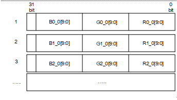
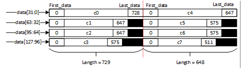

# IMP<a name="ZH-CN_TOPIC_0000002503964841"></a>

IMP鏄寚褰卞搷鍥惧儚鏁堟灉鐨勬ā鍧楋紝瀵瑰簲API鎺ュ彛蹇呴』鍦ㄨ皟鐢╯s\_mpi\_isp\_init鎺ュ彛涔嬪悗鎵嶈兘璋冪敤銆?


## Sharpen<a name="ZH-CN_TOPIC_0000002470925214"></a>


### 鍔熻兘鎻忚堪<a name="ZH-CN_TOPIC_0000002470924874"></a>

Sharpen妯″潡鐢ㄤ簬澧炲己鍥惧儚鐨勬竻鏅板害锛屽寘鎷皟鑺傚浘鍍忚竟缂樼殑閿愬寲灞炴€у拰澧炲己鍥惧儚鐨勭粏鑺傚拰绾圭悊鐨勬竻鏅板害锛屽悓鏃惰繕鑳藉垎鍒嫭绔嬫帶鍒跺浘鍍忕殑甯︽柟鍚戠殑杈圭紭鍜屾棤鏂瑰悜鐨勭粏鑺傜汗鐞嗙殑閿愬寲寮哄害銆傛澶栵紝杩樿兘鎺у埗閿愬寲鍚庣殑鍥惧儚鐨刼vershoot锛堢櫧杈圭櫧鐐癸級鍜寀ndershoot锛堥粦杈归粦鐐癸級锛屼互鍙婃姂鍒跺櫔澹扮殑澧炲己銆?
### API鍙傝€?a name="ZH-CN_TOPIC_0000002470924988"></a>

-   `ss_mpi_isp_set_sharpen_attr`锛氳缃浘鍍忛攼鍖栧睘鎬с€?-   `ss_mpi_isp_get_sharpen_attr`锛氳幏鍙栧浘鍍忛攼鍖栧睘鎬с€?


#### ss\_mpi\_isp\_set\_sharpen\_attr<a name="ZH-CN_TOPIC_0000002504084757"></a>

銆愭弿杩般€?
璁惧畾鍥惧儚閿愬寲灞炴€с€?
銆愯娉曘€?
```
td_s32 ss_mpi_isp_set_sharpen_attr(ot_vi_pipe vi_pipe, const ot_isp_sharpen_attr *shp_attr);
```

銆愬弬鏁般€?
<a name="table20464mcpsimp"></a>
<table><thead align="left"><tr id="row20470mcpsimp"><th class="cellrowborder" valign="top" width="23%" id="mcps1.1.4.1.1"><p id="p20472mcpsimp"><a name="p20472mcpsimp"></a><a name="p20472mcpsimp"></a>鍙傛暟鍚嶇О</p>
</th>
<th class="cellrowborder" valign="top" width="61%" id="mcps1.1.4.1.2"><p id="p20474mcpsimp"><a name="p20474mcpsimp"></a><a name="p20474mcpsimp"></a>鎻忚堪</p>
</th>
<th class="cellrowborder" valign="top" width="16%" id="mcps1.1.4.1.3"><p id="p20476mcpsimp"><a name="p20476mcpsimp"></a><a name="p20476mcpsimp"></a>杈撳叆/杈撳嚭</p>
</th>
</tr>
</thead>
<tbody><tr id="row20478mcpsimp"><td class="cellrowborder" valign="top" width="23%" headers="mcps1.1.4.1.1 "><p id="p20480mcpsimp"><a name="p20480mcpsimp"></a><a name="p20480mcpsimp"></a>vi_pipe</p>
</td>
<td class="cellrowborder" valign="top" width="61%" headers="mcps1.1.4.1.2 "><p id="p20482mcpsimp"><a name="p20482mcpsimp"></a><a name="p20482mcpsimp"></a>vi_pipe鍙枫€?/p>
</td>
<td class="cellrowborder" valign="top" width="16%" headers="mcps1.1.4.1.3 "><p id="p20484mcpsimp"><a name="p20484mcpsimp"></a><a name="p20484mcpsimp"></a>杈撳叆</p>
</td>
</tr>
<tr id="row20485mcpsimp"><td class="cellrowborder" valign="top" width="23%" headers="mcps1.1.4.1.1 "><p id="p20487mcpsimp"><a name="p20487mcpsimp"></a><a name="p20487mcpsimp"></a>shp_attr</p>
</td>
<td class="cellrowborder" valign="top" width="61%" headers="mcps1.1.4.1.2 "><p id="p20489mcpsimp"><a name="p20489mcpsimp"></a><a name="p20489mcpsimp"></a>鍥惧儚閿愬寲灞炴€с€?/p>
</td>
<td class="cellrowborder" valign="top" width="16%" headers="mcps1.1.4.1.3 "><p id="p20491mcpsimp"><a name="p20491mcpsimp"></a><a name="p20491mcpsimp"></a>杈撳叆</p>
</td>
</tr>
</tbody>
</table>

銆愯繑鍥炲€笺€?
<a name="table20493mcpsimp"></a>
<table><thead align="left"><tr id="row20498mcpsimp"><th class="cellrowborder" valign="top" width="43%" id="mcps1.1.3.1.1"><p id="p20500mcpsimp"><a name="p20500mcpsimp"></a><a name="p20500mcpsimp"></a>杩斿洖鍊?/p>
</th>
<th class="cellrowborder" valign="top" width="56.99999999999999%" id="mcps1.1.3.1.2"><p id="p20502mcpsimp"><a name="p20502mcpsimp"></a><a name="p20502mcpsimp"></a>鎻忚堪</p>
</th>
</tr>
</thead>
<tbody><tr id="row20503mcpsimp"><td class="cellrowborder" valign="top" width="43%" headers="mcps1.1.3.1.1 "><p id="p20505mcpsimp"><a name="p20505mcpsimp"></a><a name="p20505mcpsimp"></a>0</p>
</td>
<td class="cellrowborder" valign="top" width="56.99999999999999%" headers="mcps1.1.3.1.2 "><p id="p20507mcpsimp"><a name="p20507mcpsimp"></a><a name="p20507mcpsimp"></a>鎴愬姛銆?/p>
</td>
</tr>
<tr id="row20508mcpsimp"><td class="cellrowborder" valign="top" width="43%" headers="mcps1.1.3.1.1 "><p id="p20510mcpsimp"><a name="p20510mcpsimp"></a><a name="p20510mcpsimp"></a>闈?</p>
</td>
<td class="cellrowborder" valign="top" width="56.99999999999999%" headers="mcps1.1.3.1.2 "><p id="p20512mcpsimp"><a name="p20512mcpsimp"></a><a name="p20512mcpsimp"></a>澶辫触锛屽叾鍊间负<span xml:lang="sv-SE" id="ph10195517299"><a name="ph10195517299"></a><a name="ph10195517299"></a>閿欒鐮?/span>銆?/p>
</td>
</tr>
</tbody>
</table>

銆愰渶姹傘€?
-   澶存枃浠讹細ot\_common\_isp.h銆乻s\_mpi\_isp.h
-   搴撴枃浠讹細libot\_isp.a銆乴ibss\_isp.a

銆愭敞鎰忋€?
鏃?
銆愪妇渚嬨€?
鏃?
銆愮浉鍏充富棰樸€?
ss\_mpi\_isp\_get\_sharpen\_attr

#### ss\_mpi\_isp\_get\_sharpen\_attr<a name="ZH-CN_TOPIC_0000002503964843"></a>

銆愭弿杩般€?
鑾峰彇鍥惧儚閿愬寲灞炴€с€?
銆愯娉曘€?
```
td_s32 ss_mpi_isp_get_sharpen_attr(ot_vi_pipe vi_pipe, ot_isp_sharpen_attr *shp_attr);
```

銆愬弬鏁般€?
<a name="table20534mcpsimp"></a>
<table><thead align="left"><tr id="row20540mcpsimp"><th class="cellrowborder" valign="top" width="23%" id="mcps1.1.4.1.1"><p id="p20542mcpsimp"><a name="p20542mcpsimp"></a><a name="p20542mcpsimp"></a>鍙傛暟鍚嶇О</p>
</th>
<th class="cellrowborder" valign="top" width="61%" id="mcps1.1.4.1.2"><p id="p20544mcpsimp"><a name="p20544mcpsimp"></a><a name="p20544mcpsimp"></a>鎻忚堪</p>
</th>
<th class="cellrowborder" valign="top" width="16%" id="mcps1.1.4.1.3"><p id="p20546mcpsimp"><a name="p20546mcpsimp"></a><a name="p20546mcpsimp"></a>杈撳叆/杈撳嚭</p>
</th>
</tr>
</thead>
<tbody><tr id="row20547mcpsimp"><td class="cellrowborder" valign="top" width="23%" headers="mcps1.1.4.1.1 "><p id="p20549mcpsimp"><a name="p20549mcpsimp"></a><a name="p20549mcpsimp"></a>vi_pipe</p>
</td>
<td class="cellrowborder" valign="top" width="61%" headers="mcps1.1.4.1.2 "><p id="p20551mcpsimp"><a name="p20551mcpsimp"></a><a name="p20551mcpsimp"></a>vi_pipe鍙枫€?/p>
</td>
<td class="cellrowborder" valign="top" width="16%" headers="mcps1.1.4.1.3 "><p id="p20553mcpsimp"><a name="p20553mcpsimp"></a><a name="p20553mcpsimp"></a>杈撳叆</p>
</td>
</tr>
<tr id="row20554mcpsimp"><td class="cellrowborder" valign="top" width="23%" headers="mcps1.1.4.1.1 "><p id="p20556mcpsimp"><a name="p20556mcpsimp"></a><a name="p20556mcpsimp"></a>shp_attr</p>
</td>
<td class="cellrowborder" valign="top" width="61%" headers="mcps1.1.4.1.2 "><p id="p20558mcpsimp"><a name="p20558mcpsimp"></a><a name="p20558mcpsimp"></a>鍥惧儚閿愬寲灞炴€с€?/p>
</td>
<td class="cellrowborder" valign="top" width="16%" headers="mcps1.1.4.1.3 "><p id="p20560mcpsimp"><a name="p20560mcpsimp"></a><a name="p20560mcpsimp"></a>杈撳嚭</p>
</td>
</tr>
</tbody>
</table>

銆愯繑鍥炲€笺€?
<a name="table20563mcpsimp"></a>
<table><thead align="left"><tr id="row20568mcpsimp"><th class="cellrowborder" valign="top" width="27%" id="mcps1.1.3.1.1"><p id="p20570mcpsimp"><a name="p20570mcpsimp"></a><a name="p20570mcpsimp"></a>杩斿洖鍊?/p>
</th>
<th class="cellrowborder" valign="top" width="73%" id="mcps1.1.3.1.2"><p id="p20572mcpsimp"><a name="p20572mcpsimp"></a><a name="p20572mcpsimp"></a>鎻忚堪</p>
</th>
</tr>
</thead>
<tbody><tr id="row20573mcpsimp"><td class="cellrowborder" valign="top" width="27%" headers="mcps1.1.3.1.1 "><p id="p20575mcpsimp"><a name="p20575mcpsimp"></a><a name="p20575mcpsimp"></a>0</p>
</td>
<td class="cellrowborder" valign="top" width="73%" headers="mcps1.1.3.1.2 "><p id="p20577mcpsimp"><a name="p20577mcpsimp"></a><a name="p20577mcpsimp"></a>鎴愬姛銆?/p>
</td>
</tr>
<tr id="row20578mcpsimp"><td class="cellrowborder" valign="top" width="27%" headers="mcps1.1.3.1.1 "><p id="p20580mcpsimp"><a name="p20580mcpsimp"></a><a name="p20580mcpsimp"></a>闈?</p>
</td>
<td class="cellrowborder" valign="top" width="73%" headers="mcps1.1.3.1.2 "><p id="p20582mcpsimp"><a name="p20582mcpsimp"></a><a name="p20582mcpsimp"></a>澶辫触锛屽叾鍊间负<span xml:lang="sv-SE" id="ph10195517299"><a name="ph10195517299"></a><a name="ph10195517299"></a>閿欒鐮?/span>銆?/p>
</td>
</tr>
</tbody>
</table>

銆愰渶姹傘€?
-   澶存枃浠讹細ot\_common\_isp.h銆乻s\_mpi\_isp.h
-   搴撴枃浠讹細libot\_isp.a銆乴ibss\_isp.a

銆愭敞鎰忋€?
鏃?
銆愪妇渚嬨€?
鏃?
銆愮浉鍏充富棰樸€?
ss\_mpi\_isp\_set\_sharpen\_attr

### 鏁版嵁绫诲瀷<a name="ZH-CN_TOPIC_0000002504084939"></a>

-   `OT_ISP_SHARPEN_LUMA_NUM`锛氫寒搴﹂攼鍖栨潈閲嶅尯闂存暟
-   `OT_ISP_SHARPEN_GAIN_NUM`锛氱粏鑺傞攼鍖栨潈閲嶅尯闂存暟
-   `ot_isp_sharpen_manual_attr`锛氬畾涔塈SP Sharpen鎵嬪姩灞炴€с€?-   `ot_isp_sharpen_auto_attr`锛氬畾涔塈SP Sharpen鑷姩灞炴€с€?-   `ot_isp_sharpen_detail_map`锛氭槸鍚︽樉绀哄浘鍍忕粏鑺傜伆搴﹀浘銆?-   `ot_isp_sharpen_attr`锛氬畾涔塈SP Sharpen灞炴€с€?


#### OT\_ISP\_SHARPEN\_LUMA\_NUM<a name="ZH-CN_TOPIC_0000002504084895"></a>

銆愯鏄庛€?
浜害閿愬寲鏉冮噸鍖洪棿鏁般€?
銆愬畾涔夈€?
```
#define OT_ISP_SHARPEN_LUMA_NUM         32
```

銆愭敞鎰忎簨椤广€?
鏃犮€?
銆愮浉鍏虫暟鎹被鍨嬪強鎺ュ彛銆?
-   [ot\_isp\_sharpen\_manual\_attr](#ot_isp_sharpen_manual_attr)
-   [ot\_isp\_sharpen\_auto\_attr](#ot_isp_sharpen_auto_attr)

#### OT\_ISP\_SHARPEN\_GAIN\_NUM<a name="ZH-CN_TOPIC_0000002503964815"></a>

銆愯鏄庛€?
缁嗚妭閿愬寲鏉冮噸鍖洪棿鏁般€?
銆愬畾涔夈€?
```
#define OT_ISP_SHARPEN_GAIN_NUM         32
```

銆愭敞鎰忎簨椤广€?
鏃犮€?
銆愮浉鍏虫暟鎹被鍨嬪強鎺ュ彛銆?
-   [ot\_isp\_sharpen\_manual\_attr](#ot_isp_sharpen_manual_attr)
-   [ot\_isp\_sharpen\_auto\_attr](#ot_isp_sharpen_auto_attr)

#### ot\_isp\_sharpen\_manual\_attr<a name="ZH-CN_TOPIC_0000002470925194"></a>

銆愯鏄庛€?
瀹氫箟ISP Sharpen鎵嬪姩灞炴€с€?
銆愬畾涔夈€?
```
typedef struct {
    td_u8  luma_wgt[OT_ISP_SHARPEN_LUMA_NUM];
    td_u16 texture_strength[OT_ISP_SHARPEN_GAIN_NUM];
    td_u16 edge_strength[OT_ISP_SHARPEN_GAIN_NUM];
    td_u16 texture_freq;
    td_u16 edge_freq;
    td_u8  over_shoot;
    td_u8  under_shoot;
    td_u16 motion_texture_strength[OT_ISP_SHARPEN_GAIN_NUM];
    td_u16 motion_edge_strength[OT_ISP_SHARPEN_GAIN_NUM];
    td_u16 motion_texture_freq;
    td_u16 motion_edge_freq;
    td_u8  motion_over_shoot;
    td_u8  motion_under_shoot;
    td_u8  shoot_sup_strength;
    td_u8  shoot_sup_adj;
    td_u8  detail_ctrl;
    td_u8  detail_ctrl_threshold;
    td_u8  edge_filt_strength;
    td_u8  edge_filt_max_cap;
    td_u8  r_gain;
    td_u8  g_gain;
    td_u8  b_gain;
    td_u8  skin_gain;
    td_u16 max_sharp_gain;
} ot_isp_sharpen_manual_attr;
```

銆愭垚鍛樸€?
<a name="_Ref503540528"></a>
<table><thead align="left"><tr id="row20673mcpsimp"><th class="cellrowborder" valign="top" width="30%" id="mcps1.1.3.1.1"><p id="p20675mcpsimp"><a name="p20675mcpsimp"></a><a name="p20675mcpsimp"></a>鎴愬憳鍚嶇О</p>
</th>
<th class="cellrowborder" valign="top" width="70%" id="mcps1.1.3.1.2"><p id="p20677mcpsimp"><a name="p20677mcpsimp"></a><a name="p20677mcpsimp"></a>鎻忚堪</p>
</th>
</tr>
</thead>
<tbody><tr id="row20679mcpsimp"><td class="cellrowborder" valign="top" width="30%" headers="mcps1.1.3.1.1 "><p id="p20681mcpsimp"><a name="p20681mcpsimp"></a><a name="p20681mcpsimp"></a>luma_wgt</p>
</td>
<td class="cellrowborder" valign="top" width="70%" headers="mcps1.1.3.1.2 "><p id="p20683mcpsimp"><a name="p20683mcpsimp"></a><a name="p20683mcpsimp"></a>浜害閿愬寲鏉冮噸銆傛弧閲忕▼0-255鐨勪寒搴﹁32涓瓑鍒嗙偣骞冲潎鍒嗕负32娈典寒搴﹀尯闂达紝姣忎竴娈典寒搴﹀尯闂村搴斾竴涓寒搴︽潈閲嶃€傛瘮濡?-7鐨勪寒搴﹀尯闂寸殑鏉冮噸鏄痩uma_wgt[0]锛?-15鐨勪寒搴﹀尯闂寸殑鏉冮噸鏄痩uma_wgt[1]锛屼緷娆＄被鎺ㄣ€傚鍥?-1鎵€绀恒€傚€艰秺澶э紝鍥惧儚閿愬寲绋嬪害瓒婇珮锛屽弽涔嬶紝瓒婂急銆?/p>
<p id="p20684mcpsimp"><a name="p20684mcpsimp"></a><a name="p20684mcpsimp"></a>鍙栧€艰寖鍥达細[0, 31]锛屽缓璁€?1銆?/p>
</td>
</tr>
<tr id="row20685mcpsimp"><td class="cellrowborder" valign="top" width="30%" headers="mcps1.1.3.1.1 "><p id="p20687mcpsimp"><a name="p20687mcpsimp"></a><a name="p20687mcpsimp"></a>texture_strength</p>
</td>
<td class="cellrowborder" valign="top" width="70%" headers="mcps1.1.3.1.2 "><p id="p20689mcpsimp"><a name="p20689mcpsimp"></a><a name="p20689mcpsimp"></a>鏃犳柟鍚戠殑缁嗚妭绾圭悊鐨勯攼鍖栧己搴︼紝璁剧疆鍥惧儚鏃犳柟鍚戠殑缁嗚妭绾圭悊鐨勯攼搴︺€?/p>
<p id="p20690mcpsimp"><a name="p20690mcpsimp"></a><a name="p20690mcpsimp"></a>璇ュ€艰秺澶э紝鏃犳柟鍚戠殑缁嗚妭绾圭悊鐨勬竻鏅板害瓒婇珮銆傝鍙傛暟鏄竴涓狾T_ISP_SHARPEN_GAIN_NUM=32鐨勬暟缁勶紝鏄竴涓?2娈电殑杩炵画鐨勫己搴︽洸绾匡紝濡?a href="#fig128971450123212">鍥?</a>鎵€绀恒€?/p>
<p id="p20692mcpsimp"><a name="p20692mcpsimp"></a><a name="p20692mcpsimp"></a>鍙栧€艰寖鍥达細[0, 4095]锛屽缓璁€?00銆?/p>
</td>
</tr>
<tr id="row20693mcpsimp"><td class="cellrowborder" valign="top" width="30%" headers="mcps1.1.3.1.1 "><p id="p20695mcpsimp"><a name="p20695mcpsimp"></a><a name="p20695mcpsimp"></a>edge_strength</p>
</td>
<td class="cellrowborder" valign="top" width="70%" headers="mcps1.1.3.1.2 "><p id="p20697mcpsimp"><a name="p20697mcpsimp"></a><a name="p20697mcpsimp"></a>甯︽柟鍚戠殑杈圭紭鐨勯攼鍖栧己搴︼紝璁剧疆鍥惧儚甯︽柟鍚戠殑杈圭紭鐨勯攼搴︺€?/p>
<p id="p20698mcpsimp"><a name="p20698mcpsimp"></a><a name="p20698mcpsimp"></a>璇ュ€艰秺澶э紝甯︽柟鍚戠殑杈圭紭鐨勯攼搴﹁秺楂樸€傝鍙傛暟鏄竴涓狾T_ISP_SHARPEN_GAIN_NUM=32鐨勬暟缁勶紝鏄竴涓?2娈电殑杩炵画鐨勫己搴︽洸绾匡紝濡?a href="#fig5809162318332">鍥?</a>鎵€绀恒€?/p>
<p id="p20700mcpsimp"><a name="p20700mcpsimp"></a><a name="p20700mcpsimp"></a>鍙栧€艰寖鍥达細[0, 4095]锛屽缓璁€?00銆?/p>
</td>
</tr>
<tr id="row20701mcpsimp"><td class="cellrowborder" valign="top" width="30%" headers="mcps1.1.3.1.1 "><p id="p20703mcpsimp"><a name="p20703mcpsimp"></a><a name="p20703mcpsimp"></a>texture_freq</p>
</td>
<td class="cellrowborder" valign="top" width="70%" headers="mcps1.1.3.1.2 "><p id="p20705mcpsimp"><a name="p20705mcpsimp"></a><a name="p20705mcpsimp"></a>鍥惧儚鐨勬棤鏂瑰悜缁嗚妭绾圭悊鐨勫寮洪娈垫帶鍒躲€傝缃浘鍍忕殑缁嗚妭绾圭悊澧炲己鐨勯鐜囥€?/p>
<p id="p20706mcpsimp"><a name="p20706mcpsimp"></a><a name="p20706mcpsimp"></a>璇ュ€艰秺澶э紝缁嗚妭绾圭悊鐨勫寮哄氨瓒婂亸鍚戜簬楂橀澧炲己锛岀粏鑺傜汗鐞嗗氨瓒婄粏纰庛€傚弽涔嬶紝璇ュ€艰秺灏忥紝缁嗚妭绾圭悊灏辫秺绮楄秺鍦嗘鼎銆倀exture_freq瀵瑰簲浜庡己搴﹀弬鏁皌exture_strength銆倀exture_freq瓒婂ぇ锛屽浘鍍忕殑缁嗚妭绾圭悊灏辫秺缁嗙锛岃鍊艰繃澶э紝浼氬鑷村浘鍍忕殑缁嗚妭绾圭悊杩囦簬缁嗙鑰屼笉鑷劧锛岀敋鑷虫劅瑙夋ā绯娿€?/p>
<p id="p20707mcpsimp"><a name="p20707mcpsimp"></a><a name="p20707mcpsimp"></a>鍙栧€艰寖鍥达細[0, 4095]锛屽缓璁€?28銆?/p>
</td>
</tr>
<tr id="row20708mcpsimp"><td class="cellrowborder" valign="top" width="30%" headers="mcps1.1.3.1.1 "><p id="p20710mcpsimp"><a name="p20710mcpsimp"></a><a name="p20710mcpsimp"></a>edge_freq</p>
</td>
<td class="cellrowborder" valign="top" width="70%" headers="mcps1.1.3.1.2 "><p id="p20712mcpsimp"><a name="p20712mcpsimp"></a><a name="p20712mcpsimp"></a>鍥惧儚鐨勫甫鏂瑰悜鐨勮竟缂樼殑澧炲己棰戞鎺у埗銆傝缃浘鍍忚竟缂樺寮虹殑棰戠巼銆?/p>
<p id="p20713mcpsimp"><a name="p20713mcpsimp"></a><a name="p20713mcpsimp"></a>璇ュ€艰秺澶э紝杈圭紭鐨勫寮哄氨瓒婂亸鍚戜簬楂橀澧炲己锛屽浘鍍忕殑杈圭紭灏辫秺绾よ杽瓒婄獎銆傚弽涔嬶紝璇ュ€艰秺灏忥紝杈圭紭灏辫秺绮楄秺鍦嗘鼎銆俥dge_freq瀵瑰簲浜庡己搴﹀弬鏁癳dge_strength銆俥dge_freq瓒婂ぇ锛屽浘鍍忕殑杈圭紭灏辫秺绾よ杽瓒婄獎锛岃鍊艰繃澶э紝浼氬鑷村浘鍍忕殑杈圭紭杩囦簬绾よ杽鑰屽嚭鐜拌櫄杈圭幇璞°€?/p>
<p id="p20714mcpsimp"><a name="p20714mcpsimp"></a><a name="p20714mcpsimp"></a>鍙栧€艰寖鍥达細[0, 4095]锛屽缓璁€?6銆?/p>
</td>
</tr>
<tr id="row20715mcpsimp"><td class="cellrowborder" valign="top" width="30%" headers="mcps1.1.3.1.1 "><p id="p20717mcpsimp"><a name="p20717mcpsimp"></a><a name="p20717mcpsimp"></a>over_shoot</p>
</td>
<td class="cellrowborder" valign="top" width="70%" headers="mcps1.1.3.1.2 "><p id="p20719mcpsimp"><a name="p20719mcpsimp"></a><a name="p20719mcpsimp"></a>璁剧疆鍥惧儚鐨刼vershoot锛堥攼鍖栧悗鐨勭櫧杈圭櫧鐐癸級鐨勫己搴︺€?/p>
<p id="p20720mcpsimp"><a name="p20720mcpsimp"></a><a name="p20720mcpsimp"></a>璇ュ€艰秺灏忥紝閿愬寲鍚庣殑鐧借竟鐧界偣瓒婂急锛屾竻鏅板害涔熶細涓嬮檷銆傝鍊艰繃灏忥紝鍥惧儚浼氬憟娌圭敾鏁堟灉銆?/p>
<p id="p20721mcpsimp"><a name="p20721mcpsimp"></a><a name="p20721mcpsimp"></a>鍙栧€艰寖鍥达細[0, 127]锛屽缓璁€?00銆?/p>
</td>
</tr>
<tr id="row20722mcpsimp"><td class="cellrowborder" valign="top" width="30%" headers="mcps1.1.3.1.1 "><p id="p20724mcpsimp"><a name="p20724mcpsimp"></a><a name="p20724mcpsimp"></a>under_shoot</p>
</td>
<td class="cellrowborder" valign="top" width="70%" headers="mcps1.1.3.1.2 "><p id="p20726mcpsimp"><a name="p20726mcpsimp"></a><a name="p20726mcpsimp"></a>璁剧疆鍥惧儚鐨剈ndershoot锛堥攼鍖栧悗鐨勯粦杈归粦鐐癸級鐨勫己搴︺€?/p>
<p id="p20727mcpsimp"><a name="p20727mcpsimp"></a><a name="p20727mcpsimp"></a>璇ュ€艰秺灏忥紝閿愬寲鍚庣殑榛戣竟榛戠偣瓒婂急锛屾竻鏅板害涔熶細涓嬮檷銆傝鍊艰繃灏忥紝鍥惧儚浼氬憟娌圭敾鏁堟灉銆?/p>
<p id="p20728mcpsimp"><a name="p20728mcpsimp"></a><a name="p20728mcpsimp"></a>鍙栧€艰寖鍥达細[0, 127]锛屽缓璁€?27銆?/p>
</td>
</tr>
<tr id="row20729mcpsimp"><td class="cellrowborder" valign="top" width="30%" headers="mcps1.1.3.1.1 "><p id="p20731mcpsimp"><a name="p20731mcpsimp"></a><a name="p20731mcpsimp"></a>motion_texture_strength</p>
</td>
<td class="cellrowborder" valign="top" width="70%" headers="mcps1.1.3.1.2 "><p id="p20733mcpsimp"><a name="p20733mcpsimp"></a><a name="p20733mcpsimp"></a>鏃犳柟鍚戠殑缁嗚妭绾圭悊鐨勯攼鍖栧己搴︼紝璁剧疆杩愬姩鍖哄煙鍥惧儚鏃犳柟鍚戠殑缁嗚妭绾圭悊鐨勯攼搴︺€?/p>
<p id="p20734mcpsimp"><a name="p20734mcpsimp"></a><a name="p20734mcpsimp"></a>璇ュ€艰秺澶э紝鏃犳柟鍚戠殑缁嗚妭绾圭悊鐨勬竻鏅板害瓒婇珮銆傝鍙傛暟鏄竴涓狾T_ISP_SHARPEN_GAIN_NUM=32鐨勬暟缁勶紝鏄竴涓?2娈电殑杩炵画鐨勫己搴︽洸绾匡紝濡?a href="#fig128971450123212">鍥?</a>鎵€绀恒€?/p>
<p id="p20736mcpsimp"><a name="p20736mcpsimp"></a><a name="p20736mcpsimp"></a>鍙栧€艰寖鍥达細[0, 4095]锛屽缓璁€?00銆?/p>
</td>
</tr>
<tr id="row20737mcpsimp"><td class="cellrowborder" valign="top" width="30%" headers="mcps1.1.3.1.1 "><p id="p20739mcpsimp"><a name="p20739mcpsimp"></a><a name="p20739mcpsimp"></a>motion_edge_strength</p>
</td>
<td class="cellrowborder" valign="top" width="70%" headers="mcps1.1.3.1.2 "><p id="p20741mcpsimp"><a name="p20741mcpsimp"></a><a name="p20741mcpsimp"></a>甯︽柟鍚戠殑杈圭紭鐨勯攼鍖栧己搴︼紝璁剧疆杩愬姩鍖哄煙鍥惧儚甯︽柟鍚戠殑杈圭紭鐨勯攼搴︺€?/p>
<p id="p20742mcpsimp"><a name="p20742mcpsimp"></a><a name="p20742mcpsimp"></a>璇ュ€艰秺澶э紝甯︽柟鍚戠殑杈圭紭鐨勯攼搴﹁秺楂樸€傝鍙傛暟鏄竴涓狾T_ISP_SHARPEN_GAIN_NUM=32鐨勬暟缁勶紝鏄竴涓?2娈电殑杩炵画鐨勫己搴︽洸绾匡紝濡?a href="#fig5809162318332">鍥?</a>鎵€绀恒€?/p>
<p id="p20744mcpsimp"><a name="p20744mcpsimp"></a><a name="p20744mcpsimp"></a>鍙栧€艰寖鍥达細[0, 4095]锛屽缓璁€?00銆?/p>
</td>
</tr>
<tr id="row20745mcpsimp"><td class="cellrowborder" valign="top" width="30%" headers="mcps1.1.3.1.1 "><p id="p20747mcpsimp"><a name="p20747mcpsimp"></a><a name="p20747mcpsimp"></a>motion_texture_freq</p>
</td>
<td class="cellrowborder" valign="top" width="70%" headers="mcps1.1.3.1.2 "><p id="p20749mcpsimp"><a name="p20749mcpsimp"></a><a name="p20749mcpsimp"></a>鍥惧儚鐨勬棤鏂瑰悜缁嗚妭绾圭悊鐨勫寮洪娈垫帶鍒躲€傝缃繍鍔ㄥ尯鍩熷浘鍍忕殑缁嗚妭绾圭悊澧炲己鐨勯鐜囥€?/p>
<p id="p20750mcpsimp"><a name="p20750mcpsimp"></a><a name="p20750mcpsimp"></a>璇ュ€艰秺澶э紝缁嗚妭绾圭悊鐨勫寮哄氨瓒婂亸鍚戜簬楂橀澧炲己锛岀粏鑺傜汗鐞嗗氨瓒婄粏纰庛€傚弽涔嬶紝璇ュ€艰秺灏忥紝缁嗚妭绾圭悊灏辫秺绮楄秺鍦嗘鼎銆倀exture_freq瀵瑰簲浜庡己搴﹀弬鏁皌exture_strength銆倀exture_freq瓒婂ぇ锛屽浘鍍忕殑缁嗚妭绾圭悊灏辫秺缁嗙锛岃鍊艰繃澶э紝浼氬鑷村浘鍍忕殑缁嗚妭绾圭悊杩囦簬缁嗙鑰屼笉鑷劧锛岀敋鑷虫劅瑙夋ā绯娿€?/p>
<p id="p20751mcpsimp"><a name="p20751mcpsimp"></a><a name="p20751mcpsimp"></a>鍙栧€艰寖鍥达細[0, 4095]锛屽缓璁€?28銆?/p>
</td>
</tr>
<tr id="row20752mcpsimp"><td class="cellrowborder" valign="top" width="30%" headers="mcps1.1.3.1.1 "><p id="p20754mcpsimp"><a name="p20754mcpsimp"></a><a name="p20754mcpsimp"></a>motion_edge_freq</p>
</td>
<td class="cellrowborder" valign="top" width="70%" headers="mcps1.1.3.1.2 "><p id="p20756mcpsimp"><a name="p20756mcpsimp"></a><a name="p20756mcpsimp"></a>鍥惧儚鐨勫甫鏂瑰悜鐨勮竟缂樼殑澧炲己棰戞鎺у埗銆傝缃繍鍔ㄥ尯鍩熷浘鍍忚竟缂樺寮虹殑棰戠巼銆?/p>
<p id="p20757mcpsimp"><a name="p20757mcpsimp"></a><a name="p20757mcpsimp"></a>璇ュ€艰秺澶э紝杈圭紭鐨勫寮哄氨瓒婂亸鍚戜簬楂橀澧炲己锛屽浘鍍忕殑杈圭紭灏辫秺绾よ杽瓒婄獎銆傚弽涔嬶紝璇ュ€艰秺灏忥紝杈圭紭灏辫秺绮楄秺鍦嗘鼎銆俥dge_freq瀵瑰簲浜庡己搴﹀弬鏁癳dge_strength銆俥dge_freq瓒婂ぇ锛屽浘鍍忕殑杈圭紭灏辫秺绾よ杽瓒婄獎锛岃鍊艰繃澶э紝浼氬鑷村浘鍍忕殑杈圭紭杩囦簬绾よ杽鑰屽嚭鐜拌櫄杈圭幇璞°€?/p>
<p id="p20758mcpsimp"><a name="p20758mcpsimp"></a><a name="p20758mcpsimp"></a>鍙栧€艰寖鍥达細[0, 4095]锛屽缓璁€?6銆?/p>
</td>
</tr>
<tr id="row20759mcpsimp"><td class="cellrowborder" valign="top" width="30%" headers="mcps1.1.3.1.1 "><p id="p20761mcpsimp"><a name="p20761mcpsimp"></a><a name="p20761mcpsimp"></a>motion_over_shoot</p>
</td>
<td class="cellrowborder" valign="top" width="70%" headers="mcps1.1.3.1.2 "><p id="p20763mcpsimp"><a name="p20763mcpsimp"></a><a name="p20763mcpsimp"></a>璁剧疆杩愬姩鍖哄煙鍥惧儚鐨刼vershoot锛堥攼鍖栧悗鐨勭櫧杈圭櫧鐐癸級鐨勫己搴︺€?/p>
<p id="p20764mcpsimp"><a name="p20764mcpsimp"></a><a name="p20764mcpsimp"></a>璇ュ€艰秺灏忥紝閿愬寲鍚庣殑鐧借竟鐧界偣瓒婂急锛屾竻鏅板害涔熶細涓嬮檷銆傝鍊艰繃灏忥紝鍥惧儚浼氬憟娌圭敾鏁堟灉銆?/p>
<p id="p20765mcpsimp"><a name="p20765mcpsimp"></a><a name="p20765mcpsimp"></a>鍙栧€艰寖鍥达細[0, 127]锛屽缓璁€?00銆?/p>
</td>
</tr>
<tr id="row20766mcpsimp"><td class="cellrowborder" valign="top" width="30%" headers="mcps1.1.3.1.1 "><p id="p20768mcpsimp"><a name="p20768mcpsimp"></a><a name="p20768mcpsimp"></a>motion_under_shoot</p>
</td>
<td class="cellrowborder" valign="top" width="70%" headers="mcps1.1.3.1.2 "><p id="p20770mcpsimp"><a name="p20770mcpsimp"></a><a name="p20770mcpsimp"></a>璁剧疆杩愬姩鍖哄煙鍥惧儚鐨剈ndershoot锛堥攼鍖栧悗鐨勯粦杈归粦鐐癸級鐨勫己搴︺€?/p>
<p id="p20771mcpsimp"><a name="p20771mcpsimp"></a><a name="p20771mcpsimp"></a>璇ュ€艰秺灏忥紝閿愬寲鍚庣殑榛戣竟榛戠偣瓒婂急锛屾竻鏅板害涔熶細涓嬮檷銆傝鍊艰繃灏忥紝鍥惧儚浼氬憟娌圭敾鏁堟灉銆?/p>
<p id="p20772mcpsimp"><a name="p20772mcpsimp"></a><a name="p20772mcpsimp"></a>鍙栧€艰寖鍥达細[0, 127]锛屽缓璁€?27銆?/p>
</td>
</tr>
<tr id="row20773mcpsimp"><td class="cellrowborder" valign="top" width="30%" headers="mcps1.1.3.1.1 "><p id="p20775mcpsimp"><a name="p20775mcpsimp"></a><a name="p20775mcpsimp"></a>shoot_sup_strength</p>
</td>
<td class="cellrowborder" valign="top" width="70%" headers="mcps1.1.3.1.2 "><p id="p20777mcpsimp"><a name="p20777mcpsimp"></a><a name="p20777mcpsimp"></a>鍥惧儚閿愬寲鍚庣殑overshoot鍜寀ndershoot鐨勬姂鍒跺己搴︺€傜敤浜庡湪淇濊瘉娓呮櫚搴︿笉鏄庢樉涓嬮檷鐨勫墠鎻愪笅锛屾姂鍒堕攼鍖栧悗鐨勫浘鍍忕殑overshoot鍜寀ndershoot鐨勫搴﹀拰骞呭害銆?/p>
<p id="p20778mcpsimp"><a name="p20778mcpsimp"></a><a name="p20778mcpsimp"></a>璇ュ€艰秺澶э紝閿愬寲鍚庣殑鍥惧儚鐨刼vershoot鍜寀ndershoot鐨勫搴﹁秺绐勩€佸己搴﹁秺灏忋€傝鍊煎彉澶э紝鐞嗚涓婁笉浼氬奖鍝嶅浘鍍忕殑娓呮櫚搴︼紝鍙槸榛戠櫧杈瑰彉绐勪互鍚庯紝浼氬噺寮变汉鐪肩殑閿愬害鎰熷彈銆傝鍙傛暟闇€瑕佸拰shoot_sup_adj閰嶅悎浣跨敤銆?/p>
<p id="p20779mcpsimp"><a name="p20779mcpsimp"></a><a name="p20779mcpsimp"></a>鍙栧€艰寖鍥达細[0, 255]锛屽缓璁€?銆?/p>
</td>
</tr>
<tr id="row20780mcpsimp"><td class="cellrowborder" valign="top" width="30%" headers="mcps1.1.3.1.1 "><p id="p20782mcpsimp"><a name="p20782mcpsimp"></a><a name="p20782mcpsimp"></a>shoot_sup_adj</p>
</td>
<td class="cellrowborder" valign="top" width="70%" headers="mcps1.1.3.1.2 "><p id="p20784mcpsimp"><a name="p20784mcpsimp"></a><a name="p20784mcpsimp"></a>鍥惧儚閿愬寲鍚庣殑overshoot鍜寀ndershoot鐨勬姂鍒跺己搴︾殑璋冭妭銆傝鍙傛暟閰嶅悎shoot_sup_strength浣跨敤锛岀敤浜庤皟鑺俿hoot_sup_strength浣滅敤鐨勫尯鍩熻寖鍥淬€傝鍊艰秺灏忥紝鍒欒秺澶氱殑绾圭悊鍖哄煙鐨剆hoot浼氳shoot_sup_strength鎶戝埗锛涜鍊艰秺澶э紝鍒欏彧鏈夊緢寮虹殑杈圭紭鐨剆hoot浼氳shoot_sup_strength鎶戝埗锛岀汗鐞嗗尯鍩熺殑shoot涓嶄細琚姂鍒躲€?/p>
<p id="p20785mcpsimp"><a name="p20785mcpsimp"></a><a name="p20785mcpsimp"></a>鍙栧€艰寖鍥达細[0, 15]锛屽缓璁€?銆?/p>
</td>
</tr>
<tr id="row20786mcpsimp"><td class="cellrowborder" valign="top" width="30%" headers="mcps1.1.3.1.1 "><p id="p20788mcpsimp"><a name="p20788mcpsimp"></a><a name="p20788mcpsimp"></a>detail_ctrl</p>
</td>
<td class="cellrowborder" valign="top" width="70%" headers="mcps1.1.3.1.2 "><p id="p20790mcpsimp"><a name="p20790mcpsimp"></a><a name="p20790mcpsimp"></a>鍥惧儚鐨勭粏鑺傜汗鐞嗗尯鐨剆hoot寮哄害鐨勬帶鍒躲€傜敤浜庢帶鍒跺浘鍍忕殑缁嗚妭绾圭悊鍖哄煙鐨剆hoot寮哄害锛宻hoot瓒婂ぇ锛岀粏鑺傜汗鐞嗗尯鐨勬竻鏅板害瓒婇珮銆?/p>
<p id="p20791mcpsimp"><a name="p20791mcpsimp"></a><a name="p20791mcpsimp"></a>鍙栧€艰寖鍥达細[0, 0xFF]锛岃鍊肩瓑浜?28锛屽垯鍥惧儚鐨勭粏鑺傜汗鐞嗗尯鍩熺殑shoot寮哄害鍜屽ぇ杈圭紭鐨剆hoot寮哄害涓€鑷达紝閮藉垎鍒瓑浜巓ver_shoot鍜寀nder_shoot銆傝鍊煎ぇ浜?28锛屽垯鍥惧儚鐨勭粏鑺傜汗鐞嗙殑shoot寮哄害澶т簬澶ц竟缂橈紝澶ц竟缂樼殑shoot寮哄害鍒嗗埆绛変簬over_shoot鍜寀nder_shoot銆傝鍊煎皬浜?28锛屽垯鍥惧儚鐨勭粏鑺傜汗鐞嗙殑shoot寮哄害灏忎簬澶ц竟缂橈紝澶ц竟缂樼殑shoot寮哄害鍒嗗埆绛変簬over_shoot鍜寀nder_shoot銆?/p>
</td>
</tr>
<tr id="row20792mcpsimp"><td class="cellrowborder" valign="top" width="30%" headers="mcps1.1.3.1.1 "><p id="p20794mcpsimp"><a name="p20794mcpsimp"></a><a name="p20794mcpsimp"></a>detail_ctrl_threshold</p>
</td>
<td class="cellrowborder" valign="top" width="70%" headers="mcps1.1.3.1.2 "><p id="p20796mcpsimp"><a name="p20796mcpsimp"></a><a name="p20796mcpsimp"></a>鍥惧儚鐨勭粏鑺傜汗鐞嗗尯鐨剆hoot寮哄害鐨勬帶鍒堕槇鍊笺€傝鍊奸厤鍚坉etail_ctrl浣跨敤锛岀敤浜庡尯鍒哾etail_ctrl鎵€鎺у埗shoot鐨勭汗鐞嗗尯鍜岃竟缂橈紝涔熷嵆绾圭悊鍖哄拰杈圭紭鐨勫尯鍒嗛槇鍊笺€傚皬浜庤鍊肩殑鍖哄煙涓虹汗鐞嗗尯锛岃绾圭悊鍖哄煙鐨剆hoot浼氳detail_ctrl鍗曠嫭鎺у埗锛岃€屽ぇ浜庤闃堝€肩殑杈圭紭鍖哄煙鐨剆hoot渚濈劧绛変簬over_shoot鍜寀nder_shoot銆?/p>
<p id="p20797mcpsimp"><a name="p20797mcpsimp"></a><a name="p20797mcpsimp"></a>鍙栧€艰寖鍥达細[0, 0xFF]锛屽缓璁€?60銆?/p>
</td>
</tr>
<tr id="row20798mcpsimp"><td class="cellrowborder" valign="top" width="30%" headers="mcps1.1.3.1.1 "><p id="p20800mcpsimp"><a name="p20800mcpsimp"></a><a name="p20800mcpsimp"></a>edge_filt_strength</p>
</td>
<td class="cellrowborder" valign="top" width="70%" headers="mcps1.1.3.1.2 "><p id="p20802mcpsimp"><a name="p20802mcpsimp"></a><a name="p20802mcpsimp"></a>杈圭紭婊ゆ尝寮哄害璋冭瘯鍙傛暟锛氬疄鐜板浘鍍忛攼鍖栬竟缂樼殑鑼冨洿鍜岃竟缂樺钩婊戝己搴︾殑鎺у埗銆傝鍊艰秺澶э紝鍒や负杈圭紭鐨勫尯鍩熻秺澶氥€佷篃瓒婂锛宔dge_strength璧蜂綔鐢ㄧ殑鍥惧儚杈圭紭灏辫秺澶氾紝鑰屼笖锛岃鍊艰秺澶э紝娌跨潃杈圭紭鏂瑰悜鐨勫钩婊戞护娉㈠己搴︿篃瓒婂ぇ锛岃竟缂樺氨瓒婂钩婊戙€傚弽涔嬶紝鍒や负杈圭紭鐨勫尯鍩熻秺灏戙€佷篃瓒婄獎锛宔dge_strength璧蜂綔鐢ㄧ殑鍥惧儚鍖哄煙瓒婂皯锛岃竟缂樺钩婊戝氨瓒婂急銆?/p>
<p id="p20803mcpsimp"><a name="p20803mcpsimp"></a><a name="p20803mcpsimp"></a>鍙栧€艰寖鍥达細[0, 63]锛涘缓璁€?3銆?/p>
</td>
</tr>
<tr id="row20804mcpsimp"><td class="cellrowborder" valign="top" width="30%" headers="mcps1.1.3.1.1 "><p id="p20806mcpsimp"><a name="p20806mcpsimp"></a><a name="p20806mcpsimp"></a>edge_filt_max_cap</p>
</td>
<td class="cellrowborder" valign="top" width="70%" headers="mcps1.1.3.1.2 "><p id="p20808mcpsimp"><a name="p20808mcpsimp"></a><a name="p20808mcpsimp"></a>杈圭紭婊ゆ尝寮哄害鑼冨洿鐨勮皟璇曞弬鏁帮細璇ュ€艰秺澶э紝杈圭紭婊ゆ尝鐨勬渶澶у己搴︿篃鏈€澶э紝edge_filt_strength鐨勫彲璋冭瘯鑼冨洿涔熻秺澶э紱涓€鑸缓璁鍊煎ぇ灏忔帶鍒?0浠ュ唴銆?/p>
<p id="p20809mcpsimp"><a name="p20809mcpsimp"></a><a name="p20809mcpsimp"></a>鍙栧€艰寖鍥达細[0, 47]锛涘缓璁€?8銆?/p>
</td>
</tr>
<tr id="row20810mcpsimp"><td class="cellrowborder" valign="top" width="30%" headers="mcps1.1.3.1.1 "><p id="p20812mcpsimp"><a name="p20812mcpsimp"></a><a name="p20812mcpsimp"></a>r_gain</p>
</td>
<td class="cellrowborder" valign="top" width="70%" headers="mcps1.1.3.1.2 "><p id="p20814mcpsimp"><a name="p20814mcpsimp"></a><a name="p20814mcpsimp"></a>娣辩孩鑹插尯鍩熺殑閿愬寲澧炵泭鎺у埗銆傝鍊艰秺澶э紝鍒欐繁绾㈣壊鍖哄煙鐨勯攼鍖栧己搴﹁秺澶с€?/p>
<p id="p20815mcpsimp"><a name="p20815mcpsimp"></a><a name="p20815mcpsimp"></a>鍙栧€艰寖鍥达細[0, 31]锛涘缓璁€?8銆?/p>
</td>
</tr>
<tr id="row20816mcpsimp"><td class="cellrowborder" valign="top" width="30%" headers="mcps1.1.3.1.1 "><p id="p20818mcpsimp"><a name="p20818mcpsimp"></a><a name="p20818mcpsimp"></a>g_gain</p>
</td>
<td class="cellrowborder" valign="top" width="70%" headers="mcps1.1.3.1.2 "><p id="p20820mcpsimp"><a name="p20820mcpsimp"></a><a name="p20820mcpsimp"></a>缁胯壊鍖哄煙鐨勯攼鍖栧鐩婃帶鍒躲€傝鍊艰秺澶э紝鍒欑豢鑹插尯鍩熺殑閿愬寲寮哄害瓒婂ぇ銆?/p>
<p id="p20821mcpsimp"><a name="p20821mcpsimp"></a><a name="p20821mcpsimp"></a>鍙栧€艰寖鍥达細[0, 255]锛涘缓璁€?2銆?/p>
</td>
</tr>
<tr id="row20822mcpsimp"><td class="cellrowborder" valign="top" width="30%" headers="mcps1.1.3.1.1 "><p id="p20824mcpsimp"><a name="p20824mcpsimp"></a><a name="p20824mcpsimp"></a>b_gain</p>
</td>
<td class="cellrowborder" valign="top" width="70%" headers="mcps1.1.3.1.2 "><p id="p20826mcpsimp"><a name="p20826mcpsimp"></a><a name="p20826mcpsimp"></a>娣辫摑鑹插尯鍩熺殑閿愬寲澧炵泭鎺у埗銆傝鍊艰秺澶э紝鍒欐繁钃濊壊鍖哄煙鐨勯攼鍖栧己搴﹁秺澶с€?/p>
<p id="p20827mcpsimp"><a name="p20827mcpsimp"></a><a name="p20827mcpsimp"></a>鍙栧€艰寖鍥达細[0, 31]锛涘缓璁€?8銆?/p>
</td>
</tr>
<tr id="row20828mcpsimp"><td class="cellrowborder" valign="top" width="30%" headers="mcps1.1.3.1.1 "><p id="p20830mcpsimp"><a name="p20830mcpsimp"></a><a name="p20830mcpsimp"></a>skin_gain</p>
</td>
<td class="cellrowborder" valign="top" width="70%" headers="mcps1.1.3.1.2 "><p id="p20832mcpsimp"><a name="p20832mcpsimp"></a><a name="p20832mcpsimp"></a>鑲よ壊鍖哄煙鐨勯攼鍖栧鐩婃帶鍒躲€傝鍊艰秺澶э紝鍒欒偆鑹插尯鍩熺殑閿愬寲寮哄害瓒婂ぇ銆?/p>
<p id="p20833mcpsimp"><a name="p20833mcpsimp"></a><a name="p20833mcpsimp"></a>鍙栧€艰寖鍥达細[0, 31]锛涘缓璁€?3銆?/p>
</td>
</tr>
<tr id="row20834mcpsimp"><td class="cellrowborder" valign="top" width="30%" headers="mcps1.1.3.1.1 "><p id="p20836mcpsimp"><a name="p20836mcpsimp"></a><a name="p20836mcpsimp"></a>max_sharp_gain</p>
</td>
<td class="cellrowborder" valign="top" width="70%" headers="mcps1.1.3.1.2 "><p id="p20838mcpsimp"><a name="p20838mcpsimp"></a><a name="p20838mcpsimp"></a>鍥惧儚閿愬寲鐨勬渶澶у鐩婇檺鍒跺€笺€傝鍊艰秺澶э紝鍥惧儚鐨勯攼鍖栧箙搴﹁秺澶э紝鍙嶄箣锛岄攼鍖栧箙搴﹁秺灏忋€傞€傚綋鐨勮皟灏忚鍙傛暟锛屽彲浠ュ噺灏戝浘鍍忕殑杩囬攼鍖栵紝鍙互鍑忓皯鍥惧儚閿愬寲鍚庣殑榛戠櫧鐐广€?/p>
<p id="p20839mcpsimp"><a name="p20839mcpsimp"></a><a name="p20839mcpsimp"></a>鍙栧€艰寖鍥达細[0, 0x7FF]锛屽缓璁€?60銆?/p>
</td>
</tr>
</tbody>
</table>

**鍥?1**  Sharpen鐨勫儚绱犱寒搴uma鍜岄攼鍖栧己搴uma\_wgt鐨勫叧绯绘洸绾?a name="fig14519101916320"></a>  


**鍥?2**  texture\_strength\`OT_ISP_SHARPEN_GAIN_NUM`\]寮哄害鏇茬嚎绀烘剰鍥?a name="fig128971450123212"></a>  


寮哄害鏇茬嚎鐨勬í鍧愭爣var鏄粠鍥惧儚涓彁鍙栫殑鏂瑰樊缁熻鐗瑰緛锛屾í鍧愭爣var琚潎鍒嗕负32娈碉紝鐢ㄤ簬鍖哄垎鍑哄浘鍍忕殑Flat Area锛堝钩鍧﹀尯鍩燂級銆乄eak Texture锛堝急绾圭悊锛夈€乀exture锛堢汗鐞嗭級鍜孲trong Texture锛堝己绾圭悊锛夈€傜旱鍧愭爣灏辨槸寮哄害鍙傛暟texture\_strength鐨?2涓己搴﹀€硷紝鐢ㄦ埛鍙互閫氳繃璁剧疆璇ユ洸绾夸笂鐨?2涓己搴﹀€兼潵涓哄钩鍧﹀尯鍩熴€佸急绾圭悊鍖哄煙銆佺汗鐞嗗尯鍩熷拰寮虹汗鐞嗗尯鍩熻缃笉鍚岀殑閿愬寲寮哄害銆傝繖4涓尯鍩熷苟娌℃湁鏄庢樉鐨勫尯鍒嗙晫闄愶紝閮芥槸杩炵画杩囨浮锛岀敤鎴峰彲浠ラ€氳繃瀹為檯鏁堟灉鏉ヨ皟鏁寸旱鍧愭爣寮哄害鏉ヤ负涓嶅悓鐨勫尯鍩熻缃笉鍚岀殑寮哄害銆?
**鍥?3**  edge\_strength\`OT_ISP_SHARPEN_GAIN_NUM`\]寮哄害鏇茬嚎绀烘剰鍥?a name="fig5809162318332"></a>  


寮哄害鏇茬嚎鐨勬í鍧愭爣var鏄粠鍥惧儚涓彁鍙栫殑鏂瑰樊缁熻鍊硷紝妯潗鏍噕ar琚潎鍒嗕负32娈碉紝鐢ㄤ簬鍖哄垎鍑哄浘鍍忕殑Flat Area锛堝钩鍧﹀尯鍩燂級銆乄eak Edge锛堝急杈圭紭锛夈€丒dge锛堣竟缂橈級鍜孲trong Edge锛堝己杈圭紭锛夈€傜旱鍧愭爣灏辨槸寮哄害鍙傛暟edge\_strength鐨?2涓己搴﹀€硷紝鐢ㄦ埛鍙互閫氳繃璁剧疆璇ユ洸绾夸笂鐨?2涓己搴﹀€兼潵涓哄钩鍧﹀尯鍩熴€佸急杈圭紭銆佽竟缂樺拰寮鸿竟缂樿缃笉鍚岀殑閿愬寲寮哄害銆傝繖4涓尯鍩熷苟娌℃湁鏄庢樉鐨勫尯鍒嗙晫闄愶紝閮芥槸杩炵画杩囨浮锛岀敤鎴峰彲浠ラ€氳繃瀹為檯鏁堟灉鏉ヨ皟鏁寸旱鍧愭爣寮哄害鏉ヤ负涓嶅悓鐨勫尯鍩熻缃笉鍚岀殑寮哄害銆?
#### ot\_isp\_sharpen\_auto\_attr<a name="ZH-CN_TOPIC_0000002470924892"></a>

銆愯鏄庛€?
瀹氫箟ISP Sharpen鑷姩灞炴€с€?
銆愬畾涔夈€?
```
typedef struct {
    td_u8  luma_wgt[OT_ISP_SHARPEN_LUMA_NUM][OT_ISP_AUTO_ISO_NUM];
    td_u16 texture_strength[OT_ISP_SHARPEN_GAIN_NUM][OT_ISP_AUTO_ISO_NUM];
    td_u16 edge_strength[OT_ISP_SHARPEN_GAIN_NUM][OT_ISP_AUTO_ISO_NUM];
    td_u16 texture_freq[OT_ISP_AUTO_ISO_NUM];
    td_u16 edge_freq[OT_ISP_AUTO_ISO_NUM];
    td_u8  over_shoot[OT_ISP_AUTO_ISO_NUM];
    td_u8  under_shoot[OT_ISP_AUTO_ISO_NUM];
    td_u16 motion_texture_strength[OT_ISP_SHARPEN_GAIN_NUM][OT_ISP_AUTO_ISO_NUM];
    td_u16 motion_edge_strength[OT_ISP_SHARPEN_GAIN_NUM][OT_ISP_AUTO_ISO_NUM];
    td_u16 motion_texture_freq[OT_ISP_AUTO_ISO_NUM];
    td_u16 motion_edge_freq[OT_ISP_AUTO_ISO_NUM];
    td_u8  motion_over_shoot[OT_ISP_AUTO_ISO_NUM];
    td_u8  motion_under_shoot[OT_ISP_AUTO_ISO_NUM];
    td_u8  shoot_sup_strength[OT_ISP_AUTO_ISO_NUM];
    td_u8  shoot_sup_adj[OT_ISP_AUTO_ISO_NUM];
    td_u8  detail_ctrl[OT_ISP_AUTO_ISO_NUM];
    td_u8  detail_ctrl_threshold[OT_ISP_AUTO_ISO_NUM];
    td_u8  edge_filt_strength[OT_ISP_AUTO_ISO_NUM];
    td_u8  edge_filt_max_cap[OT_ISP_AUTO_ISO_NUM];
    td_u8  r_gain[OT_ISP_AUTO_ISO_NUM];
    td_u8  g_gain[OT_ISP_AUTO_ISO_NUM];
    td_u8  b_gain[OT_ISP_AUTO_ISO_NUM];
    td_u8  skin_gain[OT_ISP_AUTO_ISO_NUM];
    td_u16 max_sharp_gain[OT_ISP_AUTO_ISO_NUM];
} ot_isp_sharpen_auto_attr;
```

銆愭垚鍛樸€?
<a name="table20967mcpsimp"></a>
<table><thead align="left"><tr id="row20972mcpsimp"><th class="cellrowborder" valign="top" width="30%" id="mcps1.1.3.1.1"><p id="p20974mcpsimp"><a name="p20974mcpsimp"></a><a name="p20974mcpsimp"></a>鎴愬憳鍚嶇О</p>
</th>
<th class="cellrowborder" valign="top" width="70%" id="mcps1.1.3.1.2"><p id="p20976mcpsimp"><a name="p20976mcpsimp"></a><a name="p20976mcpsimp"></a>鎻忚堪</p>
</th>
</tr>
</thead>
<tbody><tr id="row20978mcpsimp"><td class="cellrowborder" valign="top" width="30%" headers="mcps1.1.3.1.1 "><p id="p20980mcpsimp"><a name="p20980mcpsimp"></a><a name="p20980mcpsimp"></a>luma_wgt</p>
</td>
<td class="cellrowborder" valign="top" width="70%" headers="mcps1.1.3.1.2 "><p id="p20982mcpsimp"><a name="p20982mcpsimp"></a><a name="p20982mcpsimp"></a>浜害閿愬寲鏉冮噸銆傛弧閲忕▼0-255鐨勪寒搴﹁32涓瓑鍒嗙偣骞冲潎鍒嗕负32娈典寒搴﹀尯闂达紝姣忎竴娈典寒搴﹀尯闂村搴斾竴涓寒搴︽潈閲嶃€傛瘮濡?-7鐨勪寒搴﹀尯闂寸殑鏉冮噸鏄痩uma_wgt[0]锛?-15鐨勪寒搴﹀尯闂寸殑鏉冮噸鏄痩uma_wgt[1]锛屼緷娆＄被鎺ㄣ€傚<a href="ot_isp_sharpen_manual_attr.md#fig14519101916320">鍥?</a>鎵€绀恒€傚€艰秺澶э紝鍥惧儚閿愬寲绋嬪害瓒婇珮锛屽弽涔嬶紝瓒婂急銆?/p>
<p id="p20984mcpsimp"><a name="p20984mcpsimp"></a><a name="p20984mcpsimp"></a>鍙栧€艰寖鍥达細[0, 31]锛屽缓璁€?1銆?/p>
</td>
</tr>
<tr id="row20985mcpsimp"><td class="cellrowborder" valign="top" width="30%" headers="mcps1.1.3.1.1 "><p id="p20987mcpsimp"><a name="p20987mcpsimp"></a><a name="p20987mcpsimp"></a>texture_strength</p>
</td>
<td class="cellrowborder" valign="top" width="70%" headers="mcps1.1.3.1.2 "><p id="p20989mcpsimp"><a name="p20989mcpsimp"></a><a name="p20989mcpsimp"></a>鏃犳柟鍚戠殑缁嗚妭绾圭悊鐨勯攼鍖栧己搴︼紝璁剧疆鍥惧儚鏃犳柟鍚戠殑缁嗚妭绾圭悊鐨勯攼搴︺€?/p>
<p id="p20990mcpsimp"><a name="p20990mcpsimp"></a><a name="p20990mcpsimp"></a>璇ュ€艰秺澶э紝鏃犳柟鍚戠殑缁嗚妭绾圭悊鐨勬竻鏅板害瓒婇珮銆傝鍙傛暟鏄竴涓?a href="OT_ISP_SHARPEN_GAIN_NUM.md">OT_ISP_SHARPEN_GAIN_NUM</a>=32鐨勬暟缁勶紝鏄竴涓?2娈电殑杩炵画鐨勫己搴︽洸绾匡紝濡?a href="ot_isp_sharpen_manual_attr.md#fig128971450123212">鍥?</a>鎵€绀恒€?/p>
<p id="p20993mcpsimp"><a name="p20993mcpsimp"></a><a name="p20993mcpsimp"></a>鍙栧€艰寖鍥达細[0, 4095]锛屽缓璁€?00銆?/p>
</td>
</tr>
<tr id="row20994mcpsimp"><td class="cellrowborder" valign="top" width="30%" headers="mcps1.1.3.1.1 "><p id="p20996mcpsimp"><a name="p20996mcpsimp"></a><a name="p20996mcpsimp"></a>edge_strength</p>
</td>
<td class="cellrowborder" valign="top" width="70%" headers="mcps1.1.3.1.2 "><p id="p20998mcpsimp"><a name="p20998mcpsimp"></a><a name="p20998mcpsimp"></a>甯︽柟鍚戠殑杈圭紭鐨勯攼鍖栧己搴︼紝璁剧疆鍥惧儚甯︽柟鍚戠殑杈圭紭鐨勯攼搴︺€?/p>
<p id="p20999mcpsimp"><a name="p20999mcpsimp"></a><a name="p20999mcpsimp"></a>璇ュ€艰秺澶э紝甯︽柟鍚戠殑杈圭紭鐨勯攼搴﹁秺楂樸€傝鍙傛暟鏄竴涓?a href="OT_ISP_SHARPEN_GAIN_NUM.md">OT_ISP_SHARPEN_GAIN_NUM</a>=32鐨勬暟缁勶紝鏄竴涓?2娈电殑杩炵画鐨勫己搴︽洸绾匡紝濡?a href="ot_isp_sharpen_manual_attr.md#fig5809162318332">鍥?</a>鎵€绀恒€?/p>
<p id="p21002mcpsimp"><a name="p21002mcpsimp"></a><a name="p21002mcpsimp"></a>鍙栧€艰寖鍥达細[0, 4095]锛屽缓璁€?00銆?/p>
</td>
</tr>
<tr id="row21003mcpsimp"><td class="cellrowborder" valign="top" width="30%" headers="mcps1.1.3.1.1 "><p id="p21005mcpsimp"><a name="p21005mcpsimp"></a><a name="p21005mcpsimp"></a>texture_freq</p>
</td>
<td class="cellrowborder" valign="top" width="70%" headers="mcps1.1.3.1.2 "><p id="p21007mcpsimp"><a name="p21007mcpsimp"></a><a name="p21007mcpsimp"></a>鍥惧儚鐨勬棤鏂瑰悜缁嗚妭绾圭悊鐨勫寮洪娈垫帶鍒躲€傝缃浘鍍忕殑缁嗚妭绾圭悊澧炲己鐨勯鐜囥€?/p>
<p id="p21008mcpsimp"><a name="p21008mcpsimp"></a><a name="p21008mcpsimp"></a>璇ュ€艰秺澶э紝缁嗚妭绾圭悊鐨勫寮哄氨瓒婂亸鍚戜簬楂橀澧炲己锛岀粏鑺傜汗鐞嗗氨瓒婄粏纰庛€傚弽涔嬶紝璇ュ€艰秺灏忥紝缁嗚妭绾圭悊灏辫秺绮楄秺鍦嗘鼎銆倀exture_freq瀵瑰簲浜庡己搴﹀弬鏁皌exture_strength銆倀exture_freq瓒婂ぇ锛屽浘鍍忕殑缁嗚妭绾圭悊灏辫秺缁嗙锛岃鍊艰繃澶э紝浼氬鑷村浘鍍忕殑缁嗚妭绾圭悊杩囦簬缁嗙鑰屼笉鑷劧锛岀敋鑷虫劅瑙夋ā绯娿€?/p>
<p id="p21009mcpsimp"><a name="p21009mcpsimp"></a><a name="p21009mcpsimp"></a>鍙栧€艰寖鍥达細[0, 4095]锛屽缓璁€?28銆?/p>
</td>
</tr>
<tr id="row21010mcpsimp"><td class="cellrowborder" valign="top" width="30%" headers="mcps1.1.3.1.1 "><p id="p21012mcpsimp"><a name="p21012mcpsimp"></a><a name="p21012mcpsimp"></a>edge_freq</p>
</td>
<td class="cellrowborder" valign="top" width="70%" headers="mcps1.1.3.1.2 "><p id="p21014mcpsimp"><a name="p21014mcpsimp"></a><a name="p21014mcpsimp"></a>鍥惧儚鐨勫甫鏂瑰悜鐨勮竟缂樼殑澧炲己棰戞鎺у埗銆傝缃浘鍍忚竟缂樺寮虹殑棰戠巼銆?/p>
<p id="p21015mcpsimp"><a name="p21015mcpsimp"></a><a name="p21015mcpsimp"></a>璇ュ€艰秺澶э紝杈圭紭鐨勫寮哄氨瓒婂亸鍚戜簬楂橀澧炲己锛屽浘鍍忕殑杈圭紭灏辫秺绾よ杽瓒婄獎銆傚弽涔嬶紝璇ュ€艰秺灏忥紝杈圭紭灏辫秺绮楄秺鍦嗘鼎銆俥dge_freq瀵瑰簲浜庡己搴﹀弬鏁癳dge_strength銆俥dge_freq瓒婂ぇ锛屽浘鍍忕殑杈圭紭灏辫秺绾よ杽瓒婄獎锛岃鍊艰繃澶э紝浼氬鑷村浘鍍忕殑杈圭紭杩囦簬绾よ杽鑰屽嚭鐜拌櫄杈圭幇璞°€?/p>
<p id="p21016mcpsimp"><a name="p21016mcpsimp"></a><a name="p21016mcpsimp"></a>鍙栧€艰寖鍥达細[0, 4095]锛屽缓璁€?6銆?/p>
</td>
</tr>
<tr id="row21017mcpsimp"><td class="cellrowborder" valign="top" width="30%" headers="mcps1.1.3.1.1 "><p id="p21019mcpsimp"><a name="p21019mcpsimp"></a><a name="p21019mcpsimp"></a>over_shoot</p>
</td>
<td class="cellrowborder" valign="top" width="70%" headers="mcps1.1.3.1.2 "><p id="p21021mcpsimp"><a name="p21021mcpsimp"></a><a name="p21021mcpsimp"></a>璁剧疆鍥惧儚鐨刼vershoot锛堥攼鍖栧悗鐨勭櫧杈圭櫧鐐癸級鐨勫己搴︺€?/p>
<p id="p21022mcpsimp"><a name="p21022mcpsimp"></a><a name="p21022mcpsimp"></a>璇ュ€艰秺灏忥紝閿愬寲鍚庣殑鐧借竟鐧界偣瓒婂急锛屾竻鏅板害涔熶細涓嬮檷銆傝鍊艰繃灏忥紝鍥惧儚浼氬憟娌圭敾鏁堟灉銆?/p>
<p id="p21023mcpsimp"><a name="p21023mcpsimp"></a><a name="p21023mcpsimp"></a>鍙栧€艰寖鍥达細[0, 127]锛屽缓璁€?00銆?/p>
</td>
</tr>
<tr id="row21024mcpsimp"><td class="cellrowborder" valign="top" width="30%" headers="mcps1.1.3.1.1 "><p id="p21026mcpsimp"><a name="p21026mcpsimp"></a><a name="p21026mcpsimp"></a>under_shoot</p>
</td>
<td class="cellrowborder" valign="top" width="70%" headers="mcps1.1.3.1.2 "><p id="p21028mcpsimp"><a name="p21028mcpsimp"></a><a name="p21028mcpsimp"></a>璁剧疆鍥惧儚鐨剈ndershoot锛堥攼鍖栧悗鐨勯粦杈归粦鐐癸級鐨勫己搴︺€?/p>
<p id="p21029mcpsimp"><a name="p21029mcpsimp"></a><a name="p21029mcpsimp"></a>璇ュ€艰秺灏忥紝閿愬寲鍚庣殑榛戣竟榛戠偣瓒婂急锛屾竻鏅板害涔熶細涓嬮檷銆傝鍊艰繃灏忥紝鍥惧儚浼氬憟娌圭敾鏁堟灉銆?/p>
<p id="p21030mcpsimp"><a name="p21030mcpsimp"></a><a name="p21030mcpsimp"></a>鍙栧€艰寖鍥达細[0, 127]锛屽缓璁€?27銆?/p>
</td>
</tr>
<tr id="row21031mcpsimp"><td class="cellrowborder" valign="top" width="30%" headers="mcps1.1.3.1.1 "><p id="p21033mcpsimp"><a name="p21033mcpsimp"></a><a name="p21033mcpsimp"></a>motion_texture_strength</p>
</td>
<td class="cellrowborder" valign="top" width="70%" headers="mcps1.1.3.1.2 "><p id="p21035mcpsimp"><a name="p21035mcpsimp"></a><a name="p21035mcpsimp"></a>鏃犳柟鍚戠殑缁嗚妭绾圭悊鐨勯攼鍖栧己搴︼紝璁剧疆杩愬姩鍖哄煙鍥惧儚鏃犳柟鍚戠殑缁嗚妭绾圭悊鐨勯攼搴︺€?/p>
<p id="p21036mcpsimp"><a name="p21036mcpsimp"></a><a name="p21036mcpsimp"></a>璇ュ€艰秺澶э紝鏃犳柟鍚戠殑缁嗚妭绾圭悊鐨勬竻鏅板害瓒婇珮銆傝鍙傛暟鏄竴涓?a href="OT_ISP_SHARPEN_GAIN_NUM.md">OT_ISP_SHARPEN_GAIN_NUM</a>=32鐨勬暟缁勶紝鏄竴涓?2娈电殑杩炵画鐨勫己搴︽洸绾匡紝濡?a href="ot_isp_sharpen_manual_attr.md#fig128971450123212">鍥?</a>鎵€绀恒€?/p>
<p id="p21039mcpsimp"><a name="p21039mcpsimp"></a><a name="p21039mcpsimp"></a>鍙栧€艰寖鍥达細[0, 4095]锛屽缓璁€?00銆?/p>
</td>
</tr>
<tr id="row21040mcpsimp"><td class="cellrowborder" valign="top" width="30%" headers="mcps1.1.3.1.1 "><p id="p21042mcpsimp"><a name="p21042mcpsimp"></a><a name="p21042mcpsimp"></a>motion_edge_strength</p>
</td>
<td class="cellrowborder" valign="top" width="70%" headers="mcps1.1.3.1.2 "><p id="p21044mcpsimp"><a name="p21044mcpsimp"></a><a name="p21044mcpsimp"></a>甯︽柟鍚戠殑杈圭紭鐨勯攼鍖栧己搴︼紝璁剧疆杩愬姩鍖哄煙鍥惧儚甯︽柟鍚戠殑杈圭紭鐨勯攼搴︺€?/p>
<p id="p21045mcpsimp"><a name="p21045mcpsimp"></a><a name="p21045mcpsimp"></a>璇ュ€艰秺澶э紝甯︽柟鍚戠殑杈圭紭鐨勯攼搴﹁秺楂樸€傝鍙傛暟鏄竴涓?a href="OT_ISP_SHARPEN_GAIN_NUM.md">OT_ISP_SHARPEN_GAIN_NUM</a>=32鐨勬暟缁勶紝鏄竴涓?2娈电殑杩炵画鐨勫己搴︽洸绾匡紝濡?a href="ot_isp_sharpen_manual_attr.md#fig5809162318332">鍥?</a>鎵€绀恒€?/p>
<p id="p21048mcpsimp"><a name="p21048mcpsimp"></a><a name="p21048mcpsimp"></a>鍙栧€艰寖鍥达細[0, 4095]锛屽缓璁€?00銆?/p>
</td>
</tr>
<tr id="row21049mcpsimp"><td class="cellrowborder" valign="top" width="30%" headers="mcps1.1.3.1.1 "><p id="p21051mcpsimp"><a name="p21051mcpsimp"></a><a name="p21051mcpsimp"></a>motion_texture_freq</p>
</td>
<td class="cellrowborder" valign="top" width="70%" headers="mcps1.1.3.1.2 "><p id="p21053mcpsimp"><a name="p21053mcpsimp"></a><a name="p21053mcpsimp"></a>鍥惧儚鐨勬棤鏂瑰悜缁嗚妭绾圭悊鐨勫寮洪娈垫帶鍒躲€傝缃繍鍔ㄥ尯鍩熷浘鍍忕殑缁嗚妭绾圭悊澧炲己鐨勯鐜囥€?/p>
<p id="p21054mcpsimp"><a name="p21054mcpsimp"></a><a name="p21054mcpsimp"></a>璇ュ€艰秺澶э紝缁嗚妭绾圭悊鐨勫寮哄氨瓒婂亸鍚戜簬楂橀澧炲己锛岀粏鑺傜汗鐞嗗氨瓒婄粏纰庛€傚弽涔嬶紝璇ュ€艰秺灏忥紝缁嗚妭绾圭悊灏辫秺绮楄秺鍦嗘鼎銆倀exture_freq瀵瑰簲浜庡己搴﹀弬鏁皌exture_strength銆倀exture_freq瓒婂ぇ锛屽浘鍍忕殑缁嗚妭绾圭悊灏辫秺缁嗙锛岃鍊艰繃澶э紝浼氬鑷村浘鍍忕殑缁嗚妭绾圭悊杩囦簬缁嗙鑰屼笉鑷劧锛岀敋鑷虫劅瑙夋ā绯娿€?/p>
<p id="p21055mcpsimp"><a name="p21055mcpsimp"></a><a name="p21055mcpsimp"></a>鍙栧€艰寖鍥达細[0, 4095]锛屽缓璁€?28銆?/p>
</td>
</tr>
<tr id="row21056mcpsimp"><td class="cellrowborder" valign="top" width="30%" headers="mcps1.1.3.1.1 "><p id="p21058mcpsimp"><a name="p21058mcpsimp"></a><a name="p21058mcpsimp"></a>motion_edge_freq</p>
</td>
<td class="cellrowborder" valign="top" width="70%" headers="mcps1.1.3.1.2 "><p id="p21060mcpsimp"><a name="p21060mcpsimp"></a><a name="p21060mcpsimp"></a>鍥惧儚鐨勫甫鏂瑰悜鐨勮竟缂樼殑澧炲己棰戞鎺у埗銆傝缃繍鍔ㄥ尯鍩熷浘鍍忚竟缂樺寮虹殑棰戠巼銆?/p>
<p id="p21061mcpsimp"><a name="p21061mcpsimp"></a><a name="p21061mcpsimp"></a>璇ュ€艰秺澶э紝杈圭紭鐨勫寮哄氨瓒婂亸鍚戜簬楂橀澧炲己锛屽浘鍍忕殑杈圭紭灏辫秺绾よ杽瓒婄獎銆傚弽涔嬶紝璇ュ€艰秺灏忥紝杈圭紭灏辫秺绮楄秺鍦嗘鼎銆俥dge_freq瀵瑰簲浜庡己搴﹀弬鏁癳dge_strength銆俥dge_freq瓒婂ぇ锛屽浘鍍忕殑杈圭紭灏辫秺绾よ杽瓒婄獎锛岃鍊艰繃澶э紝浼氬鑷村浘鍍忕殑杈圭紭杩囦簬绾よ杽鑰屽嚭鐜拌櫄杈圭幇璞°€?/p>
<p id="p21062mcpsimp"><a name="p21062mcpsimp"></a><a name="p21062mcpsimp"></a>鍙栧€艰寖鍥达細[0, 4095]锛屽缓璁€?6銆?/p>
</td>
</tr>
<tr id="row21063mcpsimp"><td class="cellrowborder" valign="top" width="30%" headers="mcps1.1.3.1.1 "><p id="p21065mcpsimp"><a name="p21065mcpsimp"></a><a name="p21065mcpsimp"></a>motion_over_shoot</p>
</td>
<td class="cellrowborder" valign="top" width="70%" headers="mcps1.1.3.1.2 "><p id="p21067mcpsimp"><a name="p21067mcpsimp"></a><a name="p21067mcpsimp"></a>璁剧疆杩愬姩鍖哄煙鍥惧儚鐨刼vershoot锛堥攼鍖栧悗鐨勭櫧杈圭櫧鐐癸級鐨勫己搴︺€?/p>
<p id="p21068mcpsimp"><a name="p21068mcpsimp"></a><a name="p21068mcpsimp"></a>璇ュ€艰秺灏忥紝閿愬寲鍚庣殑鐧借竟鐧界偣瓒婂急锛屾竻鏅板害涔熶細涓嬮檷銆傝鍊艰繃灏忥紝鍥惧儚浼氬憟娌圭敾鏁堟灉銆?/p>
<p id="p21069mcpsimp"><a name="p21069mcpsimp"></a><a name="p21069mcpsimp"></a>鍙栧€艰寖鍥达細[0, 127]锛屽缓璁€?00銆?/p>
</td>
</tr>
<tr id="row21070mcpsimp"><td class="cellrowborder" valign="top" width="30%" headers="mcps1.1.3.1.1 "><p id="p21072mcpsimp"><a name="p21072mcpsimp"></a><a name="p21072mcpsimp"></a>motion_under_shoot</p>
</td>
<td class="cellrowborder" valign="top" width="70%" headers="mcps1.1.3.1.2 "><p id="p21074mcpsimp"><a name="p21074mcpsimp"></a><a name="p21074mcpsimp"></a>璁剧疆杩愬姩鍖哄煙鍥惧儚鐨剈ndershoot锛堥攼鍖栧悗鐨勯粦杈归粦鐐癸級鐨勫己搴︺€?/p>
<p id="p21075mcpsimp"><a name="p21075mcpsimp"></a><a name="p21075mcpsimp"></a>璇ュ€艰秺灏忥紝閿愬寲鍚庣殑榛戣竟榛戠偣瓒婂急锛屾竻鏅板害涔熶細涓嬮檷銆傝鍊艰繃灏忥紝鍥惧儚浼氬憟娌圭敾鏁堟灉銆?/p>
<p id="p21076mcpsimp"><a name="p21076mcpsimp"></a><a name="p21076mcpsimp"></a>鍙栧€艰寖鍥达細[0, 127]锛屽缓璁€?27銆?/p>
</td>
</tr>
<tr id="row21077mcpsimp"><td class="cellrowborder" valign="top" width="30%" headers="mcps1.1.3.1.1 "><p id="p21079mcpsimp"><a name="p21079mcpsimp"></a><a name="p21079mcpsimp"></a>shoot_sup_strength</p>
</td>
<td class="cellrowborder" valign="top" width="70%" headers="mcps1.1.3.1.2 "><p id="p21081mcpsimp"><a name="p21081mcpsimp"></a><a name="p21081mcpsimp"></a>鍥惧儚閿愬寲鍚庣殑overshoot鍜寀ndershoot鐨勬姂鍒跺己搴︺€傜敤浜庡湪淇濊瘉娓呮櫚搴︿笉鏄庢樉涓嬮檷鐨勫墠鎻愪笅锛屾姂鍒堕攼鍖栧悗鐨勫浘鍍忕殑overshoot鍜寀ndershoot鐨勫搴﹀拰骞呭害銆?/p>
<p id="p21082mcpsimp"><a name="p21082mcpsimp"></a><a name="p21082mcpsimp"></a>璇ュ€艰秺澶э紝閿愬寲鍚庣殑鍥惧儚鐨刼vershoot鍜寀ndershoot鐨勫搴﹁秺绐勩€佸己搴﹁秺灏忋€傝鍊煎彉澶э紝鐞嗚涓婁笉浼氬奖鍝嶅浘鍍忕殑娓呮櫚搴︼紝鍙槸榛戠櫧杈瑰彉绐勪互鍚庯紝浼氬噺寮变汉鐪肩殑閿愬害鎰熷彈銆傝鍙傛暟闇€瑕佸拰shoot_sup_adj閰嶅悎浣跨敤銆?/p>
<p id="p21083mcpsimp"><a name="p21083mcpsimp"></a><a name="p21083mcpsimp"></a>鍙栧€艰寖鍥达細[0, 255]锛屽缓璁€?銆?/p>
</td>
</tr>
<tr id="row21084mcpsimp"><td class="cellrowborder" valign="top" width="30%" headers="mcps1.1.3.1.1 "><p id="p21086mcpsimp"><a name="p21086mcpsimp"></a><a name="p21086mcpsimp"></a>shoot_sup_adj</p>
</td>
<td class="cellrowborder" valign="top" width="70%" headers="mcps1.1.3.1.2 "><p id="p21088mcpsimp"><a name="p21088mcpsimp"></a><a name="p21088mcpsimp"></a>鍥惧儚閿愬寲鍚庣殑overshoot鍜寀ndershoot鐨勬姂鍒跺己搴︾殑璋冭妭銆傝鍙傛暟閰嶅悎shoot_sup_strength浣跨敤锛岀敤浜庤皟鑺俿hoot_sup_strength浣滅敤鐨勫尯鍩熻寖鍥淬€傝鍊艰秺灏忥紝鍒欒秺澶氱殑绾圭悊鍖哄煙鐨剆hoot浼氳shoot_sup_strength鎶戝埗锛涜鍊艰秺澶э紝鍒欏彧鏈夊緢寮虹殑杈圭紭鐨剆hoot浼氳shoot_sup_strength鎶戝埗锛岀汗鐞嗗尯鍩熺殑shoot涓嶄細琚姂鍒躲€?/p>
<p id="p21089mcpsimp"><a name="p21089mcpsimp"></a><a name="p21089mcpsimp"></a>鍙栧€艰寖鍥达細[0, 15]锛屽缓璁€?銆?/p>
</td>
</tr>
<tr id="row21090mcpsimp"><td class="cellrowborder" valign="top" width="30%" headers="mcps1.1.3.1.1 "><p id="p21092mcpsimp"><a name="p21092mcpsimp"></a><a name="p21092mcpsimp"></a>detail_ctrl</p>
</td>
<td class="cellrowborder" valign="top" width="70%" headers="mcps1.1.3.1.2 "><p id="p21094mcpsimp"><a name="p21094mcpsimp"></a><a name="p21094mcpsimp"></a>鍥惧儚鐨勭粏鑺傜汗鐞嗗尯鐨剆hoot寮哄害鐨勬帶鍒躲€傜敤浜庢帶鍒跺浘鍍忕殑缁嗚妭绾圭悊鍖哄煙鐨剆hoot寮哄害锛宻hoot瓒婂ぇ锛岀粏鑺傜汗鐞嗗尯鐨勬竻鏅板害瓒婇珮銆?/p>
<p id="p21095mcpsimp"><a name="p21095mcpsimp"></a><a name="p21095mcpsimp"></a>鍙栧€艰寖鍥达細[0, 0xFF]锛岃鍊肩瓑浜?28锛屽垯鍥惧儚鐨勭粏鑺傜汗鐞嗗尯鍩熺殑shoot寮哄害鍜屽ぇ杈圭紭鐨剆hoot寮哄害涓€鑷达紝閮藉垎鍒瓑浜巓ver_shoot鍜寀nder_shoot銆傝鍊煎ぇ浜?28锛屽垯鍥惧儚鐨勭粏鑺傜汗鐞嗙殑shoot寮哄害澶т簬澶ц竟缂橈紝澶ц竟缂樼殑shoot寮哄害鍒嗗埆绛変簬over_shoot鍜寀nder_shoot銆傝鍊煎皬浜?28锛屽垯鍥惧儚鐨勭粏鑺傜汗鐞嗙殑shoot寮哄害灏忎簬澶ц竟缂橈紝澶ц竟缂樼殑shoot寮哄害鍒嗗埆绛変簬over_shoot鍜寀nder_shoot銆?/p>
</td>
</tr>
<tr id="row21096mcpsimp"><td class="cellrowborder" valign="top" width="30%" headers="mcps1.1.3.1.1 "><p id="p21098mcpsimp"><a name="p21098mcpsimp"></a><a name="p21098mcpsimp"></a>detail_ctrl_threshold</p>
</td>
<td class="cellrowborder" valign="top" width="70%" headers="mcps1.1.3.1.2 "><p id="p21100mcpsimp"><a name="p21100mcpsimp"></a><a name="p21100mcpsimp"></a>鍥惧儚鐨勭粏鑺傜汗鐞嗗尯鐨剆hoot寮哄害鐨勬帶鍒堕槇鍊笺€傝鍊奸厤鍚坉etail_ctrl浣跨敤锛岀敤浜庡尯鍒哾etail_ctrl鎵€鎺у埗shoot鐨勭汗鐞嗗尯鍜岃竟缂橈紝涔熷嵆绾圭悊鍖哄拰杈圭紭鐨勫尯鍒嗛槇鍊笺€傚皬浜庤鍊肩殑鍖哄煙涓虹汗鐞嗗尯锛岃绾圭悊鍖哄煙鐨剆hoot浼氳detail_ctrl鍗曠嫭鎺у埗锛岃€屽ぇ浜庤闃堝€肩殑杈圭紭鍖哄煙鐨剆hoot渚濈劧绛変簬over_shoot鍜寀nder_shoot銆?/p>
<p id="p21101mcpsimp"><a name="p21101mcpsimp"></a><a name="p21101mcpsimp"></a>鍙栧€艰寖鍥达細[0, 0xFF]锛屽缓璁€?60銆?/p>
</td>
</tr>
<tr id="row21102mcpsimp"><td class="cellrowborder" valign="top" width="30%" headers="mcps1.1.3.1.1 "><p id="p21104mcpsimp"><a name="p21104mcpsimp"></a><a name="p21104mcpsimp"></a>edge_filt_strength</p>
</td>
<td class="cellrowborder" valign="top" width="70%" headers="mcps1.1.3.1.2 "><p id="p21106mcpsimp"><a name="p21106mcpsimp"></a><a name="p21106mcpsimp"></a>杈圭紭婊ゆ尝寮哄害璋冭瘯鍙傛暟锛氬疄鐜板浘鍍忛攼鍖栬竟缂樼殑鑼冨洿鍜岃竟缂樺钩婊戝己搴︾殑鎺у埗銆傝鍊艰秺澶э紝鍒や负杈圭紭鐨勫尯鍩熻秺澶氥€佷篃瓒婂锛宔dge_strength璧蜂綔鐢ㄧ殑鍥惧儚杈圭紭灏辫秺澶氾紝鑰屼笖锛岃鍊艰秺澶э紝娌跨潃杈圭紭鏂瑰悜鐨勫钩婊戞护娉㈠己搴︿篃瓒婂ぇ锛岃竟缂樺氨瓒婂钩婊戙€傚弽涔嬶紝鍒や负杈圭紭鐨勫尯鍩熻秺灏戙€佷篃瓒婄獎锛宔dge_strength璧蜂綔鐢ㄧ殑鍥惧儚鍖哄煙瓒婂皯锛岃竟缂樺钩婊戝氨瓒婂急銆?/p>
<p id="p21107mcpsimp"><a name="p21107mcpsimp"></a><a name="p21107mcpsimp"></a>鍙栧€艰寖鍥达細[0, 63]锛屽缓璁€?3銆?/p>
</td>
</tr>
<tr id="row21108mcpsimp"><td class="cellrowborder" valign="top" width="30%" headers="mcps1.1.3.1.1 "><p id="p21110mcpsimp"><a name="p21110mcpsimp"></a><a name="p21110mcpsimp"></a>edge_filt_max_cap</p>
</td>
<td class="cellrowborder" valign="top" width="70%" headers="mcps1.1.3.1.2 "><p id="p21112mcpsimp"><a name="p21112mcpsimp"></a><a name="p21112mcpsimp"></a>杈圭紭婊ゆ尝寮哄害鑼冨洿鐨勮皟璇曞弬鏁帮細璇ュ€艰秺澶э紝杈圭紭婊ゆ尝鐨勬渶澶у己搴︿篃鏈€澶э紝edge_filt_strength鐨勫彲璋冭瘯鑼冨洿涔熻秺澶э紱涓€鑸缓璁鍊煎ぇ灏忔帶鍒?0浠ュ唴銆?/p>
<p id="p21113mcpsimp"><a name="p21113mcpsimp"></a><a name="p21113mcpsimp"></a>鍙栧€艰寖鍥达細[0, 47]锛涘缓璁€?8銆?/p>
</td>
</tr>
<tr id="row21114mcpsimp"><td class="cellrowborder" valign="top" width="30%" headers="mcps1.1.3.1.1 "><p id="p21116mcpsimp"><a name="p21116mcpsimp"></a><a name="p21116mcpsimp"></a>r_gain</p>
</td>
<td class="cellrowborder" valign="top" width="70%" headers="mcps1.1.3.1.2 "><p id="p21118mcpsimp"><a name="p21118mcpsimp"></a><a name="p21118mcpsimp"></a>娣辩孩鑹插尯鍩熺殑閿愬寲澧炵泭鎺у埗銆傝鍊艰秺澶э紝鍒欐繁绾㈣壊鍖哄煙鐨勯攼鍖栧己搴﹁秺澶с€?/p>
<p id="p21119mcpsimp"><a name="p21119mcpsimp"></a><a name="p21119mcpsimp"></a>鍙栧€艰寖鍥达細[0, 31]锛涘缓璁€?8銆?/p>
</td>
</tr>
<tr id="row21120mcpsimp"><td class="cellrowborder" valign="top" width="30%" headers="mcps1.1.3.1.1 "><p id="p21122mcpsimp"><a name="p21122mcpsimp"></a><a name="p21122mcpsimp"></a>g_gain</p>
</td>
<td class="cellrowborder" valign="top" width="70%" headers="mcps1.1.3.1.2 "><p id="p21124mcpsimp"><a name="p21124mcpsimp"></a><a name="p21124mcpsimp"></a>缁胯壊鍖哄煙鐨勯攼鍖栧鐩婃帶鍒躲€傝鍊艰秺澶э紝鍒欑豢鑹插尯鍩熺殑閿愬寲寮哄害瓒婂ぇ銆?/p>
<p id="p21125mcpsimp"><a name="p21125mcpsimp"></a><a name="p21125mcpsimp"></a>鍙栧€艰寖鍥达細[0, 255]锛涘缓璁€?2銆?/p>
</td>
</tr>
<tr id="row21126mcpsimp"><td class="cellrowborder" valign="top" width="30%" headers="mcps1.1.3.1.1 "><p id="p21128mcpsimp"><a name="p21128mcpsimp"></a><a name="p21128mcpsimp"></a>b_gain</p>
</td>
<td class="cellrowborder" valign="top" width="70%" headers="mcps1.1.3.1.2 "><p id="p21130mcpsimp"><a name="p21130mcpsimp"></a><a name="p21130mcpsimp"></a>娣辫摑鑹插尯鍩熺殑閿愬寲澧炵泭鎺у埗銆傝鍊艰秺澶э紝鍒欐繁钃濊壊鍖哄煙鐨勯攼鍖栧己搴﹁秺澶с€?/p>
<p id="p21131mcpsimp"><a name="p21131mcpsimp"></a><a name="p21131mcpsimp"></a>鍙栧€艰寖鍥达細[0, 31]锛涘缓璁€?8銆?/p>
</td>
</tr>
<tr id="row21132mcpsimp"><td class="cellrowborder" valign="top" width="30%" headers="mcps1.1.3.1.1 "><p id="p21134mcpsimp"><a name="p21134mcpsimp"></a><a name="p21134mcpsimp"></a>skin_gain</p>
</td>
<td class="cellrowborder" valign="top" width="70%" headers="mcps1.1.3.1.2 "><p id="p21136mcpsimp"><a name="p21136mcpsimp"></a><a name="p21136mcpsimp"></a>鑲よ壊鍖哄煙鐨勯攼鍖栧鐩婃帶鍒躲€傝鍊艰秺澶э紝鍒欒偆鑹插尯鍩熺殑閿愬寲寮哄害瓒婂ぇ銆?/p>
<p id="p21137mcpsimp"><a name="p21137mcpsimp"></a><a name="p21137mcpsimp"></a>鍙栧€艰寖鍥达細[0, 31]锛涘缓璁€?3銆?/p>
</td>
</tr>
<tr id="row21138mcpsimp"><td class="cellrowborder" valign="top" width="30%" headers="mcps1.1.3.1.1 "><p id="p21140mcpsimp"><a name="p21140mcpsimp"></a><a name="p21140mcpsimp"></a>max_sharp_gain</p>
</td>
<td class="cellrowborder" valign="top" width="70%" headers="mcps1.1.3.1.2 "><p id="p21142mcpsimp"><a name="p21142mcpsimp"></a><a name="p21142mcpsimp"></a>鍥惧儚閿愬寲鐨勬渶澶у鐩婇檺鍒跺€笺€傝鍊艰秺澶э紝鍥惧儚鐨勯攼鍖栧箙搴﹁秺澶э紝鍙嶄箣锛岄攼鍖栧箙搴﹁秺灏忋€傞€傚綋鐨勮皟灏忚鍙傛暟锛屽彲浠ュ噺灏戝浘鍍忕殑杩囬攼鍖栵紝鍙互鍑忓皯鍥惧儚閿愬寲鍚庣殑榛戠櫧鐐广€?/p>
<p id="p21143mcpsimp"><a name="p21143mcpsimp"></a><a name="p21143mcpsimp"></a>鍙栧€艰寖鍥达細[0, 0x7FF]锛屽缓璁€?60銆?/p>
</td>
</tr>
</tbody>
</table>

銆愭敞鎰忎簨椤广€?
Auto妗ｅ弬鏁板垎鍒搴攕ensor鍦?6绉嶄笉鍚屽鐩婏紙Again\*Dgain\* ISPDgain\(times\)锛夋儏鍐典笅鐨勮缃€硷紝鎴愬憳鍙傛暟鐨勫惈涔変笌Manual妗mos鎴愬憳鍙傛暟涓€鑷淬€?6绉嶅鐩婁负锛?銆?銆?銆?銆?6銆?2銆?4銆?28銆?56銆?12銆?024銆?048銆?096銆?192銆?6384銆?2768銆?
#### ot\_isp\_sharpen\_detail\_map<a name="ZH-CN_TOPIC_0000002504085051"></a>

銆愯鏄庛€?
鏄惁鏄剧ず鍥惧儚缁嗚妭鐏板害鍥俱€?
銆愬畾涔夈€?
```
typedef enum {
    OT_ISP_SHARPEN_NORMAL = 0,
    OT_ISP_SHARPEN_DETAIL,
    OT_ISP_SHARPEN_BUTT
} ot_isp_sharpen_detail_map;
```

銆愭垚鍛樸€?
<a name="table21158mcpsimp"></a>
<table><thead align="left"><tr id="row21163mcpsimp"><th class="cellrowborder" valign="top" width="39%" id="mcps1.1.3.1.1"><p id="p21165mcpsimp"><a name="p21165mcpsimp"></a><a name="p21165mcpsimp"></a>鎴愬憳鍚嶇О</p>
</th>
<th class="cellrowborder" valign="top" width="61%" id="mcps1.1.3.1.2"><p id="p21167mcpsimp"><a name="p21167mcpsimp"></a><a name="p21167mcpsimp"></a>鎻忚堪</p>
</th>
</tr>
</thead>
<tbody><tr id="row21169mcpsimp"><td class="cellrowborder" valign="top" width="39%" headers="mcps1.1.3.1.1 "><p id="p21171mcpsimp"><a name="p21171mcpsimp"></a><a name="p21171mcpsimp"></a>OT_ISP_SHARPEN_NORMAL</p>
</td>
<td class="cellrowborder" valign="top" width="61%" headers="mcps1.1.3.1.2 "><p id="p21173mcpsimp"><a name="p21173mcpsimp"></a><a name="p21173mcpsimp"></a>鏄剧ず姝ｅ父鍥惧儚銆?/p>
</td>
</tr>
<tr id="row21174mcpsimp"><td class="cellrowborder" valign="top" width="39%" headers="mcps1.1.3.1.1 "><p id="p21176mcpsimp"><a name="p21176mcpsimp"></a><a name="p21176mcpsimp"></a>OT_ISP_SHARPEN_DETAIL</p>
</td>
<td class="cellrowborder" valign="top" width="61%" headers="mcps1.1.3.1.2 "><p id="p21178mcpsimp"><a name="p21178mcpsimp"></a><a name="p21178mcpsimp"></a>鏄剧ず鍥惧儚缁嗚妭鐏板害鍥撅紝缁嗚妭瓒婂己锛岀伆搴﹀€艰秺澶с€?/p>
</td>
</tr>
</tbody>
</table>

銆愭敞鎰忎簨椤广€?
鏃?
銆愮浉鍏虫暟鎹被鍨嬪強鎺ュ彛銆?
[ot\_isp\_sharpen\_attr](#ot_isp_sharpen_attr)

#### ot\_isp\_sharpen\_attr<a name="ZH-CN_TOPIC_0000002503965141"></a>

銆愯鏄庛€?
瀹氫箟ISP Sharpen灞炴€с€?
銆愬畾涔夈€?
```
typedef struct {
    td_bool en;
    td_bool motion_en;
    td_u8   motion_threshold0;
    td_u8   motion_threshold1; 
    td_u16  motion_gain0;
    td_u16  motion_gain1;
    td_u8   skin_umin;
    td_u8   skin_vmin;
    td_u8   skin_umax;
    td_u8   skin_vmax;
    ot_op_mode op_type;
    ot_isp_sharpen_detail_map  detail_map;
    ot_isp_sharpen_manual_attr manual_attr;
    ot_isp_sharpen_auto_attr  auto_attr;
} ot_isp_sharpen_attr;
```

銆愭垚鍛樸€?
<a name="table21210mcpsimp"></a>
<table><thead align="left"><tr id="row21215mcpsimp"><th class="cellrowborder" valign="top" width="24%" id="mcps1.1.3.1.1"><p id="p21217mcpsimp"><a name="p21217mcpsimp"></a><a name="p21217mcpsimp"></a>鎴愬憳鍚嶇О</p>
</th>
<th class="cellrowborder" valign="top" width="76%" id="mcps1.1.3.1.2"><p id="p21219mcpsimp"><a name="p21219mcpsimp"></a><a name="p21219mcpsimp"></a>鎻忚堪</p>
</th>
</tr>
</thead>
<tbody><tr id="row21221mcpsimp"><td class="cellrowborder" valign="top" width="24%" headers="mcps1.1.3.1.1 "><p id="p21223mcpsimp"><a name="p21223mcpsimp"></a><a name="p21223mcpsimp"></a>en</p>
</td>
<td class="cellrowborder" valign="top" width="76%" headers="mcps1.1.3.1.2 "><p id="p21225mcpsimp"><a name="p21225mcpsimp"></a><a name="p21225mcpsimp"></a>Sharpen澧炲己鍔熻兘浣胯兘銆?/p>
<p id="p21226mcpsimp"><a name="p21226mcpsimp"></a><a name="p21226mcpsimp"></a>TD_FALSE锛氬叧闂紱</p>
<p id="p21227mcpsimp"><a name="p21227mcpsimp"></a><a name="p21227mcpsimp"></a>TD_TRUE锛氫娇鑳姐€?/p>
<p id="p21228mcpsimp"><a name="p21228mcpsimp"></a><a name="p21228mcpsimp"></a>榛樿鍊间负TD_TRUE銆?/p>
</td>
</tr>
<tr id="row21229mcpsimp"><td class="cellrowborder" valign="top" width="24%" headers="mcps1.1.3.1.1 "><p id="p21231mcpsimp"><a name="p21231mcpsimp"></a><a name="p21231mcpsimp"></a>motion_en</p>
</td>
<td class="cellrowborder" valign="top" width="76%" headers="mcps1.1.3.1.2 "><p id="p21233mcpsimp"><a name="p21233mcpsimp"></a><a name="p21233mcpsimp"></a>杩愬姩鍖哄煙鍗曠嫭澧炲己浣胯兘銆?/p>
<p id="p21234mcpsimp"><a name="p21234mcpsimp"></a><a name="p21234mcpsimp"></a>TD_FALSE锛氬叧闂紱</p>
<p id="p21235mcpsimp"><a name="p21235mcpsimp"></a><a name="p21235mcpsimp"></a>TD_TRUE锛氫娇鑳姐€?/p>
<p id="p21236mcpsimp"><a name="p21236mcpsimp"></a><a name="p21236mcpsimp"></a>榛樿鍊间负TD_FALSE銆?/p>
</td>
</tr>
<tr id="row21237mcpsimp"><td class="cellrowborder" valign="top" width="24%" headers="mcps1.1.3.1.1 "><p id="p21239mcpsimp"><a name="p21239mcpsimp"></a><a name="p21239mcpsimp"></a>motion_threshold0</p>
</td>
<td class="cellrowborder" valign="top" width="76%" headers="mcps1.1.3.1.2 "><p id="p21241mcpsimp"><a name="p21241mcpsimp"></a><a name="p21241mcpsimp"></a>杩愬姩鍖哄煙鍒ゆ柇闃堝€硷紝灏忎簬姝ゅ€硷紝璁や负鏄畬鍏ㄨ繍鍔ㄣ€傚彇鍊艰寖鍥达細[0, 15]</p>
</td>
</tr>
<tr id="row21242mcpsimp"><td class="cellrowborder" valign="top" width="24%" headers="mcps1.1.3.1.1 "><p id="p21244mcpsimp"><a name="p21244mcpsimp"></a><a name="p21244mcpsimp"></a>motion_threshold1</p>
</td>
<td class="cellrowborder" valign="top" width="76%" headers="mcps1.1.3.1.2 "><p id="p21246mcpsimp"><a name="p21246mcpsimp"></a><a name="p21246mcpsimp"></a>杩愬姩鍖哄煙鍒ゆ柇闃堝€硷紝澶т簬姝ゅ€硷紝璁や负鏄畬鍏ㄩ潤姝€傚彇鍊艰寖鍥达細[0, 15]</p>
<p id="p21247mcpsimp"><a name="p21247mcpsimp"></a><a name="p21247mcpsimp"></a>motion_threshold0蹇呴』涓嶅ぇ浜巑otion_threshold1銆?/p>
</td>
</tr>
<tr id="row21248mcpsimp"><td class="cellrowborder" valign="top" width="24%" headers="mcps1.1.3.1.1 "><p id="p21250mcpsimp"><a name="p21250mcpsimp"></a><a name="p21250mcpsimp"></a>motion_gain0</p>
</td>
<td class="cellrowborder" valign="top" width="76%" headers="mcps1.1.3.1.2 "><p id="p21252mcpsimp"><a name="p21252mcpsimp"></a><a name="p21252mcpsimp"></a>杩愬姩鍖哄煙瀵瑰簲motion_threshold0鍙傛暟寮哄害锛?琛ㄧず鍏ㄩ儴浣跨敤杩愬姩鍙傛暟锛?56琛ㄧず鍏ㄩ儴浣跨敤闈欐鍙傛暟銆傚彇鍊艰寖鍥达細[0, 256]</p>
</td>
</tr>
<tr id="row21253mcpsimp"><td class="cellrowborder" valign="top" width="24%" headers="mcps1.1.3.1.1 "><p id="p21255mcpsimp"><a name="p21255mcpsimp"></a><a name="p21255mcpsimp"></a>motion_gain1</p>
</td>
<td class="cellrowborder" valign="top" width="76%" headers="mcps1.1.3.1.2 "><p id="p21257mcpsimp"><a name="p21257mcpsimp"></a><a name="p21257mcpsimp"></a>杩愬姩鍖哄煙瀵瑰簲motion_threshold1鍙傛暟寮哄害锛?琛ㄧず鍏ㄩ儴浣跨敤杩愬姩鍙傛暟锛?56琛ㄧず鍏ㄩ儴浣跨敤闈欐鍙傛暟銆傚彇鍊艰寖鍥达細[0, 256]</p>
</td>
</tr>
<tr id="row21258mcpsimp"><td class="cellrowborder" valign="top" width="24%" headers="mcps1.1.3.1.1 "><p id="p21260mcpsimp"><a name="p21260mcpsimp"></a><a name="p21260mcpsimp"></a>skin_umin</p>
</td>
<td class="cellrowborder" valign="top" width="76%" headers="mcps1.1.3.1.2 "><p id="p21262mcpsimp"><a name="p21262mcpsimp"></a><a name="p21262mcpsimp"></a>鑲よ壊鍖哄煙鑼冨洿鐭╁舰绐楃殑宸︿笅瑙掔殑鏈€灏忓潗鏍囩殑U鍊硷紝鍙栧€艰寖鍥达細[0, 255]</p>
</td>
</tr>
<tr id="row21263mcpsimp"><td class="cellrowborder" valign="top" width="24%" headers="mcps1.1.3.1.1 "><p id="p21265mcpsimp"><a name="p21265mcpsimp"></a><a name="p21265mcpsimp"></a>skin_vmin</p>
</td>
<td class="cellrowborder" valign="top" width="76%" headers="mcps1.1.3.1.2 "><p id="p21267mcpsimp"><a name="p21267mcpsimp"></a><a name="p21267mcpsimp"></a>鑲よ壊鍖哄煙鑼冨洿鐭╁舰绐楃殑宸︿笅瑙掔殑鏈€灏忓潗鏍囩殑V鍊硷紝鍙栧€艰寖鍥达細[0, 255]</p>
</td>
</tr>
<tr id="row21268mcpsimp"><td class="cellrowborder" valign="top" width="24%" headers="mcps1.1.3.1.1 "><p id="p21270mcpsimp"><a name="p21270mcpsimp"></a><a name="p21270mcpsimp"></a>skin_umax</p>
</td>
<td class="cellrowborder" valign="top" width="76%" headers="mcps1.1.3.1.2 "><p id="p21272mcpsimp"><a name="p21272mcpsimp"></a><a name="p21272mcpsimp"></a>鑲よ壊鍖哄煙鑼冨洿鐭╁舰绐楃殑鍙充笂瑙掔殑鏈€澶у潗鏍囩殑U鍊硷紝鍙栧€艰寖鍥达細[0, 255]</p>
</td>
</tr>
<tr id="row21273mcpsimp"><td class="cellrowborder" valign="top" width="24%" headers="mcps1.1.3.1.1 "><p id="p21275mcpsimp"><a name="p21275mcpsimp"></a><a name="p21275mcpsimp"></a>skin_vmax</p>
</td>
<td class="cellrowborder" valign="top" width="76%" headers="mcps1.1.3.1.2 "><p id="p21277mcpsimp"><a name="p21277mcpsimp"></a><a name="p21277mcpsimp"></a>鑲よ壊鍖哄煙鑼冨洿鐭╁舰绐楃殑鍙充笂瑙掔殑鏈€澶у潗鏍囩殑V鍊硷紝鍙栧€艰寖鍥达細[0, 255]</p>
</td>
</tr>
<tr id="row21278mcpsimp"><td class="cellrowborder" valign="top" width="24%" headers="mcps1.1.3.1.1 "><p id="p21280mcpsimp"><a name="p21280mcpsimp"></a><a name="p21280mcpsimp"></a>op_type</p>
</td>
<td class="cellrowborder" valign="top" width="76%" headers="mcps1.1.3.1.2 "><p id="p21282mcpsimp"><a name="p21282mcpsimp"></a><a name="p21282mcpsimp"></a>Sharpen宸ヤ綔绫诲瀷銆?/p>
<a name="ul21283mcpsimp"></a><a name="ul21283mcpsimp"></a><ul id="ul21283mcpsimp"><li>OT_OP_MODE_AUTO锛氳嚜鍔紱</li><li>OT_OP_MODE_MANUAL锛氭墜鍔ㄣ€?/li></ul>
<p id="p21286mcpsimp"><a name="p21286mcpsimp"></a><a name="p21286mcpsimp"></a>榛樿鍊间负OT_OP_MODE_AUTO銆?/p>
</td>
</tr>
<tr id="row21287mcpsimp"><td class="cellrowborder" valign="top" width="24%" headers="mcps1.1.3.1.1 "><p id="p21289mcpsimp"><a name="p21289mcpsimp"></a><a name="p21289mcpsimp"></a>detail_map</p>
</td>
<td class="cellrowborder" valign="top" width="76%" headers="mcps1.1.3.1.2 "><p id="p21291mcpsimp"><a name="p21291mcpsimp"></a><a name="p21291mcpsimp"></a>缁嗚妭鍥炬樉绀虹被鍨嬨€?/p>
<p id="p21292mcpsimp"><a name="p21292mcpsimp"></a><a name="p21292mcpsimp"></a>OT_ISP_SHARPEN_NORMAL锛氭樉绀烘甯稿浘鍍忋€?/p>
<p id="p21293mcpsimp"><a name="p21293mcpsimp"></a><a name="p21293mcpsimp"></a>OT_ISP_SHARPEN_DETAIL锛氭樉绀哄浘鍍忕粏鑺傜伆搴﹀浘锛岀粏鑺傝秺寮猴紝鍍忕礌鍊艰秺澶с€?/p>
</td>
</tr>
<tr id="row21294mcpsimp"><td class="cellrowborder" valign="top" width="24%" headers="mcps1.1.3.1.1 "><p id="p21296mcpsimp"><a name="p21296mcpsimp"></a><a name="p21296mcpsimp"></a>manual_attr</p>
</td>
<td class="cellrowborder" valign="top" width="76%" headers="mcps1.1.3.1.2 "><p id="p21298mcpsimp"><a name="p21298mcpsimp"></a><a name="p21298mcpsimp"></a>Sharpen鎵嬪姩鍙傛暟銆?/p>
</td>
</tr>
<tr id="row21299mcpsimp"><td class="cellrowborder" valign="top" width="24%" headers="mcps1.1.3.1.1 "><p id="p21301mcpsimp"><a name="p21301mcpsimp"></a><a name="p21301mcpsimp"></a>auto_attr</p>
</td>
<td class="cellrowborder" valign="top" width="76%" headers="mcps1.1.3.1.2 "><p id="p21303mcpsimp"><a name="p21303mcpsimp"></a><a name="p21303mcpsimp"></a>Sharpen鑷姩鍙傛暟銆?/p>
</td>
</tr>
</tbody>
</table>

銆愭敞鎰忎簨椤广€?
Sharpen鍔熻兘鍒嗕负鑷姩鍜屾墜鍔細

-   en涓篢D\_TRUE锛宱p\_type涓篛T\_OP\_MODE\_AUTO锛屼娇鐢ㄨ嚜鍔⊿harpen鍔熻兘銆傛鏃秙harpen鐨勫己搴﹀€间笌绯荤粺澧炵泭鐨勫叧绯昏鍙傝鎴愬憳鍙橀噺銆?-   en璁剧疆涓篢D\_TRUE锛宱p\_type璁剧疆涓篛T\_OP\_MODE\_MANUAL浣跨敤鎵嬪姩Sharpen鍔熻兘銆?-   杩愬姩鍖哄煙鍒ゅ畾閲囩敤BNR杩愬姩妫€娴嬫ā鍧椾笂涓€甯х粨鏋滐紝鍥犳鍙湁褰揃NR杩愬姩妫€娴嬩娇鑳芥椂锛屾鍔熻兘鏂瑰彲鐢熸晥锛涚敓鏁堟椂瀛樺湪涓€甯у浘鍍忓欢杩燂紝鍥犳寤鸿杩愬姩鍖哄煙涓庨潤姝㈠尯鍩熷弬鏁颁笉瑕佸樊寮傚お澶э紝鍚﹀垯瀹规槗鍑虹幇杩愬姩涓庨潤姝㈠尯鍩熷浘鍍忓垎灞傘€?-   杩愬姩鍖哄煙鍒ゅ畾閲囩敤BNR杩愬姩妫€娴嬬粨鏋滐紝鐢变簬鍣０褰卞搷锛岄儴鍒嗛潤姝㈠尯鍩熷彲鑳戒篃浼氬垽瀹氫负杩愬姩锛岄儴鍒嗗钩鍧﹁繍鍔ㄥ尯鍩熷彲鑳藉垽瀹氫负闈欐锛屽洜姝よ繍鍔ㄥ弬鏁板彲鑳戒細褰卞搷闈欐鍖哄煙锛岄潤姝㈠弬鏁板彲鑳戒細褰卞搷杩愬姩鍖哄煙銆?
銆愮浉鍏虫暟鎹被鍨嬪強鎺ュ彛銆?
鏃?
## Gamma<a name="ZH-CN_TOPIC_0000002471085182"></a>


### 鍔熻兘鎻忚堪<a name="ZH-CN_TOPIC_0000002470925176"></a>

Gamma妯″潡瀵瑰浘鍍忚繘琛屼寒搴︾┖闂撮潪绾挎€ц浆鎹互閫傞厤杈撳嚭璁惧銆侴amma妯″潡鏍℃R銆丟銆丅鏃惰皟鐢ㄥ悓涓€缁凣amma琛紝Gamma琛ㄥ悇鑺傜偣涔嬮棿鐨勯棿璺濈浉鍚岋紝鑺傜偣涔嬮棿鐨勫浘鍍忓儚绱犲€间娇鐢ㄧ嚎鎬ф彃鍊肩敓鎴愩€?
### API鍙傝€?a name="ZH-CN_TOPIC_0000002504084967"></a>

-   `ss_mpi_isp_set_gamma_attr`锛氳缃瓽amma灞炴€с€?-   `ss_mpi_isp_get_gamma_attr`锛氳幏鍙朑amma灞炴€с€?


#### ss\_mpi\_isp\_set\_gamma\_attr<a name="ZH-CN_TOPIC_0000002470924914"></a>

銆愭弿杩般€?
璁剧疆Gamma灞炴€с€?
銆愯娉曘€?
```
td_s32 ss_mpi_isp_set_gamma_attr(ot_vi_pipe vi_pipe, const ot_isp_gamma_attr *gamma_attr);
```

銆愬弬鏁般€?
<a name="table21334mcpsimp"></a>
<table><thead align="left"><tr id="row21340mcpsimp"><th class="cellrowborder" valign="top" width="23%" id="mcps1.1.4.1.1"><p id="p21342mcpsimp"><a name="p21342mcpsimp"></a><a name="p21342mcpsimp"></a>鍙傛暟鍚嶇О</p>
</th>
<th class="cellrowborder" valign="top" width="61%" id="mcps1.1.4.1.2"><p id="p21344mcpsimp"><a name="p21344mcpsimp"></a><a name="p21344mcpsimp"></a>鎻忚堪</p>
</th>
<th class="cellrowborder" valign="top" width="16%" id="mcps1.1.4.1.3"><p id="p21346mcpsimp"><a name="p21346mcpsimp"></a><a name="p21346mcpsimp"></a>杈撳叆/杈撳嚭</p>
</th>
</tr>
</thead>
<tbody><tr id="row21347mcpsimp"><td class="cellrowborder" valign="top" width="23%" headers="mcps1.1.4.1.1 "><p id="p21349mcpsimp"><a name="p21349mcpsimp"></a><a name="p21349mcpsimp"></a>vi_pipe</p>
</td>
<td class="cellrowborder" valign="top" width="61%" headers="mcps1.1.4.1.2 "><p id="p21351mcpsimp"><a name="p21351mcpsimp"></a><a name="p21351mcpsimp"></a>vi_pipe鍙?/p>
</td>
<td class="cellrowborder" valign="top" width="16%" headers="mcps1.1.4.1.3 "><p id="p21353mcpsimp"><a name="p21353mcpsimp"></a><a name="p21353mcpsimp"></a>杈撳叆</p>
</td>
</tr>
<tr id="row21354mcpsimp"><td class="cellrowborder" valign="top" width="23%" headers="mcps1.1.4.1.1 "><p id="p21356mcpsimp"><a name="p21356mcpsimp"></a><a name="p21356mcpsimp"></a>gamma_attr</p>
</td>
<td class="cellrowborder" valign="top" width="61%" headers="mcps1.1.4.1.2 "><p id="p21358mcpsimp"><a name="p21358mcpsimp"></a><a name="p21358mcpsimp"></a>Gamma灞炴€?/p>
</td>
<td class="cellrowborder" valign="top" width="16%" headers="mcps1.1.4.1.3 "><p id="p21360mcpsimp"><a name="p21360mcpsimp"></a><a name="p21360mcpsimp"></a>杈撳叆</p>
</td>
</tr>
</tbody>
</table>

銆愯繑鍥炲€笺€?
<a name="table21363mcpsimp"></a>
<table><thead align="left"><tr id="row21368mcpsimp"><th class="cellrowborder" valign="top" width="27%" id="mcps1.1.3.1.1"><p id="p21370mcpsimp"><a name="p21370mcpsimp"></a><a name="p21370mcpsimp"></a>杩斿洖鍊?/p>
</th>
<th class="cellrowborder" valign="top" width="73%" id="mcps1.1.3.1.2"><p id="p21372mcpsimp"><a name="p21372mcpsimp"></a><a name="p21372mcpsimp"></a>鎻忚堪</p>
</th>
</tr>
</thead>
<tbody><tr id="row21373mcpsimp"><td class="cellrowborder" valign="top" width="27%" headers="mcps1.1.3.1.1 "><p id="p21375mcpsimp"><a name="p21375mcpsimp"></a><a name="p21375mcpsimp"></a>0</p>
</td>
<td class="cellrowborder" valign="top" width="73%" headers="mcps1.1.3.1.2 "><p id="p21377mcpsimp"><a name="p21377mcpsimp"></a><a name="p21377mcpsimp"></a>鎴愬姛銆?/p>
</td>
</tr>
<tr id="row21378mcpsimp"><td class="cellrowborder" valign="top" width="27%" headers="mcps1.1.3.1.1 "><p id="p21380mcpsimp"><a name="p21380mcpsimp"></a><a name="p21380mcpsimp"></a>闈?</p>
</td>
<td class="cellrowborder" valign="top" width="73%" headers="mcps1.1.3.1.2 "><p id="p21382mcpsimp"><a name="p21382mcpsimp"></a><a name="p21382mcpsimp"></a>澶辫触锛屽叾鍊间负<span xml:lang="sv-SE" id="ph10195517299"><a name="ph10195517299"></a><a name="ph10195517299"></a>閿欒鐮?/span>銆?/p>
</td>
</tr>
</tbody>
</table>

銆愰渶姹傘€?
澶存枃浠讹細ot\_common\_isp.h銆乻s\_mpi\_isp.h

搴撴枃浠讹細libot\_isp.a銆乴ibss\_isp.a

銆愭敞鎰忋€?
鏃犮€?
銆愪妇渚嬨€?
鏃犮€?
銆愮浉鍏充富棰樸€?
ss\_mpi\_isp\_get\_gamma\_attr

#### ss\_mpi\_isp\_get\_gamma\_attr<a name="ZH-CN_TOPIC_0000002471085092"></a>

銆愭弿杩般€?
鑾峰彇Gamma灞炴€с€?
銆愯娉曘€?
```
td_s32 ss_mpi_isp_get_gamma_attr(ot_vi_pipe vi_pipe, ot_isp_gamma_attr *gamma_attr) ;
```

銆愬弬鏁般€?
<a name="table21404mcpsimp"></a>
<table><thead align="left"><tr id="row21410mcpsimp"><th class="cellrowborder" valign="top" width="23%" id="mcps1.1.4.1.1"><p id="p21412mcpsimp"><a name="p21412mcpsimp"></a><a name="p21412mcpsimp"></a>鍙傛暟鍚嶇О</p>
</th>
<th class="cellrowborder" valign="top" width="61%" id="mcps1.1.4.1.2"><p id="p21414mcpsimp"><a name="p21414mcpsimp"></a><a name="p21414mcpsimp"></a>鎻忚堪</p>
</th>
<th class="cellrowborder" valign="top" width="16%" id="mcps1.1.4.1.3"><p id="p21416mcpsimp"><a name="p21416mcpsimp"></a><a name="p21416mcpsimp"></a>杈撳叆/杈撳嚭</p>
</th>
</tr>
</thead>
<tbody><tr id="row21417mcpsimp"><td class="cellrowborder" valign="top" width="23%" headers="mcps1.1.4.1.1 "><p id="p21419mcpsimp"><a name="p21419mcpsimp"></a><a name="p21419mcpsimp"></a>vi_pipe</p>
</td>
<td class="cellrowborder" valign="top" width="61%" headers="mcps1.1.4.1.2 "><p id="p21421mcpsimp"><a name="p21421mcpsimp"></a><a name="p21421mcpsimp"></a>vi_pipe鍙?/p>
</td>
<td class="cellrowborder" valign="top" width="16%" headers="mcps1.1.4.1.3 "><p id="p21423mcpsimp"><a name="p21423mcpsimp"></a><a name="p21423mcpsimp"></a>杈撳叆</p>
</td>
</tr>
<tr id="row21424mcpsimp"><td class="cellrowborder" valign="top" width="23%" headers="mcps1.1.4.1.1 "><p id="p21426mcpsimp"><a name="p21426mcpsimp"></a><a name="p21426mcpsimp"></a>gamma_attr</p>
</td>
<td class="cellrowborder" valign="top" width="61%" headers="mcps1.1.4.1.2 "><p id="p21428mcpsimp"><a name="p21428mcpsimp"></a><a name="p21428mcpsimp"></a>Gamma灞炴€?/p>
</td>
<td class="cellrowborder" valign="top" width="16%" headers="mcps1.1.4.1.3 "><p id="p21430mcpsimp"><a name="p21430mcpsimp"></a><a name="p21430mcpsimp"></a>杈撳嚭</p>
</td>
</tr>
</tbody>
</table>

銆愯繑鍥炲€笺€?
<a name="table21433mcpsimp"></a>
<table><thead align="left"><tr id="row21438mcpsimp"><th class="cellrowborder" valign="top" width="27%" id="mcps1.1.3.1.1"><p id="p21440mcpsimp"><a name="p21440mcpsimp"></a><a name="p21440mcpsimp"></a>杩斿洖鍊?/p>
</th>
<th class="cellrowborder" valign="top" width="73%" id="mcps1.1.3.1.2"><p id="p21442mcpsimp"><a name="p21442mcpsimp"></a><a name="p21442mcpsimp"></a>鎻忚堪</p>
</th>
</tr>
</thead>
<tbody><tr id="row21443mcpsimp"><td class="cellrowborder" valign="top" width="27%" headers="mcps1.1.3.1.1 "><p id="p21445mcpsimp"><a name="p21445mcpsimp"></a><a name="p21445mcpsimp"></a>0</p>
</td>
<td class="cellrowborder" valign="top" width="73%" headers="mcps1.1.3.1.2 "><p id="p21447mcpsimp"><a name="p21447mcpsimp"></a><a name="p21447mcpsimp"></a>鎴愬姛銆?/p>
</td>
</tr>
<tr id="row21448mcpsimp"><td class="cellrowborder" valign="top" width="27%" headers="mcps1.1.3.1.1 "><p id="p21450mcpsimp"><a name="p21450mcpsimp"></a><a name="p21450mcpsimp"></a>闈?</p>
</td>
<td class="cellrowborder" valign="top" width="73%" headers="mcps1.1.3.1.2 "><p id="p21452mcpsimp"><a name="p21452mcpsimp"></a><a name="p21452mcpsimp"></a>澶辫触锛屽叾鍊间负<span xml:lang="sv-SE" id="ph10195517299"><a name="ph10195517299"></a><a name="ph10195517299"></a>閿欒鐮?/span>銆?/p>
</td>
</tr>
</tbody>
</table>

銆愰渶姹傘€?
澶存枃浠讹細ot\_common\_isp.h銆乻s\_mpi\_isp.h

搴撴枃浠讹細libot\_isp.a銆乴ibss\_isp.a

銆愭敞鎰忋€?
鏃犮€?
銆愪妇渚嬨€?
鏃犮€?
銆愮浉鍏充富棰樸€?
ss\_mpi\_isp\_set\_gamma\_attr

### 鏁版嵁绫诲瀷<a name="ZH-CN_TOPIC_0000002470924944"></a>

-   `OT_ISP_GAMMA_NODE_NUM`锛欸amma琛ㄧ殑鍒嗘鑺傜偣鏁般€?-   `ot_isp_gamma_attr`锛氬畾涔塈SP Gamma鏍℃灞炴€с€?-   `ot_isp_gamma_curve_type`锛氬畾涔塈SP Gamma浼犺緭鏇茬嚎绫诲瀷銆?


#### OT\_ISP\_GAMMA\_NODE\_NUM<a name="ZH-CN_TOPIC_0000002470925002"></a>

銆愯鏄庛€?
Gamma琛ㄧ殑鍒嗘鑺傜偣鏁般€?
銆愬畾涔夈€?
```
#define OT_ISP_GAMMA_NODE_NUM           1025
```

銆愭敞鎰忎簨椤广€?
鏃犮€?
銆愮浉鍏虫暟鎹被鍨嬪強鎺ュ彛銆?
[ot\_isp\_gamma\_attr](#ot_isp_gamma_attr)

#### ot\_isp\_gamma\_attr<a name="ZH-CN_TOPIC_0000002503964797"></a>

銆愯鏄庛€?
瀹氫箟ISP Gamma鏍℃灞炴€с€?
銆愬畾涔夈€?
```
typedef struct
{
    td_bool                     enable;
    td_u16                      table[OT_ISP_GAMMA_NODE_NUM];
    ot_isp_gamma_curve_type    curve_type;
} ot_isp_gamma_attr;
```

銆愭垚鍛樸€?
<a name="table21503mcpsimp"></a>
<table><thead align="left"><tr id="row21508mcpsimp"><th class="cellrowborder" valign="top" width="47%" id="mcps1.1.3.1.1"><p id="p21510mcpsimp"><a name="p21510mcpsimp"></a><a name="p21510mcpsimp"></a>鎴愬憳鍚嶇О</p>
</th>
<th class="cellrowborder" valign="top" width="53%" id="mcps1.1.3.1.2"><p id="p21512mcpsimp"><a name="p21512mcpsimp"></a><a name="p21512mcpsimp"></a>鎻忚堪</p>
</th>
</tr>
</thead>
<tbody><tr id="row21514mcpsimp"><td class="cellrowborder" valign="top" width="47%" headers="mcps1.1.3.1.1 "><p id="p21516mcpsimp"><a name="p21516mcpsimp"></a><a name="p21516mcpsimp"></a>enable</p>
</td>
<td class="cellrowborder" valign="top" width="53%" headers="mcps1.1.3.1.2 "><p id="p21518mcpsimp"><a name="p21518mcpsimp"></a><a name="p21518mcpsimp"></a>Gamma鏍℃鍔熻兘浣胯兘銆?/p>
<p id="p21519mcpsimp"><a name="p21519mcpsimp"></a><a name="p21519mcpsimp"></a>TD_FALSE锛氬叧闂紱</p>
<p id="p21520mcpsimp"><a name="p21520mcpsimp"></a><a name="p21520mcpsimp"></a>TD_TRUE锛氫娇鑳姐€?/p>
<p id="p21521mcpsimp"><a name="p21521mcpsimp"></a><a name="p21521mcpsimp"></a>榛樿鍊间负TD_TRUE銆?/p>
</td>
</tr>
<tr id="row21522mcpsimp"><td class="cellrowborder" valign="top" width="47%" headers="mcps1.1.3.1.1 "><p xml:lang="fr-FR" id="p21524mcpsimp"><a name="p21524mcpsimp"></a><a name="p21524mcpsimp"></a><span xml:lang="en-US" id="ph21525mcpsimp"><a name="ph21525mcpsimp"></a><a name="ph21525mcpsimp"></a>table[</span><a href="OT_ISP_GAMMA_NODE_NUM.md">OT_ISP_GAMMA_NODE_NUM</a><span xml:lang="en-US" id="ph21527mcpsimp"><a name="ph21527mcpsimp"></a><a name="ph21527mcpsimp"></a>]</span></p>
</td>
<td class="cellrowborder" valign="top" width="53%" headers="mcps1.1.3.1.2 "><p id="p21529mcpsimp"><a name="p21529mcpsimp"></a><a name="p21529mcpsimp"></a>1024娈礚UT琛紝鐢ㄦ潵琛ㄧず杈撳叆杈撳嚭鍊煎ぇ灏忋€?/p>
<p id="p21530mcpsimp"><a name="p21530mcpsimp"></a><a name="p21530mcpsimp"></a>鍙栧€艰寖鍥达細[0x0, 0xFFF]</p>
</td>
</tr>
<tr id="row21531mcpsimp"><td class="cellrowborder" valign="top" width="47%" headers="mcps1.1.3.1.1 "><p id="p21533mcpsimp"><a name="p21533mcpsimp"></a><a name="p21533mcpsimp"></a>curve_type</p>
</td>
<td class="cellrowborder" valign="top" width="53%" headers="mcps1.1.3.1.2 "><p id="p21535mcpsimp"><a name="p21535mcpsimp"></a><a name="p21535mcpsimp"></a>鐢ㄦ潵琛ㄧず浼犺緭鏇茬嚎绫诲瀷銆?/p>
<p id="p21536mcpsimp"><a name="p21536mcpsimp"></a><a name="p21536mcpsimp"></a>榛樿鍊间负OT_ISP_GAMMA_CURVE_DEFAULT銆?/p>
</td>
</tr>
</tbody>
</table>

銆愭敞鎰忎簨椤广€?
-   Gamma鏍℃R銆丟銆丅璋冪敤鍚屼竴缁凣amma Table銆?-   curve\_type閫夋嫨涓篛T\_ISP\_GAMMA\_CURVE\_DEFAULT銆丱T\_ISP\_GAMMA\_CURVE\_SRGB銆丱T\_ISP\_GAMMA\_CURVE\_HDR绛変笁绉嶆ā寮忔椂锛岀郴缁熶細鑷姩閰嶇疆棰勮鐨勬洸绾匡紝姝ゆ椂閫氳繃宸ュ叿鎷栨媺鏇茬嚎鍧囦笉鐢熸晥銆傚彧鏈夐€夋嫨OT\_ISP\_GAMMA\_CURVE\_USER\_DEFINE鏃讹紝鎵嶈兘閫氳繃宸ュ叿杩涜鏇茬嚎淇敼銆?-   浣跨敤浠绘剰绫诲瀷鐨勯璁炬洸绾垮悗锛屽彲浠ュ垏鎹㈡垚OT\_ISP\_GAMMA\_CURVE\_USER\_DEFINE骞朵互棰勮鏇茬嚎涓哄熀纭€杩涜Gamma璋冭瘯銆?
銆愮浉鍏虫暟鎹被鍨嬪強鎺ュ彛銆?
鏃犮€?
#### ot\_isp\_gamma\_curve\_type<a name="ZH-CN_TOPIC_0000002504084761"></a>

銆愯鏄庛€?
瀹氫箟Gamma鏇茬嚎绫诲瀷銆?
銆愬畾涔夈€?
```
typedef enum {
    OT_ISP_GAMMA_CURVE_DEFAULT = 0x0,
    OT_ISP_GAMMA_CURVE_SRGB,
    OT_ISP_GAMMA_CURVE_HDR,
    OT_ISP_GAMMA_CURVE_USER_DEFINE,
    OT_ISP_GAMMA_CURVE_BUTT
} ot_isp_gamma_curve_type;
```

銆愭垚鍛樸€?
<a name="table21563mcpsimp"></a>
<table><thead align="left"><tr id="row21568mcpsimp"><th class="cellrowborder" valign="top" width="54%" id="mcps1.1.3.1.1"><p id="p21570mcpsimp"><a name="p21570mcpsimp"></a><a name="p21570mcpsimp"></a>鎴愬憳鍚嶇О</p>
</th>
<th class="cellrowborder" valign="top" width="46%" id="mcps1.1.3.1.2"><p id="p21572mcpsimp"><a name="p21572mcpsimp"></a><a name="p21572mcpsimp"></a>鎻忚堪</p>
</th>
</tr>
</thead>
<tbody><tr id="row21574mcpsimp"><td class="cellrowborder" valign="top" width="54%" headers="mcps1.1.3.1.1 "><p id="p21576mcpsimp"><a name="p21576mcpsimp"></a><a name="p21576mcpsimp"></a>OT_ISP_GAMMA_CURVE_DEFAULT</p>
</td>
<td class="cellrowborder" valign="top" width="46%" headers="mcps1.1.3.1.2 "><p id="p21578mcpsimp"><a name="p21578mcpsimp"></a><a name="p21578mcpsimp"></a>榛樿浼犺緭鏇茬嚎</p>
</td>
</tr>
<tr id="row21579mcpsimp"><td class="cellrowborder" valign="top" width="54%" headers="mcps1.1.3.1.1 "><p id="p21581mcpsimp"><a name="p21581mcpsimp"></a><a name="p21581mcpsimp"></a>OT_ISP_GAMMA_CURVE_SRGB</p>
</td>
<td class="cellrowborder" valign="top" width="46%" headers="mcps1.1.3.1.2 "><p id="p21583mcpsimp"><a name="p21583mcpsimp"></a><a name="p21583mcpsimp"></a>榛樿SDR浼犺緭鏇茬嚎锛岀敱BT.709鏍囧噯瀹氫箟</p>
</td>
</tr>
<tr id="row21584mcpsimp"><td class="cellrowborder" valign="top" width="54%" headers="mcps1.1.3.1.1 "><p id="p21586mcpsimp"><a name="p21586mcpsimp"></a><a name="p21586mcpsimp"></a>OT_ISP_GAMMA_CURVE_HDR</p>
</td>
<td class="cellrowborder" valign="top" width="46%" headers="mcps1.1.3.1.2 "><p id="p21588mcpsimp"><a name="p21588mcpsimp"></a><a name="p21588mcpsimp"></a>榛樿HDR浼犺緭鏇茬嚎锛岀敱SMPTE.2084鏍囧噯瀹氫箟锛屼笉鏀寔銆?/p>
</td>
</tr>
<tr id="row21589mcpsimp"><td class="cellrowborder" valign="top" width="54%" headers="mcps1.1.3.1.1 "><p id="p21591mcpsimp"><a name="p21591mcpsimp"></a><a name="p21591mcpsimp"></a>OT_ISP_GAMMA_CURVE_USER_DEFINE</p>
</td>
<td class="cellrowborder" valign="top" width="46%" headers="mcps1.1.3.1.2 "><p id="p21593mcpsimp"><a name="p21593mcpsimp"></a><a name="p21593mcpsimp"></a>鐢ㄦ埛鑷畾涔変紶杈撴洸绾?/p>
</td>
</tr>
<tr id="row21594mcpsimp"><td class="cellrowborder" valign="top" width="54%" headers="mcps1.1.3.1.1 "><p id="p21596mcpsimp"><a name="p21596mcpsimp"></a><a name="p21596mcpsimp"></a>OT_ISP_GAMMA_CURVE_BUTT</p>
</td>
<td class="cellrowborder" valign="top" width="46%" headers="mcps1.1.3.1.2 "><p id="p21598mcpsimp"><a name="p21598mcpsimp"></a><a name="p21598mcpsimp"></a>浼犺緭鏇茬嚎绫诲瀷鏋氫妇缁堟浣嶆寚绀?/p>
</td>
</tr>
</tbody>
</table>

銆愭敞鎰忎簨椤广€?
鐢ㄦ埛鑷畾涔塆amma鏇茬嚎鏃讹紝蹇呴』纭繚Gamma琛ㄩ厤缃纭€俉DR妯″紡涓嬬殑Gamma鏇茬嚎涓庣嚎鎬фā寮忎笉涓€鏍凤紝鍙互閫氳繃PQ Tools宸ュ叿鐢熸垚銆?
銆愮浉鍏虫暟鎹被鍨嬪強鎺ュ彛銆?
鏃犮€?
## DRC<a name="ZH-CN_TOPIC_0000002471084976"></a>


### 鍔熻兘鎻忚堪<a name="ZH-CN_TOPIC_0000002470925060"></a>

DRC绠楁硶鐢ㄤ簬瀵筗DR鍚堟垚鍚庣殑鏁版嵁杩涜鍔ㄦ€佽寖鍥村帇缂╋紙Dynamic Range Compression锛夈€傚浘鍍忎竴鑸渶瑕佸湪鏄剧ず璁惧涓婃樉绀猴紝CRT鏄剧ず鍣ㄧ殑鍔ㄦ€佽寖鍥翠竴鑸彧鏈?50dB锛岃€學DR鍚堟垚鍚庣殑鏁版嵁鐨勫姩鎬佽寖鍥村彲浠ヨ揪鍒?20dB锛屽鏋滅洿鎺ュ湪CRT鏄剧ず鍣ㄤ笂鏄剧ず锛屽氨浼氱敱浜庡姩鎬佽寖鍥翠笉鍖归厤鐨勯棶棰橈紝閫犳垚涓㈠け浜害杈冮珮鎴栬€呰緝浣庡鐨勭粏鑺傘€?
DRC绠楁硶鐨勭洰鐨勫氨鏄浣跨湡瀹炲満鏅殑瑙傚療鑰呭拰鏄剧ず璁惧鐨勮瀵熻€呴兘鑳借幏寰楃浉鍚岀殑瑙嗚鎰熷彈銆侱RC绠楁硶灏嗛珮鍔ㄦ€佽寖鍥寸殑鍥惧儚鍘嬬缉鍒版樉绀哄櫒鐨勫姩鎬佽寖鍥达紝鍚屾椂灏藉彲鑳戒繚鐣欏師鍥惧儚鐨勭粏鑺傚拰瀵规瘮搴︺€?
**鍥?1**  鍔ㄦ€佽寖鍥村帇缂?a name="fig040711214316"></a>  


### API鍙傝€?a name="ZH-CN_TOPIC_0000002503965163"></a>

-   `ss_mpi_isp_set_drc_attr`锛氳缃姩鎬佽寖鍥村帇缂╁弬鏁般€?-   `ss_mpi_isp_get_drc_attr`锛氳幏鍙栧姩鎬佽寖鍥村帇缂╁弬鏁般€?


#### ss\_mpi\_isp\_set\_drc\_attr<a name="ZH-CN_TOPIC_0000002470925106"></a>

銆愭弿杩般€?
璁剧疆鍔ㄦ€佽寖鍥村帇缂╁弬鏁般€?
銆愯娉曘€?
```
td_s32 ss_mpi_isp_set_drc_attr(ot_vi_pipe vi_pipe, const ot_isp_drc_attr*drc_attr);
```

銆愬弬鏁般€?
<a name="table21622mcpsimp"></a>
<table><thead align="left"><tr id="row21628mcpsimp"><th class="cellrowborder" valign="top" width="23%" id="mcps1.1.4.1.1"><p id="p21630mcpsimp"><a name="p21630mcpsimp"></a><a name="p21630mcpsimp"></a>鍙傛暟鍚嶇О</p>
</th>
<th class="cellrowborder" valign="top" width="61%" id="mcps1.1.4.1.2"><p id="p21632mcpsimp"><a name="p21632mcpsimp"></a><a name="p21632mcpsimp"></a>鎻忚堪</p>
</th>
<th class="cellrowborder" valign="top" width="16%" id="mcps1.1.4.1.3"><p id="p21634mcpsimp"><a name="p21634mcpsimp"></a><a name="p21634mcpsimp"></a>杈撳叆/杈撳嚭</p>
</th>
</tr>
</thead>
<tbody><tr id="row21635mcpsimp"><td class="cellrowborder" valign="top" width="23%" headers="mcps1.1.4.1.1 "><p id="p21637mcpsimp"><a name="p21637mcpsimp"></a><a name="p21637mcpsimp"></a>vi_pipe</p>
</td>
<td class="cellrowborder" valign="top" width="61%" headers="mcps1.1.4.1.2 "><p id="p21639mcpsimp"><a name="p21639mcpsimp"></a><a name="p21639mcpsimp"></a>vi_pipe鍙枫€?/p>
</td>
<td class="cellrowborder" valign="top" width="16%" headers="mcps1.1.4.1.3 "><p id="p21641mcpsimp"><a name="p21641mcpsimp"></a><a name="p21641mcpsimp"></a>杈撳叆</p>
</td>
</tr>
<tr id="row21642mcpsimp"><td class="cellrowborder" valign="top" width="23%" headers="mcps1.1.4.1.1 "><p id="p21644mcpsimp"><a name="p21644mcpsimp"></a><a name="p21644mcpsimp"></a>drc_attr</p>
</td>
<td class="cellrowborder" valign="top" width="61%" headers="mcps1.1.4.1.2 "><p id="p21646mcpsimp"><a name="p21646mcpsimp"></a><a name="p21646mcpsimp"></a>鍔ㄦ€佽寖鍥村帇缂╁弬鏁般€?/p>
</td>
<td class="cellrowborder" valign="top" width="16%" headers="mcps1.1.4.1.3 "><p id="p21648mcpsimp"><a name="p21648mcpsimp"></a><a name="p21648mcpsimp"></a>杈撳叆</p>
</td>
</tr>
</tbody>
</table>

銆愯繑鍥炲€笺€?
<a name="table21651mcpsimp"></a>
<table><thead align="left"><tr id="row21656mcpsimp"><th class="cellrowborder" valign="top" width="27%" id="mcps1.1.3.1.1"><p id="p21658mcpsimp"><a name="p21658mcpsimp"></a><a name="p21658mcpsimp"></a>杩斿洖鍊?/p>
</th>
<th class="cellrowborder" valign="top" width="73%" id="mcps1.1.3.1.2"><p id="p21660mcpsimp"><a name="p21660mcpsimp"></a><a name="p21660mcpsimp"></a>鎻忚堪</p>
</th>
</tr>
</thead>
<tbody><tr id="row21662mcpsimp"><td class="cellrowborder" valign="top" width="27%" headers="mcps1.1.3.1.1 "><p id="p21664mcpsimp"><a name="p21664mcpsimp"></a><a name="p21664mcpsimp"></a>0</p>
</td>
<td class="cellrowborder" valign="top" width="73%" headers="mcps1.1.3.1.2 "><p id="p21666mcpsimp"><a name="p21666mcpsimp"></a><a name="p21666mcpsimp"></a>鎴愬姛銆?/p>
</td>
</tr>
<tr id="row21667mcpsimp"><td class="cellrowborder" valign="top" width="27%" headers="mcps1.1.3.1.1 "><p id="p21669mcpsimp"><a name="p21669mcpsimp"></a><a name="p21669mcpsimp"></a>闈?</p>
</td>
<td class="cellrowborder" valign="top" width="73%" headers="mcps1.1.3.1.2 "><p id="p21671mcpsimp"><a name="p21671mcpsimp"></a><a name="p21671mcpsimp"></a>澶辫触锛屽叾鍊间负<span xml:lang="sv-SE" id="ph10195517299"><a name="ph10195517299"></a><a name="ph10195517299"></a>閿欒鐮?/span>銆?/p>
</td>
</tr>
</tbody>
</table>

銆愰渶姹傘€?
-   澶存枃浠讹細ot\_common\_isp.h銆乻s\_mpi\_isp.h
-   搴撴枃浠讹細libot\_isp.a銆乴ibss\_isp.a

銆愭敞鎰忋€?
鏃犮€?
銆愪妇渚嬨€?
鏃犮€?
銆愮浉鍏充富棰樸€?
ss\_mpi\_isp\_get\_drc\_attr

#### ss\_mpi\_isp\_get\_drc\_attr<a name="ZH-CN_TOPIC_0000002504084695"></a>

銆愭弿杩般€?
鑾峰彇鍔ㄦ€佽寖鍥村帇缂╁弬鏁般€?
銆愯娉曘€?
```
td_s32 ss_mpi_isp_get_drc_attr(ot_vi_pipe vi_pipe, ot_isp_drc_attr *drc_attr);
```

銆愬弬鏁般€?
<a name="table21692mcpsimp"></a>
<table><thead align="left"><tr id="row21698mcpsimp"><th class="cellrowborder" valign="top" width="23%" id="mcps1.1.4.1.1"><p id="p21700mcpsimp"><a name="p21700mcpsimp"></a><a name="p21700mcpsimp"></a>鍙傛暟鍚嶇О</p>
</th>
<th class="cellrowborder" valign="top" width="61%" id="mcps1.1.4.1.2"><p id="p21702mcpsimp"><a name="p21702mcpsimp"></a><a name="p21702mcpsimp"></a>鎻忚堪</p>
</th>
<th class="cellrowborder" valign="top" width="16%" id="mcps1.1.4.1.3"><p id="p21704mcpsimp"><a name="p21704mcpsimp"></a><a name="p21704mcpsimp"></a>杈撳叆/杈撳嚭</p>
</th>
</tr>
</thead>
<tbody><tr id="row21705mcpsimp"><td class="cellrowborder" valign="top" width="23%" headers="mcps1.1.4.1.1 "><p id="p21707mcpsimp"><a name="p21707mcpsimp"></a><a name="p21707mcpsimp"></a>vi_pipe</p>
</td>
<td class="cellrowborder" valign="top" width="61%" headers="mcps1.1.4.1.2 "><p id="p21709mcpsimp"><a name="p21709mcpsimp"></a><a name="p21709mcpsimp"></a>vi_pipe鍙枫€?/p>
</td>
<td class="cellrowborder" valign="top" width="16%" headers="mcps1.1.4.1.3 "><p id="p21711mcpsimp"><a name="p21711mcpsimp"></a><a name="p21711mcpsimp"></a>杈撳叆</p>
</td>
</tr>
<tr id="row21712mcpsimp"><td class="cellrowborder" valign="top" width="23%" headers="mcps1.1.4.1.1 "><p id="p21714mcpsimp"><a name="p21714mcpsimp"></a><a name="p21714mcpsimp"></a>drc_attr</p>
</td>
<td class="cellrowborder" valign="top" width="61%" headers="mcps1.1.4.1.2 "><p id="p21716mcpsimp"><a name="p21716mcpsimp"></a><a name="p21716mcpsimp"></a>鍔ㄦ€佽寖鍥村帇缂╁弬鏁般€?/p>
</td>
<td class="cellrowborder" valign="top" width="16%" headers="mcps1.1.4.1.3 "><p id="p21718mcpsimp"><a name="p21718mcpsimp"></a><a name="p21718mcpsimp"></a>杈撳叆</p>
</td>
</tr>
</tbody>
</table>

銆愯繑鍥炲€笺€?
<a name="table21721mcpsimp"></a>
<table><thead align="left"><tr id="row21726mcpsimp"><th class="cellrowborder" valign="top" width="27%" id="mcps1.1.3.1.1"><p id="p21728mcpsimp"><a name="p21728mcpsimp"></a><a name="p21728mcpsimp"></a>杩斿洖鍊?/p>
</th>
<th class="cellrowborder" valign="top" width="73%" id="mcps1.1.3.1.2"><p id="p21730mcpsimp"><a name="p21730mcpsimp"></a><a name="p21730mcpsimp"></a>鎻忚堪</p>
</th>
</tr>
</thead>
<tbody><tr id="row21732mcpsimp"><td class="cellrowborder" valign="top" width="27%" headers="mcps1.1.3.1.1 "><p id="p21734mcpsimp"><a name="p21734mcpsimp"></a><a name="p21734mcpsimp"></a>0</p>
</td>
<td class="cellrowborder" valign="top" width="73%" headers="mcps1.1.3.1.2 "><p id="p21736mcpsimp"><a name="p21736mcpsimp"></a><a name="p21736mcpsimp"></a>鎴愬姛銆?/p>
</td>
</tr>
<tr id="row21737mcpsimp"><td class="cellrowborder" valign="top" width="27%" headers="mcps1.1.3.1.1 "><p id="p21739mcpsimp"><a name="p21739mcpsimp"></a><a name="p21739mcpsimp"></a>闈?</p>
</td>
<td class="cellrowborder" valign="top" width="73%" headers="mcps1.1.3.1.2 "><p id="p21741mcpsimp"><a name="p21741mcpsimp"></a><a name="p21741mcpsimp"></a>澶辫触锛屽叾鍊间负<span xml:lang="sv-SE" id="ph10195517299"><a name="ph10195517299"></a><a name="ph10195517299"></a>閿欒鐮?/span>銆?/p>
</td>
</tr>
</tbody>
</table>

銆愰渶姹傘€?
-   澶存枃浠讹細ot\_common\_isp.h銆乻s\_mpi\_isp.h
-   搴撴枃浠讹細libot\_isp.a銆乴ibss\_isp.a

銆愭敞鎰忋€?
鏃犮€?
銆愪妇渚嬨€?
鏃犮€?
銆愮浉鍏充富棰樸€?
ss\_mpi\_isp\_set\_drc\_attr

### 鏁版嵁绫诲瀷<a name="ZH-CN_TOPIC_0000002503964971"></a>

-   `OT_ISP_DRC_FLTX_NODE_NUM`锛氬畾涔塈SP DRC Filter X瀛愭护娉㈠櫒涓暟銆?-   `OT_ISP_DRC_CC_NODE_NUM`锛氬畾涔塈SP DRC Color Correction LUT鑺傜偣涓暟銆?-   `OT_ISP_DRC_TM_NODE_NUM`锛氬畾涔塈SP DRC Tone Mapping LUT鑺傜偣涓暟銆?-   `OT_ISP_DRC_LMIX_NODE_NUM`锛氬畾涔塈SP DRC Local Mixing LUT鑺傜偣涓暟銆?-   `ot_isp_drc_manual_attr`锛氬畾涔塈SP DRC鎵嬪姩灞炴€с€?-   `ot_isp_drc_auto_attr`锛氬畾涔塈SP DRC鑷姩灞炴€с€?-   `ot_isp_drc_curve_select`锛氬畾涔塈SP DRC Tone Mapping鏇茬嚎绫诲瀷銆?-   `ot_isp_drc_asymmetry_curve_attr`锛氬畾涔塈SP DRC Asymmetry Curve灞炴€с€?-   `ot_isp_drc_attr`锛氬畾涔塈SP DRC灞炴€с€?


#### OT\_ISP\_DRC\_FLTX\_NODE\_NUM<a name="ZH-CN_TOPIC_0000002471084886"></a>

銆愯鏄庛€?
DRC Filter X瀛愭护娉㈠櫒涓暟銆?
銆愬畾涔夈€?
```
#define OT_ISP_DRC_FLTX_NODE_NUM        3
```

銆愭敞鎰忎簨椤广€?
鏃犮€?
銆愮浉鍏虫暟鎹被鍨嬪強鎺ュ彛銆?
[ot\_isp\_drc\_attr](#ot_isp_drc_attr)

#### OT\_ISP\_DRC\_CC\_NODE\_NUM<a name="ZH-CN_TOPIC_0000002504084921"></a>

銆愯鏄庛€?
DRC Color Correction 锛堥鑹叉牎姝ｏ級 LUT鑺傜偣涓暟銆?
銆愬畾涔夈€?
```
#define OT_ISP_DRC_CC_NODE_NUM          33
```

銆愭敞鎰忎簨椤广€?
鏃犮€?
銆愮浉鍏虫暟鎹被鍨嬪強鎺ュ彛銆?
[ot\_isp\_drc\_attr](#ot_isp_drc_attr)

#### OT\_ISP\_DRC\_TM\_NODE\_NUM<a name="ZH-CN_TOPIC_0000002504084809"></a>

銆愯鏄庛€?
DRC Tone Mapping LUT鑺傜偣涓暟銆?
銆愬畾涔夈€?
```
#define OT_ISP_DRC_TM_NODE_NUM          200
```

銆愭敞鎰忎簨椤广€?
鏃犮€?
銆愮浉鍏虫暟鎹被鍨嬪強鎺ュ彛銆?
[ot\_isp\_drc\_attr](#ot_isp_drc_attr)

#### OT\_ISP\_DRC\_LMIX\_NODE\_NUM<a name="ZH-CN_TOPIC_0000002504084883"></a>

銆愯鏄庛€?
DRC Local Mixing锛堢粏鑺傚寮猴級LUT鑺傜偣涓暟銆?
銆愬畾涔夈€?
```
#define OT_ISP_DRC_LMIX_NODE_NUM          33
```

銆愭敞鎰忎簨椤广€?
鏃犮€?
銆愮浉鍏虫暟鎹被鍨嬪強鎺ュ彛銆?
[ot\_isp\_drc\_attr](#ot_isp_drc_attr)

#### ot\_isp\_drc\_manual\_attr<a name="ZH-CN_TOPIC_0000002471084844"></a>

銆愯鏄庛€?
瀹氫箟ISP DRC鎵嬪姩灞炴€с€?
銆愬畾涔夈€?
```
typedef struct {
    td_u16  strength;
} ot_isp_drc_manual_attr;
```

銆愭垚鍛樸€?
<a name="table21828mcpsimp"></a>
<table><thead align="left"><tr id="row21833mcpsimp"><th class="cellrowborder" valign="top" width="34%" id="mcps1.1.3.1.1"><p id="p21835mcpsimp"><a name="p21835mcpsimp"></a><a name="p21835mcpsimp"></a>鎴愬憳鍚嶇О</p>
</th>
<th class="cellrowborder" valign="top" width="66%" id="mcps1.1.3.1.2"><p id="p21837mcpsimp"><a name="p21837mcpsimp"></a><a name="p21837mcpsimp"></a>鎻忚堪</p>
</th>
</tr>
</thead>
<tbody><tr id="row21839mcpsimp"><td class="cellrowborder" valign="top" width="34%" headers="mcps1.1.3.1.1 "><p id="p21841mcpsimp"><a name="p21841mcpsimp"></a><a name="p21841mcpsimp"></a>strength</p>
</td>
<td class="cellrowborder" valign="top" width="66%" headers="mcps1.1.3.1.2 "><p id="p21843mcpsimp"><a name="p21843mcpsimp"></a><a name="p21843mcpsimp"></a>鎵嬪姩妯″紡涓婦RC鐨勫己搴︼紝鍊艰秺澶э紝鏁翠綋鍥惧儚瓒婁寒銆?/p>
<p id="p21844mcpsimp"><a name="p21844mcpsimp"></a><a name="p21844mcpsimp"></a>鍙栧€艰寖鍥达細[0x0, 0x3FF]</p>
</td>
</tr>
</tbody>
</table>

銆愭敞鎰忎簨椤广€?
鍦ㄧ嚎鎬у拰WDR妯″紡涓嬪潎鍙互杈惧埌鏈€澶у€笺€?
銆愮浉鍏虫暟鎹被鍨嬪強鎺ュ彛銆?
[ot\_isp\_drc\_attr](#ot_isp_drc_attr)

#### ot\_isp\_drc\_auto\_attr<a name="ZH-CN_TOPIC_0000002503964987"></a>

銆愯鏄庛€?
瀹氫箟ISP DRC鑷姩灞炴€с€?
銆愬畾涔夈€?
```
typedef struct {
    td_u16  strength;
    td_u16  strength_max;
    td_u16  strength_min;
} ot_isp_drc_auto_attr;
```

銆愭垚鍛樸€?
<a name="table21860mcpsimp"></a>
<table><thead align="left"><tr id="row21865mcpsimp"><th class="cellrowborder" valign="top" width="21%" id="mcps1.1.3.1.1"><p id="p21867mcpsimp"><a name="p21867mcpsimp"></a><a name="p21867mcpsimp"></a>鎴愬憳鍚嶇О</p>
</th>
<th class="cellrowborder" valign="top" width="79%" id="mcps1.1.3.1.2"><p id="p21869mcpsimp"><a name="p21869mcpsimp"></a><a name="p21869mcpsimp"></a>鎻忚堪</p>
</th>
</tr>
</thead>
<tbody><tr id="row21871mcpsimp"><td class="cellrowborder" valign="top" width="21%" headers="mcps1.1.3.1.1 "><p id="p21873mcpsimp"><a name="p21873mcpsimp"></a><a name="p21873mcpsimp"></a>strength</p>
</td>
<td class="cellrowborder" valign="top" width="79%" headers="mcps1.1.3.1.2 "><p id="p21875mcpsimp"><a name="p21875mcpsimp"></a><a name="p21875mcpsimp"></a>鑷姩妯″紡涓婦RC鐨勫己搴︼紝鍙傛暟鍙互璇诲啓锛屽€艰秺澶э紝鏁翠綋寮哄害瓒婂ぇ銆傚彇鍊艰寖鍥达細[0x0, 0x3FF]</p>
</td>
</tr>
<tr id="row21876mcpsimp"><td class="cellrowborder" valign="top" width="21%" headers="mcps1.1.3.1.1 "><p id="p21878mcpsimp"><a name="p21878mcpsimp"></a><a name="p21878mcpsimp"></a>strength_max</p>
</td>
<td class="cellrowborder" valign="top" width="79%" headers="mcps1.1.3.1.2 "><p id="p21880mcpsimp"><a name="p21880mcpsimp"></a><a name="p21880mcpsimp"></a>鑷姩妯″紡涓婦RC瀹為檯鐢熸晥寮哄害鍊肩殑涓婇檺銆傚彇鍊艰寖鍥村悓strength銆?/p>
</td>
</tr>
<tr id="row21881mcpsimp"><td class="cellrowborder" valign="top" width="21%" headers="mcps1.1.3.1.1 "><p id="p21883mcpsimp"><a name="p21883mcpsimp"></a><a name="p21883mcpsimp"></a>strength_min</p>
</td>
<td class="cellrowborder" valign="top" width="79%" headers="mcps1.1.3.1.2 "><p id="p21885mcpsimp"><a name="p21885mcpsimp"></a><a name="p21885mcpsimp"></a>鑷姩妯″紡涓婦RC瀹為檯鐢熸晥寮哄害鍊肩殑涓嬮檺銆傚彇鍊艰寖鍥村悓strength銆?/p>
</td>
</tr>
</tbody>
</table>

銆愭敞鎰忎簨椤广€?
-   瀹為檯鐢熸晥寮哄害涓猴細绠楁硶AUTO妯″紡璁＄畻鍑虹殑寮哄害 \* strength / 512銆?-   娉ㄦ剰strength\_max蹇呴』澶т簬绛変簬strength\_min锛屽惁鍒欎袱涓弬鏁板潎涓嶇敓鏁堛€?-   绾挎€у拰WDR鑷姩妯″紡涓婦RC寮哄害鐨勫缓璁彇鍊艰寖鍥翠笉鍚岋紝u16StrengthMax/Min鐨勫缓璁彇鍊艰寖鍥翠篃涓嶅悓锛?    -   绾挎€ц嚜鍔ㄦā寮忎笅锛宻trength\_max鍜宻trength\_min鐨勫缓璁彇鍊艰寖鍥翠负\[0x0, 0x200\]锛屽叾涓璼trength\_max榛樿鍊间负0x200锛宻trength\_min榛樿鍊间负0x0锛?    -   鍦╓DR鑷姩妯″紡涓嬶紝strength\_max鍜宻trength\_min鐨勫缓璁彇鍊艰寖鍥翠负\[0x200, 0x3FF\]锛屽叾涓璼trength\_max榛樿鍊间负0x3FF锛宻trength\_min榛樿鍊间负0x200銆?
銆愮浉鍏虫暟鎹被鍨嬪強鎺ュ彛銆?
[ot\_isp\_drc\_attr](#ot_isp_drc_attr)

#### ot\_isp\_drc\_asymmetry\_curve\_attr<a name="ZH-CN_TOPIC_0000002471085144"></a>

銆愯鏄庛€?
瀹氫箟ISP DRC Asymmetry Curve灞炴€с€?
銆愬畾涔夈€?
```
typedef struct {
    td_u8 asymmetry;
    td_u8 second_pole;
    td_u8 stretch;
    td_u8 compress;
} ot_isp_drc_asymmetry_curve_attr;
```

銆愭垚鍛樸€?
<a name="table21908mcpsimp"></a>
<table><thead align="left"><tr id="row21913mcpsimp"><th class="cellrowborder" valign="top" width="32%" id="mcps1.1.3.1.1"><p id="p21915mcpsimp"><a name="p21915mcpsimp"></a><a name="p21915mcpsimp"></a>鎴愬憳鍚嶇О</p>
</th>
<th class="cellrowborder" valign="top" width="68%" id="mcps1.1.3.1.2"><p id="p21917mcpsimp"><a name="p21917mcpsimp"></a><a name="p21917mcpsimp"></a>鎻忚堪</p>
</th>
</tr>
</thead>
<tbody><tr id="row21919mcpsimp"><td class="cellrowborder" valign="top" width="32%" headers="mcps1.1.3.1.1 "><p id="p21921mcpsimp"><a name="p21921mcpsimp"></a><a name="p21921mcpsimp"></a>asymmetry</p>
</td>
<td class="cellrowborder" valign="top" width="68%" headers="mcps1.1.3.1.2 "><p id="p21923mcpsimp"><a name="p21923mcpsimp"></a><a name="p21923mcpsimp"></a>鐢ㄤ簬鐢熸垚Asymmetry Curve, 鍊艰秺灏忥紝鏆楀尯浜害鎷変几瓒婃槑鏄俱€?/p>
<p id="p21924mcpsimp"><a name="p21924mcpsimp"></a><a name="p21924mcpsimp"></a>鍙栧€艰寖鍥达細[1, 30]</p>
</td>
</tr>
<tr id="row21925mcpsimp"><td class="cellrowborder" valign="top" width="32%" headers="mcps1.1.3.1.1 "><p id="p21927mcpsimp"><a name="p21927mcpsimp"></a><a name="p21927mcpsimp"></a>second_pole</p>
</td>
<td class="cellrowborder" valign="top" width="68%" headers="mcps1.1.3.1.2 "><p id="p21929mcpsimp"><a name="p21929mcpsimp"></a><a name="p21929mcpsimp"></a>鐢ㄤ簬鐢熸垚Asymmetry Curve锛屽€艰秺灏忥紝浜尯浜害鍘嬪埗瓒婂己锛屾湁鍒╀簬淇濈暀楂樹寒缁嗚妭銆?/p>
<p id="p21930mcpsimp"><a name="p21930mcpsimp"></a><a name="p21930mcpsimp"></a>鍙栧€艰寖鍥达細[150, 210]</p>
</td>
</tr>
<tr id="row21931mcpsimp"><td class="cellrowborder" valign="top" width="32%" headers="mcps1.1.3.1.1 "><p id="p21933mcpsimp"><a name="p21933mcpsimp"></a><a name="p21933mcpsimp"></a>stretch</p>
</td>
<td class="cellrowborder" valign="top" width="68%" headers="mcps1.1.3.1.2 "><p id="p21935mcpsimp"><a name="p21935mcpsimp"></a><a name="p21935mcpsimp"></a>鐢ㄤ簬鐢熸垚Asymmetry Curve锛屽€艰秺灏忥紝鏁翠綋浜害瓒婁寒銆傚彇鍊艰寖鍥达細[30, 60]</p>
</td>
</tr>
<tr id="row21936mcpsimp"><td class="cellrowborder" valign="top" width="32%" headers="mcps1.1.3.1.1 "><p id="p21938mcpsimp"><a name="p21938mcpsimp"></a><a name="p21938mcpsimp"></a>compress</p>
</td>
<td class="cellrowborder" valign="top" width="68%" headers="mcps1.1.3.1.2 "><p id="p21940mcpsimp"><a name="p21940mcpsimp"></a><a name="p21940mcpsimp"></a>鐢ㄤ簬鐢熸垚Asymmetry Curve锛屽€艰秺灏忥紝鏁翠綋浜害瓒婁寒銆傚彇鍊艰寖鍥达細[100, 200]</p>
</td>
</tr>
</tbody>
</table>

銆愭敞鎰忎簨椤广€?
鏃?
銆愮浉鍏虫暟鎹被鍨嬪強鎺ュ彛銆?
[ot\_isp\_drc\_attr](#ot_isp_drc_attr)

#### ot\_isp\_drc\_curve\_select<a name="ZH-CN_TOPIC_0000002470924936"></a>

銆愯鏄庛€?
瀹氫箟ISP DRC Tone Mapping鏇茬嚎绫诲瀷銆?
銆愬畾涔夈€?
```
typedef enum {
    OT_ISP_DRC_CURVE_ASYMMETRY = 0x0,
    OT_ISP_DRC_CURVE_USER,
    OT_ISP_DRC_CURVE_BUTT
} ot_isp_drc_curve_select;
```

銆愭垚鍛樸€?
<a name="table21956mcpsimp"></a>
<table><thead align="left"><tr id="row21961mcpsimp"><th class="cellrowborder" valign="top" width="48%" id="mcps1.1.3.1.1"><p id="p21963mcpsimp"><a name="p21963mcpsimp"></a><a name="p21963mcpsimp"></a>鎴愬憳鍚嶇О</p>
</th>
<th class="cellrowborder" valign="top" width="52%" id="mcps1.1.3.1.2"><p id="p21965mcpsimp"><a name="p21965mcpsimp"></a><a name="p21965mcpsimp"></a>鎻忚堪</p>
</th>
</tr>
</thead>
<tbody><tr id="row21967mcpsimp"><td class="cellrowborder" valign="top" width="48%" headers="mcps1.1.3.1.1 "><p id="p21969mcpsimp"><a name="p21969mcpsimp"></a><a name="p21969mcpsimp"></a>OT_ISP_DRC_CURVE_ASYMMETRY</p>
</td>
<td class="cellrowborder" valign="top" width="52%" headers="mcps1.1.3.1.2 "><p id="p21971mcpsimp"><a name="p21971mcpsimp"></a><a name="p21971mcpsimp"></a>閫夋嫨Asymmetry Curve銆?/p>
</td>
</tr>
<tr id="row21972mcpsimp"><td class="cellrowborder" valign="top" width="48%" headers="mcps1.1.3.1.1 "><p id="p21974mcpsimp"><a name="p21974mcpsimp"></a><a name="p21974mcpsimp"></a>OT_ISP_DRC_CURVE_USER</p>
</td>
<td class="cellrowborder" valign="top" width="52%" headers="mcps1.1.3.1.2 "><p id="p21976mcpsimp"><a name="p21976mcpsimp"></a><a name="p21976mcpsimp"></a>閫夋嫨鐢ㄦ埛鑷畾涔夋洸绾裤€?/p>
</td>
</tr>
<tr id="row21977mcpsimp"><td class="cellrowborder" valign="top" width="48%" headers="mcps1.1.3.1.1 "><p id="p21979mcpsimp"><a name="p21979mcpsimp"></a><a name="p21979mcpsimp"></a>OT_ISP_DRC_CURVE_BUTT</p>
</td>
<td class="cellrowborder" valign="top" width="52%" headers="mcps1.1.3.1.2 "><p id="p21981mcpsimp"><a name="p21981mcpsimp"></a><a name="p21981mcpsimp"></a>鏃犳晥鍊笺€?/p>
</td>
</tr>
</tbody>
</table>

銆愭敞鎰忎簨椤广€?
鏃?
銆愮浉鍏虫暟鎹被鍨嬪強鎺ュ彛銆?
[ot\_isp\_drc\_attr](#ot_isp_drc_attr)

#### ot\_isp\_drc\_attr<a name="ZH-CN_TOPIC_0000002503964789"></a>

銆愯鏄庛€?
瀹氫箟ISP DRC灞炴€с€?
銆愬畾涔夈€?
```
typedef struct {
    td_bool enable;
    ot_isp_drc_curve_select curve_select;
    td_u8  purple_reduction_strength;
    td_u8  bright_gain_limit;
    td_u8  bright_gain_limit_step;
    td_u8  dark_gain_limit_luma;
    td_u8  dark_gain_limit_chroma;
    td_u8  contrast_ctrl;
    td_u8  rim_reduction_strength;
    td_u8  rim_reduction_threshold;
    td_u16 color_correction_lut[OT_ISP_DRC_CC_NODE_NUM];
    td_u16 tone_mapping_value[OT_ISP_DRC_TM_NODE_NUM];
    td_u8  spatial_filter_coef;
    td_u8  range_filter_coef;
    td_u8  detail_adjust_coef;
    td_u8  local_mixing_bright[OT_ISP_DRC_LMIX_NODE_NUM];
    td_u8  local_mixing_dark[OT_ISP_DRC_LMIX_NODE_NUM];
    td_u8  filter_coef_x[OT_ISP_DRC_FLTX_NODE_NUM];
    td_u8  filter_low_threshold_x[OT_ISP_DRC_FLTX_NODE_NUM];
    td_u8  filter_high_threshold_x[OT_ISP_DRC_FLTX_NODE_NUM];
    td_u8  detail_adjust_coef_x;
    td_u8  local_mixing_bright_x[OT_ISP_DRC_LMIX_NODE_NUM];
    td_u8  local_mixing_dark_x[OT_ISP_DRC_LMIX_NODE_NUM];
    td_u8  blend_luma_max;
    td_u8  blend_luma_bright_min;
    td_u8  blend_luma_bright_threshold;
    td_u8  blend_luma_bright_slope;
    td_u8  blend_luma_dark_min;
    td_u8  blend_luma_dark_threshold;
    td_u8  blend_luma_dark_slope;
    td_u8  blend_detail_max;
    td_u8  blend_detail_bright_min;
    td_u8  blend_detail_bright_threshold;
    td_u8  blend_detail_bright_slope;
    td_u8  blend_detail_dark_min;
    td_u8  blend_detail_dark_threshold;
    td_u8  blend_detail_dark_slope;
    td_u8  detail_adjust_coef_blend;
    td_u8  low_saturation_color_ctrl;
    td_u8  high_saturation_color_ctrl;
    td_bool color_correction_ctrl;
    ot_op_mode op_type;
    ot_isp_drc_manual_attr manual_attr;
    ot_isp_drc_auto_attr   auto_attr;
    ot_isp_drc_asymmetry_curve_attr asymmetry_curve;
} ot_isp_drc_attr;
```

銆愭垚鍛樸€?
<a name="table22064mcpsimp"></a>
<table><thead align="left"><tr id="row22069mcpsimp"><th class="cellrowborder" valign="top" width="38%" id="mcps1.1.3.1.1"><p id="p22071mcpsimp"><a name="p22071mcpsimp"></a><a name="p22071mcpsimp"></a>鎴愬憳鍚嶇О</p>
</th>
<th class="cellrowborder" valign="top" width="62%" id="mcps1.1.3.1.2"><p id="p22073mcpsimp"><a name="p22073mcpsimp"></a><a name="p22073mcpsimp"></a>鎻忚堪</p>
</th>
</tr>
</thead>
<tbody><tr id="row22075mcpsimp"><td class="cellrowborder" valign="top" width="38%" headers="mcps1.1.3.1.1 "><p id="p22077mcpsimp"><a name="p22077mcpsimp"></a><a name="p22077mcpsimp"></a>enable</p>
</td>
<td class="cellrowborder" valign="top" width="62%" headers="mcps1.1.3.1.2 "><p id="p22079mcpsimp"><a name="p22079mcpsimp"></a><a name="p22079mcpsimp"></a>DRC鍔ㄦ€佽寖鍥村帇缂╀娇鑳?span xml:lang="en-SG" id="ph22080mcpsimp"><a name="ph22080mcpsimp"></a><a name="ph22080mcpsimp"></a>銆?/span>鍙栧€艰寖鍥达細[0x0, 0x1]</p>
<p id="p22081mcpsimp"><a name="p22081mcpsimp"></a><a name="p22081mcpsimp"></a>0锛氬叧闂紱</p>
<p id="p22082mcpsimp"><a name="p22082mcpsimp"></a><a name="p22082mcpsimp"></a>1锛氫娇鑳姐€?/p>
</td>
</tr>
<tr id="row22083mcpsimp"><td class="cellrowborder" valign="top" width="38%" headers="mcps1.1.3.1.1 "><p xml:lang="sv-SE" id="p22085mcpsimp"><a name="p22085mcpsimp"></a><a name="p22085mcpsimp"></a>curve_select</p>
</td>
<td class="cellrowborder" valign="top" width="62%" headers="mcps1.1.3.1.2 "><p xml:lang="sv-SE" id="p22087mcpsimp"><a name="p22087mcpsimp"></a><a name="p22087mcpsimp"></a>DRC Tone mapping<span xml:lang="en-US" id="ph22088mcpsimp"><a name="ph22088mcpsimp"></a><a name="ph22088mcpsimp"></a>鏇茬嚎閫夋嫨</span><span xml:lang="en-SG" id="ph22089mcpsimp"><a name="ph22089mcpsimp"></a><a name="ph22089mcpsimp"></a>銆?/span><span xml:lang="en-US" id="ph22090mcpsimp"><a name="ph22090mcpsimp"></a><a name="ph22090mcpsimp"></a>鍙栧€艰寖鍥?/span>锛歔0x0, 0x1]</p>
<p xml:lang="sv-SE" id="p22092mcpsimp"><a name="p22092mcpsimp"></a><a name="p22092mcpsimp"></a>0锛欰symmetry curve锛?/p>
<p id="p22093mcpsimp"><a name="p22093mcpsimp"></a><a name="p22093mcpsimp"></a><span xml:lang="sv-SE" id="ph22094mcpsimp"><a name="ph22094mcpsimp"></a><a name="ph22094mcpsimp"></a>1锛?/span>鐢ㄦ埛鑷畾涔夋洸绾?/p>
</td>
</tr>
<tr id="row22095mcpsimp"><td class="cellrowborder" valign="top" width="38%" headers="mcps1.1.3.1.1 "><p xml:lang="sv-SE" id="p22097mcpsimp"><a name="p22097mcpsimp"></a><a name="p22097mcpsimp"></a>purple_reduction_strength</p>
</td>
<td class="cellrowborder" valign="top" width="62%" headers="mcps1.1.3.1.2 "><p id="p22099mcpsimp"><a name="p22099mcpsimp"></a><a name="p22099mcpsimp"></a>绱竟鏍℃寮哄害锛屽€艰秺澶э紝绱竟鏍℃寮哄害瓒婂ぇ銆傚彇鍊艰寖鍥达細[0x0, 0x80]</p>
</td>
</tr>
<tr id="row22100mcpsimp"><td class="cellrowborder" valign="top" width="38%" headers="mcps1.1.3.1.1 "><p xml:lang="sv-SE" id="p22102mcpsimp"><a name="p22102mcpsimp"></a><a name="p22102mcpsimp"></a>bright_gain_limit</p>
</td>
<td class="cellrowborder" valign="top" width="62%" headers="mcps1.1.3.1.2 "><p id="p22104mcpsimp"><a name="p22104mcpsimp"></a><a name="p22104mcpsimp"></a>浜尯浜害澧炵泭闄愬埗鐩爣鍊?span xml:lang="sv-SE" id="ph22105mcpsimp"><a name="ph22105mcpsimp"></a><a name="ph22105mcpsimp"></a>锛?/span>鍊艰秺澶?span xml:lang="sv-SE" id="ph22106mcpsimp"><a name="ph22106mcpsimp"></a><a name="ph22106mcpsimp"></a>锛?/span>闄愬埗瓒婂ぇ<span xml:lang="en-SG" id="ph22107mcpsimp"><a name="ph22107mcpsimp"></a><a name="ph22107mcpsimp"></a>銆?/span>鍙栧€艰寖鍥?span xml:lang="sv-SE" id="ph22108mcpsimp"><a name="ph22108mcpsimp"></a><a name="ph22108mcpsimp"></a>锛歔0x0, 0xF]</span></p>
</td>
</tr>
<tr id="row22109mcpsimp"><td class="cellrowborder" valign="top" width="38%" headers="mcps1.1.3.1.1 "><p xml:lang="sv-SE" id="p22111mcpsimp"><a name="p22111mcpsimp"></a><a name="p22111mcpsimp"></a>bright_gain_limit_step</p>
</td>
<td class="cellrowborder" valign="top" width="62%" headers="mcps1.1.3.1.2 "><p id="p22113mcpsimp"><a name="p22113mcpsimp"></a><a name="p22113mcpsimp"></a>浜尯浜害澧炵泭闄愬埗鑷€傚簲姝ラ暱<span xml:lang="sv-SE" id="ph22114mcpsimp"><a name="ph22114mcpsimp"></a><a name="ph22114mcpsimp"></a>锛?/span>鍊艰秺灏?span xml:lang="sv-SE" id="ph22115mcpsimp"><a name="ph22115mcpsimp"></a><a name="ph22115mcpsimp"></a>锛?/span>闄愬埗瓒婂ぇ銆傚彇鍊艰寖鍥达細[0x0, 0xF]</p>
</td>
</tr>
<tr id="row22116mcpsimp"><td class="cellrowborder" valign="top" width="38%" headers="mcps1.1.3.1.1 "><p xml:lang="sv-SE" id="p22118mcpsimp"><a name="p22118mcpsimp"></a><a name="p22118mcpsimp"></a>dark_gain_limit_luma</p>
</td>
<td class="cellrowborder" valign="top" width="62%" headers="mcps1.1.3.1.2 "><p id="p22120mcpsimp"><a name="p22120mcpsimp"></a><a name="p22120mcpsimp"></a>鏆楀尯浜害澧炵泭闄愬埗<span xml:lang="sv-SE" id="ph22121mcpsimp"><a name="ph22121mcpsimp"></a><a name="ph22121mcpsimp"></a>锛?/span>鍊艰秺澶?span xml:lang="sv-SE" id="ph22122mcpsimp"><a name="ph22122mcpsimp"></a><a name="ph22122mcpsimp"></a>锛?/span>闄愬埗瓒婂ぇ銆傚彇鍊艰寖鍥达細[0x0, 0x85]</p>
</td>
</tr>
<tr id="row22123mcpsimp"><td class="cellrowborder" valign="top" width="38%" headers="mcps1.1.3.1.1 "><p xml:lang="sv-SE" id="p22125mcpsimp"><a name="p22125mcpsimp"></a><a name="p22125mcpsimp"></a>dark_gain_limit_chroma</p>
</td>
<td class="cellrowborder" valign="top" width="62%" headers="mcps1.1.3.1.2 "><p id="p22127mcpsimp"><a name="p22127mcpsimp"></a><a name="p22127mcpsimp"></a>鏆楀尯鑹插害澧炵泭闄愬埗<span xml:lang="sv-SE" id="ph22128mcpsimp"><a name="ph22128mcpsimp"></a><a name="ph22128mcpsimp"></a>锛?/span>鍊艰秺澶?span xml:lang="sv-SE" id="ph22129mcpsimp"><a name="ph22129mcpsimp"></a><a name="ph22129mcpsimp"></a>锛?/span>闄愬埗瓒婂ぇ銆傚彇鍊艰寖鍥达細[0x0, 0x85]</p>
</td>
</tr>
<tr id="row22130mcpsimp"><td class="cellrowborder" valign="top" width="38%" headers="mcps1.1.3.1.1 "><p xml:lang="sv-SE" id="p22132mcpsimp"><a name="p22132mcpsimp"></a><a name="p22132mcpsimp"></a>contrast_ctrl</p>
</td>
<td class="cellrowborder" valign="top" width="62%" headers="mcps1.1.3.1.2 "><p id="p22134mcpsimp"><a name="p22134mcpsimp"></a><a name="p22134mcpsimp"></a>灞€閮ㄥ姣斿害鎺у埗锛屽彇鍊艰寖鍥达細[0x0, 0xF]锛屽弬鏁版晥鏋滀笌鍥惧儚浜害鍒嗗竷鐩稿叧锛屼竴鑸満鏅笅寤鸿鍊间负6鍒?0涔嬮棿銆?/p>
</td>
</tr>
<tr id="row22135mcpsimp"><td class="cellrowborder" valign="top" width="38%" headers="mcps1.1.3.1.1 "><p xml:lang="sv-SE" id="p22137mcpsimp"><a name="p22137mcpsimp"></a><a name="p22137mcpsimp"></a>rim_reduction_strength</p>
</td>
<td class="cellrowborder" valign="top" width="62%" headers="mcps1.1.3.1.2 "><p id="p22139mcpsimp"><a name="p22139mcpsimp"></a><a name="p22139mcpsimp"></a>鍘昏竟绾垮己搴︺€傚€艰秺澶э紝杈圭嚎鍑忓急瓒婃槑鏄撅紝浣嗘槸鍙兘浼氬甫鏉ョ粏鑺傛崯澶便€傚彇鍊艰寖鍥达細[0x0, 0x40]</p>
</td>
</tr>
<tr id="row22140mcpsimp"><td class="cellrowborder" valign="top" width="38%" headers="mcps1.1.3.1.1 "><p xml:lang="sv-SE" id="p22142mcpsimp"><a name="p22142mcpsimp"></a><a name="p22142mcpsimp"></a>rim_reduction_threshold</p>
</td>
<td class="cellrowborder" valign="top" width="62%" headers="mcps1.1.3.1.2 "><p id="p22144mcpsimp"><a name="p22144mcpsimp"></a><a name="p22144mcpsimp"></a>杈圭嚎妫€娴嬮槇鍊笺€傚€艰秺澶э紝杈圭嚎鍑忓急瓒婃槑鏄撅紝浣嗘槸鍙兘浼氬甫鏉ョ粏鑺傛崯澶便€傚彇鍊艰寖鍥达細[0x0, 0x80]</p>
</td>
</tr>
<tr id="row22145mcpsimp"><td class="cellrowborder" valign="top" width="38%" headers="mcps1.1.3.1.1 "><p xml:lang="sv-SE" id="p22147mcpsimp"><a name="p22147mcpsimp"></a><a name="p22147mcpsimp"></a>color_correction_lut[<a href="OT_ISP_DRC_CC_NODE_NUM.md"><span xml:lang="fr-FR" id="ph22149mcpsimp"><a name="ph22149mcpsimp"></a><a name="ph22149mcpsimp"></a>OT_ISP_DRC_CC_NODE_NUM</span></a>]</p>
</td>
<td class="cellrowborder" valign="top" width="62%" headers="mcps1.1.3.1.2 "><p id="p22151mcpsimp"><a name="p22151mcpsimp"></a><a name="p22151mcpsimp"></a>棰滆壊鏍℃绯绘暟LUT锛屽€艰秺灏忥紝楗卞拰搴﹁秺浣庛€傚彇鍊艰寖鍥达細[0x0, 0x400]</p>
</td>
</tr>
<tr id="row22152mcpsimp"><td class="cellrowborder" valign="top" width="38%" headers="mcps1.1.3.1.1 "><p xml:lang="fr-FR" id="p22154mcpsimp"><a name="p22154mcpsimp"></a><a name="p22154mcpsimp"></a><span xml:lang="sv-SE" id="ph22155mcpsimp"><a name="ph22155mcpsimp"></a><a name="ph22155mcpsimp"></a>tone_mapping_value[</span><a href="OT_ISP_DRC_TM_NODE_NUM.md">OT_ISP_DRC_TM_NODE_NUM</a><span xml:lang="sv-SE" id="ph22157mcpsimp"><a name="ph22157mcpsimp"></a><a name="ph22157mcpsimp"></a>]</span></p>
</td>
<td class="cellrowborder" valign="top" width="62%" headers="mcps1.1.3.1.2 "><p id="p22159mcpsimp"><a name="p22159mcpsimp"></a><a name="p22159mcpsimp"></a>鐢ㄦ埛鑷畾涔塗one Mapping鏇茬嚎LUT銆傚彇鍊艰寖鍥达細[0x0, 0xFFFF]</p>
</td>
</tr>
<tr id="row22160mcpsimp"><td class="cellrowborder" valign="top" width="38%" headers="mcps1.1.3.1.1 "><p xml:lang="sv-SE" id="p22162mcpsimp"><a name="p22162mcpsimp"></a><a name="p22162mcpsimp"></a>spatial_filter_coef</p>
</td>
<td class="cellrowborder" valign="top" width="62%" headers="mcps1.1.3.1.2 "><p id="p22164mcpsimp"><a name="p22164mcpsimp"></a><a name="p22164mcpsimp"></a>Filter绌哄煙婊ゆ尝绯绘暟銆傚€艰秺澶э紝杩愬姩halo瓒婁笉鏄庢樉锛岀粏鑺傝秺灏戯紝鍊艰秺灏忥紝缁嗚妭琛ㄧ幇瓒婂ソ锛岃繍鍔╤alo瓒婃槑鏄俱€傚彇鍊艰寖鍥达細[0x0, 0x5]</p>
</td>
</tr>
<tr id="row22165mcpsimp"><td class="cellrowborder" valign="top" width="38%" headers="mcps1.1.3.1.1 "><p xml:lang="sv-SE" id="p22167mcpsimp"><a name="p22167mcpsimp"></a><a name="p22167mcpsimp"></a>range_filter_coef</p>
</td>
<td class="cellrowborder" valign="top" width="62%" headers="mcps1.1.3.1.2 "><p id="p22169mcpsimp"><a name="p22169mcpsimp"></a><a name="p22169mcpsimp"></a>Filter鍊煎煙婊ゆ尝绯绘暟銆傚€艰秺澶э紝halo瓒婃槑鏄撅紱鍊艰秺灏忥紝halo琛ㄧ幇瓒婂ソ锛屼絾鏄湪寮鸿竟缂樺鍙兘浼氬嚭鐜版弿杈圭幇璞°€傚彇鍊艰寖鍥达細[0x0, 0xA]</p>
</td>
</tr>
<tr id="row22170mcpsimp"><td class="cellrowborder" valign="top" width="38%" headers="mcps1.1.3.1.1 "><p xml:lang="sv-SE" id="p22172mcpsimp"><a name="p22172mcpsimp"></a><a name="p22172mcpsimp"></a>detail_adjust_coef</p>
</td>
<td class="cellrowborder" valign="top" width="62%" headers="mcps1.1.3.1.2 "><p id="p22174mcpsimp"><a name="p22174mcpsimp"></a><a name="p22174mcpsimp"></a>Filter缁嗚妭寰皟绯绘暟銆傚€艰秺澶э紝鏁翠綋缁嗚妭瓒婂己銆傚彇鍊艰寖鍥达細[0x0, 0xF]</p>
</td>
</tr>
<tr id="row22175mcpsimp"><td class="cellrowborder" valign="top" width="38%" headers="mcps1.1.3.1.1 "><p xml:lang="fr-FR" id="p22177mcpsimp"><a name="p22177mcpsimp"></a><a name="p22177mcpsimp"></a><span xml:lang="sv-SE" id="ph22178mcpsimp"><a name="ph22178mcpsimp"></a><a name="ph22178mcpsimp"></a>local_mixing_bright[</span><a href="OT_ISP_DRC_LMIX_NODE_NUM.md">OT_ISP_DRC_LMIX_NODE_NUM</a><span xml:lang="sv-SE" id="ph22180mcpsimp"><a name="ph22180mcpsimp"></a><a name="ph22180mcpsimp"></a>]</span></p>
</td>
<td class="cellrowborder" valign="top" width="62%" headers="mcps1.1.3.1.2 "><p id="p22182mcpsimp"><a name="p22182mcpsimp"></a><a name="p22182mcpsimp"></a>Filter瀵瑰簲鐨勬鍚戠粏鑺傚寮虹郴鏁帮紝绱㈠紩涓轰寒搴﹀€笺€傚彇鍊艰寖鍥达細[0x0, 0x80]</p>
</td>
</tr>
<tr id="row22183mcpsimp"><td class="cellrowborder" valign="top" width="38%" headers="mcps1.1.3.1.1 "><p xml:lang="fr-FR" id="p22185mcpsimp"><a name="p22185mcpsimp"></a><a name="p22185mcpsimp"></a><span xml:lang="sv-SE" id="ph22186mcpsimp"><a name="ph22186mcpsimp"></a><a name="ph22186mcpsimp"></a>local_mixing_dark[</span><a href="OT_ISP_DRC_LMIX_NODE_NUM.md">OT_ISP_DRC_LMIX_NODE_NUM</a><span xml:lang="sv-SE" id="ph22188mcpsimp"><a name="ph22188mcpsimp"></a><a name="ph22188mcpsimp"></a>]</span></p>
</td>
<td class="cellrowborder" valign="top" width="62%" headers="mcps1.1.3.1.2 "><p id="p22190mcpsimp"><a name="p22190mcpsimp"></a><a name="p22190mcpsimp"></a>Filter瀵瑰簲鐨勮礋鍚戠粏鑺傚寮虹郴鏁帮紝绱㈠紩涓轰寒搴﹀€笺€傚彇鍊艰寖鍥达細[0x0, 0x80]</p>
</td>
</tr>
<tr id="row22191mcpsimp"><td class="cellrowborder" valign="top" width="38%" headers="mcps1.1.3.1.1 "><p xml:lang="fr-FR" id="p22193mcpsimp"><a name="p22193mcpsimp"></a><a name="p22193mcpsimp"></a><span xml:lang="sv-SE" id="ph22194mcpsimp"><a name="ph22194mcpsimp"></a><a name="ph22194mcpsimp"></a>filter_coef_x[</span><a href="OT_ISP_DRC_FLTX_NODE_NUM.md">OT_ISP_DRC_FLTX_NODE_NUM</a><span xml:lang="sv-SE" id="ph22196mcpsimp"><a name="ph22196mcpsimp"></a><a name="ph22196mcpsimp"></a>]</span></p>
</td>
<td class="cellrowborder" valign="top" width="62%" headers="mcps1.1.3.1.2 "><p id="p22198mcpsimp"><a name="p22198mcpsimp"></a><a name="p22198mcpsimp"></a>FilterX婊ゆ尝绯绘暟锛屽€艰秺澶э紝缁嗚妭瓒婂己銆傚彇鍊艰寖鍥达細[0x0, 0xF]锛屽缓璁€间负3~9涔嬮棿銆?/p>
</td>
</tr>
<tr id="row22199mcpsimp"><td class="cellrowborder" valign="top" width="38%" headers="mcps1.1.3.1.1 "><p xml:lang="sv-SE" id="p22201mcpsimp"><a name="p22201mcpsimp"></a><a name="p22201mcpsimp"></a>filter_low_threshold_x[<a href="OT_ISP_DRC_FLTX_NODE_NUM.md"><span xml:lang="fr-FR" id="ph22203mcpsimp"><a name="ph22203mcpsimp"></a><a name="ph22203mcpsimp"></a>OT_ISP_DRC_FLTX_NODE_NUM</span></a>]</p>
</td>
<td class="cellrowborder" valign="top" width="62%" headers="mcps1.1.3.1.2 "><p id="p22205mcpsimp"><a name="p22205mcpsimp"></a><a name="p22205mcpsimp"></a>FilterX婊ゆ尝浣庨槇鍊硷紝鐢ㄤ簬鎺у埗鍣０锛涘€艰秺澶э紝瀵瑰櫔澹扮殑澧炲己瓒婁笉鏄庢樉锛屼絾浼氭崯澶变竴浜涘急缁嗚妭銆傚彇鍊艰寖鍥达細[0x0, 0xF]</p>
</td>
</tr>
<tr id="row22206mcpsimp"><td class="cellrowborder" valign="top" width="38%" headers="mcps1.1.3.1.1 "><p xml:lang="sv-SE" id="p22208mcpsimp"><a name="p22208mcpsimp"></a><a name="p22208mcpsimp"></a>filter_high_threshold_x[<a href="OT_ISP_DRC_FLTX_NODE_NUM.md"><span xml:lang="fr-FR" id="ph22210mcpsimp"><a name="ph22210mcpsimp"></a><a name="ph22210mcpsimp"></a>OT_ISP_DRC_FLTX_NODE_NUM</span></a>]</p>
</td>
<td class="cellrowborder" valign="top" width="62%" headers="mcps1.1.3.1.2 "><p id="p22212mcpsimp"><a name="p22212mcpsimp"></a><a name="p22212mcpsimp"></a>FilterX婊ゆ尝楂橀槇鍊硷紝鐢ㄤ簬鎺у埗淇濊竟绋嬪害锛屽€艰秺澶ф暣浣撶粏鑺傝秺寮猴紝浣嗘槸寮鸿竟缂樺鍙兘鍑虹幇halo銆傚彇鍊艰寖鍥达細[0x0, 0xF]</p>
</td>
</tr>
<tr id="row22213mcpsimp"><td class="cellrowborder" valign="top" width="38%" headers="mcps1.1.3.1.1 "><p xml:lang="sv-SE" id="p22215mcpsimp"><a name="p22215mcpsimp"></a><a name="p22215mcpsimp"></a>detail_adjust_coef_x</p>
</td>
<td class="cellrowborder" valign="top" width="62%" headers="mcps1.1.3.1.2 "><p id="p22217mcpsimp"><a name="p22217mcpsimp"></a><a name="p22217mcpsimp"></a>FilterX缁嗚妭寰皟绯绘暟锛屽€艰秺澶э紝鏁翠綋缁嗚妭瓒婂己銆傚彇鍊艰寖鍥达細[0x0, 0xF]</p>
</td>
</tr>
<tr id="row22218mcpsimp"><td class="cellrowborder" valign="top" width="38%" headers="mcps1.1.3.1.1 "><p xml:lang="fr-FR" id="p22220mcpsimp"><a name="p22220mcpsimp"></a><a name="p22220mcpsimp"></a><span xml:lang="sv-SE" id="ph22221mcpsimp"><a name="ph22221mcpsimp"></a><a name="ph22221mcpsimp"></a>local_mixing_bright_x[</span><a href="OT_ISP_DRC_LMIX_NODE_NUM.md">OT_ISP_DRC_LMIX_NODE_NUM</a><span xml:lang="sv-SE" id="ph22223mcpsimp"><a name="ph22223mcpsimp"></a><a name="ph22223mcpsimp"></a>]</span></p>
</td>
<td class="cellrowborder" valign="top" width="62%" headers="mcps1.1.3.1.2 "><p id="p22225mcpsimp"><a name="p22225mcpsimp"></a><a name="p22225mcpsimp"></a>FilterX瀵瑰簲鐨勬鍚戠粏鑺傚寮虹郴鏁帮紝绱㈠紩涓轰寒搴﹀€笺€傚彇鍊艰寖鍥达細[0x0, 0x80]</p>
</td>
</tr>
<tr id="row22226mcpsimp"><td class="cellrowborder" valign="top" width="38%" headers="mcps1.1.3.1.1 "><p xml:lang="fr-FR" id="p22228mcpsimp"><a name="p22228mcpsimp"></a><a name="p22228mcpsimp"></a><span xml:lang="sv-SE" id="ph22229mcpsimp"><a name="ph22229mcpsimp"></a><a name="ph22229mcpsimp"></a>local_mixing_dark_x[</span><a href="OT_ISP_DRC_LMIX_NODE_NUM.md">OT_ISP_DRC_LMIX_NODE_NUM</a><span xml:lang="sv-SE" id="ph22231mcpsimp"><a name="ph22231mcpsimp"></a><a name="ph22231mcpsimp"></a>]</span></p>
</td>
<td class="cellrowborder" valign="top" width="62%" headers="mcps1.1.3.1.2 "><p id="p22233mcpsimp"><a name="p22233mcpsimp"></a><a name="p22233mcpsimp"></a>FilterX瀵瑰簲鐨勮礋鍚戠粏鑺傚寮虹郴鏁帮紝绱㈠紩涓轰寒搴﹀€笺€傚彇鍊艰寖鍥达細[0x0, 0x80]</p>
</td>
</tr>
<tr id="row22234mcpsimp"><td class="cellrowborder" valign="top" width="38%" headers="mcps1.1.3.1.1 "><p xml:lang="sv-SE" id="p22236mcpsimp"><a name="p22236mcpsimp"></a><a name="p22236mcpsimp"></a>blend_luma_max</p>
</td>
<td class="cellrowborder" valign="top" width="62%" headers="mcps1.1.3.1.2 "><p xml:lang="sv-SE" id="p22238mcpsimp"><a name="p22238mcpsimp"></a><a name="p22238mcpsimp"></a>Filter<span xml:lang="en-US" id="ph22239mcpsimp"><a name="ph22239mcpsimp"></a><a name="ph22239mcpsimp"></a>鍜?/span>FilterX<span xml:lang="en-US" id="ph22240mcpsimp"><a name="ph22240mcpsimp"></a><a name="ph22240mcpsimp"></a>鍩轰簬浜害鐨勮瀺鍚堟潈閲嶇殑鏈€澶у€?/span>锛?span xml:lang="en-US" id="ph22241mcpsimp"><a name="ph22241mcpsimp"></a><a name="ph22241mcpsimp"></a>鍏ㄥ眬</span>锛?span xml:lang="en-US" id="ph22242mcpsimp"><a name="ph22242mcpsimp"></a><a name="ph22242mcpsimp"></a>銆傚彇鍊艰寖鍥?/span>锛歔0x0, 0xFF]锛?span xml:lang="en-US" id="ph22243mcpsimp"><a name="ph22243mcpsimp"></a><a name="ph22243mcpsimp"></a>铻嶅悎鏉冮噸</span>0xFF<span xml:lang="en-US" id="ph22244mcpsimp"><a name="ph22244mcpsimp"></a><a name="ph22244mcpsimp"></a>浠ｈ〃瀹屽叏閫夋嫨</span>Filter锛?x0<span xml:lang="en-US" id="ph22245mcpsimp"><a name="ph22245mcpsimp"></a><a name="ph22245mcpsimp"></a>浠ｈ〃瀹屽叏閫夋嫨</span>FilterX锛?span xml:lang="en-US" id="ph22246mcpsimp"><a name="ph22246mcpsimp"></a><a name="ph22246mcpsimp"></a>涓嬪悓銆?/span></p>
</td>
</tr>
<tr id="row22247mcpsimp"><td class="cellrowborder" valign="top" width="38%" headers="mcps1.1.3.1.1 "><p xml:lang="sv-SE" id="p22249mcpsimp"><a name="p22249mcpsimp"></a><a name="p22249mcpsimp"></a>blend_luma_bright_min</p>
</td>
<td class="cellrowborder" valign="top" width="62%" headers="mcps1.1.3.1.2 "><p xml:lang="sv-SE" id="p22251mcpsimp"><a name="p22251mcpsimp"></a><a name="p22251mcpsimp"></a>Filter<span xml:lang="en-US" id="ph22252mcpsimp"><a name="ph22252mcpsimp"></a><a name="ph22252mcpsimp"></a>鍜?/span>FilterX<span xml:lang="en-US" id="ph22253mcpsimp"><a name="ph22253mcpsimp"></a><a name="ph22253mcpsimp"></a>鍩轰簬浜害鐨勮瀺鍚堟潈閲嶇殑鏈€灏忓€?/span>锛?span xml:lang="en-US" id="ph22254mcpsimp"><a name="ph22254mcpsimp"></a><a name="ph22254mcpsimp"></a>浜尯</span>锛?span xml:lang="en-US" id="ph22255mcpsimp"><a name="ph22255mcpsimp"></a><a name="ph22255mcpsimp"></a>銆傚彇鍊艰寖鍥?/span>锛歔0x0, 0xFF]</p>
</td>
</tr>
<tr id="row22257mcpsimp"><td class="cellrowborder" valign="top" width="38%" headers="mcps1.1.3.1.1 "><p xml:lang="sv-SE" id="p22259mcpsimp"><a name="p22259mcpsimp"></a><a name="p22259mcpsimp"></a>blend_luma_bright_threshold</p>
</td>
<td class="cellrowborder" valign="top" width="62%" headers="mcps1.1.3.1.2 "><p xml:lang="sv-SE" id="p22261mcpsimp"><a name="p22261mcpsimp"></a><a name="p22261mcpsimp"></a>Filter<span xml:lang="en-US" id="ph22262mcpsimp"><a name="ph22262mcpsimp"></a><a name="ph22262mcpsimp"></a>鍜?/span>FilterX<span xml:lang="en-US" id="ph22263mcpsimp"><a name="ph22263mcpsimp"></a><a name="ph22263mcpsimp"></a>鍩轰簬浜害鐨勮瀺鍚堟潈閲嶇殑鑷€傚簲闃堝€?/span>锛?span xml:lang="en-US" id="ph22264mcpsimp"><a name="ph22264mcpsimp"></a><a name="ph22264mcpsimp"></a>浜尯</span>锛?span xml:lang="en-US" id="ph22265mcpsimp"><a name="ph22265mcpsimp"></a><a name="ph22265mcpsimp"></a>銆傚彇鍊艰寖鍥?/span>锛歔0x0, 0xFF]</p>
</td>
</tr>
<tr id="row22267mcpsimp"><td class="cellrowborder" valign="top" width="38%" headers="mcps1.1.3.1.1 "><p xml:lang="sv-SE" id="p22269mcpsimp"><a name="p22269mcpsimp"></a><a name="p22269mcpsimp"></a>blend_luma_bright_slope</p>
</td>
<td class="cellrowborder" valign="top" width="62%" headers="mcps1.1.3.1.2 "><p xml:lang="sv-SE" id="p22271mcpsimp"><a name="p22271mcpsimp"></a><a name="p22271mcpsimp"></a>Filter<span xml:lang="en-US" id="ph22272mcpsimp"><a name="ph22272mcpsimp"></a><a name="ph22272mcpsimp"></a>鍜?/span>FilterX<span xml:lang="en-US" id="ph22273mcpsimp"><a name="ph22273mcpsimp"></a><a name="ph22273mcpsimp"></a>鍩轰簬浜害鐨勮瀺鍚堟潈閲嶇殑鑷€傚簲鏂滅巼</span>锛?span xml:lang="en-US" id="ph22274mcpsimp"><a name="ph22274mcpsimp"></a><a name="ph22274mcpsimp"></a>浜尯</span>锛?span xml:lang="en-US" id="ph22275mcpsimp"><a name="ph22275mcpsimp"></a><a name="ph22275mcpsimp"></a>銆傚彇鍊艰寖鍥?/span>锛歔0x0, 0xF]</p>
</td>
</tr>
<tr id="row22277mcpsimp"><td class="cellrowborder" valign="top" width="38%" headers="mcps1.1.3.1.1 "><p xml:lang="sv-SE" id="p22279mcpsimp"><a name="p22279mcpsimp"></a><a name="p22279mcpsimp"></a>blend_luma_dark_min</p>
</td>
<td class="cellrowborder" valign="top" width="62%" headers="mcps1.1.3.1.2 "><p xml:lang="sv-SE" id="p22281mcpsimp"><a name="p22281mcpsimp"></a><a name="p22281mcpsimp"></a>Filter<span xml:lang="en-US" id="ph22282mcpsimp"><a name="ph22282mcpsimp"></a><a name="ph22282mcpsimp"></a>鍜?/span>FilterX<span xml:lang="en-US" id="ph22283mcpsimp"><a name="ph22283mcpsimp"></a><a name="ph22283mcpsimp"></a>鍩轰簬浜害鐨勮瀺鍚堟潈閲嶇殑鏈€灏忓€?/span>锛?span xml:lang="en-US" id="ph22284mcpsimp"><a name="ph22284mcpsimp"></a><a name="ph22284mcpsimp"></a>鏆楀尯</span>锛?span xml:lang="en-US" id="ph22285mcpsimp"><a name="ph22285mcpsimp"></a><a name="ph22285mcpsimp"></a>銆傚彇鍊艰寖鍥?/span>锛歔0x0, 0xFF]</p>
</td>
</tr>
<tr id="row22287mcpsimp"><td class="cellrowborder" valign="top" width="38%" headers="mcps1.1.3.1.1 "><p id="p22289mcpsimp"><a name="p22289mcpsimp"></a><a name="p22289mcpsimp"></a>blend_luma_dark_threshold</p>
</td>
<td class="cellrowborder" valign="top" width="62%" headers="mcps1.1.3.1.2 "><p id="p22291mcpsimp"><a name="p22291mcpsimp"></a><a name="p22291mcpsimp"></a>Filter鍜孎ilterX鍩轰簬浜害鐨勮瀺鍚堟潈閲嶇殑鑷€傚簲闃堝€硷紙鏆楀尯锛夈€傚彇鍊艰寖鍥达細[0x0, 0xFF]</p>
</td>
</tr>
<tr id="row22292mcpsimp"><td class="cellrowborder" valign="top" width="38%" headers="mcps1.1.3.1.1 "><p id="p22294mcpsimp"><a name="p22294mcpsimp"></a><a name="p22294mcpsimp"></a>blend_luma_dark_slope</p>
</td>
<td class="cellrowborder" valign="top" width="62%" headers="mcps1.1.3.1.2 "><p id="p22296mcpsimp"><a name="p22296mcpsimp"></a><a name="p22296mcpsimp"></a>Filter鍜孎ilterX鍩轰簬浜害鐨勮瀺鍚堟潈閲嶇殑鑷€傚簲鏂滅巼锛堟殫鍖猴級銆傚彇鍊艰寖鍥达細[0x0, 0xF]</p>
</td>
</tr>
<tr id="row22297mcpsimp"><td class="cellrowborder" valign="top" width="38%" headers="mcps1.1.3.1.1 "><p id="p22299mcpsimp"><a name="p22299mcpsimp"></a><a name="p22299mcpsimp"></a>blend_detail_max</p>
</td>
<td class="cellrowborder" valign="top" width="62%" headers="mcps1.1.3.1.2 "><p id="p22301mcpsimp"><a name="p22301mcpsimp"></a><a name="p22301mcpsimp"></a>Filter鍜孎ilterX鍩轰簬缁嗚妭鐨勮瀺鍚堟潈閲嶇殑鏈€澶у€硷紙鍏ㄥ眬锛夈€傚彇鍊艰寖鍥达細[0x0, 0xFF]</p>
</td>
</tr>
<tr id="row22302mcpsimp"><td class="cellrowborder" valign="top" width="38%" headers="mcps1.1.3.1.1 "><p id="p22304mcpsimp"><a name="p22304mcpsimp"></a><a name="p22304mcpsimp"></a>blend_detail_bright_min</p>
</td>
<td class="cellrowborder" valign="top" width="62%" headers="mcps1.1.3.1.2 "><p id="p22306mcpsimp"><a name="p22306mcpsimp"></a><a name="p22306mcpsimp"></a>Filter鍜孎ilterX鍩轰簬缁嗚妭鐨勮瀺鍚堟潈閲嶇殑鏈€灏忓€硷紙浜尯锛夈€傚彇鍊艰寖鍥达細[0x0, 0xFF]</p>
</td>
</tr>
<tr id="row22307mcpsimp"><td class="cellrowborder" valign="top" width="38%" headers="mcps1.1.3.1.1 "><p id="p22309mcpsimp"><a name="p22309mcpsimp"></a><a name="p22309mcpsimp"></a>blend_detail_bright_threshold</p>
</td>
<td class="cellrowborder" valign="top" width="62%" headers="mcps1.1.3.1.2 "><p id="p22311mcpsimp"><a name="p22311mcpsimp"></a><a name="p22311mcpsimp"></a>Filter鍜孎ilterX鍩轰簬缁嗚妭鐨勮瀺鍚堟潈閲嶇殑鑷€傚簲闃堝€硷紙浜尯锛夈€傚彇鍊艰寖鍥达細[0x0, 0xFF]</p>
</td>
</tr>
<tr id="row22312mcpsimp"><td class="cellrowborder" valign="top" width="38%" headers="mcps1.1.3.1.1 "><p xml:lang="sv-SE" id="p22314mcpsimp"><a name="p22314mcpsimp"></a><a name="p22314mcpsimp"></a>blend_detail_bright_slope</p>
</td>
<td class="cellrowborder" valign="top" width="62%" headers="mcps1.1.3.1.2 "><p id="p22316mcpsimp"><a name="p22316mcpsimp"></a><a name="p22316mcpsimp"></a>Filter鍜孎ilterX鍩轰簬缁嗚妭鐨勮瀺鍚堟潈閲嶇殑鑷€傚簲鏂滅巼锛堜寒鍖猴級銆傚彇鍊艰寖鍥达細[0x0, 0xF]</p>
</td>
</tr>
<tr id="row22317mcpsimp"><td class="cellrowborder" valign="top" width="38%" headers="mcps1.1.3.1.1 "><p xml:lang="sv-SE" id="p22319mcpsimp"><a name="p22319mcpsimp"></a><a name="p22319mcpsimp"></a>blend_detail_dark_min</p>
</td>
<td class="cellrowborder" valign="top" width="62%" headers="mcps1.1.3.1.2 "><p xml:lang="sv-SE" id="p22321mcpsimp"><a name="p22321mcpsimp"></a><a name="p22321mcpsimp"></a>Filter<span xml:lang="en-US" id="ph22322mcpsimp"><a name="ph22322mcpsimp"></a><a name="ph22322mcpsimp"></a>鍜?/span>FilterX<span xml:lang="en-US" id="ph22323mcpsimp"><a name="ph22323mcpsimp"></a><a name="ph22323mcpsimp"></a>鍩轰簬缁嗚妭鐨勮瀺鍚堟潈閲嶇殑鏈€灏忓€?/span>锛?span xml:lang="en-US" id="ph22324mcpsimp"><a name="ph22324mcpsimp"></a><a name="ph22324mcpsimp"></a>鏆楀尯</span>锛?span xml:lang="en-US" id="ph22325mcpsimp"><a name="ph22325mcpsimp"></a><a name="ph22325mcpsimp"></a>銆傚彇鍊艰寖鍥?/span>锛歔0x0, 0xFF]</p>
</td>
</tr>
<tr id="row22327mcpsimp"><td class="cellrowborder" valign="top" width="38%" headers="mcps1.1.3.1.1 "><p xml:lang="sv-SE" id="p22329mcpsimp"><a name="p22329mcpsimp"></a><a name="p22329mcpsimp"></a>blend_detail_dark_threshold</p>
</td>
<td class="cellrowborder" valign="top" width="62%" headers="mcps1.1.3.1.2 "><p id="p22331mcpsimp"><a name="p22331mcpsimp"></a><a name="p22331mcpsimp"></a>Filter鍜孎ilterX鍩轰簬缁嗚妭鐨勮瀺鍚堟潈閲嶇殑鑷€傚簲闃堝€硷紙鏆楀尯锛夈€傚彇鍊艰寖鍥达細[0x0, 0xFF]</p>
</td>
</tr>
<tr id="row22332mcpsimp"><td class="cellrowborder" valign="top" width="38%" headers="mcps1.1.3.1.1 "><p xml:lang="sv-SE" id="p22334mcpsimp"><a name="p22334mcpsimp"></a><a name="p22334mcpsimp"></a>blend_detail_dark_slope</p>
</td>
<td class="cellrowborder" valign="top" width="62%" headers="mcps1.1.3.1.2 "><p id="p22336mcpsimp"><a name="p22336mcpsimp"></a><a name="p22336mcpsimp"></a>Filter鍜孎ilterX鍩轰簬缁嗚妭鐨勮瀺鍚堟潈閲嶇殑鑷€傚簲鏂滅巼锛堟殫鍖猴級銆傚彇鍊艰寖鍥达細[0x0, 0xF]</p>
</td>
</tr>
<tr id="row22337mcpsimp"><td class="cellrowborder" valign="top" width="38%" headers="mcps1.1.3.1.1 "><p xml:lang="sv-SE" id="p22339mcpsimp"><a name="p22339mcpsimp"></a><a name="p22339mcpsimp"></a>detail_adjust_coef_blend</p>
</td>
<td class="cellrowborder" valign="top" width="62%" headers="mcps1.1.3.1.2 "><p id="p22341mcpsimp"><a name="p22341mcpsimp"></a><a name="p22341mcpsimp"></a><span xml:lang="sv-SE" id="ph22342mcpsimp"><a name="ph22342mcpsimp"></a><a name="ph22342mcpsimp"></a>Filter鍜孎ilterX铻嶅悎鍖虹殑</span>FilterX缁嗚妭寰皟绯绘暟銆傚彇鍊艰寖鍥达細[0x0, 0xF]</p>
</td>
</tr>
<tr id="row22343mcpsimp"><td class="cellrowborder" valign="top" width="38%" headers="mcps1.1.3.1.1 "><p xml:lang="sv-SE" id="p22345mcpsimp"><a name="p22345mcpsimp"></a><a name="p22345mcpsimp"></a>low_saturation_color_ctrl</p>
</td>
<td class="cellrowborder" valign="top" width="62%" headers="mcps1.1.3.1.2 "><p id="p22347mcpsimp"><a name="p22347mcpsimp"></a><a name="p22347mcpsimp"></a>浣庨ケ鍜屽尯鍩熺殑棰滆壊鎺у埗锛涗富瑕佺敤浜庢敼鍠勬殫鍖虹伆鑹插尯鍩熷亸绾㈤棶棰橈紝鍊艰秺澶у亸绾㈡敼鍠勮秺鏄庢樉锛屽壇浣滅敤鏄儴鍒嗗満鏅彲鑳藉鑷磋偆鑹插彉鐏般€傚彇鍊艰寖鍥达細[0x0, 0xF]</p>
</td>
</tr>
<tr id="row22348mcpsimp"><td class="cellrowborder" valign="top" width="38%" headers="mcps1.1.3.1.1 "><p xml:lang="sv-SE" id="p22350mcpsimp"><a name="p22350mcpsimp"></a><a name="p22350mcpsimp"></a>high_saturation_color_ctrl</p>
</td>
<td class="cellrowborder" valign="top" width="62%" headers="mcps1.1.3.1.2 "><p id="p22352mcpsimp"><a name="p22352mcpsimp"></a><a name="p22352mcpsimp"></a>楂橀ケ鍜屽尯鍩熼鑹叉帶鍒讹紱涓昏鐢ㄤ簬鏀瑰杽寮鸿竟缂樻弿杈圭幇璞★紝鍊艰秺灏忔弿杈硅秺涓嶆槑鏄撅紝鍓綔鐢ㄦ槸閮ㄥ垎鍦烘櫙鍙兘鍔犻噸绱竟銆傚彇鍊艰寖鍥达細[0x0, 0xF]</p>
</td>
</tr>
<tr id="row22353mcpsimp"><td class="cellrowborder" valign="top" width="38%" headers="mcps1.1.3.1.1 "><p xml:lang="sv-SE" id="p22355mcpsimp"><a name="p22355mcpsimp"></a><a name="p22355mcpsimp"></a>color_correction_ctrl</p>
</td>
<td class="cellrowborder" valign="top" width="62%" headers="mcps1.1.3.1.2 "><p id="p22357mcpsimp"><a name="p22357mcpsimp"></a><a name="p22357mcpsimp"></a>鎺у埗棰滆壊鏍℃妯″紡锛屽彇鍊艰寖鍥达細[0x0, 0x1]锛?/p>
<p id="p22358mcpsimp"><a name="p22358mcpsimp"></a><a name="p22358mcpsimp"></a>0锛氬鎵€鏈夊儚绱犻檷楗卞拰搴︼紱</p>
<p id="p22359mcpsimp"><a name="p22359mcpsimp"></a><a name="p22359mcpsimp"></a>1锛氬G閫氶亾杈冨ぇ鐨勫尯鍩燂紝鍏抽棴鎵€鏈夐檷楗卞拰搴︽搷浣滐紝浠ヤ繚鎶ら珮棰戠粏鑺傘€?/p>
</td>
</tr>
<tr id="row22360mcpsimp"><td class="cellrowborder" valign="top" width="38%" headers="mcps1.1.3.1.1 "><p xml:lang="sv-SE" id="p22362mcpsimp"><a name="p22362mcpsimp"></a><a name="p22362mcpsimp"></a>op_type</p>
</td>
<td class="cellrowborder" valign="top" width="62%" headers="mcps1.1.3.1.2 "><p id="p22364mcpsimp"><a name="p22364mcpsimp"></a><a name="p22364mcpsimp"></a><span xml:lang="sv-SE" id="ph22365mcpsimp"><a name="ph22365mcpsimp"></a><a name="ph22365mcpsimp"></a>DRC</span>宸ヤ綔妯″紡閫夋嫨<span xml:lang="sv-SE" id="ph22366mcpsimp"><a name="ph22366mcpsimp"></a><a name="ph22366mcpsimp"></a>锛?/span></p>
<p xml:lang="sv-SE" id="p22367mcpsimp"><a name="p22367mcpsimp"></a><a name="p22367mcpsimp"></a>OT_OP_MODE_AUTO锛?span xml:lang="en-US" id="ph22368mcpsimp"><a name="ph22368mcpsimp"></a><a name="ph22368mcpsimp"></a>鑷姩妯″紡</span>锛?/p>
<p xml:lang="sv-SE" id="p22369mcpsimp"><a name="p22369mcpsimp"></a><a name="p22369mcpsimp"></a>OT_OP_MODE_MANUAL锛?span xml:lang="en-US" id="ph22370mcpsimp"><a name="ph22370mcpsimp"></a><a name="ph22370mcpsimp"></a>鎵嬪姩妯″紡銆?/span></p>
</td>
</tr>
<tr id="row22371mcpsimp"><td class="cellrowborder" valign="top" width="38%" headers="mcps1.1.3.1.1 "><p xml:lang="sv-SE" id="p22373mcpsimp"><a name="p22373mcpsimp"></a><a name="p22373mcpsimp"></a>manual_attr</p>
</td>
<td class="cellrowborder" valign="top" width="62%" headers="mcps1.1.3.1.2 "><p id="p22375mcpsimp"><a name="p22375mcpsimp"></a><a name="p22375mcpsimp"></a>DRC鎵嬪姩妯″紡灞炴€с€?/p>
</td>
</tr>
<tr id="row22376mcpsimp"><td class="cellrowborder" valign="top" width="38%" headers="mcps1.1.3.1.1 "><p xml:lang="sv-SE" id="p22378mcpsimp"><a name="p22378mcpsimp"></a><a name="p22378mcpsimp"></a>auto_attr</p>
</td>
<td class="cellrowborder" valign="top" width="62%" headers="mcps1.1.3.1.2 "><p id="p22380mcpsimp"><a name="p22380mcpsimp"></a><a name="p22380mcpsimp"></a>DRC鑷姩妯″紡灞炴€с€?/p>
</td>
</tr>
<tr id="row22381mcpsimp"><td class="cellrowborder" valign="top" width="38%" headers="mcps1.1.3.1.1 "><p xml:lang="sv-SE" id="p22383mcpsimp"><a name="p22383mcpsimp"></a><a name="p22383mcpsimp"></a>asymmetry_curve</p>
</td>
<td class="cellrowborder" valign="top" width="62%" headers="mcps1.1.3.1.2 "><p id="p22385mcpsimp"><a name="p22385mcpsimp"></a><a name="p22385mcpsimp"></a>DRC Asymmetry Curve灞炴€с€?/p>
</td>
</tr>
</tbody>
</table>

銆愭敞鎰忎簨椤广€?
-   DRC鍔熻兘鍒嗕负鑷姩鍜屾墜鍔? DRC瀹為檯鐢熸晥寮哄害鍦ㄨ嚜鍔ㄦā寮忎笅浼氭牴鎹満鏅嚜閫傚簲锛岃€屽湪鎵嬪姩妯″紡涓嬪畬鍏ㄧ敱鐢ㄦ埛閰嶇疆锛?    -   op\_type涓篛T\_OP\_MODE\_AUTO锛屼娇鐢ㄨ嚜鍔―RC鍔熻兘;
    -   op\_type璁剧疆涓篛T\_OP\_MODE\_MANUAL浣跨敤鎵嬪姩DRC鍔熻兘銆?
-   鍙傛暟asymmetry锛宻econd\_pole, stretch鍜宑ompress瀵笰symmetry Curve褰㈢姸鐨勫奖鍝嶈秼鍔胯鍙傝€冦€奍SP  鍥惧儚璋冧紭鎸囧崡銆婦RC鐩稿叧绔犺妭銆?-   绾挎€фā寮忓拰WDR闀垮抚妯″紡涓嬶紝DRC鍙湁Filter鐢熸晥锛孎ilterX涓嶇敓鏁堬紝鍥犳FilterX鐩稿叧婊ゆ尝鍙傛暟鍜岃瀺鍚堝弬鏁板潎涓嶇敓鏁堛€?-   寤鸿color\_correction\_lut鐨勫€间笉瑕佽皟璇曡繃灏忥紝鍥犱负闄嶄綆楗卞拰搴︾殑鍚屾椂浼氬甫鏉ラ珮棰戠粏鑺傜殑鎹熷け锛岀敤鎴峰彲浠ラ厤鍚圕A妯″潡鏉ヨ皟璇曟暣浣撻ケ鍜屽害銆?-   鍙傛暟color\_correction\_ctrl浼氬奖鍝岲RC妯″潡涓墍鏈夐檷楗卞拰搴︾浉鍏崇殑鍙傛暟锛堝嵆purple\_reduction\_strength, dark\_gain\_limit\_chroma, color\_correction\_lut锛夌殑鏁堟灉銆傚綋闄嶉ケ鍜屽害鐩稿叧鍙傛暟杈冨己鏃讹紝涓嶅缓璁皢鍏惰缃负1锛屽惁鍒欏彲鑳藉鑷寸敾闈㈠亸缁裤€?-   dark\_gain\_limit\_luma鍜宒ark\_gain\_limit\_chroma涓や釜鎺ュ彛鐨勫疄闄呮晥鏋滀笉瀹屽叏骞虫粦锛屽嵆鍙傛暟鍦ㄤ袱涓浉閭诲€间箣闂村垏鎹㈡椂锛屾晥鏋滃彲鑳藉瓨鍦ㄨ烦鍙樸€?
銆愮浉鍏虫暟鎹被鍨嬪強鎺ュ彛銆?
鏃犮€?
## Mesh Shading<a name="ZH-CN_TOPIC_0000002504084945"></a>


### 鍔熻兘鎻忚堪<a name="ZH-CN_TOPIC_0000002470925100"></a>

LSC妯″潡涓昏鐢ㄦ潵澶勭悊鐢变簬闀滃ご鍏夊鎶樺皠涓嶅潎鍖€瀵艰嚧鐨勯暅澶村懆鍥村嚭鐜伴槾褰辩殑鎯呭喌銆傜洰鍓嶆祦琛岀殑澶勭悊鏂瑰紡鏈塕adial锛堝悓杞村渾锛夋柟寮忎互鍙奙esh锛堢綉鏍硷級鏂瑰紡銆?
鍦℉i3403V100涓?Mesh Shading绠楁硶浣跨敤Mesh锛堢綉鏍硷級鏂瑰紡瀵圭敾闈㈣繘琛屾爣瀹?鐭锛岀畻娉曚細灏嗘暣涓狟ayer鍩熺敾闈㈠垎鍓叉垚32\*32涓瓙鍖哄煙锛岃繖32\*32涓尯鍩熷ぇ灏忓ぇ鑷寸浉绛夈€?
鍦ㄦ暟鎹鐞嗚繃绋嬩腑锛岀畻娉曞皢鍒嗗埆瀵筊AW鍩熶腑鐨勬瘡涓€氶亾杩涜澶勭悊銆?
### API鍙傝€?a name="ZH-CN_TOPIC_0000002471085046"></a>

-   `ss_mpi_isp_set_mesh_shading_attr`锛氳瀹歁esh Shading绠楁硶鍙傛暟銆?-   `ss_mpi_isp_get_mesh_shading_attr`锛氳幏鍙朚esh Shading绠楁硶鍙傛暟銆?-   `ss_mpi_isp_set_mesh_shading_gain_lut_attr`锛氳瀹歁esh Shading澧炵泭琛ㄥ睘鎬с€?-   `ss_mpi_isp_get_mesh_shading_gain_lut_attr`锛氳幏鍙朚esh Shading澧炵泭琛ㄥ睘鎬с€?


#### ss\_mpi\_isp\_set\_mesh\_shading\_attr<a name="ZH-CN_TOPIC_0000002471085058"></a>

銆愭弿杩般€?
璁剧疆Mesh Shading绠楁硶鍙傛暟銆?
銆愯娉曘€?
```
td_s32 ss_mpi_isp_set_mesh_shading_attr(ot_vi_pipe vi_pipe, const ot_isp_shading_attr *shading_attr);
```

銆愬弬鏁般€?
<a name="table22441mcpsimp"></a>
<table><thead align="left"><tr id="row22447mcpsimp"><th class="cellrowborder" valign="top" width="23%" id="mcps1.1.4.1.1"><p id="p22449mcpsimp"><a name="p22449mcpsimp"></a><a name="p22449mcpsimp"></a>鍙傛暟鍚嶇О</p>
</th>
<th class="cellrowborder" valign="top" width="61%" id="mcps1.1.4.1.2"><p id="p22451mcpsimp"><a name="p22451mcpsimp"></a><a name="p22451mcpsimp"></a>鎻忚堪</p>
</th>
<th class="cellrowborder" valign="top" width="16%" id="mcps1.1.4.1.3"><p id="p22453mcpsimp"><a name="p22453mcpsimp"></a><a name="p22453mcpsimp"></a>杈撳叆/杈撳嚭</p>
</th>
</tr>
</thead>
<tbody><tr id="row22454mcpsimp"><td class="cellrowborder" valign="top" width="23%" headers="mcps1.1.4.1.1 "><p id="p22456mcpsimp"><a name="p22456mcpsimp"></a><a name="p22456mcpsimp"></a>vi_pipe</p>
</td>
<td class="cellrowborder" valign="top" width="61%" headers="mcps1.1.4.1.2 "><p id="p22458mcpsimp"><a name="p22458mcpsimp"></a><a name="p22458mcpsimp"></a>vi_pipe鍙枫€?/p>
</td>
<td class="cellrowborder" valign="top" width="16%" headers="mcps1.1.4.1.3 "><p id="p22460mcpsimp"><a name="p22460mcpsimp"></a><a name="p22460mcpsimp"></a>杈撳叆</p>
</td>
</tr>
<tr id="row22461mcpsimp"><td class="cellrowborder" valign="top" width="23%" headers="mcps1.1.4.1.1 "><p id="p22463mcpsimp"><a name="p22463mcpsimp"></a><a name="p22463mcpsimp"></a>shading_attr</p>
</td>
<td class="cellrowborder" valign="top" width="61%" headers="mcps1.1.4.1.2 "><p id="p22465mcpsimp"><a name="p22465mcpsimp"></a><a name="p22465mcpsimp"></a>Mesh Shading绠楁硶鍙傛暟銆?/p>
</td>
<td class="cellrowborder" valign="top" width="16%" headers="mcps1.1.4.1.3 "><p id="p22467mcpsimp"><a name="p22467mcpsimp"></a><a name="p22467mcpsimp"></a>杈撳叆</p>
</td>
</tr>
</tbody>
</table>

銆愯繑鍥炲€笺€?
<a name="table22470mcpsimp"></a>
<table><thead align="left"><tr id="row22475mcpsimp"><th class="cellrowborder" valign="top" width="23%" id="mcps1.1.3.1.1"><p id="p22477mcpsimp"><a name="p22477mcpsimp"></a><a name="p22477mcpsimp"></a>杩斿洖鍊?/p>
</th>
<th class="cellrowborder" valign="top" width="77%" id="mcps1.1.3.1.2"><p id="p22479mcpsimp"><a name="p22479mcpsimp"></a><a name="p22479mcpsimp"></a>鎻忚堪</p>
</th>
</tr>
</thead>
<tbody><tr id="row22480mcpsimp"><td class="cellrowborder" valign="top" width="23%" headers="mcps1.1.3.1.1 "><p id="p22482mcpsimp"><a name="p22482mcpsimp"></a><a name="p22482mcpsimp"></a>0</p>
</td>
<td class="cellrowborder" valign="top" width="77%" headers="mcps1.1.3.1.2 "><p id="p22484mcpsimp"><a name="p22484mcpsimp"></a><a name="p22484mcpsimp"></a>鎴愬姛銆?/p>
</td>
</tr>
<tr id="row22485mcpsimp"><td class="cellrowborder" valign="top" width="23%" headers="mcps1.1.3.1.1 "><p id="p22487mcpsimp"><a name="p22487mcpsimp"></a><a name="p22487mcpsimp"></a>闈?</p>
</td>
<td class="cellrowborder" valign="top" width="77%" headers="mcps1.1.3.1.2 "><p id="p22489mcpsimp"><a name="p22489mcpsimp"></a><a name="p22489mcpsimp"></a>澶辫触锛屽叾鍊间负<span xml:lang="sv-SE" id="ph10195517299"><a name="ph10195517299"></a><a name="ph10195517299"></a>閿欒鐮?/span>銆?/p>
</td>
</tr>
</tbody>
</table>

銆愰渶姹傘€?
-   澶存枃浠讹細ot\_common\_isp.h銆乻s\_mpi\_isp.h
-   搴撴枃浠讹細libot\_isp.a, libss\_isp.a

銆愭敞鎰忋€?
鏃犮€?
銆愪妇渚嬨€?
鏃犮€?
銆愮浉鍏充富棰樸€?
ss\_mpi\_isp\_get\_mesh\_shading\_attr

#### ss\_mpi\_isp\_get\_mesh\_shading\_attr<a name="ZH-CN_TOPIC_0000002470925048"></a>

銆愭弿杩般€?
鑾峰彇Mesh Shading绠楁硶鍙傛暟銆?
銆愯娉曘€?
```
td_s32 ss_mpi_isp_get_mesh_shading_attr(ot_vi_pipe vi_pipe, ot_isp_shading_attr *shading_attr);
```

銆愬弬鏁般€?
<a name="table22512mcpsimp"></a>
<table><thead align="left"><tr id="row22518mcpsimp"><th class="cellrowborder" valign="top" width="23%" id="mcps1.1.4.1.1"><p id="p22520mcpsimp"><a name="p22520mcpsimp"></a><a name="p22520mcpsimp"></a>鍙傛暟鍚嶇О</p>
</th>
<th class="cellrowborder" valign="top" width="61%" id="mcps1.1.4.1.2"><p id="p22522mcpsimp"><a name="p22522mcpsimp"></a><a name="p22522mcpsimp"></a>鎻忚堪</p>
</th>
<th class="cellrowborder" valign="top" width="16%" id="mcps1.1.4.1.3"><p id="p22524mcpsimp"><a name="p22524mcpsimp"></a><a name="p22524mcpsimp"></a>杈撳叆/杈撳嚭</p>
</th>
</tr>
</thead>
<tbody><tr id="row22525mcpsimp"><td class="cellrowborder" valign="top" width="23%" headers="mcps1.1.4.1.1 "><p id="p22527mcpsimp"><a name="p22527mcpsimp"></a><a name="p22527mcpsimp"></a>vi_pipe</p>
</td>
<td class="cellrowborder" valign="top" width="61%" headers="mcps1.1.4.1.2 "><p id="p22529mcpsimp"><a name="p22529mcpsimp"></a><a name="p22529mcpsimp"></a>vi_pipe鍙枫€?/p>
</td>
<td class="cellrowborder" valign="top" width="16%" headers="mcps1.1.4.1.3 "><p id="p22531mcpsimp"><a name="p22531mcpsimp"></a><a name="p22531mcpsimp"></a>杈撳叆</p>
</td>
</tr>
<tr id="row22532mcpsimp"><td class="cellrowborder" valign="top" width="23%" headers="mcps1.1.4.1.1 "><p id="p22534mcpsimp"><a name="p22534mcpsimp"></a><a name="p22534mcpsimp"></a>shading_attr</p>
</td>
<td class="cellrowborder" valign="top" width="61%" headers="mcps1.1.4.1.2 "><p id="p22536mcpsimp"><a name="p22536mcpsimp"></a><a name="p22536mcpsimp"></a>Mesh Shading绠楁硶鍙傛暟銆?/p>
</td>
<td class="cellrowborder" valign="top" width="16%" headers="mcps1.1.4.1.3 "><p id="p22538mcpsimp"><a name="p22538mcpsimp"></a><a name="p22538mcpsimp"></a>杈撳嚭</p>
</td>
</tr>
</tbody>
</table>

銆愯繑鍥炲€笺€?
<a name="table22541mcpsimp"></a>
<table><thead align="left"><tr id="row22546mcpsimp"><th class="cellrowborder" valign="top" width="23%" id="mcps1.1.3.1.1"><p id="p22548mcpsimp"><a name="p22548mcpsimp"></a><a name="p22548mcpsimp"></a>杩斿洖鍊?/p>
</th>
<th class="cellrowborder" valign="top" width="77%" id="mcps1.1.3.1.2"><p id="p22550mcpsimp"><a name="p22550mcpsimp"></a><a name="p22550mcpsimp"></a>鎻忚堪</p>
</th>
</tr>
</thead>
<tbody><tr id="row22551mcpsimp"><td class="cellrowborder" valign="top" width="23%" headers="mcps1.1.3.1.1 "><p id="p22553mcpsimp"><a name="p22553mcpsimp"></a><a name="p22553mcpsimp"></a>0</p>
</td>
<td class="cellrowborder" valign="top" width="77%" headers="mcps1.1.3.1.2 "><p id="p22555mcpsimp"><a name="p22555mcpsimp"></a><a name="p22555mcpsimp"></a>鎴愬姛銆?/p>
</td>
</tr>
<tr id="row22556mcpsimp"><td class="cellrowborder" valign="top" width="23%" headers="mcps1.1.3.1.1 "><p id="p22558mcpsimp"><a name="p22558mcpsimp"></a><a name="p22558mcpsimp"></a>闈?</p>
</td>
<td class="cellrowborder" valign="top" width="77%" headers="mcps1.1.3.1.2 "><p id="p22560mcpsimp"><a name="p22560mcpsimp"></a><a name="p22560mcpsimp"></a>澶辫触锛屽叾鍊间负<span xml:lang="sv-SE" id="ph10195517299"><a name="ph10195517299"></a><a name="ph10195517299"></a>閿欒鐮?/span>銆?/p>
</td>
</tr>
</tbody>
</table>

銆愰渶姹傘€?
-   澶存枃浠讹細ot\_common\_isp.h銆乻s\_mpi\_isp.h
-   搴撴枃浠讹細libot\_isp.a, libss\_isp.a

銆愭敞鎰忋€?
鏃犮€?
銆愪妇渚嬨€?
鏃犮€?
銆愮浉鍏充富棰樸€?
ss\_mpi\_isp\_set\_mesh\_shading\_attr

#### ss\_mpi\_isp\_set\_mesh\_shading\_gain\_lut\_attr<a name="ZH-CN_TOPIC_0000002470925160"></a>

銆愭弿杩般€?
璁惧畾Mesh Shading澧炵泭琛ㄥ睘鎬с€?
銆愯娉曘€?
```
td_s32 ss_mpi_isp_set_mesh_shading_gain_lut_attr(ot_vi_pipe vi_pipe, const ot_isp_shading_lut_attr *shading_lut_attr);
```

銆愬弬鏁般€?
<a name="table22583mcpsimp"></a>
<table><thead align="left"><tr id="row22589mcpsimp"><th class="cellrowborder" valign="top" width="32%" id="mcps1.1.4.1.1"><p id="p22591mcpsimp"><a name="p22591mcpsimp"></a><a name="p22591mcpsimp"></a>鍙傛暟鍚嶇О</p>
</th>
<th class="cellrowborder" valign="top" width="52%" id="mcps1.1.4.1.2"><p id="p22593mcpsimp"><a name="p22593mcpsimp"></a><a name="p22593mcpsimp"></a>鎻忚堪</p>
</th>
<th class="cellrowborder" valign="top" width="16%" id="mcps1.1.4.1.3"><p id="p22595mcpsimp"><a name="p22595mcpsimp"></a><a name="p22595mcpsimp"></a>杈撳叆/杈撳嚭</p>
</th>
</tr>
</thead>
<tbody><tr id="row22596mcpsimp"><td class="cellrowborder" valign="top" width="32%" headers="mcps1.1.4.1.1 "><p id="p22598mcpsimp"><a name="p22598mcpsimp"></a><a name="p22598mcpsimp"></a>vi_pipe</p>
</td>
<td class="cellrowborder" valign="top" width="52%" headers="mcps1.1.4.1.2 "><p id="p22600mcpsimp"><a name="p22600mcpsimp"></a><a name="p22600mcpsimp"></a>vi_pipe鍙?/p>
</td>
<td class="cellrowborder" valign="top" width="16%" headers="mcps1.1.4.1.3 "><p id="p22602mcpsimp"><a name="p22602mcpsimp"></a><a name="p22602mcpsimp"></a>杈撳叆</p>
</td>
</tr>
<tr id="row22603mcpsimp"><td class="cellrowborder" valign="top" width="32%" headers="mcps1.1.4.1.1 "><p id="p22605mcpsimp"><a name="p22605mcpsimp"></a><a name="p22605mcpsimp"></a>shading_lut_attr</p>
</td>
<td class="cellrowborder" valign="top" width="52%" headers="mcps1.1.4.1.2 "><p id="p22607mcpsimp"><a name="p22607mcpsimp"></a><a name="p22607mcpsimp"></a>Mesh Shading澧炵泭琛ㄥ睘鎬?/p>
</td>
<td class="cellrowborder" valign="top" width="16%" headers="mcps1.1.4.1.3 "><p id="p22609mcpsimp"><a name="p22609mcpsimp"></a><a name="p22609mcpsimp"></a>杈撳叆</p>
</td>
</tr>
</tbody>
</table>

銆愯繑鍥炲€笺€?
<a name="table22612mcpsimp"></a>
<table><thead align="left"><tr id="row22617mcpsimp"><th class="cellrowborder" valign="top" width="23%" id="mcps1.1.3.1.1"><p id="p22619mcpsimp"><a name="p22619mcpsimp"></a><a name="p22619mcpsimp"></a>杩斿洖鍊?/p>
</th>
<th class="cellrowborder" valign="top" width="77%" id="mcps1.1.3.1.2"><p id="p22621mcpsimp"><a name="p22621mcpsimp"></a><a name="p22621mcpsimp"></a>鎻忚堪</p>
</th>
</tr>
</thead>
<tbody><tr id="row22622mcpsimp"><td class="cellrowborder" valign="top" width="23%" headers="mcps1.1.3.1.1 "><p id="p22624mcpsimp"><a name="p22624mcpsimp"></a><a name="p22624mcpsimp"></a>0</p>
</td>
<td class="cellrowborder" valign="top" width="77%" headers="mcps1.1.3.1.2 "><p id="p22626mcpsimp"><a name="p22626mcpsimp"></a><a name="p22626mcpsimp"></a>鎴愬姛銆?/p>
</td>
</tr>
<tr id="row22627mcpsimp"><td class="cellrowborder" valign="top" width="23%" headers="mcps1.1.3.1.1 "><p id="p22629mcpsimp"><a name="p22629mcpsimp"></a><a name="p22629mcpsimp"></a>闈?</p>
</td>
<td class="cellrowborder" valign="top" width="77%" headers="mcps1.1.3.1.2 "><p id="p22631mcpsimp"><a name="p22631mcpsimp"></a><a name="p22631mcpsimp"></a>澶辫触锛屽叾鍊间负<span xml:lang="sv-SE" id="ph10195517299"><a name="ph10195517299"></a><a name="ph10195517299"></a>閿欒鐮?/span>銆?/p>
</td>
</tr>
</tbody>
</table>

銆愰渶姹傘€?
-   澶存枃浠讹細ot\_common\_isp.h銆乻s\_mpi\_isp.h
-   搴撴枃浠讹細libot\_isp.a銆乴ibss\_isp.a

銆愭敞鎰忋€?
鏃犮€?
銆愪妇渚嬨€?
鏃犮€?
銆愮浉鍏充富棰樸€?
ss\_mpi\_isp\_get\_mesh\_shading\_gain\_lut\_attr

#### ss\_mpi\_isp\_get\_mesh\_shading\_gain\_lut\_attr<a name="ZH-CN_TOPIC_0000002504084899"></a>

銆愭弿杩般€?
鑾峰彇Mesh Shading澧炵泭琛ㄥ睘鎬с€?
銆愯娉曘€?
```
td_s32 ss_mpi_isp_get_mesh_shading_gain_lut_attr(ot_vi_pipe vi_pipe, ot_isp_shading_lut_attr *shading_lut_attr);
```

銆愬弬鏁般€?
<a name="table22654mcpsimp"></a>
<table><thead align="left"><tr id="row22660mcpsimp"><th class="cellrowborder" valign="top" width="28.999999999999996%" id="mcps1.1.4.1.1"><p id="p22662mcpsimp"><a name="p22662mcpsimp"></a><a name="p22662mcpsimp"></a>鍙傛暟鍚嶇О</p>
</th>
<th class="cellrowborder" valign="top" width="55.00000000000001%" id="mcps1.1.4.1.2"><p id="p22664mcpsimp"><a name="p22664mcpsimp"></a><a name="p22664mcpsimp"></a>鎻忚堪</p>
</th>
<th class="cellrowborder" valign="top" width="16%" id="mcps1.1.4.1.3"><p id="p22666mcpsimp"><a name="p22666mcpsimp"></a><a name="p22666mcpsimp"></a>杈撳叆/杈撳嚭</p>
</th>
</tr>
</thead>
<tbody><tr id="row22667mcpsimp"><td class="cellrowborder" valign="top" width="28.999999999999996%" headers="mcps1.1.4.1.1 "><p id="p22669mcpsimp"><a name="p22669mcpsimp"></a><a name="p22669mcpsimp"></a>vi_pipe</p>
</td>
<td class="cellrowborder" valign="top" width="55.00000000000001%" headers="mcps1.1.4.1.2 "><p id="p22671mcpsimp"><a name="p22671mcpsimp"></a><a name="p22671mcpsimp"></a>vi_pipe鍙枫€?/p>
</td>
<td class="cellrowborder" valign="top" width="16%" headers="mcps1.1.4.1.3 "><p id="p22673mcpsimp"><a name="p22673mcpsimp"></a><a name="p22673mcpsimp"></a>杈撳叆</p>
</td>
</tr>
<tr id="row22674mcpsimp"><td class="cellrowborder" valign="top" width="28.999999999999996%" headers="mcps1.1.4.1.1 "><p id="p22676mcpsimp"><a name="p22676mcpsimp"></a><a name="p22676mcpsimp"></a>shading_lut_attr</p>
</td>
<td class="cellrowborder" valign="top" width="55.00000000000001%" headers="mcps1.1.4.1.2 "><p id="p22678mcpsimp"><a name="p22678mcpsimp"></a><a name="p22678mcpsimp"></a>Mesh Shading澧炵泭琛ㄥ睘鎬с€?/p>
</td>
<td class="cellrowborder" valign="top" width="16%" headers="mcps1.1.4.1.3 "><p id="p22680mcpsimp"><a name="p22680mcpsimp"></a><a name="p22680mcpsimp"></a>杈撳嚭</p>
</td>
</tr>
</tbody>
</table>

銆愯繑鍥炲€笺€?
<a name="table22683mcpsimp"></a>
<table><thead align="left"><tr id="row22688mcpsimp"><th class="cellrowborder" valign="top" width="23%" id="mcps1.1.3.1.1"><p id="p22690mcpsimp"><a name="p22690mcpsimp"></a><a name="p22690mcpsimp"></a>杩斿洖鍊?/p>
</th>
<th class="cellrowborder" valign="top" width="77%" id="mcps1.1.3.1.2"><p id="p22692mcpsimp"><a name="p22692mcpsimp"></a><a name="p22692mcpsimp"></a>鎻忚堪</p>
</th>
</tr>
</thead>
<tbody><tr id="row22693mcpsimp"><td class="cellrowborder" valign="top" width="23%" headers="mcps1.1.3.1.1 "><p id="p22695mcpsimp"><a name="p22695mcpsimp"></a><a name="p22695mcpsimp"></a>0</p>
</td>
<td class="cellrowborder" valign="top" width="77%" headers="mcps1.1.3.1.2 "><p id="p22697mcpsimp"><a name="p22697mcpsimp"></a><a name="p22697mcpsimp"></a>鎴愬姛銆?/p>
</td>
</tr>
<tr id="row22698mcpsimp"><td class="cellrowborder" valign="top" width="23%" headers="mcps1.1.3.1.1 "><p id="p22700mcpsimp"><a name="p22700mcpsimp"></a><a name="p22700mcpsimp"></a>闈?</p>
</td>
<td class="cellrowborder" valign="top" width="77%" headers="mcps1.1.3.1.2 "><p id="p22702mcpsimp"><a name="p22702mcpsimp"></a><a name="p22702mcpsimp"></a>澶辫触锛屽叾鍊间负<span xml:lang="sv-SE" id="ph10195517299"><a name="ph10195517299"></a><a name="ph10195517299"></a>閿欒鐮?/span>銆?/p>
</td>
</tr>
</tbody>
</table>

銆愰渶姹傘€?
-   澶存枃浠讹細ot\_common\_isp.h銆乻s\_mpi\_isp.h
-   搴撴枃浠讹細libot\_isp.a銆乴ibss\_isp.a

銆愭敞鎰忋€?
鏃犮€?
銆愪妇渚嬨€?
鏃犮€?
銆愮浉鍏充富棰樸€?
ss\_mpi\_isp\_set\_mesh\_shading\_gain\_lut\_attr

### 鏁版嵁绫诲瀷<a name="ZH-CN_TOPIC_0000002503965147"></a>

-   `OT_ISP_RLSC_POINTS`锛氬畾涔塀NR鍙傝€僉SC澧炵泭琛ㄧ殑闀垮害銆?-   `OT_ISP_MLSC_X_HALF_GRID_NUM`锛歺鏂瑰悜涓妋esh鍒嗗潡鏁伴噺鐨勪竴鍗娿€?-   `OT_ISP_MLSC_Y_HALF_GRID_NUM`锛歽鏂瑰悜涓妋esh鍒嗗潡鏁伴噺鐨勪竴鍗娿€?-   `OT_ISP_MLSC_GAIN_LUT_NUM`锛氬畾涔塎esh Shading Lut琛ㄧ殑闀垮害銆?-   `ot_isp_shading_attr`锛氬畾涔塎esh Shading绠楁硶鍙傛暟銆?-   `ot_isp_shading_gain_lut`锛氬畾涔塎esh Shading澧炵泭琛ㄧ殑鍙傛暟銆?-   `ot_isp_bnr_lsc_gain_lut`锛氬畾涔塀NR鍙傝€僉SC澧炵泭琛ㄧ殑鍙傛暟銆?-   `ot_isp_shading_lut_attr`锛氬畾涔塎esh Shading澧炵泭琛ㄥ睘鎬с€?


#### OT\_ISP\_RLSC\_POINTS<a name="ZH-CN_TOPIC_0000002470925016"></a>

銆愯鏄庛€?
瀹氫箟BNR鍙傝€僉SC澧炵泭琛ㄧ殑闀垮害銆?
銆愬畾涔夈€?
```
#define OT_ISP_RLSC_POINTS                129
```

銆愭敞鎰忎簨椤广€?
鏃犮€?
銆愮浉鍏虫暟鎹被鍨嬪強鎺ュ彛銆?
[ot\_isp\_bnr\_lsc\_gain\_lut](#ot_isp_bnr_lsc_gain_lut)

#### OT\_ISP\_MLSC\_X\_HALF\_GRID\_NUM<a name="ZH-CN_TOPIC_0000002470924934"></a>

銆愯鏄庛€?
x鏂瑰悜涓妋esh鍒嗗潡鏁伴噺鐨勪竴鍗娿€?
銆愬畾涔夈€?
```
#define OT_ISP_MLSC_X_HALF_GRID_NUM       ((OT_ISP_LSC_GRID_COL - 1) / 2)
```

銆愭敞鎰忎簨椤广€?
鏃犮€?
銆愮浉鍏虫暟鎹被鍨嬪強鎺ュ彛銆?
[ot\_isp\_shading\_lut\_attr](#ot_isp_shading_lut_attr)

#### OT\_ISP\_MLSC\_Y\_HALF\_GRID\_NUM<a name="ZH-CN_TOPIC_0000002470924910"></a>

銆愯鏄庛€?
y鏂瑰悜涓妋esh鍒嗗潡鏁伴噺鐨勪竴鍗娿€?
銆愬畾涔夈€?
```
#define OT_ISP_MLSC_Y_HALF_GRID_NUM       ((OT_ISP_LSC_GRID_ROW - 1) / 2)
```

銆愭敞鎰忎簨椤广€?
鏃?
銆愮浉鍏虫暟鎹被鍨嬪強鎺ュ彛銆?
[ot\_isp\_shading\_lut\_attr](#ot_isp_shading_lut_attr)

#### OT\_ISP\_MLSC\_GAIN\_LUT\_NUM<a name="ZH-CN_TOPIC_0000002470925110"></a>

銆愯鏄庛€?
瀹氫箟Mesh Shading Lut琛ㄧ殑闀垮害銆?
銆愬畾涔夈€?
```
#define OT_ISP_MLSC_GAIN_LUT_NUM          2
```

銆愭敞鎰忎簨椤广€?
鏃犮€?
銆愮浉鍏虫暟鎹被鍨嬪強鎺ュ彛銆?
[ot\_isp\_shading\_lut\_attr](#ot_isp_shading_lut_attr)

#### ot\_isp\_shading\_attr<a name="ZH-CN_TOPIC_0000002504084991"></a>

銆愯鏄庛€?
瀹氫箟Mesh Shading绠楁硶鍙傛暟銆?
銆愬畾涔夈€?
```
typedef struct {
    td_bool  en;
    td_u16  mesh_strength;
    td_u16  blend_ratio;
    td_u16  bnr_lsc_auto_en;
} ot_isp_shading_attr;
```

銆愭垚鍛樸€?
<a name="table22800mcpsimp"></a>
<table><thead align="left"><tr id="row22805mcpsimp"><th class="cellrowborder" valign="top" width="21%" id="mcps1.1.3.1.1"><p id="p22807mcpsimp"><a name="p22807mcpsimp"></a><a name="p22807mcpsimp"></a>鎴愬憳鍚嶇О</p>
</th>
<th class="cellrowborder" valign="top" width="79%" id="mcps1.1.3.1.2"><p id="p22809mcpsimp"><a name="p22809mcpsimp"></a><a name="p22809mcpsimp"></a>鎻忚堪</p>
</th>
</tr>
</thead>
<tbody><tr id="row22811mcpsimp"><td class="cellrowborder" valign="top" width="21%" headers="mcps1.1.3.1.1 "><p id="p22813mcpsimp"><a name="p22813mcpsimp"></a><a name="p22813mcpsimp"></a>en</p>
</td>
<td class="cellrowborder" valign="top" width="79%" headers="mcps1.1.3.1.2 "><p id="p22815mcpsimp"><a name="p22815mcpsimp"></a><a name="p22815mcpsimp"></a>琛ㄧずMesh Shading浣胯兘銆?/p>
<p id="p22816mcpsimp"><a name="p22816mcpsimp"></a><a name="p22816mcpsimp"></a>鍙栧€艰寖鍥达細[0,1]</p>
<p id="p22817mcpsimp"><a name="p22817mcpsimp"></a><a name="p22817mcpsimp"></a>0锛氱姝紱</p>
<p id="p22818mcpsimp"><a name="p22818mcpsimp"></a><a name="p22818mcpsimp"></a>1锛氫娇鑳姐€?/p>
</td>
</tr>
<tr id="row22819mcpsimp"><td class="cellrowborder" valign="top" width="21%" headers="mcps1.1.3.1.1 "><p id="p22821mcpsimp"><a name="p22821mcpsimp"></a><a name="p22821mcpsimp"></a>mesh_strength</p>
</td>
<td class="cellrowborder" valign="top" width="79%" headers="mcps1.1.3.1.2 "><p id="p22823mcpsimp"><a name="p22823mcpsimp"></a><a name="p22823mcpsimp"></a>鐢ㄦ潵鍏ㄥ眬绾犳Mesh Shading鏍囧畾鍚庣殑寮哄害銆傚綋闀滃ごshading寰堜弗閲嶇殑鏃跺€欙紝鐢婚潰鍥涗釜瑙掕ˉ鍋跨殑澧炵泭寰堝ぇ锛屽鏄撳鑷村櫔澹板緢澶э紝鑰屼笖鐢婚潰鏈夋牸瀛愮幇璞°€傝繖涓皟鏁磎esh_strength灏忎簬涓€鍊嶉粯璁ゅ€硷紝鍙互鍑忓皯Mesh Shading鐨勮ˉ鍋垮€硷紝璁╁洓涓鐨勮ˉ鍋垮鐩婅緝灏忎竴浜涳紝杈惧埌浼樺寲鍣０鍜岀敾闈㈡牸瀛愰棶棰樸€?/p>
<p id="p22824mcpsimp"><a name="p22824mcpsimp"></a><a name="p22824mcpsimp"></a>Hi3403V100鑼冨洿锛歔0, 65535]</p>
</td>
</tr>
<tr id="row22825mcpsimp"><td class="cellrowborder" valign="top" width="21%" headers="mcps1.1.3.1.1 "><p id="p22827mcpsimp"><a name="p22827mcpsimp"></a><a name="p22827mcpsimp"></a>blend_ratio</p>
</td>
<td class="cellrowborder" valign="top" width="79%" headers="mcps1.1.3.1.2 "><p id="p22829mcpsimp"><a name="p22829mcpsimp"></a><a name="p22829mcpsimp"></a>涓ゅ紶澧炵泭琛ㄧ殑铻嶅悎姣斾緥锛岃〃绀轰负绗?寮犺〃鐨勬潈閲嶅€硷紝256琛ㄧず鍙€夋嫨绗?寮犺〃锛?琛ㄧず鍙€夋嫨绗?寮犺〃銆?/p>
<p id="p22830mcpsimp"><a name="p22830mcpsimp"></a><a name="p22830mcpsimp"></a>鍙栧€艰寖鍥达細[0,256]</p>
</td>
</tr>
<tr id="row22831mcpsimp"><td class="cellrowborder" valign="top" width="21%" headers="mcps1.1.3.1.1 "><p id="p22833mcpsimp"><a name="p22833mcpsimp"></a><a name="p22833mcpsimp"></a>bnr_lsc_auto_en</p>
</td>
<td class="cellrowborder" valign="top" width="79%" headers="mcps1.1.3.1.2 "><p id="p22835mcpsimp"><a name="p22835mcpsimp"></a><a name="p22835mcpsimp"></a>BNR LSC鐨勮〃鍙傝€僊esh LSC琛ㄧ殑浣胯兘銆傞粯璁ゅ叧锛屼娇鐢ㄧ敤鎴烽厤缃殑bnr_lsc_gain_lut琛紱寮€鍚悗鍙傝€冧細lsc_gain_lut鐨勮〃锛岃嚜鍔ㄥ埛鏂癰nr_lsc_gain_lut銆?/p>
<p id="p22836mcpsimp"><a name="p22836mcpsimp"></a><a name="p22836mcpsimp"></a>鍙栧€艰寖鍥达細[0,1]</p>
<p id="p22837mcpsimp"><a name="p22837mcpsimp"></a><a name="p22837mcpsimp"></a>0锛氱姝紱</p>
<p id="p22838mcpsimp"><a name="p22838mcpsimp"></a><a name="p22838mcpsimp"></a>1锛氫娇鑳?/p>
</td>
</tr>
</tbody>
</table>

銆愭敞鎰忎簨椤广€?
鏃?
銆愮浉鍏虫暟鎹被鍨嬪強鎺ュ彛銆?
-   ss\_mpi\_isp\_set\_mesh\_shading\_attr
-   ss\_mpi\_isp\_get\_mesh\_shading\_attr

#### ot\_isp\_shading\_gain\_lut<a name="ZH-CN_TOPIC_0000002470924878"></a>

銆愯鏄庛€?
瀹氫箟Mesh Shading澧炵泭琛ㄥ弬鏁般€?
銆愬畾涔夈€?
```
typedef struct {
    td_u16  r_gain[OT_ISP_LSC_GRID_POINTS];
    td_u16  gr_gain[OT_ISP_LSC_GRID_POINTS];
    td_u16  gb_gain[OT_ISP_LSC_GRID_POINTS];
    td_u16  b_gain[OT_ISP_LSC_GRID_POINTS];
} ot_isp_shading_gain_lut;
```

銆愭垚鍛樸€?
<a name="table22871mcpsimp"></a>
<table><thead align="left"><tr id="row22876mcpsimp"><th class="cellrowborder" valign="top" width="25%" id="mcps1.1.3.1.1"><p id="p22878mcpsimp"><a name="p22878mcpsimp"></a><a name="p22878mcpsimp"></a>鎴愬憳鍚嶇О</p>
</th>
<th class="cellrowborder" valign="top" width="75%" id="mcps1.1.3.1.2"><p id="p22880mcpsimp"><a name="p22880mcpsimp"></a><a name="p22880mcpsimp"></a>鎻忚堪</p>
</th>
</tr>
</thead>
<tbody><tr id="row22882mcpsimp"><td class="cellrowborder" valign="top" width="25%" headers="mcps1.1.3.1.1 "><p xml:lang="fr-FR" id="p22884mcpsimp"><a name="p22884mcpsimp"></a><a name="p22884mcpsimp"></a><span xml:lang="en-US" id="ph22885mcpsimp"><a name="ph22885mcpsimp"></a><a name="ph22885mcpsimp"></a>r_gain[</span>OT_ISP_LSC_GRID_POINTS<span xml:lang="en-US" id="ph22887mcpsimp"><a name="ph22887mcpsimp"></a><a name="ph22887mcpsimp"></a>]</span></p>
</td>
<td class="cellrowborder" valign="top" width="75%" headers="mcps1.1.3.1.2 "><p id="p22889mcpsimp"><a name="p22889mcpsimp"></a><a name="p22889mcpsimp"></a>鐢ㄦ潵鍌ㄥ瓨Mesh Shading鎵€鐢≧閫氶亾鏍囧畾鏁版嵁銆傝鏁扮粍琛ㄧず鐢婚潰浠庡乏鑷冲彸銆佷粠涓婅嚦涓嬬殑缃戞牸浜ょ偣澶勭殑R鍒嗛噺闃村奖鐭澧炵泭鏁版嵁鍊笺€?/p>
<p id="p22890mcpsimp"><a name="p22890mcpsimp"></a><a name="p22890mcpsimp"></a>鍙栧€艰寖鍥达細[0, 1023]</p>
</td>
</tr>
<tr id="row22891mcpsimp"><td class="cellrowborder" valign="top" width="25%" headers="mcps1.1.3.1.1 "><p xml:lang="fr-FR" id="p22893mcpsimp"><a name="p22893mcpsimp"></a><a name="p22893mcpsimp"></a><span xml:lang="en-US" id="ph22894mcpsimp"><a name="ph22894mcpsimp"></a><a name="ph22894mcpsimp"></a>gr_gain[</span>OT_ISP_LSC_GRID_POINTS<span xml:lang="en-US" id="ph22896mcpsimp"><a name="ph22896mcpsimp"></a><a name="ph22896mcpsimp"></a>]</span></p>
</td>
<td class="cellrowborder" valign="top" width="75%" headers="mcps1.1.3.1.2 "><p id="p22898mcpsimp"><a name="p22898mcpsimp"></a><a name="p22898mcpsimp"></a>鐢ㄦ潵鍌ㄥ瓨Mesh Shading鎵€鐢℅r閫氶亾鏍囧畾鏁版嵁銆傝鏁扮粍琛ㄧず鐢婚潰浠庡乏鑷冲彸銆佷粠涓婅嚦涓嬬殑缃戞牸浜ょ偣澶勭殑Gr鍒嗛噺闃村奖鐭澧炵泭鏁版嵁鍊笺€?/p>
<p id="p22899mcpsimp"><a name="p22899mcpsimp"></a><a name="p22899mcpsimp"></a>鍙栧€艰寖鍥达細[0, 1023]</p>
</td>
</tr>
<tr id="row22900mcpsimp"><td class="cellrowborder" valign="top" width="25%" headers="mcps1.1.3.1.1 "><p xml:lang="fr-FR" id="p22902mcpsimp"><a name="p22902mcpsimp"></a><a name="p22902mcpsimp"></a><span xml:lang="en-US" id="ph22903mcpsimp"><a name="ph22903mcpsimp"></a><a name="ph22903mcpsimp"></a>gb_gain[</span>OT_ISP_LSC_GRID_POINTS<span xml:lang="en-US" id="ph22905mcpsimp"><a name="ph22905mcpsimp"></a><a name="ph22905mcpsimp"></a>]</span></p>
</td>
<td class="cellrowborder" valign="top" width="75%" headers="mcps1.1.3.1.2 "><p id="p22907mcpsimp"><a name="p22907mcpsimp"></a><a name="p22907mcpsimp"></a>鐢ㄦ潵鍌ㄥ瓨Mesh Shading鎵€鐢℅b閫氶亾鏍囧畾鏁版嵁銆傝鏁扮粍琛ㄧず鐢婚潰浠庡乏鑷冲彸銆佷粠涓婅嚦涓嬬殑缃戞牸浜ょ偣澶勭殑Gb鍒嗛噺闃村奖鐭澧炵泭鏁版嵁鍊笺€?/p>
<p id="p22908mcpsimp"><a name="p22908mcpsimp"></a><a name="p22908mcpsimp"></a>鍙栧€艰寖鍥达細[0, 1023]</p>
</td>
</tr>
<tr id="row22909mcpsimp"><td class="cellrowborder" valign="top" width="25%" headers="mcps1.1.3.1.1 "><p xml:lang="fr-FR" id="p22911mcpsimp"><a name="p22911mcpsimp"></a><a name="p22911mcpsimp"></a><span xml:lang="en-US" id="ph22912mcpsimp"><a name="ph22912mcpsimp"></a><a name="ph22912mcpsimp"></a>b_gain[</span>OT_ISP_LSC_GRID_POINTS<span xml:lang="en-US" id="ph22914mcpsimp"><a name="ph22914mcpsimp"></a><a name="ph22914mcpsimp"></a>]</span></p>
</td>
<td class="cellrowborder" valign="top" width="75%" headers="mcps1.1.3.1.2 "><p id="p22916mcpsimp"><a name="p22916mcpsimp"></a><a name="p22916mcpsimp"></a>鐢ㄦ潵鍌ㄥ瓨Mesh Shading鎵€鐢˙閫氶亾鏍囧畾鏁版嵁銆傝鏁扮粍琛ㄧず鐢婚潰浠庡乏鑷冲彸銆佷粠涓婅嚦涓嬬殑缃戞牸浜ょ偣澶勭殑B鍒嗛噺闃村奖鐭澧炵泭鏁版嵁鍊笺€?/p>
<p id="p22917mcpsimp"><a name="p22917mcpsimp"></a><a name="p22917mcpsimp"></a>鍙栧€艰寖鍥达細[0, 1023]</p>
</td>
</tr>
</tbody>
</table>

銆愭敞鎰忎簨椤广€?
-   澧炵泭琛ㄧ殑榛樿閰嶇疆涓巓t\_isp\_cmos\_alg\_key涓殑bit1\(Lsc 鏍囧織浣峔)鏈夊叧锛屽鏋渂it1\(Lsc=1\)锛屽垯閲囩敤cmos\_ex.h涓殑閰嶇疆鍊间綔涓洪粯璁ゅ€硷紱鍚﹀垯榛樿閰嶇疆涓?鍊嶅鐩娿€?-   澧炵泭琛ㄧ殑绮惧害涓巑esh\_scale鐨勫€兼湁鍏崇郴锛岃鍙俙ot_isp_shading_lut_attr`銆傚湪mesh\_scale閰嶇疆涓洪粯璁ゅ€?鐨勬儏鍐典笅锛屽鐩婅〃閰嶇疆涓?鍊艰〃绀哄鐩婁负1鍊嶃€?
銆愮浉鍏虫暟鎹被鍨嬪強鎺ュ彛銆?
-   ss\_mpi\_isp\_set\_mesh\_shading\_gain\_lut\_attr
-   ss\_mpi\_isp\_get\_mesh\_shading\_gain\_lut\_attr

#### ot\_isp\_bnr\_lsc\_gain\_lut<a name="ZH-CN_TOPIC_0000002470924954"></a>

銆愯鏄庛€?
瀹氫箟BayerNR鎵€鍙傝€冪殑LSC澧炵泭琛ㄥ弬鏁般€?
銆愬畾涔夈€?
```
typedef struct {
    td_u16  r_gain[OT_ISP_RLSC_POINTS];  
    td_u16  gr_gain[OT_ISP_RLSC_POINTS];
    td_u16  gb_gain[OT_ISP_RLSC_POINTS];
    td_u16  b_gain[OT_ISP_RLSC_POINTS];
} ot_isp_bnr_lsc_gain_lut;
```

銆愭垚鍛樸€?
<a name="table22957mcpsimp"></a>
<table><thead align="left"><tr id="row22962mcpsimp"><th class="cellrowborder" valign="top" width="28.999999999999996%" id="mcps1.1.3.1.1"><p id="p22964mcpsimp"><a name="p22964mcpsimp"></a><a name="p22964mcpsimp"></a>鎴愬憳鍚嶇О</p>
</th>
<th class="cellrowborder" valign="top" width="71%" id="mcps1.1.3.1.2"><p id="p22966mcpsimp"><a name="p22966mcpsimp"></a><a name="p22966mcpsimp"></a>鎻忚堪</p>
</th>
</tr>
</thead>
<tbody><tr id="row22968mcpsimp"><td class="cellrowborder" valign="top" width="28.999999999999996%" headers="mcps1.1.3.1.1 "><p xml:lang="fr-FR" id="p22970mcpsimp"><a name="p22970mcpsimp"></a><a name="p22970mcpsimp"></a><span xml:lang="en-US" id="ph22971mcpsimp"><a name="ph22971mcpsimp"></a><a name="ph22971mcpsimp"></a>r_gain[</span><a href="OT_ISP_RLSC_POINTS.md">OT_ISP_RLSC_POINTS</a><span xml:lang="en-US" id="ph22973mcpsimp"><a name="ph22973mcpsimp"></a><a name="ph22973mcpsimp"></a>]</span></p>
</td>
<td class="cellrowborder" valign="top" width="71%" headers="mcps1.1.3.1.2 "><p id="p22975mcpsimp"><a name="p22975mcpsimp"></a><a name="p22975mcpsimp"></a>鐢ㄦ潵鍌ㄥ瓨BNR LSC鎵€鐢≧閫氶亾鏍囧畾鏁版嵁銆?/p>
<p id="p22976mcpsimp"><a name="p22976mcpsimp"></a><a name="p22976mcpsimp"></a>鍙栧€艰寖鍥达細[0, 65535]</p>
</td>
</tr>
<tr id="row22977mcpsimp"><td class="cellrowborder" valign="top" width="28.999999999999996%" headers="mcps1.1.3.1.1 "><p xml:lang="fr-FR" id="p22979mcpsimp"><a name="p22979mcpsimp"></a><a name="p22979mcpsimp"></a><span xml:lang="en-US" id="ph22980mcpsimp"><a name="ph22980mcpsimp"></a><a name="ph22980mcpsimp"></a>gr_gain[</span><a href="OT_ISP_RLSC_POINTS.md">OT_ISP_RLSC_POINTS</a><span xml:lang="en-US" id="ph22982mcpsimp"><a name="ph22982mcpsimp"></a><a name="ph22982mcpsimp"></a>]</span></p>
</td>
<td class="cellrowborder" valign="top" width="71%" headers="mcps1.1.3.1.2 "><p id="p22984mcpsimp"><a name="p22984mcpsimp"></a><a name="p22984mcpsimp"></a>鐢ㄦ潵鍌ㄥ瓨BNR LSC鎵€鐢℅r閫氶亾鏍囧畾鏁版嵁銆?/p>
<p id="p22985mcpsimp"><a name="p22985mcpsimp"></a><a name="p22985mcpsimp"></a>鍙栧€艰寖鍥达細[0, 65535]</p>
</td>
</tr>
<tr id="row22986mcpsimp"><td class="cellrowborder" valign="top" width="28.999999999999996%" headers="mcps1.1.3.1.1 "><p xml:lang="fr-FR" id="p22988mcpsimp"><a name="p22988mcpsimp"></a><a name="p22988mcpsimp"></a><span xml:lang="en-US" id="ph22989mcpsimp"><a name="ph22989mcpsimp"></a><a name="ph22989mcpsimp"></a>gb_gain[</span><a href="OT_ISP_RLSC_POINTS.md">OT_ISP_RLSC_POINTS</a><span xml:lang="en-US" id="ph22991mcpsimp"><a name="ph22991mcpsimp"></a><a name="ph22991mcpsimp"></a>]</span></p>
</td>
<td class="cellrowborder" valign="top" width="71%" headers="mcps1.1.3.1.2 "><p id="p22993mcpsimp"><a name="p22993mcpsimp"></a><a name="p22993mcpsimp"></a>鐢ㄦ潵鍌ㄥ瓨BNR LSC鎵€鐢℅b閫氶亾鏍囧畾鏁版嵁銆?/p>
<p id="p22994mcpsimp"><a name="p22994mcpsimp"></a><a name="p22994mcpsimp"></a>鍙栧€艰寖鍥达細[0, 65535]</p>
</td>
</tr>
<tr id="row22995mcpsimp"><td class="cellrowborder" valign="top" width="28.999999999999996%" headers="mcps1.1.3.1.1 "><p xml:lang="fr-FR" id="p22997mcpsimp"><a name="p22997mcpsimp"></a><a name="p22997mcpsimp"></a><span xml:lang="en-US" id="ph22998mcpsimp"><a name="ph22998mcpsimp"></a><a name="ph22998mcpsimp"></a>b_gain[</span><a href="OT_ISP_RLSC_POINTS.md">OT_ISP_RLSC_POINTS</a><span xml:lang="en-US" id="ph23000mcpsimp"><a name="ph23000mcpsimp"></a><a name="ph23000mcpsimp"></a>]</span></p>
</td>
<td class="cellrowborder" valign="top" width="71%" headers="mcps1.1.3.1.2 "><p id="p23002mcpsimp"><a name="p23002mcpsimp"></a><a name="p23002mcpsimp"></a>鐢ㄦ潵鍌ㄥ瓨BNR LSC鎵€鐢˙閫氶亾鏍囧畾鏁版嵁銆?/p>
<p id="p23003mcpsimp"><a name="p23003mcpsimp"></a><a name="p23003mcpsimp"></a>鍙栧€艰寖鍥达細[0, 65535]</p>
</td>
</tr>
</tbody>
</table>

銆愭敞鎰忎簨椤广€?
鏃犮€?
銆愮浉鍏虫暟鎹被鍨嬪強鎺ュ彛銆?
-   [ot\_isp\_shading\_lut\_attr](#ot_isp_shading_lut_attr)
-   ss\_mpi\_isp\_set\_mesh\_shading\_gain\_lut\_attr
-   ss\_mpi\_isp\_get\_mesh\_shading\_gain\_lut\_attr

#### ot\_isp\_shading\_lut\_attr<a name="ZH-CN_TOPIC_0000002503964785"></a>

銆愯鏄庛€?
瀹氫箟Mesh Shading澧炵泭琛ㄥ睘鎬с€?
銆愬畾涔夈€?
```
typedef struct {
    td_u8   mesh_scale;
    td_u16  x_grid_width[OT_ISP_MLSC_X_HALF_GRID_NUM];
    td_u16  y_grid_width[OT_ISP_MLSC_Y_HALF_GRID_NUM];
    ot_isp_shading_gain_lut lsc_gain_lut[OT_ISP_MLSC_GAIN_LUT_NUM];
    ot_isp_bnr_lsc_gain_lut bnr_lsc_gain_lut;
} ot_isp_shading_lut_attr;
```

銆愭垚鍛樸€?
<a name="table23038mcpsimp"></a>
<table><thead align="left"><tr id="row23043mcpsimp"><th class="cellrowborder" valign="top" width="27%" id="mcps1.1.3.1.1"><p id="p23045mcpsimp"><a name="p23045mcpsimp"></a><a name="p23045mcpsimp"></a>鎴愬憳鍚嶇О</p>
</th>
<th class="cellrowborder" valign="top" width="73%" id="mcps1.1.3.1.2"><p id="p23047mcpsimp"><a name="p23047mcpsimp"></a><a name="p23047mcpsimp"></a>鎻忚堪</p>
</th>
</tr>
</thead>
<tbody><tr id="row23049mcpsimp"><td class="cellrowborder" valign="top" width="27%" headers="mcps1.1.3.1.1 "><p id="p23051mcpsimp"><a name="p23051mcpsimp"></a><a name="p23051mcpsimp"></a>mesh_scale</p>
</td>
<td class="cellrowborder" valign="top" width="73%" headers="mcps1.1.3.1.2 "><p id="p23053mcpsimp"><a name="p23053mcpsimp"></a><a name="p23053mcpsimp"></a>澧炵泭琛ㄧ簿搴︽帶鍒跺弬鏁般€傚綋閫夋嫨鐨勭簿搴﹁緝浣庢椂锛堟瘮濡俶esh_scale涓?锛夛紝鐢婚潰琛板噺骞呭害澶э紝鍙兘浼氬嚭鐜版牸瀛愮幇璞★紝鍙互鎻愰珮绮惧害锛堟瘮濡?鎴?锛夐噸鏂版爣瀹氥€?/p>
<p id="p23054mcpsimp"><a name="p23054mcpsimp"></a><a name="p23054mcpsimp"></a>鍙栧€艰寖鍥达細[0, 7]</p>
</td>
</tr>
<tr id="row23055mcpsimp"><td class="cellrowborder" valign="top" width="27%" headers="mcps1.1.3.1.1 "><p xml:lang="fr-FR" id="p23057mcpsimp"><a name="p23057mcpsimp"></a><a name="p23057mcpsimp"></a><span xml:lang="en-US" id="ph23058mcpsimp"><a name="ph23058mcpsimp"></a><a name="ph23058mcpsimp"></a>x_grid_width </span><span xml:lang="sv-SE" id="ph23059mcpsimp"><a name="ph23059mcpsimp"></a><a name="ph23059mcpsimp"></a>[</span><a href="OT_ISP_MLSC_X_HALF_GRID_NUM.md">OT_ISP_MLSC_X_HALF_GRID_NUM</a><span xml:lang="en-US" id="ph23061mcpsimp"><a name="ph23061mcpsimp"></a><a name="ph23061mcpsimp"></a>]</span></p>
</td>
<td class="cellrowborder" valign="top" width="73%" headers="mcps1.1.3.1.2 "><p id="p23063mcpsimp"><a name="p23063mcpsimp"></a><a name="p23063mcpsimp"></a>鐢ㄦ潵鍌ㄥ瓨鍚凣RID鍒嗗尯瀹藉害澶у皬淇℃伅銆傝鎺ュ彛鍚勫垎閲忔渶灏忓€间负4锛屾€诲拰搴斾负鍘熺敾闈㈠搴︾殑鍥涘垎涔嬩竴銆傦紙渚嬪鍘熺敾闈㈠ぇ灏忎负1080p锛屽垯璇ユ帴鍙ｅ悇鍙傛暟鎬诲拰搴斾负480锛?/p>
<p id="p23064mcpsimp"><a name="p23064mcpsimp"></a><a name="p23064mcpsimp"></a>鍙栧€艰寖鍥达細[4, width/4 - 60]锛寃idth涓哄師鐢婚潰鐨勫搴︺€?/p>
</td>
</tr>
<tr id="row23065mcpsimp"><td class="cellrowborder" valign="top" width="27%" headers="mcps1.1.3.1.1 "><p xml:lang="fr-FR" id="p23067mcpsimp"><a name="p23067mcpsimp"></a><a name="p23067mcpsimp"></a><span xml:lang="en-US" id="ph23068mcpsimp"><a name="ph23068mcpsimp"></a><a name="ph23068mcpsimp"></a>y_grid_width</span><span xml:lang="sv-SE" id="ph23069mcpsimp"><a name="ph23069mcpsimp"></a><a name="ph23069mcpsimp"></a>[</span><a href="OT_ISP_MLSC_Y_HALF_GRID_NUM.md">OT_ISP_MLSC_Y_HALF_GRID_NUM</a><span xml:lang="en-US" id="ph23071mcpsimp"><a name="ph23071mcpsimp"></a><a name="ph23071mcpsimp"></a>]</span></p>
</td>
<td class="cellrowborder" valign="top" width="73%" headers="mcps1.1.3.1.2 "><p id="p23073mcpsimp"><a name="p23073mcpsimp"></a><a name="p23073mcpsimp"></a>鐢ㄦ潵鍌ㄥ瓨鍚凣RID鍒嗗尯楂樺害澶у皬淇℃伅銆傝鎺ュ彛鍚勫垎閲忔渶灏忓€间负4锛屾€诲拰搴斾负鍘熺敾闈㈤珮搴︾殑鍥涘垎涔嬩竴銆傦紙渚嬪鍘熺敾闈㈠ぇ灏忎负1080p锛屽垯璇ユ帴鍙ｅ悇鍙傛暟鎬诲拰搴斾负270锛?/p>
<p id="p23074mcpsimp"><a name="p23074mcpsimp"></a><a name="p23074mcpsimp"></a>鍙栧€艰寖鍥达細[4, height/4 - 60]锛宧eight涓哄師鐢婚潰鐨勯珮搴︺€?/p>
</td>
</tr>
<tr id="row23075mcpsimp"><td class="cellrowborder" valign="top" width="27%" headers="mcps1.1.3.1.1 "><p xml:lang="fr-FR" id="p23077mcpsimp"><a name="p23077mcpsimp"></a><a name="p23077mcpsimp"></a><span xml:lang="en-US" id="ph23078mcpsimp"><a name="ph23078mcpsimp"></a><a name="ph23078mcpsimp"></a>lsc_gain_lut[</span><a href="OT_ISP_MLSC_GAIN_LUT_NUM.md">OT_ISP_MLSC_GAIN_LUT_NUM</a><span xml:lang="en-US" id="ph23080mcpsimp"><a name="ph23080mcpsimp"></a><a name="ph23080mcpsimp"></a>]</span></p>
</td>
<td class="cellrowborder" valign="top" width="73%" headers="mcps1.1.3.1.2 "><p id="p23082mcpsimp"><a name="p23082mcpsimp"></a><a name="p23082mcpsimp"></a>涓ょ粍鑹叉俯涓嬬殑澧炵泭琛ㄩ厤缃€傜‖浠跺熀浜庤繖涓ょ粍琛ㄤ互鍙奲lend_ratio杩涜褰撳墠鑹叉俯涓嬫牎姝ｅ鐩婅〃鐨勮绠?/p>
<p id="p23083mcpsimp"><a name="p23083mcpsimp"></a><a name="p23083mcpsimp"></a>鍙栧€艰寖鍥达細[0, 1023]</p>
</td>
</tr>
<tr id="row23084mcpsimp"><td class="cellrowborder" valign="top" width="27%" headers="mcps1.1.3.1.1 "><p id="p23086mcpsimp"><a name="p23086mcpsimp"></a><a name="p23086mcpsimp"></a>bnr_lsc_gain_lut</p>
</td>
<td class="cellrowborder" valign="top" width="73%" headers="mcps1.1.3.1.2 "><p id="p23088mcpsimp"><a name="p23088mcpsimp"></a><a name="p23088mcpsimp"></a>鐢ㄤ簬BNR LSC鍙傝€冩墍鐢ㄧ殑澧炵泭琛ㄣ€?/p>
<p id="p23089mcpsimp"><a name="p23089mcpsimp"></a><a name="p23089mcpsimp"></a>鍙栧€艰寖鍥达細[0, 65535]</p>
</td>
</tr>
</tbody>
</table>

銆愭敞鎰忎簨椤广€?
-   璋冩暣x\_grid\_width鎴杫\_grid\_width閲岀殑鍊煎嵆璋冩暣鍒嗗尯瀹藉害鎴栬€呴珮搴︺€傛敞鎰忕敱浜庢暣浣撶敾闈负涓婁笅銆佸乏鍙冲绉帮紝鍥犳姣忓綋璁剧疆涓€涓垎鍖虹殑瀹藉害鎴栬€呴珮搴︽椂锛屽叾瀵圭О鍒嗗尯鐨勫搴︽垨楂樺害涔熶細鐩稿簲鍙戠敓鍙樺寲銆傛敼鍙樺悗鐨勫垎鍖哄搴︿笌楂樺害璇锋弧瓒虫€诲拰涓哄師鐢婚潰澶у皬瀹藉害鎴栭珮搴︾殑鍥涘垎涔嬩竴銆傜敱浜庤皟鑺傛瘮杈冨鏉傚苟瀹规槗閫犳垚Color Shading鐜拌薄锛屼竴鑸笉寤鸿鎵嬪姩璋冭妭銆傚垎杈ㄧ巼鍒囨崲鐨勬椂鍊欙紝x\_grid\_width涓巠\_grid\_width鑷姩閲嶆柊閰嶇疆銆?-   纭欢鍩轰簬閰嶇疆鐨勪袱缁勮壊娓╀笅鐨勫鐩婅〃浠ュ強blend\_ratio杩涜鎻掑€煎緱鍒板綋鍓嶈壊娓╀笅鐨勬牎姝ｅ鐩婅〃鐨勮绠楋紝浠庤€屾牎姝ｆ暣骞呭浘鍍忕殑shading鐜拌薄锛屽叾涓璪lend\_ratio涓簂sc\_gain\_lut\[0\]瀵瑰簲鐨勬潈閲嶃€?-   鍦ㄥ崟鍏夋簮妯″紡涓嬶紝lsc\_gain\_lut缁撴瀯浣撻渶瑕侀厤缃垚涓€鑷达紝姝ゆ椂闇€瑕侀厤缃垚鏍囧畾鐨勭涓€涓厜婧愩€?-   澧炵泭浣嶅涓?0bit锛屽嵆鏈€澶у€间负1023銆?    -   褰搈esh\_scale涓?鑷?鏃讹紝澧炵泭鐨勮〃绀轰笌鍏朵粬绠楁硶涓€鑷达紝澧炵泭绮惧害浠庨珮鍒颁綆锛屽彇鍊艰寖鍥翠粠灏忓彉澶э紝1鍊嶅鐩婁笉涓?锛?    -   褰搈esh\_scale涓?鑷?鏃讹紝绮惧害浠庨珮鍒颁綆锛屽彇鍊艰寖鍥翠粠灏忓彉澶э紝澧炵泭鐨勮〃绀烘柟寮忕暐鏈夊樊寮傦紝瀹為檯鐨勫鐩婅绠楁柟寮忎负閫氱敤澧炵泭鍑忓幓瀵瑰簲绮惧害鐨?鍊嶅鐩婏紝姣斿mesh\_scale涓?鏃讹紝鎸夌収澧炵泭绮惧害涓?.9锛岃嫢閫氱敤澧炵泭涓?86锛?鍊嶅搴斿鐩?12锛岄偅涔堝疄闄呯殑澧炵泭涓?86-512=374锛岃繖绉嶈〃绀烘柟寮忎笅锛屾渶灏忕殑澧炵泭涓?鍊嶏紝浣嗘槸琛ㄧず鐨勮寖鍥存瘮涓婁竴绉嶈澶с€?
-   鍦ㄨ兘澶熷畬鍏ㄦ牎姝ｇ殑鎯呭喌涓嬶紝澧炵泭绮惧害mesh\_scale搴旇涓嬪敖閲忛€夋嫨绮惧害楂樼殑妗ｄ綅锛屾彁楂樻牎姝ｇ殑鍑嗙‘搴︼紝渚嬪褰搈esh\_scale涓?鎴?鏃堕兘鑳芥牎姝ｏ紝搴斿綋閫夋嫨4銆傚浜庢煇浜涢暅澶撮槾褰辩壒鍒弗閲嶇殑鏋佺鎯呭喌涓嬶紝瀛樺湪鏃犳硶瀹屽叏鏍℃鐨勫彲鑳斤紝褰撻€夋嫨杈冨ぇ澧炵泭鍊嶆暟锛堝mesh\_scale涓?锛夋牎姝ｆ椂锛屽彲鑳戒細鍦ㄨ竟缂樺鍑虹幇鏆楁潯绾癸紝姝ゆ椂闇€瑕侀檷浣庡鐩婂€嶆暟鏉ユ彁楂樼簿搴︼紙璁緈esh\_scale涓?2鎴?锛夛紝閲嶆柊鏍囧畾锛岀洿鍒版殫鏉＄汗娑堝け涓烘銆?
**琛?1**  mesh\_scale涓庡鐩婄簿搴﹀搴斿叧绯?
<a name="_Ref48031211"></a>
<table><thead align="left"><tr id="row23110mcpsimp"><th class="cellrowborder" valign="top" width="21%" id="mcps1.2.5.1.1"><p xml:lang="sv-SE" id="p23112mcpsimp"><a name="p23112mcpsimp"></a><a name="p23112mcpsimp"></a>mesh_scale</p>
</th>
<th class="cellrowborder" valign="top" width="25%" id="mcps1.2.5.1.2"><p id="p23114mcpsimp"><a name="p23114mcpsimp"></a><a name="p23114mcpsimp"></a>澧炵泭琛ㄧ殑鏁版嵁鏍煎紡</p>
</th>
<th class="cellrowborder" valign="top" width="20%" id="mcps1.2.5.1.3"><p id="p23116mcpsimp"><a name="p23116mcpsimp"></a><a name="p23116mcpsimp"></a>澧炵泭鍙栧€艰寖鍥?/p>
</th>
<th class="cellrowborder" valign="top" width="34%" id="mcps1.2.5.1.4"><p id="p23118mcpsimp"><a name="p23118mcpsimp"></a><a name="p23118mcpsimp"></a>1鍊嶅鐩婂搴斿鐩婇厤缃€?/p>
</th>
</tr>
</thead>
<tbody><tr id="row23120mcpsimp"><td class="cellrowborder" valign="top" width="21%" headers="mcps1.2.5.1.1 "><p id="p23122mcpsimp"><a name="p23122mcpsimp"></a><a name="p23122mcpsimp"></a>0</p>
</td>
<td class="cellrowborder" valign="top" width="25%" headers="mcps1.2.5.1.2 "><p id="p23124mcpsimp"><a name="p23124mcpsimp"></a><a name="p23124mcpsimp"></a>1.9</p>
</td>
<td class="cellrowborder" valign="top" width="20%" headers="mcps1.2.5.1.3 "><p id="p23126mcpsimp"><a name="p23126mcpsimp"></a><a name="p23126mcpsimp"></a>0,2)</p>
</td>
<td class="cellrowborder" valign="top" width="34%" headers="mcps1.2.5.1.4 "><p id="p23128mcpsimp"><a name="p23128mcpsimp"></a><a name="p23128mcpsimp"></a>512</p>
</td>
</tr>
<tr id="row23129mcpsimp"><td class="cellrowborder" valign="top" width="21%" headers="mcps1.2.5.1.1 "><p id="p23131mcpsimp"><a name="p23131mcpsimp"></a><a name="p23131mcpsimp"></a>1</p>
</td>
<td class="cellrowborder" valign="top" width="25%" headers="mcps1.2.5.1.2 "><p id="p23133mcpsimp"><a name="p23133mcpsimp"></a><a name="p23133mcpsimp"></a>2.8</p>
</td>
<td class="cellrowborder" valign="top" width="20%" headers="mcps1.2.5.1.3 "><p id="p23135mcpsimp"><a name="p23135mcpsimp"></a><a name="p23135mcpsimp"></a>[0,4)</p>
</td>
<td class="cellrowborder" valign="top" width="34%" headers="mcps1.2.5.1.4 "><p id="p23137mcpsimp"><a name="p23137mcpsimp"></a><a name="p23137mcpsimp"></a>256</p>
</td>
</tr>
<tr id="row23138mcpsimp"><td class="cellrowborder" valign="top" width="21%" headers="mcps1.2.5.1.1 "><p id="p23140mcpsimp"><a name="p23140mcpsimp"></a><a name="p23140mcpsimp"></a>2</p>
</td>
<td class="cellrowborder" valign="top" width="25%" headers="mcps1.2.5.1.2 "><p id="p23142mcpsimp"><a name="p23142mcpsimp"></a><a name="p23142mcpsimp"></a>3.7</p>
</td>
<td class="cellrowborder" valign="top" width="20%" headers="mcps1.2.5.1.3 "><p id="p23144mcpsimp"><a name="p23144mcpsimp"></a><a name="p23144mcpsimp"></a>[0,8)</p>
</td>
<td class="cellrowborder" valign="top" width="34%" headers="mcps1.2.5.1.4 "><p id="p23146mcpsimp"><a name="p23146mcpsimp"></a><a name="p23146mcpsimp"></a>128</p>
</td>
</tr>
<tr id="row23147mcpsimp"><td class="cellrowborder" valign="top" width="21%" headers="mcps1.2.5.1.1 "><p id="p23149mcpsimp"><a name="p23149mcpsimp"></a><a name="p23149mcpsimp"></a>3</p>
</td>
<td class="cellrowborder" valign="top" width="25%" headers="mcps1.2.5.1.2 "><p id="p23151mcpsimp"><a name="p23151mcpsimp"></a><a name="p23151mcpsimp"></a>4.6</p>
</td>
<td class="cellrowborder" valign="top" width="20%" headers="mcps1.2.5.1.3 "><p id="p23153mcpsimp"><a name="p23153mcpsimp"></a><a name="p23153mcpsimp"></a>[0,16)</p>
</td>
<td class="cellrowborder" valign="top" width="34%" headers="mcps1.2.5.1.4 "><p id="p23155mcpsimp"><a name="p23155mcpsimp"></a><a name="p23155mcpsimp"></a>64</p>
</td>
</tr>
<tr id="row23156mcpsimp"><td class="cellrowborder" valign="top" width="21%" headers="mcps1.2.5.1.1 "><p id="p23158mcpsimp"><a name="p23158mcpsimp"></a><a name="p23158mcpsimp"></a>4</p>
</td>
<td class="cellrowborder" valign="top" width="25%" headers="mcps1.2.5.1.2 "><p id="p23160mcpsimp"><a name="p23160mcpsimp"></a><a name="p23160mcpsimp"></a>0.10</p>
</td>
<td class="cellrowborder" valign="top" width="20%" headers="mcps1.2.5.1.3 "><p id="p23162mcpsimp"><a name="p23162mcpsimp"></a><a name="p23162mcpsimp"></a>[1,2)</p>
</td>
<td class="cellrowborder" valign="top" width="34%" headers="mcps1.2.5.1.4 "><p id="p23164mcpsimp"><a name="p23164mcpsimp"></a><a name="p23164mcpsimp"></a>0</p>
</td>
</tr>
<tr id="row23165mcpsimp"><td class="cellrowborder" valign="top" width="21%" headers="mcps1.2.5.1.1 "><p id="p23167mcpsimp"><a name="p23167mcpsimp"></a><a name="p23167mcpsimp"></a>5</p>
</td>
<td class="cellrowborder" valign="top" width="25%" headers="mcps1.2.5.1.2 "><p id="p23169mcpsimp"><a name="p23169mcpsimp"></a><a name="p23169mcpsimp"></a>1.9</p>
</td>
<td class="cellrowborder" valign="top" width="20%" headers="mcps1.2.5.1.3 "><p id="p23171mcpsimp"><a name="p23171mcpsimp"></a><a name="p23171mcpsimp"></a>[1,3)</p>
</td>
<td class="cellrowborder" valign="top" width="34%" headers="mcps1.2.5.1.4 "><p id="p23173mcpsimp"><a name="p23173mcpsimp"></a><a name="p23173mcpsimp"></a>0</p>
</td>
</tr>
<tr id="row23174mcpsimp"><td class="cellrowborder" valign="top" width="21%" headers="mcps1.2.5.1.1 "><p id="p23176mcpsimp"><a name="p23176mcpsimp"></a><a name="p23176mcpsimp"></a>6</p>
</td>
<td class="cellrowborder" valign="top" width="25%" headers="mcps1.2.5.1.2 "><p id="p23178mcpsimp"><a name="p23178mcpsimp"></a><a name="p23178mcpsimp"></a>2.8</p>
</td>
<td class="cellrowborder" valign="top" width="20%" headers="mcps1.2.5.1.3 "><p id="p23180mcpsimp"><a name="p23180mcpsimp"></a><a name="p23180mcpsimp"></a>[1,5)</p>
</td>
<td class="cellrowborder" valign="top" width="34%" headers="mcps1.2.5.1.4 "><p id="p23182mcpsimp"><a name="p23182mcpsimp"></a><a name="p23182mcpsimp"></a>0</p>
</td>
</tr>
<tr id="row23183mcpsimp"><td class="cellrowborder" valign="top" width="21%" headers="mcps1.2.5.1.1 "><p id="p23185mcpsimp"><a name="p23185mcpsimp"></a><a name="p23185mcpsimp"></a>7</p>
</td>
<td class="cellrowborder" valign="top" width="25%" headers="mcps1.2.5.1.2 "><p id="p23187mcpsimp"><a name="p23187mcpsimp"></a><a name="p23187mcpsimp"></a>3.7</p>
</td>
<td class="cellrowborder" valign="top" width="20%" headers="mcps1.2.5.1.3 "><p id="p23189mcpsimp"><a name="p23189mcpsimp"></a><a name="p23189mcpsimp"></a>[1,9)</p>
</td>
<td class="cellrowborder" valign="top" width="34%" headers="mcps1.2.5.1.4 "><p id="p23191mcpsimp"><a name="p23191mcpsimp"></a><a name="p23191mcpsimp"></a>0</p>
</td>
</tr>
</tbody>
</table>

銆愮浉鍏虫暟鎹被鍨嬪強鎺ュ彛銆?
-   [ot\_isp\_shading\_lut\_attr
-   [ot\_isp\_bnr\_lsc\_gain\_lut](#ot_isp_bnr_lsc_gain_lut)
-   ss\_mpi\_isp\_set\_mesh\_shading\_gain\_lut\_attr
-   ss\_mpi\_isp\_get\_mesh\_shading\_gain\_lut\_attr

## Defect Pixel<a name="ZH-CN_TOPIC_0000002471085180"></a>


### 鍔熻兘鎻忚堪<a name="ZH-CN_TOPIC_0000002471085160"></a>

DPC绠楁硶閫氳繃鍦?x5鐨勭獥鍙ｄ腑閫氳繃鏌愪簺鍧忕偣妫€娴嬬畻娉曟壘鍒拌绐楀彛涓槑鏄惧紓浜庝复杩戝儚绱犵殑鍧忕偣銆傝妯″潡涓昏鍖呭惈浠ヤ笅涓ょ妯″紡锛?
-   闈欐€佸潖鐐规爣瀹?鏍℃鏈変袱绉嶆祦绋嬶細浜偣鍜屾殫鐐规祦绋?    -   鍦ㄤ寒鐐规祦绋嬩腑锛屽厜鍦堝浜庡叧闂姸鎬侊紝鍚姩鍧忕偣鏍囧畾绋嬪簭锛屽緱鍒板潖鐐瑰潗鏍囦俊鎭€傚潖鐐逛釜鏁扮殑鎬绘暟鐢卞潖鐐规牎姝ｆā鍧楃殑memory鍐冲畾鐨勩€傚緱鍒扮殑鍧忕偣閫氳繃涓磋繎鍍忕礌鐨勪腑鍊兼护娉㈣繘琛屾牎姝ｃ€?    -   鍦ㄦ殫鐐规祦绋嬩腑锛屽厜鍦堝浜庢甯告墦寮€鐘舵€侊紝瑕佹眰骞冲潶鑳屾櫙锛屾渶濂戒娇鐢ㄧ伆搴︾鍥哄畾鍏夋簮锛屽浘鍍忔暣浣撳钩鍧囦寒搴﹀ぇ绾︿负鏈€澶т寒搴?0%锛屾垨Bayer鏍煎紡涓瑽閫氶亾浜害涓烘渶澶т寒搴?0%宸﹀彸锛屽惎鍔ㄥ潖鐐规娴嬬▼搴忥紝寰楀埌鍧忕偣鍧愭爣銆傚潖鐐逛釜鏁扮殑鎬绘暟鏄敱鍧忕偣鏍℃妯″潡鐨刴emory鍐冲畾鐨勩€傚緱鍒扮殑鍧忕偣閫氳繃涓磋繎鍍忕礌鐨勪腑鍊兼护娉㈣繘琛屾牎姝ｃ€?
        娉ㄦ剰锛欻i3403V100 DPC鎵€鑳芥敮鎸佺殑鏈€澶ч潤鎬佸潖鐐规暟涓?144銆?
-   鍔ㄦ€佸潖鐐规娴?鏍℃

    鍦ㄨ繖绉嶆ā寮忎腑锛屾牎姝ｆā鍧椾娇鐢ㄥ姩鎬佹娴嬫柟娉曠殑杩涜鍧忕偣妫€娴嬶紝鑳藉鏍℃鐨勫潖鐐逛釜鏁版槸娌℃湁闄愬埗鐨勩€傝繖绉嶆ā寮忔€讳綋涓婄浉瀵逛簬闈欐€佹ā寮忔洿涓嶅彲闈狅紝浣嗘槸鍦ㄤ綆鐓у害鎯呭喌涓嬪己鐑堟帹鑽愪娇鐢ㄥ姩鎬佸潖鐐规牎姝ｅ姛鑳斤紝鍙互鏍℃鏇村鐨勫潖鐐逛互鍙婃槑鏄炬敼鍠勫浘鍍忓亸鑹茬殑闂銆?
### API鍙傝€?a name="ZH-CN_TOPIC_0000002503964793"></a>

-   `ss_mpi_isp_set_dp_calibrate`锛氳缃潤鎬佸潖鐐规爣瀹氬弬鏁般€?-   `ss_mpi_isp_get_dp_calibrate`锛氳幏鍙栭潤鎬佸潖鐐规爣瀹氱粨鏋溿€?-   `ss_mpi_isp_set_dp_static_attr`锛氳缃潤鎬佸潖鐐规牎姝ｅ睘鎬с€?-   `ss_mpi_isp_get_dp_static_attr`锛氳幏鍙栭潤鎬佸潖鐐规牎姝ｅ睘鎬с€?-   `ss_mpi_isp_set_dp_dynamic_attr`锛氳缃姩鎬佸潖鐐规牎姝ｅ睘鎬с€?-   `ss_mpi_isp_get_dp_dynamic_attr`锛氳幏鍙栧姩鎬佸潖鐐规牎姝ｅ睘鎬с€?


#### ss\_mpi\_isp\_set\_dp\_calibrate<a name="ZH-CN_TOPIC_0000002471084938"></a>

銆愭弿杩般€?
璁剧疆闈欐€佸潖鐐规爣瀹氬弬鏁般€?
銆愯娉曘€?
```
td_s32 ss_mpi_isp_set_dp_calibrate(ot_vi_pipe vi_pipe, const ot_isp_dp_static_calibrate *dp_calibrate);
```

銆愬弬鏁般€?
<a name="table23235mcpsimp"></a>
<table><thead align="left"><tr id="row23241mcpsimp"><th class="cellrowborder" valign="top" width="23%" id="mcps1.1.4.1.1"><p id="p23243mcpsimp"><a name="p23243mcpsimp"></a><a name="p23243mcpsimp"></a>鍙傛暟鍚嶇О</p>
</th>
<th class="cellrowborder" valign="top" width="61%" id="mcps1.1.4.1.2"><p id="p23245mcpsimp"><a name="p23245mcpsimp"></a><a name="p23245mcpsimp"></a>鎻忚堪</p>
</th>
<th class="cellrowborder" valign="top" width="16%" id="mcps1.1.4.1.3"><p id="p23247mcpsimp"><a name="p23247mcpsimp"></a><a name="p23247mcpsimp"></a>杈撳叆/杈撳嚭</p>
</th>
</tr>
</thead>
<tbody><tr id="row23249mcpsimp"><td class="cellrowborder" valign="top" width="23%" headers="mcps1.1.4.1.1 "><p id="p23251mcpsimp"><a name="p23251mcpsimp"></a><a name="p23251mcpsimp"></a>vi_pipe</p>
</td>
<td class="cellrowborder" valign="top" width="61%" headers="mcps1.1.4.1.2 "><p id="p23253mcpsimp"><a name="p23253mcpsimp"></a><a name="p23253mcpsimp"></a>VI pipe鍙?/p>
</td>
<td class="cellrowborder" valign="top" width="16%" headers="mcps1.1.4.1.3 "><p id="p23255mcpsimp"><a name="p23255mcpsimp"></a><a name="p23255mcpsimp"></a>杈撳叆</p>
</td>
</tr>

</thead>
<tbody><tr id="row28077mcpsimp"><td class="cellrowborder" valign="top" width="25%" headers="mcps1.1.4.1.1 "><p id="p28079mcpsimp"><a name="p28079mcpsimp"></a><a name="p28079mcpsimp"></a>vi_pipe</p>
</td>
<td class="cellrowborder" valign="top" width="59%" headers="mcps1.1.4.1.2 "><p id="p28081mcpsimp"><a name="p28081mcpsimp"></a><a name="p28081mcpsimp"></a>vi_pipe鍙枫€?/p>
</td>
<td class="cellrowborder" valign="top" width="16%" headers="mcps1.1.4.1.3 "><p id="p28083mcpsimp"><a name="p28083mcpsimp"></a><a name="p28083mcpsimp"></a>杈撳叆</p>
</td>
</tr>


</thead>
<tbody><tr id="row31667mcpsimp"><td class="cellrowborder" valign="top" width="45%" headers="mcps1.1.3.1.1 "><p xml:lang="fr-FR" id="p31669mcpsimp"><a name="p31669mcpsimp"></a><a name="p31669mcpsimp"></a><span xml:lang="en-US" id="ph31670mcpsimp"><a name="ph31670mcpsimp"></a><a name="ph31670mcpsimp"></a>csc_in_dc[</span><a href="OT_ISP_CSC_DC_NUM.md">OT_ISP_CSC_DC_NUM</a><span xml:lang="en-US" id="ph31672mcpsimp"><a name="ph31672mcpsimp"></a><a name="ph31672mcpsimp"></a>]</span></p>
</td>
<td class="cellrowborder" valign="top" width="55.00000000000001%" headers="mcps1.1.3.1.2 "><p id="p31674mcpsimp"><a name="p31674mcpsimp"></a><a name="p31674mcpsimp"></a>CSC杞崲鐭╅樀锛岃緭鍏ョ洿娴佸垎閲忋€?/p>
<p id="p31675mcpsimp"><a name="p31675mcpsimp"></a><a name="p31675mcpsimp"></a>鍙栧€艰寖鍥达細[-1024,1023]</p>
</td>
</tr>
<tr id="row31676mcpsimp"><td class="cellrowborder" valign="top" width="45%" headers="mcps1.1.3.1.1 "><p xml:lang="fr-FR" id="p31678mcpsimp"><a name="p31678mcpsimp"></a><a name="p31678mcpsimp"></a><span xml:lang="en-US" id="ph31679mcpsimp"><a name="ph31679mcpsimp"></a><a name="ph31679mcpsimp"></a>csc_out_dc[</span><a href="OT_ISP_CSC_DC_NUM.md">OT_ISP_CSC_DC_NUM</a><span xml:lang="en-US" id="ph31681mcpsimp"><a name="ph31681mcpsimp"></a><a name="ph31681mcpsimp"></a>]</span></p>
</td>
<td class="cellrowborder" valign="top" width="55.00000000000001%" headers="mcps1.1.3.1.2 "><p id="p31683mcpsimp"><a name="p31683mcpsimp"></a><a name="p31683mcpsimp"></a>CSC杞崲鐭╅樀锛岃緭鍑虹洿娴佸垎閲忋€?/p>
<p id="p31684mcpsimp"><a name="p31684mcpsimp"></a><a name="p31684mcpsimp"></a>鍙栧€艰寖鍥达細[-1024,1023]</p>
</td>
</tr>
<tr id="row31685mcpsimp"><td class="cellrowborder" valign="top" width="45%" headers="mcps1.1.3.1.1 "><p xml:lang="fr-FR" id="p31687mcpsimp"><a name="p31687mcpsimp"></a><a name="p31687mcpsimp"></a><span xml:lang="en-US" id="ph31688mcpsimp"><a name="ph31688mcpsimp"></a><a name="ph31688mcpsimp"></a>csc_coef[</span><a href="OT_ISP_CSC_COEF_NUM.md">OT_ISP_CSC_COEF_NUM</a><span xml:lang="en-US" id="ph31690mcpsimp"><a name="ph31690mcpsimp"></a><a name="ph31690mcpsimp"></a>]</span></p>
</td>
<td class="cellrowborder" valign="top" width="55.00000000000001%" headers="mcps1.1.3.1.2 "><p id="p31692mcpsimp"><a name="p31692mcpsimp"></a><a name="p31692mcpsimp"></a>CSC杞崲鐭╅樀锛?x3绯绘暟銆?/p>
<p id="p31693mcpsimp"><a name="p31693mcpsimp"></a><a name="p31693mcpsimp"></a>鍙栧€艰寖鍥达細[-4096, 4095]</p>
</td>
</tr>
</tbody>
</table>

銆愭敞鎰忎簨椤广€?
鏃?
銆愮浉鍏虫暟鎹被鍨嬪強鎺ュ彛銆?
[ot\_isp\_csc\_attr](#ot_isp_csc_attr)

## CLUT<a name="ZH-CN_TOPIC_0000002470925122"></a>


### 鍔熻兘鎻忚堪<a name="ZH-CN_TOPIC_0000002470925084"></a>

COLOR\_3D\_LUT鏄埄鐢ㄧ嚎鎬GB绌洪棿17x17x17鍒嗘牸鐨?D LUT瀹炵幇澶嶆潅鐨勯鑹茶皟鏁存搷浣滐紝姣斿浜害鐨勮皟鏁达紝楗卞拰搴︾殑璋冩暣锛岃壊璋冪殑璋冩暣銆傞槾褰卞尯鍩燂紝涓棿浜害鍖哄煙锛岄珮浜尯鍩熷垎鍒皟鏁淬€?
瀹冨皢鍍忕礌鐨凴GB淇″彿鐨刡it楂樹綅鐢ㄦ潵鏌ユ壘鍍忕礌鐐逛綅浜庤〃涓殑浣嶇疆锛屽埄鐢≧GB淇″彿鐨刡it浣庝綅鐢ㄦ潵鍦ㄨ〃鐨勪竴涓柟鏍间腑鎻掑€煎嚭绮剧‘鐨勫亸绉婚噺銆傚皢鍋忕Щ閲忓簲鐢ㄤ簬鍘熷儚绱犲€硷紝寰楀埌璋冩暣鍚庣殑鏈€缁堝儚绱犲€硷紝浠庤€屼娇棰滆壊寰楀埌璋冭妭銆?
**鍥?1**  COLOR\_3D\_LUT绀烘剰鍥?a name="fig124162592215"></a>  


璇ュ崟鍏冮€氳繃鏌ヨ〃鐨勬柟寮忥紝鑾峰彇R銆丟浠ュ強B鍒嗗埆鐨勮皟鑺傞噺螖R銆佄擥鍜屛擝銆?
鎬诲叡闇€瑕佷笁绫绘煡鎵捐〃锛孯銆丟鍜孊鍚勪竴寮犺〃銆?
Hi3403V100锛氬ぇ灏忓垎鍒负R锛?7x17x17x10bit锛孏锛?7x17x17x10bit锛孊锛?7x17x17x10bit锛屽嵆R鐨勮皟鑺傞噺涓篭[-511,511\]锛孏鐨勮皟鑺傞噺涓篭[-511,511\]锛孊鐨勮皟鑺傞噺涓篭[-511,511\]銆?
CLUT璋冭妭閲忓鐞嗙殑鏁版嵁鏄痋[0, 4095\]鑼冨洿鐨?2bit绾挎€GB鏁版嵁銆?
### API鍙傝€?a name="ZH-CN_TOPIC_0000002503965019"></a>

-   `ss_mpi_isp_set_clut_attr`锛氳缃瓹LUT灞炴€с€?-   `ss_mpi_isp_get_clut_attr`锛氳幏鍙朇LUT灞炴€с€?-   `ss_mpi_isp_set_clut_coeff`锛氳缃瓹LUT绯绘暟銆?-   `ss_mpi_isp_get_clut_coeff`锛氳幏鍙朇LUT绯绘暟銆?


#### ss\_mpi\_isp\_set\_clut\_attr<a name="ZH-CN_TOPIC_0000002503964951"></a>

銆愭弿杩般€?
璁剧疆CLUT灞炴€с€?
銆愯娉曘€?
```
td_s32 ss_mpi_isp_set_clut_attr (ot_vi_pipe vi_pipe, const ot_isp_clut_attr *clut_attr);
```

銆愬弬鏁般€?
<a name="table31730mcpsimp"></a>
<table><thead align="left"><tr id="row31736mcpsimp"><th class="cellrowborder" valign="top" width="23%" id="mcps1.1.4.1.1"><p id="p31738mcpsimp"><a name="p31738mcpsimp"></a><a name="p31738mcpsimp"></a>鍙傛暟鍚嶇О</p>
</th>
<th class="cellrowborder" valign="top" width="61%" id="mcps1.1.4.1.2"><p id="p31740mcpsimp"><a name="p31740mcpsimp"></a><a name="p31740mcpsimp"></a>鎻忚堪</p>
</th>
<th class="cellrowborder" valign="top" width="16%" id="mcps1.1.4.1.3"><p id="p31742mcpsimp"><a name="p31742mcpsimp"></a><a name="p31742mcpsimp"></a>杈撳叆/杈撳嚭</p>
</th>
</tr>
</thead>
<tbody><tr id="row31744mcpsimp"><td class="cellrowborder" valign="top" width="23%" headers="mcps1.1.4.1.1 "><p id="p31746mcpsimp"><a name="p31746mcpsimp"></a><a name="p31746mcpsimp"></a>vi_pipe</p>
</td>
<td class="cellrowborder" valign="top" width="61%" headers="mcps1.1.4.1.2 "><p id="p31748mcpsimp"><a name="p31748mcpsimp"></a><a name="p31748mcpsimp"></a>vi_pipe鍙枫€?/p>
</td>
<td class="cellrowborder" valign="top" width="16%" headers="mcps1.1.4.1.3 "><p id="p31750mcpsimp"><a name="p31750mcpsimp"></a><a name="p31750mcpsimp"></a>杈撳叆</p>
</td>
</tr>
<tr id="row31751mcpsimp"><td class="cellrowborder" valign="top" width="23%" headers="mcps1.1.4.1.1 "><p id="p31753mcpsimp"><a name="p31753mcpsimp"></a><a name="p31753mcpsimp"></a>clut_attr</p>
</td>
<td class="cellrowborder" valign="top" width="61%" headers="mcps1.1.4.1.2 "><p id="p31755mcpsimp"><a name="p31755mcpsimp"></a><a name="p31755mcpsimp"></a>CLUT灞炴€с€?/p>
</td>
<td class="cellrowborder" valign="top" width="16%" headers="mcps1.1.4.1.3 "><p id="p31757mcpsimp"><a name="p31757mcpsimp"></a><a name="p31757mcpsimp"></a>杈撳叆</p>
</td>
</tr>
</tbody>
</table>

銆愯繑鍥炲€笺€?
<a name="table31759mcpsimp"></a>
<table><thead align="left"><tr id="row31764mcpsimp"><th class="cellrowborder" valign="top" width="27%" id="mcps1.1.3.1.1"><p id="p31766mcpsimp"><a name="p31766mcpsimp"></a><a name="p31766mcpsimp"></a>杩斿洖鍊?/p>
</th>
<th class="cellrowborder" valign="top" width="73%" id="mcps1.1.3.1.2"><p id="p31768mcpsimp"><a name="p31768mcpsimp"></a><a name="p31768mcpsimp"></a>鎻忚堪</p>
</th>
</tr>
</thead>
<tbody><tr id="row31769mcpsimp"><td class="cellrowborder" valign="top" width="27%" headers="mcps1.1.3.1.1 "><p id="p31771mcpsimp"><a name="p31771mcpsimp"></a><a name="p31771mcpsimp"></a>0</p>
</td>
<td class="cellrowborder" valign="top" width="73%" headers="mcps1.1.3.1.2 "><p id="p31773mcpsimp"><a name="p31773mcpsimp"></a><a name="p31773mcpsimp"></a>鎴愬姛銆?/p>
</td>
</tr>
<tr id="row31774mcpsimp"><td class="cellrowborder" valign="top" width="27%" headers="mcps1.1.3.1.1 "><p id="p31776mcpsimp"><a name="p31776mcpsimp"></a><a name="p31776mcpsimp"></a>闈?</p>
</td>
<td class="cellrowborder" valign="top" width="73%" headers="mcps1.1.3.1.2 "><p id="p31778mcpsimp"><a name="p31778mcpsimp"></a><a name="p31778mcpsimp"></a>澶辫触锛屽叾鍊间负<span xml:lang="sv-SE" id="ph10195517299"><a name="ph10195517299"></a><a name="ph10195517299"></a>閿欒鐮?/span>銆?/p>
</td>
</tr>
</tbody>
</table>

銆愰渶姹傘€?
澶存枃浠讹細ot\_common\_isp.h銆乻s\_mpi\_isp.h

搴撴枃浠讹細libot\_isp.a銆乴ibss\_isp.a

銆愭敞鎰忋€?
鏃犮€?
銆愪妇渚嬨€?
鏃犮€?
銆愮浉鍏充富棰樸€?
ss\_mpi\_isp\_get\_clut\_attr

#### ss\_mpi\_isp\_get\_clut\_attr<a name="ZH-CN_TOPIC_0000002504084843"></a>

銆愭弿杩般€?
鑾峰彇CLUT灞炴€с€?
銆愯娉曘€?
```
td_s32 ss_mpi_isp_get_clut_attr (ot_vi_pipe vi_pipe, ot_isp_clut_attr *clut_attr);
```

銆愬弬鏁般€?
<a name="table31800mcpsimp"></a>
<table><thead align="left"><tr id="row31806mcpsimp"><th class="cellrowborder" valign="top" width="23%" id="mcps1.1.4.1.1"><p id="p31808mcpsimp"><a name="p31808mcpsimp"></a><a name="p31808mcpsimp"></a>鍙傛暟鍚嶇О</p>
</th>
<th class="cellrowborder" valign="top" width="61%" id="mcps1.1.4.1.2"><p id="p31810mcpsimp"><a name="p31810mcpsimp"></a><a name="p31810mcpsimp"></a>鎻忚堪</p>
</th>
<th class="cellrowborder" valign="top" width="16%" id="mcps1.1.4.1.3"><p id="p31812mcpsimp"><a name="p31812mcpsimp"></a><a name="p31812mcpsimp"></a>杈撳叆/杈撳嚭</p>
</th>
</tr>
</thead>
<tbody><tr id="row31813mcpsimp"><td class="cellrowborder" valign="top" width="23%" headers="mcps1.1.4.1.1 "><p id="p31815mcpsimp"><a name="p31815mcpsimp"></a><a name="p31815mcpsimp"></a>vi_pipe</p>
</td>
<td class="cellrowborder" valign="top" width="61%" headers="mcps1.1.4.1.2 "><p id="p31817mcpsimp"><a name="p31817mcpsimp"></a><a name="p31817mcpsimp"></a>vi_pipe鍙枫€?/p>
</td>
<td class="cellrowborder" valign="top" width="16%" headers="mcps1.1.4.1.3 "><p id="p31819mcpsimp"><a name="p31819mcpsimp"></a><a name="p31819mcpsimp"></a>杈撳叆</p>
</td>
</tr>
<tr id="row31820mcpsimp"><td class="cellrowborder" valign="top" width="23%" headers="mcps1.1.4.1.1 "><p id="p31822mcpsimp"><a name="p31822mcpsimp"></a><a name="p31822mcpsimp"></a>clut_attr</p>
</td>
<td class="cellrowborder" valign="top" width="61%" headers="mcps1.1.4.1.2 "><p id="p31824mcpsimp"><a name="p31824mcpsimp"></a><a name="p31824mcpsimp"></a>CLUT灞炴€с€?/p>
</td>
<td class="cellrowborder" valign="top" width="16%" headers="mcps1.1.4.1.3 "><p id="p31826mcpsimp"><a name="p31826mcpsimp"></a><a name="p31826mcpsimp"></a>杈撳嚭</p>
</td>
</tr>
</tbody>
</table>

銆愯繑鍥炲€笺€?
<a name="table31828mcpsimp"></a>
<table><thead align="left"><tr id="row31833mcpsimp"><th class="cellrowborder" valign="top" width="27%" id="mcps1.1.3.1.1"><p id="p31835mcpsimp"><a name="p31835mcpsimp"></a><a name="p31835mcpsimp"></a>杩斿洖鍊?/p>
</th>
<th class="cellrowborder" valign="top" width="73%" id="mcps1.1.3.1.2"><p id="p31837mcpsimp"><a name="p31837mcpsimp"></a><a name="p31837mcpsimp"></a>鎻忚堪</p>
</th>
</tr>
</thead>
<tbody><tr id="row31839mcpsimp"><td class="cellrowborder" valign="top" width="27%" headers="mcps1.1.3.1.1 "><p id="p31841mcpsimp"><a name="p31841mcpsimp"></a><a name="p31841mcpsimp"></a>0</p>
</td>
<td class="cellrowborder" valign="top" width="73%" headers="mcps1.1.3.1.2 "><p id="p31843mcpsimp"><a name="p31843mcpsimp"></a><a name="p31843mcpsimp"></a>鎴愬姛銆?/p>
</td>
</tr>
<tr id="row31844mcpsimp"><td class="cellrowborder" valign="top" width="27%" headers="mcps1.1.3.1.1 "><p id="p31846mcpsimp"><a name="p31846mcpsimp"></a><a name="p31846mcpsimp"></a>闈?</p>
</td>
<td class="cellrowborder" valign="top" width="73%" headers="mcps1.1.3.1.2 "><p id="p31848mcpsimp"><a name="p31848mcpsimp"></a><a name="p31848mcpsimp"></a>澶辫触锛屽叾鍊间负<span xml:lang="sv-SE" id="ph10195517299"><a name="ph10195517299"></a><a name="ph10195517299"></a>閿欒鐮?/span>銆?/p>
</td>
</tr>
</tbody>
</table>

銆愰渶姹傘€?
澶存枃浠讹細ot\_common\_isp.h銆乻s\_mpi\_isp.h

搴撴枃浠讹細libot\_isp.a銆乴ibss\_isp.a

銆愭敞鎰忋€?
鏃犮€?
銆愪妇渚嬨€?
鏃犮€?
銆愮浉鍏充富棰樸€?
ss\_mpi\_isp\_set\_clut\_attr

#### ss\_mpi\_isp\_set\_clut\_coeff<a name="ZH-CN_TOPIC_0000002504084841"></a>

銆愭弿杩般€?
璁剧疆CLUT绯绘暟銆?
銆愯娉曘€?
```
td_s32 ss_mpi_isp_set_clut_coeff(ot_vi_pipe vi_pipe, const ot_isp_clut_lut *clut_lut);
```

銆愬弬鏁般€?
<a name="table31870mcpsimp"></a>
<table><thead align="left"><tr id="row31876mcpsimp"><th class="cellrowborder" valign="top" width="25%" id="mcps1.1.4.1.1"><p id="p31878mcpsimp"><a name="p31878mcpsimp"></a><a name="p31878mcpsimp"></a>鍙傛暟鍚嶇О</p>
</th>
<th class="cellrowborder" valign="top" width="54%" id="mcps1.1.4.1.2"><p id="p31880mcpsimp"><a name="p31880mcpsimp"></a><a name="p31880mcpsimp"></a>鎻忚堪</p>
</th>
<th class="cellrowborder" valign="top" width="21%" id="mcps1.1.4.1.3"><p id="p31882mcpsimp"><a name="p31882mcpsimp"></a><a name="p31882mcpsimp"></a>杈撳叆/杈撳嚭</p>
</th>
</tr>
</thead>
<tbody><tr id="row31883mcpsimp"><td class="cellrowborder" valign="top" width="25%" headers="mcps1.1.4.1.1 "><p id="p31885mcpsimp"><a name="p31885mcpsimp"></a><a name="p31885mcpsimp"></a>vi_pipe</p>
</td>
<td class="cellrowborder" valign="top" width="54%" headers="mcps1.1.4.1.2 "><p id="p31887mcpsimp"><a name="p31887mcpsimp"></a><a name="p31887mcpsimp"></a>vi_pipe鍙枫€?/p>
</td>
<td class="cellrowborder" valign="top" width="21%" headers="mcps1.1.4.1.3 "><p id="p31889mcpsimp"><a name="p31889mcpsimp"></a><a name="p31889mcpsimp"></a>杈撳叆</p>
</td>
</tr>
<tr id="row31890mcpsimp"><td class="cellrowborder" valign="top" width="25%" headers="mcps1.1.4.1.1 "><p id="p31892mcpsimp"><a name="p31892mcpsimp"></a><a name="p31892mcpsimp"></a>clut_lut</p>
</td>
<td class="cellrowborder" valign="top" width="54%" headers="mcps1.1.4.1.2 "><p id="p31894mcpsimp"><a name="p31894mcpsimp"></a><a name="p31894mcpsimp"></a>CLUT绯绘暟銆?/p>
</td>
<td class="cellrowborder" valign="top" width="21%" headers="mcps1.1.4.1.3 "><p id="p31896mcpsimp"><a name="p31896mcpsimp"></a><a name="p31896mcpsimp"></a>杈撳叆</p>
</td>
</tr>
</tbody>
</table>

銆愯繑鍥炲€笺€?
<a name="table31899mcpsimp"></a>
<table><thead align="left"><tr id="row31904mcpsimp"><th class="cellrowborder" valign="top" width="27%" id="mcps1.1.3.1.1"><p id="p31906mcpsimp"><a name="p31906mcpsimp"></a><a name="p31906mcpsimp"></a>杩斿洖鍊?/p>
</th>
<th class="cellrowborder" valign="top" width="73%" id="mcps1.1.3.1.2"><p id="p31908mcpsimp"><a name="p31908mcpsimp"></a><a name="p31908mcpsimp"></a>鎻忚堪</p>
</th>
</tr>
</thead>
<tbody><tr id="row31909mcpsimp"><td class="cellrowborder" valign="top" width="27%" headers="mcps1.1.3.1.1 "><p id="p31911mcpsimp"><a name="p31911mcpsimp"></a><a name="p31911mcpsimp"></a>0</p>
</td>
<td class="cellrowborder" valign="top" width="73%" headers="mcps1.1.3.1.2 "><p id="p31913mcpsimp"><a name="p31913mcpsimp"></a><a name="p31913mcpsimp"></a>鎴愬姛銆?/p>
</td>
</tr>
<tr id="row31914mcpsimp"><td class="cellrowborder" valign="top" width="27%" headers="mcps1.1.3.1.1 "><p id="p31916mcpsimp"><a name="p31916mcpsimp"></a><a name="p31916mcpsimp"></a>闈?</p>
</td>
<td class="cellrowborder" valign="top" width="73%" headers="mcps1.1.3.1.2 "><p id="p31918mcpsimp"><a name="p31918mcpsimp"></a><a name="p31918mcpsimp"></a>澶辫触锛屽叾鍊间负<span xml:lang="sv-SE" id="ph10195517299"><a name="ph10195517299"></a><a name="ph10195517299"></a>閿欒鐮?/span>銆?/p>
</td>
</tr>
</tbody>
</table>

銆愰渶姹傘€?
-   澶存枃浠讹細ot\_common\_isp.h銆乻s\_mpi\_isp.h
-   搴撴枃浠讹細libot\_isp.a銆乴ibss\_isp.a

銆愭敞鎰忋€?
鏃?
銆愪妇渚嬨€?
鏃?
銆愮浉鍏充富棰樸€?
ss\_mpi\_isp\_get\_clut\_coeff

#### ss\_mpi\_isp\_get\_clut\_coeff<a name="ZH-CN_TOPIC_0000002503964805"></a>

銆愭弿杩般€?
鑾峰彇CLUT绯绘暟銆?
銆愯娉曘€?
```
td_s32 ss_mpi_isp_get_clut_coeff (ot_vi_pipe vi_pipe, ot_isp_clut_lut *clut_lut);
```

銆愬弬鏁般€?
<a name="table31942mcpsimp"></a>
<table><thead align="left"><tr id="row31948mcpsimp"><th class="cellrowborder" valign="top" width="25%" id="mcps1.1.4.1.1"><p id="p31950mcpsimp"><a name="p31950mcpsimp"></a><a name="p31950mcpsimp"></a>鍙傛暟鍚嶇О</p>
</th>
<th class="cellrowborder" valign="top" width="54%" id="mcps1.1.4.1.2"><p id="p31952mcpsimp"><a name="p31952mcpsimp"></a><a name="p31952mcpsimp"></a>鎻忚堪</p>
</th>
<th class="cellrowborder" valign="top" width="21%" id="mcps1.1.4.1.3"><p id="p31954mcpsimp"><a name="p31954mcpsimp"></a><a name="p31954mcpsimp"></a>杈撳叆/杈撳嚭</p>
</th>
</tr>
</thead>
<tbody><tr id="row31956mcpsimp"><td class="cellrowborder" valign="top" width="25%" headers="mcps1.1.4.1.1 "><p id="p31958mcpsimp"><a name="p31958mcpsimp"></a><a name="p31958mcpsimp"></a>vi_pipe</p>
</td>
<td class="cellrowborder" valign="top" width="54%" headers="mcps1.1.4.1.2 "><p id="p31960mcpsimp"><a name="p31960mcpsimp"></a><a name="p31960mcpsimp"></a>vi_pipe鍙枫€?/p>
</td>
<td class="cellrowborder" valign="top" width="21%" headers="mcps1.1.4.1.3 "><p id="p31962mcpsimp"><a name="p31962mcpsimp"></a><a name="p31962mcpsimp"></a>杈撳叆</p>
</td>
</tr>
<tr id="row31963mcpsimp"><td class="cellrowborder" valign="top" width="25%" headers="mcps1.1.4.1.1 "><p id="p31965mcpsimp"><a name="p31965mcpsimp"></a><a name="p31965mcpsimp"></a>clut_lut</p>
</td>
<td class="cellrowborder" valign="top" width="54%" headers="mcps1.1.4.1.2 "><p id="p31967mcpsimp"><a name="p31967mcpsimp"></a><a name="p31967mcpsimp"></a>CLUT绯绘暟銆?/p>
</td>
<td class="cellrowborder" valign="top" width="21%" headers="mcps1.1.4.1.3 "><p id="p31969mcpsimp"><a name="p31969mcpsimp"></a><a name="p31969mcpsimp"></a>杈撳嚭</p>
</td>
</tr>
</tbody>
</table>

銆愯繑鍥炲€笺€?
<a name="table31971mcpsimp"></a>
<table><thead align="left"><tr id="row31976mcpsimp"><th class="cellrowborder" valign="top" width="27%" id="mcps1.1.3.1.1"><p id="p31978mcpsimp"><a name="p31978mcpsimp"></a><a name="p31978mcpsimp"></a>杩斿洖鍊?/p>
</th>
<th class="cellrowborder" valign="top" width="73%" id="mcps1.1.3.1.2"><p id="p31980mcpsimp"><a name="p31980mcpsimp"></a><a name="p31980mcpsimp"></a>鎻忚堪</p>
</th>
</tr>
</thead>
<tbody><tr id="row31981mcpsimp"><td class="cellrowborder" valign="top" width="27%" headers="mcps1.1.3.1.1 "><p id="p31983mcpsimp"><a name="p31983mcpsimp"></a><a name="p31983mcpsimp"></a>0</p>
</td>
<td class="cellrowborder" valign="top" width="73%" headers="mcps1.1.3.1.2 "><p id="p31985mcpsimp"><a name="p31985mcpsimp"></a><a name="p31985mcpsimp"></a>鎴愬姛銆?/p>
</td>
</tr>
<tr id="row31986mcpsimp"><td class="cellrowborder" valign="top" width="27%" headers="mcps1.1.3.1.1 "><p id="p31988mcpsimp"><a name="p31988mcpsimp"></a><a name="p31988mcpsimp"></a>闈?</p>
</td>
<td class="cellrowborder" valign="top" width="73%" headers="mcps1.1.3.1.2 "><p id="p31990mcpsimp"><a name="p31990mcpsimp"></a><a name="p31990mcpsimp"></a>澶辫触锛屽叾鍊间负<span xml:lang="sv-SE" id="ph10195517299"><a name="ph10195517299"></a><a name="ph10195517299"></a>閿欒鐮?/span>銆?/p>
</td>
</tr>
</tbody>
</table>

銆愰渶姹傘€?
-   澶存枃浠讹細ot\_common\_isp.h銆乻s\_mpi\_isp.h
-   搴撴枃浠讹細libot\_isp.a銆乴ibss\_isp.a

銆愭敞鎰忋€?
鏃?
銆愪妇渚嬨€?
鏃?
銆愮浉鍏充富棰樸€?
ss\_mpi\_isp\_set\_clut\_coeff

### 鏁版嵁绫诲瀷<a name="ZH-CN_TOPIC_0000002471084998"></a>

-   `OT_ISP_CLUT_LUT_LENGTH`锛欳LUT琛ㄧ殑瀛樺偍闀垮害銆?-   `ot_isp_clut_attr`锛欳LUT鐨勫鐩娿€?-   `ot_isp_clut_lut`锛欳LUT鐨勬煡鎵捐〃銆?


#### OT\_ISP\_CLUT\_LUT\_LENGTH<a name="ZH-CN_TOPIC_0000002504085063"></a>

銆愯鏄庛€?
CLUT琛ㄨ浆鎹㈡垚鑺墖涓撶敤鏍煎紡鍚庣殑瀛樺偍闀垮害銆?
銆愬畾涔夈€?
```
#define OT_ISP_CLUT_LUT_LENGTH                    5508
```

銆愭敞鎰忎簨椤广€?
鏃犮€?
銆愮浉鍏虫暟鎹被鍨嬪強鎺ュ彛銆?
[ot\_isp\_clut\_lut](#ot_isp_clut_lut)

#### ot\_isp\_clut\_attr<a name="ZH-CN_TOPIC_0000002471085166"></a>

銆愯鏄庛€?
瀹氫箟CLUT鐨勫鐩娿€?
銆愬畾涔夈€?
```
typedef struct {
    td_bool en; /* RW; Range:[0, 1];Format:1.0; Enable/Disable CLUT Function */
    td_u32  gain_r; /* RW; Range:[0, 4095];Format:12.0 */
    td_u32  gain_g; /* RW; Range:[0, 4095];Format:12.0 */
    td_u32  gain_b; /* RW; Range:[0, 4095];Format:12.0 */
} ot_isp_clut_attr;
```

銆愭垚鍛樸€?
<a name="table32038mcpsimp"></a>
<table><thead align="left"><tr id="row32043mcpsimp"><th class="cellrowborder" valign="top" width="23%" id="mcps1.1.3.1.1"><p id="p32045mcpsimp"><a name="p32045mcpsimp"></a><a name="p32045mcpsimp"></a>鎴愬憳鍚嶇О</p>
</th>
<th class="cellrowborder" valign="top" width="77%" id="mcps1.1.3.1.2"><p id="p32047mcpsimp"><a name="p32047mcpsimp"></a><a name="p32047mcpsimp"></a>鎻忚堪</p>
</th>
</tr>
</thead>
<tbody><tr id="row32049mcpsimp"><td class="cellrowborder" valign="top" width="23%" headers="mcps1.1.3.1.1 "><p id="p32051mcpsimp"><a name="p32051mcpsimp"></a><a name="p32051mcpsimp"></a>en</p>
</td>
<td class="cellrowborder" valign="top" width="77%" headers="mcps1.1.3.1.2 "><p id="p32053mcpsimp"><a name="p32053mcpsimp"></a><a name="p32053mcpsimp"></a>CLUT浣胯兘锛屽彇鍊艰寖鍥达細[0,1]</p>
</td>
</tr>
<tr id="row32054mcpsimp"><td class="cellrowborder" valign="top" width="23%" headers="mcps1.1.3.1.1 "><p id="p32056mcpsimp"><a name="p32056mcpsimp"></a><a name="p32056mcpsimp"></a>gain_r</p>
</td>
<td class="cellrowborder" valign="top" width="77%" headers="mcps1.1.3.1.2 "><p id="p32058mcpsimp"><a name="p32058mcpsimp"></a><a name="p32058mcpsimp"></a>R閫氶亾澧炵泭锛屽彇鍊艰寖鍥达細[0,4095]</p>
</td>
</tr>
<tr id="row32059mcpsimp"><td class="cellrowborder" valign="top" width="23%" headers="mcps1.1.3.1.1 "><p id="p32061mcpsimp"><a name="p32061mcpsimp"></a><a name="p32061mcpsimp"></a>gain_g</p>
</td>
<td class="cellrowborder" valign="top" width="77%" headers="mcps1.1.3.1.2 "><p id="p32063mcpsimp"><a name="p32063mcpsimp"></a><a name="p32063mcpsimp"></a>G閫氶亾澧炵泭锛屽彇鍊艰寖鍥达細[0,4095]</p>
</td>
</tr>
<tr id="row32064mcpsimp"><td class="cellrowborder" valign="top" width="23%" headers="mcps1.1.3.1.1 "><p id="p32066mcpsimp"><a name="p32066mcpsimp"></a><a name="p32066mcpsimp"></a>gain_b</p>
</td>
<td class="cellrowborder" valign="top" width="77%" headers="mcps1.1.3.1.2 "><p id="p32068mcpsimp"><a name="p32068mcpsimp"></a><a name="p32068mcpsimp"></a>B閫氶亾澧炵泭锛屽彇鍊艰寖鍥达細[0,4095]</p>
</td>
</tr>
</tbody>
</table>

銆愭敞鎰忎簨椤广€?
澧炵泭璁惧畾涓?12鏃讹紝鐩稿綋浜庡鐩婃槸1.0銆傚鐩婂拰LUT鏌ヨ〃寰楀嚭鐨勮皟鏁撮噺鐩镐箻锛屽緱鍒板疄闄呰皟鏁撮噺銆傚疄闄呰皟鏁撮噺鍜岃緭鍏GB鍊肩浉鍔犲緱鍒拌緭鍑篟GB鍊笺€侶i3403V100寤鸿榛樿澧炵泭涓?12銆?
銆愮浉鍏虫暟鎹被鍨嬪強鎺ュ彛銆?
鏃?
#### ot\_isp\_clut\_lut<a name="ZH-CN_TOPIC_0000002471085016"></a>

銆愯鏄庛€?
瀹氫箟CLUT鐨勬煡鎵捐〃銆?
銆愬畾涔夈€?
```
typedef struct {
    td_u32 lut[OT_ISP_CLUT_LUT_LENGTH];  /* RW; Range: Hi3403V100 = [0, 1073741823] */
} ot_isp_clut_lut;
```

銆愭垚鍛樸€?
<a name="table32086mcpsimp"></a>
<table><thead align="left"><tr id="row32091mcpsimp"><th class="cellrowborder" valign="top" width="21%" id="mcps1.1.3.1.1"><p id="p32093mcpsimp"><a name="p32093mcpsimp"></a><a name="p32093mcpsimp"></a>鎴愬憳鍚嶇О</p>
</th>
<th class="cellrowborder" valign="top" width="79%" id="mcps1.1.3.1.2"><p id="p32095mcpsimp"><a name="p32095mcpsimp"></a><a name="p32095mcpsimp"></a>鎻忚堪</p>
</th>
</tr>
</thead>
<tbody><tr id="row32097mcpsimp"><td class="cellrowborder" valign="top" width="21%" headers="mcps1.1.3.1.1 "><p id="p32099mcpsimp"><a name="p32099mcpsimp"></a><a name="p32099mcpsimp"></a>lut</p>
</td>
<td class="cellrowborder" valign="top" width="79%" headers="mcps1.1.3.1.2 "><p id="p32101mcpsimp"><a name="p32101mcpsimp"></a><a name="p32101mcpsimp"></a>鏌ユ壘琛?/p>
<p id="p32102mcpsimp"><a name="p32102mcpsimp"></a><a name="p32102mcpsimp"></a>鍙栧€艰寖鍥达細[0, 1073741823]</p>
</td>
</tr>
</tbody>
</table>

銆愭敞鎰忎簨椤广€?
鐢变簬閲囩敤浜嗗帇缂╁瓨鍌ㄧ殑鏍煎紡锛岃繖涓〃鐨勫唴瀹逛細鐢盤QTools鐢熸垚銆備竴鑸敤鎴峰湪PQTools鐣岄潰璋冭瘯鍚庡彲浠ョ敓鎴愯繖涓牸寮忕殑LUT锛屼笉闇€瑕佸叧蹇冩暟鎹牸寮忋€?
瀵逛簬Hi3403V100鐨勭敤鎴凤細

濡傛灉鐢ㄦ埛涓嶄娇鐢≒QTools锛岄渶瑕佸皢鑷鐢熸垚鐨?D LUT琛ㄥ姞杞藉埌鑺墖銆傞渶瑕佸仛鐨勫伐浣滄槸灏?7x17x17x3鐨凩UT鏀惧叆8x3鐨凩UT锛岀劧鍚庡皢8x3鐨凩UT绱у噾鎺掑垪濉叆闀垮害涓?508鐨凩UT銆?
17x17x17x3鐨凩UT姣忎釜鍏冪礌鐨勮寖鍥翠负\[-511, 511\]锛屼娇鐢?0bit鏈夌鍙锋暟琛ㄧず銆?
灏?7x17x17x3鐨凩UT鍙栨垚8x3鐨凩UT鐨勮繃绋嬩负锛?
涓夌淮琛ㄧ殑涓嬫爣涓哄伓鏁版椂瀹氫箟涓?锛屼笅鏍囦负濂囨暟鏃跺畾涔変负1銆俁\[i\]\[j\]\[k\]锛孏\[i\]\[j\]\[k\]锛孊\[i\]\[j\]\[k\]涓殑i浠ｈ〃r鐨勫垎鏍硷紝j浠ｈ〃b鐨勫垎鏍硷紝k浠ｈ〃g鐨勫垎鏍硷紝鍗砳jk浠ｈ〃涓夌淮琛ㄧ殑鍦板潃鍧愭爣锛屽搴旂殑鏄痳bg鐨勬帓鍒楅『搴忋€俁\[i\]\[j\]\[k\]锛孏\[i\]\[j\]\[k\]锛孊\[i\]\[j\]\[k\]鐨勫€兼槸deltaR锛宒eltaG锛宒eltaB鐨勫€笺€傜敤C浠ｈ〃RGB锛岀湡鍊艰〃濡備笅鎵€绀猴細


涓婂浘瀵瑰簲鐨勪吉浠ｇ爜濡備笅鎵€绀猴細

```
for(k = 0; k < 17; k++)
         {
                  for(j = 0; j < 17; j++)
                  {
                            for(i = 0; i < 17; i++)
                            {
                                     switch((i&1) + ((j&1)<<1) + ((k&1)<<2))
                                     {
                                     case 0:R0[n0]=R[i][j][k];
                          G0[n0]=G[i][j][k];
                          B0[n0]=B[i][j][k];
                                     case 1:R1[n1]=R[i][j][k];
                          G1[n1]=G[i][j][k];
                          B1[n1]=B[i][j][k];
                                     case 2:R2[n2]=R[i][j][k];
                          G2[n2]=G[i][j][k];
                          B2[n2]=B[i][j][k];
                                     case 3:R3[n3]=R[i][j][k];
                          G3[n3]=G[i][j][k];
                          B3[n3]=B[i][j][k];
                                     case 4:R4[n4]=R[i][j][k];
                          G4[n4]=G[i][j][k];
                          B4[n4]=B[i][j][k];
                                     case 5:R5[n5]=R[i][j][k];
                          G5[n5]=G[i][j][k];
                          B5[n5]=B[i][j][k];
                                     case 6:R6[n6]=R[i][j][k];
                          G6[n6]=G[i][j][k];
                          B6[n6]=B[i][j][k];
                                     case 7:R7[n7]=R[i][j][k];
                          G7[n7]=G[i][j][k];
                          B7[n7]=B[i][j][k];
                                      }
                            }
                 }
       }
```

鐢–浠ｈ〃RGB锛屽彇鎴愮殑8涓狶UT鍒嗗埆涓篶0\[729\]銆乧1\[648\]銆乧2\[648\]銆乧3\[576\]銆乧4\[648\]銆乧5\[576\]銆乧6\[576\]銆乧7\[512\]銆?
涓嬮潰鐨勬弿杩扮敤\_0浠ｈ〃涓€缁存暟缁刢0\[729\]绗?涓暟鎹紝\_1浠ｈ〃涓€缁存暟缁刢0\[729\]绗?涓暟鎹€?
8x3鐨凩UT鎸夌収姣?涓暟鎹揣鍑戞帓鍒楀埌1涓?2bit鏁版嵁鍐呯殑鏍煎紡瀹氫箟涓猴細

\{2鈥檅00,B0\_0,G0\_0,R0\_0\},

\{2鈥檅00,B1\_0,G1\_0,R1\_0\},

\{2鈥檅00,B2\_0,G2\_0,R2\_0\},

\{2鈥檅00,B3\_0,G3\_0,R3\_0\},

\{2鈥檅00,B0\_1,G0\_1,R0\_1\},

\{2鈥檅00,B1\_1,G1\_1,R1\_1\},

\{2鈥檅00,B2\_1,G2\_1,R2\_1\},

\{2鈥檅00,B3\_1,G3\_1,R3\_1\},

\{......\},

涓婅堪鏍煎紡鍙鍖栧涓嬪浘鎵€绀猴細



鏁翠綋鐪嬪涓嬪浘鎵€绀猴細



8x3鐨凩UT鎸夌収c0\[729\]  鍗犵敤绌洪棿729 x 4 = 2916鍜宑4\[648\]鍗犵敤绌洪棿648 x 4 = 2592杩炵画瀛樺偍鎴愪竴涓暱搴︿负5508鐨勪竴缁存暟缁勩€?
銆愮浉鍏虫暟鎹被鍨嬪強鎺ュ彛銆?
鏃?
## PreGamma<a name="ZH-CN_TOPIC_0000002470924928"></a>


### 鍔熻兘鎻忚堪<a name="ZH-CN_TOPIC_0000002504085015"></a>

PreGamma鏄被浼糋amma瀵瑰浘鍍忚繘琛屼寒搴︾┖闂撮潪绾挎€ц浆鎹㈡ā鍧楋紝鍦―RC涔嬪墠瀵瑰姩鎬佽寖鍥磋繘琛岄€傚綋鍘嬬缉銆?PreGamma鎻掑€肩偣鏁颁负257锛岀簿搴︿负20bit锛岃妭鐐逛箣闂寸殑鍥惧儚鍍忕礌鍊间娇鐢ㄧ嚎鎬ф彃鍊肩敓鎴愩€?
### API鍙傝€?a name="ZH-CN_TOPIC_0000002471085174"></a>

-   `ss_mpi_isp_set_pregamma_attr`锛氳缃甈reGamma灞炴€у弬鏁般€?-   `ss_mpi_isp_get_pregamma_attr`锛氳幏鍙朠reGamma灞炴€у弬鏁般€?


#### ss\_mpi\_isp\_set\_pregamma\_attr<a name="ZH-CN_TOPIC_0000002504084865"></a>

銆愭弿杩般€?
璁剧疆PreGamma灞炴€у弬鏁般€?
銆愯娉曘€?
```
td_s32 ss_mpi_isp_set_pregamma_attr(ot_vi_pipe vi_pipe, const ot_isp_pregamma_attr *pregamma_attr)
```

銆愬弬鏁般€?
<a name="table32194mcpsimp"></a>
<table><thead align="left"><tr id="row32200mcpsimp"><th class="cellrowborder" valign="top" width="23%" id="mcps1.1.4.1.1"><p id="p32202mcpsimp"><a name="p32202mcpsimp"></a><a name="p32202mcpsimp"></a>鍙傛暟鍚嶇О</p>
</th>
<th class="cellrowborder" valign="top" width="61%" id="mcps1.1.4.1.2"><p id="p32204mcpsimp"><a name="p32204mcpsimp"></a><a name="p32204mcpsimp"></a>鎻忚堪</p>
</th>
<th class="cellrowborder" valign="top" width="16%" id="mcps1.1.4.1.3"><p id="p32206mcpsimp"><a name="p32206mcpsimp"></a><a name="p32206mcpsimp"></a>杈撳叆/杈撳嚭</p>
</th>
</tr>
</thead>
<tbody><tr id="row32207mcpsimp"><td class="cellrowborder" valign="top" width="23%" headers="mcps1.1.4.1.1 "><p id="p32209mcpsimp"><a name="p32209mcpsimp"></a><a name="p32209mcpsimp"></a>vi_pipe</p>
</td>
<td class="cellrowborder" valign="top" width="61%" headers="mcps1.1.4.1.2 "><p id="p32211mcpsimp"><a name="p32211mcpsimp"></a><a name="p32211mcpsimp"></a>VI PIPE鍙枫€?/p>
</td>
<td class="cellrowborder" valign="top" width="16%" headers="mcps1.1.4.1.3 "><p id="p32213mcpsimp"><a name="p32213mcpsimp"></a><a name="p32213mcpsimp"></a>杈撳叆</p>
</td>
</tr>

</thead>
<tbody><tr id="row33584mcpsimp"><td class="cellrowborder" valign="top" width="32%" headers="mcps1.1.4.1.1 "><p id="p33586mcpsimp"><a name="p33586mcpsimp"></a><a name="p33586mcpsimp"></a>vi_pipe</p>
</td>
<td class="cellrowborder" valign="top" width="52%" headers="mcps1.1.4.1.2 "><p id="p33588mcpsimp"><a name="p33588mcpsimp"></a><a name="p33588mcpsimp"></a>vi_pipe鍙枫€?/p>
</td>
<td class="cellrowborder" valign="top" width="16%" headers="mcps1.1.4.1.3 "><p id="p33590mcpsimp"><a name="p33590mcpsimp"></a><a name="p33590mcpsimp"></a>杈撳叆</p>
</td>
</tr>
<tr id="row33591mcpsimp"><td class="cellrowborder" valign="top" width="32%" headers="mcps1.1.4.1.1 "><p id="p33593mcpsimp"><a name="p33593mcpsimp"></a><a name="p33593mcpsimp"></a>src_raw</p>
</td>
<td class="cellrowborder" valign="top" width="52%" headers="mcps1.1.4.1.2 "><p id="p33595mcpsimp"><a name="p33595mcpsimp"></a><a name="p33595mcpsimp"></a>杈撳叆寰呮爣瀹氱殑Raw鍩熷浘鍍忋€?/p>
</td>
<td class="cellrowborder" valign="top" width="16%" headers="mcps1.1.4.1.3 "><p id="p33597mcpsimp"><a name="p33597mcpsimp"></a><a name="p33597mcpsimp"></a>杈撳叆</p>
</td>
</tr>
<tr id="row33598mcpsimp"><td class="cellrowborder" valign="top" width="32%" headers="mcps1.1.4.1.1 "><p id="p33600mcpsimp"><a name="p33600mcpsimp"></a><a name="p33600mcpsimp"></a>mlsc_cali_cfg</p>
</td>
<td class="cellrowborder" valign="top" width="52%" headers="mcps1.1.4.1.2 "><p id="p33602mcpsimp"><a name="p33602mcpsimp"></a><a name="p33602mcpsimp"></a>杈撳叆MLSC鍦ㄧ嚎鏍囧畾Cfg鍙傛暟銆?/p>
</td>
<td class="cellrowborder" valign="top" width="16%" headers="mcps1.1.4.1.3 "><p id="p33604mcpsimp"><a name="p33604mcpsimp"></a><a name="p33604mcpsimp"></a>杈撳叆</p>
</td>
</tr>
<tr id="row33605mcpsimp"><td class="cellrowborder" valign="top" width="32%" headers="mcps1.1.4.1.1 "><p id="p33607mcpsimp"><a name="p33607mcpsimp"></a><a name="p33607mcpsimp"></a>mlsc_table</p>
</td>
<td class="cellrowborder" valign="top" width="52%" headers="mcps1.1.4.1.2 "><p id="p33609mcpsimp"><a name="p33609mcpsimp"></a><a name="p33609mcpsimp"></a>杈撳嚭MLSC鏍囧畾缁撴灉銆?/p>
</td>
<td class="cellrowborder" valign="top" width="16%" headers="mcps1.1.4.1.3 "><p id="p33611mcpsimp"><a name="p33611mcpsimp"></a><a name="p33611mcpsimp"></a>杈撳嚭</p>
</td>
</tr>
</tbody>
</table>

銆愯繑鍥炲€笺€?
<a name="table33614mcpsimp"></a>
<table><thead align="left"><tr id="row33619mcpsimp"><th class="cellrowborder" valign="top" width="27%" id="mcps1.1.3.1.1"><p id="p33621mcpsimp"><a name="p33621mcpsimp"></a><a name="p33621mcpsimp"></a>杩斿洖鍊?/p>
</th>
<th class="cellrowborder" valign="top" width="73%" id="mcps1.1.3.1.2"><p id="p33623mcpsimp"><a name="p33623mcpsimp"></a><a name="p33623mcpsimp"></a>鎻忚堪</p>
</th>
</tr>
</thead>
<tbody><tr id="row33624mcpsimp"><td class="cellrowborder" valign="top" width="27%" headers="mcps1.1.3.1.1 "><p id="p33626mcpsimp"><a name="p33626mcpsimp"></a><a name="p33626mcpsimp"></a>0</p>
</td>
<td class="cellrowborder" valign="top" width="73%" headers="mcps1.1.3.1.2 "><p id="p33628mcpsimp"><a name="p33628mcpsimp"></a><a name="p33628mcpsimp"></a>鎴愬姛銆?/p>
</td>
</tr>
<tr id="row33629mcpsimp"><td class="cellrowborder" valign="top" width="27%" headers="mcps1.1.3.1.1 "><p id="p33631mcpsimp"><a name="p33631mcpsimp"></a><a name="p33631mcpsimp"></a>闈?</p>
</td>
<td class="cellrowborder" valign="top" width="73%" headers="mcps1.1.3.1.2 "><p id="p33633mcpsimp"><a name="p33633mcpsimp"></a><a name="p33633mcpsimp"></a>澶辫触锛屽叾鍊间负<span xml:lang="sv-SE" id="ph10195517299"><a name="ph10195517299"></a><a name="ph10195517299"></a>閿欒鐮?/span>銆?/p>
</td>
</tr>
</tbody>
</table>

銆愰渶姹傘€?
-   澶存枃浠讹細ot\_common\_isp.h銆乻s\_mpi\_isp.h
-   搴撴枃浠讹細libot\_isp.a銆乴ibss\_isp.a

銆愭敞鎰忋€?
璇峰弬鑰僺ample\(mpp/sample/lsc\_online\_cali\)褰撲腑鐨勫湪绾挎爣瀹氾紙lsc\_online\_cali锛夊璇ユ帴鍙ｇ殑浣跨敤鏂规硶銆傚鏋滅敤鎴烽渶瑕佽嚜琛岃皟鐢紝璇锋敞鎰弒rc\_raw鏄竴涓寚鍚戝浘鍍廟aw鏁版嵁鐨勬寚閽堬紝鎺ュ彛鍐呴儴鏃犳硶瀵逛紶鍏ユ暟鎹殑闀垮害杩涜妫€楠岋紝蹇呴』鍦ㄥ閮ㄥ垎閰嶆纭紝鍚﹀垯浼氬嚭鐜板唴瀛樿秺鐣岄敊璇€傚垎閰嶇殑绌洪棿闀垮害涓巑lsc\_cali\_cfg缁撴瀯浣撲腑瀹氫箟鐨勯暱鍜屽鐩稿叧锛岃鎸夌収涓嬮潰鐨勭ず渚嬫潵鍒嗛厤Raw鐨勫唴瀛樼┖闂达細

```
src_raw = (td_u16 *)malloc(mlsc_cali_cfg->img_height * mlsc_cali_cfg->img_width * sizeof(td_u16))
```

銆愪妇渚嬨€?
鏃?
銆愮浉鍏充富棰樸€?
鏃?
### 鏁版嵁绫诲瀷<a name="ZH-CN_TOPIC_0000002471084894"></a>

-   `ot_isp_mlsc_calibration_cfg`锛氬畾涔塎LSC鍦ㄧ嚎鏍囧畾CFG鍙傛暟淇℃伅銆?-   `ot_isp_mesh_shading_table`锛氬畾涔塎LSC鏍囧畾缁撴灉鏍煎紡銆?


#### ot\_isp\_mlsc\_calibration\_cfg<a name="ZH-CN_TOPIC_0000002504085011"></a>

銆愯鏄庛€?
瀹氫箟MLSC鍦ㄧ嚎鏍囧畾CFG鍙傛暟淇℃伅銆?
銆愬畾涔夈€?
```
typedef struct {
    ot_isp_bayer_format bayer;   
    ot_isp_bayer_raw_bit raw_bit;  
    td_u16 img_height; 
    td_u16 img_width;
    td_u16 dst_img_height;
    td_u16 dst_img_width;
    td_u16 offset_x;
    td_u16 offset_y;
    td_u32 mesh_scale;
    td_u16 blc_offset_r; 
    td_u16 blc_offset_gr;
    td_u16 blc_offset_gb;
    td_u16 blc_offset_b; 
} ot_isp_mlsc_calibration_cfg;
```

銆愭垚鍛樸€?
<a name="table33680mcpsimp"></a>
<table><thead align="left"><tr id="row33685mcpsimp"><th class="cellrowborder" valign="top" width="27%" id="mcps1.1.3.1.1"><p id="p33687mcpsimp"><a name="p33687mcpsimp"></a><a name="p33687mcpsimp"></a>鎴愬憳鍚嶇О</p>
</th>
<th class="cellrowborder" valign="top" width="73%" id="mcps1.1.3.1.2"><p id="p33689mcpsimp"><a name="p33689mcpsimp"></a><a name="p33689mcpsimp"></a>鎻忚堪</p>
</th>
</tr>
</thead>
<tbody><tr id="row33691mcpsimp"><td class="cellrowborder" valign="top" width="27%" headers="mcps1.1.3.1.1 "><p id="p33693mcpsimp"><a name="p33693mcpsimp"></a><a name="p33693mcpsimp"></a>bayer</p>
</td>
<td class="cellrowborder" valign="top" width="73%" headers="mcps1.1.3.1.2 "><p id="p33695mcpsimp"><a name="p33695mcpsimp"></a><a name="p33695mcpsimp"></a>杈撳叆鍥惧儚鐨凚ayer鍩熸帓甯冦€?/p>
<p id="p33696mcpsimp"><a name="p33696mcpsimp"></a><a name="p33696mcpsimp"></a>鍙栧€艰寖鍥达細[0, 3]</p>
</td>
</tr>
<tr id="row33697mcpsimp"><td class="cellrowborder" valign="top" width="27%" headers="mcps1.1.3.1.1 "><p id="p33699mcpsimp"><a name="p33699mcpsimp"></a><a name="p33699mcpsimp"></a>raw_bit</p>
</td>
<td class="cellrowborder" valign="top" width="73%" headers="mcps1.1.3.1.2 "><p id="p33701mcpsimp"><a name="p33701mcpsimp"></a><a name="p33701mcpsimp"></a>杈撳叆鍥惧儚鐨凚it浣嶅銆?/p>
<p id="p33702mcpsimp"><a name="p33702mcpsimp"></a><a name="p33702mcpsimp"></a>鍙兘閰嶇疆8/10/12/14/16銆?/p>
</td>
</tr>
<tr id="row33703mcpsimp"><td class="cellrowborder" valign="top" width="27%" headers="mcps1.1.3.1.1 "><p id="p33705mcpsimp"><a name="p33705mcpsimp"></a><a name="p33705mcpsimp"></a>img_height</p>
</td>
<td class="cellrowborder" valign="top" width="73%" headers="mcps1.1.3.1.2 "><p id="p33707mcpsimp"><a name="p33707mcpsimp"></a><a name="p33707mcpsimp"></a>杈撳叆鍥惧儚楂樺害锛岃姹?瀵归綈銆?/p>
<p id="p33708mcpsimp"><a name="p33708mcpsimp"></a><a name="p33708mcpsimp"></a>鍙栧€艰寖鍥达細[0, 65535]</p>
</td>
</tr>
<tr id="row33709mcpsimp"><td class="cellrowborder" valign="top" width="27%" headers="mcps1.1.3.1.1 "><p id="p33711mcpsimp"><a name="p33711mcpsimp"></a><a name="p33711mcpsimp"></a>img_width</p>
</td>
<td class="cellrowborder" valign="top" width="73%" headers="mcps1.1.3.1.2 "><p id="p33713mcpsimp"><a name="p33713mcpsimp"></a><a name="p33713mcpsimp"></a>杈撳叆鍥惧儚瀹藉害锛岃姹?瀵归綈銆?/p>
<p id="p33714mcpsimp"><a name="p33714mcpsimp"></a><a name="p33714mcpsimp"></a>鍙栧€艰寖鍥达細[0, 65535]</p>
</td>
</tr>
<tr id="row33715mcpsimp"><td class="cellrowborder" valign="top" width="27%" headers="mcps1.1.3.1.1 "><p id="p33717mcpsimp"><a name="p33717mcpsimp"></a><a name="p33717mcpsimp"></a>dst_img_height</p>
</td>
<td class="cellrowborder" valign="top" width="73%" headers="mcps1.1.3.1.2 "><p id="p33719mcpsimp"><a name="p33719mcpsimp"></a><a name="p33719mcpsimp"></a>瑁佸壀鏍囧畾鏃剁洰鏍囧浘鍍忕殑楂樺害锛岃姹?瀵归綈锛涗笉闇€瑕佽鍓椂锛屼笌img_height涓€鑷?/p>
<p id="p33720mcpsimp"><a name="p33720mcpsimp"></a><a name="p33720mcpsimp"></a>鍙栧€艰寖鍥达細[0, img_height]</p>
</td>
</tr>
<tr id="row33721mcpsimp"><td class="cellrowborder" valign="top" width="27%" headers="mcps1.1.3.1.1 "><p id="p33723mcpsimp"><a name="p33723mcpsimp"></a><a name="p33723mcpsimp"></a>dst_img_width</p>
</td>
<td class="cellrowborder" valign="top" width="73%" headers="mcps1.1.3.1.2 "><p id="p33725mcpsimp"><a name="p33725mcpsimp"></a><a name="p33725mcpsimp"></a>瑁佸壀鏍囧畾鏃剁洰鏍囧浘鍍忕殑瀹藉害锛岃姹?瀵归綈锛涗笉闇€瑕佽鍓椂锛屼笌img_width涓€鑷?/p>
<p id="p33726mcpsimp"><a name="p33726mcpsimp"></a><a name="p33726mcpsimp"></a>鍙栧€艰寖鍥达細[0, img_width]</p>
</td>
</tr>
<tr id="row33727mcpsimp"><td class="cellrowborder" valign="top" width="27%" headers="mcps1.1.3.1.1 "><p id="p33729mcpsimp"><a name="p33729mcpsimp"></a><a name="p33729mcpsimp"></a>offset_x</p>
</td>
<td class="cellrowborder" valign="top" width="73%" headers="mcps1.1.3.1.2 "><p id="p33731mcpsimp"><a name="p33731mcpsimp"></a><a name="p33731mcpsimp"></a>瑁佸壀鏍囧畾鏃剁洰鏍囧浘鍍忓浜庤緭鍏ュ浘鍍忕殑鍋忕Щ鍊肩殑妯潗鏍囷紝瑕佹眰2瀵归綈锛涗笉闇€瑕佽鍓椂锛岃缃负0</p>
<p id="p33732mcpsimp"><a name="p33732mcpsimp"></a><a name="p33732mcpsimp"></a>鍙栧€艰寖鍥达細[0, img_width 鈥?dst_img_width]</p>
</td>
</tr>
<tr id="row33733mcpsimp"><td class="cellrowborder" valign="top" width="27%" headers="mcps1.1.3.1.1 "><p id="p33735mcpsimp"><a name="p33735mcpsimp"></a><a name="p33735mcpsimp"></a>offset_y</p>
</td>
<td class="cellrowborder" valign="top" width="73%" headers="mcps1.1.3.1.2 "><p id="p33737mcpsimp"><a name="p33737mcpsimp"></a><a name="p33737mcpsimp"></a>瑁佸壀鏍囧畾鏃剁洰鏍囧浘鍍忓浜庤緭鍏ュ浘鍍忕殑鍋忕Щ鍊肩殑绾靛潗鏍囷紝瑕佹眰2瀵归綈锛涗笉闇€瑕佽鍓椂锛岃缃负0</p>
<p id="p33738mcpsimp"><a name="p33738mcpsimp"></a><a name="p33738mcpsimp"></a>鍙栧€艰寖鍥达細[0, img_height 鈥?dst_img_height]</p>
</td>
</tr>
<tr id="row33739mcpsimp"><td class="cellrowborder" valign="top" width="27%" headers="mcps1.1.3.1.1 "><p id="p33741mcpsimp"><a name="p33741mcpsimp"></a><a name="p33741mcpsimp"></a>mesh_scale</p>
</td>
<td class="cellrowborder" valign="top" width="73%" headers="mcps1.1.3.1.2 "><p id="p33743mcpsimp"><a name="p33743mcpsimp"></a><a name="p33743mcpsimp"></a>琛ㄧず鍦∕LSC鐭琛ㄧ殑Gain鍊肩簿搴﹂€夋嫨銆?/p>
<p id="p33744mcpsimp"><a name="p33744mcpsimp"></a><a name="p33744mcpsimp"></a>鍙栧€艰寖鍥达細[0,7]</p>
</td>
</tr>
<tr id="row33745mcpsimp"><td class="cellrowborder" valign="top" width="27%" headers="mcps1.1.3.1.1 "><p id="p33747mcpsimp"><a name="p33747mcpsimp"></a><a name="p33747mcpsimp"></a>blc_offset_r</p>
</td>
<td class="cellrowborder" valign="top" width="73%" headers="mcps1.1.3.1.2 "><p id="p33749mcpsimp"><a name="p33749mcpsimp"></a><a name="p33749mcpsimp"></a>杈撳叆鍥惧儚鐨凚LC鍊硷紝R鍒嗛噺銆?/p>
<p id="p33750mcpsimp"><a name="p33750mcpsimp"></a><a name="p33750mcpsimp"></a>鍙栧€艰寖鍥达細[0, 4095]</p>
</td>
</tr>
<tr id="row33751mcpsimp"><td class="cellrowborder" valign="top" width="27%" headers="mcps1.1.3.1.1 "><p id="p33753mcpsimp"><a name="p33753mcpsimp"></a><a name="p33753mcpsimp"></a>blc_offset_gr</p>
</td>
<td class="cellrowborder" valign="top" width="73%" headers="mcps1.1.3.1.2 "><p id="p33755mcpsimp"><a name="p33755mcpsimp"></a><a name="p33755mcpsimp"></a>杈撳叆鍥惧儚鐨凚LC鍊硷紝GR鍒嗛噺銆?/p>
<p id="p33756mcpsimp"><a name="p33756mcpsimp"></a><a name="p33756mcpsimp"></a>鍙栧€艰寖鍥达細[0, 4095]</p>
</td>
</tr>
<tr id="row33757mcpsimp"><td class="cellrowborder" valign="top" width="27%" headers="mcps1.1.3.1.1 "><p id="p33759mcpsimp"><a name="p33759mcpsimp"></a><a name="p33759mcpsimp"></a>blc_offset_gb</p>
</td>
<td class="cellrowborder" valign="top" width="73%" headers="mcps1.1.3.1.2 "><p id="p33761mcpsimp"><a name="p33761mcpsimp"></a><a name="p33761mcpsimp"></a>杈撳叆鍥惧儚鐨凚LC鍊硷紝GB鍒嗛噺銆?/p>
<p id="p33762mcpsimp"><a name="p33762mcpsimp"></a><a name="p33762mcpsimp"></a>鍙栧€艰寖鍥达細[0, 4095]銆?/p>
</td>
</tr>
<tr id="row33763mcpsimp"><td class="cellrowborder" valign="top" width="27%" headers="mcps1.1.3.1.1 "><p id="p33765mcpsimp"><a name="p33765mcpsimp"></a><a name="p33765mcpsimp"></a>blc_offset_b</p>
</td>
<td class="cellrowborder" valign="top" width="73%" headers="mcps1.1.3.1.2 "><p id="p33767mcpsimp"><a name="p33767mcpsimp"></a><a name="p33767mcpsimp"></a>杈撳叆鍥惧儚鐨凚LC鍊硷紝B鍒嗛噺銆?/p>
<p id="p33768mcpsimp"><a name="p33768mcpsimp"></a><a name="p33768mcpsimp"></a>鍙栧€艰寖鍥达細[0, 4095]</p>
</td>
</tr>
</tbody>
</table>

銆愭敞鎰忎簨椤广€?
mesh\_scale鐨勫彇鍊艰寖鍥翠负\[0, 7\]锛屽叾鍒嗗埆瀵瑰簲鐨凣ain鍊肩簿搴﹂€夋嫨濡備笅锛?
<a name="table33771mcpsimp"></a>
<table><thead align="left"><tr id="row33777mcpsimp"><th class="cellrowborder" valign="top" width="34%" id="mcps1.1.4.1.1"><p id="p33779mcpsimp"><a name="p33779mcpsimp"></a><a name="p33779mcpsimp"></a>mesh_scale</p>
</th>
<th class="cellrowborder" valign="top" width="33%" id="mcps1.1.4.1.2"><p id="p33781mcpsimp"><a name="p33781mcpsimp"></a><a name="p33781mcpsimp"></a>瀵瑰簲绮惧害</p>
</th>
<th class="cellrowborder" valign="top" width="33%" id="mcps1.1.4.1.3"><p id="p33783mcpsimp"><a name="p33783mcpsimp"></a><a name="p33783mcpsimp"></a>鏍囧畾缁撴灉鑼冨洿</p>
</th>
</tr>
</thead>
<tbody><tr id="row33784mcpsimp"><td class="cellrowborder" valign="top" width="34%" headers="mcps1.1.4.1.1 "><p id="p33786mcpsimp"><a name="p33786mcpsimp"></a><a name="p33786mcpsimp"></a>0</p>
</td>
<td class="cellrowborder" valign="top" width="33%" headers="mcps1.1.4.1.2 "><p id="p33788mcpsimp"><a name="p33788mcpsimp"></a><a name="p33788mcpsimp"></a>1.9</p>
</td>
<td class="cellrowborder" valign="top" width="33%" headers="mcps1.1.4.1.3 "><p id="p33790mcpsimp"><a name="p33790mcpsimp"></a><a name="p33790mcpsimp"></a>0~2</p>
</td>
</tr>
<tr id="row33791mcpsimp"><td class="cellrowborder" valign="top" width="34%" headers="mcps1.1.4.1.1 "><p id="p33793mcpsimp"><a name="p33793mcpsimp"></a><a name="p33793mcpsimp"></a>1</p>
</td>
<td class="cellrowborder" valign="top" width="33%" headers="mcps1.1.4.1.2 "><p id="p33795mcpsimp"><a name="p33795mcpsimp"></a><a name="p33795mcpsimp"></a>2.8</p>
</td>
<td class="cellrowborder" valign="top" width="33%" headers="mcps1.1.4.1.3 "><p id="p33797mcpsimp"><a name="p33797mcpsimp"></a><a name="p33797mcpsimp"></a>0~4</p>
</td>
</tr>
<tr id="row33798mcpsimp"><td class="cellrowborder" valign="top" width="34%" headers="mcps1.1.4.1.1 "><p id="p33800mcpsimp"><a name="p33800mcpsimp"></a><a name="p33800mcpsimp"></a>2</p>
</td>
<td class="cellrowborder" valign="top" width="33%" headers="mcps1.1.4.1.2 "><p id="p33802mcpsimp"><a name="p33802mcpsimp"></a><a name="p33802mcpsimp"></a>3.7</p>
</td>
<td class="cellrowborder" valign="top" width="33%" headers="mcps1.1.4.1.3 "><p id="p33804mcpsimp"><a name="p33804mcpsimp"></a><a name="p33804mcpsimp"></a>0~8</p>
</td>
</tr>
<tr id="row33805mcpsimp"><td class="cellrowborder" valign="top" width="34%" headers="mcps1.1.4.1.1 "><p id="p33807mcpsimp"><a name="p33807mcpsimp"></a><a name="p33807mcpsimp"></a>3</p>
</td>
<td class="cellrowborder" valign="top" width="33%" headers="mcps1.1.4.1.2 "><p id="p33809mcpsimp"><a name="p33809mcpsimp"></a><a name="p33809mcpsimp"></a>4.6</p>
</td>
<td class="cellrowborder" valign="top" width="33%" headers="mcps1.1.4.1.3 "><p id="p33811mcpsimp"><a name="p33811mcpsimp"></a><a name="p33811mcpsimp"></a>0~16</p>
</td>
</tr>
<tr id="row33812mcpsimp"><td class="cellrowborder" valign="top" width="34%" headers="mcps1.1.4.1.1 "><p id="p33814mcpsimp"><a name="p33814mcpsimp"></a><a name="p33814mcpsimp"></a>4</p>
</td>
<td class="cellrowborder" valign="top" width="33%" headers="mcps1.1.4.1.2 "><p id="p33816mcpsimp"><a name="p33816mcpsimp"></a><a name="p33816mcpsimp"></a>0.10</p>
</td>
<td class="cellrowborder" valign="top" width="33%" headers="mcps1.1.4.1.3 "><p id="p33818mcpsimp"><a name="p33818mcpsimp"></a><a name="p33818mcpsimp"></a>1~2</p>
</td>
</tr>
<tr id="row33819mcpsimp"><td class="cellrowborder" valign="top" width="34%" headers="mcps1.1.4.1.1 "><p id="p33821mcpsimp"><a name="p33821mcpsimp"></a><a name="p33821mcpsimp"></a>5</p>
</td>
<td class="cellrowborder" valign="top" width="33%" headers="mcps1.1.4.1.2 "><p id="p33823mcpsimp"><a name="p33823mcpsimp"></a><a name="p33823mcpsimp"></a>1.9</p>
</td>
<td class="cellrowborder" valign="top" width="33%" headers="mcps1.1.4.1.3 "><p id="p33825mcpsimp"><a name="p33825mcpsimp"></a><a name="p33825mcpsimp"></a>1~3</p>
</td>
</tr>
<tr id="row33826mcpsimp"><td class="cellrowborder" valign="top" width="34%" headers="mcps1.1.4.1.1 "><p id="p33828mcpsimp"><a name="p33828mcpsimp"></a><a name="p33828mcpsimp"></a>6</p>
</td>
<td class="cellrowborder" valign="top" width="33%" headers="mcps1.1.4.1.2 "><p id="p33830mcpsimp"><a name="p33830mcpsimp"></a><a name="p33830mcpsimp"></a>2.8</p>
</td>
<td class="cellrowborder" valign="top" width="33%" headers="mcps1.1.4.1.3 "><p id="p33832mcpsimp"><a name="p33832mcpsimp"></a><a name="p33832mcpsimp"></a>1~5</p>
</td>
</tr>
<tr id="row33833mcpsimp"><td class="cellrowborder" valign="top" width="34%" headers="mcps1.1.4.1.1 "><p id="p33835mcpsimp"><a name="p33835mcpsimp"></a><a name="p33835mcpsimp"></a>7</p>
</td>
<td class="cellrowborder" valign="top" width="33%" headers="mcps1.1.4.1.2 "><p id="p33837mcpsimp"><a name="p33837mcpsimp"></a><a name="p33837mcpsimp"></a>3.7</p>
</td>
<td class="cellrowborder" valign="top" width="33%" headers="mcps1.1.4.1.3 "><p id="p33839mcpsimp"><a name="p33839mcpsimp"></a><a name="p33839mcpsimp"></a>1~9</p>
</td>
</tr>
</tbody>
</table>

-   Mesh Shading鍦ㄧ嚎鏍囧畾鏃堕渶瑕佸噺鍘婚粦鐢靛钩锛岃缃悇棰滆壊閫氶亾鐨勯粦鐢靛钩鏃惰浠?2bit涓哄熀鍑嗭紝鍥犳杈撳叆Raw鐨勬瘮鐗逛綅瀹戒篃涓€瀹氳鐩稿悓銆?-   褰撲娇鐢ㄨ鍓殑鎺ュ彛dst\_img\_height锛宒st\_img\_width锛宱ffset\_x锛宱ffset\_y鏃讹紝娉ㄦ剰鍋忕Щ鍊煎拰瑁佸壀鍥惧儚鐨勫楂樹笉瑕佽秴鍑鸿緭鍏ュ浘鍍忕殑瀹介珮銆?
銆愮浉鍏虫暟鎹被鍨嬪強鎺ュ彛銆?
鏃?
#### ot\_isp\_mesh\_shading\_table<a name="ZH-CN_TOPIC_0000002471084966"></a>

銆愯鏄庛€?
瀹氫箟MLSC鏍囧畾缁撴灉鏍煎紡銆?
銆愬畾涔夈€?
```
typedef struct {
    td_u8   mesh_scale;
    td_u16  x_grid_width[OT_ISP_MLSC_X_HALF_GRID_NUM];
    td_u16  y_grid_width[OT_ISP_MLSC_Y_HALF_GRID_NUM];
    ot_isp_shading_gain_lut  lsc_gain_lut;
    ot_isp_bnr_lsc_gain_lut   bnr_lsc_gain_lut;
} ot_isp_mesh_shading_table;
```

銆愭垚鍛樸€?
<a name="table33868mcpsimp"></a>
<table><thead align="left"><tr id="row33873mcpsimp"><th class="cellrowborder" valign="top" width="37%" id="mcps1.1.3.1.1"><p id="p33875mcpsimp"><a name="p33875mcpsimp"></a><a name="p33875mcpsimp"></a>鎴愬憳鍚嶇О</p>
</th>
<th class="cellrowborder" valign="top" width="63%" id="mcps1.1.3.1.2"><p id="p33877mcpsimp"><a name="p33877mcpsimp"></a><a name="p33877mcpsimp"></a>鎻忚堪</p>
</th>
</tr>
</thead>
<tbody><tr id="row33879mcpsimp"><td class="cellrowborder" valign="top" width="37%" headers="mcps1.1.3.1.1 "><p id="p33881mcpsimp"><a name="p33881mcpsimp"></a><a name="p33881mcpsimp"></a>mesh_scale</p>
</td>
<td class="cellrowborder" valign="top" width="63%" headers="mcps1.1.3.1.2 "><p id="p33883mcpsimp"><a name="p33883mcpsimp"></a><a name="p33883mcpsimp"></a>琛ㄧず鍦∕LSC鐭琛ㄧ殑Gain鍊肩簿搴﹂€夋嫨銆?/p>
<p id="p33884mcpsimp"><a name="p33884mcpsimp"></a><a name="p33884mcpsimp"></a>鍙栧€艰寖鍥达細[0, 7]</p>
</td>
</tr>
<tr id="row33885mcpsimp"><td class="cellrowborder" valign="top" width="37%" headers="mcps1.1.3.1.1 "><p xml:lang="fr-FR" id="p33887mcpsimp"><a name="p33887mcpsimp"></a><a name="p33887mcpsimp"></a><span xml:lang="en-US" id="ph33888mcpsimp"><a name="ph33888mcpsimp"></a><a name="ph33888mcpsimp"></a>x_grid_width[</span><a href="OT_ISP_MLSC_X_HALF_GRID_NUM.md">OT_ISP_MLSC_X_HALF_GRID_NUM</a><span xml:lang="en-US" id="ph33890mcpsimp"><a name="ph33890mcpsimp"></a><a name="ph33890mcpsimp"></a>]</span></p>
</td>
<td class="cellrowborder" valign="top" width="63%" headers="mcps1.1.3.1.2 "><p id="p33892mcpsimp"><a name="p33892mcpsimp"></a><a name="p33892mcpsimp"></a>鍌ㄥ瓨MLSC姣忎釜Grid鐨勫鏂瑰悜鐨勫€?/p>
<p id="p33893mcpsimp"><a name="p33893mcpsimp"></a><a name="p33893mcpsimp"></a>鍙栧€艰寖鍥达細[4, img_width/4 - 60]</p>
</td>
</tr>
<tr id="row33894mcpsimp"><td class="cellrowborder" valign="top" width="37%" headers="mcps1.1.3.1.1 "><p xml:lang="fr-FR" id="p33896mcpsimp"><a name="p33896mcpsimp"></a><a name="p33896mcpsimp"></a><span xml:lang="en-US" id="ph33897mcpsimp"><a name="ph33897mcpsimp"></a><a name="ph33897mcpsimp"></a>y_grid_width[</span><a href="OT_ISP_MLSC_Y_HALF_GRID_NUM.md">OT_ISP_MLSC_Y_HALF_GRID_NUM</a><span xml:lang="en-US" id="ph33899mcpsimp"><a name="ph33899mcpsimp"></a><a name="ph33899mcpsimp"></a>]</span></p>
</td>
<td class="cellrowborder" valign="top" width="63%" headers="mcps1.1.3.1.2 "><p id="p33901mcpsimp"><a name="p33901mcpsimp"></a><a name="p33901mcpsimp"></a>鍌ㄥ瓨MLSC姣忎釜Grid鐨勯珮鏂瑰悜鐨勫€?/p>
<p id="p33902mcpsimp"><a name="p33902mcpsimp"></a><a name="p33902mcpsimp"></a>鍙栧€艰寖鍥达細[4, img_height/4 - 60]</p>
</td>
</tr>
<tr id="row33903mcpsimp"><td class="cellrowborder" valign="top" width="37%" headers="mcps1.1.3.1.1 "><p id="p33905mcpsimp"><a name="p33905mcpsimp"></a><a name="p33905mcpsimp"></a>lsc_gain_lut</p>
</td>
<td class="cellrowborder" valign="top" width="63%" headers="mcps1.1.3.1.2 "><p id="p33907mcpsimp"><a name="p33907mcpsimp"></a><a name="p33907mcpsimp"></a>瀛樺偍鍚勯鑹插垎閲忎笂鐨凣ain Table锛屾槸Mesh Shading琛?/p>
<p id="p33908mcpsimp"><a name="p33908mcpsimp"></a><a name="p33908mcpsimp"></a>鍙栧€艰寖鍥达細[0, 1023]</p>
</td>
</tr>
<tr id="row33909mcpsimp"><td class="cellrowborder" valign="top" width="37%" headers="mcps1.1.3.1.1 "><p id="p33911mcpsimp"><a name="p33911mcpsimp"></a><a name="p33911mcpsimp"></a>bnr_lsc_gain_lut</p>
</td>
<td class="cellrowborder" valign="top" width="63%" headers="mcps1.1.3.1.2 "><p id="p33913mcpsimp"><a name="p33913mcpsimp"></a><a name="p33913mcpsimp"></a>瀛樺偍鍚勯鑹插垎閲忎笂鐨凣ain Table锛屾槸Radial Shading琛紝缁橞NR鐨凩SC鎻愪緵鍙傝€冦€?/p>
<p id="p33914mcpsimp"><a name="p33914mcpsimp"></a><a name="p33914mcpsimp"></a>鍙栧€艰寖鍥达細[0, 65535]</p>
</td>
</tr>
</tbody>
</table>

銆愭敞鎰忎簨椤广€?
鏃?
銆愮浉鍏虫暟鎹被鍨嬪強鎺ュ彛銆?
鏃?
## RGB-IR<a name="ZH-CN_TOPIC_0000002503964859"></a>


### 鍔熻兘鎻忚堪<a name="ZH-CN_TOPIC_0000002504085005"></a>

> **椤荤煡锛?* 
>鐩墠甯傚敭澶ч儴鍒嗙敤浜巁褰曞儚鏈篲浜у搧褰㈡€佺殑RGB-IR 4x4 pattern鑺墖娉㈤暱鍦ㄨ繎绾㈠鍖洪棿锛圢IR锛屾尝闀夸负850nm锛夈€傚鏋滈渶瑕佷娇鐢≧GB-IR sensor闇€瑕佸悓鏃堕厤鍚堝搴旀尝闀跨殑鍙岄€氭护鍏夌墖浣跨敤銆?
RGBIR鍒嗕负RGBIR4X4妯″紡鍙奟GBIR Normal妯″紡銆俁GBIR4X4妯″紡鏀寔杈撳叆RGB-IR4x4鍗曢€氶亾淇″彿锛岃緭鍑烘甯窧ayer鏍煎紡raw淇″彿鍙奍R raw淇″彿渚涘叾浠栧簲鐢紱RGBIR Normal妯″紡鏀寔杈撳叆Bayer raw鍙奍R raw鍙岄€氶亾淇″彿锛岃緭鍑築ayer鏍煎紡淇″彿銆傞潪RGB-IR4x4淇″彿鍙€氳繃杞欢锛堝DSP锛夋媶鍒嗕负Bayer raw鍙奍R raw锛屽苟浣跨敤RGBIR Normal妯″紡瀹炵幇鍑廔R涓叉壈澶勭悊銆傦紙RGB-IR 2x2 pattern鍜孯GB-IR 4x4 pattern鐨勫尯鍒鍙傝€冨浘1鍜孾鍥?](#fig10536657133417)锛夈€?
**鍥?1**  浼犵粺RGB-IR 2x2 pattern鎺掑垪<a name="_Ref528675870"></a>  


**鍥?2**  RGB-IR 4x4 pattern鎺掑垪<a name="fig10536657133417"></a>  


### API鍙傝€?a name="ZH-CN_TOPIC_0000002470925004"></a>

-   `ss_mpi_isp_set_rgbir_attr`锛氳瀹歊GBIR灞炴€с€?-   `ss_mpi_isp_get_rgbir_attr`锛氳幏鍙朢GBIR灞炴€с€?


#### ss\_mpi\_isp\_set\_rgbir\_attr<a name="ZH-CN_TOPIC_0000002504084935"></a>

銆愭弿杩般€?
璁惧畾RGBIR灞炴€с€?
銆愯娉曘€?
```
td_s32 ss_mpi_isp_set_rgbir_attr(ot_vi_pipe vi_pipe, const ot_isp_rgbir_attr *rgbir_attr)
```

銆愬弬鏁般€?
<a name="table33947mcpsimp"></a>
<table><thead align="left"><tr id="row33953mcpsimp"><th class="cellrowborder" valign="top" width="25%" id="mcps1.1.4.1.1"><p id="p33955mcpsimp"><a name="p33955mcpsimp"></a><a name="p33955mcpsimp"></a>鍙傛暟鍚嶇О</p>
</th>
<th class="cellrowborder" valign="top" width="59%" id="mcps1.1.4.1.2"><p id="p33957mcpsimp"><a name="p33957mcpsimp"></a><a name="p33957mcpsimp"></a>鎻忚堪</p>
</th>
<th class="cellrowborder" valign="top" width="16%" id="mcps1.1.4.1.3"><p id="p33959mcpsimp"><a name="p33959mcpsimp"></a><a name="p33959mcpsimp"></a>杈撳叆/杈撳嚭</p>
</th>
</tr>
</thead>
<tbody><tr id="row33960mcpsimp"><td class="cellrowborder" valign="top" width="25%" headers="mcps1.1.4.1.1 "><p id="p33962mcpsimp"><a name="p33962mcpsimp"></a><a name="p33962mcpsimp"></a>vi_pipe</p>
</td>
<td class="cellrowborder" valign="top" width="59%" headers="mcps1.1.4.1.2 "><p id="p33964mcpsimp"><a name="p33964mcpsimp"></a><a name="p33964mcpsimp"></a>Pipe鍙枫€?/p>
</td>
<td class="cellrowborder" valign="top" width="16%" headers="mcps1.1.4.1.3 "><p id="p33966mcpsimp"><a name="p33966mcpsimp"></a><a name="p33966mcpsimp"></a>杈撳叆</p>
</td>
</tr>
<tr id="row33967mcpsimp"><td class="cellrowborder" valign="top" width="25%" headers="mcps1.1.4.1.1 "><p id="p33969mcpsimp"><a name="p33969mcpsimp"></a><a name="p33969mcpsimp"></a>rgbir_attr</p>
</td>
<td class="cellrowborder" valign="top" width="59%" headers="mcps1.1.4.1.2 "><p id="p33971mcpsimp"><a name="p33971mcpsimp"></a><a name="p33971mcpsimp"></a>RGBIR灞炴€с€?/p>
</td>
<td class="cellrowborder" valign="top" width="16%" headers="mcps1.1.4.1.3 "><p id="p33973mcpsimp"><a name="p33973mcpsimp"></a><a name="p33973mcpsimp"></a>杈撳叆</p>
</td>
</tr>
</tbody>
</table>

銆愯繑鍥炲€笺€?
<a name="table33976mcpsimp"></a>
<table><thead align="left"><tr id="row33981mcpsimp"><th class="cellrowborder" valign="top" width="27%" id="mcps1.1.3.1.1"><p id="p33983mcpsimp"><a name="p33983mcpsimp"></a><a name="p33983mcpsimp"></a>杩斿洖鍊?/p>
</th>
<th class="cellrowborder" valign="top" width="73%" id="mcps1.1.3.1.2"><p id="p33985mcpsimp"><a name="p33985mcpsimp"></a><a name="p33985mcpsimp"></a>鎻忚堪</p>
</th>
</tr>
</thead>
<tbody><tr id="row33986mcpsimp"><td class="cellrowborder" valign="top" width="27%" headers="mcps1.1.3.1.1 "><p id="p33988mcpsimp"><a name="p33988mcpsimp"></a><a name="p33988mcpsimp"></a>0</p>
</td>
<td class="cellrowborder" valign="top" width="73%" headers="mcps1.1.3.1.2 "><p id="p33990mcpsimp"><a name="p33990mcpsimp"></a><a name="p33990mcpsimp"></a>鎴愬姛銆?/p>
</td>
</tr>
<tr id="row33991mcpsimp"><td class="cellrowborder" valign="top" width="27%" headers="mcps1.1.3.1.1 "><p id="p33993mcpsimp"><a name="p33993mcpsimp"></a><a name="p33993mcpsimp"></a>闈?</p>
</td>
<td class="cellrowborder" valign="top" width="73%" headers="mcps1.1.3.1.2 "><p id="p33995mcpsimp"><a name="p33995mcpsimp"></a><a name="p33995mcpsimp"></a>澶辫触锛屽叾鍊间负<span xml:lang="sv-SE" id="ph10195517299"><a name="ph10195517299"></a><a name="ph10195517299"></a>閿欒鐮?/span>銆?/p>
</td>
</tr>
</tbody>
</table>

銆愰渶姹傘€?
-   澶存枃浠讹細ot\_common\_isp.h銆乻s\_mpi\_isp.h
-   搴撴枃浠讹細libot\_isp.a銆乴ibss\_isp.a

銆愭敞鎰忋€?
鏃犮€?
銆愪妇渚嬨€?
鏃犮€?
銆愮浉鍏充富棰樸€?
ss\_mpi\_isp\_get\_rgbir\_attr

#### ss\_mpi\_isp\_get\_rgbir\_attr<a name="ZH-CN_TOPIC_0000002471084984"></a>

銆愭弿杩般€?
鑾峰彇RGBIR灞炴€с€?
銆愯娉曘€?
```
td_s32 ss_mpi_isp_get_rgbir_attr(ot_vi_pipe vi_pipe, ot_isp_rgbir_attr *rgbir_attr)
```

銆愬弬鏁般€?
<a name="table34017mcpsimp"></a>
<table><thead align="left"><tr id="row34023mcpsimp"><th class="cellrowborder" valign="top" width="23%" id="mcps1.1.4.1.1"><p id="p34025mcpsimp"><a name="p34025mcpsimp"></a><a name="p34025mcpsimp"></a>鍙傛暟鍚嶇О</p>
</th>
<th class="cellrowborder" valign="top" width="61%" id="mcps1.1.4.1.2"><p id="p34027mcpsimp"><a name="p34027mcpsimp"></a><a name="p34027mcpsimp"></a>鎻忚堪</p>
</th>
<th class="cellrowborder" valign="top" width="16%" id="mcps1.1.4.1.3"><p id="p34029mcpsimp"><a name="p34029mcpsimp"></a><a name="p34029mcpsimp"></a>杈撳叆/杈撳嚭</p>
</th>
</tr>
</thead>
<tbody><tr id="row34030mcpsimp"><td class="cellrowborder" valign="top" width="23%" headers="mcps1.1.4.1.1 "><p id="p34032mcpsimp"><a name="p34032mcpsimp"></a><a name="p34032mcpsimp"></a>vi_pipe</p>
</td>
<td class="cellrowborder" valign="top" width="61%" headers="mcps1.1.4.1.2 "><p id="p34034mcpsimp"><a name="p34034mcpsimp"></a><a name="p34034mcpsimp"></a>Pipe鍙枫€?/p>
</td>
<td class="cellrowborder" valign="top" width="16%" headers="mcps1.1.4.1.3 "><p id="p34036mcpsimp"><a name="p34036mcpsimp"></a><a name="p34036mcpsimp"></a>杈撳叆</p>
</td>
</tr>
<tr id="row34037mcpsimp"><td class="cellrowborder" valign="top" width="23%" headers="mcps1.1.4.1.1 "><p id="p34039mcpsimp"><a name="p34039mcpsimp"></a><a name="p34039mcpsimp"></a>rgbir_attr</p>
</td>
<td class="cellrowborder" valign="top" width="61%" headers="mcps1.1.4.1.2 "><p id="p34041mcpsimp"><a name="p34041mcpsimp"></a><a name="p34041mcpsimp"></a>RGBIR灞炴€с€?/p>
</td>
<td class="cellrowborder" valign="top" width="16%" headers="mcps1.1.4.1.3 "><p id="p34043mcpsimp"><a name="p34043mcpsimp"></a><a name="p34043mcpsimp"></a>杈撳嚭</p>
</td>
</tr>
</tbody>
</table>

銆愯繑鍥炲€笺€?
<a name="table34046mcpsimp"></a>
<table><thead align="left"><tr id="row34051mcpsimp"><th class="cellrowborder" valign="top" width="27%" id="mcps1.1.3.1.1"><p id="p34053mcpsimp"><a name="p34053mcpsimp"></a><a name="p34053mcpsimp"></a>杩斿洖鍊?/p>
</th>
<th class="cellrowborder" valign="top" width="73%" id="mcps1.1.3.1.2"><p id="p34055mcpsimp"><a name="p34055mcpsimp"></a><a name="p34055mcpsimp"></a>鎻忚堪</p>
</th>
</tr>
</thead>
<tbody><tr id="row34057mcpsimp"><td class="cellrowborder" valign="top" width="27%" headers="mcps1.1.3.1.1 "><p id="p34059mcpsimp"><a name="p34059mcpsimp"></a><a name="p34059mcpsimp"></a>0</p>
</td>
<td class="cellrowborder" valign="top" width="73%" headers="mcps1.1.3.1.2 "><p id="p34061mcpsimp"><a name="p34061mcpsimp"></a><a name="p34061mcpsimp"></a>鎴愬姛銆?/p>
</td>
</tr>
<tr id="row34062mcpsimp"><td class="cellrowborder" valign="top" width="27%" headers="mcps1.1.3.1.1 "><p id="p34064mcpsimp"><a name="p34064mcpsimp"></a><a name="p34064mcpsimp"></a>闈?</p>
</td>
<td class="cellrowborder" valign="top" width="73%" headers="mcps1.1.3.1.2 "><p id="p34066mcpsimp"><a name="p34066mcpsimp"></a><a name="p34066mcpsimp"></a>澶辫触锛屽叾鍊间负<span xml:lang="sv-SE" id="ph10195517299"><a name="ph10195517299"></a><a name="ph10195517299"></a>閿欒鐮?/span>銆?/p>
</td>
</tr>
</tbody>
</table>

銆愰渶姹傘€?
-   澶存枃浠讹細ot\_common\_isp.h銆乻s\_mpi\_isp.h
-   搴撴枃浠讹細libot\_isp.a銆乴ibss\_isp.a

銆愭敞鎰忋€?
涓嶆敮鎸佽缃甡ot_isp_rgbir_attr`鍙傛暟ot\_isp\_rgbir\_cfg瀛楁涓璷t\_isp\_rgbir\_mode瀛楁涓篛T\_ISP\_RGBIR\_MODE\_NORMAL妯″紡锛屽璁剧疆涓鸿妯″紡鎺ュ彛杩斿洖OT\_ERR\_ISP\_NOT\_SUPPORT閿欒鐮併€?
銆愪妇渚嬨€?
鏃犮€?
銆愮浉鍏充富棰樸€?
ss\_mpi\_isp\_set\_rgbir\_attr

### 鏁版嵁绫诲瀷<a name="ZH-CN_TOPIC_0000002470925230"></a>

-   `OT_ISP_RGBIR_CTRL_NUM`锛氬畾涔塕GBIR鎺у埗閫氶亾鏁帮紝閽堝R/B鍏?閫氶亾銆?-   `OT_ISP_RGBIR_CROSSTALK_NUM`锛氬畾涔塕GBIR涓叉壈閫氶亾鏁帮紝閽堝R/G/B鍏?閫氶亾銆?-   `OT_ISP_RGBIR_CVTMAT_NUM`锛氬畾涔塕GBIR杞崲鐭╅樀鏁伴噺銆?-   `ot_isp_rgbir_cfg`锛氬畾涔塕GBIR妯″潡鍔熻兘绫诲弬鏁般€?-   `ot_isp_rgbir_attr`锛氬畾涔塕GBIR妯″潡鍙傛暟鎺ュ彛銆?-   `ot_isp_ir_bayer_format`锛氬畾涔塕GBIR杈撳叆Pattern绫诲瀷銆?-   `ot_isp_ir_cvtmat_mode`锛氬畾涔塈R杞崲鐭╅樀妯″紡銆?-   `ot_isp_rgbir_mode`锛氬畾涔塕GBIR澶勭悊妯″紡銆?


#### OT\_ISP\_RGBIR\_CTRL\_NUM<a name="ZH-CN_TOPIC_0000002471084906"></a>

銆愯鏄庛€?
瀹氫箟RGBIR鎺у埗閫氶亾鏁般€?
銆愬畾涔夈€?
```
#define OT_ISP_RGBIR_CTRL_NUM 2
```

銆愭敞鎰忎簨椤广€?
鏃犮€?
銆愮浉鍏虫暟鎹被鍨嬪強鎺ュ彛銆?
[ot\_isp\_rgbir\_attr](#ot_isp_rgbir_attr)

#### OT\_ISP\_RGBIR\_CROSSTALK\_NUM<a name="ZH-CN_TOPIC_0000002470924980"></a>

銆愯鏄庛€?
瀹氫箟RGBIR涓叉壈閫氶亾鏁帮紝閽堝R/G/B鍏?閫氶亾銆?
銆愬畾涔夈€?
```
#define OT_ISP_RGBIR_CROSSTALK_NUM 3
```

銆愭敞鎰忎簨椤广€?
鏃犮€?
銆愮浉鍏虫暟鎹被鍨嬪強鎺ュ彛銆?
[ot\_isp\_rgbir\_attr](#ot_isp_rgbir_attr)

#### OT\_ISP\_RGBIR\_CVTMAT\_NUM<a name="ZH-CN_TOPIC_0000002471084880"></a>

銆愯鏄庛€?
瀹氫箟RGBIR杞崲鐭╅樀鏁伴噺銆?
銆愬畾涔夈€?
```
#define OT_ISP_RGBIR_CVTMAT_NUM 12
```

銆愭敞鎰忎簨椤广€?
鏃犮€?
銆愮浉鍏虫暟鎹被鍨嬪強鎺ュ彛銆?
[ot\_isp\_rgbir\_attr](#ot_isp_rgbir_attr)

#### ot\_isp\_rgbir\_cfg<a name="ZH-CN_TOPIC_0000002471085140"></a>

銆愯鏄庛€?
瀹氫箟RGBIR妯″潡鍔熻兘绫诲弬鏁般€?
銆愬畾涔夈€?
```
typedef struct {
    ot_isp_rgbir_mode mode;
    ot_isp_bayer_format    out_pattern;
    ot_isp_ir_bayer_format  in_rgbir_pattern;
    ot_isp_bayer_format    in_bayer_pattern;
    td_bool  is_ir_upscale;
} ot_isp_rgbir_cfg;
```

銆愭垚鍛樸€?
<a name="table34155mcpsimp"></a>
<table><thead align="left"><tr id="row34160mcpsimp"><th class="cellrowborder" valign="top" width="28.999999999999996%" id="mcps1.1.3.1.1"><p id="p34162mcpsimp"><a name="p34162mcpsimp"></a><a name="p34162mcpsimp"></a>鎴愬憳鍚嶇О</p>
</th>
<th class="cellrowborder" valign="top" width="71%" id="mcps1.1.3.1.2"><p id="p34164mcpsimp"><a name="p34164mcpsimp"></a><a name="p34164mcpsimp"></a>鎻忚堪</p>
</th>
</tr>
</thead>
<tbody><tr id="row34166mcpsimp"><td class="cellrowborder" valign="top" width="28.999999999999996%" headers="mcps1.1.3.1.1 "><p id="p34168mcpsimp"><a name="p34168mcpsimp"></a><a name="p34168mcpsimp"></a>mode</p>
</td>
<td class="cellrowborder" valign="top" width="71%" headers="mcps1.1.3.1.2 "><p id="p34170mcpsimp"><a name="p34170mcpsimp"></a><a name="p34170mcpsimp"></a>RGBIR妯″紡閫夋嫨锛?:RGBIR4X4妯″紡锛?锛歂ormal妯″紡銆?/p>
<p id="p34171mcpsimp"><a name="p34171mcpsimp"></a><a name="p34171mcpsimp"></a>鍙栧€艰寖鍥达細[0, 1]</p>
</td>
</tr>
<tr id="row34172mcpsimp"><td class="cellrowborder" valign="top" width="28.999999999999996%" headers="mcps1.1.3.1.1 "><p id="p34174mcpsimp"><a name="p34174mcpsimp"></a><a name="p34174mcpsimp"></a>out_pattern</p>
</td>
<td class="cellrowborder" valign="top" width="71%" headers="mcps1.1.3.1.2 "><p id="p34176mcpsimp"><a name="p34176mcpsimp"></a><a name="p34176mcpsimp"></a>RGBIR妯″潡杈撳嚭鏍煎紡閫夋嫨锛屼笌鏅€欱ayer Pattern涓€鑷淬€?/p>
<p id="p34177mcpsimp"><a name="p34177mcpsimp"></a><a name="p34177mcpsimp"></a>鍙栧€艰寖鍥达細[0x0,0x3]</p>
</td>
</tr>
<tr id="row34178mcpsimp"><td class="cellrowborder" valign="top" width="28.999999999999996%" headers="mcps1.1.3.1.1 "><p id="p34180mcpsimp"><a name="p34180mcpsimp"></a><a name="p34180mcpsimp"></a>in_rgbir_pattern</p>
</td>
<td class="cellrowborder" valign="top" width="71%" headers="mcps1.1.3.1.2 "><p id="p34182mcpsimp"><a name="p34182mcpsimp"></a><a name="p34182mcpsimp"></a>RGBIR4X4妯″紡涓嬶紝杈撳叆RGBIR Pattern鏍煎紡閫夋嫨銆?/p>
<p id="p34183mcpsimp"><a name="p34183mcpsimp"></a><a name="p34183mcpsimp"></a>鍙栧€艰寖鍥达細[0x0,0x7]</p>
</td>
</tr>
<tr id="row34184mcpsimp"><td class="cellrowborder" valign="top" width="28.999999999999996%" headers="mcps1.1.3.1.1 "><p id="p34186mcpsimp"><a name="p34186mcpsimp"></a><a name="p34186mcpsimp"></a>in_bayer_pattern</p>
</td>
<td class="cellrowborder" valign="top" width="71%" headers="mcps1.1.3.1.2 "><p id="p34188mcpsimp"><a name="p34188mcpsimp"></a><a name="p34188mcpsimp"></a>Normal妯″紡涓嬶紝杈撳叆Bayer Pattern鏍煎紡閫夋嫨銆?/p>
<p id="p34189mcpsimp"><a name="p34189mcpsimp"></a><a name="p34189mcpsimp"></a>鍙栧€艰寖鍥达細[0x0,0x3]</p>
</td>
</tr>
<tr id="row34190mcpsimp"><td class="cellrowborder" valign="top" width="28.999999999999996%" headers="mcps1.1.3.1.1 "><p id="p34192mcpsimp"><a name="p34192mcpsimp"></a><a name="p34192mcpsimp"></a>is_ir_upscale</p>
</td>
<td class="cellrowborder" valign="top" width="71%" headers="mcps1.1.3.1.2 "><p id="p34194mcpsimp"><a name="p34194mcpsimp"></a><a name="p34194mcpsimp"></a>Normal妯″紡涓嬶紝杈撳叆IR閫氳矾鏄惁闇€瑕佷笂閲囨牱閰嶇疆銆?/p>
<p id="p34195mcpsimp"><a name="p34195mcpsimp"></a><a name="p34195mcpsimp"></a>鍙栧€艰寖鍥达細[0, 1]</p>
</td>
</tr>
</tbody>
</table>

銆愭敞鎰忎簨椤广€?
-   in\_rgbir\_pattern浠呭湪RGBIR4x4妯″紡涓嬫湁鏁堬紱
-   in\_bayer\_pattern鍙奿s\_ir\_upscale浠呭湪RGBIR Normal妯″紡涓嬫湁鏁堛€?
銆愮浉鍏虫暟鎹被鍨嬪強鎺ュ彛銆?
-   [ot\_isp\_rgbir\_attr](#ot_isp_rgbir_attr)
-   ot\_isp\_bayer\_format
-   [ot\_isp\_ir\_bayer\_format](#ot_isp_ir_bayer_format)

#### ot\_isp\_rgbir\_attr<a name="ZH-CN_TOPIC_0000002470925222"></a>

銆愯鏄庛€?
瀹氫箟RGBIR妯″潡鍙傛暟鎺ュ彛銆?
銆愬畾涔夈€?
```
typedef struct
{
    td_bool rgbir_en;
    ot_isp_rgbir_cfg rgbir_cfg;
    td_u32  ir_sum_info;
    td_bool auto_gain_en;
    td_u16  auto_gain;
    td_bool smooth_en;
    td_u16  exp_ctrl[OT_ISP_RGBIR_CTRL_NUM];
    td_u16  exp_gain[OT_ISP_RGBIR_CTRL_NUM];
    td_bool ir_rm_en;
    td_u16  ir_rm_ratio[OT_ISP_RGBIR_CROSSTALK_NUM];
    ot_isp_ir_cvtmat_mode ir_cvtmat_mode;
    td_s16  cvt_matrix[OT_ISP_RGBIR_CVTMAT_NUM];
    td_u16  wb_ctrl_strength[OT_ISP_RGBIR_CTRL_NUM];
} ot_isp_rgbir_attr;
```

銆愭垚鍛樸€?
<a name="table34246mcpsimp"></a>
<table><thead align="left"><tr id="row34251mcpsimp"><th class="cellrowborder" valign="top" width="28.999999999999996%" id="mcps1.1.3.1.1"><p id="p34253mcpsimp"><a name="p34253mcpsimp"></a><a name="p34253mcpsimp"></a>鎴愬憳鍚嶇О</p>
</th>
<th class="cellrowborder" valign="top" width="71%" id="mcps1.1.3.1.2"><p id="p34255mcpsimp"><a name="p34255mcpsimp"></a><a name="p34255mcpsimp"></a>鎻忚堪</p>
</th>
</tr>
</thead>
<tbody><tr id="row34257mcpsimp"><td class="cellrowborder" valign="top" width="28.999999999999996%" headers="mcps1.1.3.1.1 "><p id="p34259mcpsimp"><a name="p34259mcpsimp"></a><a name="p34259mcpsimp"></a>rgbir_en</p>
</td>
<td class="cellrowborder" valign="top" width="71%" headers="mcps1.1.3.1.2 "><p id="p34261mcpsimp"><a name="p34261mcpsimp"></a><a name="p34261mcpsimp"></a>RGBIR妯″潡浣胯兘銆?/p>
<p id="p34262mcpsimp"><a name="p34262mcpsimp"></a><a name="p34262mcpsimp"></a>鍙栧€艰寖鍥达細[0x0,0x1]</p>
</td>
</tr>
<tr id="row34263mcpsimp"><td class="cellrowborder" valign="top" width="28.999999999999996%" headers="mcps1.1.3.1.1 "><p id="p34265mcpsimp"><a name="p34265mcpsimp"></a><a name="p34265mcpsimp"></a>rgbir_cfg</p>
</td>
<td class="cellrowborder" valign="top" width="71%" headers="mcps1.1.3.1.2 "><p xml:lang="sv-SE" id="p34267mcpsimp"><a name="p34267mcpsimp"></a><a name="p34267mcpsimp"></a>瀹氫箟RGBIR妯″潡鍔熻兘绫诲弬鏁般€?/p>
</td>
</tr>
<tr id="row34268mcpsimp"><td class="cellrowborder" valign="top" width="28.999999999999996%" headers="mcps1.1.3.1.1 "><p id="p34270mcpsimp"><a name="p34270mcpsimp"></a><a name="p34270mcpsimp"></a>ir_sum_info</p>
</td>
<td class="cellrowborder" valign="top" width="71%" headers="mcps1.1.3.1.2 "><p id="p34272mcpsimp"><a name="p34272mcpsimp"></a><a name="p34272mcpsimp"></a>Ir sum缁熻淇℃伅銆?/p>
<p id="p34273mcpsimp"><a name="p34273mcpsimp"></a><a name="p34273mcpsimp"></a>鍙栧€艰寖鍥达細[0, 0xffffffff]</p>
</td>
</tr>
<tr id="row34274mcpsimp"><td class="cellrowborder" valign="top" width="28.999999999999996%" headers="mcps1.1.3.1.1 "><p id="p34276mcpsimp"><a name="p34276mcpsimp"></a><a name="p34276mcpsimp"></a>auto_gain_en</p>
</td>
<td class="cellrowborder" valign="top" width="71%" headers="mcps1.1.3.1.2 "><p id="p34278mcpsimp"><a name="p34278mcpsimp"></a><a name="p34278mcpsimp"></a>Auto gain浣胯兘銆?/p>
<p id="p34279mcpsimp"><a name="p34279mcpsimp"></a><a name="p34279mcpsimp"></a>鍙栧€艰寖鍥达細[0x0,0x1]</p>
</td>
</tr>
<tr id="row34280mcpsimp"><td class="cellrowborder" valign="top" width="28.999999999999996%" headers="mcps1.1.3.1.1 "><p id="p34282mcpsimp"><a name="p34282mcpsimp"></a><a name="p34282mcpsimp"></a>auto_gain</p>
</td>
<td class="cellrowborder" valign="top" width="71%" headers="mcps1.1.3.1.2 "><p id="p34284mcpsimp"><a name="p34284mcpsimp"></a><a name="p34284mcpsimp"></a>Auto gain鍊奸厤缃紝褰揳uto_gain_en涓嶄娇鑳芥椂璧蜂綔鐢ㄣ€?/p>
<p id="p34285mcpsimp"><a name="p34285mcpsimp"></a><a name="p34285mcpsimp"></a>鍙栧€艰寖鍥达細[0, 1023]</p>
</td>
</tr>
<tr id="row34286mcpsimp"><td class="cellrowborder" valign="top" width="28.999999999999996%" headers="mcps1.1.3.1.1 "><p id="p34288mcpsimp"><a name="p34288mcpsimp"></a><a name="p34288mcpsimp"></a>smooth_en</p>
</td>
<td class="cellrowborder" valign="top" width="71%" headers="mcps1.1.3.1.2 "><p id="p34290mcpsimp"><a name="p34290mcpsimp"></a><a name="p34290mcpsimp"></a>骞虫粦浣胯兘銆?/p>
<p id="p34291mcpsimp"><a name="p34291mcpsimp"></a><a name="p34291mcpsimp"></a>鍙栧€艰寖鍥达細[0x0,0x1]</p>
</td>
</tr>
<tr id="row34292mcpsimp"><td class="cellrowborder" valign="top" width="28.999999999999996%" headers="mcps1.1.3.1.1 "><p id="p34294mcpsimp"><a name="p34294mcpsimp"></a><a name="p34294mcpsimp"></a>exp_ctrl</p>
</td>
<td class="cellrowborder" valign="top" width="71%" headers="mcps1.1.3.1.2 "><p id="p34296mcpsimp"><a name="p34296mcpsimp"></a><a name="p34296mcpsimp"></a>杩囨洕澶勭悊鎺у埗鍙傛暟锛岃皟鑺傛洕鍏変寒搴﹀尯闂淬€?/p>
<p id="p34297mcpsimp"><a name="p34297mcpsimp"></a><a name="p34297mcpsimp"></a>鍙栧€艰寖鍥达細[0, 2047]</p>
</td>
</tr>
<tr id="row34298mcpsimp"><td class="cellrowborder" valign="top" width="28.999999999999996%" headers="mcps1.1.3.1.1 "><p id="p34300mcpsimp"><a name="p34300mcpsimp"></a><a name="p34300mcpsimp"></a>exp_gain</p>
</td>
<td class="cellrowborder" valign="top" width="71%" headers="mcps1.1.3.1.2 "><p id="p34302mcpsimp"><a name="p34302mcpsimp"></a><a name="p34302mcpsimp"></a>杩囨洕澶勭悊妯″潡鐩稿叧锛屽湪閫氳繃exp_ctrl纭畾浜嗗尯闂村悗锛屼娇鐢ㄦ湰鍙傛暟杩涜杩囨洕澶勭悊銆?/p>
<p id="p34303mcpsimp"><a name="p34303mcpsimp"></a><a name="p34303mcpsimp"></a>鍙栧€艰寖鍥达細[0, 511]</p>
</td>
</tr>
<tr id="row34304mcpsimp"><td class="cellrowborder" valign="top" width="28.999999999999996%" headers="mcps1.1.3.1.1 "><p id="p34306mcpsimp"><a name="p34306mcpsimp"></a><a name="p34306mcpsimp"></a>ir_rm_en</p>
</td>
<td class="cellrowborder" valign="top" width="71%" headers="mcps1.1.3.1.2 "><p id="p34308mcpsimp"><a name="p34308mcpsimp"></a><a name="p34308mcpsimp"></a>IR remove浣胯兘锛屽彲瀹炵幇鍑廔R涓叉壈鎴朓R娓楅€忋€?/p>
<p id="p34309mcpsimp"><a name="p34309mcpsimp"></a><a name="p34309mcpsimp"></a>鍙栧€艰寖鍥达細[0x0,0x1]</p>
</td>
</tr>
<tr id="row34310mcpsimp"><td class="cellrowborder" valign="top" width="28.999999999999996%" headers="mcps1.1.3.1.1 "><p id="p34312mcpsimp"><a name="p34312mcpsimp"></a><a name="p34312mcpsimp"></a>ir_rm_ratio</p>
</td>
<td class="cellrowborder" valign="top" width="71%" headers="mcps1.1.3.1.2 "><p id="p34314mcpsimp"><a name="p34314mcpsimp"></a><a name="p34314mcpsimp"></a>IR涓叉壈鐜囬厤缃紝褰搃r_rm_en涓簍rue鏃惰捣浣滅敤锛屽彲鍒嗗埆閰嶇疆R/G/B涓夐€氶亾IR涓叉壈鐜囥€傜簿搴︿负0.1%銆?/p>
<p id="p34315mcpsimp"><a name="p34315mcpsimp"></a><a name="p34315mcpsimp"></a>鍙栧€艰寖鍥达細[0, 1000]</p>
</td>
</tr>
<tr id="row34316mcpsimp"><td class="cellrowborder" valign="top" width="28.999999999999996%" headers="mcps1.1.3.1.1 "><p id="p34318mcpsimp"><a name="p34318mcpsimp"></a><a name="p34318mcpsimp"></a>cvtmat_mode</p>
</td>
<td class="cellrowborder" valign="top" width="71%" headers="mcps1.1.3.1.2 "><p id="p34320mcpsimp"><a name="p34320mcpsimp"></a><a name="p34320mcpsimp"></a>RGBIR杞崲鐭╅樀鍔熻兘閫夋嫨锛屽垎Normal妯″紡銆丮ono妯″紡鍜孶ser妯″紡銆?/p>
<p id="p34321mcpsimp"><a name="p34321mcpsimp"></a><a name="p34321mcpsimp"></a>鍙栧€艰寖鍥达細[0, 2]</p>
</td>
</tr>
<tr id="row34322mcpsimp"><td class="cellrowborder" valign="top" width="28.999999999999996%" headers="mcps1.1.3.1.1 "><p id="p34324mcpsimp"><a name="p34324mcpsimp"></a><a name="p34324mcpsimp"></a>cvt_matrix</p>
</td>
<td class="cellrowborder" valign="top" width="71%" headers="mcps1.1.3.1.2 "><p id="p34326mcpsimp"><a name="p34326mcpsimp"></a><a name="p34326mcpsimp"></a>RGBIR杞崲鐭╅樀鍙傛暟閰嶇疆銆侼ormal妯″紡鍜孧ono妯″紡涓嬩娇鐢ㄧ郴缁熼粯璁ゅ弬鏁拌繘琛岄厤缃紝User妯″紡涓嬪彲閰嶇疆銆?/p>
<p id="p34327mcpsimp"><a name="p34327mcpsimp"></a><a name="p34327mcpsimp"></a>鍙栧€艰寖鍥达細[-16384, 16383]</p>
</td>
</tr>
<tr id="row34328mcpsimp"><td class="cellrowborder" valign="top" width="28.999999999999996%" headers="mcps1.1.3.1.1 "><p id="p34330mcpsimp"><a name="p34330mcpsimp"></a><a name="p34330mcpsimp"></a>wb_ctrl_strength</p>
</td>
<td class="cellrowborder" valign="top" width="71%" headers="mcps1.1.3.1.2 "><p id="p34332mcpsimp"><a name="p34332mcpsimp"></a><a name="p34332mcpsimp"></a>鐧藉钩琛℃帶鍒跺己搴﹀弬鏁帮紝鍙垎鍒皟鑺俁/B閫氶亾銆?/p>
<p id="p34333mcpsimp"><a name="p34333mcpsimp"></a><a name="p34333mcpsimp"></a>鍙栧€艰寖鍥达細[0,1024]</p>
</td>
</tr>
</tbody>
</table>

銆愭敞鎰忎簨椤广€?
鏃?
銆愮浉鍏虫暟鎹被鍨嬪強鎺ュ彛銆?
-   [ot\_isp\_rgbir\_cfg](#ot_isp_rgbir_cfg)
-   [ot\_isp\_ir\_cvtmat\_mode](#ot_isp_ir_cvtmat_mode)

#### ot\_isp\_ir\_bayer\_format<a name="ZH-CN_TOPIC_0000002503965081"></a>

銆愯鏄庛€?
瀹氫箟IR pattern杈撳叆Pattern绫诲瀷銆?
銆愬畾涔夈€?
```
typedef enum {
    OT_ISP_IRBAYER_GRGBI = 0,
    OT_ISP_IRBAYER_RGBGI = 1,
    OT_ISP_IRBAYER_GBGRI = 2,
    OT_ISP_IRBAYER_BGRGI = 3,
    OT_ISP_IRBAYER_IGRGB = 4,
    OT_ISP_IRBAYER_IRGBG = 5,
    OT_ISP_IRBAYER_IBGRG = 6,
    OT_ISP_IRBAYER_IGBGR = 7,
    OT_ISP_IRBAYER_BUTT
} ot_isp_ir_bayer_format;
```

銆愭垚鍛樸€?
<a name="table34359mcpsimp"></a>
<table><thead align="left"><tr id="row34364mcpsimp"><th class="cellrowborder" valign="top" width="33%" id="mcps1.1.3.1.1"><p id="p34366mcpsimp"><a name="p34366mcpsimp"></a><a name="p34366mcpsimp"></a>鎴愬憳鍚嶇О</p>
</th>
<th class="cellrowborder" valign="top" width="67%" id="mcps1.1.3.1.2"><p id="p34368mcpsimp"><a name="p34368mcpsimp"></a><a name="p34368mcpsimp"></a>鎻忚堪</p>
</th>
</tr>
</thead>
<tbody><tr id="row34370mcpsimp"><td class="cellrowborder" valign="top" width="33%" headers="mcps1.1.3.1.1 "><p id="p34372mcpsimp"><a name="p34372mcpsimp"></a><a name="p34372mcpsimp"></a>OT_ISP_IRBAYER_GRGBI</p>
</td>
<td class="cellrowborder" valign="top" width="67%" headers="mcps1.1.3.1.2 "><p id="p34374mcpsimp"><a name="p34374mcpsimp"></a><a name="p34374mcpsimp"></a>杈撳叆4x4 RGBIR pattern锛屾帓鍒楅『搴忓涓嬫墍绀猴細</p>
<p id="p34375mcpsimp"><a name="p34375mcpsimp"></a><a name="p34375mcpsimp"></a>G R G B</p>
<p id="p34376mcpsimp"><a name="p34376mcpsimp"></a><a name="p34376mcpsimp"></a>I G I G</p>
<p id="p34377mcpsimp"><a name="p34377mcpsimp"></a><a name="p34377mcpsimp"></a>G B G R</p>
<p id="p34378mcpsimp"><a name="p34378mcpsimp"></a><a name="p34378mcpsimp"></a>I G I G</p>
</td>
</tr>
<tr id="row34379mcpsimp"><td class="cellrowborder" valign="top" width="33%" headers="mcps1.1.3.1.1 "><p id="p34381mcpsimp"><a name="p34381mcpsimp"></a><a name="p34381mcpsimp"></a>OT_ISP_IRBAYER_RGBGI</p>
</td>
<td class="cellrowborder" valign="top" width="67%" headers="mcps1.1.3.1.2 "><p id="p34383mcpsimp"><a name="p34383mcpsimp"></a><a name="p34383mcpsimp"></a>杈撳叆4x4 RGBIR pattern锛屾帓鍒楅『搴忓涓嬫墍绀猴細</p>
<p id="p34384mcpsimp"><a name="p34384mcpsimp"></a><a name="p34384mcpsimp"></a>R G B G</p>
<p id="p34385mcpsimp"><a name="p34385mcpsimp"></a><a name="p34385mcpsimp"></a>G I G I</p>
<p id="p34386mcpsimp"><a name="p34386mcpsimp"></a><a name="p34386mcpsimp"></a>B G R G</p>
<p id="p34387mcpsimp"><a name="p34387mcpsimp"></a><a name="p34387mcpsimp"></a>G I G I</p>
</td>
</tr>
<tr id="row34388mcpsimp"><td class="cellrowborder" valign="top" width="33%" headers="mcps1.1.3.1.1 "><p id="p34390mcpsimp"><a name="p34390mcpsimp"></a><a name="p34390mcpsimp"></a>OT_ISP_IRBAYER_GBGRI</p>
</td>
<td class="cellrowborder" valign="top" width="67%" headers="mcps1.1.3.1.2 "><p id="p34392mcpsimp"><a name="p34392mcpsimp"></a><a name="p34392mcpsimp"></a>杈撳叆4x4 RGBIR pattern锛屾帓鍒楅『搴忓涓嬫墍绀猴細</p>
<p id="p34393mcpsimp"><a name="p34393mcpsimp"></a><a name="p34393mcpsimp"></a>G B G R</p>
<p id="p34394mcpsimp"><a name="p34394mcpsimp"></a><a name="p34394mcpsimp"></a>I G I G</p>
<p id="p34395mcpsimp"><a name="p34395mcpsimp"></a><a name="p34395mcpsimp"></a>G R G B</p>
<p id="p34396mcpsimp"><a name="p34396mcpsimp"></a><a name="p34396mcpsimp"></a>I G I G</p>
</td>
</tr>
<tr id="row34397mcpsimp"><td class="cellrowborder" valign="top" width="33%" headers="mcps1.1.3.1.1 "><p id="p34399mcpsimp"><a name="p34399mcpsimp"></a><a name="p34399mcpsimp"></a>OT_ISP_IRBAYER_BGRGI</p>
</td>
<td class="cellrowborder" valign="top" width="67%" headers="mcps1.1.3.1.2 "><p id="p34401mcpsimp"><a name="p34401mcpsimp"></a><a name="p34401mcpsimp"></a>杈撳叆4x4 RGBIR pattern锛屾帓鍒楅『搴忓涓嬫墍绀猴細</p>
<p id="p34402mcpsimp"><a name="p34402mcpsimp"></a><a name="p34402mcpsimp"></a>B G R G</p>
<p id="p34403mcpsimp"><a name="p34403mcpsimp"></a><a name="p34403mcpsimp"></a>G I G I</p>
<p id="p34404mcpsimp"><a name="p34404mcpsimp"></a><a name="p34404mcpsimp"></a>R G B G</p>
<p id="p34405mcpsimp"><a name="p34405mcpsimp"></a><a name="p34405mcpsimp"></a>G I G I</p>
</td>
</tr>
<tr id="row34406mcpsimp"><td class="cellrowborder" valign="top" width="33%" headers="mcps1.1.3.1.1 "><p id="p34408mcpsimp"><a name="p34408mcpsimp"></a><a name="p34408mcpsimp"></a>OT_ISP_IRBAYER_IGRGB</p>
</td>
<td class="cellrowborder" valign="top" width="67%" headers="mcps1.1.3.1.2 "><p id="p34410mcpsimp"><a name="p34410mcpsimp"></a><a name="p34410mcpsimp"></a>杈撳叆4x4 RGBIR pattern锛屾帓鍒楅『搴忓涓嬫墍绀猴細</p>
<p id="p34411mcpsimp"><a name="p34411mcpsimp"></a><a name="p34411mcpsimp"></a>I G I G</p>
<p id="p34412mcpsimp"><a name="p34412mcpsimp"></a><a name="p34412mcpsimp"></a>G R G B</p>
<p id="p34413mcpsimp"><a name="p34413mcpsimp"></a><a name="p34413mcpsimp"></a>I G I G</p>
<p id="p34414mcpsimp"><a name="p34414mcpsimp"></a><a name="p34414mcpsimp"></a>G B G R</p>
</td>
</tr>
<tr id="row34415mcpsimp"><td class="cellrowborder" valign="top" width="33%" headers="mcps1.1.3.1.1 "><p id="p34417mcpsimp"><a name="p34417mcpsimp"></a><a name="p34417mcpsimp"></a>OT_ISP_IRBAYER_IRGBG</p>
</td>
<td class="cellrowborder" valign="top" width="67%" headers="mcps1.1.3.1.2 "><p id="p34419mcpsimp"><a name="p34419mcpsimp"></a><a name="p34419mcpsimp"></a>杈撳叆4x4 RGBIR pattern锛屾帓鍒楅『搴忓涓嬫墍绀猴細</p>
<p id="p34420mcpsimp"><a name="p34420mcpsimp"></a><a name="p34420mcpsimp"></a>G I G I</p>
<p id="p34421mcpsimp"><a name="p34421mcpsimp"></a><a name="p34421mcpsimp"></a>R G B G</p>
<p id="p34422mcpsimp"><a name="p34422mcpsimp"></a><a name="p34422mcpsimp"></a>G I G I</p>
<p id="p34423mcpsimp"><a name="p34423mcpsimp"></a><a name="p34423mcpsimp"></a>B G R G</p>
</td>
</tr>
<tr id="row34424mcpsimp"><td class="cellrowborder" valign="top" width="33%" headers="mcps1.1.3.1.1 "><p id="p34426mcpsimp"><a name="p34426mcpsimp"></a><a name="p34426mcpsimp"></a>OT_ISP_IRBAYER_IBGRG</p>
</td>
<td class="cellrowborder" valign="top" width="67%" headers="mcps1.1.3.1.2 "><p id="p34428mcpsimp"><a name="p34428mcpsimp"></a><a name="p34428mcpsimp"></a>杈撳叆4x4 RGBIR pattern锛屾帓鍒楅『搴忓涓嬫墍绀猴細</p>
<p id="p34429mcpsimp"><a name="p34429mcpsimp"></a><a name="p34429mcpsimp"></a>G I G I</p>
<p id="p34430mcpsimp"><a name="p34430mcpsimp"></a><a name="p34430mcpsimp"></a>B G R G</p>
<p id="p34431mcpsimp"><a name="p34431mcpsimp"></a><a name="p34431mcpsimp"></a>G I G I</p>
<p id="p34432mcpsimp"><a name="p34432mcpsimp"></a><a name="p34432mcpsimp"></a>R G B G</p>
</td>
</tr>
<tr id="row34433mcpsimp"><td class="cellrowborder" valign="top" width="33%" headers="mcps1.1.3.1.1 "><p id="p34435mcpsimp"><a name="p34435mcpsimp"></a><a name="p34435mcpsimp"></a>OT_ISP_IRBAYER_IGBGR</p>
</td>
<td class="cellrowborder" valign="top" width="67%" headers="mcps1.1.3.1.2 "><p id="p34437mcpsimp"><a name="p34437mcpsimp"></a><a name="p34437mcpsimp"></a>杈撳叆4x4 RGBIR pattern锛屾帓鍒楅『搴忓涓嬫墍绀猴細</p>
<p id="p34438mcpsimp"><a name="p34438mcpsimp"></a><a name="p34438mcpsimp"></a>I G I G</p>
<p id="p34439mcpsimp"><a name="p34439mcpsimp"></a><a name="p34439mcpsimp"></a>G B G R</p>
<p id="p34440mcpsimp"><a name="p34440mcpsimp"></a><a name="p34440mcpsimp"></a>I G I G</p>
<p id="p34441mcpsimp"><a name="p34441mcpsimp"></a><a name="p34441mcpsimp"></a>G R G B</p>
</td>
</tr>
</tbody>
</table>

銆愭敞鎰忎簨椤广€?
鏃犮€?
銆愮浉鍏虫暟鎹被鍨嬪強鎺ュ彛銆?
-   [ot\_isp\_rgbir\_cfg](#ot_isp_rgbir_cfg)
-   [ot\_isp\_rgbir\_attr](#ot_isp_rgbir_attr)

#### ot\_isp\_ir\_cvtmat\_mode<a name="ZH-CN_TOPIC_0000002470925142"></a>

銆愯鏄庛€?
瀹氫箟RGBIR杞崲鐭╅樀妯″紡銆?
銆愬畾涔夈€?
```
typedef enum {
    OT_ISP_IR_CVTMAT_MODE_NORMAL = 0,
    OT_ISP_IR_CVTMAT_MODE_MONO,
    OT_ISP_IR_CVTMAT_MODE_USER,
    OT_ISP_IR_CVTMAT_MODE_BUTT
} ot_isp_ir_cvtmat_mode;
```

銆愭垚鍛樸€?
<a name="table34462mcpsimp"></a>
<table><thead align="left"><tr id="row34467mcpsimp"><th class="cellrowborder" valign="top" width="33%" id="mcps1.1.3.1.1"><p id="p34469mcpsimp"><a name="p34469mcpsimp"></a><a name="p34469mcpsimp"></a>鎴愬憳鍚嶇О</p>
</th>
<th class="cellrowborder" valign="top" width="67%" id="mcps1.1.3.1.2"><p id="p34471mcpsimp"><a name="p34471mcpsimp"></a><a name="p34471mcpsimp"></a>鎻忚堪</p>
</th>
</tr>
</thead>
<tbody><tr id="row34473mcpsimp"><td class="cellrowborder" valign="top" width="33%" headers="mcps1.1.3.1.1 "><p id="p34475mcpsimp"><a name="p34475mcpsimp"></a><a name="p34475mcpsimp"></a>OT_ISP_IR_CVTMAT_MODE_NORMAL</p>
</td>
<td class="cellrowborder" valign="top" width="67%" headers="mcps1.1.3.1.2 "><p id="p34477mcpsimp"><a name="p34477mcpsimp"></a><a name="p34477mcpsimp"></a>鏋氫妇瀹氫箟锛孯GBIR妯″紡閫夋嫨锛屽僵鑹叉ā寮忥紝姝ｅ父浣跨敤榛樿CVTMAT杩涜IR鍘婚櫎鍔熻兘銆?/p>
</td>
</tr>
<tr id="row34478mcpsimp"><td class="cellrowborder" valign="top" width="33%" headers="mcps1.1.3.1.1 "><p id="p34480mcpsimp"><a name="p34480mcpsimp"></a><a name="p34480mcpsimp"></a>OT_ISP_IR_CVTMAT_MODE_MONO</p>
</td>
<td class="cellrowborder" valign="top" width="67%" headers="mcps1.1.3.1.2 "><p id="p34482mcpsimp"><a name="p34482mcpsimp"></a><a name="p34482mcpsimp"></a>鏋氫妇瀹氫箟锛孯GBIR妯″紡閫夋嫨锛屽鏅氱孩澶栨ā寮忎笅榛戠櫧鍥惧儚銆?/p>
</td>
</tr>
<tr id="row34483mcpsimp"><td class="cellrowborder" valign="top" width="33%" headers="mcps1.1.3.1.1 "><p id="p34485mcpsimp"><a name="p34485mcpsimp"></a><a name="p34485mcpsimp"></a>OT_ISP_IR_CVTMAT_MODE_USER</p>
</td>
<td class="cellrowborder" valign="top" width="67%" headers="mcps1.1.3.1.2 "><p id="p34487mcpsimp"><a name="p34487mcpsimp"></a><a name="p34487mcpsimp"></a>鏋氫妇瀹氫箟锛孯GBIR妯″紡閫夋嫨锛岀敤鎴疯嚜瀹氫箟妯″紡锛岃浆鎹㈢煩闃靛彲鑷€夈€?/p>
</td>
</tr>
</tbody>
</table>

銆愭敞鎰忎簨椤广€?
鏃?
銆愮浉鍏虫暟鎹被鍨嬪強鎺ュ彛銆?
[ot\_isp\_rgbir\_attr](#ot_isp_rgbir_attr)

#### ot\_isp\_rgbir\_mode<a name="ZH-CN_TOPIC_0000002470925184"></a>

銆愯鏄庛€?
瀹氫箟RGBIR澶勭悊妯″紡銆?
銆愬畾涔夈€?
```
typedef enum {
    OT_ISP_RGBIR_MODE_RGBIR4X4 = 0,
    OT_ISP_RGBIR_MODE_NORMAL,
    OT_ISP_RGBIR_MODE_BUTT
} ot_isp_rgbir_mode;
```

銆愭垚鍛樸€?
<a name="table34504mcpsimp"></a>
<table><thead align="left"><tr id="row34509mcpsimp"><th class="cellrowborder" valign="top" width="33%" id="mcps1.1.3.1.1"><p id="p34511mcpsimp"><a name="p34511mcpsimp"></a><a name="p34511mcpsimp"></a>鎴愬憳鍚嶇О</p>
</th>
<th class="cellrowborder" valign="top" width="67%" id="mcps1.1.3.1.2"><p id="p34513mcpsimp"><a name="p34513mcpsimp"></a><a name="p34513mcpsimp"></a>鎻忚堪</p>
</th>
</tr>
</thead>
<tbody><tr id="row34515mcpsimp"><td class="cellrowborder" valign="top" width="33%" headers="mcps1.1.3.1.1 "><p id="p34517mcpsimp"><a name="p34517mcpsimp"></a><a name="p34517mcpsimp"></a>OT_ISP_RGBIR_MODE_RGBIR4X4</p>
</td>
<td class="cellrowborder" valign="top" width="67%" headers="mcps1.1.3.1.2 "><p id="p34519mcpsimp"><a name="p34519mcpsimp"></a><a name="p34519mcpsimp"></a>鏋氫妇瀹氫箟锛孯GBIR澶勭悊妯″紡閫夋嫨锛岃緭鍏ヤ负RGBIR4x4鏃朵娇鐢ㄧ殑妯″紡銆?/p>
</td>
</tr>
<tr id="row34520mcpsimp"><td class="cellrowborder" valign="top" width="33%" headers="mcps1.1.3.1.1 "><p id="p34522mcpsimp"><a name="p34522mcpsimp"></a><a name="p34522mcpsimp"></a>OT_ISP_RGBIR_MODE_NORMAL</p>
</td>
<td class="cellrowborder" valign="top" width="67%" headers="mcps1.1.3.1.2 "><p id="p34524mcpsimp"><a name="p34524mcpsimp"></a><a name="p34524mcpsimp"></a>鏋氫妇瀹氫箟锛孯GBIR澶勭悊妯″紡閫夋嫨锛岃緭鍏ヤ负闈濺GBIR4x4鏃朵娇鐢ㄧ殑妯″紡銆?/p>
</td>
</tr>
</tbody>
</table>

銆愭敞鎰忎簨椤广€?
鏃?
銆愮浉鍏虫暟鎹被鍨嬪強鎺ュ彛銆?
-   [ot\_isp\_rgbir\_cfg](#ot_isp_rgbir_cfg)
-   [ot\_isp\_rgbir\_attr](#ot_isp_rgbir_attr)

## Auto Flicker Type Detection<a name="ZH-CN_TOPIC_0000002503964893"></a>


### 鍔熻兘鎻忚堪<a name="ZH-CN_TOPIC_0000002504085043"></a>

Auto Flicker Type Detection 锛堣嚜鍔ㄥ伐棰戦棯绫诲瀷妫€娴嬶級鏄竴涓粨鍚堣蒋浠跺拰纭欢涓€璧峰疄鐜扮殑绠楁硶銆傝绠楁硶鑳藉璁＄畻鍑哄綋鍓嶇幆澧冨厜婧愮殑棰戦棯棰戠巼鏄?0Hz杩樻槸60Hz銆?
> **椤荤煡锛?* 
>-   鍦ㄦ煇浜涚幆澧冧腑锛屽綋瀛樺湪鏈?0Hz鍏夋簮鍜?0Hz鍏夋簮鏉ュ洖鍙樺姩鐨勬儏鍐垫椂锛堟瘮濡傚湪瀹ゅ唴50Hz鐨勭伅鍏変笅锛岀敤鎴峰彲鑳戒細鍏抽棴鐏厜锛屾墦寮€60Hz鍏夋簮鐨勭數瑙嗭級锛孋amera鏃犳硶搴旂敤鍚堥€傜殑鎶楅棯鍙傛暟銆傛墍浠ユ鏃堕渶瑕佹娴嬪嚭褰撳墠鐜鍏夋簮鐨勫伐棰戦棯棰戠巼锛孋amera鏍规嵁褰撳墠鐜鍏夋簮鐨勫伐棰戦棯棰戠巼閫傞厤鍚堥€傜殑鎶楅棯鍙傛暟銆?>-   鐩墠宸ラ闂被鍨嬭绠楀湪vpss鑺傜偣鑾峰彇鍥惧儚鏁版嵁杩涜璁＄畻锛屽墠绔殑DIS銆丩DC銆侀奔鐪兼牎姝ｇ瓑妯″潡濡傛灉瀵瑰浘鍍忕殑鍐呭褰㈡€佹敼鍙樿繃澶т細褰卞搷宸ラ闂被鍨嬭绠楃殑鍑嗙‘鎬с€傚彟澶栧浘鍍忓櫔澹拌繃澶э紝涔熶細褰卞搷宸ラ闂被鍨嬭绠楃殑鍑嗙‘鎬с€?
### API鍙傝€?a name="ZH-CN_TOPIC_0000002503964853"></a>

`ss_mpi_isp_calc_flicker_type`:  鑾峰彇宸ラ闂被鍨嬫娴嬬殑缁撴灉銆?

#### ss\_mpi\_isp\_calc\_flicker\_type<a name="ZH-CN_TOPIC_0000002471084948"></a>

銆愭弿杩般€?
杈撳嚭甯т俊鎭紝鑾峰彇宸ラ闂被鍨嬫娴嬬殑缁撴灉銆?
銆愯娉曘€?
```
ss_mpi_isp_calc_flicker_type(ot_vi_pipe vi_pipe, ot_isp_calc_flicker_input *input_param, ot_isp_calc_flicker_output *output_param, ot_video_frame_info frame[], td_u32 array_size);
```

銆愬弬鏁般€?
<a name="table34555mcpsimp"></a>
<table><thead align="left"><tr id="row34561mcpsimp"><th class="cellrowborder" valign="top" width="23%" id="mcps1.1.4.1.1"><p id="p34563mcpsimp"><a name="p34563mcpsimp"></a><a name="p34563mcpsimp"></a>鍙傛暟鍚嶇О</p>
</th>
<th class="cellrowborder" valign="top" width="61%" id="mcps1.1.4.1.2"><p id="p34565mcpsimp"><a name="p34565mcpsimp"></a><a name="p34565mcpsimp"></a>鎻忚堪</p>
</th>
<th class="cellrowborder" valign="top" width="16%" id="mcps1.1.4.1.3"><p id="p34567mcpsimp"><a name="p34567mcpsimp"></a><a name="p34567mcpsimp"></a>杈撳叆/杈撳嚭</p>
</th>
</tr>
</thead>
<tbody><tr id="row34568mcpsimp"><td class="cellrowborder" valign="top" width="23%" headers="mcps1.1.4.1.1 "><p id="p34570mcpsimp"><a name="p34570mcpsimp"></a><a name="p34570mcpsimp"></a>vi_pipe</p>
</td>
<td class="cellrowborder" valign="top" width="61%" headers="mcps1.1.4.1.2 "><p id="p34572mcpsimp"><a name="p34572mcpsimp"></a><a name="p34572mcpsimp"></a>vi_pipe鍙枫€?/p>
</td>
<td class="cellrowborder" valign="top" width="16%" headers="mcps1.1.4.1.3 "><p id="p34574mcpsimp"><a name="p34574mcpsimp"></a><a name="p34574mcpsimp"></a>杈撳叆</p>
</td>
</tr>
<tr id="row34575mcpsimp"><td class="cellrowborder" valign="top" width="23%" headers="mcps1.1.4.1.1 "><p id="p34577mcpsimp"><a name="p34577mcpsimp"></a><a name="p34577mcpsimp"></a>input_param</p>
</td>
<td class="cellrowborder" valign="top" width="61%" headers="mcps1.1.4.1.2 "><p id="p34579mcpsimp"><a name="p34579mcpsimp"></a><a name="p34579mcpsimp"></a>鑷姩璁＄畻宸ラ闂緭鍏ョ浉鍏冲弬鏁版寚閽堛€?/p>
</td>
<td class="cellrowborder" valign="top" width="16%" headers="mcps1.1.4.1.3 "><p id="p34581mcpsimp"><a name="p34581mcpsimp"></a><a name="p34581mcpsimp"></a>杈撳叆</p>
</td>
</tr>
<tr id="row34582mcpsimp"><td class="cellrowborder" valign="top" width="23%" headers="mcps1.1.4.1.1 "><p id="p34584mcpsimp"><a name="p34584mcpsimp"></a><a name="p34584mcpsimp"></a>output_param</p>
</td>
<td class="cellrowborder" valign="top" width="61%" headers="mcps1.1.4.1.2 "><p id="p34586mcpsimp"><a name="p34586mcpsimp"></a><a name="p34586mcpsimp"></a>鑷姩璁＄畻宸ラ闂緭鍑虹粨鏋滃弬鏁版寚閽堛€?/p>
</td>
<td class="cellrowborder" valign="top" width="16%" headers="mcps1.1.4.1.3 "><p id="p34588mcpsimp"><a name="p34588mcpsimp"></a><a name="p34588mcpsimp"></a>杈撳嚭</p>
</td>
</tr>
<tr id="row34589mcpsimp"><td class="cellrowborder" valign="top" width="23%" headers="mcps1.1.4.1.1 "><p id="p34591mcpsimp"><a name="p34591mcpsimp"></a><a name="p34591mcpsimp"></a>frame[]</p>
</td>
<td class="cellrowborder" valign="top" width="61%" headers="mcps1.1.4.1.2 "><p id="p34593mcpsimp"><a name="p34593mcpsimp"></a><a name="p34593mcpsimp"></a>杈撳叆闇€瑕佽绠楃殑杩炵画甯ф暟鎹?/p>
<p id="p34594mcpsimp"><a name="p34594mcpsimp"></a><a name="p34594mcpsimp"></a>ot_video_frame_info鍏蜂綋璇峰弬鑰冦€奙PP濯掍綋澶勭悊杞欢V5.0寮€鍙戝弬鑰冦€嬧€滅郴缁熸帶鍒垛€濈珷鑺傘€?/p>
</td>
<td class="cellrowborder" valign="top" width="16%" headers="mcps1.1.4.1.3 "><p id="p34596mcpsimp"><a name="p34596mcpsimp"></a><a name="p34596mcpsimp"></a>杈撳叆</p>
</td>
</tr>
<tr id="row34597mcpsimp"><td class="cellrowborder" valign="top" width="23%" headers="mcps1.1.4.1.1 "><p id="p34599mcpsimp"><a name="p34599mcpsimp"></a><a name="p34599mcpsimp"></a>array_size</p>
</td>
<td class="cellrowborder" valign="top" width="61%" headers="mcps1.1.4.1.2 "><p id="p34601mcpsimp"><a name="p34601mcpsimp"></a><a name="p34601mcpsimp"></a>杈撳叆闇€瑕佽绠楄繛缁抚鐨勪釜鏁般€?/p>
</td>
<td class="cellrowborder" valign="top" width="16%" headers="mcps1.1.4.1.3 "><p id="p34603mcpsimp"><a name="p34603mcpsimp"></a><a name="p34603mcpsimp"></a>杈撳叆</p>
</td>
</tr>
</tbody>
</table>

銆愯繑鍥炲€笺€?
<a name="table34606mcpsimp"></a>
<table><thead align="left"><tr id="row34611mcpsimp"><th class="cellrowborder" valign="top" width="27%" id="mcps1.1.3.1.1"><p id="p34613mcpsimp"><a name="p34613mcpsimp"></a><a name="p34613mcpsimp"></a>杩斿洖鍊?/p>
</th>
<th class="cellrowborder" valign="top" width="73%" id="mcps1.1.3.1.2"><p id="p34615mcpsimp"><a name="p34615mcpsimp"></a><a name="p34615mcpsimp"></a>鎻忚堪</p>
</th>
</tr>
</thead>
<tbody><tr id="row34616mcpsimp"><td class="cellrowborder" valign="top" width="27%" headers="mcps1.1.3.1.1 "><p id="p34618mcpsimp"><a name="p34618mcpsimp"></a><a name="p34618mcpsimp"></a>0</p>
</td>
<td class="cellrowborder" valign="top" width="73%" headers="mcps1.1.3.1.2 "><p id="p34620mcpsimp"><a name="p34620mcpsimp"></a><a name="p34620mcpsimp"></a>鎴愬姛銆?/p>
</td>
</tr>
<tr id="row34621mcpsimp"><td class="cellrowborder" valign="top" width="27%" headers="mcps1.1.3.1.1 "><p id="p34623mcpsimp"><a name="p34623mcpsimp"></a><a name="p34623mcpsimp"></a>闈?</p>
</td>
<td class="cellrowborder" valign="top" width="73%" headers="mcps1.1.3.1.2 "><p id="p34625mcpsimp"><a name="p34625mcpsimp"></a><a name="p34625mcpsimp"></a>澶辫触锛屽叾鍊间负<span xml:lang="sv-SE" id="ph10195517299"><a name="ph10195517299"></a><a name="ph10195517299"></a>閿欒鐮?/span>銆?/p>
</td>
</tr>
</tbody>
</table>

銆愰渶姹傘€?
-   澶存枃浠讹細ss\_mpi\_isp.h
-   搴撴枃浠讹細libot\_calcflicker.a

銆愭敞鎰忋€?
-   蹇呴』浣跨敤杩炵画鐨?甯ф暟鎹繘琛岃绠楋紝杈撳叆鐨刟rray\_size甯ф暟闇€瑕佺瓑浜?銆傚悓鏃秄rame\[\]鎸囧悜鐨勬暟鎹繀椤讳繚璇佹湁鏁堛€?-   璁＄畻鐨勫抚鏁版嵁鐨勫垎杈ㄧ巼涓嶈兘瓒呰繃ISP妯″潡鏈€澶ц兘澶熷鐞嗙殑鍥惧儚鍒嗚鲸鐜囥€?-   涓轰簡鍔犲揩璁＄畻閫熷害锛屾帴鍙ｅ唴閮ㄤ娇鐢╒GS纭欢妯″潡鍙備笌璁＄畻锛屾墍浠ョ敤浜庤绠楀伐棰戦棯鐨勫浘鍍忓垎杈ㄧ巼涓嶈兘瓒呰繃VGS鐨勬渶澶у鐞嗗垎杈ㄧ巼鑼冨洿銆?-   鍦ㄤ笉鍚岄闂贩鍚堢殑鍏夋簮涓嬶紝姣斿鍏夋簮鐜鍚屾椂瀛樺湪50Hz鍜?0Hz鐨勫厜婧愶紝鎴栬€呭伐棰戦棯鍏夋簮鍙崰鏁翠釜鐜鍏夋簮闈炲父灏忕殑涓€閮ㄥ垎锛屽鏄撳嚭鐜拌鍒ゃ€?-   Sample鐢ㄤ緥涓湁浣跨敤ss\_mpi\_vpss\_get\_grp\_frame鎺ュ彛锛堟帴鍙ｅ叿浣撲俊鎭鍙傝銆奙PP 濯掍綋澶勭悊杞欢V5.0 寮€鍙戝弬鑰冦€嬬殑VPSS绔犺妭锛夎幏鍙?甯ф暟鎹紝浣嗘鎺ュ彛鍙湪Vpss妯″潡宸ヤ綔鍦ㄧ绾挎ā寮忔椂鎵嶆湁鏁堛€傚綋Vpss澶勪簬鍦ㄧ嚎妯″紡鏃讹紝鏃犳硶鑾峰彇鏈夋晥甯ф暟鎹繘琛屽伐棰戦棯绫诲瀷璁＄畻銆?-   鍙互鍙傝€冮檮褰曗€滃伐棰戦棯绫诲瀷鑷€傚簲Sample鐢ㄤ緥澶勭悊娴佺▼鈥?銆?
銆愪妇渚嬨€?
```
ot_vi_pipe vi_pipe = 0;
td_u16 frame_num = 3;
ot_video_frame_info frame[3];
ot_isp_calc_flicker_input input_param;
ot_isp_calc_flicker_output output_param;
ot_isp_exp_info exp_info;
ss_mpi_isp_query_exposure_info(vi_pipe, &exp_info);
input_param.lines_per_second = exp_info.lines_per500ms*2
.. .. ..
鑾峰彇3甯ц繛缁抚鏁版嵁缁?frame[3](姝ゅ鐣?
.. .. ..
ret = ss_mpi_isp_calc_flicker_type(vi_pipe, input_param, output_param, frame, frame_num);
```

銆愮浉鍏充富棰樸€?
鏃?
### 鏁版嵁绫诲瀷<a name="ZH-CN_TOPIC_0000002471085110"></a>

-   `ot_isp_calc_flicker_input`锛氬畾涔夎绠楀伐棰戦棯闇€瑕佺殑杈撳叆鍙傛暟銆?-   `ot_isp_calc_flicker_output`锛氬畾涔夎嚜鍔ㄥ伐棰戦棯绫诲瀷妫€娴嬭緭鍑虹粨鏋溿€?


#### ot\_isp\_calc\_flicker\_input<a name="ZH-CN_TOPIC_0000002504084857"></a>

銆愯鏄庛€?
瀹氫箟璁＄畻宸ラ闂緭鍏ュ弬鏁般€?
銆愬畾涔夈€?
```
typedef struct {
    td_u32 lines_per_second;
} ot_isp_calc_flicker_input;
```

銆愭垚鍛樸€?
<a name="table34678mcpsimp"></a>
<table><thead align="left"><tr id="row34683mcpsimp"><th class="cellrowborder" valign="top" width="28.999999999999996%" id="mcps1.1.3.1.1"><p id="p34685mcpsimp"><a name="p34685mcpsimp"></a><a name="p34685mcpsimp"></a>鎴愬憳鍚嶇О</p>
</th>
<th class="cellrowborder" valign="top" width="71%" id="mcps1.1.3.1.2"><p id="p34687mcpsimp"><a name="p34687mcpsimp"></a><a name="p34687mcpsimp"></a>鎻忚堪</p>
</th>
</tr>
</thead>
<tbody><tr id="row34689mcpsimp"><td class="cellrowborder" valign="top" width="28.999999999999996%" headers="mcps1.1.3.1.1 "><p id="p34691mcpsimp"><a name="p34691mcpsimp"></a><a name="p34691mcpsimp"></a>lines_per_second</p>
</td>
<td class="cellrowborder" valign="top" width="71%" headers="mcps1.1.3.1.2 "><p id="p34693mcpsimp"><a name="p34693mcpsimp"></a><a name="p34693mcpsimp"></a>褰撳墠搴忓垪1绉掔殑鏈€澶ф洕鍏夋€昏鏁般€?/p>
<p id="p34694mcpsimp"><a name="p34694mcpsimp"></a><a name="p34694mcpsimp"></a>鍙栧€艰寖鍥达細[0x1F4,0xFFFFFFFF]銆傞粯璁ゅ€?</p>
</td>
</tr>
</tbody>
</table>

銆愭敞鎰忎簨椤广€?
-   lines\_per\_second 绛変簬1绉掔殑鏈€澶ф€绘洕鍏夎鏁帮紝姣斿涓€甯х殑鏈€澶ф洕鍏夋椂闂翠负1125琛岋紝甯х巼涓?0fps锛岄偅涔坙ines\_per\_second = 1125\*30銆傞€氬父锛屽彲浠ヤ娇鐢╫t\_isp\_exp\_info杩欎釜缁撴瀯浣撴垚鍛樺彉閲弆ines\_per500ms涔樹互2銆?-   闇€瑕佹敞鎰忚繖閲岀殑1琛屾椂闂撮渶瑕佸拰1琛屾暟鎹殑Readout Timing鐨勬椂闂寸浉绛夛紝涓€鑸瑂ensor鐨勬洕鍏夎鏁板崟浣嶆椂闂村拰Readout 1琛岀殑鏃堕棿鐩稿悓锛岄渶瑕佹敞鎰忓皯閮ㄥ垎sensor鐨凴eadout 1琛屾椂闂寸瓑浜?琛岋紝閭ｄ箞璁＄畻lines\_per\_second鏃堕渶瑕侀櫎浠?銆傚叾浠栫瓑鏁堝€嶇巼鍒欓櫎浠ョ浉搴旂殑鍊嶇巼銆?
銆愮浉鍏虫暟鎹被鍨嬪強鎺ュ彛銆?
ss\_mpi\_isp\_calc\_flicker\_type

#### ot\_isp\_calc\_flicker\_output<a name="ZH-CN_TOPIC_0000002504084927"></a>

銆愯鏄庛€?
瀹氫箟鑷姩宸ラ闂被鍨嬫娴嬭緭鍑虹粨鏋溿€?
銆愬畾涔夈€?
```
typedef struct {
    ot_isp_calc_flicker_type flicker_type;  /*The calculate result of flicker type*/
} ot_isp_calc_flicker_output;
```

銆愭垚鍛樸€?
<a name="table34712mcpsimp"></a>
<table><thead align="left"><tr id="row34717mcpsimp"><th class="cellrowborder" valign="top" width="23%" id="mcps1.1.3.1.1"><p id="p34719mcpsimp"><a name="p34719mcpsimp"></a><a name="p34719mcpsimp"></a>鎴愬憳鍚嶇О</p>
</th>
<th class="cellrowborder" valign="top" width="77%" id="mcps1.1.3.1.2"><p id="p34721mcpsimp"><a name="p34721mcpsimp"></a><a name="p34721mcpsimp"></a>鎻忚堪</p>
</th>
</tr>
</thead>
<tbody><tr id="row34723mcpsimp"><td class="cellrowborder" valign="top" width="23%" headers="mcps1.1.3.1.1 "><p id="p34725mcpsimp"><a name="p34725mcpsimp"></a><a name="p34725mcpsimp"></a>flicker_type</p>
</td>
<td class="cellrowborder" valign="top" width="77%" headers="mcps1.1.3.1.2 "><p xml:lang="sv-SE" id="p34727mcpsimp"><a name="p34727mcpsimp"></a><a name="p34727mcpsimp"></a>ot_isp_calc_flicker_type: <span xml:lang="en-US" id="ph34728mcpsimp"><a name="ph34728mcpsimp"></a><a name="ph34728mcpsimp"></a>宸ラ闂绠楃粨鏋溿€傛湁浠ヤ笅</span>4<span xml:lang="en-US" id="ph34729mcpsimp"><a name="ph34729mcpsimp"></a><a name="ph34729mcpsimp"></a>绉嶇姸鎬?/span>锛?/p>
<a name="ul34730mcpsimp"></a><a name="ul34730mcpsimp"></a><ul id="ul34730mcpsimp"><li xml:lang="sv-SE">OT_ISP_FLICKER_TYPE_NONE <span xml:lang="en-US" id="ph34732mcpsimp"><a name="ph34732mcpsimp"></a><a name="ph34732mcpsimp"></a>鏃犲伐棰戦棯</span></li><li xml:lang="sv-SE">OT_ISP_FLICKER_TYPE_UNKNOW <span xml:lang="en-US" id="ph34734mcpsimp"><a name="ph34734mcpsimp"></a><a name="ph34734mcpsimp"></a>鏈夊伐棰戦棯</span>锛?span xml:lang="en-US" id="ph34735mcpsimp"><a name="ph34735mcpsimp"></a><a name="ph34735mcpsimp"></a>浣嗕笉纭畾鏄摢绉嶇被鍨?/span></li><li xml:lang="sv-SE">OT_ISP_FLICKER_TYPE_50HZ 50HZ<span xml:lang="en-US" id="ph34737mcpsimp"><a name="ph34737mcpsimp"></a><a name="ph34737mcpsimp"></a>鐨勫伐棰戦棯</span></li><li>OT_ISP_FLICKER_TYPE_60HZ 60HZ鐨勫伐棰戦棯</li></ul>
</td>
</tr>
</tbody>
</table>

銆愭敞鎰忎簨椤广€?
鏃?
銆愮浉鍏虫暟鎹被鍨嬪強鎺ュ彛銆?
ss\_mpi\_isp\_calc\_flicker\_type

## Auto ColorShading<a name="ZH-CN_TOPIC_0000002504084837"></a>


### 鍔熻兘鎻忚堪<a name="ZH-CN_TOPIC_0000002471085054"></a>

Auto Color Shading \(ACS\)绠楁硶鏄竴涓蒋浠朵笂瀹炵幇鐨勭畻娉曪紝璇ョ畻娉曡兘澶熸牴鎹満鏅嚜閫傚簲鍦扮敓鎴怢SC鐨勬牎姝ｈ〃锛岄€氳繃閰嶇疆Mesh Shading鐨凩ut鏍℃琛紝浠庤€岃兘澶熷噺杞绘垨娑堥櫎闀滃ご鍜宻ensor閫犳垚鐨刢olor shading銆傝绠楁硶闇€瑕佸湪浣跨敤鍓嶈繘琛屾爣瀹氾紝鏍囧畾鐨勬暟鎹鍏堟斁鍏mos.c涓€?
### API鍙傝€?a name="ZH-CN_TOPIC_0000002471085194"></a>

-   `ss_mpi_isp_set_auto_color_shading_attr`锛氳缃瓵uto Color Shading灞炴€у弬鏁般€?-   `ss_mpi_isp_get_auto_color_shading_attr`锛氳幏鍙朅uto Color Shading灞炴€у弬鏁般€?


#### ss\_mpi\_isp\_set\_auto\_color\_shading\_attr<a name="ZH-CN_TOPIC_0000002503965067"></a>

銆愭弿杩般€?
璁剧疆Auto Color Shading灞炴€у弬鏁般€?
銆愯娉曘€?
```
td_s32 ss_mpi_isp_set_auto_color_shading_attr(ot_vi_pipe vi_pipe, const ot_isp_acs_attr *acs_attr);
```

銆愬弬鏁般€?
<a name="table34770mcpsimp"></a>
<table><thead align="left"><tr id="row34776mcpsimp"><th class="cellrowborder" valign="top" width="23%" id="mcps1.1.4.1.1"><p id="p34778mcpsimp"><a name="p34778mcpsimp"></a><a name="p34778mcpsimp"></a>鍙傛暟鍚嶇О</p>
</th>
<th class="cellrowborder" valign="top" width="61%" id="mcps1.1.4.1.2"><p id="p34780mcpsimp"><a name="p34780mcpsimp"></a><a name="p34780mcpsimp"></a>鎻忚堪</p>
</th>
<th class="cellrowborder" valign="top" width="16%" id="mcps1.1.4.1.3"><p id="p34782mcpsimp"><a name="p34782mcpsimp"></a><a name="p34782mcpsimp"></a>杈撳叆/杈撳嚭</p>
</th>
</tr>
</thead>
<tbody><tr id="row34783mcpsimp"><td class="cellrowborder" valign="top" width="23%" headers="mcps1.1.4.1.1 "><p id="p34785mcpsimp"><a name="p34785mcpsimp"></a><a name="p34785mcpsimp"></a>vi_pipe</p>
</td>
<td class="cellrowborder" valign="top" width="61%" headers="mcps1.1.4.1.2 "><p id="p34787mcpsimp"><a name="p34787mcpsimp"></a><a name="p34787mcpsimp"></a>VI PIPE鍙枫€?/p>
</td>
<td class="cellrowborder" valign="top" width="16%" headers="mcps1.1.4.1.3 "><p id="p34789mcpsimp"><a name="p34789mcpsimp"></a><a name="p34789mcpsimp"></a>杈撳叆</p>
</td>
</tr>
<tr id="row34790mcpsimp"><td class="cellrowborder" valign="top" width="23%" headers="mcps1.1.4.1.1 "><p id="p34792mcpsimp"><a name="p34792mcpsimp"></a><a name="p34792mcpsimp"></a>acs_attr</p>
</td>
<td class="cellrowborder" valign="top" width="61%" headers="mcps1.1.4.1.2 "><p id="p34794mcpsimp"><a name="p34794mcpsimp"></a><a name="p34794mcpsimp"></a>Auto Color Shading灞炴€у弬鏁般€?/p>
</td>
<td class="cellrowborder" valign="top" width="16%" headers="mcps1.1.4.1.3 "><p id="p34796mcpsimp"><a name="p34796mcpsimp"></a><a name="p34796mcpsimp"></a>杈撳叆</p>
</td>
</tr>
</tbody>
</table>

銆愯繑鍥炲€笺€?
<a name="table34799mcpsimp"></a>
<table><thead align="left"><tr id="row34804mcpsimp"><th class="cellrowborder" valign="top" width="26.979999999999997%" id="mcps1.1.3.1.1"><p id="p34806mcpsimp"><a name="p34806mcpsimp"></a><a name="p34806mcpsimp"></a>杩斿洖鍊?/p>
</th>
<th class="cellrowborder" valign="top" width="73.02%" id="mcps1.1.3.1.2"><p id="p34808mcpsimp"><a name="p34808mcpsimp"></a><a name="p34808mcpsimp"></a>鎻忚堪</p>
</th>
</tr>
</thead>
<tbody><tr id="row34809mcpsimp"><td class="cellrowborder" valign="top" width="26.979999999999997%" headers="mcps1.1.3.1.1 "><p id="p34811mcpsimp"><a name="p34811mcpsimp"></a><a name="p34811mcpsimp"></a>0</p>
</td>
<td class="cellrowborder" valign="top" width="73.02%" headers="mcps1.1.3.1.2 "><p id="p34813mcpsimp"><a name="p34813mcpsimp"></a><a name="p34813mcpsimp"></a>鎴愬姛銆?/p>
</td>
</tr>
<tr id="row34814mcpsimp"><td class="cellrowborder" valign="top" width="26.979999999999997%" headers="mcps1.1.3.1.1 "><p id="p34816mcpsimp"><a name="p34816mcpsimp"></a><a name="p34816mcpsimp"></a>闈?</p>
</td>
<td class="cellrowborder" valign="top" width="73.02%" headers="mcps1.1.3.1.2 "><p id="p34818mcpsimp"><a name="p34818mcpsimp"></a><a name="p34818mcpsimp"></a>澶辫触锛屽叾鍊间负<span xml:lang="sv-SE" id="ph10195517299"><a name="ph10195517299"></a><a name="ph10195517299"></a>閿欒鐮?/span>銆?/p>
</td>
</tr>
</tbody>
</table>

銆愰渶姹傘€?
-   澶存枃浠讹細ot\_common\_isp.h銆乻s\_mpi\_isp.h
-   搴撴枃浠讹細libot\_acs.a

銆愭敞鎰忋€?
鏃?
銆愪妇渚嬨€?
鏃?
銆愮浉鍏充富棰樸€?
ss\_mpi\_isp\_get\_auto\_color\_shading\_attr

#### ss\_mpi\_isp\_get\_auto\_color\_shading\_attr<a name="ZH-CN_TOPIC_0000002504084825"></a>

銆愭弿杩般€?
鑾峰彇Auto Color Shading灞炴€у弬鏁般€?
銆愯娉曘€?
```
td_s32 ss_mpi_isp_get_auto_color_shading_attr(ot_vi_pipe vi_pipe, ot_isp_acs_attr *acs_attr);
```

銆愬弬鏁般€?
<a name="table34840mcpsimp"></a>
<table><thead align="left"><tr id="row34846mcpsimp"><th class="cellrowborder" valign="top" width="23.000000000000004%" id="mcps1.1.4.1.1"><p id="p34848mcpsimp"><a name="p34848mcpsimp"></a><a name="p34848mcpsimp"></a>鍙傛暟鍚嶇О</p>
</th>
<th class="cellrowborder" valign="top" width="52.870000000000005%" id="mcps1.1.4.1.2"><p id="p34850mcpsimp"><a name="p34850mcpsimp"></a><a name="p34850mcpsimp"></a>鎻忚堪</p>
</th>
<th class="cellrowborder" valign="top" width="24.130000000000003%" id="mcps1.1.4.1.3"><p id="p34852mcpsimp"><a name="p34852mcpsimp"></a><a name="p34852mcpsimp"></a>杈撳叆/杈撳嚭</p>
</th>
</tr>
</thead>
<tbody><tr id="row34853mcpsimp"><td class="cellrowborder" valign="top" width="23.000000000000004%" headers="mcps1.1.4.1.1 "><p id="p34855mcpsimp"><a name="p34855mcpsimp"></a><a name="p34855mcpsimp"></a>vi_pipe</p>
</td>
<td class="cellrowborder" valign="top" width="52.870000000000005%" headers="mcps1.1.4.1.2 "><p id="p34857mcpsimp"><a name="p34857mcpsimp"></a><a name="p34857mcpsimp"></a>VI PIPE鍙枫€?/p>
</td>
<td class="cellrowborder" valign="top" width="24.130000000000003%" headers="mcps1.1.4.1.3 "><p id="p34859mcpsimp"><a name="p34859mcpsimp"></a><a name="p34859mcpsimp"></a>杈撳叆</p>
</td>
</tr>
<tr id="row34860mcpsimp"><td class="cellrowborder" valign="top" width="23.000000000000004%" headers="mcps1.1.4.1.1 "><p id="p34862mcpsimp"><a name="p34862mcpsimp"></a><a name="p34862mcpsimp"></a>acs_attr</p>
</td>
<td class="cellrowborder" valign="top" width="52.870000000000005%" headers="mcps1.1.4.1.2 "><p id="p34864mcpsimp"><a name="p34864mcpsimp"></a><a name="p34864mcpsimp"></a>Auto Color Shading灞炴€у弬鏁般€?/p>
</td>
<td class="cellrowborder" valign="top" width="24.130000000000003%" headers="mcps1.1.4.1.3 "><p id="p34866mcpsimp"><a name="p34866mcpsimp"></a><a name="p34866mcpsimp"></a>杈撳嚭</p>
</td>
</tr>
</tbody>
</table>

銆愯繑鍥炲€笺€?
<a name="table34869mcpsimp"></a>
<table><thead align="left"><tr id="row34874mcpsimp"><th class="cellrowborder" valign="top" width="27%" id="mcps1.1.3.1.1"><p id="p34876mcpsimp"><a name="p34876mcpsimp"></a><a name="p34876mcpsimp"></a>杩斿洖鍊?/p>
</th>
<th class="cellrowborder" valign="top" width="73%" id="mcps1.1.3.1.2"><p id="p34878mcpsimp"><a name="p34878mcpsimp"></a><a name="p34878mcpsimp"></a>鎻忚堪</p>
</th>
</tr>
</thead>
<tbody><tr id="row34879mcpsimp"><td class="cellrowborder" valign="top" width="27%" headers="mcps1.1.3.1.1 "><p id="p34881mcpsimp"><a name="p34881mcpsimp"></a><a name="p34881mcpsimp"></a>0</p>
</td>
<td class="cellrowborder" valign="top" width="73%" headers="mcps1.1.3.1.2 "><p id="p34883mcpsimp"><a name="p34883mcpsimp"></a><a name="p34883mcpsimp"></a>鎴愬姛銆?/p>
</td>
</tr>
<tr id="row34884mcpsimp"><td class="cellrowborder" valign="top" width="27%" headers="mcps1.1.3.1.1 "><p id="p34886mcpsimp"><a name="p34886mcpsimp"></a><a name="p34886mcpsimp"></a>闈?</p>
</td>
<td class="cellrowborder" valign="top" width="73%" headers="mcps1.1.3.1.2 "><p id="p34888mcpsimp"><a name="p34888mcpsimp"></a><a name="p34888mcpsimp"></a>澶辫触锛屽叾鍊间负<span xml:lang="sv-SE" id="ph10195517299"><a name="ph10195517299"></a><a name="ph10195517299"></a>閿欒鐮?/span>銆?/p>
</td>
</tr>
</tbody>
</table>

銆愰渶姹傘€?
-   澶存枃浠讹細ot\_common\_isp.h銆乻s\_mpi\_isp.h
-   搴撴枃浠讹細libot\_acs.a

銆愭敞鎰忋€?
鏃?
銆愪妇渚嬨€?
鏃?
銆愮浉鍏充富棰樸€?
ss\_mpi\_isp\_set\_auto\_color\_shading\_attr

### 鏁版嵁绫诲瀷<a name="ZH-CN_TOPIC_0000002471084908"></a>

`ot_isp_acs_attr`锛氬畾涔堿uto Color Shading灞炴€у弬鏁般€?

#### ot\_isp\_acs\_attr<a name="ZH-CN_TOPIC_0000002471085062"></a>

銆愯鏄庛€?
瀹氫箟Auto Color Shading灞炴€у弬鏁般€?
銆愬畾涔夈€?
```
typedef struct {
    td_bool en;
    td_u16 y_strength;
    td_u16 run_interval;
    td_bool lock_en;
} ot_isp_acs_attr;
```

銆愭垚鍛樸€?
<a name="table34922mcpsimp"></a>
<table><thead align="left"><tr id="row34927mcpsimp"><th class="cellrowborder" valign="top" width="17%" id="mcps1.1.3.1.1"><p id="p34929mcpsimp"><a name="p34929mcpsimp"></a><a name="p34929mcpsimp"></a>鎴愬憳鍚嶇О</p>
</th>
<th class="cellrowborder" valign="top" width="83%" id="mcps1.1.3.1.2"><p id="p34931mcpsimp"><a name="p34931mcpsimp"></a><a name="p34931mcpsimp"></a>鎻忚堪</p>
</th>
</tr>
</thead>
<tbody><tr id="row34933mcpsimp"><td class="cellrowborder" valign="top" width="17%" headers="mcps1.1.3.1.1 "><p id="p34935mcpsimp"><a name="p34935mcpsimp"></a><a name="p34935mcpsimp"></a>en</p>
</td>
<td class="cellrowborder" valign="top" width="83%" headers="mcps1.1.3.1.2 "><p id="p34937mcpsimp"><a name="p34937mcpsimp"></a><a name="p34937mcpsimp"></a>鍙栧€艰寖鍥达細[0x0, 0x1]</p>
<p id="p34938mcpsimp"><a name="p34938mcpsimp"></a><a name="p34938mcpsimp"></a>ACS妯″潡浣胯兘銆?/p>
</td>
</tr>
<tr id="row34939mcpsimp"><td class="cellrowborder" valign="top" width="17%" headers="mcps1.1.3.1.1 "><p id="p34941mcpsimp"><a name="p34941mcpsimp"></a><a name="p34941mcpsimp"></a>y_strength</p>
</td>
<td class="cellrowborder" valign="top" width="83%" headers="mcps1.1.3.1.2 "><p id="p34943mcpsimp"><a name="p34943mcpsimp"></a><a name="p34943mcpsimp"></a>鍙栧€艰寖鍥达細[0x0, 0x100]</p>
<p id="p34944mcpsimp"><a name="p34944mcpsimp"></a><a name="p34944mcpsimp"></a>鎺у埗ACS绠楁硶Luma Shading涔熷氨鏄痀 Shading鐨勬牎姝ｅ己搴︼紝榛樿256</p>
</td>
</tr>
<tr id="row34945mcpsimp"><td class="cellrowborder" valign="top" width="17%" headers="mcps1.1.3.1.1 "><p id="p34947mcpsimp"><a name="p34947mcpsimp"></a><a name="p34947mcpsimp"></a>run_interval</p>
</td>
<td class="cellrowborder" valign="top" width="83%" headers="mcps1.1.3.1.2 "><p id="p34949mcpsimp"><a name="p34949mcpsimp"></a><a name="p34949mcpsimp"></a>鍙栧€艰寖鍥达細[0x1, 0xff]</p>
<p id="p34950mcpsimp"><a name="p34950mcpsimp"></a><a name="p34950mcpsimp"></a>鎺у埗ACS绠楁硶澶氬皯甯ц繍琛屼竴娆★紝榛樿2甯ц繍琛屼竴娆°€傚澶ц鍊煎彲浠ラ檷浣嶢CS绠楁硶鐨凜PU鍗犵敤鐜囥€?/p>
</td>
</tr>
<tr id="row34951mcpsimp"><td class="cellrowborder" valign="top" width="17%" headers="mcps1.1.3.1.1 "><p id="p34953mcpsimp"><a name="p34953mcpsimp"></a><a name="p34953mcpsimp"></a>lock_en</p>
</td>
<td class="cellrowborder" valign="top" width="83%" headers="mcps1.1.3.1.2 "><p id="p34955mcpsimp"><a name="p34955mcpsimp"></a><a name="p34955mcpsimp"></a>鍙栧€艰寖鍥达細[0x0, 0x1]</p>
<p id="p34956mcpsimp"><a name="p34956mcpsimp"></a><a name="p34956mcpsimp"></a>鍥哄畾ACS浜х敓鐨凩ut琛紝淇濇寔褰撳墠鐨凩SC鏍℃琛ㄣ€?/p>
</td>
</tr>
</tbody>
</table>

銆愭敞鎰忎簨椤广€?
-   ACS妯″潡寮€鍏充笌LSC鐨勬ā鍧楀紑鍏充簰涓嶅奖鍝嶃€侫CS绠楁硶閫氳繃璋冪敤LSC鐨勬帴鍙ｆ潵閰嶇疆Lut鏍℃琛紝闇€瑕佺湅鍒癆CS妯″潡鏁堟灉鏃讹紝Mesh Shading妯″潡寮€鍏冲繀椤讳娇鑳姐€?-   鍏抽棴ACS妯″潡浣胯兘寮€鍏虫椂锛孡SC鐨凩ut琛ㄤ細鎭㈠鍒版湭寮€ACS鍓嶇殑鐘舵€併€?-   ACS浼氬弬鑰僲esh\_scale鐨勫€兼潵閰嶇疆LSC鐩稿簲鐨凩ut琛紝cmos涓璪it1\_lsc浣胯兘鏃朵細鍙傝€僣mos涓璍SC鐨刴esh\_scale閰嶇疆銆?-   鎺ㄨ崘mesh\_scale鐨勫€煎彇0\~3锛岃€屼笉鏄?\~7锛屽洜涓?\~7鏃犳硶琛ㄧず灏忎簬1鍊嶇殑鍊硷紝褰搚\_strength鐨勫€艰緝灏忔椂锛屾牎姝olor Shading鍙兘闇€瑕佸皬浜?鍊嶇殑鍊笺€?
銆愮浉鍏虫暟鎹被鍨嬪強鎺ュ彛銆?
鏃?
## Color Rebalance<a name="ZH-CN_TOPIC_0000002503965079"></a>


### 鍔熻兘鎻忚堪<a name="ZH-CN_TOPIC_0000002471085218"></a>

Color Rebalance \(CRB\)绠楁硶鏄眬閮ㄧ殑绾㈣摑澧炵泭璋冭妭锛岃绠楁硶鍦╓DR妯″紡涓嬶紝鑳藉鏍规嵁鍦烘櫙鑷€傚簲鍦拌皟鑺傦紝浠庤€岃兘澶熷噺杞绘垨娑堥櫎WDR鍦烘櫙涓嬬殑楂樹寒鍖哄煙闄勮繎鏆楀尯鍋忕孩鐨勯棶棰樸€傝绠楁硶鍦ㄧ嚎鎬фā寮忎笅涓嶇敓鏁堛€?
### API鍙傝€?a name="ZH-CN_TOPIC_0000002471085030"></a>

-   `ss_mpi_isp_set_crb_attr`锛氳缃瓹RB灞炴€у弬鏁般€?-   `ss_mpi_isp_get_crb_attr`锛氳幏鍙朇RB灞炴€у弬鏁般€?


#### ss\_mpi\_isp\_set\_crb\_attr<a name="ZH-CN_TOPIC_0000002471085198"></a>

銆愭弿杩般€?
璁剧疆CRB灞炴€у弬鏁般€?
銆愯娉曘€?
```
td_s32 ss_mpi_isp_set_crb_attr (ot_vi_pipe vi_pipe, const ot_isp_crb_attr * crb_attr);
```

銆愬弬鏁般€?
<a name="table34986mcpsimp"></a>
<table><thead align="left"><tr id="row34992mcpsimp"><th class="cellrowborder" valign="top" width="23%" id="mcps1.1.4.1.1"><p id="p34994mcpsimp"><a name="p34994mcpsimp"></a><a name="p34994mcpsimp"></a>鍙傛暟鍚嶇О</p>
</th>
<th class="cellrowborder" valign="top" width="61%" id="mcps1.1.4.1.2"><p id="p34996mcpsimp"><a name="p34996mcpsimp"></a><a name="p34996mcpsimp"></a>鎻忚堪</p>
</th>
<th class="cellrowborder" valign="top" width="16%" id="mcps1.1.4.1.3"><p id="p34998mcpsimp"><a name="p34998mcpsimp"></a><a name="p34998mcpsimp"></a>杈撳叆/杈撳嚭</p>
</th>
</tr>
</thead>
<tbody><tr id="row34999mcpsimp"><td class="cellrowborder" valign="top" width="23%" headers="mcps1.1.4.1.1 "><p id="p35001mcpsimp"><a name="p35001mcpsimp"></a><a name="p35001mcpsimp"></a>vi_pipe</p>
</td>
<td class="cellrowborder" valign="top" width="61%" headers="mcps1.1.4.1.2 "><p id="p35003mcpsimp"><a name="p35003mcpsimp"></a><a name="p35003mcpsimp"></a>VI PIPE鍙枫€?/p>
</td>
<td class="cellrowborder" valign="top" width="16%" headers="mcps1.1.4.1.3 "><p id="p35005mcpsimp"><a name="p35005mcpsimp"></a><a name="p35005mcpsimp"></a>杈撳叆</p>
</td>
</tr>
<tr id="row35006mcpsimp"><td class="cellrowborder" valign="top" width="23%" headers="mcps1.1.4.1.1 "><p id="p35008mcpsimp"><a name="p35008mcpsimp"></a><a name="p35008mcpsimp"></a>crb_attr</p>
</td>
<td class="cellrowborder" valign="top" width="61%" headers="mcps1.1.4.1.2 "><p id="p35010mcpsimp"><a name="p35010mcpsimp"></a><a name="p35010mcpsimp"></a>CRB灞炴€у弬鏁般€?/p>
</td>
<td class="cellrowborder" valign="top" width="16%" headers="mcps1.1.4.1.3 "><p id="p35012mcpsimp"><a name="p35012mcpsimp"></a><a name="p35012mcpsimp"></a>杈撳叆</p>
</td>
</tr>
</tbody>
</table>

銆愯繑鍥炲€笺€?
<a name="table35015mcpsimp"></a>
<table><thead align="left"><tr id="row35020mcpsimp"><th class="cellrowborder" valign="top" width="27%" id="mcps1.1.3.1.1"><p id="p35022mcpsimp"><a name="p35022mcpsimp"></a><a name="p35022mcpsimp"></a>杩斿洖鍊?/p>
</th>
<th class="cellrowborder" valign="top" width="73%" id="mcps1.1.3.1.2"><p id="p35024mcpsimp"><a name="p35024mcpsimp"></a><a name="p35024mcpsimp"></a>鎻忚堪</p>
</th>
</tr>
</thead>
<tbody><tr id="row35025mcpsimp"><td class="cellrowborder" valign="top" width="27%" headers="mcps1.1.3.1.1 "><p id="p35027mcpsimp"><a name="p35027mcpsimp"></a><a name="p35027mcpsimp"></a>0</p>
</td>
<td class="cellrowborder" valign="top" width="73%" headers="mcps1.1.3.1.2 "><p id="p35029mcpsimp"><a name="p35029mcpsimp"></a><a name="p35029mcpsimp"></a>鎴愬姛銆?/p>
</td>
</tr>
<tr id="row35030mcpsimp"><td class="cellrowborder" valign="top" width="27%" headers="mcps1.1.3.1.1 "><p id="p35032mcpsimp"><a name="p35032mcpsimp"></a><a name="p35032mcpsimp"></a>闈?</p>
</td>
<td class="cellrowborder" valign="top" width="73%" headers="mcps1.1.3.1.2 "><p id="p35034mcpsimp"><a name="p35034mcpsimp"></a><a name="p35034mcpsimp"></a>澶辫触锛屽叾鍊间负<span xml:lang="sv-SE" id="ph10195517299"><a name="ph10195517299"></a><a name="ph10195517299"></a>閿欒鐮?/span>銆?/p>
</td>
</tr>
</tbody>
</table>

銆愰渶姹傘€?
-   澶存枃浠讹細ot\_common\_isp.h銆乻s\_mpi\_isp.h
-   搴撴枃浠讹細libot\_isp.a銆乴ibss\_isp.a

銆愭敞鎰忋€?
鏃?
銆愪妇渚嬨€?
鏃?
銆愮浉鍏充富棰樸€?
ss\_mpi\_isp\_get\_crb\_attr

#### ss\_mpi\_isp\_get\_crb\_attr<a name="ZH-CN_TOPIC_0000002471084942"></a>

銆愭弿杩般€?
鑾峰彇CRB灞炴€у弬鏁般€?
銆愯娉曘€?
```
td_s32 ss_mpi_isp_get_crb_attr (ot_vi_pipe vi_pipe, ot_isp_crb_attr * crb_attr);
```

銆愬弬鏁般€?
<a name="table35056mcpsimp"></a>
<table><thead align="left"><tr id="row35062mcpsimp"><th class="cellrowborder" valign="top" width="23%" id="mcps1.1.4.1.1"><p id="p35064mcpsimp"><a name="p35064mcpsimp"></a><a name="p35064mcpsimp"></a>鍙傛暟鍚嶇О</p>
</th>
<th class="cellrowborder" valign="top" width="53.16%" id="mcps1.1.4.1.2"><p id="p35066mcpsimp"><a name="p35066mcpsimp"></a><a name="p35066mcpsimp"></a>鎻忚堪</p>
</th>
<th class="cellrowborder" valign="top" width="23.84%" id="mcps1.1.4.1.3"><p id="p35068mcpsimp"><a name="p35068mcpsimp"></a><a name="p35068mcpsimp"></a>杈撳叆/杈撳嚭</p>
</th>
</tr>
</thead>
<tbody><tr id="row35069mcpsimp"><td class="cellrowborder" valign="top" width="23%" headers="mcps1.1.4.1.1 "><p id="p35071mcpsimp"><a name="p35071mcpsimp"></a><a name="p35071mcpsimp"></a>vi_pipe</p>
</td>
<td class="cellrowborder" valign="top" width="53.16%" headers="mcps1.1.4.1.2 "><p id="p35073mcpsimp"><a name="p35073mcpsimp"></a><a name="p35073mcpsimp"></a>VI PIPE鍙枫€?/p>
</td>
<td class="cellrowborder" valign="top" width="23.84%" headers="mcps1.1.4.1.3 "><p id="p35075mcpsimp"><a name="p35075mcpsimp"></a><a name="p35075mcpsimp"></a>杈撳叆</p>
</td>
</tr>
<tr id="row35076mcpsimp"><td class="cellrowborder" valign="top" width="23%" headers="mcps1.1.4.1.1 "><p id="p35078mcpsimp"><a name="p35078mcpsimp"></a><a name="p35078mcpsimp"></a>crb_attr</p>
</td>
<td class="cellrowborder" valign="top" width="53.16%" headers="mcps1.1.4.1.2 "><p id="p35080mcpsimp"><a name="p35080mcpsimp"></a><a name="p35080mcpsimp"></a>CRB灞炴€у弬鏁般€?/p>
</td>
<td class="cellrowborder" valign="top" width="23.84%" headers="mcps1.1.4.1.3 "><p id="p35082mcpsimp"><a name="p35082mcpsimp"></a><a name="p35082mcpsimp"></a>杈撳嚭</p>
</td>
</tr>
</tbody>
</table>

銆愯繑鍥炲€笺€?
<a name="table35085mcpsimp"></a>
<table><thead align="left"><tr id="row35090mcpsimp"><th class="cellrowborder" valign="top" width="27%" id="mcps1.1.3.1.1"><p id="p35092mcpsimp"><a name="p35092mcpsimp"></a><a name="p35092mcpsimp"></a>杩斿洖鍊?/p>
</th>
<th class="cellrowborder" valign="top" width="73%" id="mcps1.1.3.1.2"><p id="p35094mcpsimp"><a name="p35094mcpsimp"></a><a name="p35094mcpsimp"></a>鎻忚堪</p>
</th>
</tr>
</thead>
<tbody><tr id="row35095mcpsimp"><td class="cellrowborder" valign="top" width="27%" headers="mcps1.1.3.1.1 "><p id="p35097mcpsimp"><a name="p35097mcpsimp"></a><a name="p35097mcpsimp"></a>0</p>
</td>
<td class="cellrowborder" valign="top" width="73%" headers="mcps1.1.3.1.2 "><p id="p35099mcpsimp"><a name="p35099mcpsimp"></a><a name="p35099mcpsimp"></a>鎴愬姛銆?/p>
</td>
</tr>
<tr id="row35100mcpsimp"><td class="cellrowborder" valign="top" width="27%" headers="mcps1.1.3.1.1 "><p id="p35102mcpsimp"><a name="p35102mcpsimp"></a><a name="p35102mcpsimp"></a>闈?</p>
</td>
<td class="cellrowborder" valign="top" width="73%" headers="mcps1.1.3.1.2 "><p id="p35104mcpsimp"><a name="p35104mcpsimp"></a><a name="p35104mcpsimp"></a>澶辫触锛屽叾鍊间负<span xml:lang="sv-SE" id="ph10195517299"><a name="ph10195517299"></a><a name="ph10195517299"></a>閿欒鐮?/span>銆?/p>
</td>
</tr>
</tbody>
</table>

銆愰渶姹傘€?
-   澶存枃浠讹細ot\_common\_isp.h銆乻s\_mpi\_isp.h
-   搴撴枃浠讹細libot\_isp.a銆乴ibss\_isp.a

銆愭敞鎰忋€?
鏃?
銆愪妇渚嬨€?
鏃?
銆愮浉鍏充富棰樸€?
ss\_mpi\_isp\_set\_crb\_attr

### 鏁版嵁绫诲瀷<a name="ZH-CN_TOPIC_0000002470925196"></a>

-   `ot_isp_crb_attr`锛氬畾涔塁RB灞炴€у弬鏁般€?-   `ot_isp_crb_auto_attr`锛氬畾涔塁RB鑷姩鍙傛暟銆?-   `ot_isp_crb_manual_attr`锛氬畾涔塁RB鎵嬪姩鍙傛暟銆?


#### ot\_isp\_crb\_attr<a name="ZH-CN_TOPIC_0000002504085023"></a>

銆愯鏄庛€?
瀹氫箟CRB灞炴€у弬鏁般€?
銆愬畾涔夈€?
```
typedef struct {
    td_bool                  en;
    ot_op_mode             op_type;
    ot_isp_crb_auto_attr     auto_attr;
    ot_isp_crb_manual_attr   manual_attr;
} ot_isp_crb_attr;
```

銆愭垚鍛樸€?
<a name="table35154mcpsimp"></a>
<table><thead align="left"><tr id="row35159mcpsimp"><th class="cellrowborder" valign="top" width="31%" id="mcps1.1.3.1.1"><p id="p35161mcpsimp"><a name="p35161mcpsimp"></a><a name="p35161mcpsimp"></a>鎴愬憳鍚嶇О</p>
</th>
<th class="cellrowborder" valign="top" width="69%" id="mcps1.1.3.1.2"><p id="p35163mcpsimp"><a name="p35163mcpsimp"></a><a name="p35163mcpsimp"></a>鎻忚堪</p>
</th>
</tr>
</thead>
<tbody><tr id="row35165mcpsimp"><td class="cellrowborder" valign="top" width="31%" headers="mcps1.1.3.1.1 "><p id="p35167mcpsimp"><a name="p35167mcpsimp"></a><a name="p35167mcpsimp"></a>en</p>
</td>
<td class="cellrowborder" valign="top" width="69%" headers="mcps1.1.3.1.2 "><p id="p35169mcpsimp"><a name="p35169mcpsimp"></a><a name="p35169mcpsimp"></a>CRB妯″潡浣胯兘銆?/p>
<p id="p35170mcpsimp"><a name="p35170mcpsimp"></a><a name="p35170mcpsimp"></a>鍙栧€艰寖鍥达細[0x0, 0x1]</p>
</td>
</tr>
<tr id="row35171mcpsimp"><td class="cellrowborder" valign="top" width="31%" headers="mcps1.1.3.1.1 "><p id="p35173mcpsimp"><a name="p35173mcpsimp"></a><a name="p35173mcpsimp"></a>op_type</p>
</td>
<td class="cellrowborder" valign="top" width="69%" headers="mcps1.1.3.1.2 "><p id="p35175mcpsimp"><a name="p35175mcpsimp"></a><a name="p35175mcpsimp"></a>CRB鍙傛暟绫诲瀷(鎵嬪姩鎴栬嚜鍔?銆?/p>
<p id="p35176mcpsimp"><a name="p35176mcpsimp"></a><a name="p35176mcpsimp"></a>鍙栧€艰寖鍥达細[0x0, 0x1]</p>
</td>
</tr>
<tr id="row35177mcpsimp"><td class="cellrowborder" valign="top" width="31%" headers="mcps1.1.3.1.1 "><p id="p35179mcpsimp"><a name="p35179mcpsimp"></a><a name="p35179mcpsimp"></a>auto_attr</p>
</td>
<td class="cellrowborder" valign="top" width="69%" headers="mcps1.1.3.1.2 "><p id="p35181mcpsimp"><a name="p35181mcpsimp"></a><a name="p35181mcpsimp"></a>CRB鑷姩鍙傛暟銆?/p>
</td>
</tr>
<tr id="row35182mcpsimp"><td class="cellrowborder" valign="top" width="31%" headers="mcps1.1.3.1.1 "><p id="p35184mcpsimp"><a name="p35184mcpsimp"></a><a name="p35184mcpsimp"></a>manual_attr</p>
</td>
<td class="cellrowborder" valign="top" width="69%" headers="mcps1.1.3.1.2 "><p id="p35186mcpsimp"><a name="p35186mcpsimp"></a><a name="p35186mcpsimp"></a>CRB鎵嬪姩鍙傛暟銆?/p>
</td>
</tr>
</tbody>
</table>

銆愭敞鎰忎簨椤广€?
鏃?
銆愮浉鍏虫暟鎹被鍨嬪強鎺ュ彛銆?
鏃?
#### ot\_isp\_crb\_auto\_attr<a name="ZH-CN_TOPIC_0000002503964995"></a>

銆愯鏄庛€?
瀹氫箟CRB鑷姩鍙傛暟銆?
銆愬畾涔夈€?
```
typedef struct {
    td_u16 r_gain_limit[OT_ISP_WDR_RATIO_NUM]; /* RW; Range: [0x1FF, 0x7FF]; Format:1.10; R gain 1024 to gainLimit */
    td_u16 b_gain_limit[OT_ISP_WDR_RATIO_NUM]; /* RW; Range: [0x1FF, 0x7FF]; Format:1.10; B gain 1024 to gainLimit */
} ot_isp_crb_auto_attr;
```

銆愭垚鍛樸€?
<a name="table35206mcpsimp"></a>
<table><thead align="left"><tr id="row35211mcpsimp"><th class="cellrowborder" valign="top" width="32%" id="mcps1.1.3.1.1"><p id="p35213mcpsimp"><a name="p35213mcpsimp"></a><a name="p35213mcpsimp"></a>鎴愬憳鍚嶇О</p>
</th>
<th class="cellrowborder" valign="top" width="68%" id="mcps1.1.3.1.2"><p id="p35215mcpsimp"><a name="p35215mcpsimp"></a><a name="p35215mcpsimp"></a>鎻忚堪</p>
</th>
</tr>
</thead>
<tbody><tr id="row35217mcpsimp"><td class="cellrowborder" valign="top" width="32%" headers="mcps1.1.3.1.1 "><p id="p35219mcpsimp"><a name="p35219mcpsimp"></a><a name="p35219mcpsimp"></a>r_gain_limit</p>
</td>
<td class="cellrowborder" valign="top" width="68%" headers="mcps1.1.3.1.2 "><p id="p35221mcpsimp"><a name="p35221mcpsimp"></a><a name="p35221mcpsimp"></a>CRB鑷姩绾㈣壊閫氶亾澧炵泭銆?/p>
<p id="p35222mcpsimp"><a name="p35222mcpsimp"></a><a name="p35222mcpsimp"></a>鍙栧€艰寖鍥达細[0x1FF, 0x7FF]</p>
</td>
</tr>
<tr id="row35223mcpsimp"><td class="cellrowborder" valign="top" width="32%" headers="mcps1.1.3.1.1 "><p id="p35225mcpsimp"><a name="p35225mcpsimp"></a><a name="p35225mcpsimp"></a>b_gain_limit</p>
</td>
<td class="cellrowborder" valign="top" width="68%" headers="mcps1.1.3.1.2 "><p id="p35227mcpsimp"><a name="p35227mcpsimp"></a><a name="p35227mcpsimp"></a>CRB鑷姩钃濊壊閫氶亾澧炵泭銆?/p>
<p id="p35228mcpsimp"><a name="p35228mcpsimp"></a><a name="p35228mcpsimp"></a>鍙栧€艰寖鍥达細[0x1FF, 0x7FF]</p>
</td>
</tr>
</tbody>
</table>

銆愭敞鎰忎簨椤广€?
鏃?
銆愮浉鍏虫暟鎹被鍨嬪強鎺ュ彛銆?
鏃?
#### ot\_isp\_crb\_manual\_attr<a name="ZH-CN_TOPIC_0000002504084965"></a>

銆愯鏄庛€?
瀹氫箟CRB鎵嬪姩鍙傛暟銆?
銆愬畾涔夈€?
```
typedef struct {
    td_u16 r_gain_limit; /* RW; Range: [0x1FF, 0x7FF]; Format:1.10; gain of R color channel 1024 to RgainLimit */
    td_u16 b_gain_limit; /* RW; Range: [0x1FF, 0x7FF]; Format:1.10; gain of B color channel 1024 to BgainLimit */
} ot_isp_crb_manual_attr;
```

銆愭垚鍛樸€?
<a name="table35244mcpsimp"></a>
<table><thead align="left"><tr id="row35249mcpsimp"><th class="cellrowborder" valign="top" width="32%" id="mcps1.1.3.1.1"><p id="p35251mcpsimp"><a name="p35251mcpsimp"></a><a name="p35251mcpsimp"></a>鎴愬憳鍚嶇О</p>
</th>
<th class="cellrowborder" valign="top" width="68%" id="mcps1.1.3.1.2"><p id="p35253mcpsimp"><a name="p35253mcpsimp"></a><a name="p35253mcpsimp"></a>鎻忚堪</p>
</th>
</tr>
</thead>
<tbody><tr id="row35255mcpsimp"><td class="cellrowborder" valign="top" width="32%" headers="mcps1.1.3.1.1 "><p id="p35257mcpsimp"><a name="p35257mcpsimp"></a><a name="p35257mcpsimp"></a>r_gain_limit</p>
</td>
<td class="cellrowborder" valign="top" width="68%" headers="mcps1.1.3.1.2 "><p id="p35259mcpsimp"><a name="p35259mcpsimp"></a><a name="p35259mcpsimp"></a>CRB鎵嬪姩绾㈣壊閫氶亾澧炵泭銆?/p>
<p id="p35260mcpsimp"><a name="p35260mcpsimp"></a><a name="p35260mcpsimp"></a>鍙栧€艰寖鍥达細[0x1FF, 0x7FF]</p>
</td>
</tr>
<tr id="row35261mcpsimp"><td class="cellrowborder" valign="top" width="32%" headers="mcps1.1.3.1.1 "><p id="p35263mcpsimp"><a name="p35263mcpsimp"></a><a name="p35263mcpsimp"></a>b_gain_limit</p>
</td>
<td class="cellrowborder" valign="top" width="68%" headers="mcps1.1.3.1.2 "><p id="p35265mcpsimp"><a name="p35265mcpsimp"></a><a name="p35265mcpsimp"></a>CRB鎵嬪姩钃濊壊閫氶亾澧炵泭銆?/p>
<p id="p35266mcpsimp"><a name="p35266mcpsimp"></a><a name="p35266mcpsimp"></a>鍙栧€艰寖鍥达細[0x1FF, 0x7FF]</p>
</td>
</tr>
</tbody>
</table>

銆愭敞鎰忎簨椤广€?
鏃?
銆愮浉鍏虫暟鎹被鍨嬪強鎺ュ彛銆?
鏃?
## Expander<a name="ZH-CN_TOPIC_0000002471085220"></a>


### 鍔熻兘鎻忚堪<a name="ZH-CN_TOPIC_0000002504084783"></a>

閮ㄥ垎sensor鍐呴儴浼氬仛澶氬抚鏇濆厜鐨勮瀺鍚堬紝铻嶅悎鍚庢暟鎹綅瀹戒細澧炲ぇ锛屽鑷磋緭鍑烘垚鏈澶с€備负鍑忓皯杈撳嚭鐨勬垚鏈紝sensor鍐呴儴浼氬仛鏁版嵁鍒嗘鍘嬬缉锛屽皢鏁版嵁鍘嬬缉鍒颁竴涓瘮杈冨皬鐨勪綅瀹姐€傚湪ISP涓负浜嗗皢鏁版嵁杩樺師锛岄渶瑕佸皢sensor鍐呴儴鍘嬬缉鐨勬暟鎹紝杩涜瑙ｅ帇缂┿€?
### API鍙傝€?a name="ZH-CN_TOPIC_0000002471085084"></a>

-   `ss_mpi_isp_set_expander_attr`锛氳缃甧xpander灞炴€у弬鏁般€?-   `ss_mpi_isp_get_expander_attr`锛氳幏鍙杄xpander灞炴€у弬鏁般€?


#### ss\_mpi\_isp\_set\_expander\_attr<a name="ZH-CN_TOPIC_0000002471085120"></a>

銆愭弿杩般€?
璁剧疆expander灞炴€у弬鏁般€?
銆愯娉曘€?
```
td_s32 ss_mpi_isp_set_expander_attr(ot_vi_pipe vi_pipe, const ot_isp_expander_attr *expander_attr);
```

銆愬弬鏁般€?
<a name="table35295mcpsimp"></a>
<table><thead align="left"><tr id="row35301mcpsimp"><th class="cellrowborder" valign="top" width="23%" id="mcps1.1.4.1.1"><p id="p35303mcpsimp"><a name="p35303mcpsimp"></a><a name="p35303mcpsimp"></a>鍙傛暟鍚嶇О</p>
</th>
<th class="cellrowborder" valign="top" width="61%" id="mcps1.1.4.1.2"><p id="p35305mcpsimp"><a name="p35305mcpsimp"></a><a name="p35305mcpsimp"></a>鎻忚堪</p>
</th>
<th class="cellrowborder" valign="top" width="16%" id="mcps1.1.4.1.3"><p id="p35307mcpsimp"><a name="p35307mcpsimp"></a><a name="p35307mcpsimp"></a>杈撳叆/杈撳嚭</p>
</th>
</tr>
</thead>
<tbody><tr id="row35308mcpsimp"><td class="cellrowborder" valign="top" width="23%" headers="mcps1.1.4.1.1 "><p id="p35310mcpsimp"><a name="p35310mcpsimp"></a><a name="p35310mcpsimp"></a>vi_pipe</p>
</td>
<td class="cellrowborder" valign="top" width="61%" headers="mcps1.1.4.1.2 "><p id="p35312mcpsimp"><a name="p35312mcpsimp"></a><a name="p35312mcpsimp"></a>VI PIPE鍙枫€?/p>
</td>
<td class="cellrowborder" valign="top" width="16%" headers="mcps1.1.4.1.3 "><p id="p35314mcpsimp"><a name="p35314mcpsimp"></a><a name="p35314mcpsimp"></a>杈撳叆</p>
</td>
</tr>
<tr id="row35315mcpsimp"><td class="cellrowborder" valign="top" width="23%" headers="mcps1.1.4.1.1 "><p id="p35317mcpsimp"><a name="p35317mcpsimp"></a><a name="p35317mcpsimp"></a>expander_attr</p>
</td>
<td class="cellrowborder" valign="top" width="61%" headers="mcps1.1.4.1.2 "><p id="p35319mcpsimp"><a name="p35319mcpsimp"></a><a name="p35319mcpsimp"></a>expander灞炴€у弬鏁般€?/p>
</td>
<td class="cellrowborder" valign="top" width="16%" headers="mcps1.1.4.1.3 "><p id="p35321mcpsimp"><a name="p35321mcpsimp"></a><a name="p35321mcpsimp"></a>杈撳叆</p>
</td>
</tr>
</tbody>
</table>

銆愯繑鍥炲€笺€?
<a name="table35324mcpsimp"></a>
<table><thead align="left"><tr id="row35329mcpsimp"><th class="cellrowborder" valign="top" width="27%" id="mcps1.1.3.1.1"><p id="p35331mcpsimp"><a name="p35331mcpsimp"></a><a name="p35331mcpsimp"></a>杩斿洖鍊?/p>
</th>
<th class="cellrowborder" valign="top" width="73%" id="mcps1.1.3.1.2"><p id="p35333mcpsimp"><a name="p35333mcpsimp"></a><a name="p35333mcpsimp"></a>鎻忚堪</p>
</th>
</tr>
</thead>
<tbody><tr id="row35334mcpsimp"><td class="cellrowborder" valign="top" width="27%" headers="mcps1.1.3.1.1 "><p id="p35336mcpsimp"><a name="p35336mcpsimp"></a><a name="p35336mcpsimp"></a>0</p>
</td>
<td class="cellrowborder" valign="top" width="73%" headers="mcps1.1.3.1.2 "><p id="p35338mcpsimp"><a name="p35338mcpsimp"></a><a name="p35338mcpsimp"></a>鎴愬姛銆?/p>
</td>
</tr>
<tr id="row35339mcpsimp"><td class="cellrowborder" valign="top" width="27%" headers="mcps1.1.3.1.1 "><p id="p35341mcpsimp"><a name="p35341mcpsimp"></a><a name="p35341mcpsimp"></a>闈?</p>
</td>
<td class="cellrowborder" valign="top" width="73%" headers="mcps1.1.3.1.2 "><p id="p35343mcpsimp"><a name="p35343mcpsimp"></a><a name="p35343mcpsimp"></a>澶辫触锛屽叾鍊间负<span xml:lang="sv-SE" id="ph10195517299"><a name="ph10195517299"></a><a name="ph10195517299"></a>閿欒鐮?/span>銆?/p>
</td>
</tr>
</tbody>
</table>

銆愰渶姹傘€?
-   澶存枃浠讹細ot\_common\_isp.h銆乻s\_mpi\_isp.h
-   搴撴枃浠讹細libot\_isp.a銆乴ibss\_isp.a

銆愭敞鎰忋€?
鏃?
銆愪妇渚嬨€?
鏃?
銆愮浉鍏充富棰樸€?
ss\_mpi\_isp\_get\_expander\_attr

#### ss\_mpi\_isp\_get\_expander\_attr<a name="ZH-CN_TOPIC_0000002503965059"></a>

銆愭弿杩般€?
鑾峰彇expander灞炴€у弬鏁般€?
銆愯娉曘€?
```
td_s32 ss_mpi_isp_get_expander_attr(ot_vi_pipe vi_pipe, ot_isp_expander_attr *expander_attr);
```

銆愬弬鏁般€?
<a name="table35365mcpsimp"></a>
<table><thead align="left"><tr id="row35371mcpsimp"><th class="cellrowborder" valign="top" width="23%" id="mcps1.1.4.1.1"><p id="p35373mcpsimp"><a name="p35373mcpsimp"></a><a name="p35373mcpsimp"></a>鍙傛暟鍚嶇О</p>
</th>
<th class="cellrowborder" valign="top" width="54.72%" id="mcps1.1.4.1.2"><p id="p35375mcpsimp"><a name="p35375mcpsimp"></a><a name="p35375mcpsimp"></a>鎻忚堪</p>
</th>
<th class="cellrowborder" valign="top" width="22.28%" id="mcps1.1.4.1.3"><p id="p35377mcpsimp"><a name="p35377mcpsimp"></a><a name="p35377mcpsimp"></a>杈撳叆/杈撳嚭</p>
</th>
</tr>
</thead>
<tbody><tr id="row35378mcpsimp"><td class="cellrowborder" valign="top" width="23%" headers="mcps1.1.4.1.1 "><p id="p35380mcpsimp"><a name="p35380mcpsimp"></a><a name="p35380mcpsimp"></a>vi_pipe</p>
</td>
<td class="cellrowborder" valign="top" width="54.72%" headers="mcps1.1.4.1.2 "><p id="p35382mcpsimp"><a name="p35382mcpsimp"></a><a name="p35382mcpsimp"></a>VI PIPE鍙枫€?/p>
</td>
<td class="cellrowborder" valign="top" width="22.28%" headers="mcps1.1.4.1.3 "><p id="p35384mcpsimp"><a name="p35384mcpsimp"></a><a name="p35384mcpsimp"></a>杈撳叆</p>
</td>
</tr>
<tr id="row35385mcpsimp"><td class="cellrowborder" valign="top" width="23%" headers="mcps1.1.4.1.1 "><p id="p35387mcpsimp"><a name="p35387mcpsimp"></a><a name="p35387mcpsimp"></a>expander_attr</p>
</td>
<td class="cellrowborder" valign="top" width="54.72%" headers="mcps1.1.4.1.2 "><p id="p35389mcpsimp"><a name="p35389mcpsimp"></a><a name="p35389mcpsimp"></a>expander灞炴€у弬鏁般€?/p>
</td>
<td class="cellrowborder" valign="top" width="22.28%" headers="mcps1.1.4.1.3 "><p id="p35391mcpsimp"><a name="p35391mcpsimp"></a><a name="p35391mcpsimp"></a>杈撳嚭</p>
</td>
</tr>
</tbody>
</table>

銆愯繑鍥炲€笺€?
<a name="table35394mcpsimp"></a>
<table><thead align="left"><tr id="row35399mcpsimp"><th class="cellrowborder" valign="top" width="27%" id="mcps1.1.3.1.1"><p id="p35401mcpsimp"><a name="p35401mcpsimp"></a><a name="p35401mcpsimp"></a>杩斿洖鍊?/p>
</th>
<th class="cellrowborder" valign="top" width="73%" id="mcps1.1.3.1.2"><p id="p35403mcpsimp"><a name="p35403mcpsimp"></a><a name="p35403mcpsimp"></a>鎻忚堪</p>
</th>
</tr>
</thead>
<tbody><tr id="row35404mcpsimp"><td class="cellrowborder" valign="top" width="27%" headers="mcps1.1.3.1.1 "><p id="p35406mcpsimp"><a name="p35406mcpsimp"></a><a name="p35406mcpsimp"></a>0</p>
</td>
<td class="cellrowborder" valign="top" width="73%" headers="mcps1.1.3.1.2 "><p id="p35408mcpsimp"><a name="p35408mcpsimp"></a><a name="p35408mcpsimp"></a>鎴愬姛銆?/p>
</td>
</tr>
<tr id="row35409mcpsimp"><td class="cellrowborder" valign="top" width="27%" headers="mcps1.1.3.1.1 "><p id="p35411mcpsimp"><a name="p35411mcpsimp"></a><a name="p35411mcpsimp"></a>闈?</p>
</td>
<td class="cellrowborder" valign="top" width="73%" headers="mcps1.1.3.1.2 "><p id="p35413mcpsimp"><a name="p35413mcpsimp"></a><a name="p35413mcpsimp"></a>澶辫触锛屽叾鍊间负<span xml:lang="sv-SE" id="ph10195517299"><a name="ph10195517299"></a><a name="ph10195517299"></a>閿欒鐮?/span>銆?/p>
</td>
</tr>
</tbody>
</table>

銆愰渶姹傘€?
-   澶存枃浠讹細ot\_common\_isp.h銆乻s\_mpi\_isp.h
-   搴撴枃浠讹細libot\_isp.a銆乴ibss\_isp.a

銆愭敞鎰忋€?
鏃?
銆愪妇渚嬨€?
鏃?
銆愮浉鍏充富棰樸€?
ss\_mpi\_isp\_set\_expander\_attr

### 鏁版嵁绫诲瀷<a name="ZH-CN_TOPIC_0000002504084953"></a>

-   `OT_ISP_EXPANDER_NODE_NUM`锛氬畾涔塭xpander lut鐨勬繁搴︺€?-   `OT_ISP_EXPANDER_POINT_NUM_MAX`锛氬畾涔塭xpander鎷愮偣鏁扮洰鐨勬渶澶у€笺€?-   `ot_isp_expander_attr`锛氬畾涔塭xpander灞炴€у弬鏁般€?


#### OT\_ISP\_EXPANDER\_NODE\_NUM<a name="ZH-CN_TOPIC_0000002503965013"></a>

銆愯鏄庛€?
瀹氫箟expander lut鐨勬繁搴︺€?
銆愬畾涔夈€?
```
#define OT_ISP_EXPANDER_NODE_NUM   257
```

銆愭敞鎰忎簨椤广€?
鏃?
銆愮浉鍏虫暟鎹被鍨嬪強鎺ュ彛銆?
[ot\_isp\_expander\_attr](#ot_isp_expander_attr)

#### OT\_ISP\_EXPANDER\_POINT\_NUM\_MAX<a name="ZH-CN_TOPIC_0000002470925072"></a>

銆愯鏄庛€?
瀹氫箟expander鎷愮偣鏁扮洰鐨勬渶澶у€笺€?
銆愬畾涔夈€?
```
#define OT_ISP_EXPANDER_POINT_NUM_MAX (OT_ISP_EXPANDER_NODE_NUM - 1)
```

銆愭敞鎰忎簨椤广€?
鏃?
銆愮浉鍏虫暟鎹被鍨嬪強鎺ュ彛銆?
[ot\_isp\_expander\_attr](#ot_isp_expander_attr)

#### ot\_isp\_expander\_attr<a name="ZH-CN_TOPIC_0000002503965015"></a>

銆愯鏄庛€?
瀹氫箟expander灞炴€у弬鏁般€?
銆愬畾涔夈€?
```
typedef struct {
    td_bool  en;
    td_u8    bit_depth_in;
    td_u8    bit_depth_out;
    td_u16   knee_point_num;
    ot_point knee_point_coord[OT_ISP_EXPANDER_POINT_NUM_MAX];
} ot_isp_expander_attr;
```

銆愭垚鍛樸€?
<a name="table35526mcpsimp"></a>
<table><thead align="left"><tr id="row35531mcpsimp"><th class="cellrowborder" valign="top" width="36%" id="mcps1.1.3.1.1"><p id="p35533mcpsimp"><a name="p35533mcpsimp"></a><a name="p35533mcpsimp"></a>鎴愬憳鍚嶇О</p>
</th>
<th class="cellrowborder" valign="top" width="64%" id="mcps1.1.3.1.2"><p id="p35535mcpsimp"><a name="p35535mcpsimp"></a><a name="p35535mcpsimp"></a>鎻忚堪</p>
</th>
</tr>
</thead>
<tbody><tr id="row35537mcpsimp"><td class="cellrowborder" valign="top" width="36%" headers="mcps1.1.3.1.1 "><p id="p35539mcpsimp"><a name="p35539mcpsimp"></a><a name="p35539mcpsimp"></a>en</p>
</td>
<td class="cellrowborder" valign="top" width="64%" headers="mcps1.1.3.1.2 "><p id="p35541mcpsimp"><a name="p35541mcpsimp"></a><a name="p35541mcpsimp"></a>expander妯″潡鐨勪娇鑳姐€?/p>
<p id="p35542mcpsimp"><a name="p35542mcpsimp"></a><a name="p35542mcpsimp"></a>鍙兘鍦╯ensor built-in妯″紡涓嬩娇鑳絜xpander銆?/p>
</td>
</tr>
<tr id="row35543mcpsimp"><td class="cellrowborder" valign="top" width="36%" headers="mcps1.1.3.1.1 "><p id="p35545mcpsimp"><a name="p35545mcpsimp"></a><a name="p35545mcpsimp"></a>bit_depth_in</p>
</td>
<td class="cellrowborder" valign="top" width="64%" headers="mcps1.1.3.1.2 "><p id="p35547mcpsimp"><a name="p35547mcpsimp"></a><a name="p35547mcpsimp"></a>杈撳叆鏁版嵁浣嶅銆?/p>
<p id="p35548mcpsimp"><a name="p35548mcpsimp"></a><a name="p35548mcpsimp"></a>鍙栧€艰寖鍥达細[0xC,0x14]锛屽彧鑳介厤缃负鍋舵暟銆?/p>
</td>
</tr>
<tr id="row35549mcpsimp"><td class="cellrowborder" valign="top" width="36%" headers="mcps1.1.3.1.1 "><p id="p35551mcpsimp"><a name="p35551mcpsimp"></a><a name="p35551mcpsimp"></a>bit_depth_out</p>
</td>
<td class="cellrowborder" valign="top" width="64%" headers="mcps1.1.3.1.2 "><p id="p35553mcpsimp"><a name="p35553mcpsimp"></a><a name="p35553mcpsimp"></a>杈撳嚭鏁版嵁浣嶅銆?/p>
<p id="p35554mcpsimp"><a name="p35554mcpsimp"></a><a name="p35554mcpsimp"></a>鍙栧€艰寖鍥达細[0xC,0x14]锛屽彧鑳介厤缃负鍋舵暟銆?/p>
</td>
</tr>
<tr id="row35555mcpsimp"><td class="cellrowborder" valign="top" width="36%" headers="mcps1.1.3.1.1 "><p id="p35557mcpsimp"><a name="p35557mcpsimp"></a><a name="p35557mcpsimp"></a>knee_point_num</p>
</td>
<td class="cellrowborder" valign="top" width="64%" headers="mcps1.1.3.1.2 "><p id="p35559mcpsimp"><a name="p35559mcpsimp"></a><a name="p35559mcpsimp"></a>鎷愮偣鍧愭爣鐨勬暟鐩€傚彇鍊艰寖鍥达細[1,256]</p>
</td>
</tr>
<tr id="row35560mcpsimp"><td class="cellrowborder" valign="top" width="36%" headers="mcps1.1.3.1.1 "><p id="p35562mcpsimp"><a name="p35562mcpsimp"></a><a name="p35562mcpsimp"></a>knee_point_coord[<a href="OT_ISP_EXPANDER_POINT_NUM_MAX.md">OT_ISP_EXPANDER_POINT_NUM_MAX</a>]</p>
</td>
<td class="cellrowborder" valign="top" width="64%" headers="mcps1.1.3.1.2 "><p id="p35565mcpsimp"><a name="p35565mcpsimp"></a><a name="p35565mcpsimp"></a>瑙ｅ帇鐨勬嫄鐐癸紙鍖呮嫭妯旱鍧愭爣锛夈€?/p>
<p id="p35566mcpsimp"><a name="p35566mcpsimp"></a><a name="p35566mcpsimp"></a>妯潗鏍噚鐨勫彇鍊艰寖鍥达細[0x0,0x100]锛?/p>
<p id="p35567mcpsimp"><a name="p35567mcpsimp"></a><a name="p35567mcpsimp"></a>绾靛潗鏍噛鐨勫彇鍊艰寖鍥达細[0x0, 0x100000]</p>
<p id="p35568mcpsimp"><a name="p35568mcpsimp"></a><a name="p35568mcpsimp"></a>鍧愭爣蹇呴』鏄崟璋冮€掑鐨勩€?/p>
</td>
</tr>
</tbody>
</table>

銆愭敞鎰忎簨椤广€?
鍦╯ensor鎵嬪唽涓細缁欏嚭sensor鍦╯ensor built-in妯″紡涓嬪唴閮ㄥ帇缂╂椂浣跨敤鐨勬嫄鐐归厤缃紝闇€瑕佸皢杩欏嚑涓嫄鐐归厤缃寜鐓у搴旂殑鍘熷垯杩涜杞崲锛岀劧鍚庨厤缃埌knee\_point\_coord涓嵆鍙€?
Hi3403V100杞崲鍘熷垯濡備笅锛?
-   knee\_point\_coord鐨勬í鍧愭爣x闇€瑕佹牴鎹畇ensor鍘嬬缉鏇茬嚎杞崲鍒癨[0,256\]涔嬮棿锛?bit锛夛紝渚嬪sensor鍘嬬缉杈撳嚭鐨勫悗鏈夋晥鏁版嵁浣嶅鏄?2bit锛屽垯闇€瑕佸皢sensor鍘嬬缉鏇茬嚎鎷愮偣鐨勭旱鍧愭爣鍙崇Щ4bit寰楀埌knee\_point\_coord鐨勬í鍧愭爣x锛?-   knee\_point\_coord鐨勭旱鍧愭爣y闇€瑕佹牴鎹畇ensor鍘嬬缉鏇茬嚎杞崲鍒癨[0,1048576\]涔嬮棿锛?0bit锛夛紝渚嬪sensor鍚堟垚鏈夋晥鏁版嵁鏈帇缂╀箣鍓嶆湁鏁堜綅瀹芥槸16bit锛屽垯闇€瑕佸皢sensor鍘嬬缉鏇茬嚎鐨勬嫄鐐圭殑妯潗鏍囧乏绉?bit锛屽緱鍒発nee\_point\_coord鐨勭旱鍧愭爣y銆?-   涓嶅繀閰嶇疆\(0,0\)鐨勬嫄鐐瑰潗鏍囷紝浠ｇ爜鍐呴儴鍦ㄨ繘琛屾彃鍊兼椂锛屼細鑷姩灏哱(0,0\)浣滀负绗竴涓嫄鐐瑰潗鏍囥€?
楂橀娆＄殑鍔ㄦ€佷慨鏀筫xpander鐨勬嫄鐐归厤缃紝鍙兘浼氬鑷村悓涓€骞呭浘鍍忎娇鐢ㄤ笉鍚岀殑瑙ｅ帇缂╂洸绾?
expander鎷愮偣浼氬奖鍝峛uilt-in妯″紡涓婤E榛戠數骞崇殑閰嶇疆锛屽姩鎬佽皟鑺俥xpander鎷愮偣锛屽浘鍍忓彲鑳戒細鏈夐鑹茬殑璺冲彉銆?
銆愮浉鍏虫暟鎹被鍨嬪強鎺ュ彛銆?
-   ss\_mpi\_isp\_set\_expander\_attr
-   ss\_mpi\_isp\_get\_expander\_attr


