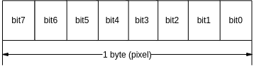
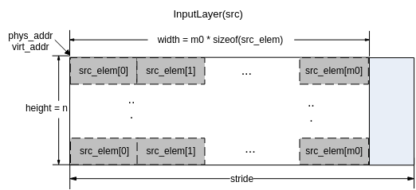
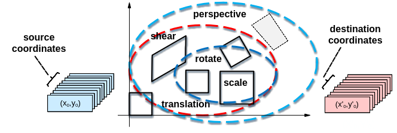
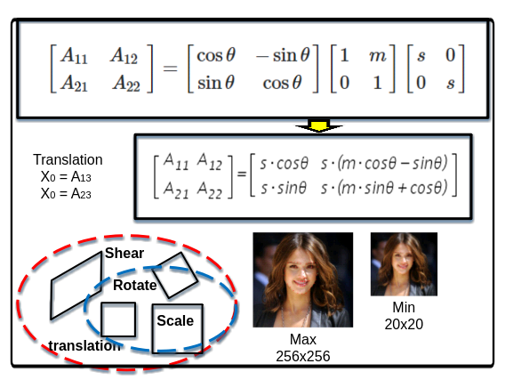
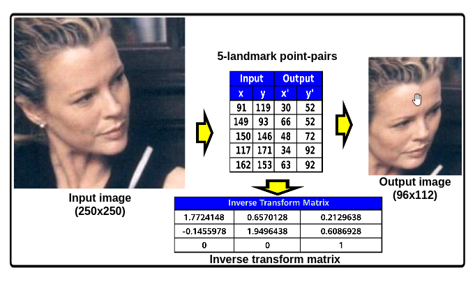
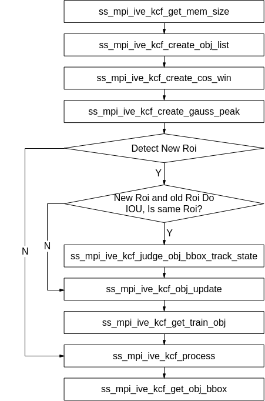
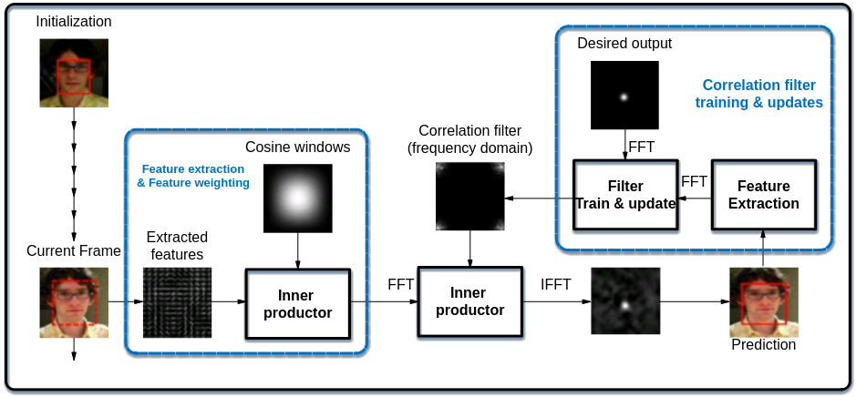
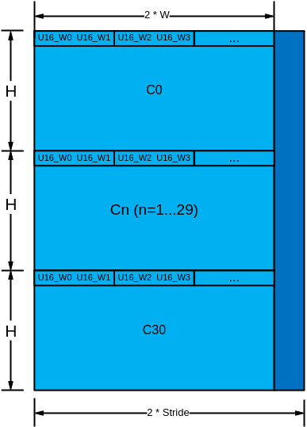
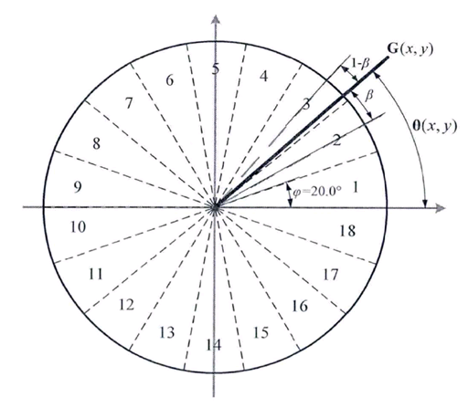

# 前言<a name="ZH-CN_TOPIC_0000002474400196"></a>

**概述<a name="section4537382116410"></a>**

本文档为使用媒体处理芯片的IVE协处理器进行_识别_分析方案开发的程序员而写，目的是供您在开发过程中查阅IVE协处理器支持的各种参考信息，包括API、头文件、错误码、Proc信息等。

> **说明：** 
>本文未有特殊说明，SS927V100与Hi3403V100内容完全一致。

**产品版本<a name="section155321452151615"></a>**

与本文档相对应的产品版本如下。

<a name="table10537205211163"></a>
<table><thead align="left"><tr id="row16570155221618"><th class="cellrowborder" valign="top" width="31.759999999999998%" id="mcps1.1.3.1.1"><p id="p6570452161616"><a name="p6570452161616"></a><a name="p6570452161616"></a>产品名称</p>
</th>
<th class="cellrowborder" valign="top" width="68.24%" id="mcps1.1.3.1.2"><p id="p1157017526160"><a name="p1157017526160"></a><a name="p1157017526160"></a>产品版本</p>
</th>
</tr>
</thead>
<tbody><tr id="row105711852151613"><td class="cellrowborder" valign="top" width="31.759999999999998%" headers="mcps1.1.3.1.1 "><p id="p125711852121615"><a name="p125711852121615"></a><a name="p125711852121615"></a>Hi3403V100</p>
</td>
<td class="cellrowborder" valign="top" width="68.24%" headers="mcps1.1.3.1.2 "><p id="p1557185217161"><a name="p1557185217161"></a><a name="p1557185217161"></a>V100</p>
</td>
</tr>
</tbody>
</table>

**读者对象<a name="section4378592816410"></a>**

本文档（本指南）主要适用于以下工程师：

-   技术支持工程师
-   软件开发工程师

**符号约定<a name="section133020216410"></a>**

在本文中可能出现下列标志，它们所代表的含义如下。

<a name="table2622507016410"></a>
<table><thead align="left"><tr id="row1530720816410"><th class="cellrowborder" valign="top" width="20.580000000000002%" id="mcps1.1.3.1.1"><p id="p6450074116410"><a name="p6450074116410"></a><a name="p6450074116410"></a><strong id="b2136615816410"><a name="b2136615816410"></a><a name="b2136615816410"></a>符号</strong></p>
</th>
<th class="cellrowborder" valign="top" width="79.42%" id="mcps1.1.3.1.2"><p id="p5435366816410"><a name="p5435366816410"></a><a name="p5435366816410"></a><strong id="b5941558116410"><a name="b5941558116410"></a><a name="b5941558116410"></a>说明</strong></p>
</th>
</tr>
</thead>
<tbody><tr id="row1372280416410"><td class="cellrowborder" valign="top" width="20.580000000000002%" headers="mcps1.1.3.1.1 "><p id="p3734547016410"><a name="p3734547016410"></a><a name="p3734547016410"></a><a name="image2670064316410"></a><a name="image2670064316410"></a><span></span></p>
</td>
<td class="cellrowborder" valign="top" width="79.42%" headers="mcps1.1.3.1.2 "><p id="p1757432116410"><a name="p1757432116410"></a><a name="p1757432116410"></a>表示如不避免则将会导致死亡或严重伤害的具有高等级风险的危害。</p>
</td>
</tr>

</tbody>
</table>

【需求】

-   头文件：ot\_common\_ive.h、ot\_common\_svp.h、ss\_mpi\_ive.h
-   库文件：libss\_ive.a（PC上模拟用ss\_ive\_clib2.x.lib）

【注意】

背景梯度图像和当前梯度图像的类型为S8C2\_PACKAGE，水平和竖直方向梯度按照格式存储。

【举例】

无。

【相关主题】

-   ss\_mpi\_ive\_match\_bg\_model
-   ss\_mpi\_ive\_update\_bg\_model
-   ss\_mpi\_ive\_gmm

## ss\_mpi\_ive\_match\_bg\_model<a name="ZH-CN_TOPIC_0000002470931334"></a>

【描述】

基于Codebook演进的背景模型匹配。

【语法】

```
td_s32 ss_mpi_ive_match_bg_model(ot_ive_handle *handle, const ot_svp_src_img *cur_img, const ot_svp_data *bg_model, const ot_svp_img *fg_flag, const ot_svp_dst_img *bg_diff_fg, const ot_svp_dst_img *frm_diff_fg, const ot_svp_dst_mem_info *state_data, const ot_ive_match_bg_model_ctrl *ctrl, td_bool is_instant);
```

【参数】

<a name="table11018mcpsimp"></a>
<table><thead align="left"><tr id="row11024mcpsimp"><th class="cellrowborder" valign="top" width="28.28%" id="mcps1.1.4.1.1"><p id="p11026mcpsimp"><a name="p11026mcpsimp"></a><a name="p11026mcpsimp"></a>参数名称</p>
</th>
<th class="cellrowborder" valign="top" width="50.51%" id="mcps1.1.4.1.2"><p id="p11028mcpsimp"><a name="p11028mcpsimp"></a><a name="p11028mcpsimp"></a>描述</p>
</th>
<th class="cellrowborder" valign="top" width="21.21%" id="mcps1.1.4.1.3"><p id="p11030mcpsimp"><a name="p11030mcpsimp"></a><a name="p11030mcpsimp"></a>输入/输出</p>
</th>
</tr>
</thead>
<tbody><tr id="row11032mcpsimp"><td class="cellrowborder" valign="top" width="28.28%" headers="mcps1.1.4.1.1 "><p id="p11034mcpsimp"><a name="p11034mcpsimp"></a><a name="p11034mcpsimp"></a>handle</p>
</td>
<td class="cellrowborder" valign="top" width="50.51%" headers="mcps1.1.4.1.2 "><p id="p11036mcpsimp"><a name="p11036mcpsimp"></a><a name="p11036mcpsimp"></a>handle指针。</p>
<p id="p11037mcpsimp"><a name="p11037mcpsimp"></a><a name="p11037mcpsimp"></a>不能为空。</p>
</td>
<td class="cellrowborder" valign="top" width="21.21%" headers="mcps1.1.4.1.3 "><p id="p11039mcpsimp"><a name="p11039mcpsimp"></a><a name="p11039mcpsimp"></a>输出</p>
</td>
</tr>
<tr id="row11040mcpsimp"><td class="cellrowborder" valign="top" width="28.28%" headers="mcps1.1.4.1.1 "><p id="p11042mcpsimp"><a name="p11042mcpsimp"></a><a name="p11042mcpsimp"></a>cur_img</p>
</td>
<td class="cellrowborder" valign="top" width="50.51%" headers="mcps1.1.4.1.2 "><p id="p11044mcpsimp"><a name="p11044mcpsimp"></a><a name="p11044mcpsimp"></a>当前帧灰度图像指针。</p>
<p id="p11045mcpsimp"><a name="p11045mcpsimp"></a><a name="p11045mcpsimp"></a>不能为空。</p>
</td>
<td class="cellrowborder" valign="top" width="21.21%" headers="mcps1.1.4.1.3 "><p id="p11047mcpsimp"><a name="p11047mcpsimp"></a><a name="p11047mcpsimp"></a>输入</p>
</td>
</tr>
<tr id="row11048mcpsimp"><td class="cellrowborder" valign="top" width="28.28%" headers="mcps1.1.4.1.1 "><p id="p11050mcpsimp"><a name="p11050mcpsimp"></a><a name="p11050mcpsimp"></a>bg_model</p>
</td>
<td class="cellrowborder" valign="top" width="50.51%" headers="mcps1.1.4.1.2 "><p id="p11052mcpsimp"><a name="p11052mcpsimp"></a><a name="p11052mcpsimp"></a>背景模型数据指针。</p>
<p id="p11053mcpsimp"><a name="p11053mcpsimp"></a><a name="p11053mcpsimp"></a>不能为空。</p>
<p id="p11054mcpsimp"><a name="p11054mcpsimp"></a><a name="p11054mcpsimp"></a>高同cur_img，宽 = cur_img-&gt;width * sizeof(ot_ive_bg_model_pixel)。</p>
</td>
<td class="cellrowborder" valign="top" width="21.21%" headers="mcps1.1.4.1.3 "><p id="p11057mcpsimp"><a name="p11057mcpsimp"></a><a name="p11057mcpsimp"></a>输入、输出</p>
</td>
</tr>
<tr id="row11058mcpsimp"><td class="cellrowborder" valign="top" width="28.28%" headers="mcps1.1.4.1.1 "><p id="p11060mcpsimp"><a name="p11060mcpsimp"></a><a name="p11060mcpsimp"></a>fg_flag</p>
</td>
<td class="cellrowborder" valign="top" width="50.51%" headers="mcps1.1.4.1.2 "><p id="p11062mcpsimp"><a name="p11062mcpsimp"></a><a name="p11062mcpsimp"></a>前景状态图像指针。</p>
<p id="p11063mcpsimp"><a name="p11063mcpsimp"></a><a name="p11063mcpsimp"></a>不能为空。</p>
<p id="p11064mcpsimp"><a name="p11064mcpsimp"></a><a name="p11064mcpsimp"></a>高、宽同cur_img。</p>
</td>
<td class="cellrowborder" valign="top" width="21.21%" headers="mcps1.1.4.1.3 "><p id="p11066mcpsimp"><a name="p11066mcpsimp"></a><a name="p11066mcpsimp"></a>输入、输出</p>
</td>
</tr>
<tr id="row11067mcpsimp"><td class="cellrowborder" valign="top" width="28.28%" headers="mcps1.1.4.1.1 "><p id="p11069mcpsimp"><a name="p11069mcpsimp"></a><a name="p11069mcpsimp"></a>bg_diff_fg</p>
</td>
<td class="cellrowborder" valign="top" width="50.51%" headers="mcps1.1.4.1.2 "><p id="p11071mcpsimp"><a name="p11071mcpsimp"></a><a name="p11071mcpsimp"></a>背景差分前景图像指针。</p>
<p id="p11072mcpsimp"><a name="p11072mcpsimp"></a><a name="p11072mcpsimp"></a>不能为空。</p>
<p id="p11073mcpsimp"><a name="p11073mcpsimp"></a><a name="p11073mcpsimp"></a>高、宽同cur_img。</p>
</td>
<td class="cellrowborder" valign="top" width="21.21%" headers="mcps1.1.4.1.3 "><p id="p11075mcpsimp"><a name="p11075mcpsimp"></a><a name="p11075mcpsimp"></a>输出</p>
</td>
</tr>
<tr id="row11076mcpsimp"><td class="cellrowborder" valign="top" width="28.28%" headers="mcps1.1.4.1.1 "><p id="p11078mcpsimp"><a name="p11078mcpsimp"></a><a name="p11078mcpsimp"></a>frm_diff_fg</p>
</td>
<td class="cellrowborder" valign="top" width="50.51%" headers="mcps1.1.4.1.2 "><p id="p11080mcpsimp"><a name="p11080mcpsimp"></a><a name="p11080mcpsimp"></a>帧间差分前景图像指针；</p>
<p id="p11081mcpsimp"><a name="p11081mcpsimp"></a><a name="p11081mcpsimp"></a>不能为空。</p>
<p id="p11082mcpsimp"><a name="p11082mcpsimp"></a><a name="p11082mcpsimp"></a>高、宽同cur_img。</p>
</td>
<td class="cellrowborder" valign="top" width="21.21%" headers="mcps1.1.4.1.3 "><p id="p11084mcpsimp"><a name="p11084mcpsimp"></a><a name="p11084mcpsimp"></a>输出</p>
</td>
</tr>
<tr id="row11085mcpsimp"><td class="cellrowborder" valign="top" width="28.28%" headers="mcps1.1.4.1.1 "><p id="p11087mcpsimp"><a name="p11087mcpsimp"></a><a name="p11087mcpsimp"></a>state_data</p>
</td>
<td class="cellrowborder" valign="top" width="50.51%" headers="mcps1.1.4.1.2 "><p id="p11089mcpsimp"><a name="p11089mcpsimp"></a><a name="p11089mcpsimp"></a>前景状态数据指针。</p>
<p id="p11090mcpsimp"><a name="p11090mcpsimp"></a><a name="p11090mcpsimp"></a>不能为空。</p>
<p id="p11091mcpsimp"><a name="p11091mcpsimp"></a><a name="p11091mcpsimp"></a>内存至少需配置sizeof(ot_ive_fg_status_data)。</p>
</td>
<td class="cellrowborder" valign="top" width="21.21%" headers="mcps1.1.4.1.3 "><p id="p11095mcpsimp"><a name="p11095mcpsimp"></a><a name="p11095mcpsimp"></a>输出</p>
</td>
</tr>
<tr id="row11096mcpsimp"><td class="cellrowborder" valign="top" width="28.28%" headers="mcps1.1.4.1.1 "><p id="p11098mcpsimp"><a name="p11098mcpsimp"></a><a name="p11098mcpsimp"></a>ctrl</p>
</td>
<td class="cellrowborder" valign="top" width="50.51%" headers="mcps1.1.4.1.2 "><p id="p11100mcpsimp"><a name="p11100mcpsimp"></a><a name="p11100mcpsimp"></a>控制参数指针。</p>
<p id="p11101mcpsimp"><a name="p11101mcpsimp"></a><a name="p11101mcpsimp"></a>不能为空。</p>
</td>
<td class="cellrowborder" valign="top" width="21.21%" headers="mcps1.1.4.1.3 "><p id="p11103mcpsimp"><a name="p11103mcpsimp"></a><a name="p11103mcpsimp"></a>输入</p>
</td>
</tr>
<tr id="row11104mcpsimp"><td class="cellrowborder" valign="top" width="28.28%" headers="mcps1.1.4.1.1 "><p id="p11106mcpsimp"><a name="p11106mcpsimp"></a><a name="p11106mcpsimp"></a>is_instant</p>
</td>
<td class="cellrowborder" valign="top" width="50.51%" headers="mcps1.1.4.1.2 "><p id="p11108mcpsimp"><a name="p11108mcpsimp"></a><a name="p11108mcpsimp"></a>及时返回结果标志。</p>
</td>
<td class="cellrowborder" valign="top" width="21.21%" headers="mcps1.1.4.1.3 "><p id="p11110mcpsimp"><a name="p11110mcpsimp"></a><a name="p11110mcpsimp"></a>输入</p>
</td>
</tr>
</tbody>
</table>

【返回值】

<a name="table11112mcpsimp"></a>
<table><thead align="left"><tr id="row11117mcpsimp"><th class="cellrowborder" valign="top" width="50%" id="mcps1.1.3.1.1"><p id="p11119mcpsimp"><a name="p11119mcpsimp"></a><a name="p11119mcpsimp"></a>返回值</p>
</th>
<th class="cellrowborder" valign="top" width="50%" id="mcps1.1.3.1.2"><p id="p11121mcpsimp"><a name="p11121mcpsimp"></a><a name="p11121mcpsimp"></a>描述</p>
</th>
</tr>
</thead>
<tbody><tr id="row11123mcpsimp"><td class="cellrowborder" valign="top" width="50%" headers="mcps1.1.3.1.1 "><p id="p11125mcpsimp"><a name="p11125mcpsimp"></a><a name="p11125mcpsimp"></a>0</p>
</td>
<td class="cellrowborder" valign="top" width="50%" headers="mcps1.1.3.1.2 "><p id="p11127mcpsimp"><a name="p11127mcpsimp"></a><a name="p11127mcpsimp"></a>成功。</p>
</td>
</tr>
<tr id="row11128mcpsimp"><td class="cellrowborder" valign="top" width="50%" headers="mcps1.1.3.1.1 "><p id="p11130mcpsimp"><a name="p11130mcpsimp"></a><a name="p11130mcpsimp"></a>非0</p>
</td>
<td class="cellrowborder" valign="top" width="50%" headers="mcps1.1.3.1.2 "><p id="p11132mcpsimp"><a name="p11132mcpsimp"></a><a name="p11132mcpsimp"></a>失败，参见<span xml:lang="fr-FR" id="ph136311818172213"><a name="ph136311818172213"></a><a name="ph136311818172213"></a>错误码</span><span xml:lang="fr-FR" id="ph5283mcpsimp"><a name="ph5283mcpsimp"></a><a name="ph5283mcpsimp"></a>。</span></p>
</td>
</tr>
</tbody>
</table>

【解决方案差异】

<a name="table11137mcpsimp"></a>
<table><thead align="left"><tr id="row11142mcpsimp"><th class="cellrowborder" valign="top" width="32%" id="mcps1.1.3.1.1"><p id="p11144mcpsimp"><a name="p11144mcpsimp"></a><a name="p11144mcpsimp"></a>解决方案名称</p>
</th>
<th class="cellrowborder" valign="top" width="68%" id="mcps1.1.3.1.2"><p id="p11146mcpsimp"><a name="p11146mcpsimp"></a><a name="p11146mcpsimp"></a>差异</p>
</th>
</tr>
</thead>
<tbody><tr id="row11168mcpsimp"><td class="cellrowborder" valign="top" width="32%" headers="mcps1.1.3.1.1 "><p id="p11170mcpsimp"><a name="p11170mcpsimp"></a><a name="p11170mcpsimp"></a>Hi3403V100</p>
</td>
<td class="cellrowborder" valign="top" width="68%" headers="mcps1.1.3.1.2 "><p id="p11172mcpsimp"><a name="p11172mcpsimp"></a><a name="p11172mcpsimp"></a>不支持</p>
</td>
</tr>
</tbody>
</table>

【需求】

-   头文件：ot\_common\_ive.h、ot\_common\_svp.h、ss\_mpi\_ive.h
-   库文件：libss\_ive.a（PC上模拟用ss\_ive\_clib2.x.lib）

【注意】

-   要求fg\_flag、bg\_diff\_fg、frm\_diff\_fg跨度一致。

    背景模型数据bg\_model中每个像素以ot\_ive\_bg\_model\_pixel\(24字节\)表示，即model-\>width = sizeof\(ot\_ive\_bg\_model\_pixel\) \* src-\>width，model-\>height = src-\>height，至少需要分配内存大小为（sizeof\(ot\_ive\_bg\_model\_pixel\) \* src-\>width + \(16 - \(sizeof\(ot\_ive\_bg\_model\_pixel\) \* src-\>width % 16\) % 16）\* model-\>height。

-   前景状态图像fg\_flag为U8C1类型，其各比特位表示不同的状态信息，单个像素各比特位示意图如[图1](#fig186216130171)，按从右到左由低位到高位的顺序排布：

**图 1**  前景状态标志图形单个像素各比特位示意图<a name="fig186216130171"></a>  


其各个比特位表示的含义如下：

-   比特位只用到bit0、bit1、bit2、bit5、bit6；其中bit0、bit1、bit2是由本算子计算作为输出，bit5、bit6是由外部函数计算作为输入。
-   bit1为1时表示像素为前景；
-   bit1为1且bit0为1时表示像素为运动前景；
-   bit1为1且bit0为0时表示像素为变化前景；
-   bit2为1时表示像素的背景模型处于工作状态；
-   bit5和bit6表示外部函数对前景状态的反馈，bit5为1时表示前景像素需要短时间保持，bit6为1时表示前景像素需要长时间保持。

【举例】

无。

【相关主题】

-   ss\_mpi\_ive\_update\_bg\_model
-   ss\_mpi\_ive\_grad\_fg
-   ss\_mpi\_ive\_gmm

## ss\_mpi\_ive\_update\_bg\_model<a name="ZH-CN_TOPIC_0000002504091095"></a>

【描述】

基于Codebook演进的背景模型更新，对背景模型的内部状态进行更新。

【语法】

```
td_s32 ss_mpi_ive_update_bg_model(ot_ive_handle *handle, const ot_svp_data *bg_model, const ot_svp_img *fg_flag, const ot_svp_dst_img *bg_img, const ot_svp_dst_img *chg_status_img, const ot_svp_dst_img *chg_status_fg, const  ot_svp_dst_img *chg_status_life, const ot_svp_dst_mem_info *state_data, const ot_ive_update_bg_model_ctrl *ctrl, td_bool is_instant);
```

【参数】

<a name="table502mcpsimp"></a>
<table><thead align="left"><tr id="row508mcpsimp"><th class="cellrowborder" valign="top" width="31.313131313131308%" id="mcps1.1.4.1.1"><p id="p510mcpsimp"><a name="p510mcpsimp"></a><a name="p510mcpsimp"></a>参数名称</p>
</th>
<th class="cellrowborder" valign="top" width="45.45454545454545%" id="mcps1.1.4.1.2"><p id="p512mcpsimp"><a name="p512mcpsimp"></a><a name="p512mcpsimp"></a>描述</p>
</th>
<th class="cellrowborder" valign="top" width="23.232323232323232%" id="mcps1.1.4.1.3"><p id="p514mcpsimp"><a name="p514mcpsimp"></a><a name="p514mcpsimp"></a>输入/输出</p>
</th>
</tr>
</thead>
<tbody><tr id="row516mcpsimp"><td class="cellrowborder" valign="top" width="31.313131313131308%" headers="mcps1.1.4.1.1 "><p id="p518mcpsimp"><a name="p518mcpsimp"></a><a name="p518mcpsimp"></a>handle</p>
</td>
<td class="cellrowborder" valign="top" width="45.45454545454545%" headers="mcps1.1.4.1.2 "><p id="p520mcpsimp"><a name="p520mcpsimp"></a><a name="p520mcpsimp"></a>handle指针。</p>
<p id="p521mcpsimp"><a name="p521mcpsimp"></a><a name="p521mcpsimp"></a>不能为空。</p>
</td>
<td class="cellrowborder" valign="top" width="23.232323232323232%" headers="mcps1.1.4.1.3 "><p id="p523mcpsimp"><a name="p523mcpsimp"></a><a name="p523mcpsimp"></a>输出</p>
</td>
</tr>
<tr id="row524mcpsimp"><td class="cellrowborder" valign="top" width="31.313131313131308%" headers="mcps1.1.4.1.1 "><p id="p526mcpsimp"><a name="p526mcpsimp"></a><a name="p526mcpsimp"></a>bg_model</p>
</td>
<td class="cellrowborder" valign="top" width="45.45454545454545%" headers="mcps1.1.4.1.2 "><p id="p528mcpsimp"><a name="p528mcpsimp"></a><a name="p528mcpsimp"></a>背景模型数据指针。</p>
<p id="p529mcpsimp"><a name="p529mcpsimp"></a><a name="p529mcpsimp"></a>不能为空。</p>
</td>
<td class="cellrowborder" valign="top" width="23.232323232323232%" headers="mcps1.1.4.1.3 "><p id="p531mcpsimp"><a name="p531mcpsimp"></a><a name="p531mcpsimp"></a>输入/输出</p>
</td>
</tr>
<tr id="row532mcpsimp"><td class="cellrowborder" valign="top" width="31.313131313131308%" headers="mcps1.1.4.1.1 "><p id="p534mcpsimp"><a name="p534mcpsimp"></a><a name="p534mcpsimp"></a>fg_flag</p>
</td>
<td class="cellrowborder" valign="top" width="45.45454545454545%" headers="mcps1.1.4.1.2 "><p id="p536mcpsimp"><a name="p536mcpsimp"></a><a name="p536mcpsimp"></a>前景状态图像指针。</p>
<p id="p537mcpsimp"><a name="p537mcpsimp"></a><a name="p537mcpsimp"></a>不能为空。</p>
</td>
<td class="cellrowborder" valign="top" width="23.232323232323232%" headers="mcps1.1.4.1.3 "><p id="p539mcpsimp"><a name="p539mcpsimp"></a><a name="p539mcpsimp"></a>输入/输出</p>
</td>
</tr>
<tr id="row540mcpsimp"><td class="cellrowborder" valign="top" width="31.313131313131308%" headers="mcps1.1.4.1.1 "><p id="p542mcpsimp"><a name="p542mcpsimp"></a><a name="p542mcpsimp"></a>bg_img</p>
</td>
<td class="cellrowborder" valign="top" width="45.45454545454545%" headers="mcps1.1.4.1.2 "><p id="p544mcpsimp"><a name="p544mcpsimp"></a><a name="p544mcpsimp"></a>背景灰度图像指针。</p>
<p id="p545mcpsimp"><a name="p545mcpsimp"></a><a name="p545mcpsimp"></a>不能为空。</p>
<p id="p546mcpsimp"><a name="p546mcpsimp"></a><a name="p546mcpsimp"></a>高、宽同fg_flag。</p>
</td>
<td class="cellrowborder" valign="top" width="23.232323232323232%" headers="mcps1.1.4.1.3 "><p id="p548mcpsimp"><a name="p548mcpsimp"></a><a name="p548mcpsimp"></a>输出</p>
</td>
</tr>
<tr id="row549mcpsimp"><td class="cellrowborder" valign="top" width="31.313131313131308%" headers="mcps1.1.4.1.1 "><p id="p551mcpsimp"><a name="p551mcpsimp"></a><a name="p551mcpsimp"></a>chg_status_img</p>
</td>
<td class="cellrowborder" valign="top" width="45.45454545454545%" headers="mcps1.1.4.1.2 "><p id="p553mcpsimp"><a name="p553mcpsimp"></a><a name="p553mcpsimp"></a>变化状态灰度图像指针。</p>
<p id="p554mcpsimp"><a name="p554mcpsimp"></a><a name="p554mcpsimp"></a>当ctrl-&gt;det_chg_rgn为0时，可以为空。</p>
<p id="p555mcpsimp"><a name="p555mcpsimp"></a><a name="p555mcpsimp"></a>高、宽同fg_flag。</p>
</td>
<td class="cellrowborder" valign="top" width="23.232323232323232%" headers="mcps1.1.4.1.3 "><p id="p557mcpsimp"><a name="p557mcpsimp"></a><a name="p557mcpsimp"></a>输出</p>
</td>
</tr>
<tr id="row558mcpsimp"><td class="cellrowborder" valign="top" width="31.313131313131308%" headers="mcps1.1.4.1.1 "><p id="p560mcpsimp"><a name="p560mcpsimp"></a><a name="p560mcpsimp"></a>chg_status_fg</p>
</td>
<td class="cellrowborder" valign="top" width="45.45454545454545%" headers="mcps1.1.4.1.2 "><p id="p562mcpsimp"><a name="p562mcpsimp"></a><a name="p562mcpsimp"></a>变化状态前景图像指针。</p>
<p id="p563mcpsimp"><a name="p563mcpsimp"></a><a name="p563mcpsimp"></a>当ctrl-&gt;det_chg_rgn为0时，可以为空。</p>
<p id="p564mcpsimp"><a name="p564mcpsimp"></a><a name="p564mcpsimp"></a>高、宽同fg_flag。</p>
</td>
<td class="cellrowborder" valign="top" width="23.232323232323232%" headers="mcps1.1.4.1.3 "><p id="p566mcpsimp"><a name="p566mcpsimp"></a><a name="p566mcpsimp"></a>输出</p>
</td>
</tr>
<tr id="row567mcpsimp"><td class="cellrowborder" valign="top" width="31.313131313131308%" headers="mcps1.1.4.1.1 "><p id="p569mcpsimp"><a name="p569mcpsimp"></a><a name="p569mcpsimp"></a>chg_status_life</p>
</td>
<td class="cellrowborder" valign="top" width="45.45454545454545%" headers="mcps1.1.4.1.2 "><p id="p571mcpsimp"><a name="p571mcpsimp"></a><a name="p571mcpsimp"></a>变化状态像素的生命时间图像指针。</p>
<p id="p572mcpsimp"><a name="p572mcpsimp"></a><a name="p572mcpsimp"></a>当ctrl-&gt;det_chg_rgn为0时，可以为空。</p>
<p id="p573mcpsimp"><a name="p573mcpsimp"></a><a name="p573mcpsimp"></a>高、宽同fg_flag。</p>
</td>
<td class="cellrowborder" valign="top" width="23.232323232323232%" headers="mcps1.1.4.1.3 "><p id="p575mcpsimp"><a name="p575mcpsimp"></a><a name="p575mcpsimp"></a>输出</p>
</td>
</tr>
<tr id="row576mcpsimp"><td class="cellrowborder" valign="top" width="31.313131313131308%" headers="mcps1.1.4.1.1 "><p id="p578mcpsimp"><a name="p578mcpsimp"></a><a name="p578mcpsimp"></a>state_data</p>
</td>
<td class="cellrowborder" valign="top" width="45.45454545454545%" headers="mcps1.1.4.1.2 "><p id="p580mcpsimp"><a name="p580mcpsimp"></a><a name="p580mcpsimp"></a>背景状态数据指针。</p>
<p id="p581mcpsimp"><a name="p581mcpsimp"></a><a name="p581mcpsimp"></a>不能为空。</p>
<p id="p582mcpsimp"><a name="p582mcpsimp"></a><a name="p582mcpsimp"></a>内存至少需配置sizeof(ot_ive_bg_status_data)。</p>
<p id="p584mcpsimp"><a name="p584mcpsimp"></a><a name="p584mcpsimp"></a>具体描述请参见《SVPx.0 API 参考》</p>
</td>
<td class="cellrowborder" valign="top" width="23.232323232323232%" headers="mcps1.1.4.1.3 "><p id="p586mcpsimp"><a name="p586mcpsimp"></a><a name="p586mcpsimp"></a>输出</p>
</td>
</tr>
<tr id="row587mcpsimp"><td class="cellrowborder" valign="top" width="31.313131313131308%" headers="mcps1.1.4.1.1 "><p id="p589mcpsimp"><a name="p589mcpsimp"></a><a name="p589mcpsimp"></a>ctrl</p>
</td>
<td class="cellrowborder" valign="top" width="45.45454545454545%" headers="mcps1.1.4.1.2 "><p id="p591mcpsimp"><a name="p591mcpsimp"></a><a name="p591mcpsimp"></a>控制参数指针。</p>
<p id="p592mcpsimp"><a name="p592mcpsimp"></a><a name="p592mcpsimp"></a>不能为空。</p>
</td>
<td class="cellrowborder" valign="top" width="23.232323232323232%" headers="mcps1.1.4.1.3 "><p id="p594mcpsimp"><a name="p594mcpsimp"></a><a name="p594mcpsimp"></a>输入</p>
</td>
</tr>
<tr id="row595mcpsimp"><td class="cellrowborder" valign="top" width="31.313131313131308%" headers="mcps1.1.4.1.1 "><p id="p597mcpsimp"><a name="p597mcpsimp"></a><a name="p597mcpsimp"></a>is_instant</p>
</td>
<td class="cellrowborder" valign="top" width="45.45454545454545%" headers="mcps1.1.4.1.2 "><p id="p599mcpsimp"><a name="p599mcpsimp"></a><a name="p599mcpsimp"></a>及时返回结果标志。</p>
</td>
<td class="cellrowborder" valign="top" width="23.232323232323232%" headers="mcps1.1.4.1.3 "><p id="p601mcpsimp"><a name="p601mcpsimp"></a><a name="p601mcpsimp"></a>输入</p>
</td>
</tr>
</tbody>
</table>

【返回值】

<a name="table603mcpsimp"></a>
<table><thead align="left"><tr id="row608mcpsimp"><th class="cellrowborder" valign="top" width="50%" id="mcps1.1.3.1.1"><p id="p610mcpsimp"><a name="p610mcpsimp"></a><a name="p610mcpsimp"></a>返回值</p>
</th>
<th class="cellrowborder" valign="top" width="50%" id="mcps1.1.3.1.2"><p id="p612mcpsimp"><a name="p612mcpsimp"></a><a name="p612mcpsimp"></a>描述</p>
</th>
</tr>
</thead>
<tbody><tr id="row614mcpsimp"><td class="cellrowborder" valign="top" width="50%" headers="mcps1.1.3.1.1 "><p id="p616mcpsimp"><a name="p616mcpsimp"></a><a name="p616mcpsimp"></a>0</p>
</td>
<td class="cellrowborder" valign="top" width="50%" headers="mcps1.1.3.1.2 "><p id="p618mcpsimp"><a name="p618mcpsimp"></a><a name="p618mcpsimp"></a>成功。</p>
</td>
</tr>
<tr id="row619mcpsimp"><td class="cellrowborder" valign="top" width="50%" headers="mcps1.1.3.1.1 "><p id="p621mcpsimp"><a name="p621mcpsimp"></a><a name="p621mcpsimp"></a>非0</p>
</td>
<td class="cellrowborder" valign="top" width="50%" headers="mcps1.1.3.1.2 "><p id="p7404mcpsimp"><a name="p7404mcpsimp"></a><a name="p7404mcpsimp"></a>失败，参见<span xml:lang="fr-FR" id="ph136311818172213"><a name="ph136311818172213"></a><a name="ph136311818172213"></a>错误码</span><span xml:lang="fr-FR" id="ph5283mcpsimp"><a name="ph5283mcpsimp"></a><a name="ph5283mcpsimp"></a>。</span></p>
</td>
</tr>
</tbody>
</table>

【解决方案差异】

<a name="table628mcpsimp"></a>
<table><thead align="left"><tr id="row633mcpsimp"><th class="cellrowborder" valign="top" width="27%" id="mcps1.1.3.1.1"><p id="p635mcpsimp"><a name="p635mcpsimp"></a><a name="p635mcpsimp"></a>解决方案名称</p>
</th>
<th class="cellrowborder" valign="top" width="73%" id="mcps1.1.3.1.2"><p id="p637mcpsimp"><a name="p637mcpsimp"></a><a name="p637mcpsimp"></a>差异</p>
</th>
</tr>
</thead>
<tbody><tr id="row659mcpsimp"><td class="cellrowborder" valign="top" width="27%" headers="mcps1.1.3.1.1 "><p id="p661mcpsimp"><a name="p661mcpsimp"></a><a name="p661mcpsimp"></a>Hi3403V100</p>
</td>
<td class="cellrowborder" valign="top" width="73%" headers="mcps1.1.3.1.2 "><p id="p663mcpsimp"><a name="p663mcpsimp"></a><a name="p663mcpsimp"></a>不支持</p>
</td>
</tr>
</tbody>
</table>

【需求】

-   头文件：ot\_common\_ive.h、ot\_common\_svp.h、ss\_mpi\_ive.h
-   库文件：libss\_ive.a（PC上模拟用ss\_ive\_clib2.x.lib）

【注意】

-   要求fg\_flag、bg\_img、chg\_status\_img（不为空时）、chg\_status\_fg（不为空时）跨度一致。
-   背景模型数据model参考`ss_mpi_ive_match_bg_model`中的说明。
-   chg\_status\_fg表示变化状态前景图像，其中像素非0表示前景，否则表示背景。
-   chg\_status\_life表示变化状态前景像素的生命时间图像，其像素值表示变化前景的持续时间。
-   变化状态指像素值发生变化而成为前景，并且变化后的像素值较长时间都保持稳定的状态，这一般是由静止遗留物或者静止移走物在图像中产生。

【举例】

无。

【相关主题】

-   ss\_mpi\_ive\_match\_bg\_model
-   ss\_mpi\_ive\_grad\_fg
-   ss\_mpi\_ive\_gmm

## ss\_mpi\_ive\_ann\_mlp\_load\_model<a name="ZH-CN_TOPIC_0000002504091075"></a>

【描述】

读取ann\_mlp模型文件，初始化模型数据。

【语法】

```
td_s32 ss_mpi_ive_ann_mlp_load_model(const td_char *file_name, ot_ive_ann_mlp_model *model)
```

【参数】

<a name="table11401mcpsimp"></a>
<table><thead align="left"><tr id="row11407mcpsimp"><th class="cellrowborder" valign="top" width="25%" id="mcps1.1.4.1.1"><p id="p11409mcpsimp"><a name="p11409mcpsimp"></a><a name="p11409mcpsimp"></a>参数名称</p>
</th>
<th class="cellrowborder" valign="top" width="56.99999999999999%" id="mcps1.1.4.1.2"><p id="p11411mcpsimp"><a name="p11411mcpsimp"></a><a name="p11411mcpsimp"></a>描述</p>
</th>
<th class="cellrowborder" valign="top" width="18%" id="mcps1.1.4.1.3"><p id="p11413mcpsimp"><a name="p11413mcpsimp"></a><a name="p11413mcpsimp"></a>输入/输出</p>
</th>
</tr>
</thead>
<tbody><tr id="row11415mcpsimp"><td class="cellrowborder" valign="top" width="25%" headers="mcps1.1.4.1.1 "><p id="p11417mcpsimp"><a name="p11417mcpsimp"></a><a name="p11417mcpsimp"></a>file_name</p>
</td>
<td class="cellrowborder" valign="top" width="56.99999999999999%" headers="mcps1.1.4.1.2 "><p id="p11419mcpsimp"><a name="p11419mcpsimp"></a><a name="p11419mcpsimp"></a>模型文件路径及文件名。</p>
<p id="p11420mcpsimp"><a name="p11420mcpsimp"></a><a name="p11420mcpsimp"></a>不能为空。</p>
</td>
<td class="cellrowborder" valign="top" width="18%" headers="mcps1.1.4.1.3 "><p id="p11422mcpsimp"><a name="p11422mcpsimp"></a><a name="p11422mcpsimp"></a>输入</p>
</td>
</tr>

</tbody>
</table>

【需求】

-   头文件：ot\_common\_ive.h、ot\_common\_svp.h、ss\_mpi\_ive.h
-   库文件：libss\_ive.a（PC上模拟用ss\_ive\_clib2.x.lib）

【注意】

该接口必须和`ss_mpi_ive_ann_mlp_load_model`配套使用。

【举例】

无。

【相关主题】

-   ss\_mpi\_ive\_ann\_mlp\_load\_model
-   ss\_mpi\_ive\_ann\_mlp\_predict

## ss\_mpi\_ive\_ann\_mlp\_predict<a name="ZH-CN_TOPIC_0000002471091294"></a>

【描述】

创建同一模型多个样本ann\_mlp预测任务。

【语法】

```
td_s32 ss_mpi_ive_ann_mlp_predict(ot_ive_handle *handle, const ot_svp_src_data *src, const ot_svp_lut *actv_func_table, const ot_ive_ann_mlp_model *model, const ot_svp_dst_data *dst, td_bool is_instant);
```

【参数】

<a name="table9862mcpsimp"></a>
<table><thead align="left"><tr id="row9868mcpsimp"><th class="cellrowborder" valign="top" width="25%" id="mcps1.1.4.1.1"><p id="p9870mcpsimp"><a name="p9870mcpsimp"></a><a name="p9870mcpsimp"></a>参数名称</p>
</th>
<th class="cellrowborder" valign="top" width="56.99999999999999%" id="mcps1.1.4.1.2"><p id="p9872mcpsimp"><a name="p9872mcpsimp"></a><a name="p9872mcpsimp"></a>描述</p>
</th>
<th class="cellrowborder" valign="top" width="18%" id="mcps1.1.4.1.3"><p id="p9874mcpsimp"><a name="p9874mcpsimp"></a><a name="p9874mcpsimp"></a>输入/输出</p>
</th>
</tr>
</thead>
<tbody><tr id="row9876mcpsimp"><td class="cellrowborder" valign="top" width="25%" headers="mcps1.1.4.1.1 "><p id="p9878mcpsimp"><a name="p9878mcpsimp"></a><a name="p9878mcpsimp"></a>handle</p>
</td>
<td class="cellrowborder" valign="top" width="56.99999999999999%" headers="mcps1.1.4.1.2 "><p id="p9880mcpsimp"><a name="p9880mcpsimp"></a><a name="p9880mcpsimp"></a>handle指针。</p>
<p id="p9881mcpsimp"><a name="p9881mcpsimp"></a><a name="p9881mcpsimp"></a>不能为空。</p>
</td>
<td class="cellrowborder" valign="top" width="18%" headers="mcps1.1.4.1.3 "><p id="p9883mcpsimp"><a name="p9883mcpsimp"></a><a name="p9883mcpsimp"></a>输出</p>
</td>
</tr>
<tr id="row9884mcpsimp"><td class="cellrowborder" valign="top" width="25%" headers="mcps1.1.4.1.1 "><p id="p9886mcpsimp"><a name="p9886mcpsimp"></a><a name="p9886mcpsimp"></a>src</p>
</td>
<td class="cellrowborder" valign="top" width="56.99999999999999%" headers="mcps1.1.4.1.2 "><p id="p9888mcpsimp"><a name="p9888mcpsimp"></a><a name="p9888mcpsimp"></a>输入样本向量（特征向量）数组指针。</p>
<p id="p9889mcpsimp"><a name="p9889mcpsimp"></a><a name="p9889mcpsimp"></a>不能为空。</p>
<p id="p9890mcpsimp"><a name="p9890mcpsimp"></a><a name="p9890mcpsimp"></a>宽为样本向量维数 * sizeof(td_s32)。</p>
<p id="p9891mcpsimp"><a name="p9891mcpsimp"></a><a name="p9891mcpsimp"></a>高为向量个数。</p>
<p id="p9892mcpsimp"><a name="p9892mcpsimp"></a><a name="p9892mcpsimp"></a>不能为空。</p>
</td>
<td class="cellrowborder" valign="top" width="18%" headers="mcps1.1.4.1.3 "><p id="p9894mcpsimp"><a name="p9894mcpsimp"></a><a name="p9894mcpsimp"></a>输入</p>
</td>
</tr>
<tr id="row9895mcpsimp"><td class="cellrowborder" valign="top" width="25%" headers="mcps1.1.4.1.1 "><p id="p9897mcpsimp"><a name="p9897mcpsimp"></a><a name="p9897mcpsimp"></a>actv_func_table</p>
</td>
<td class="cellrowborder" valign="top" width="56.99999999999999%" headers="mcps1.1.4.1.2 "><p id="p9899mcpsimp"><a name="p9899mcpsimp"></a><a name="p9899mcpsimp"></a>用于激活函数计算的查找表信息指针。</p>
<p id="p9900mcpsimp"><a name="p9900mcpsimp"></a><a name="p9900mcpsimp"></a>不能为空。</p>
</td>
<td class="cellrowborder" valign="top" width="18%" headers="mcps1.1.4.1.3 "><p id="p9902mcpsimp"><a name="p9902mcpsimp"></a><a name="p9902mcpsimp"></a>输入</p>
</td>
</tr>
<tr id="row9903mcpsimp"><td class="cellrowborder" valign="top" width="25%" headers="mcps1.1.4.1.1 "><p id="p9905mcpsimp"><a name="p9905mcpsimp"></a><a name="p9905mcpsimp"></a>model</p>
</td>
<td class="cellrowborder" valign="top" width="56.99999999999999%" headers="mcps1.1.4.1.2 "><p id="p9907mcpsimp"><a name="p9907mcpsimp"></a><a name="p9907mcpsimp"></a>模型数据结构体指针。</p>
<p id="p9908mcpsimp"><a name="p9908mcpsimp"></a><a name="p9908mcpsimp"></a>不能为空。</p>
</td>
<td class="cellrowborder" valign="top" width="18%" headers="mcps1.1.4.1.3 "><p id="p9910mcpsimp"><a name="p9910mcpsimp"></a><a name="p9910mcpsimp"></a>输入</p>
</td>
</tr>
<tr id="row9911mcpsimp"><td class="cellrowborder" valign="top" width="25%" headers="mcps1.1.4.1.1 "><p id="p9913mcpsimp"><a name="p9913mcpsimp"></a><a name="p9913mcpsimp"></a>dst</p>
</td>
<td class="cellrowborder" valign="top" width="56.99999999999999%" headers="mcps1.1.4.1.2 "><p id="p9915mcpsimp"><a name="p9915mcpsimp"></a><a name="p9915mcpsimp"></a>预测结果向量数组指针。</p>
<p id="p9916mcpsimp"><a name="p9916mcpsimp"></a><a name="p9916mcpsimp"></a>宽为类别数 * sizeof(td_s32)。</p>
<p id="p9917mcpsimp"><a name="p9917mcpsimp"></a><a name="p9917mcpsimp"></a>高为向量个数。</p>
<p id="p9918mcpsimp"><a name="p9918mcpsimp"></a><a name="p9918mcpsimp"></a>不能为空。</p>
</td>
<td class="cellrowborder" valign="top" width="18%" headers="mcps1.1.4.1.3 "><p id="p9920mcpsimp"><a name="p9920mcpsimp"></a><a name="p9920mcpsimp"></a>输出</p>
</td>
</tr>
<tr id="row9921mcpsimp"><td class="cellrowborder" valign="top" width="25%" headers="mcps1.1.4.1.1 "><p id="p9923mcpsimp"><a name="p9923mcpsimp"></a><a name="p9923mcpsimp"></a>is_instant</p>
</td>
<td class="cellrowborder" valign="top" width="56.99999999999999%" headers="mcps1.1.4.1.2 "><p id="p9925mcpsimp"><a name="p9925mcpsimp"></a><a name="p9925mcpsimp"></a>及时返回结果标志。</p>
</td>
<td class="cellrowborder" valign="top" width="18%" headers="mcps1.1.4.1.3 "><p id="p9927mcpsimp"><a name="p9927mcpsimp"></a><a name="p9927mcpsimp"></a>输入</p>
</td>
</tr>
</tbody>
</table>

<a name="table9928mcpsimp"></a>
<table><thead align="left"><tr id="row9935mcpsimp"><th class="cellrowborder" valign="top" width="16.16161616161616%" id="mcps1.1.5.1.1"><p id="p9937mcpsimp"><a name="p9937mcpsimp"></a><a name="p9937mcpsimp"></a>参数名称</p>
</th>
<th class="cellrowborder" valign="top" width="30.303030303030305%" id="mcps1.1.5.1.2"><p id="p9939mcpsimp"><a name="p9939mcpsimp"></a><a name="p9939mcpsimp"></a>支持类型</p>
</th>
<th class="cellrowborder" valign="top" width="14.14141414141414%" id="mcps1.1.5.1.3"><p id="p9941mcpsimp"><a name="p9941mcpsimp"></a><a name="p9941mcpsimp"></a>地址对齐</p>
</th>
<th class="cellrowborder" valign="top" width="39.39393939393939%" id="mcps1.1.5.1.4"><p id="p9943mcpsimp"><a name="p9943mcpsimp"></a><a name="p9943mcpsimp"></a>向量维数</p>
</th>
</tr>
</thead>
<tbody><tr id="row9945mcpsimp"><td class="cellrowborder" valign="top" width="16.16161616161616%" headers="mcps1.1.5.1.1 "><p id="p9947mcpsimp"><a name="p9947mcpsimp"></a><a name="p9947mcpsimp"></a>src</p>
</td>
<td class="cellrowborder" valign="top" width="30.303030303030305%" headers="mcps1.1.5.1.2 "><p id="p9949mcpsimp"><a name="p9949mcpsimp"></a><a name="p9949mcpsimp"></a>一维SQ16.16或者SQ18.14向量数组，每个元素在计算时实际截断到SQ8.16或者SQ10.14计算</p>
</td>
<td class="cellrowborder" valign="top" width="14.14141414141414%" headers="mcps1.1.5.1.3 "><p id="p9951mcpsimp"><a name="p9951mcpsimp"></a><a name="p9951mcpsimp"></a>16 byte</p>
</td>
<td class="cellrowborder" valign="top" width="39.39393939393939%" headers="mcps1.1.5.1.4 "><p id="p9953mcpsimp"><a name="p9953mcpsimp"></a><a name="p9953mcpsimp"></a>取值范围：1～1024；</p>
<p id="p9954mcpsimp"><a name="p9954mcpsimp"></a><a name="p9954mcpsimp"></a>实际值：model-&gt;layer_count[0]</p>
</td>
</tr>
<tr id="row9955mcpsimp"><td class="cellrowborder" valign="top" width="16.16161616161616%" headers="mcps1.1.5.1.1 "><p id="p9957mcpsimp"><a name="p9957mcpsimp"></a><a name="p9957mcpsimp"></a>dst</p>
</td>
<td class="cellrowborder" valign="top" width="30.303030303030305%" headers="mcps1.1.5.1.2 "><p id="p9959mcpsimp"><a name="p9959mcpsimp"></a><a name="p9959mcpsimp"></a>一维SQ16.16或者SQ18.14向量数组</p>
</td>
<td class="cellrowborder" valign="top" width="14.14141414141414%" headers="mcps1.1.5.1.3 "><p id="p9961mcpsimp"><a name="p9961mcpsimp"></a><a name="p9961mcpsimp"></a>16 byte</p>
</td>
<td class="cellrowborder" valign="top" width="39.39393939393939%" headers="mcps1.1.5.1.4 "><p id="p9963mcpsimp"><a name="p9963mcpsimp"></a><a name="p9963mcpsimp"></a>取值范围：1～256；</p>
<p id="p9964mcpsimp"><a name="p9964mcpsimp"></a><a name="p9964mcpsimp"></a>实际值：model-&gt;layer_cnt[model-&gt;layer_num -1]</p>
</td>
</tr>
</tbody>
</table>

注：SQ16.16、SQ8.16等定点表示说明参看“定点数据类型”。

【返回值】

<a name="table9967mcpsimp"></a>
<table><thead align="left"><tr id="row9972mcpsimp"><th class="cellrowborder" valign="top" width="50%" id="mcps1.1.3.1.1"><p id="p9974mcpsimp"><a name="p9974mcpsimp"></a><a name="p9974mcpsimp"></a>返回值</p>
</th>
<th class="cellrowborder" valign="top" width="50%" id="mcps1.1.3.1.2"><p id="p9976mcpsimp"><a name="p9976mcpsimp"></a><a name="p9976mcpsimp"></a>描述</p>
</th>
</tr>
</thead>
<tbody><tr id="row9978mcpsimp"><td class="cellrowborder" valign="top" width="50%" headers="mcps1.1.3.1.1 "><p id="p9980mcpsimp"><a name="p9980mcpsimp"></a><a name="p9980mcpsimp"></a>0</p>
</td>
<td class="cellrowborder" valign="top" width="50%" headers="mcps1.1.3.1.2 "><p id="p9982mcpsimp"><a name="p9982mcpsimp"></a><a name="p9982mcpsimp"></a>成功。</p>
</td>
</tr>
<tr id="row9983mcpsimp"><td class="cellrowborder" valign="top" width="50%" headers="mcps1.1.3.1.1 "><p id="p9985mcpsimp"><a name="p9985mcpsimp"></a><a name="p9985mcpsimp"></a>非0</p>
</td>
<td class="cellrowborder" valign="top" width="50%" headers="mcps1.1.3.1.2 "><p id="p7404mcpsimp"><a name="p7404mcpsimp"></a><a name="p7404mcpsimp"></a>失败，参见<span xml:lang="fr-FR" id="ph136311818172213"><a name="ph136311818172213"></a><a name="ph136311818172213"></a>错误码</span><span xml:lang="fr-FR" id="ph5283mcpsimp"><a name="ph5283mcpsimp"></a><a name="ph5283mcpsimp"></a>。</span></p>
</td>
</tr>
</tbody>
</table>

【解决方案差异】

<a name="table9992mcpsimp"></a>
<table><thead align="left"><tr id="row9997mcpsimp"><th class="cellrowborder" valign="top" width="28.999999999999996%" id="mcps1.1.3.1.1"><p id="p9999mcpsimp"><a name="p9999mcpsimp"></a><a name="p9999mcpsimp"></a>解决方案名称</p>
</th>
<th class="cellrowborder" valign="top" width="71%" id="mcps1.1.3.1.2"><p id="p10001mcpsimp"><a name="p10001mcpsimp"></a><a name="p10001mcpsimp"></a>差异</p>
</th>
</tr>
</thead>
<tbody><tr id="row10023mcpsimp"><td class="cellrowborder" valign="top" width="28.999999999999996%" headers="mcps1.1.3.1.1 "><p id="p10025mcpsimp"><a name="p10025mcpsimp"></a><a name="p10025mcpsimp"></a>Hi3403V100</p>
</td>
<td class="cellrowborder" valign="top" width="71%" headers="mcps1.1.3.1.2 "><p id="p10027mcpsimp"><a name="p10027mcpsimp"></a><a name="p10027mcpsimp"></a>不支持</p>
</td>
</tr>
</tbody>
</table>

【需求】

-   头文件：ot\_common\_ive.h、ot\_common\_svp.h、ss\_mpi\_ive.h
-   库文件：libss\_ive.a（PC上模拟用ss\_ive\_clib2.x.lib）

【注意】

-   原理与OpenCV中ann\_mlp类似。
-   激活函数公式

Identity激活函数：。

Sigmoid对称激活函数：。

-   Gaussian激活函数：。
-   输入样本向量（输入层）维数最大1024维，输出预测结果向量（输出层）维数及各隐藏层神经元个数最大为256。
-   支持2中数据精度类型，参考ot\_ive\_ann\_mlp\_accurate。
-   activ\_func\_table是用于激活函数计算的查找表，其数据均为S1Q15类型数据，最多4096个；鉴于当前ANN中支持的Identify、Sigmoid、Gaussian激活函数为奇或偶函数，查找表仅对输入  \[0, actv\_func\_table-\>table\_in\_upper\]建表及查表；对ANN激活函数建立查找表时用于归一化的table\_out\_norm是表示移位的数目。
-   以layer\_num = 4，layer\_cnt\[8\] = \{m0, m1, m2, m3, 0, 0, 0, 0\}，样本数量 = n，为例：

    -   输入n个样本向量（输入层），每个向量均是包含m0个src\_elem类型为SQ16.16或者SQ18.14的向量，实际计算时每个elem截断到SQ8.16或者SQ10.14：

    **图 1**  ann\_mlp输入样本向量数组示意图<a name="fig1987840192317"></a>  
    

    -   输出n个预测结果向量，每个向量均是包含m3个dst\_elem类型为SQ16.16或者SQ18.14的向量：

    **图 2**  ann\_mlp输出预测结果示意图<a name="fig141686172511"></a>  
    

【举例】

无。

【相关主题】

-   ss\_mpi\_ive\_ann\_mlp\_load\_model
-   ss\_mpi\_ive\_ann\_mlp\_unload\_model

## ss\_mpi\_ive\_svm\_load\_model<a name="ZH-CN_TOPIC_0000002471091276"></a>

【描述】

读取SVM模型文件，初始化模型数据。

【语法】

```
td_s32 ss_mpi_ive_svm_load_model(const td_char *file_name, ot_ive_svm_model *svm_model);
```

【参数】

<a name="table12131mcpsimp"></a>
<table><thead align="left"><tr id="row12137mcpsimp"><th class="cellrowborder" valign="top" width="25%" id="mcps1.1.4.1.1"><p id="p12139mcpsimp"><a name="p12139mcpsimp"></a><a name="p12139mcpsimp"></a>参数名称</p>
</th>
<th class="cellrowborder" valign="top" width="56.99999999999999%" id="mcps1.1.4.1.2"><p id="p12141mcpsimp"><a name="p12141mcpsimp"></a><a name="p12141mcpsimp"></a>描述</p>
</th>
<th class="cellrowborder" valign="top" width="18%" id="mcps1.1.4.1.3"><p id="p12143mcpsimp"><a name="p12143mcpsimp"></a><a name="p12143mcpsimp"></a>输入/输出</p>
</th>
</tr>
</thead>
<tbody><tr id="row12145mcpsimp"><td class="cellrowborder" valign="top" width="25%" headers="mcps1.1.4.1.1 "><p id="p12147mcpsimp"><a name="p12147mcpsimp"></a><a name="p12147mcpsimp"></a>file_name</p>
</td>
<td class="cellrowborder" valign="top" width="56.99999999999999%" headers="mcps1.1.4.1.2 "><p id="p12149mcpsimp"><a name="p12149mcpsimp"></a><a name="p12149mcpsimp"></a>模型文件路径及文件名。</p>
<p id="p12150mcpsimp"><a name="p12150mcpsimp"></a><a name="p12150mcpsimp"></a>不能为空。</p>
</td>
<td class="cellrowborder" valign="top" width="18%" headers="mcps1.1.4.1.3 "><p id="p12152mcpsimp"><a name="p12152mcpsimp"></a><a name="p12152mcpsimp"></a>输入</p>
</td>
</tr>
<tr id="row12153mcpsimp"><td class="cellrowborder" valign="top" width="25%" headers="mcps1.1.4.1.1 "><p id="p12155mcpsimp"><a name="p12155mcpsimp"></a><a name="p12155mcpsimp"></a>svm_model</p>
</td>
<td class="cellrowborder" valign="top" width="56.99999999999999%" headers="mcps1.1.4.1.2 "><p id="p12157mcpsimp"><a name="p12157mcpsimp"></a><a name="p12157mcpsimp"></a>模型数据结构体指针。</p>
<p id="p12158mcpsimp"><a name="p12158mcpsimp"></a><a name="p12158mcpsimp"></a>不能为空。</p>
</td>
<td class="cellrowborder" valign="top" width="18%" headers="mcps1.1.4.1.3 "><p id="p12160mcpsimp"><a name="p12160mcpsimp"></a><a name="p12160mcpsimp"></a>输出</p>
</td>
</tr>
</tbody>
</table>

【返回值】

<a name="table12162mcpsimp"></a>
<table><thead align="left"><tr id="row12167mcpsimp"><th class="cellrowborder" valign="top" width="50%" id="mcps1.1.3.1.1"><p id="p12169mcpsimp"><a name="p12169mcpsimp"></a><a name="p12169mcpsimp"></a>返回值</p>
</th>
<th class="cellrowborder" valign="top" width="50%" id="mcps1.1.3.1.2"><p id="p12171mcpsimp"><a name="p12171mcpsimp"></a><a name="p12171mcpsimp"></a>描述</p>
</th>
</tr>
</thead>
<tbody><tr id="row12173mcpsimp"><td class="cellrowborder" valign="top" width="50%" headers="mcps1.1.3.1.1 "><p id="p12175mcpsimp"><a name="p12175mcpsimp"></a><a name="p12175mcpsimp"></a>0</p>
</td>
<td class="cellrowborder" valign="top" width="50%" headers="mcps1.1.3.1.2 "><p id="p12177mcpsimp"><a name="p12177mcpsimp"></a><a name="p12177mcpsimp"></a>成功。</p>
</td>
</tr>
<tr id="row12178mcpsimp"><td class="cellrowborder" valign="top" width="50%" headers="mcps1.1.3.1.1 "><p id="p12180mcpsimp"><a name="p12180mcpsimp"></a><a name="p12180mcpsimp"></a>非0</p>
</td>
<td class="cellrowborder" valign="top" width="50%" headers="mcps1.1.3.1.2 "><p id="p12182mcpsimp"><a name="p12182mcpsimp"></a><a name="p12182mcpsimp"></a>失败，参见<span xml:lang="fr-FR" id="ph136311818172213"><a name="ph136311818172213"></a><a name="ph136311818172213"></a>错误码</span><span xml:lang="fr-FR" id="ph5283mcpsimp"><a name="ph5283mcpsimp"></a><a name="ph5283mcpsimp"></a>。</span></p>
</td>
</tr>
</tbody>
</table>

【解决方案差异】

<a name="table12187mcpsimp"></a>
<table><thead align="left"><tr id="row12192mcpsimp"><th class="cellrowborder" valign="top" width="25%" id="mcps1.1.3.1.1"><p id="p12194mcpsimp"><a name="p12194mcpsimp"></a><a name="p12194mcpsimp"></a>解决方案名称</p>
</th>
<th class="cellrowborder" valign="top" width="75%" id="mcps1.1.3.1.2"><p id="p12196mcpsimp"><a name="p12196mcpsimp"></a><a name="p12196mcpsimp"></a>差异</p>
</th>
</tr>
</thead>
<tbody><tr id="row12218mcpsimp"><td class="cellrowborder" valign="top" width="25%" headers="mcps1.1.3.1.1 "><p id="p12220mcpsimp"><a name="p12220mcpsimp"></a><a name="p12220mcpsimp"></a>Hi3403V100</p>
</td>
<td class="cellrowborder" valign="top" width="75%" headers="mcps1.1.3.1.2 "><p id="p12222mcpsimp"><a name="p12222mcpsimp"></a><a name="p12222mcpsimp"></a>不支持</p>
</td>
</tr>
</tbody>
</table>

【需求】

-   头文件：ot\_common\_ive.h、ot\_common\_svp.h、ss\_mpi\_ive.h
-   库文件：libss\_ive.a（PC上模拟用ss\_ive\_clib2.x.lib）

【注意】

-   文件名必须以.bin为后缀；.bin文件必须用配套工具ive\_tool\_xml2bin.exe生成。
-   用户必需保证.bin文件的完整性和正确性。
-   该接口必须和`ss_mpi_ive_svm_unload_model`配套使用。

【举例】

无。

【相关主题】

-   ss\_mpi\_ive\_svm\_unload\_model
-   ss\_mpi\_ive\_svm\_predict

## ss\_mpi\_ive\_svm\_unload\_model<a name="ZH-CN_TOPIC_0000002504091133"></a>

【描述】

去初始化SVM模型数据。

【语法】

```
td_void ss_mpi_ive_svm_unload_model(const ot_ive_svm_model *svm_model);
```

【参数】

<a name="table12850mcpsimp"></a>
<table><thead align="left"><tr id="row12856mcpsimp"><th class="cellrowborder" valign="top" width="25%" id="mcps1.1.4.1.1"><p id="p12858mcpsimp"><a name="p12858mcpsimp"></a><a name="p12858mcpsimp"></a>参数名称</p>
</th>
<th class="cellrowborder" valign="top" width="56.99999999999999%" id="mcps1.1.4.1.2"><p id="p12860mcpsimp"><a name="p12860mcpsimp"></a><a name="p12860mcpsimp"></a>描述</p>
</th>
<th class="cellrowborder" valign="top" width="18%" id="mcps1.1.4.1.3"><p id="p12862mcpsimp"><a name="p12862mcpsimp"></a><a name="p12862mcpsimp"></a>输入/输出</p>
</th>
</tr>
</thead>
<tbody><tr id="row12864mcpsimp"><td class="cellrowborder" valign="top" width="25%" headers="mcps1.1.4.1.1 "><p id="p12866mcpsimp"><a name="p12866mcpsimp"></a><a name="p12866mcpsimp"></a>svm_model</p>
</td>
<td class="cellrowborder" valign="top" width="56.99999999999999%" headers="mcps1.1.4.1.2 "><p id="p12868mcpsimp"><a name="p12868mcpsimp"></a><a name="p12868mcpsimp"></a>模型数据结构体指针。</p>
<p id="p12869mcpsimp"><a name="p12869mcpsimp"></a><a name="p12869mcpsimp"></a>不能为空。</p>
</td>
<td class="cellrowborder" valign="top" width="18%" headers="mcps1.1.4.1.3 "><p id="p12871mcpsimp"><a name="p12871mcpsimp"></a><a name="p12871mcpsimp"></a>输入</p>
</td>
</tr>
</tbody>
</table>

【返回值】

<a name="table12873mcpsimp"></a>
<table><thead align="left"><tr id="row12878mcpsimp"><th class="cellrowborder" valign="top" width="50%" id="mcps1.1.3.1.1"><p id="p12880mcpsimp"><a name="p12880mcpsimp"></a><a name="p12880mcpsimp"></a>返回值</p>
</th>
<th class="cellrowborder" valign="top" width="50%" id="mcps1.1.3.1.2"><p id="p12882mcpsimp"><a name="p12882mcpsimp"></a><a name="p12882mcpsimp"></a>描述</p>
</th>
</tr>
</thead>
<tbody><tr id="row12884mcpsimp"><td class="cellrowborder" valign="top" width="50%" headers="mcps1.1.3.1.1 "><p id="p12886mcpsimp"><a name="p12886mcpsimp"></a><a name="p12886mcpsimp"></a>无</p>
</td>
<td class="cellrowborder" valign="top" width="50%" headers="mcps1.1.3.1.2 "><p id="p12888mcpsimp"><a name="p12888mcpsimp"></a><a name="p12888mcpsimp"></a>无</p>
</td>
</tr>
</tbody>
</table>

【解决方案差异】

<a name="table12890mcpsimp"></a>
<table><thead align="left"><tr id="row12895mcpsimp"><th class="cellrowborder" valign="top" width="25%" id="mcps1.1.3.1.1"><p id="p12897mcpsimp"><a name="p12897mcpsimp"></a><a name="p12897mcpsimp"></a>解决方案名称</p>
</th>
<th class="cellrowborder" valign="top" width="75%" id="mcps1.1.3.1.2"><p id="p12899mcpsimp"><a name="p12899mcpsimp"></a><a name="p12899mcpsimp"></a>差异</p>
</th>
</tr>
</thead>
<tbody><tr id="row12921mcpsimp"><td class="cellrowborder" valign="top" width="25%" headers="mcps1.1.3.1.1 "><p id="p12923mcpsimp"><a name="p12923mcpsimp"></a><a name="p12923mcpsimp"></a>Hi3403V100</p>
</td>
<td class="cellrowborder" valign="top" width="75%" headers="mcps1.1.3.1.2 "><p id="p12925mcpsimp"><a name="p12925mcpsimp"></a><a name="p12925mcpsimp"></a>不支持</p>
</td>
</tr>
</tbody>
</table>

【需求】

-   头文件：ot\_common\_ive.h、ot\_common\_svp.h、ss\_mpi\_ive.h
-   库文件：libss\_ive.a（PC上模拟用ss\_ive\_clib2.x.lib）

【注意】

该接口必须和`ss_mpi_ive_svm_load_model`配套使用。

【举例】

无。

【相关主题】

-   ss\_mpi\_ive\_svm\_load\_model
-   ss\_mpi\_ive\_svm\_predict

## ss\_mpi\_ive\_svm\_predict<a name="ZH-CN_TOPIC_0000002504091105"></a>

【描述】

创建同一模型的多个样本svm预测任务。

【语法】

```
td_s32 ss_mpi_ive_svm_predict(ot_ive_handle *handle, const ot_svp_src_data *src, const ot_svp_lut *kernel_table, const ot_ive_svm_model *svm_model, const ot_svp_dst_data *dst_vote, td_bool is_instant);
```

【参数】

<a name="table3267mcpsimp"></a>
<table><thead align="left"><tr id="row3273mcpsimp"><th class="cellrowborder" valign="top" width="22%" id="mcps1.1.4.1.1"><p id="p3275mcpsimp"><a name="p3275mcpsimp"></a><a name="p3275mcpsimp"></a>参数名称</p>
</th>
<th class="cellrowborder" valign="top" width="60%" id="mcps1.1.4.1.2"><p id="p3277mcpsimp"><a name="p3277mcpsimp"></a><a name="p3277mcpsimp"></a>描述</p>
</th>
<th class="cellrowborder" valign="top" width="18%" id="mcps1.1.4.1.3"><p id="p3279mcpsimp"><a name="p3279mcpsimp"></a><a name="p3279mcpsimp"></a>输入/输出</p>
</th>
</tr>
</thead>
<tbody><tr id="row3281mcpsimp"><td class="cellrowborder" valign="top" width="22%" headers="mcps1.1.4.1.1 "><p id="p3283mcpsimp"><a name="p3283mcpsimp"></a><a name="p3283mcpsimp"></a>handle</p>
</td>
<td class="cellrowborder" valign="top" width="60%" headers="mcps1.1.4.1.2 "><p id="p3285mcpsimp"><a name="p3285mcpsimp"></a><a name="p3285mcpsimp"></a>handle指针。</p>
<p id="p3286mcpsimp"><a name="p3286mcpsimp"></a><a name="p3286mcpsimp"></a>不能为空。</p>
</td>
<td class="cellrowborder" valign="top" width="18%" headers="mcps1.1.4.1.3 "><p id="p3288mcpsimp"><a name="p3288mcpsimp"></a><a name="p3288mcpsimp"></a>输出</p>
</td>
</tr>

</tbody>
</table>

【需求】

-   头文件：ot\_common\_ive.h、ot\_common\_svp.h、ss\_mpi\_ive.h
-   库文件：libss\_ive.a（PC上模拟用ss\_ive\_clib2.x.lib）

【注意】

-   文件名必须以.bin为后缀；.bin文件必须用配套工具ive\_tool\_caffe（参考《IVE 工具使用指南》）生成。
-   用户必需保证.bin文件的完整性和正确性。
-   该接口必须和`ss_mpi_ive_cnn_unload_model`配套使用。

【举例】

无。

【相关主题】

-   ss\_mpi\_ive\_cnn\_unload\_model
-   ss\_mpi\_ive\_cnn\_predict
-   ss\_mpi\_ive\_cnn\_get\_result

## ss\_mpi\_ive\_cnn\_unload\_model<a name="ZH-CN_TOPIC_0000002470931302"></a>

【描述】

去初始化cnn模型数据。

【语法】

```
td_void ss_mpi_ive_cnn_unload_model(const ot_ive_cnn_model *model);
```

【参数】

<a name="table14599mcpsimp"></a>
<table><thead align="left"><tr id="row14605mcpsimp"><th class="cellrowborder" valign="top" width="25%" id="mcps1.1.4.1.1"><p id="p14607mcpsimp"><a name="p14607mcpsimp"></a><a name="p14607mcpsimp"></a>参数名称</p>
</th>
<th class="cellrowborder" valign="top" width="56.99999999999999%" id="mcps1.1.4.1.2"><p id="p14609mcpsimp"><a name="p14609mcpsimp"></a><a name="p14609mcpsimp"></a>描述</p>
</th>
<th class="cellrowborder" valign="top" width="18%" id="mcps1.1.4.1.3"><p id="p14611mcpsimp"><a name="p14611mcpsimp"></a><a name="p14611mcpsimp"></a>输入/输出</p>
</th>
</tr>
</thead>
<tbody><tr id="row14613mcpsimp"><td class="cellrowborder" valign="top" width="25%" headers="mcps1.1.4.1.1 "><p id="p14615mcpsimp"><a name="p14615mcpsimp"></a><a name="p14615mcpsimp"></a>model</p>
</td>
<td class="cellrowborder" valign="top" width="56.99999999999999%" headers="mcps1.1.4.1.2 "><p id="p14617mcpsimp"><a name="p14617mcpsimp"></a><a name="p14617mcpsimp"></a>cnn网络模型结构体指针。</p>
<p id="p14618mcpsimp"><a name="p14618mcpsimp"></a><a name="p14618mcpsimp"></a>不能为空。</p>
</td>
<td class="cellrowborder" valign="top" width="18%" headers="mcps1.1.4.1.3 "><p id="p14620mcpsimp"><a name="p14620mcpsimp"></a><a name="p14620mcpsimp"></a>输入</p>
</td>
</tr>
</tbody>
</table>

【返回值】

<a name="table14622mcpsimp"></a>
<table><thead align="left"><tr id="row14627mcpsimp"><th class="cellrowborder" valign="top" width="50%" id="mcps1.1.3.1.1"><p id="p14629mcpsimp"><a name="p14629mcpsimp"></a><a name="p14629mcpsimp"></a>返回值</p>
</th>
<th class="cellrowborder" valign="top" width="50%" id="mcps1.1.3.1.2"><p id="p14631mcpsimp"><a name="p14631mcpsimp"></a><a name="p14631mcpsimp"></a>描述</p>
</th>
</tr>
</thead>
<tbody><tr id="row14633mcpsimp"><td class="cellrowborder" valign="top" width="50%" headers="mcps1.1.3.1.1 "><p id="p14635mcpsimp"><a name="p14635mcpsimp"></a><a name="p14635mcpsimp"></a>0</p>
</td>
<td class="cellrowborder" valign="top" width="50%" headers="mcps1.1.3.1.2 "><p id="p14637mcpsimp"><a name="p14637mcpsimp"></a><a name="p14637mcpsimp"></a>成功。</p>
</td>
</tr>
<tr id="row14638mcpsimp"><td class="cellrowborder" valign="top" width="50%" headers="mcps1.1.3.1.1 "><p id="p14640mcpsimp"><a name="p14640mcpsimp"></a><a name="p14640mcpsimp"></a>非0</p>
</td>
<td class="cellrowborder" valign="top" width="50%" headers="mcps1.1.3.1.2 "><p id="p14642mcpsimp"><a name="p14642mcpsimp"></a><a name="p14642mcpsimp"></a>失败，参见<span xml:lang="fr-FR" id="ph136311818172213"><a name="ph136311818172213"></a><a name="ph136311818172213"></a>错误码</span><span xml:lang="fr-FR" id="ph5283mcpsimp"><a name="ph5283mcpsimp"></a><a name="ph5283mcpsimp"></a>。</span></p>
</td>
</tr>
</tbody>
</table>

【解决方案差异】

<a name="table14647mcpsimp"></a>
<table><thead align="left"><tr id="row14652mcpsimp"><th class="cellrowborder" valign="top" width="28.999999999999996%" id="mcps1.1.3.1.1"><p id="p14654mcpsimp"><a name="p14654mcpsimp"></a><a name="p14654mcpsimp"></a>解决方案名称</p>
</th>
<th class="cellrowborder" valign="top" width="71%" id="mcps1.1.3.1.2"><p id="p14656mcpsimp"><a name="p14656mcpsimp"></a><a name="p14656mcpsimp"></a>差异</p>
</th>
</tr>
</thead>
<tbody><tr id="row14678mcpsimp"><td class="cellrowborder" valign="top" width="28.999999999999996%" headers="mcps1.1.3.1.1 "><p id="p14680mcpsimp"><a name="p14680mcpsimp"></a><a name="p14680mcpsimp"></a>Hi3403V100</p>
</td>
<td class="cellrowborder" valign="top" width="71%" headers="mcps1.1.3.1.2 "><p id="p14682mcpsimp"><a name="p14682mcpsimp"></a><a name="p14682mcpsimp"></a>不支持</p>
</td>
</tr>
</tbody>
</table>

【需求】

-   头文件：ot\_common\_ive.h、ot\_common\_svp.h、ss\_mpi\_ive.h
-   库文件：libss\_ive.a（PC上模拟用ss\_ive\_clib2.x.lib）

【注意】

该接口必须和`ss_mpi_ive_cnn_load_model`配套使用。

【举例】

无。

【相关主题】

-   ss\_mpi\_ive\_cnn\_load\_model
-   ss\_mpi\_ive\_cnn\_predict
-   ss\_mpi\_ive\_cnn\_get\_result

## ss\_mpi\_ive\_cnn\_predict<a name="ZH-CN_TOPIC_0000002470931276"></a>

【描述】

创建一个CNN模型的单个或多个样本预测任务，并输出特征向量。

【语法】

```
td_s32 ss_mpi_ive_cnn_predict(ot_ive_handle *handle, const ot_svp_src_img src[], const ot_ive_cnn_model *model, const ot_svp_dst_data *dst, const ot_ive_cnn_ctrl *ctrl, td_bool is_instant);
```

【参数】

<a name="table9193mcpsimp"></a>
<table><thead align="left"><tr id="row9199mcpsimp"><th class="cellrowborder" valign="top" width="21%" id="mcps1.1.4.1.1"><p id="p9201mcpsimp"><a name="p9201mcpsimp"></a><a name="p9201mcpsimp"></a>参数名称</p>
</th>
<th class="cellrowborder" valign="top" width="61%" id="mcps1.1.4.1.2"><p id="p9203mcpsimp"><a name="p9203mcpsimp"></a><a name="p9203mcpsimp"></a>描述</p>
</th>
<th class="cellrowborder" valign="top" width="18%" id="mcps1.1.4.1.3"><p id="p9205mcpsimp"><a name="p9205mcpsimp"></a><a name="p9205mcpsimp"></a>输入/输出</p>
</th>
</tr>
</thead>
<tbody><tr id="row9207mcpsimp"><td class="cellrowborder" valign="top" width="21%" headers="mcps1.1.4.1.1 "><p id="p9209mcpsimp"><a name="p9209mcpsimp"></a><a name="p9209mcpsimp"></a>handle</p>
</td>
<td class="cellrowborder" valign="top" width="61%" headers="mcps1.1.4.1.2 "><p id="p9211mcpsimp"><a name="p9211mcpsimp"></a><a name="p9211mcpsimp"></a>handle指针。</p>
<p id="p9212mcpsimp"><a name="p9212mcpsimp"></a><a name="p9212mcpsimp"></a>不能为空。</p>
</td>
<td class="cellrowborder" valign="top" width="18%" headers="mcps1.1.4.1.3 "><p id="p9214mcpsimp"><a name="p9214mcpsimp"></a><a name="p9214mcpsimp"></a>输出</p>
</td>
</tr>
<tr id="row9215mcpsimp"><td class="cellrowborder" valign="top" width="21%" headers="mcps1.1.4.1.1 "><p id="p9217mcpsimp"><a name="p9217mcpsimp"></a><a name="p9217mcpsimp"></a>src[]</p>
</td>
<td class="cellrowborder" valign="top" width="61%" headers="mcps1.1.4.1.2 "><p id="p9219mcpsimp"><a name="p9219mcpsimp"></a><a name="p9219mcpsimp"></a>输入样本图像数组。最多64张样本图像。</p>
<p id="p9220mcpsimp"><a name="p9220mcpsimp"></a><a name="p9220mcpsimp"></a>不能为空。</p>
</td>
<td class="cellrowborder" valign="top" width="18%" headers="mcps1.1.4.1.3 "><p id="p9222mcpsimp"><a name="p9222mcpsimp"></a><a name="p9222mcpsimp"></a>输入</p>
</td>
</tr>
<tr id="row9223mcpsimp"><td class="cellrowborder" valign="top" width="21%" headers="mcps1.1.4.1.1 "><p id="p9225mcpsimp"><a name="p9225mcpsimp"></a><a name="p9225mcpsimp"></a>model</p>
</td>
<td class="cellrowborder" valign="top" width="61%" headers="mcps1.1.4.1.2 "><p id="p9227mcpsimp"><a name="p9227mcpsimp"></a><a name="p9227mcpsimp"></a>cnn模型结构体指针。</p>
<p id="p9228mcpsimp"><a name="p9228mcpsimp"></a><a name="p9228mcpsimp"></a>不能为空。</p>
</td>
<td class="cellrowborder" valign="top" width="18%" headers="mcps1.1.4.1.3 "><p id="p9230mcpsimp"><a name="p9230mcpsimp"></a><a name="p9230mcpsimp"></a>输入</p>
</td>
</tr>
<tr id="row9231mcpsimp"><td class="cellrowborder" valign="top" width="21%" headers="mcps1.1.4.1.1 "><p id="p9233mcpsimp"><a name="p9233mcpsimp"></a><a name="p9233mcpsimp"></a>dst</p>
</td>
<td class="cellrowborder" valign="top" width="61%" headers="mcps1.1.4.1.2 "><p id="p9235mcpsimp"><a name="p9235mcpsimp"></a><a name="p9235mcpsimp"></a>特征向量数组指针，存放cnn全连接最后一层结果。</p>
<p id="p9236mcpsimp"><a name="p9236mcpsimp"></a><a name="p9236mcpsimp"></a>不能为空。</p>
</td>
<td class="cellrowborder" valign="top" width="18%" headers="mcps1.1.4.1.3 "><p id="p9238mcpsimp"><a name="p9238mcpsimp"></a><a name="p9238mcpsimp"></a>输出</p>
</td>
</tr>
<tr id="row9239mcpsimp"><td class="cellrowborder" valign="top" width="21%" headers="mcps1.1.4.1.1 "><p id="p9241mcpsimp"><a name="p9241mcpsimp"></a><a name="p9241mcpsimp"></a>ctrl</p>
</td>
<td class="cellrowborder" valign="top" width="61%" headers="mcps1.1.4.1.2 "><p id="p9243mcpsimp"><a name="p9243mcpsimp"></a><a name="p9243mcpsimp"></a>控制参数指针。</p>
<p id="p9244mcpsimp"><a name="p9244mcpsimp"></a><a name="p9244mcpsimp"></a>ctrl-&gt;mem内存分配见【注意】。</p>
<p id="p9245mcpsimp"><a name="p9245mcpsimp"></a><a name="p9245mcpsimp"></a>不能为空。</p>
</td>
<td class="cellrowborder" valign="top" width="18%" headers="mcps1.1.4.1.3 "><p id="p9247mcpsimp"><a name="p9247mcpsimp"></a><a name="p9247mcpsimp"></a>输入</p>
</td>
</tr>
<tr id="row9248mcpsimp"><td class="cellrowborder" valign="top" width="21%" headers="mcps1.1.4.1.1 "><p id="p9250mcpsimp"><a name="p9250mcpsimp"></a><a name="p9250mcpsimp"></a>is_instant</p>
</td>
<td class="cellrowborder" valign="top" width="61%" headers="mcps1.1.4.1.2 "><p id="p9252mcpsimp"><a name="p9252mcpsimp"></a><a name="p9252mcpsimp"></a>及时返回结果标志</p>
</td>
<td class="cellrowborder" valign="top" width="18%" headers="mcps1.1.4.1.3 "><p id="p9254mcpsimp"><a name="p9254mcpsimp"></a><a name="p9254mcpsimp"></a>输入</p>
</td>
</tr>
</tbody>
</table>

<a name="table9255mcpsimp"></a>
<table><thead align="left"><tr id="row9262mcpsimp"><th class="cellrowborder" valign="top" width="21%" id="mcps1.1.5.1.1"><p id="p9264mcpsimp"><a name="p9264mcpsimp"></a><a name="p9264mcpsimp"></a>参数名称</p>
</th>
<th class="cellrowborder" valign="top" width="27%" id="mcps1.1.5.1.2"><p id="p9266mcpsimp"><a name="p9266mcpsimp"></a><a name="p9266mcpsimp"></a>支持类型</p>
</th>
<th class="cellrowborder" valign="top" width="14.000000000000002%" id="mcps1.1.5.1.3"><p id="p9268mcpsimp"><a name="p9268mcpsimp"></a><a name="p9268mcpsimp"></a>地址对齐</p>
</th>
<th class="cellrowborder" valign="top" width="38%" id="mcps1.1.5.1.4"><p id="p9270mcpsimp"><a name="p9270mcpsimp"></a><a name="p9270mcpsimp"></a>分辨率</p>
</th>
</tr>
</thead>
<tbody><tr id="row9272mcpsimp"><td class="cellrowborder" valign="top" width="21%" headers="mcps1.1.5.1.1 "><p id="p9274mcpsimp"><a name="p9274mcpsimp"></a><a name="p9274mcpsimp"></a>src[]</p>
</td>
<td class="cellrowborder" valign="top" width="27%" headers="mcps1.1.5.1.2 "><p id="p9276mcpsimp"><a name="p9276mcpsimp"></a><a name="p9276mcpsimp"></a>U8C1、U8C3_PLANAR</p>
</td>
<td class="cellrowborder" valign="top" width="14.000000000000002%" headers="mcps1.1.5.1.3 "><p id="p9278mcpsimp"><a name="p9278mcpsimp"></a><a name="p9278mcpsimp"></a>16 byte</p>
</td>
<td class="cellrowborder" valign="top" width="38%" headers="mcps1.1.5.1.4 "><p id="p9280mcpsimp"><a name="p9280mcpsimp"></a><a name="p9280mcpsimp"></a>宽w：16～80；</p>
<p id="p9281mcpsimp"><a name="p9281mcpsimp"></a><a name="p9281mcpsimp"></a>高h：16~1280/w</p>
</td>
</tr>
</tbody>
</table>

<a name="table9282mcpsimp"></a>
<table><thead align="left"><tr id="row9289mcpsimp"><th class="cellrowborder" valign="top" width="16.831683168316832%" id="mcps1.1.5.1.1"><p id="p9291mcpsimp"><a name="p9291mcpsimp"></a><a name="p9291mcpsimp"></a>参数名称</p>
</th>
<th class="cellrowborder" valign="top" width="31.683168316831683%" id="mcps1.1.5.1.2"><p id="p9293mcpsimp"><a name="p9293mcpsimp"></a><a name="p9293mcpsimp"></a>向量个数</p>
</th>
<th class="cellrowborder" valign="top" width="20.792079207920793%" id="mcps1.1.5.1.3"><p id="p9295mcpsimp"><a name="p9295mcpsimp"></a><a name="p9295mcpsimp"></a>地址对齐</p>
</th>
<th class="cellrowborder" valign="top" width="30.693069306930692%" id="mcps1.1.5.1.4"><p id="p9297mcpsimp"><a name="p9297mcpsimp"></a><a name="p9297mcpsimp"></a>向量描述</p>
</th>
</tr>
</thead>
<tbody><tr id="row9299mcpsimp"><td class="cellrowborder" valign="top" width="16.831683168316832%" headers="mcps1.1.5.1.1 "><p id="p9301mcpsimp"><a name="p9301mcpsimp"></a><a name="p9301mcpsimp"></a>dst</p>
</td>
<td class="cellrowborder" valign="top" width="31.683168316831683%" headers="mcps1.1.5.1.2 "><p id="p9303mcpsimp"><a name="p9303mcpsimp"></a><a name="p9303mcpsimp"></a>取值范围：1~64</p>
<p id="p9304mcpsimp"><a name="p9304mcpsimp"></a><a name="p9304mcpsimp"></a>实际值：dst-&gt;height</p>
</td>
<td class="cellrowborder" valign="top" width="20.792079207920793%" headers="mcps1.1.5.1.3 "><p id="p9306mcpsimp"><a name="p9306mcpsimp"></a><a name="p9306mcpsimp"></a>16 byte</p>
</td>
<td class="cellrowborder" valign="top" width="30.693069306930692%" headers="mcps1.1.5.1.4 "><p id="p9308mcpsimp"><a name="p9308mcpsimp"></a><a name="p9308mcpsimp"></a>维数取值范围：1～256；</p>
<p id="p9309mcpsimp"><a name="p9309mcpsimp"></a><a name="p9309mcpsimp"></a>维数实际值：model-&gt; fc_info. layer_cnt [model-&gt; fc_info. layer_num-1]</p>
<p id="p9310mcpsimp"><a name="p9310mcpsimp"></a><a name="p9310mcpsimp"></a>元素类型：SQ18.14</p>
</td>
</tr>
</tbody>
</table>

注：SQ18.14定点表示说明参看“定点数据类型”。

【返回值】

<a name="table9313mcpsimp"></a>
<table><thead align="left"><tr id="row9318mcpsimp"><th class="cellrowborder" valign="top" width="50%" id="mcps1.1.3.1.1"><p id="p9320mcpsimp"><a name="p9320mcpsimp"></a><a name="p9320mcpsimp"></a>返回值</p>
</th>
<th class="cellrowborder" valign="top" width="50%" id="mcps1.1.3.1.2"><p id="p9322mcpsimp"><a name="p9322mcpsimp"></a><a name="p9322mcpsimp"></a>描述</p>
</th>
</tr>
</thead>
<tbody><tr id="row9324mcpsimp"><td class="cellrowborder" valign="top" width="50%" headers="mcps1.1.3.1.1 "><p id="p9326mcpsimp"><a name="p9326mcpsimp"></a><a name="p9326mcpsimp"></a>0</p>
</td>
<td class="cellrowborder" valign="top" width="50%" headers="mcps1.1.3.1.2 "><p id="p9328mcpsimp"><a name="p9328mcpsimp"></a><a name="p9328mcpsimp"></a>成功。</p>
</td>
</tr>
<tr id="row9329mcpsimp"><td class="cellrowborder" valign="top" width="50%" headers="mcps1.1.3.1.1 "><p id="p9331mcpsimp"><a name="p9331mcpsimp"></a><a name="p9331mcpsimp"></a>非0</p>
</td>
<td class="cellrowborder" valign="top" width="50%" headers="mcps1.1.3.1.2 "><p id="p9333mcpsimp"><a name="p9333mcpsimp"></a><a name="p9333mcpsimp"></a>失败，参见<span xml:lang="fr-FR" id="ph136311818172213"><a name="ph136311818172213"></a><a name="ph136311818172213"></a>错误码</span><span xml:lang="fr-FR" id="ph5283mcpsimp"><a name="ph5283mcpsimp"></a><a name="ph5283mcpsimp"></a>。</span></p>
</td>
</tr>
</tbody>
</table>

【解决方案差异】

<a name="table9338mcpsimp"></a>
<table><thead align="left"><tr id="row9343mcpsimp"><th class="cellrowborder" valign="top" width="28.999999999999996%" id="mcps1.1.3.1.1"><p id="p9345mcpsimp"><a name="p9345mcpsimp"></a><a name="p9345mcpsimp"></a>解决方案名称</p>
</th>
<th class="cellrowborder" valign="top" width="71%" id="mcps1.1.3.1.2"><p id="p9347mcpsimp"><a name="p9347mcpsimp"></a><a name="p9347mcpsimp"></a>差异</p>
</th>
</tr>
</thead>
<tbody><tr id="row9369mcpsimp"><td class="cellrowborder" valign="top" width="28.999999999999996%" headers="mcps1.1.3.1.1 "><p id="p9371mcpsimp"><a name="p9371mcpsimp"></a><a name="p9371mcpsimp"></a>Hi3403V100</p>
</td>
<td class="cellrowborder" valign="top" width="71%" headers="mcps1.1.3.1.2 "><p id="p9373mcpsimp"><a name="p9373mcpsimp"></a><a name="p9373mcpsimp"></a>不支持</p>
</td>
</tr>
</tbody>
</table>

【需求】

-   头文件：ot\_common\_ive.h、ot\_common\_svp.h、ss\_mpi\_ive.h
-   库文件：libss\_ive.a（PC上模拟用ss\_ive\_clib2.x.lib）

【注意】

-   若训练时对数据做了预处理（如减去均值），则需要输入数据在调用该接口前做同样的数据预处理（调用接口前减去均值）。
-   训练要求对数据做\[0, 255\]到\[0, 1\]的归一化，即训练的.prototxt中对原始数据必须有“transform\_param\{scale: 0.00390625\}”；在调用该接口预测时不需要做归一化，硬件内部会自动处理。
-   ctrl-\>mem内存分配至少需分配：

    ive\_align\(m \* ctrl-\>num \* sizeof\(td\_u32\), 16\) + ive\_align\(model-\>fc\_info.layer\_cnt\[0\]\* sizeof\(td\_u32\), 16\)\* ctrl-\>num,

    其中，model-\>type为U8C1时，m=1;为U8C3\_PLANAR时，m=3。

-   样本数组src\[\]的图像类型、宽、高必须与CNN网络模型中model中的type、width、height一致，数组元素个数为ctrl-\> num。
-   特征向量数组dst的向量数目dst-\>height与图像数目ctrl-\>num相等。

    输出的特征向量内存如[图1](#fig97981942303)所示，每个向量维数dim = model-\> fc\_info. layer\_cnt \[model-\> fc\_info. layer\_num-1\]，向量的元素elem类型为SQ18.14，向量个数height=ctrl-\>num。

    **图 1**  cnn输出特征向量数组示意图<a name="fig97981942303"></a>  
    

-   该接口和`ss_mpi_ive_cnn_get_result`配套使用，特征向量数组dst是`ss_mpi_ive_cnn_get_result`的输入。
-   CNN网络模型支持最多8层Conv-ReLU-Pooling和8层全连接层；Conv-ReLU-Pooling层的卷积核仅支持3x3，ReLU\(Rectified Linear Units\)和Pooling可配（见ot\_ive\_cnn\_actv\_func和ot\_ive\_cnn\_pooling），每层Conv-ReLU-Pooling最多输出50张feature map；全连接层仅支持ReLU激活函数，层数范围\[3, 8\]：全连接输入层（即Conv-ReLU-Pooling的最终输出）维数\[1, 1024\]，中间隐藏层神经元数目\[2,256\]，输出层维数\[1, 256\]。具体参数配置参见下列表格：

**表 1**  cnn模型中单层Conv-ReLU-Pooling运算包参数配置表

<a name="table9404mcpsimp"></a>
<table><thead align="left"><tr id="row9414mcpsimp"><th class="cellrowborder" valign="top" width="26.26262626262626%" id="mcps1.2.7.1.1"><p id="p9416mcpsimp"><a name="p9416mcpsimp"></a><a name="p9416mcpsimp"></a>Conv-ReLU-Pooling 运算包</p>
</th>
<th class="cellrowborder" valign="top" width="17.17171717171717%" id="mcps1.2.7.1.2"><p id="p9418mcpsimp"><a name="p9418mcpsimp"></a><a name="p9418mcpsimp"></a>模式</p>
</th>
<th class="cellrowborder" valign="top" width="12.121212121212121%" id="mcps1.2.7.1.3"><p id="p9420mcpsimp"><a name="p9420mcpsimp"></a><a name="p9420mcpsimp"></a>数量</p>
</th>
<th class="cellrowborder" valign="top" width="11.111111111111112%" id="mcps1.2.7.1.4"><p id="p9422mcpsimp"><a name="p9422mcpsimp"></a><a name="p9422mcpsimp"></a>大小</p>
</th>
<th class="cellrowborder" valign="top" width="10.101010101010102%" id="mcps1.2.7.1.5"><p id="p9424mcpsimp"><a name="p9424mcpsimp"></a><a name="p9424mcpsimp"></a>步长</p>
</th>
<th class="cellrowborder" valign="top" width="23.232323232323232%" id="mcps1.2.7.1.6"><p id="p9426mcpsimp"><a name="p9426mcpsimp"></a><a name="p9426mcpsimp"></a>边界填充</p>
</th>
</tr>
</thead>
<tbody><tr id="row9427mcpsimp"><td class="cellrowborder" valign="top" width="26.26262626262626%" headers="mcps1.2.7.1.1 "><p id="p9429mcpsimp"><a name="p9429mcpsimp"></a><a name="p9429mcpsimp"></a>Convolution</p>
</td>
<td class="cellrowborder" valign="top" width="17.17171717171717%" headers="mcps1.2.7.1.2 "><p id="p9431mcpsimp"><a name="p9431mcpsimp"></a><a name="p9431mcpsimp"></a>-</p>
</td>
<td class="cellrowborder" valign="top" width="12.121212121212121%" headers="mcps1.2.7.1.3 "><p id="p9433mcpsimp"><a name="p9433mcpsimp"></a><a name="p9433mcpsimp"></a>1-50</p>
</td>
<td class="cellrowborder" valign="top" width="11.111111111111112%" headers="mcps1.2.7.1.4 "><p id="p9435mcpsimp"><a name="p9435mcpsimp"></a><a name="p9435mcpsimp"></a>3x3</p>
</td>
<td class="cellrowborder" valign="top" width="10.101010101010102%" headers="mcps1.2.7.1.5 "><p id="p9437mcpsimp"><a name="p9437mcpsimp"></a><a name="p9437mcpsimp"></a>1</p>
</td>
<td class="cellrowborder" valign="top" width="23.232323232323232%" headers="mcps1.2.7.1.6 "><p id="p9439mcpsimp"><a name="p9439mcpsimp"></a><a name="p9439mcpsimp"></a>-</p>
</td>
</tr>
<tr id="row9440mcpsimp"><td class="cellrowborder" valign="top" width="26.26262626262626%" headers="mcps1.2.7.1.1 "><p id="p9442mcpsimp"><a name="p9442mcpsimp"></a><a name="p9442mcpsimp"></a>Activation</p>
</td>
<td class="cellrowborder" valign="top" width="17.17171717171717%" headers="mcps1.2.7.1.2 "><p id="p9444mcpsimp"><a name="p9444mcpsimp"></a><a name="p9444mcpsimp"></a>None\ReLU</p>
</td>
<td class="cellrowborder" valign="top" width="12.121212121212121%" headers="mcps1.2.7.1.3 "><p id="p9446mcpsimp"><a name="p9446mcpsimp"></a><a name="p9446mcpsimp"></a>-</p>
</td>
<td class="cellrowborder" valign="top" width="11.111111111111112%" headers="mcps1.2.7.1.4 "><p id="p9448mcpsimp"><a name="p9448mcpsimp"></a><a name="p9448mcpsimp"></a>-</p>
</td>
<td class="cellrowborder" valign="top" width="10.101010101010102%" headers="mcps1.2.7.1.5 "><p id="p9450mcpsimp"><a name="p9450mcpsimp"></a><a name="p9450mcpsimp"></a>-</p>
</td>
<td class="cellrowborder" valign="top" width="23.232323232323232%" headers="mcps1.2.7.1.6 "><p id="p9452mcpsimp"><a name="p9452mcpsimp"></a><a name="p9452mcpsimp"></a>-</p>
</td>
</tr>
<tr id="row9453mcpsimp"><td class="cellrowborder" valign="top" width="26.26262626262626%" headers="mcps1.2.7.1.1 "><p id="p9455mcpsimp"><a name="p9455mcpsimp"></a><a name="p9455mcpsimp"></a>Pooling</p>
</td>
<td class="cellrowborder" valign="top" width="17.17171717171717%" headers="mcps1.2.7.1.2 "><p id="p9457mcpsimp"><a name="p9457mcpsimp"></a><a name="p9457mcpsimp"></a>None\Max\</p>
<p id="p9458mcpsimp"><a name="p9458mcpsimp"></a><a name="p9458mcpsimp"></a>Average</p>
</td>
<td class="cellrowborder" valign="top" width="12.121212121212121%" headers="mcps1.2.7.1.3 "><p id="p9460mcpsimp"><a name="p9460mcpsimp"></a><a name="p9460mcpsimp"></a>-</p>
</td>
<td class="cellrowborder" valign="top" width="11.111111111111112%" headers="mcps1.2.7.1.4 "><p id="p9462mcpsimp"><a name="p9462mcpsimp"></a><a name="p9462mcpsimp"></a>2x2</p>
</td>
<td class="cellrowborder" valign="top" width="10.101010101010102%" headers="mcps1.2.7.1.5 "><p id="p9464mcpsimp"><a name="p9464mcpsimp"></a><a name="p9464mcpsimp"></a>2</p>
</td>
<td class="cellrowborder" valign="top" width="23.232323232323232%" headers="mcps1.2.7.1.6 "><p id="p9466mcpsimp"><a name="p9466mcpsimp"></a><a name="p9466mcpsimp"></a>向上取偶数对齐，复制边界。</p>
</td>
</tr>
</tbody>
</table>

**表 2**  cnn模型中全连接运算包参数配置表

<a name="table9467mcpsimp"></a>
<table><thead align="left"><tr id="row9476mcpsimp"><th class="cellrowborder" valign="top" width="26%" id="mcps1.2.6.1.1"><p id="p9478mcpsimp"><a name="p9478mcpsimp"></a><a name="p9478mcpsimp"></a>层数（含输入层）</p>
</th>
<th class="cellrowborder" valign="top" width="15%" id="mcps1.2.6.1.2"><p id="p9480mcpsimp"><a name="p9480mcpsimp"></a><a name="p9480mcpsimp"></a>输入层维数</p>
</th>
<th class="cellrowborder" valign="top" width="23%" id="mcps1.2.6.1.3"><p id="p9482mcpsimp"><a name="p9482mcpsimp"></a><a name="p9482mcpsimp"></a>中间隐藏层节点数</p>
</th>
<th class="cellrowborder" valign="top" width="15%" id="mcps1.2.6.1.4"><p id="p9484mcpsimp"><a name="p9484mcpsimp"></a><a name="p9484mcpsimp"></a>输出层维数</p>
</th>
<th class="cellrowborder" valign="top" width="21%" id="mcps1.2.6.1.5"><p id="p9486mcpsimp"><a name="p9486mcpsimp"></a><a name="p9486mcpsimp"></a>隐藏层激活函数</p>
</th>
</tr>
</thead>
<tbody><tr id="row9487mcpsimp"><td class="cellrowborder" valign="top" width="26%" headers="mcps1.2.6.1.1 "><p id="p9489mcpsimp"><a name="p9489mcpsimp"></a><a name="p9489mcpsimp"></a>3-8</p>
</td>
<td class="cellrowborder" valign="top" width="15%" headers="mcps1.2.6.1.2 "><p id="p9491mcpsimp"><a name="p9491mcpsimp"></a><a name="p9491mcpsimp"></a>1-1024</p>
</td>
<td class="cellrowborder" valign="top" width="23%" headers="mcps1.2.6.1.3 "><p id="p9493mcpsimp"><a name="p9493mcpsimp"></a><a name="p9493mcpsimp"></a>2-256</p>
</td>
<td class="cellrowborder" valign="top" width="15%" headers="mcps1.2.6.1.4 "><p id="p9495mcpsimp"><a name="p9495mcpsimp"></a><a name="p9495mcpsimp"></a>1-256</p>
</td>
<td class="cellrowborder" valign="top" width="21%" headers="mcps1.2.6.1.5 "><p id="p9497mcpsimp"><a name="p9497mcpsimp"></a><a name="p9497mcpsimp"></a>ReLU</p>
</td>
</tr>
</tbody>
</table>

-   以单个输入样本，n+1（1≤n+1≤8）层Conv-ReLU-Pooling和m+1（3≤m+1≤8）层全连接层为例，CNN网络模型如[图2](#fig20450122212328)所示。注意图示中，FCL-0是Pooling-n各图像数据拉成的列向量，实际计算过程中Pooling-n的结果会直接以FCL-0的形式输出。

    **图 2**  cnn网络模型示意图<a name="fig20450122212328"></a>  
    

【举例】

无。

【相关主题】

-   ss\_mpi\_ive\_cnn\_load\_model
-   ss\_mpi\_ive\_cnn\_unload\_model
-   ss\_mpi\_ive\_cnn\_get\_result

## ss\_mpi\_ive\_cnn\_get\_result<a name="ZH-CN_TOPIC_0000002470931258"></a>

【描述】

接收cnn\_predict结果，执行softmax运算来预测每个样本图像的类别，并输出置信度最高的类别\(Rank-1\)以及对应的置信度。

【语法】

```
td_s32 ss_mpi_ive_cnn_get_result(const ot_svp_src_data *src, const ot_svp_dst_mem_info *dst, const ot_ive_cnn_model *model, const ot_ive_cnn_ctrl *ctrl);
```

【参数】

<a name="table14147mcpsimp"></a>
<table><thead align="left"><tr id="row14153mcpsimp"><th class="cellrowborder" valign="top" width="23%" id="mcps1.1.4.1.1"><p id="p14155mcpsimp"><a name="p14155mcpsimp"></a><a name="p14155mcpsimp"></a>参数名称</p>
</th>
<th class="cellrowborder" valign="top" width="59%" id="mcps1.1.4.1.2"><p id="p14157mcpsimp"><a name="p14157mcpsimp"></a><a name="p14157mcpsimp"></a>描述</p>
</th>
<th class="cellrowborder" valign="top" width="18%" id="mcps1.1.4.1.3"><p id="p14159mcpsimp"><a name="p14159mcpsimp"></a><a name="p14159mcpsimp"></a>输入/输出</p>
</th>
</tr>
</thead>
<tbody><tr id="row14161mcpsimp"><td class="cellrowborder" valign="top" width="23%" headers="mcps1.1.4.1.1 "><p id="p14163mcpsimp"><a name="p14163mcpsimp"></a><a name="p14163mcpsimp"></a>src</p>
</td>
<td class="cellrowborder" valign="top" width="59%" headers="mcps1.1.4.1.2 "><p id="p14165mcpsimp"><a name="p14165mcpsimp"></a><a name="p14165mcpsimp"></a>源数据指针。源数据为<a href="ss_mpi_ive_cnn_predict.md">ss_mpi_ive_cnn_predict</a>的输出。不能为空。</p>
</td>
<td class="cellrowborder" valign="top" width="18%" headers="mcps1.1.4.1.3 "><p id="p14168mcpsimp"><a name="p14168mcpsimp"></a><a name="p14168mcpsimp"></a>输入</p>
</td>
</tr>
<tr id="row14169mcpsimp"><td class="cellrowborder" valign="top" width="23%" headers="mcps1.1.4.1.1 "><p id="p14171mcpsimp"><a name="p14171mcpsimp"></a><a name="p14171mcpsimp"></a>dst</p>
</td>
<td class="cellrowborder" valign="top" width="59%" headers="mcps1.1.4.1.2 "><p id="p14173mcpsimp"><a name="p14173mcpsimp"></a><a name="p14173mcpsimp"></a>预测结果结构体指针，指向ot_ive_cnn_result的数组，表示各个样本的类别和置信度。</p>
<p id="p14175mcpsimp"><a name="p14175mcpsimp"></a><a name="p14175mcpsimp"></a>不能为空。</p>
<p id="p14176mcpsimp"><a name="p14176mcpsimp"></a><a name="p14176mcpsimp"></a>具体描述请参见《SVPx.0 API 参考》</p>
</td>
<td class="cellrowborder" valign="top" width="18%" headers="mcps1.1.4.1.3 "><p id="p14178mcpsimp"><a name="p14178mcpsimp"></a><a name="p14178mcpsimp"></a>输出</p>
</td>
</tr>
<tr id="row14179mcpsimp"><td class="cellrowborder" valign="top" width="23%" headers="mcps1.1.4.1.1 "><p id="p14181mcpsimp"><a name="p14181mcpsimp"></a><a name="p14181mcpsimp"></a>model</p>
</td>
<td class="cellrowborder" valign="top" width="59%" headers="mcps1.1.4.1.2 "><p id="p14183mcpsimp"><a name="p14183mcpsimp"></a><a name="p14183mcpsimp"></a>CNN模型结构体指针。</p>
<p id="p14184mcpsimp"><a name="p14184mcpsimp"></a><a name="p14184mcpsimp"></a>不能为空。</p>
</td>
<td class="cellrowborder" valign="top" width="18%" headers="mcps1.1.4.1.3 "><p id="p14186mcpsimp"><a name="p14186mcpsimp"></a><a name="p14186mcpsimp"></a>输入</p>
</td>
</tr>
<tr id="row14187mcpsimp"><td class="cellrowborder" valign="top" width="23%" headers="mcps1.1.4.1.1 "><p id="p14189mcpsimp"><a name="p14189mcpsimp"></a><a name="p14189mcpsimp"></a>ctrl</p>
</td>
<td class="cellrowborder" valign="top" width="59%" headers="mcps1.1.4.1.2 "><p id="p14191mcpsimp"><a name="p14191mcpsimp"></a><a name="p14191mcpsimp"></a>控制参数指针。不能为空。</p>
</td>
<td class="cellrowborder" valign="top" width="18%" headers="mcps1.1.4.1.3 "><p id="p14193mcpsimp"><a name="p14193mcpsimp"></a><a name="p14193mcpsimp"></a>输入</p>
</td>
</tr>
</tbody>
</table>

【返回值】

<a name="table14195mcpsimp"></a>
<table><thead align="left"><tr id="row14200mcpsimp"><th class="cellrowborder" valign="top" width="50%" id="mcps1.1.3.1.1"><p id="p14202mcpsimp"><a name="p14202mcpsimp"></a><a name="p14202mcpsimp"></a>返回值</p>
</th>
<th class="cellrowborder" valign="top" width="50%" id="mcps1.1.3.1.2"><p id="p14204mcpsimp"><a name="p14204mcpsimp"></a><a name="p14204mcpsimp"></a>描述</p>
</th>
</tr>
</thead>
<tbody><tr id="row14206mcpsimp"><td class="cellrowborder" valign="top" width="50%" headers="mcps1.1.3.1.1 "><p id="p14208mcpsimp"><a name="p14208mcpsimp"></a><a name="p14208mcpsimp"></a>0</p>
</td>
<td class="cellrowborder" valign="top" width="50%" headers="mcps1.1.3.1.2 "><p id="p14210mcpsimp"><a name="p14210mcpsimp"></a><a name="p14210mcpsimp"></a>成功。</p>
</td>
</tr>
<tr id="row14211mcpsimp"><td class="cellrowborder" valign="top" width="50%" headers="mcps1.1.3.1.1 "><p id="p14213mcpsimp"><a name="p14213mcpsimp"></a><a name="p14213mcpsimp"></a>非0</p>
</td>
<td class="cellrowborder" valign="top" width="50%" headers="mcps1.1.3.1.2 "><p id="p14215mcpsimp"><a name="p14215mcpsimp"></a><a name="p14215mcpsimp"></a>失败，参见<span xml:lang="fr-FR" id="ph136311818172213"><a name="ph136311818172213"></a><a name="ph136311818172213"></a>错误码</span><span xml:lang="fr-FR" id="ph5283mcpsimp"><a name="ph5283mcpsimp"></a><a name="ph5283mcpsimp"></a>。</span></p>
</td>
</tr>
</tbody>
</table>

【解决方案差异】

<a name="table14220mcpsimp"></a>
<table><thead align="left"><tr id="row14225mcpsimp"><th class="cellrowborder" valign="top" width="28.999999999999996%" id="mcps1.1.3.1.1"><p id="p14227mcpsimp"><a name="p14227mcpsimp"></a><a name="p14227mcpsimp"></a>解决方案名称</p>
</th>
<th class="cellrowborder" valign="top" width="71%" id="mcps1.1.3.1.2"><p id="p14229mcpsimp"><a name="p14229mcpsimp"></a><a name="p14229mcpsimp"></a>差异</p>
</th>
</tr>
</thead>
<tbody><tr id="row14251mcpsimp"><td class="cellrowborder" valign="top" width="28.999999999999996%" headers="mcps1.1.3.1.1 "><p id="p14253mcpsimp"><a name="p14253mcpsimp"></a><a name="p14253mcpsimp"></a>Hi3403V100</p>
</td>
<td class="cellrowborder" valign="top" width="71%" headers="mcps1.1.3.1.2 "><p id="p14255mcpsimp"><a name="p14255mcpsimp"></a><a name="p14255mcpsimp"></a>不支持</p>
</td>
</tr>
</tbody>
</table>

【需求】

-   头文件：ot\_common\_ive.h、ot\_common\_svp.h、ss\_mpi\_ive.h
-   库文件：libss\_ive.a（PC上模拟用ss\_ive\_clib2.x.lib）

【注意】

-   源数据src必须为`ss_mpi_ive_cnn_predict`的输出，model和ctrl必须与调用时的参数一致。
-   预测结果dst指向ot\_ive\_cnn\_result的数组，数组元素数目n=ctrl-\>num，其内存排布如[图1](#fig174217383416)所示。

**图 1**  cnn各样本预测结果示意图<a name="fig174217383416"></a>  


-   该接口实现的rank-1版本，用户可根据自己的需求实现rank-n（表示最可能的n类）版本，步骤如下：
    1.  通过softmax计算出每个类别的置信度；
    2.  对置信度进行排序；
    3.  输出rank-n的结果。

【举例】

无。

【相关主题】

-   ss\_mpi\_ive\_cnn\_load\_model
-   ss\_mpi\_ive\_cnn\_unload\_model
-   ss\_mpi\_ive\_cnn\_predict

## ss\_mpi\_ive\_persp\_trans<a name="ZH-CN_TOPIC_0000002503971185"></a>

【描述】

根据输入源图的区域位置和点对信息做相应的透视变换。

【语法】

```
td_s32 ss_mpi_ive_persp_trans(ot_ive_handle *handle, const ot_svp_src_img *src, const ot_svp_rect_u16 roi[], const ot_svp_src_mem_info point_pair[], const ot_svp_dst_img dst[], const ot_ive_persp_trans_ctrl *ctrl, td_bool is_instant);
```

【参数】

<a name="table8336mcpsimp"></a>
<table><thead align="left"><tr id="row8342mcpsimp"><th class="cellrowborder" valign="top" width="23%" id="mcps1.1.4.1.1"><p id="p8344mcpsimp"><a name="p8344mcpsimp"></a><a name="p8344mcpsimp"></a>参数名称</p>
</th>
<th class="cellrowborder" valign="top" width="59%" id="mcps1.1.4.1.2"><p id="p8346mcpsimp"><a name="p8346mcpsimp"></a><a name="p8346mcpsimp"></a>描述</p>
</th>
<th class="cellrowborder" valign="top" width="18%" id="mcps1.1.4.1.3"><p id="p8348mcpsimp"><a name="p8348mcpsimp"></a><a name="p8348mcpsimp"></a>输入/输出</p>
</th>
</tr>
</thead>
<tbody><tr id="row8350mcpsimp"><td class="cellrowborder" valign="top" width="23%" headers="mcps1.1.4.1.1 "><p id="p8352mcpsimp"><a name="p8352mcpsimp"></a><a name="p8352mcpsimp"></a>handle</p>
</td>
<td class="cellrowborder" valign="top" width="59%" headers="mcps1.1.4.1.2 "><p id="p8354mcpsimp"><a name="p8354mcpsimp"></a><a name="p8354mcpsimp"></a>handle指针。</p>
<p id="p8355mcpsimp"><a name="p8355mcpsimp"></a><a name="p8355mcpsimp"></a>不能为空。</p>
</td>
<td class="cellrowborder" valign="top" width="18%" headers="mcps1.1.4.1.3 "><p id="p8357mcpsimp"><a name="p8357mcpsimp"></a><a name="p8357mcpsimp"></a>输出</p>
</td>
</tr>
<tr id="row8358mcpsimp"><td class="cellrowborder" valign="top" width="23%" headers="mcps1.1.4.1.1 "><p id="p8360mcpsimp"><a name="p8360mcpsimp"></a><a name="p8360mcpsimp"></a>src</p>
</td>
<td class="cellrowborder" valign="top" width="59%" headers="mcps1.1.4.1.2 "><p id="p8362mcpsimp"><a name="p8362mcpsimp"></a><a name="p8362mcpsimp"></a>源数据指针。不能为空。</p>
</td>
<td class="cellrowborder" valign="top" width="18%" headers="mcps1.1.4.1.3 "><p id="p8364mcpsimp"><a name="p8364mcpsimp"></a><a name="p8364mcpsimp"></a>输入</p>
</td>
</tr>
<tr id="row8365mcpsimp"><td class="cellrowborder" valign="top" width="23%" headers="mcps1.1.4.1.1 "><p id="p8367mcpsimp"><a name="p8367mcpsimp"></a><a name="p8367mcpsimp"></a>roi[]</p>
</td>
<td class="cellrowborder" valign="top" width="59%" headers="mcps1.1.4.1.2 "><p id="p8369mcpsimp"><a name="p8369mcpsimp"></a><a name="p8369mcpsimp"></a>源图区域信息。</p>
<p id="p8370mcpsimp"><a name="p8370mcpsimp"></a><a name="p8370mcpsimp"></a>取值范围：</p>
<a name="ul8371mcpsimp"></a><a name="ul8371mcpsimp"></a><ul id="ul8371mcpsimp"><li>宽：[20, 1024]</li><li>高：[20, 1024]</li></ul>
<p id="p8374mcpsimp"><a name="p8374mcpsimp"></a><a name="p8374mcpsimp"></a>不能为空。</p>
</td>
<td class="cellrowborder" valign="top" width="18%" headers="mcps1.1.4.1.3 "><p id="p8376mcpsimp"><a name="p8376mcpsimp"></a><a name="p8376mcpsimp"></a>输入</p>
</td>
</tr>
<tr id="row8377mcpsimp"><td class="cellrowborder" valign="top" width="23%" headers="mcps1.1.4.1.1 "><p id="p8379mcpsimp"><a name="p8379mcpsimp"></a><a name="p8379mcpsimp"></a>point_pair[]</p>
</td>
<td class="cellrowborder" valign="top" width="59%" headers="mcps1.1.4.1.2 "><p id="p8381mcpsimp"><a name="p8381mcpsimp"></a><a name="p8381mcpsimp"></a>做透视变换的点对信息。</p>
<p id="p8382mcpsimp"><a name="p8382mcpsimp"></a><a name="p8382mcpsimp"></a>不能为空。</p>
<p id="p8383mcpsimp"><a name="p8383mcpsimp"></a><a name="p8383mcpsimp"></a>具体描述请参见《SVPx.0 API 参考》</p>
</td>
<td class="cellrowborder" valign="top" width="18%" headers="mcps1.1.4.1.3 "><p id="p8385mcpsimp"><a name="p8385mcpsimp"></a><a name="p8385mcpsimp"></a>输入</p>
</td>
</tr>
<tr id="row8386mcpsimp"><td class="cellrowborder" valign="top" width="23%" headers="mcps1.1.4.1.1 "><p id="p8388mcpsimp"><a name="p8388mcpsimp"></a><a name="p8388mcpsimp"></a>dst[]</p>
</td>
<td class="cellrowborder" valign="top" width="59%" headers="mcps1.1.4.1.2 "><p id="p8390mcpsimp"><a name="p8390mcpsimp"></a><a name="p8390mcpsimp"></a>经过透视变换之后的结果信息。</p>
<p id="p8391mcpsimp"><a name="p8391mcpsimp"></a><a name="p8391mcpsimp"></a>不能为空。</p>
</td>
<td class="cellrowborder" valign="top" width="18%" headers="mcps1.1.4.1.3 "><p id="p8393mcpsimp"><a name="p8393mcpsimp"></a><a name="p8393mcpsimp"></a>输出</p>
</td>
</tr>
<tr id="row8394mcpsimp"><td class="cellrowborder" valign="top" width="23%" headers="mcps1.1.4.1.1 "><p id="p8396mcpsimp"><a name="p8396mcpsimp"></a><a name="p8396mcpsimp"></a>ctrl</p>
</td>
<td class="cellrowborder" valign="top" width="59%" headers="mcps1.1.4.1.2 "><p id="p8398mcpsimp"><a name="p8398mcpsimp"></a><a name="p8398mcpsimp"></a>控制信息指针。</p>
<p id="p8399mcpsimp"><a name="p8399mcpsimp"></a><a name="p8399mcpsimp"></a>不能为空。</p>
</td>
<td class="cellrowborder" valign="top" width="18%" headers="mcps1.1.4.1.3 "><p id="p8401mcpsimp"><a name="p8401mcpsimp"></a><a name="p8401mcpsimp"></a>输入</p>
</td>
</tr>
<tr id="row8402mcpsimp"><td class="cellrowborder" valign="top" width="23%" headers="mcps1.1.4.1.1 "><p id="p8404mcpsimp"><a name="p8404mcpsimp"></a><a name="p8404mcpsimp"></a>is_instant</p>
</td>
<td class="cellrowborder" valign="top" width="59%" headers="mcps1.1.4.1.2 "><p id="p8406mcpsimp"><a name="p8406mcpsimp"></a><a name="p8406mcpsimp"></a>及时返回结果标志。</p>
</td>
<td class="cellrowborder" valign="top" width="18%" headers="mcps1.1.4.1.3 "><p id="p8408mcpsimp"><a name="p8408mcpsimp"></a><a name="p8408mcpsimp"></a>输入</p>
</td>
</tr>
</tbody>
</table>

<a name="table8409mcpsimp"></a>
<table><thead align="left"><tr id="row8416mcpsimp"><th class="cellrowborder" valign="top" width="13%" id="mcps1.1.5.1.1"><p id="p8418mcpsimp"><a name="p8418mcpsimp"></a><a name="p8418mcpsimp"></a>参数名称</p>
</th>
<th class="cellrowborder" valign="top" width="51%" id="mcps1.1.5.1.2"><p id="p8420mcpsimp"><a name="p8420mcpsimp"></a><a name="p8420mcpsimp"></a>支持图像类型</p>
</th>
<th class="cellrowborder" valign="top" width="11%" id="mcps1.1.5.1.3"><p id="p8422mcpsimp"><a name="p8422mcpsimp"></a><a name="p8422mcpsimp"></a>地址对齐</p>
</th>
<th class="cellrowborder" valign="top" width="25%" id="mcps1.1.5.1.4"><p id="p8424mcpsimp"><a name="p8424mcpsimp"></a><a name="p8424mcpsimp"></a>分辨率</p>
</th>
</tr>
</thead>
<tbody><tr id="row8426mcpsimp"><td class="cellrowborder" valign="top" width="13%" headers="mcps1.1.5.1.1 "><p id="p8428mcpsimp"><a name="p8428mcpsimp"></a><a name="p8428mcpsimp"></a>src</p>
</td>
<td class="cellrowborder" valign="top" width="51%" headers="mcps1.1.5.1.2 "><p id="p8430mcpsimp"><a name="p8430mcpsimp"></a><a name="p8430mcpsimp"></a>OT_SVP_IMG_TYPE_U8C1/ OT_SVP_IMG_TYPE_YUV420SP</p>
</td>
<td class="cellrowborder" valign="top" width="11%" headers="mcps1.1.5.1.3 "><p id="p8432mcpsimp"><a name="p8432mcpsimp"></a><a name="p8432mcpsimp"></a>16 byte</p>
</td>
<td class="cellrowborder" valign="top" width="25%" headers="mcps1.1.5.1.4 "><p id="p8434mcpsimp"><a name="p8434mcpsimp"></a><a name="p8434mcpsimp"></a>20x20~1920x1080</p>
</td>
</tr>
<tr id="row8435mcpsimp"><td class="cellrowborder" valign="top" width="13%" headers="mcps1.1.5.1.1 "><p id="p8437mcpsimp"><a name="p8437mcpsimp"></a><a name="p8437mcpsimp"></a>dst[]</p>
</td>
<td class="cellrowborder" valign="top" width="51%" headers="mcps1.1.5.1.2 "><p id="p8439mcpsimp"><a name="p8439mcpsimp"></a><a name="p8439mcpsimp"></a>OT_SVP_IMG_TYPE_U8C1/ OT_SVP_IMG_TYPE_YUV420SP/</p>
<p id="p8440mcpsimp"><a name="p8440mcpsimp"></a><a name="p8440mcpsimp"></a>OT_SVP_IMG_TYPE_U8C3_PACKAGE</p>
</td>
<td class="cellrowborder" valign="top" width="11%" headers="mcps1.1.5.1.3 "><p id="p8442mcpsimp"><a name="p8442mcpsimp"></a><a name="p8442mcpsimp"></a>16 byte</p>
</td>
<td class="cellrowborder" valign="top" width="25%" headers="mcps1.1.5.1.4 "><p id="p8444mcpsimp"><a name="p8444mcpsimp"></a><a name="p8444mcpsimp"></a>20x20~256x256</p>
</td>
</tr>
</tbody>
</table>

【返回值】

<a name="table8446mcpsimp"></a>
<table><thead align="left"><tr id="row8451mcpsimp"><th class="cellrowborder" valign="top" width="50%" id="mcps1.1.3.1.1"><p id="p8453mcpsimp"><a name="p8453mcpsimp"></a><a name="p8453mcpsimp"></a>返回值</p>
</th>
<th class="cellrowborder" valign="top" width="50%" id="mcps1.1.3.1.2"><p id="p8455mcpsimp"><a name="p8455mcpsimp"></a><a name="p8455mcpsimp"></a>描述</p>
</th>
</tr>
</thead>
<tbody><tr id="row8457mcpsimp"><td class="cellrowborder" valign="top" width="50%" headers="mcps1.1.3.1.1 "><p id="p8459mcpsimp"><a name="p8459mcpsimp"></a><a name="p8459mcpsimp"></a>0</p>
</td>
<td class="cellrowborder" valign="top" width="50%" headers="mcps1.1.3.1.2 "><p id="p8461mcpsimp"><a name="p8461mcpsimp"></a><a name="p8461mcpsimp"></a>成功。</p>
</td>
</tr>
<tr id="row8462mcpsimp"><td class="cellrowborder" valign="top" width="50%" headers="mcps1.1.3.1.1 "><p id="p8464mcpsimp"><a name="p8464mcpsimp"></a><a name="p8464mcpsimp"></a>非0</p>
</td>
<td class="cellrowborder" valign="top" width="50%" headers="mcps1.1.3.1.2 "><p id="p7404mcpsimp"><a name="p7404mcpsimp"></a><a name="p7404mcpsimp"></a>失败，参见<span xml:lang="fr-FR" id="ph136311818172213"><a name="ph136311818172213"></a><a name="ph136311818172213"></a>错误码</span><span xml:lang="fr-FR" id="ph5283mcpsimp"><a name="ph5283mcpsimp"></a><a name="ph5283mcpsimp"></a>。</span></p>
</td>
</tr>
</tbody>
</table>

【需求】

-   头文件：ot\_common\_ive.h、ot\_common\_svp.h、ss\_mpi\_ive.h
-   库文件：libss\_ive.a（PC上模拟用ss\_ive\_clib2.x.lib）

【注意】

-   所有区域的透视变换算法模式相同。
-   点对point\_pair在内存的排布格式：

    

    SrcX\_PPN为第N个点对源X坐标，SrcY\_PPN为第N个点对源Y坐标，DstX\_PPN为第N个点对目的X坐标，DstY\_PPN为第N个点对目的Y坐标。坐标都是用u14q2表示。

-   算法原理描述：

    仿射变换是投影变换的一种特殊形式，从数学的角度看，仿射变换就是向量经过一次线性变换加一次平移变换，用公式可以表示为：

    其中，为变换前原始向量，为变换后目标向量，A为线性变换矩阵，为平移变换向量。公式可以统一描述成下面的矩阵的形式以方便计算和理解：

    

    在图像处理中，向量就是二维坐标（x, y），所以上面的矩阵可以改写成下面的坐标表达形式：

    

    对于一幅图像，如果我们知道变换矩阵T，便可对图像中任何一点进行仿射变换。由于T是一个3x3的矩阵，要求解该矩阵需要至少三组已知点对。根据不同的变换矩阵系数的组合，图像几何矫正就是在各种选定的图像变换（例如平移，缩放，旋转，斜切和透视等，如[图1](#fig126481982440)所示）方式下，利用标定的原图像和目标图像的基准点对，求解得到变换矩阵，然后用该变换矩阵对源图像做变化得到矫正后的目标图像：

    **图 1**  图像变换<a name="fig126481982440"></a>  
    

    图像透视变换应用广泛，下面以_图像分析_中的人脸矫正为例进行说明。典型的_图像分析_应用如[图2](#fig32111813490)所示，首先利用人脸的关键点检测算法将人脸的关键点Landmark（LMK）检测出来，不同的关键点检测算法检测到的关键点的个数各异，persp\_trans算子支持最大68个关键点基准点对，通过人脸的关键点点对，建立超定线性方程并求解得到变换矩阵，将检测到的人脸几何矫正后裁剪到标准图像大小。

    **图 2** _图像分析_应用<a name="fig32111813490"></a>  
    

    本算子目前支持的变换方式包括平移、缩放、旋转和斜切，求解得到的变换矩阵系数是这些变换方式的融合，变换矩阵各参数对应的变换模式的物理意义分解如[图3](#fig1884586175320)所示。

    **图 3**  变换矩阵各参数对应的变换模式<a name="fig1884586175320"></a>  
    

    [图4](#fig572333910816)给出一个具体的利用5个基准点对，眼睛（2）、鼻子（1）、嘴（2）用例，利用图示的点对，求解得到图示的变换矩阵，将250x250的人脸图像变换到标准图像库96x112分辨率的图像进行_图像分析_。

    **图 4**  人脸图像变换<a name="fig572333910816"></a>  
    

【举例】

无

【相关主题】

无

## ss\_mpi\_ive\_kcf\_get\_mem\_size<a name="ZH-CN_TOPIC_0000002470931306"></a>

【描述】

获取需要创建目标对象数的内存大小。

【语法】

```
td_s32 ss_mpi_ive_kcf_get_mem_size(td_u32 max_obj_num, td_u32 *size);
```

【参数】

<a name="table15835mcpsimp"></a>
<table><thead align="left"><tr id="row15841mcpsimp"><th class="cellrowborder" valign="top" width="23%" id="mcps1.1.4.1.1"><p id="p15843mcpsimp"><a name="p15843mcpsimp"></a><a name="p15843mcpsimp"></a>参数名称</p>
</th>
<th class="cellrowborder" valign="top" width="59%" id="mcps1.1.4.1.2"><p id="p15845mcpsimp"><a name="p15845mcpsimp"></a><a name="p15845mcpsimp"></a>描述</p>
</th>
<th class="cellrowborder" valign="top" width="18%" id="mcps1.1.4.1.3"><p id="p15847mcpsimp"><a name="p15847mcpsimp"></a><a name="p15847mcpsimp"></a>输入/输出</p>
</th>
</tr>
</thead>
<tbody><tr id="row15849mcpsimp"><td class="cellrowborder" valign="top" width="23%" headers="mcps1.1.4.1.1 "><p id="p15851mcpsimp"><a name="p15851mcpsimp"></a><a name="p15851mcpsimp"></a>max_obj_num</p>
</td>
<td class="cellrowborder" valign="top" width="59%" headers="mcps1.1.4.1.2 "><p id="p15853mcpsimp"><a name="p15853mcpsimp"></a><a name="p15853mcpsimp"></a>最大目标对象数。取值范围：[1, 64]</p>
</td>
<td class="cellrowborder" valign="top" width="18%" headers="mcps1.1.4.1.3 "><p id="p15855mcpsimp"><a name="p15855mcpsimp"></a><a name="p15855mcpsimp"></a>输入</p>
</td>
</tr>
<tr id="row15856mcpsimp"><td class="cellrowborder" valign="top" width="23%" headers="mcps1.1.4.1.1 "><p id="p15858mcpsimp"><a name="p15858mcpsimp"></a><a name="p15858mcpsimp"></a>size</p>
</td>
<td class="cellrowborder" valign="top" width="59%" headers="mcps1.1.4.1.2 "><p id="p15860mcpsimp"><a name="p15860mcpsimp"></a><a name="p15860mcpsimp"></a>内存大小指针。不能为空。</p>
</td>
<td class="cellrowborder" valign="top" width="18%" headers="mcps1.1.4.1.3 "><p id="p15862mcpsimp"><a name="p15862mcpsimp"></a><a name="p15862mcpsimp"></a>输出</p>
</td>
</tr>
</tbody>
</table>

【返回值】

<a name="table15864mcpsimp"></a>
<table><thead align="left"><tr id="row15869mcpsimp"><th class="cellrowborder" valign="top" width="50%" id="mcps1.1.3.1.1"><p id="p15871mcpsimp"><a name="p15871mcpsimp"></a><a name="p15871mcpsimp"></a>返回值</p>
</th>
<th class="cellrowborder" valign="top" width="50%" id="mcps1.1.3.1.2"><p id="p15873mcpsimp"><a name="p15873mcpsimp"></a><a name="p15873mcpsimp"></a>描述</p>
</th>
</tr>
</thead>
<tbody><tr id="row15875mcpsimp"><td class="cellrowborder" valign="top" width="50%" headers="mcps1.1.3.1.1 "><p id="p15877mcpsimp"><a name="p15877mcpsimp"></a><a name="p15877mcpsimp"></a>0</p>
</td>
<td class="cellrowborder" valign="top" width="50%" headers="mcps1.1.3.1.2 "><p id="p15879mcpsimp"><a name="p15879mcpsimp"></a><a name="p15879mcpsimp"></a>成功。</p>
</td>
</tr>
<tr id="row15880mcpsimp"><td class="cellrowborder" valign="top" width="50%" headers="mcps1.1.3.1.1 "><p id="p15882mcpsimp"><a name="p15882mcpsimp"></a><a name="p15882mcpsimp"></a>非0</p>
</td>
<td class="cellrowborder" valign="top" width="50%" headers="mcps1.1.3.1.2 "><p id="p7404mcpsimp"><a name="p7404mcpsimp"></a><a name="p7404mcpsimp"></a>失败，参见<span xml:lang="fr-FR" id="ph136311818172213"><a name="ph136311818172213"></a><a name="ph136311818172213"></a>错误码</span><span xml:lang="fr-FR" id="ph5283mcpsimp"><a name="ph5283mcpsimp"></a><a name="ph5283mcpsimp"></a>。</span></p>
</td>
</tr>
</tbody>
</table>

【需求】

-   头文件：ot\_common\_ive.h、ot\_common\_svp.h、ss\_mpi\_ive.h
-   库文件：libss\_ive.a（PC上模拟用ss\_ive\_clib2.x.lib）

【注意】

申请通过本接口获取到的内存大小的内存，作为`ss_mpi_ive_kcf_create_obj_list`接口输入来创建目标链表。

【举例】

无

【相关主题】

ss\_mpi\_ive\_kcf\_create\_obj\_list

## ss\_mpi\_ive\_kcf\_create\_obj\_list<a name="ZH-CN_TOPIC_0000002504091179"></a>

【描述】

创建目标链表。

【语法】

```
td_s32 ss_mpi_ive_kcf_create_obj_list(const ot_svp_mem_info *mem, td_u32 max_obj_num, ot_ive_kcf_obj_list *obj_list);
```

【参数】

<a name="table11794mcpsimp"></a>
<table><thead align="left"><tr id="row11800mcpsimp"><th class="cellrowborder" valign="top" width="23%" id="mcps1.1.4.1.1"><p id="p11802mcpsimp"><a name="p11802mcpsimp"></a><a name="p11802mcpsimp"></a>参数名称</p>
</th>
<th class="cellrowborder" valign="top" width="59%" id="mcps1.1.4.1.2"><p id="p11804mcpsimp"><a name="p11804mcpsimp"></a><a name="p11804mcpsimp"></a>描述</p>
</th>
<th class="cellrowborder" valign="top" width="18%" id="mcps1.1.4.1.3"><p id="p11806mcpsimp"><a name="p11806mcpsimp"></a><a name="p11806mcpsimp"></a>输入/输出</p>
</th>
</tr>
</thead>
<tbody><tr id="row11808mcpsimp"><td class="cellrowborder" valign="top" width="23%" headers="mcps1.1.4.1.1 "><p id="p11810mcpsimp"><a name="p11810mcpsimp"></a><a name="p11810mcpsimp"></a>mem</p>
</td>
<td class="cellrowborder" valign="top" width="59%" headers="mcps1.1.4.1.2 "><p id="p11812mcpsimp"><a name="p11812mcpsimp"></a><a name="p11812mcpsimp"></a>创建目标链表内存指针。不能为空。</p>
<p id="p11813mcpsimp"><a name="p11813mcpsimp"></a><a name="p11813mcpsimp"></a>具体描述请参见《SVPx.0 API 参考》</p>
</td>
<td class="cellrowborder" valign="top" width="18%" headers="mcps1.1.4.1.3 "><p id="p11815mcpsimp"><a name="p11815mcpsimp"></a><a name="p11815mcpsimp"></a>输入</p>
</td>
</tr>
<tr id="row11816mcpsimp"><td class="cellrowborder" valign="top" width="23%" headers="mcps1.1.4.1.1 "><p id="p11818mcpsimp"><a name="p11818mcpsimp"></a><a name="p11818mcpsimp"></a>max_obj_num</p>
</td>
<td class="cellrowborder" valign="top" width="59%" headers="mcps1.1.4.1.2 "><p id="p11820mcpsimp"><a name="p11820mcpsimp"></a><a name="p11820mcpsimp"></a>最大目标数。取值范围：[1, 64]</p>
</td>
<td class="cellrowborder" valign="top" width="18%" headers="mcps1.1.4.1.3 "><p id="p11822mcpsimp"><a name="p11822mcpsimp"></a><a name="p11822mcpsimp"></a>输入</p>
</td>
</tr>
<tr id="row11823mcpsimp"><td class="cellrowborder" valign="top" width="23%" headers="mcps1.1.4.1.1 "><p id="p11825mcpsimp"><a name="p11825mcpsimp"></a><a name="p11825mcpsimp"></a>obj_list</p>
</td>
<td class="cellrowborder" valign="top" width="59%" headers="mcps1.1.4.1.2 "><p id="p11827mcpsimp"><a name="p11827mcpsimp"></a><a name="p11827mcpsimp"></a>目标链表指针。不能为空。</p>
</td>
<td class="cellrowborder" valign="top" width="18%" headers="mcps1.1.4.1.3 "><p id="p11829mcpsimp"><a name="p11829mcpsimp"></a><a name="p11829mcpsimp"></a>输出</p>
</td>
</tr>
</tbody>
</table>

【返回值】

<a name="table11831mcpsimp"></a>
<table><thead align="left"><tr id="row11836mcpsimp"><th class="cellrowborder" valign="top" width="50%" id="mcps1.1.3.1.1"><p id="p11838mcpsimp"><a name="p11838mcpsimp"></a><a name="p11838mcpsimp"></a>返回值</p>
</th>
<th class="cellrowborder" valign="top" width="50%" id="mcps1.1.3.1.2"><p id="p11840mcpsimp"><a name="p11840mcpsimp"></a><a name="p11840mcpsimp"></a>描述</p>
</th>
</tr>
</thead>
<tbody><tr id="row11842mcpsimp"><td class="cellrowborder" valign="top" width="50%" headers="mcps1.1.3.1.1 "><p id="p11844mcpsimp"><a name="p11844mcpsimp"></a><a name="p11844mcpsimp"></a>0</p>
</td>
<td class="cellrowborder" valign="top" width="50%" headers="mcps1.1.3.1.2 "><p id="p11846mcpsimp"><a name="p11846mcpsimp"></a><a name="p11846mcpsimp"></a>成功。</p>
</td>
</tr>
<tr id="row11847mcpsimp"><td class="cellrowborder" valign="top" width="50%" headers="mcps1.1.3.1.1 "><p id="p11849mcpsimp"><a name="p11849mcpsimp"></a><a name="p11849mcpsimp"></a>非0</p>
</td>
<td class="cellrowborder" valign="top" width="50%" headers="mcps1.1.3.1.2 "><p id="p11851mcpsimp"><a name="p11851mcpsimp"></a><a name="p11851mcpsimp"></a>失败，参见<span xml:lang="fr-FR" id="ph136311818172213"><a name="ph136311818172213"></a><a name="ph136311818172213"></a>错误码</span><span xml:lang="fr-FR" id="ph5283mcpsimp"><a name="ph5283mcpsimp"></a><a name="ph5283mcpsimp"></a>。</span></p>
</td>
</tr>
</tbody>
</table>

【需求】

-   头文件：ot\_common\_ive.h、ot\_common\_svp.h、ss\_mpi\_ive.h
-   库文件：libss\_ive.a（PC上模拟用ss\_ive\_clib2.x.lib）

【注意】

-   创建的目标链表只能是单线程访问。
-   多线程做跟踪不同目标，需要每个线程单独创建一个目标链表。
-   obj\_list只能通过调用接口操作，不能通过其他方式操作。
-   必须使用`ss_mpi_ive_kcf_destroy_obj_list`进行销毁，否则会造成内存泄露。
-   max\_obj\_num必须和`ss_mpi_ive_kcf_get_mem_size`接口的max\_obj\_num保持一致。
-   如果需要多线程操作obj\_list，则需要用户保证obj\_list操作的同步和正确性。
-   mem管理的内存和obj\_list是一一对应关系，不能对应多个obj\_list，否则会出现异常。

【举例】

无

【相关主题】

-   ss\_mpi\_ive\_kcf\_get\_mem\_size
-   ss\_mpi\_ive\_kcf\_destroy\_obj\_list

## ss\_mpi\_ive\_kcf\_destroy\_obj\_list<a name="ZH-CN_TOPIC_0000002503971237"></a>

【描述】

销毁目标链表。

【语法】

```
td_s32 ss_mpi_ive_kcf_destroy_obj_list(ot_ive_kcf_obj_list *obj_list);
```

【参数】

<a name="table8517mcpsimp"></a>
<table><thead align="left"><tr id="row8523mcpsimp"><th class="cellrowborder" valign="top" width="23%" id="mcps1.1.4.1.1"><p id="p8525mcpsimp"><a name="p8525mcpsimp"></a><a name="p8525mcpsimp"></a>参数名称</p>
</th>
<th class="cellrowborder" valign="top" width="59%" id="mcps1.1.4.1.2"><p id="p8527mcpsimp"><a name="p8527mcpsimp"></a><a name="p8527mcpsimp"></a>描述</p>
</th>
<th class="cellrowborder" valign="top" width="18%" id="mcps1.1.4.1.3"><p id="p8529mcpsimp"><a name="p8529mcpsimp"></a><a name="p8529mcpsimp"></a>输入/输出</p>
</th>
</tr>
</thead>
<tbody><tr id="row8531mcpsimp"><td class="cellrowborder" valign="top" width="23%" headers="mcps1.1.4.1.1 "><p id="p8533mcpsimp"><a name="p8533mcpsimp"></a><a name="p8533mcpsimp"></a>obj_list</p>
</td>
<td class="cellrowborder" valign="top" width="59%" headers="mcps1.1.4.1.2 "><p id="p8535mcpsimp"><a name="p8535mcpsimp"></a><a name="p8535mcpsimp"></a>目标链表指针。不能为空。</p>
</td>
<td class="cellrowborder" valign="top" width="18%" headers="mcps1.1.4.1.3 "><p id="p8537mcpsimp"><a name="p8537mcpsimp"></a><a name="p8537mcpsimp"></a>输入</p>
</td>
</tr>
</tbody>
</table>

【返回值】

<a name="table8539mcpsimp"></a>
<table><thead align="left"><tr id="row8544mcpsimp"><th class="cellrowborder" valign="top" width="50%" id="mcps1.1.3.1.1"><p id="p8546mcpsimp"><a name="p8546mcpsimp"></a><a name="p8546mcpsimp"></a>返回值</p>
</th>
<th class="cellrowborder" valign="top" width="50%" id="mcps1.1.3.1.2"><p id="p8548mcpsimp"><a name="p8548mcpsimp"></a><a name="p8548mcpsimp"></a>描述</p>
</th>
</tr>
</thead>
<tbody><tr id="row8550mcpsimp"><td class="cellrowborder" valign="top" width="50%" headers="mcps1.1.3.1.1 "><p id="p8552mcpsimp"><a name="p8552mcpsimp"></a><a name="p8552mcpsimp"></a>0</p>
</td>
<td class="cellrowborder" valign="top" width="50%" headers="mcps1.1.3.1.2 "><p id="p8554mcpsimp"><a name="p8554mcpsimp"></a><a name="p8554mcpsimp"></a>成功。</p>
</td>
</tr>
<tr id="row8555mcpsimp"><td class="cellrowborder" valign="top" width="50%" headers="mcps1.1.3.1.1 "><p id="p8557mcpsimp"><a name="p8557mcpsimp"></a><a name="p8557mcpsimp"></a>非0</p>
</td>
<td class="cellrowborder" valign="top" width="50%" headers="mcps1.1.3.1.2 "><p id="p8559mcpsimp"><a name="p8559mcpsimp"></a><a name="p8559mcpsimp"></a>失败，参见<span xml:lang="fr-FR" id="ph136311818172213"><a name="ph136311818172213"></a><a name="ph136311818172213"></a>错误码</span><span xml:lang="fr-FR" id="ph5283mcpsimp"><a name="ph5283mcpsimp"></a><a name="ph5283mcpsimp"></a>。</span></p>
</td>
</tr>
</tbody>
</table>

【需求】

-   头文件：ot\_common\_ive.h、ot\_common\_svp.h、ss\_mpi\_ive.h
-   库文件：libss\_ive.a（PC上模拟用ss\_ive\_clib2.x.lib）

【注意】

无

【举例】

无

【相关主题】

无

## ss\_mpi\_ive\_kcf\_create\_gauss\_peak<a name="ZH-CN_TOPIC_0000002504091153"></a>

【描述】

创建高斯峰值。

【语法】

```
td_s32 ss_mpi_ive_kcf_create_gauss_peak(td_u3q5 padding, const ot_svp_dst_mem_info *gauss_peak );
```

【参数】

<a name="table14016mcpsimp"></a>
<table><thead align="left"><tr id="row14022mcpsimp"><th class="cellrowborder" valign="top" width="23%" id="mcps1.1.4.1.1"><p id="p14024mcpsimp"><a name="p14024mcpsimp"></a><a name="p14024mcpsimp"></a>参数名称</p>
</th>
<th class="cellrowborder" valign="top" width="59%" id="mcps1.1.4.1.2"><p id="p14026mcpsimp"><a name="p14026mcpsimp"></a><a name="p14026mcpsimp"></a>描述</p>
</th>
<th class="cellrowborder" valign="top" width="18%" id="mcps1.1.4.1.3"><p id="p14028mcpsimp"><a name="p14028mcpsimp"></a><a name="p14028mcpsimp"></a>输入/输出</p>
</th>
</tr>
</thead>
<tbody><tr id="row14030mcpsimp"><td class="cellrowborder" valign="top" width="23%" headers="mcps1.1.4.1.1 "><p id="p14032mcpsimp"><a name="p14032mcpsimp"></a><a name="p14032mcpsimp"></a>padding</p>
</td>
<td class="cellrowborder" valign="top" width="59%" headers="mcps1.1.4.1.2 "><p id="p14034mcpsimp"><a name="p14034mcpsimp"></a><a name="p14034mcpsimp"></a>目标区域放大倍数。取值范围：[48, 160]</p>
</td>
<td class="cellrowborder" valign="top" width="18%" headers="mcps1.1.4.1.3 "><p id="p14036mcpsimp"><a name="p14036mcpsimp"></a><a name="p14036mcpsimp"></a>输入</p>
</td>
</tr>
<tr id="row14037mcpsimp"><td class="cellrowborder" valign="top" width="23%" headers="mcps1.1.4.1.1 "><p id="p14039mcpsimp"><a name="p14039mcpsimp"></a><a name="p14039mcpsimp"></a>gauss_peak</p>
</td>
<td class="cellrowborder" valign="top" width="59%" headers="mcps1.1.4.1.2 "><p id="p14041mcpsimp"><a name="p14041mcpsimp"></a><a name="p14041mcpsimp"></a>高斯峰值表指针。不能为空。</p>
<p id="p14042mcpsimp"><a name="p14042mcpsimp"></a><a name="p14042mcpsimp"></a>注意：至少需要申请455680字节的内存大小。</p>
<p id="p14043mcpsimp"><a name="p14043mcpsimp"></a><a name="p14043mcpsimp"></a>具体描述请参见《SVPx.0 API 参考》</p>
</td>
<td class="cellrowborder" valign="top" width="18%" headers="mcps1.1.4.1.3 "><p id="p14045mcpsimp"><a name="p14045mcpsimp"></a><a name="p14045mcpsimp"></a>输出</p>
</td>
</tr>
</tbody>
</table>

【返回值】

<a name="table14047mcpsimp"></a>
<table><thead align="left"><tr id="row14052mcpsimp"><th class="cellrowborder" valign="top" width="50%" id="mcps1.1.3.1.1"><p id="p14054mcpsimp"><a name="p14054mcpsimp"></a><a name="p14054mcpsimp"></a>返回值</p>
</th>
<th class="cellrowborder" valign="top" width="50%" id="mcps1.1.3.1.2"><p id="p14056mcpsimp"><a name="p14056mcpsimp"></a><a name="p14056mcpsimp"></a>描述</p>
</th>
</tr>
</thead>
<tbody><tr id="row14058mcpsimp"><td class="cellrowborder" valign="top" width="50%" headers="mcps1.1.3.1.1 "><p id="p14060mcpsimp"><a name="p14060mcpsimp"></a><a name="p14060mcpsimp"></a>0</p>
</td>
<td class="cellrowborder" valign="top" width="50%" headers="mcps1.1.3.1.2 "><p id="p14062mcpsimp"><a name="p14062mcpsimp"></a><a name="p14062mcpsimp"></a>成功。</p>
</td>
</tr>
<tr id="row14063mcpsimp"><td class="cellrowborder" valign="top" width="50%" headers="mcps1.1.3.1.1 "><p id="p14065mcpsimp"><a name="p14065mcpsimp"></a><a name="p14065mcpsimp"></a>非0</p>
</td>
<td class="cellrowborder" valign="top" width="50%" headers="mcps1.1.3.1.2 "><p id="p14067mcpsimp"><a name="p14067mcpsimp"></a><a name="p14067mcpsimp"></a>失败，参见<span xml:lang="fr-FR" id="ph136311818172213"><a name="ph136311818172213"></a><a name="ph136311818172213"></a>错误码</span><span xml:lang="fr-FR" id="ph5283mcpsimp"><a name="ph5283mcpsimp"></a><a name="ph5283mcpsimp"></a>。</span></p>
</td>
</tr>
</tbody>
</table>

【需求】

-   头文件：ot\_common\_ive.h、ot\_common\_svp.h、ss\_mpi\_ive.h
-   库文件：libss\_ive.a（PC上模拟用ss\_ive\_clib2.x.lib）

【注意】

-   gauss\_peak 需要用户申请内存。
-   创建高斯峰值接口只需要执行一次。
-   确保一个padding对应一个gauss\_peak。如果需要多个padding，则需要多个gauss\_peak。

【举例】

无

【相关主题】

无

## ss\_mpi\_ive\_kcf\_create\_cos\_win<a name="ZH-CN_TOPIC_0000002470931252"></a>

【描述】

创建汉宁窗。

【语法】

```
td_s32 ss_mpi_ive_kcf_create_cos_win(const ot_svp_dst_mem_info *cos_win_x, const ot_svp_dst_mem_info *cos_win_y)
```

【参数】

<a name="table1515mcpsimp"></a>
<table><thead align="left"><tr id="row1521mcpsimp"><th class="cellrowborder" valign="top" width="23%" id="mcps1.1.4.1.1"><p id="p1523mcpsimp"><a name="p1523mcpsimp"></a><a name="p1523mcpsimp"></a>参数名称</p>
</th>
<th class="cellrowborder" valign="top" width="59%" id="mcps1.1.4.1.2"><p id="p1525mcpsimp"><a name="p1525mcpsimp"></a><a name="p1525mcpsimp"></a>描述</p>
</th>
<th class="cellrowborder" valign="top" width="18%" id="mcps1.1.4.1.3"><p id="p1527mcpsimp"><a name="p1527mcpsimp"></a><a name="p1527mcpsimp"></a>输入/输出</p>
</th>
</tr>
</thead>
<tbody><tr id="row1529mcpsimp"><td class="cellrowborder" valign="top" width="23%" headers="mcps1.1.4.1.1 "><p id="p1531mcpsimp"><a name="p1531mcpsimp"></a><a name="p1531mcpsimp"></a>cos_win_x</p>
</td>
<td class="cellrowborder" valign="top" width="59%" headers="mcps1.1.4.1.2 "><p id="p1533mcpsimp"><a name="p1533mcpsimp"></a><a name="p1533mcpsimp"></a>水平方向汉宁窗指针。不能为空。</p>
<p id="p1534mcpsimp"><a name="p1534mcpsimp"></a><a name="p1534mcpsimp"></a>注意：至少需要申请832字节的内存大小。</p>
<p id="p1535mcpsimp"><a name="p1535mcpsimp"></a><a name="p1535mcpsimp"></a>具体描述请参见《SVPx.0 API 参考》</p>
</td>
<td class="cellrowborder" valign="top" width="18%" headers="mcps1.1.4.1.3 "><p id="p1537mcpsimp"><a name="p1537mcpsimp"></a><a name="p1537mcpsimp"></a>输出</p>
</td>
</tr>
<tr id="row1538mcpsimp"><td class="cellrowborder" valign="top" width="23%" headers="mcps1.1.4.1.1 "><p id="p1540mcpsimp"><a name="p1540mcpsimp"></a><a name="p1540mcpsimp"></a>cos_win_y</p>
</td>
<td class="cellrowborder" valign="top" width="59%" headers="mcps1.1.4.1.2 "><p id="p1542mcpsimp"><a name="p1542mcpsimp"></a><a name="p1542mcpsimp"></a>垂直方向汉宁窗指针。不能为空。</p>
<p id="p1543mcpsimp"><a name="p1543mcpsimp"></a><a name="p1543mcpsimp"></a>注意：至少需要申请832字节的内存大小。</p>
<p id="p1544mcpsimp"><a name="p1544mcpsimp"></a><a name="p1544mcpsimp"></a>具体描述请参见《SVPx.0 API 参考》</p>
</td>
<td class="cellrowborder" valign="top" width="18%" headers="mcps1.1.4.1.3 "><p id="p1546mcpsimp"><a name="p1546mcpsimp"></a><a name="p1546mcpsimp"></a>输出</p>
</td>
</tr>
</tbody>
</table>

【返回值】

<a name="table1548mcpsimp"></a>
<table><thead align="left"><tr id="row1553mcpsimp"><th class="cellrowborder" valign="top" width="50%" id="mcps1.1.3.1.1"><p id="p1555mcpsimp"><a name="p1555mcpsimp"></a><a name="p1555mcpsimp"></a>返回值</p>
</th>
<th class="cellrowborder" valign="top" width="50%" id="mcps1.1.3.1.2"><p id="p1557mcpsimp"><a name="p1557mcpsimp"></a><a name="p1557mcpsimp"></a>描述</p>
</th>
</tr>
</thead>
<tbody><tr id="row1559mcpsimp"><td class="cellrowborder" valign="top" width="50%" headers="mcps1.1.3.1.1 "><p id="p1561mcpsimp"><a name="p1561mcpsimp"></a><a name="p1561mcpsimp"></a>0</p>
</td>
<td class="cellrowborder" valign="top" width="50%" headers="mcps1.1.3.1.2 "><p id="p1563mcpsimp"><a name="p1563mcpsimp"></a><a name="p1563mcpsimp"></a>成功。</p>
</td>
</tr>
<tr id="row1564mcpsimp"><td class="cellrowborder" valign="top" width="50%" headers="mcps1.1.3.1.1 "><p id="p1566mcpsimp"><a name="p1566mcpsimp"></a><a name="p1566mcpsimp"></a>非0</p>
</td>
<td class="cellrowborder" valign="top" width="50%" headers="mcps1.1.3.1.2 "><p id="p7404mcpsimp"><a name="p7404mcpsimp"></a><a name="p7404mcpsimp"></a>失败，参见<span xml:lang="fr-FR" id="ph136311818172213"><a name="ph136311818172213"></a><a name="ph136311818172213"></a>错误码</span><span xml:lang="fr-FR" id="ph5283mcpsimp"><a name="ph5283mcpsimp"></a><a name="ph5283mcpsimp"></a>。</span></p>
</td>
</tr>
</tbody>
</table>

【需求】

-   头文件：ot\_common\_ive.h、ot\_common\_svp.h、ss\_mpi\_ive.h
-   库文件：libss\_ive.a（PC上模拟用ss\_ive\_clib2.x.lib）

【注意】

-   cos\_win\_x，cos\_win\_y需要用户申请内存。
-   创建汉宁窗接口只需要执行一次。

【举例】

无

【相关主题】

无

## ss\_mpi\_ive\_kcf\_get\_train\_obj<a name="ZH-CN_TOPIC_0000002471091232"></a>

【描述】

获取需要训练的目标对象。

【语法】

```
td_s32 ss_mpi_ive_kcf_get_train_obj(td_u3q5 padding, const ot_ive_roi_info roi_info[], td_u32 obj_num, const ot_svp_mem_info *cos_win_x, const ot_svp_mem_info *cos_win_y, const ot_svp_mem_info *gauss_peak, ot_ive_kcf_obj_list *obj_list);
```

【参数】

<a name="table13894mcpsimp"></a>
<table><thead align="left"><tr id="row13900mcpsimp"><th class="cellrowborder" valign="top" width="23%" id="mcps1.1.4.1.1"><p id="p13902mcpsimp"><a name="p13902mcpsimp"></a><a name="p13902mcpsimp"></a>参数名称</p>
</th>
<th class="cellrowborder" valign="top" width="59%" id="mcps1.1.4.1.2"><p id="p13904mcpsimp"><a name="p13904mcpsimp"></a><a name="p13904mcpsimp"></a>描述</p>
</th>
<th class="cellrowborder" valign="top" width="18%" id="mcps1.1.4.1.3"><p id="p13906mcpsimp"><a name="p13906mcpsimp"></a><a name="p13906mcpsimp"></a>输入/输出</p>
</th>
</tr>
</thead>
<tbody><tr id="row13908mcpsimp"><td class="cellrowborder" valign="top" width="23%" headers="mcps1.1.4.1.1 "><p id="p13910mcpsimp"><a name="p13910mcpsimp"></a><a name="p13910mcpsimp"></a>padding</p>
</td>
<td class="cellrowborder" valign="top" width="59%" headers="mcps1.1.4.1.2 "><p id="p13912mcpsimp"><a name="p13912mcpsimp"></a><a name="p13912mcpsimp"></a>目标区域放大倍数。取值范围：[48, 160]</p>
</td>
<td class="cellrowborder" valign="top" width="18%" headers="mcps1.1.4.1.3 "><p id="p13914mcpsimp"><a name="p13914mcpsimp"></a><a name="p13914mcpsimp"></a>输入</p>
</td>
</tr>
<tr id="row13915mcpsimp"><td class="cellrowborder" valign="top" width="23%" headers="mcps1.1.4.1.1 "><p id="p13917mcpsimp"><a name="p13917mcpsimp"></a><a name="p13917mcpsimp"></a>roi_info[]</p>
</td>
<td class="cellrowborder" valign="top" width="59%" headers="mcps1.1.4.1.2 "><p id="p13919mcpsimp"><a name="p13919mcpsimp"></a><a name="p13919mcpsimp"></a>目标区域信息</p>
</td>
<td class="cellrowborder" valign="top" width="18%" headers="mcps1.1.4.1.3 "><p id="p13921mcpsimp"><a name="p13921mcpsimp"></a><a name="p13921mcpsimp"></a>输入</p>
</td>
</tr>
<tr id="row13922mcpsimp"><td class="cellrowborder" valign="top" width="23%" headers="mcps1.1.4.1.1 "><p id="p13924mcpsimp"><a name="p13924mcpsimp"></a><a name="p13924mcpsimp"></a>obj_num</p>
</td>
<td class="cellrowborder" valign="top" width="59%" headers="mcps1.1.4.1.2 "><p id="p13926mcpsimp"><a name="p13926mcpsimp"></a><a name="p13926mcpsimp"></a>目标区域数目</p>
</td>
<td class="cellrowborder" valign="top" width="18%" headers="mcps1.1.4.1.3 "><p id="p13928mcpsimp"><a name="p13928mcpsimp"></a><a name="p13928mcpsimp"></a>输入</p>
</td>
</tr>
<tr id="row13929mcpsimp"><td class="cellrowborder" valign="top" width="23%" headers="mcps1.1.4.1.1 "><p id="p13931mcpsimp"><a name="p13931mcpsimp"></a><a name="p13931mcpsimp"></a>cos_win_x</p>
</td>
<td class="cellrowborder" valign="top" width="59%" headers="mcps1.1.4.1.2 "><p id="p13933mcpsimp"><a name="p13933mcpsimp"></a><a name="p13933mcpsimp"></a>水平方向汉宁窗指针。不能为空。</p>
<p id="p13934mcpsimp"><a name="p13934mcpsimp"></a><a name="p13934mcpsimp"></a>具体描述请参见《SVPx.0 API 参考》</p>
</td>
<td class="cellrowborder" valign="top" width="18%" headers="mcps1.1.4.1.3 "><p id="p13936mcpsimp"><a name="p13936mcpsimp"></a><a name="p13936mcpsimp"></a>输入</p>
</td>
</tr>
<tr id="row13937mcpsimp"><td class="cellrowborder" valign="top" width="23%" headers="mcps1.1.4.1.1 "><p id="p13939mcpsimp"><a name="p13939mcpsimp"></a><a name="p13939mcpsimp"></a>cos_win_y</p>
</td>
<td class="cellrowborder" valign="top" width="59%" headers="mcps1.1.4.1.2 "><p id="p13941mcpsimp"><a name="p13941mcpsimp"></a><a name="p13941mcpsimp"></a>垂直方向汉宁窗指针。不能为空。</p>
<p id="p13942mcpsimp"><a name="p13942mcpsimp"></a><a name="p13942mcpsimp"></a>具体描述请参见《SVPx.0 API 参考》</p>
</td>
<td class="cellrowborder" valign="top" width="18%" headers="mcps1.1.4.1.3 "><p id="p13944mcpsimp"><a name="p13944mcpsimp"></a><a name="p13944mcpsimp"></a>输入</p>
</td>
</tr>
<tr id="row13945mcpsimp"><td class="cellrowborder" valign="top" width="23%" headers="mcps1.1.4.1.1 "><p id="p13947mcpsimp"><a name="p13947mcpsimp"></a><a name="p13947mcpsimp"></a>gauss_peak</p>
</td>
<td class="cellrowborder" valign="top" width="59%" headers="mcps1.1.4.1.2 "><p id="p13949mcpsimp"><a name="p13949mcpsimp"></a><a name="p13949mcpsimp"></a>高斯峰值表指针。不能为空。</p>
<p id="p13950mcpsimp"><a name="p13950mcpsimp"></a><a name="p13950mcpsimp"></a>具体描述请参见《SVPx.0 API 参考》</p>
</td>
<td class="cellrowborder" valign="top" width="18%" headers="mcps1.1.4.1.3 "><p id="p13952mcpsimp"><a name="p13952mcpsimp"></a><a name="p13952mcpsimp"></a>输入</p>
</td>
</tr>
<tr id="row13953mcpsimp"><td class="cellrowborder" valign="top" width="23%" headers="mcps1.1.4.1.1 "><p id="p13955mcpsimp"><a name="p13955mcpsimp"></a><a name="p13955mcpsimp"></a>obj_list</p>
</td>
<td class="cellrowborder" valign="top" width="59%" headers="mcps1.1.4.1.2 "><p id="p13957mcpsimp"><a name="p13957mcpsimp"></a><a name="p13957mcpsimp"></a>目标对象链表指针。不能为空。</p>
</td>
<td class="cellrowborder" valign="top" width="18%" headers="mcps1.1.4.1.3 "><p id="p13959mcpsimp"><a name="p13959mcpsimp"></a><a name="p13959mcpsimp"></a>输出</p>
</td>
</tr>
</tbody>
</table>

【返回值】

<a name="table13961mcpsimp"></a>
<table><thead align="left"><tr id="row13966mcpsimp"><th class="cellrowborder" valign="top" width="50%" id="mcps1.1.3.1.1"><p id="p13968mcpsimp"><a name="p13968mcpsimp"></a><a name="p13968mcpsimp"></a>返回值</p>
</th>
<th class="cellrowborder" valign="top" width="50%" id="mcps1.1.3.1.2"><p id="p13970mcpsimp"><a name="p13970mcpsimp"></a><a name="p13970mcpsimp"></a>描述</p>
</th>
</tr>
</thead>
<tbody><tr id="row13972mcpsimp"><td class="cellrowborder" valign="top" width="50%" headers="mcps1.1.3.1.1 "><p id="p13974mcpsimp"><a name="p13974mcpsimp"></a><a name="p13974mcpsimp"></a>0</p>
</td>
<td class="cellrowborder" valign="top" width="50%" headers="mcps1.1.3.1.2 "><p id="p13976mcpsimp"><a name="p13976mcpsimp"></a><a name="p13976mcpsimp"></a>成功。</p>
</td>
</tr>
<tr id="row13977mcpsimp"><td class="cellrowborder" valign="top" width="50%" headers="mcps1.1.3.1.1 "><p id="p13979mcpsimp"><a name="p13979mcpsimp"></a><a name="p13979mcpsimp"></a>非0</p>
</td>
<td class="cellrowborder" valign="top" width="50%" headers="mcps1.1.3.1.2 "><p id="p13981mcpsimp"><a name="p13981mcpsimp"></a><a name="p13981mcpsimp"></a>失败，参见<span xml:lang="fr-FR" id="ph136311818172213"><a name="ph136311818172213"></a><a name="ph136311818172213"></a>错误码</span><span xml:lang="fr-FR" id="ph5283mcpsimp"><a name="ph5283mcpsimp"></a><a name="ph5283mcpsimp"></a>。</span></p>
</td>
</tr>
</tbody>
</table>

【需求】

-   头文件：ot\_common\_ive.h、ot\_common\_svp.h、ss\_mpi\_ive.h
-   库文件：libss\_ive.a（PC上模拟用ss\_ive\_clib2.x.lib）

【注意】

-   本接口依赖`ss_mpi_ive_kcf_create_obj_list`、`ss_mpi_ive_kcf_create_gauss_peak`、`ss_mpi_ive_kcf_create_cos_win`等接口创建的信息。
-   roi\_info的roi区域与padding需要满足下面的约束关系：
    -   width \* padding / 32 必须小于等于1024，大于等于40；
    -   height \* padding / 32 必须小于等于1024，大于等于40。
    -   width、height取值范围为\[8,684\]。

-   使用本接口前必须确保以下三个接口调用来初始化参数cos\_win\_x、cos\_win\_y、gauss\_peak和obj\_list。

【举例】

无

【相关主题】

-   ss\_mpi\_ive\_kcf\_create\_obj\_list
-   ss\_mpi\_ive\_kcf\_create\_gauss\_peak
-   ss\_mpi\_ive\_kcf\_create\_cos\_win

## ss\_mpi\_ive\_kcf\_proc<a name="ZH-CN_TOPIC_0000002503971241"></a>

【描述】

提交目标给硬件处理。

【语法】

```
td_s32 ss_mpi_ive_kcf_proc(ot_ive_handle *handle, const ot_svp_src_img *src, ot_ive_kcf_obj_list *obj_list, const ot_ive_kcf_proc_ctrl *ctrl, td_bool is_instant);
```

【参数】

<a name="table15060mcpsimp"></a>
<table><thead align="left"><tr id="row15066mcpsimp"><th class="cellrowborder" valign="top" width="23%" id="mcps1.1.4.1.1"><p id="p15068mcpsimp"><a name="p15068mcpsimp"></a><a name="p15068mcpsimp"></a>参数名称</p>
</th>
<th class="cellrowborder" valign="top" width="59%" id="mcps1.1.4.1.2"><p id="p15070mcpsimp"><a name="p15070mcpsimp"></a><a name="p15070mcpsimp"></a>描述</p>
</th>
<th class="cellrowborder" valign="top" width="18%" id="mcps1.1.4.1.3"><p id="p15072mcpsimp"><a name="p15072mcpsimp"></a><a name="p15072mcpsimp"></a>输入/输出</p>
</th>
</tr>
</thead>
<tbody><tr id="row15074mcpsimp"><td class="cellrowborder" valign="top" width="23%" headers="mcps1.1.4.1.1 "><p id="p15076mcpsimp"><a name="p15076mcpsimp"></a><a name="p15076mcpsimp"></a>handle</p>
</td>
<td class="cellrowborder" valign="top" width="59%" headers="mcps1.1.4.1.2 "><p id="p15078mcpsimp"><a name="p15078mcpsimp"></a><a name="p15078mcpsimp"></a>handle指针。</p>
<p id="p15079mcpsimp"><a name="p15079mcpsimp"></a><a name="p15079mcpsimp"></a>不能为空。</p>
</td>
<td class="cellrowborder" valign="top" width="18%" headers="mcps1.1.4.1.3 "><p id="p15081mcpsimp"><a name="p15081mcpsimp"></a><a name="p15081mcpsimp"></a>输出</p>
</td>
</tr>
<tr id="row15082mcpsimp"><td class="cellrowborder" valign="top" width="23%" headers="mcps1.1.4.1.1 "><p id="p15084mcpsimp"><a name="p15084mcpsimp"></a><a name="p15084mcpsimp"></a>src</p>
</td>
<td class="cellrowborder" valign="top" width="59%" headers="mcps1.1.4.1.2 "><p id="p15086mcpsimp"><a name="p15086mcpsimp"></a><a name="p15086mcpsimp"></a>源数据指针。不能为空。</p>
</td>
<td class="cellrowborder" valign="top" width="18%" headers="mcps1.1.4.1.3 "><p id="p15088mcpsimp"><a name="p15088mcpsimp"></a><a name="p15088mcpsimp"></a>输入</p>
</td>
</tr>
<tr id="row15089mcpsimp"><td class="cellrowborder" valign="top" width="23%" headers="mcps1.1.4.1.1 "><p id="p15091mcpsimp"><a name="p15091mcpsimp"></a><a name="p15091mcpsimp"></a>obj_list</p>
</td>
<td class="cellrowborder" valign="top" width="59%" headers="mcps1.1.4.1.2 "><p id="p15093mcpsimp"><a name="p15093mcpsimp"></a><a name="p15093mcpsimp"></a>目标链表指针。不能为空。</p>
</td>
<td class="cellrowborder" valign="top" width="18%" headers="mcps1.1.4.1.3 "><p id="p15095mcpsimp"><a name="p15095mcpsimp"></a><a name="p15095mcpsimp"></a>输入</p>
</td>
</tr>
<tr id="row15096mcpsimp"><td class="cellrowborder" valign="top" width="23%" headers="mcps1.1.4.1.1 "><p id="p15098mcpsimp"><a name="p15098mcpsimp"></a><a name="p15098mcpsimp"></a>ctrl</p>
</td>
<td class="cellrowborder" valign="top" width="59%" headers="mcps1.1.4.1.2 "><p id="p15100mcpsimp"><a name="p15100mcpsimp"></a><a name="p15100mcpsimp"></a>控制指针。不能为空。</p>
</td>
<td class="cellrowborder" valign="top" width="18%" headers="mcps1.1.4.1.3 "><p id="p15102mcpsimp"><a name="p15102mcpsimp"></a><a name="p15102mcpsimp"></a>输入</p>
</td>
</tr>
<tr id="row15103mcpsimp"><td class="cellrowborder" valign="top" width="23%" headers="mcps1.1.4.1.1 "><p id="p15105mcpsimp"><a name="p15105mcpsimp"></a><a name="p15105mcpsimp"></a>is_instant</p>
</td>
<td class="cellrowborder" valign="top" width="59%" headers="mcps1.1.4.1.2 "><p id="p15107mcpsimp"><a name="p15107mcpsimp"></a><a name="p15107mcpsimp"></a>及时返回结果标志。</p>
</td>
<td class="cellrowborder" valign="top" width="18%" headers="mcps1.1.4.1.3 "><p id="p15109mcpsimp"><a name="p15109mcpsimp"></a><a name="p15109mcpsimp"></a>输入</p>
</td>
</tr>
</tbody>
</table>

<a name="table15110mcpsimp"></a>
<table><thead align="left"><tr id="row15117mcpsimp"><th class="cellrowborder" valign="top" width="15.841584158415841%" id="mcps1.1.5.1.1"><p id="p15119mcpsimp"><a name="p15119mcpsimp"></a><a name="p15119mcpsimp"></a>参数名称</p>
</th>
<th class="cellrowborder" valign="top" width="42.57425742574257%" id="mcps1.1.5.1.2"><p id="p15121mcpsimp"><a name="p15121mcpsimp"></a><a name="p15121mcpsimp"></a>支持图像类型</p>
</th>
<th class="cellrowborder" valign="top" width="13.86138613861386%" id="mcps1.1.5.1.3"><p id="p15123mcpsimp"><a name="p15123mcpsimp"></a><a name="p15123mcpsimp"></a>地址对齐</p>
</th>
<th class="cellrowborder" valign="top" width="27.72277227722772%" id="mcps1.1.5.1.4"><p id="p15125mcpsimp"><a name="p15125mcpsimp"></a><a name="p15125mcpsimp"></a>分辨率</p>
</th>
</tr>
</thead>
<tbody><tr id="row15127mcpsimp"><td class="cellrowborder" valign="top" width="15.841584158415841%" headers="mcps1.1.5.1.1 "><p id="p15129mcpsimp"><a name="p15129mcpsimp"></a><a name="p15129mcpsimp"></a>src</p>
</td>
<td class="cellrowborder" valign="top" width="42.57425742574257%" headers="mcps1.1.5.1.2 "><p id="p15131mcpsimp"><a name="p15131mcpsimp"></a><a name="p15131mcpsimp"></a>OT_SVP_IMG_TYPE_YUV420SP</p>
</td>
<td class="cellrowborder" valign="top" width="13.86138613861386%" headers="mcps1.1.5.1.3 "><p id="p15133mcpsimp"><a name="p15133mcpsimp"></a><a name="p15133mcpsimp"></a>16 byte</p>
</td>
<td class="cellrowborder" valign="top" width="27.72277227722772%" headers="mcps1.1.5.1.4 "><p id="p15135mcpsimp"><a name="p15135mcpsimp"></a><a name="p15135mcpsimp"></a>176x144~1920x1080</p>
</td>
</tr>
</tbody>
</table>

【返回值】

<a name="table15137mcpsimp"></a>
<table><thead align="left"><tr id="row15142mcpsimp"><th class="cellrowborder" valign="top" width="50%" id="mcps1.1.3.1.1"><p id="p15144mcpsimp"><a name="p15144mcpsimp"></a><a name="p15144mcpsimp"></a>返回值</p>
</th>
<th class="cellrowborder" valign="top" width="50%" id="mcps1.1.3.1.2"><p id="p15146mcpsimp"><a name="p15146mcpsimp"></a><a name="p15146mcpsimp"></a>描述</p>
</th>
</tr>
</thead>
<tbody><tr id="row15148mcpsimp"><td class="cellrowborder" valign="top" width="50%" headers="mcps1.1.3.1.1 "><p id="p15150mcpsimp"><a name="p15150mcpsimp"></a><a name="p15150mcpsimp"></a>0</p>
</td>
<td class="cellrowborder" valign="top" width="50%" headers="mcps1.1.3.1.2 "><p id="p15152mcpsimp"><a name="p15152mcpsimp"></a><a name="p15152mcpsimp"></a>成功。</p>
</td>
</tr>
<tr id="row15153mcpsimp"><td class="cellrowborder" valign="top" width="50%" headers="mcps1.1.3.1.1 "><p id="p15155mcpsimp"><a name="p15155mcpsimp"></a><a name="p15155mcpsimp"></a>非0</p>
</td>
<td class="cellrowborder" valign="top" width="50%" headers="mcps1.1.3.1.2 "><p id="p15157mcpsimp"><a name="p15157mcpsimp"></a><a name="p15157mcpsimp"></a>失败，参见<span xml:lang="fr-FR" id="ph136311818172213"><a name="ph136311818172213"></a><a name="ph136311818172213"></a>错误码</span><span xml:lang="fr-FR" id="ph5283mcpsimp"><a name="ph5283mcpsimp"></a><a name="ph5283mcpsimp"></a>。</span></p>
</td>
</tr>
</tbody>
</table>

【需求】

-   头文件：ot\_common\_ive.h、ot\_common\_svp.h、ss\_mpi\_ive.h
-   库文件：libss\_ive.a（PC上模拟用ss\_ive\_clib2.x.lib）

【注意】

-   调用本接口前必须确保至少调用一次`ss_mpi_ive_kcf_get_train_obj`获取到要训练的对象。
-   软件调用流程如[图1](#fig13293144115712)所示，具体代码示例请参考sample实现。

    **图 1**  KCF软件调用流程<a name="fig13293144115712"></a>  
    

-   算法描述如下：

    KCF算法利用循环矩阵对角化等性质，将跟踪问题核化，使核化后跟踪比对的操作简化成易于并行加速的矩阵运算，提升跟踪解决方案的系统性能，KCF算法可以和HOG算子联合使用，典型的算法用例如[图2](#fig78578448113)所示。

    **图 2**  KCF典型的算法用例<a name="fig78578448113"></a>  
    

跟踪问题核化、相关滤波器训练等数学推导参阅“High-speed tracking with kernelized correlation filters”，IEEE Trans. PAMI, vol.37, No. 3, March 2015.

算法的总体流程：在It帧中，在当前位置pt附近采样，训练一个回归器。来计算一个小窗口采样的响应。在It+1帧中，在前一帧位置pt附近采样，用已经训练的回归器来判断每个采样的响应。响应最强的采样作为本帧的位置pt+1。

用一个人脸跟踪图解一下上面的跟踪算法过程，如[图3](#fig896312217281)所示，首先对初始帧做初始化，框定一个待跟踪的ROI，对输入图像做特征提取用余弦函数窗对提取到的特征加权后, 将其用FFT变换到频域，与训练得到的相关滤波器在频域做点乘，反变换到空域后找到最强的响应位置，就是得到人脸在当前帧的预测。

**图 3**  跟踪算法过程示例<a name="fig896312217281"></a>  


[图3](#fig896312217281)的相关滤波器参数训练问题通过核函数和循环矩阵对角化的性质简化为矩阵运算操作，详细数学推导参阅上面里出的参考论文。

【举例】

无

【相关主题】

-   ss\_mpi\_ive\_kcf\_create\_obj\_list
-   ss\_mpi\_ive\_kcf\_create\_gauss\_peak
-   ss\_mpi\_ive\_kcf\_create\_cos\_win
-   ss\_mpi\_ive\_kcf\_get\_train\_obj

## ss\_mpi\_ive\_kcf\_get\_obj\_bbox<a name="ZH-CN_TOPIC_0000002503971245"></a>

【描述】

获取目标区域跟踪结果信息。

【语法】

```
td_s32 ss_mpi_ive_kcf_get_obj_bbox(ot_ive_kcf_obj_list *obj_list, ot_ive_kcf_bbox bbox[], td_u32 *bbox_obj_num, const ot_ive_kcf_bbox_ctrl *ctrl);
```

【参数】

<a name="table5555mcpsimp"></a>
<table><thead align="left"><tr id="row5561mcpsimp"><th class="cellrowborder" valign="top" width="23%" id="mcps1.1.4.1.1"><p id="p5563mcpsimp"><a name="p5563mcpsimp"></a><a name="p5563mcpsimp"></a>参数名称</p>
</th>
<th class="cellrowborder" valign="top" width="59%" id="mcps1.1.4.1.2"><p id="p5565mcpsimp"><a name="p5565mcpsimp"></a><a name="p5565mcpsimp"></a>描述</p>
</th>
<th class="cellrowborder" valign="top" width="18%" id="mcps1.1.4.1.3"><p id="p5567mcpsimp"><a name="p5567mcpsimp"></a><a name="p5567mcpsimp"></a>输入/输出</p>
</th>
</tr>
</thead>
<tbody><tr id="row5569mcpsimp"><td class="cellrowborder" valign="top" width="23%" headers="mcps1.1.4.1.1 "><p id="p5571mcpsimp"><a name="p5571mcpsimp"></a><a name="p5571mcpsimp"></a>obj_list</p>
</td>
<td class="cellrowborder" valign="top" width="59%" headers="mcps1.1.4.1.2 "><p id="p5573mcpsimp"><a name="p5573mcpsimp"></a><a name="p5573mcpsimp"></a>目标链表指针。不能为空。</p>
</td>
<td class="cellrowborder" valign="top" width="18%" headers="mcps1.1.4.1.3 "><p id="p5575mcpsimp"><a name="p5575mcpsimp"></a><a name="p5575mcpsimp"></a>输入</p>
</td>
</tr>
<tr id="row5576mcpsimp"><td class="cellrowborder" valign="top" width="23%" headers="mcps1.1.4.1.1 "><p id="p5578mcpsimp"><a name="p5578mcpsimp"></a><a name="p5578mcpsimp"></a>bbox[]</p>
</td>
<td class="cellrowborder" valign="top" width="59%" headers="mcps1.1.4.1.2 "><p id="p5580mcpsimp"><a name="p5580mcpsimp"></a><a name="p5580mcpsimp"></a>目标区域跟踪结果信息。</p>
</td>
<td class="cellrowborder" valign="top" width="18%" headers="mcps1.1.4.1.3 "><p id="p5582mcpsimp"><a name="p5582mcpsimp"></a><a name="p5582mcpsimp"></a>输出</p>
</td>
</tr>
<tr id="row5583mcpsimp"><td class="cellrowborder" valign="top" width="23%" headers="mcps1.1.4.1.1 "><p id="p5585mcpsimp"><a name="p5585mcpsimp"></a><a name="p5585mcpsimp"></a>bbox_obj_num</p>
</td>
<td class="cellrowborder" valign="top" width="59%" headers="mcps1.1.4.1.2 "><p id="p5587mcpsimp"><a name="p5587mcpsimp"></a><a name="p5587mcpsimp"></a>目标区域跟踪结果数目指针。不能为空。</p>
</td>
<td class="cellrowborder" valign="top" width="18%" headers="mcps1.1.4.1.3 "><p id="p5589mcpsimp"><a name="p5589mcpsimp"></a><a name="p5589mcpsimp"></a>输出</p>
</td>
</tr>
<tr id="row5590mcpsimp"><td class="cellrowborder" valign="top" width="23%" headers="mcps1.1.4.1.1 "><p id="p5592mcpsimp"><a name="p5592mcpsimp"></a><a name="p5592mcpsimp"></a>ctrl</p>
</td>
<td class="cellrowborder" valign="top" width="59%" headers="mcps1.1.4.1.2 "><p id="p5594mcpsimp"><a name="p5594mcpsimp"></a><a name="p5594mcpsimp"></a>控制指针，不能为空。</p>
</td>
<td class="cellrowborder" valign="top" width="18%" headers="mcps1.1.4.1.3 "><p id="p5596mcpsimp"><a name="p5596mcpsimp"></a><a name="p5596mcpsimp"></a>输入</p>
</td>
</tr>
</tbody>
</table>

【返回值】

<a name="table5598mcpsimp"></a>
<table><thead align="left"><tr id="row5603mcpsimp"><th class="cellrowborder" valign="top" width="50%" id="mcps1.1.3.1.1"><p id="p5605mcpsimp"><a name="p5605mcpsimp"></a><a name="p5605mcpsimp"></a>返回值</p>
</th>
<th class="cellrowborder" valign="top" width="50%" id="mcps1.1.3.1.2"><p id="p5607mcpsimp"><a name="p5607mcpsimp"></a><a name="p5607mcpsimp"></a>描述</p>
</th>
</tr>
</thead>
<tbody><tr id="row5609mcpsimp"><td class="cellrowborder" valign="top" width="50%" headers="mcps1.1.3.1.1 "><p id="p5611mcpsimp"><a name="p5611mcpsimp"></a><a name="p5611mcpsimp"></a>0</p>
</td>
<td class="cellrowborder" valign="top" width="50%" headers="mcps1.1.3.1.2 "><p id="p5613mcpsimp"><a name="p5613mcpsimp"></a><a name="p5613mcpsimp"></a>成功。</p>
</td>
</tr>
<tr id="row5614mcpsimp"><td class="cellrowborder" valign="top" width="50%" headers="mcps1.1.3.1.1 "><p id="p5616mcpsimp"><a name="p5616mcpsimp"></a><a name="p5616mcpsimp"></a>非0</p>
</td>
<td class="cellrowborder" valign="top" width="50%" headers="mcps1.1.3.1.2 "><p id="p5618mcpsimp"><a name="p5618mcpsimp"></a><a name="p5618mcpsimp"></a>失败，参见<span xml:lang="fr-FR" id="ph136311818172213"><a name="ph136311818172213"></a><a name="ph136311818172213"></a>错误码</span><span xml:lang="fr-FR" id="ph5283mcpsimp"><a name="ph5283mcpsimp"></a><a name="ph5283mcpsimp"></a>。</span></p>
</td>
</tr>
</tbody>
</table>

【需求】

-   头文件：ot\_common\_ive.h、ot\_common\_svp.h、ss\_mpi\_ive.h
-   库文件：libss\_ive.a（PC上模拟用ss\_ive\_clib2.x.lib）

【注意】

无

【举例】

无

【相关主题】

无

## ss\_mpi\_ive\_kcf\_judge\_obj\_bbox\_track\_state<a name="ZH-CN_TOPIC_0000002471091288"></a>

【描述】

判断目标区域跟踪状态。

【语法】

```
td_s32 ss_mpi_ive_kcf_judge_obj_bbox_track_state(const ot_ive_roi_info *roi_info, const ot_ive_kcf_bbox *bbox, td_bool *is_track_ok);
```

【参数】

<a name="table10774mcpsimp"></a>
<table><thead align="left"><tr id="row10780mcpsimp"><th class="cellrowborder" valign="top" width="23%" id="mcps1.1.4.1.1"><p id="p10782mcpsimp"><a name="p10782mcpsimp"></a><a name="p10782mcpsimp"></a>参数名称</p>
</th>
<th class="cellrowborder" valign="top" width="59%" id="mcps1.1.4.1.2"><p id="p10784mcpsimp"><a name="p10784mcpsimp"></a><a name="p10784mcpsimp"></a>描述</p>
</th>
<th class="cellrowborder" valign="top" width="18%" id="mcps1.1.4.1.3"><p id="p10786mcpsimp"><a name="p10786mcpsimp"></a><a name="p10786mcpsimp"></a>输入/输出</p>
</th>
</tr>
</thead>
<tbody><tr id="row10788mcpsimp"><td class="cellrowborder" valign="top" width="23%" headers="mcps1.1.4.1.1 "><p id="p10790mcpsimp"><a name="p10790mcpsimp"></a><a name="p10790mcpsimp"></a>roi_info</p>
</td>
<td class="cellrowborder" valign="top" width="59%" headers="mcps1.1.4.1.2 "><p id="p10792mcpsimp"><a name="p10792mcpsimp"></a><a name="p10792mcpsimp"></a>目标区域信息指针。不能为空。</p>
</td>
<td class="cellrowborder" valign="top" width="18%" headers="mcps1.1.4.1.3 "><p id="p10794mcpsimp"><a name="p10794mcpsimp"></a><a name="p10794mcpsimp"></a>输入</p>
</td>
</tr>
<tr id="row10795mcpsimp"><td class="cellrowborder" valign="top" width="23%" headers="mcps1.1.4.1.1 "><p id="p10797mcpsimp"><a name="p10797mcpsimp"></a><a name="p10797mcpsimp"></a>bbox</p>
</td>
<td class="cellrowborder" valign="top" width="59%" headers="mcps1.1.4.1.2 "><p id="p10799mcpsimp"><a name="p10799mcpsimp"></a><a name="p10799mcpsimp"></a>目标区域跟踪结果信息指针。</p>
</td>
<td class="cellrowborder" valign="top" width="18%" headers="mcps1.1.4.1.3 "><p id="p10801mcpsimp"><a name="p10801mcpsimp"></a><a name="p10801mcpsimp"></a>输入</p>
</td>
</tr>
<tr id="row10802mcpsimp"><td class="cellrowborder" valign="top" width="23%" headers="mcps1.1.4.1.1 "><p id="p10804mcpsimp"><a name="p10804mcpsimp"></a><a name="p10804mcpsimp"></a>is_track_ok</p>
</td>
<td class="cellrowborder" valign="top" width="59%" headers="mcps1.1.4.1.2 "><p id="p10806mcpsimp"><a name="p10806mcpsimp"></a><a name="p10806mcpsimp"></a>目标区域跟踪状态标志指针。不能为空。</p>
</td>
<td class="cellrowborder" valign="top" width="18%" headers="mcps1.1.4.1.3 "><p id="p10808mcpsimp"><a name="p10808mcpsimp"></a><a name="p10808mcpsimp"></a>输出</p>
</td>
</tr>
</tbody>
</table>

【返回值】

<a name="table10810mcpsimp"></a>
<table><thead align="left"><tr id="row10815mcpsimp"><th class="cellrowborder" valign="top" width="50%" id="mcps1.1.3.1.1"><p id="p10817mcpsimp"><a name="p10817mcpsimp"></a><a name="p10817mcpsimp"></a>返回值</p>
</th>
<th class="cellrowborder" valign="top" width="50%" id="mcps1.1.3.1.2"><p id="p10819mcpsimp"><a name="p10819mcpsimp"></a><a name="p10819mcpsimp"></a>描述</p>
</th>
</tr>
</thead>
<tbody><tr id="row10821mcpsimp"><td class="cellrowborder" valign="top" width="50%" headers="mcps1.1.3.1.1 "><p id="p10823mcpsimp"><a name="p10823mcpsimp"></a><a name="p10823mcpsimp"></a>0</p>
</td>
<td class="cellrowborder" valign="top" width="50%" headers="mcps1.1.3.1.2 "><p id="p10825mcpsimp"><a name="p10825mcpsimp"></a><a name="p10825mcpsimp"></a>成功。</p>
</td>
</tr>
<tr id="row10826mcpsimp"><td class="cellrowborder" valign="top" width="50%" headers="mcps1.1.3.1.1 "><p id="p10828mcpsimp"><a name="p10828mcpsimp"></a><a name="p10828mcpsimp"></a>非0</p>
</td>
<td class="cellrowborder" valign="top" width="50%" headers="mcps1.1.3.1.2 "><p id="p7404mcpsimp"><a name="p7404mcpsimp"></a><a name="p7404mcpsimp"></a>失败，参见<span xml:lang="fr-FR" id="ph136311818172213"><a name="ph136311818172213"></a><a name="ph136311818172213"></a>错误码</span><span xml:lang="fr-FR" id="ph5283mcpsimp"><a name="ph5283mcpsimp"></a><a name="ph5283mcpsimp"></a>。</span></p>
</td>
</tr>
</tbody>
</table>

【需求】

-   头文件：ot\_common\_ive.h、ot\_common\_svp.h、ss\_mpi\_ive.h
-   库文件：libss\_ive.a（PC上模拟用ss\_ive\_clib2.x.lib）

【注意】

当新检测的目标区域与跟踪的目标区域是同一个目标时，本接口可以利用新检测目标区域信息来判断正在跟踪的目标区域是否已经跟踪失败。

【举例】

无

【相关主题】

无

## ss\_mpi\_ive\_kcf\_obj\_update<a name="ZH-CN_TOPIC_0000002470931270"></a>

【描述】

更新目标信息。

【语法】

```
td_s32 ss_mpi_ive_kcf_obj_update(ot_ive_kcf_obj_list *obj_list, const ot_ive_kcf_bbox bbox[], td_u32 bbox_obj_num);
```

【参数】

<a name="table3759mcpsimp"></a>
<table><thead align="left"><tr id="row3765mcpsimp"><th class="cellrowborder" valign="top" width="23%" id="mcps1.1.4.1.1"><p id="p3767mcpsimp"><a name="p3767mcpsimp"></a><a name="p3767mcpsimp"></a>参数名称</p>
</th>
<th class="cellrowborder" valign="top" width="59%" id="mcps1.1.4.1.2"><p id="p3769mcpsimp"><a name="p3769mcpsimp"></a><a name="p3769mcpsimp"></a>描述</p>
</th>
<th class="cellrowborder" valign="top" width="18%" id="mcps1.1.4.1.3"><p id="p3771mcpsimp"><a name="p3771mcpsimp"></a><a name="p3771mcpsimp"></a>输入/输出</p>
</th>
</tr>
</thead>
<tbody><tr id="row3773mcpsimp"><td class="cellrowborder" valign="top" width="23%" headers="mcps1.1.4.1.1 "><p id="p3775mcpsimp"><a name="p3775mcpsimp"></a><a name="p3775mcpsimp"></a>obj_list</p>
</td>
<td class="cellrowborder" valign="top" width="59%" headers="mcps1.1.4.1.2 "><p id="p3777mcpsimp"><a name="p3777mcpsimp"></a><a name="p3777mcpsimp"></a>目标链表指针。不能为空。</p>
</td>
<td class="cellrowborder" valign="top" width="18%" headers="mcps1.1.4.1.3 "><p id="p3779mcpsimp"><a name="p3779mcpsimp"></a><a name="p3779mcpsimp"></a>输入</p>
</td>
</tr>
<tr id="row3780mcpsimp"><td class="cellrowborder" valign="top" width="23%" headers="mcps1.1.4.1.1 "><p id="p3782mcpsimp"><a name="p3782mcpsimp"></a><a name="p3782mcpsimp"></a>bbox</p>
</td>
<td class="cellrowborder" valign="top" width="59%" headers="mcps1.1.4.1.2 "><p id="p3784mcpsimp"><a name="p3784mcpsimp"></a><a name="p3784mcpsimp"></a>目标区域跟踪结果信息。</p>
</td>
<td class="cellrowborder" valign="top" width="18%" headers="mcps1.1.4.1.3 "><p id="p3786mcpsimp"><a name="p3786mcpsimp"></a><a name="p3786mcpsimp"></a>输入</p>
</td>
</tr>
<tr id="row3787mcpsimp"><td class="cellrowborder" valign="top" width="23%" headers="mcps1.1.4.1.1 "><p id="p3789mcpsimp"><a name="p3789mcpsimp"></a><a name="p3789mcpsimp"></a>obj_num</p>
</td>
<td class="cellrowborder" valign="top" width="59%" headers="mcps1.1.4.1.2 "><p id="p3791mcpsimp"><a name="p3791mcpsimp"></a><a name="p3791mcpsimp"></a>目标区域跟踪结果数目。</p>
</td>
<td class="cellrowborder" valign="top" width="18%" headers="mcps1.1.4.1.3 "><p id="p3793mcpsimp"><a name="p3793mcpsimp"></a><a name="p3793mcpsimp"></a>输入</p>
</td>
</tr>
</tbody>
</table>

【返回值】

<a name="table3795mcpsimp"></a>
<table><thead align="left"><tr id="row3800mcpsimp"><th class="cellrowborder" valign="top" width="50%" id="mcps1.1.3.1.1"><p id="p3802mcpsimp"><a name="p3802mcpsimp"></a><a name="p3802mcpsimp"></a>返回值</p>
</th>
<th class="cellrowborder" valign="top" width="50%" id="mcps1.1.3.1.2"><p id="p3804mcpsimp"><a name="p3804mcpsimp"></a><a name="p3804mcpsimp"></a>描述</p>
</th>
</tr>
</thead>
<tbody><tr id="row3806mcpsimp"><td class="cellrowborder" valign="top" width="50%" headers="mcps1.1.3.1.1 "><p id="p3808mcpsimp"><a name="p3808mcpsimp"></a><a name="p3808mcpsimp"></a>0</p>
</td>
<td class="cellrowborder" valign="top" width="50%" headers="mcps1.1.3.1.2 "><p id="p3810mcpsimp"><a name="p3810mcpsimp"></a><a name="p3810mcpsimp"></a>成功。</p>
</td>
</tr>
<tr id="row3811mcpsimp"><td class="cellrowborder" valign="top" width="50%" headers="mcps1.1.3.1.1 "><p id="p3813mcpsimp"><a name="p3813mcpsimp"></a><a name="p3813mcpsimp"></a>非0</p>
</td>
<td class="cellrowborder" valign="top" width="50%" headers="mcps1.1.3.1.2 "><p id="p3815mcpsimp"><a name="p3815mcpsimp"></a><a name="p3815mcpsimp"></a>失败，参见<span xml:lang="fr-FR" id="ph136311818172213"><a name="ph136311818172213"></a><a name="ph136311818172213"></a>错误码</span><span xml:lang="fr-FR" id="ph5283mcpsimp"><a name="ph5283mcpsimp"></a><a name="ph5283mcpsimp"></a>。</span></p>
</td>
</tr>
</tbody>
</table>

【需求】

-   头文件：ot\_common\_ive.h、ot\_common\_svp.h、ss\_mpi\_ive.h
-   库文件：libss\_ive.a（PC上模拟用ss\_ive\_clib2.x.lib）

【注意】

无

【举例】

无

【相关主题】

无

## ss\_mpi\_ive\_hog<a name="ZH-CN_TOPIC_0000002504091165"></a>

【描述】

计算给定区域的HOG\(Histogram of Oriented Gradient\)特征。

【语法】

```
td_s32 ss_mpi_ive_hog(ot_ive_handle *handle, const ot_svp_src_img *src, const ot_svp_rect_u16 roi[],const ot_svp_dst_blob dst[], const ot_ive_hog_ctrl *ctrl, td_bool is_instant);
```

【参数】

<a name="table1155mcpsimp"></a>
<table><thead align="left"><tr id="row1161mcpsimp"><th class="cellrowborder" valign="top" width="23%" id="mcps1.1.4.1.1"><p id="p1163mcpsimp"><a name="p1163mcpsimp"></a><a name="p1163mcpsimp"></a>参数名称</p>
</th>
<th class="cellrowborder" valign="top" width="59%" id="mcps1.1.4.1.2"><p id="p1165mcpsimp"><a name="p1165mcpsimp"></a><a name="p1165mcpsimp"></a>描述</p>
</th>
<th class="cellrowborder" valign="top" width="18%" id="mcps1.1.4.1.3"><p id="p1167mcpsimp"><a name="p1167mcpsimp"></a><a name="p1167mcpsimp"></a>输入/输出</p>
</th>
</tr>
</thead>
<tbody><tr id="row1169mcpsimp"><td class="cellrowborder" valign="top" width="23%" headers="mcps1.1.4.1.1 "><p id="p1171mcpsimp"><a name="p1171mcpsimp"></a><a name="p1171mcpsimp"></a>handle</p>
</td>
<td class="cellrowborder" valign="top" width="59%" headers="mcps1.1.4.1.2 "><p id="p1173mcpsimp"><a name="p1173mcpsimp"></a><a name="p1173mcpsimp"></a>handle指针。</p>
<p id="p1174mcpsimp"><a name="p1174mcpsimp"></a><a name="p1174mcpsimp"></a>不能为空。</p>
</td>
<td class="cellrowborder" valign="top" width="18%" headers="mcps1.1.4.1.3 "><p id="p1176mcpsimp"><a name="p1176mcpsimp"></a><a name="p1176mcpsimp"></a>输出</p>
</td>
</tr>
<tr id="row1177mcpsimp"><td class="cellrowborder" valign="top" width="23%" headers="mcps1.1.4.1.1 "><p id="p1179mcpsimp"><a name="p1179mcpsimp"></a><a name="p1179mcpsimp"></a>src</p>
</td>
<td class="cellrowborder" valign="top" width="59%" headers="mcps1.1.4.1.2 "><p id="p1181mcpsimp"><a name="p1181mcpsimp"></a><a name="p1181mcpsimp"></a>源数据指针。不能为空。</p>
</td>
<td class="cellrowborder" valign="top" width="18%" headers="mcps1.1.4.1.3 "><p id="p1183mcpsimp"><a name="p1183mcpsimp"></a><a name="p1183mcpsimp"></a>输入</p>
</td>
</tr>
<tr id="row1184mcpsimp"><td class="cellrowborder" valign="top" width="23%" headers="mcps1.1.4.1.1 "><p id="p1186mcpsimp"><a name="p1186mcpsimp"></a><a name="p1186mcpsimp"></a>roi[]</p>
</td>
<td class="cellrowborder" valign="top" width="59%" headers="mcps1.1.4.1.2 "><p id="p1188mcpsimp"><a name="p1188mcpsimp"></a><a name="p1188mcpsimp"></a>目标区域。</p>
<p id="p1189mcpsimp"><a name="p1189mcpsimp"></a><a name="p1189mcpsimp"></a>取值范围：</p>
<a name="ul1190mcpsimp"></a><a name="ul1190mcpsimp"></a><ul id="ul1190mcpsimp"><li>宽：[64,1024]</li><li>高：[64,1024]</li></ul>
<p id="p1193mcpsimp"><a name="p1193mcpsimp"></a><a name="p1193mcpsimp"></a>ROI必须在图像内。</p>
</td>
<td class="cellrowborder" valign="top" width="18%" headers="mcps1.1.4.1.3 "><p id="p1195mcpsimp"><a name="p1195mcpsimp"></a><a name="p1195mcpsimp"></a>输入</p>
</td>
</tr>
<tr id="row1196mcpsimp"><td class="cellrowborder" valign="top" width="23%" headers="mcps1.1.4.1.1 "><p id="p1198mcpsimp"><a name="p1198mcpsimp"></a><a name="p1198mcpsimp"></a>dst[]</p>
</td>
<td class="cellrowborder" valign="top" width="59%" headers="mcps1.1.4.1.2 "><p id="p1200mcpsimp"><a name="p1200mcpsimp"></a><a name="p1200mcpsimp"></a>HOG特征。</p>
<p id="p1201mcpsimp"><a name="p1201mcpsimp"></a><a name="p1201mcpsimp"></a>具体描述请参见《SVPx.0 API 参考》</p>
</td>
<td class="cellrowborder" valign="top" width="18%" headers="mcps1.1.4.1.3 "><p id="p1203mcpsimp"><a name="p1203mcpsimp"></a><a name="p1203mcpsimp"></a>输出</p>
</td>
</tr>
<tr id="row1204mcpsimp"><td class="cellrowborder" valign="top" width="23%" headers="mcps1.1.4.1.1 "><p id="p1206mcpsimp"><a name="p1206mcpsimp"></a><a name="p1206mcpsimp"></a>ctrl</p>
</td>
<td class="cellrowborder" valign="top" width="59%" headers="mcps1.1.4.1.2 "><p id="p1208mcpsimp"><a name="p1208mcpsimp"></a><a name="p1208mcpsimp"></a>控制指针。不能为空。</p>
</td>
<td class="cellrowborder" valign="top" width="18%" headers="mcps1.1.4.1.3 "><p id="p1210mcpsimp"><a name="p1210mcpsimp"></a><a name="p1210mcpsimp"></a>输入</p>
</td>
</tr>
<tr id="row1211mcpsimp"><td class="cellrowborder" valign="top" width="23%" headers="mcps1.1.4.1.1 "><p id="p1213mcpsimp"><a name="p1213mcpsimp"></a><a name="p1213mcpsimp"></a>is_instant</p>
</td>
<td class="cellrowborder" valign="top" width="59%" headers="mcps1.1.4.1.2 "><p id="p1215mcpsimp"><a name="p1215mcpsimp"></a><a name="p1215mcpsimp"></a>及时返回结果标志。</p>
</td>
<td class="cellrowborder" valign="top" width="18%" headers="mcps1.1.4.1.3 "><p id="p1217mcpsimp"><a name="p1217mcpsimp"></a><a name="p1217mcpsimp"></a>输入</p>
</td>
</tr>
</tbody>
</table>

<a name="table1218mcpsimp"></a>
<table><thead align="left"><tr id="row1225mcpsimp"><th class="cellrowborder" valign="top" width="13.861386138613863%" id="mcps1.1.5.1.1"><p id="p1227mcpsimp"><a name="p1227mcpsimp"></a><a name="p1227mcpsimp"></a>参数名称</p>
</th>
<th class="cellrowborder" valign="top" width="42.57425742574258%" id="mcps1.1.5.1.2"><p id="p1229mcpsimp"><a name="p1229mcpsimp"></a><a name="p1229mcpsimp"></a>支持图像类型</p>
</th>
<th class="cellrowborder" valign="top" width="15.841584158415841%" id="mcps1.1.5.1.3"><p id="p1231mcpsimp"><a name="p1231mcpsimp"></a><a name="p1231mcpsimp"></a>地址对齐</p>
</th>
<th class="cellrowborder" valign="top" width="27.722772277227726%" id="mcps1.1.5.1.4"><p id="p1233mcpsimp"><a name="p1233mcpsimp"></a><a name="p1233mcpsimp"></a>分辨率</p>
</th>
</tr>
</thead>
<tbody><tr id="row1235mcpsimp"><td class="cellrowborder" valign="top" width="13.861386138613863%" headers="mcps1.1.5.1.1 "><p id="p1237mcpsimp"><a name="p1237mcpsimp"></a><a name="p1237mcpsimp"></a>src</p>
</td>
<td class="cellrowborder" valign="top" width="42.57425742574258%" headers="mcps1.1.5.1.2 "><p id="p1239mcpsimp"><a name="p1239mcpsimp"></a><a name="p1239mcpsimp"></a>OT_SVP_IMG_TYPE_YUV420SP</p>
</td>
<td class="cellrowborder" valign="top" width="15.841584158415841%" headers="mcps1.1.5.1.3 "><p id="p1241mcpsimp"><a name="p1241mcpsimp"></a><a name="p1241mcpsimp"></a>16 byte</p>
</td>
<td class="cellrowborder" valign="top" width="27.722772277227726%" headers="mcps1.1.5.1.4 "><p id="p1243mcpsimp"><a name="p1243mcpsimp"></a><a name="p1243mcpsimp"></a>176x144～1920x1080</p>
</td>
</tr>
</tbody>
</table>

【返回值】

<a name="table1245mcpsimp"></a>
<table><thead align="left"><tr id="row1250mcpsimp"><th class="cellrowborder" valign="top" width="50%" id="mcps1.1.3.1.1"><p id="p1252mcpsimp"><a name="p1252mcpsimp"></a><a name="p1252mcpsimp"></a>返回值</p>
</th>
<th class="cellrowborder" valign="top" width="50%" id="mcps1.1.3.1.2"><p id="p1254mcpsimp"><a name="p1254mcpsimp"></a><a name="p1254mcpsimp"></a>描述</p>
</th>
</tr>
</thead>
<tbody><tr id="row1256mcpsimp"><td class="cellrowborder" valign="top" width="50%" headers="mcps1.1.3.1.1 "><p id="p1258mcpsimp"><a name="p1258mcpsimp"></a><a name="p1258mcpsimp"></a>0</p>
</td>
<td class="cellrowborder" valign="top" width="50%" headers="mcps1.1.3.1.2 "><p id="p1260mcpsimp"><a name="p1260mcpsimp"></a><a name="p1260mcpsimp"></a>成功。</p>
</td>
</tr>
<tr id="row1261mcpsimp"><td class="cellrowborder" valign="top" width="50%" headers="mcps1.1.3.1.1 "><p id="p1263mcpsimp"><a name="p1263mcpsimp"></a><a name="p1263mcpsimp"></a>非0</p>
</td>
<td class="cellrowborder" valign="top" width="50%" headers="mcps1.1.3.1.2 "><p id="p1265mcpsimp"><a name="p1265mcpsimp"></a><a name="p1265mcpsimp"></a>失败，参见<span xml:lang="fr-FR" id="ph136311818172213"><a name="ph136311818172213"></a><a name="ph136311818172213"></a>错误码</span><span xml:lang="fr-FR" id="ph5283mcpsimp"><a name="ph5283mcpsimp"></a><a name="ph5283mcpsimp"></a>。</span></p>
</td>
</tr>
</tbody>
</table>

【需求】

-   头文件：ot\_common\_ive.h、ot\_common\_svp.h、ss\_mpi\_ive.h
-   库文件：libss\_ive.a（PC上模拟用ss\_ive\_clib2.x.lib）

【注意】

-   HOG特征存储格式：

    如图1所示，HOG特征是由一个三维空间来存储：

    -   C表示特征的channel（固定为31）
    -   W表示特征的width
    -   H表示特征的height，每个HOG特征需要2byte存储空间

-   HOG特征的W/H 的计算公式如下：

    假设ROI区域宽为RectW，高为RectH。则

    W = min\(136, RectW\) / 4 – 2;

    H = min\(136, RectH\) / 4 – 2;

**图 1**  HOG特征的存储结构<a name="_Ref529951636"></a>  


存储格式分别是垂直切面和水平切面两个格式。[图2](#fig2434181612326)表示垂直切面格式。[图3](#fig10196155743217)表示水平切面格式。

**图 2**  HOG特征垂直切面存储格式<a name="fig2434181612326"></a>  


垂直切面存储格式时，Stride是W做16byte对齐，需要分配的内存大小为2 \* Stride \* H\*C

**图 3**  HOG特征水平切面存储格式<a name="fig10196155743217"></a>  


水平切面存储格式时，Stride是C \(固定为31\) 做16byte对齐，需要分配的内存大小为Stride \* 2 \* W \* H。

-   ROI区域的宽度和高度必须在\[64, 1024\]范围内，而且是8的倍数。
-   HOG特征通过ot\_svp\_blob结构描述（具体请见《SVPx.0 API参考》1.4小节描述），类型为OT\_SVP\_BLOB\_TYPE\_U16，存储格式按照HOG特征描述的格式存储。
-   算法描述如下：

HOG是Histogram of Oriented Gridients的缩写为 HOG，是目前计算机视觉、模式识别领域很常用的一种描述图像局部纹理的特征，整体计算处理流程如[图4](#fig18559111016331)所示。

**图 4**  HOG计算流程<a name="fig18559111016331"></a>  


梯度计算可以有多种方法，IVE首先计算图像每个像素各颜色分量的水平梯度：


和垂直梯度：


其中为图像的像素值，计算每个像素点处各颜色分量的梯度幅值:


每个图像像素的梯度幅值：


梯度方向：


本HOG算子把图像分成若干个cells，每个cell按照360度划分为9个bin（即9维特征向量），如[图5](#fig102361124142914)所示。

**图 5**  每个cell划分bin的角度范围<a name="fig102361124142914"></a>  


【举例】

无

【相关主题】

无

## ss\_mpi\_ive\_query<a name="ZH-CN_TOPIC_0000002470931246"></a>

【描述】

查询已创建任务完成情况。

【语法】

```
td_s32  ss_mpi_ive_query(ot_ive_handle handle, td_bool *is_finish, td_bool is_block) ;
```

【参数】

<a name="table9519mcpsimp"></a>
<table><thead align="left"><tr id="row9525mcpsimp"><th class="cellrowborder" valign="top" width="21%" id="mcps1.1.4.1.1"><p id="p9527mcpsimp"><a name="p9527mcpsimp"></a><a name="p9527mcpsimp"></a>参数名称</p>
</th>
<th class="cellrowborder" valign="top" width="62%" id="mcps1.1.4.1.2"><p id="p9529mcpsimp"><a name="p9529mcpsimp"></a><a name="p9529mcpsimp"></a>描述</p>
</th>
<th class="cellrowborder" valign="top" width="17%" id="mcps1.1.4.1.3"><p id="p9531mcpsimp"><a name="p9531mcpsimp"></a><a name="p9531mcpsimp"></a>输入/输出</p>
</th>
</tr>
</thead>
<tbody><tr id="row9533mcpsimp"><td class="cellrowborder" valign="top" width="21%" headers="mcps1.1.4.1.1 "><p id="p9535mcpsimp"><a name="p9535mcpsimp"></a><a name="p9535mcpsimp"></a>handle</p>
</td>
<td class="cellrowborder" valign="top" width="62%" headers="mcps1.1.4.1.2 "><p id="p9537mcpsimp"><a name="p9537mcpsimp"></a><a name="p9537mcpsimp"></a>任务的handle。</p>
<p id="p9538mcpsimp"><a name="p9538mcpsimp"></a><a name="p9538mcpsimp"></a>取值范围：(-1, 0x0FFFFFFF)</p>
</td>
<td class="cellrowborder" valign="top" width="17%" headers="mcps1.1.4.1.3 "><p id="p9540mcpsimp"><a name="p9540mcpsimp"></a><a name="p9540mcpsimp"></a>输入</p>
</td>
</tr>
<tr id="row9541mcpsimp"><td class="cellrowborder" valign="top" width="21%" headers="mcps1.1.4.1.1 "><p id="p9543mcpsimp"><a name="p9543mcpsimp"></a><a name="p9543mcpsimp"></a>is_finish</p>
</td>
<td class="cellrowborder" valign="top" width="62%" headers="mcps1.1.4.1.2 "><p id="p9545mcpsimp"><a name="p9545mcpsimp"></a><a name="p9545mcpsimp"></a>任务完成状态指针。</p>
<p id="p9546mcpsimp"><a name="p9546mcpsimp"></a><a name="p9546mcpsimp"></a>不能为空。</p>
</td>
<td class="cellrowborder" valign="top" width="17%" headers="mcps1.1.4.1.3 "><p id="p9548mcpsimp"><a name="p9548mcpsimp"></a><a name="p9548mcpsimp"></a>输出</p>
</td>
</tr>
<tr id="row9549mcpsimp"><td class="cellrowborder" valign="top" width="21%" headers="mcps1.1.4.1.1 "><p id="p9551mcpsimp"><a name="p9551mcpsimp"></a><a name="p9551mcpsimp"></a>is_block</p>
</td>
<td class="cellrowborder" valign="top" width="62%" headers="mcps1.1.4.1.2 "><p id="p9553mcpsimp"><a name="p9553mcpsimp"></a><a name="p9553mcpsimp"></a>是否阻塞查询标志。</p>
</td>
<td class="cellrowborder" valign="top" width="17%" headers="mcps1.1.4.1.3 "><p id="p9555mcpsimp"><a name="p9555mcpsimp"></a><a name="p9555mcpsimp"></a>输入</p>
</td>
</tr>
</tbody>
</table>

【返回值】

<a name="table9557mcpsimp"></a>
<table><thead align="left"><tr id="row9562mcpsimp"><th class="cellrowborder" valign="top" width="50%" id="mcps1.1.3.1.1"><p id="p9564mcpsimp"><a name="p9564mcpsimp"></a><a name="p9564mcpsimp"></a>返回值</p>
</th>
<th class="cellrowborder" valign="top" width="50%" id="mcps1.1.3.1.2"><p id="p9566mcpsimp"><a name="p9566mcpsimp"></a><a name="p9566mcpsimp"></a>描述</p>
</th>
</tr>
</thead>
<tbody><tr id="row9568mcpsimp"><td class="cellrowborder" valign="top" width="50%" headers="mcps1.1.3.1.1 "><p id="p9570mcpsimp"><a name="p9570mcpsimp"></a><a name="p9570mcpsimp"></a>0</p>
</td>
<td class="cellrowborder" valign="top" width="50%" headers="mcps1.1.3.1.2 "><p id="p9572mcpsimp"><a name="p9572mcpsimp"></a><a name="p9572mcpsimp"></a>成功。</p>
</td>
</tr>
<tr id="row9573mcpsimp"><td class="cellrowborder" valign="top" width="50%" headers="mcps1.1.3.1.1 "><p id="p9575mcpsimp"><a name="p9575mcpsimp"></a><a name="p9575mcpsimp"></a>非0</p>
</td>
<td class="cellrowborder" valign="top" width="50%" headers="mcps1.1.3.1.2 "><p id="p9577mcpsimp"><a name="p9577mcpsimp"></a><a name="p9577mcpsimp"></a>失败，参见<span xml:lang="fr-FR" id="ph136311818172213"><a name="ph136311818172213"></a><a name="ph136311818172213"></a>错误码</span><span xml:lang="fr-FR" id="ph5283mcpsimp"><a name="ph5283mcpsimp"></a><a name="ph5283mcpsimp"></a>。</span></p>
</td>
</tr>
</tbody>
</table>

【需求】

-   头文件：ot\_common\_ive.h、ot\_common\_svp.h、ss\_mpi\_ive.h
-   库文件：libss\_ive.a（PC上模拟用ss\_ive\_clib2.x.lib）

【注意】

-   输入handle必须为调用的算子函数返回的handle。
-   在用户使用IVE任务结果前，为确保IVE任务已完成，用户可以使用阻塞方式调用此接口查询。
-   IVE内部是按任务创建顺序依次执行任务的，所以用户不必每次都使用查询接口，如用户依次创建了A，B两个任务，那么如果B任务完成了，这个时候A任务肯定也完成了，此时使用A任务的结果时不必再次调用查询接口。
-   返回值为OT\_ERR\_IVE\_QUERY\_TIMEOUT（查询超时）时，可以继续查询。
-   返回值为OT\_ERR\_IVE\_SYS\_TIMEOUT（系统超时）时，用户的IVE任务必须全部重新提交。

【举例】

```
td_s32 ret = TD_SUCCESS;
ot_ive_handle handle;
ot_svp_src_data src;
ot_svp_dst_data dst;
ot_ive_dma_ctrl  ctrl = {OT_IVE_DMA_MODE_DIRECT_COPY, 0};
td_bool is_instant;
td_bool is_finish, is_block;
    
src.phys_addr           = 0;
src.vir_addr                = 0;
src.stride           = 352;    
src.height                   = 288;
src.width            = 352;
 
dst.phys_addr           = 0;
dst.vir_addr                = 0;
dst.stride                    = 352;    
dst.height                   = 288;
dst.width            = 352;
 
is_instant                     = TD_TRUE;
ret = ss_mpi_sys_mmz_alloc_cached(&src.phys_addr, 
&((td_void*)(td_uintptr_t)src.virt_addr), "User", TD_NULL, src.height  
 * src.stride);
if (ret != TD_SUCCESS) {
return ret;
}
memset((td_void*)(td_uintptr_t)src.virt_addr, 1, src.height * src.stride);
 
ret = ss_mpi_sys_mmz_alloc_cached(&dst.phys_addr, 
         &((td_void*)(td_uintptr_t)dst.virt_addr), "User", TD_NULL, 
         dst.height * dst.stride);
if(ret != TD_SUCCESS) {
ss_mpi_sys_mmz_free(src.phys_addr, 
         (td_void*)(td_uintptr_t)src.virt_addr));
return ret;
}
memset((td_void*)(td_uintptr_t)dst.virt_addr, 0, dst.height * dst.stride);
ret = ss_mpi_sys_mmz_flush_cache(0, NULL, 0);
if(ret != TD_SUCCESS) {
ss_mpi_sys_mmz_free(src.phys_addr, 
         ((td_void*)(td_uintptr_t)src.virt_addr));
ss_mpi_sys_mmz_free(dst.phys_addr, 
         ((td_void*)(td_uintptr_t)dst.virt_addr));
    return ret;
}
ret = ss_mpi_ive_dma(&handle, &src, &dst, &ctrl, is_instant);
if(ret != TD_SUCCESS) {
ss_mpi_sys_mmz_free(src.phys_addr, 
         ((td_void*)(td_uintptr_t)src.virt_addr));
ss_mpi_sys_mmz_free(dst.phys_addr, 
         ((td_void*)(td_uintptr_t)dst.virt_addr));
    return ret;
}
is_block = TD_FALSE;
ret = ss_mpi_ive_query(handle, &is_finish, is_block);
if (ret == TD_SUCCESS) {
printf("is_finish=%d\n", is_Finish);
}
ss_mpi_sys_mmz_free(src.phys_addr, ((td_void*)(td_uintptr_t)src.virt_addr));
ss_mpi_sys_mmz_free(dst.phys_addr, ((td_void*)(td_uintptr_t)dst.virt_addr));
return ret;
```

【相关主题】

无。

