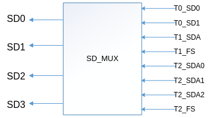

# 视频输入<a name="ZH-CN_TOPIC_0000002408258946"></a>


## 概述<a name="ZH-CN_TOPIC_0000002408258766"></a>

视频输入（VI）模块实现的功能：通过MIPI Rx\(含MIPI接口、LVDS接口和HISPI接口\)，BT.1120，BT.656，BT.601，DC等接口接收视频数据。VI将接收到的数据存入到指定的内存区域，在此过程中，VI可以对接收到的原始视频图像数据进行处理，实现视频数据的采集。

## 重要概念<a name="ZH-CN_TOPIC_0000002441657861"></a>

-   视频输入设备

    视频输入设备支持若干种时序输入，负责对时序进行解析。

-   视频输入物理PIPE

    视频输入PIPE绑定在设备后端，负责设备解析后的数据再处理。

-   视频输入虚拟PIPE

    视频输入虚拟PIPE不绑定设备，负责其他模块或用户发送过来的数据再处理。

-   视频物理通道

    物理通道负责将最终处理后的数据输出到DDR，在真正将数据输出到DDR之前，它可以实现裁剪等功能。

-   PIPE的工作模式

    详情请参考“系统控制”章节的“VI和VPSS”的工作模式描述。

-   掩码

    掩码用于指示VI设备的视频数据来源。

-   镜头畸变校正（LDC）

    镜头畸变校正，一些低端镜头容易产生图像畸变，需要根据畸变程度对其图像进行校正。

-   DIS

    DIS模块通过比较当前图像与前两帧图像采用不同自由度的防抖算法计算出当前图像在各个轴方向上的抖动偏移向量，然后根据抖动偏移向量对当前图像进行校正，从而起到防抖的效果。

-   BAS

    Bayer scaling，即Bayer域缩放。

-   提前上报中断

    提前上报中断指图像写出指定的行数到DDR后，VI上报一个中断，把图像发给后端模块处理，可以减少延时，但没有和低延时一样的硬件机制保证后端模块读图像不会出错。

## 功能描述<a name="ZH-CN_TOPIC_0000002408098718"></a>


### 功能框图<a name="ZH-CN_TOPIC_0000002408258918"></a>

**图 1**  VI在软件层次划分的4个部分<a name="fig2055755551718"></a>  


VI从软件上划分了输入设备（DEV），输入PIPE\(图示为物理PIPE，虚拟PIPE只包含ISP\_BE\)、物理通道（PHY\_CHN）、扩展通道（EXT\_CHN）四个层级。各芯片的设备、PIPE、通道个数差异如表1所示。

**表 1**  设备/PIPE/通道的个数

<a name="_Ref510970631"></a>
<table><thead align="left"><tr id="row142mcpsimp"><th class="cellrowborder" rowspan="2" valign="top" width="20.53%" id="mcps1.2.7.1.1"><p id="p144mcpsimp"><a name="p144mcpsimp"></a><a name="p144mcpsimp"></a>解决方案</p>
</th>
<th class="cellrowborder" valign="top" width="15.47%" id="mcps1.2.7.1.2"><p id="p146mcpsimp"><a name="p146mcpsimp"></a><a name="p146mcpsimp"></a>DEV</p>
</th>
<th class="cellrowborder" valign="top" width="17%" id="mcps1.2.7.1.3"><p id="p148mcpsimp"><a name="p148mcpsimp"></a><a name="p148mcpsimp"></a>PHY_PIPE</p>
</th>
<th class="cellrowborder" valign="top" width="14.000000000000002%" id="mcps1.2.7.1.4"><p id="p150mcpsimp"><a name="p150mcpsimp"></a><a name="p150mcpsimp"></a>VIR_PIPE</p>
</th>
<th class="cellrowborder" valign="top" width="16%" id="mcps1.2.7.1.5"><p id="p152mcpsimp"><a name="p152mcpsimp"></a><a name="p152mcpsimp"></a>PHY_CHN</p>
</th>
<th class="cellrowborder" valign="top" width="17%" id="mcps1.2.7.1.6"><p id="p154mcpsimp"><a name="p154mcpsimp"></a><a name="p154mcpsimp"></a>EXT_CHN</p>
</th>
</tr>
<tr id="row155mcpsimp"><th class="cellrowborder" valign="top" id="mcps1.2.7.2.1"><p xml:lang="sv-SE" id="p157mcpsimp"><a name="p157mcpsimp"></a><a name="p157mcpsimp"></a>OT_VI_MAX_DEV_NUM</p>
</th>
<th class="cellrowborder" valign="top" id="mcps1.2.7.2.2"><p xml:lang="sv-SE" id="p159mcpsimp"><a name="p159mcpsimp"></a><a name="p159mcpsimp"></a><span xml:lang="en-US" id="ph160mcpsimp"><a name="ph160mcpsimp"></a><a name="ph160mcpsimp"></a>OT_VI</span>_MAX_PHYS_PIPE_NUM</p>
</th>
<th class="cellrowborder" valign="top" id="mcps1.2.7.2.3"><p xml:lang="sv-SE" id="p162mcpsimp"><a name="p162mcpsimp"></a><a name="p162mcpsimp"></a>OT_VI_MAX_VIRT_PIPE_NUM</p>
</th>
<th class="cellrowborder" valign="top" id="mcps1.2.7.2.4"><p xml:lang="sv-SE" id="p164mcpsimp"><a name="p164mcpsimp"></a><a name="p164mcpsimp"></a><span xml:lang="en-US" id="ph165mcpsimp"><a name="ph165mcpsimp"></a><a name="ph165mcpsimp"></a>OT_VI</span>_MAX_PHYS_CHN_NUM</p>
</th>
<th class="cellrowborder" valign="top" id="mcps1.2.7.2.5"><p xml:lang="sv-SE" id="p167mcpsimp"><a name="p167mcpsimp"></a><a name="p167mcpsimp"></a><span xml:lang="en-US" id="ph168mcpsimp"><a name="ph168mcpsimp"></a><a name="ph168mcpsimp"></a>OT_VI</span>_MAX_EXT_CHN_NUM</p>
</th>
</tr>
</thead>
<tbody><tr id="row170mcpsimp"><td class="cellrowborder" valign="top" width="20.53%" headers="mcps1.2.7.1.1 mcps1.2.7.2.1 "><p id="p172mcpsimp"><a name="p172mcpsimp"></a><a name="p172mcpsimp"></a>Hi3403V100</p>
</td>
<td class="cellrowborder" valign="top" width="15.47%" headers="mcps1.2.7.1.2 mcps1.2.7.2.2 "><p id="p174mcpsimp"><a name="p174mcpsimp"></a><a name="p174mcpsimp"></a>4</p>
</td>
<td class="cellrowborder" valign="top" width="17%" headers="mcps1.2.7.1.3 mcps1.2.7.2.3 "><p id="p176mcpsimp"><a name="p176mcpsimp"></a><a name="p176mcpsimp"></a>4</p>
</td>
<td class="cellrowborder" valign="top" width="14.000000000000002%" headers="mcps1.2.7.1.4 mcps1.2.7.2.4 "><p id="p178mcpsimp"><a name="p178mcpsimp"></a><a name="p178mcpsimp"></a>12</p>
</td>
<td class="cellrowborder" valign="top" width="16%" headers="mcps1.2.7.1.5 mcps1.2.7.2.5 "><p id="p180mcpsimp"><a name="p180mcpsimp"></a><a name="p180mcpsimp"></a>1</p>
</td>
<td class="cellrowborder" valign="top" width="17%" headers="mcps1.2.7.1.6 "><p id="p182mcpsimp"><a name="p182mcpsimp"></a><a name="p182mcpsimp"></a>8</p>
</td>
</tr>
</tbody>
</table>

-   Hi3403V100视频输入通道功能如[图2](#fig12122195920190)所示。

**图 2**  Hi3403V100 VI通道功能框图<a name="fig12122195920190"></a>  


### 视频输入设备<a name="ZH-CN_TOPIC_0000002441657925"></a>

所有VI设备都是相互独立的，支持时序解析。

### 视频输入PIPE<a name="ZH-CN_TOPIC_0000002441658365"></a>

VI的PIPE包含了ISP的相关处理功能，主要是对图像数据进行流水线处理，输出YUV图像格式给通道。PIPE的工作模式请参考“系统控制”章节的“VI和VPSS”的工作模式描述。

### 视频物理通道<a name="ZH-CN_TOPIC_0000002441658401"></a>

-   Hi3403V100 VI只有一个物理通道，支持8个扩展通道。
-   Hi3403V100物理通道支持的典型分辨率如3840x2160@60fps、3840x2160@30fps、1080p@240fps、1080p@120fps、1080p@60fps、1080p@30fps等。

### 视频扩展通道<a name="ZH-CN_TOPIC_0000002441698193"></a>

扩展通道是物理通道的扩展，扩展通道具备缩放、裁剪功能，它通过绑定物理通道，将物理通道输出作为自己的输入，然后输出用户设置的目标图像。

### BAS功能区分说明<a name="ZH-CN_TOPIC_0000002408098810"></a>

Hi3403V100有两个子模块支持BAS功能，如表1所示。

**表 1**  子模块具体功能描述

<a name="_Ref48133205"></a>
<table><thead align="left"><tr id="row12538mcpsimp"><th class="cellrowborder" valign="top" width="35%" id="mcps1.2.3.1.1"><p id="p12540mcpsimp"><a name="p12540mcpsimp"></a><a name="p12540mcpsimp"></a>功能所属子模块</p>
</th>
<th class="cellrowborder" valign="top" width="65%" id="mcps1.2.3.1.2"><p id="p12542mcpsimp"><a name="p12542mcpsimp"></a><a name="p12542mcpsimp"></a>具体功能描述</p>
</th>
</tr>
</thead>
<tbody><tr id="row12543mcpsimp"><td class="cellrowborder" valign="top" width="35%" headers="mcps1.2.3.1.1 "><p id="p12545mcpsimp"><a name="p12545mcpsimp"></a><a name="p12545mcpsimp"></a>DEV</p>
</td>
<td class="cellrowborder" valign="top" width="65%" headers="mcps1.2.3.1.2 "><p id="p12547mcpsimp"><a name="p12547mcpsimp"></a><a name="p12547mcpsimp"></a>支持1、1/2、1/3的缩放和相位调整。</p>
</td>
</tr>

    <tr id="row310mcpsimp"><td class="cellrowborder" valign="top" headers="mcps1.2.6.1.1 "><p id="p312mcpsimp"><a name="p312mcpsimp"></a><a name="p312mcpsimp"></a>1</p>
    </td>
    <td class="cellrowborder" valign="top" headers="mcps1.2.6.1.2 "><p id="p314mcpsimp"><a name="p314mcpsimp"></a><a name="p314mcpsimp"></a>2</p>
    </td>
    <td class="cellrowborder" valign="top" headers="mcps1.2.6.1.3 "><p id="p316mcpsimp"><a name="p316mcpsimp"></a><a name="p316mcpsimp"></a>SENSOR_VS1</p>
    <p id="p317mcpsimp"><a name="p317mcpsimp"></a><a name="p317mcpsimp"></a>SENSOR_HS1</p>
    </td>
    <td class="cellrowborder" valign="top" headers="mcps1.2.6.1.4 "><p id="p319mcpsimp"><a name="p319mcpsimp"></a><a name="p319mcpsimp"></a>PIPE：1</p>
    </td>
    </tr>
    <tr id="row320mcpsimp"><td class="cellrowborder" valign="top" headers="mcps1.2.6.1.1 "><p id="p322mcpsimp"><a name="p322mcpsimp"></a><a name="p322mcpsimp"></a>2</p>
    </td>
    <td class="cellrowborder" valign="top" headers="mcps1.2.6.1.2 "><p id="p324mcpsimp"><a name="p324mcpsimp"></a><a name="p324mcpsimp"></a>2</p>
    </td>
    <td class="cellrowborder" valign="top" headers="mcps1.2.6.1.3 "><p id="p326mcpsimp"><a name="p326mcpsimp"></a><a name="p326mcpsimp"></a>SENSOR_VS2</p>
    <p id="p327mcpsimp"><a name="p327mcpsimp"></a><a name="p327mcpsimp"></a>SENSOR_HS2</p>
    </td>
    <td class="cellrowborder" valign="top" headers="mcps1.2.6.1.4 "><p id="p329mcpsimp"><a name="p329mcpsimp"></a><a name="p329mcpsimp"></a>PIPE：2</p>
    </td>
    </tr>
    <tr id="row330mcpsimp"><td class="cellrowborder" valign="top" headers="mcps1.2.6.1.1 "><p id="p332mcpsimp"><a name="p332mcpsimp"></a><a name="p332mcpsimp"></a>3</p>
    </td>
    <td class="cellrowborder" valign="top" headers="mcps1.2.6.1.2 "><p id="p334mcpsimp"><a name="p334mcpsimp"></a><a name="p334mcpsimp"></a>2</p>
    </td>
    <td class="cellrowborder" valign="top" headers="mcps1.2.6.1.3 "><p id="p336mcpsimp"><a name="p336mcpsimp"></a><a name="p336mcpsimp"></a>SENSOR_VS3</p>
    <p id="p337mcpsimp"><a name="p337mcpsimp"></a><a name="p337mcpsimp"></a>SENSOR_HS3</p>
    </td>
    <td class="cellrowborder" valign="top" headers="mcps1.2.6.1.4 "><p id="p339mcpsimp"><a name="p339mcpsimp"></a><a name="p339mcpsimp"></a>PIPE：3</p>
    </td>
    </tr>
    </tbody>
    </table>

    > **说明：** 
    >从模式和PIPE的对应关系默认是如表1所示，如果需要修改，可以通过修改ISP相关的代码完成。

### 掩码配置<a name="ZH-CN_TOPIC_0000002441698117"></a>

掩码的高12bit对应着硬件线路的12个pin脚连接（D0到D15之间的任意连续12个pin脚即可，例如D4～D15），用户需要根据实际连接情况设置恰当的掩码配置，掩码的最高比特位对应的pin为D15，例如10bit输入的Sensor连接的pin为D6\~D15，掩码配置为0xFFC00000；同理如果是14bit输入时，对应的掩码配置为0xFFFC0000。

VI接入Data线序为由低到高，例如单分量接入时，D0为数据低比特位，D15为数据高比特位。

-   1路/2路5M或1080p图像输入场景（12bit输入）

    1路/2路5M或1080p图像输入场景下，设置VI设备属性时，可根据表1配置掩码。

**表 1**  1路、2路5M或1080p场景下的掩码配置（12bit）

<a name="_Ref331669300"></a>
<table><thead align="left"><tr id="row354mcpsimp"><th class="cellrowborder" valign="top" width="24.75%" id="mcps1.2.4.1.1"><p id="p356mcpsimp"><a name="p356mcpsimp"></a><a name="p356mcpsimp"></a>设备号</p>
</th>
<th class="cellrowborder" valign="top" width="24.75%" id="mcps1.2.4.1.2"><p id="p358mcpsimp"><a name="p358mcpsimp"></a><a name="p358mcpsimp"></a>掩码0</p>
</th>
<th class="cellrowborder" valign="top" width="50.5%" id="mcps1.2.4.1.3"><p id="p360mcpsimp"><a name="p360mcpsimp"></a><a name="p360mcpsimp"></a>掩码1</p>
</th>
</tr>
</thead>
<tbody><tr id="row362mcpsimp"><td class="cellrowborder" valign="top" width="24.75%" headers="mcps1.2.4.1.1 "><p id="p364mcpsimp"><a name="p364mcpsimp"></a><a name="p364mcpsimp"></a>0</p>
</td>
<td class="cellrowborder" valign="top" width="24.75%" headers="mcps1.2.4.1.2 "><p id="p366mcpsimp"><a name="p366mcpsimp"></a><a name="p366mcpsimp"></a>0xFFF00000</p>
</td>
<td class="cellrowborder" valign="top" width="50.5%" headers="mcps1.2.4.1.3 "><p id="p368mcpsimp"><a name="p368mcpsimp"></a><a name="p368mcpsimp"></a>0x0</p>
</td>
</tr>
<tr id="row369mcpsimp"><td class="cellrowborder" valign="top" width="24.75%" headers="mcps1.2.4.1.1 "><p id="p371mcpsimp"><a name="p371mcpsimp"></a><a name="p371mcpsimp"></a>1</p>
</td>
<td class="cellrowborder" valign="top" width="24.75%" headers="mcps1.2.4.1.2 "><p id="p373mcpsimp"><a name="p373mcpsimp"></a><a name="p373mcpsimp"></a>0xFFF00000</p>
</td>
<td class="cellrowborder" valign="top" width="50.5%" headers="mcps1.2.4.1.3 "><p id="p375mcpsimp"><a name="p375mcpsimp"></a><a name="p375mcpsimp"></a>0x0</p>
</td>
</tr>
</tbody>
</table>

-   1路/2路BT.1120高清输入场景（16bit输入）

    1路/2路BT.1120高清图像输入场景下，设置VI设备属性时，可根据表2配置掩码。

**表 2**  1路/2路BT.1120图像输入场景下的掩码配置（16bit）

<a name="_Ref391628558"></a>
<table><thead align="left"><tr id="row386mcpsimp"><th class="cellrowborder" valign="top" width="24.75%" id="mcps1.2.4.1.1"><p id="p388mcpsimp"><a name="p388mcpsimp"></a><a name="p388mcpsimp"></a>设备号</p>
</th>
<th class="cellrowborder" valign="top" width="24.75%" id="mcps1.2.4.1.2"><p id="p390mcpsimp"><a name="p390mcpsimp"></a><a name="p390mcpsimp"></a>掩码0</p>
</th>
<th class="cellrowborder" valign="top" width="50.5%" id="mcps1.2.4.1.3"><p id="p392mcpsimp"><a name="p392mcpsimp"></a><a name="p392mcpsimp"></a>掩码1</p>
</th>
</tr>
</thead>
<tbody><tr id="row394mcpsimp"><td class="cellrowborder" valign="top" width="24.75%" headers="mcps1.2.4.1.1 "><p id="p396mcpsimp"><a name="p396mcpsimp"></a><a name="p396mcpsimp"></a>0</p>
</td>
<td class="cellrowborder" valign="top" width="24.75%" headers="mcps1.2.4.1.2 "><p id="p398mcpsimp"><a name="p398mcpsimp"></a><a name="p398mcpsimp"></a>0xFF000000</p>
</td>
<td class="cellrowborder" valign="top" width="50.5%" headers="mcps1.2.4.1.3 "><p id="p400mcpsimp"><a name="p400mcpsimp"></a><a name="p400mcpsimp"></a>0x00FF0000</p>
</td>
</tr>
<tr id="row401mcpsimp"><td class="cellrowborder" valign="top" width="24.75%" headers="mcps1.2.4.1.1 "><p id="p403mcpsimp"><a name="p403mcpsimp"></a><a name="p403mcpsimp"></a>1</p>
</td>
<td class="cellrowborder" valign="top" width="24.75%" headers="mcps1.2.4.1.2 "><p id="p405mcpsimp"><a name="p405mcpsimp"></a><a name="p405mcpsimp"></a>0xFF000000</p>
</td>
<td class="cellrowborder" valign="top" width="50.5%" headers="mcps1.2.4.1.3 "><p id="p407mcpsimp"><a name="p407mcpsimp"></a><a name="p407mcpsimp"></a>0x00FF0000</p>
</td>
</tr>
</tbody>
</table>

-   1路/2路D1图像输入场景（8bit输入）

    1路/2路 图像输入场景下，设置VI设备属性时，可根据表3配置掩码。

**表 3**  1路D1图像输入场景下的掩码配置（8bit）

<a name="_Ref331669304"></a>
<table><thead align="left"><tr id="row418mcpsimp"><th class="cellrowborder" valign="top" width="25%" id="mcps1.2.4.1.1"><p id="p420mcpsimp"><a name="p420mcpsimp"></a><a name="p420mcpsimp"></a>设备号</p>
</th>
<th class="cellrowborder" valign="top" width="28.999999999999996%" id="mcps1.2.4.1.2"><p id="p422mcpsimp"><a name="p422mcpsimp"></a><a name="p422mcpsimp"></a>掩码0</p>
</th>
<th class="cellrowborder" valign="top" width="46%" id="mcps1.2.4.1.3"><p id="p424mcpsimp"><a name="p424mcpsimp"></a><a name="p424mcpsimp"></a>掩码1</p>
</th>
</tr>
</thead>
<tbody><tr id="row426mcpsimp"><td class="cellrowborder" valign="top" width="25%" headers="mcps1.2.4.1.1 "><p id="p428mcpsimp"><a name="p428mcpsimp"></a><a name="p428mcpsimp"></a>0</p>
</td>
<td class="cellrowborder" valign="top" width="28.999999999999996%" headers="mcps1.2.4.1.2 "><p id="p430mcpsimp"><a name="p430mcpsimp"></a><a name="p430mcpsimp"></a>0xFF000000</p>
</td>
<td class="cellrowborder" valign="top" width="46%" headers="mcps1.2.4.1.3 "><p id="p432mcpsimp"><a name="p432mcpsimp"></a><a name="p432mcpsimp"></a>0x0</p>
</td>
</tr>
<tr id="row433mcpsimp"><td class="cellrowborder" valign="top" width="25%" headers="mcps1.2.4.1.1 "><p id="p435mcpsimp"><a name="p435mcpsimp"></a><a name="p435mcpsimp"></a>1</p>
</td>
<td class="cellrowborder" valign="top" width="28.999999999999996%" headers="mcps1.2.4.1.2 "><p id="p437mcpsimp"><a name="p437mcpsimp"></a><a name="p437mcpsimp"></a>0xFF000000</p>
</td>
<td class="cellrowborder" valign="top" width="46%" headers="mcps1.2.4.1.3 "><p id="p439mcpsimp"><a name="p439mcpsimp"></a><a name="p439mcpsimp"></a>0x0</p>
</td>
</tr>
</tbody>
</table>

## API参考<a name="ZH-CN_TOPIC_0000002408258506"></a>

VI模块实现Dev配置和使能、Dev和Pipe绑定、Grp配置、Pipe创建和使能、Chn配置和使能等功能。

该功能模块提供以下MPI：

-   `ss_mpi_vi_set_dev_attr`：设置VI设备属性。
-   `ss_mpi_vi_get_dev_attr`：获取VI设备属性。
-   `ss_mpi_vi_set_bas_attr`：设置VI BayerScale属性。
-   `ss_mpi_vi_get_bas_attr`：获取VI BayerScale属性。
-   `ss_mpi_vi_enable_dev`：启用VI设备。
-   `ss_mpi_vi_disable_dev`：禁用VI设备。
-   `ss_mpi_vi_set_thermo_sns_attr`：设置热成像探测器的配置属性。
-   `ss_mpi_vi_get_thermo_sns_attr`：获取热成像探测器的配置属性。
-   `ss_mpi_vi_enable_dev_send_frame`：启用设备送帧功能。
-   `ss_mpi_vi_disable_dev_send_frame`：禁用设备送帧功能。
-   `ss_mpi_vi_send_dev_frame`：配置设备送帧的帧信息。
-   `ss_mpi_vi_set_dev_timing_attr`：设置设备自产生时序属性。
-   `ss_mpi_vi_get_dev_timing_attr`：获取设备自产生时序属性。
-   `ss_mpi_vi_set_dev_data_attr`：设置设备自产生数据属性。
-   `ss_mpi_vi_get_dev_data_attr`：获取设备自产生数据属性。
-   `ss_mpi_vi_bind`：一对一绑定Dev和Pipe。
-   `ss_mpi_vi_unbind`：一对一解绑定Dev和Pipe。
-   `ss_mpi_vi_get_bind_by_dev`：获取与Dev绑定的Pipe。
-   `ss_mpi_vi_get_bind_by_pipe`：获取与Pipe绑定的Dev。
-   `ss_mpi_vi_set_wdr_fusion_grp_attr`：设置wdr合成组的属性。
-   `ss_mpi_vi_get_wdr_fusion_grp_attr`：获取wdr合成组的属性。
-   `ss_mpi_vi_create_pipe`：创建一个VI PIPE。
-   `ss_mpi_vi_destroy_pipe`：销毁一个VI PIPE。
-   `ss_mpi_vi_set_pipe_attr`：设置VI PIPE的属性。
-   `ss_mpi_vi_get_pipe_attr`：获取VI PIPE的属性。
-   `ss_mpi_vi_start_pipe`：启用VI PIPE。
-   `ss_mpi_vi_stop_pipe`：禁用VI PIPE。
-   `ss_mpi_vi_set_pipe_pre_crop`：设置VI 物理PIPE输入端的裁剪功能属性。
-   `ss_mpi_vi_get_pipe_pre_crop`：获取VI 物理PIPE输入端的裁剪功能属性。
-   `ss_mpi_vi_set_pipe_post_crop`：设置VI 物理PIPE输出端的裁剪功能属性。
-   `ss_mpi_vi_get_pipe_post_crop`：获取VI 物理PIPE输出端的裁剪功能属性。
-   `ss_mpi_vi_set_pipe_frame_dump_attr`：设置VI 物理PIPE dump图像帧属性。
-   `ss_mpi_vi_get_pipe_frame_dump_attr`：获取VI 物理PIPE dump图像帧属性。
-   `ss_mpi_vi_get_pipe_frame`：获取VI物理PIPE图像帧。
-   `ss_mpi_vi_release_pipe_frame`：释放VI 物理PIPE的图像帧。
-   `ss_mpi_vi_set_pipe_fe_out_frame_dump_attr`：设置VI 物理PIPE FE输出 dump图像帧属性。
-   `ss_mpi_vi_get_pipe_fe_out_frame_dump_attr`：获取VI 物理PIPE FE输出 dump图像帧属性。
-   `ss_mpi_vi_get_pipe_fe_out_frame`：获取VI物理PIPE FE输出图像帧。
-   `ss_mpi_vi_release_pipe_fe_out_frame`：释放VI 物理PIPE FE输出的图像帧。
-   `ss_mpi_vi_set_pipe_private_data_dump_attr`：设置VI物理PIPE dump私有数据的属性。
-   `ss_mpi_vi_get_pipe_private_data_dump_attr`：获取VI物理PIPE dump私有数据的属性。
-   `ss_mpi_vi_get_pipe_private_data`：获取VI物理PIPE的私有数据。
-   `ss_mpi_vi_release_pipe_private_data`：释放VI物理PIPE的私有数据。
-   `ss_mpi_vi_set_pipe_bas_frame_dump_attr`：设置VI PIPE dump bas图像帧的属性。
-   `ss_mpi_vi_get_pipe_bas_frame_dump_attr`：获取VI PIPE dump bas图像帧的属性。
-   `ss_mpi_vi_get_pipe_bas_frame`：获取VI PIPE bas图像帧。
-   `ss_mpi_vi_release_pipe_bas_frame`：释放VI PIPE bas图像帧。
-   `ss_mpi_vi_set_pipe_frame_source`：设置VI PIPE数据的来源。
-   `ss_mpi_vi_get_pipe_frame_source`：获取VI PIPE数据的来源。
-   `ss_mpi_vi_set_pipe_param`：设置VI PIPE参数。
-   `ss_mpi_vi_get_pipe_param`：获取VI PIPE参数。
-   `ss_mpi_vi_enable_pipe_stagger_out_split`：启用VI PIPE STAGGER模式输出拆分。
-   `ss_mpi_vi_disable_pipe_stagger_out_split`：禁用VI PIPE STAGGER模式输出拆分。
-   `ss_mpi_vi_set_pipe_bnr_buf_num`：设置VI PIPE bayernr buffer个数。
-   `ss_mpi_vi_get_pipe_bnr_buf_num`：获取VI PIPE bayernr buffer个数。
-   `ss_mpi_vi_send_pipe_yuv`：通过VI PIPE发送YUV数据。
-   `ss_mpi_vi_send_pipe_raw`：通过VI PIPE发送RAW数据。
-   `ss_mpi_vi_query_pipe_status`：查询VI PIPE状态。
-   `ss_mpi_vi_enable_pipe_interrupt`：启动VI 物理PIPE中断。
-   `ss_mpi_vi_disable_pipe_interrupt`：禁用VI 物理PIPE中断。
-   `ss_mpi_vi_set_pipe_vc_number`：设置VI 物理PIPE对接前端sensor或者AD的VC号。
-   `ss_mpi_vi_get_pipe_vc_number`：获取VI 物理PIPE对接前端sensor或者AD的VC号。
-   `ss_mpi_vi_set_pipe_low_delay_attr`：设置VI PIPE低延时属性。
-   `ss_mpi_vi_get_pipe_low_delay_attr`：获取VI PIPE低延时属性。
-   `ss_mpi_vi_set_pipe_frame_interrupt_attr`：设置VI PIPE上报中断属性。
-   `ss_mpi_vi_get_pipe_frame_interrupt_attr`：获取VI PIPE上报中断属性。
-   `ss_mpi_vi_set_pipe_fisheye_cfg`：设置VI PIPE对应的鱼眼镜头LMF参数配置。
-   `ss_mpi_vi_get_pipe_fisheye_cfg`：获取VI PIPE对应的鱼眼镜头LMF参数配置。
-   `ss_mpi_vi_get_pipe_compress_param`：获取VI物理 PIPE的RAW压缩参数。
-   `ss_mpi_vi_set_user_pic`：设置用户图片，作为无视频信号时的插入图片。
-   `ss_mpi_vi_enable_user_pic`：启用VI PIPE插入用户图片。
-   `ss_mpi_vi_disable_user_pic`：禁用VI PIPE插入用户图片。
-   `ss_mpi_vi_pipe_set_vb_src`：设置VI PIPE的VB来源。
-   `ss_mpi_vi_pipe_get_vb_src`：获取VI PIPE的VB来源。
-   `ss_mpi_vi_pipe_attach_vb_pool`：将VI的PIPE绑定到某个视频缓存VB池中。
-   `ss_mpi_vi_pipe_detach_vb_pool`：将VI的PIPE从某个视频缓存VB池中解绑定。
-   `ss_mpi_vi_get_pipe_fd`：获取VI PIPE文件描述符。
-   `ss_mpi_vi_set_chn_attr`：设置VI通道属性。
-   `ss_mpi_vi_get_chn_attr`：获取VI通道属性。
-   `ss_mpi_vi_set_ext_chn_attr`：设置VI扩展通道属性。
-   `ss_mpi_vi_get_ext_chn_attr`：获取VI扩展通道属性。
-   `ss_mpi_vi_enable_chn`：启用VI通道。
-   `ss_mpi_vi_disable_chn`：禁用VI通道。
-   `ss_mpi_vi_set_chn_crop`：设置VI通道裁剪功能属性。
-   `ss_mpi_vi_get_chn_crop`：获取VI通道裁剪功能属性。
-   `ss_mpi_vi_set_chn_rotation`：设置VI图像旋转属性。
-   `ss_mpi_vi_get_chn_rotation`：获取VI图像旋转属性。
-   `ss_mpi_vi_set_chn_ldc_attr`：设置VI镜头畸变校正（LDC）属性。
-   `ss_mpi_vi_get_chn_ldc_attr`：获取VI镜头畸变校正（LDC）属性。
-   `ss_mpi_vi_ldc_pos_query_dst_to_src`：根据镜头畸变校正（LDC）的输出图像坐标点查找输入图像的坐标点。
-   `ss_mpi_vi_ldc_pos_query_src_to_dst`：根据镜头畸变校正（LDC）的输入图像坐标点查找输出图像的坐标点。
-   `ss_mpi_vi_set_chn_spread_attr`：设置VI通道展宽属性。
-   `ss_mpi_vi_get_chn_spread_attr`：获取VI通道展宽属性。
-   `ss_mpi_vi_set_chn_fisheye`：设置VI通道对应的鱼眼属性。
-   `ss_mpi_vi_get_chn_fisheye`：获取VI通道对应的鱼眼属性。
-   `ss_mpi_vi_fisheye_pos_query_dst_to_src`：根据鱼眼校正输出图像坐标点查找源图像坐标点。
-   `ss_mpi_vi_get_chn_rgn_luma`：获取指定图像区域的亮度总和。
-   `ss_mpi_vi_set_chn_dis_cfg`：设置VI通道的DIS配置信息。
-   `ss_mpi_vi_get_chn_dis_cfg`：获取VI通道的DIS配置信息。
-   `ss_mpi_vi_set_chn_dis_attr`：设置VI通道的DIS属性。
-   `ss_mpi_vi_get_chn_dis_attr`：获取VI通道的DIS属性。
-   `ss_mpi_vi_set_chn_dis_param`：设置VI通道的DIS可选参数。
-   `ss_mpi_vi_get_chn_dis_param`：获取VI通道的DIS的可选参数。
-   `ss_mpi_vi_set_chn_dis_wdr_attr`：设置VI通道的DIS WDR属性。
-   `ss_mpi_vi_get_chn_dis_wdr_attr`：获取VI通道的DIS WDR属性。
-   `ss_mpi_vi_set_chn_fov_correction_attr`：设置VI通道的视场角矫正属性。
-   `ss_mpi_vi_get_chn_fov_correction_attr`：获取VI通道的视场角矫正属性。
-   `ss_mpi_vi_get_chn_frame`：从VI通道获取采集的图像。
-   `ss_mpi_vi_release_chn_frame`：释放一帧从VI通道获取的图像。
-   `ss_mpi_vi_set_chn_low_delay_attr`：设置VI通道低延时属性。
-   `ss_mpi_vi_get_chn_low_delay_attr`：获取VI通道低延时属性。
-   `ss_mpi_vi_set_chn_align`：设置VI通道输出YUV数据的行stride对齐。
-   `ss_mpi_vi_get_chn_align`：获取VI通道输出YUV数据的行stride对齐。
-   `ss_mpi_vi_chn_set_vb_src`：设置VI通道使用VB的来源。
-   `ss_mpi_vi_chn_get_vb_src`：获取VI通道使用VB的来源。
-   `ss_mpi_vi_chn_attach_vb_pool`：将VI通道绑定到某个视频缓存VB池中。
-   `ss_mpi_vi_chn_detach_vb_pool`：将VI通道从某个视频缓存VB池中解绑定。
-   `ss_mpi_vi_query_chn_status`：查询VI通道的状态。
-   `ss_mpi_vi_get_chn_fd`：获取VI通道文件描述符。
-   `ss_mpi_vi_set_stitch_grp_attr`：设置VI 的拼接组属性。
-   `ss_mpi_vi_get_stitch_grp_attr`：获取VI 的拼接组属性。
-   `ss_mpi_vi_set_mod_param`：设置VI模块参数。
-   `ss_mpi_vi_get_mod_param`：获取VI模块参数。
-   `ss_mpi_vi_close_fd`：关闭VI文件描述符。
-   `ss_mpi_vi_chn_set_zoom_in_window`：设置vi chn 裁剪放大属性。
-   `ss_mpi_vi_chn_get_zoom_in_window`：获取vi chn 裁剪放大属性。


### ss\_mpi\_vi\_set\_dev\_attr<a name="ZH-CN_TOPIC_0000002441697677"></a>

【描述】

设置VI设备属性。基本设备属性默认了部分芯片配置，满足绝大部分的sensor对接要求。

【语法】

```
td_s32 ss_mpi_vi_set_dev_attr(ot_vi_dev vi_dev, const ot_vi_dev_attr *dev_attr);
```

【参数】

<a name="table686mcpsimp"></a>
<table><thead align="left"><tr id="row692mcpsimp"><th class="cellrowborder" valign="top" width="18%" id="mcps1.1.4.1.1"><p id="p694mcpsimp"><a name="p694mcpsimp"></a><a name="p694mcpsimp"></a>参数名称</p>
</th>
<th class="cellrowborder" valign="top" width="66%" id="mcps1.1.4.1.2"><p id="p696mcpsimp"><a name="p696mcpsimp"></a><a name="p696mcpsimp"></a>描述</p>
</th>
<th class="cellrowborder" valign="top" width="16%" id="mcps1.1.4.1.3"><p id="p698mcpsimp"><a name="p698mcpsimp"></a><a name="p698mcpsimp"></a>输入/输出</p>
</th>
</tr>
</thead>
<tbody><tr id="row700mcpsimp"><td class="cellrowborder" valign="top" width="18%" headers="mcps1.1.4.1.1 "><p id="p702mcpsimp"><a name="p702mcpsimp"></a><a name="p702mcpsimp"></a>vi_dev</p>
</td>
<td class="cellrowborder" valign="top" width="66%" headers="mcps1.1.4.1.2 "><p id="p704mcpsimp"><a name="p704mcpsimp"></a><a name="p704mcpsimp"></a>VI设备号。</p>
<p id="p705mcpsimp"><a name="p705mcpsimp"></a><a name="p705mcpsimp"></a>取值范围：`ss_mpi_vi_disable_dev`来禁用设备。
-   参数dev\_attr主要用来配置指定VI设备的视频接口模式，用于与外围camera、sensor或codec对接，支持的接口模式包括MIPI Rx（MIPI/LVDS/HISPI）、SLVS-EC。用户需要配置以下几类信息，具体属性意义参见“数据类型”部分的说明：
    -   接口模式信息：接口模式为MIPI Rx（MIPI/LVDS/HISPI）等模式
    -   工作模式信息：1路、2路、4路复合模式
    -   数据布局信息：复合模式下多路数据的排布
    -   数据信息：逐行输入、YUV数据输入顺序
    -   同步时序信息：垂直、水平同步信号的属性

【举例】

无。

【相关主题】

ss\_mpi\_vi\_get\_dev\_attr

### ss\_mpi\_vi\_get\_dev\_attr<a name="ZH-CN_TOPIC_0000002408099066"></a>

【描述】

获取VI设备属性。

【语法】

```
td_s32 ss_mpi_vi_get_dev_attr(ot_vi_dev vi_dev, ot_vi_dev_attr *dev_attr);
```

【参数】

<a name="table782mcpsimp"></a>
<table><thead align="left"><tr id="row788mcpsimp"><th class="cellrowborder" valign="top" width="20%" id="mcps1.1.4.1.1"><p id="p790mcpsimp"><a name="p790mcpsimp"></a><a name="p790mcpsimp"></a>参数名称</p>
</th>
<th class="cellrowborder" valign="top" width="62%" id="mcps1.1.4.1.2"><p id="p792mcpsimp"><a name="p792mcpsimp"></a><a name="p792mcpsimp"></a>描述</p>
</th>
<th class="cellrowborder" valign="top" width="18%" id="mcps1.1.4.1.3"><p id="p794mcpsimp"><a name="p794mcpsimp"></a><a name="p794mcpsimp"></a>输入/输出</p>
</th>
</tr>
</thead>
<tbody><tr id="row796mcpsimp"><td class="cellrowborder" valign="top" width="20%" headers="mcps1.1.4.1.1 "><p id="p798mcpsimp"><a name="p798mcpsimp"></a><a name="p798mcpsimp"></a>vi_dev</p>
</td>
<td class="cellrowborder" valign="top" width="62%" headers="mcps1.1.4.1.2 "><p id="p800mcpsimp"><a name="p800mcpsimp"></a><a name="p800mcpsimp"></a>VI设备号。</p>
<p id="p801mcpsimp"><a name="p801mcpsimp"></a><a name="p801mcpsimp"></a>取值范围：0, <a href="OT_VI_MAX_DEV_NUM.md">OT_VI<span xml:lang="sv-SE" id="ph803mcpsimp"><a name="ph803mcpsimp"></a><a name="ph803mcpsimp"></a>_</span>MAX_DEV_NUM</a>)。</p>
</td>
<td class="cellrowborder" valign="top" width="18%" headers="mcps1.1.4.1.3 "><p id="p805mcpsimp"><a name="p805mcpsimp"></a><a name="p805mcpsimp"></a>输入</p>
</td>
</tr>
<tr id="row806mcpsimp"><td class="cellrowborder" valign="top" width="20%" headers="mcps1.1.4.1.1 "><p xml:lang="sv-SE" id="p808mcpsimp"><a name="p808mcpsimp"></a><a name="p808mcpsimp"></a>dev_attr</p>
</td>
<td class="cellrowborder" valign="top" width="62%" headers="mcps1.1.4.1.2 "><p id="p810mcpsimp"><a name="p810mcpsimp"></a><a name="p810mcpsimp"></a>VI设备属性指针。</p>
</td>
<td class="cellrowborder" valign="top" width="18%" headers="mcps1.1.4.1.3 "><p id="p812mcpsimp"><a name="p812mcpsimp"></a><a name="p812mcpsimp"></a>输出</p>
</td>
</tr>
</tbody>
</table>

【返回值】

<a name="table814mcpsimp"></a>
<table><thead align="left"><tr id="row819mcpsimp"><th class="cellrowborder" valign="top" width="12%" id="mcps1.1.3.1.1"><p id="p821mcpsimp"><a name="p821mcpsimp"></a><a name="p821mcpsimp"></a>返回值</p>
</th>
<th class="cellrowborder" valign="top" width="88%" id="mcps1.1.3.1.2"><p id="p823mcpsimp"><a name="p823mcpsimp"></a><a name="p823mcpsimp"></a>描述</p>
</th>
</tr>
</thead>
<tbody><tr id="row825mcpsimp"><td class="cellrowborder" valign="top" width="12%" headers="mcps1.1.3.1.1 "><p id="p827mcpsimp"><a name="p827mcpsimp"></a><a name="p827mcpsimp"></a>0</p>
</td>
<td class="cellrowborder" valign="top" width="88%" headers="mcps1.1.3.1.2 "><p id="p829mcpsimp"><a name="p829mcpsimp"></a><a name="p829mcpsimp"></a>成功。</p>
</td>
</tr>
<tr id="row830mcpsimp"><td class="cellrowborder" valign="top" width="12%" headers="mcps1.1.3.1.1 "><p id="p832mcpsimp"><a name="p832mcpsimp"></a><a name="p832mcpsimp"></a>非0</p>
</td>
<td class="cellrowborder" valign="top" width="88%" headers="mcps1.1.3.1.2 "><p id="p834mcpsimp"><a name="p834mcpsimp"></a><a name="p834mcpsimp"></a>失败，其值为<a href="错误码.md"><span xml:lang="fr-FR" id="ph836mcpsimp"><a name="ph836mcpsimp"></a><a name="ph836mcpsimp"></a>错误码</span></a>。</p>
</td>
</tr>
</tbody>
</table>

【解决方案差异】

无。

【需求】

-   头文件：ot\_common\_vi.h、ss\_mpi\_vi.h
-   库文件：libss\_mpi.a

【注意】

如果未设置VI设备属性，该接口将返回失败。

【举例】

无。

【相关主题】

[ss\_mpi\_vi\_set\_dev\_attr

### ss\_mpi\_vi\_set\_bas\_attr<a name="ZH-CN_TOPIC_0000002441658393"></a>

【描述】

设置VI BayerScale属性。

【语法】

```
td_s32 ss_mpi_vi_set_bas_attr(ot_vi_dev vi_dev, const ot_vi_bas_attr *bas_attr);
```

【参数】

<a name="table859mcpsimp"></a>
<table><thead align="left"><tr id="row865mcpsimp"><th class="cellrowborder" valign="top" width="20%" id="mcps1.1.4.1.1"><p id="p867mcpsimp"><a name="p867mcpsimp"></a><a name="p867mcpsimp"></a>参数名称</p>
</th>
<th class="cellrowborder" valign="top" width="62%" id="mcps1.1.4.1.2"><p id="p869mcpsimp"><a name="p869mcpsimp"></a><a name="p869mcpsimp"></a>描述</p>
</th>
<th class="cellrowborder" valign="top" width="18%" id="mcps1.1.4.1.3"><p id="p871mcpsimp"><a name="p871mcpsimp"></a><a name="p871mcpsimp"></a>输入/输出</p>
</th>
</tr>
</thead>
<tbody><tr id="row873mcpsimp"><td class="cellrowborder" valign="top" width="20%" headers="mcps1.1.4.1.1 "><p id="p875mcpsimp"><a name="p875mcpsimp"></a><a name="p875mcpsimp"></a>vi_dev</p>
</td>
<td class="cellrowborder" valign="top" width="62%" headers="mcps1.1.4.1.2 "><p id="p877mcpsimp"><a name="p877mcpsimp"></a><a name="p877mcpsimp"></a>VI设备号。</p>
<p id="p878mcpsimp"><a name="p878mcpsimp"></a><a name="p878mcpsimp"></a>取值：0。</p>
</td>
<td class="cellrowborder" valign="top" width="18%" headers="mcps1.1.4.1.3 "><p id="p880mcpsimp"><a name="p880mcpsimp"></a><a name="p880mcpsimp"></a>输入</p>
</td>
</tr>
<tr id="row881mcpsimp"><td class="cellrowborder" valign="top" width="20%" headers="mcps1.1.4.1.1 "><p xml:lang="sv-SE" id="p883mcpsimp"><a name="p883mcpsimp"></a><a name="p883mcpsimp"></a>bas_attr</p>
</td>
<td class="cellrowborder" valign="top" width="62%" headers="mcps1.1.4.1.2 "><p id="p885mcpsimp"><a name="p885mcpsimp"></a><a name="p885mcpsimp"></a>VI BayerScale属性指针。</p>
<p id="p886mcpsimp"><a name="p886mcpsimp"></a><a name="p886mcpsimp"></a>静态属性。</p>
</td>
<td class="cellrowborder" valign="top" width="18%" headers="mcps1.1.4.1.3 "><p id="p888mcpsimp"><a name="p888mcpsimp"></a><a name="p888mcpsimp"></a>输入</p>
</td>
</tr>
</tbody>
</table>

【返回值】

<a name="table890mcpsimp"></a>
<table><thead align="left"><tr id="row895mcpsimp"><th class="cellrowborder" valign="top" width="12%" id="mcps1.1.3.1.1"><p id="p897mcpsimp"><a name="p897mcpsimp"></a><a name="p897mcpsimp"></a>返回值</p>
</th>
<th class="cellrowborder" valign="top" width="88%" id="mcps1.1.3.1.2"><p id="p899mcpsimp"><a name="p899mcpsimp"></a><a name="p899mcpsimp"></a>描述</p>
</th>
</tr>
</thead>
<tbody><tr id="row901mcpsimp"><td class="cellrowborder" valign="top" width="12%" headers="mcps1.1.3.1.1 "><p id="p903mcpsimp"><a name="p903mcpsimp"></a><a name="p903mcpsimp"></a>0</p>
</td>
<td class="cellrowborder" valign="top" width="88%" headers="mcps1.1.3.1.2 "><p id="p905mcpsimp"><a name="p905mcpsimp"></a><a name="p905mcpsimp"></a>成功。</p>
</td>
</tr>
<tr id="row906mcpsimp"><td class="cellrowborder" valign="top" width="12%" headers="mcps1.1.3.1.1 "><p id="p908mcpsimp"><a name="p908mcpsimp"></a><a name="p908mcpsimp"></a>非0</p>
</td>
<td class="cellrowborder" valign="top" width="88%" headers="mcps1.1.3.1.2 "><p id="p910mcpsimp"><a name="p910mcpsimp"></a><a name="p910mcpsimp"></a>失败，其值为<a href="错误码.md"><span xml:lang="fr-FR" id="ph912mcpsimp"><a name="ph912mcpsimp"></a><a name="ph912mcpsimp"></a>错误码</span></a>。</p>
</td>
</tr>
</tbody>
</table>

【解决方案差异】

无。

【需求】

-   头文件：ot\_common\_vi.h、ss\_mpi\_vi.h
-   库文件：libss\_mpi.a

【注意】

-   wdr模式下不支持bas功能。
-   该接口在`ss_mpi_vi_enable_dev`之前配置，在`ss_mpi_vi_set_dev_attr`之后配置。

【举例】

无。

【相关主题】

ss\_mpi\_vi\_get\_bas\_attr

### ss\_mpi\_vi\_get\_bas\_attr<a name="ZH-CN_TOPIC_0000002408098774"></a>

【描述】

获取VI BayerScale属性。

【语法】

```
td_s32 ss_mpi_vi_get_bas_attr(ot_vi_dev vi_dev, ot_vi_bas_attr *bas_attr);
```

【参数】

<a name="table939mcpsimp"></a>
<table><thead align="left"><tr id="row945mcpsimp"><th class="cellrowborder" valign="top" width="20%" id="mcps1.1.4.1.1"><p id="p947mcpsimp"><a name="p947mcpsimp"></a><a name="p947mcpsimp"></a>参数名称</p>
</th>
<th class="cellrowborder" valign="top" width="62%" id="mcps1.1.4.1.2"><p id="p949mcpsimp"><a name="p949mcpsimp"></a><a name="p949mcpsimp"></a>描述</p>
</th>
<th class="cellrowborder" valign="top" width="18%" id="mcps1.1.4.1.3"><p id="p951mcpsimp"><a name="p951mcpsimp"></a><a name="p951mcpsimp"></a>输入/输出</p>
</th>
</tr>
</thead>
<tbody><tr id="row953mcpsimp"><td class="cellrowborder" valign="top" width="20%" headers="mcps1.1.4.1.1 "><p id="p955mcpsimp"><a name="p955mcpsimp"></a><a name="p955mcpsimp"></a>vi_dev</p>
</td>
<td class="cellrowborder" valign="top" width="62%" headers="mcps1.1.4.1.2 "><p id="p957mcpsimp"><a name="p957mcpsimp"></a><a name="p957mcpsimp"></a>VI设备号。</p>
<p id="p958mcpsimp"><a name="p958mcpsimp"></a><a name="p958mcpsimp"></a>取值：0。</p>
</td>
<td class="cellrowborder" valign="top" width="18%" headers="mcps1.1.4.1.3 "><p id="p960mcpsimp"><a name="p960mcpsimp"></a><a name="p960mcpsimp"></a>输入</p>
</td>
</tr>
<tr id="row961mcpsimp"><td class="cellrowborder" valign="top" width="20%" headers="mcps1.1.4.1.1 "><p xml:lang="sv-SE" id="p963mcpsimp"><a name="p963mcpsimp"></a><a name="p963mcpsimp"></a>bas_attr</p>
</td>
<td class="cellrowborder" valign="top" width="62%" headers="mcps1.1.4.1.2 "><p id="p965mcpsimp"><a name="p965mcpsimp"></a><a name="p965mcpsimp"></a>VI BayerScale属性指针。</p>
</td>
<td class="cellrowborder" valign="top" width="18%" headers="mcps1.1.4.1.3 "><p id="p967mcpsimp"><a name="p967mcpsimp"></a><a name="p967mcpsimp"></a>输出</p>
</td>
</tr>
</tbody>
</table>

【返回值】

<a name="table969mcpsimp"></a>
<table><thead align="left"><tr id="row974mcpsimp"><th class="cellrowborder" valign="top" width="12%" id="mcps1.1.3.1.1"><p id="p976mcpsimp"><a name="p976mcpsimp"></a><a name="p976mcpsimp"></a>返回值</p>
</th>
<th class="cellrowborder" valign="top" width="88%" id="mcps1.1.3.1.2"><p id="p978mcpsimp"><a name="p978mcpsimp"></a><a name="p978mcpsimp"></a>描述</p>
</th>
</tr>
</thead>
<tbody><tr id="row980mcpsimp"><td class="cellrowborder" valign="top" width="12%" headers="mcps1.1.3.1.1 "><p id="p982mcpsimp"><a name="p982mcpsimp"></a><a name="p982mcpsimp"></a>0</p>
</td>
<td class="cellrowborder" valign="top" width="88%" headers="mcps1.1.3.1.2 "><p id="p984mcpsimp"><a name="p984mcpsimp"></a><a name="p984mcpsimp"></a>成功。</p>
</td>
</tr>
<tr id="row985mcpsimp"><td class="cellrowborder" valign="top" width="12%" headers="mcps1.1.3.1.1 "><p id="p987mcpsimp"><a name="p987mcpsimp"></a><a name="p987mcpsimp"></a>非0</p>
</td>
<td class="cellrowborder" valign="top" width="88%" headers="mcps1.1.3.1.2 "><p id="p989mcpsimp"><a name="p989mcpsimp"></a><a name="p989mcpsimp"></a>失败，其值为<a href="错误码.md"><span xml:lang="fr-FR" id="ph991mcpsimp"><a name="ph991mcpsimp"></a><a name="ph991mcpsimp"></a>错误码</span></a>。</p>
</td>
</tr>
</tbody>
</table>

【解决方案差异】

无。

【需求】

-   头文件：ot\_common\_vi.h、ss\_mpi\_vi.h
-   库文件：libss\_mpi.a

【注意】

无。

【举例】

无。

【相关主题】

ss\_mpi\_vi\_set\_bas\_attr

### ss\_mpi\_vi\_enable\_dev<a name="ZH-CN_TOPIC_0000002408098518"></a>

【描述】

启用VI设备。

【语法】

```
td_s32 ss_mpi_vi_enable_dev(ot_vi_dev vi_dev);
```

【参数】

<a name="table1011mcpsimp"></a>
<table><thead align="left"><tr id="row1017mcpsimp"><th class="cellrowborder" valign="top" width="15%" id="mcps1.1.4.1.1"><p id="p1019mcpsimp"><a name="p1019mcpsimp"></a><a name="p1019mcpsimp"></a>参数名称</p>
</th>
<th class="cellrowborder" valign="top" width="68%" id="mcps1.1.4.1.2"><p id="p1021mcpsimp"><a name="p1021mcpsimp"></a><a name="p1021mcpsimp"></a>描述</p>
</th>
<th class="cellrowborder" valign="top" width="17%" id="mcps1.1.4.1.3"><p id="p1023mcpsimp"><a name="p1023mcpsimp"></a><a name="p1023mcpsimp"></a>输入/输出</p>
</th>
</tr>
</thead>
<tbody><tr id="row1025mcpsimp"><td class="cellrowborder" valign="top" width="15%" headers="mcps1.1.4.1.1 "><p id="p1027mcpsimp"><a name="p1027mcpsimp"></a><a name="p1027mcpsimp"></a>vi_dev</p>
</td>
<td class="cellrowborder" valign="top" width="68%" headers="mcps1.1.4.1.2 "><p id="p1029mcpsimp"><a name="p1029mcpsimp"></a><a name="p1029mcpsimp"></a>VI设备号。</p>
<p id="p1030mcpsimp"><a name="p1030mcpsimp"></a><a name="p1030mcpsimp"></a>取值范围：0, <a href="OT_VI_MAX_DEV_NUM.md">OT_VI<span xml:lang="sv-SE" id="ph1032mcpsimp"><a name="ph1032mcpsimp"></a><a name="ph1032mcpsimp"></a>_</span>MAX_DEV_NUM</a>)。</p>
</td>
<td class="cellrowborder" valign="top" width="17%" headers="mcps1.1.4.1.3 "><p id="p1034mcpsimp"><a name="p1034mcpsimp"></a><a name="p1034mcpsimp"></a>输入</p>
</td>
</tr>
</tbody>
</table>

【返回值】

<a name="table1036mcpsimp"></a>
<table><thead align="left"><tr id="row1041mcpsimp"><th class="cellrowborder" valign="top" width="12%" id="mcps1.1.3.1.1"><p id="p1043mcpsimp"><a name="p1043mcpsimp"></a><a name="p1043mcpsimp"></a>返回值</p>
</th>
<th class="cellrowborder" valign="top" width="88%" id="mcps1.1.3.1.2"><p id="p1045mcpsimp"><a name="p1045mcpsimp"></a><a name="p1045mcpsimp"></a>描述</p>
</th>
</tr>
</thead>
<tbody><tr id="row1047mcpsimp"><td class="cellrowborder" valign="top" width="12%" headers="mcps1.1.3.1.1 "><p id="p1049mcpsimp"><a name="p1049mcpsimp"></a><a name="p1049mcpsimp"></a>0</p>
</td>
<td class="cellrowborder" valign="top" width="88%" headers="mcps1.1.3.1.2 "><p id="p1051mcpsimp"><a name="p1051mcpsimp"></a><a name="p1051mcpsimp"></a>成功。</p>
</td>
</tr>
<tr id="row1052mcpsimp"><td class="cellrowborder" valign="top" width="12%" headers="mcps1.1.3.1.1 "><p id="p1054mcpsimp"><a name="p1054mcpsimp"></a><a name="p1054mcpsimp"></a>非0</p>
</td>
<td class="cellrowborder" valign="top" width="88%" headers="mcps1.1.3.1.2 "><p id="p1056mcpsimp"><a name="p1056mcpsimp"></a><a name="p1056mcpsimp"></a>失败，其值为<a href="错误码.md"><span xml:lang="fr-FR" id="ph1058mcpsimp"><a name="ph1058mcpsimp"></a><a name="ph1058mcpsimp"></a>错误码</span></a>。</p>
</td>
</tr>
</tbody>
</table>

【解决方案差异】

无。

【需求】

-   头文件：ot\_common\_vi.h、ss\_mpi\_vi.h
-   库文件：libss\_mpi.a

【注意】

-   启用前必须已经设置设备属性，否则返回失败。
-   可重复启用，不返回失败。

【举例】

无。

【相关主题】

[ss\_mpi\_vi\_disable\_dev

### ss\_mpi\_vi\_disable\_dev<a name="ZH-CN_TOPIC_0000002441658061"></a>

【描述】

禁用VI设备。

【语法】

```
td_s32 ss_mpi_vi_disable_dev(ot_vi_dev vi_dev);
```

【参数】

<a name="table1080mcpsimp"></a>
<table><thead align="left"><tr id="row1086mcpsimp"><th class="cellrowborder" valign="top" width="15%" id="mcps1.1.4.1.1"><p id="p1088mcpsimp"><a name="p1088mcpsimp"></a><a name="p1088mcpsimp"></a>参数名称</p>
</th>
<th class="cellrowborder" valign="top" width="69%" id="mcps1.1.4.1.2"><p id="p1090mcpsimp"><a name="p1090mcpsimp"></a><a name="p1090mcpsimp"></a>描述</p>
</th>
<th class="cellrowborder" valign="top" width="16%" id="mcps1.1.4.1.3"><p id="p1092mcpsimp"><a name="p1092mcpsimp"></a><a name="p1092mcpsimp"></a>输入/输出</p>
</th>
</tr>
</thead>
<tbody><tr id="row1094mcpsimp"><td class="cellrowborder" valign="top" width="15%" headers="mcps1.1.4.1.1 "><p id="p1096mcpsimp"><a name="p1096mcpsimp"></a><a name="p1096mcpsimp"></a>vi_dev</p>
</td>
<td class="cellrowborder" valign="top" width="69%" headers="mcps1.1.4.1.2 "><p id="p1098mcpsimp"><a name="p1098mcpsimp"></a><a name="p1098mcpsimp"></a>VI设备号。</p>
<p id="p1099mcpsimp"><a name="p1099mcpsimp"></a><a name="p1099mcpsimp"></a>取值范围：0, <a href="OT_VI_MAX_DEV_NUM.md">OT_VI<span xml:lang="sv-SE" id="ph1101mcpsimp"><a name="ph1101mcpsimp"></a><a name="ph1101mcpsimp"></a>_</span>MAX_DEV_NUM</a>)。</p>
</td>
<td class="cellrowborder" valign="top" width="16%" headers="mcps1.1.4.1.3 "><p id="p1103mcpsimp"><a name="p1103mcpsimp"></a><a name="p1103mcpsimp"></a>输入</p>
</td>
</tr>
</tbody>
</table>

【返回值】

<a name="table1105mcpsimp"></a>
<table><thead align="left"><tr id="row1110mcpsimp"><th class="cellrowborder" valign="top" width="12%" id="mcps1.1.3.1.1"><p id="p1112mcpsimp"><a name="p1112mcpsimp"></a><a name="p1112mcpsimp"></a>返回值</p>
</th>
<th class="cellrowborder" valign="top" width="88%" id="mcps1.1.3.1.2"><p id="p1114mcpsimp"><a name="p1114mcpsimp"></a><a name="p1114mcpsimp"></a>描述</p>
</th>
</tr>
</thead>
<tbody><tr id="row1116mcpsimp"><td class="cellrowborder" valign="top" width="12%" headers="mcps1.1.3.1.1 "><p id="p1118mcpsimp"><a name="p1118mcpsimp"></a><a name="p1118mcpsimp"></a>0</p>
</td>
<td class="cellrowborder" valign="top" width="88%" headers="mcps1.1.3.1.2 "><p id="p1120mcpsimp"><a name="p1120mcpsimp"></a><a name="p1120mcpsimp"></a>成功。</p>
</td>
</tr>
<tr id="row1121mcpsimp"><td class="cellrowborder" valign="top" width="12%" headers="mcps1.1.3.1.1 "><p id="p1123mcpsimp"><a name="p1123mcpsimp"></a><a name="p1123mcpsimp"></a>非0</p>
</td>
<td class="cellrowborder" valign="top" width="88%" headers="mcps1.1.3.1.2 "><p id="p1125mcpsimp"><a name="p1125mcpsimp"></a><a name="p1125mcpsimp"></a>失败，其值为<a href="错误码.md"><span xml:lang="fr-FR" id="ph1127mcpsimp"><a name="ph1127mcpsimp"></a><a name="ph1127mcpsimp"></a>错误码</span></a>。</p>
</td>
</tr>
</tbody>
</table>

【解决方案差异】

无。

【需求】

-   头文件：ot\_common\_vi.h、ss\_mpi\_vi.h
-   库文件：libss\_mpi.a

【注意】

-   需先销毁所有与该VI设备绑定的物理PIPE后，再禁用VI设备。
-   可重复禁用，不返回失败。
-   支持低功耗处理，禁用VI设备后将完全关闭该设备，需要重新设置属性，才能使能VI设备。

【举例】

无。

【相关主题】

[ss\_mpi\_vi\_enable\_dev

### ss\_mpi\_vi\_set\_thermo\_sns\_attr<a name="ZH-CN_TOPIC_0000002408258594"></a>

【描述】

设置热成像探测器的配置属性。

【语法】

```
td_s32 ss_mpi_vi_set_thermo_sns_attr(ot_vi_dev vi_dev, const ot_vi_thermo_sns_attr *sns_attr);
```

【参数】

<a name="table1150mcpsimp"></a>
<table><thead align="left"><tr id="row1156mcpsimp"><th class="cellrowborder" valign="top" width="15%" id="mcps1.1.4.1.1"><p id="p1158mcpsimp"><a name="p1158mcpsimp"></a><a name="p1158mcpsimp"></a>参数名称</p>
</th>
<th class="cellrowborder" valign="top" width="68%" id="mcps1.1.4.1.2"><p id="p1160mcpsimp"><a name="p1160mcpsimp"></a><a name="p1160mcpsimp"></a>描述</p>
</th>
<th class="cellrowborder" valign="top" width="17%" id="mcps1.1.4.1.3"><p id="p1162mcpsimp"><a name="p1162mcpsimp"></a><a name="p1162mcpsimp"></a>输入/输出</p>
</th>
</tr>
</thead>
<tbody><tr id="row1164mcpsimp"><td class="cellrowborder" valign="top" width="15%" headers="mcps1.1.4.1.1 "><p id="p1166mcpsimp"><a name="p1166mcpsimp"></a><a name="p1166mcpsimp"></a>vi_dev</p>
</td>
<td class="cellrowborder" valign="top" width="68%" headers="mcps1.1.4.1.2 "><p id="p1168mcpsimp"><a name="p1168mcpsimp"></a><a name="p1168mcpsimp"></a>VI设备号。</p>
<p id="p1169mcpsimp"><a name="p1169mcpsimp"></a><a name="p1169mcpsimp"></a>取值范围：0, <a href="OT_VI_MAX_DEV_NUM.md">OT_VI<span xml:lang="sv-SE" id="ph1171mcpsimp"><a name="ph1171mcpsimp"></a><a name="ph1171mcpsimp"></a>_</span>MAX_DEV_NUM</a>)。</p>
</td>
<td class="cellrowborder" valign="top" width="17%" headers="mcps1.1.4.1.3 "><p id="p1173mcpsimp"><a name="p1173mcpsimp"></a><a name="p1173mcpsimp"></a>输入</p>
</td>
</tr>
<tr id="row1174mcpsimp"><td class="cellrowborder" valign="top" width="15%" headers="mcps1.1.4.1.1 "><p id="p1176mcpsimp"><a name="p1176mcpsimp"></a><a name="p1176mcpsimp"></a>sns_attr</p>
</td>
<td class="cellrowborder" valign="top" width="68%" headers="mcps1.1.4.1.2 "><p id="p1178mcpsimp"><a name="p1178mcpsimp"></a><a name="p1178mcpsimp"></a>热成像探测器的配置属性。</p>
</td>
<td class="cellrowborder" valign="top" width="17%" headers="mcps1.1.4.1.3 "><p id="p1180mcpsimp"><a name="p1180mcpsimp"></a><a name="p1180mcpsimp"></a>输入</p>
</td>
</tr>
</tbody>
</table>

【返回值】

<a name="table1182mcpsimp"></a>
<table><thead align="left"><tr id="row1187mcpsimp"><th class="cellrowborder" valign="top" width="12%" id="mcps1.1.3.1.1"><p id="p1189mcpsimp"><a name="p1189mcpsimp"></a><a name="p1189mcpsimp"></a>返回值</p>
</th>
<th class="cellrowborder" valign="top" width="88%" id="mcps1.1.3.1.2"><p id="p1191mcpsimp"><a name="p1191mcpsimp"></a><a name="p1191mcpsimp"></a>描述</p>
</th>
</tr>
</thead>
<tbody><tr id="row1193mcpsimp"><td class="cellrowborder" valign="top" width="12%" headers="mcps1.1.3.1.1 "><p id="p1195mcpsimp"><a name="p1195mcpsimp"></a><a name="p1195mcpsimp"></a>0</p>
</td>
<td class="cellrowborder" valign="top" width="88%" headers="mcps1.1.3.1.2 "><p id="p1197mcpsimp"><a name="p1197mcpsimp"></a><a name="p1197mcpsimp"></a>成功。</p>
</td>
</tr>
<tr id="row1198mcpsimp"><td class="cellrowborder" valign="top" width="12%" headers="mcps1.1.3.1.1 "><p id="p1200mcpsimp"><a name="p1200mcpsimp"></a><a name="p1200mcpsimp"></a>非0</p>
</td>
<td class="cellrowborder" valign="top" width="88%" headers="mcps1.1.3.1.2 "><p id="p1202mcpsimp"><a name="p1202mcpsimp"></a><a name="p1202mcpsimp"></a>失败，其值为<a href="错误码.md"><span xml:lang="fr-FR" id="ph1204mcpsimp"><a name="ph1204mcpsimp"></a><a name="ph1204mcpsimp"></a>错误码</span></a>。</p>
</td>
</tr>
</tbody>
</table>

【解决方案差异】

<a name="table1206mcpsimp"></a>
<table><thead align="left"><tr id="row1211mcpsimp"><th class="cellrowborder" valign="top" width="43%" id="mcps1.1.3.1.1"><p id="p1213mcpsimp"><a name="p1213mcpsimp"></a><a name="p1213mcpsimp"></a>解决方案</p>
</th>
<th class="cellrowborder" valign="top" width="56.99999999999999%" id="mcps1.1.3.1.2"><p id="p1215mcpsimp"><a name="p1215mcpsimp"></a><a name="p1215mcpsimp"></a>支持的Dev ID</p>
</th>
</tr>
</thead>
<tbody><tr id="row1217mcpsimp"><td class="cellrowborder" valign="top" width="43%" headers="mcps1.1.3.1.1 "><p id="p1219mcpsimp"><a name="p1219mcpsimp"></a><a name="p1219mcpsimp"></a>Hi3403V100</p>
</td>
<td class="cellrowborder" valign="top" width="56.99999999999999%" headers="mcps1.1.3.1.2 "><p id="p1221mcpsimp"><a name="p1221mcpsimp"></a><a name="p1221mcpsimp"></a>只有Dev1支持热成像。</p>
</td>
</tr>
</tbody>
</table>

【需求】

-   头文件：ot\_common\_vi.h、ss\_mpi\_vi.h
-   库文件：libss\_mpi.a

【注意】

调用前必须已经使能设备，否则返回失败。

【举例】

无。

【相关主题】

[ss\_mpi\_vi\_get\_thermo\_sns\_attr

### ss\_mpi\_vi\_get\_thermo\_sns\_attr<a name="ZH-CN_TOPIC_0000002441697765"></a>

【描述】

获取热成像探测器的配置属性。

【语法】

```
td_s32 ss_mpi_vi_get_thermo_sns_attr(ot_vi_dev vi_dev, ot_vi_thermo_sns_attr *sns_attr);
```

【参数】

<a name="table1241mcpsimp"></a>
<table><thead align="left"><tr id="row1247mcpsimp"><th class="cellrowborder" valign="top" width="15%" id="mcps1.1.4.1.1"><p id="p1249mcpsimp"><a name="p1249mcpsimp"></a><a name="p1249mcpsimp"></a>参数名称</p>
</th>
<th class="cellrowborder" valign="top" width="69%" id="mcps1.1.4.1.2"><p id="p1251mcpsimp"><a name="p1251mcpsimp"></a><a name="p1251mcpsimp"></a>描述</p>
</th>
<th class="cellrowborder" valign="top" width="16%" id="mcps1.1.4.1.3"><p id="p1253mcpsimp"><a name="p1253mcpsimp"></a><a name="p1253mcpsimp"></a>输入/输出</p>
</th>
</tr>
</thead>
<tbody><tr id="row1255mcpsimp"><td class="cellrowborder" valign="top" width="15%" headers="mcps1.1.4.1.1 "><p id="p1257mcpsimp"><a name="p1257mcpsimp"></a><a name="p1257mcpsimp"></a>vi_dev</p>
</td>
<td class="cellrowborder" valign="top" width="69%" headers="mcps1.1.4.1.2 "><p id="p1259mcpsimp"><a name="p1259mcpsimp"></a><a name="p1259mcpsimp"></a>VI设备号。</p>
<p id="p1260mcpsimp"><a name="p1260mcpsimp"></a><a name="p1260mcpsimp"></a>取值范围：`ss_mpi_vi_set_thermo_sns_attr`接口。

【举例】

无。

【相关主题】

ss\_mpi\_vi\_set\_thermo\_sns\_attr

### ss\_mpi\_vi\_enable\_dev\_send\_frame<a name="ZH-CN_TOPIC_0000002441697685"></a>

【描述】

启用设备送帧功能。

【语法】

```
td_s32 ss_mpi_vi_enable_dev_send_frame(ot_vi_dev vi_dev);
```

【参数】

<a name="table1318mcpsimp"></a>
<table><thead align="left"><tr id="row1324mcpsimp"><th class="cellrowborder" valign="top" width="15%" id="mcps1.1.4.1.1"><p id="p1326mcpsimp"><a name="p1326mcpsimp"></a><a name="p1326mcpsimp"></a>参数名称</p>
</th>
<th class="cellrowborder" valign="top" width="69%" id="mcps1.1.4.1.2"><p id="p1328mcpsimp"><a name="p1328mcpsimp"></a><a name="p1328mcpsimp"></a>描述</p>
</th>
<th class="cellrowborder" valign="top" width="16%" id="mcps1.1.4.1.3"><p id="p1330mcpsimp"><a name="p1330mcpsimp"></a><a name="p1330mcpsimp"></a>输入/输出</p>
</th>
</tr>
</thead>
<tbody><tr id="row1332mcpsimp"><td class="cellrowborder" valign="top" width="15%" headers="mcps1.1.4.1.1 "><p id="p1334mcpsimp"><a name="p1334mcpsimp"></a><a name="p1334mcpsimp"></a>vi_dev</p>
</td>
<td class="cellrowborder" valign="top" width="69%" headers="mcps1.1.4.1.2 "><p id="p1336mcpsimp"><a name="p1336mcpsimp"></a><a name="p1336mcpsimp"></a>VI设备号。</p>
<p id="p1337mcpsimp"><a name="p1337mcpsimp"></a><a name="p1337mcpsimp"></a>取值：0。</p>
</td>
<td class="cellrowborder" valign="top" width="16%" headers="mcps1.1.4.1.3 "><p id="p1339mcpsimp"><a name="p1339mcpsimp"></a><a name="p1339mcpsimp"></a>输入</p>
</td>
</tr>
</tbody>
</table>

【返回值】

<a name="table1341mcpsimp"></a>
<table><thead align="left"><tr id="row1346mcpsimp"><th class="cellrowborder" valign="top" width="12%" id="mcps1.1.3.1.1"><p id="p1348mcpsimp"><a name="p1348mcpsimp"></a><a name="p1348mcpsimp"></a>返回值</p>
</th>
<th class="cellrowborder" valign="top" width="88%" id="mcps1.1.3.1.2"><p id="p1350mcpsimp"><a name="p1350mcpsimp"></a><a name="p1350mcpsimp"></a>描述</p>
</th>
</tr>
</thead>
<tbody><tr id="row1352mcpsimp"><td class="cellrowborder" valign="top" width="12%" headers="mcps1.1.3.1.1 "><p id="p1354mcpsimp"><a name="p1354mcpsimp"></a><a name="p1354mcpsimp"></a>0</p>
</td>
<td class="cellrowborder" valign="top" width="88%" headers="mcps1.1.3.1.2 "><p id="p1356mcpsimp"><a name="p1356mcpsimp"></a><a name="p1356mcpsimp"></a>成功。</p>
</td>
</tr>
<tr id="row1357mcpsimp"><td class="cellrowborder" valign="top" width="12%" headers="mcps1.1.3.1.1 "><p id="p1359mcpsimp"><a name="p1359mcpsimp"></a><a name="p1359mcpsimp"></a>非0</p>
</td>
<td class="cellrowborder" valign="top" width="88%" headers="mcps1.1.3.1.2 "><p id="p1361mcpsimp"><a name="p1361mcpsimp"></a><a name="p1361mcpsimp"></a>失败，其值为<a href="错误码.md"><span xml:lang="fr-FR" id="ph1363mcpsimp"><a name="ph1363mcpsimp"></a><a name="ph1363mcpsimp"></a>错误码</span></a>。</p>
</td>
</tr>
</tbody>
</table>

【解决方案差异】

无。

【需求】

-   头文件：ot\_common\_vi.h、ss\_mpi\_vi.h
-   库文件：libss\_mpi.a

【注意】

-   必须已经启用设备，才能配置该接口送帧，否则会返回错误。
-   必须和`ss_mpi_vi_disable_dev_send_frame`成对使用，否则会导致VB泄露。
-   dev自产生时序进行wdr模式灌raw时，不能使用pipe帧率控制对wdr长短帧帧率进行控制，否则可能出现wdr长短帧不匹配造成的wdr丢帧。

【举例】

无。

【相关主题】

ss\_mpi\_vi\_disable\_dev\_send\_frame

### ss\_mpi\_vi\_disable\_dev\_send\_frame<a name="ZH-CN_TOPIC_0000002441658409"></a>

【描述】

禁用设备送帧功能。

【语法】

```
td_s32 ss_mpi_vi_disable_dev_send_frame(ot_vi_dev vi_dev);
```

【参数】

<a name="table1386mcpsimp"></a>
<table><thead align="left"><tr id="row1392mcpsimp"><th class="cellrowborder" valign="top" width="15%" id="mcps1.1.4.1.1"><p id="p1394mcpsimp"><a name="p1394mcpsimp"></a><a name="p1394mcpsimp"></a>参数名称</p>
</th>
<th class="cellrowborder" valign="top" width="69%" id="mcps1.1.4.1.2"><p id="p1396mcpsimp"><a name="p1396mcpsimp"></a><a name="p1396mcpsimp"></a>描述</p>
</th>
<th class="cellrowborder" valign="top" width="16%" id="mcps1.1.4.1.3"><p id="p1398mcpsimp"><a name="p1398mcpsimp"></a><a name="p1398mcpsimp"></a>输入/输出</p>
</th>
</tr>
</thead>
<tbody><tr id="row1400mcpsimp"><td class="cellrowborder" valign="top" width="15%" headers="mcps1.1.4.1.1 "><p id="p1402mcpsimp"><a name="p1402mcpsimp"></a><a name="p1402mcpsimp"></a>vi_dev</p>
</td>
<td class="cellrowborder" valign="top" width="69%" headers="mcps1.1.4.1.2 "><p id="p1404mcpsimp"><a name="p1404mcpsimp"></a><a name="p1404mcpsimp"></a>VI设备号。</p>
<p id="p1405mcpsimp"><a name="p1405mcpsimp"></a><a name="p1405mcpsimp"></a>取值：0。</p>
</td>
<td class="cellrowborder" valign="top" width="16%" headers="mcps1.1.4.1.3 "><p id="p1407mcpsimp"><a name="p1407mcpsimp"></a><a name="p1407mcpsimp"></a>输入</p>
</td>
</tr>
</tbody>
</table>

【返回值】

<a name="table1409mcpsimp"></a>
<table><thead align="left"><tr id="row1414mcpsimp"><th class="cellrowborder" valign="top" width="12%" id="mcps1.1.3.1.1"><p id="p1416mcpsimp"><a name="p1416mcpsimp"></a><a name="p1416mcpsimp"></a>返回值</p>
</th>
<th class="cellrowborder" valign="top" width="88%" id="mcps1.1.3.1.2"><p id="p1418mcpsimp"><a name="p1418mcpsimp"></a><a name="p1418mcpsimp"></a>描述</p>
</th>
</tr>
</thead>
<tbody><tr id="row1420mcpsimp"><td class="cellrowborder" valign="top" width="12%" headers="mcps1.1.3.1.1 "><p id="p1422mcpsimp"><a name="p1422mcpsimp"></a><a name="p1422mcpsimp"></a>0</p>
</td>
<td class="cellrowborder" valign="top" width="88%" headers="mcps1.1.3.1.2 "><p id="p1424mcpsimp"><a name="p1424mcpsimp"></a><a name="p1424mcpsimp"></a>成功。</p>
</td>
</tr>
<tr id="row1425mcpsimp"><td class="cellrowborder" valign="top" width="12%" headers="mcps1.1.3.1.1 "><p id="p1427mcpsimp"><a name="p1427mcpsimp"></a><a name="p1427mcpsimp"></a>非0</p>
</td>
<td class="cellrowborder" valign="top" width="88%" headers="mcps1.1.3.1.2 "><p id="p1429mcpsimp"><a name="p1429mcpsimp"></a><a name="p1429mcpsimp"></a>失败，其值为<a href="错误码.md"><span xml:lang="fr-FR" id="ph1431mcpsimp"><a name="ph1431mcpsimp"></a><a name="ph1431mcpsimp"></a>错误码</span></a>。</p>
</td>
</tr>
</tbody>
</table>

【解决方案差异】

无。

【需求】

-   头文件：ot\_common\_vi.h、ss\_mpi\_vi.h
-   库文件：libss\_mpi.a

【注意】

无。

【举例】

无。

【相关主题】

ss\_mpi\_vi\_enable\_dev\_send\_frame

### ss\_mpi\_vi\_send\_dev\_frame<a name="ZH-CN_TOPIC_0000002408258974"></a>

【描述】

配置设备送帧的帧信息。

【语法】

```
td_s32 ss_mpi_vi_send_dev_frame(ot_vi_dev vi_dev, const ot_video_frame_info *frame_info, td_s32 milli_sec);
```

【参数】

<a name="table1452mcpsimp"></a>
<table><thead align="left"><tr id="row1458mcpsimp"><th class="cellrowborder" valign="top" width="15%" id="mcps1.1.4.1.1"><p id="p1460mcpsimp"><a name="p1460mcpsimp"></a><a name="p1460mcpsimp"></a>参数名称</p>
</th>
<th class="cellrowborder" valign="top" width="69%" id="mcps1.1.4.1.2"><p id="p1462mcpsimp"><a name="p1462mcpsimp"></a><a name="p1462mcpsimp"></a>描述</p>
</th>
<th class="cellrowborder" valign="top" width="16%" id="mcps1.1.4.1.3"><p id="p1464mcpsimp"><a name="p1464mcpsimp"></a><a name="p1464mcpsimp"></a>输入/输出</p>
</th>
</tr>
</thead>
<tbody><tr id="row1466mcpsimp"><td class="cellrowborder" valign="top" width="15%" headers="mcps1.1.4.1.1 "><p id="p1468mcpsimp"><a name="p1468mcpsimp"></a><a name="p1468mcpsimp"></a>vi_dev</p>
</td>
<td class="cellrowborder" valign="top" width="69%" headers="mcps1.1.4.1.2 "><p id="p1470mcpsimp"><a name="p1470mcpsimp"></a><a name="p1470mcpsimp"></a>VI设备号。</p>
<p id="p1471mcpsimp"><a name="p1471mcpsimp"></a><a name="p1471mcpsimp"></a>取值：0。</p>
</td>
<td class="cellrowborder" valign="top" width="16%" headers="mcps1.1.4.1.3 "><p id="p1473mcpsimp"><a name="p1473mcpsimp"></a><a name="p1473mcpsimp"></a>输入</p>
</td>
</tr>
<tr id="row1474mcpsimp"><td class="cellrowborder" valign="top" width="15%" headers="mcps1.1.4.1.1 "><p id="p1476mcpsimp"><a name="p1476mcpsimp"></a><a name="p1476mcpsimp"></a>frame_info</p>
</td>
<td class="cellrowborder" valign="top" width="69%" headers="mcps1.1.4.1.2 "><p id="p1478mcpsimp"><a name="p1478mcpsimp"></a><a name="p1478mcpsimp"></a>设备送帧的帧信息结构体。</p>
<p id="ot_video_frame_info"><a name="ot_video_frame_info"></a><a name="ot_video_frame_info"></a>ot_video_frame_info具体请参考“系统控制”章节。</p>
</td>
<td class="cellrowborder" valign="top" width="16%" headers="mcps1.1.4.1.3 "><p id="p1480mcpsimp"><a name="p1480mcpsimp"></a><a name="p1480mcpsimp"></a>输入</p>
</td>
</tr>
<tr id="row1481mcpsimp"><td class="cellrowborder" valign="top" width="15%" headers="mcps1.1.4.1.1 "><p id="p1483mcpsimp"><a name="p1483mcpsimp"></a><a name="p1483mcpsimp"></a>milli_sec</p>
</td>
<td class="cellrowborder" valign="top" width="69%" headers="mcps1.1.4.1.2 "><p id="p1485mcpsimp"><a name="p1485mcpsimp"></a><a name="p1485mcpsimp"></a>超时参数milli_sec：</p>
<p id="p1486mcpsimp"><a name="p1486mcpsimp"></a><a name="p1486mcpsimp"></a>-1表示阻塞模式；</p>
<p id="p1487mcpsimp"><a name="p1487mcpsimp"></a><a name="p1487mcpsimp"></a>0表示非阻塞模式；</p>
<p id="p1488mcpsimp"><a name="p1488mcpsimp"></a><a name="p1488mcpsimp"></a>大于0表示超时模式，超时时间的单位为毫秒（ms）。</p>
</td>
<td class="cellrowborder" valign="top" width="16%" headers="mcps1.1.4.1.3 "><p id="p1490mcpsimp"><a name="p1490mcpsimp"></a><a name="p1490mcpsimp"></a>输入</p>
</td>
</tr>
</tbody>
</table>

【返回值】

<a name="table1492mcpsimp"></a>
<table><thead align="left"><tr id="row1497mcpsimp"><th class="cellrowborder" valign="top" width="11%" id="mcps1.1.3.1.1"><p id="p1499mcpsimp"><a name="p1499mcpsimp"></a><a name="p1499mcpsimp"></a>返回值</p>
</th>
<th class="cellrowborder" valign="top" width="89%" id="mcps1.1.3.1.2"><p id="p1501mcpsimp"><a name="p1501mcpsimp"></a><a name="p1501mcpsimp"></a>描述</p>
</th>
</tr>
</thead>
<tbody><tr id="row1503mcpsimp"><td class="cellrowborder" valign="top" width="11%" headers="mcps1.1.3.1.1 "><p id="p1505mcpsimp"><a name="p1505mcpsimp"></a><a name="p1505mcpsimp"></a>0</p>
</td>
<td class="cellrowborder" valign="top" width="89%" headers="mcps1.1.3.1.2 "><p id="p1507mcpsimp"><a name="p1507mcpsimp"></a><a name="p1507mcpsimp"></a>成功。</p>
</td>
</tr>
<tr id="row1508mcpsimp"><td class="cellrowborder" valign="top" width="11%" headers="mcps1.1.3.1.1 "><p id="p1510mcpsimp"><a name="p1510mcpsimp"></a><a name="p1510mcpsimp"></a>非0</p>
</td>
<td class="cellrowborder" valign="top" width="89%" headers="mcps1.1.3.1.2 "><p id="p1512mcpsimp"><a name="p1512mcpsimp"></a><a name="p1512mcpsimp"></a>失败，其值为<a href="错误码.md"><span xml:lang="fr-FR" id="ph1514mcpsimp"><a name="ph1514mcpsimp"></a><a name="ph1514mcpsimp"></a>错误码</span></a>。</p>
</td>
</tr>
</tbody>
</table>

【解决方案差异】

无。

【需求】

-   头文件：ot\_common\_vi.h、ss\_mpi\_vi.h
-   库文件：libss\_mpi.a

【注意】

使用本接口时，需先调用`ss_mpi_vi_enable_dev_send_frame`使能送帧。

【举例】

无。

【相关主题】

ss\_mpi\_vi\_enable\_dev\_send\_frame

### ss\_mpi\_vi\_set\_dev\_timing\_attr<a name="ZH-CN_TOPIC_0000002441697949"></a>

【描述】

设置自产生时序属性。

【语法】

```
td_s32 ss_mpi_vi_set_dev_timing_attr(ot_vi_dev vi_dev, const ot_vi_dev_timing_attr *timing_attr);
```

【参数】

<a name="table1537mcpsimp"></a>
<table><thead align="left"><tr id="row1543mcpsimp"><th class="cellrowborder" valign="top" width="20%" id="mcps1.1.4.1.1"><p id="p1545mcpsimp"><a name="p1545mcpsimp"></a><a name="p1545mcpsimp"></a>参数名称</p>
</th>
<th class="cellrowborder" valign="top" width="62%" id="mcps1.1.4.1.2"><p id="p1547mcpsimp"><a name="p1547mcpsimp"></a><a name="p1547mcpsimp"></a>描述</p>
</th>
<th class="cellrowborder" valign="top" width="18%" id="mcps1.1.4.1.3"><p id="p1549mcpsimp"><a name="p1549mcpsimp"></a><a name="p1549mcpsimp"></a>输入/输出</p>
</th>
</tr>
</thead>
<tbody><tr id="row1551mcpsimp"><td class="cellrowborder" valign="top" width="20%" headers="mcps1.1.4.1.1 "><p id="p1553mcpsimp"><a name="p1553mcpsimp"></a><a name="p1553mcpsimp"></a>vi_dev</p>
</td>
<td class="cellrowborder" valign="top" width="62%" headers="mcps1.1.4.1.2 "><p id="p1555mcpsimp"><a name="p1555mcpsimp"></a><a name="p1555mcpsimp"></a>VI设备号。</p>
<p id="p1556mcpsimp"><a name="p1556mcpsimp"></a><a name="p1556mcpsimp"></a>取值范围：0, <a href="OT_VI_MAX_DEV_NUM.md">OT_VI<span xml:lang="sv-SE" id="ph1558mcpsimp"><a name="ph1558mcpsimp"></a><a name="ph1558mcpsimp"></a>_</span>MAX_DEV_NUM</a>)</p>
</td>
<td class="cellrowborder" valign="top" width="18%" headers="mcps1.1.4.1.3 "><p id="p1560mcpsimp"><a name="p1560mcpsimp"></a><a name="p1560mcpsimp"></a>输入</p>
</td>
</tr>
<tr id="row1561mcpsimp"><td class="cellrowborder" valign="top" width="20%" headers="mcps1.1.4.1.1 "><p id="p1563mcpsimp"><a name="p1563mcpsimp"></a><a name="p1563mcpsimp"></a>timing_attr</p>
</td>
<td class="cellrowborder" valign="top" width="62%" headers="mcps1.1.4.1.2 "><p xml:lang="sv-SE" id="p1565mcpsimp"><a name="p1565mcpsimp"></a><a name="p1565mcpsimp"></a><span xml:lang="en-US" id="ph1566mcpsimp"><a name="ph1566mcpsimp"></a><a name="ph1566mcpsimp"></a>详见</span><a href="ot_vi_dev_timing_attr.md">ot_vi_dev_timing_attr</a><span xml:lang="en-US" id="ph1568mcpsimp"><a name="ph1568mcpsimp"></a><a name="ph1568mcpsimp"></a>说明</span></p>
</td>
<td class="cellrowborder" valign="top" width="18%" headers="mcps1.1.4.1.3 "><p id="p1570mcpsimp"><a name="p1570mcpsimp"></a><a name="p1570mcpsimp"></a>输入</p>
</td>
</tr>
</tbody>
</table>

【返回值】

<a name="table1572mcpsimp"></a>
<table><thead align="left"><tr id="row1577mcpsimp"><th class="cellrowborder" valign="top" width="27%" id="mcps1.1.3.1.1"><p id="p1579mcpsimp"><a name="p1579mcpsimp"></a><a name="p1579mcpsimp"></a>返回值</p>
</th>
<th class="cellrowborder" valign="top" width="73%" id="mcps1.1.3.1.2"><p id="p1581mcpsimp"><a name="p1581mcpsimp"></a><a name="p1581mcpsimp"></a>描述</p>
</th>
</tr>
</thead>
<tbody><tr id="row1583mcpsimp"><td class="cellrowborder" valign="top" width="27%" headers="mcps1.1.3.1.1 "><p id="p1585mcpsimp"><a name="p1585mcpsimp"></a><a name="p1585mcpsimp"></a>0</p>
</td>
<td class="cellrowborder" valign="top" width="73%" headers="mcps1.1.3.1.2 "><p id="p1587mcpsimp"><a name="p1587mcpsimp"></a><a name="p1587mcpsimp"></a>成功。</p>
</td>
</tr>
<tr id="row1588mcpsimp"><td class="cellrowborder" valign="top" width="27%" headers="mcps1.1.3.1.1 "><p id="p1590mcpsimp"><a name="p1590mcpsimp"></a><a name="p1590mcpsimp"></a>非0</p>
</td>
<td class="cellrowborder" valign="top" width="73%" headers="mcps1.1.3.1.2 "><p id="p1592mcpsimp"><a name="p1592mcpsimp"></a><a name="p1592mcpsimp"></a>失败，其值为<a href="错误码.md"><span xml:lang="fr-FR" id="ph1594mcpsimp"><a name="ph1594mcpsimp"></a><a name="ph1594mcpsimp"></a>错误码</span></a>。</p>
</td>
</tr>
</tbody>
</table>

【解决方案差异】

无

【需求】

头文件：ot\_common\_vi.h、ss\_mpi\_vi.h

【注意】

-   使用本接口前，需先配置DEV属性，并使能设备，否则返回失败。
-   使用自产生时序功能灌RAW时，需配置DEV的宽高与RAW文件的宽高保持一致。
-   使能自产生时序后，若不灌RAW，则无图像显示。
-   使能自产生时序后，从DEV灌RAW后VI输出帧率由配置自产生时序产生的有效帧率决定。
-   DEV配置X2速率时，使能自产生时序会导致时序异常。

【举例】

无。

【相关主题】

-   [ss\_mpi\_vi\_set\_dev\_attr
-   ss\_mpi\_vi\_enable\_dev

### ss\_mpi\_vi\_get\_dev\_timing\_attr<a name="ZH-CN_TOPIC_0000002408258434"></a>

【描述】

获取自产生时序属性。

【语法】

```
td_s32 ss_mpi_vi_get_dev_timing_attr(ot_vi_dev vi_dev, ot_vi_dev_timing_attr *timing_attr);
```

【参数】

<a name="table1621mcpsimp"></a>
<table><thead align="left"><tr id="row1627mcpsimp"><th class="cellrowborder" valign="top" width="20%" id="mcps1.1.4.1.1"><p id="p1629mcpsimp"><a name="p1629mcpsimp"></a><a name="p1629mcpsimp"></a>参数名称</p>
</th>
<th class="cellrowborder" valign="top" width="62%" id="mcps1.1.4.1.2"><p id="p1631mcpsimp"><a name="p1631mcpsimp"></a><a name="p1631mcpsimp"></a>描述</p>
</th>
<th class="cellrowborder" valign="top" width="18%" id="mcps1.1.4.1.3"><p id="p1633mcpsimp"><a name="p1633mcpsimp"></a><a name="p1633mcpsimp"></a>输入/输出</p>
</th>
</tr>
</thead>
<tbody><tr id="row1635mcpsimp"><td class="cellrowborder" valign="top" width="20%" headers="mcps1.1.4.1.1 "><p id="p1637mcpsimp"><a name="p1637mcpsimp"></a><a name="p1637mcpsimp"></a>vi_dev</p>
</td>
<td class="cellrowborder" valign="top" width="62%" headers="mcps1.1.4.1.2 "><p id="p1639mcpsimp"><a name="p1639mcpsimp"></a><a name="p1639mcpsimp"></a>VI设备号。</p>
<p id="p1640mcpsimp"><a name="p1640mcpsimp"></a><a name="p1640mcpsimp"></a>取值范围：0, <a href="OT_VI_MAX_DEV_NUM.md">OT_VI<span xml:lang="sv-SE" id="ph1642mcpsimp"><a name="ph1642mcpsimp"></a><a name="ph1642mcpsimp"></a>_</span>MAX_DEV_NUM</a>)</p>
</td>
<td class="cellrowborder" valign="top" width="18%" headers="mcps1.1.4.1.3 "><p id="p1644mcpsimp"><a name="p1644mcpsimp"></a><a name="p1644mcpsimp"></a>输入</p>
</td>
</tr>
<tr id="row1645mcpsimp"><td class="cellrowborder" valign="top" width="20%" headers="mcps1.1.4.1.1 "><p id="p1647mcpsimp"><a name="p1647mcpsimp"></a><a name="p1647mcpsimp"></a>timing_attr</p>
</td>
<td class="cellrowborder" valign="top" width="62%" headers="mcps1.1.4.1.2 "><p xml:lang="sv-SE" id="p1649mcpsimp"><a name="p1649mcpsimp"></a><a name="p1649mcpsimp"></a><span xml:lang="en-US" id="ph1650mcpsimp"><a name="ph1650mcpsimp"></a><a name="ph1650mcpsimp"></a>详见</span><a href="ot_vi_dev_timing_attr.md">ot_vi_dev_timing_attr</a><span xml:lang="en-US" id="ph1652mcpsimp"><a name="ph1652mcpsimp"></a><a name="ph1652mcpsimp"></a>说明</span></p>
</td>
<td class="cellrowborder" valign="top" width="18%" headers="mcps1.1.4.1.3 "><p id="p1654mcpsimp"><a name="p1654mcpsimp"></a><a name="p1654mcpsimp"></a>输出</p>
</td>
</tr>
</tbody>
</table>

【返回值】

<a name="table1656mcpsimp"></a>
<table><thead align="left"><tr id="row1661mcpsimp"><th class="cellrowborder" valign="top" width="25%" id="mcps1.1.3.1.1"><p id="p1663mcpsimp"><a name="p1663mcpsimp"></a><a name="p1663mcpsimp"></a>返回值</p>
</th>
<th class="cellrowborder" valign="top" width="75%" id="mcps1.1.3.1.2"><p id="p1665mcpsimp"><a name="p1665mcpsimp"></a><a name="p1665mcpsimp"></a>描述</p>
</th>
</tr>
</thead>
<tbody><tr id="row1667mcpsimp"><td class="cellrowborder" valign="top" width="25%" headers="mcps1.1.3.1.1 "><p id="p1669mcpsimp"><a name="p1669mcpsimp"></a><a name="p1669mcpsimp"></a>0</p>
</td>
<td class="cellrowborder" valign="top" width="75%" headers="mcps1.1.3.1.2 "><p id="p1671mcpsimp"><a name="p1671mcpsimp"></a><a name="p1671mcpsimp"></a>成功。</p>
</td>
</tr>
<tr id="row1672mcpsimp"><td class="cellrowborder" valign="top" width="25%" headers="mcps1.1.3.1.1 "><p id="p1674mcpsimp"><a name="p1674mcpsimp"></a><a name="p1674mcpsimp"></a>非0</p>
</td>
<td class="cellrowborder" valign="top" width="75%" headers="mcps1.1.3.1.2 "><p id="p1676mcpsimp"><a name="p1676mcpsimp"></a><a name="p1676mcpsimp"></a>失败，其值为<a href="错误码.md"><span xml:lang="fr-FR" id="ph1678mcpsimp"><a name="ph1678mcpsimp"></a><a name="ph1678mcpsimp"></a>错误码</span></a>。</p>
</td>
</tr>
</tbody>
</table>

【解决方案差异】

无。

【需求】

头文件：ot\_common\_vi.h 、ss\_mpi\_vi.h

【注意】

无。

【举例】

无。

【相关主题】

无。

### ss\_mpi\_vi\_set\_dev\_data\_attr<a name="ZH-CN_TOPIC_0000002408258662"></a>

【描述】

设置设备自产生数据属性。

【语法】

```
td_s32 ss_mpi_vi_set_dev_data_attr(ot_vi_dev vi_dev, const ot_vi_dev_data_attr *data_attr);
```

【参数】

<a name="table1697mcpsimp"></a>
<table><thead align="left"><tr id="row1703mcpsimp"><th class="cellrowborder" valign="top" width="20%" id="mcps1.1.4.1.1"><p id="p1705mcpsimp"><a name="p1705mcpsimp"></a><a name="p1705mcpsimp"></a>参数名称</p>
</th>
<th class="cellrowborder" valign="top" width="62%" id="mcps1.1.4.1.2"><p id="p1707mcpsimp"><a name="p1707mcpsimp"></a><a name="p1707mcpsimp"></a>描述</p>
</th>
<th class="cellrowborder" valign="top" width="18%" id="mcps1.1.4.1.3"><p id="p1709mcpsimp"><a name="p1709mcpsimp"></a><a name="p1709mcpsimp"></a>输入/输出</p>
</th>
</tr>
</thead>
<tbody><tr id="row1711mcpsimp"><td class="cellrowborder" valign="top" width="20%" headers="mcps1.1.4.1.1 "><p id="p1713mcpsimp"><a name="p1713mcpsimp"></a><a name="p1713mcpsimp"></a>vi_dev</p>
</td>
<td class="cellrowborder" valign="top" width="62%" headers="mcps1.1.4.1.2 "><p id="p1715mcpsimp"><a name="p1715mcpsimp"></a><a name="p1715mcpsimp"></a>VI设备号。</p>
<p id="p1716mcpsimp"><a name="p1716mcpsimp"></a><a name="p1716mcpsimp"></a>取值范围：[0, <a href="OT_VI_MAX_DEV_NUM.md">OT_VI<span xml:lang="sv-SE" id="ph1718mcpsimp"><a name="ph1718mcpsimp"></a><a name="ph1718mcpsimp"></a>_</span>MAX_DEV_NUM</a>)</p>
</td>
<td class="cellrowborder" valign="top" width="18%" headers="mcps1.1.4.1.3 "><p id="p1720mcpsimp"><a name="p1720mcpsimp"></a><a name="p1720mcpsimp"></a>输入</p>
</td>
</tr>
<tr id="row1721mcpsimp"><td class="cellrowborder" valign="top" width="20%" headers="mcps1.1.4.1.1 "><p id="p1723mcpsimp"><a name="p1723mcpsimp"></a><a name="p1723mcpsimp"></a>data_attr</p>
</td>
<td class="cellrowborder" valign="top" width="62%" headers="mcps1.1.4.1.2 "><p id="p1725mcpsimp"><a name="p1725mcpsimp"></a><a name="p1725mcpsimp"></a>VI设备自产生数据属性指针。</p>
<p id="p1726mcpsimp"><a name="p1726mcpsimp"></a><a name="p1726mcpsimp"></a>静态属性。</p>
</td>
<td class="cellrowborder" valign="top" width="18%" headers="mcps1.1.4.1.3 "><p id="p1728mcpsimp"><a name="p1728mcpsimp"></a><a name="p1728mcpsimp"></a>输入</p>
</td>
</tr>
</tbody>
</table>

【返回值】

<a name="table1730mcpsimp"></a>
<table><thead align="left"><tr id="row1735mcpsimp"><th class="cellrowborder" valign="top" width="25%" id="mcps1.1.3.1.1"><p id="p1737mcpsimp"><a name="p1737mcpsimp"></a><a name="p1737mcpsimp"></a>返回值</p>
</th>
<th class="cellrowborder" valign="top" width="75%" id="mcps1.1.3.1.2"><p id="p1739mcpsimp"><a name="p1739mcpsimp"></a><a name="p1739mcpsimp"></a>描述</p>
</th>
</tr>
</thead>
<tbody><tr id="row1741mcpsimp"><td class="cellrowborder" valign="top" width="25%" headers="mcps1.1.3.1.1 "><p id="p1743mcpsimp"><a name="p1743mcpsimp"></a><a name="p1743mcpsimp"></a>0</p>
</td>
<td class="cellrowborder" valign="top" width="75%" headers="mcps1.1.3.1.2 "><p id="p1745mcpsimp"><a name="p1745mcpsimp"></a><a name="p1745mcpsimp"></a>成功。</p>
</td>
</tr>
<tr id="row1746mcpsimp"><td class="cellrowborder" valign="top" width="25%" headers="mcps1.1.3.1.1 "><p id="p1748mcpsimp"><a name="p1748mcpsimp"></a><a name="p1748mcpsimp"></a>非0</p>
</td>
<td class="cellrowborder" valign="top" width="75%" headers="mcps1.1.3.1.2 "><p id="p1750mcpsimp"><a name="p1750mcpsimp"></a><a name="p1750mcpsimp"></a>失败，其值为<a href="错误码.md"><span xml:lang="fr-FR" id="ph1752mcpsimp"><a name="ph1752mcpsimp"></a><a name="ph1752mcpsimp"></a>错误码</span></a>。</p>
</td>
</tr>
</tbody>
</table>

【解决方案差异】

无。

【需求】

头文件：ot\_common\_vi.h、ss\_mpi\_vi.h

【注意】

使用本接口前，需先配置DEV属性，并使能设备，否则返回失败。

【举例】

无。

【相关主题】

[ss\_mpi\_vi\_get\_dev\_data\_attr

### ss\_mpi\_vi\_get\_dev\_data\_attr<a name="ZH-CN_TOPIC_0000002408258814"></a>

【描述】

获取设备自产生数据属性。

【语法】

```
td_s32 ss_mpi_vi_get_dev_data_attr(ot_vi_dev vi_dev, ot_vi_dev_data_attr*data_attr);
```

【参数】

<a name="table1772mcpsimp"></a>
<table><thead align="left"><tr id="row1778mcpsimp"><th class="cellrowborder" valign="top" width="20%" id="mcps1.1.4.1.1"><p id="p1780mcpsimp"><a name="p1780mcpsimp"></a><a name="p1780mcpsimp"></a>参数名称</p>
</th>
<th class="cellrowborder" valign="top" width="62%" id="mcps1.1.4.1.2"><p id="p1782mcpsimp"><a name="p1782mcpsimp"></a><a name="p1782mcpsimp"></a>描述</p>
</th>
<th class="cellrowborder" valign="top" width="18%" id="mcps1.1.4.1.3"><p id="p1784mcpsimp"><a name="p1784mcpsimp"></a><a name="p1784mcpsimp"></a>输入/输出</p>
</th>
</tr>
</thead>
<tbody><tr id="row1786mcpsimp"><td class="cellrowborder" valign="top" width="20%" headers="mcps1.1.4.1.1 "><p id="p1788mcpsimp"><a name="p1788mcpsimp"></a><a name="p1788mcpsimp"></a>vi_dev</p>
</td>
<td class="cellrowborder" valign="top" width="62%" headers="mcps1.1.4.1.2 "><p id="p1790mcpsimp"><a name="p1790mcpsimp"></a><a name="p1790mcpsimp"></a>VI设备号。</p>
<p id="p1791mcpsimp"><a name="p1791mcpsimp"></a><a name="p1791mcpsimp"></a>取值范围：0, <a href="OT_VI_MAX_DEV_NUM.md">OT_VI<span xml:lang="sv-SE" id="ph1793mcpsimp"><a name="ph1793mcpsimp"></a><a name="ph1793mcpsimp"></a>_</span>MAX_DEV_NUM</a>)</p>
</td>
<td class="cellrowborder" valign="top" width="18%" headers="mcps1.1.4.1.3 "><p id="p1795mcpsimp"><a name="p1795mcpsimp"></a><a name="p1795mcpsimp"></a>输入</p>
</td>
</tr>
<tr id="row1796mcpsimp"><td class="cellrowborder" valign="top" width="20%" headers="mcps1.1.4.1.1 "><p id="p1798mcpsimp"><a name="p1798mcpsimp"></a><a name="p1798mcpsimp"></a>data_attr</p>
</td>
<td class="cellrowborder" valign="top" width="62%" headers="mcps1.1.4.1.2 "><p id="p1800mcpsimp"><a name="p1800mcpsimp"></a><a name="p1800mcpsimp"></a>VI设备自产生数据属性指针。</p>
</td>
<td class="cellrowborder" valign="top" width="18%" headers="mcps1.1.4.1.3 "><p id="p1802mcpsimp"><a name="p1802mcpsimp"></a><a name="p1802mcpsimp"></a>输出</p>
</td>
</tr>
</tbody>
</table>

【返回值】

<a name="table1804mcpsimp"></a>
<table><thead align="left"><tr id="row1809mcpsimp"><th class="cellrowborder" valign="top" width="25%" id="mcps1.1.3.1.1"><p id="p1811mcpsimp"><a name="p1811mcpsimp"></a><a name="p1811mcpsimp"></a>返回值</p>
</th>
<th class="cellrowborder" valign="top" width="75%" id="mcps1.1.3.1.2"><p id="p1813mcpsimp"><a name="p1813mcpsimp"></a><a name="p1813mcpsimp"></a>描述</p>
</th>
</tr>
</thead>
<tbody><tr id="row1815mcpsimp"><td class="cellrowborder" valign="top" width="25%" headers="mcps1.1.3.1.1 "><p id="p1817mcpsimp"><a name="p1817mcpsimp"></a><a name="p1817mcpsimp"></a>0</p>
</td>
<td class="cellrowborder" valign="top" width="75%" headers="mcps1.1.3.1.2 "><p id="p1819mcpsimp"><a name="p1819mcpsimp"></a><a name="p1819mcpsimp"></a>成功。</p>
</td>
</tr>
<tr id="row1820mcpsimp"><td class="cellrowborder" valign="top" width="25%" headers="mcps1.1.3.1.1 "><p id="p1822mcpsimp"><a name="p1822mcpsimp"></a><a name="p1822mcpsimp"></a>非0</p>
</td>
<td class="cellrowborder" valign="top" width="75%" headers="mcps1.1.3.1.2 "><p id="p1824mcpsimp"><a name="p1824mcpsimp"></a><a name="p1824mcpsimp"></a>失败，其值为<a href="错误码.md"><span xml:lang="fr-FR" id="ph1826mcpsimp"><a name="ph1826mcpsimp"></a><a name="ph1826mcpsimp"></a>错误码</span></a>。</p>
</td>
</tr>
</tbody>
</table>

【解决方案差异】

无。

【需求】

头文件：ot\_common\_vi.h、ss\_mpi\_vi.h

【注意】

无。

【举例】

无。

【相关主题】

[ss\_mpi\_vi\_set\_dev\_data\_attr

### ss\_mpi\_vi\_bind<a name="ZH-CN_TOPIC_0000002408098590"></a>

【描述】

一对一绑定Dev和Pipe。

【语法】

```
td_s32 ss_mpi_vi_bind(ot_vi_dev vi_dev, ot_vi_pipe vi_pipe);
```

【参数】

<a name="table1844mcpsimp"></a>
<table><thead align="left"><tr id="row1850mcpsimp"><th class="cellrowborder" valign="top" width="20%" id="mcps1.1.4.1.1"><p id="p1852mcpsimp"><a name="p1852mcpsimp"></a><a name="p1852mcpsimp"></a>参数名称</p>
</th>
<th class="cellrowborder" valign="top" width="62%" id="mcps1.1.4.1.2"><p id="p1854mcpsimp"><a name="p1854mcpsimp"></a><a name="p1854mcpsimp"></a>描述</p>
</th>
<th class="cellrowborder" valign="top" width="18%" id="mcps1.1.4.1.3"><p id="p1856mcpsimp"><a name="p1856mcpsimp"></a><a name="p1856mcpsimp"></a>输入/输出</p>
</th>
</tr>
</thead>
<tbody><tr id="row1858mcpsimp"><td class="cellrowborder" valign="top" width="20%" headers="mcps1.1.4.1.1 "><p id="p1860mcpsimp"><a name="p1860mcpsimp"></a><a name="p1860mcpsimp"></a>vi_dev</p>
</td>
<td class="cellrowborder" valign="top" width="62%" headers="mcps1.1.4.1.2 "><p id="p1862mcpsimp"><a name="p1862mcpsimp"></a><a name="p1862mcpsimp"></a>VI设备号。</p>
<p id="p1863mcpsimp"><a name="p1863mcpsimp"></a><a name="p1863mcpsimp"></a>取值范围：0, <a href="OT_VI_MAX_DEV_NUM.md">OT_VI<span xml:lang="sv-SE" id="ph1865mcpsimp"><a name="ph1865mcpsimp"></a><a name="ph1865mcpsimp"></a>_</span>MAX_DEV_NUM</a>)。</p>
</td>
<td class="cellrowborder" valign="top" width="18%" headers="mcps1.1.4.1.3 "><p id="p1867mcpsimp"><a name="p1867mcpsimp"></a><a name="p1867mcpsimp"></a>输入</p>
</td>
</tr>
<tr id="row1868mcpsimp"><td class="cellrowborder" valign="top" width="20%" headers="mcps1.1.4.1.1 "><p id="p1870mcpsimp"><a name="p1870mcpsimp"></a><a name="p1870mcpsimp"></a>vi_pipe</p>
</td>
<td class="cellrowborder" valign="top" width="62%" headers="mcps1.1.4.1.2 "><p id="p1872mcpsimp"><a name="p1872mcpsimp"></a><a name="p1872mcpsimp"></a>VI 物理PIPE号。</p>
<p xml:lang="sv-SE" id="p1873mcpsimp"><a name="p1873mcpsimp"></a><a name="p1873mcpsimp"></a><span xml:lang="en-US" id="ph1874mcpsimp"><a name="ph1874mcpsimp"></a><a name="ph1874mcpsimp"></a>取值范围：[0, </span><a href="OT_VI_MAX_PHYS_PIPE_NUM.md">OT_VI_MAX_PHYS_PIPE_NUM</a><span xml:lang="en-US" id="ph1876mcpsimp"><a name="ph1876mcpsimp"></a><a name="ph1876mcpsimp"></a>)。</span></p>
</td>
<td class="cellrowborder" valign="top" width="18%" headers="mcps1.1.4.1.3 "><p id="p1878mcpsimp"><a name="p1878mcpsimp"></a><a name="p1878mcpsimp"></a>输入</p>
</td>
</tr>
</tbody>
</table>

【返回值】

<a name="table1880mcpsimp"></a>
<table><thead align="left"><tr id="row1885mcpsimp"><th class="cellrowborder" valign="top" width="25%" id="mcps1.1.3.1.1"><p id="p1887mcpsimp"><a name="p1887mcpsimp"></a><a name="p1887mcpsimp"></a>返回值</p>
</th>
<th class="cellrowborder" valign="top" width="75%" id="mcps1.1.3.1.2"><p id="p1889mcpsimp"><a name="p1889mcpsimp"></a><a name="p1889mcpsimp"></a>描述</p>
</th>
</tr>
</thead>
<tbody><tr id="row1891mcpsimp"><td class="cellrowborder" valign="top" width="25%" headers="mcps1.1.3.1.1 "><p id="p1893mcpsimp"><a name="p1893mcpsimp"></a><a name="p1893mcpsimp"></a>0</p>
</td>
<td class="cellrowborder" valign="top" width="75%" headers="mcps1.1.3.1.2 "><p id="p1895mcpsimp"><a name="p1895mcpsimp"></a><a name="p1895mcpsimp"></a>成功。</p>
</td>
</tr>
<tr id="row1896mcpsimp"><td class="cellrowborder" valign="top" width="25%" headers="mcps1.1.3.1.1 "><p id="p1898mcpsimp"><a name="p1898mcpsimp"></a><a name="p1898mcpsimp"></a>非0</p>
</td>
<td class="cellrowborder" valign="top" width="75%" headers="mcps1.1.3.1.2 "><p id="p1900mcpsimp"><a name="p1900mcpsimp"></a><a name="p1900mcpsimp"></a>失败，其值为<a href="错误码.md"><span xml:lang="fr-FR" id="ph1902mcpsimp"><a name="ph1902mcpsimp"></a><a name="ph1902mcpsimp"></a>错误码</span></a>。</p>
</td>
</tr>
</tbody>
</table>

【解决方案差异】

无

【需求】

-   头文件：ot\_common\_vi.h、ss\_mpi\_vi.h
-   库文件：libss\_mpi.a

【注意】

-   必须先使能VI设备后才能绑定物理PIPE。
-   不支持动态绑定。
-   不支持绑定已经创建的PIPE。

【举例】

无。

【相关主题】

[ss\_mpi\_vi\_enable\_dev

### ss\_mpi\_vi\_unbind<a name="ZH-CN_TOPIC_0000002441657837"></a>

【描述】

一对一解绑定Dev和Pipe。

【语法】

```
td_s32 ss_mpi_vi_unbind(ot_vi_dev vi_dev, ot_vi_pipe vi_pipe);
```

【参数】

<a name="table1925mcpsimp"></a>
<table><thead align="left"><tr id="row1931mcpsimp"><th class="cellrowborder" valign="top" width="20%" id="mcps1.1.4.1.1"><p id="p1933mcpsimp"><a name="p1933mcpsimp"></a><a name="p1933mcpsimp"></a>参数名称</p>
</th>
<th class="cellrowborder" valign="top" width="62%" id="mcps1.1.4.1.2"><p id="p1935mcpsimp"><a name="p1935mcpsimp"></a><a name="p1935mcpsimp"></a>描述</p>
</th>
<th class="cellrowborder" valign="top" width="18%" id="mcps1.1.4.1.3"><p id="p1937mcpsimp"><a name="p1937mcpsimp"></a><a name="p1937mcpsimp"></a>输入/输出</p>
</th>
</tr>
</thead>
<tbody><tr id="row1939mcpsimp"><td class="cellrowborder" valign="top" width="20%" headers="mcps1.1.4.1.1 "><p id="p1941mcpsimp"><a name="p1941mcpsimp"></a><a name="p1941mcpsimp"></a>vi_dev</p>
</td>
<td class="cellrowborder" valign="top" width="62%" headers="mcps1.1.4.1.2 "><p id="p1943mcpsimp"><a name="p1943mcpsimp"></a><a name="p1943mcpsimp"></a>VI设备号。</p>
<p id="p1944mcpsimp"><a name="p1944mcpsimp"></a><a name="p1944mcpsimp"></a>取值范围：0, <a href="OT_VI_MAX_DEV_NUM.md">OT_VI<span xml:lang="sv-SE" id="ph1946mcpsimp"><a name="ph1946mcpsimp"></a><a name="ph1946mcpsimp"></a>_</span>MAX_DEV_NUM</a>)。</p>
</td>
<td class="cellrowborder" valign="top" width="18%" headers="mcps1.1.4.1.3 "><p id="p1948mcpsimp"><a name="p1948mcpsimp"></a><a name="p1948mcpsimp"></a>输入</p>
</td>
</tr>
<tr id="row1949mcpsimp"><td class="cellrowborder" valign="top" width="20%" headers="mcps1.1.4.1.1 "><p id="p1951mcpsimp"><a name="p1951mcpsimp"></a><a name="p1951mcpsimp"></a>vi_pipe</p>
</td>
<td class="cellrowborder" valign="top" width="62%" headers="mcps1.1.4.1.2 "><p id="p1953mcpsimp"><a name="p1953mcpsimp"></a><a name="p1953mcpsimp"></a>VI 物理PIPE号。</p>
<p xml:lang="sv-SE" id="p1954mcpsimp"><a name="p1954mcpsimp"></a><a name="p1954mcpsimp"></a><span xml:lang="en-US" id="ph1955mcpsimp"><a name="ph1955mcpsimp"></a><a name="ph1955mcpsimp"></a>取值范围：[0, </span><a href="OT_VI_MAX_PHYS_PIPE_NUM.md">OT_VI_MAX_PHYS_PIPE_NUM</a><span xml:lang="en-US" id="ph1957mcpsimp"><a name="ph1957mcpsimp"></a><a name="ph1957mcpsimp"></a>)。</span></p>
</td>
<td class="cellrowborder" valign="top" width="18%" headers="mcps1.1.4.1.3 "><p id="p1959mcpsimp"><a name="p1959mcpsimp"></a><a name="p1959mcpsimp"></a>输入</p>
</td>
</tr>
</tbody>
</table>

【返回值】

<a name="table1961mcpsimp"></a>
<table><thead align="left"><tr id="row1966mcpsimp"><th class="cellrowborder" valign="top" width="25%" id="mcps1.1.3.1.1"><p id="p1968mcpsimp"><a name="p1968mcpsimp"></a><a name="p1968mcpsimp"></a>返回值</p>
</th>
<th class="cellrowborder" valign="top" width="75%" id="mcps1.1.3.1.2"><p id="p1970mcpsimp"><a name="p1970mcpsimp"></a><a name="p1970mcpsimp"></a>描述</p>
</th>
</tr>
</thead>
<tbody><tr id="row1972mcpsimp"><td class="cellrowborder" valign="top" width="25%" headers="mcps1.1.3.1.1 "><p id="p1974mcpsimp"><a name="p1974mcpsimp"></a><a name="p1974mcpsimp"></a>0</p>
</td>
<td class="cellrowborder" valign="top" width="75%" headers="mcps1.1.3.1.2 "><p id="p1976mcpsimp"><a name="p1976mcpsimp"></a><a name="p1976mcpsimp"></a>成功。</p>
</td>
</tr>
<tr id="row1977mcpsimp"><td class="cellrowborder" valign="top" width="25%" headers="mcps1.1.3.1.1 "><p id="p1979mcpsimp"><a name="p1979mcpsimp"></a><a name="p1979mcpsimp"></a>非0</p>
</td>
<td class="cellrowborder" valign="top" width="75%" headers="mcps1.1.3.1.2 "><p id="p1981mcpsimp"><a name="p1981mcpsimp"></a><a name="p1981mcpsimp"></a>失败，其值为<a href="错误码.md"><span xml:lang="fr-FR" id="ph1983mcpsimp"><a name="ph1983mcpsimp"></a><a name="ph1983mcpsimp"></a>错误码</span></a>。</p>
</td>
</tr>
</tbody>
</table>

【解决方案差异】

无

【需求】

-   头文件：ot\_common\_vi.h、ss\_mpi\_vi.h
-   库文件：libss\_mpi.a

【注意】

必须先销毁物理PIPE再解绑定，否则返回失败。

【举例】

无。

【相关主题】

[ss\_mpi\_vi\_enable\_dev

### ss\_mpi\_vi\_get\_bind\_by\_dev<a name="ZH-CN_TOPIC_0000002408259002"></a>

【描述】

获取与Dev绑定的Pipe。

【语法】

```
td_s32 ss_mpi_vi_get_bind_by_dev(ot_vi_dev vi_dev, ot_vi_bind_pipe *bind_pipe);
```

【参数】

<a name="table2005mcpsimp"></a>
<table><thead align="left"><tr id="row2011mcpsimp"><th class="cellrowborder" valign="top" width="21%" id="mcps1.1.4.1.1"><p id="p2013mcpsimp"><a name="p2013mcpsimp"></a><a name="p2013mcpsimp"></a>参数名称</p>
</th>
<th class="cellrowborder" valign="top" width="61%" id="mcps1.1.4.1.2"><p id="p2015mcpsimp"><a name="p2015mcpsimp"></a><a name="p2015mcpsimp"></a>描述</p>
</th>
<th class="cellrowborder" valign="top" width="18%" id="mcps1.1.4.1.3"><p id="p2017mcpsimp"><a name="p2017mcpsimp"></a><a name="p2017mcpsimp"></a>输入/输出</p>
</th>
</tr>
</thead>
<tbody><tr id="row2019mcpsimp"><td class="cellrowborder" valign="top" width="21%" headers="mcps1.1.4.1.1 "><p id="p2021mcpsimp"><a name="p2021mcpsimp"></a><a name="p2021mcpsimp"></a>vi_dev</p>
</td>
<td class="cellrowborder" valign="top" width="61%" headers="mcps1.1.4.1.2 "><p id="p2023mcpsimp"><a name="p2023mcpsimp"></a><a name="p2023mcpsimp"></a>VI设备号。</p>
<p id="p2024mcpsimp"><a name="p2024mcpsimp"></a><a name="p2024mcpsimp"></a>取值范围：0, <a href="OT_VI_MAX_DEV_NUM.md">OT_VI<span xml:lang="sv-SE" id="ph2026mcpsimp"><a name="ph2026mcpsimp"></a><a name="ph2026mcpsimp"></a>_</span>MAX_DEV_NUM</a>)。</p>
</td>
<td class="cellrowborder" valign="top" width="18%" headers="mcps1.1.4.1.3 "><p id="p2028mcpsimp"><a name="p2028mcpsimp"></a><a name="p2028mcpsimp"></a>输入</p>
</td>
</tr>
<tr id="row2029mcpsimp"><td class="cellrowborder" valign="top" width="21%" headers="mcps1.1.4.1.1 "><p id="p2031mcpsimp"><a name="p2031mcpsimp"></a><a name="p2031mcpsimp"></a>bind_pipe</p>
</td>
<td class="cellrowborder" valign="top" width="61%" headers="mcps1.1.4.1.2 "><p id="p2033mcpsimp"><a name="p2033mcpsimp"></a><a name="p2033mcpsimp"></a>绑定Dev的物理PIPE序号。</p>
<p xml:lang="sv-SE" id="p2034mcpsimp"><a name="p2034mcpsimp"></a><a name="p2034mcpsimp"></a><span xml:lang="en-US" id="ph2035mcpsimp"><a name="ph2035mcpsimp"></a><a name="ph2035mcpsimp"></a>取值范围：[0, </span><a href="OT_VI_MAX_PHYS_PIPE_NUM.md">OT_VI_MAX_PHYS_PIPE_NUM</a><span xml:lang="en-US" id="ph2037mcpsimp"><a name="ph2037mcpsimp"></a><a name="ph2037mcpsimp"></a>)。</span></p>
</td>
<td class="cellrowborder" valign="top" width="18%" headers="mcps1.1.4.1.3 "><p id="p2039mcpsimp"><a name="p2039mcpsimp"></a><a name="p2039mcpsimp"></a>输出</p>
</td>
</tr>
</tbody>
</table>

【返回值】

<a name="table2041mcpsimp"></a>
<table><thead align="left"><tr id="row2046mcpsimp"><th class="cellrowborder" valign="top" width="25%" id="mcps1.1.3.1.1"><p id="p2048mcpsimp"><a name="p2048mcpsimp"></a><a name="p2048mcpsimp"></a>返回值</p>
</th>
<th class="cellrowborder" valign="top" width="75%" id="mcps1.1.3.1.2"><p id="p2050mcpsimp"><a name="p2050mcpsimp"></a><a name="p2050mcpsimp"></a>描述</p>
</th>
</tr>
</thead>
<tbody><tr id="row2052mcpsimp"><td class="cellrowborder" valign="top" width="25%" headers="mcps1.1.3.1.1 "><p id="p2054mcpsimp"><a name="p2054mcpsimp"></a><a name="p2054mcpsimp"></a>0</p>
</td>
<td class="cellrowborder" valign="top" width="75%" headers="mcps1.1.3.1.2 "><p id="p2056mcpsimp"><a name="p2056mcpsimp"></a><a name="p2056mcpsimp"></a>成功。</p>
</td>
</tr>
<tr id="row2057mcpsimp"><td class="cellrowborder" valign="top" width="25%" headers="mcps1.1.3.1.1 "><p id="p2059mcpsimp"><a name="p2059mcpsimp"></a><a name="p2059mcpsimp"></a>非0</p>
</td>
<td class="cellrowborder" valign="top" width="75%" headers="mcps1.1.3.1.2 "><p id="p2061mcpsimp"><a name="p2061mcpsimp"></a><a name="p2061mcpsimp"></a>失败，其值为<a href="错误码.md"><span xml:lang="fr-FR" id="ph2063mcpsimp"><a name="ph2063mcpsimp"></a><a name="ph2063mcpsimp"></a>错误码</span></a>。</p>
</td>
</tr>
</tbody>
</table>

【解决方案差异】

无。

【需求】

头文件：ot\_common\_vi.h、ss\_mpi\_vi.h

【注意】

无。

【举例】

无。

【相关主题】

[ss\_mpi\_vi\_bind

### ss\_mpi\_vi\_get\_bind\_by\_pipe<a name="ZH-CN_TOPIC_0000002441698221"></a>

【描述】

获取与Pipe绑定的Dev。

【语法】

```
td_s32 ss_mpi_vi_get_bind_by_pipe(ot_vi_pipe vi_pipe, ot_vi_dev *vi_dev);
```

【参数】

<a name="table2081mcpsimp"></a>
<table><thead align="left"><tr id="row2087mcpsimp"><th class="cellrowborder" valign="top" width="21%" id="mcps1.1.4.1.1"><p id="p2089mcpsimp"><a name="p2089mcpsimp"></a><a name="p2089mcpsimp"></a>参数名称</p>
</th>
<th class="cellrowborder" valign="top" width="61%" id="mcps1.1.4.1.2"><p id="p2091mcpsimp"><a name="p2091mcpsimp"></a><a name="p2091mcpsimp"></a>描述</p>
</th>
<th class="cellrowborder" valign="top" width="18%" id="mcps1.1.4.1.3"><p id="p2093mcpsimp"><a name="p2093mcpsimp"></a><a name="p2093mcpsimp"></a>输入/输出</p>
</th>
</tr>
</thead>
<tbody><tr id="row2095mcpsimp"><td class="cellrowborder" valign="top" width="21%" headers="mcps1.1.4.1.1 "><p id="p2097mcpsimp"><a name="p2097mcpsimp"></a><a name="p2097mcpsimp"></a>vi_pipe</p>
</td>
<td class="cellrowborder" valign="top" width="61%" headers="mcps1.1.4.1.2 "><p id="p2099mcpsimp"><a name="p2099mcpsimp"></a><a name="p2099mcpsimp"></a>VI 物理PIPE号。</p>
<p xml:lang="sv-SE" id="p2100mcpsimp"><a name="p2100mcpsimp"></a><a name="p2100mcpsimp"></a><span xml:lang="en-US" id="ph2101mcpsimp"><a name="ph2101mcpsimp"></a><a name="ph2101mcpsimp"></a>取值范围：0, </span><a href="OT_VI_MAX_PHYS_PIPE_NUM.md">OT_VI_MAX_PHYS_PIPE_NUM</a><span xml:lang="en-US" id="ph2103mcpsimp"><a name="ph2103mcpsimp"></a><a name="ph2103mcpsimp"></a>)。</span></p>
</td>
<td class="cellrowborder" valign="top" width="18%" headers="mcps1.1.4.1.3 "><p id="p2105mcpsimp"><a name="p2105mcpsimp"></a><a name="p2105mcpsimp"></a>输入</p>
</td>
</tr>
<tr id="row2106mcpsimp"><td class="cellrowborder" valign="top" width="21%" headers="mcps1.1.4.1.1 "><p id="p2108mcpsimp"><a name="p2108mcpsimp"></a><a name="p2108mcpsimp"></a>vi_dev</p>
</td>
<td class="cellrowborder" valign="top" width="61%" headers="mcps1.1.4.1.2 "><p id="p2110mcpsimp"><a name="p2110mcpsimp"></a><a name="p2110mcpsimp"></a>绑定PIPE的设备号。</p>
<p id="p2111mcpsimp"><a name="p2111mcpsimp"></a><a name="p2111mcpsimp"></a>取值范围：[0, <a href="OT_VI_MAX_DEV_NUM.md">OT_VI<span xml:lang="sv-SE" id="ph2113mcpsimp"><a name="ph2113mcpsimp"></a><a name="ph2113mcpsimp"></a>_</span>MAX_DEV_NUM</a>)。</p>
</td>
<td class="cellrowborder" valign="top" width="18%" headers="mcps1.1.4.1.3 "><p id="p2115mcpsimp"><a name="p2115mcpsimp"></a><a name="p2115mcpsimp"></a>输出</p>
</td>
</tr>
</tbody>
</table>

【返回值】

<a name="table2117mcpsimp"></a>
<table><thead align="left"><tr id="row2122mcpsimp"><th class="cellrowborder" valign="top" width="25%" id="mcps1.1.3.1.1"><p id="p2124mcpsimp"><a name="p2124mcpsimp"></a><a name="p2124mcpsimp"></a>返回值</p>
</th>
<th class="cellrowborder" valign="top" width="75%" id="mcps1.1.3.1.2"><p id="p2126mcpsimp"><a name="p2126mcpsimp"></a><a name="p2126mcpsimp"></a>描述</p>
</th>
</tr>
</thead>
<tbody><tr id="row2128mcpsimp"><td class="cellrowborder" valign="top" width="25%" headers="mcps1.1.3.1.1 "><p id="p2130mcpsimp"><a name="p2130mcpsimp"></a><a name="p2130mcpsimp"></a>0</p>
</td>
<td class="cellrowborder" valign="top" width="75%" headers="mcps1.1.3.1.2 "><p id="p2132mcpsimp"><a name="p2132mcpsimp"></a><a name="p2132mcpsimp"></a>成功。</p>
</td>
</tr>
<tr id="row2133mcpsimp"><td class="cellrowborder" valign="top" width="25%" headers="mcps1.1.3.1.1 "><p id="p2135mcpsimp"><a name="p2135mcpsimp"></a><a name="p2135mcpsimp"></a>非0</p>
</td>
<td class="cellrowborder" valign="top" width="75%" headers="mcps1.1.3.1.2 "><p id="p2137mcpsimp"><a name="p2137mcpsimp"></a><a name="p2137mcpsimp"></a>失败，其值为<a href="错误码.md"><span xml:lang="fr-FR" id="ph2139mcpsimp"><a name="ph2139mcpsimp"></a><a name="ph2139mcpsimp"></a>错误码</span></a>。</p>
</td>
</tr>
</tbody>
</table>

【解决方案差异】

无。

【需求】

头文件：ot\_common\_vi.h、ss\_mpi\_vi.h

【注意】

无。

【举例】

无。

【相关主题】

[ss\_mpi\_vi\_bind

### ss\_mpi\_vi\_set\_wdr\_fusion\_grp\_attr<a name="ZH-CN_TOPIC_0000002408258702"></a>

【描述】

设置wdr合成组的属性。

【语法】

```
td_s32 ss_mpi_vi_set_wdr_fusion_grp_attr(ot_vi_grp fusion_grp, const ot_vi_wdr_fusion_grp_attr *grp_attr);
```

【参数】

<a name="table2159mcpsimp"></a>
<table><thead align="left"><tr id="row2165mcpsimp"><th class="cellrowborder" valign="top" width="20%" id="mcps1.1.4.1.1"><p id="p2167mcpsimp"><a name="p2167mcpsimp"></a><a name="p2167mcpsimp"></a>参数名称</p>
</th>
<th class="cellrowborder" valign="top" width="62%" id="mcps1.1.4.1.2"><p id="p2169mcpsimp"><a name="p2169mcpsimp"></a><a name="p2169mcpsimp"></a>描述</p>
</th>
<th class="cellrowborder" valign="top" width="18%" id="mcps1.1.4.1.3"><p id="p2171mcpsimp"><a name="p2171mcpsimp"></a><a name="p2171mcpsimp"></a>输入/输出</p>
</th>
</tr>
</thead>
<tbody><tr id="row2173mcpsimp"><td class="cellrowborder" valign="top" width="20%" headers="mcps1.1.4.1.1 "><p id="p2175mcpsimp"><a name="p2175mcpsimp"></a><a name="p2175mcpsimp"></a>fusion_grp</p>
</td>
<td class="cellrowborder" valign="top" width="62%" headers="mcps1.1.4.1.2 "><p id="p2177mcpsimp"><a name="p2177mcpsimp"></a><a name="p2177mcpsimp"></a>wdr合成组的组号。</p>
<p id="p2178mcpsimp"><a name="p2178mcpsimp"></a><a name="p2178mcpsimp"></a>取值范围：</p>
<p xml:lang="sv-SE" id="p2179mcpsimp"><a name="p2179mcpsimp"></a><a name="p2179mcpsimp"></a><span xml:lang="en-US" id="ph2180mcpsimp"><a name="ph2180mcpsimp"></a><a name="ph2180mcpsimp"></a>0, </span><a href="OT_VI_MAX_WDR_FUSION_GRP_NUM.md">OT_VI_MAX_WDR_FUSION_GRP_NUM</a><span xml:lang="en-US" id="ph2182mcpsimp"><a name="ph2182mcpsimp"></a><a name="ph2182mcpsimp"></a>)</span></p>
</td>
<td class="cellrowborder" valign="top" width="18%" headers="mcps1.1.4.1.3 "><p id="p2184mcpsimp"><a name="p2184mcpsimp"></a><a name="p2184mcpsimp"></a>输入</p>
</td>
</tr>
<tr id="row2185mcpsimp"><td class="cellrowborder" valign="top" width="20%" headers="mcps1.1.4.1.1 "><p id="p2187mcpsimp"><a name="p2187mcpsimp"></a><a name="p2187mcpsimp"></a>grp_attr</p>
</td>
<td class="cellrowborder" valign="top" width="62%" headers="mcps1.1.4.1.2 "><p id="p2189mcpsimp"><a name="p2189mcpsimp"></a><a name="p2189mcpsimp"></a>wdr合成组的属性指针。</p>
</td>
<td class="cellrowborder" valign="top" width="18%" headers="mcps1.1.4.1.3 "><p id="p2191mcpsimp"><a name="p2191mcpsimp"></a><a name="p2191mcpsimp"></a>输入</p>
</td>
</tr>
</tbody>
</table>

【返回值】

<a name="table2193mcpsimp"></a>
<table><thead align="left"><tr id="row2198mcpsimp"><th class="cellrowborder" valign="top" width="25%" id="mcps1.1.3.1.1"><p id="p2200mcpsimp"><a name="p2200mcpsimp"></a><a name="p2200mcpsimp"></a>返回值</p>
</th>
<th class="cellrowborder" valign="top" width="75%" id="mcps1.1.3.1.2"><p id="p2202mcpsimp"><a name="p2202mcpsimp"></a><a name="p2202mcpsimp"></a>描述</p>
</th>
</tr>
</thead>
<tbody><tr id="row2204mcpsimp"><td class="cellrowborder" valign="top" width="25%" headers="mcps1.1.3.1.1 "><p id="p2206mcpsimp"><a name="p2206mcpsimp"></a><a name="p2206mcpsimp"></a>0</p>
</td>
<td class="cellrowborder" valign="top" width="75%" headers="mcps1.1.3.1.2 "><p id="p2208mcpsimp"><a name="p2208mcpsimp"></a><a name="p2208mcpsimp"></a>成功。</p>
</td>
</tr>
<tr id="row2209mcpsimp"><td class="cellrowborder" valign="top" width="25%" headers="mcps1.1.3.1.1 "><p id="p2211mcpsimp"><a name="p2211mcpsimp"></a><a name="p2211mcpsimp"></a>非0</p>
</td>
<td class="cellrowborder" valign="top" width="75%" headers="mcps1.1.3.1.2 "><p id="p2213mcpsimp"><a name="p2213mcpsimp"></a><a name="p2213mcpsimp"></a>失败，其值为<a href="错误码.md"><span xml:lang="fr-FR" id="ph2215mcpsimp"><a name="ph2215mcpsimp"></a><a name="ph2215mcpsimp"></a>错误码</span></a>。</p>
</td>
</tr>
</tbody>
</table>

【解决方案差异】

无。

【需求】

头文件：ot\_common\_vi.h、ss\_mpi\_vi.h

【注意】

-   使用本接口，需先调用DEV和PIPE绑定接口，且grp\_attr中的pipe id都必须是与同一个Dev绑定的。
-   本接口需要在创建pipe前调用。
-   本接口支持更新grp\_attr的pipe\_id，如WDR模式和线性的切换，但不支持同一个pipe\_id绑定到两个grp\_attr。
-   WDR合成组的pipe\_id不能重复。
-   WDR模式下主pipe默认为pipe id最小的pipe，例如，wdr合成组pipe id为2、1、3，主pipe为pipe1；若配置pipe\_reverse为TRUE，则主pipe为pipe\_id最大的pipe，即pipe3。
-   pipe\_reverse为TRUE仅支持行模式WDR以及VI离线模式。
-   video mode为Advanced模式时不支持WDR。

【举例】

无。

【相关主题】

无。

### ss\_mpi\_vi\_get\_wdr\_fusion\_grp\_attr<a name="ZH-CN_TOPIC_0000002441657809"></a>

【描述】

获取wdr合成组的属性。

【语法】

```
td_s32 ss_mpi_vi_get_wdr_fusion_grp_attr(ot_vi_grp fusion_grp, ot_vi_wdr_fusion_grp_attr *grp_attr);
```

【参数】

<a name="table2240mcpsimp"></a>
<table><thead align="left"><tr id="row2246mcpsimp"><th class="cellrowborder" valign="top" width="20%" id="mcps1.1.4.1.1"><p id="p2248mcpsimp"><a name="p2248mcpsimp"></a><a name="p2248mcpsimp"></a>参数名称</p>
</th>
<th class="cellrowborder" valign="top" width="62%" id="mcps1.1.4.1.2"><p id="p2250mcpsimp"><a name="p2250mcpsimp"></a><a name="p2250mcpsimp"></a>描述</p>
</th>
<th class="cellrowborder" valign="top" width="18%" id="mcps1.1.4.1.3"><p id="p2252mcpsimp"><a name="p2252mcpsimp"></a><a name="p2252mcpsimp"></a>输入/输出</p>
</th>
</tr>
</thead>
<tbody><tr id="row2254mcpsimp"><td class="cellrowborder" valign="top" width="20%" headers="mcps1.1.4.1.1 "><p id="p2256mcpsimp"><a name="p2256mcpsimp"></a><a name="p2256mcpsimp"></a>fusion_grp</p>
</td>
<td class="cellrowborder" valign="top" width="62%" headers="mcps1.1.4.1.2 "><p id="p2258mcpsimp"><a name="p2258mcpsimp"></a><a name="p2258mcpsimp"></a>wdr合成组的组号。</p>
<p id="p2259mcpsimp"><a name="p2259mcpsimp"></a><a name="p2259mcpsimp"></a>取值范围：</p>
<p xml:lang="sv-SE" id="p2260mcpsimp"><a name="p2260mcpsimp"></a><a name="p2260mcpsimp"></a><span xml:lang="en-US" id="ph2261mcpsimp"><a name="ph2261mcpsimp"></a><a name="ph2261mcpsimp"></a>[0, </span><a href="OT_VI_MAX_WDR_FUSION_GRP_NUM.md">OT_VI_MAX_WDR_FUSION_GRP_NUM</a><span xml:lang="en-US" id="ph2263mcpsimp"><a name="ph2263mcpsimp"></a><a name="ph2263mcpsimp"></a>)</span></p>
</td>
<td class="cellrowborder" valign="top" width="18%" headers="mcps1.1.4.1.3 "><p id="p2265mcpsimp"><a name="p2265mcpsimp"></a><a name="p2265mcpsimp"></a>输入</p>
</td>
</tr>
<tr id="row2266mcpsimp"><td class="cellrowborder" valign="top" width="20%" headers="mcps1.1.4.1.1 "><p id="p2268mcpsimp"><a name="p2268mcpsimp"></a><a name="p2268mcpsimp"></a>grp_attr</p>
</td>
<td class="cellrowborder" valign="top" width="62%" headers="mcps1.1.4.1.2 "><p id="p2270mcpsimp"><a name="p2270mcpsimp"></a><a name="p2270mcpsimp"></a>wdr合成组的属性指针。</p>
</td>
<td class="cellrowborder" valign="top" width="18%" headers="mcps1.1.4.1.3 "><p id="p2272mcpsimp"><a name="p2272mcpsimp"></a><a name="p2272mcpsimp"></a>输出</p>
</td>
</tr>
</tbody>
</table>

【返回值】

<a name="table2274mcpsimp"></a>
<table><thead align="left"><tr id="row2279mcpsimp"><th class="cellrowborder" valign="top" width="25%" id="mcps1.1.3.1.1"><p id="p2281mcpsimp"><a name="p2281mcpsimp"></a><a name="p2281mcpsimp"></a>返回值</p>
</th>
<th class="cellrowborder" valign="top" width="75%" id="mcps1.1.3.1.2"><p id="p2283mcpsimp"><a name="p2283mcpsimp"></a><a name="p2283mcpsimp"></a>描述</p>
</th>
</tr>
</thead>
<tbody><tr id="row2285mcpsimp"><td class="cellrowborder" valign="top" width="25%" headers="mcps1.1.3.1.1 "><p id="p2287mcpsimp"><a name="p2287mcpsimp"></a><a name="p2287mcpsimp"></a>0</p>
</td>
<td class="cellrowborder" valign="top" width="75%" headers="mcps1.1.3.1.2 "><p id="p2289mcpsimp"><a name="p2289mcpsimp"></a><a name="p2289mcpsimp"></a>成功。</p>
</td>
</tr>
<tr id="row2290mcpsimp"><td class="cellrowborder" valign="top" width="25%" headers="mcps1.1.3.1.1 "><p id="p2292mcpsimp"><a name="p2292mcpsimp"></a><a name="p2292mcpsimp"></a>非0</p>
</td>
<td class="cellrowborder" valign="top" width="75%" headers="mcps1.1.3.1.2 "><p id="p2294mcpsimp"><a name="p2294mcpsimp"></a><a name="p2294mcpsimp"></a>失败，其值为<a href="错误码.md"><span xml:lang="fr-FR" id="ph2296mcpsimp"><a name="ph2296mcpsimp"></a><a name="ph2296mcpsimp"></a>错误码</span></a>。</p>
</td>
</tr>
</tbody>
</table>

【解决方案差异】

无。

【需求】

头文件：ot\_common\_vi.h、ss\_mpi\_vi.h

【注意】

本接口需要在设置WDR GROUP后调用。

【举例】

无。

【相关主题】

无。

### ss\_mpi\_vi\_create\_pipe<a name="ZH-CN_TOPIC_0000002408098762"></a>

【描述】

创建一个VI PIPE。

【语法】

```
td_s32 ss_mpi_vi_create_pipe(ot_vi_pipe vi_pipe, const ot_vi_pipe_attr*pipe_attr);
```

【参数】

<a name="table2315mcpsimp"></a>
<table><thead align="left"><tr id="row2321mcpsimp"><th class="cellrowborder" valign="top" width="15%" id="mcps1.1.4.1.1"><p id="p2323mcpsimp"><a name="p2323mcpsimp"></a><a name="p2323mcpsimp"></a>参数名称</p>
</th>
<th class="cellrowborder" valign="top" width="69%" id="mcps1.1.4.1.2"><p id="p2325mcpsimp"><a name="p2325mcpsimp"></a><a name="p2325mcpsimp"></a>描述</p>
</th>
<th class="cellrowborder" valign="top" width="16%" id="mcps1.1.4.1.3"><p id="p2327mcpsimp"><a name="p2327mcpsimp"></a><a name="p2327mcpsimp"></a>输入/输出</p>
</th>
</tr>
</thead>
<tbody><tr id="row2329mcpsimp"><td class="cellrowborder" valign="top" width="15%" headers="mcps1.1.4.1.1 "><p id="p2331mcpsimp"><a name="p2331mcpsimp"></a><a name="p2331mcpsimp"></a>vi_pipe</p>
</td>
<td class="cellrowborder" valign="top" width="69%" headers="mcps1.1.4.1.2 "><p id="p2333mcpsimp"><a name="p2333mcpsimp"></a><a name="p2333mcpsimp"></a>PIPE号。</p>
<p xml:lang="sv-SE" id="p2334mcpsimp"><a name="p2334mcpsimp"></a><a name="p2334mcpsimp"></a><span xml:lang="en-US" id="ph2335mcpsimp"><a name="ph2335mcpsimp"></a><a name="ph2335mcpsimp"></a>取值范围：[0, </span><a href="OT_VI_MAX_PIPE_NUM.md">OT_VI_MAX_PIPE_NUM</a><span xml:lang="en-US" id="ph2337mcpsimp"><a name="ph2337mcpsimp"></a><a name="ph2337mcpsimp"></a>)。</span></p>
</td>
<td class="cellrowborder" valign="top" width="16%" headers="mcps1.1.4.1.3 "><p id="p2339mcpsimp"><a name="p2339mcpsimp"></a><a name="p2339mcpsimp"></a>输入</p>
</td>
</tr>
<tr id="row2340mcpsimp"><td class="cellrowborder" valign="top" width="15%" headers="mcps1.1.4.1.1 "><p id="p2342mcpsimp"><a name="p2342mcpsimp"></a><a name="p2342mcpsimp"></a>pipe_attr</p>
</td>
<td class="cellrowborder" valign="top" width="69%" headers="mcps1.1.4.1.2 "><p id="p2344mcpsimp"><a name="p2344mcpsimp"></a><a name="p2344mcpsimp"></a>PIPE的属性结构体指针。</p>
<p id="p2345mcpsimp"><a name="p2345mcpsimp"></a><a name="p2345mcpsimp"></a>静态属性。</p>
</td>
<td class="cellrowborder" valign="top" width="16%" headers="mcps1.1.4.1.3 "><p id="p2347mcpsimp"><a name="p2347mcpsimp"></a><a name="p2347mcpsimp"></a>输入</p>
</td>
</tr>
</tbody>
</table>

【返回值】

<a name="table2349mcpsimp"></a>
<table><thead align="left"><tr id="row2354mcpsimp"><th class="cellrowborder" valign="top" width="25%" id="mcps1.1.3.1.1"><p id="p2356mcpsimp"><a name="p2356mcpsimp"></a><a name="p2356mcpsimp"></a>返回值</p>
</th>
<th class="cellrowborder" valign="top" width="75%" id="mcps1.1.3.1.2"><p id="p2358mcpsimp"><a name="p2358mcpsimp"></a><a name="p2358mcpsimp"></a>描述</p>
</th>
</tr>
</thead>
<tbody><tr id="row2360mcpsimp"><td class="cellrowborder" valign="top" width="25%" headers="mcps1.1.3.1.1 "><p id="p2362mcpsimp"><a name="p2362mcpsimp"></a><a name="p2362mcpsimp"></a>0</p>
</td>
<td class="cellrowborder" valign="top" width="75%" headers="mcps1.1.3.1.2 "><p id="p2364mcpsimp"><a name="p2364mcpsimp"></a><a name="p2364mcpsimp"></a>成功。</p>
</td>
</tr>
<tr id="row2365mcpsimp"><td class="cellrowborder" valign="top" width="25%" headers="mcps1.1.3.1.1 "><p id="p2367mcpsimp"><a name="p2367mcpsimp"></a><a name="p2367mcpsimp"></a>非0</p>
</td>
<td class="cellrowborder" valign="top" width="75%" headers="mcps1.1.3.1.2 "><p id="p2369mcpsimp"><a name="p2369mcpsimp"></a><a name="p2369mcpsimp"></a>失败，其值为<a href="错误码.md"><span xml:lang="fr-FR" id="ph2371mcpsimp"><a name="ph2371mcpsimp"></a><a name="ph2371mcpsimp"></a>错误码</span></a>。</p>
</td>
</tr>
</tbody>
</table>

【解决方案差异】

无。

【需求】

-   头文件：ot\_common\_vi.h、ss\_mpi\_vi.h
-   库文件：libss\_mpi.a

【注意】

-   物理PIPE属性中的size、pixel\_format、bit\_width等必须与前端进入VI的时序设置保持一致，否则会出现错误。
-   不支持重复创建。
-   当VI离线且输入图像大于4096时，不支持压缩。
-   WDR模式下需要创建多个物理PIPE绑定到同一个开了WDR的设备上，当进行切换时，需要把所有绑定到该设备的物理PIPE销毁再重建。不能使用上次使用过而未销毁的物理PIPE，否则可能造成错误。

【举例】

无。

【相关主题】

[ss\_mpi\_vi\_destroy\_pipe

### ss\_mpi\_vi\_destroy\_pipe<a name="ZH-CN_TOPIC_0000002408098898"></a>

【描述】

销毁一个VI PIPE。

【语法】

```
td_s32 ss_mpi_vi_destroy_pipe(ot_vi_pipe vi_pipe);
```

【参数】

<a name="table2395mcpsimp"></a>
<table><thead align="left"><tr id="row2401mcpsimp"><th class="cellrowborder" valign="top" width="20%" id="mcps1.1.4.1.1"><p id="p2403mcpsimp"><a name="p2403mcpsimp"></a><a name="p2403mcpsimp"></a>参数名称</p>
</th>
<th class="cellrowborder" valign="top" width="62%" id="mcps1.1.4.1.2"><p id="p2405mcpsimp"><a name="p2405mcpsimp"></a><a name="p2405mcpsimp"></a>描述</p>
</th>
<th class="cellrowborder" valign="top" width="18%" id="mcps1.1.4.1.3"><p id="p2407mcpsimp"><a name="p2407mcpsimp"></a><a name="p2407mcpsimp"></a>输入/输出</p>
</th>
</tr>
</thead>
<tbody><tr id="row2409mcpsimp"><td class="cellrowborder" valign="top" width="20%" headers="mcps1.1.4.1.1 "><p id="p2411mcpsimp"><a name="p2411mcpsimp"></a><a name="p2411mcpsimp"></a>vi_pipe</p>
</td>
<td class="cellrowborder" valign="top" width="62%" headers="mcps1.1.4.1.2 "><p id="p2413mcpsimp"><a name="p2413mcpsimp"></a><a name="p2413mcpsimp"></a>PIPE号。</p>
<p xml:lang="sv-SE" id="p2414mcpsimp"><a name="p2414mcpsimp"></a><a name="p2414mcpsimp"></a><span xml:lang="en-US" id="ph2415mcpsimp"><a name="ph2415mcpsimp"></a><a name="ph2415mcpsimp"></a>取值范围：`ss_mpi_vi_stop_pipe`\(vi\_pipe\)停止PIPE，否则提示失败。
-   在未创建PIPE或重复销毁PIPE时，调用本接口，不会失败。

【举例】

无。

【相关主题】

ss\_mpi\_vi\_create\_pipe

### ss\_mpi\_vi\_set\_pipe\_attr<a name="ZH-CN_TOPIC_0000002441697805"></a>

【描述】

设置VI PIPE的属性。

【语法】

```
td_s32 ss_mpi_vi_set_pipe_attr(ot_vi_pipe vi_pipe, const ot_vi_pipe_attr *pipe_attr);
```

【参数】

<a name="table2466mcpsimp"></a>
<table><thead align="left"><tr id="row2472mcpsimp"><th class="cellrowborder" valign="top" width="15%" id="mcps1.1.4.1.1"><p id="p2474mcpsimp"><a name="p2474mcpsimp"></a><a name="p2474mcpsimp"></a>参数名称</p>
</th>
<th class="cellrowborder" valign="top" width="69%" id="mcps1.1.4.1.2"><p id="p2476mcpsimp"><a name="p2476mcpsimp"></a><a name="p2476mcpsimp"></a>描述</p>
</th>
<th class="cellrowborder" valign="top" width="16%" id="mcps1.1.4.1.3"><p id="p2478mcpsimp"><a name="p2478mcpsimp"></a><a name="p2478mcpsimp"></a>输入/输出</p>
</th>
</tr>
</thead>
<tbody><tr id="row2480mcpsimp"><td class="cellrowborder" valign="top" width="15%" headers="mcps1.1.4.1.1 "><p id="p2482mcpsimp"><a name="p2482mcpsimp"></a><a name="p2482mcpsimp"></a>vi_pipe</p>
</td>
<td class="cellrowborder" valign="top" width="69%" headers="mcps1.1.4.1.2 "><p id="p2484mcpsimp"><a name="p2484mcpsimp"></a><a name="p2484mcpsimp"></a>PIPE号。</p>
<p xml:lang="sv-SE" id="p2485mcpsimp"><a name="p2485mcpsimp"></a><a name="p2485mcpsimp"></a><span xml:lang="en-US" id="ph2486mcpsimp"><a name="ph2486mcpsimp"></a><a name="ph2486mcpsimp"></a>取值范围：`ot_vi_pipe_attr`。
-   当配置为`ot_vi_pipe_bypass_mode`时，VI 通道类功能（如mirror/flip）不生效。
-   当配置OT\_COMPRESS\_MODE\_FRAME时，PIPE低延时、提前上报属性等功能不能使用。

【举例】

无。

【相关主题】

无

### ss\_mpi\_vi\_get\_pipe\_attr<a name="ZH-CN_TOPIC_0000002408098506"></a>

【描述】

获取VI PIPE的属性。

【语法】

```
td_s32 ss_mpi_vi_get_pipe_attr(ot_vi_pipe vi_pipe, ot_vi_pipe_attr *pipe_attr);
```

【参数】

<a name="table2551mcpsimp"></a>
<table><thead align="left"><tr id="row2557mcpsimp"><th class="cellrowborder" valign="top" width="20%" id="mcps1.1.4.1.1"><p id="p2559mcpsimp"><a name="p2559mcpsimp"></a><a name="p2559mcpsimp"></a>参数名称</p>
</th>
<th class="cellrowborder" valign="top" width="62%" id="mcps1.1.4.1.2"><p id="p2561mcpsimp"><a name="p2561mcpsimp"></a><a name="p2561mcpsimp"></a>描述</p>
</th>
<th class="cellrowborder" valign="top" width="18%" id="mcps1.1.4.1.3"><p id="p2563mcpsimp"><a name="p2563mcpsimp"></a><a name="p2563mcpsimp"></a>输入/输出</p>
</th>
</tr>
</thead>
<tbody><tr id="row2565mcpsimp"><td class="cellrowborder" valign="top" width="20%" headers="mcps1.1.4.1.1 "><p id="p2567mcpsimp"><a name="p2567mcpsimp"></a><a name="p2567mcpsimp"></a>vi_pipe</p>
</td>
<td class="cellrowborder" valign="top" width="62%" headers="mcps1.1.4.1.2 "><p id="p2569mcpsimp"><a name="p2569mcpsimp"></a><a name="p2569mcpsimp"></a>PIPE号。</p>
<p xml:lang="sv-SE" id="p2570mcpsimp"><a name="p2570mcpsimp"></a><a name="p2570mcpsimp"></a><span xml:lang="en-US" id="ph2571mcpsimp"><a name="ph2571mcpsimp"></a><a name="ph2571mcpsimp"></a>取值范围：0, </span><a href="OT_VI_MAX_PIPE_NUM.md">OT_VI_MAX_PIPE_NUM</a><span xml:lang="en-US" id="ph2573mcpsimp"><a name="ph2573mcpsimp"></a><a name="ph2573mcpsimp"></a>)</span></p>
</td>
<td class="cellrowborder" valign="top" width="18%" headers="mcps1.1.4.1.3 "><p id="p2575mcpsimp"><a name="p2575mcpsimp"></a><a name="p2575mcpsimp"></a>输入</p>
</td>
</tr>
<tr id="row2576mcpsimp"><td class="cellrowborder" valign="top" width="20%" headers="mcps1.1.4.1.1 "><p id="p2578mcpsimp"><a name="p2578mcpsimp"></a><a name="p2578mcpsimp"></a>pipe_attr</p>
</td>
<td class="cellrowborder" valign="top" width="62%" headers="mcps1.1.4.1.2 "><p id="p2580mcpsimp"><a name="p2580mcpsimp"></a><a name="p2580mcpsimp"></a>PIPE的属性结构体指针。</p>
</td>
<td class="cellrowborder" valign="top" width="18%" headers="mcps1.1.4.1.3 "><p id="p2582mcpsimp"><a name="p2582mcpsimp"></a><a name="p2582mcpsimp"></a>输出</p>
</td>
</tr>
</tbody>
</table>

【返回值】

<a name="table2584mcpsimp"></a>
<table><thead align="left"><tr id="row2589mcpsimp"><th class="cellrowborder" valign="top" width="25%" id="mcps1.1.3.1.1"><p id="p2591mcpsimp"><a name="p2591mcpsimp"></a><a name="p2591mcpsimp"></a>返回值</p>
</th>
<th class="cellrowborder" valign="top" width="75%" id="mcps1.1.3.1.2"><p id="p2593mcpsimp"><a name="p2593mcpsimp"></a><a name="p2593mcpsimp"></a>描述</p>
</th>
</tr>
</thead>
<tbody><tr id="row2595mcpsimp"><td class="cellrowborder" valign="top" width="25%" headers="mcps1.1.3.1.1 "><p id="p2597mcpsimp"><a name="p2597mcpsimp"></a><a name="p2597mcpsimp"></a>0</p>
</td>
<td class="cellrowborder" valign="top" width="75%" headers="mcps1.1.3.1.2 "><p id="p2599mcpsimp"><a name="p2599mcpsimp"></a><a name="p2599mcpsimp"></a>成功。</p>
</td>
</tr>
<tr id="row2600mcpsimp"><td class="cellrowborder" valign="top" width="25%" headers="mcps1.1.3.1.1 "><p id="p2602mcpsimp"><a name="p2602mcpsimp"></a><a name="p2602mcpsimp"></a>非0</p>
</td>
<td class="cellrowborder" valign="top" width="75%" headers="mcps1.1.3.1.2 "><p id="p2604mcpsimp"><a name="p2604mcpsimp"></a><a name="p2604mcpsimp"></a>失败，其值为<a href="错误码.md"><span xml:lang="fr-FR" id="ph2606mcpsimp"><a name="ph2606mcpsimp"></a><a name="ph2606mcpsimp"></a>错误码</span></a>。</p>
</td>
</tr>
</tbody>
</table>

【解决方案差异】

无。

【需求】

头文件：ot\_common\_vi.h、ss\_mpi\_vi.h

【注意】

PIPE必须已创建

【举例】

无

【相关主题】

无

### ss\_mpi\_vi\_start\_pipe<a name="ZH-CN_TOPIC_0000002408259010"></a>

【描述】

启用VI PIPE。

【语法】

```
td_s32 ss_mpi_vi_start_pipe(ot_vi_pipe vi_pipe);
```

【参数】

<a name="table2623mcpsimp"></a>
<table><thead align="left"><tr id="row2629mcpsimp"><th class="cellrowborder" valign="top" width="15%" id="mcps1.1.4.1.1"><p id="p2631mcpsimp"><a name="p2631mcpsimp"></a><a name="p2631mcpsimp"></a>参数名称</p>
</th>
<th class="cellrowborder" valign="top" width="69%" id="mcps1.1.4.1.2"><p id="p2633mcpsimp"><a name="p2633mcpsimp"></a><a name="p2633mcpsimp"></a>描述</p>
</th>
<th class="cellrowborder" valign="top" width="16%" id="mcps1.1.4.1.3"><p id="p2635mcpsimp"><a name="p2635mcpsimp"></a><a name="p2635mcpsimp"></a>输入/输出</p>
</th>
</tr>
</thead>
<tbody><tr id="row2637mcpsimp"><td class="cellrowborder" valign="top" width="15%" headers="mcps1.1.4.1.1 "><p id="p2639mcpsimp"><a name="p2639mcpsimp"></a><a name="p2639mcpsimp"></a>vi_pipe</p>
</td>
<td class="cellrowborder" valign="top" width="69%" headers="mcps1.1.4.1.2 "><p id="p2641mcpsimp"><a name="p2641mcpsimp"></a><a name="p2641mcpsimp"></a>PIPE号。</p>
<p xml:lang="sv-SE" id="p2642mcpsimp"><a name="p2642mcpsimp"></a><a name="p2642mcpsimp"></a><span xml:lang="en-US" id="ph2643mcpsimp"><a name="ph2643mcpsimp"></a><a name="ph2643mcpsimp"></a>取值范围：[0, </span><a href="OT_VI_MAX_PIPE_NUM.md">OT_VI_MAX_PIPE_NUM</a><span xml:lang="en-US" id="ph2645mcpsimp"><a name="ph2645mcpsimp"></a><a name="ph2645mcpsimp"></a>)。</span></p>
</td>
<td class="cellrowborder" valign="top" width="16%" headers="mcps1.1.4.1.3 "><p id="p2647mcpsimp"><a name="p2647mcpsimp"></a><a name="p2647mcpsimp"></a>输入</p>
</td>
</tr>
</tbody>
</table>

【返回值】

<a name="table2649mcpsimp"></a>
<table><thead align="left"><tr id="row2654mcpsimp"><th class="cellrowborder" valign="top" width="25%" id="mcps1.1.3.1.1"><p id="p2656mcpsimp"><a name="p2656mcpsimp"></a><a name="p2656mcpsimp"></a>返回值</p>
</th>
<th class="cellrowborder" valign="top" width="75%" id="mcps1.1.3.1.2"><p id="p2658mcpsimp"><a name="p2658mcpsimp"></a><a name="p2658mcpsimp"></a>描述</p>
</th>
</tr>
</thead>
<tbody><tr id="row2660mcpsimp"><td class="cellrowborder" valign="top" width="25%" headers="mcps1.1.3.1.1 "><p id="p2662mcpsimp"><a name="p2662mcpsimp"></a><a name="p2662mcpsimp"></a>0</p>
</td>
<td class="cellrowborder" valign="top" width="75%" headers="mcps1.1.3.1.2 "><p id="p2664mcpsimp"><a name="p2664mcpsimp"></a><a name="p2664mcpsimp"></a>成功。</p>
</td>
</tr>
<tr id="row2665mcpsimp"><td class="cellrowborder" valign="top" width="25%" headers="mcps1.1.3.1.1 "><p id="p2667mcpsimp"><a name="p2667mcpsimp"></a><a name="p2667mcpsimp"></a>非0</p>
</td>
<td class="cellrowborder" valign="top" width="75%" headers="mcps1.1.3.1.2 "><p id="p2669mcpsimp"><a name="p2669mcpsimp"></a><a name="p2669mcpsimp"></a>失败，其值为<a href="错误码.md"><span xml:lang="fr-FR" id="ph2671mcpsimp"><a name="ph2671mcpsimp"></a><a name="ph2671mcpsimp"></a>错误码</span></a>。</p>
</td>
</tr>
</tbody>
</table>

【解决方案差异】

无。

【需求】

-   头文件：ot\_common\_vi.h、ss\_mpi\_vi.h
-   库文件：libss\_mpi.a

【注意】

-   PIPE必须已创建
-   重复调用该函数设置同一个PIPE返回成功。

【举例】

无。

【相关主题】

[ss\_mpi\_vi\_set\_dev\_attr

### ss\_mpi\_vi\_stop\_pipe<a name="ZH-CN_TOPIC_0000002408099054"></a>

【描述】

禁用VI PIPE。

【语法】

```
td_s32 ss_mpi_vi_stop_pipe(ot_vi_pipe vi_pipe);
```

【参数】

<a name="table2693mcpsimp"></a>
<table><thead align="left"><tr id="row2699mcpsimp"><th class="cellrowborder" valign="top" width="20%" id="mcps1.1.4.1.1"><p id="p2701mcpsimp"><a name="p2701mcpsimp"></a><a name="p2701mcpsimp"></a>参数名称</p>
</th>
<th class="cellrowborder" valign="top" width="62%" id="mcps1.1.4.1.2"><p id="p2703mcpsimp"><a name="p2703mcpsimp"></a><a name="p2703mcpsimp"></a>描述</p>
</th>
<th class="cellrowborder" valign="top" width="18%" id="mcps1.1.4.1.3"><p id="p2705mcpsimp"><a name="p2705mcpsimp"></a><a name="p2705mcpsimp"></a>输入/输出</p>
</th>
</tr>
</thead>
<tbody><tr id="row2707mcpsimp"><td class="cellrowborder" valign="top" width="20%" headers="mcps1.1.4.1.1 "><p id="p2709mcpsimp"><a name="p2709mcpsimp"></a><a name="p2709mcpsimp"></a>vi_pipe</p>
</td>
<td class="cellrowborder" valign="top" width="62%" headers="mcps1.1.4.1.2 "><p id="p2711mcpsimp"><a name="p2711mcpsimp"></a><a name="p2711mcpsimp"></a>PIPE号。</p>
<p xml:lang="sv-SE" id="p2712mcpsimp"><a name="p2712mcpsimp"></a><a name="p2712mcpsimp"></a><span xml:lang="en-US" id="ph2713mcpsimp"><a name="ph2713mcpsimp"></a><a name="ph2713mcpsimp"></a>取值范围：0,</span><a href="OT_VI_MAX_PIPE_NUM.md">OT_VI_MAX_PIPE_NUM</a><span xml:lang="en-US" id="ph2715mcpsimp"><a name="ph2715mcpsimp"></a><a name="ph2715mcpsimp"></a>)</span></p>
</td>
<td class="cellrowborder" valign="top" width="18%" headers="mcps1.1.4.1.3 "><p id="p2717mcpsimp"><a name="p2717mcpsimp"></a><a name="p2717mcpsimp"></a>输入</p>
</td>
</tr>
</tbody>
</table>

【返回值】

<a name="table2719mcpsimp"></a>
<table><thead align="left"><tr id="row2724mcpsimp"><th class="cellrowborder" valign="top" width="25%" id="mcps1.1.3.1.1"><p id="p2726mcpsimp"><a name="p2726mcpsimp"></a><a name="p2726mcpsimp"></a>返回值</p>
</th>
<th class="cellrowborder" valign="top" width="75%" id="mcps1.1.3.1.2"><p id="p2728mcpsimp"><a name="p2728mcpsimp"></a><a name="p2728mcpsimp"></a>描述</p>
</th>
</tr>
</thead>
<tbody><tr id="row2730mcpsimp"><td class="cellrowborder" valign="top" width="25%" headers="mcps1.1.3.1.1 "><p id="p2732mcpsimp"><a name="p2732mcpsimp"></a><a name="p2732mcpsimp"></a>0</p>
</td>
<td class="cellrowborder" valign="top" width="75%" headers="mcps1.1.3.1.2 "><p id="p2734mcpsimp"><a name="p2734mcpsimp"></a><a name="p2734mcpsimp"></a>成功。</p>
</td>
</tr>
<tr id="row2735mcpsimp"><td class="cellrowborder" valign="top" width="25%" headers="mcps1.1.3.1.1 "><p id="p2737mcpsimp"><a name="p2737mcpsimp"></a><a name="p2737mcpsimp"></a>非0</p>
</td>
<td class="cellrowborder" valign="top" width="75%" headers="mcps1.1.3.1.2 "><p id="p2739mcpsimp"><a name="p2739mcpsimp"></a><a name="p2739mcpsimp"></a>失败，其值为<a href="错误码.md"><span xml:lang="fr-FR" id="ph2741mcpsimp"><a name="ph2741mcpsimp"></a><a name="ph2741mcpsimp"></a>错误码</span></a>。</p>
</td>
</tr>
</tbody>
</table>

【解决方案差异】

无。

【需求】

头文件：ot\_common\_vi.h、ss\_mpi\_vi.h

【注意】

-   PIPE必须已创建。
-   重复调用该函数设置同一个PIPE返回成功。

【举例】

无。

【相关主题】

[ss\_mpi\_vi\_set\_dev\_attr

### ss\_mpi\_vi\_set\_pipe\_pre\_crop<a name="ZH-CN_TOPIC_0000002441658117"></a>

【描述】

设置VI 物理PIPE输入端的裁剪功能属性。

【语法】

```
td_s32 ss_mpi_vi_set_pipe_pre_crop(ot_vi_pipe vi_pipe, const ot_crop_info *crop_info);
```

【参数】

<a name="table2763mcpsimp"></a>
<table><thead align="left"><tr id="row2769mcpsimp"><th class="cellrowborder" valign="top" width="15.840000000000002%" id="mcps1.1.4.1.1"><p id="p2771mcpsimp"><a name="p2771mcpsimp"></a><a name="p2771mcpsimp"></a>参数名称</p>
</th>
<th class="cellrowborder" valign="top" width="68.32000000000001%" id="mcps1.1.4.1.2"><p id="p2773mcpsimp"><a name="p2773mcpsimp"></a><a name="p2773mcpsimp"></a>描述</p>
</th>
<th class="cellrowborder" valign="top" width="15.840000000000002%" id="mcps1.1.4.1.3"><p id="p2775mcpsimp"><a name="p2775mcpsimp"></a><a name="p2775mcpsimp"></a>输入/输出</p>
</th>
</tr>
</thead>
<tbody><tr id="row2777mcpsimp"><td class="cellrowborder" valign="top" width="15.840000000000002%" headers="mcps1.1.4.1.1 "><p xml:lang="sv-SE" id="p2779mcpsimp"><a name="p2779mcpsimp"></a><a name="p2779mcpsimp"></a>vi_pipe</p>
</td>
<td class="cellrowborder" valign="top" width="68.32000000000001%" headers="mcps1.1.4.1.2 "><p id="p2781mcpsimp"><a name="p2781mcpsimp"></a><a name="p2781mcpsimp"></a>VI物理PIPE号。</p>
<p xml:lang="sv-SE" id="p2782mcpsimp"><a name="p2782mcpsimp"></a><a name="p2782mcpsimp"></a><span xml:lang="en-US" id="ph2783mcpsimp"><a name="ph2783mcpsimp"></a><a name="ph2783mcpsimp"></a>取值范围：`ss_mpi_vi_set_pipe_frame_dump_attr`设置dump属性、使能dump、设置depth，否则获取不到帧数据。
-   虚拟PIPE不支持。

【举例】

无

【相关主题】

ss\_mpi\_vi\_release\_pipe\_frame

### ss\_mpi\_vi\_release\_pipe\_frame<a name="ZH-CN_TOPIC_0000002408258966"></a>

【描述】

释放VI 物理PIPE的图像帧。

【语法】

```
td_s32 ss_mpi_vi_release_pipe_frame(ot_vi_pipe vi_pipe, const ot_video_frame_info *frame_info);
```

【参数】

<a name="table3328mcpsimp"></a>
<table><thead align="left"><tr id="row3334mcpsimp"><th class="cellrowborder" valign="top" width="21%" id="mcps1.1.4.1.1"><p id="p3336mcpsimp"><a name="p3336mcpsimp"></a><a name="p3336mcpsimp"></a>参数名称</p>
</th>
<th class="cellrowborder" valign="top" width="61%" id="mcps1.1.4.1.2"><p id="p3338mcpsimp"><a name="p3338mcpsimp"></a><a name="p3338mcpsimp"></a>描述</p>
</th>
<th class="cellrowborder" valign="top" width="18%" id="mcps1.1.4.1.3"><p id="p3340mcpsimp"><a name="p3340mcpsimp"></a><a name="p3340mcpsimp"></a>输入/输出</p>
</th>
</tr>
</thead>
<tbody><tr id="row3342mcpsimp"><td class="cellrowborder" valign="top" width="21%" headers="mcps1.1.4.1.1 "><p id="p3344mcpsimp"><a name="p3344mcpsimp"></a><a name="p3344mcpsimp"></a>vi_pipe</p>
</td>
<td class="cellrowborder" valign="top" width="61%" headers="mcps1.1.4.1.2 "><p id="p3346mcpsimp"><a name="p3346mcpsimp"></a><a name="p3346mcpsimp"></a>物理PIPE号。</p>
<p xml:lang="sv-SE" id="p3347mcpsimp"><a name="p3347mcpsimp"></a><a name="p3347mcpsimp"></a><span xml:lang="en-US" id="ph3348mcpsimp"><a name="ph3348mcpsimp"></a><a name="ph3348mcpsimp"></a>取值范围：`ss_mpi_vi_get_pipe_frame`匹配使用，释放次数过多则返回报错。
-   用户必须保证frame\_info结构中的信息与获取时一致，否则可能造成释放不成功。

【举例】

无。

【相关主题】

ss\_mpi\_vi\_get\_pipe\_frame

### ss\_mpi\_vi\_set\_pipe\_fe\_out\_frame\_dump\_attr<a name="ZH-CN_TOPIC_0000002441657853"></a>

【描述】

设置VI 物理PIPE FE 输出 dump图像帧属性。

【语法】

```
td_s32 ss_mpi_vi_set_pipe_fe_out_frame_dump_attr(ot_vi_pipe vi_pipe, const ot_vi_frame_dump_attr *dump_attr);
```

【参数】

<a name="table3085mcpsimp"></a>
<table><thead align="left"><tr id="row3091mcpsimp"><th class="cellrowborder" valign="top" width="18%" id="mcps1.1.4.1.1"><p id="p3093mcpsimp"><a name="p3093mcpsimp"></a><a name="p3093mcpsimp"></a>参数名称</p>
</th>
<th class="cellrowborder" valign="top" width="66%" id="mcps1.1.4.1.2"><p id="p3095mcpsimp"><a name="p3095mcpsimp"></a><a name="p3095mcpsimp"></a>描述</p>
</th>
<th class="cellrowborder" valign="top" width="16%" id="mcps1.1.4.1.3"><p id="p3097mcpsimp"><a name="p3097mcpsimp"></a><a name="p3097mcpsimp"></a>输入/输出</p>
</th>
</tr>
</thead>
<tbody><tr id="row3099mcpsimp"><td class="cellrowborder" valign="top" width="18%" headers="mcps1.1.4.1.1 "><p id="p3101mcpsimp"><a name="p3101mcpsimp"></a><a name="p3101mcpsimp"></a>vi_pipe</p>
</td>
<td class="cellrowborder" valign="top" width="66%" headers="mcps1.1.4.1.2 "><p id="p3103mcpsimp"><a name="p3103mcpsimp"></a><a name="p3103mcpsimp"></a>物理PIPE号。</p>
<p xml:lang="sv-SE" id="p3104mcpsimp"><a name="p3104mcpsimp"></a><a name="p3104mcpsimp"></a><span xml:lang="en-US" id="ph3105mcpsimp"><a name="ph3105mcpsimp"></a><a name="ph3105mcpsimp"></a>取值范围：`ss_mpi_vi_set_pipe_fe_out_frame_dump_attr`设置dump属性、使能dump、设置depth，否则获取不到帧数据。
-   获取到的输出帧是 FE输出的原始帧数据，与stagger拆分模式一起使用时，可使用本接口获取到stagger完整帧数据，同时使用`ss_mpi_vi_get_pipe_frame`获取到拆分后的第一帧数据。
-   虚拟PIPE不支持。
-   VI在线模式不支持调用本接口。

【举例】

无

【相关主题】

ss\_mpi\_vi\_release\_pipe\_fe\_out\_frame

### ss\_mpi\_vi\_release\_pipe\_fe\_out\_frame<a name="ZH-CN_TOPIC_0000002408098442"></a>

【描述】

释放VI 物理PIPE FE输出的图像帧。

【语法】

```
td_s32 ss_mpi_vi_release_pipe_fe_out_frame(ot_vi_pipe vi_pipe, const ot_video_frame_info *frame_info);
```

【参数】

<a name="table3328mcpsimp"></a>
<table><thead align="left"><tr id="row3334mcpsimp"><th class="cellrowborder" valign="top" width="21%" id="mcps1.1.4.1.1"><p id="p3336mcpsimp"><a name="p3336mcpsimp"></a><a name="p3336mcpsimp"></a>参数名称</p>
</th>
<th class="cellrowborder" valign="top" width="61%" id="mcps1.1.4.1.2"><p id="p3338mcpsimp"><a name="p3338mcpsimp"></a><a name="p3338mcpsimp"></a>描述</p>
</th>
<th class="cellrowborder" valign="top" width="18%" id="mcps1.1.4.1.3"><p id="p3340mcpsimp"><a name="p3340mcpsimp"></a><a name="p3340mcpsimp"></a>输入/输出</p>
</th>
</tr>
</thead>
<tbody><tr id="row3342mcpsimp"><td class="cellrowborder" valign="top" width="21%" headers="mcps1.1.4.1.1 "><p id="p3344mcpsimp"><a name="p3344mcpsimp"></a><a name="p3344mcpsimp"></a>vi_pipe</p>
</td>
<td class="cellrowborder" valign="top" width="61%" headers="mcps1.1.4.1.2 "><p id="p3346mcpsimp"><a name="p3346mcpsimp"></a><a name="p3346mcpsimp"></a>物理PIPE号。</p>
<p xml:lang="sv-SE" id="p3347mcpsimp"><a name="p3347mcpsimp"></a><a name="p3347mcpsimp"></a><span xml:lang="en-US" id="ph3348mcpsimp"><a name="ph3348mcpsimp"></a><a name="ph3348mcpsimp"></a>取值范围：`ss_mpi_vi_get_pipe_fe_out_frame`匹配使用，释放次数过多则返回报错。
-   用户必须保证frame\_info结构中的信息与获取时一致，否则可能造成释放不成功。

【举例】

无。

【相关主题】

ss\_mpi\_vi\_get\_pipe\_fe\_out\_frame

### ss\_mpi\_vi\_set\_pipe\_private\_data\_dump\_attr<a name="ZH-CN_TOPIC_0000002441658077"></a>

【描述】

设置VI物理PIPE dump私有数据的属性。

【语法】

```
td_s32 ss_mpi_vi_set_pipe_private_data_dump_attr(ot_vi_pipe vi_pipe, const ot_vi_private_data_dump_attr *dump_attr);
```

【参数】

<a name="table3406mcpsimp"></a>
<table><thead align="left"><tr id="row3412mcpsimp"><th class="cellrowborder" valign="top" width="18%" id="mcps1.1.4.1.1"><p id="p3414mcpsimp"><a name="p3414mcpsimp"></a><a name="p3414mcpsimp"></a>参数名称</p>
</th>
<th class="cellrowborder" valign="top" width="66%" id="mcps1.1.4.1.2"><p id="p3416mcpsimp"><a name="p3416mcpsimp"></a><a name="p3416mcpsimp"></a>描述</p>
</th>
<th class="cellrowborder" valign="top" width="16%" id="mcps1.1.4.1.3"><p id="p3418mcpsimp"><a name="p3418mcpsimp"></a><a name="p3418mcpsimp"></a>输入/输出</p>
</th>
</tr>
</thead>
<tbody><tr id="row3420mcpsimp"><td class="cellrowborder" valign="top" width="18%" headers="mcps1.1.4.1.1 "><p id="p3422mcpsimp"><a name="p3422mcpsimp"></a><a name="p3422mcpsimp"></a>vi_pipe</p>
</td>
<td class="cellrowborder" valign="top" width="66%" headers="mcps1.1.4.1.2 "><p id="p3424mcpsimp"><a name="p3424mcpsimp"></a><a name="p3424mcpsimp"></a>物理PIPE号。</p>
<p xml:lang="sv-SE" id="p3425mcpsimp"><a name="p3425mcpsimp"></a><a name="p3425mcpsimp"></a><span xml:lang="en-US" id="ph3426mcpsimp"><a name="ph3426mcpsimp"></a><a name="ph3426mcpsimp"></a>取值范围：`ss_mpi_vi_set_pipe_private_data_dump_attr`设置dump属性、使能dump、设置depth，否则获取不到私有数据。
-   本接口不支持使用select模式获取帧数据。
-   虚拟PIPE不支持。

【举例】

无

【相关主题】

ss\_mpi\_vi\_release\_pipe\_private\_data

### ss\_mpi\_vi\_release\_pipe\_private\_data<a name="ZH-CN_TOPIC_0000002408098670"></a>

【描述】

释放VI PIPE的私有数据。

【语法】

```
td_s32 ss_mpi_vi_release_pipe_private_data(ot_vi_pipe vi_pipe, const ot_vi_private_data_info *data_info);
```

【参数】

<a name="table3654mcpsimp"></a>
<table><thead align="left"><tr id="row3660mcpsimp"><th class="cellrowborder" valign="top" width="21%" id="mcps1.1.4.1.1"><p id="p3662mcpsimp"><a name="p3662mcpsimp"></a><a name="p3662mcpsimp"></a>参数名称</p>
</th>
<th class="cellrowborder" valign="top" width="61%" id="mcps1.1.4.1.2"><p id="p3664mcpsimp"><a name="p3664mcpsimp"></a><a name="p3664mcpsimp"></a>描述</p>
</th>
<th class="cellrowborder" valign="top" width="18%" id="mcps1.1.4.1.3"><p id="p3666mcpsimp"><a name="p3666mcpsimp"></a><a name="p3666mcpsimp"></a>输入/输出</p>
</th>
</tr>
</thead>
<tbody><tr id="row3668mcpsimp"><td class="cellrowborder" valign="top" width="21%" headers="mcps1.1.4.1.1 "><p id="p3670mcpsimp"><a name="p3670mcpsimp"></a><a name="p3670mcpsimp"></a>vi_pipe</p>
</td>
<td class="cellrowborder" valign="top" width="61%" headers="mcps1.1.4.1.2 "><p id="p3672mcpsimp"><a name="p3672mcpsimp"></a><a name="p3672mcpsimp"></a>物理PIPE号。</p>
<p xml:lang="sv-SE" id="p3673mcpsimp"><a name="p3673mcpsimp"></a><a name="p3673mcpsimp"></a><span xml:lang="en-US" id="ph3674mcpsimp"><a name="ph3674mcpsimp"></a><a name="ph3674mcpsimp"></a>取值范围：`ss_mpi_vi_get_pipe_private_data`匹配使用，释放次数过多则返回报错。
-   用户必须保证data\_info结构中的信息与获取时一致，否则可能造成释放不成功。

【举例】

无。

【相关主题】

ss\_mpi\_vi\_get\_pipe\_private\_data

### ss\_mpi\_vi\_set\_pipe\_bas\_frame\_dump\_attr<a name="ZH-CN_TOPIC_0000002441697701"></a>

【描述】

设置VI PIPE dump bas图像帧的属性。

【语法】

```
td_s32 ss_mpi_vi_set_pipe_bas_frame_dump_attr(ot_vi_pipe vi_pipe, const ot_vi_frame_dump_attr *dump_attr);
```

【参数】

<a name="table3732mcpsimp"></a>
<table><thead align="left"><tr id="row3738mcpsimp"><th class="cellrowborder" valign="top" width="18%" id="mcps1.1.4.1.1"><p id="p3740mcpsimp"><a name="p3740mcpsimp"></a><a name="p3740mcpsimp"></a>参数名称</p>
</th>
<th class="cellrowborder" valign="top" width="66%" id="mcps1.1.4.1.2"><p id="p3742mcpsimp"><a name="p3742mcpsimp"></a><a name="p3742mcpsimp"></a>描述</p>
</th>
<th class="cellrowborder" valign="top" width="16%" id="mcps1.1.4.1.3"><p id="p3744mcpsimp"><a name="p3744mcpsimp"></a><a name="p3744mcpsimp"></a>输入/输出</p>
</th>
</tr>
</thead>
<tbody><tr id="row3746mcpsimp"><td class="cellrowborder" valign="top" width="18%" headers="mcps1.1.4.1.1 "><p id="p3748mcpsimp"><a name="p3748mcpsimp"></a><a name="p3748mcpsimp"></a>vi_pipe</p>
</td>
<td class="cellrowborder" valign="top" width="66%" headers="mcps1.1.4.1.2 "><p id="p3750mcpsimp"><a name="p3750mcpsimp"></a><a name="p3750mcpsimp"></a>物理PIPE号。</p>
<p xml:lang="sv-SE" id="p3751mcpsimp"><a name="p3751mcpsimp"></a><a name="p3751mcpsimp"></a><span xml:lang="en-US" id="ph3752mcpsimp"><a name="ph3752mcpsimp"></a><a name="ph3752mcpsimp"></a>取值范围：`ss_mpi_vi_set_pipe_bas_frame_dump_attr`设置dump属性、使能dump、设置depth，否则获取不到raw数据。
-   本接口不支持使用select模式获取帧数据。
-   本接口获取的图像帧像素格式固定为raw12格式，不能修改。
-   虚拟PIPE不支持。

【举例】

无

【相关主题】

ss\_mpi\_vi\_release\_pipe\_bas\_frame

### ss\_mpi\_vi\_release\_pipe\_bas\_frame<a name="ZH-CN_TOPIC_0000002408099062"></a>

【描述】

释放VI PIPE bas图像帧。

【语法】

```
td_s32 ss_mpi_vi_release_pipe_bas_frame(ot_vi_pipe vi_pipe, const ot_video_frame_info *frame_info);
```

【参数】

<a name="table3978mcpsimp"></a>
<table><thead align="left"><tr id="row3984mcpsimp"><th class="cellrowborder" valign="top" width="21%" id="mcps1.1.4.1.1"><p id="p3986mcpsimp"><a name="p3986mcpsimp"></a><a name="p3986mcpsimp"></a>参数名称</p>
</th>
<th class="cellrowborder" valign="top" width="61%" id="mcps1.1.4.1.2"><p id="p3988mcpsimp"><a name="p3988mcpsimp"></a><a name="p3988mcpsimp"></a>描述</p>
</th>
<th class="cellrowborder" valign="top" width="18%" id="mcps1.1.4.1.3"><p id="p3990mcpsimp"><a name="p3990mcpsimp"></a><a name="p3990mcpsimp"></a>输入/输出</p>
</th>
</tr>
</thead>
<tbody><tr id="row3992mcpsimp"><td class="cellrowborder" valign="top" width="21%" headers="mcps1.1.4.1.1 "><p id="p3994mcpsimp"><a name="p3994mcpsimp"></a><a name="p3994mcpsimp"></a>vi_pipe</p>
</td>
<td class="cellrowborder" valign="top" width="61%" headers="mcps1.1.4.1.2 "><p id="p3996mcpsimp"><a name="p3996mcpsimp"></a><a name="p3996mcpsimp"></a>物理PIPE号。</p>
<p xml:lang="sv-SE" id="p3997mcpsimp"><a name="p3997mcpsimp"></a><a name="p3997mcpsimp"></a><span xml:lang="en-US" id="ph3998mcpsimp"><a name="ph3998mcpsimp"></a><a name="ph3998mcpsimp"></a>取值范围：`ss_mpi_vi_get_pipe_bas_frame`匹配使用，释放次数过多则返回报错。
-   用户必须保证frame\_info结构中的信息与获取时一致，否则可能造成释放不成功。

【举例】

无。

【相关主题】

ss\_mpi\_vi\_get\_pipe\_bas\_frame

### ss\_mpi\_vi\_set\_pipe\_frame\_source<a name="ZH-CN_TOPIC_0000002441658049"></a>

【描述】

设置VI PIPE数据的来源。

【语法】

```
td_s32 ss_mpi_vi_set_pipe_frame_source(ot_vi_pipe vi_pipe, const ot_vi_pipe_frame_source frame_source);
```

【参数】

<a name="table4056mcpsimp"></a>
<table><thead align="left"><tr id="row4062mcpsimp"><th class="cellrowborder" valign="top" width="20%" id="mcps1.1.4.1.1"><p id="p4064mcpsimp"><a name="p4064mcpsimp"></a><a name="p4064mcpsimp"></a>参数名称</p>
</th>
<th class="cellrowborder" valign="top" width="62%" id="mcps1.1.4.1.2"><p id="p4066mcpsimp"><a name="p4066mcpsimp"></a><a name="p4066mcpsimp"></a>描述</p>
</th>
<th class="cellrowborder" valign="top" width="18%" id="mcps1.1.4.1.3"><p id="p4068mcpsimp"><a name="p4068mcpsimp"></a><a name="p4068mcpsimp"></a>输入/输出</p>
</th>
</tr>
</thead>
<tbody><tr id="row4070mcpsimp"><td class="cellrowborder" valign="top" width="20%" headers="mcps1.1.4.1.1 "><p id="p4072mcpsimp"><a name="p4072mcpsimp"></a><a name="p4072mcpsimp"></a>vi_pipe</p>
</td>
<td class="cellrowborder" valign="top" width="62%" headers="mcps1.1.4.1.2 "><p id="p4074mcpsimp"><a name="p4074mcpsimp"></a><a name="p4074mcpsimp"></a>PIPE号。</p>
<p xml:lang="sv-SE" id="p4075mcpsimp"><a name="p4075mcpsimp"></a><a name="p4075mcpsimp"></a><span xml:lang="en-US" id="ph4076mcpsimp"><a name="ph4076mcpsimp"></a><a name="ph4076mcpsimp"></a>取值范围：`ss_mpi_vi_get_pipe_param`获取当前参数，再进行设置操作。

【举例】

无。

【相关主题】

ss\_mpi\_vi\_get\_pipe\_param

### ss\_mpi\_vi\_get\_pipe\_param<a name="ZH-CN_TOPIC_0000002441697837"></a>

【描述】

获取PIPE参数。

【语法】

```
td_s32 ss_mpi_vi_get_pipe_param(ot_vi_pipe vi_pipe, ot_vi_pipe_param *pipe_param);
```

【参数】

<a name="table4282mcpsimp"></a>
<table><thead align="left"><tr id="row4288mcpsimp"><th class="cellrowborder" valign="top" width="20%" id="mcps1.1.4.1.1"><p id="p4290mcpsimp"><a name="p4290mcpsimp"></a><a name="p4290mcpsimp"></a>参数名称</p>
</th>
<th class="cellrowborder" valign="top" width="62%" id="mcps1.1.4.1.2"><p id="p4292mcpsimp"><a name="p4292mcpsimp"></a><a name="p4292mcpsimp"></a>描述</p>
</th>
<th class="cellrowborder" valign="top" width="18%" id="mcps1.1.4.1.3"><p id="p4294mcpsimp"><a name="p4294mcpsimp"></a><a name="p4294mcpsimp"></a>输入/输出</p>
</th>
</tr>
</thead>
<tbody><tr id="row4296mcpsimp"><td class="cellrowborder" valign="top" width="20%" headers="mcps1.1.4.1.1 "><p id="p4298mcpsimp"><a name="p4298mcpsimp"></a><a name="p4298mcpsimp"></a>vi_pipe</p>
</td>
<td class="cellrowborder" valign="top" width="62%" headers="mcps1.1.4.1.2 "><p id="p4300mcpsimp"><a name="p4300mcpsimp"></a><a name="p4300mcpsimp"></a>PIPE号。</p>
<p xml:lang="sv-SE" id="p4301mcpsimp"><a name="p4301mcpsimp"></a><a name="p4301mcpsimp"></a><span xml:lang="en-US" id="ph4302mcpsimp"><a name="ph4302mcpsimp"></a><a name="ph4302mcpsimp"></a>取值范围：0, </span><a href="OT_VI_MAX_PHYS_PIPE_NUM.md">OT_VI_MAX_PHYS_PIPE_NUM</a><span xml:lang="en-US" id="ph4304mcpsimp"><a name="ph4304mcpsimp"></a><a name="ph4304mcpsimp"></a>)</span></p>
</td>
<td class="cellrowborder" valign="top" width="18%" headers="mcps1.1.4.1.3 "><p id="p4306mcpsimp"><a name="p4306mcpsimp"></a><a name="p4306mcpsimp"></a>输入</p>
</td>
</tr>
<tr id="row4307mcpsimp"><td class="cellrowborder" valign="top" width="20%" headers="mcps1.1.4.1.1 "><p id="p4309mcpsimp"><a name="p4309mcpsimp"></a><a name="p4309mcpsimp"></a>pipe_param</p>
</td>
<td class="cellrowborder" valign="top" width="62%" headers="mcps1.1.4.1.2 "><p id="p4311mcpsimp"><a name="p4311mcpsimp"></a><a name="p4311mcpsimp"></a>VI PIPE参数，详见结构体定义。</p>
</td>
<td class="cellrowborder" valign="top" width="18%" headers="mcps1.1.4.1.3 "><p id="p4313mcpsimp"><a name="p4313mcpsimp"></a><a name="p4313mcpsimp"></a>输出</p>
</td>
</tr>
</tbody>
</table>

【返回值】

<a name="table4315mcpsimp"></a>
<table><thead align="left"><tr id="row4320mcpsimp"><th class="cellrowborder" valign="top" width="25%" id="mcps1.1.3.1.1"><p id="p4322mcpsimp"><a name="p4322mcpsimp"></a><a name="p4322mcpsimp"></a>返回值</p>
</th>
<th class="cellrowborder" valign="top" width="75%" id="mcps1.1.3.1.2"><p id="p4324mcpsimp"><a name="p4324mcpsimp"></a><a name="p4324mcpsimp"></a>描述</p>
</th>
</tr>
</thead>
<tbody><tr id="row4326mcpsimp"><td class="cellrowborder" valign="top" width="25%" headers="mcps1.1.3.1.1 "><p id="p4328mcpsimp"><a name="p4328mcpsimp"></a><a name="p4328mcpsimp"></a>0</p>
</td>
<td class="cellrowborder" valign="top" width="75%" headers="mcps1.1.3.1.2 "><p id="p4330mcpsimp"><a name="p4330mcpsimp"></a><a name="p4330mcpsimp"></a>成功。</p>
</td>
</tr>
<tr id="row4331mcpsimp"><td class="cellrowborder" valign="top" width="25%" headers="mcps1.1.3.1.1 "><p id="p4333mcpsimp"><a name="p4333mcpsimp"></a><a name="p4333mcpsimp"></a>非0</p>
</td>
<td class="cellrowborder" valign="top" width="75%" headers="mcps1.1.3.1.2 "><p id="p4335mcpsimp"><a name="p4335mcpsimp"></a><a name="p4335mcpsimp"></a>失败，其值为<a href="错误码.md"><span xml:lang="fr-FR" id="ph4337mcpsimp"><a name="ph4337mcpsimp"></a><a name="ph4337mcpsimp"></a>错误码</span></a>。</p>
</td>
</tr>
</tbody>
</table>

【解决方案差异】

无。

【需求】

头文件：ot\_common\_vi.h、ss\_mpi\_vi.h

【注意】

PIPE必须已创建。

【举例】

无。

【相关主题】

[ss\_mpi\_vi\_set\_pipe\_param

### ss\_mpi\_vi\_enable\_pipe\_stagger\_out\_split<a name="ZH-CN_TOPIC_0000002441658385"></a>

【描述】

启用VI PIPE STAGGER模式输出拆分，只送stagger多帧中的第一帧往后处理。

【语法】

```
td_s32 ss_mpi_vi_enable_pipe_stagger_out_split(ot_vi_pipe vi_pipe);
```

【参数】

<a name="table5557mcpsimp"></a>
<table><thead align="left"><tr id="row5563mcpsimp"><th class="cellrowborder" valign="top" width="15%" id="mcps1.1.4.1.1"><p id="p5565mcpsimp"><a name="p5565mcpsimp"></a><a name="p5565mcpsimp"></a>参数名称</p>
</th>
<th class="cellrowborder" valign="top" width="69%" id="mcps1.1.4.1.2"><p id="p5567mcpsimp"><a name="p5567mcpsimp"></a><a name="p5567mcpsimp"></a>描述</p>
</th>
<th class="cellrowborder" valign="top" width="16%" id="mcps1.1.4.1.3"><p id="p5569mcpsimp"><a name="p5569mcpsimp"></a><a name="p5569mcpsimp"></a>输入/输出</p>
</th>
</tr>
</thead>
<tbody><tr id="row5571mcpsimp"><td class="cellrowborder" valign="top" width="15%" headers="mcps1.1.4.1.1 "><p id="p5573mcpsimp"><a name="p5573mcpsimp"></a><a name="p5573mcpsimp"></a>vi_pipe</p>
</td>
<td class="cellrowborder" valign="top" width="69%" headers="mcps1.1.4.1.2 "><p id="p5575mcpsimp"><a name="p5575mcpsimp"></a><a name="p5575mcpsimp"></a>PIPE号。</p>
<p xml:lang="sv-SE" id="p5576mcpsimp"><a name="p5576mcpsimp"></a><a name="p5576mcpsimp"></a><span xml:lang="en-US" id="ph5577mcpsimp"><a name="ph5577mcpsimp"></a><a name="ph5577mcpsimp"></a>取值范围：`ss_mpi_vi_get_pipe_frame`获取到的帧数据是stagger完整帧中的第一帧数据；使能本模式时，可使用`ss_mpi_vi_get_pipe_fe_out_frame`获取原始的完整帧数据。

【举例】

无。

【相关主题】

-   ss\_mpi\_vi\_disable\_pipe\_stagger\_out\_split
-   ss\_mpi\_vi\_set\_pipe\_param

### ss\_mpi\_vi\_disable\_pipe\_stagger\_out\_split<a name="ZH-CN_TOPIC_0000002441698213"></a>

【描述】

禁用VI PIPE STAGGER模式输出拆分。

【语法】

```
td_s32 ss_mpi_vi_disable_pipe_stagger_out_split(ot_vi_pipe vi_pipe);
```

【参数】

<a name="table5557mcpsimp"></a>
<table><thead align="left"><tr id="row5563mcpsimp"><th class="cellrowborder" valign="top" width="15%" id="mcps1.1.4.1.1"><p id="p5565mcpsimp"><a name="p5565mcpsimp"></a><a name="p5565mcpsimp"></a>参数名称</p>
</th>
<th class="cellrowborder" valign="top" width="69%" id="mcps1.1.4.1.2"><p id="p5567mcpsimp"><a name="p5567mcpsimp"></a><a name="p5567mcpsimp"></a>描述</p>
</th>
<th class="cellrowborder" valign="top" width="16%" id="mcps1.1.4.1.3"><p id="p5569mcpsimp"><a name="p5569mcpsimp"></a><a name="p5569mcpsimp"></a>输入/输出</p>
</th>
</tr>
</thead>
<tbody><tr id="row5571mcpsimp"><td class="cellrowborder" valign="top" width="15%" headers="mcps1.1.4.1.1 "><p id="p5573mcpsimp"><a name="p5573mcpsimp"></a><a name="p5573mcpsimp"></a>vi_pipe</p>
</td>
<td class="cellrowborder" valign="top" width="69%" headers="mcps1.1.4.1.2 "><p id="p5575mcpsimp"><a name="p5575mcpsimp"></a><a name="p5575mcpsimp"></a>PIPE号。</p>
<p xml:lang="sv-SE" id="p5576mcpsimp"><a name="p5576mcpsimp"></a><a name="p5576mcpsimp"></a><span xml:lang="en-US" id="ph5577mcpsimp"><a name="ph5577mcpsimp"></a><a name="ph5577mcpsimp"></a>取值范围：0, </span><a href="OT_VI_MAX_PHYS_PIPE_NUM.md">OT_VI_MAX_PHYS_PIPE_NUM</a><span xml:lang="en-US" id="ph5579mcpsimp"><a name="ph5579mcpsimp"></a><a name="ph5579mcpsimp"></a>)。</span></p>
</td>
<td class="cellrowborder" valign="top" width="16%" headers="mcps1.1.4.1.3 "><p id="p5581mcpsimp"><a name="p5581mcpsimp"></a><a name="p5581mcpsimp"></a>输入</p>
</td>
</tr>
</tbody>
</table>

【返回值】

<a name="table5583mcpsimp"></a>
<table><thead align="left"><tr id="row5588mcpsimp"><th class="cellrowborder" valign="top" width="25%" id="mcps1.1.3.1.1"><p id="p5590mcpsimp"><a name="p5590mcpsimp"></a><a name="p5590mcpsimp"></a>返回值</p>
</th>
<th class="cellrowborder" valign="top" width="75%" id="mcps1.1.3.1.2"><p id="p5592mcpsimp"><a name="p5592mcpsimp"></a><a name="p5592mcpsimp"></a>描述</p>
</th>
</tr>
</thead>
<tbody><tr id="row5594mcpsimp"><td class="cellrowborder" valign="top" width="25%" headers="mcps1.1.3.1.1 "><p id="p5596mcpsimp"><a name="p5596mcpsimp"></a><a name="p5596mcpsimp"></a>0</p>
</td>
<td class="cellrowborder" valign="top" width="75%" headers="mcps1.1.3.1.2 "><p id="p5598mcpsimp"><a name="p5598mcpsimp"></a><a name="p5598mcpsimp"></a>成功。</p>
</td>
</tr>
<tr id="row5599mcpsimp"><td class="cellrowborder" valign="top" width="25%" headers="mcps1.1.3.1.1 "><p id="p5601mcpsimp"><a name="p5601mcpsimp"></a><a name="p5601mcpsimp"></a>非0</p>
</td>
<td class="cellrowborder" valign="top" width="75%" headers="mcps1.1.3.1.2 "><p id="p5603mcpsimp"><a name="p5603mcpsimp"></a><a name="p5603mcpsimp"></a>失败，其值为错误码。</p>
</td>
</tr>
</tbody>
</table>

【解决方案差异】

无。

【需求】

-   头文件：ot\_common\_vi.h、ss\_mpi\_vi.h
-   库文件：libss\_mpi.a

【注意】

-   只支持VI离线模式。
-   调用本接口之前，需要先设置pipe\_param 输出模式为stagger模式。
-   PIPE必须已创建，且必须在start pipe前调用该接口。

【举例】

无。

【相关主题】

-   [ss\_mpi\_vi\_enable\_pipe\_stagger\_out\_split
-   ss\_mpi\_vi\_set\_pipe\_param

### ss\_mpi\_vi\_set\_pipe\_bnr\_buf\_num<a name="ZH-CN_TOPIC_0000002408098850"></a>

【描述】

设置VI PIPE bayernr buffer个数。

【语法】

```
td_s32 ss_ mpi_vi_set_pipe_bnr_buf_num(ot_vi_pipe vi_pipe, td_u32 buf_num);
```

【参数】

<a name="table59187514490"></a>
<table><thead align="left"><tr id="row29719513496"><th class="cellrowborder" valign="top" width="20.380000000000003%" id="mcps1.1.4.1.1"><p id="p149714564911"><a name="p149714564911"></a><a name="p149714564911"></a>参数名称</p>
</th>
<th class="cellrowborder" valign="top" width="61.7%" id="mcps1.1.4.1.2"><p id="p6971356493"><a name="p6971356493"></a><a name="p6971356493"></a>描述</p>
</th>
<th class="cellrowborder" valign="top" width="17.919999999999998%" id="mcps1.1.4.1.3"><p id="p19971357499"><a name="p19971357499"></a><a name="p19971357499"></a>输入/输出</p>
</th>
</tr>
</thead>
<tbody><tr id="row5971155174919"><td class="cellrowborder" valign="top" width="20.380000000000003%" headers="mcps1.1.4.1.1 "><p id="p209711759492"><a name="p209711759492"></a><a name="p209711759492"></a>vi_pipe</p>
</td>
<td class="cellrowborder" valign="top" width="61.7%" headers="mcps1.1.4.1.2 "><p id="p997110519499"><a name="p997110519499"></a><a name="p997110519499"></a>PIPE号。</p>
<p id="p179711594910"><a name="p179711594910"></a><a name="p179711594910"></a>取值范围：[0, <a href="OT_VI_MAX_PIPE_NUM.md">OT_VI_MAX_PIPE_NUM</a>)</p>
</td>
<td class="cellrowborder" valign="top" width="17.919999999999998%" headers="mcps1.1.4.1.3 "><p id="p18971205164910"><a name="p18971205164910"></a><a name="p18971205164910"></a>输入</p>
</td>
</tr>
<tr id="row179717518498"><td class="cellrowborder" valign="top" width="20.380000000000003%" headers="mcps1.1.4.1.1 "><p id="p1497135144918"><a name="p1497135144918"></a><a name="p1497135144918"></a>buf_num</p>
</td>
<td class="cellrowborder" valign="top" width="61.7%" headers="mcps1.1.4.1.2 "><p id="p59711755497"><a name="p59711755497"></a><a name="p59711755497"></a>Buffer 个数。</p>
<p id="p169713524915"><a name="p169713524915"></a><a name="p169713524915"></a>取值范围：[<a href="OT_VI_MIN_BNR_BUF_NUM.md">OT_VI_MIN_BNR_BUF_NUM</a>, <a href="OT_VI_MAX_BNR_BUF_NUM.md">OT_VI_MAX_BNR_BUF_NUM</a>]</p>
</td>
<td class="cellrowborder" valign="top" width="17.919999999999998%" headers="mcps1.1.4.1.3 "><p id="p1797117514498"><a name="p1797117514498"></a><a name="p1797117514498"></a>输入</p>
</td>
</tr>
</tbody>
</table>

【返回值】

<a name="table12931155493"></a>
<table><thead align="left"><tr id="row179718514913"><th class="cellrowborder" valign="top" width="24.95%" id="mcps1.1.3.1.1"><p id="p897112517498"><a name="p897112517498"></a><a name="p897112517498"></a>返回值</p>
</th>
<th class="cellrowborder" valign="top" width="75.05%" id="mcps1.1.3.1.2"><p id="p17971652493"><a name="p17971652493"></a><a name="p17971652493"></a>描述</p>
</th>
</tr>
</thead>
<tbody><tr id="row797113554917"><td class="cellrowborder" valign="top" width="24.95%" headers="mcps1.1.3.1.1 "><p id="p797116524915"><a name="p797116524915"></a><a name="p797116524915"></a>0</p>
</td>
<td class="cellrowborder" valign="top" width="75.05%" headers="mcps1.1.3.1.2 "><p id="p1797116515499"><a name="p1797116515499"></a><a name="p1797116515499"></a>成功。</p>
</td>
</tr>
<tr id="row1297116574914"><td class="cellrowborder" valign="top" width="24.95%" headers="mcps1.1.3.1.1 "><p id="p11971135174917"><a name="p11971135174917"></a><a name="p11971135174917"></a>非0</p>
</td>
<td class="cellrowborder" valign="top" width="75.05%" headers="mcps1.1.3.1.2 "><p id="p797115194912"><a name="p797115194912"></a><a name="p797115194912"></a>失败，其值为错误码。</p>
</td>
</tr>
</tbody>
</table>

【解决方案差异】

无。

【需求】

头文件：ot\_common\_vi.h、ss\_mpi\_vi.h

【注意】

-   必须在pipe创建前使用，pipe创建后不可更改。
-   本接口默认可不调用，buffer个数默认值为 40。
-   VPSS在线时不需要buffer个数。

【举例】

无。

【相关主题】

ss\_mpi\_vi\_get\_pipe\_bnr\_buf\_num

### ss\_mpi\_vi\_get\_pipe\_bnr\_buf\_num<a name="ZH-CN_TOPIC_0000002441698025"></a>

【描述】

获取VI PIPE bayernr buffer个数。

【语法】

```
td_s32 ss_mpi_vi_get_pipe_bnr_buf_num(ot_vi_pipe vi_pipe, td_u32 *buf_num);
```

【参数】

<a name="table111201227499"></a>
<table><thead align="left"><tr id="row516814222499"><th class="cellrowborder" valign="top" width="20.380000000000003%" id="mcps1.1.4.1.1"><p id="p61681122154916"><a name="p61681122154916"></a><a name="p61681122154916"></a>参数名称</p>
</th>
<th class="cellrowborder" valign="top" width="61.7%" id="mcps1.1.4.1.2"><p id="p316862210497"><a name="p316862210497"></a><a name="p316862210497"></a>描述</p>
</th>
<th class="cellrowborder" valign="top" width="17.919999999999998%" id="mcps1.1.4.1.3"><p id="p111681224499"><a name="p111681224499"></a><a name="p111681224499"></a>输入/输出</p>
</th>
</tr>
</thead>
<tbody><tr id="row616882274920"><td class="cellrowborder" valign="top" width="20.380000000000003%" headers="mcps1.1.4.1.1 "><p id="p161682226496"><a name="p161682226496"></a><a name="p161682226496"></a>vi_pipe</p>
</td>
<td class="cellrowborder" valign="top" width="61.7%" headers="mcps1.1.4.1.2 "><p id="p3168202216498"><a name="p3168202216498"></a><a name="p3168202216498"></a>PIPE号。</p>
<p id="p1316872214490"><a name="p1316872214490"></a><a name="p1316872214490"></a>取值范围：[0, <a href="OT_VI_MAX_PIPE_NUM.md">OT_VI_MAX_PIPE_NUM</a>)</p>
</td>
<td class="cellrowborder" valign="top" width="17.919999999999998%" headers="mcps1.1.4.1.3 "><p id="p1716812222494"><a name="p1716812222494"></a><a name="p1716812222494"></a>输入</p>
</td>
</tr>
<tr id="row191681322154915"><td class="cellrowborder" valign="top" width="20.380000000000003%" headers="mcps1.1.4.1.1 "><p id="p416817229497"><a name="p416817229497"></a><a name="p416817229497"></a>buf_num</p>
</td>
<td class="cellrowborder" valign="top" width="61.7%" headers="mcps1.1.4.1.2 "><p id="p171689229492"><a name="p171689229492"></a><a name="p171689229492"></a>Buffer 个数。</p>
<p id="p10168142264917"><a name="p10168142264917"></a><a name="p10168142264917"></a>取值范围：[<a href="OT_VI_MIN_BNR_BUF_NUM.md">OT_VI_MIN_BNR_BUF_NUM</a>, <a href="OT_VI_MAX_BNR_BUF_NUM.md">OT_VI_MAX_BNR_BUF_NUM</a>]</p>
</td>
<td class="cellrowborder" valign="top" width="17.919999999999998%" headers="mcps1.1.4.1.3 "><p id="p216814222492"><a name="p216814222492"></a><a name="p216814222492"></a>输出</p>
</td>
</tr>
</tbody>
</table>

【返回值】

<a name="table181321622194913"></a>
<table><thead align="left"><tr id="row18168102213499"><th class="cellrowborder" valign="top" width="24.95%" id="mcps1.1.3.1.1"><p id="p20168922104916"><a name="p20168922104916"></a><a name="p20168922104916"></a>返回值</p>
</th>
<th class="cellrowborder" valign="top" width="75.05%" id="mcps1.1.3.1.2"><p id="p10168192213496"><a name="p10168192213496"></a><a name="p10168192213496"></a>描述</p>
</th>
</tr>
</thead>
<tbody><tr id="row131681322204918"><td class="cellrowborder" valign="top" width="24.95%" headers="mcps1.1.3.1.1 "><p id="p1116862294920"><a name="p1116862294920"></a><a name="p1116862294920"></a>0</p>
</td>
<td class="cellrowborder" valign="top" width="75.05%" headers="mcps1.1.3.1.2 "><p id="p2168202254918"><a name="p2168202254918"></a><a name="p2168202254918"></a>成功。</p>
</td>
</tr>
<tr id="row171681922174918"><td class="cellrowborder" valign="top" width="24.95%" headers="mcps1.1.3.1.1 "><p id="p2016902219492"><a name="p2016902219492"></a><a name="p2016902219492"></a>非0</p>
</td>
<td class="cellrowborder" valign="top" width="75.05%" headers="mcps1.1.3.1.2 "><p id="p31694221494"><a name="p31694221494"></a><a name="p31694221494"></a>失败，其值为错误码。</p>
</td>
</tr>
</tbody>
</table>

【解决方案差异】

无。

【需求】

头文件：ot\_common\_vi.h、ss\_mpi\_vi.h

【注意】

无。

【举例】

无。

【相关主题】

ss\_mpi\_vi\_set\_pipe\_bnr\_buf\_num

### ss\_mpi\_vi\_send\_pipe\_yuv<a name="ZH-CN_TOPIC_0000002408098526"></a>

【描述】

通过VI PIPE发送YUV数据。

【语法】

```
td_s32 ss_mpi_vi_send_pipe_yuv(ot_vi_pipe vi_pipe, const ot_video_frame_info *frame_info, td_s32 milli_sec);
```

【参数】

<a name="table4356mcpsimp"></a>
<table><thead align="left"><tr id="row4362mcpsimp"><th class="cellrowborder" valign="top" width="20%" id="mcps1.1.4.1.1"><p id="p4364mcpsimp"><a name="p4364mcpsimp"></a><a name="p4364mcpsimp"></a>参数名称</p>
</th>
<th class="cellrowborder" valign="top" width="62%" id="mcps1.1.4.1.2"><p id="p4366mcpsimp"><a name="p4366mcpsimp"></a><a name="p4366mcpsimp"></a>描述</p>
</th>
<th class="cellrowborder" valign="top" width="18%" id="mcps1.1.4.1.3"><p id="p4368mcpsimp"><a name="p4368mcpsimp"></a><a name="p4368mcpsimp"></a>输入/输出</p>
</th>
</tr>
</thead>
<tbody><tr id="row4370mcpsimp"><td class="cellrowborder" valign="top" width="20%" headers="mcps1.1.4.1.1 "><p id="p4372mcpsimp"><a name="p4372mcpsimp"></a><a name="p4372mcpsimp"></a>vi_pipe</p>
</td>
<td class="cellrowborder" valign="top" width="62%" headers="mcps1.1.4.1.2 "><p id="p4374mcpsimp"><a name="p4374mcpsimp"></a><a name="p4374mcpsimp"></a>PIPE号。</p>
<p xml:lang="sv-SE" id="p4375mcpsimp"><a name="p4375mcpsimp"></a><a name="p4375mcpsimp"></a><span xml:lang="en-US" id="ph4376mcpsimp"><a name="ph4376mcpsimp"></a><a name="ph4376mcpsimp"></a>取值范围：`ss_mpi_vi_set_pipe_frame_source`来设置PIPE的数据来源为OT\_VI\_PIPE\_FRAME\_SOURCE\_USER。
-   YUV数据的宽高必须与PIPE属性的size的宽高保持一致。
-   送下来的YUV帧信息必须为真实有效的VB。
-   YUV数据像素格式必须与PIPE属性的像素格式保持一致
-   YUV数据field必须为OT\_VIDEO\_FIELD\_FRAME。
-   YUV数据video\_format必须为OT\_VIDEO\_FORMAT\_LINEAR。
-   YUV数据compress\_mode必须为非压OT\_COMPRESS\_MODE\_NONE。
-   YUV数据动态范围dynamic\_range必须为OT\_DYNAMIC\_RANGE\_SDR8。YUV数据色域必须为合法值\[OT\_COLOR\_GAMUT\_BT601，OT\_COLOR\_GAMUT\_BUTT\)。
-   WDR模式不支持本接口。
-   从BE送YUV时，来自SENSOR的数据不会送给BE处理，BE只会处理用户送下来的帧数据。
-   VI在线VPSS在线模式、VI在线VPSS离线模式不支持本接口。

【举例】

无。

【相关主题】

无。

### ss\_mpi\_vi\_send\_pipe\_raw<a name="ZH-CN_TOPIC_0000002441697621"></a>

【描述】

通过VI PIPE发送RAW数据。

【语法】

```
td_s32 ss_mpi_vi_send_pipe_raw(ot_vi_pipe vi_pipe, const ot_video_frame_info *frame_info[], td_u32 frame_num, td_s32 milli_sec);
```

【参数】

<a name="table4452mcpsimp"></a>
<table><thead align="left"><tr id="row4458mcpsimp"><th class="cellrowborder" valign="top" width="23%" id="mcps1.1.4.1.1"><p id="p4460mcpsimp"><a name="p4460mcpsimp"></a><a name="p4460mcpsimp"></a>参数名称</p>
</th>
<th class="cellrowborder" valign="top" width="59%" id="mcps1.1.4.1.2"><p id="p4462mcpsimp"><a name="p4462mcpsimp"></a><a name="p4462mcpsimp"></a>描述</p>
</th>
<th class="cellrowborder" valign="top" width="18%" id="mcps1.1.4.1.3"><p id="p4464mcpsimp"><a name="p4464mcpsimp"></a><a name="p4464mcpsimp"></a>输入/输出</p>
</th>
</tr>
</thead>
<tbody><tr id="row4466mcpsimp"><td class="cellrowborder" valign="top" width="23%" headers="mcps1.1.4.1.1 "><p id="p4468mcpsimp"><a name="p4468mcpsimp"></a><a name="p4468mcpsimp"></a>vi_pipe</p>
</td>
<td class="cellrowborder" valign="top" width="59%" headers="mcps1.1.4.1.2 "><p id="p4470mcpsimp"><a name="p4470mcpsimp"></a><a name="p4470mcpsimp"></a>PIPE号。</p>
<p xml:lang="sv-SE" id="p4471mcpsimp"><a name="p4471mcpsimp"></a><a name="p4471mcpsimp"></a><span xml:lang="en-US" id="ph4472mcpsimp"><a name="ph4472mcpsimp"></a><a name="ph4472mcpsimp"></a>取值范围：`ss_mpi_vi_set_pipe_frame_source`来设置PIPE的数据来源为OT\_VI\_PIPE\_FRAME\_SOURCE\_USER。
-   送一帧处理一帧，不会循环处理。
-   WDR的所有PIPE为离线模式，每个PIPE的RAW存放的顺序必须是短中长帧的顺序，目的是保证长短曝光帧的顺序正确，每个PIPE的RAW的属性\(宽高，像素格式，压缩等等\)要保持一致。
-   PIPE属性的IspBypass必须为TD\_FALSE。
-   送下来的RAW帧信息必须为真实有效的VB。
-   RAW数据像素格式必须与PIPE属性的像素格式保持一致。
-   RAW数据field必须为OT\_VIDEO\_FIELD\_FRAME。
-   RAW数据video\_format必须为OT\_VIDEO\_FORMAT\_LINEAR。
-   RAW数据compress\_mode必须为OT\_COMPRESS\_MODE\_NONE、OT\_COMPRESS\_MODE\_LINE、OT\_COMPRESS\_MODE\_FRAME。
-   RAW数据动态范围dynamic\_range必须为OT\_DYNAMIC\_RANGE\_SDR8。RAW数据色域必须为合法值\OT\_COLOR\_GAMUT\_BT601，OT\_COLOR\_GAMUT\_BUTT\)。
-   VI在线VPSS在线模式、VI在线VPSS离线模式不支持本接口。

【举例】

无。

【相关主题】

无。

### ss\_mpi\_vi\_query\_pipe\_status<a name="ZH-CN_TOPIC_0000002441658225"></a>

【描述】

查询VI PIPE状态。

【语法】

```
td_s32 ss_mpi_vi_query_pipe_status(ot_vi_pipe vi_pipe, ot_vi_pipe_status *pipe_status);
```

【参数】

<a name="table4557mcpsimp"></a>
<table><thead align="left"><tr id="row4563mcpsimp"><th class="cellrowborder" valign="top" width="21.78%" id="mcps1.1.4.1.1"><p id="p4565mcpsimp"><a name="p4565mcpsimp"></a><a name="p4565mcpsimp"></a>参数名称</p>
</th>
<th class="cellrowborder" valign="top" width="60.4%" id="mcps1.1.4.1.2"><p id="p4567mcpsimp"><a name="p4567mcpsimp"></a><a name="p4567mcpsimp"></a>描述</p>
</th>
<th class="cellrowborder" valign="top" width="17.82%" id="mcps1.1.4.1.3"><p id="p4569mcpsimp"><a name="p4569mcpsimp"></a><a name="p4569mcpsimp"></a>输入/输出</p>
</th>
</tr>
</thead>
<tbody><tr id="row4571mcpsimp"><td class="cellrowborder" valign="top" width="21.78%" headers="mcps1.1.4.1.1 "><p xml:lang="sv-SE" id="p4573mcpsimp"><a name="p4573mcpsimp"></a><a name="p4573mcpsimp"></a>vi_pipe</p>
</td>
<td class="cellrowborder" valign="top" width="60.4%" headers="mcps1.1.4.1.2 "><p id="p4575mcpsimp"><a name="p4575mcpsimp"></a><a name="p4575mcpsimp"></a>物理PIPE号。</p>
</td>
<td class="cellrowborder" valign="top" width="17.82%" headers="mcps1.1.4.1.3 "><p id="p4577mcpsimp"><a name="p4577mcpsimp"></a><a name="p4577mcpsimp"></a>输入</p>
</td>
</tr>
<tr id="row4578mcpsimp"><td class="cellrowborder" valign="top" width="21.78%" headers="mcps1.1.4.1.1 "><p id="p4580mcpsimp"><a name="p4580mcpsimp"></a><a name="p4580mcpsimp"></a>pipe_status</p>
</td>
<td class="cellrowborder" valign="top" width="60.4%" headers="mcps1.1.4.1.2 "><p id="p4582mcpsimp"><a name="p4582mcpsimp"></a><a name="p4582mcpsimp"></a>PIPE状态信息。</p>
</td>
<td class="cellrowborder" valign="top" width="17.82%" headers="mcps1.1.4.1.3 "><p id="p4584mcpsimp"><a name="p4584mcpsimp"></a><a name="p4584mcpsimp"></a>输出</p>
</td>
</tr>
</tbody>
</table>

【返回值】

<a name="table4586mcpsimp"></a>
<table><thead align="left"><tr id="row4591mcpsimp"><th class="cellrowborder" valign="top" width="25%" id="mcps1.1.3.1.1"><p id="p4593mcpsimp"><a name="p4593mcpsimp"></a><a name="p4593mcpsimp"></a>返回值</p>
</th>
<th class="cellrowborder" valign="top" width="75%" id="mcps1.1.3.1.2"><p id="p4595mcpsimp"><a name="p4595mcpsimp"></a><a name="p4595mcpsimp"></a>描述</p>
</th>
</tr>
</thead>
<tbody><tr id="row4597mcpsimp"><td class="cellrowborder" valign="top" width="25%" headers="mcps1.1.3.1.1 "><p id="p4599mcpsimp"><a name="p4599mcpsimp"></a><a name="p4599mcpsimp"></a>0</p>
</td>
<td class="cellrowborder" valign="top" width="75%" headers="mcps1.1.3.1.2 "><p id="p4601mcpsimp"><a name="p4601mcpsimp"></a><a name="p4601mcpsimp"></a>成功。</p>
</td>
</tr>
<tr id="row4602mcpsimp"><td class="cellrowborder" valign="top" width="25%" headers="mcps1.1.3.1.1 "><p id="p4604mcpsimp"><a name="p4604mcpsimp"></a><a name="p4604mcpsimp"></a>非0</p>
</td>
<td class="cellrowborder" valign="top" width="75%" headers="mcps1.1.3.1.2 "><p id="p4606mcpsimp"><a name="p4606mcpsimp"></a><a name="p4606mcpsimp"></a>失败，其值为<a href="错误码.md"><span xml:lang="fr-FR" id="ph4608mcpsimp"><a name="ph4608mcpsimp"></a><a name="ph4608mcpsimp"></a>错误码</span></a>。</p>
</td>
</tr>
</tbody>
</table>

【解决方案差异】

无。

【需求】

头文件：ot\_common\_vi.h、ss\_mpi\_vi.h

【注意】

-   当PIPE处于VI在线VPSS在线模式，VI在线VPSS离线模式，不支持使用本接口。
-   PIPE必须已创建。
-   虚拟PIPE不支持。

【举例】

无。

【相关主题】

无。

### ss\_mpi\_vi\_enable\_pipe\_interrupt<a name="ZH-CN_TOPIC_0000002441698037"></a>

【描述】

启动VI 物理PIPE中断。

【语法】

```
td_s32 ss_mpi_vi_enable_pipe_interrupt(ot_vi_pipe vi_pipe);
```

【参数】

<a name="table4633mcpsimp"></a>
<table><thead align="left"><tr id="row4639mcpsimp"><th class="cellrowborder" valign="top" width="21.78%" id="mcps1.1.4.1.1"><p id="p4641mcpsimp"><a name="p4641mcpsimp"></a><a name="p4641mcpsimp"></a>参数名称</p>
</th>
<th class="cellrowborder" valign="top" width="60.4%" id="mcps1.1.4.1.2"><p id="p4643mcpsimp"><a name="p4643mcpsimp"></a><a name="p4643mcpsimp"></a>描述</p>
</th>
<th class="cellrowborder" valign="top" width="17.82%" id="mcps1.1.4.1.3"><p id="p4645mcpsimp"><a name="p4645mcpsimp"></a><a name="p4645mcpsimp"></a>输入/输出</p>
</th>
</tr>
</thead>
<tbody><tr id="row4647mcpsimp"><td class="cellrowborder" valign="top" width="21.78%" headers="mcps1.1.4.1.1 "><p xml:lang="sv-SE" id="p4649mcpsimp"><a name="p4649mcpsimp"></a><a name="p4649mcpsimp"></a>vi_pipe</p>
</td>
<td class="cellrowborder" valign="top" width="60.4%" headers="mcps1.1.4.1.2 "><p id="p4651mcpsimp"><a name="p4651mcpsimp"></a><a name="p4651mcpsimp"></a>物理PIPE号。</p>
</td>
<td class="cellrowborder" valign="top" width="17.82%" headers="mcps1.1.4.1.3 "><p id="p4653mcpsimp"><a name="p4653mcpsimp"></a><a name="p4653mcpsimp"></a>输入</p>
</td>
</tr>
</tbody>
</table>

【返回值】

<a name="table4655mcpsimp"></a>
<table><thead align="left"><tr id="row4660mcpsimp"><th class="cellrowborder" valign="top" width="25%" id="mcps1.1.3.1.1"><p id="p4662mcpsimp"><a name="p4662mcpsimp"></a><a name="p4662mcpsimp"></a>返回值</p>
</th>
<th class="cellrowborder" valign="top" width="75%" id="mcps1.1.3.1.2"><p id="p4664mcpsimp"><a name="p4664mcpsimp"></a><a name="p4664mcpsimp"></a>描述</p>
</th>
</tr>
</thead>
<tbody><tr id="row4666mcpsimp"><td class="cellrowborder" valign="top" width="25%" headers="mcps1.1.3.1.1 "><p id="p4668mcpsimp"><a name="p4668mcpsimp"></a><a name="p4668mcpsimp"></a>0</p>
</td>
<td class="cellrowborder" valign="top" width="75%" headers="mcps1.1.3.1.2 "><p id="p4670mcpsimp"><a name="p4670mcpsimp"></a><a name="p4670mcpsimp"></a>成功。</p>
</td>
</tr>
<tr id="row4671mcpsimp"><td class="cellrowborder" valign="top" width="25%" headers="mcps1.1.3.1.1 "><p id="p4673mcpsimp"><a name="p4673mcpsimp"></a><a name="p4673mcpsimp"></a>非0</p>
</td>
<td class="cellrowborder" valign="top" width="75%" headers="mcps1.1.3.1.2 "><p id="p4675mcpsimp"><a name="p4675mcpsimp"></a><a name="p4675mcpsimp"></a>失败，其值为<a href="错误码.md"><span xml:lang="fr-FR" id="ph4677mcpsimp"><a name="ph4677mcpsimp"></a><a name="ph4677mcpsimp"></a>错误码</span></a>。</p>
</td>
</tr>
</tbody>
</table>

【解决方案差异】

无。

【需求】

头文件：ot\_common\_vi.h、ss\_mpi\_vi.h

【注意】

-   PIPE必须已创建。
-   当PIPE处于VI在线，VPSS在线模式，不支持该接口。
-   虚拟PIPE不支持。

【举例】

无。

【相关主题】

[ss\_mpi\_vi\_disable\_pipe\_interrupt

### ss\_mpi\_vi\_disable\_pipe\_interrupt<a name="ZH-CN_TOPIC_0000002441698177"></a>

【描述】

禁用VI 物理PIPE中断。

【语法】

```
td_s32 ss_mpi_vi_disable_pipe_interrupt(ot_vi_pipe vi_pipe);
```

【参数】

<a name="table4700mcpsimp"></a>
<table><thead align="left"><tr id="row4706mcpsimp"><th class="cellrowborder" valign="top" width="21.78%" id="mcps1.1.4.1.1"><p id="p4708mcpsimp"><a name="p4708mcpsimp"></a><a name="p4708mcpsimp"></a>参数名称</p>
</th>
<th class="cellrowborder" valign="top" width="60.4%" id="mcps1.1.4.1.2"><p id="p4710mcpsimp"><a name="p4710mcpsimp"></a><a name="p4710mcpsimp"></a>描述</p>
</th>
<th class="cellrowborder" valign="top" width="17.82%" id="mcps1.1.4.1.3"><p id="p4712mcpsimp"><a name="p4712mcpsimp"></a><a name="p4712mcpsimp"></a>输入/输出</p>
</th>
</tr>
</thead>
<tbody><tr id="row4714mcpsimp"><td class="cellrowborder" valign="top" width="21.78%" headers="mcps1.1.4.1.1 "><p xml:lang="sv-SE" id="p4716mcpsimp"><a name="p4716mcpsimp"></a><a name="p4716mcpsimp"></a>vi_pipe</p>
</td>
<td class="cellrowborder" valign="top" width="60.4%" headers="mcps1.1.4.1.2 "><p id="p4718mcpsimp"><a name="p4718mcpsimp"></a><a name="p4718mcpsimp"></a>物理PIPE号。</p>
</td>
<td class="cellrowborder" valign="top" width="17.82%" headers="mcps1.1.4.1.3 "><p id="p4720mcpsimp"><a name="p4720mcpsimp"></a><a name="p4720mcpsimp"></a>输入</p>
</td>
</tr>
</tbody>
</table>

【返回值】

<a name="table4722mcpsimp"></a>
<table><thead align="left"><tr id="row4727mcpsimp"><th class="cellrowborder" valign="top" width="25%" id="mcps1.1.3.1.1"><p id="p4729mcpsimp"><a name="p4729mcpsimp"></a><a name="p4729mcpsimp"></a>返回值</p>
</th>
<th class="cellrowborder" valign="top" width="75%" id="mcps1.1.3.1.2"><p id="p4731mcpsimp"><a name="p4731mcpsimp"></a><a name="p4731mcpsimp"></a>描述</p>
</th>
</tr>
</thead>
<tbody><tr id="row4733mcpsimp"><td class="cellrowborder" valign="top" width="25%" headers="mcps1.1.3.1.1 "><p id="p4735mcpsimp"><a name="p4735mcpsimp"></a><a name="p4735mcpsimp"></a>0</p>
</td>
<td class="cellrowborder" valign="top" width="75%" headers="mcps1.1.3.1.2 "><p id="p4737mcpsimp"><a name="p4737mcpsimp"></a><a name="p4737mcpsimp"></a>成功。</p>
</td>
</tr>
<tr id="row4738mcpsimp"><td class="cellrowborder" valign="top" width="25%" headers="mcps1.1.3.1.1 "><p id="p4740mcpsimp"><a name="p4740mcpsimp"></a><a name="p4740mcpsimp"></a>非0</p>
</td>
<td class="cellrowborder" valign="top" width="75%" headers="mcps1.1.3.1.2 "><p id="p4742mcpsimp"><a name="p4742mcpsimp"></a><a name="p4742mcpsimp"></a>失败，其值为<a href="错误码.md"><span xml:lang="fr-FR" id="ph4744mcpsimp"><a name="ph4744mcpsimp"></a><a name="ph4744mcpsimp"></a>错误码</span></a>。</p>
</td>
</tr>
</tbody>
</table>

【解决方案差异】

无。

【需求】

头文件：ot\_common\_vi.h、ss\_mpi\_vi.h

【注意】

-   PIPE必须已创建。
-   当PIPE处于VI在线，VPSS在线模式，不支持该接口。
-   虚拟PIPE不支持。

【举例】

无。

【相关主题】

ss\_mpi\_vi\_enable\_pipe\_interrupt

### ss\_mpi\_vi\_set\_pipe\_vc\_number<a name="ZH-CN_TOPIC_0000002408258378"></a>

【描述】

设置VI 物理PIPE对接前端sensor或者AD的VC号。

【语法】

```
td_s32 ss_mpi_vi_set_pipe_vc_number(ot_vi_pipe vi_pipe, td_u32 vc_number);
```

【参数】

<a name="table4768mcpsimp"></a>
<table><thead align="left"><tr id="row4774mcpsimp"><th class="cellrowborder" valign="top" width="20%" id="mcps1.1.4.1.1"><p id="p4776mcpsimp"><a name="p4776mcpsimp"></a><a name="p4776mcpsimp"></a>参数名称</p>
</th>
<th class="cellrowborder" valign="top" width="62%" id="mcps1.1.4.1.2"><p id="p4778mcpsimp"><a name="p4778mcpsimp"></a><a name="p4778mcpsimp"></a>描述</p>
</th>
<th class="cellrowborder" valign="top" width="18%" id="mcps1.1.4.1.3"><p id="p4780mcpsimp"><a name="p4780mcpsimp"></a><a name="p4780mcpsimp"></a>输入/输出</p>
</th>
</tr>
</thead>
<tbody><tr id="row4782mcpsimp"><td class="cellrowborder" valign="top" width="20%" headers="mcps1.1.4.1.1 "><p id="p4784mcpsimp"><a name="p4784mcpsimp"></a><a name="p4784mcpsimp"></a>vi_pipe</p>
</td>
<td class="cellrowborder" valign="top" width="62%" headers="mcps1.1.4.1.2 "><p id="p4786mcpsimp"><a name="p4786mcpsimp"></a><a name="p4786mcpsimp"></a>VI 物理PIPE号。</p>
<p xml:lang="sv-SE" id="p4787mcpsimp"><a name="p4787mcpsimp"></a><a name="p4787mcpsimp"></a><span xml:lang="en-US" id="ph4788mcpsimp"><a name="ph4788mcpsimp"></a><a name="ph4788mcpsimp"></a>取值范围：0, </span><a href="OT_VI_MAX_PHYS_PIPE_NUM.md">OT_VI_MAX_PHYS_PIPE_NUM</a><span xml:lang="en-US" id="ph4790mcpsimp"><a name="ph4790mcpsimp"></a><a name="ph4790mcpsimp"></a>)</span></p>
</td>
<td class="cellrowborder" valign="top" width="18%" headers="mcps1.1.4.1.3 "><p id="p4792mcpsimp"><a name="p4792mcpsimp"></a><a name="p4792mcpsimp"></a>输入</p>
</td>
</tr>
<tr id="row4793mcpsimp"><td class="cellrowborder" valign="top" width="20%" headers="mcps1.1.4.1.1 "><p id="p4795mcpsimp"><a name="p4795mcpsimp"></a><a name="p4795mcpsimp"></a>vc_number</p>
</td>
<td class="cellrowborder" valign="top" width="62%" headers="mcps1.1.4.1.2 "><p id="p4797mcpsimp"><a name="p4797mcpsimp"></a><a name="p4797mcpsimp"></a>VC号。</p>
</td>
<td class="cellrowborder" valign="top" width="18%" headers="mcps1.1.4.1.3 "><p id="p4799mcpsimp"><a name="p4799mcpsimp"></a><a name="p4799mcpsimp"></a>输入</p>
</td>
</tr>
</tbody>
</table>

【返回值】

<a name="table4801mcpsimp"></a>
<table><thead align="left"><tr id="row4806mcpsimp"><th class="cellrowborder" valign="top" width="25%" id="mcps1.1.3.1.1"><p id="p4808mcpsimp"><a name="p4808mcpsimp"></a><a name="p4808mcpsimp"></a>返回值</p>
</th>
<th class="cellrowborder" valign="top" width="75%" id="mcps1.1.3.1.2"><p id="p4810mcpsimp"><a name="p4810mcpsimp"></a><a name="p4810mcpsimp"></a>描述</p>
</th>
</tr>
</thead>
<tbody><tr id="row4812mcpsimp"><td class="cellrowborder" valign="top" width="25%" headers="mcps1.1.3.1.1 "><p id="p4814mcpsimp"><a name="p4814mcpsimp"></a><a name="p4814mcpsimp"></a>0</p>
</td>
<td class="cellrowborder" valign="top" width="75%" headers="mcps1.1.3.1.2 "><p id="p4816mcpsimp"><a name="p4816mcpsimp"></a><a name="p4816mcpsimp"></a>成功。</p>
</td>
</tr>
<tr id="row4817mcpsimp"><td class="cellrowborder" valign="top" width="25%" headers="mcps1.1.3.1.1 "><p id="p4819mcpsimp"><a name="p4819mcpsimp"></a><a name="p4819mcpsimp"></a>非0</p>
</td>
<td class="cellrowborder" valign="top" width="75%" headers="mcps1.1.3.1.2 "><p id="p4821mcpsimp"><a name="p4821mcpsimp"></a><a name="p4821mcpsimp"></a>失败，其值为<a href="错误码.md"><span xml:lang="fr-FR" id="ph4823mcpsimp"><a name="ph4823mcpsimp"></a><a name="ph4823mcpsimp"></a>错误码</span></a>。</p>
</td>
</tr>
</tbody>
</table>

【解决方案差异】

无。

【需求】

头文件：ss\_mpi\_vi.h

【注意】

-   必须在PIPE创建后，使能之前调用。
-   虚拟PIPE不支持。

【举例】

无。

【相关主题】

无。

### ss\_mpi\_vi\_get\_pipe\_vc\_number<a name="ZH-CN_TOPIC_0000002408258854"></a>

【描述】

获取VI 物理PIPE对接前端sensor或者AD的VC号。

【语法】

```
td_s32 ss_mpi_vi_get_pipe_vc_number(ot_vi_pipe vi_pipe, td_u32 *vc_number);
```

【参数】

<a name="table4842mcpsimp"></a>
<table><thead align="left"><tr id="row4848mcpsimp"><th class="cellrowborder" valign="top" width="22%" id="mcps1.1.4.1.1"><p id="p4850mcpsimp"><a name="p4850mcpsimp"></a><a name="p4850mcpsimp"></a>参数名称</p>
</th>
<th class="cellrowborder" valign="top" width="61%" id="mcps1.1.4.1.2"><p id="p4852mcpsimp"><a name="p4852mcpsimp"></a><a name="p4852mcpsimp"></a>描述</p>
</th>
<th class="cellrowborder" valign="top" width="17%" id="mcps1.1.4.1.3"><p id="p4854mcpsimp"><a name="p4854mcpsimp"></a><a name="p4854mcpsimp"></a>输入/输出</p>
</th>
</tr>
</thead>
<tbody><tr id="row4856mcpsimp"><td class="cellrowborder" valign="top" width="22%" headers="mcps1.1.4.1.1 "><p id="p4858mcpsimp"><a name="p4858mcpsimp"></a><a name="p4858mcpsimp"></a>vi_pipe</p>
</td>
<td class="cellrowborder" valign="top" width="61%" headers="mcps1.1.4.1.2 "><p id="p4860mcpsimp"><a name="p4860mcpsimp"></a><a name="p4860mcpsimp"></a>VI 物理PIPE号。</p>
<p xml:lang="sv-SE" id="p4861mcpsimp"><a name="p4861mcpsimp"></a><a name="p4861mcpsimp"></a><span xml:lang="en-US" id="ph4862mcpsimp"><a name="ph4862mcpsimp"></a><a name="ph4862mcpsimp"></a>取值范围：[0, </span><a href="OT_VI_MAX_PHYS_PIPE_NUM.md">OT_VI_MAX_PHYS_PIPE_NUM</a><span xml:lang="en-US" id="ph4864mcpsimp"><a name="ph4864mcpsimp"></a><a name="ph4864mcpsimp"></a>)</span></p>
</td>
<td class="cellrowborder" valign="top" width="17%" headers="mcps1.1.4.1.3 "><p id="p4866mcpsimp"><a name="p4866mcpsimp"></a><a name="p4866mcpsimp"></a>输入</p>
</td>
</tr>
<tr id="row4867mcpsimp"><td class="cellrowborder" valign="top" width="22%" headers="mcps1.1.4.1.1 "><p id="p4869mcpsimp"><a name="p4869mcpsimp"></a><a name="p4869mcpsimp"></a>vc_number</p>
</td>
<td class="cellrowborder" valign="top" width="61%" headers="mcps1.1.4.1.2 "><p id="p4871mcpsimp"><a name="p4871mcpsimp"></a><a name="p4871mcpsimp"></a>VC号。</p>
</td>
<td class="cellrowborder" valign="top" width="17%" headers="mcps1.1.4.1.3 "><p id="p4873mcpsimp"><a name="p4873mcpsimp"></a><a name="p4873mcpsimp"></a>输出</p>
</td>
</tr>
</tbody>
</table>

【返回值】

<a name="table4875mcpsimp"></a>
<table><thead align="left"><tr id="row4880mcpsimp"><th class="cellrowborder" valign="top" width="25%" id="mcps1.1.3.1.1"><p id="p4882mcpsimp"><a name="p4882mcpsimp"></a><a name="p4882mcpsimp"></a>返回值</p>
</th>
<th class="cellrowborder" valign="top" width="75%" id="mcps1.1.3.1.2"><p id="p4884mcpsimp"><a name="p4884mcpsimp"></a><a name="p4884mcpsimp"></a>描述</p>
</th>
</tr>
</thead>
<tbody><tr id="row4886mcpsimp"><td class="cellrowborder" valign="top" width="25%" headers="mcps1.1.3.1.1 "><p id="p4888mcpsimp"><a name="p4888mcpsimp"></a><a name="p4888mcpsimp"></a>0</p>
</td>
<td class="cellrowborder" valign="top" width="75%" headers="mcps1.1.3.1.2 "><p id="p4890mcpsimp"><a name="p4890mcpsimp"></a><a name="p4890mcpsimp"></a>成功。</p>
</td>
</tr>
<tr id="row4891mcpsimp"><td class="cellrowborder" valign="top" width="25%" headers="mcps1.1.3.1.1 "><p id="p4893mcpsimp"><a name="p4893mcpsimp"></a><a name="p4893mcpsimp"></a>非0</p>
</td>
<td class="cellrowborder" valign="top" width="75%" headers="mcps1.1.3.1.2 "><p id="p4895mcpsimp"><a name="p4895mcpsimp"></a><a name="p4895mcpsimp"></a>失败，其值为<a href="错误码.md"><span xml:lang="fr-FR" id="ph4897mcpsimp"><a name="ph4897mcpsimp"></a><a name="ph4897mcpsimp"></a>错误码</span></a>。</p>
</td>
</tr>
</tbody>
</table>

【解决方案差异】

无。

【需求】

头文件：ss\_mpi\_vi.h

【注意】

-   必须在PIPE创建后调用。
-   虚拟PIPE不支持。

【举例】

无。

【相关主题】

无。

### ss\_mpi\_vi\_set\_pipe\_low\_delay\_attr<a name="ZH-CN_TOPIC_0000002408258530"></a>

【描述】

设置VI PIPE低延时属性。

【语法】

```
td_s32 ss_mpi_vi_set_pipe_low_delay_attr(ot_vi_pipe vi_pipe, const ot_low_delay_info *low_delay_info);
```

【参数】

<a name="table4916mcpsimp"></a>
<table><thead align="left"><tr id="row4922mcpsimp"><th class="cellrowborder" valign="top" width="23%" id="mcps1.1.4.1.1"><p id="p4924mcpsimp"><a name="p4924mcpsimp"></a><a name="p4924mcpsimp"></a>参数名称</p>
</th>
<th class="cellrowborder" valign="top" width="61%" id="mcps1.1.4.1.2"><p id="p4926mcpsimp"><a name="p4926mcpsimp"></a><a name="p4926mcpsimp"></a>描述</p>
</th>
<th class="cellrowborder" valign="top" width="16%" id="mcps1.1.4.1.3"><p id="p4928mcpsimp"><a name="p4928mcpsimp"></a><a name="p4928mcpsimp"></a>输入/输出</p>
</th>
</tr>
</thead>
<tbody><tr id="row4930mcpsimp"><td class="cellrowborder" valign="top" width="23%" headers="mcps1.1.4.1.1 "><p id="p4932mcpsimp"><a name="p4932mcpsimp"></a><a name="p4932mcpsimp"></a>vi_pipe</p>
</td>
<td class="cellrowborder" valign="top" width="61%" headers="mcps1.1.4.1.2 "><p id="p4934mcpsimp"><a name="p4934mcpsimp"></a><a name="p4934mcpsimp"></a>VI PIPE号。</p>
<p xml:lang="sv-SE" id="p4935mcpsimp"><a name="p4935mcpsimp"></a><a name="p4935mcpsimp"></a><span xml:lang="en-US" id="ph4936mcpsimp"><a name="ph4936mcpsimp"></a><a name="ph4936mcpsimp"></a>取值范围：[0, </span><a href="OT_VI_MAX_PHYS_PIPE_NUM.md">OT_VI_MAX_PHYS_PIPE_NUM</a><span xml:lang="en-US" id="ph4938mcpsimp"><a name="ph4938mcpsimp"></a><a name="ph4938mcpsimp"></a>)</span></p>
<p id="ot_low_delay_info"><a name="ot_low_delay_info"></a><a name="ot_low_delay_info"></a>ot_low_delay_info具体请参考“系统控制”章节。</p>
</td>
<td class="cellrowborder" valign="top" width="16%" headers="mcps1.1.4.1.3 "><p id="p4940mcpsimp"><a name="p4940mcpsimp"></a><a name="p4940mcpsimp"></a>输入</p>
</td>
</tr>
<tr id="row4941mcpsimp"><td class="cellrowborder" valign="top" width="23%" headers="mcps1.1.4.1.1 "><p id="p4943mcpsimp"><a name="p4943mcpsimp"></a><a name="p4943mcpsimp"></a>low_delay_info</p>
</td>
<td class="cellrowborder" valign="top" width="61%" headers="mcps1.1.4.1.2 "><p id="p4945mcpsimp"><a name="p4945mcpsimp"></a><a name="p4945mcpsimp"></a>低延时功能参数结构体。</p>
<p id="p4946mcpsimp"><a name="p4946mcpsimp"></a><a name="p4946mcpsimp"></a>静态属性。</p>
</td>
<td class="cellrowborder" valign="top" width="16%" headers="mcps1.1.4.1.3 "><p id="p4948mcpsimp"><a name="p4948mcpsimp"></a><a name="p4948mcpsimp"></a>输入</p>
</td>
</tr>
</tbody>
</table>

【返回值】

<a name="table4950mcpsimp"></a>
<table><thead align="left"><tr id="row4955mcpsimp"><th class="cellrowborder" valign="top" width="25%" id="mcps1.1.3.1.1"><p id="p4957mcpsimp"><a name="p4957mcpsimp"></a><a name="p4957mcpsimp"></a>返回值</p>
</th>
<th class="cellrowborder" valign="top" width="75%" id="mcps1.1.3.1.2"><p id="p4959mcpsimp"><a name="p4959mcpsimp"></a><a name="p4959mcpsimp"></a>描述</p>
</th>
</tr>
</thead>
<tbody><tr id="row4961mcpsimp"><td class="cellrowborder" valign="top" width="25%" headers="mcps1.1.3.1.1 "><p id="p4963mcpsimp"><a name="p4963mcpsimp"></a><a name="p4963mcpsimp"></a>0</p>
</td>
<td class="cellrowborder" valign="top" width="75%" headers="mcps1.1.3.1.2 "><p id="p4965mcpsimp"><a name="p4965mcpsimp"></a><a name="p4965mcpsimp"></a>成功。</p>
</td>
</tr>
<tr id="row4966mcpsimp"><td class="cellrowborder" valign="top" width="25%" headers="mcps1.1.3.1.1 "><p id="p4968mcpsimp"><a name="p4968mcpsimp"></a><a name="p4968mcpsimp"></a>非0</p>
</td>
<td class="cellrowborder" valign="top" width="75%" headers="mcps1.1.3.1.2 "><p id="p4970mcpsimp"><a name="p4970mcpsimp"></a><a name="p4970mcpsimp"></a>失败，其值为<a href="错误码.md"><span xml:lang="fr-FR" id="ph4972mcpsimp"><a name="ph4972mcpsimp"></a><a name="ph4972mcpsimp"></a>错误码</span></a>。</p>
</td>
</tr>
</tbody>
</table>

【解决方案差异】

无。

【需求】

-   头文件：ot\_common\_vi.h、ss\_mpi\_vi.h
-   库文件：libss\_mpi.a

【注意】

-   PIPE必须已创建。
-   只有VI离线模式下支持该功能。
-   PIPE低延时与PIPE帧压缩冲突，不能同时使用。
-   PIPE低延时没有one\_buf功能，one\_buf\_en配置不生效。
-   离线WDR模式下需保证多路pipe同时打开低延时开关，行号配置一致，否则会出现错帧融合的现象。
-   离线多路时，开启多路PIPE低延时会影响系统性能，不建议开启多路PIPE低延时。

【举例】

无。

【相关主题】

无。

### ss\_mpi\_vi\_get\_pipe\_low\_delay\_attr<a name="ZH-CN_TOPIC_0000002408258458"></a>

【描述】

获取VI PIPE低延时属性。

【语法】

```
td_s32 ss_mpi_vi_get_pipe_low_delay_attr(ot_vi_pipe vi_pipe, ot_low_delay_info *low_delay_info);
```

【参数】

<a name="table4995mcpsimp"></a>
<table><thead align="left"><tr id="row5001mcpsimp"><th class="cellrowborder" valign="top" width="23%" id="mcps1.1.4.1.1"><p id="p5003mcpsimp"><a name="p5003mcpsimp"></a><a name="p5003mcpsimp"></a>参数名称</p>
</th>
<th class="cellrowborder" valign="top" width="60%" id="mcps1.1.4.1.2"><p id="p5005mcpsimp"><a name="p5005mcpsimp"></a><a name="p5005mcpsimp"></a>描述</p>
</th>
<th class="cellrowborder" valign="top" width="17%" id="mcps1.1.4.1.3"><p id="p5007mcpsimp"><a name="p5007mcpsimp"></a><a name="p5007mcpsimp"></a>输入/输出</p>
</th>
</tr>
</thead>
<tbody><tr id="row5009mcpsimp"><td class="cellrowborder" valign="top" width="23%" headers="mcps1.1.4.1.1 "><p id="p5011mcpsimp"><a name="p5011mcpsimp"></a><a name="p5011mcpsimp"></a>vi_pipe</p>
</td>
<td class="cellrowborder" valign="top" width="60%" headers="mcps1.1.4.1.2 "><p id="p5013mcpsimp"><a name="p5013mcpsimp"></a><a name="p5013mcpsimp"></a>VI PIPE号。</p>
<p xml:lang="sv-SE" id="p5014mcpsimp"><a name="p5014mcpsimp"></a><a name="p5014mcpsimp"></a><span xml:lang="en-US" id="ph5015mcpsimp"><a name="ph5015mcpsimp"></a><a name="ph5015mcpsimp"></a>取值范围：[0, </span><a href="OT_VI_MAX_PHYS_PIPE_NUM.md">OT_VI_MAX_PHYS_PIPE_NUM</a><span xml:lang="en-US" id="ph5017mcpsimp"><a name="ph5017mcpsimp"></a><a name="ph5017mcpsimp"></a>)</span></p>
</td>
<td class="cellrowborder" valign="top" width="17%" headers="mcps1.1.4.1.3 "><p id="p5019mcpsimp"><a name="p5019mcpsimp"></a><a name="p5019mcpsimp"></a>输入</p>
</td>
</tr>
<tr id="row5020mcpsimp"><td class="cellrowborder" valign="top" width="23%" headers="mcps1.1.4.1.1 "><p id="p5022mcpsimp"><a name="p5022mcpsimp"></a><a name="p5022mcpsimp"></a>low_delay_info</p>
</td>
<td class="cellrowborder" valign="top" width="60%" headers="mcps1.1.4.1.2 "><p id="p5024mcpsimp"><a name="p5024mcpsimp"></a><a name="p5024mcpsimp"></a>低延时功能参数结构体。</p>
</td>
<td class="cellrowborder" valign="top" width="17%" headers="mcps1.1.4.1.3 "><p id="p5026mcpsimp"><a name="p5026mcpsimp"></a><a name="p5026mcpsimp"></a>输出</p>
</td>
</tr>
</tbody>
</table>

【返回值】

<a name="table5028mcpsimp"></a>
<table><thead align="left"><tr id="row5033mcpsimp"><th class="cellrowborder" valign="top" width="25%" id="mcps1.1.3.1.1"><p id="p5035mcpsimp"><a name="p5035mcpsimp"></a><a name="p5035mcpsimp"></a>返回值</p>
</th>
<th class="cellrowborder" valign="top" width="75%" id="mcps1.1.3.1.2"><p id="p5037mcpsimp"><a name="p5037mcpsimp"></a><a name="p5037mcpsimp"></a>描述</p>
</th>
</tr>
</thead>
<tbody><tr id="row5039mcpsimp"><td class="cellrowborder" valign="top" width="25%" headers="mcps1.1.3.1.1 "><p id="p5041mcpsimp"><a name="p5041mcpsimp"></a><a name="p5041mcpsimp"></a>0</p>
</td>
<td class="cellrowborder" valign="top" width="75%" headers="mcps1.1.3.1.2 "><p id="p5043mcpsimp"><a name="p5043mcpsimp"></a><a name="p5043mcpsimp"></a>成功。</p>
</td>
</tr>
<tr id="row5044mcpsimp"><td class="cellrowborder" valign="top" width="25%" headers="mcps1.1.3.1.1 "><p id="p5046mcpsimp"><a name="p5046mcpsimp"></a><a name="p5046mcpsimp"></a>非0</p>
</td>
<td class="cellrowborder" valign="top" width="75%" headers="mcps1.1.3.1.2 "><p id="p5048mcpsimp"><a name="p5048mcpsimp"></a><a name="p5048mcpsimp"></a>失败，其值为<a href="错误码.md"><span xml:lang="fr-FR" id="ph5050mcpsimp"><a name="ph5050mcpsimp"></a><a name="ph5050mcpsimp"></a>错误码</span></a>。</p>
</td>
</tr>
</tbody>
</table>

【解决方案差异】

无。

【需求】

-   头文件：ot\_common\_vi.h、ss\_mpi\_vi.h
-   库文件：libss\_mpi.a

【注意】

-   PIPE必须已创建。
-   只有VI离线模式下支持该功能。

【举例】

无。

【相关主题】

无。

### ss\_mpi\_vi\_set\_pipe\_frame\_interrupt\_attr<a name="ZH-CN_TOPIC_0000002408098466"></a>

【描述】

设置VI PIPE上报中断属性。

【语法】

```
td_s32 ss_mpi_vi_set_pipe_frame_interrupt_attr(ot_vi_pipe vi_pipe, const ot_frame_interrupt_attr *interrupt_attr);
```

【参数】

<a name="table5071mcpsimp"></a>
<table><thead align="left"><tr id="row5077mcpsimp"><th class="cellrowborder" valign="top" width="21.78%" id="mcps1.1.4.1.1"><p id="p5079mcpsimp"><a name="p5079mcpsimp"></a><a name="p5079mcpsimp"></a>参数名称</p>
</th>
<th class="cellrowborder" valign="top" width="60.4%" id="mcps1.1.4.1.2"><p id="p5081mcpsimp"><a name="p5081mcpsimp"></a><a name="p5081mcpsimp"></a>描述</p>
</th>
<th class="cellrowborder" valign="top" width="17.82%" id="mcps1.1.4.1.3"><p id="p5083mcpsimp"><a name="p5083mcpsimp"></a><a name="p5083mcpsimp"></a>输入/输出</p>
</th>
</tr>
</thead>
<tbody><tr id="row5085mcpsimp"><td class="cellrowborder" valign="top" width="21.78%" headers="mcps1.1.4.1.1 "><p id="p5087mcpsimp"><a name="p5087mcpsimp"></a><a name="p5087mcpsimp"></a>vi_pipe</p>
</td>
<td class="cellrowborder" valign="top" width="60.4%" headers="mcps1.1.4.1.2 "><p id="p5089mcpsimp"><a name="p5089mcpsimp"></a><a name="p5089mcpsimp"></a>VI PIPE号。</p>
<p xml:lang="sv-SE" id="p5090mcpsimp"><a name="p5090mcpsimp"></a><a name="p5090mcpsimp"></a><span xml:lang="en-US" id="ph5091mcpsimp"><a name="ph5091mcpsimp"></a><a name="ph5091mcpsimp"></a>取值范围：[0, </span><a href="OT_VI_MAX_PHYS_PIPE_NUM.md">OT_VI_MAX_PHYS_PIPE_NUM</a><span xml:lang="en-US" id="ph5093mcpsimp"><a name="ph5093mcpsimp"></a><a name="ph5093mcpsimp"></a>)</span></p>
</td>
<td class="cellrowborder" valign="top" width="17.82%" headers="mcps1.1.4.1.3 "><p id="p5095mcpsimp"><a name="p5095mcpsimp"></a><a name="p5095mcpsimp"></a>输入</p>
</td>
</tr>
<tr id="row5096mcpsimp"><td class="cellrowborder" valign="top" width="21.78%" headers="mcps1.1.4.1.1 "><p xml:lang="sv-SE" id="p5098mcpsimp"><a name="p5098mcpsimp"></a><a name="p5098mcpsimp"></a>interrupt_attr</p>
</td>
<td class="cellrowborder" valign="top" width="60.4%" headers="mcps1.1.4.1.2 "><p id="ot_frame_interrupt_attr"><a name="ot_frame_interrupt_attr"></a><a name="ot_frame_interrupt_attr"></a>中断属性结构体指针。<span xml:lang="sv-SE" id="ph5100mcpsimp"><a name="ph5100mcpsimp"></a><a name="ph5100mcpsimp"></a>ot_frame_interrupt_attr</span>详情请查看“系统控制”章节。</p>
<p id="p5101mcpsimp"><a name="p5101mcpsimp"></a><a name="p5101mcpsimp"></a>静态属性。</p>
</td>
<td class="cellrowborder" valign="top" width="17.82%" headers="mcps1.1.4.1.3 "><p id="p5103mcpsimp"><a name="p5103mcpsimp"></a><a name="p5103mcpsimp"></a>输入</p>
</td>
</tr>
</tbody>
</table>

【返回值】

<a name="table5105mcpsimp"></a>
<table><thead align="left"><tr id="row5110mcpsimp"><th class="cellrowborder" valign="top" width="25%" id="mcps1.1.3.1.1"><p id="p5112mcpsimp"><a name="p5112mcpsimp"></a><a name="p5112mcpsimp"></a>返回值</p>
</th>
<th class="cellrowborder" valign="top" width="75%" id="mcps1.1.3.1.2"><p id="p5114mcpsimp"><a name="p5114mcpsimp"></a><a name="p5114mcpsimp"></a>描述</p>
</th>
</tr>
</thead>
<tbody><tr id="row5116mcpsimp"><td class="cellrowborder" valign="top" width="25%" headers="mcps1.1.3.1.1 "><p id="p5118mcpsimp"><a name="p5118mcpsimp"></a><a name="p5118mcpsimp"></a>0</p>
</td>
<td class="cellrowborder" valign="top" width="75%" headers="mcps1.1.3.1.2 "><p id="p5120mcpsimp"><a name="p5120mcpsimp"></a><a name="p5120mcpsimp"></a>成功。</p>
</td>
</tr>
<tr id="row5121mcpsimp"><td class="cellrowborder" valign="top" width="25%" headers="mcps1.1.3.1.1 "><p id="p5123mcpsimp"><a name="p5123mcpsimp"></a><a name="p5123mcpsimp"></a>非0</p>
</td>
<td class="cellrowborder" valign="top" width="75%" headers="mcps1.1.3.1.2 "><p id="p5125mcpsimp"><a name="p5125mcpsimp"></a><a name="p5125mcpsimp"></a>失败，其值为<a href="错误码.md"><span xml:lang="fr-FR" id="ph5127mcpsimp"><a name="ph5127mcpsimp"></a><a name="ph5127mcpsimp"></a>错误码</span></a>。</p>
</td>
</tr>
</tbody>
</table>

【解决方案差异】

无。

【需求】

-   头文件：ot\_common\_vi.h、ss\_mpi\_vi.h
-   库文件：libss\_mpi.a

【注意】

-   PIPE必须已经创建。
-   本接口必须在START PIPE前调用。
-   仅支持OT\_FRAME\_INTERRUPT\_START、OT\_FRAME\_INTERRUPT\_EARLY和OT\_FRAME\_INTERRUPT\_EARLY\_END三种类型。
-   early\_line用于设置VI硬件采集多少行后上报延时中断。
-   调用本接口用于节省内存占用：
    -   使用START模式时，VI驱动正常采集，没有省内存效果；
    -   使用EARLY模式时，可通过调大early\_line节省buffer占用时长，达到省内存的效果；
    -   early\_line设置越大，省一帧内存的概率越大，但early\_line调至接近高度时，可能会出现配置跨帧导致的效果异常或者丢帧问题，建议early\_line配置为**采集高度-100**；同时，early模式下VI采集中断响应数会增加一倍左右；
    -   使用EARLY\_END模式时，配置early\_line的效果同early模式；同时VI驱动会在采集END中断提前将帧信息送出，相比early模式更省内存，且减少了时序后消隐区的延时；early\_end模式下VI采集中断响应数会增加两倍左右。
    -   单路采集时建议使用early模式+低延时模式，替代early\_end模式，可起到即省内存，又更多的降低通路延时的作用。

-   在线WDR模式下，离线pipe不支持使用本接口。
-   离线WDR模式下配置early\_end模式，由于改变了组帧时机，需保证多路pipe同时配置为early\_end，否则可能会出现错帧融合的现象。

【举例】

无。

【相关主题】

[ss\_mpi\_vi\_get\_pipe\_frame\_interrupt\_attr

### ss\_mpi\_vi\_get\_pipe\_frame\_interrupt\_attr<a name="ZH-CN_TOPIC_0000002441698065"></a>

【描述】

获取VI PIPE上报中断属性。

【语法】

```
td_s32 ss_mpi_vi_get_pipe_frame_interrupt_attr(ot_vi_pipe vi_pipe, ot_frame_interrupt_attr *interrupt_attr);
```

【参数】

<a name="table5153mcpsimp"></a>
<table><thead align="left"><tr id="row5159mcpsimp"><th class="cellrowborder" valign="top" width="21.78%" id="mcps1.1.4.1.1"><p id="p5161mcpsimp"><a name="p5161mcpsimp"></a><a name="p5161mcpsimp"></a>参数名称</p>
</th>
<th class="cellrowborder" valign="top" width="60.4%" id="mcps1.1.4.1.2"><p id="p5163mcpsimp"><a name="p5163mcpsimp"></a><a name="p5163mcpsimp"></a>描述</p>
</th>
<th class="cellrowborder" valign="top" width="17.82%" id="mcps1.1.4.1.3"><p id="p5165mcpsimp"><a name="p5165mcpsimp"></a><a name="p5165mcpsimp"></a>输入/输出</p>
</th>
</tr>
</thead>
<tbody><tr id="row5167mcpsimp"><td class="cellrowborder" valign="top" width="21.78%" headers="mcps1.1.4.1.1 "><p id="p5169mcpsimp"><a name="p5169mcpsimp"></a><a name="p5169mcpsimp"></a>vi_pipe</p>
</td>
<td class="cellrowborder" valign="top" width="60.4%" headers="mcps1.1.4.1.2 "><p id="p5171mcpsimp"><a name="p5171mcpsimp"></a><a name="p5171mcpsimp"></a>VI PIPE号。</p>
<p xml:lang="sv-SE" id="p5172mcpsimp"><a name="p5172mcpsimp"></a><a name="p5172mcpsimp"></a><span xml:lang="en-US" id="ph5173mcpsimp"><a name="ph5173mcpsimp"></a><a name="ph5173mcpsimp"></a>取值范围：0, </span><a href="OT_VI_MAX_PHYS_PIPE_NUM.md">OT_VI_MAX_PHYS_PIPE_NUM</a><span xml:lang="en-US" id="ph5175mcpsimp"><a name="ph5175mcpsimp"></a><a name="ph5175mcpsimp"></a>)</span></p>
</td>
<td class="cellrowborder" valign="top" width="17.82%" headers="mcps1.1.4.1.3 "><p id="p5177mcpsimp"><a name="p5177mcpsimp"></a><a name="p5177mcpsimp"></a>输入</p>
</td>
</tr>
<tr id="row5178mcpsimp"><td class="cellrowborder" valign="top" width="21.78%" headers="mcps1.1.4.1.1 "><p xml:lang="sv-SE" id="p5180mcpsimp"><a name="p5180mcpsimp"></a><a name="p5180mcpsimp"></a>interrupt_attr</p>
</td>
<td class="cellrowborder" valign="top" width="60.4%" headers="mcps1.1.4.1.2 "><p id="p5182mcpsimp"><a name="p5182mcpsimp"></a><a name="p5182mcpsimp"></a>中断属性结构体指针。<span xml:lang="sv-SE" id="ph5183mcpsimp"><a name="ph5183mcpsimp"></a><a name="ph5183mcpsimp"></a>ot_frame_interrupt_attr</span>详情请查看“系统控制”章节。</p>
</td>
<td class="cellrowborder" valign="top" width="17.82%" headers="mcps1.1.4.1.3 "><p id="p5185mcpsimp"><a name="p5185mcpsimp"></a><a name="p5185mcpsimp"></a>输出</p>
</td>
</tr>
</tbody>
</table>

【返回值】

<a name="table5187mcpsimp"></a>
<table><thead align="left"><tr id="row5192mcpsimp"><th class="cellrowborder" valign="top" width="25%" id="mcps1.1.3.1.1"><p id="p5194mcpsimp"><a name="p5194mcpsimp"></a><a name="p5194mcpsimp"></a>返回值</p>
</th>
<th class="cellrowborder" valign="top" width="75%" id="mcps1.1.3.1.2"><p id="p5196mcpsimp"><a name="p5196mcpsimp"></a><a name="p5196mcpsimp"></a>描述</p>
</th>
</tr>
</thead>
<tbody><tr id="row5198mcpsimp"><td class="cellrowborder" valign="top" width="25%" headers="mcps1.1.3.1.1 "><p id="p5200mcpsimp"><a name="p5200mcpsimp"></a><a name="p5200mcpsimp"></a>0</p>
</td>
<td class="cellrowborder" valign="top" width="75%" headers="mcps1.1.3.1.2 "><p id="p5202mcpsimp"><a name="p5202mcpsimp"></a><a name="p5202mcpsimp"></a>成功。</p>
</td>
</tr>
<tr id="row5203mcpsimp"><td class="cellrowborder" valign="top" width="25%" headers="mcps1.1.3.1.1 "><p id="p5205mcpsimp"><a name="p5205mcpsimp"></a><a name="p5205mcpsimp"></a>非0</p>
</td>
<td class="cellrowborder" valign="top" width="75%" headers="mcps1.1.3.1.2 "><p id="p5207mcpsimp"><a name="p5207mcpsimp"></a><a name="p5207mcpsimp"></a>失败，其值为<a href="错误码.md"><span xml:lang="fr-FR" id="ph5209mcpsimp"><a name="ph5209mcpsimp"></a><a name="ph5209mcpsimp"></a>错误码</span></a>。</p>
</td>
</tr>
</tbody>
</table>

【解决方案差异】

无。

【需求】

-   头文件：ot\_common\_vi.h、ss\_mpi\_vi.h
-   库文件：libss\_mpi.a

【注意】

-   PIPE必须已创建。
-   默认为OT\_FRAME\_INTERRUPT\_START模式，延时行号为0；pipe销毁后会将中断属性重置为默认状态。

【举例】

无。

【相关主题】

[ss\_mpi\_vi\_set\_pipe\_frame\_interrupt\_attr

### ss\_mpi\_vi\_set\_pipe\_fisheye\_cfg<a name="ZH-CN_TOPIC_0000002408098862"></a>

【描述】

设置VI PIPE对应的鱼眼镜头LMF参数配置。

【语法】

```
td_s32 ss_mpi_vi_set_pipe_fisheye_cfg(ot_vi_pipe vi_pipe, const ot_fisheye_cfg *fisheye_cfg);
```

【参数】

<a name="table5231mcpsimp"></a>
<table><thead align="left"><tr id="row5237mcpsimp"><th class="cellrowborder" valign="top" width="23%" id="mcps1.1.4.1.1"><p id="p5239mcpsimp"><a name="p5239mcpsimp"></a><a name="p5239mcpsimp"></a>参数名称</p>
</th>
<th class="cellrowborder" valign="top" width="59%" id="mcps1.1.4.1.2"><p id="p5241mcpsimp"><a name="p5241mcpsimp"></a><a name="p5241mcpsimp"></a>描述</p>
</th>
<th class="cellrowborder" valign="top" width="18%" id="mcps1.1.4.1.3"><p id="p5243mcpsimp"><a name="p5243mcpsimp"></a><a name="p5243mcpsimp"></a>输入/输出</p>
</th>
</tr>
</thead>
<tbody><tr id="row5245mcpsimp"><td class="cellrowborder" valign="top" width="23%" headers="mcps1.1.4.1.1 "><p id="p5247mcpsimp"><a name="p5247mcpsimp"></a><a name="p5247mcpsimp"></a>vi_pipe</p>
</td>
<td class="cellrowborder" valign="top" width="59%" headers="mcps1.1.4.1.2 "><p id="p5249mcpsimp"><a name="p5249mcpsimp"></a><a name="p5249mcpsimp"></a>VI PIPE号。</p>
<p xml:lang="sv-SE" id="p5250mcpsimp"><a name="p5250mcpsimp"></a><a name="p5250mcpsimp"></a><span xml:lang="en-US" id="ph5251mcpsimp"><a name="ph5251mcpsimp"></a><a name="ph5251mcpsimp"></a>取值范围：`ss_mpi_vi_enable_user_pic`、`ss_mpi_vi_disable_user_pic`配合使用。
-   当前端无时序时，用户图片的帧率依赖于PIPE属性里面的目标帧率配置，如果PIPE属性的目标帧率设置成15帧，这个PIPE的用户图片的帧率则为15帧，通道帧率则根据通道属性的帧率来确定。如果PIPE属性的目标帧率设置成-1，用户图片的帧率则为30帧。当前端有时序时，用户图片的帧率由前端时序帧率和目标帧率配置共同决定。
-   设置完用户图片后，即可调用ss\_mpi\_vi\_enable\_user\_pic接口对指定VI PIPE启用插入用户图片，此时VI PIPE的通道输出的数据即为所配置的图片YUV数据；一般用于视频信号丢失时，VI PIPE的通道输出NoVideo图片。

    配置的用户图片的宽高必须与VI PIPE大小相一致。

-   用户图片的视频帧信息结构中，需要设置图片的宽度、高度、行间隔、YUV格式以及Y分量和C分量数据的物理地址；可以从MPP公共缓冲池中获取一块相应大小的视频缓存块，从缓存块信息中得到存放YUV数据的物理地址，然后将物理地址映射到用户空间，即可对这块内存进行YUV数据的填充操作；**填充数据时需要遵循先存Y分量数据，再存UV分量间插数据的存储顺序（小端字节序先V后U）。**
-   VI模块在启用插入用户图片时，会直接使用设置的用户图片帧信息中的物理地址，因此设置完用户图片后，不应该释放或销毁其视频缓存块，除非确认不再使用。可以通过再次调用此接口设置另外一块 VideoBuffer以修改图片信息。
-   此功能与灌图功能互斥。若开启用户图片的同时，设置frame\_source为user进行PIPE灌图，则实际输出的为pipe灌图数据。
-   图像模式送下来的YUV帧信息必须为真实有效的VB。
-   图像模式YUV数据像素格式支持OT\_PIXEL\_FORMAT\_YVU\_SEMIPLANAR\_420、OT\_PIXEL\_FORMAT\_YVU\_SEMIPLANAR\_422、OT\_PIXEL\_FORMAT\_YUV\_400。
-   图像模式YUV数据field必须为OT\_VIDEO\_FIELD\_FRAME。
-   图像模式YUV数据video\_format必须为OT\_VIDEO\_FORMAT\_LINEAR。
-   图像模式YUV数据compress\_mode必须为非压OT\_COMPRESS\_MODE\_NONE。
-   图像模式YUV数据动态范围dynamic\_range必须为OT\_DYNAMIC\_RANGE\_SDR8。
-   图像模式YUV数据色域必须为合法值\OT\_COLOR\_GAMUT\_BT601，OT\_COLOR\_GAMUT\_BUTT\)。

【相关主题】

-   [ss\_mpi\_vi\_enable\_user\_pic
-   ss\_mpi\_vi\_disable\_user\_pic

### ss\_mpi\_vi\_enable\_user\_pic<a name="ZH-CN_TOPIC_0000002441657949"></a>

【描述】

启用VI PIPE插入用户图片。

【语法】

```
td_s32 ss_mpi_vi_enable_user_pic(ot_vi_pipe vi_pipe);
```

【参数】

<a name="table5557mcpsimp"></a>
<table><thead align="left"><tr id="row5563mcpsimp"><th class="cellrowborder" valign="top" width="15%" id="mcps1.1.4.1.1"><p id="p5565mcpsimp"><a name="p5565mcpsimp"></a><a name="p5565mcpsimp"></a>参数名称</p>
</th>
<th class="cellrowborder" valign="top" width="69%" id="mcps1.1.4.1.2"><p id="p5567mcpsimp"><a name="p5567mcpsimp"></a><a name="p5567mcpsimp"></a>描述</p>
</th>
<th class="cellrowborder" valign="top" width="16%" id="mcps1.1.4.1.3"><p id="p5569mcpsimp"><a name="p5569mcpsimp"></a><a name="p5569mcpsimp"></a>输入/输出</p>
</th>
</tr>
</thead>
<tbody><tr id="row5571mcpsimp"><td class="cellrowborder" valign="top" width="15%" headers="mcps1.1.4.1.1 "><p id="p5573mcpsimp"><a name="p5573mcpsimp"></a><a name="p5573mcpsimp"></a>vi_pipe</p>
</td>
<td class="cellrowborder" valign="top" width="69%" headers="mcps1.1.4.1.2 "><p id="p5575mcpsimp"><a name="p5575mcpsimp"></a><a name="p5575mcpsimp"></a>PIPE号。</p>
<p xml:lang="sv-SE" id="p5576mcpsimp"><a name="p5576mcpsimp"></a><a name="p5576mcpsimp"></a><span xml:lang="en-US" id="ph5577mcpsimp"><a name="ph5577mcpsimp"></a><a name="ph5577mcpsimp"></a>取值范围：0, </span><a href="OT_VI_MAX_PHYS_PIPE_NUM.md">OT_VI_MAX_PHYS_PIPE_NUM</a><span xml:lang="en-US" id="ph5579mcpsimp"><a name="ph5579mcpsimp"></a><a name="ph5579mcpsimp"></a>)。</span></p>
</td>
<td class="cellrowborder" valign="top" width="16%" headers="mcps1.1.4.1.3 "><p id="p5581mcpsimp"><a name="p5581mcpsimp"></a><a name="p5581mcpsimp"></a>输入</p>
</td>
</tr>
</tbody>
</table>

【返回值】

<a name="table5583mcpsimp"></a>
<table><thead align="left"><tr id="row5588mcpsimp"><th class="cellrowborder" valign="top" width="25%" id="mcps1.1.3.1.1"><p id="p5590mcpsimp"><a name="p5590mcpsimp"></a><a name="p5590mcpsimp"></a>返回值</p>
</th>
<th class="cellrowborder" valign="top" width="75%" id="mcps1.1.3.1.2"><p id="p5592mcpsimp"><a name="p5592mcpsimp"></a><a name="p5592mcpsimp"></a>描述</p>
</th>
</tr>
</thead>
<tbody><tr id="row5594mcpsimp"><td class="cellrowborder" valign="top" width="25%" headers="mcps1.1.3.1.1 "><p id="p5596mcpsimp"><a name="p5596mcpsimp"></a><a name="p5596mcpsimp"></a>0</p>
</td>
<td class="cellrowborder" valign="top" width="75%" headers="mcps1.1.3.1.2 "><p id="p5598mcpsimp"><a name="p5598mcpsimp"></a><a name="p5598mcpsimp"></a>成功。</p>
</td>
</tr>
<tr id="row5599mcpsimp"><td class="cellrowborder" valign="top" width="25%" headers="mcps1.1.3.1.1 "><p id="p5601mcpsimp"><a name="p5601mcpsimp"></a><a name="p5601mcpsimp"></a>非0</p>
</td>
<td class="cellrowborder" valign="top" width="75%" headers="mcps1.1.3.1.2 "><p id="p5603mcpsimp"><a name="p5603mcpsimp"></a><a name="p5603mcpsimp"></a>失败，其值为<a href="错误码.md"><span xml:lang="fr-FR" id="ph5605mcpsimp"><a name="ph5605mcpsimp"></a><a name="ph5605mcpsimp"></a>错误码</span></a>。</p>
</td>
</tr>
</tbody>
</table>

【解决方案差异】

无。

【需求】

-   头文件：ot\_common\_vi.h、ss\_mpi\_vi.h
-   库文件：libss\_mpi.a

【注意】

-   只支持VI离线模式。
-   启用插入用户图片之前，需要先设置用户图片帧信息。
-   启用插入用户图片之后，当前VI PIPE的通道即输出配置的用户图片帧数据。
-   PIPE必须已创建。
-   此接口可以重复调用。
-   使能用户图片时，设置的图片数据会经过BE处理，会导致有些功能无法支持。

【举例】

无。

【相关主题】

-   [ss\_mpi\_vi\_set\_user\_pic
-   ss\_mpi\_vi\_disable\_user\_pic

### ss\_mpi\_vi\_disable\_user\_pic<a name="ZH-CN_TOPIC_0000002441697749"></a>

【描述】

禁用VI PIPE插入用户图片。

【语法】

```
td_s32 ss_mpi_vi_disable_user_pic(ot_vi_pipe vi_pipe);
```

【参数】

<a name="table5633mcpsimp"></a>
<table><thead align="left"><tr id="row5639mcpsimp"><th class="cellrowborder" valign="top" width="20%" id="mcps1.1.4.1.1"><p id="p5641mcpsimp"><a name="p5641mcpsimp"></a><a name="p5641mcpsimp"></a>参数名称</p>
</th>
<th class="cellrowborder" valign="top" width="62%" id="mcps1.1.4.1.2"><p id="p5643mcpsimp"><a name="p5643mcpsimp"></a><a name="p5643mcpsimp"></a>描述</p>
</th>
<th class="cellrowborder" valign="top" width="18%" id="mcps1.1.4.1.3"><p id="p5645mcpsimp"><a name="p5645mcpsimp"></a><a name="p5645mcpsimp"></a>输入/输出</p>
</th>
</tr>
</thead>
<tbody><tr id="row5647mcpsimp"><td class="cellrowborder" valign="top" width="20%" headers="mcps1.1.4.1.1 "><p id="p5649mcpsimp"><a name="p5649mcpsimp"></a><a name="p5649mcpsimp"></a>vi_pipe</p>
</td>
<td class="cellrowborder" valign="top" width="62%" headers="mcps1.1.4.1.2 "><p id="p5651mcpsimp"><a name="p5651mcpsimp"></a><a name="p5651mcpsimp"></a>PIPE号。</p>
<p xml:lang="sv-SE" id="p5652mcpsimp"><a name="p5652mcpsimp"></a><a name="p5652mcpsimp"></a><span xml:lang="en-US" id="ph5653mcpsimp"><a name="ph5653mcpsimp"></a><a name="ph5653mcpsimp"></a>取值范围：0, </span><a href="OT_VI_MAX_PHYS_PIPE_NUM.md">OT_VI_MAX_PHYS_PIPE_NUM</a><span xml:lang="en-US" id="ph5655mcpsimp"><a name="ph5655mcpsimp"></a><a name="ph5655mcpsimp"></a>)</span></p>
</td>
<td class="cellrowborder" valign="top" width="18%" headers="mcps1.1.4.1.3 "><p id="p5657mcpsimp"><a name="p5657mcpsimp"></a><a name="p5657mcpsimp"></a>输入</p>
</td>
</tr>
</tbody>
</table>

【返回值】

<a name="table5659mcpsimp"></a>
<table><thead align="left"><tr id="row5664mcpsimp"><th class="cellrowborder" valign="top" width="25%" id="mcps1.1.3.1.1"><p id="p5666mcpsimp"><a name="p5666mcpsimp"></a><a name="p5666mcpsimp"></a>返回值</p>
</th>
<th class="cellrowborder" valign="top" width="75%" id="mcps1.1.3.1.2"><p id="p5668mcpsimp"><a name="p5668mcpsimp"></a><a name="p5668mcpsimp"></a>描述</p>
</th>
</tr>
</thead>
<tbody><tr id="row5670mcpsimp"><td class="cellrowborder" valign="top" width="25%" headers="mcps1.1.3.1.1 "><p id="p5672mcpsimp"><a name="p5672mcpsimp"></a><a name="p5672mcpsimp"></a>0</p>
</td>
<td class="cellrowborder" valign="top" width="75%" headers="mcps1.1.3.1.2 "><p id="p5674mcpsimp"><a name="p5674mcpsimp"></a><a name="p5674mcpsimp"></a>成功。</p>
</td>
</tr>
<tr id="row5675mcpsimp"><td class="cellrowborder" valign="top" width="25%" headers="mcps1.1.3.1.1 "><p id="p5677mcpsimp"><a name="p5677mcpsimp"></a><a name="p5677mcpsimp"></a>非0</p>
</td>
<td class="cellrowborder" valign="top" width="75%" headers="mcps1.1.3.1.2 "><p id="p5679mcpsimp"><a name="p5679mcpsimp"></a><a name="p5679mcpsimp"></a>失败，其值为<a href="错误码.md"><span xml:lang="fr-FR" id="ph5681mcpsimp"><a name="ph5681mcpsimp"></a><a name="ph5681mcpsimp"></a>错误码</span></a>。</p>
</td>
</tr>
</tbody>
</table>

【解决方案差异】

无。

【需求】

头文件：ot\_common\_vi.h、ss\_mpi\_vi.h

【注意】

-   只支持VI离线模式。
-   VI通道不再需要输出用户图片时，应该调用此接口以恢复输出AD的原始视频数据。
-   此接口可以重复调用。
-   PIPE必须已创建。

【举例】

无。

【相关主题】

-   [ss\_mpi\_vi\_set\_user\_pic
-   ss\_mpi\_vi\_enable\_user\_pic

### ss\_mpi\_vi\_pipe\_set\_vb\_src<a name="ZH-CN_TOPIC_0000002408098310"></a>

【描述】

设置VI PIPE的VB来源。

【语法】

```
td_s32 ss_mpi_vi_pipe_set_vb_src(ot_vi_pipe vi_pipe, ot_vb_src vb_src);
```

【参数】

<a name="table5707mcpsimp"></a>
<table><thead align="left"><tr id="row5713mcpsimp"><th class="cellrowborder" valign="top" width="20%" id="mcps1.1.4.1.1"><p id="p5715mcpsimp"><a name="p5715mcpsimp"></a><a name="p5715mcpsimp"></a>参数名称</p>
</th>
<th class="cellrowborder" valign="top" width="62%" id="mcps1.1.4.1.2"><p id="p5717mcpsimp"><a name="p5717mcpsimp"></a><a name="p5717mcpsimp"></a>描述</p>
</th>
<th class="cellrowborder" valign="top" width="18%" id="mcps1.1.4.1.3"><p id="p5719mcpsimp"><a name="p5719mcpsimp"></a><a name="p5719mcpsimp"></a>输入/输出</p>
</th>
</tr>
</thead>
<tbody><tr id="row5721mcpsimp"><td class="cellrowborder" valign="top" width="20%" headers="mcps1.1.4.1.1 "><p id="p5723mcpsimp"><a name="p5723mcpsimp"></a><a name="p5723mcpsimp"></a>vi_pipe</p>
</td>
<td class="cellrowborder" valign="top" width="62%" headers="mcps1.1.4.1.2 "><p id="p5725mcpsimp"><a name="p5725mcpsimp"></a><a name="p5725mcpsimp"></a>PIPE号。</p>
<p xml:lang="sv-SE" id="p5726mcpsimp"><a name="p5726mcpsimp"></a><a name="p5726mcpsimp"></a><span xml:lang="en-US" id="ph5727mcpsimp"><a name="ph5727mcpsimp"></a><a name="ph5727mcpsimp"></a>取值范围：`ss_mpi_vi_pipe_detach_vb_pool`后，销毁创建的VB之前，需要保证VB没有被VI后端绑定的模块使用，可以通过sleep或清除后端模块通道缓存的方式先把VB都释放，再销毁缓存VB池。
-   需要配合`ss_mpi_vi_pipe_set_vb_src`接口使用，可以动态切换。
    -   使用绑定用户VB池的方式，必须设置vb\_src为OT\_VB\_SRC\_USER。
    -   使用公共VB池的方式，必须设置vb\_src为OT\_VB\_SRC\_COMMON。

-   UserVB大小根据PIPE输出图像计算，具体计算公式参考ot\_buffer.h。

【举例】

无。

【相关主题】

-   ss\_mpi\_vi\_pipe\_detach\_vb\_pool
-   ss\_mpi\_vi\_set\_mod\_param

### ss\_mpi\_vi\_pipe\_detach\_vb\_pool<a name="ZH-CN_TOPIC_0000002408099014"></a>

【描述】

将VI的PIPE从某个视频缓存VB池中解绑定。

【语法】

```
td_s32 ss_mpi_vi_pipe_detach_vb_pool(ot_vi_pipe vi_pipe);
```

【参数】

<a name="table5955mcpsimp"></a>
<table><thead align="left"><tr id="row5961mcpsimp"><th class="cellrowborder" valign="top" width="20.200000000000003%" id="mcps1.1.4.1.1"><p id="p5963mcpsimp"><a name="p5963mcpsimp"></a><a name="p5963mcpsimp"></a>参数名称</p>
</th>
<th class="cellrowborder" valign="top" width="63.63999999999999%" id="mcps1.1.4.1.2"><p id="p5965mcpsimp"><a name="p5965mcpsimp"></a><a name="p5965mcpsimp"></a>描述</p>
</th>
<th class="cellrowborder" valign="top" width="16.16%" id="mcps1.1.4.1.3"><p id="p5967mcpsimp"><a name="p5967mcpsimp"></a><a name="p5967mcpsimp"></a>输入/输出</p>
</th>
</tr>
</thead>
<tbody><tr id="row5969mcpsimp"><td class="cellrowborder" valign="top" width="20.200000000000003%" headers="mcps1.1.4.1.1 "><p id="p5971mcpsimp"><a name="p5971mcpsimp"></a><a name="p5971mcpsimp"></a>vi_pipe</p>
</td>
<td class="cellrowborder" valign="top" width="63.63999999999999%" headers="mcps1.1.4.1.2 "><p id="p5973mcpsimp"><a name="p5973mcpsimp"></a><a name="p5973mcpsimp"></a>VI PIPE号。</p>
<p xml:lang="sv-SE" id="p5974mcpsimp"><a name="p5974mcpsimp"></a><a name="p5974mcpsimp"></a><span xml:lang="en-US" id="ph5975mcpsimp"><a name="ph5975mcpsimp"></a><a name="ph5975mcpsimp"></a>取值范围：0, </span><a href="OT_VI_MAX_PIPE_NUM.md">OT_VI_MAX_PIPE_NUM</a><span xml:lang="en-US" id="ph5977mcpsimp"><a name="ph5977mcpsimp"></a><a name="ph5977mcpsimp"></a>)</span></p>
</td>
<td class="cellrowborder" valign="top" width="16.16%" headers="mcps1.1.4.1.3 "><p id="p5979mcpsimp"><a name="p5979mcpsimp"></a><a name="p5979mcpsimp"></a>输入</p>
</td>
</tr>
</tbody>
</table>

【返回值】

<a name="table5981mcpsimp"></a>
<table><thead align="left"><tr id="row5986mcpsimp"><th class="cellrowborder" valign="top" width="25%" id="mcps1.1.3.1.1"><p id="p5988mcpsimp"><a name="p5988mcpsimp"></a><a name="p5988mcpsimp"></a>返回值</p>
</th>
<th class="cellrowborder" valign="top" width="75%" id="mcps1.1.3.1.2"><p id="p5990mcpsimp"><a name="p5990mcpsimp"></a><a name="p5990mcpsimp"></a>描述</p>
</th>
</tr>
</thead>
<tbody><tr id="row5992mcpsimp"><td class="cellrowborder" valign="top" width="25%" headers="mcps1.1.3.1.1 "><p id="p5994mcpsimp"><a name="p5994mcpsimp"></a><a name="p5994mcpsimp"></a>0</p>
</td>
<td class="cellrowborder" valign="top" width="75%" headers="mcps1.1.3.1.2 "><p id="p5996mcpsimp"><a name="p5996mcpsimp"></a><a name="p5996mcpsimp"></a>成功。</p>
</td>
</tr>
<tr id="row5997mcpsimp"><td class="cellrowborder" valign="top" width="25%" headers="mcps1.1.3.1.1 "><p id="p5999mcpsimp"><a name="p5999mcpsimp"></a><a name="p5999mcpsimp"></a>非0</p>
</td>
<td class="cellrowborder" valign="top" width="75%" headers="mcps1.1.3.1.2 "><p id="p6001mcpsimp"><a name="p6001mcpsimp"></a><a name="p6001mcpsimp"></a>失败，其值为<a href="错误码.md"><span xml:lang="fr-FR" id="ph6003mcpsimp"><a name="ph6003mcpsimp"></a><a name="ph6003mcpsimp"></a>错误码</span></a>。</p>
</td>
</tr>
</tbody>
</table>

【需求】

-   头文件：ss\_mpi\_vi.h、ot\_common\_vi.h
-   库文件：libss\_mpi.a

【解决方案差异】

无。

【注意】

PIPE必须已创建。

【举例】

无。

【相关主题】

[ss\_mpi\_vi\_pipe\_attach\_vb\_pool

### ss\_mpi\_vi\_get\_pipe\_fd<a name="ZH-CN_TOPIC_0000002408258342"></a>

【描述】

获取VI PIPE文件描述符。

【语法】

```
td_s32 ss_mpi_vi_get_pipe_fd(ot_vi_pipe vi_pipe);
```

【参数】

<a name="table6024mcpsimp"></a>
<table><thead align="left"><tr id="row6030mcpsimp"><th class="cellrowborder" valign="top" width="20%" id="mcps1.1.4.1.1"><p id="p6032mcpsimp"><a name="p6032mcpsimp"></a><a name="p6032mcpsimp"></a>参数名称</p>
</th>
<th class="cellrowborder" valign="top" width="62%" id="mcps1.1.4.1.2"><p id="p6034mcpsimp"><a name="p6034mcpsimp"></a><a name="p6034mcpsimp"></a>描述</p>
</th>
<th class="cellrowborder" valign="top" width="18%" id="mcps1.1.4.1.3"><p id="p6036mcpsimp"><a name="p6036mcpsimp"></a><a name="p6036mcpsimp"></a>输入/输出</p>
</th>
</tr>
</thead>
<tbody><tr id="row6038mcpsimp"><td class="cellrowborder" valign="top" width="20%" headers="mcps1.1.4.1.1 "><p id="p6040mcpsimp"><a name="p6040mcpsimp"></a><a name="p6040mcpsimp"></a>vi_pipe</p>
</td>
<td class="cellrowborder" valign="top" width="62%" headers="mcps1.1.4.1.2 "><p id="p6042mcpsimp"><a name="p6042mcpsimp"></a><a name="p6042mcpsimp"></a>VI PIPE号。</p>
<p xml:lang="sv-SE" id="p6043mcpsimp"><a name="p6043mcpsimp"></a><a name="p6043mcpsimp"></a><span xml:lang="en-US" id="ph6044mcpsimp"><a name="ph6044mcpsimp"></a><a name="ph6044mcpsimp"></a>取值范围：0, </span><a href="OT_VI_MAX_PIPE_NUM.md">OT_VI_MAX_PIPE_NUM</a><span xml:lang="en-US" id="ph6046mcpsimp"><a name="ph6046mcpsimp"></a><a name="ph6046mcpsimp"></a>)</span></p>
</td>
<td class="cellrowborder" valign="top" width="18%" headers="mcps1.1.4.1.3 "><p id="p6048mcpsimp"><a name="p6048mcpsimp"></a><a name="p6048mcpsimp"></a>输入</p>
</td>
</tr>
</tbody>
</table>

【返回值】

<a name="table6050mcpsimp"></a>
<table><thead align="left"><tr id="row6055mcpsimp"><th class="cellrowborder" valign="top" width="25%" id="mcps1.1.3.1.1"><p id="p6057mcpsimp"><a name="p6057mcpsimp"></a><a name="p6057mcpsimp"></a>返回值</p>
</th>
<th class="cellrowborder" valign="top" width="75%" id="mcps1.1.3.1.2"><p id="p6059mcpsimp"><a name="p6059mcpsimp"></a><a name="p6059mcpsimp"></a>描述</p>
</th>
</tr>
</thead>
<tbody><tr id="row6061mcpsimp"><td class="cellrowborder" valign="top" width="25%" headers="mcps1.1.3.1.1 "><p id="p6063mcpsimp"><a name="p6063mcpsimp"></a><a name="p6063mcpsimp"></a>正数值</p>
</td>
<td class="cellrowborder" valign="top" width="75%" headers="mcps1.1.3.1.2 "><p id="p6065mcpsimp"><a name="p6065mcpsimp"></a><a name="p6065mcpsimp"></a>有效返回值。</p>
</td>
</tr>
<tr id="row6066mcpsimp"><td class="cellrowborder" valign="top" width="25%" headers="mcps1.1.3.1.1 "><p id="p6068mcpsimp"><a name="p6068mcpsimp"></a><a name="p6068mcpsimp"></a>非正数值</p>
</td>
<td class="cellrowborder" valign="top" width="75%" headers="mcps1.1.3.1.2 "><p id="p6070mcpsimp"><a name="p6070mcpsimp"></a><a name="p6070mcpsimp"></a>无效返回值。</p>
</td>
</tr>
</tbody>
</table>

【解决方案差异】

无。

【需求】

头文件：ss\_mpi\_vi.h

【注意】

无。

【举例】

无。

【相关主题】

无。

### ss\_mpi\_vi\_set\_chn\_attr<a name="ZH-CN_TOPIC_0000002408099002"></a>

【描述】

设置VI通道属性。

【语法】

```
td_s32 ss_mpi_vi_set_chn_attr(ot_vi_pipe vi_pipe, ot_vi_chn vi_chn, const ot_vi_chn_attr *chn_attr);
```

【参数】

<a name="table6088mcpsimp"></a>
<table><thead align="left"><tr id="row6094mcpsimp"><th class="cellrowborder" valign="top" width="15%" id="mcps1.1.4.1.1"><p id="p6096mcpsimp"><a name="p6096mcpsimp"></a><a name="p6096mcpsimp"></a>参数名称</p>
</th>
<th class="cellrowborder" valign="top" width="65%" id="mcps1.1.4.1.2"><p id="p6098mcpsimp"><a name="p6098mcpsimp"></a><a name="p6098mcpsimp"></a>描述</p>
</th>
<th class="cellrowborder" valign="top" width="20%" id="mcps1.1.4.1.3"><p id="p6100mcpsimp"><a name="p6100mcpsimp"></a><a name="p6100mcpsimp"></a>输入/输出</p>
</th>
</tr>
</thead>
<tbody><tr id="row6102mcpsimp"><td class="cellrowborder" valign="top" width="15%" headers="mcps1.1.4.1.1 "><p id="p6104mcpsimp"><a name="p6104mcpsimp"></a><a name="p6104mcpsimp"></a>vi_pipe</p>
</td>
<td class="cellrowborder" valign="top" width="65%" headers="mcps1.1.4.1.2 "><p id="p6106mcpsimp"><a name="p6106mcpsimp"></a><a name="p6106mcpsimp"></a>VI PIPE号。</p>
<p xml:lang="sv-SE" id="p6107mcpsimp"><a name="p6107mcpsimp"></a><a name="p6107mcpsimp"></a><span xml:lang="en-US" id="ph6108mcpsimp"><a name="ph6108mcpsimp"></a><a name="ph6108mcpsimp"></a>取值范围：[0, </span><a href="OT_VI_MAX_PIPE_NUM.md">OT_VI_MAX_PIPE_NUM</a><span xml:lang="en-US" id="ph6110mcpsimp"><a name="ph6110mcpsimp"></a><a name="ph6110mcpsimp"></a>)</span></p>
</td>
<td class="cellrowborder" valign="top" width="20%" headers="mcps1.1.4.1.3 "><p id="p6112mcpsimp"><a name="p6112mcpsimp"></a><a name="p6112mcpsimp"></a>输入</p>
</td>
</tr>
<tr id="row6113mcpsimp"><td class="cellrowborder" valign="top" width="15%" headers="mcps1.1.4.1.1 "><p id="p6115mcpsimp"><a name="p6115mcpsimp"></a><a name="p6115mcpsimp"></a>vi_chn</p>
</td>
<td class="cellrowborder" valign="top" width="65%" headers="mcps1.1.4.1.2 "><p id="p6117mcpsimp"><a name="p6117mcpsimp"></a><a name="p6117mcpsimp"></a>VI通道号。</p>
<p xml:lang="sv-SE" id="p6118mcpsimp"><a name="p6118mcpsimp"></a><a name="p6118mcpsimp"></a><span xml:lang="en-US" id="ph6119mcpsimp"><a name="ph6119mcpsimp"></a><a name="ph6119mcpsimp"></a>取值范围：[0, </span><a href="OT_VI_MAX_PHYS_CHN_NUM.md">OT_VI_MAX_PHYS_CHN_NUM</a><span xml:lang="en-US" id="ph6121mcpsimp"><a name="ph6121mcpsimp"></a><a name="ph6121mcpsimp"></a>)</span></p>
</td>
<td class="cellrowborder" valign="top" width="20%" headers="mcps1.1.4.1.3 "><p id="p6123mcpsimp"><a name="p6123mcpsimp"></a><a name="p6123mcpsimp"></a>输入</p>
</td>
</tr>
<tr id="row6124mcpsimp"><td class="cellrowborder" valign="top" width="15%" headers="mcps1.1.4.1.1 "><p xml:lang="sv-SE" id="p6126mcpsimp"><a name="p6126mcpsimp"></a><a name="p6126mcpsimp"></a>chn_attr</p>
</td>
<td class="cellrowborder" valign="top" width="65%" headers="mcps1.1.4.1.2 "><p id="p6128mcpsimp"><a name="p6128mcpsimp"></a><a name="p6128mcpsimp"></a>VI通道属性结构体指针。</p>
</td>
<td class="cellrowborder" valign="top" width="20%" headers="mcps1.1.4.1.3 "><p id="p6130mcpsimp"><a name="p6130mcpsimp"></a><a name="p6130mcpsimp"></a>输入</p>
</td>
</tr>
</tbody>
</table>

【返回值】

<a name="table6132mcpsimp"></a>
<table><thead align="left"><tr id="row6137mcpsimp"><th class="cellrowborder" valign="top" width="25%" id="mcps1.1.3.1.1"><p id="p6139mcpsimp"><a name="p6139mcpsimp"></a><a name="p6139mcpsimp"></a>返回值</p>
</th>
<th class="cellrowborder" valign="top" width="75%" id="mcps1.1.3.1.2"><p id="p6141mcpsimp"><a name="p6141mcpsimp"></a><a name="p6141mcpsimp"></a>描述</p>
</th>
</tr>
</thead>
<tbody><tr id="row6143mcpsimp"><td class="cellrowborder" valign="top" width="25%" headers="mcps1.1.3.1.1 "><p id="p6145mcpsimp"><a name="p6145mcpsimp"></a><a name="p6145mcpsimp"></a>0</p>
</td>
<td class="cellrowborder" valign="top" width="75%" headers="mcps1.1.3.1.2 "><p id="p6147mcpsimp"><a name="p6147mcpsimp"></a><a name="p6147mcpsimp"></a>成功。</p>
</td>
</tr>
<tr id="row6148mcpsimp"><td class="cellrowborder" valign="top" width="25%" headers="mcps1.1.3.1.1 "><p id="p6150mcpsimp"><a name="p6150mcpsimp"></a><a name="p6150mcpsimp"></a>非0</p>
</td>
<td class="cellrowborder" valign="top" width="75%" headers="mcps1.1.3.1.2 "><p id="p6152mcpsimp"><a name="p6152mcpsimp"></a><a name="p6152mcpsimp"></a>失败，其值为<a href="错误码.md"><span xml:lang="fr-FR" id="ph6154mcpsimp"><a name="ph6154mcpsimp"></a><a name="ph6154mcpsimp"></a>错误码</span></a>。</p>
</td>
</tr>
</tbody>
</table>

【解决方案差异】

无

【需求】

-   头文件：ot\_common\_vi.h、ss\_mpi\_vi.h
-   库文件：libss\_mpi.a

【注意】

通道属性的各项配置限制如下：

-   目标图像大小size：
    -   必须配置，且大小需要在VI支持的范围。
    -   通道不支持缩放，通道size必须和pipe属性配置的size一致。

-   像素格式pixel\_format：
    -   输出像素格式支持semi-planar YVU420/semi-planar YVU422/YUV400和raw8/raw10/raw12/raw14/raw16格式。
    -   Rotation功能开启时，输出像素格式只支持semi-planar YVU420和YUV400。
    -   PIPE格式为semi-planar  YUV时，通道输出格式不能为raw格式。
    -   通道输出格式为raw格式时，不能支持mirror/flip。
    -   通道输出格式为raw格式时，不支持所有的通道后处理功能（DIS/LDC/Rotate等）。
    -   VPSS在线时不支持配置为raw格式。

-   动态范围dynamic\_range：
    -   DYNAMIC\_RANGE\_SDR8表示的是8bit数据，其余为10bit数据。
    -   VI只支持DYNAMIC\_RANGE\_SDR8。
    -   色域信息由ISP的CSC控制。

-   视频数据格式video\_format：

    所有通道都支持OT\_VIDEO\_FORMAT\_LINEAR格式。

-   压缩模式compress\_mode：

    支持段压缩OT\_COMPRESS\_MODE\_SEG；

    支持紧凑段压缩OT\_COMPRESS\_MODE\_SEG\_COMPACT；

    支持非压缩OT\_COMPRESS\_MODE\_NONE。

    通道图像宽度超过4096不支持紧凑段压缩。

    输出格式为raw格式时不支持压缩。

-   帧率控制frame\_rate\_ctrl：
    -   原始帧率src\_frame\_rate：如果不进行帧率控制，则该值设置为-1。
    -   目标帧率dst\_frame\_rate：如果不进行帧率控制，则该值设置为-1，否则必须设置原始帧率src\_frame\_rate的值，且目标帧率必须小于或等于原始帧率。

-   PIPE必须已创建，否则会返回失败。
-   物理通道开启紧凑段压缩后，不支持做CoverEX与OverlayEX的处理，以及LDC，SPREAD等GDC的处理。
-   通道FLIP使能与通道低延时功能互斥，不支持同时使用。
-   通道图像宽度超过4096不支持MIRROR使能。

【举例】

无。

【相关主题】

[ss\_mpi\_vi\_get\_chn\_attr

### ss\_mpi\_vi\_get\_chn\_attr<a name="ZH-CN_TOPIC_0000002441697789"></a>

【描述】

获取VI通道属性。

【语法】

```
td_s32 ss_mpi_vi_get_chn_attr(ot_vi_pipe vi_pipe, ot_vi_chn vi_chn, ot_vi_chn_attr *chn_attr);
```

【参数】

<a name="table6222mcpsimp"></a>
<table><thead align="left"><tr id="row6228mcpsimp"><th class="cellrowborder" valign="top" width="22%" id="mcps1.1.4.1.1"><p id="p6230mcpsimp"><a name="p6230mcpsimp"></a><a name="p6230mcpsimp"></a>参数名称</p>
</th>
<th class="cellrowborder" valign="top" width="67%" id="mcps1.1.4.1.2"><p id="p6232mcpsimp"><a name="p6232mcpsimp"></a><a name="p6232mcpsimp"></a>描述</p>
</th>
<th class="cellrowborder" valign="top" width="11%" id="mcps1.1.4.1.3"><p id="p6234mcpsimp"><a name="p6234mcpsimp"></a><a name="p6234mcpsimp"></a>输入/输出</p>
</th>
</tr>
</thead>
<tbody><tr id="row6236mcpsimp"><td class="cellrowborder" valign="top" width="22%" headers="mcps1.1.4.1.1 "><p id="p6238mcpsimp"><a name="p6238mcpsimp"></a><a name="p6238mcpsimp"></a>vi_pipe</p>
</td>
<td class="cellrowborder" valign="top" width="67%" headers="mcps1.1.4.1.2 "><p id="p6240mcpsimp"><a name="p6240mcpsimp"></a><a name="p6240mcpsimp"></a>VI PIPE号。</p>
<p xml:lang="sv-SE" id="p6241mcpsimp"><a name="p6241mcpsimp"></a><a name="p6241mcpsimp"></a><span xml:lang="en-US" id="ph6242mcpsimp"><a name="ph6242mcpsimp"></a><a name="ph6242mcpsimp"></a>取值范围：0, </span><a href="OT_VI_MAX_PIPE_NUM.md">OT_VI_MAX_PIPE_NUM</a><span xml:lang="en-US" id="ph6244mcpsimp"><a name="ph6244mcpsimp"></a><a name="ph6244mcpsimp"></a>)</span></p>
</td>
<td class="cellrowborder" valign="top" width="11%" headers="mcps1.1.4.1.3 "><p id="p6246mcpsimp"><a name="p6246mcpsimp"></a><a name="p6246mcpsimp"></a>输入</p>
</td>
</tr>
<tr id="row6247mcpsimp"><td class="cellrowborder" valign="top" width="22%" headers="mcps1.1.4.1.1 "><p id="p6249mcpsimp"><a name="p6249mcpsimp"></a><a name="p6249mcpsimp"></a>vi_chn</p>
</td>
<td class="cellrowborder" valign="top" width="67%" headers="mcps1.1.4.1.2 "><p id="p6251mcpsimp"><a name="p6251mcpsimp"></a><a name="p6251mcpsimp"></a>VI通道号。</p>
<p xml:lang="sv-SE" id="p6252mcpsimp"><a name="p6252mcpsimp"></a><a name="p6252mcpsimp"></a><span xml:lang="en-US" id="ph6253mcpsimp"><a name="ph6253mcpsimp"></a><a name="ph6253mcpsimp"></a>取值范围：[0, </span><a href="OT_VI_MAX_PHYS_CHN_NUM.md">OT_VI_MAX_PHYS_CHN_NUM</a><span xml:lang="en-US" id="ph6255mcpsimp"><a name="ph6255mcpsimp"></a><a name="ph6255mcpsimp"></a>)</span></p>
</td>
<td class="cellrowborder" valign="top" width="11%" headers="mcps1.1.4.1.3 "><p id="p6257mcpsimp"><a name="p6257mcpsimp"></a><a name="p6257mcpsimp"></a>输入</p>
</td>
</tr>
<tr id="row6258mcpsimp"><td class="cellrowborder" valign="top" width="22%" headers="mcps1.1.4.1.1 "><p xml:lang="sv-SE" id="p6260mcpsimp"><a name="p6260mcpsimp"></a><a name="p6260mcpsimp"></a>chn_attr</p>
</td>
<td class="cellrowborder" valign="top" width="67%" headers="mcps1.1.4.1.2 "><p id="p6262mcpsimp"><a name="p6262mcpsimp"></a><a name="p6262mcpsimp"></a>VI通道属性结构体指针。</p>
</td>
<td class="cellrowborder" valign="top" width="11%" headers="mcps1.1.4.1.3 "><p id="p6264mcpsimp"><a name="p6264mcpsimp"></a><a name="p6264mcpsimp"></a>输出</p>
</td>
</tr>
</tbody>
</table>

【返回值】

<a name="table6266mcpsimp"></a>
<table><thead align="left"><tr id="row6271mcpsimp"><th class="cellrowborder" valign="top" width="25%" id="mcps1.1.3.1.1"><p id="p6273mcpsimp"><a name="p6273mcpsimp"></a><a name="p6273mcpsimp"></a>返回值</p>
</th>
<th class="cellrowborder" valign="top" width="75%" id="mcps1.1.3.1.2"><p id="p6275mcpsimp"><a name="p6275mcpsimp"></a><a name="p6275mcpsimp"></a>描述</p>
</th>
</tr>
</thead>
<tbody><tr id="row6277mcpsimp"><td class="cellrowborder" valign="top" width="25%" headers="mcps1.1.3.1.1 "><p id="p6279mcpsimp"><a name="p6279mcpsimp"></a><a name="p6279mcpsimp"></a>0</p>
</td>
<td class="cellrowborder" valign="top" width="75%" headers="mcps1.1.3.1.2 "><p id="p6281mcpsimp"><a name="p6281mcpsimp"></a><a name="p6281mcpsimp"></a>成功。</p>
</td>
</tr>
<tr id="row6282mcpsimp"><td class="cellrowborder" valign="top" width="25%" headers="mcps1.1.3.1.1 "><p id="p6284mcpsimp"><a name="p6284mcpsimp"></a><a name="p6284mcpsimp"></a>非0</p>
</td>
<td class="cellrowborder" valign="top" width="75%" headers="mcps1.1.3.1.2 "><p id="p6286mcpsimp"><a name="p6286mcpsimp"></a><a name="p6286mcpsimp"></a>失败，其值为<a href="错误码.md"><span xml:lang="fr-FR" id="ph6288mcpsimp"><a name="ph6288mcpsimp"></a><a name="ph6288mcpsimp"></a>错误码</span></a>。</p>
</td>
</tr>
</tbody>
</table>

【解决方案差异】

无。

【需求】

-   头文件：ot\_common\_vi.h、ss\_mpi\_vi.h
-   库文件：libss\_mpi.a

【注意】

-   PIPE必须已创建，否则会返回失败。
-   通道属性需先设置后，才可获取。

【举例】

无。

【相关主题】

[ss\_mpi\_vi\_set\_chn\_attr

### ss\_mpi\_vi\_set\_ext\_chn\_attr<a name="ZH-CN_TOPIC_0000002408098582"></a>

【描述】

设置VI扩展通道属性。

【语法】

```
td_s32 ss_mpi_vi_set_ext_chn_attr(ot_vi_pipe vi_pipe, ot_vi_chn vi_chn, const ot_vi_ext_chn_attr *ext_chn_attr);
```

【参数】

<a name="table6313mcpsimp"></a>
<table><thead align="left"><tr id="row6319mcpsimp"><th class="cellrowborder" valign="top" width="17%" id="mcps1.1.4.1.1"><p id="p6321mcpsimp"><a name="p6321mcpsimp"></a><a name="p6321mcpsimp"></a>参数名称</p>
</th>
<th class="cellrowborder" valign="top" width="68%" id="mcps1.1.4.1.2"><p id="p6323mcpsimp"><a name="p6323mcpsimp"></a><a name="p6323mcpsimp"></a>描述</p>
</th>
<th class="cellrowborder" valign="top" width="15%" id="mcps1.1.4.1.3"><p id="p6325mcpsimp"><a name="p6325mcpsimp"></a><a name="p6325mcpsimp"></a>输入/输出</p>
</th>
</tr>
</thead>
<tbody><tr id="row6327mcpsimp"><td class="cellrowborder" valign="top" width="17%" headers="mcps1.1.4.1.1 "><p id="p6329mcpsimp"><a name="p6329mcpsimp"></a><a name="p6329mcpsimp"></a>vi_pipe</p>
</td>
<td class="cellrowborder" valign="top" width="68%" headers="mcps1.1.4.1.2 "><p id="p6331mcpsimp"><a name="p6331mcpsimp"></a><a name="p6331mcpsimp"></a>VI PIPE号。</p>
<p xml:lang="sv-SE" id="p6332mcpsimp"><a name="p6332mcpsimp"></a><a name="p6332mcpsimp"></a><span xml:lang="en-US" id="ph6333mcpsimp"><a name="ph6333mcpsimp"></a><a name="ph6333mcpsimp"></a>取值范围：0, </span><a href="OT_VI_MAX_PIPE_NUM.md">OT_VI_MAX_PIPE_NUM</a><span xml:lang="en-US" id="ph6335mcpsimp"><a name="ph6335mcpsimp"></a><a name="ph6335mcpsimp"></a>)</span></p>
</td>
<td class="cellrowborder" valign="top" width="15%" headers="mcps1.1.4.1.3 "><p id="p6337mcpsimp"><a name="p6337mcpsimp"></a><a name="p6337mcpsimp"></a>输入</p>
</td>
</tr>
<tr id="row6338mcpsimp"><td class="cellrowborder" valign="top" width="17%" headers="mcps1.1.4.1.1 "><p id="p6340mcpsimp"><a name="p6340mcpsimp"></a><a name="p6340mcpsimp"></a>vi_chn</p>
</td>
<td class="cellrowborder" valign="top" width="68%" headers="mcps1.1.4.1.2 "><p id="p6342mcpsimp"><a name="p6342mcpsimp"></a><a name="p6342mcpsimp"></a>VI通道号。</p>
<p xml:lang="sv-SE" id="p6343mcpsimp"><a name="p6343mcpsimp"></a><a name="p6343mcpsimp"></a><span xml:lang="en-US" id="ph6344mcpsimp"><a name="ph6344mcpsimp"></a><a name="ph6344mcpsimp"></a>取值范围：[</span><a href="OT_VI_MAX_PHYS_CHN_NUM.md">OT_VI_MAX_PHYS_CHN_NUM</a><span xml:lang="en-US" id="ph6346mcpsimp"><a name="ph6346mcpsimp"></a><a name="ph6346mcpsimp"></a>, </span><a href="OT_VI_MAX_CHN_NUM.md">OT_VI_MAX_CHN_NUM</a><span xml:lang="en-US" id="ph6348mcpsimp"><a name="ph6348mcpsimp"></a><a name="ph6348mcpsimp"></a>)</span></p>
</td>
<td class="cellrowborder" valign="top" width="15%" headers="mcps1.1.4.1.3 "><p id="p6350mcpsimp"><a name="p6350mcpsimp"></a><a name="p6350mcpsimp"></a>输入</p>
</td>
</tr>
<tr id="row6351mcpsimp"><td class="cellrowborder" valign="top" width="17%" headers="mcps1.1.4.1.1 "><p id="p6353mcpsimp"><a name="p6353mcpsimp"></a><a name="p6353mcpsimp"></a>ext_chn_attr</p>
</td>
<td class="cellrowborder" valign="top" width="68%" headers="mcps1.1.4.1.2 "><p id="p6355mcpsimp"><a name="p6355mcpsimp"></a><a name="p6355mcpsimp"></a>扩展通道属性结构体指针。</p>
</td>
<td class="cellrowborder" valign="top" width="15%" headers="mcps1.1.4.1.3 "><p id="p6357mcpsimp"><a name="p6357mcpsimp"></a><a name="p6357mcpsimp"></a>输入</p>
</td>
</tr>
</tbody>
</table>

【返回值】

<a name="table6359mcpsimp"></a>
<table><thead align="left"><tr id="row6364mcpsimp"><th class="cellrowborder" valign="top" width="25%" id="mcps1.1.3.1.1"><p id="p6366mcpsimp"><a name="p6366mcpsimp"></a><a name="p6366mcpsimp"></a>返回值</p>
</th>
<th class="cellrowborder" valign="top" width="75%" id="mcps1.1.3.1.2"><p id="p6368mcpsimp"><a name="p6368mcpsimp"></a><a name="p6368mcpsimp"></a>描述</p>
</th>
</tr>
</thead>
<tbody><tr id="row6370mcpsimp"><td class="cellrowborder" valign="top" width="25%" headers="mcps1.1.3.1.1 "><p id="p6372mcpsimp"><a name="p6372mcpsimp"></a><a name="p6372mcpsimp"></a>0</p>
</td>
<td class="cellrowborder" valign="top" width="75%" headers="mcps1.1.3.1.2 "><p id="p6374mcpsimp"><a name="p6374mcpsimp"></a><a name="p6374mcpsimp"></a>成功。</p>
</td>
</tr>
<tr id="row6375mcpsimp"><td class="cellrowborder" valign="top" width="25%" headers="mcps1.1.3.1.1 "><p id="p6377mcpsimp"><a name="p6377mcpsimp"></a><a name="p6377mcpsimp"></a>非0</p>
</td>
<td class="cellrowborder" valign="top" width="75%" headers="mcps1.1.3.1.2 "><p id="p6379mcpsimp"><a name="p6379mcpsimp"></a><a name="p6379mcpsimp"></a>失败，其值为<a href="错误码.md"><span xml:lang="fr-FR" id="ph6381mcpsimp"><a name="ph6381mcpsimp"></a><a name="ph6381mcpsimp"></a>错误码</span></a>。</p>
</td>
</tr>
</tbody>
</table>

【解决方案差异】

无。

【需求】

-   头文件：ot\_common\_vi.h、ss\_mpi\_vi.h
-   库文件：libss\_mpi.a

【注意】

-   PIPE必须已创建，否则会返回失败。
-   扩展通道的输入绑定源必须为物理通道。
-   扩展通道以绑定的方式连接物理通道，每个扩展通道最多绑定一个物理通道。
-   VI在线VPSS在线模式、VI离线VPSS在线模式下，不支持本接口。
-   扩展通道开启紧凑段压缩后，不支持做CoverEX与OverlayEX的处理，即使设置CoverEX/OverlayEX也不会生效。
-   扩展通道的图像来源属性设置为OT\_EXT\_CHN\_SRC\_TYPE\_HEAD（请参考”系统控制”章节）时，被绑定的物理通道不支持做CoverEX与OverlayEX处理，即使设置CoverEX/OverlayEX也不会生效。

【举例】

无。

【相关主题】

[ss\_mpi\_vi\_get\_ext\_chn\_attr

### ss\_mpi\_vi\_get\_ext\_chn\_attr<a name="ZH-CN_TOPIC_0000002408098454"></a>

【描述】

获取VI扩展通道属性。

【语法】

```
td_s32 ss_mpi_vi_get_ext_chn_attr(ot_vi_pipe vi_pipe, ot_vi_chn vi_chn, ot_vi_ext_chn_attr *ext_chn_attr);
```

【参数】

<a name="table6410mcpsimp"></a>
<table><thead align="left"><tr id="row6416mcpsimp"><th class="cellrowborder" valign="top" width="21%" id="mcps1.1.4.1.1"><p id="p6418mcpsimp"><a name="p6418mcpsimp"></a><a name="p6418mcpsimp"></a>参数名称</p>
</th>
<th class="cellrowborder" valign="top" width="54%" id="mcps1.1.4.1.2"><p id="p6420mcpsimp"><a name="p6420mcpsimp"></a><a name="p6420mcpsimp"></a>描述</p>
</th>
<th class="cellrowborder" valign="top" width="25%" id="mcps1.1.4.1.3"><p id="p6422mcpsimp"><a name="p6422mcpsimp"></a><a name="p6422mcpsimp"></a>输入/输出</p>
</th>
</tr>
</thead>
<tbody><tr id="row6424mcpsimp"><td class="cellrowborder" valign="top" width="21%" headers="mcps1.1.4.1.1 "><p id="p6426mcpsimp"><a name="p6426mcpsimp"></a><a name="p6426mcpsimp"></a>vi_pipe</p>
</td>
<td class="cellrowborder" valign="top" width="54%" headers="mcps1.1.4.1.2 "><p id="p6428mcpsimp"><a name="p6428mcpsimp"></a><a name="p6428mcpsimp"></a>VI PIPE号。</p>
<p xml:lang="sv-SE" id="p6429mcpsimp"><a name="p6429mcpsimp"></a><a name="p6429mcpsimp"></a><span xml:lang="en-US" id="ph6430mcpsimp"><a name="ph6430mcpsimp"></a><a name="ph6430mcpsimp"></a>取值范围：0, </span><a href="OT_VI_MAX_PIPE_NUM.md">OT_VI_MAX_PIPE_NUM</a><span xml:lang="en-US" id="ph6432mcpsimp"><a name="ph6432mcpsimp"></a><a name="ph6432mcpsimp"></a>)</span></p>
</td>
<td class="cellrowborder" valign="top" width="25%" headers="mcps1.1.4.1.3 "><p id="p6434mcpsimp"><a name="p6434mcpsimp"></a><a name="p6434mcpsimp"></a>输入</p>
</td>
</tr>
<tr id="row6435mcpsimp"><td class="cellrowborder" valign="top" width="21%" headers="mcps1.1.4.1.1 "><p id="p6437mcpsimp"><a name="p6437mcpsimp"></a><a name="p6437mcpsimp"></a>vi_chn</p>
</td>
<td class="cellrowborder" valign="top" width="54%" headers="mcps1.1.4.1.2 "><p id="p6439mcpsimp"><a name="p6439mcpsimp"></a><a name="p6439mcpsimp"></a>VI通道号。</p>
<p xml:lang="sv-SE" id="p6440mcpsimp"><a name="p6440mcpsimp"></a><a name="p6440mcpsimp"></a><span xml:lang="en-US" id="ph6441mcpsimp"><a name="ph6441mcpsimp"></a><a name="ph6441mcpsimp"></a>取值范围：[</span><a href="OT_VI_MAX_PHYS_CHN_NUM.md">OT_VI_MAX_PHYS_CHN_NUM</a><span xml:lang="en-US" id="ph6443mcpsimp"><a name="ph6443mcpsimp"></a><a name="ph6443mcpsimp"></a>, </span><a href="OT_VI_MAX_CHN_NUM.md">OT_VI_MAX_CHN_NUM</a><span xml:lang="en-US" id="ph6445mcpsimp"><a name="ph6445mcpsimp"></a><a name="ph6445mcpsimp"></a>)</span></p>
</td>
<td class="cellrowborder" valign="top" width="25%" headers="mcps1.1.4.1.3 "><p id="p6447mcpsimp"><a name="p6447mcpsimp"></a><a name="p6447mcpsimp"></a>输入</p>
</td>
</tr>
<tr id="row6448mcpsimp"><td class="cellrowborder" valign="top" width="21%" headers="mcps1.1.4.1.1 "><p id="p6450mcpsimp"><a name="p6450mcpsimp"></a><a name="p6450mcpsimp"></a>ext_chn_attr</p>
</td>
<td class="cellrowborder" valign="top" width="54%" headers="mcps1.1.4.1.2 "><p id="p6452mcpsimp"><a name="p6452mcpsimp"></a><a name="p6452mcpsimp"></a>扩展通道属性结构体指针。</p>
</td>
<td class="cellrowborder" valign="top" width="25%" headers="mcps1.1.4.1.3 "><p id="p6454mcpsimp"><a name="p6454mcpsimp"></a><a name="p6454mcpsimp"></a>输出</p>
</td>
</tr>
</tbody>
</table>

【返回值】

<a name="table6456mcpsimp"></a>
<table><thead align="left"><tr id="row6461mcpsimp"><th class="cellrowborder" valign="top" width="25%" id="mcps1.1.3.1.1"><p id="p6463mcpsimp"><a name="p6463mcpsimp"></a><a name="p6463mcpsimp"></a>返回值</p>
</th>
<th class="cellrowborder" valign="top" width="75%" id="mcps1.1.3.1.2"><p id="p6465mcpsimp"><a name="p6465mcpsimp"></a><a name="p6465mcpsimp"></a>描述</p>
</th>
</tr>
</thead>
<tbody><tr id="row6467mcpsimp"><td class="cellrowborder" valign="top" width="25%" headers="mcps1.1.3.1.1 "><p id="p6469mcpsimp"><a name="p6469mcpsimp"></a><a name="p6469mcpsimp"></a>0</p>
</td>
<td class="cellrowborder" valign="top" width="75%" headers="mcps1.1.3.1.2 "><p id="p6471mcpsimp"><a name="p6471mcpsimp"></a><a name="p6471mcpsimp"></a>成功。</p>
</td>
</tr>
<tr id="row6472mcpsimp"><td class="cellrowborder" valign="top" width="25%" headers="mcps1.1.3.1.1 "><p id="p6474mcpsimp"><a name="p6474mcpsimp"></a><a name="p6474mcpsimp"></a>非0</p>
</td>
<td class="cellrowborder" valign="top" width="75%" headers="mcps1.1.3.1.2 "><p id="p6476mcpsimp"><a name="p6476mcpsimp"></a><a name="p6476mcpsimp"></a>失败，其值为<a href="错误码.md"><span xml:lang="fr-FR" id="ph6478mcpsimp"><a name="ph6478mcpsimp"></a><a name="ph6478mcpsimp"></a>错误码</span></a>。</p>
</td>
</tr>
</tbody>
</table>

【需求】

-   头文件：ot\_common\_vi.h、ss\_mpi\_vi.h
-   库文件：libss\_mpi.a

【注意】

-   PIPE必须已创建，否则会返回失败。
-   扩展通道属性需先设置后，才可获取。
-   VI在线VPSS在线模式、VI离线VPSS在线模式下，不支持本接口。

【举例】

无。

【相关主题】

[ss\_mpi\_vi\_set\_ext\_chn\_attr

### ss\_mpi\_vi\_enable\_chn<a name="ZH-CN_TOPIC_0000002408258726"></a>

【描述】

启用VI通道。

【语法】

```
td_s32 ss_mpi_vi_enable_chn(ot_vi_pipe vi_pipe, ot_vi_chn vi_chn);
```

【参数】

<a name="table6500mcpsimp"></a>
<table><thead align="left"><tr id="row6506mcpsimp"><th class="cellrowborder" valign="top" width="17%" id="mcps1.1.4.1.1"><p id="p6508mcpsimp"><a name="p6508mcpsimp"></a><a name="p6508mcpsimp"></a>参数名称</p>
</th>
<th class="cellrowborder" valign="top" width="68%" id="mcps1.1.4.1.2"><p id="p6510mcpsimp"><a name="p6510mcpsimp"></a><a name="p6510mcpsimp"></a>描述</p>
</th>
<th class="cellrowborder" valign="top" width="15%" id="mcps1.1.4.1.3"><p id="p6512mcpsimp"><a name="p6512mcpsimp"></a><a name="p6512mcpsimp"></a>输入/输出</p>
</th>
</tr>
</thead>
<tbody><tr id="row6514mcpsimp"><td class="cellrowborder" valign="top" width="17%" headers="mcps1.1.4.1.1 "><p id="p6516mcpsimp"><a name="p6516mcpsimp"></a><a name="p6516mcpsimp"></a>vi_pipe</p>
</td>
<td class="cellrowborder" valign="top" width="68%" headers="mcps1.1.4.1.2 "><p id="p6518mcpsimp"><a name="p6518mcpsimp"></a><a name="p6518mcpsimp"></a>VI PIPE号。</p>
<p xml:lang="sv-SE" id="p6519mcpsimp"><a name="p6519mcpsimp"></a><a name="p6519mcpsimp"></a><span xml:lang="en-US" id="ph6520mcpsimp"><a name="ph6520mcpsimp"></a><a name="ph6520mcpsimp"></a>取值范围：0, </span><a href="OT_VI_MAX_PIPE_NUM.md">OT_VI_MAX_PIPE_NUM</a><span xml:lang="en-US" id="ph6522mcpsimp"><a name="ph6522mcpsimp"></a><a name="ph6522mcpsimp"></a>)</span></p>
</td>
<td class="cellrowborder" valign="top" width="15%" headers="mcps1.1.4.1.3 "><p id="p6524mcpsimp"><a name="p6524mcpsimp"></a><a name="p6524mcpsimp"></a>输入</p>
</td>
</tr>
<tr id="row6525mcpsimp"><td class="cellrowborder" valign="top" width="17%" headers="mcps1.1.4.1.1 "><p id="p6527mcpsimp"><a name="p6527mcpsimp"></a><a name="p6527mcpsimp"></a>vi_chn</p>
</td>
<td class="cellrowborder" valign="top" width="68%" headers="mcps1.1.4.1.2 "><p id="p6529mcpsimp"><a name="p6529mcpsimp"></a><a name="p6529mcpsimp"></a>VI通道号。</p>
<p xml:lang="sv-SE" id="p6530mcpsimp"><a name="p6530mcpsimp"></a><a name="p6530mcpsimp"></a><span xml:lang="en-US" id="ph6531mcpsimp"><a name="ph6531mcpsimp"></a><a name="ph6531mcpsimp"></a>取值范围：[0, </span><a href="OT_VI_MAX_CHN_NUM.md">OT_VI_MAX_CHN_NUM</a><span xml:lang="en-US" id="ph6533mcpsimp"><a name="ph6533mcpsimp"></a><a name="ph6533mcpsimp"></a>)</span></p>
</td>
<td class="cellrowborder" valign="top" width="15%" headers="mcps1.1.4.1.3 "><p id="p6535mcpsimp"><a name="p6535mcpsimp"></a><a name="p6535mcpsimp"></a>输入</p>
</td>
</tr>
</tbody>
</table>

【返回值】

<a name="table6537mcpsimp"></a>
<table><thead align="left"><tr id="row6542mcpsimp"><th class="cellrowborder" valign="top" width="25%" id="mcps1.1.3.1.1"><p id="p6544mcpsimp"><a name="p6544mcpsimp"></a><a name="p6544mcpsimp"></a>返回值</p>
</th>
<th class="cellrowborder" valign="top" width="75%" id="mcps1.1.3.1.2"><p id="p6546mcpsimp"><a name="p6546mcpsimp"></a><a name="p6546mcpsimp"></a>描述</p>
</th>
</tr>
</thead>
<tbody><tr id="row6548mcpsimp"><td class="cellrowborder" valign="top" width="25%" headers="mcps1.1.3.1.1 "><p id="p6550mcpsimp"><a name="p6550mcpsimp"></a><a name="p6550mcpsimp"></a>0</p>
</td>
<td class="cellrowborder" valign="top" width="75%" headers="mcps1.1.3.1.2 "><p id="p6552mcpsimp"><a name="p6552mcpsimp"></a><a name="p6552mcpsimp"></a>成功。</p>
</td>
</tr>
<tr id="row6553mcpsimp"><td class="cellrowborder" valign="top" width="25%" headers="mcps1.1.3.1.1 "><p id="p6555mcpsimp"><a name="p6555mcpsimp"></a><a name="p6555mcpsimp"></a>非0</p>
</td>
<td class="cellrowborder" valign="top" width="75%" headers="mcps1.1.3.1.2 "><p id="p6557mcpsimp"><a name="p6557mcpsimp"></a><a name="p6557mcpsimp"></a>失败，其值为<a href="错误码.md"><span xml:lang="fr-FR" id="ph6559mcpsimp"><a name="ph6559mcpsimp"></a><a name="ph6559mcpsimp"></a>错误码</span></a>。</p>
</td>
</tr>
</tbody>
</table>

【解决方案差异】

无。

【需求】

-   头文件：ot\_common\_vi.h、ss\_mpi\_vi.h
-   库文件：libss\_mpi.a

【注意】

-   PIPE必须已创建，否则会返回失败。
-   必须先设置通道属性。
-   可重复启用VI通道，不返回失败。
-   VI在线VPSS在线模式、VI离线VPSS在线模式下，启动VI通道不生效，直接返回成功。

【举例】

无。

【相关主题】

[ss\_mpi\_vi\_disable\_chn

### ss\_mpi\_vi\_disable\_chn<a name="ZH-CN_TOPIC_0000002408258778"></a>

【描述】

禁用VI通道。

【语法】

```
td_s32 ss_mpi_vi_disable_chn(ot_vi_pipe vi_pipe, ot_vi_chn vi_chn);
```

【参数】

<a name="table6584mcpsimp"></a>
<table><thead align="left"><tr id="row6590mcpsimp"><th class="cellrowborder" valign="top" width="17%" id="mcps1.1.4.1.1"><p id="p6592mcpsimp"><a name="p6592mcpsimp"></a><a name="p6592mcpsimp"></a>参数名称</p>
</th>
<th class="cellrowborder" valign="top" width="68%" id="mcps1.1.4.1.2"><p id="p6594mcpsimp"><a name="p6594mcpsimp"></a><a name="p6594mcpsimp"></a>描述</p>
</th>
<th class="cellrowborder" valign="top" width="15%" id="mcps1.1.4.1.3"><p id="p6596mcpsimp"><a name="p6596mcpsimp"></a><a name="p6596mcpsimp"></a>输入/输出</p>
</th>
</tr>
</thead>
<tbody><tr id="row6598mcpsimp"><td class="cellrowborder" valign="top" width="17%" headers="mcps1.1.4.1.1 "><p id="p6600mcpsimp"><a name="p6600mcpsimp"></a><a name="p6600mcpsimp"></a>vi_pipe</p>
</td>
<td class="cellrowborder" valign="top" width="68%" headers="mcps1.1.4.1.2 "><p id="p6602mcpsimp"><a name="p6602mcpsimp"></a><a name="p6602mcpsimp"></a>VI PIPE号。</p>
<p xml:lang="sv-SE" id="p6603mcpsimp"><a name="p6603mcpsimp"></a><a name="p6603mcpsimp"></a><span xml:lang="en-US" id="ph6604mcpsimp"><a name="ph6604mcpsimp"></a><a name="ph6604mcpsimp"></a>取值范围：0, </span><a href="OT_VI_MAX_PIPE_NUM.md">OT_VI_MAX_PIPE_NUM</a><span xml:lang="en-US" id="ph6606mcpsimp"><a name="ph6606mcpsimp"></a><a name="ph6606mcpsimp"></a>)</span></p>
</td>
<td class="cellrowborder" valign="top" width="15%" headers="mcps1.1.4.1.3 "><p id="p6608mcpsimp"><a name="p6608mcpsimp"></a><a name="p6608mcpsimp"></a>输入</p>
</td>
</tr>
<tr id="row6609mcpsimp"><td class="cellrowborder" valign="top" width="17%" headers="mcps1.1.4.1.1 "><p id="p6611mcpsimp"><a name="p6611mcpsimp"></a><a name="p6611mcpsimp"></a>vi_chn</p>
</td>
<td class="cellrowborder" valign="top" width="68%" headers="mcps1.1.4.1.2 "><p id="p6613mcpsimp"><a name="p6613mcpsimp"></a><a name="p6613mcpsimp"></a>VI通道号。</p>
<p xml:lang="sv-SE" id="p6614mcpsimp"><a name="p6614mcpsimp"></a><a name="p6614mcpsimp"></a><span xml:lang="en-US" id="ph6615mcpsimp"><a name="ph6615mcpsimp"></a><a name="ph6615mcpsimp"></a>取值范围：[0, </span><a href="OT_VI_MAX_CHN_NUM.md">OT_VI_MAX_CHN_NUM</a><span xml:lang="en-US" id="ph6617mcpsimp"><a name="ph6617mcpsimp"></a><a name="ph6617mcpsimp"></a>)</span></p>
</td>
<td class="cellrowborder" valign="top" width="15%" headers="mcps1.1.4.1.3 "><p id="p6619mcpsimp"><a name="p6619mcpsimp"></a><a name="p6619mcpsimp"></a>输入</p>
</td>
</tr>
</tbody>
</table>

【返回值】

<a name="table6621mcpsimp"></a>
<table><thead align="left"><tr id="row6626mcpsimp"><th class="cellrowborder" valign="top" width="25%" id="mcps1.1.3.1.1"><p id="p6628mcpsimp"><a name="p6628mcpsimp"></a><a name="p6628mcpsimp"></a>返回值</p>
</th>
<th class="cellrowborder" valign="top" width="75%" id="mcps1.1.3.1.2"><p id="p6630mcpsimp"><a name="p6630mcpsimp"></a><a name="p6630mcpsimp"></a>描述</p>
</th>
</tr>
</thead>
<tbody><tr id="row6632mcpsimp"><td class="cellrowborder" valign="top" width="25%" headers="mcps1.1.3.1.1 "><p id="p6634mcpsimp"><a name="p6634mcpsimp"></a><a name="p6634mcpsimp"></a>0</p>
</td>
<td class="cellrowborder" valign="top" width="75%" headers="mcps1.1.3.1.2 "><p id="p6636mcpsimp"><a name="p6636mcpsimp"></a><a name="p6636mcpsimp"></a>成功。</p>
</td>
</tr>
<tr id="row6637mcpsimp"><td class="cellrowborder" valign="top" width="25%" headers="mcps1.1.3.1.1 "><p id="p6639mcpsimp"><a name="p6639mcpsimp"></a><a name="p6639mcpsimp"></a>非0</p>
</td>
<td class="cellrowborder" valign="top" width="75%" headers="mcps1.1.3.1.2 "><p id="p6641mcpsimp"><a name="p6641mcpsimp"></a><a name="p6641mcpsimp"></a>失败，其值为<a href="错误码.md"><span xml:lang="fr-FR" id="ph6643mcpsimp"><a name="ph6643mcpsimp"></a><a name="ph6643mcpsimp"></a>错误码</span></a>。</p>
</td>
</tr>
</tbody>
</table>

【解决方案差异】

无。

【需求】

-   头文件：ot\_common\_vi.h、ss\_mpi\_vi.h
-   库文件：libss\_mpi.a

【注意】

-   PIPE必须已创建，否则会返回失败。
-   可重复禁用VI通道，不返回失败。
-   VI在线VPSS在线模式、VI离线VPSS在线模式下，禁用VI通道不生效，直接返回成功。

【举例】

无。

【相关主题】

[ss\_mpi\_vi\_enable\_chn

### ss\_mpi\_vi\_set\_chn\_crop<a name="ZH-CN_TOPIC_0000002408258938"></a>

【描述】

设置VI通道裁剪功能属性。

【语法】

```
td_s32 ss_mpi_vi_set_chn_crop(ot_vi_pipe vi_pipe, ot_vi_chn vi_chn, const ot_vi_crop_info *crop_info);
```

【参数】

<a name="table6668mcpsimp"></a>
<table><thead align="left"><tr id="row6674mcpsimp"><th class="cellrowborder" valign="top" width="17%" id="mcps1.1.4.1.1"><p id="p6676mcpsimp"><a name="p6676mcpsimp"></a><a name="p6676mcpsimp"></a>参数名称</p>
</th>
<th class="cellrowborder" valign="top" width="68%" id="mcps1.1.4.1.2"><p id="p6678mcpsimp"><a name="p6678mcpsimp"></a><a name="p6678mcpsimp"></a>描述</p>
</th>
<th class="cellrowborder" valign="top" width="15%" id="mcps1.1.4.1.3"><p id="p6680mcpsimp"><a name="p6680mcpsimp"></a><a name="p6680mcpsimp"></a>输入/输出</p>
</th>
</tr>
</thead>
<tbody><tr id="row6682mcpsimp"><td class="cellrowborder" valign="top" width="17%" headers="mcps1.1.4.1.1 "><p id="p6684mcpsimp"><a name="p6684mcpsimp"></a><a name="p6684mcpsimp"></a>vi_pipe</p>
</td>
<td class="cellrowborder" valign="top" width="68%" headers="mcps1.1.4.1.2 "><p id="p6686mcpsimp"><a name="p6686mcpsimp"></a><a name="p6686mcpsimp"></a>VI PIPE号。</p>
<p xml:lang="sv-SE" id="p6687mcpsimp"><a name="p6687mcpsimp"></a><a name="p6687mcpsimp"></a><span xml:lang="en-US" id="ph6688mcpsimp"><a name="ph6688mcpsimp"></a><a name="ph6688mcpsimp"></a>取值范围：`ss_mpi_vi_get_chn_attr`获取的DestSize宽高仍为1280x 720。
-   开启固定角度旋转时，物理通道属性的压缩模式必须配置为非压缩。
-   VI在线VPSS在线模式、VI离线VPSS在线模式下，不支持本接口。

【举例】

无。

【相关主题】

无。

### ss\_mpi\_vi\_get\_chn\_rotation<a name="ZH-CN_TOPIC_0000002408098606"></a>

【描述】

获取VI图像旋转属性。

【语法】

```
td_s32 ss_mpi_vi_get_chn_rotation(ot_vi_pipe vi_pipe, ot_vi_chn vi_chn, ot_rotation_attr *rotation_attr);
```

【参数】

<a name="table6945mcpsimp"></a>
<table><thead align="left"><tr id="row6951mcpsimp"><th class="cellrowborder" valign="top" width="20%" id="mcps1.1.4.1.1"><p id="p6953mcpsimp"><a name="p6953mcpsimp"></a><a name="p6953mcpsimp"></a>参数名称</p>
</th>
<th class="cellrowborder" valign="top" width="62%" id="mcps1.1.4.1.2"><p id="p6955mcpsimp"><a name="p6955mcpsimp"></a><a name="p6955mcpsimp"></a>描述</p>
</th>
<th class="cellrowborder" valign="top" width="18%" id="mcps1.1.4.1.3"><p id="p6957mcpsimp"><a name="p6957mcpsimp"></a><a name="p6957mcpsimp"></a>输入/输出</p>
</th>
</tr>
</thead>
<tbody><tr id="row6959mcpsimp"><td class="cellrowborder" valign="top" width="20%" headers="mcps1.1.4.1.1 "><p xml:lang="sv-SE" id="p6961mcpsimp"><a name="p6961mcpsimp"></a><a name="p6961mcpsimp"></a>vi_pipe</p>
</td>
<td class="cellrowborder" valign="top" width="62%" headers="mcps1.1.4.1.2 "><p id="p6963mcpsimp"><a name="p6963mcpsimp"></a><a name="p6963mcpsimp"></a>PIPE号。</p>
<p xml:lang="sv-SE" id="p6964mcpsimp"><a name="p6964mcpsimp"></a><a name="p6964mcpsimp"></a><span xml:lang="en-US" id="ph6965mcpsimp"><a name="ph6965mcpsimp"></a><a name="ph6965mcpsimp"></a>取值范围：0, </span><a href="OT_VI_MAX_PIPE_NUM.md">OT_VI_MAX_PIPE_NUM</a><span xml:lang="en-US" id="ph6967mcpsimp"><a name="ph6967mcpsimp"></a><a name="ph6967mcpsimp"></a>)</span></p>
</td>
<td class="cellrowborder" valign="top" width="18%" headers="mcps1.1.4.1.3 "><p id="p6969mcpsimp"><a name="p6969mcpsimp"></a><a name="p6969mcpsimp"></a>输入</p>
</td>
</tr>
<tr id="row6970mcpsimp"><td class="cellrowborder" valign="top" width="20%" headers="mcps1.1.4.1.1 "><p xml:lang="sv-SE" id="p6972mcpsimp"><a name="p6972mcpsimp"></a><a name="p6972mcpsimp"></a>vi_chn</p>
</td>
<td class="cellrowborder" valign="top" width="62%" headers="mcps1.1.4.1.2 "><p id="p6974mcpsimp"><a name="p6974mcpsimp"></a><a name="p6974mcpsimp"></a>VI物理通道号。</p>
<p xml:lang="sv-SE" id="p6975mcpsimp"><a name="p6975mcpsimp"></a><a name="p6975mcpsimp"></a><span xml:lang="en-US" id="ph6976mcpsimp"><a name="ph6976mcpsimp"></a><a name="ph6976mcpsimp"></a>取值范围：[0, </span><a href="OT_VI_MAX_PHYS_CHN_NUM.md">OT_VI_MAX_PHYS_CHN_NUM</a><span xml:lang="en-US" id="ph6978mcpsimp"><a name="ph6978mcpsimp"></a><a name="ph6978mcpsimp"></a>)</span></p>
</td>
<td class="cellrowborder" valign="top" width="18%" headers="mcps1.1.4.1.3 "><p id="p6980mcpsimp"><a name="p6980mcpsimp"></a><a name="p6980mcpsimp"></a>输入</p>
</td>
</tr>
<tr id="row6981mcpsimp"><td class="cellrowborder" valign="top" width="20%" headers="mcps1.1.4.1.1 "><p xml:lang="sv-SE" id="p6983mcpsimp"><a name="p6983mcpsimp"></a><a name="p6983mcpsimp"></a>rotation_attr</p>
</td>
<td class="cellrowborder" valign="top" width="62%" headers="mcps1.1.4.1.2 "><p id="p6985mcpsimp"><a name="p6985mcpsimp"></a><a name="p6985mcpsimp"></a>旋转属性，具体描述请参见“系统控制”章节。</p>
</td>
<td class="cellrowborder" valign="top" width="18%" headers="mcps1.1.4.1.3 "><p id="p6987mcpsimp"><a name="p6987mcpsimp"></a><a name="p6987mcpsimp"></a>输出</p>
</td>
</tr>
</tbody>
</table>

【返回值】

<a name="table6989mcpsimp"></a>
<table><thead align="left"><tr id="row6994mcpsimp"><th class="cellrowborder" valign="top" width="25%" id="mcps1.1.3.1.1"><p id="p6996mcpsimp"><a name="p6996mcpsimp"></a><a name="p6996mcpsimp"></a>返回值</p>
</th>
<th class="cellrowborder" valign="top" width="75%" id="mcps1.1.3.1.2"><p id="p6998mcpsimp"><a name="p6998mcpsimp"></a><a name="p6998mcpsimp"></a>描述</p>
</th>
</tr>
</thead>
<tbody><tr id="row7000mcpsimp"><td class="cellrowborder" valign="top" width="25%" headers="mcps1.1.3.1.1 "><p id="p7002mcpsimp"><a name="p7002mcpsimp"></a><a name="p7002mcpsimp"></a>0</p>
</td>
<td class="cellrowborder" valign="top" width="75%" headers="mcps1.1.3.1.2 "><p id="p7004mcpsimp"><a name="p7004mcpsimp"></a><a name="p7004mcpsimp"></a>成功。</p>
</td>
</tr>
<tr id="row7005mcpsimp"><td class="cellrowborder" valign="top" width="25%" headers="mcps1.1.3.1.1 "><p id="p7007mcpsimp"><a name="p7007mcpsimp"></a><a name="p7007mcpsimp"></a>非0</p>
</td>
<td class="cellrowborder" valign="top" width="75%" headers="mcps1.1.3.1.2 "><p id="p7009mcpsimp"><a name="p7009mcpsimp"></a><a name="p7009mcpsimp"></a>失败，其值为<a href="错误码.md"><span xml:lang="fr-FR" id="ph7011mcpsimp"><a name="ph7011mcpsimp"></a><a name="ph7011mcpsimp"></a>错误码</span></a>。</p>
</td>
</tr>
</tbody>
</table>

【解决方案差异】

无。

【需求】

-   头文件：ot\_common\_vi.h、ss\_mpi\_vi.h
-   库文件：libss\_mpi.a

【注意】

-   PIPE必须已创建。
-   VI在线VPSS在线模式、VI离线VPSS在线模式下，不支持本接口。

【举例】

无。

【相关主题】

[ss\_mpi\_vi\_set\_chn\_rotation

### ss\_mpi\_vi\_set\_chn\_ldc\_attr<a name="ZH-CN_TOPIC_0000002408098918"></a>

【描述】

设置VI镜头畸变校正（LDC）属性。

【语法】

```
td_s32 ss_mpi_vi_set_chn_ldc_attr(ot_vi_pipe vi_pipe, ot_vi_chn vi_chn, const ot_ldc_attr *ldc_attr);
```

【参数】

<a name="table7033mcpsimp"></a>
<table><thead align="left"><tr id="row7039mcpsimp"><th class="cellrowborder" valign="top" width="16%" id="mcps1.1.4.1.1"><p id="p7041mcpsimp"><a name="p7041mcpsimp"></a><a name="p7041mcpsimp"></a>参数名称</p>
</th>
<th class="cellrowborder" valign="top" width="68%" id="mcps1.1.4.1.2"><p id="p7043mcpsimp"><a name="p7043mcpsimp"></a><a name="p7043mcpsimp"></a>描述</p>
</th>
<th class="cellrowborder" valign="top" width="16%" id="mcps1.1.4.1.3"><p id="p7045mcpsimp"><a name="p7045mcpsimp"></a><a name="p7045mcpsimp"></a>输入/输出</p>
</th>
</tr>
</thead>
<tbody><tr id="row7047mcpsimp"><td class="cellrowborder" valign="top" width="16%" headers="mcps1.1.4.1.1 "><p xml:lang="sv-SE" id="p7049mcpsimp"><a name="p7049mcpsimp"></a><a name="p7049mcpsimp"></a>vi_pipe</p>
</td>
<td class="cellrowborder" valign="top" width="68%" headers="mcps1.1.4.1.2 "><p id="p7051mcpsimp"><a name="p7051mcpsimp"></a><a name="p7051mcpsimp"></a>PIPE号。</p>
<p xml:lang="sv-SE" id="p7052mcpsimp"><a name="p7052mcpsimp"></a><a name="p7052mcpsimp"></a><span xml:lang="en-US" id="ph7053mcpsimp"><a name="ph7053mcpsimp"></a><a name="ph7053mcpsimp"></a>取值范围：[0, </span><a href="OT_VI_MAX_PIPE_NUM.md">OT_VI_MAX_PIPE_NUM</a><span xml:lang="en-US" id="ph7055mcpsimp"><a name="ph7055mcpsimp"></a><a name="ph7055mcpsimp"></a>)</span></p>
</td>
<td class="cellrowborder" valign="top" width="16%" headers="mcps1.1.4.1.3 "><p id="p7057mcpsimp"><a name="p7057mcpsimp"></a><a name="p7057mcpsimp"></a>输入</p>
</td>
</tr>
<tr id="row7058mcpsimp"><td class="cellrowborder" valign="top" width="16%" headers="mcps1.1.4.1.1 "><p xml:lang="sv-SE" id="p7060mcpsimp"><a name="p7060mcpsimp"></a><a name="p7060mcpsimp"></a>vi_chn</p>
</td>
<td class="cellrowborder" valign="top" width="68%" headers="mcps1.1.4.1.2 "><p id="p7062mcpsimp"><a name="p7062mcpsimp"></a><a name="p7062mcpsimp"></a>VI物理通道号。</p>
<p xml:lang="sv-SE" id="p7063mcpsimp"><a name="p7063mcpsimp"></a><a name="p7063mcpsimp"></a><span xml:lang="en-US" id="ph7064mcpsimp"><a name="ph7064mcpsimp"></a><a name="ph7064mcpsimp"></a>取值范围：[0, </span><a href="OT_VI_MAX_PHYS_CHN_NUM.md">OT_VI_MAX_PHYS_CHN_NUM</a><span xml:lang="en-US" id="ph7066mcpsimp"><a name="ph7066mcpsimp"></a><a name="ph7066mcpsimp"></a>)</span></p>
</td>
<td class="cellrowborder" valign="top" width="16%" headers="mcps1.1.4.1.3 "><p id="p7068mcpsimp"><a name="p7068mcpsimp"></a><a name="p7068mcpsimp"></a>输入</p>
</td>
</tr>
<tr id="row7069mcpsimp"><td class="cellrowborder" valign="top" width="16%" headers="mcps1.1.4.1.1 "><p xml:lang="sv-SE" id="p7071mcpsimp"><a name="p7071mcpsimp"></a><a name="p7071mcpsimp"></a>ldc_attr</p>
</td>
<td class="cellrowborder" valign="top" width="68%" headers="mcps1.1.4.1.2 "><p id="p7073mcpsimp"><a name="p7073mcpsimp"></a><a name="p7073mcpsimp"></a>LDC属性结构体指针。</p>
<p id="p7074mcpsimp"><a name="p7074mcpsimp"></a><a name="p7074mcpsimp"></a>动态属性</p>
<p id="p7075mcpsimp"><a name="p7075mcpsimp"></a><a name="p7075mcpsimp"></a><span xml:lang="sv-SE" id="ph7076mcpsimp"><a name="ph7076mcpsimp"></a><a name="ph7076mcpsimp"></a>ot_ldc_attr</span>具体请参考“系统控制”章节。</p>
</td>
<td class="cellrowborder" valign="top" width="16%" headers="mcps1.1.4.1.3 "><p id="p7078mcpsimp"><a name="p7078mcpsimp"></a><a name="p7078mcpsimp"></a>输入</p>
</td>
</tr>
</tbody>
</table>

【返回值】

<a name="table7080mcpsimp"></a>
<table><thead align="left"><tr id="row7085mcpsimp"><th class="cellrowborder" valign="top" width="25%" id="mcps1.1.3.1.1"><p id="p7087mcpsimp"><a name="p7087mcpsimp"></a><a name="p7087mcpsimp"></a>返回值</p>
</th>
<th class="cellrowborder" valign="top" width="75%" id="mcps1.1.3.1.2"><p id="p7089mcpsimp"><a name="p7089mcpsimp"></a><a name="p7089mcpsimp"></a>描述</p>
</th>
</tr>
</thead>
<tbody><tr id="row7091mcpsimp"><td class="cellrowborder" valign="top" width="25%" headers="mcps1.1.3.1.1 "><p id="p7093mcpsimp"><a name="p7093mcpsimp"></a><a name="p7093mcpsimp"></a>0</p>
</td>
<td class="cellrowborder" valign="top" width="75%" headers="mcps1.1.3.1.2 "><p id="p7095mcpsimp"><a name="p7095mcpsimp"></a><a name="p7095mcpsimp"></a>成功。</p>
</td>
</tr>
<tr id="row7096mcpsimp"><td class="cellrowborder" valign="top" width="25%" headers="mcps1.1.3.1.1 "><p id="p7098mcpsimp"><a name="p7098mcpsimp"></a><a name="p7098mcpsimp"></a>非0</p>
</td>
<td class="cellrowborder" valign="top" width="75%" headers="mcps1.1.3.1.2 "><p id="p7100mcpsimp"><a name="p7100mcpsimp"></a><a name="p7100mcpsimp"></a>失败，其值为<a href="错误码.md"><span xml:lang="fr-FR" id="ph7102mcpsimp"><a name="ph7102mcpsimp"></a><a name="ph7102mcpsimp"></a>错误码</span></a>。</p>
</td>
</tr>
</tbody>
</table>

【解决方案差异】

无。

【需求】

-   头文件：ot\_common\_vi.h、ss\_mpi\_vi.h
-   库文件：libss\_mpi.a

【注意】

-   PIPE必须已创建。
-   该接口必须在设置通道属性后调用。
-   仅支持非场输出的图像。
-   仅支持物理通道的LDC设置。
-   VI在线VPSS在线模式、VI离线VPSS在线模式下，不支持本接口。
-   当开启展宽（Spread）时候，LDC V1的distortion\_ratio取值范围只能为  \[0, 500\]，即只支持LDC的桶形模式。
-   由于LDC会对图像进行几何拉伸或几何压缩，当输入图像存在明显噪声，在桶型矫正过后，可能存在图像四周噪声颗粒变大（四周被拉伸）的现象。可将LDC配置于3DNR之后改善此现象，即调用VPSS的接口ss\_mpi\_vpss\_set\_chn\_ldc\_attr\(此接口具体请参考“视频处理子系统”章节\)代替此接口来配置LDC。
-   Hi3403V100开启LDC V2功能，需要加载ss928v100\_gyrodis.ko文件；
-   LDC V2不能跟4轴或6轴DIS同时使用；
-   使用Gyro DIS时，必须设置LDC V2参数，请参考《图像质量调试工具使用指南》“DIS标定工具使用说明”章节。
    -   场景一：LDC V2+Gyro DIS效果，DIS设置为TRUE，LDC设置为TRUE。
    -   场景二：单独Gyro DIS效果，DIS设置为TRUE，LDC设置为FALSE。
    -   场景三：单独LDC V2效果，DIS设置为FALSE，LDC设置为TRUE。

-   LDC V2和LDC V3的参数需使用标定工具的参数，而不能用随意配置的参数。
-   LDC矫正有最小的宽高限制：OT\_LDC\_MIN\_IMAGE\_WIDTH，OT\_LDC\_MIN\_IMAGE\_HEIGHT请参考“几何畸变矫正子系统”。

【举例】

无。

【相关主题】

-   ss\_mpi\_vi\_get\_chn\_ldc\_attr
-   ss\_mpi\_vi\_set\_chn\_spread\_attr

### ss\_mpi\_vi\_get\_chn\_ldc\_attr<a name="ZH-CN_TOPIC_0000002408258318"></a>

【描述】

获取VI镜头畸变校正（LDC）属性。

【语法】

```
td_s32 ss_mpi_vi_get_chn_ldc_attr(ot_vi_pipe vi_pipe, ot_vi_chn vi_chn, ot_ldc_attr *ldc_attr);
```

【参数】

<a name="table7145mcpsimp"></a>
<table><thead align="left"><tr id="row7151mcpsimp"><th class="cellrowborder" valign="top" width="20%" id="mcps1.1.4.1.1"><p id="p7153mcpsimp"><a name="p7153mcpsimp"></a><a name="p7153mcpsimp"></a>参数名称</p>
</th>
<th class="cellrowborder" valign="top" width="60%" id="mcps1.1.4.1.2"><p id="p7155mcpsimp"><a name="p7155mcpsimp"></a><a name="p7155mcpsimp"></a>描述</p>
</th>
<th class="cellrowborder" valign="top" width="20%" id="mcps1.1.4.1.3"><p id="p7157mcpsimp"><a name="p7157mcpsimp"></a><a name="p7157mcpsimp"></a>输入/输出</p>
</th>
</tr>
</thead>
<tbody><tr id="row7159mcpsimp"><td class="cellrowborder" valign="top" width="20%" headers="mcps1.1.4.1.1 "><p xml:lang="sv-SE" id="p7161mcpsimp"><a name="p7161mcpsimp"></a><a name="p7161mcpsimp"></a>vi_pipe</p>
</td>
<td class="cellrowborder" valign="top" width="60%" headers="mcps1.1.4.1.2 "><p id="p7163mcpsimp"><a name="p7163mcpsimp"></a><a name="p7163mcpsimp"></a>PIPE号。</p>
<p xml:lang="sv-SE" id="p7164mcpsimp"><a name="p7164mcpsimp"></a><a name="p7164mcpsimp"></a><span xml:lang="en-US" id="ph7165mcpsimp"><a name="ph7165mcpsimp"></a><a name="ph7165mcpsimp"></a>取值范围：0, </span><a href="OT_VI_MAX_PIPE_NUM.md">OT_VI_MAX_PIPE_NUM</a><span xml:lang="en-US" id="ph7167mcpsimp"><a name="ph7167mcpsimp"></a><a name="ph7167mcpsimp"></a>)</span></p>
</td>
<td class="cellrowborder" valign="top" width="20%" headers="mcps1.1.4.1.3 "><p id="p7169mcpsimp"><a name="p7169mcpsimp"></a><a name="p7169mcpsimp"></a>输入</p>
</td>
</tr>

<tr id="row12885mcpsimp"><td class="cellrowborder" valign="top" width="47%" headers="mcps1.1.3.1.1 "><p xml:lang="sv-SE" id="p12887mcpsimp"><a name="p12887mcpsimp"></a><a name="p12887mcpsimp"></a>OT_VI_THERMO_WORK_MODE_T1</p>
</td>
<td class="cellrowborder" valign="top" width="53%" headers="mcps1.1.3.1.2 "><p xml:lang="sv-SE" id="p12889mcpsimp"><a name="p12889mcpsimp"></a><a name="p12889mcpsimp"></a>用于对接T1时序类型的热成像探测器。</p>
</td>
</tr>
<tr id="row12890mcpsimp"><td class="cellrowborder" valign="top" width="47%" headers="mcps1.1.3.1.1 "><p xml:lang="sv-SE" id="p12892mcpsimp"><a name="p12892mcpsimp"></a><a name="p12892mcpsimp"></a>OT_VI_THERMO_WORK_MODE_T2</p>
</td>
<td class="cellrowborder" valign="top" width="53%" headers="mcps1.1.3.1.2 "><p xml:lang="sv-SE" id="p12894mcpsimp"><a name="p12894mcpsimp"></a><a name="p12894mcpsimp"></a>用于对接T2时序类型的热成像探测器。</p>
</td>
</tr>
<tr id="row12895mcpsimp"><td class="cellrowborder" valign="top" width="47%" headers="mcps1.1.3.1.1 "><p xml:lang="sv-SE" id="p12897mcpsimp"><a name="p12897mcpsimp"></a><a name="p12897mcpsimp"></a>OT_VI_THERMO_WORK_MODE_T3</p>
</td>
<td class="cellrowborder" valign="top" width="53%" headers="mcps1.1.3.1.2 "><p xml:lang="sv-SE" id="p12899mcpsimp"><a name="p12899mcpsimp"></a><a name="p12899mcpsimp"></a>用于对接T3时序类型的热成像探测器。</p>
</td>
</tr>
</tbody>
</table>

【注意事项】

无。

【相关数据类型及接口】

[ot\_vi\_thermo\_sns\_attr](#ot_vi_thermo_sns_attr)

### ot\_vi\_sd\_mux<a name="ZH-CN_TOPIC_0000002408258294"></a>

【说明】

定义热成像输出的管脚乱序。



【定义】

```
typedef enum {
    OT_VI_SD_MUX_T0_SD0 = 0,
    OT_VI_SD_MUX_T0_SD1,
    OT_VI_SD_MUX_T1_SDA,
    OT_VI_SD_MUX_T1_FS,
    OT_VI_SD_MUX_T2_SDA0,
    OT_VI_SD_MUX_T2_SDA1,
    OT_VI_SD_MUX_T2_SDA2,
    OT_VI_SD_MUX_T2_FS,
    OT_VI_SD_MUX_BUTT
} ot_vi_sd_mux;
```

【成员】

<a name="table12922mcpsimp"></a>
<table><thead align="left"><tr id="row12927mcpsimp"><th class="cellrowborder" valign="top" width="38%" id="mcps1.1.3.1.1"><p id="p12929mcpsimp"><a name="p12929mcpsimp"></a><a name="p12929mcpsimp"></a>成员名称</p>
</th>
<th class="cellrowborder" valign="top" width="62%" id="mcps1.1.3.1.2"><p id="p12931mcpsimp"><a name="p12931mcpsimp"></a><a name="p12931mcpsimp"></a>描述</p>
</th>
</tr>
</thead>
<tbody><tr id="row12933mcpsimp"><td class="cellrowborder" valign="top" width="38%" headers="mcps1.1.3.1.1 "><p xml:lang="sv-SE" id="p12935mcpsimp"><a name="p12935mcpsimp"></a><a name="p12935mcpsimp"></a>OT_VI_SD_MUX_T0_SD0</p>
</td>
<td class="cellrowborder" valign="top" width="62%" headers="mcps1.1.3.1.2 "><p xml:lang="sv-SE" id="p12937mcpsimp"><a name="p12937mcpsimp"></a><a name="p12937mcpsimp"></a>T0类型的热成像探测器输出管脚SD0。</p>
</td>
</tr>
<tr id="row12938mcpsimp"><td class="cellrowborder" valign="top" width="38%" headers="mcps1.1.3.1.1 "><p id="p12940mcpsimp"><a name="p12940mcpsimp"></a><a name="p12940mcpsimp"></a>OT_VI_SD_MUX_T0_SD1</p>
</td>
<td class="cellrowborder" valign="top" width="62%" headers="mcps1.1.3.1.2 "><p xml:lang="sv-SE" id="p12942mcpsimp"><a name="p12942mcpsimp"></a><a name="p12942mcpsimp"></a>T0类型的热成像探测器输出管脚SD1。</p>
</td>
</tr>
<tr id="row12943mcpsimp"><td class="cellrowborder" valign="top" width="38%" headers="mcps1.1.3.1.1 "><p id="p12945mcpsimp"><a name="p12945mcpsimp"></a><a name="p12945mcpsimp"></a>OT_VI_SD_MUX_T1_SDA</p>
</td>
<td class="cellrowborder" valign="top" width="62%" headers="mcps1.1.3.1.2 "><p xml:lang="sv-SE" id="p12947mcpsimp"><a name="p12947mcpsimp"></a><a name="p12947mcpsimp"></a>T1类型的热成像探测器输出管脚SDA。</p>
</td>
</tr>
<tr id="row12948mcpsimp"><td class="cellrowborder" valign="top" width="38%" headers="mcps1.1.3.1.1 "><p id="p12950mcpsimp"><a name="p12950mcpsimp"></a><a name="p12950mcpsimp"></a>OT_VI_SD_MUX_T1_FS</p>
</td>
<td class="cellrowborder" valign="top" width="62%" headers="mcps1.1.3.1.2 "><p xml:lang="sv-SE" id="p12952mcpsimp"><a name="p12952mcpsimp"></a><a name="p12952mcpsimp"></a>T1类型的热成像探测器输出管脚FS。</p>
</td>
</tr>
<tr id="row12953mcpsimp"><td class="cellrowborder" valign="top" width="38%" headers="mcps1.1.3.1.1 "><p id="p12955mcpsimp"><a name="p12955mcpsimp"></a><a name="p12955mcpsimp"></a>OT_VI_SD_MUX_T2_SDA0</p>
</td>
<td class="cellrowborder" valign="top" width="62%" headers="mcps1.1.3.1.2 "><p xml:lang="sv-SE" id="p12957mcpsimp"><a name="p12957mcpsimp"></a><a name="p12957mcpsimp"></a>T2类型的热成像探测器输出管脚SDA0。</p>
</td>
</tr>
<tr id="row12958mcpsimp"><td class="cellrowborder" valign="top" width="38%" headers="mcps1.1.3.1.1 "><p id="p12960mcpsimp"><a name="p12960mcpsimp"></a><a name="p12960mcpsimp"></a>OT_VI_SD_MUX_T2_SDA1</p>
</td>
<td class="cellrowborder" valign="top" width="62%" headers="mcps1.1.3.1.2 "><p xml:lang="sv-SE" id="p12962mcpsimp"><a name="p12962mcpsimp"></a><a name="p12962mcpsimp"></a>T2类型的热成像探测器输出管脚SDA1。</p>
</td>
</tr>
<tr id="row12963mcpsimp"><td class="cellrowborder" valign="top" width="38%" headers="mcps1.1.3.1.1 "><p id="p12965mcpsimp"><a name="p12965mcpsimp"></a><a name="p12965mcpsimp"></a>OT_VI_SD_MUX_T2_SDA2</p>
</td>
<td class="cellrowborder" valign="top" width="62%" headers="mcps1.1.3.1.2 "><p xml:lang="sv-SE" id="p12967mcpsimp"><a name="p12967mcpsimp"></a><a name="p12967mcpsimp"></a>T2类型的热成像探测器输出管脚SDA2。</p>
</td>
</tr>
<tr id="row12968mcpsimp"><td class="cellrowborder" valign="top" width="38%" headers="mcps1.1.3.1.1 "><p id="p12970mcpsimp"><a name="p12970mcpsimp"></a><a name="p12970mcpsimp"></a>OT_VI_SD_MUX_T2_FS</p>
</td>
<td class="cellrowborder" valign="top" width="62%" headers="mcps1.1.3.1.2 "><p xml:lang="sv-SE" id="p12972mcpsimp"><a name="p12972mcpsimp"></a><a name="p12972mcpsimp"></a>T2类型的热成像探测器输出管脚FS。</p>
</td>
</tr>
</tbody>
</table>

【注意事项】

每一类热成像探测器只能配置对应类型的管脚，如T0类型的热成像探测器只能配置OT\_VI\_SD\_MUX\_T0\_SD0和OT\_VI\_SD\_MUX\_T0\_SD1，其余管脚配置为OT\_VI\_SD\_MUX\_BUTT。

【相关数据类型及接口】

ss\_mpi\_vi\_set\_thermo\_sns\_attr

### ot\_vi\_thermo\_sns\_attr<a name="ZH-CN_TOPIC_0000002441698205"></a>

【说明】

定义热成像探测器的配置属性。

【定义】

```
typedef struct {
    ot_vi_thermo_work_mode work_mode;
    ot_video_frame_info    ooc_frame_info;
    td_u32                 cfg_num;
    td_u8                  sns_cfg[OT_VI_MAX_SNS_CFG_NUM];
    td_u32                 frame_rate;
    ot_vi_sd_mux           sd_mux[OT_VI_MAX_SD_MUX_NUM];
} ot_vi_thermo_sns_attr;
```

【成员】

<a name="table12999mcpsimp"></a>
<table><thead align="left"><tr id="row13004mcpsimp"><th class="cellrowborder" valign="top" width="38%" id="mcps1.1.3.1.1"><p id="p13006mcpsimp"><a name="p13006mcpsimp"></a><a name="p13006mcpsimp"></a>成员名称</p>
</th>
<th class="cellrowborder" valign="top" width="62%" id="mcps1.1.3.1.2"><p id="p13008mcpsimp"><a name="p13008mcpsimp"></a><a name="p13008mcpsimp"></a>描述</p>
</th>
</tr>
</thead>
<tbody><tr id="row13010mcpsimp"><td class="cellrowborder" valign="top" width="38%" headers="mcps1.1.3.1.1 "><p xml:lang="sv-SE" id="p13012mcpsimp"><a name="p13012mcpsimp"></a><a name="p13012mcpsimp"></a>work_mode</p>
</td>
<td class="cellrowborder" valign="top" width="62%" headers="mcps1.1.3.1.2 "><p xml:lang="sv-SE" id="p13014mcpsimp"><a name="p13014mcpsimp"></a><a name="p13014mcpsimp"></a>热成像探测器的工作模式类型。</p>
</td>
</tr>
<tr id="row13015mcpsimp"><td class="cellrowborder" valign="top" width="38%" headers="mcps1.1.3.1.1 "><p xml:lang="sv-SE" id="p13017mcpsimp"><a name="p13017mcpsimp"></a><a name="p13017mcpsimp"></a>ooc_frame_info</p>
</td>
<td class="cellrowborder" valign="top" width="62%" headers="mcps1.1.3.1.2 "><p xml:lang="sv-SE" id="p13019mcpsimp"><a name="p13019mcpsimp"></a><a name="p13019mcpsimp"></a>OOC校正数据输入，数据高位对齐读入。</p>
</td>
</tr>
<tr id="row13020mcpsimp"><td class="cellrowborder" valign="top" width="38%" headers="mcps1.1.3.1.1 "><p xml:lang="sv-SE" id="p13022mcpsimp"><a name="p13022mcpsimp"></a><a name="p13022mcpsimp"></a>cfg_num</p>
</td>
<td class="cellrowborder" valign="top" width="62%" headers="mcps1.1.3.1.2 "><p xml:lang="sv-SE" id="p13024mcpsimp"><a name="p13024mcpsimp"></a><a name="p13024mcpsimp"></a>时序配置数据的个数。</p>
</td>
</tr>
<tr id="row13025mcpsimp"><td class="cellrowborder" valign="top" width="38%" headers="mcps1.1.3.1.1 "><p xml:lang="sv-SE" id="p13027mcpsimp"><a name="p13027mcpsimp"></a><a name="p13027mcpsimp"></a>sns_cfg</p>
</td>
<td class="cellrowborder" valign="top" width="62%" headers="mcps1.1.3.1.2 "><p xml:lang="sv-SE" id="p13029mcpsimp"><a name="p13029mcpsimp"></a><a name="p13029mcpsimp"></a>时序配置具体的数据。</p>
</td>
</tr>
<tr id="row13030mcpsimp"><td class="cellrowborder" valign="top" width="38%" headers="mcps1.1.3.1.1 "><p xml:lang="sv-SE" id="p13032mcpsimp"><a name="p13032mcpsimp"></a><a name="p13032mcpsimp"></a>frame_rate</p>
</td>
<td class="cellrowborder" valign="top" width="62%" headers="mcps1.1.3.1.2 "><p xml:lang="sv-SE" id="p13034mcpsimp"><a name="p13034mcpsimp"></a><a name="p13034mcpsimp"></a>输出帧率，此参数暂时不支持。</p>
</td>
</tr>
<tr id="row13035mcpsimp"><td class="cellrowborder" valign="top" width="38%" headers="mcps1.1.3.1.1 "><p xml:lang="sv-SE" id="p13037mcpsimp"><a name="p13037mcpsimp"></a><a name="p13037mcpsimp"></a>sd_mux</p>
</td>
<td class="cellrowborder" valign="top" width="62%" headers="mcps1.1.3.1.2 "><p xml:lang="sv-SE" id="p13039mcpsimp"><a name="p13039mcpsimp"></a><a name="p13039mcpsimp"></a>输出管脚的乱序配置。</p>
</td>
</tr>
</tbody>
</table>

【注意事项】

-   OOC校正数据只支持raw数据输入。
-   配置的cfg\_num最大值不能超过`OT_VI_MAX_SNS_CFG_NUM`。

【相关数据类型及接口】

-   ss\_mpi\_vi\_set\_thermo\_sns\_attr
-   ss\_mpi\_vi\_get\_thermo\_sns\_attr

### ot\_vi\_dev\_timing\_attr<a name="ZH-CN_TOPIC_0000002441697717"></a>

【说明】

定义VI DEV自生成时序属性。

【定义】

```
typedef struct {
    td_bool enable;
    td_u32  frame_rate;
} ot_vi_dev_timing_attr;
```

【成员】

<a name="table13061mcpsimp"></a>
<table><thead align="left"><tr id="row13066mcpsimp"><th class="cellrowborder" valign="top" width="38%" id="mcps1.1.3.1.1"><p id="p13068mcpsimp"><a name="p13068mcpsimp"></a><a name="p13068mcpsimp"></a>成员名称</p>
</th>
<th class="cellrowborder" valign="top" width="62%" id="mcps1.1.3.1.2"><p id="p13070mcpsimp"><a name="p13070mcpsimp"></a><a name="p13070mcpsimp"></a>描述</p>
</th>
</tr>
</thead>
<tbody><tr id="row13071mcpsimp"><td class="cellrowborder" valign="top" width="38%" headers="mcps1.1.3.1.1 "><p xml:lang="sv-SE" id="p13073mcpsimp"><a name="p13073mcpsimp"></a><a name="p13073mcpsimp"></a>enable</p>
</td>
<td class="cellrowborder" valign="top" width="62%" headers="mcps1.1.3.1.2 "><p xml:lang="sv-SE" id="p13075mcpsimp"><a name="p13075mcpsimp"></a><a name="p13075mcpsimp"></a>自产生时序使能开关。</p>
</td>
</tr>
<tr id="row13076mcpsimp"><td class="cellrowborder" valign="top" width="38%" headers="mcps1.1.3.1.1 "><p xml:lang="sv-SE" id="p13078mcpsimp"><a name="p13078mcpsimp"></a><a name="p13078mcpsimp"></a>frame_rate</p>
</td>
<td class="cellrowborder" valign="top" width="62%" headers="mcps1.1.3.1.2 "><p xml:lang="sv-SE" id="p13080mcpsimp"><a name="p13080mcpsimp"></a><a name="p13080mcpsimp"></a>自产生时序的帧率。</p>
</td>
</tr>
</tbody>
</table>

【注意事项】

-   使用此功能时，需配置Sensor类型与RAW数据文件的宽高相等，如均为4000px\*3000px或者3840px\*2160px。
-   当使能自产生时序后，若用户设置的帧率超过设备最大帧率时，系统自动以设备最大帧率为有效值；同时用户设置的帧率必须大于0，否则返回错误。
-   设备最大帧率由设备对应的时钟clk、设备宽高共同决定。

【相关数据类型及接口】

ss\_mpi\_vi\_set\_dev\_timing\_attr

### ot\_vi\_dev\_data\_attr<a name="ZH-CN_TOPIC_0000002408258958"></a>

【说明】

定义VI DEV自生成数据属性。

【定义】

```
typedef struct {
    td_bool enable;
} ot_vi_dev_data_attr;
```

【成员】

<a name="table13096mcpsimp"></a>
<table><thead align="left"><tr id="row13101mcpsimp"><th class="cellrowborder" valign="top" width="38%" id="mcps1.1.3.1.1"><p id="p13103mcpsimp"><a name="p13103mcpsimp"></a><a name="p13103mcpsimp"></a>成员名称</p>
</th>
<th class="cellrowborder" valign="top" width="62%" id="mcps1.1.3.1.2"><p id="p13105mcpsimp"><a name="p13105mcpsimp"></a><a name="p13105mcpsimp"></a>描述</p>
</th>
</tr>
</thead>
<tbody><tr id="row13106mcpsimp"><td class="cellrowborder" valign="top" width="38%" headers="mcps1.1.3.1.1 "><p xml:lang="sv-SE" id="p13108mcpsimp"><a name="p13108mcpsimp"></a><a name="p13108mcpsimp"></a>enable</p>
</td>
<td class="cellrowborder" valign="top" width="62%" headers="mcps1.1.3.1.2 "><p xml:lang="sv-SE" id="p13110mcpsimp"><a name="p13110mcpsimp"></a><a name="p13110mcpsimp"></a>自产生数据使能开关。</p>
</td>
</tr>
</tbody>
</table>

【注意事项】

无。

【相关数据类型及接口】

ss\_mpi\_vi\_set\_dev\_data\_attr

### ot\_vi\_bind\_pipe<a name="ZH-CN_TOPIC_0000002441698013"></a>

【说明】

定义VI DEV与PIPE的绑定关系。

【定义】

```
typedef struct {
    td_u32     pipe_num;
    ot_vi_pipe  pipe_id[OT_VI_MAX_PHYS_PIPE_NUM];
} ot_vi_bind_pipe;
```

【成员】

<a name="table13127mcpsimp"></a>
<table><thead align="left"><tr id="row13132mcpsimp"><th class="cellrowborder" valign="top" width="41%" id="mcps1.1.3.1.1"><p id="p13134mcpsimp"><a name="p13134mcpsimp"></a><a name="p13134mcpsimp"></a>成员名称</p>
</th>
<th class="cellrowborder" valign="top" width="59%" id="mcps1.1.3.1.2"><p id="p13136mcpsimp"><a name="p13136mcpsimp"></a><a name="p13136mcpsimp"></a>描述</p>
</th>
</tr>
</thead>
<tbody><tr id="row13138mcpsimp"><td class="cellrowborder" valign="top" width="41%" headers="mcps1.1.3.1.1 "><p xml:lang="sv-SE" id="p13140mcpsimp"><a name="p13140mcpsimp"></a><a name="p13140mcpsimp"></a>pipe_num</p>
</td>
<td class="cellrowborder" valign="top" width="59%" headers="mcps1.1.3.1.2 "><p id="p13142mcpsimp"><a name="p13142mcpsimp"></a><a name="p13142mcpsimp"></a>该VI Dev所绑定的PIPE数目，取值范围[1, <a href="OT_VI_MAX_PHYS_PIPE_NUM.md">OT_VI_MAX_PHYS_PIPE_NUM</a>]。</p>
</td>
</tr>
<tr id="row13145mcpsimp"><td class="cellrowborder" valign="top" width="41%" headers="mcps1.1.3.1.1 "><p xml:lang="sv-SE" id="p13147mcpsimp"><a name="p13147mcpsimp"></a><a name="p13147mcpsimp"></a>pipe_id</p>
</td>
<td class="cellrowborder" valign="top" width="59%" headers="mcps1.1.3.1.2 "><p id="p13149mcpsimp"><a name="p13149mcpsimp"></a><a name="p13149mcpsimp"></a>该VI Dev绑定的PIPE号。</p>
</td>
</tr>
</tbody>
</table>

【注意事项】

无。

【相关数据类型及接口】

ss\_mpi\_vi\_get\_bind\_by\_dev

### ot\_vi\_wdr\_fusion\_grp\_attr<a name="ZH-CN_TOPIC_0000002441658293"></a>

【说明】

定义VI WDR融合组的属性。

【定义】

```
typedef struct {
    ot_wdr_mode wdr_mode;
    td_u32      cache_line;
    ot_vi_pipe   pipe_id[OT_VI_MAX_WDR_FRAME_NUM];
    td_bool      pipe_reverse;
} ot_vi_wdr_fusion_grp_attr;
```

【成员】

<a name="table13167mcpsimp"></a>
<table><thead align="left"><tr id="row13172mcpsimp"><th class="cellrowborder" valign="top" width="34%" id="mcps1.1.3.1.1"><p id="p13174mcpsimp"><a name="p13174mcpsimp"></a><a name="p13174mcpsimp"></a>成员名称</p>
</th>
<th class="cellrowborder" valign="top" width="66%" id="mcps1.1.3.1.2"><p id="p13176mcpsimp"><a name="p13176mcpsimp"></a><a name="p13176mcpsimp"></a>描述</p>
</th>
</tr>
</thead>
<tbody><tr id="row13178mcpsimp"><td class="cellrowborder" valign="top" width="34%" headers="mcps1.1.3.1.1 "><p xml:lang="sv-SE" id="p13180mcpsimp"><a name="p13180mcpsimp"></a><a name="p13180mcpsimp"></a>wdr_mode</p>
</td>
<td class="cellrowborder" valign="top" width="66%" headers="mcps1.1.3.1.2 "><p id="p13182mcpsimp"><a name="p13182mcpsimp"></a><a name="p13182mcpsimp"></a>WDR工作模式，分为帧模式、行模式、非WDR等三大类。</p>
</td>
</tr>
<tr id="row13183mcpsimp"><td class="cellrowborder" valign="top" width="34%" headers="mcps1.1.3.1.1 "><p xml:lang="sv-SE" id="p13185mcpsimp"><a name="p13185mcpsimp"></a><a name="p13185mcpsimp"></a>cache_line</p>
</td>
<td class="cellrowborder" valign="top" width="66%" headers="mcps1.1.3.1.2 "><p id="p13187mcpsimp"><a name="p13187mcpsimp"></a><a name="p13187mcpsimp"></a>在线行模式WDR，离线PIPE数据缓存的行数。</p>
<p id="p13188mcpsimp"><a name="p13188mcpsimp"></a><a name="p13188mcpsimp"></a><span xml:lang="sv-SE" id="ph13189mcpsimp"><a name="ph13189mcpsimp"></a><a name="ph13189mcpsimp"></a>取值</span>范围：[1，PIPE的图像高度size.height]。根据带宽的使用情况和sensor的曝光行差等因素来调节到合适值。</p>
</td>
</tr>
<tr id="row13190mcpsimp"><td class="cellrowborder" valign="top" width="34%" headers="mcps1.1.3.1.1 "><p xml:lang="sv-SE" id="p13192mcpsimp"><a name="p13192mcpsimp"></a><a name="p13192mcpsimp"></a>pipe_id</p>
</td>
<td class="cellrowborder" valign="top" width="66%" headers="mcps1.1.3.1.2 "><p id="p13194mcpsimp"><a name="p13194mcpsimp"></a><a name="p13194mcpsimp"></a>确定哪几个pipe的数据要做WDR融合。</p>
</td>
</tr>
<tr id="row20485959141213"><td class="cellrowborder" valign="top" width="34%" headers="mcps1.1.3.1.1 "><p id="p44853594120"><a name="p44853594120"></a><a name="p44853594120"></a>pipe_reverse</p>
</td>
<td class="cellrowborder" valign="top" width="66%" headers="mcps1.1.3.1.2 "><p id="p184854599122"><a name="p184854599122"></a><a name="p184854599122"></a>WDR融合组主pipe反转标记，设置为TRUE时最大的pipe_id为融合主pipe，FALSE时最小的pipe_id为融合主pipe。</p>
</td>
</tr>
</tbody>
</table>

【解决方案差异】

<a name="table13196mcpsimp"></a>
<table><thead align="left"><tr id="row13202mcpsimp"><th class="cellrowborder" valign="top" width="32%" id="mcps1.1.4.1.1"><p id="p13204mcpsimp"><a name="p13204mcpsimp"></a><a name="p13204mcpsimp"></a>解决方案</p>
</th>
<th class="cellrowborder" valign="top" width="46%" id="mcps1.1.4.1.2"><p id="p13206mcpsimp"><a name="p13206mcpsimp"></a><a name="p13206mcpsimp"></a>支持的WDR模式</p>
</th>
<th class="cellrowborder" valign="top" width="22%" id="mcps1.1.4.1.3"><p id="p13208mcpsimp"><a name="p13208mcpsimp"></a><a name="p13208mcpsimp"></a>支持缓存行数</p>
</th>
</tr>
</thead>
<tbody><tr id="row13210mcpsimp"><td class="cellrowborder" valign="top" width="32%" headers="mcps1.1.4.1.1 "><p id="p13212mcpsimp"><a name="p13212mcpsimp"></a><a name="p13212mcpsimp"></a>Hi3403V100</p>
</td>
<td class="cellrowborder" valign="top" width="46%" headers="mcps1.1.4.1.2 "><p id="p13214mcpsimp"><a name="p13214mcpsimp"></a><a name="p13214mcpsimp"></a>OT_WDR_MODE_NONE,</p>
<p id="p13215mcpsimp"><a name="p13215mcpsimp"></a><a name="p13215mcpsimp"></a>OT_WDR_MODE_BUILT_IN,</p>
<p id="p13216mcpsimp"><a name="p13216mcpsimp"></a><a name="p13216mcpsimp"></a>OT_WDR_MODE_2To1_LINE,</p>
<p id="p13217mcpsimp"><a name="p13217mcpsimp"></a><a name="p13217mcpsimp"></a>OT_WDR_MODE_2To1_FRAME,</p>
<p id="p13218mcpsimp"><a name="p13218mcpsimp"></a><a name="p13218mcpsimp"></a>OT_WDR_MODE_3To1_LINE,</p>
</td>
<td class="cellrowborder" valign="top" width="22%" headers="mcps1.1.4.1.3 "><p id="p13221mcpsimp"><a name="p13221mcpsimp"></a><a name="p13221mcpsimp"></a>支持。</p>
</td>
</tr>
</tbody>
</table>

【注意事项】

-   芯片跑在线WDR时，cache\_line需被VI DEV高度整除；需大于长短帧曝光的第一行的行数差距，需大于100。
-   若配置后出现图像效果异常时，则需调节配置的卷绕行数。推荐配置为DEV高度的一半。
-   在线WDR时，会创建一个私有VB；离线WDR时，使用公共VB轮转。
-   WDR卷绕的配置可减小在线WDR私有VB的大小，仅在线WDR行模式才支持。
-   线性模式可不配置WDR组，若配置，则cache\_line不能配置为0，否则会配置失败。
-   pipe\_reverse须配合`ss_mpi_vi_set_pipe_vc_number`接口使用，在需要将长短帧交换FE处理的场景下使用：如2To1模式下FE0处理长帧，FE1处理短帧，需设置pipe\_reverse为TRUE，同时交换两路pipe的vc\_number。
-   配置WDR组属性后，获取对应isp统计信息需要从对应的WDR主pipe获取；如pipe0, 1做wdr融合，若配置了pipe\_reverse，则需要从pipe1\(isp1\)上获取统计信息，此时isp通路也只需要起isp1，不需要配置isp0。

【相关数据类型及接口】

ss\_mpi\_vi\_set\_wdr\_fusion\_grp\_attr

### ot\_vi\_pipe\_bypass\_mode<a name="ZH-CN_TOPIC_0000002441658337"></a>

【说明】

定义VI PIPE的Bypass模式。

【定义】

```
typedef enum {
    OT_VI_PIPE_BYPASS_NONE = 0,
    OT_VI_PIPE_BYPASS_FE,
    OT_VI_PIPE_BYPASS_BE,
    OT_VI_PIPE_BYPASS_BUTT
} ot_vi_pipe_bypass_mode;
```

【成员】

<a name="table13246mcpsimp"></a>
<table><thead align="left"><tr id="row13251mcpsimp"><th class="cellrowborder" valign="top" width="39%" id="mcps1.1.3.1.1"><p id="p13253mcpsimp"><a name="p13253mcpsimp"></a><a name="p13253mcpsimp"></a>成员名称</p>
</th>
<th class="cellrowborder" valign="top" width="61%" id="mcps1.1.3.1.2"><p id="p13255mcpsimp"><a name="p13255mcpsimp"></a><a name="p13255mcpsimp"></a>描述</p>
</th>
</tr>
</thead>
<tbody><tr id="row13257mcpsimp"><td class="cellrowborder" valign="top" width="39%" headers="mcps1.1.3.1.1 "><p xml:lang="sv-SE" id="p13259mcpsimp"><a name="p13259mcpsimp"></a><a name="p13259mcpsimp"></a>OT_VI_PIPE_BYPASS_NONE</p>
</td>
<td class="cellrowborder" valign="top" width="61%" headers="mcps1.1.3.1.2 "><p id="p13261mcpsimp"><a name="p13261mcpsimp"></a><a name="p13261mcpsimp"></a>VI的数据经过FE与BE处理。</p>
</td>
</tr>
<tr id="row13262mcpsimp"><td class="cellrowborder" valign="top" width="39%" headers="mcps1.1.3.1.1 "><p xml:lang="sv-SE" id="p13264mcpsimp"><a name="p13264mcpsimp"></a><a name="p13264mcpsimp"></a>OT_VI_PIPE_BYPASS_FE</p>
</td>
<td class="cellrowborder" valign="top" width="61%" headers="mcps1.1.3.1.2 "><p id="p13266mcpsimp"><a name="p13266mcpsimp"></a><a name="p13266mcpsimp"></a>VI的数据不经过FE处理，只经过BE处理。</p>
</td>
</tr>
<tr id="row13267mcpsimp"><td class="cellrowborder" valign="top" width="39%" headers="mcps1.1.3.1.1 "><p xml:lang="sv-SE" id="VI_PIPE_BYPASS_BE"><a name="VI_PIPE_BYPASS_BE"></a><a name="VI_PIPE_BYPASS_BE"></a>OT_VI_PIPE_BYPASS_BE</p>
</td>
<td class="cellrowborder" valign="top" width="61%" headers="mcps1.1.3.1.2 "><p id="p13270mcpsimp"><a name="p13270mcpsimp"></a><a name="p13270mcpsimp"></a>VI的数据经过FE处理，不经过BE处理。</p>
</td>
</tr>
</tbody>
</table>

【注意事项】

无。

【相关数据类型及接口】

[ot\_vi\_pipe\_attr](#ot_vi_pipe_attr)

### ot\_vi\_bit\_align\_mode<a name="ZH-CN_TOPIC_0000002408098942"></a>

【说明】

定义VI PIPE写出16bit Raw时是高/低位对齐。

【定义】

```
typedef enum {
    OT_VI_BIT_ALIGN_MODE_HIGH = 0,
    OT_VI_BIT_ALIGN_MODE_LOW,
    OT_VI_BIT_ALIGN_MODE_BUTT
} ot_vi_bit_align_mode;
```

【成员】

<a name="table13287mcpsimp"></a>
<table><thead align="left"><tr id="row13292mcpsimp"><th class="cellrowborder" valign="top" width="43%" id="mcps1.1.3.1.1"><p id="p13294mcpsimp"><a name="p13294mcpsimp"></a><a name="p13294mcpsimp"></a>成员名称</p>
</th>
<th class="cellrowborder" valign="top" width="56.99999999999999%" id="mcps1.1.3.1.2"><p id="p13296mcpsimp"><a name="p13296mcpsimp"></a><a name="p13296mcpsimp"></a>描述</p>
</th>
</tr>
</thead>
<tbody><tr id="row13298mcpsimp"><td class="cellrowborder" valign="top" width="43%" headers="mcps1.1.3.1.1 "><p xml:lang="sv-SE" id="p13300mcpsimp"><a name="p13300mcpsimp"></a><a name="p13300mcpsimp"></a>OT_VI_BIT_ALIGN_MODE_HIGH</p>
</td>
<td class="cellrowborder" valign="top" width="56.99999999999999%" headers="mcps1.1.3.1.2 "><p id="p13302mcpsimp"><a name="p13302mcpsimp"></a><a name="p13302mcpsimp"></a>VI 16bit Raw有效数据高位对齐。</p>
</td>
</tr>
<tr id="row13303mcpsimp"><td class="cellrowborder" valign="top" width="43%" headers="mcps1.1.3.1.1 "><p xml:lang="sv-SE" id="p13305mcpsimp"><a name="p13305mcpsimp"></a><a name="p13305mcpsimp"></a>OT_VI_BIT_ALIGN_MODE_LOW</p>
</td>
<td class="cellrowborder" valign="top" width="56.99999999999999%" headers="mcps1.1.3.1.2 "><p id="p13307mcpsimp"><a name="p13307mcpsimp"></a><a name="p13307mcpsimp"></a>VI 16bit Raw有效数据低位对齐。</p>
</td>
</tr>
</tbody>
</table>

【注意事项】

该参数在pixel\_format = OT\_PIXEL\_FORMAT\_RGB\_BAYER\_16BPP时生效。

【相关数据类型及接口】

[ot\_vi\_pipe\_attr](#ot_vi_pipe_attr)

### ot\_vi\_pipe\_attr<a name="ZH-CN_TOPIC_0000002441657721"></a>

【说明】

定义VI PIPE属性。

【定义】

```
typedef struct {
    ot_vi_pipe_bypass_mode pipe_bypass_mode;
    td_bool                isp_bypass;
    ot_size                size;
    ot_pixel_format        pixel_format;
    ot_compress_mode       compress_mode;
    ot_data_bit_width      bit_width;
    ot_vi_bit_align_mode   bit_align_mode;
    ot_frame_rate_ctrl     frame_rate_ctrl
} ot_vi_pipe_attr;
```

【成员】

<a name="table13333mcpsimp"></a>
<table><thead align="left"><tr id="row13338mcpsimp"><th class="cellrowborder" valign="top" width="26%" id="mcps1.1.3.1.1"><p id="p13340mcpsimp"><a name="p13340mcpsimp"></a><a name="p13340mcpsimp"></a>成员名称</p>
</th>
<th class="cellrowborder" valign="top" width="74%" id="mcps1.1.3.1.2"><p id="p13342mcpsimp"><a name="p13342mcpsimp"></a><a name="p13342mcpsimp"></a>描述</p>
</th>
</tr>
</thead>
<tbody><tr id="row13344mcpsimp"><td class="cellrowborder" valign="top" width="26%" headers="mcps1.1.3.1.1 "><p xml:lang="sv-SE" id="p13346mcpsimp"><a name="p13346mcpsimp"></a><a name="p13346mcpsimp"></a>pipe_bypass_mode</p>
</td>
<td class="cellrowborder" valign="top" width="74%" headers="mcps1.1.3.1.2 "><p id="p13348mcpsimp"><a name="p13348mcpsimp"></a><a name="p13348mcpsimp"></a>VI PIPE的Bypass模式。</p>
<p id="p13349mcpsimp"><a name="p13349mcpsimp"></a><a name="p13349mcpsimp"></a>静态属性<span xml:lang="sv-SE" id="ph13350mcpsimp"><a name="ph13350mcpsimp"></a><a name="ph13350mcpsimp"></a>，</span>创建<span xml:lang="sv-SE" id="ph13351mcpsimp"><a name="ph13351mcpsimp"></a><a name="ph13351mcpsimp"></a>PIPE</span>时设定<span xml:lang="sv-SE" id="ph13352mcpsimp"><a name="ph13352mcpsimp"></a><a name="ph13352mcpsimp"></a>，</span>不可更改。</p>
</td>
</tr>
<tr id="row13353mcpsimp"><td class="cellrowborder" valign="top" width="26%" headers="mcps1.1.3.1.1 "><p xml:lang="sv-SE" id="p13355mcpsimp"><a name="p13355mcpsimp"></a><a name="p13355mcpsimp"></a>isp_bypass</p>
</td>
<td class="cellrowborder" valign="top" width="74%" headers="mcps1.1.3.1.2 "><p xml:lang="sv-SE" id="p13357mcpsimp"><a name="p13357mcpsimp"></a><a name="p13357mcpsimp"></a>ISP<span xml:lang="en-US" id="ph13358mcpsimp"><a name="ph13358mcpsimp"></a><a name="ph13358mcpsimp"></a>是否</span>bypass<span xml:lang="en-US" id="ph13359mcpsimp"><a name="ph13359mcpsimp"></a><a name="ph13359mcpsimp"></a>。</span></p>
<p xml:lang="sv-SE" id="p13360mcpsimp"><a name="p13360mcpsimp"></a><a name="p13360mcpsimp"></a>TD_FALSE：ISP<span xml:lang="en-US" id="ph13361mcpsimp"><a name="ph13361mcpsimp"></a><a name="ph13361mcpsimp"></a>正常运行</span>。</p>
<p xml:lang="sv-SE" id="p13362mcpsimp"><a name="p13362mcpsimp"></a><a name="p13362mcpsimp"></a>TD_TRUE：ISP bypass，<span xml:lang="en-US" id="ph13363mcpsimp"><a name="ph13363mcpsimp"></a><a name="ph13363mcpsimp"></a>不运行</span>ISP<span xml:lang="en-US" id="ph13364mcpsimp"><a name="ph13364mcpsimp"></a><a name="ph13364mcpsimp"></a>。</span></p>
<p id="p13365mcpsimp"><a name="p13365mcpsimp"></a><a name="p13365mcpsimp"></a>静态属性<span xml:lang="sv-SE" id="ph13366mcpsimp"><a name="ph13366mcpsimp"></a><a name="ph13366mcpsimp"></a>，</span>创建<span xml:lang="sv-SE" id="ph13367mcpsimp"><a name="ph13367mcpsimp"></a><a name="ph13367mcpsimp"></a>PIPE</span>时设定<span xml:lang="sv-SE" id="ph13368mcpsimp"><a name="ph13368mcpsimp"></a><a name="ph13368mcpsimp"></a>，</span>不可更改。</p>
</td>
</tr>
<tr id="row13369mcpsimp"><td class="cellrowborder" valign="top" width="26%" headers="mcps1.1.3.1.1 "><p xml:lang="sv-SE" id="p13371mcpsimp"><a name="p13371mcpsimp"></a><a name="p13371mcpsimp"></a>size</p>
</td>
<td class="cellrowborder" valign="top" width="74%" headers="mcps1.1.3.1.2 "><p id="p13373mcpsimp"><a name="p13373mcpsimp"></a><a name="p13373mcpsimp"></a>输入图像宽高。</p>
<p id="p13374mcpsimp"><a name="p13374mcpsimp"></a><a name="p13374mcpsimp"></a>静态属性<span xml:lang="sv-SE" id="ph13375mcpsimp"><a name="ph13375mcpsimp"></a><a name="ph13375mcpsimp"></a>，</span>创建<span xml:lang="sv-SE" id="ph13376mcpsimp"><a name="ph13376mcpsimp"></a><a name="ph13376mcpsimp"></a>PIPE</span>时设定<span xml:lang="sv-SE" id="ph13377mcpsimp"><a name="ph13377mcpsimp"></a><a name="ph13377mcpsimp"></a>，</span>不可更改。</p>
<p id="p13378mcpsimp"><a name="p13378mcpsimp"></a><a name="p13378mcpsimp"></a>在线模式下宽高取值范围<span xml:lang="sv-SE" id="ph13379mcpsimp"><a name="ph13379mcpsimp"></a><a name="ph13379mcpsimp"></a>：</span></p>
<p xml:lang="de-DE" id="p13380mcpsimp"><a name="p13380mcpsimp"></a><a name="p13380mcpsimp"></a><span xml:lang="sv-SE" id="ph13381mcpsimp"><a name="ph13381mcpsimp"></a><a name="ph13381mcpsimp"></a>[</span><a href="OT_VI_PIPE_ONLINE_MIN_WIDTH.md">OT_VI_PIPE_ONLINE_MIN_WIDTH</a><span xml:lang="sv-SE" id="ph13383mcpsimp"><a name="ph13383mcpsimp"></a><a name="ph13383mcpsimp"></a>,</span> <a href="OT_VI_PIPE_ONLINE_MAX_WIDTH.md">OT_VI_PIPE_ONLINE_MAX_WIDTH</a><span xml:lang="sv-SE" id="ph13385mcpsimp"><a name="ph13385mcpsimp"></a><a name="ph13385mcpsimp"></a>] [</span><a href="OT_VI_PIPE_ONLINE_MIN_HEIGHT.md">OT_VI_PIPE_ONLINE_MIN_HEIGHT</a><span xml:lang="sv-SE" id="ph13387mcpsimp"><a name="ph13387mcpsimp"></a><a name="ph13387mcpsimp"></a>, </span><a href="OT_VI_PIPE_ONLINE_MAX_HEIGHT.md">OT_VI_PIPE_ONLINE_MAX_HEIGHT</a><span xml:lang="sv-SE" id="ph13389mcpsimp"><a name="ph13389mcpsimp"></a><a name="ph13389mcpsimp"></a>]</span></p>
<p xml:lang="sv-SE" id="p13390mcpsimp"><a name="p13390mcpsimp"></a><a name="p13390mcpsimp"></a>离线模式下取值范围：</p>
<p xml:lang="de-DE" id="p13391mcpsimp"><a name="p13391mcpsimp"></a><a name="p13391mcpsimp"></a><span xml:lang="sv-SE" id="ph13392mcpsimp"><a name="ph13392mcpsimp"></a><a name="ph13392mcpsimp"></a>[</span><a href="OT_VI_PIPE_OFFLINE_MIN_WIDTH.md">OT_VI_PIPE_OFFLINE_MIN_WIDTH</a><span xml:lang="sv-SE" id="ph13394mcpsimp"><a name="ph13394mcpsimp"></a><a name="ph13394mcpsimp"></a>, </span><a href="OT_VI_PIPE_OFFLINE_MAX_WIDTH.md">OT_VI_PIPE_OFFLINE_MAX_WIDTH</a><span xml:lang="sv-SE" id="ph13396mcpsimp"><a name="ph13396mcpsimp"></a><a name="ph13396mcpsimp"></a>]</span></p>
<p xml:lang="sv-SE" id="p13397mcpsimp"><a name="p13397mcpsimp"></a><a name="p13397mcpsimp"></a>[<a href="OT_VI_PIPE_OFFLINE_MIN_HEIGHT.md"><span xml:lang="de-DE" id="ph13399mcpsimp"><a name="ph13399mcpsimp"></a><a name="ph13399mcpsimp"></a>OT_VI_PIPE_OFFLINE_MIN_HEIGHT</span></a>, <a href="OT_VI_PIPE_OFFLINE_MAX_HEIGHT.md">OT_VI_PIPE_OFFLINE_MAX_HEIGHT</a>]</p>
</td>
</tr>
<tr id="row13401mcpsimp"><td class="cellrowborder" valign="top" width="26%" headers="mcps1.1.3.1.1 "><p xml:lang="sv-SE" id="p13403mcpsimp"><a name="p13403mcpsimp"></a><a name="p13403mcpsimp"></a>pixel_format</p>
</td>
<td class="cellrowborder" valign="top" width="74%" headers="mcps1.1.3.1.2 "><p xml:lang="sv-SE" id="p13405mcpsimp"><a name="p13405mcpsimp"></a><a name="p13405mcpsimp"></a>像素格式。</p>
</td>
</tr>
<tr id="row13406mcpsimp"><td class="cellrowborder" valign="top" width="26%" headers="mcps1.1.3.1.1 "><p id="p13408mcpsimp"><a name="p13408mcpsimp"></a><a name="p13408mcpsimp"></a>compress_mode</p>
</td>
<td class="cellrowborder" valign="top" width="74%" headers="mcps1.1.3.1.2 "><p id="p13410mcpsimp"><a name="p13410mcpsimp"></a><a name="p13410mcpsimp"></a>数据压缩格式。具体信息请参考“系统控制”章节。</p>
</td>
</tr>
<tr id="row13411mcpsimp"><td class="cellrowborder" valign="top" width="26%" headers="mcps1.1.3.1.1 "><p xml:lang="sv-SE" id="p13413mcpsimp"><a name="p13413mcpsimp"></a><a name="p13413mcpsimp"></a>bit_width</p>
</td>
<td class="cellrowborder" valign="top" width="74%" headers="mcps1.1.3.1.2 "><p xml:lang="sv-SE" id="p13415mcpsimp"><a name="p13415mcpsimp"></a><a name="p13415mcpsimp"></a>输入图像的bit位宽。</p>
<p id="p13416mcpsimp"><a name="p13416mcpsimp"></a><a name="p13416mcpsimp"></a>静态属性<span xml:lang="sv-SE" id="ph13417mcpsimp"><a name="ph13417mcpsimp"></a><a name="ph13417mcpsimp"></a>，</span>创建<span xml:lang="sv-SE" id="ph13418mcpsimp"><a name="ph13418mcpsimp"></a><a name="ph13418mcpsimp"></a>PIPE</span>时设定<span xml:lang="sv-SE" id="ph13419mcpsimp"><a name="ph13419mcpsimp"></a><a name="ph13419mcpsimp"></a>，</span>不可更改，仅当像素格式pixel_format为YUV像素格式时有效。</p>
</td>
</tr>
<tr id="row13420mcpsimp"><td class="cellrowborder" valign="top" width="26%" headers="mcps1.1.3.1.1 "><p xml:lang="sv-SE" id="p13422mcpsimp"><a name="p13422mcpsimp"></a><a name="p13422mcpsimp"></a>bit_align_mode</p>
</td>
<td class="cellrowborder" valign="top" width="74%" headers="mcps1.1.3.1.2 "><p xml:lang="sv-SE" id="p13424mcpsimp"><a name="p13424mcpsimp"></a><a name="p13424mcpsimp"></a>VI PIPE写出16bit Raw时是高/低位对齐。</p>
</td>
</tr>
<tr id="row13425mcpsimp"><td class="cellrowborder" valign="top" width="26%" headers="mcps1.1.3.1.1 "><p xml:lang="sv-SE" id="p13427mcpsimp"><a name="p13427mcpsimp"></a><a name="p13427mcpsimp"></a>frame_rate_ctrl</p>
</td>
<td class="cellrowborder" valign="top" width="74%" headers="mcps1.1.3.1.2 "><p xml:lang="sv-SE" id="p13429mcpsimp"><a name="p13429mcpsimp"></a><a name="p13429mcpsimp"></a>帧率控制。</p>
<p id="p13430mcpsimp"><a name="p13430mcpsimp"></a><a name="p13430mcpsimp"></a>取值范围请参考“系统控制”章节。</p>
</td>
</tr>
</tbody>
</table>

【解决方案差异】

<a name="table13432mcpsimp"></a>
<table><thead align="left"><tr id="row13439mcpsimp"><th class="cellrowborder" valign="top" width="19.801980198019802%" id="mcps1.1.5.1.1"><p id="p13441mcpsimp"><a name="p13441mcpsimp"></a><a name="p13441mcpsimp"></a>解决方案</p>
</th>
<th class="cellrowborder" valign="top" width="19.801980198019802%" id="mcps1.1.5.1.2"><p id="p13443mcpsimp"><a name="p13443mcpsimp"></a><a name="p13443mcpsimp"></a>pixel_format的取值范围差异：</p>
</th>
<th class="cellrowborder" valign="top" width="26.732673267326728%" id="mcps1.1.5.1.3"><p id="p13445mcpsimp"><a name="p13445mcpsimp"></a><a name="p13445mcpsimp"></a>compress_mode<span xml:lang="sv-SE" id="ph13446mcpsimp"><a name="ph13446mcpsimp"></a><a name="ph13446mcpsimp"></a>的取值范围差异：</span></p>
</th>
<th class="cellrowborder" valign="top" width="33.663366336633665%" id="mcps1.1.5.1.4"><p id="p13448mcpsimp"><a name="p13448mcpsimp"></a><a name="p13448mcpsimp"></a>pipe_bypass_mode<span xml:lang="sv-SE" id="ph13449mcpsimp"><a name="ph13449mcpsimp"></a><a name="ph13449mcpsimp"></a>的取值范围差异：</span></p>
</th>
</tr>
</thead>
<tbody><tr id="row13451mcpsimp"><td class="cellrowborder" valign="top" width="19.801980198019802%" headers="mcps1.1.5.1.1 "><p id="p13453mcpsimp"><a name="p13453mcpsimp"></a><a name="p13453mcpsimp"></a>Hi3403V100</p>
</td>
<td class="cellrowborder" valign="top" width="19.801980198019802%" headers="mcps1.1.5.1.2 "><p id="p13455mcpsimp"><a name="p13455mcpsimp"></a><a name="p13455mcpsimp"></a>支持RAW格式和YUV数据格式。</p>
</td>
<td class="cellrowborder" valign="top" width="26.732673267326728%" headers="mcps1.1.5.1.3 "><p xml:lang="sv-SE" id="p13457mcpsimp"><a name="p13457mcpsimp"></a><a name="p13457mcpsimp"></a>线性模式时，支持非压、行压缩和帧压缩模式。</p>
<p xml:lang="sv-SE" id="p13458mcpsimp"><a name="p13458mcpsimp"></a><a name="p13458mcpsimp"></a>WDR模式时，支持非压和行压缩模式；帧压缩模式只有WDR离线支持，WDR在线不支持。</p>
</td>
<td class="cellrowborder" valign="top" width="33.663366336633665%" headers="mcps1.1.5.1.4 "><p xml:lang="sv-SE" id="p13460mcpsimp"><a name="p13460mcpsimp"></a><a name="p13460mcpsimp"></a>虚拟PIPE只支持OT_VI_PIPE_BYPASS_FE。</p>
</td>
</tr>
</tbody>
</table>

【注意事项】

-   pixel\_format定义当前PIPE接收的图像像素格式，当为Raw数据时，可以动态修改为不同位宽的像素格式（位宽低于实际输入Raw位宽时有精度损失），当为YUV格式数据时，可以动态修改为SP420，SP422，但是建议与输入保持一致，否则可能导致图像异常。
-   isp\_bypass表示是否bypass ISP的算法。
    -   当输入为Raw数据时，须设置为TD\_FALSE才能正常输出通道YUV数据。
    -   当输入为YUV时，则可以设置为TD\_TRUE或者TD\_FALSE。
    -   当YUV需要获取AF统计信息和YUV图像处理时，isp\_bypass参数设置成TD\_FALSE；
    -   当YUV不需要经过ISP处理时，isp\_bypass参数设置成TD\_TRUE，同时强烈建议不起ISP业务，避免内存等资源的浪费。

-   当参数pipe\_bypass\_mode设置成OT\_VI\_PIPE\_BYPASS\_BE时，不支持从该PIPE灌YUV。
-   当参数pipe\_bypass\_mode设置成OT\_VI\_PIPE\_BYPASS\_BE时，PIPE只能处于OT\_VI\_OFFLINE\_VPSS\_OFFLINE模式。
-   compress\_mode表示压缩类型，所有支持的数据类型都支持非压缩。当输入数据像素格式为OT\_PIXEL\_FORMAT\_RGB\_BAYER\_10BPP，OT\_PIXEL\_FORMAT\_RGB\_BAYER\_12BPP，OT\_PIXEL\_FORMAT\_RGB\_BAYER\_14BPP时，线性模式下压缩类型支持OT\_COMPRESS\_MODE\_LINE和OT\_COMPRESS\_MODE\_FRAME，WDR模式下支持OT\_COMPRESS\_MODE\_LINE，当输入数据为YUV数据时不支持压缩。
-   像素格式为OT\_PIXEL\_FORMAT\_RGB\_BAYER\_16BPP和OT\_PIXEL\_FORMAT\_RGB\_BAYER\_8BPP时，不支持压缩。
-   参数bit\_width表示输入数据类型为YUV时的数据位宽，不能动态设置，Hi3403V100不支持10bit的YUV数据输入。
-   参数size需与ot\_isp\_pub\_attr的wnd\_rect宽高保持一致，宽高必须保持4对齐。
-   PIPE的帧率控制只有离线或者使能了dump属性才有效。
-   bit\_align\_mode通常场景下都设置成OT\_VI\_BIT\_ALIGN\_MODE\_HIGH，VI离线场景下如果需要设置成OT\_VI\_BIT\_ALIGN\_MODE\_LOW，需要设置frame\_source为OT\_VI\_PIPE\_FRAME\_SOURCE\_USER，不能送给pipe处理，否则后端图像会出现异常（因为低位对齐后数据变小而成黑色图像）。

【相关数据类型及接口】

-   ss\_mpi\_vi\_create\_pipe
-   ss\_mpi\_vi\_set\_pipe\_attr
-   ss\_mpi\_vi\_get\_pipe\_attr

### ot\_vi\_frame\_dump\_attr<a name="ZH-CN_TOPIC_0000002408258950"></a>

【说明】

定义VI PIPE dump frame属性。

【定义】

```
typedef struct {
  td_bool enable;
  td_u32  depth;
} ot_vi_frame_dump_attr;
```

【成员】

<a name="table13497mcpsimp"></a>
<table><thead align="left"><tr id="row13502mcpsimp"><th class="cellrowborder" valign="top" width="25%" id="mcps1.1.3.1.1"><p id="p13504mcpsimp"><a name="p13504mcpsimp"></a><a name="p13504mcpsimp"></a>成员名称</p>
</th>
<th class="cellrowborder" valign="top" width="75%" id="mcps1.1.3.1.2"><p id="p13506mcpsimp"><a name="p13506mcpsimp"></a><a name="p13506mcpsimp"></a>描述</p>
</th>
</tr>
</thead>
<tbody><tr id="row13508mcpsimp"><td class="cellrowborder" valign="top" width="25%" headers="mcps1.1.3.1.1 "><p xml:lang="sv-SE" id="p13510mcpsimp"><a name="p13510mcpsimp"></a><a name="p13510mcpsimp"></a>enable</p>
</td>
<td class="cellrowborder" valign="top" width="75%" headers="mcps1.1.3.1.2 "><p id="p13512mcpsimp"><a name="p13512mcpsimp"></a><a name="p13512mcpsimp"></a>是否使能dump图像帧。</p>
</td>
</tr>

</tbody>
</table>

【相关数据类型及接口】

无。

### OT\_DIS\_MIN\_IMAGE\_WIDTH<a name="ZH-CN_TOPIC_0000002408099022"></a>

【说明】

定义DIS的最小图像宽度。

【定义】

```
#define OT_DIS_MIN_IMAGE_WIDTH     (160)
```

【注意事项】

无。

【相关数据类型及接口】

无。

### OT\_DIS\_MIN\_IMAGE\_HEIGHT<a name="ZH-CN_TOPIC_0000002441658025"></a>

【说明】

定义DIS的最小图像高度。

【定义】

```
#define OT_DIS_MIN_IMAGE_HEIGHT    (120)
```

【注意事项】

无。

【相关数据类型及接口】

无。

### ot\_dis\_mode<a name="ZH-CN_TOPIC_0000002408258210"></a>

【说明】

定义DIS防抖算法模式。

【定义】

```
typedef enum {
    OT_DIS_MODE_4_DOF_GME = 0,       /* Only use with GME in 4 dof. */
    OT_DIS_MODE_6_DOF_GME,           /* Only use with GME in 6 dof. */
    OT_DIS_MODE_GYRO,                /* Only use with gyro in 6 dof. */
    OT_DIS_MODE_HYBRID,              /* Use with gyro and gme. */
    OT_DIS_MODE_BUTT,
} ot_dis_mode;
```

【成员】

<a name="table11936mcpsimp"></a>
<table><thead align="left"><tr id="row11941mcpsimp"><th class="cellrowborder" valign="top" width="41%" id="mcps1.1.3.1.1"><p id="p11943mcpsimp"><a name="p11943mcpsimp"></a><a name="p11943mcpsimp"></a>成员名称</p>
</th>
<th class="cellrowborder" valign="top" width="59%" id="mcps1.1.3.1.2"><p id="p11945mcpsimp"><a name="p11945mcpsimp"></a><a name="p11945mcpsimp"></a>描述</p>
</th>
</tr>
</thead>
<tbody><tr id="row11946mcpsimp"><td class="cellrowborder" valign="top" width="41%" headers="mcps1.1.3.1.1 "><p xml:lang="sv-SE" id="p11948mcpsimp"><a name="p11948mcpsimp"></a><a name="p11948mcpsimp"></a>OT_DIS_MODE_4_DOF_GME</p>
</td>
<td class="cellrowborder" valign="top" width="59%" headers="mcps1.1.3.1.2 "><p xml:lang="sv-SE" id="p11950mcpsimp"><a name="p11950mcpsimp"></a><a name="p11950mcpsimp"></a>四自由度GME算法，不使用陀螺仪</p>
</td>
</tr>
<tr id="row11951mcpsimp"><td class="cellrowborder" valign="top" width="41%" headers="mcps1.1.3.1.1 "><p xml:lang="sv-SE" id="p11953mcpsimp"><a name="p11953mcpsimp"></a><a name="p11953mcpsimp"></a>OT_DIS_MODE_6_DOF_GME</p>
</td>
<td class="cellrowborder" valign="top" width="59%" headers="mcps1.1.3.1.2 "><p xml:lang="sv-SE" id="p11955mcpsimp"><a name="p11955mcpsimp"></a><a name="p11955mcpsimp"></a>六自由度GME算法，不使用陀螺仪</p>
</td>
</tr>
<tr id="row11956mcpsimp"><td class="cellrowborder" valign="top" width="41%" headers="mcps1.1.3.1.1 "><p xml:lang="sv-SE" id="p11958mcpsimp"><a name="p11958mcpsimp"></a><a name="p11958mcpsimp"></a>OT_DIS_MODE_GYRO</p>
</td>
<td class="cellrowborder" valign="top" width="59%" headers="mcps1.1.3.1.2 "><p xml:lang="sv-SE" id="p11960mcpsimp"><a name="p11960mcpsimp"></a><a name="p11960mcpsimp"></a>陀螺仪算法，不使用GME</p>
</td>
</tr>
<tr id="row183812611585"><td class="cellrowborder" valign="top" width="41%" headers="mcps1.1.3.1.1 "><p id="p683952685815"><a name="p683952685815"></a><a name="p683952685815"></a>OT_DIS_MODE_HYBRID</p>
</td>
<td class="cellrowborder" valign="top" width="59%" headers="mcps1.1.3.1.2 "><p id="p10839142645814"><a name="p10839142645814"></a><a name="p10839142645814"></a>混合防抖算法，使用陀螺仪和GME</p>
</td>
</tr>
</tbody>
</table>

【注意事项】

-   仅Hi3403V100支持DIS的OT\_DIS\_MODE\_GYRO模式。
-   仅Hi3403V100支持DIS的OT\_DIS\_MODE\_HYBRID模式，HYBRID模式支持的最大图像分辨率为4096x4096。

【相关数据类型及接口】

-   ss\_mpi\_vi\_set\_chn\_dis\_cfg
-   ss\_mpi\_vi\_get\_chn\_dis\_cfg

### ot\_dis\_motion\_level<a name="ZH-CN_TOPIC_0000002408098486"></a>

【说明】

定义镜头的运动级别。

【定义】

```
typedef enum {
    OT_DIS_MOTION_LEVEL_LOW = 0,   /* Low motion level. */
    OT_DIS_MOTION_LEVEL_NORM,      /* Normal motion level. */
    OT_DIS_MOTION_LEVEL_HIGH,      /* High motion level. */
    OT_DIS_MOTION_LEVEL_BUTT
} ot_dis_motion_level;
```

【成员】

<a name="table11982mcpsimp"></a>
<table><thead align="left"><tr id="row11987mcpsimp"><th class="cellrowborder" valign="top" width="48%" id="mcps1.1.3.1.1"><p id="p11989mcpsimp"><a name="p11989mcpsimp"></a><a name="p11989mcpsimp"></a>成员名称</p>
</th>
<th class="cellrowborder" valign="top" width="52%" id="mcps1.1.3.1.2"><p id="p11991mcpsimp"><a name="p11991mcpsimp"></a><a name="p11991mcpsimp"></a>描述</p>
</th>
</tr>
</thead>
<tbody><tr id="row11992mcpsimp"><td class="cellrowborder" valign="top" width="48%" headers="mcps1.1.3.1.1 "><p xml:lang="sv-SE" id="p11994mcpsimp"><a name="p11994mcpsimp"></a><a name="p11994mcpsimp"></a>OT_DIS_MOTION_LEVEL_LOW</p>
</td>
<td class="cellrowborder" valign="top" width="52%" headers="mcps1.1.3.1.2 "><p id="p11996mcpsimp"><a name="p11996mcpsimp"></a><a name="p11996mcpsimp"></a>低级别运动，镜头小幅度运动。</p>
</td>
</tr>
<tr id="row11997mcpsimp"><td class="cellrowborder" valign="top" width="48%" headers="mcps1.1.3.1.1 "><p xml:lang="sv-SE" id="p11999mcpsimp"><a name="p11999mcpsimp"></a><a name="p11999mcpsimp"></a>OT_DIS_MOTION_LEVEL_NORM</p>
</td>
<td class="cellrowborder" valign="top" width="52%" headers="mcps1.1.3.1.2 "><p id="p12001mcpsimp"><a name="p12001mcpsimp"></a><a name="p12001mcpsimp"></a>正常级别运动，镜头正常幅度运动。</p>
</td>
</tr>
<tr id="row12002mcpsimp"><td class="cellrowborder" valign="top" width="48%" headers="mcps1.1.3.1.1 "><p xml:lang="sv-SE" id="p12004mcpsimp"><a name="p12004mcpsimp"></a><a name="p12004mcpsimp"></a>OT_DIS_MOTION_LEVEL_HIGH</p>
</td>
<td class="cellrowborder" valign="top" width="52%" headers="mcps1.1.3.1.2 "><p id="p12006mcpsimp"><a name="p12006mcpsimp"></a><a name="p12006mcpsimp"></a>高级别运动，镜头大幅度运动。</p>
</td>
</tr>
</tbody>
</table>

【注意事项】

Hi3403V100不支持OT\_DIS\_MOTION\_LEVEL\_LOW。

【相关数据类型及接口】

-   ss\_mpi\_vi\_set\_chn\_dis\_cfg
-   ss\_mpi\_vi\_get\_chn\_dis\_cfg

### ot\_dis\_pdt\_type<a name="ZH-CN_TOPIC_0000002408258894"></a>

【说明】

定义使用DIS的产品形态。

【定义】

```
typedef enum {
    OT_DIS_PDT_TYPE_RECORDER = 0,   /* RECORDER product type. */
    OT_DIS_PDT_TYPE_DV,        /* DV product type. */
    OT_DIS_PDT_TYPE_DRONE,     /* DRONE product type. */
    OT_DIS_PDT_TYPE_BUTT
} ot_dis_pdt_type;
```

【成员】

<a name="table12031mcpsimp"></a>
<table><thead align="left"><tr id="row12036mcpsimp"><th class="cellrowborder" valign="top" width="55.00000000000001%" id="mcps1.1.3.1.1"><p id="p12038mcpsimp"><a name="p12038mcpsimp"></a><a name="p12038mcpsimp"></a>成员名称</p>
</th>
<th class="cellrowborder" valign="top" width="45%" id="mcps1.1.3.1.2"><p id="p12040mcpsimp"><a name="p12040mcpsimp"></a><a name="p12040mcpsimp"></a>描述</p>
</th>
</tr>
</thead>
<tbody><tr id="row12042mcpsimp"><td class="cellrowborder" valign="top" width="55.00000000000001%" headers="mcps1.1.3.1.1 "><p xml:lang="sv-SE" id="p12044mcpsimp"><a name="p12044mcpsimp"></a><a name="p12044mcpsimp"></a>OT_DIS_PDT_TYPE_<em id="i12045mcpsimp"><a name="i12045mcpsimp"></a><a name="i12045mcpsimp"></a>RECORDER</em></p>
</td>
<td class="cellrowborder" valign="top" width="45%" headers="mcps1.1.3.1.2 "><p xml:lang="sv-SE" id="p12047mcpsimp"><a name="p12047mcpsimp"></a><a name="p12047mcpsimp"></a><em id="i12048mcpsimp"><a name="i12048mcpsimp"></a><a name="i12048mcpsimp"></a>录像机</em>产品形态。</p>
</td>
</tr>

<tr id="row12321mcpsimp"><td class="cellrowborder" valign="top" width="39%" headers="mcps1.1.3.1.1 "><p xml:lang="sv-SE" id="p12323mcpsimp"><a name="p12323mcpsimp"></a><a name="p12323mcpsimp"></a>low_freq_motion_preserve</p>
</td>
<td class="cellrowborder" valign="top" width="61%" headers="mcps1.1.3.1.2 "><p id="p12325mcpsimp"><a name="p12325mcpsimp"></a><a name="p12325mcpsimp"></a>低频运动的保留程度。取值范围[0, 100]。默认值及具体参数效果参见《DIS 调试指南》。</p>
</td>
</tr>
<tr id="row12326mcpsimp"><td class="cellrowborder" valign="top" width="39%" headers="mcps1.1.3.1.1 "><p xml:lang="sv-SE" id="p12328mcpsimp"><a name="p12328mcpsimp"></a><a name="p12328mcpsimp"></a>low_freq_motion_freq</p>
</td>
<td class="cellrowborder" valign="top" width="61%" headers="mcps1.1.3.1.2 "><p id="p12330mcpsimp"><a name="p12330mcpsimp"></a><a name="p12330mcpsimp"></a>低频运动的截止频率。取值范围[0, 100]。默认值及具体参数效果参见《DIS 调试指南》。</p>
</td>
</tr>
<tr id="row1859175422115"><td class="cellrowborder" valign="top" width="39%" headers="mcps1.1.3.1.1 "><p id="p1459165472117"><a name="p1459165472117"></a><a name="p1459165472117"></a>fpd_adaptive_en</p>
</td>
<td class="cellrowborder" valign="top" width="61%" headers="mcps1.1.3.1.2 "><p id="p159154192110"><a name="p159154192110"></a><a name="p159154192110"></a>自适应查找特征点对数阈值的开关。默认值及具体参数效果参见《DIS 调试指南》。</p>
<p id="p12222mcpsimp"><a name="p12222mcpsimp"></a><a name="p12222mcpsimp"></a>TD_FALSE：不使能自适应查找特征点阈值功能；</p>
<p id="p12223mcpsimp"><a name="p12223mcpsimp"></a><a name="p12223mcpsimp"></a>TD_TRUE：使能自适应查找特征点阈值功能。</p>
</td>
</tr>
</tbody>
</table>

【注意事项】

-   参数只在GME和HYBRID模式下有效，不配置使用默认参数。
-   算法特征点对数的阈值默认是30对，fpd\_adaptive\_en使能后会自适应降低阈值，最低降低到10对，fpd\_adaptive\_en关闭、enable开关关闭或still\_crop开关打开后，特征点阈值都会恢复成默认的30。

【相关数据类型及接口】

-   ss\_mpi\_vi\_set\_chn\_dis\_param
-   ss\_mpi\_vi\_get\_chn\_dis\_param

### ot\_dis\_wdr\_attr<a name="ZH-CN_TOPIC_0000002435089138"></a>

【说明】

定义DIS WDR属性。

【定义】

```
typedef struct {
    td_u32 match_frame;
} ot_dis_wdr_attr;
```

【成员】

<a name="table14418143115710"></a>
<table><thead align="left"><tr id="row1041814310579"><th class="cellrowborder" valign="top" width="39%" id="mcps1.1.3.1.1"><p id="p184185325713"><a name="p184185325713"></a><a name="p184185325713"></a>成员名称</p>
</th>
<th class="cellrowborder" valign="top" width="61%" id="mcps1.1.3.1.2"><p id="p144186375715"><a name="p144186375715"></a><a name="p144186375715"></a>描述</p>
</th>
</tr>
</thead>
<tbody><tr id="row341853155714"><td class="cellrowborder" valign="top" width="39%" headers="mcps1.1.3.1.1 "><p xml:lang="sv-SE" id="p1741814395710"><a name="p1741814395710"></a><a name="p1741814395710"></a>match_frame</p>
</td>
<td class="cellrowborder" valign="top" width="61%" headers="mcps1.1.3.1.2 "><p id="p18275192395710"><a name="p18275192395710"></a><a name="p18275192395710"></a>WDR 匹配帧参数。</p>
<p id="p2418163145716"><a name="p2418163145716"></a><a name="p2418163145716"></a>WDR模式为2TO1时取值范围[0, 1]，0为匹配短帧，1为匹配长帧；</p>
<p id="p12491627105712"><a name="p12491627105712"></a><a name="p12491627105712"></a>WDR模式为3TO1时取值范围[0, 2]，0为匹配短帧，1为匹配中帧，2为匹配长帧。</p>
</td>
</tr>
</tbody>
</table>

【注意事项】

参数只在GYRO模式下有效，不配置使用默认参数

【相关数据类型及接口】

-   ss\_mpi\_vi\_set\_chn\_dis\_wdr\_attr
-   ss\_mpi\_vi\_get\_chn\_dis\_wdr\_attr

### ot\_vi\_fov\_correction\_attr<a name="ZH-CN_TOPIC_0000002408099086"></a>

【说明】

定义视场角矫正属性。

【定义】

```
typedef struct {
    td_bool enable;
    td_s64 correction_coef[OT_VI_CORRECTION_COEF_NUM]; /* matrix for match the two */
} ot_vi_fov_correction_attr;
```

【成员】

<a name="table12351mcpsimp"></a>
<table><thead align="left"><tr id="row12356mcpsimp"><th class="cellrowborder" valign="top" width="39%" id="mcps1.1.3.1.1"><p id="p12358mcpsimp"><a name="p12358mcpsimp"></a><a name="p12358mcpsimp"></a>成员名称</p>
</th>
<th class="cellrowborder" valign="top" width="61%" id="mcps1.1.3.1.2"><p id="p12360mcpsimp"><a name="p12360mcpsimp"></a><a name="p12360mcpsimp"></a>描述</p>
</th>
</tr>
</thead>
<tbody><tr id="row12362mcpsimp"><td class="cellrowborder" valign="top" width="39%" headers="mcps1.1.3.1.1 "><p xml:lang="sv-SE" id="p12364mcpsimp"><a name="p12364mcpsimp"></a><a name="p12364mcpsimp"></a>enable</p>
</td>
<td class="cellrowborder" valign="top" width="61%" headers="mcps1.1.3.1.2 "><p id="p12366mcpsimp"><a name="p12366mcpsimp"></a><a name="p12366mcpsimp"></a>视场角是否使能。</p>
</td>
</tr>
<tr id="row12367mcpsimp"><td class="cellrowborder" valign="top" width="39%" headers="mcps1.1.3.1.1 "><p xml:lang="sv-SE" id="p12369mcpsimp"><a name="p12369mcpsimp"></a><a name="p12369mcpsimp"></a>correction_coef</p>
</td>
<td class="cellrowborder" valign="top" width="61%" headers="mcps1.1.3.1.2 "><p id="p12371mcpsimp"><a name="p12371mcpsimp"></a><a name="p12371mcpsimp"></a>视场角矫正PMF系数。</p>
</td>
</tr>
</tbody>
</table>

【注意事项】

无。

【相关数据类型及接口】

-   ss\_mpi\_vi\_set\_chn\_fov\_correction\_attr
-   ss\_mpi\_vi\_get\_chn\_fov\_correction\_attr

## 错误码<a name="ZH-CN_TOPIC_0000002441697873"></a>

视频输入API错误码如下所示。

**表 1**  视频输入API错误码

<a name="_Ref248290030"></a>
<table><thead align="left"><tr id="row12389mcpsimp"><th class="cellrowborder" valign="top" width="19.801980198019802%" id="mcps1.2.4.1.1"><p id="p12391mcpsimp"><a name="p12391mcpsimp"></a><a name="p12391mcpsimp"></a>错误代码</p>
</th>
<th class="cellrowborder" valign="top" width="48.51485148514851%" id="mcps1.2.4.1.2"><p id="p12393mcpsimp"><a name="p12393mcpsimp"></a><a name="p12393mcpsimp"></a>宏定义</p>
</th>
<th class="cellrowborder" valign="top" width="31.683168316831683%" id="mcps1.2.4.1.3"><p id="p12395mcpsimp"><a name="p12395mcpsimp"></a><a name="p12395mcpsimp"></a>描述</p>
</th>
</tr>
</thead>
<tbody><tr id="row12397mcpsimp"><td class="cellrowborder" valign="top" width="19.801980198019802%" headers="mcps1.2.4.1.1 "><p id="p12399mcpsimp"><a name="p12399mcpsimp"></a><a name="p12399mcpsimp"></a>0xa0108001</p>
</td>
<td class="cellrowborder" valign="top" width="48.51485148514851%" headers="mcps1.2.4.1.2 "><p id="p12401mcpsimp"><a name="p12401mcpsimp"></a><a name="p12401mcpsimp"></a>OT_ERR_VI_INVALID_DEV_ID</p>
</td>
<td class="cellrowborder" valign="top" width="31.683168316831683%" headers="mcps1.2.4.1.3 "><p id="p12403mcpsimp"><a name="p12403mcpsimp"></a><a name="p12403mcpsimp"></a>视频输入设备号无效</p>
</td>
</tr>
<tr id="row12404mcpsimp"><td class="cellrowborder" valign="top" width="19.801980198019802%" headers="mcps1.2.4.1.1 "><p id="p12406mcpsimp"><a name="p12406mcpsimp"></a><a name="p12406mcpsimp"></a>0xa0108002</p>
</td>
<td class="cellrowborder" valign="top" width="48.51485148514851%" headers="mcps1.2.4.1.2 "><p id="p12408mcpsimp"><a name="p12408mcpsimp"></a><a name="p12408mcpsimp"></a>OT_ERR_VI_INVALID_PIPE_ID</p>
</td>
<td class="cellrowborder" valign="top" width="31.683168316831683%" headers="mcps1.2.4.1.3 "><p id="p12410mcpsimp"><a name="p12410mcpsimp"></a><a name="p12410mcpsimp"></a>视频输入PIPE号无效</p>
</td>
</tr>
<tr id="row12411mcpsimp"><td class="cellrowborder" valign="top" width="19.801980198019802%" headers="mcps1.2.4.1.1 "><p id="p12413mcpsimp"><a name="p12413mcpsimp"></a><a name="p12413mcpsimp"></a>0xa0108003</p>
</td>
<td class="cellrowborder" valign="top" width="48.51485148514851%" headers="mcps1.2.4.1.2 "><p xml:lang="sv-SE" id="p12415mcpsimp"><a name="p12415mcpsimp"></a><a name="p12415mcpsimp"></a>OT_ERR_VI_INVALID_CHN_ID</p>
</td>
<td class="cellrowborder" valign="top" width="31.683168316831683%" headers="mcps1.2.4.1.3 "><p id="p12417mcpsimp"><a name="p12417mcpsimp"></a><a name="p12417mcpsimp"></a>视频输入通道号无效</p>
</td>
</tr>
<tr id="row12418mcpsimp"><td class="cellrowborder" valign="top" width="19.801980198019802%" headers="mcps1.2.4.1.1 "><p id="p12420mcpsimp"><a name="p12420mcpsimp"></a><a name="p12420mcpsimp"></a>0xa0108005</p>
</td>
<td class="cellrowborder" valign="top" width="48.51485148514851%" headers="mcps1.2.4.1.2 "><p xml:lang="sv-SE" id="p12422mcpsimp"><a name="p12422mcpsimp"></a><a name="p12422mcpsimp"></a>OT_ERR_VI_INVALID_GRP_ID</p>
</td>
<td class="cellrowborder" valign="top" width="31.683168316831683%" headers="mcps1.2.4.1.3 "><p id="p12424mcpsimp"><a name="p12424mcpsimp"></a><a name="p12424mcpsimp"></a>视频输入组号无效</p>
</td>
</tr>
<tr id="row12425mcpsimp"><td class="cellrowborder" valign="top" width="19.801980198019802%" headers="mcps1.2.4.1.1 "><p id="p12427mcpsimp"><a name="p12427mcpsimp"></a><a name="p12427mcpsimp"></a>0xa0108007</p>
</td>
<td class="cellrowborder" valign="top" width="48.51485148514851%" headers="mcps1.2.4.1.2 "><p xml:lang="sv-SE" id="p12429mcpsimp"><a name="p12429mcpsimp"></a><a name="p12429mcpsimp"></a>OT_ERR_VI_ILLEGAL_PARAM</p>
</td>
<td class="cellrowborder" valign="top" width="31.683168316831683%" headers="mcps1.2.4.1.3 "><p id="p12431mcpsimp"><a name="p12431mcpsimp"></a><a name="p12431mcpsimp"></a>视频输入参数设置无效</p>
</td>
</tr>
<tr id="row12432mcpsimp"><td class="cellrowborder" valign="top" width="19.801980198019802%" headers="mcps1.2.4.1.1 "><p id="p12434mcpsimp"><a name="p12434mcpsimp"></a><a name="p12434mcpsimp"></a>0xa010800a</p>
</td>
<td class="cellrowborder" valign="top" width="48.51485148514851%" headers="mcps1.2.4.1.2 "><p xml:lang="sv-SE" id="p12436mcpsimp"><a name="p12436mcpsimp"></a><a name="p12436mcpsimp"></a>OT_ERR_VI_NULL_PTR</p>
</td>
<td class="cellrowborder" valign="top" width="31.683168316831683%" headers="mcps1.2.4.1.3 "><p id="p12438mcpsimp"><a name="p12438mcpsimp"></a><a name="p12438mcpsimp"></a>输入参数空指针错误</p>
</td>
</tr>
<tr id="row12439mcpsimp"><td class="cellrowborder" valign="top" width="19.801980198019802%" headers="mcps1.2.4.1.1 "><p id="p12441mcpsimp"><a name="p12441mcpsimp"></a><a name="p12441mcpsimp"></a>0xa010800b</p>
</td>
<td class="cellrowborder" valign="top" width="48.51485148514851%" headers="mcps1.2.4.1.2 "><p id="p12443mcpsimp"><a name="p12443mcpsimp"></a><a name="p12443mcpsimp"></a>OT_ERR_VI_NOT_CFG</p>
</td>
<td class="cellrowborder" valign="top" width="31.683168316831683%" headers="mcps1.2.4.1.3 "><p id="p12445mcpsimp"><a name="p12445mcpsimp"></a><a name="p12445mcpsimp"></a>视频设备或通道属性未配置</p>
</td>
</tr>
<tr id="row12446mcpsimp"><td class="cellrowborder" valign="top" width="19.801980198019802%" headers="mcps1.2.4.1.1 "><p id="p12448mcpsimp"><a name="p12448mcpsimp"></a><a name="p12448mcpsimp"></a>0xa010800c</p>
</td>
<td class="cellrowborder" valign="top" width="48.51485148514851%" headers="mcps1.2.4.1.2 "><p id="p12450mcpsimp"><a name="p12450mcpsimp"></a><a name="p12450mcpsimp"></a>OT_ERR_VI_NOT_SUPPORT</p>
</td>
<td class="cellrowborder" valign="top" width="31.683168316831683%" headers="mcps1.2.4.1.3 "><p id="p12452mcpsimp"><a name="p12452mcpsimp"></a><a name="p12452mcpsimp"></a>操作不支持</p>
</td>
</tr>
<tr id="row12453mcpsimp"><td class="cellrowborder" valign="top" width="19.801980198019802%" headers="mcps1.2.4.1.1 "><p id="p12455mcpsimp"><a name="p12455mcpsimp"></a><a name="p12455mcpsimp"></a>0xa010800d</p>
</td>
<td class="cellrowborder" valign="top" width="48.51485148514851%" headers="mcps1.2.4.1.2 "><p id="p12457mcpsimp"><a name="p12457mcpsimp"></a><a name="p12457mcpsimp"></a>OT_ERR_VI_NOT_PERM</p>
</td>
<td class="cellrowborder" valign="top" width="31.683168316831683%" headers="mcps1.2.4.1.3 "><p id="p12459mcpsimp"><a name="p12459mcpsimp"></a><a name="p12459mcpsimp"></a>操作不允许</p>
</td>
</tr>
<tr id="row12460mcpsimp"><td class="cellrowborder" valign="top" width="19.801980198019802%" headers="mcps1.2.4.1.1 "><p id="p12462mcpsimp"><a name="p12462mcpsimp"></a><a name="p12462mcpsimp"></a>0xa0108010</p>
</td>
<td class="cellrowborder" valign="top" width="48.51485148514851%" headers="mcps1.2.4.1.2 "><p id="p12464mcpsimp"><a name="p12464mcpsimp"></a><a name="p12464mcpsimp"></a>OT_ERR_VI_NOT_ENABLE</p>
</td>
<td class="cellrowborder" valign="top" width="31.683168316831683%" headers="mcps1.2.4.1.3 "><p id="p12466mcpsimp"><a name="p12466mcpsimp"></a><a name="p12466mcpsimp"></a>视频输入设备或通道未启用</p>
</td>
</tr>
<tr id="row12467mcpsimp"><td class="cellrowborder" valign="top" width="19.801980198019802%" headers="mcps1.2.4.1.1 "><p id="p12469mcpsimp"><a name="p12469mcpsimp"></a><a name="p12469mcpsimp"></a>0xa0108011</p>
</td>
<td class="cellrowborder" valign="top" width="48.51485148514851%" headers="mcps1.2.4.1.2 "><p xml:lang="sv-SE" id="p12471mcpsimp"><a name="p12471mcpsimp"></a><a name="p12471mcpsimp"></a>OT_ERR_VI_NOT_DISABLE</p>
</td>
<td class="cellrowborder" valign="top" width="31.683168316831683%" headers="mcps1.2.4.1.3 "><p id="p12473mcpsimp"><a name="p12473mcpsimp"></a><a name="p12473mcpsimp"></a>视频输入设备或通道未禁用</p>
</td>
</tr>
<tr id="row12474mcpsimp"><td class="cellrowborder" valign="top" width="19.801980198019802%" headers="mcps1.2.4.1.1 "><p id="p12476mcpsimp"><a name="p12476mcpsimp"></a><a name="p12476mcpsimp"></a>0xa0108014</p>
</td>
<td class="cellrowborder" valign="top" width="48.51485148514851%" headers="mcps1.2.4.1.2 "><p id="p12478mcpsimp"><a name="p12478mcpsimp"></a><a name="p12478mcpsimp"></a>OT_ERR_VI_NO_MEM</p>
</td>
<td class="cellrowborder" valign="top" width="31.683168316831683%" headers="mcps1.2.4.1.3 "><p id="p12480mcpsimp"><a name="p12480mcpsimp"></a><a name="p12480mcpsimp"></a>分配内存失败</p>
</td>
</tr>
<tr id="row12481mcpsimp"><td class="cellrowborder" valign="top" width="19.801980198019802%" headers="mcps1.2.4.1.1 "><p id="p12483mcpsimp"><a name="p12483mcpsimp"></a><a name="p12483mcpsimp"></a>0xa0108016</p>
</td>
<td class="cellrowborder" valign="top" width="48.51485148514851%" headers="mcps1.2.4.1.2 "><p xml:lang="da-DK" id="p12485mcpsimp"><a name="p12485mcpsimp"></a><a name="p12485mcpsimp"></a>OT_ERR_VI_BUF_EMPTY</p>
</td>
<td class="cellrowborder" valign="top" width="31.683168316831683%" headers="mcps1.2.4.1.3 "><p id="p12487mcpsimp"><a name="p12487mcpsimp"></a><a name="p12487mcpsimp"></a>视频输入缓存为空</p>
</td>
</tr>
<tr id="row12488mcpsimp"><td class="cellrowborder" valign="top" width="19.801980198019802%" headers="mcps1.2.4.1.1 "><p id="p12490mcpsimp"><a name="p12490mcpsimp"></a><a name="p12490mcpsimp"></a>0xa0108017</p>
</td>
<td class="cellrowborder" valign="top" width="48.51485148514851%" headers="mcps1.2.4.1.2 "><p xml:lang="sv-SE" id="p12492mcpsimp"><a name="p12492mcpsimp"></a><a name="p12492mcpsimp"></a>OT_ERR_VI_BUF_FULL</p>
</td>
<td class="cellrowborder" valign="top" width="31.683168316831683%" headers="mcps1.2.4.1.3 "><p id="p12494mcpsimp"><a name="p12494mcpsimp"></a><a name="p12494mcpsimp"></a>视频输入缓存为满</p>
</td>
</tr>
<tr id="row12495mcpsimp"><td class="cellrowborder" valign="top" width="19.801980198019802%" headers="mcps1.2.4.1.1 "><p id="p12497mcpsimp"><a name="p12497mcpsimp"></a><a name="p12497mcpsimp"></a>0xa0108018</p>
</td>
<td class="cellrowborder" valign="top" width="48.51485148514851%" headers="mcps1.2.4.1.2 "><p id="p12499mcpsimp"><a name="p12499mcpsimp"></a><a name="p12499mcpsimp"></a>OT_ERR_VI_NOT_READY</p>
</td>
<td class="cellrowborder" valign="top" width="31.683168316831683%" headers="mcps1.2.4.1.3 "><p id="p12501mcpsimp"><a name="p12501mcpsimp"></a><a name="p12501mcpsimp"></a>视频输入系统未初始化</p>
</td>
</tr>
<tr id="row12502mcpsimp"><td class="cellrowborder" valign="top" width="19.801980198019802%" headers="mcps1.2.4.1.1 "><p id="p12504mcpsimp"><a name="p12504mcpsimp"></a><a name="p12504mcpsimp"></a>0xa0108020</p>
</td>
<td class="cellrowborder" valign="top" width="48.51485148514851%" headers="mcps1.2.4.1.2 "><p id="p12506mcpsimp"><a name="p12506mcpsimp"></a><a name="p12506mcpsimp"></a>OT_ERR_VI_TIMEOUT</p>
</td>
<td class="cellrowborder" valign="top" width="31.683168316831683%" headers="mcps1.2.4.1.3 "><p id="p12508mcpsimp"><a name="p12508mcpsimp"></a><a name="p12508mcpsimp"></a>视频配置属性超时</p>
</td>
</tr>
<tr id="row12509mcpsimp"><td class="cellrowborder" valign="top" width="19.801980198019802%" headers="mcps1.2.4.1.1 "><p id="p12511mcpsimp"><a name="p12511mcpsimp"></a><a name="p12511mcpsimp"></a>0xa0108022</p>
</td>
<td class="cellrowborder" valign="top" width="48.51485148514851%" headers="mcps1.2.4.1.2 "><p id="p12513mcpsimp"><a name="p12513mcpsimp"></a><a name="p12513mcpsimp"></a>OT_ERR_VI_BUSY</p>
</td>
<td class="cellrowborder" valign="top" width="31.683168316831683%" headers="mcps1.2.4.1.3 "><p id="p12515mcpsimp"><a name="p12515mcpsimp"></a><a name="p12515mcpsimp"></a>视频输入系统忙</p>
</td>
</tr>
<tr id="row12516mcpsimp"><td class="cellrowborder" valign="top" width="19.801980198019802%" headers="mcps1.2.4.1.1 "><p id="p12518mcpsimp"><a name="p12518mcpsimp"></a><a name="p12518mcpsimp"></a>0xa0108024</p>
</td>
<td class="cellrowborder" valign="top" width="48.51485148514851%" headers="mcps1.2.4.1.2 "><p id="p12520mcpsimp"><a name="p12520mcpsimp"></a><a name="p12520mcpsimp"></a>OT_ERR_VI_NOT_BINDED</p>
</td>
<td class="cellrowborder" valign="top" width="31.683168316831683%" headers="mcps1.2.4.1.3 "><p id="p12522mcpsimp"><a name="p12522mcpsimp"></a><a name="p12522mcpsimp"></a>视频通道未绑定</p>
</td>
</tr>
<tr id="row12523mcpsimp"><td class="cellrowborder" valign="top" width="19.801980198019802%" headers="mcps1.2.4.1.1 "><p id="p12525mcpsimp"><a name="p12525mcpsimp"></a><a name="p12525mcpsimp"></a>0xa0108025</p>
</td>
<td class="cellrowborder" valign="top" width="48.51485148514851%" headers="mcps1.2.4.1.2 "><p id="p12527mcpsimp"><a name="p12527mcpsimp"></a><a name="p12527mcpsimp"></a>OT_ERR_VI_BINDED</p>
</td>
<td class="cellrowborder" valign="top" width="31.683168316831683%" headers="mcps1.2.4.1.3 "><p id="p12529mcpsimp"><a name="p12529mcpsimp"></a><a name="p12529mcpsimp"></a>视频通道已绑定</p>
</td>
</tr>
</tbody>
</table>

