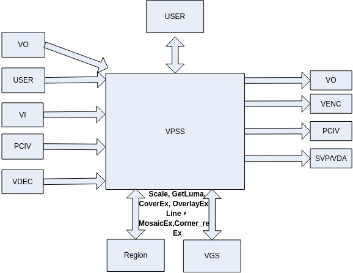
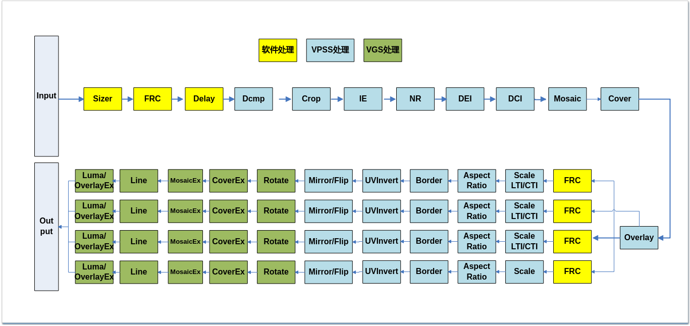
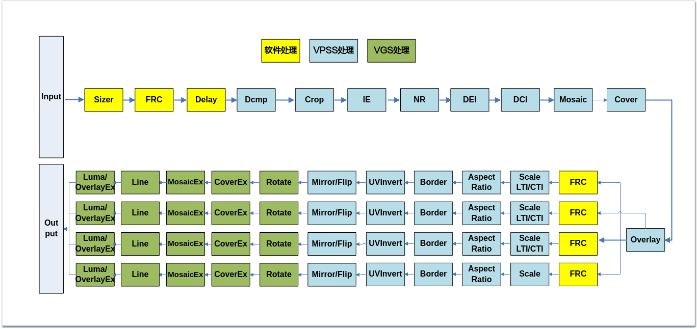
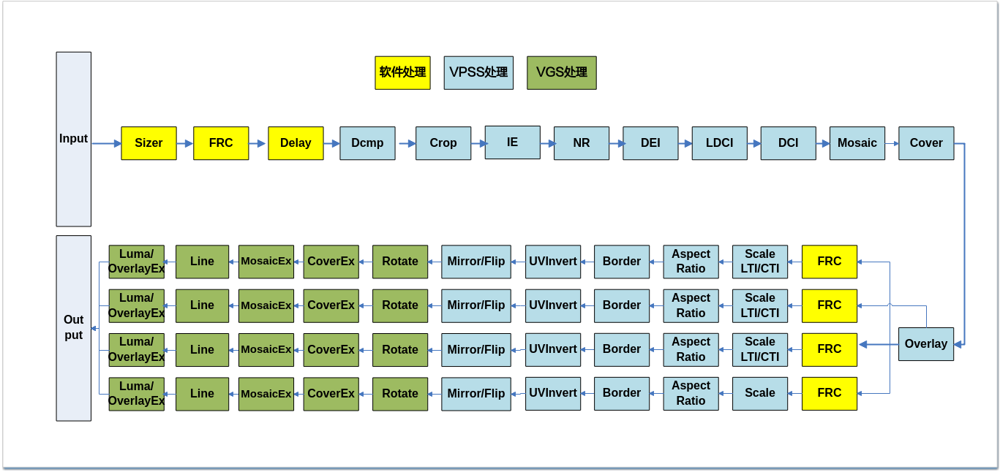
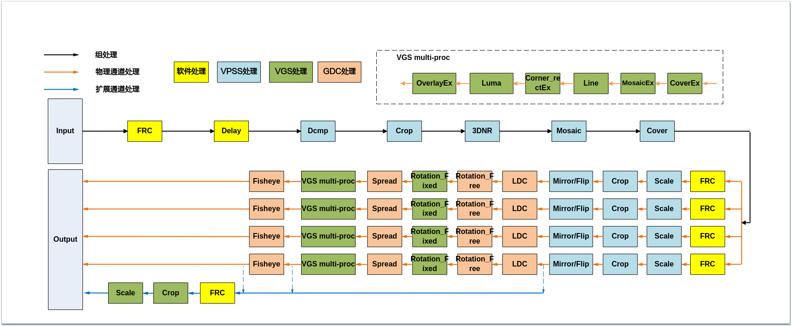
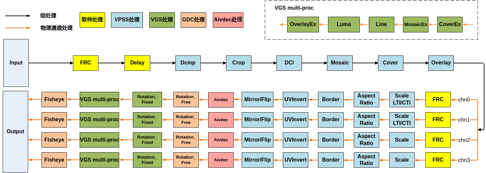

# 视频处理子系统<a name="ZH-CN_TOPIC_0000002408100194"></a>


## 概述<a name="ZH-CN_TOPIC_0000002441659645"></a>

VPSS（Video Process Sub-System）是视频处理子系统。支持对输入图像进行统一预处理，如去噪、去隔行、裁剪等，然后再对各通道分别进行处理，如缩放、加边框等。

支持的具体图像处理功能包括FRC\(Frame Rate Control\)、Crop、3DNR、DEI\(De-interlace\)、IE\(Image Enhance\)、LDCI\(Local Dynamic Contrast Improvement\)、DCI\(Dynamic Contrast Improvement\)、LTI\(LuminanceTransition Improvement\)/CTI\(Chroma Transition Improvement\)、Cover/CoverEx、Overlay/OverlayEx、Mosaic/MosaicEx、Scale、固定角度旋转、任意角度旋转、鱼眼矫正、LDC、展宽、Corner\_rectEx、Line、获取区域亮度和、低延时、Mirror/Flip、Aspect Ratio、Border、像素格式转换、压缩解压等。

## 功能描述<a name="ZH-CN_TOPIC_0000002441699329"></a>


### 基本概念<a name="ZH-CN_TOPIC_0000002441699377"></a>

-   Group
    -   VPSS对用户提供组（Group）的概念。最大个数请参考`OT_VPSS_MAX_GRP_NUM`定义，各Group分时复用VPSS硬件，硬件依次处理各个组提交的任务。
    -   如果用到的VPSS Group数量超过128 个，则需要修改/etc/profile，在其末尾加上ulimit -HSn 4096，指定系统同时最大可打开文件数为4096。

-   Channel

    VPSS组的通道。一个VPSS组提供多个通道，每个通道具有缩放等功能。

-   FRC

    帧率控制分为两种：组帧率控制和通道帧率控制。

    -   组帧率控制：用于控制各Group对输入图像的接收。
    -   通道帧率控制：用于控制各个通道图像的处理。

    当VPSS前端绑定的是VI模块时，组上帧率控制使用的是根据time\_ref做补偿的帧率控制算法，先还原VI原始帧率再做帧率控制，绑定的是其他模块时，组上帧率控制不考虑time\_ref，直接按比例做帧率控制。VPSS通道帧率控制不考虑time\_ref。VPSS帧率控制只能减帧，不能增帧。

-   Sizer

    图像尺寸筛选。前端VI混合采集时用来筛选指定尺寸图像。

-   Crop

    从图像中裁剪指定区域。裁剪类型分为绝对坐标裁剪和相对比例裁剪。

    -   组裁剪，对输入图像做裁剪；
    -   物理通道裁剪，对物理通道图像做裁剪；
    -   扩展通道裁剪，对扩展通道图像做裁剪。

-   DEI

    De-interlace，去隔行。将交错的隔行视频源还原成逐行视频源。

-   3DNR

    去噪。通过参数配置，把图像中的高斯噪声去除，使得图像变得平滑，有助于降低编码码率。

-   IE

    Image Enhance，图像增强。

-   LDCI

    Local Dynamic Contrast Improvement，局域动态对比度调节。基于局域直方图均衡的方法来增强局部的对比度，提升暗区细节，同时对图像中高频进行一定的增强，提升对比度。

-   DCI

    Dynamic Contrast Improvement，动态对比度调节。对图像进行动态的对比度调节，即在增强图像暗区亮度时不使亮区过亮，或降低亮区亮度时不使暗区过暗。

-   LTI/CTI

    Luminance/Chroma Transition Improvement，亮度/色度过渡增强，即图像锐化\(Sharpen\)。锐化图像的边缘和凸显图像细节，对经过缩放（Scale）后的图像进行频率补偿或增强，使得图像边缘锐利，轮廓清晰。

-   Scale

    缩放，对图像进行缩小放大。缩放倍数指水平、垂直各缩放多少倍。

-   Mirror/Flip

    Mirror即水平镜像，Flip即上下翻转。可使用Mirror+Flip实现180°旋转。

-   Mosaic
    -   马赛克，对VPSS输出图像在指定区域填充马赛克块。
    -   马赛克区域宽度要求4像素对齐，马赛克区域部分超出图像时，水平方向软件会自适应向下4对齐裁剪掉超出部分。

-   MosaicEx

    马赛克，调用VGS对VPSS物理通道的输出图像指定区域填充马赛克块。

-   Cover
    -   视频遮挡区域，对VPSS的输出图像填充纯色块。
    -   遮挡区域坐标类型分为绝对坐标遮挡和相对坐标比例遮挡。相对坐标的计算是相对输入图像。

-   CoverEx
    -   视频遮挡区域，调用VGS对VPSS物理通道的输出图像填充纯色块。
    -   遮挡区域坐标类型分为绝对坐标遮挡和相对坐标比例遮挡。相对坐标的计算是相对输入图像，不是通道图像，效果与Cover相对坐标类似。

-   Overlay

    视频叠加区域\(OSD\)，对VPSS输出图像叠加位图。

-   OverlayEx

    视频叠加区域，调用VGS对VPSS物理通道的输出图像叠加位图。

-   Line

    调用VGS对VPSS物理通道的输出图像画线。

-   Corner\_rectEx

    物理通道支持调用VGS在图像上打角框/实线框。

-   获取区域亮度和

    获取输入图像或物理通道输出图像指定区域亮度和。

-   鱼眼矫正

    物理通道支持对图像做鱼眼矫正。

-   LDC

    物理通道支持对图像做镜头畸变矫正。

-   展宽

    物理通道支持对图像做展宽处理。

-   低延时
    -   输入低延时，接收前端模块发送的低延时帧；
    -   输出低延时，通道向后端模块发送低延时帧。

-   固定角度旋转

    物理通道支持0度、90度、180度以及270度固定角度的旋转功能。

-   任意角度旋转

    物理通道支持任意角度旋转功能。

-   Aspect Ratio

    幅形比，指定输出画面相对于输入画面的宽高纵横比。

-   Border

    边框，VPSS在输出图像加边框。

-   工作模式

    VPSS工作模式，分为在线、离线等模式。详见“系统控制”章节。

-   压缩/解压
    -   支持通道输出图像进行压缩；支持对输入压缩图像解压；
    -   支持3DNR参考帧压缩/解压；
    -   紧凑段压缩、参考帧压缩可节省内存，其它压缩不节省内存。所有压缩都能改善带宽占用。

-   像素格式转换

    支持设置输出图像的像素格式。

-   备份节点

    原始图像的备份节点。每个Group都有一个备份节点，用于备份即将提交硬件处理的原始图像。VPSS在以下情况会将缓存队列头节点的图像放入备份节点：

    -   当原始图像要经过VPSS 硬件处理时，VPSS 会将其放入备份节点，并替换掉原有备份的图像。
    -   当后端绑定的接收模块要求VPSS 将队头图像放入备份节点时，VPSS 也会替换备份节点中的图像，即使该图像不经过硬件处理。

-   分块

    图像超过特定宽度时，分块处理。相应资源数在模块参数中设定。资源数设定需要大于等于实际需要的数量。

> **须知：** 
>-   Cover、Overlay、Mosaic为所有通道处理效果相同，不支持单独控制\(不支持Mask设置方式\)；
>-   同一时刻仅允许有一个通道放大；当一个通道进行semi-planar 420转semi-planar 422时，其它通道不能再放大；
>-   SS528V100/SS625V100/SS524V100/SS522V101输入图像宽度超过2688时分块。
>-   Hi3403V100输入图像宽度超过4096时分块。
>-   SS626V100输入图像宽度超过3840时分块。
>-   SS524V100/SS528V100开启DEI，且图像宽度超过960时分块。
>-   未有特殊说明，SS927V100与Hi3403V100内容一致。

### 功能描述<a name="ZH-CN_TOPIC_0000002441659557"></a>

VPSS在系统中位置如[图1](#fig73396123411)所示。

**图 1**  VPSS上下文关系<a name="fig73396123411"></a>  


通过调用SYS模块的绑定接口，可与VPSS/USER/VDEC/VI和VO/VENC/SVP等模块进行绑定，其中前者为VPSS的输入源，后者为VPSS的接收者。用户可通过MPI接口对Group进行管理。每个Group仅可与一个输入源绑定。Group的物理通道有两种工作模式：AUTO和USER，两种模式间可动态切换。AUTO模式下各通道仅可与一个接收者绑定，主要用于预览和回放场景下做播放控制。USER模式下各通道可与多个接收者绑定。

**需要特别注意**：**USER模式主要用于对同一通道图像进行多路编码的场景，此模式下播放控制不生效，因此回放场景下不建议使用USER模式**。VPSS只有工作在离线模式下才支持AUTO模式。

SS528V100功能规格支持参考图1数据流图。

SS625V100功能规格支持参考图2数据流图。

SS524V100功能规格支持参考图3数据流图。

SS522V101功能规格支持参考图4数据流图。

Hi3403V100功能规格支持参考图5数据流图。

SS626V100功能规格支持参考图6数据流图。

### 处理流程<a name="ZH-CN_TOPIC_0000002441659597"></a>

SS528V100 VPSS数据处理流程如[图1](#fig2394234205417)所示。

**图 1**  SS528V100 VPSS的数据流图<a name="fig2394234205417"></a>  


SS625V100 VPSS数据处理流程如[图2](#fig193991685918)所示。

**图 2**  SS625V100 VPSS的数据流图<a name="fig193991685918"></a>  


SS524V100 VPSS数据处理流程如[图3](#fig4231334803)所示。

**图 3**  SS524V100 VPSS的数据流图<a name="fig4231334803"></a>  


SS522V101 VPSS数据处理流程如[图4](#fig14807173820110)所示。

**图 4**  SS522V101 VPSS的数据流图<a name="fig14807173820110"></a>  


**图 5**  Hi3403V100 VPSS的数据流图<a name="fig076104110215"></a>  


**图 6**  SS626V100 VPSS的数据流图<a name="fig1380651110517"></a>  


> **说明：** 
>-   当SS528V100/SS625V100/SS524V100/SS522V101 VPSS性能不够时，可以使用VGS来代替VPSS做一部分功能。对应的VPSS的组号设置为\`OT_VPSS_VGS_GRP_NO`,  `OT_VPSS_MAX_GRP_NUM`  - 1\]，即最后（`OT_VPSS_MAX_GRP_NUM`-  `OT_VPSS_VGS_GRP_NO`）个组默认提交给VGS硬件来实现，用户可以根据实际场景自由选择是否用VGS硬件来代替VPSS 处理功能。如果通道是user模式，输入输出图像分辨率不变，且功能都不开启，则VGS 会bypass 此任务，不消耗VGS 性能，且输入输出是同一个VB。此类组有一些限制：
>    -   SS528V100/SS625V100不支持IE，NR，DEI，DCI，Mosaic，Overlay，LTI/CTI。
>    -   SS524V100/SS522V101不支持IE，NR，DEI，LDCI，DCI，Mosaic，Overlay，LTI/CTI。
>    -   SS528V100/SS625V100/SS524V100/SS522V101只支持从4个通道中选择1个通道输出。
>-   Hi3403V100 VPSS组号在\`OT_VPSS_VGS_GRP_NO`,  `OT_VPSS_MAX_GRP_NUM`  - 1\]范围内的组调用VGS硬件处理（此类组工作在离线模式），用于解码或VPSS性能不够的场景。单通道输出且不做任何处理时bypass处理，输入输出为同一个VB。此类组有如下限制：
>    -   不支持3DNR；
>    -   不支持Tile16x8格式输出，不支持TILE压缩；
>    -   仅支持3个物理通道；
>    -   无法获取通道亮度和。
>-   VDEC绑定VPSS，VPSS绑定VO场景，如果VPSS组是由VGS硬件处理且做bypass处理时，会将VDEC的私有VB发送给VO，如果需要销毁解码通道，需要调用ss\_mpi\_vo\_clear\_chn\_buf释放解码VB。
>-   Hi3403V100 VPSS支持8个扩展通道，图中仅画一个。扩展通道可以绑定到任意物理通道，图中仅示意性绑定到某个通道。扩展通道的输入位置可以选择为LDC之前、鱼眼前以及鱼眼后。
>-   用户设置的通道压缩，指的是VPSS通道最终输出的压缩模式。

> **须知：** 
>SS528V100/SS625V100/SS524V100/SS522V101通道像素格式为单分量时，不支持Line或任意四边形CoverEx处理。

### 输入输出特性<a name="ZH-CN_TOPIC_0000002408100254"></a>

VPSS物理输入特性，如VPSS输入格式特性表至VPSS输入分辨率表所示。

**表 1**  VPSS输入格式特性

<a name="_Ref17963009"></a>
<table><thead align="left"><tr id="row705mcpsimp"><th class="cellrowborder" rowspan="2" valign="top" id="mcps1.2.7.1.1"><p id="p707mcpsimp"><a name="p707mcpsimp"></a><a name="p707mcpsimp"></a>解决方案名称</p>
</th>
<th class="cellrowborder" colspan="2" valign="top" id="mcps1.2.7.1.2"><p id="p709mcpsimp"><a name="p709mcpsimp"></a><a name="p709mcpsimp"></a>数据位宽</p>
</th>
<th class="cellrowborder" colspan="2" valign="top" id="mcps1.2.7.1.3"><p id="p711mcpsimp"><a name="p711mcpsimp"></a><a name="p711mcpsimp"></a>视频格式</p>
</th>
<th class="cellrowborder" rowspan="2" valign="top" id="mcps1.2.7.1.4"><p id="p713mcpsimp"><a name="p713mcpsimp"></a><a name="p713mcpsimp"></a>输入像素格式</p>
</th>
</tr>
<tr id="row714mcpsimp"><th class="cellrowborder" valign="top" id="mcps1.2.7.2.1"><p id="p716mcpsimp"><a name="p716mcpsimp"></a><a name="p716mcpsimp"></a>8Bit</p>
</th>
<th class="cellrowborder" valign="top" id="mcps1.2.7.2.2"><p id="p718mcpsimp"><a name="p718mcpsimp"></a><a name="p718mcpsimp"></a>10Bit</p>
</th>
<th class="cellrowborder" valign="top" id="mcps1.2.7.2.3"><p id="p720mcpsimp"><a name="p720mcpsimp"></a><a name="p720mcpsimp"></a>Linear</p>
</th>
<th class="cellrowborder" valign="top" id="mcps1.2.7.2.4"><p id="p722mcpsimp"><a name="p722mcpsimp"></a><a name="p722mcpsimp"></a>Tile64X16</p>
</th>
</tr>
</thead>
<tbody><tr id="row724mcpsimp"><td class="cellrowborder" valign="top" width="19.19191919191919%" headers="mcps1.2.7.1.1 mcps1.2.7.2.1 "><p id="p726mcpsimp"><a name="p726mcpsimp"></a><a name="p726mcpsimp"></a>SS528V100</p>
</td>
<td class="cellrowborder" valign="top" width="7.07070707070707%" headers="mcps1.2.7.1.2 mcps1.2.7.2.2 "><p id="p728mcpsimp"><a name="p728mcpsimp"></a><a name="p728mcpsimp"></a>Y</p>
</td>
<td class="cellrowborder" valign="top" width="7.07070707070707%" headers="mcps1.2.7.1.2 mcps1.2.7.2.3 "><p id="p730mcpsimp"><a name="p730mcpsimp"></a><a name="p730mcpsimp"></a>N</p>
</td>
<td class="cellrowborder" valign="top" width="9.09090909090909%" headers="mcps1.2.7.1.3 mcps1.2.7.2.4 "><p id="p732mcpsimp"><a name="p732mcpsimp"></a><a name="p732mcpsimp"></a>Y</p>
</td>
<td class="cellrowborder" valign="top" width="13.13131313131313%" headers="mcps1.2.7.1.3 "><p id="p734mcpsimp"><a name="p734mcpsimp"></a><a name="p734mcpsimp"></a>Y</p>
</td>
<td class="cellrowborder" valign="top" width="44.44444444444445%" headers="mcps1.2.7.1.4 "><p id="p736mcpsimp"><a name="p736mcpsimp"></a><a name="p736mcpsimp"></a>OT_PIXEL_FORMAT_YVU_SEMIPLANAR_422、OT_PIXEL_FORMAT_YVU_SEMIPLANAR_420、OT_PIXEL_FORMAT_YUV_SEMIPLANAR_422、OT_PIXEL_FORMAT_YUV_SEMIPLANAR_420、OT_PIXEL_FORMAT_YUV_400</p>
</td>
</tr>
<tr id="row737mcpsimp"><td class="cellrowborder" valign="top" width="19.19191919191919%" headers="mcps1.2.7.1.1 mcps1.2.7.2.1 "><p id="p739mcpsimp"><a name="p739mcpsimp"></a><a name="p739mcpsimp"></a>SS625V100</p>
</td>
<td class="cellrowborder" valign="top" width="7.07070707070707%" headers="mcps1.2.7.1.2 mcps1.2.7.2.2 "><p id="p741mcpsimp"><a name="p741mcpsimp"></a><a name="p741mcpsimp"></a>Y</p>
</td>
<td class="cellrowborder" valign="top" width="7.07070707070707%" headers="mcps1.2.7.1.2 mcps1.2.7.2.3 "><p id="p743mcpsimp"><a name="p743mcpsimp"></a><a name="p743mcpsimp"></a>N</p>
</td>
<td class="cellrowborder" valign="top" width="9.09090909090909%" headers="mcps1.2.7.1.3 mcps1.2.7.2.4 "><p id="p745mcpsimp"><a name="p745mcpsimp"></a><a name="p745mcpsimp"></a>Y</p>
</td>
<td class="cellrowborder" valign="top" width="13.13131313131313%" headers="mcps1.2.7.1.3 "><p id="p747mcpsimp"><a name="p747mcpsimp"></a><a name="p747mcpsimp"></a>Y</p>
</td>
<td class="cellrowborder" valign="top" width="44.44444444444445%" headers="mcps1.2.7.1.4 "><p id="p749mcpsimp"><a name="p749mcpsimp"></a><a name="p749mcpsimp"></a>OT_PIXEL_FORMAT_YVU_SEMIPLANAR_422、OT_PIXEL_FORMAT_YVU_SEMIPLANAR_420、OT_PIXEL_FORMAT_YUV_SEMIPLANAR_422、OT_PIXEL_FORMAT_YUV_SEMIPLANAR_420、OT_PIXEL_FORMAT_YUV_400</p>
</td>
</tr>
<tr id="row750mcpsimp"><td class="cellrowborder" valign="top" width="19.19191919191919%" headers="mcps1.2.7.1.1 mcps1.2.7.2.1 "><p id="p752mcpsimp"><a name="p752mcpsimp"></a><a name="p752mcpsimp"></a>SS524V100</p>
</td>
<td class="cellrowborder" valign="top" width="7.07070707070707%" headers="mcps1.2.7.1.2 mcps1.2.7.2.2 "><p id="p754mcpsimp"><a name="p754mcpsimp"></a><a name="p754mcpsimp"></a>Y</p>
</td>
<td class="cellrowborder" valign="top" width="7.07070707070707%" headers="mcps1.2.7.1.2 mcps1.2.7.2.3 "><p id="p756mcpsimp"><a name="p756mcpsimp"></a><a name="p756mcpsimp"></a>N</p>
</td>
<td class="cellrowborder" valign="top" width="9.09090909090909%" headers="mcps1.2.7.1.3 mcps1.2.7.2.4 "><p id="p758mcpsimp"><a name="p758mcpsimp"></a><a name="p758mcpsimp"></a>Y</p>
</td>
<td class="cellrowborder" valign="top" width="13.13131313131313%" headers="mcps1.2.7.1.3 "><p id="p760mcpsimp"><a name="p760mcpsimp"></a><a name="p760mcpsimp"></a>Y</p>
</td>
<td class="cellrowborder" valign="top" width="44.44444444444445%" headers="mcps1.2.7.1.4 "><p id="p762mcpsimp"><a name="p762mcpsimp"></a><a name="p762mcpsimp"></a>OT_PIXEL_FORMAT_YVU_SEMIPLANAR_422、OT_PIXEL_FORMAT_YVU_SEMIPLANAR_420、OT_PIXEL_FORMAT_YUV_SEMIPLANAR_422、OT_PIXEL_FORMAT_YUV_SEMIPLANAR_420、OT_PIXEL_FORMAT_YUV_400</p>
</td>
</tr>
<tr id="row763mcpsimp"><td class="cellrowborder" valign="top" width="19.19191919191919%" headers="mcps1.2.7.1.1 mcps1.2.7.2.1 "><p id="p765mcpsimp"><a name="p765mcpsimp"></a><a name="p765mcpsimp"></a>SS522V101</p>
</td>
<td class="cellrowborder" valign="top" width="7.07070707070707%" headers="mcps1.2.7.1.2 mcps1.2.7.2.2 "><p id="p767mcpsimp"><a name="p767mcpsimp"></a><a name="p767mcpsimp"></a>Y</p>
</td>
<td class="cellrowborder" valign="top" width="7.07070707070707%" headers="mcps1.2.7.1.2 mcps1.2.7.2.3 "><p id="p769mcpsimp"><a name="p769mcpsimp"></a><a name="p769mcpsimp"></a>N</p>
</td>
<td class="cellrowborder" valign="top" width="9.09090909090909%" headers="mcps1.2.7.1.3 mcps1.2.7.2.4 "><p id="p771mcpsimp"><a name="p771mcpsimp"></a><a name="p771mcpsimp"></a>Y</p>
</td>
<td class="cellrowborder" valign="top" width="13.13131313131313%" headers="mcps1.2.7.1.3 "><p id="p773mcpsimp"><a name="p773mcpsimp"></a><a name="p773mcpsimp"></a>Y</p>
</td>
<td class="cellrowborder" valign="top" width="44.44444444444445%" headers="mcps1.2.7.1.4 "><p id="p775mcpsimp"><a name="p775mcpsimp"></a><a name="p775mcpsimp"></a>OT_PIXEL_FORMAT_YVU_SEMIPLANAR_422、OT_PIXEL_FORMAT_YVU_SEMIPLANAR_420、OT_PIXEL_FORMAT_YUV_SEMIPLANAR_422、OT_PIXEL_FORMAT_YUV_SEMIPLANAR_420、OT_PIXEL_FORMAT_YUV_400</p>
</td>
</tr>
<tr id="row776mcpsimp"><td class="cellrowborder" valign="top" width="19.19191919191919%" headers="mcps1.2.7.1.1 mcps1.2.7.2.1 "><p id="p778mcpsimp"><a name="p778mcpsimp"></a><a name="p778mcpsimp"></a>Hi3403V100</p>
</td>
<td class="cellrowborder" valign="top" width="7.07070707070707%" headers="mcps1.2.7.1.2 mcps1.2.7.2.2 "><p id="p780mcpsimp"><a name="p780mcpsimp"></a><a name="p780mcpsimp"></a>Y</p>
</td>
<td class="cellrowborder" valign="top" width="7.07070707070707%" headers="mcps1.2.7.1.2 mcps1.2.7.2.3 "><p id="p782mcpsimp"><a name="p782mcpsimp"></a><a name="p782mcpsimp"></a>N</p>
</td>
<td class="cellrowborder" valign="top" width="9.09090909090909%" headers="mcps1.2.7.1.3 mcps1.2.7.2.4 "><p id="p784mcpsimp"><a name="p784mcpsimp"></a><a name="p784mcpsimp"></a>Y</p>
</td>
<td class="cellrowborder" valign="top" width="13.13131313131313%" headers="mcps1.2.7.1.3 "><p id="p786mcpsimp"><a name="p786mcpsimp"></a><a name="p786mcpsimp"></a>Y</p>
</td>
<td class="cellrowborder" valign="top" width="44.44444444444445%" headers="mcps1.2.7.1.4 "><p id="p788mcpsimp"><a name="p788mcpsimp"></a><a name="p788mcpsimp"></a>OT_PIXEL_FORMAT_YVU_SEMIPLANAR_422、OT_PIXEL_FORMAT_YVU_SEMIPLANAR_420、OT_PIXEL_FORMAT_YUV_SEMIPLANAR_422、OT_PIXEL_FORMAT_YUV_SEMIPLANAR_420、OT_PIXEL_FORMAT_YUV_400</p>
</td>
</tr>
<tr id="row789mcpsimp"><td class="cellrowborder" valign="top" width="19.19191919191919%" headers="mcps1.2.7.1.1 mcps1.2.7.2.1 "><p id="p791mcpsimp"><a name="p791mcpsimp"></a><a name="p791mcpsimp"></a>SS626V100</p>
</td>
<td class="cellrowborder" valign="top" width="7.07070707070707%" headers="mcps1.2.7.1.2 mcps1.2.7.2.2 "><p id="p793mcpsimp"><a name="p793mcpsimp"></a><a name="p793mcpsimp"></a>Y</p>
</td>
<td class="cellrowborder" valign="top" width="7.07070707070707%" headers="mcps1.2.7.1.2 mcps1.2.7.2.3 "><p id="p795mcpsimp"><a name="p795mcpsimp"></a><a name="p795mcpsimp"></a>N</p>
</td>
<td class="cellrowborder" valign="top" width="9.09090909090909%" headers="mcps1.2.7.1.3 mcps1.2.7.2.4 "><p id="p797mcpsimp"><a name="p797mcpsimp"></a><a name="p797mcpsimp"></a>Y</p>
</td>
<td class="cellrowborder" valign="top" width="13.13131313131313%" headers="mcps1.2.7.1.3 "><p id="p799mcpsimp"><a name="p799mcpsimp"></a><a name="p799mcpsimp"></a>Y</p>
</td>
<td class="cellrowborder" valign="top" width="44.44444444444445%" headers="mcps1.2.7.1.4 "><p id="p801mcpsimp"><a name="p801mcpsimp"></a><a name="p801mcpsimp"></a>OT_PIXEL_FORMAT_YVU_SEMIPLANAR_422、OT_PIXEL_FORMAT_YVU_SEMIPLANAR_420、OT_PIXEL_FORMAT_YUV_SEMIPLANAR_422、OT_PIXEL_FORMAT_YUV_SEMIPLANAR_420、OT_PIXEL_FORMAT_YUV_400</p>
</td>
</tr>
</tbody>
</table>

> **说明：** 
>-   Hi3403V100仅组号在\`OT_VPSS_VGS_GRP_NO`,  `OT_VPSS_MAX_GRP_NUM`  - 1\]范围内的组支持输入Tile64x16格式。
>-   输入Tile64x16视频格式时，仅支持像素格式OT\_PIXEL\_FORMAT\_YVU\_SEMIPLANAR\_420。

**表 2**  VPSS输入解压特性

<a name="table805mcpsimp"></a>
<table><thead align="left"><tr id="row813mcpsimp"><th class="cellrowborder" rowspan="2" valign="top" id="mcps1.2.5.1.1"><p id="p815mcpsimp"><a name="p815mcpsimp"></a><a name="p815mcpsimp"></a>解决方案名称</p>
</th>
<th class="cellrowborder" colspan="3" valign="top" id="mcps1.2.5.1.2"><p id="p817mcpsimp"><a name="p817mcpsimp"></a><a name="p817mcpsimp"></a>解压缩模式</p>
</th>
</tr>
<tr id="row818mcpsimp"><th class="cellrowborder" valign="top" id="mcps1.2.5.2.1"><p id="p820mcpsimp"><a name="p820mcpsimp"></a><a name="p820mcpsimp"></a>SEG</p>
</th>
<th class="cellrowborder" valign="top" id="mcps1.2.5.2.2"><p id="p822mcpsimp"><a name="p822mcpsimp"></a><a name="p822mcpsimp"></a>SEG_COMPACT</p>
</th>
<th class="cellrowborder" valign="top" id="mcps1.2.5.2.3"><p id="p824mcpsimp"><a name="p824mcpsimp"></a><a name="p824mcpsimp"></a>TILE</p>
</th>
</tr>
</thead>
<tbody><tr id="row826mcpsimp"><td class="cellrowborder" valign="top" width="30.693069306930692%" headers="mcps1.2.5.1.1 mcps1.2.5.2.1 "><p id="p828mcpsimp"><a name="p828mcpsimp"></a><a name="p828mcpsimp"></a>SS528V100</p>
</td>
<td class="cellrowborder" valign="top" width="16.831683168316832%" headers="mcps1.2.5.1.2 mcps1.2.5.2.2 "><p id="p830mcpsimp"><a name="p830mcpsimp"></a><a name="p830mcpsimp"></a>Y</p>
</td>
<td class="cellrowborder" valign="top" width="22.772277227722775%" headers="mcps1.2.5.1.2 mcps1.2.5.2.3 "><p id="p832mcpsimp"><a name="p832mcpsimp"></a><a name="p832mcpsimp"></a>Y</p>
</td>
<td class="cellrowborder" valign="top" width="29.7029702970297%" headers="mcps1.2.5.1.2 "><p id="p834mcpsimp"><a name="p834mcpsimp"></a><a name="p834mcpsimp"></a>Y</p>
</td>
</tr>

</tbody>
</table>

> **说明：** 
>Hi3403V100仅组号在\`OT_VPSS_VGS_GRP_NO`,  `OT_VPSS_MAX_GRP_NUM`  - 1\]范围内的组支持输入TILE压缩。

**表 3**  VPSS输入分辨率

<a name="_Ref18008875"></a>
<table><thead align="left"><tr id="row891mcpsimp"><th class="cellrowborder" rowspan="2" valign="top" id="mcps1.2.6.1.1"><p id="p893mcpsimp"><a name="p893mcpsimp"></a><a name="p893mcpsimp"></a>解决方案名称</p>
</th>
<th class="cellrowborder" colspan="4" valign="top" id="mcps1.2.6.1.2"><p id="p895mcpsimp"><a name="p895mcpsimp"></a><a name="p895mcpsimp"></a>工作模式</p>
</th>
</tr>
<tr id="row896mcpsimp"><th class="cellrowborder" valign="top" id="mcps1.2.6.2.1"><p id="p898mcpsimp"><a name="p898mcpsimp"></a><a name="p898mcpsimp"></a>离线模式</p>
</th>
<th class="cellrowborder" valign="top" id="mcps1.2.6.2.2"><p id="p900mcpsimp"><a name="p900mcpsimp"></a><a name="p900mcpsimp"></a>OT_VI_ONLINE_VPSS_ONLINE</p>
</th>
<th class="cellrowborder" valign="top" id="mcps1.2.6.2.3"><p id="p902mcpsimp"><a name="p902mcpsimp"></a><a name="p902mcpsimp"></a>OT_VI_PARALLEL_VPSS_PARALLEL</p>
</th>
<th class="cellrowborder" valign="top" id="mcps1.2.6.2.4"><p id="p904mcpsimp"><a name="p904mcpsimp"></a><a name="p904mcpsimp"></a>OT_VI_OFFLINE_VPSS_ONLINE</p>
</th>
</tr>
</thead>
<tbody><tr id="row906mcpsimp"><td class="cellrowborder" valign="top" width="17%" headers="mcps1.2.6.1.1 mcps1.2.6.2.1 "><p id="p908mcpsimp"><a name="p908mcpsimp"></a><a name="p908mcpsimp"></a>SS528V100</p>
</td>
<td class="cellrowborder" valign="top" width="24%" headers="mcps1.2.6.1.2 mcps1.2.6.2.2 "><p id="p910mcpsimp"><a name="p910mcpsimp"></a><a name="p910mcpsimp"></a>宽[64, 16384]</p>
<p id="p911mcpsimp"><a name="p911mcpsimp"></a><a name="p911mcpsimp"></a>高[64, 8192]</p>
<p id="p912mcpsimp"><a name="p912mcpsimp"></a><a name="p912mcpsimp"></a>紧凑段压缩(SEG_COMPACT)：</p>
<p id="p913mcpsimp"><a name="p913mcpsimp"></a><a name="p913mcpsimp"></a>宽[64, 2688]</p>
<p id="p914mcpsimp"><a name="p914mcpsimp"></a><a name="p914mcpsimp"></a>高[64, 8192]</p>
</td>
<td class="cellrowborder" valign="top" width="20%" headers="mcps1.2.6.1.2 mcps1.2.6.2.3 "><p id="p916mcpsimp"><a name="p916mcpsimp"></a><a name="p916mcpsimp"></a>N</p>
</td>
<td class="cellrowborder" valign="top" width="19%" headers="mcps1.2.6.1.2 mcps1.2.6.2.4 "><p id="p918mcpsimp"><a name="p918mcpsimp"></a><a name="p918mcpsimp"></a>N</p>
</td>
<td class="cellrowborder" valign="top" width="20%" headers="mcps1.2.6.1.2 "><p id="p920mcpsimp"><a name="p920mcpsimp"></a><a name="p920mcpsimp"></a>N</p>
</td>
</tr>
<tr id="row921mcpsimp"><td class="cellrowborder" valign="top" width="17%" headers="mcps1.2.6.1.1 mcps1.2.6.2.1 "><p id="p923mcpsimp"><a name="p923mcpsimp"></a><a name="p923mcpsimp"></a>SS625V100</p>
</td>
<td class="cellrowborder" valign="top" width="24%" headers="mcps1.2.6.1.2 mcps1.2.6.2.2 "><p id="p925mcpsimp"><a name="p925mcpsimp"></a><a name="p925mcpsimp"></a>宽[64, 16384]</p>
<p id="p926mcpsimp"><a name="p926mcpsimp"></a><a name="p926mcpsimp"></a>高[64, 8192]</p>
<p id="p927mcpsimp"><a name="p927mcpsimp"></a><a name="p927mcpsimp"></a>紧凑段压缩(SEG_COMPACT)：</p>
<p id="p928mcpsimp"><a name="p928mcpsimp"></a><a name="p928mcpsimp"></a>宽[64, 2688]</p>
<p id="p929mcpsimp"><a name="p929mcpsimp"></a><a name="p929mcpsimp"></a>高[64, 8192]</p>
</td>
<td class="cellrowborder" valign="top" width="20%" headers="mcps1.2.6.1.2 mcps1.2.6.2.3 "><p id="p931mcpsimp"><a name="p931mcpsimp"></a><a name="p931mcpsimp"></a>N</p>
</td>
<td class="cellrowborder" valign="top" width="19%" headers="mcps1.2.6.1.2 mcps1.2.6.2.4 "><p id="p933mcpsimp"><a name="p933mcpsimp"></a><a name="p933mcpsimp"></a>N</p>
</td>
<td class="cellrowborder" valign="top" width="20%" headers="mcps1.2.6.1.2 "><p id="p935mcpsimp"><a name="p935mcpsimp"></a><a name="p935mcpsimp"></a>N</p>
</td>
</tr>
<tr id="row936mcpsimp"><td class="cellrowborder" valign="top" width="17%" headers="mcps1.2.6.1.1 mcps1.2.6.2.1 "><p id="p938mcpsimp"><a name="p938mcpsimp"></a><a name="p938mcpsimp"></a>SS524V100</p>
</td>
<td class="cellrowborder" valign="top" width="24%" headers="mcps1.2.6.1.2 mcps1.2.6.2.2 "><p id="p940mcpsimp"><a name="p940mcpsimp"></a><a name="p940mcpsimp"></a>宽[64, 16384]</p>
<p id="p941mcpsimp"><a name="p941mcpsimp"></a><a name="p941mcpsimp"></a>高[64, 8192]</p>
<p id="p942mcpsimp"><a name="p942mcpsimp"></a><a name="p942mcpsimp"></a>紧凑段压缩(SEG_COMPACT)：</p>
<p id="p943mcpsimp"><a name="p943mcpsimp"></a><a name="p943mcpsimp"></a>宽[64, 2688]</p>
<p id="p944mcpsimp"><a name="p944mcpsimp"></a><a name="p944mcpsimp"></a>高[64, 8192]</p>
</td>
<td class="cellrowborder" valign="top" width="20%" headers="mcps1.2.6.1.2 mcps1.2.6.2.3 "><p id="p946mcpsimp"><a name="p946mcpsimp"></a><a name="p946mcpsimp"></a>N</p>
</td>
<td class="cellrowborder" valign="top" width="19%" headers="mcps1.2.6.1.2 mcps1.2.6.2.4 "><p id="p948mcpsimp"><a name="p948mcpsimp"></a><a name="p948mcpsimp"></a>N</p>
</td>
<td class="cellrowborder" valign="top" width="20%" headers="mcps1.2.6.1.2 "><p id="p950mcpsimp"><a name="p950mcpsimp"></a><a name="p950mcpsimp"></a>N</p>
</td>
</tr>
<tr id="row951mcpsimp"><td class="cellrowborder" valign="top" width="17%" headers="mcps1.2.6.1.1 mcps1.2.6.2.1 "><p id="p953mcpsimp"><a name="p953mcpsimp"></a><a name="p953mcpsimp"></a>SS522V101</p>
</td>
<td class="cellrowborder" valign="top" width="24%" headers="mcps1.2.6.1.2 mcps1.2.6.2.2 "><p id="p955mcpsimp"><a name="p955mcpsimp"></a><a name="p955mcpsimp"></a>宽[64, 16384]</p>
<p id="p956mcpsimp"><a name="p956mcpsimp"></a><a name="p956mcpsimp"></a>高[64, 8192]</p>
<p id="p957mcpsimp"><a name="p957mcpsimp"></a><a name="p957mcpsimp"></a>紧凑段压缩(SEG_COMPACT)：</p>
<p id="p958mcpsimp"><a name="p958mcpsimp"></a><a name="p958mcpsimp"></a>宽[64, 2688]</p>
<p id="p959mcpsimp"><a name="p959mcpsimp"></a><a name="p959mcpsimp"></a>高[64, 8192]</p>
</td>
<td class="cellrowborder" valign="top" width="20%" headers="mcps1.2.6.1.2 mcps1.2.6.2.3 "><p id="p961mcpsimp"><a name="p961mcpsimp"></a><a name="p961mcpsimp"></a>N</p>
</td>
<td class="cellrowborder" valign="top" width="19%" headers="mcps1.2.6.1.2 mcps1.2.6.2.4 "><p id="p963mcpsimp"><a name="p963mcpsimp"></a><a name="p963mcpsimp"></a>N</p>
</td>
<td class="cellrowborder" valign="top" width="20%" headers="mcps1.2.6.1.2 "><p id="p965mcpsimp"><a name="p965mcpsimp"></a><a name="p965mcpsimp"></a>N</p>
</td>
</tr>
<tr id="row966mcpsimp"><td class="cellrowborder" valign="top" width="17%" headers="mcps1.2.6.1.1 mcps1.2.6.2.1 "><p id="p968mcpsimp"><a name="p968mcpsimp"></a><a name="p968mcpsimp"></a>Hi3403V100</p>
</td>
<td class="cellrowborder" valign="top" width="24%" headers="mcps1.2.6.1.2 mcps1.2.6.2.2 "><p id="p970mcpsimp"><a name="p970mcpsimp"></a><a name="p970mcpsimp"></a>宽[64, 8192]</p>
<p id="p971mcpsimp"><a name="p971mcpsimp"></a><a name="p971mcpsimp"></a>高[64, 8192]</p>
<p id="p972mcpsimp"><a name="p972mcpsimp"></a><a name="p972mcpsimp"></a>紧凑段压缩(SEG_COMPACT)：</p>
<p id="p973mcpsimp"><a name="p973mcpsimp"></a><a name="p973mcpsimp"></a>宽[64, 4096]</p>
<p id="p974mcpsimp"><a name="p974mcpsimp"></a><a name="p974mcpsimp"></a>高[64, 8192]</p>
</td>
<td class="cellrowborder" valign="top" width="20%" headers="mcps1.2.6.1.2 mcps1.2.6.2.3 "><p id="p976mcpsimp"><a name="p976mcpsimp"></a><a name="p976mcpsimp"></a>宽[64, 4096]</p>
<p id="p977mcpsimp"><a name="p977mcpsimp"></a><a name="p977mcpsimp"></a>高[64, 8192]</p>
</td>
<td class="cellrowborder" valign="top" width="19%" headers="mcps1.2.6.1.2 mcps1.2.6.2.4 "><p id="p979mcpsimp"><a name="p979mcpsimp"></a><a name="p979mcpsimp"></a>N</p>
</td>
<td class="cellrowborder" valign="top" width="20%" headers="mcps1.2.6.1.2 "><p id="p981mcpsimp"><a name="p981mcpsimp"></a><a name="p981mcpsimp"></a>宽[64, 8192]</p>
<p id="p982mcpsimp"><a name="p982mcpsimp"></a><a name="p982mcpsimp"></a>高[64, 8192]</p>
</td>
</tr>
<tr id="row983mcpsimp"><td class="cellrowborder" valign="top" width="17%" headers="mcps1.2.6.1.1 mcps1.2.6.2.1 "><p id="p985mcpsimp"><a name="p985mcpsimp"></a><a name="p985mcpsimp"></a>SS626V100</p>
</td>
<td class="cellrowborder" valign="top" width="24%" headers="mcps1.2.6.1.2 mcps1.2.6.2.2 "><p id="p987mcpsimp"><a name="p987mcpsimp"></a><a name="p987mcpsimp"></a>宽[64, 16384]</p>
<p id="p988mcpsimp"><a name="p988mcpsimp"></a><a name="p988mcpsimp"></a>高[64, 8192]</p>
<p id="p989mcpsimp"><a name="p989mcpsimp"></a><a name="p989mcpsimp"></a>紧凑段压缩(SEG_COMPACT)：</p>
<p id="p990mcpsimp"><a name="p990mcpsimp"></a><a name="p990mcpsimp"></a>宽[64, 3072]</p>
<p id="p991mcpsimp"><a name="p991mcpsimp"></a><a name="p991mcpsimp"></a>高[64, 8192]</p>
</td>
<td class="cellrowborder" valign="top" width="20%" headers="mcps1.2.6.1.2 mcps1.2.6.2.3 "><p id="p993mcpsimp"><a name="p993mcpsimp"></a><a name="p993mcpsimp"></a>N</p>
</td>
<td class="cellrowborder" valign="top" width="19%" headers="mcps1.2.6.1.2 mcps1.2.6.2.4 "><p id="p995mcpsimp"><a name="p995mcpsimp"></a><a name="p995mcpsimp"></a>N</p>
</td>
<td class="cellrowborder" valign="top" width="20%" headers="mcps1.2.6.1.2 "><p id="p997mcpsimp"><a name="p997mcpsimp"></a><a name="p997mcpsimp"></a>N</p>
</td>
</tr>
</tbody>
</table>

> **说明：** 
>-   离线模式包含OT\_VI\_OFFLINE\_VPSS\_OFFLINE、OT\_VI\_ONLINE\_VPSS\_OFFLINE、OT\_VI\_PARALLEL\_VPSS\_OFFLINE，即只要VI和VPSS离线，对于VPSS来说就是离线模式。
>    SS528V100/SS625V100/SS524V100/SS522V101/SS626V100无需关注离线模式具体指哪种模式的离线。
>    Hi3403V100离线模式仅支持OT\_VI\_OFFLINE\_VPSS\_OFFLINE、OT\_VI\_ONLINE\_VPSS\_OFFLINE。
>-   Hi3403V100 OT\_VI\_ONLINE\_VPSS\_ONLINE和OT\_VI\_OFFLINE\_VPSS\_ONLINE模式，实际输入分辨率限制取决于前端VI模块。

VPSS物理通道输出特性，如VPSS物理通道输出格式特性表\~VPSS物理通道输出分辨率所示。

**表 4**  VPSS物理通道输出格式特性

<a name="_Ref527997689"></a>
<table><thead align="left"><tr id="row1023mcpsimp"><th class="cellrowborder" rowspan="2" valign="top" id="mcps1.2.8.1.1"><p id="p1025mcpsimp"><a name="p1025mcpsimp"></a><a name="p1025mcpsimp"></a>解决方案名称</p>
</th>
<th class="cellrowborder" colspan="2" valign="top" id="mcps1.2.8.1.2"><p id="p1027mcpsimp"><a name="p1027mcpsimp"></a><a name="p1027mcpsimp"></a>数据位宽</p>
</th>
<th class="cellrowborder" colspan="3" valign="top" id="mcps1.2.8.1.3"><p id="p1029mcpsimp"><a name="p1029mcpsimp"></a><a name="p1029mcpsimp"></a>视频格式</p>
</th>
<th class="cellrowborder" rowspan="2" valign="top" id="mcps1.2.8.1.4"><p id="p1031mcpsimp"><a name="p1031mcpsimp"></a><a name="p1031mcpsimp"></a>输出像素格式</p>
</th>
</tr>
<tr id="row1032mcpsimp"><th class="cellrowborder" valign="top" id="mcps1.2.8.2.1"><p id="p1034mcpsimp"><a name="p1034mcpsimp"></a><a name="p1034mcpsimp"></a>8Bit</p>
</th>
<th class="cellrowborder" valign="top" id="mcps1.2.8.2.2"><p id="p1036mcpsimp"><a name="p1036mcpsimp"></a><a name="p1036mcpsimp"></a>10Bit</p>
</th>
<th class="cellrowborder" valign="top" id="mcps1.2.8.2.3"><p id="p1038mcpsimp"><a name="p1038mcpsimp"></a><a name="p1038mcpsimp"></a>Linear</p>
</th>
<th class="cellrowborder" valign="top" id="mcps1.2.8.2.4"><p id="p1040mcpsimp"><a name="p1040mcpsimp"></a><a name="p1040mcpsimp"></a>Tile</p>
<p id="p1041mcpsimp"><a name="p1041mcpsimp"></a><a name="p1041mcpsimp"></a>64x16</p>
</th>
<th class="cellrowborder" valign="top" id="mcps1.2.8.2.5"><p id="p1043mcpsimp"><a name="p1043mcpsimp"></a><a name="p1043mcpsimp"></a>Tile</p>
<p id="p1044mcpsimp"><a name="p1044mcpsimp"></a><a name="p1044mcpsimp"></a>16x8</p>
</th>
</tr>
</thead>
<tbody><tr id="row1046mcpsimp"><td class="cellrowborder" valign="top" width="16%" headers="mcps1.2.8.1.1 mcps1.2.8.2.1 "><p id="p1048mcpsimp"><a name="p1048mcpsimp"></a><a name="p1048mcpsimp"></a>SS528V100</p>
</td>
<td class="cellrowborder" valign="top" width="7.000000000000001%" headers="mcps1.2.8.1.2 mcps1.2.8.2.2 "><p id="p1050mcpsimp"><a name="p1050mcpsimp"></a><a name="p1050mcpsimp"></a>Y</p>
</td>
<td class="cellrowborder" valign="top" width="8%" headers="mcps1.2.8.1.2 mcps1.2.8.2.3 "><p id="p1052mcpsimp"><a name="p1052mcpsimp"></a><a name="p1052mcpsimp"></a>N</p>
</td>
<td class="cellrowborder" valign="top" width="7.000000000000001%" headers="mcps1.2.8.1.3 mcps1.2.8.2.4 "><p id="p1054mcpsimp"><a name="p1054mcpsimp"></a><a name="p1054mcpsimp"></a>Y</p>
</td>
<td class="cellrowborder" valign="top" width="8%" headers="mcps1.2.8.1.3 mcps1.2.8.2.5 "><p id="p1056mcpsimp"><a name="p1056mcpsimp"></a><a name="p1056mcpsimp"></a>N</p>
</td>
<td class="cellrowborder" valign="top" width="8%" headers="mcps1.2.8.1.3 "><p id="p1058mcpsimp"><a name="p1058mcpsimp"></a><a name="p1058mcpsimp"></a>N</p>
</td>
<td class="cellrowborder" valign="top" width="46%" headers="mcps1.2.8.1.4 "><p id="p1060mcpsimp"><a name="p1060mcpsimp"></a><a name="p1060mcpsimp"></a>OT_PIXEL_FORMAT_YVU_SEMIPLANAR_422、OT_PIXEL_FORMAT_YVU_SEMIPLANAR_420、OT_PIXEL_FORMAT_YUV_SEMIPLANAR_422、OT_PIXEL_FORMAT_YUV_SEMIPLANAR_420、OT_PIXEL_FORMAT_YUV_400</p>
</td>
</tr>

</tbody>
</table>

> **说明：** 
>Hi3403V100仅组号在\[0,99\]范围内的组支持输出Tile16x8格式。

**表 5**  VPSS物理通道输出压缩特性

<a name="table1137mcpsimp"></a>
<table><thead align="left"><tr id="row1146mcpsimp"><th class="cellrowborder" rowspan="2" valign="top" id="mcps1.2.6.1.1"><p id="p1148mcpsimp"><a name="p1148mcpsimp"></a><a name="p1148mcpsimp"></a>解决方案名称</p>
</th>
<th class="cellrowborder" colspan="4" valign="top" id="mcps1.2.6.1.2"><p id="p1150mcpsimp"><a name="p1150mcpsimp"></a><a name="p1150mcpsimp"></a>压缩输出模式</p>
</th>
</tr>
<tr id="row1151mcpsimp"><th class="cellrowborder" valign="top" id="mcps1.2.6.2.1"><p id="p1153mcpsimp"><a name="p1153mcpsimp"></a><a name="p1153mcpsimp"></a>SEG</p>
</th>
<th class="cellrowborder" valign="top" id="mcps1.2.6.2.2"><p id="p1155mcpsimp"><a name="p1155mcpsimp"></a><a name="p1155mcpsimp"></a>SEG_COMPACT</p>
</th>
<th class="cellrowborder" valign="top" id="mcps1.2.6.2.3"><p id="p1157mcpsimp"><a name="p1157mcpsimp"></a><a name="p1157mcpsimp"></a>LINE</p>
</th>
<th class="cellrowborder" valign="top" id="mcps1.2.6.2.4"><p id="p1159mcpsimp"><a name="p1159mcpsimp"></a><a name="p1159mcpsimp"></a>TILE</p>
</th>
</tr>
</thead>
<tbody><tr id="row1161mcpsimp"><td class="cellrowborder" valign="top" width="17.82178217821782%" headers="mcps1.2.6.1.1 mcps1.2.6.2.1 "><p id="p1163mcpsimp"><a name="p1163mcpsimp"></a><a name="p1163mcpsimp"></a>SS528V100</p>
</td>
<td class="cellrowborder" valign="top" width="17.82178217821782%" headers="mcps1.2.6.1.2 mcps1.2.6.2.2 "><p id="p1165mcpsimp"><a name="p1165mcpsimp"></a><a name="p1165mcpsimp"></a>仅通道0支持</p>
</td>
<td class="cellrowborder" valign="top" width="21.782178217821784%" headers="mcps1.2.6.1.2 mcps1.2.6.2.3 "><p id="p1167mcpsimp"><a name="p1167mcpsimp"></a><a name="p1167mcpsimp"></a>仅通道0支持</p>
</td>
<td class="cellrowborder" valign="top" width="20.792079207920793%" headers="mcps1.2.6.1.2 mcps1.2.6.2.4 "><p id="p1169mcpsimp"><a name="p1169mcpsimp"></a><a name="p1169mcpsimp"></a>仅通道2支持</p>
</td>
<td class="cellrowborder" valign="top" width="21.782178217821784%" headers="mcps1.2.6.1.2 "><p id="p1171mcpsimp"><a name="p1171mcpsimp"></a><a name="p1171mcpsimp"></a>不支持</p>
</td>
</tr>
<tr id="row1172mcpsimp"><td class="cellrowborder" valign="top" width="17.82178217821782%" headers="mcps1.2.6.1.1 mcps1.2.6.2.1 "><p id="p1174mcpsimp"><a name="p1174mcpsimp"></a><a name="p1174mcpsimp"></a>SS625V100</p>
</td>
<td class="cellrowborder" valign="top" width="17.82178217821782%" headers="mcps1.2.6.1.2 mcps1.2.6.2.2 "><p id="p1176mcpsimp"><a name="p1176mcpsimp"></a><a name="p1176mcpsimp"></a>仅通道0支持</p>
</td>
<td class="cellrowborder" valign="top" width="21.782178217821784%" headers="mcps1.2.6.1.2 mcps1.2.6.2.3 "><p id="p1178mcpsimp"><a name="p1178mcpsimp"></a><a name="p1178mcpsimp"></a>仅通道0支持</p>
</td>
<td class="cellrowborder" valign="top" width="20.792079207920793%" headers="mcps1.2.6.1.2 mcps1.2.6.2.4 "><p id="p1180mcpsimp"><a name="p1180mcpsimp"></a><a name="p1180mcpsimp"></a>仅通道2支持</p>
</td>
<td class="cellrowborder" valign="top" width="21.782178217821784%" headers="mcps1.2.6.1.2 "><p id="p1182mcpsimp"><a name="p1182mcpsimp"></a><a name="p1182mcpsimp"></a>不支持</p>
</td>
</tr>
<tr id="row1183mcpsimp"><td class="cellrowborder" valign="top" width="17.82178217821782%" headers="mcps1.2.6.1.1 mcps1.2.6.2.1 "><p id="p1185mcpsimp"><a name="p1185mcpsimp"></a><a name="p1185mcpsimp"></a>SS524V100</p>
</td>
<td class="cellrowborder" valign="top" width="17.82178217821782%" headers="mcps1.2.6.1.2 mcps1.2.6.2.2 "><p id="p1187mcpsimp"><a name="p1187mcpsimp"></a><a name="p1187mcpsimp"></a>仅通道0支持</p>
</td>
<td class="cellrowborder" valign="top" width="21.782178217821784%" headers="mcps1.2.6.1.2 mcps1.2.6.2.3 "><p id="p1189mcpsimp"><a name="p1189mcpsimp"></a><a name="p1189mcpsimp"></a>仅通道0支持</p>
</td>
<td class="cellrowborder" valign="top" width="20.792079207920793%" headers="mcps1.2.6.1.2 mcps1.2.6.2.4 "><p id="p1191mcpsimp"><a name="p1191mcpsimp"></a><a name="p1191mcpsimp"></a>仅通道2支持</p>
</td>
<td class="cellrowborder" valign="top" width="21.782178217821784%" headers="mcps1.2.6.1.2 "><p id="p1193mcpsimp"><a name="p1193mcpsimp"></a><a name="p1193mcpsimp"></a>不支持</p>
</td>
</tr>
<tr id="row1194mcpsimp"><td class="cellrowborder" valign="top" width="17.82178217821782%" headers="mcps1.2.6.1.1 mcps1.2.6.2.1 "><p id="p1196mcpsimp"><a name="p1196mcpsimp"></a><a name="p1196mcpsimp"></a>SS522V101</p>
</td>
<td class="cellrowborder" valign="top" width="17.82178217821782%" headers="mcps1.2.6.1.2 mcps1.2.6.2.2 "><p id="p1198mcpsimp"><a name="p1198mcpsimp"></a><a name="p1198mcpsimp"></a>仅通道0支持</p>
</td>
<td class="cellrowborder" valign="top" width="21.782178217821784%" headers="mcps1.2.6.1.2 mcps1.2.6.2.3 "><p id="p1200mcpsimp"><a name="p1200mcpsimp"></a><a name="p1200mcpsimp"></a>仅通道0支持</p>
</td>
<td class="cellrowborder" valign="top" width="20.792079207920793%" headers="mcps1.2.6.1.2 mcps1.2.6.2.4 "><p id="p1202mcpsimp"><a name="p1202mcpsimp"></a><a name="p1202mcpsimp"></a>仅通道2支持</p>
</td>
<td class="cellrowborder" valign="top" width="21.782178217821784%" headers="mcps1.2.6.1.2 "><p id="p1204mcpsimp"><a name="p1204mcpsimp"></a><a name="p1204mcpsimp"></a>不支持</p>
</td>
</tr>
<tr id="row1205mcpsimp"><td class="cellrowborder" valign="top" width="17.82178217821782%" headers="mcps1.2.6.1.1 mcps1.2.6.2.1 "><p xml:lang="fr-FR" id="p1207mcpsimp"><a name="p1207mcpsimp"></a><a name="p1207mcpsimp"></a>Hi3403V100</p>
</td>
<td class="cellrowborder" valign="top" width="17.82178217821782%" headers="mcps1.2.6.1.2 mcps1.2.6.2.2 "><p id="p1209mcpsimp"><a name="p1209mcpsimp"></a><a name="p1209mcpsimp"></a>仅通道0支持</p>
</td>
<td class="cellrowborder" valign="top" width="21.782178217821784%" headers="mcps1.2.6.1.2 mcps1.2.6.2.3 "><p id="p1211mcpsimp"><a name="p1211mcpsimp"></a><a name="p1211mcpsimp"></a>仅通道0支持</p>
</td>
<td class="cellrowborder" valign="top" width="20.792079207920793%" headers="mcps1.2.6.1.2 mcps1.2.6.2.4 "><p id="p1213mcpsimp"><a name="p1213mcpsimp"></a><a name="p1213mcpsimp"></a>不支持</p>
</td>
<td class="cellrowborder" valign="top" width="21.782178217821784%" headers="mcps1.2.6.1.2 "><p xml:lang="fr-FR" id="p1215mcpsimp"><a name="p1215mcpsimp"></a><a name="p1215mcpsimp"></a>仅组号在[0,99]范围内的组<span xml:lang="en-US" id="ph1216mcpsimp"><a name="ph1216mcpsimp"></a><a name="ph1216mcpsimp"></a>通道1支持</span></p>
</td>
</tr>
<tr id="row1217mcpsimp"><td class="cellrowborder" valign="top" width="17.82178217821782%" headers="mcps1.2.6.1.1 mcps1.2.6.2.1 "><p id="p1219mcpsimp"><a name="p1219mcpsimp"></a><a name="p1219mcpsimp"></a>SS626V100</p>
</td>
<td class="cellrowborder" valign="top" width="17.82178217821782%" headers="mcps1.2.6.1.2 mcps1.2.6.2.2 "><p id="p1221mcpsimp"><a name="p1221mcpsimp"></a><a name="p1221mcpsimp"></a>仅通道0和通道1支持</p>
</td>
<td class="cellrowborder" valign="top" width="21.782178217821784%" headers="mcps1.2.6.1.2 mcps1.2.6.2.3 "><p id="p1223mcpsimp"><a name="p1223mcpsimp"></a><a name="p1223mcpsimp"></a>仅通道0和通道1支持</p>
</td>
<td class="cellrowborder" valign="top" width="20.792079207920793%" headers="mcps1.2.6.1.2 mcps1.2.6.2.4 "><p id="p1225mcpsimp"><a name="p1225mcpsimp"></a><a name="p1225mcpsimp"></a>仅通道0和通道1支持</p>
</td>
<td class="cellrowborder" valign="top" width="21.782178217821784%" headers="mcps1.2.6.1.2 "><p id="p1227mcpsimp"><a name="p1227mcpsimp"></a><a name="p1227mcpsimp"></a>不支持</p>
</td>
</tr>
</tbody>
</table>

**表 6**  VPSS物理通道输出分辨率

<a name="_Ref17963192"></a>
<table><thead align="left"><tr id="row1236mcpsimp"><th class="cellrowborder" rowspan="2" valign="top" id="mcps1.2.6.1.1"><p id="p1238mcpsimp"><a name="p1238mcpsimp"></a><a name="p1238mcpsimp"></a>解决方案名称</p>
</th>
<th class="cellrowborder" colspan="4" valign="top" id="mcps1.2.6.1.2"><p id="p1240mcpsimp"><a name="p1240mcpsimp"></a><a name="p1240mcpsimp"></a>工作模式</p>
</th>
</tr>
<tr id="row1241mcpsimp"><th class="cellrowborder" valign="top" id="mcps1.2.6.2.1"><p id="p1243mcpsimp"><a name="p1243mcpsimp"></a><a name="p1243mcpsimp"></a>离线模式</p>
</th>
<th class="cellrowborder" valign="top" id="mcps1.2.6.2.2"><p id="p1245mcpsimp"><a name="p1245mcpsimp"></a><a name="p1245mcpsimp"></a>OT_VI_ONLINE_VPSS_ONLINE</p>
</th>
<th class="cellrowborder" valign="top" id="mcps1.2.6.2.3"><p id="p1247mcpsimp"><a name="p1247mcpsimp"></a><a name="p1247mcpsimp"></a>OT_VI_PARALLEL_VPSS_PARALLEL</p>
</th>
<th class="cellrowborder" valign="top" id="mcps1.2.6.2.4"><p id="p1249mcpsimp"><a name="p1249mcpsimp"></a><a name="p1249mcpsimp"></a>OT_VI_OFFLINE_VPSS_ONLINE</p>
</th>
</tr>
</thead>
<tbody><tr id="row1251mcpsimp"><td class="cellrowborder" valign="top" width="17.82178217821782%" headers="mcps1.2.6.1.1 mcps1.2.6.2.1 "><p id="p1253mcpsimp"><a name="p1253mcpsimp"></a><a name="p1253mcpsimp"></a>SS528V100</p>
</td>
<td class="cellrowborder" valign="top" width="17.82178217821782%" headers="mcps1.2.6.1.2 mcps1.2.6.2.2 "><p id="p1255mcpsimp"><a name="p1255mcpsimp"></a><a name="p1255mcpsimp"></a>宽[64, 16384]</p>
<p id="p1256mcpsimp"><a name="p1256mcpsimp"></a><a name="p1256mcpsimp"></a>高[64, 8192]</p>
</td>
<td class="cellrowborder" valign="top" width="21.782178217821784%" headers="mcps1.2.6.1.2 mcps1.2.6.2.3 "><p id="p1258mcpsimp"><a name="p1258mcpsimp"></a><a name="p1258mcpsimp"></a>N</p>
</td>
<td class="cellrowborder" valign="top" width="20.792079207920793%" headers="mcps1.2.6.1.2 mcps1.2.6.2.4 "><p id="p1260mcpsimp"><a name="p1260mcpsimp"></a><a name="p1260mcpsimp"></a>N</p>
</td>
<td class="cellrowborder" valign="top" width="21.782178217821784%" headers="mcps1.2.6.1.2 "><p id="p1262mcpsimp"><a name="p1262mcpsimp"></a><a name="p1262mcpsimp"></a>N</p>
</td>
</tr>

</tbody>
</table>

> **须知：** 
>-   输入宽高2像素对齐（3DNR 打开时宽要求4像素对齐，DEI打开时要求宽高4像素对齐）。输入linear非压缩图像时，支持奇数分辨率输入。
>-   通道写出宽高2像素对齐。
>-   VPSS调用VGS做旋转时，需要额外申请一块临时buffer，用于存放处理后的图像，因此也需要一次额外读写DDR。
>-   SS528V100/SS625V100/SS524V100/SS522V101 VPSS物理通道缩小超过15倍时\(输入图像宽度大于2688且输出为非紧凑段压缩时是10倍\)，需要额外申请一块临时buffer，buffer宽高均为输出图像的2倍，分配VB Blk时需要考虑相关配置。同时也需要一次额外读写DDR。
>-   Hi3403V100 VPSS物理通道缩小超过15倍时（输入图像宽度大于4096且通道0开启压缩时为14倍），需要额外申请一块临时buffer，buffer宽高均为输出图像的2倍，分配VB Blk时需要考虑相关配置。同时也需要一次额外读写DDR。
>-   SS626V100 VPSS物理通道缩小超过15倍时（输入图像宽度大于3840且通道0开启压缩时为14倍），需要额外申请一块临时buffer，buffer宽高均输出图像的2倍，分配VB Blk时需要考虑相关配置。同时也需要一次额外读写DDR。
>-   SS528V100/SS625V100/SS524V100/SS522V101通道1和通道3不支持压缩，如果系统带宽压力大，不建议这两个通道做图像放大处理。
>-   SS528V100/SS625V100开启3DNR且参考帧为帧压缩时，最大高度不能超过4096。
>-   Hi3403V100 VPSS通道1输出Tile16x8格式时，输出图像宽度不能大于4096。
>-   通过ss\_mpi\_sys\_set\_scale\_coef\_level接口调节缩放效果时，需要考虑VPSS通道缩小倍数超过硬件限制而调用VGS辅助缩小的情况，此时VGS固定缩小2倍，可以反推VPSS的缩放倍数，从而得到缩放范围。

视频处理子系统物理通道在不同压缩场景下的功能限制如SS528V100 VPSS物理通道压缩输出时功能限制表\~SS626V100 VPSS物理通道压缩输出时功能限制表所示。

**表 7**  SS528V100 VPSS物理通道压缩输出时功能限制

<a name="_Ref17963414"></a>
<table><thead align="left"><tr id="row1357mcpsimp"><th class="cellrowborder" rowspan="2" valign="top" id="mcps1.2.8.1.1"><p id="p1359mcpsimp"><a name="p1359mcpsimp"></a><a name="p1359mcpsimp"></a>压缩类型</p>
</th>
<th class="cellrowborder" colspan="6" valign="top" id="mcps1.2.8.1.2"><p id="p1361mcpsimp"><a name="p1361mcpsimp"></a><a name="p1361mcpsimp"></a>功能</p>
</th>
</tr>
<tr id="row1362mcpsimp"><th class="cellrowborder" valign="top" id="mcps1.2.8.2.1"><p id="p1364mcpsimp"><a name="p1364mcpsimp"></a><a name="p1364mcpsimp"></a>Coverex/ Mosaicex/ Overlayex</p>
</th>
<th class="cellrowborder" valign="top" id="mcps1.2.8.2.2"><p id="p1366mcpsimp"><a name="p1366mcpsimp"></a><a name="p1366mcpsimp"></a>Line</p>
</th>
<th class="cellrowborder" valign="top" id="mcps1.2.8.2.3"><p id="p1368mcpsimp"><a name="p1368mcpsimp"></a><a name="p1368mcpsimp"></a>Mirror/Flip</p>
</th>
<th class="cellrowborder" valign="top" id="mcps1.2.8.2.4"><p id="p1370mcpsimp"><a name="p1370mcpsimp"></a><a name="p1370mcpsimp"></a>旋转(90,270)</p>
</th>
<th class="cellrowborder" valign="top" id="mcps1.2.8.2.5"><p id="p1372mcpsimp"><a name="p1372mcpsimp"></a><a name="p1372mcpsimp"></a>亮度和统计</p>
</th>
<th class="cellrowborder" valign="top" id="mcps1.2.8.2.6"><p id="p1374mcpsimp"><a name="p1374mcpsimp"></a><a name="p1374mcpsimp"></a>输入输出Buffer共用</p>
</th>
</tr>
</thead>
<tbody><tr id="row1376mcpsimp"><td class="cellrowborder" valign="top" width="21%" headers="mcps1.2.8.1.1 mcps1.2.8.2.1 "><p id="p1378mcpsimp"><a name="p1378mcpsimp"></a><a name="p1378mcpsimp"></a>紧凑段压缩(SEG_COMPACT)</p>
</td>
<td class="cellrowborder" valign="top" width="15%" headers="mcps1.2.8.1.2 mcps1.2.8.2.2 "><p id="p1380mcpsimp"><a name="p1380mcpsimp"></a><a name="p1380mcpsimp"></a>不支持</p>
</td>
<td class="cellrowborder" valign="top" width="9%" headers="mcps1.2.8.1.2 mcps1.2.8.2.3 "><p id="p1382mcpsimp"><a name="p1382mcpsimp"></a><a name="p1382mcpsimp"></a>不支持</p>
</td>
<td class="cellrowborder" valign="top" width="16%" headers="mcps1.2.8.1.2 mcps1.2.8.2.4 "><p id="p1384mcpsimp"><a name="p1384mcpsimp"></a><a name="p1384mcpsimp"></a>仅后端接VENC时支持</p>
</td>
<td class="cellrowborder" valign="top" width="11%" headers="mcps1.2.8.1.2 mcps1.2.8.2.5 "><p id="p1386mcpsimp"><a name="p1386mcpsimp"></a><a name="p1386mcpsimp"></a>不支持</p>
</td>
<td class="cellrowborder" valign="top" width="15%" headers="mcps1.2.8.1.2 mcps1.2.8.2.6 "><p id="p1388mcpsimp"><a name="p1388mcpsimp"></a><a name="p1388mcpsimp"></a>不支持</p>
</td>
<td class="cellrowborder" valign="top" width="13%" headers="mcps1.2.8.1.2 "><p id="p1390mcpsimp"><a name="p1390mcpsimp"></a><a name="p1390mcpsimp"></a>不支持</p>
</td>
</tr>
<tr id="row1391mcpsimp"><td class="cellrowborder" valign="top" width="21%" headers="mcps1.2.8.1.1 mcps1.2.8.2.1 "><p id="p1393mcpsimp"><a name="p1393mcpsimp"></a><a name="p1393mcpsimp"></a>非紧凑段压缩(SEG)</p>
</td>
<td class="cellrowborder" valign="top" width="15%" headers="mcps1.2.8.1.2 mcps1.2.8.2.2 "><p id="p1395mcpsimp"><a name="p1395mcpsimp"></a><a name="p1395mcpsimp"></a>支持</p>
</td>
<td class="cellrowborder" valign="top" width="9%" headers="mcps1.2.8.1.2 mcps1.2.8.2.3 "><p id="p1397mcpsimp"><a name="p1397mcpsimp"></a><a name="p1397mcpsimp"></a>只支持画横线、竖线</p>
</td>
<td class="cellrowborder" valign="top" width="16%" headers="mcps1.2.8.1.2 mcps1.2.8.2.4 "><p id="p1399mcpsimp"><a name="p1399mcpsimp"></a><a name="p1399mcpsimp"></a>支持</p>
</td>
<td class="cellrowborder" valign="top" width="11%" headers="mcps1.2.8.1.2 mcps1.2.8.2.5 "><p id="p1401mcpsimp"><a name="p1401mcpsimp"></a><a name="p1401mcpsimp"></a>不支持</p>
</td>
<td class="cellrowborder" valign="top" width="15%" headers="mcps1.2.8.1.2 mcps1.2.8.2.6 "><p id="p1403mcpsimp"><a name="p1403mcpsimp"></a><a name="p1403mcpsimp"></a>支持</p>
</td>
<td class="cellrowborder" valign="top" width="13%" headers="mcps1.2.8.1.2 "><p id="p1405mcpsimp"><a name="p1405mcpsimp"></a><a name="p1405mcpsimp"></a>支持</p>
</td>
</tr>
<tr id="row1406mcpsimp"><td class="cellrowborder" valign="top" width="21%" headers="mcps1.2.8.1.1 mcps1.2.8.2.1 "><p id="p1408mcpsimp"><a name="p1408mcpsimp"></a><a name="p1408mcpsimp"></a>行压缩(LINE)</p>
</td>
<td class="cellrowborder" valign="top" width="15%" headers="mcps1.2.8.1.2 mcps1.2.8.2.2 "><p id="p1410mcpsimp"><a name="p1410mcpsimp"></a><a name="p1410mcpsimp"></a>支持</p>
</td>
<td class="cellrowborder" valign="top" width="9%" headers="mcps1.2.8.1.2 mcps1.2.8.2.3 "><p id="p1412mcpsimp"><a name="p1412mcpsimp"></a><a name="p1412mcpsimp"></a>只支持画横线、竖线</p>
</td>
<td class="cellrowborder" valign="top" width="16%" headers="mcps1.2.8.1.2 mcps1.2.8.2.4 "><p id="p1414mcpsimp"><a name="p1414mcpsimp"></a><a name="p1414mcpsimp"></a>Mirror不支持，Flip支持</p>
</td>
<td class="cellrowborder" valign="top" width="11%" headers="mcps1.2.8.1.2 mcps1.2.8.2.5 "><p id="p1416mcpsimp"><a name="p1416mcpsimp"></a><a name="p1416mcpsimp"></a>不支持</p>
</td>
<td class="cellrowborder" valign="top" width="15%" headers="mcps1.2.8.1.2 mcps1.2.8.2.6 "><p id="p1418mcpsimp"><a name="p1418mcpsimp"></a><a name="p1418mcpsimp"></a>支持</p>
</td>
<td class="cellrowborder" valign="top" width="13%" headers="mcps1.2.8.1.2 "><p id="p1420mcpsimp"><a name="p1420mcpsimp"></a><a name="p1420mcpsimp"></a>支持</p>
</td>
</tr>
</tbody>
</table>

**表 8**  SS625V100 VPSS物理通道压缩输出时功能限制

<a name="table1421mcpsimp"></a>
<table><thead align="left"><tr id="row1432mcpsimp"><th class="cellrowborder" rowspan="2" valign="top" id="mcps1.2.8.1.1"><p id="p1434mcpsimp"><a name="p1434mcpsimp"></a><a name="p1434mcpsimp"></a>压缩类型</p>
</th>
<th class="cellrowborder" colspan="6" valign="top" id="mcps1.2.8.1.2"><p id="p1436mcpsimp"><a name="p1436mcpsimp"></a><a name="p1436mcpsimp"></a>功能</p>
</th>
</tr>
<tr id="row1437mcpsimp"><th class="cellrowborder" valign="top" id="mcps1.2.8.2.1"><p id="p1439mcpsimp"><a name="p1439mcpsimp"></a><a name="p1439mcpsimp"></a>Coverex/ Mosaicex/ Overlayex</p>
</th>
<th class="cellrowborder" valign="top" id="mcps1.2.8.2.2"><p id="p1441mcpsimp"><a name="p1441mcpsimp"></a><a name="p1441mcpsimp"></a>Line</p>
</th>
<th class="cellrowborder" valign="top" id="mcps1.2.8.2.3"><p id="p1443mcpsimp"><a name="p1443mcpsimp"></a><a name="p1443mcpsimp"></a>Mirror/Flip</p>
</th>
<th class="cellrowborder" valign="top" id="mcps1.2.8.2.4"><p id="p1445mcpsimp"><a name="p1445mcpsimp"></a><a name="p1445mcpsimp"></a>旋转(90,270)</p>
</th>
<th class="cellrowborder" valign="top" id="mcps1.2.8.2.5"><p id="p1447mcpsimp"><a name="p1447mcpsimp"></a><a name="p1447mcpsimp"></a>亮度和统计</p>
</th>
<th class="cellrowborder" valign="top" id="mcps1.2.8.2.6"><p id="p1449mcpsimp"><a name="p1449mcpsimp"></a><a name="p1449mcpsimp"></a>输入输出Buffer共用</p>
</th>
</tr>
</thead>
<tbody><tr id="row1451mcpsimp"><td class="cellrowborder" valign="top" width="21%" headers="mcps1.2.8.1.1 mcps1.2.8.2.1 "><p id="p1453mcpsimp"><a name="p1453mcpsimp"></a><a name="p1453mcpsimp"></a>紧凑段压缩(SEG_COMPACT)</p>
</td>
<td class="cellrowborder" valign="top" width="15%" headers="mcps1.2.8.1.2 mcps1.2.8.2.2 "><p id="p1455mcpsimp"><a name="p1455mcpsimp"></a><a name="p1455mcpsimp"></a>不支持</p>
</td>
<td class="cellrowborder" valign="top" width="10%" headers="mcps1.2.8.1.2 mcps1.2.8.2.3 "><p id="p1457mcpsimp"><a name="p1457mcpsimp"></a><a name="p1457mcpsimp"></a>不支持</p>
</td>
<td class="cellrowborder" valign="top" width="15%" headers="mcps1.2.8.1.2 mcps1.2.8.2.4 "><p id="p1459mcpsimp"><a name="p1459mcpsimp"></a><a name="p1459mcpsimp"></a>仅后端接VENC时支持</p>
</td>
<td class="cellrowborder" valign="top" width="11%" headers="mcps1.2.8.1.2 mcps1.2.8.2.5 "><p id="p1461mcpsimp"><a name="p1461mcpsimp"></a><a name="p1461mcpsimp"></a>不支持</p>
</td>
<td class="cellrowborder" valign="top" width="15%" headers="mcps1.2.8.1.2 mcps1.2.8.2.6 "><p id="p1463mcpsimp"><a name="p1463mcpsimp"></a><a name="p1463mcpsimp"></a>不支持</p>
</td>
<td class="cellrowborder" valign="top" width="13%" headers="mcps1.2.8.1.2 "><p id="p1465mcpsimp"><a name="p1465mcpsimp"></a><a name="p1465mcpsimp"></a>不支持</p>
</td>
</tr>
<tr id="row1466mcpsimp"><td class="cellrowborder" valign="top" width="21%" headers="mcps1.2.8.1.1 mcps1.2.8.2.1 "><p id="p1468mcpsimp"><a name="p1468mcpsimp"></a><a name="p1468mcpsimp"></a>非紧凑段压缩(SEG)</p>
</td>
<td class="cellrowborder" valign="top" width="15%" headers="mcps1.2.8.1.2 mcps1.2.8.2.2 "><p id="p1470mcpsimp"><a name="p1470mcpsimp"></a><a name="p1470mcpsimp"></a>支持</p>
</td>
<td class="cellrowborder" valign="top" width="10%" headers="mcps1.2.8.1.2 mcps1.2.8.2.3 "><p id="p1472mcpsimp"><a name="p1472mcpsimp"></a><a name="p1472mcpsimp"></a>只支持画横线、竖线</p>
</td>
<td class="cellrowborder" valign="top" width="15%" headers="mcps1.2.8.1.2 mcps1.2.8.2.4 "><p id="p1474mcpsimp"><a name="p1474mcpsimp"></a><a name="p1474mcpsimp"></a>支持</p>
</td>
<td class="cellrowborder" valign="top" width="11%" headers="mcps1.2.8.1.2 mcps1.2.8.2.5 "><p id="p1476mcpsimp"><a name="p1476mcpsimp"></a><a name="p1476mcpsimp"></a>不支持</p>
</td>
<td class="cellrowborder" valign="top" width="15%" headers="mcps1.2.8.1.2 mcps1.2.8.2.6 "><p id="p1478mcpsimp"><a name="p1478mcpsimp"></a><a name="p1478mcpsimp"></a>支持</p>
</td>
<td class="cellrowborder" valign="top" width="13%" headers="mcps1.2.8.1.2 "><p id="p1480mcpsimp"><a name="p1480mcpsimp"></a><a name="p1480mcpsimp"></a>支持</p>
</td>
</tr>
<tr id="row1481mcpsimp"><td class="cellrowborder" valign="top" width="21%" headers="mcps1.2.8.1.1 mcps1.2.8.2.1 "><p id="p1483mcpsimp"><a name="p1483mcpsimp"></a><a name="p1483mcpsimp"></a>行压缩(LINE)</p>
</td>
<td class="cellrowborder" valign="top" width="15%" headers="mcps1.2.8.1.2 mcps1.2.8.2.2 "><p id="p1485mcpsimp"><a name="p1485mcpsimp"></a><a name="p1485mcpsimp"></a>支持</p>
</td>
<td class="cellrowborder" valign="top" width="10%" headers="mcps1.2.8.1.2 mcps1.2.8.2.3 "><p id="p1487mcpsimp"><a name="p1487mcpsimp"></a><a name="p1487mcpsimp"></a>只支持画横线、竖线</p>
</td>
<td class="cellrowborder" valign="top" width="15%" headers="mcps1.2.8.1.2 mcps1.2.8.2.4 "><p id="p1489mcpsimp"><a name="p1489mcpsimp"></a><a name="p1489mcpsimp"></a>Mirror不支持，Flip支持</p>
</td>
<td class="cellrowborder" valign="top" width="11%" headers="mcps1.2.8.1.2 mcps1.2.8.2.5 "><p id="p1491mcpsimp"><a name="p1491mcpsimp"></a><a name="p1491mcpsimp"></a>不支持</p>
</td>
<td class="cellrowborder" valign="top" width="15%" headers="mcps1.2.8.1.2 mcps1.2.8.2.6 "><p id="p1493mcpsimp"><a name="p1493mcpsimp"></a><a name="p1493mcpsimp"></a>支持</p>
</td>
<td class="cellrowborder" valign="top" width="13%" headers="mcps1.2.8.1.2 "><p id="p1495mcpsimp"><a name="p1495mcpsimp"></a><a name="p1495mcpsimp"></a>支持</p>
</td>
</tr>
</tbody>
</table>

**表 9**  SS524V100 VPSS物理通道压缩输出时功能限制

<a name="table1496mcpsimp"></a>
<table><thead align="left"><tr id="row1507mcpsimp"><th class="cellrowborder" rowspan="2" valign="top" id="mcps1.2.8.1.1"><p id="p1509mcpsimp"><a name="p1509mcpsimp"></a><a name="p1509mcpsimp"></a>压缩类型</p>
</th>
<th class="cellrowborder" colspan="6" valign="top" id="mcps1.2.8.1.2"><p id="p1511mcpsimp"><a name="p1511mcpsimp"></a><a name="p1511mcpsimp"></a>功能</p>
</th>
</tr>
<tr id="row1512mcpsimp"><th class="cellrowborder" valign="top" id="mcps1.2.8.2.1"><p id="p1514mcpsimp"><a name="p1514mcpsimp"></a><a name="p1514mcpsimp"></a>Coverex/ Mosaicex/ Overlayex</p>
</th>
<th class="cellrowborder" valign="top" id="mcps1.2.8.2.2"><p id="p1516mcpsimp"><a name="p1516mcpsimp"></a><a name="p1516mcpsimp"></a>Line</p>
</th>
<th class="cellrowborder" valign="top" id="mcps1.2.8.2.3"><p id="p1518mcpsimp"><a name="p1518mcpsimp"></a><a name="p1518mcpsimp"></a>Mirror/Flip</p>
</th>
<th class="cellrowborder" valign="top" id="mcps1.2.8.2.4"><p id="p1520mcpsimp"><a name="p1520mcpsimp"></a><a name="p1520mcpsimp"></a>旋转(90,270)</p>
</th>
<th class="cellrowborder" valign="top" id="mcps1.2.8.2.5"><p id="p1522mcpsimp"><a name="p1522mcpsimp"></a><a name="p1522mcpsimp"></a>亮度和统计</p>
</th>
<th class="cellrowborder" valign="top" id="mcps1.2.8.2.6"><p id="p1524mcpsimp"><a name="p1524mcpsimp"></a><a name="p1524mcpsimp"></a>输入输出Buffer共用</p>
</th>
</tr>
</thead>
<tbody><tr id="row1526mcpsimp"><td class="cellrowborder" valign="top" width="21%" headers="mcps1.2.8.1.1 mcps1.2.8.2.1 "><p id="p1528mcpsimp"><a name="p1528mcpsimp"></a><a name="p1528mcpsimp"></a>紧凑段压缩(SEG_COMPACT)</p>
</td>
<td class="cellrowborder" valign="top" width="15%" headers="mcps1.2.8.1.2 mcps1.2.8.2.2 "><p id="p1530mcpsimp"><a name="p1530mcpsimp"></a><a name="p1530mcpsimp"></a>不支持</p>
</td>
<td class="cellrowborder" valign="top" width="9%" headers="mcps1.2.8.1.2 mcps1.2.8.2.3 "><p id="p1532mcpsimp"><a name="p1532mcpsimp"></a><a name="p1532mcpsimp"></a>不支持</p>
</td>
<td class="cellrowborder" valign="top" width="16%" headers="mcps1.2.8.1.2 mcps1.2.8.2.4 "><p id="p1534mcpsimp"><a name="p1534mcpsimp"></a><a name="p1534mcpsimp"></a>仅后端接VENC时支持</p>
</td>
<td class="cellrowborder" valign="top" width="11%" headers="mcps1.2.8.1.2 mcps1.2.8.2.5 "><p id="p1536mcpsimp"><a name="p1536mcpsimp"></a><a name="p1536mcpsimp"></a>不支持</p>
</td>
<td class="cellrowborder" valign="top" width="15%" headers="mcps1.2.8.1.2 mcps1.2.8.2.6 "><p id="p1538mcpsimp"><a name="p1538mcpsimp"></a><a name="p1538mcpsimp"></a>支持</p>
</td>
<td class="cellrowborder" valign="top" width="13%" headers="mcps1.2.8.1.2 "><p id="p1540mcpsimp"><a name="p1540mcpsimp"></a><a name="p1540mcpsimp"></a>不支持</p>
</td>
</tr>
<tr id="row1541mcpsimp"><td class="cellrowborder" valign="top" width="21%" headers="mcps1.2.8.1.1 mcps1.2.8.2.1 "><p id="p1543mcpsimp"><a name="p1543mcpsimp"></a><a name="p1543mcpsimp"></a>非紧凑段压缩(SEG)</p>
</td>
<td class="cellrowborder" valign="top" width="15%" headers="mcps1.2.8.1.2 mcps1.2.8.2.2 "><p id="p1545mcpsimp"><a name="p1545mcpsimp"></a><a name="p1545mcpsimp"></a>支持</p>
</td>
<td class="cellrowborder" valign="top" width="9%" headers="mcps1.2.8.1.2 mcps1.2.8.2.3 "><p id="p1547mcpsimp"><a name="p1547mcpsimp"></a><a name="p1547mcpsimp"></a>只支持画横线、竖线</p>
</td>
<td class="cellrowborder" valign="top" width="16%" headers="mcps1.2.8.1.2 mcps1.2.8.2.4 "><p id="p1549mcpsimp"><a name="p1549mcpsimp"></a><a name="p1549mcpsimp"></a>支持</p>
</td>
<td class="cellrowborder" valign="top" width="11%" headers="mcps1.2.8.1.2 mcps1.2.8.2.5 "><p id="p1551mcpsimp"><a name="p1551mcpsimp"></a><a name="p1551mcpsimp"></a>不支持</p>
</td>
<td class="cellrowborder" valign="top" width="15%" headers="mcps1.2.8.1.2 mcps1.2.8.2.6 "><p id="p1553mcpsimp"><a name="p1553mcpsimp"></a><a name="p1553mcpsimp"></a>支持</p>
</td>
<td class="cellrowborder" valign="top" width="13%" headers="mcps1.2.8.1.2 "><p id="p1555mcpsimp"><a name="p1555mcpsimp"></a><a name="p1555mcpsimp"></a>支持</p>
</td>
</tr>
<tr id="row1556mcpsimp"><td class="cellrowborder" valign="top" width="21%" headers="mcps1.2.8.1.1 mcps1.2.8.2.1 "><p id="p1558mcpsimp"><a name="p1558mcpsimp"></a><a name="p1558mcpsimp"></a>行压缩(LINE)</p>
</td>
<td class="cellrowborder" valign="top" width="15%" headers="mcps1.2.8.1.2 mcps1.2.8.2.2 "><p id="p1560mcpsimp"><a name="p1560mcpsimp"></a><a name="p1560mcpsimp"></a>支持</p>
</td>
<td class="cellrowborder" valign="top" width="9%" headers="mcps1.2.8.1.2 mcps1.2.8.2.3 "><p id="p1562mcpsimp"><a name="p1562mcpsimp"></a><a name="p1562mcpsimp"></a>只支持画横线、竖线</p>
</td>
<td class="cellrowborder" valign="top" width="16%" headers="mcps1.2.8.1.2 mcps1.2.8.2.4 "><p id="p1564mcpsimp"><a name="p1564mcpsimp"></a><a name="p1564mcpsimp"></a>Mirror不支持，Flip支持</p>
</td>
<td class="cellrowborder" valign="top" width="11%" headers="mcps1.2.8.1.2 mcps1.2.8.2.5 "><p id="p1566mcpsimp"><a name="p1566mcpsimp"></a><a name="p1566mcpsimp"></a>不支持</p>
</td>
<td class="cellrowborder" valign="top" width="15%" headers="mcps1.2.8.1.2 mcps1.2.8.2.6 "><p id="p1568mcpsimp"><a name="p1568mcpsimp"></a><a name="p1568mcpsimp"></a>支持</p>
</td>
<td class="cellrowborder" valign="top" width="13%" headers="mcps1.2.8.1.2 "><p id="p1570mcpsimp"><a name="p1570mcpsimp"></a><a name="p1570mcpsimp"></a>支持</p>
</td>
</tr>
</tbody>
</table>

**表 10**  SS522V101 VPSS物理通道压缩输出时功能限制

<a name="table1571mcpsimp"></a>
<table><thead align="left"><tr id="row1582mcpsimp"><th class="cellrowborder" rowspan="2" valign="top" id="mcps1.2.8.1.1"><p id="p1584mcpsimp"><a name="p1584mcpsimp"></a><a name="p1584mcpsimp"></a>压缩类型</p>
</th>
<th class="cellrowborder" colspan="6" valign="top" id="mcps1.2.8.1.2"><p id="p1586mcpsimp"><a name="p1586mcpsimp"></a><a name="p1586mcpsimp"></a>功能</p>
</th>
</tr>
<tr id="row1587mcpsimp"><th class="cellrowborder" valign="top" id="mcps1.2.8.2.1"><p id="p1589mcpsimp"><a name="p1589mcpsimp"></a><a name="p1589mcpsimp"></a>Coverex/ Mosaicex/ Overlayex</p>
</th>
<th class="cellrowborder" valign="top" id="mcps1.2.8.2.2"><p id="p1591mcpsimp"><a name="p1591mcpsimp"></a><a name="p1591mcpsimp"></a>Line</p>
</th>
<th class="cellrowborder" valign="top" id="mcps1.2.8.2.3"><p id="p1593mcpsimp"><a name="p1593mcpsimp"></a><a name="p1593mcpsimp"></a>Mirror/Flip</p>
</th>
<th class="cellrowborder" valign="top" id="mcps1.2.8.2.4"><p id="p1595mcpsimp"><a name="p1595mcpsimp"></a><a name="p1595mcpsimp"></a>旋转(90,270)</p>
</th>
<th class="cellrowborder" valign="top" id="mcps1.2.8.2.5"><p id="p1597mcpsimp"><a name="p1597mcpsimp"></a><a name="p1597mcpsimp"></a>亮度和统计</p>
</th>
<th class="cellrowborder" valign="top" id="mcps1.2.8.2.6"><p id="p1599mcpsimp"><a name="p1599mcpsimp"></a><a name="p1599mcpsimp"></a>输入输出Buffer共用</p>
</th>
</tr>
</thead>
<tbody><tr id="row1601mcpsimp"><td class="cellrowborder" valign="top" width="20.792079207920793%" headers="mcps1.2.8.1.1 mcps1.2.8.2.1 "><p id="p1603mcpsimp"><a name="p1603mcpsimp"></a><a name="p1603mcpsimp"></a>紧凑段压缩(SEG_COMPACT)</p>
</td>
<td class="cellrowborder" valign="top" width="14.85148514851485%" headers="mcps1.2.8.1.2 mcps1.2.8.2.2 "><p id="p1605mcpsimp"><a name="p1605mcpsimp"></a><a name="p1605mcpsimp"></a>不支持</p>
</td>
<td class="cellrowborder" valign="top" width="11.881188118811883%" headers="mcps1.2.8.1.2 mcps1.2.8.2.3 "><p id="p1607mcpsimp"><a name="p1607mcpsimp"></a><a name="p1607mcpsimp"></a>不支持</p>
</td>
<td class="cellrowborder" valign="top" width="14.85148514851485%" headers="mcps1.2.8.1.2 mcps1.2.8.2.4 "><p id="p1609mcpsimp"><a name="p1609mcpsimp"></a><a name="p1609mcpsimp"></a>仅后端接VENC时支持</p>
</td>
<td class="cellrowborder" valign="top" width="9.900990099009901%" headers="mcps1.2.8.1.2 mcps1.2.8.2.5 "><p id="p1611mcpsimp"><a name="p1611mcpsimp"></a><a name="p1611mcpsimp"></a>不支持</p>
</td>
<td class="cellrowborder" valign="top" width="14.85148514851485%" headers="mcps1.2.8.1.2 mcps1.2.8.2.6 "><p id="p1613mcpsimp"><a name="p1613mcpsimp"></a><a name="p1613mcpsimp"></a>支持</p>
</td>
<td class="cellrowborder" valign="top" width="12.871287128712872%" headers="mcps1.2.8.1.2 "><p id="p1615mcpsimp"><a name="p1615mcpsimp"></a><a name="p1615mcpsimp"></a>不支持</p>
</td>
</tr>
<tr id="row1616mcpsimp"><td class="cellrowborder" valign="top" width="20.792079207920793%" headers="mcps1.2.8.1.1 mcps1.2.8.2.1 "><p id="p1618mcpsimp"><a name="p1618mcpsimp"></a><a name="p1618mcpsimp"></a>非紧凑段压缩(SEG)</p>
</td>
<td class="cellrowborder" valign="top" width="14.85148514851485%" headers="mcps1.2.8.1.2 mcps1.2.8.2.2 "><p id="p1620mcpsimp"><a name="p1620mcpsimp"></a><a name="p1620mcpsimp"></a>支持</p>
</td>
<td class="cellrowborder" valign="top" width="11.881188118811883%" headers="mcps1.2.8.1.2 mcps1.2.8.2.3 "><p id="p1622mcpsimp"><a name="p1622mcpsimp"></a><a name="p1622mcpsimp"></a>只支持画横线、竖线</p>
</td>
<td class="cellrowborder" valign="top" width="14.85148514851485%" headers="mcps1.2.8.1.2 mcps1.2.8.2.4 "><p id="p1624mcpsimp"><a name="p1624mcpsimp"></a><a name="p1624mcpsimp"></a>支持</p>
</td>
<td class="cellrowborder" valign="top" width="9.900990099009901%" headers="mcps1.2.8.1.2 mcps1.2.8.2.5 "><p id="p1626mcpsimp"><a name="p1626mcpsimp"></a><a name="p1626mcpsimp"></a>不支持</p>
</td>
<td class="cellrowborder" valign="top" width="14.85148514851485%" headers="mcps1.2.8.1.2 mcps1.2.8.2.6 "><p id="p1628mcpsimp"><a name="p1628mcpsimp"></a><a name="p1628mcpsimp"></a>支持</p>
</td>
<td class="cellrowborder" valign="top" width="12.871287128712872%" headers="mcps1.2.8.1.2 "><p id="p1630mcpsimp"><a name="p1630mcpsimp"></a><a name="p1630mcpsimp"></a>支持</p>
</td>
</tr>
<tr id="row1631mcpsimp"><td class="cellrowborder" valign="top" width="20.792079207920793%" headers="mcps1.2.8.1.1 mcps1.2.8.2.1 "><p id="p1633mcpsimp"><a name="p1633mcpsimp"></a><a name="p1633mcpsimp"></a>行压缩(LINE)</p>
</td>
<td class="cellrowborder" valign="top" width="14.85148514851485%" headers="mcps1.2.8.1.2 mcps1.2.8.2.2 "><p id="p1635mcpsimp"><a name="p1635mcpsimp"></a><a name="p1635mcpsimp"></a>支持</p>
</td>
<td class="cellrowborder" valign="top" width="11.881188118811883%" headers="mcps1.2.8.1.2 mcps1.2.8.2.3 "><p id="p1637mcpsimp"><a name="p1637mcpsimp"></a><a name="p1637mcpsimp"></a>只支持画横线、竖线</p>
</td>
<td class="cellrowborder" valign="top" width="14.85148514851485%" headers="mcps1.2.8.1.2 mcps1.2.8.2.4 "><p id="p1639mcpsimp"><a name="p1639mcpsimp"></a><a name="p1639mcpsimp"></a>Mirror不支持，Flip支持</p>
</td>
<td class="cellrowborder" valign="top" width="9.900990099009901%" headers="mcps1.2.8.1.2 mcps1.2.8.2.5 "><p id="p1641mcpsimp"><a name="p1641mcpsimp"></a><a name="p1641mcpsimp"></a>不支持</p>
</td>
<td class="cellrowborder" valign="top" width="14.85148514851485%" headers="mcps1.2.8.1.2 mcps1.2.8.2.6 "><p id="p1643mcpsimp"><a name="p1643mcpsimp"></a><a name="p1643mcpsimp"></a>支持</p>
</td>
<td class="cellrowborder" valign="top" width="12.871287128712872%" headers="mcps1.2.8.1.2 "><p id="p1645mcpsimp"><a name="p1645mcpsimp"></a><a name="p1645mcpsimp"></a>支持</p>
</td>
</tr>
</tbody>
</table>

**表 11**  Hi3403V100 VPSS物理通道压缩输出时功能限制

<a name="table1646mcpsimp"></a>
<table><thead align="left"><tr id="row1657mcpsimp"><th class="cellrowborder" rowspan="2" valign="top" id="mcps1.2.8.1.1"><p id="p1659mcpsimp"><a name="p1659mcpsimp"></a><a name="p1659mcpsimp"></a>压缩类型</p>
</th>
<th class="cellrowborder" colspan="6" valign="top" id="mcps1.2.8.1.2"><p id="p1661mcpsimp"><a name="p1661mcpsimp"></a><a name="p1661mcpsimp"></a>功能</p>
</th>
</tr>
<tr id="row1662mcpsimp"><th class="cellrowborder" valign="top" id="mcps1.2.8.2.1"><p id="p1664mcpsimp"><a name="p1664mcpsimp"></a><a name="p1664mcpsimp"></a>Coverex/ Mosaicex/ Overlayex/Corner_rectex</p>
</th>
<th class="cellrowborder" valign="top" id="mcps1.2.8.2.2"><p id="p1666mcpsimp"><a name="p1666mcpsimp"></a><a name="p1666mcpsimp"></a>Line</p>
</th>
<th class="cellrowborder" valign="top" id="mcps1.2.8.2.3"><p id="p1668mcpsimp"><a name="p1668mcpsimp"></a><a name="p1668mcpsimp"></a>Mirror/Flip</p>
</th>
<th class="cellrowborder" valign="top" id="mcps1.2.8.2.4"><p id="p1670mcpsimp"><a name="p1670mcpsimp"></a><a name="p1670mcpsimp"></a>旋转(90,270)</p>
</th>
<th class="cellrowborder" valign="top" id="mcps1.2.8.2.5"><p id="p1672mcpsimp"><a name="p1672mcpsimp"></a><a name="p1672mcpsimp"></a>亮度和统计</p>
</th>
<th class="cellrowborder" valign="top" id="mcps1.2.8.2.6"><p id="p1674mcpsimp"><a name="p1674mcpsimp"></a><a name="p1674mcpsimp"></a>输入输出Buffer共用</p>
</th>
</tr>
</thead>
<tbody><tr id="row1676mcpsimp"><td class="cellrowborder" valign="top" width="20.792079207920793%" headers="mcps1.2.8.1.1 mcps1.2.8.2.1 "><p id="p1678mcpsimp"><a name="p1678mcpsimp"></a><a name="p1678mcpsimp"></a>紧凑段压缩(SEG_COMPACT)</p>
</td>
<td class="cellrowborder" valign="top" width="14.85148514851485%" headers="mcps1.2.8.1.2 mcps1.2.8.2.2 "><p id="p1680mcpsimp"><a name="p1680mcpsimp"></a><a name="p1680mcpsimp"></a>不支持</p>
</td>
<td class="cellrowborder" valign="top" width="11.881188118811883%" headers="mcps1.2.8.1.2 mcps1.2.8.2.3 "><p id="p1682mcpsimp"><a name="p1682mcpsimp"></a><a name="p1682mcpsimp"></a>不支持</p>
</td>
<td class="cellrowborder" valign="top" width="14.85148514851485%" headers="mcps1.2.8.1.2 mcps1.2.8.2.4 "><p id="p1684mcpsimp"><a name="p1684mcpsimp"></a><a name="p1684mcpsimp"></a>支持</p>
</td>
<td class="cellrowborder" valign="top" width="9.900990099009901%" headers="mcps1.2.8.1.2 mcps1.2.8.2.5 "><p id="p1686mcpsimp"><a name="p1686mcpsimp"></a><a name="p1686mcpsimp"></a>不支持</p>
</td>
<td class="cellrowborder" valign="top" width="14.85148514851485%" headers="mcps1.2.8.1.2 mcps1.2.8.2.6 "><p id="p1688mcpsimp"><a name="p1688mcpsimp"></a><a name="p1688mcpsimp"></a>支持</p>
</td>
<td class="cellrowborder" valign="top" width="12.871287128712872%" headers="mcps1.2.8.1.2 "><p id="p1690mcpsimp"><a name="p1690mcpsimp"></a><a name="p1690mcpsimp"></a>不支持</p>
</td>
</tr>
<tr id="row1691mcpsimp"><td class="cellrowborder" valign="top" width="20.792079207920793%" headers="mcps1.2.8.1.1 mcps1.2.8.2.1 "><p id="p1693mcpsimp"><a name="p1693mcpsimp"></a><a name="p1693mcpsimp"></a>非紧凑段压缩(SEG)</p>
</td>
<td class="cellrowborder" valign="top" width="14.85148514851485%" headers="mcps1.2.8.1.2 mcps1.2.8.2.2 "><p id="p1695mcpsimp"><a name="p1695mcpsimp"></a><a name="p1695mcpsimp"></a>支持</p>
</td>
<td class="cellrowborder" valign="top" width="11.881188118811883%" headers="mcps1.2.8.1.2 mcps1.2.8.2.3 "><p id="p1697mcpsimp"><a name="p1697mcpsimp"></a><a name="p1697mcpsimp"></a>支持</p>
</td>
<td class="cellrowborder" valign="top" width="14.85148514851485%" headers="mcps1.2.8.1.2 mcps1.2.8.2.4 "><p id="p1699mcpsimp"><a name="p1699mcpsimp"></a><a name="p1699mcpsimp"></a>支持</p>
</td>
<td class="cellrowborder" valign="top" width="9.900990099009901%" headers="mcps1.2.8.1.2 mcps1.2.8.2.5 "><p id="p1701mcpsimp"><a name="p1701mcpsimp"></a><a name="p1701mcpsimp"></a>不支持</p>
</td>
<td class="cellrowborder" valign="top" width="14.85148514851485%" headers="mcps1.2.8.1.2 mcps1.2.8.2.6 "><p id="p1703mcpsimp"><a name="p1703mcpsimp"></a><a name="p1703mcpsimp"></a>支持</p>
</td>
<td class="cellrowborder" valign="top" width="12.871287128712872%" headers="mcps1.2.8.1.2 "><p id="p1705mcpsimp"><a name="p1705mcpsimp"></a><a name="p1705mcpsimp"></a>支持</p>
</td>
</tr>
<tr id="row1706mcpsimp"><td class="cellrowborder" valign="top" width="20.792079207920793%" headers="mcps1.2.8.1.1 mcps1.2.8.2.1 "><p id="p1708mcpsimp"><a name="p1708mcpsimp"></a><a name="p1708mcpsimp"></a>TILE压缩</p>
</td>
<td class="cellrowborder" valign="top" width="14.85148514851485%" headers="mcps1.2.8.1.2 mcps1.2.8.2.2 "><p id="p1710mcpsimp"><a name="p1710mcpsimp"></a><a name="p1710mcpsimp"></a>不支持</p>
</td>
<td class="cellrowborder" valign="top" width="11.881188118811883%" headers="mcps1.2.8.1.2 mcps1.2.8.2.3 "><p id="p1712mcpsimp"><a name="p1712mcpsimp"></a><a name="p1712mcpsimp"></a>不支持</p>
</td>
<td class="cellrowborder" valign="top" width="14.85148514851485%" headers="mcps1.2.8.1.2 mcps1.2.8.2.4 "><p id="p1714mcpsimp"><a name="p1714mcpsimp"></a><a name="p1714mcpsimp"></a>支持</p>
</td>
<td class="cellrowborder" valign="top" width="9.900990099009901%" headers="mcps1.2.8.1.2 mcps1.2.8.2.5 "><p id="p1716mcpsimp"><a name="p1716mcpsimp"></a><a name="p1716mcpsimp"></a>不支持</p>
</td>
<td class="cellrowborder" valign="top" width="14.85148514851485%" headers="mcps1.2.8.1.2 mcps1.2.8.2.6 "><p id="p1718mcpsimp"><a name="p1718mcpsimp"></a><a name="p1718mcpsimp"></a>不支持</p>
</td>
<td class="cellrowborder" valign="top" width="12.871287128712872%" headers="mcps1.2.8.1.2 "><p id="p1720mcpsimp"><a name="p1720mcpsimp"></a><a name="p1720mcpsimp"></a>不支持</p>
</td>
</tr>
</tbody>
</table>

**表 12**  SS626V100 VPSS物理通道压缩输出时功能限制

<a name="_Toc72256064"></a>
<table><thead align="left"><tr id="row1731mcpsimp"><th class="cellrowborder" rowspan="2" valign="top" id="mcps1.2.8.1.1"><p id="p1733mcpsimp"><a name="p1733mcpsimp"></a><a name="p1733mcpsimp"></a>压缩类型</p>
</th>
<th class="cellrowborder" colspan="6" valign="top" id="mcps1.2.8.1.2"><p id="p1735mcpsimp"><a name="p1735mcpsimp"></a><a name="p1735mcpsimp"></a>功能</p>
</th>
</tr>
<tr id="row1736mcpsimp"><th class="cellrowborder" valign="top" id="mcps1.2.8.2.1"><p id="p1738mcpsimp"><a name="p1738mcpsimp"></a><a name="p1738mcpsimp"></a>Coverex/ Mosaicex/ Overlayex</p>
</th>
<th class="cellrowborder" valign="top" id="mcps1.2.8.2.2"><p id="p1740mcpsimp"><a name="p1740mcpsimp"></a><a name="p1740mcpsimp"></a>Line</p>
</th>
<th class="cellrowborder" valign="top" id="mcps1.2.8.2.3"><p id="p1742mcpsimp"><a name="p1742mcpsimp"></a><a name="p1742mcpsimp"></a>Mirror/Flip</p>
</th>
<th class="cellrowborder" valign="top" id="mcps1.2.8.2.4"><p id="p1744mcpsimp"><a name="p1744mcpsimp"></a><a name="p1744mcpsimp"></a>旋转(90,270)</p>
</th>
<th class="cellrowborder" valign="top" id="mcps1.2.8.2.5"><p id="p1746mcpsimp"><a name="p1746mcpsimp"></a><a name="p1746mcpsimp"></a>亮度和统计</p>
</th>
<th class="cellrowborder" valign="top" id="mcps1.2.8.2.6"><p id="p1748mcpsimp"><a name="p1748mcpsimp"></a><a name="p1748mcpsimp"></a>输入输出Buffer共用</p>
</th>
</tr>
</thead>
<tbody><tr id="row1750mcpsimp"><td class="cellrowborder" valign="top" width="20.792079207920793%" headers="mcps1.2.8.1.1 mcps1.2.8.2.1 "><p id="p1752mcpsimp"><a name="p1752mcpsimp"></a><a name="p1752mcpsimp"></a>紧凑段压缩(SEG_COMPACT)</p>
</td>
<td class="cellrowborder" valign="top" width="14.85148514851485%" headers="mcps1.2.8.1.2 mcps1.2.8.2.2 "><p id="p1754mcpsimp"><a name="p1754mcpsimp"></a><a name="p1754mcpsimp"></a>不支持</p>
</td>
<td class="cellrowborder" valign="top" width="11.881188118811883%" headers="mcps1.2.8.1.2 mcps1.2.8.2.3 "><p id="p1756mcpsimp"><a name="p1756mcpsimp"></a><a name="p1756mcpsimp"></a>不支持</p>
</td>
<td class="cellrowborder" valign="top" width="14.85148514851485%" headers="mcps1.2.8.1.2 mcps1.2.8.2.4 "><p id="p1758mcpsimp"><a name="p1758mcpsimp"></a><a name="p1758mcpsimp"></a>仅后端接VENC时支持</p>
</td>
<td class="cellrowborder" valign="top" width="9.900990099009901%" headers="mcps1.2.8.1.2 mcps1.2.8.2.5 "><p id="p1760mcpsimp"><a name="p1760mcpsimp"></a><a name="p1760mcpsimp"></a>不支持</p>
</td>
<td class="cellrowborder" valign="top" width="14.85148514851485%" headers="mcps1.2.8.1.2 mcps1.2.8.2.6 "><p id="p1762mcpsimp"><a name="p1762mcpsimp"></a><a name="p1762mcpsimp"></a>支持</p>
</td>
<td class="cellrowborder" valign="top" width="12.871287128712872%" headers="mcps1.2.8.1.2 "><p id="p1764mcpsimp"><a name="p1764mcpsimp"></a><a name="p1764mcpsimp"></a>不支持</p>
</td>
</tr>

</tbody>
</table>

**表 15**  VPSS扩展通道输出分辨率

<a name="_Ref48207595"></a>
<table><thead align="left"><tr id="row1885mcpsimp"><th class="cellrowborder" valign="top" width="22%" id="mcps1.2.3.1.1"><p id="p1887mcpsimp"><a name="p1887mcpsimp"></a><a name="p1887mcpsimp"></a>解决方案名称</p>
</th>
<th class="cellrowborder" valign="top" width="78%" id="mcps1.2.3.1.2"><p id="p1889mcpsimp"><a name="p1889mcpsimp"></a><a name="p1889mcpsimp"></a>分辨率</p>
</th>
</tr>
</thead>
<tbody><tr id="row1891mcpsimp"><td class="cellrowborder" valign="top" width="22%" headers="mcps1.2.3.1.1 "><p xml:lang="fr-FR" id="p1893mcpsimp"><a name="p1893mcpsimp"></a><a name="p1893mcpsimp"></a>Hi3403V100</p>
</td>
<td class="cellrowborder" valign="top" width="78%" headers="mcps1.2.3.1.2 "><p id="p1895mcpsimp"><a name="p1895mcpsimp"></a><a name="p1895mcpsimp"></a>宽[64, 16384]</p>
<p id="p1896mcpsimp"><a name="p1896mcpsimp"></a><a name="p1896mcpsimp"></a>高[64, 8192]</p>
</td>
</tr>
</tbody>
</table>

> **须知：** 
>-   SS528V100/SS625V100/SS524V100/SS522V101  输入图像宽大于2688时，输出不支持行压缩\(LINE\)或紧凑段压缩\(SEG\_COMPACT\)。
>-   SS524V100/SS528V100输入图像宽大于960且开启DEI功能时，不支持行压缩或紧凑段压缩输出，且非紧凑段压缩输出的最大缩小倍数不能超过6倍，且当超过3倍时会再调用一次VGS进行缩放，此时会导致额外的VB及带宽消耗。
>-   SS528V100/SS625V100/SS524V100/SS522V101  输入图像宽大于2688，且输出为非紧凑段压缩时，最大缩小倍数不能超过20倍，且当超过10倍时会再调用一次VGS进行缩放，此时会导致额外的VB及带宽消耗。
>-   SS626V100 输入图像宽大于3840，且输出为非紧凑段压缩时，最大缩小倍数不能超过28倍，且当超过14倍时会再调用一次VGS进行缩放，此时会导致额外的VB及带宽消耗。
>-   Hi3403V100 VPSS输入图像宽度大于4096时不支持紧凑段压缩输入/输出，输出宽度大于4096时不支持紧凑段压缩输出。
>-   SS626V100 VPSS输入图像宽度大于3072时不支持紧凑段压缩输入，输出图像宽度大于3072时不支持紧凑段压缩输出，输入图像宽度大于3840时不支持紧凑段压缩输出；输入图像宽度大于3840时不支持行压缩输出。
>-   SS626V100 VPSS分块时通道1不支持段压缩输出。
>-   SS528V100/SS625V100/SS524V100/SS522V101/SS626V100不支持扩展通道。
>-   Hi3403V100扩展通道可以输出OT\_PIXEL\_FORMAT\_VY1UY0\_PACKAGE\_422，仅支持对接UVC输出YUY2。

## API参考<a name="ZH-CN_TOPIC_0000002408100174"></a>

该功能模块为用户提供以下MPI：

-   `ss_mpi_vpss_create_grp`：创建一个VPSS Group。
-   `ss_mpi_vpss_destroy_grp`：销毁一个VPSS Group。
-   `ss_mpi_vpss_get_grp_attr`：获取VPSS Group属性。
-   `ss_mpi_vpss_set_grp_attr`：设置VPSS Group属性。
-   `ss_mpi_vpss_get_grp_param`：获取VPSS Group参数。
-   `ss_mpi_vpss_set_grp_param`：设置VPSS Group参数。
-   `ss_mpi_vpss_set_grp_nrx_adv_param`：设置 VPSS Group高级参数。
-   `ss_mpi_vpss_get_grp_nrx_adv_param`：获取VPSS Group高级参数。
-   `ss_mpi_vpss_set_grp_cfg`：设置VPSS Group 配置。
-   `ss_mpi_vpss_get_grp_cfg`：获取VPSS Group 配置。
-   `ss_mpi_vpss_start_grp`：启用VPSS Group。
-   `ss_mpi_vpss_stop_grp`：禁用VPSS Group。
-   `ss_mpi_vpss_reset_grp`：重置一个VPSS Group。
-   `ss_mpi_vpss_get_chn_attr`：获取VPSS物理通道属性。
-   `ss_mpi_vpss_set_chn_attr`：设置VPSS物理通道属性。
-   `ss_mpi_vpss_enable_chn`：启用VPSS通道。
-   `ss_mpi_vpss_disable_chn`：禁用VPSS通道。
-   `ss_mpi_vpss_set_grp_crop`：设置VPSS组CROP参数。
-   `ss_mpi_vpss_get_grp_crop`：获取VPSS组CROP参数。
-   `ss_mpi_vpss_send_frame`：用户向VPSS Group发送数据。
-   `ss_mpi_vpss_get_grp_frame`：用户从VPSS Group获取一帧原始图像。
-   `ss_mpi_vpss_release_grp_frame`：用户释放一帧原始图像。
-   `ss_mpi_vpss_get_chn_frame`：用户获取一帧通道图像。
-   `ss_mpi_vpss_release_chn_frame`：用户释放一帧通道图像。
-   `ss_mpi_vpss_get_grp_rgn_luma`：获取输入图像指定区域的亮度总和。
-   `ss_mpi_vpss_get_chn_rgn_luma`：获取通道图像指定区域的亮度总和。
-   `ss_mpi_vpss_set_chn_rotation`：设置VPSS物理通道旋转属性。
-   `ss_mpi_vpss_get_chn_rotation`：获取VPSS物理通道旋转属性。
-   `ss_mpi_vpss_enable_backup_frame`：使能backup帧。
-   `ss_mpi_vpss_disable_backup_frame`：不使能backup帧。
-   `ss_mpi_vpss_set_chn_sharpen`：设置通道Sharpen属性。
-   `ss_mpi_vpss_get_chn_sharpen`：获取通道Sharpen属性。
-   `ss_mpi_vpss_set_grp_delay`：设置延迟启动VPSS处理的延时队列长度。
-   `ss_mpi_vpss_get_grp_delay`：获取延迟启动VPSS处理的延时队列长度。
-   `ss_mpi_vpss_enable_user_frame_rate_ctrl`：VPSS以非绑定方式接收图像时，使能用户自己做帧率控制，如果VPSS通道工作在AUTO模式绑定到VO，此时VO的通道帧率控制不生效。
-   `ss_mpi_vpss_disable_user_frame_rate_ctrl`：VPSS以非绑定方式接收图像时，禁止用户自己做帧率控制，此时VO的通道帧率控制生效。
-   `ss_mpi_vpss_set_grp_sizer`：设置VPSS Group Sizer属性。
-   `ss_mpi_vpss_get_grp_sizer`：获取VPSS Group Sizer属性。
-   `ss_mpi_vpss_set_mod_param`：设置VPSS模块参数。
-   `ss_mpi_vpss_get_mod_param`：获取VPSS模块参数。
-   `ss_mpi_vpss_get_chn_fd`：获取VPSS通道对应的设备文件句柄。
-   `ss_mpi_vpss_close_fd`：关闭设备和通道的文件描述符。
-   `ss_mpi_vpss_attach_vb_pool`：将VPSS的通道绑定到某个视频缓存VB池中。
-   `ss_mpi_vpss_detach_vb_pool`：将VPSS的通道从某个视频缓存VB池中解绑定。
-   `ss_mpi_vpss_set_ldci_attr`：设置VPSS LDCI属性。
-   `ss_mpi_vpss_get_ldci_attr`：获取VPSS LDCI属性。
-   `ss_mpi_vpss_set_grp_fisheye_cfg`：设置VPSS Group鱼眼镜头LMF参数。
-   `ss_mpi_vpss_get_grp_fisheye_cfg`：获取VPSS Group鱼眼镜头LMF参数。
-   `ss_mpi_vpss_set_grp_frame_interrupt_attr`：设置VPSS在线模式使用的帧中断属性。
-   `ss_mpi_vpss_get_grp_frame_interrupt_attr`：获取VPSS在线模式使用的帧中断属性。
-   `ss_mpi_vpss_set_chn_fisheye`：设置VPSS物理通道鱼眼属性。
-   `ss_mpi_vpss_get_chn_fisheye`：获取VPSS物理通道鱼眼属性。
-   `ss_mpi_vpss_fisheye_pos_query_dst_to_src`：根据鱼眼矫正输出图像坐标点查找源图像坐标点。
-   `ss_mpi_vpss_set_chn_ldc_attr`：设置VPSS镜头畸变矫正（LDC）属性。
-   `ss_mpi_vpss_get_chn_ldc_attr`：获取VPSS镜头畸变矫正（LDC）属性。
-   `ss_mpi_vpss_ldc_pos_query_dst_to_src`：根据镜头畸变校正（LDC）的输出图像坐标点查找输入图像的坐标点。
-   `ss_mpi_vpss_ldc_pos_query_src_to_dst`：根据镜头畸变校正（LDC）的输入图像坐标点查找输出图像的坐标点。
-   `ss_mpi_vpss_set_chn_spread_attr`：设置VPSS物理通道展宽属性。
-   `ss_mpi_vpss_get_chn_spread_attr`：获取VPSS物理通道展宽属性。
-   `ss_mpi_vpss_set_chn_crop`：设置VPSS通道CROP参数。
-   `ss_mpi_vpss_get_chn_crop`：获取VPSS通道CROP参数。
-   `ss_mpi_vpss_set_low_delay_attr`：设置VPSS通道低延时属性。
-   `ss_mpi_vpss_get_low_delay_attr`：获取VPSS通道低延时属性。
-   `ss_mpi_vpss_set_chn_align`：设置VPSS通道stride对齐。
-   `ss_mpi_vpss_get_chn_align`：获取VPSS通道stride对齐。
-   `ss_mpi_vpss_set_ext_chn_attr`：设置扩展通道属性。
-   `ss_mpi_vpss_get_ext_chn_attr`：获取扩展通道属性。
-   `ss_mpi_vpss_enable_quick_send`：启用VPSS快速发送模式，提前发送 VO。
-   `ss_mpi_vpss_disable_quick_send`：不使能VPSS通道快速发送功能。
-   `ss_mpi_vpss_set_chn_scale_coef_type`：设置VPSS通道上的缩放系数类型。
-   `ss_mpi_vpss_get_chn_scale_coef_type`：获取VPSS通道上的缩放系数类型。
-   `ss_mpi_vpss_set_chn_cfg`：设置VPSS通道上的静态配置。
-   `ss_mpi_vpss_get_chn_cfg`：获取VPSS通道上的静态配置。


### ss\_mpi\_vpss\_create\_grp<a name="ZH-CN_TOPIC_0000002441699341"></a>

【描述】

创建一个VPSS Group。

【语法】

```
td_s32 ss_mpi_vpss_create_grp(ot_vpss_grp grp, const ot_vpss_grp_attr *grp_attr)
```

【参数】

<a name="table2449mcpsimp"></a>
<table><thead align="left"><tr id="row2455mcpsimp"><th class="cellrowborder" valign="top" width="20%" id="mcps1.1.4.1.1"><p id="p2457mcpsimp"><a name="p2457mcpsimp"></a><a name="p2457mcpsimp"></a>参数名称</p>
</th>
<th class="cellrowborder" valign="top" width="64%" id="mcps1.1.4.1.2"><p id="p2459mcpsimp"><a name="p2459mcpsimp"></a><a name="p2459mcpsimp"></a>描述</p>
</th>
<th class="cellrowborder" valign="top" width="16%" id="mcps1.1.4.1.3"><p id="p2461mcpsimp"><a name="p2461mcpsimp"></a><a name="p2461mcpsimp"></a>输入/输出</p>
</th>
</tr>
</thead>
<tbody><tr id="row2463mcpsimp"><td class="cellrowborder" valign="top" width="20%" headers="mcps1.1.4.1.1 "><p id="p2465mcpsimp"><a name="p2465mcpsimp"></a><a name="p2465mcpsimp"></a>grp</p>
</td>
<td class="cellrowborder" valign="top" width="64%" headers="mcps1.1.4.1.2 "><p id="p2467mcpsimp"><a name="p2467mcpsimp"></a><a name="p2467mcpsimp"></a>VPSS Group号。</p>
<p id="p2468mcpsimp"><a name="p2468mcpsimp"></a><a name="p2468mcpsimp"></a>取值范围：`ot_vpss_grp_attr`说明。
-   Hi3403V100 VI\_ONLINE\_VPSS\_ONLINE模式仅支持创建组0和组号在\`OT_VPSS_VGS_GRP_NO`,  `OT_VPSS_MAX_GRP_NUM`  - 1\]范围内的组。

【举例】

```
td_s32 ret  = TD_SUCCESS;
    ot_vpss_grp grp = 0;
    ot_vpss_chn chn = OT_VPSS_CHN0;
    ot_vpss_grp_attr grp_attr = {0};
    ot_vpss_chn_attr chn_attr = {0};
    ot_vpss_crop_info crop_info;
 
    grp_attr.frame_rate.src_frame_rate = -1;
    grp_attr.frame_rate.dst_frame_rate = -1;
    grp_attr.pixel_format = OT_PIXEL_FORMAT_YVU_SEMIPLANAR_420;
    grp_attr.max_width = 1920;
    grp_attr.height = 1080;
    ret = ss_mpi_vpss_create_grp(grp, &grp_attr);
    if(ret != TD_SUCCESS){
        return ret;
    }
    ret = ss_mpi_vpss_reset_grp(grp);
    if(ret != TD_SUCCESS){
        return ret;
    }
 
    crop_info.enable = TD_TRUE;
    crop_info.crop_mode = OT_COORD_ABS;
    crop_info.crop_rect.x = 200;
    crop_info.crop_rect.y = 300;
    crop_info.crop_rect.width = 960;
    crop_info.crop_rect.height = 540;
 
    ret = ss_mpi_vpss_set_grp_crop(grp, &crop_info);
    if(ret != TD_SUCCESS) {
        return ret;
    }
 
    ret = ss_mpi_vpss_get_grp_crop(grp, &crop_info)；
    if(ret != TD_SUCCESS) {
        return ret;
    }
 
    memset(&chn_attr, 0, sizeof(ot_vpss_chn_attr));
    chn_attr.chn_mode = OT_VPSS_CHN_MODE_AUTO;
    chn_attr.compress_mode = OT_COMPRESS_MODE_NONE;
    chn_attr.pixel_format = OT_PIXEL_FORMAT_YUV_SEMIPLANAR_420;
    chn_attr.width = 960;
    chn_attr.height = 540;
    chn_attr.frame_rate.src_frame_rate = -1;
    chn_attr.frame_rate.dst_frame_rate = -1;
 
    ret = ss_mpi_vpss_set_chn_attr(grp, chn, &chn_attr);
    if(ret != TD_SUCCESS) {
        return ret;
    }
 
    ret = ss_mpi_vpss_get_chn_attr(grp, chn,&chn_attr);
    if(ret != TD_SUCCESS) {
        return ret;
    }
    
    ret = ss_mpi_vpss_enable_chn(grp, chn);
    if(ret != TD_SUCCESS) {
        return ret;
    }
 
    ret = ss_mpi_vpss_start_grp(grp);
    if(ret != TD_SUCCESS) {
        return ret;
    }
 
    ret = ss_mpi_vpss_stop_grp(grp);
    if(ret != TD_SUCCESS) {
        return ret;
    }
 
    ret = ss_mpi_vpss_disable_chn(grp, chn);
    if(ret != TD_SUCCESS) {
        return ret;
    }
 
    ret = ss_mpi_vpss_destroy_grp (grp);
    if(ret != TD_SUCCESS) {
        return ret;
    }
```

【相关主题】

-   ss\_mpi\_vpss\_set\_grp\_attr
-   ss\_mpi\_vpss\_get\_grp\_attr
-   ss\_mpi\_vpss\_start\_grp
-   ss\_mpi\_vpss\_stop\_grp
-   ss\_mpi\_vpss\_destroy\_grp
-   ss\_mpi\_vpss\_reset\_grp
-   ss\_mpi\_vpss\_set\_chn\_attr
-   ss\_mpi\_vpss\_enable\_chn
-   ss\_mpi\_vpss\_disable\_chn
-   ss\_mpi\_vpss\_set\_grp\_crop
-   ss\_mpi\_vpss\_get\_grp\_crop

### ss\_mpi\_vpss\_destroy\_grp<a name="ZH-CN_TOPIC_0000002408260226"></a>

【描述】

销毁一个VPSS组。

【语法】

```
td_s32 ss_mpi_vpss_destroy_grp(ot_vpss_grp grp)
```

【参数】

<a name="table2114mcpsimp"></a>
<table><thead align="left"><tr id="row2120mcpsimp"><th class="cellrowborder" valign="top" width="15%" id="mcps1.1.4.1.1"><p id="p2122mcpsimp"><a name="p2122mcpsimp"></a><a name="p2122mcpsimp"></a>参数名称</p>
</th>
<th class="cellrowborder" valign="top" width="69%" id="mcps1.1.4.1.2"><p id="p2124mcpsimp"><a name="p2124mcpsimp"></a><a name="p2124mcpsimp"></a>描述</p>
</th>
<th class="cellrowborder" valign="top" width="16%" id="mcps1.1.4.1.3"><p id="p2126mcpsimp"><a name="p2126mcpsimp"></a><a name="p2126mcpsimp"></a>输入/输出</p>
</th>
</tr>
</thead>
<tbody><tr id="row2128mcpsimp"><td class="cellrowborder" valign="top" width="15%" headers="mcps1.1.4.1.1 "><p xml:lang="sv-SE" id="p2130mcpsimp"><a name="p2130mcpsimp"></a><a name="p2130mcpsimp"></a>grp</p>
</td>
<td class="cellrowborder" valign="top" width="69%" headers="mcps1.1.4.1.2 "><p id="p2132mcpsimp"><a name="p2132mcpsimp"></a><a name="p2132mcpsimp"></a>VPSS Group号。</p>
<p id="p2133mcpsimp"><a name="p2133mcpsimp"></a><a name="p2133mcpsimp"></a>取值范围：`ss_mpi_vpss_stop_grp`禁用此Group。
-   调用此接口时，会一直等待此Group当前任务处理结束才会真正销毁。

【举例】

请参考`ss_mpi_vpss_create_grp`。

【相关主题】

ss\_mpi\_vpss\_create\_grp

### ss\_mpi\_vpss\_get\_grp\_attr<a name="ZH-CN_TOPIC_0000002408100170"></a>

【描述】

获取VPSS Group属性。

【语法】

```
td_s32 ss_mpi_vpss_get_grp_attr (ot_vpss_grp grp, ot_vpss_grp_attr *grp_attr)
```

【参数】

<a name="table8192mcpsimp"></a>
<table><thead align="left"><tr id="row8198mcpsimp"><th class="cellrowborder" valign="top" width="20%" id="mcps1.1.4.1.1"><p id="p8200mcpsimp"><a name="p8200mcpsimp"></a><a name="p8200mcpsimp"></a>参数名称</p>
</th>
<th class="cellrowborder" valign="top" width="64%" id="mcps1.1.4.1.2"><p id="p8202mcpsimp"><a name="p8202mcpsimp"></a><a name="p8202mcpsimp"></a>描述</p>
</th>
<th class="cellrowborder" valign="top" width="16%" id="mcps1.1.4.1.3"><p id="p8204mcpsimp"><a name="p8204mcpsimp"></a><a name="p8204mcpsimp"></a>输入/输出</p>
</th>
</tr>
</thead>
<tbody><tr id="row8206mcpsimp"><td class="cellrowborder" valign="top" width="20%" headers="mcps1.1.4.1.1 "><p xml:lang="sv-SE" id="p8208mcpsimp"><a name="p8208mcpsimp"></a><a name="p8208mcpsimp"></a>grp</p>
</td>
<td class="cellrowborder" valign="top" width="64%" headers="mcps1.1.4.1.2 "><p id="p8210mcpsimp"><a name="p8210mcpsimp"></a><a name="p8210mcpsimp"></a>VPSS Group号。</p>
<p id="p8211mcpsimp"><a name="p8211mcpsimp"></a><a name="p8211mcpsimp"></a>取值范围：`ss_mpi_vpss_create_grp`。

【相关主题】

ss\_mpi\_vpss\_create\_grp

### ss\_mpi\_vpss\_set\_grp\_attr<a name="ZH-CN_TOPIC_0000002441659613"></a>

【描述】

设置VPSS Group属性。

【语法】

```
td_s32 ss_mpi_vpss_set_grp_attr (ot_vpss_grp grp, const ot_vpss_grp_attr *grp_attr)
```

【参数】

<a name="table2187mcpsimp"></a>
<table><thead align="left"><tr id="row2193mcpsimp"><th class="cellrowborder" valign="top" width="20%" id="mcps1.1.4.1.1"><p id="p2195mcpsimp"><a name="p2195mcpsimp"></a><a name="p2195mcpsimp"></a>参数名称</p>
</th>
<th class="cellrowborder" valign="top" width="64%" id="mcps1.1.4.1.2"><p id="p2197mcpsimp"><a name="p2197mcpsimp"></a><a name="p2197mcpsimp"></a>描述</p>
</th>
<th class="cellrowborder" valign="top" width="16%" id="mcps1.1.4.1.3"><p id="p2199mcpsimp"><a name="p2199mcpsimp"></a><a name="p2199mcpsimp"></a>输入/输出</p>
</th>
</tr>
</thead>
<tbody><tr id="row2201mcpsimp"><td class="cellrowborder" valign="top" width="20%" headers="mcps1.1.4.1.1 "><p xml:lang="sv-SE" id="p2203mcpsimp"><a name="p2203mcpsimp"></a><a name="p2203mcpsimp"></a>grp</p>
</td>
<td class="cellrowborder" valign="top" width="64%" headers="mcps1.1.4.1.2 "><p id="p2205mcpsimp"><a name="p2205mcpsimp"></a><a name="p2205mcpsimp"></a>VPSS Group号。</p>
<p id="p2206mcpsimp"><a name="p2206mcpsimp"></a><a name="p2206mcpsimp"></a>取值范围：`ot_vpss_grp_attr`。

【举例】

请参考`ss_mpi_vpss_create_grp`。

【相关主题】

ss\_mpi\_vpss\_create\_grp

### ss\_mpi\_vpss\_set\_grp\_param<a name="ZH-CN_TOPIC_0000002408100206"></a>

【描述】

设置VPSS Group 参数。

【语法】

```
td_s32 ss_mpi_vpss_set_grp_param(ot_vpss_grp grp, const ot_vpss_grp_param *grp_param);
```

【参数】

<a name="table4047mcpsimp"></a>
<table><thead align="left"><tr id="row4053mcpsimp"><th class="cellrowborder" valign="top" width="18.810000000000002%" id="mcps1.1.4.1.1"><p id="p4055mcpsimp"><a name="p4055mcpsimp"></a><a name="p4055mcpsimp"></a>参数名称</p>
</th>
<th class="cellrowborder" valign="top" width="65.35000000000001%" id="mcps1.1.4.1.2"><p id="p4057mcpsimp"><a name="p4057mcpsimp"></a><a name="p4057mcpsimp"></a>描述</p>
</th>
<th class="cellrowborder" valign="top" width="15.840000000000003%" id="mcps1.1.4.1.3"><p id="p4059mcpsimp"><a name="p4059mcpsimp"></a><a name="p4059mcpsimp"></a>输入/输出</p>
</th>
</tr>
</thead>
<tbody><tr id="row4061mcpsimp"><td class="cellrowborder" valign="top" width="18.810000000000002%" headers="mcps1.1.4.1.1 "><p id="p4063mcpsimp"><a name="p4063mcpsimp"></a><a name="p4063mcpsimp"></a>grp</p>
</td>
<td class="cellrowborder" valign="top" width="65.35000000000001%" headers="mcps1.1.4.1.2 "><p id="p4065mcpsimp"><a name="p4065mcpsimp"></a><a name="p4065mcpsimp"></a>VPSS Group号。</p>
<p id="p4066mcpsimp"><a name="p4066mcpsimp"></a><a name="p4066mcpsimp"></a>取值范围：`ot_vpss_grp_param`  结构说明。
-   请务必先调用`ss_mpi_vpss_get_grp_param`获取当前参数，再进行设置操作。

【举例】

无。

【相关主题】

ss\_mpi\_vpss\_get\_grp\_param

### ss\_mpi\_vpss\_get\_grp\_param<a name="ZH-CN_TOPIC_0000002408260178"></a>

【描述】

获取VPSS Group 参数。

【语法】

```
td_s32 ss_mpi_vpss_get_grp_param(ot_vpss_grp grp, ot_vpss_grp_param *grp_param)
```

【参数】

<a name="table5541mcpsimp"></a>
<table><thead align="left"><tr id="row5547mcpsimp"><th class="cellrowborder" valign="top" width="20%" id="mcps1.1.4.1.1"><p id="p5549mcpsimp"><a name="p5549mcpsimp"></a><a name="p5549mcpsimp"></a>参数名称</p>
</th>
<th class="cellrowborder" valign="top" width="60%" id="mcps1.1.4.1.2"><p id="p5551mcpsimp"><a name="p5551mcpsimp"></a><a name="p5551mcpsimp"></a>描述</p>
</th>
<th class="cellrowborder" valign="top" width="20%" id="mcps1.1.4.1.3"><p id="p5553mcpsimp"><a name="p5553mcpsimp"></a><a name="p5553mcpsimp"></a>输入/输出</p>
</th>
</tr>
</thead>
<tbody><tr id="row5555mcpsimp"><td class="cellrowborder" valign="top" width="20%" headers="mcps1.1.4.1.1 "><p id="p5557mcpsimp"><a name="p5557mcpsimp"></a><a name="p5557mcpsimp"></a>grp</p>
</td>
<td class="cellrowborder" valign="top" width="60%" headers="mcps1.1.4.1.2 "><p id="p5559mcpsimp"><a name="p5559mcpsimp"></a><a name="p5559mcpsimp"></a>VPSS Group号。</p>
<p id="p5560mcpsimp"><a name="p5560mcpsimp"></a><a name="p5560mcpsimp"></a>取值范围：0, <a href="OT_VPSS_MAX_GRP_NUM.md">OT_VPSS_MAX_GRP_NUM</a>)</p>
</td>
<td class="cellrowborder" valign="top" width="20%" headers="mcps1.1.4.1.3 "><p id="p5563mcpsimp"><a name="p5563mcpsimp"></a><a name="p5563mcpsimp"></a>输入</p>
</td>
</tr>

<tr id="row4070mcpsimp"><td class="cellrowborder" valign="top" width="18.810000000000002%" headers="mcps1.1.4.1.1 "><p xml:lang="sv-SE" id="p4072mcpsimp"><a name="p4072mcpsimp"></a><a name="p4072mcpsimp"></a>grp_cfg</p>
</td>
<td class="cellrowborder" valign="top" width="65.35000000000001%" headers="mcps1.1.4.1.2 "><p id="p4074mcpsimp"><a name="p4074mcpsimp"></a><a name="p4074mcpsimp"></a>组配置。</p>
</td>
<td class="cellrowborder" valign="top" width="15.840000000000003%" headers="mcps1.1.4.1.3 "><p id="p4076mcpsimp"><a name="p4076mcpsimp"></a><a name="p4076mcpsimp"></a>输入</p>
</td>
</tr>
</tbody>
</table>

【返回值】

<a name="table4078mcpsimp"></a>
<table><thead align="left"><tr id="row4083mcpsimp"><th class="cellrowborder" valign="top" width="50%" id="mcps1.1.3.1.1"><p id="p4085mcpsimp"><a name="p4085mcpsimp"></a><a name="p4085mcpsimp"></a>返回值</p>
</th>
<th class="cellrowborder" valign="top" width="50%" id="mcps1.1.3.1.2"><p id="p4087mcpsimp"><a name="p4087mcpsimp"></a><a name="p4087mcpsimp"></a>描述</p>
</th>
</tr>
</thead>
<tbody><tr id="row4089mcpsimp"><td class="cellrowborder" valign="top" width="50%" headers="mcps1.1.3.1.1 "><p id="p4091mcpsimp"><a name="p4091mcpsimp"></a><a name="p4091mcpsimp"></a>0</p>
</td>
<td class="cellrowborder" valign="top" width="50%" headers="mcps1.1.3.1.2 "><p id="p4093mcpsimp"><a name="p4093mcpsimp"></a><a name="p4093mcpsimp"></a>成功。</p>
</td>
</tr>
<tr id="row4094mcpsimp"><td class="cellrowborder" valign="top" width="50%" headers="mcps1.1.3.1.1 "><p id="p4096mcpsimp"><a name="p4096mcpsimp"></a><a name="p4096mcpsimp"></a>非0</p>
</td>
<td class="cellrowborder" valign="top" width="50%" headers="mcps1.1.3.1.2 "><p id="p4098mcpsimp"><a name="p4098mcpsimp"></a><a name="p4098mcpsimp"></a>失败，其值为<span xml:lang="fr-FR" id="ph1140410351012"><a name="ph1140410351012"></a><a name="ph1140410351012"></a>错误码</span>。</p>
</td>
</tr>
</tbody>
</table>

【需求】

头文件：ot\_common\_vpss.h、ss\_mpi\_vpss.h

库文件：libss\_mpi.a

【注意】

-   Group必须已创建。
-   需关闭所有物理通道。
-   具体成员取值及功能限制参考ot\_vpss\_grp\_cfg结构体说明。
-   仅SS626V100支持此接口。

【举例】

无。

【相关主题】

[ss\_mpi\_vpss\_get\_grp\_cfg

### ss\_mpi\_vpss\_get\_grp\_cfg<a name="ZH-CN_TOPIC_0000002408260070"></a>

【描述】

获取VPSS Group 配置。

【语法】

```
td_s32 ss_mpi_vpss_get_grp_cfg(ot_vpss_grp grp, ot_vpss_grp_cfg *grp_cfg)
```

【参数】

<a name="table19343054175417"></a>
<table><thead align="left"><tr id="row10343145495418"><th class="cellrowborder" valign="top" width="18.810000000000002%" id="mcps1.1.4.1.1"><p id="p19343125417549"><a name="p19343125417549"></a><a name="p19343125417549"></a>参数名称</p>
</th>
<th class="cellrowborder" valign="top" width="65.35000000000001%" id="mcps1.1.4.1.2"><p id="p134345417544"><a name="p134345417544"></a><a name="p134345417544"></a>描述</p>
</th>
<th class="cellrowborder" valign="top" width="15.840000000000003%" id="mcps1.1.4.1.3"><p id="p234316543541"><a name="p234316543541"></a><a name="p234316543541"></a>输入/输出</p>
</th>
</tr>
</thead>
<tbody><tr id="row12343195475412"><td class="cellrowborder" valign="top" width="18.810000000000002%" headers="mcps1.1.4.1.1 "><p id="p134325485417"><a name="p134325485417"></a><a name="p134325485417"></a>grp</p>
</td>
<td class="cellrowborder" valign="top" width="65.35000000000001%" headers="mcps1.1.4.1.2 "><p id="p4343125435417"><a name="p4343125435417"></a><a name="p4343125435417"></a>VPSS Group号。</p>
<p id="p12343254135417"><a name="p12343254135417"></a><a name="p12343254135417"></a>取值范围：0, <a href="OT_VPSS_MAX_GRP_NUM.md">OT_VPSS_MAX_GRP_NUM</a>)</p>
</td>
<td class="cellrowborder" valign="top" width="15.840000000000003%" headers="mcps1.1.4.1.3 "><p id="p123433544549"><a name="p123433544549"></a><a name="p123433544549"></a>输入</p>
</td>
</tr>
<tr id="row19343125415541"><td class="cellrowborder" valign="top" width="18.810000000000002%" headers="mcps1.1.4.1.1 "><p xml:lang="sv-SE" id="p73435540547"><a name="p73435540547"></a><a name="p73435540547"></a>grp_cfg</p>
</td>
<td class="cellrowborder" valign="top" width="65.35000000000001%" headers="mcps1.1.4.1.2 "><p id="p834365445420"><a name="p834365445420"></a><a name="p834365445420"></a>组配置。</p>
</td>
<td class="cellrowborder" valign="top" width="15.840000000000003%" headers="mcps1.1.4.1.3 "><p id="p113431554155418"><a name="p113431554155418"></a><a name="p113431554155418"></a>输出</p>
</td>
</tr>
</tbody>
</table>

【返回值】

<a name="table17343115412544"></a>
<table><thead align="left"><tr id="row5343135465410"><th class="cellrowborder" valign="top" width="50%" id="mcps1.1.3.1.1"><p id="p03439548541"><a name="p03439548541"></a><a name="p03439548541"></a>返回值</p>
</th>
<th class="cellrowborder" valign="top" width="50%" id="mcps1.1.3.1.2"><p id="p634355414544"><a name="p634355414544"></a><a name="p634355414544"></a>描述</p>
</th>
</tr>
</thead>
<tbody><tr id="row17343195412546"><td class="cellrowborder" valign="top" width="50%" headers="mcps1.1.3.1.1 "><p id="p73431954195411"><a name="p73431954195411"></a><a name="p73431954195411"></a>0</p>
</td>
<td class="cellrowborder" valign="top" width="50%" headers="mcps1.1.3.1.2 "><p id="p1734345465418"><a name="p1734345465418"></a><a name="p1734345465418"></a>成功。</p>
</td>
</tr>
<tr id="row73441354105418"><td class="cellrowborder" valign="top" width="50%" headers="mcps1.1.3.1.1 "><p id="p12344145416543"><a name="p12344145416543"></a><a name="p12344145416543"></a>非0</p>
</td>
<td class="cellrowborder" valign="top" width="50%" headers="mcps1.1.3.1.2 "><p id="p534420543548"><a name="p534420543548"></a><a name="p534420543548"></a>失败，其值为<span xml:lang="fr-FR" id="ph1140410351012"><a name="ph1140410351012"></a><a name="ph1140410351012"></a>错误码</span>。</p>
</td>
</tr>
</tbody>
</table>

【需求】

头文件：ot\_common\_vpss.h、ss\_mpi\_vpss.h

库文件：libss\_mpi.a

【注意】

-   Group必须已创建。
-   仅SS626V100支持此接口。

【举例】

无。

【相关主题】

[ss\_mpi\_vpss\_set\_grp\_cfg

### ss\_mpi\_vpss\_start\_grp<a name="ZH-CN_TOPIC_0000002441659521"></a>

【描述】

启用VPSS Group。

【语法】

```
td_s32 ss_mpi_vpss_start_grp(ot_vpss_grp grp)
```

【参数】

<a name="table3042mcpsimp"></a>
<table><thead align="left"><tr id="row3048mcpsimp"><th class="cellrowborder" valign="top" width="15%" id="mcps1.1.4.1.1"><p id="p3050mcpsimp"><a name="p3050mcpsimp"></a><a name="p3050mcpsimp"></a>参数名称</p>
</th>
<th class="cellrowborder" valign="top" width="68%" id="mcps1.1.4.1.2"><p id="p3052mcpsimp"><a name="p3052mcpsimp"></a><a name="p3052mcpsimp"></a>描述</p>
</th>
<th class="cellrowborder" valign="top" width="17%" id="mcps1.1.4.1.3"><p id="p3054mcpsimp"><a name="p3054mcpsimp"></a><a name="p3054mcpsimp"></a>输入/输出</p>
</th>
</tr>
</thead>
<tbody><tr id="row3056mcpsimp"><td class="cellrowborder" valign="top" width="15%" headers="mcps1.1.4.1.1 "><p xml:lang="sv-SE" id="p3058mcpsimp"><a name="p3058mcpsimp"></a><a name="p3058mcpsimp"></a>grp</p>
</td>
<td class="cellrowborder" valign="top" width="68%" headers="mcps1.1.4.1.2 "><p id="p3060mcpsimp"><a name="p3060mcpsimp"></a><a name="p3060mcpsimp"></a>VPSS Group号。</p>
<p id="p3061mcpsimp"><a name="p3061mcpsimp"></a><a name="p3061mcpsimp"></a>取值范围：`ss_mpi_vpss_create_grp`。

【相关主题】

ss\_mpi\_vpss\_create\_grp

### ss\_mpi\_vpss\_stop\_grp<a name="ZH-CN_TOPIC_0000002408260190"></a>

【描述】

禁用VPSS Group。

【语法】

```
td_s32 ss_mpi_vpss_stop_grp(ot_vpss_grp grp);
```

【参数】

<a name="table4458mcpsimp"></a>
<table><thead align="left"><tr id="row4464mcpsimp"><th class="cellrowborder" valign="top" width="15%" id="mcps1.1.4.1.1"><p id="p4466mcpsimp"><a name="p4466mcpsimp"></a><a name="p4466mcpsimp"></a>参数名称</p>
</th>
<th class="cellrowborder" valign="top" width="69%" id="mcps1.1.4.1.2"><p id="p4468mcpsimp"><a name="p4468mcpsimp"></a><a name="p4468mcpsimp"></a>描述</p>
</th>
<th class="cellrowborder" valign="top" width="16%" id="mcps1.1.4.1.3"><p id="p4470mcpsimp"><a name="p4470mcpsimp"></a><a name="p4470mcpsimp"></a>输入/输出</p>
</th>
</tr>
</thead>
<tbody><tr id="row4472mcpsimp"><td class="cellrowborder" valign="top" width="15%" headers="mcps1.1.4.1.1 "><p xml:lang="sv-SE" id="p4474mcpsimp"><a name="p4474mcpsimp"></a><a name="p4474mcpsimp"></a>grp</p>
</td>
<td class="cellrowborder" valign="top" width="69%" headers="mcps1.1.4.1.2 "><p id="p4476mcpsimp"><a name="p4476mcpsimp"></a><a name="p4476mcpsimp"></a>VPSS Group号。</p>
<p id="p4477mcpsimp"><a name="p4477mcpsimp"></a><a name="p4477mcpsimp"></a>取值范围：`ss_mpi_vpss_create_grp`。

【相关主题】

ss\_mpi\_vpss\_create\_grp

### ss\_mpi\_vpss\_reset\_grp<a name="ZH-CN_TOPIC_0000002441699485"></a>

【描述】

复位VPSS Group。

【语法】

```
td_s32 ss_mpi_vpss_reset_grp (ot_vpss_grp grp);
```

【参数】

<a name="table8124mcpsimp"></a>
<table><thead align="left"><tr id="row8130mcpsimp"><th class="cellrowborder" valign="top" width="15%" id="mcps1.1.4.1.1"><p id="p8132mcpsimp"><a name="p8132mcpsimp"></a><a name="p8132mcpsimp"></a>参数名称</p>
</th>
<th class="cellrowborder" valign="top" width="69%" id="mcps1.1.4.1.2"><p id="p8134mcpsimp"><a name="p8134mcpsimp"></a><a name="p8134mcpsimp"></a>描述</p>
</th>
<th class="cellrowborder" valign="top" width="16%" id="mcps1.1.4.1.3"><p id="p8136mcpsimp"><a name="p8136mcpsimp"></a><a name="p8136mcpsimp"></a>输入/输出</p>
</th>
</tr>
</thead>
<tbody><tr id="row8138mcpsimp"><td class="cellrowborder" valign="top" width="15%" headers="mcps1.1.4.1.1 "><p xml:lang="sv-SE" id="p8140mcpsimp"><a name="p8140mcpsimp"></a><a name="p8140mcpsimp"></a>grp</p>
</td>
<td class="cellrowborder" valign="top" width="69%" headers="mcps1.1.4.1.2 "><p id="p8142mcpsimp"><a name="p8142mcpsimp"></a><a name="p8142mcpsimp"></a>VPSS Group号。</p>
<p id="p8143mcpsimp"><a name="p8143mcpsimp"></a><a name="p8143mcpsimp"></a>取值范围：`ss_mpi_vpss_create_grp`。

【相关主题】

无。

### ss\_mpi\_vpss\_get\_chn\_attr<a name="ZH-CN_TOPIC_0000002408100290"></a>

【描述】

获取VPSS物理通道属性。

【语法】

```
td_s32 ss_mpi_vpss_get_chn_attr(ot_vpss_grp grp, ot_vpss_chn chn, ot_vpss_chn_attr *chn_attr);
```

【参数】

<a name="table3872mcpsimp"></a>
<table><thead align="left"><tr id="row3878mcpsimp"><th class="cellrowborder" valign="top" width="18%" id="mcps1.1.4.1.1"><p id="p3880mcpsimp"><a name="p3880mcpsimp"></a><a name="p3880mcpsimp"></a>参数名称</p>
</th>
<th class="cellrowborder" valign="top" width="66%" id="mcps1.1.4.1.2"><p id="p3882mcpsimp"><a name="p3882mcpsimp"></a><a name="p3882mcpsimp"></a>描述</p>
</th>
<th class="cellrowborder" valign="top" width="16%" id="mcps1.1.4.1.3"><p id="p3884mcpsimp"><a name="p3884mcpsimp"></a><a name="p3884mcpsimp"></a>输入/输出</p>
</th>
</tr>
</thead>
<tbody><tr id="row3886mcpsimp"><td class="cellrowborder" valign="top" width="18%" headers="mcps1.1.4.1.1 "><p xml:lang="sv-SE" id="p3888mcpsimp"><a name="p3888mcpsimp"></a><a name="p3888mcpsimp"></a>grp</p>
</td>
<td class="cellrowborder" valign="top" width="66%" headers="mcps1.1.4.1.2 "><p id="p3890mcpsimp"><a name="p3890mcpsimp"></a><a name="p3890mcpsimp"></a>VPSS Group号。</p>
<p id="p3891mcpsimp"><a name="p3891mcpsimp"></a><a name="p3891mcpsimp"></a>取值范围：`ss_mpi_vpss_create_grp`。

【相关主题】

-   [ot\_vpss\_chn\_attr](#ot_vpss_chn_attr)
-   ss\_mpi\_vpss\_create\_grp

### ss\_mpi\_vpss\_set\_chn\_attr<a name="ZH-CN_TOPIC_0000002441699361"></a>

【描述】

设置VPSS物理通道属性。

【语法】

```
td_s32 ss_mpi_vpss_set_chn_attr(ot_vpss_grp grp, ot_vpss_chn chn, const ot_vpss_chn_attr *chn_attr);
```

【参数】

<a name="table5617mcpsimp"></a>
<table><thead align="left"><tr id="row5623mcpsimp"><th class="cellrowborder" valign="top" width="14.140000000000002%" id="mcps1.1.4.1.1"><p id="p5625mcpsimp"><a name="p5625mcpsimp"></a><a name="p5625mcpsimp"></a>参数名称</p>
</th>
<th class="cellrowborder" valign="top" width="69.7%" id="mcps1.1.4.1.2"><p id="p5627mcpsimp"><a name="p5627mcpsimp"></a><a name="p5627mcpsimp"></a>描述</p>
</th>
<th class="cellrowborder" valign="top" width="16.160000000000004%" id="mcps1.1.4.1.3"><p id="p5629mcpsimp"><a name="p5629mcpsimp"></a><a name="p5629mcpsimp"></a>输入/输出</p>
</th>
</tr>
</thead>
<tbody><tr id="row5631mcpsimp"><td class="cellrowborder" valign="top" width="14.140000000000002%" headers="mcps1.1.4.1.1 "><p xml:lang="sv-SE" id="p5633mcpsimp"><a name="p5633mcpsimp"></a><a name="p5633mcpsimp"></a>grp</p>
</td>
<td class="cellrowborder" valign="top" width="69.7%" headers="mcps1.1.4.1.2 "><p id="p5635mcpsimp"><a name="p5635mcpsimp"></a><a name="p5635mcpsimp"></a>VPSS Group号。</p>
<p id="p5636mcpsimp"><a name="p5636mcpsimp"></a><a name="p5636mcpsimp"></a>取值范围：`ot_vpss_chn_attr`结构体说明。

【举例】

请参考`ss_mpi_vpss_create_grp`。

【相关主题】

ss\_mpi\_vpss\_get\_chn\_attr

### ss\_mpi\_vpss\_enable\_chn<a name="ZH-CN_TOPIC_0000002441659573"></a>

【描述】

启用VPSS通道。

【语法】

```
td_s32 ss_mpi_vpss_enable_chn(ot_vpss_grp grp, ot_vpss_chn chn);
```

【参数】

<a name="table4635mcpsimp"></a>
<table><thead align="left"><tr id="row4641mcpsimp"><th class="cellrowborder" valign="top" width="15%" id="mcps1.1.4.1.1"><p id="p4643mcpsimp"><a name="p4643mcpsimp"></a><a name="p4643mcpsimp"></a>参数名称</p>
</th>
<th class="cellrowborder" valign="top" width="69%" id="mcps1.1.4.1.2"><p id="p4645mcpsimp"><a name="p4645mcpsimp"></a><a name="p4645mcpsimp"></a>描述</p>
</th>
<th class="cellrowborder" valign="top" width="16%" id="mcps1.1.4.1.3"><p id="p4647mcpsimp"><a name="p4647mcpsimp"></a><a name="p4647mcpsimp"></a>输入/输出</p>
</th>
</tr>
</thead>
<tbody><tr id="row4649mcpsimp"><td class="cellrowborder" valign="top" width="15%" headers="mcps1.1.4.1.1 "><p xml:lang="sv-SE" id="p4651mcpsimp"><a name="p4651mcpsimp"></a><a name="p4651mcpsimp"></a>grp</p>
</td>
<td class="cellrowborder" valign="top" width="69%" headers="mcps1.1.4.1.2 "><p id="p4653mcpsimp"><a name="p4653mcpsimp"></a><a name="p4653mcpsimp"></a>VPSS Group号。</p>
<p id="p4654mcpsimp"><a name="p4654mcpsimp"></a><a name="p4654mcpsimp"></a>取值范围：`ss_mpi_vpss_create_grp`。

【相关主题】

ss\_mpi\_vpss\_disable\_chn

### ss\_mpi\_vpss\_disable\_chn<a name="ZH-CN_TOPIC_0000002408260162"></a>

【描述】

禁用VPSS通道。

【语法】

```
td_s32 ss_mpi_vpss_disable_chn(ot_vpss_grp grp, ot_vpss_chn chn);
```

【参数】

<a name="table8422mcpsimp"></a>
<table><thead align="left"><tr id="row8428mcpsimp"><th class="cellrowborder" valign="top" width="15%" id="mcps1.1.4.1.1"><p id="p8430mcpsimp"><a name="p8430mcpsimp"></a><a name="p8430mcpsimp"></a>参数名称</p>
</th>
<th class="cellrowborder" valign="top" width="68%" id="mcps1.1.4.1.2"><p id="p8432mcpsimp"><a name="p8432mcpsimp"></a><a name="p8432mcpsimp"></a>描述</p>
</th>
<th class="cellrowborder" valign="top" width="17%" id="mcps1.1.4.1.3"><p id="p8434mcpsimp"><a name="p8434mcpsimp"></a><a name="p8434mcpsimp"></a>输入/输出</p>
</th>
</tr>
</thead>
<tbody><tr id="row8436mcpsimp"><td class="cellrowborder" valign="top" width="15%" headers="mcps1.1.4.1.1 "><p xml:lang="sv-SE" id="p8438mcpsimp"><a name="p8438mcpsimp"></a><a name="p8438mcpsimp"></a>grp</p>
</td>
<td class="cellrowborder" valign="top" width="68%" headers="mcps1.1.4.1.2 "><p id="p8440mcpsimp"><a name="p8440mcpsimp"></a><a name="p8440mcpsimp"></a>VPSS Group号。</p>
<p id="p8441mcpsimp"><a name="p8441mcpsimp"></a><a name="p8441mcpsimp"></a>取值范围：`ss_mpi_vpss_create_grp`。

【相关主题】

ss\_mpi\_vpss\_enable\_chn

### ss\_mpi\_vpss\_set\_grp\_crop<a name="ZH-CN_TOPIC_0000002408260090"></a>

【描述】

设置VPSS组CROP参数。

【语法】

```
td_s32 ss_mpi_vpss_set_grp_crop(ot_vpss_grp grp, const ot_vpss_crop_info *crop_info);
```

【参数】

<a name="table8984mcpsimp"></a>
<table><thead align="left"><tr id="row8990mcpsimp"><th class="cellrowborder" valign="top" width="14.000000000000002%" id="mcps1.1.4.1.1"><p id="p8992mcpsimp"><a name="p8992mcpsimp"></a><a name="p8992mcpsimp"></a>参数名称</p>
</th>
<th class="cellrowborder" valign="top" width="70%" id="mcps1.1.4.1.2"><p id="p8994mcpsimp"><a name="p8994mcpsimp"></a><a name="p8994mcpsimp"></a>描述</p>
</th>
<th class="cellrowborder" valign="top" width="16%" id="mcps1.1.4.1.3"><p id="p8996mcpsimp"><a name="p8996mcpsimp"></a><a name="p8996mcpsimp"></a>输入/输出</p>
</th>
</tr>
</thead>
<tbody><tr id="row8998mcpsimp"><td class="cellrowborder" valign="top" width="14.000000000000002%" headers="mcps1.1.4.1.1 "><p id="p9000mcpsimp"><a name="p9000mcpsimp"></a><a name="p9000mcpsimp"></a>grp</p>
</td>
<td class="cellrowborder" valign="top" width="70%" headers="mcps1.1.4.1.2 "><p id="p9002mcpsimp"><a name="p9002mcpsimp"></a><a name="p9002mcpsimp"></a>VPSS Group号。</p>
<p id="p9003mcpsimp"><a name="p9003mcpsimp"></a><a name="p9003mcpsimp"></a>取值范围：`ot_vpss_crop_info`结构体说明。
-   裁剪区域的尺寸不能小于VPSS支持的最小输入分辨率，不能超过VPSS支持的最大输入分辨率；如果裁剪宽度大于输入图像宽度，则裁剪输出宽度调整为输入图像宽度；如果裁剪高度大于输入图像高度，则裁剪输出高度调整为输入图像高度；裁剪区域起始点不支持负坐标，裁剪区域右边界不能超出VPSS支持的最大输入宽度，裁剪区域下边界不能超出VPSS支持的最大输入高度。
-   SS528V100/SS625V100/SS524V100/SS522V101/SS626V100裁剪区域超出图像范围，丢弃超出部分图像，优先保证裁剪坐标与所设置的参数相同。
-   Hi3403V100裁剪区域超出图像范围，裁剪坐标向原点方向移动，优先保证裁剪出的宽高与所设置的参数相同。
-   仅离线模式支持此接口。

【举例】

请参考`ss_mpi_vpss_create_grp`。

【相关主题】

-   ss\_mpi\_vpss\_create\_grp
-   ot\_coord
-   [ot\_vpss\_crop\_info](#ot_vpss_crop_info)

### ss\_mpi\_vpss\_get\_grp\_crop<a name="ZH-CN_TOPIC_0000002441699317"></a>

【描述】

获取VPSS组CROP参数。

【语法】

```
td_s32 ss_mpi_vpss_get_grp_crop(ot_vpss_grp grp, ot_vpss_crop_info *crop_info);
```

【参数】

<a name="table3708mcpsimp"></a>
<table><thead align="left"><tr id="row3714mcpsimp"><th class="cellrowborder" valign="top" width="14.000000000000002%" id="mcps1.1.4.1.1"><p id="p3716mcpsimp"><a name="p3716mcpsimp"></a><a name="p3716mcpsimp"></a>参数名称</p>
</th>
<th class="cellrowborder" valign="top" width="70%" id="mcps1.1.4.1.2"><p id="p3718mcpsimp"><a name="p3718mcpsimp"></a><a name="p3718mcpsimp"></a>描述</p>
</th>
<th class="cellrowborder" valign="top" width="16%" id="mcps1.1.4.1.3"><p id="p3720mcpsimp"><a name="p3720mcpsimp"></a><a name="p3720mcpsimp"></a>输入/输出</p>
</th>
</tr>
</thead>
<tbody><tr id="row3722mcpsimp"><td class="cellrowborder" valign="top" width="14.000000000000002%" headers="mcps1.1.4.1.1 "><p xml:lang="sv-SE" id="p3724mcpsimp"><a name="p3724mcpsimp"></a><a name="p3724mcpsimp"></a>grp</p>
</td>
<td class="cellrowborder" valign="top" width="70%" headers="mcps1.1.4.1.2 "><p id="p3726mcpsimp"><a name="p3726mcpsimp"></a><a name="p3726mcpsimp"></a>VPSS Group号。</p>
<p id="p3727mcpsimp"><a name="p3727mcpsimp"></a><a name="p3727mcpsimp"></a>取值范围：`ss_mpi_vpss_create_grp`。

【相关主题】

ss\_mpi\_vpss\_create\_grp

### ss\_mpi\_vpss\_send\_frame<a name="ZH-CN_TOPIC_0000002408100282"></a>

【描述】

用户向VPSS发送数据。

【语法】

```
td_s32 ss_mpi_vpss_send_frame(ot_vpss_grp grp, const ot_video_frame_info *frame_info, td_s32 milli_sec);
```

【参数】

<a name="table8854mcpsimp"></a>
<table><thead align="left"><tr id="row8860mcpsimp"><th class="cellrowborder" valign="top" width="20%" id="mcps1.1.4.1.1"><p id="p8862mcpsimp"><a name="p8862mcpsimp"></a><a name="p8862mcpsimp"></a>参数名称</p>
</th>
<th class="cellrowborder" valign="top" width="64%" id="mcps1.1.4.1.2"><p id="p8864mcpsimp"><a name="p8864mcpsimp"></a><a name="p8864mcpsimp"></a>描述</p>
</th>
<th class="cellrowborder" valign="top" width="16%" id="mcps1.1.4.1.3"><p id="p8866mcpsimp"><a name="p8866mcpsimp"></a><a name="p8866mcpsimp"></a>输入/输出</p>
</th>
</tr>
</thead>
<tbody><tr id="row8868mcpsimp"><td class="cellrowborder" valign="top" width="20%" headers="mcps1.1.4.1.1 "><p xml:lang="sv-SE" id="p8870mcpsimp"><a name="p8870mcpsimp"></a><a name="p8870mcpsimp"></a>grp</p>
</td>
<td class="cellrowborder" valign="top" width="64%" headers="mcps1.1.4.1.2 "><p id="p8872mcpsimp"><a name="p8872mcpsimp"></a><a name="p8872mcpsimp"></a>VPSS Group号。</p>
<p id="p8873mcpsimp"><a name="p8873mcpsimp"></a><a name="p8873mcpsimp"></a>取值范围：0, <a href="OT_VPSS_MAX_GRP_NUM.md">OT_VPSS_MAX_GRP_NUM</a>)</p>
</td>
<td class="cellrowborder" valign="top" width="16%" headers="mcps1.1.4.1.3 "><p id="p8875mcpsimp"><a name="p8875mcpsimp"></a><a name="p8875mcpsimp"></a>输入</p>
</td>
</tr>
<tr id="row8876mcpsimp"><td class="cellrowborder" valign="top" width="20%" headers="mcps1.1.4.1.1 "><p xml:lang="sv-SE" id="p8878mcpsimp"><a name="p8878mcpsimp"></a><a name="p8878mcpsimp"></a>frame_info</p>
</td>
<td class="cellrowborder" valign="top" width="64%" headers="mcps1.1.4.1.2 "><p xml:lang="sv-SE" id="p8880mcpsimp"><a name="p8880mcpsimp"></a><a name="p8880mcpsimp"></a>待发送的图像信息。具体描述请参考“系统控制”章节。</p>
</td>
<td class="cellrowborder" valign="top" width="16%" headers="mcps1.1.4.1.3 "><p id="p8882mcpsimp"><a name="p8882mcpsimp"></a><a name="p8882mcpsimp"></a>输入</p>
</td>
</tr>
<tr id="row8883mcpsimp"><td class="cellrowborder" valign="top" width="20%" headers="mcps1.1.4.1.1 "><p xml:lang="sv-SE" id="p8885mcpsimp"><a name="p8885mcpsimp"></a><a name="p8885mcpsimp"></a>milli_sec</p>
</td>
<td class="cellrowborder" valign="top" width="64%" headers="mcps1.1.4.1.2 "><p id="p8887mcpsimp"><a name="p8887mcpsimp"></a><a name="p8887mcpsimp"></a>超时参数milli_sec设为<span xml:lang="zh-CN" id="ph8888mcpsimp"><a name="ph8888mcpsimp"></a><a name="ph8888mcpsimp"></a>-1</span>时，为阻塞接口；<span xml:lang="zh-CN" id="ph8889mcpsimp"><a name="ph8889mcpsimp"></a><a name="ph8889mcpsimp"></a>0</span>时为非阻塞接口；大于0时为超时等待时间，超时时间的单位为毫秒（ms）。</p>
</td>
<td class="cellrowborder" valign="top" width="16%" headers="mcps1.1.4.1.3 "><p xml:lang="sv-SE" id="p8891mcpsimp"><a name="p8891mcpsimp"></a><a name="p8891mcpsimp"></a>输入</p>
</td>
</tr>
</tbody>
</table>

【返回值】

<a name="table8893mcpsimp"></a>
<table><thead align="left"><tr id="row8898mcpsimp"><th class="cellrowborder" valign="top" width="34%" id="mcps1.1.3.1.1"><p id="p8900mcpsimp"><a name="p8900mcpsimp"></a><a name="p8900mcpsimp"></a>返回值</p>
</th>
<th class="cellrowborder" valign="top" width="66%" id="mcps1.1.3.1.2"><p id="p8902mcpsimp"><a name="p8902mcpsimp"></a><a name="p8902mcpsimp"></a>描述</p>
</th>
</tr>
</thead>
<tbody><tr id="row8904mcpsimp"><td class="cellrowborder" valign="top" width="34%" headers="mcps1.1.3.1.1 "><p id="p8906mcpsimp"><a name="p8906mcpsimp"></a><a name="p8906mcpsimp"></a>0</p>
</td>
<td class="cellrowborder" valign="top" width="66%" headers="mcps1.1.3.1.2 "><p id="p8908mcpsimp"><a name="p8908mcpsimp"></a><a name="p8908mcpsimp"></a>成功。</p>
</td>
</tr>
<tr id="row8909mcpsimp"><td class="cellrowborder" valign="top" width="34%" headers="mcps1.1.3.1.1 "><p id="p8911mcpsimp"><a name="p8911mcpsimp"></a><a name="p8911mcpsimp"></a>非0</p>
</td>
<td class="cellrowborder" valign="top" width="66%" headers="mcps1.1.3.1.2 "><p id="p8913mcpsimp"><a name="p8913mcpsimp"></a><a name="p8913mcpsimp"></a>失败，请参考<span xml:lang="fr-FR" id="ph1140410351012"><a name="ph1140410351012"></a><a name="ph1140410351012"></a>错误码</span>。</p>
</td>
</tr>
</tbody>
</table>

【需求】

-   头文件：ot\_common\_vpss.h、ss\_mpi\_vpss.h
-   库文件：libss\_mpi.a

【注意】

-   Group必须已创建。
-   用户使用此接口时，可以自行进行帧率控制。
-   VPSS通道设置为AUTO 模式时使用此接口前，VPSS应正常启动，并与后端接收者绑定；或VPSS通道设置为USER模式，用户通过获取图像接口获取图像。
-   输入为压缩时，宽高对齐要求与"输入输出特性"章节中保持一致。输入为非压缩时，会自动向下裁剪对齐。
-   仅离线模式支持此接口。
-   如果送给VPSS的帧是用户自己构建，不是从某个模块获取而来，需要将ot\_video\_frame中的frame\_flag初始化为0。

【举例】

无。

【相关主题】

无。

### ss\_mpi\_vpss\_get\_chn\_frame<a name="ZH-CN_TOPIC_0000002441659661"></a>

【描述】

用户从通道获取一帧处理完成的图像。

【语法】

```
td_s32 ss_mpi_vpss_get_chn_frame(ot_vpss_grp grp, ot_vpss_chn chn, ot_video_frame_info *frame_info, td_s32 milli_sec)
```

【参数】

<a name="table6898mcpsimp"></a>
<table><thead align="left"><tr id="row6904mcpsimp"><th class="cellrowborder" valign="top" width="15%" id="mcps1.1.4.1.1"><p id="p6906mcpsimp"><a name="p6906mcpsimp"></a><a name="p6906mcpsimp"></a>参数名称</p>
</th>
<th class="cellrowborder" valign="top" width="69%" id="mcps1.1.4.1.2"><p id="p6908mcpsimp"><a name="p6908mcpsimp"></a><a name="p6908mcpsimp"></a>描述</p>
</th>
<th class="cellrowborder" valign="top" width="16%" id="mcps1.1.4.1.3"><p id="p6910mcpsimp"><a name="p6910mcpsimp"></a><a name="p6910mcpsimp"></a>输入/输出</p>
</th>
</tr>
</thead>
<tbody><tr id="row6912mcpsimp"><td class="cellrowborder" valign="top" width="15%" headers="mcps1.1.4.1.1 "><p xml:lang="sv-SE" id="p6914mcpsimp"><a name="p6914mcpsimp"></a><a name="p6914mcpsimp"></a>grp</p>
</td>
<td class="cellrowborder" valign="top" width="69%" headers="mcps1.1.4.1.2 "><p id="p6916mcpsimp"><a name="p6916mcpsimp"></a><a name="p6916mcpsimp"></a>VPSS Group号。</p>
<p id="p6917mcpsimp"><a name="p6917mcpsimp"></a><a name="p6917mcpsimp"></a>取值范围：`ss_mpi_vpss_get_chn_frame`配对使用。

【举例】

无。

【相关主题】

无。

### ss\_mpi\_vpss\_get\_grp\_frame<a name="ZH-CN_TOPIC_0000002408100214"></a>

【描述】

用户从Group获取一帧原始图像。主要应用场景：高清设备解码回放，要求暂停、步进时，PIP层和普通视频层上的两个通道显示同一帧图像。通过本接口和`ss_mpi_vpss_send_frame`等接口的配合使用，可实现该功能。

【语法】

```
td_s32 ss_mpi_vpss_get_grp_frame(ot_vpss_grp grp, ot_video_frame_info *frame_info, td_s32 milli_sec)
```

【参数】

<a name="table2851mcpsimp"></a>
<table><thead align="left"><tr id="row2857mcpsimp"><th class="cellrowborder" valign="top" width="15.150000000000002%" id="mcps1.1.4.1.1"><p id="p2859mcpsimp"><a name="p2859mcpsimp"></a><a name="p2859mcpsimp"></a>参数名称</p>
</th>
<th class="cellrowborder" valign="top" width="70.71000000000001%" id="mcps1.1.4.1.2"><p id="p2861mcpsimp"><a name="p2861mcpsimp"></a><a name="p2861mcpsimp"></a>描述</p>
</th>
<th class="cellrowborder" valign="top" width="14.140000000000002%" id="mcps1.1.4.1.3"><p id="p2863mcpsimp"><a name="p2863mcpsimp"></a><a name="p2863mcpsimp"></a>输入/输出</p>
</th>
</tr>
</thead>
<tbody><tr id="row2865mcpsimp"><td class="cellrowborder" valign="top" width="15.150000000000002%" headers="mcps1.1.4.1.1 "><p xml:lang="sv-SE" id="p2867mcpsimp"><a name="p2867mcpsimp"></a><a name="p2867mcpsimp"></a>grp</p>
</td>
<td class="cellrowborder" valign="top" width="70.71000000000001%" headers="mcps1.1.4.1.2 "><p id="p2869mcpsimp"><a name="p2869mcpsimp"></a><a name="p2869mcpsimp"></a>VPSS Group号。</p>
<p id="p2870mcpsimp"><a name="p2870mcpsimp"></a><a name="p2870mcpsimp"></a>取值范围：`ss_mpi_vpss_release_grp_frame`接口配对使用。
-   使能了backup帧时获取的是backup帧，否则获取的是当前帧。
-   仅离线模式支持此功能。

【举例】

无。

【相关主题】

[ss\_mpi\_vpss\_release\_grp\_frame

### ss\_mpi\_vpss\_release\_grp\_frame<a name="ZH-CN_TOPIC_0000002441699393"></a>

【描述】

用户释放一帧源图像。

【语法】

```
td_s32 ss_mpi_vpss_release_grp_frame(ot_vpss_grp grp, const ot_video_frame_info *frame_info)
```

【参数】

<a name="table451mcpsimp"></a>
<table><thead align="left"><tr id="row457mcpsimp"><th class="cellrowborder" valign="top" width="15%" id="mcps1.1.4.1.1"><p id="p459mcpsimp"><a name="p459mcpsimp"></a><a name="p459mcpsimp"></a>参数名称</p>
</th>
<th class="cellrowborder" valign="top" width="67%" id="mcps1.1.4.1.2"><p id="p461mcpsimp"><a name="p461mcpsimp"></a><a name="p461mcpsimp"></a>描述</p>
</th>
<th class="cellrowborder" valign="top" width="18%" id="mcps1.1.4.1.3"><p id="p463mcpsimp"><a name="p463mcpsimp"></a><a name="p463mcpsimp"></a>输入/输出</p>
</th>
</tr>
</thead>
<tbody><tr id="row465mcpsimp"><td class="cellrowborder" valign="top" width="15%" headers="mcps1.1.4.1.1 "><p xml:lang="sv-SE" id="p467mcpsimp"><a name="p467mcpsimp"></a><a name="p467mcpsimp"></a>grp</p>
</td>
<td class="cellrowborder" valign="top" width="67%" headers="mcps1.1.4.1.2 "><p id="p469mcpsimp"><a name="p469mcpsimp"></a><a name="p469mcpsimp"></a>VPSS Group号。</p>
<p id="p470mcpsimp"><a name="p470mcpsimp"></a><a name="p470mcpsimp"></a>取值范围：`ss_mpi_vpss_get_grp_frame`配对使用。
-   仅离线模式支持此功能。

【举例】

无。

【相关主题】

ss\_mpi\_vpss\_get\_grp\_frame

### ss\_mpi\_vpss\_get\_grp\_rgn\_luma<a name="ZH-CN_TOPIC_0000002441659589"></a>

【描述】

获取指定 VPSS Group 输入图像区域的亮度总和以及获取的图像的宽高信息。该接口主要用于对输入图像中即将进行 Overlay 或 OverlayEx 叠加的区域进行亮度和统计，根据统计的亮度，对 Overlay 或 OverlayEx 进行反色处理，使叠加的 Overlay 或OverlayEx 不至于和背景混淆。

【语法】

```
td_s32 ss_mpi_vpss_get_grp_rgn_luma(ot_vpss_grp grp, td_u32 num,  const ot_rect *rgn, ot_vpss_luma_result *luma_result, td_s32 milli_sec)
```

【参数】

<a name="table5317mcpsimp"></a>
<table><thead align="left"><tr id="row5323mcpsimp"><th class="cellrowborder" valign="top" width="20%" id="mcps1.1.4.1.1"><p id="p5325mcpsimp"><a name="p5325mcpsimp"></a><a name="p5325mcpsimp"></a>参数名称</p>
</th>
<th class="cellrowborder" valign="top" width="64%" id="mcps1.1.4.1.2"><p id="p5327mcpsimp"><a name="p5327mcpsimp"></a><a name="p5327mcpsimp"></a>描述</p>
</th>
<th class="cellrowborder" valign="top" width="16%" id="mcps1.1.4.1.3"><p id="p5329mcpsimp"><a name="p5329mcpsimp"></a><a name="p5329mcpsimp"></a>输入/输出</p>
</th>
</tr>
</thead>
<tbody><tr id="row5331mcpsimp"><td class="cellrowborder" valign="top" width="20%" headers="mcps1.1.4.1.1 "><p id="p5333mcpsimp"><a name="p5333mcpsimp"></a><a name="p5333mcpsimp"></a>grp</p>
</td>
<td class="cellrowborder" valign="top" width="64%" headers="mcps1.1.4.1.2 "><p id="p5335mcpsimp"><a name="p5335mcpsimp"></a><a name="p5335mcpsimp"></a>VPSS Group号。</p>
<p id="p5336mcpsimp"><a name="p5336mcpsimp"></a><a name="p5336mcpsimp"></a>取值范围：0, <a href="OT_VPSS_MAX_GRP_NUM.md">OT_VPSS_MAX_GRP_NUM</a>)</p>
</td>
<td class="cellrowborder" valign="top" width="16%" headers="mcps1.1.4.1.3 "><p id="p5339mcpsimp"><a name="p5339mcpsimp"></a><a name="p5339mcpsimp"></a>输入</p>
</td>
</tr>
<tr id="row5340mcpsimp"><td class="cellrowborder" valign="top" width="20%" headers="mcps1.1.4.1.1 "><p id="p5342mcpsimp"><a name="p5342mcpsimp"></a><a name="p5342mcpsimp"></a>num</p>
</td>
<td class="cellrowborder" valign="top" width="64%" headers="mcps1.1.4.1.2 "><p id="p5344mcpsimp"><a name="p5344mcpsimp"></a><a name="p5344mcpsimp"></a>统计区域个数。</p>
</td>
<td class="cellrowborder" valign="top" width="16%" headers="mcps1.1.4.1.3 "><p id="p5346mcpsimp"><a name="p5346mcpsimp"></a><a name="p5346mcpsimp"></a>输入</p>
</td>
</tr>
<tr id="row5347mcpsimp"><td class="cellrowborder" valign="top" width="20%" headers="mcps1.1.4.1.1 "><p id="p5349mcpsimp"><a name="p5349mcpsimp"></a><a name="p5349mcpsimp"></a>rgn</p>
</td>
<td class="cellrowborder" valign="top" width="64%" headers="mcps1.1.4.1.2 "><p id="p5351mcpsimp"><a name="p5351mcpsimp"></a><a name="p5351mcpsimp"></a>统计区域的区域属性，即起始位置、宽、高。</p>
</td>
<td class="cellrowborder" valign="top" width="16%" headers="mcps1.1.4.1.3 "><p id="p5353mcpsimp"><a name="p5353mcpsimp"></a><a name="p5353mcpsimp"></a>输入</p>
</td>
</tr>
<tr id="row5354mcpsimp"><td class="cellrowborder" valign="top" width="20%" headers="mcps1.1.4.1.1 "><p id="p5356mcpsimp"><a name="p5356mcpsimp"></a><a name="p5356mcpsimp"></a>luma_result</p>
</td>
<td class="cellrowborder" valign="top" width="64%" headers="mcps1.1.4.1.2 "><p id="p5358mcpsimp"><a name="p5358mcpsimp"></a><a name="p5358mcpsimp"></a>接收区域亮度和统计信息以及图像宽高的内存指针，接收统计信息的内存大小应该大于或等于sizeof(td_u64)×num。</p>
</td>
<td class="cellrowborder" valign="top" width="16%" headers="mcps1.1.4.1.3 "><p id="p5360mcpsimp"><a name="p5360mcpsimp"></a><a name="p5360mcpsimp"></a>输出</p>
</td>
</tr>
<tr id="row5361mcpsimp"><td class="cellrowborder" valign="top" width="20%" headers="mcps1.1.4.1.1 "><p id="p5363mcpsimp"><a name="p5363mcpsimp"></a><a name="p5363mcpsimp"></a>milli_sec</p>
</td>
<td class="cellrowborder" valign="top" width="64%" headers="mcps1.1.4.1.2 "><p id="p5365mcpsimp"><a name="p5365mcpsimp"></a><a name="p5365mcpsimp"></a>超时参数milli_sec设为-1时为阻塞模式；等于0时为非阻塞模式；大于0时为超时等待模式。超时时间的单位为毫秒（ms）。</p>
</td>
<td class="cellrowborder" valign="top" width="16%" headers="mcps1.1.4.1.3 "><p id="p5367mcpsimp"><a name="p5367mcpsimp"></a><a name="p5367mcpsimp"></a>输入</p>
</td>
</tr>
</tbody>
</table>

【返回值】

<a name="table5369mcpsimp"></a>
<table><thead align="left"><tr id="row5374mcpsimp"><th class="cellrowborder" valign="top" width="50%" id="mcps1.1.3.1.1"><p id="p5376mcpsimp"><a name="p5376mcpsimp"></a><a name="p5376mcpsimp"></a>返回值</p>
</th>
<th class="cellrowborder" valign="top" width="50%" id="mcps1.1.3.1.2"><p id="p5378mcpsimp"><a name="p5378mcpsimp"></a><a name="p5378mcpsimp"></a>描述</p>
</th>
</tr>
</thead>
<tbody><tr id="row5380mcpsimp"><td class="cellrowborder" valign="top" width="50%" headers="mcps1.1.3.1.1 "><p id="p5382mcpsimp"><a name="p5382mcpsimp"></a><a name="p5382mcpsimp"></a>0</p>
</td>
<td class="cellrowborder" valign="top" width="50%" headers="mcps1.1.3.1.2 "><p id="p5384mcpsimp"><a name="p5384mcpsimp"></a><a name="p5384mcpsimp"></a>成功。</p>
</td>
</tr>
<tr id="row5385mcpsimp"><td class="cellrowborder" valign="top" width="50%" headers="mcps1.1.3.1.1 "><p id="p5387mcpsimp"><a name="p5387mcpsimp"></a><a name="p5387mcpsimp"></a>非0</p>
</td>
<td class="cellrowborder" valign="top" width="50%" headers="mcps1.1.3.1.2 "><p id="p5389mcpsimp"><a name="p5389mcpsimp"></a><a name="p5389mcpsimp"></a>失败，请参考<span xml:lang="fr-FR" id="ph1140410351012"><a name="ph1140410351012"></a><a name="ph1140410351012"></a>[错误码</span>。</p>
</td>
</tr>
</tbody>
</table>

【需求】

-   头文件：ot\_common\_vpss.h、ss\_mpi\_vpss.h
-   库文件：libss\_mpi.a

【注意】

-   Group必须已创建。
-   此接口针对的是VPSS Group的输入图像。获取亮度统计信息的时机是这些图像被 VPSS 硬件处理之前。
-   统计区域的数量范围为\[1, 64\]。
-   统计区域坐标和宽高要求2像素对齐。
-   统计区域宽高最小为2x2，最大为16384x8192。
-   统计区域的起始坐标的确定分两种情况：如果不使能CROP，则起始坐标相对于原始图像的左上角坐标；如果使能CROP，则起始坐标相对于CROP以后的图像的左上角坐标。统计区域不得超出原始图像或CROP之后的图像区域。
-   输入图像是紧凑段压缩时，SS528V100/SS625V100不支持获取输入图像亮度和宽高信息。
-   Hi3403V100不支持此接口。

【举例】

无。

【相关主题】

[ot\_vpss\_luma\_result](#ot_vpss_luma_result)

### ss\_mpi\_vpss\_get\_chn\_rgn\_luma<a name="ZH-CN_TOPIC_0000002441659513"></a>

【描述】

获取指定图像区域的亮度总和。该接口主要用于对OSD区域进行亮度和统计，根据统计的亮度，进行反色处理，使OSD区域更加明显。

【语法】

```
td_s32 ss_mpi_vpss_get_chn_rgn_luma(ot_vpss_grp grp, ot_vpss_chn chn, td_u32 num, const ot_rect *rgn, td_u64 *luma_data, td_s32 milli_sec)
```

【参数】

<a name="table5421mcpsimp"></a>
<table><thead align="left"><tr id="row5427mcpsimp"><th class="cellrowborder" valign="top" width="20%" id="mcps1.1.4.1.1"><p id="p5429mcpsimp"><a name="p5429mcpsimp"></a><a name="p5429mcpsimp"></a>参数名称</p>
</th>
<th class="cellrowborder" valign="top" width="64%" id="mcps1.1.4.1.2"><p id="p5431mcpsimp"><a name="p5431mcpsimp"></a><a name="p5431mcpsimp"></a>描述</p>
</th>
<th class="cellrowborder" valign="top" width="16%" id="mcps1.1.4.1.3"><p id="p5433mcpsimp"><a name="p5433mcpsimp"></a><a name="p5433mcpsimp"></a>输入/输出</p>
</th>
</tr>
</thead>
<tbody><tr id="row5435mcpsimp"><td class="cellrowborder" valign="top" width="20%" headers="mcps1.1.4.1.1 "><p id="p5437mcpsimp"><a name="p5437mcpsimp"></a><a name="p5437mcpsimp"></a>grp</p>
</td>
<td class="cellrowborder" valign="top" width="64%" headers="mcps1.1.4.1.2 "><p id="p5439mcpsimp"><a name="p5439mcpsimp"></a><a name="p5439mcpsimp"></a>VPSS Group号。</p>
<p id="p5440mcpsimp"><a name="p5440mcpsimp"></a><a name="p5440mcpsimp"></a>取值范围：0, <a href="OT_VPSS_MAX_GRP_NUM.md">OT_VPSS_MAX_GRP_NUM</a>)</p>
</td>
<td class="cellrowborder" valign="top" width="16%" headers="mcps1.1.4.1.3 "><p id="p5443mcpsimp"><a name="p5443mcpsimp"></a><a name="p5443mcpsimp"></a>输入</p>
</td>
</tr>

<tr id="row4738mcpsimp"><td class="cellrowborder" valign="top" width="20%" headers="mcps1.1.4.1.1 "><p id="p4740mcpsimp"><a name="p4740mcpsimp"></a><a name="p4740mcpsimp"></a>chn</p>
</td>
<td class="cellrowborder" valign="top" width="64%" headers="mcps1.1.4.1.2 "><p id="p4742mcpsimp"><a name="p4742mcpsimp"></a><a name="p4742mcpsimp"></a>VPSS 通道号</p>
<p id="p4743mcpsimp"><a name="p4743mcpsimp"></a><a name="p4743mcpsimp"></a>取值范围：[0, <a href="OT_VPSS_MAX_PHYS_CHN_NUM.md">OT_VPSS_MAX_PHYS_CHN_NUM</a>)</p>
</td>
<td class="cellrowborder" valign="top" width="16%" headers="mcps1.1.4.1.3 "><p id="p4746mcpsimp"><a name="p4746mcpsimp"></a><a name="p4746mcpsimp"></a>输入</p>
</td>
</tr>
<tr id="row4747mcpsimp"><td class="cellrowborder" valign="top" width="20%" headers="mcps1.1.4.1.1 "><p id="p4749mcpsimp"><a name="p4749mcpsimp"></a><a name="p4749mcpsimp"></a>rotation_attr</p>
</td>
<td class="cellrowborder" valign="top" width="64%" headers="mcps1.1.4.1.2 "><p id="p4751mcpsimp"><a name="p4751mcpsimp"></a><a name="p4751mcpsimp"></a>旋转属性。详细描述请参考“系统控制”章节。</p>
</td>
<td class="cellrowborder" valign="top" width="16%" headers="mcps1.1.4.1.3 "><p id="p4753mcpsimp"><a name="p4753mcpsimp"></a><a name="p4753mcpsimp"></a>输入</p>
</td>
</tr>
</tbody>
</table>

【返回值】

<a name="table4755mcpsimp"></a>
<table><thead align="left"><tr id="row4760mcpsimp"><th class="cellrowborder" valign="top" width="50%" id="mcps1.1.3.1.1"><p id="p4762mcpsimp"><a name="p4762mcpsimp"></a><a name="p4762mcpsimp"></a>返回值</p>
</th>
<th class="cellrowborder" valign="top" width="50%" id="mcps1.1.3.1.2"><p id="p4764mcpsimp"><a name="p4764mcpsimp"></a><a name="p4764mcpsimp"></a>描述</p>
</th>
</tr>
</thead>
<tbody><tr id="row4766mcpsimp"><td class="cellrowborder" valign="top" width="50%" headers="mcps1.1.3.1.1 "><p id="p4768mcpsimp"><a name="p4768mcpsimp"></a><a name="p4768mcpsimp"></a>0</p>
</td>
<td class="cellrowborder" valign="top" width="50%" headers="mcps1.1.3.1.2 "><p id="p4770mcpsimp"><a name="p4770mcpsimp"></a><a name="p4770mcpsimp"></a>成功。</p>
</td>
</tr>
<tr id="row4771mcpsimp"><td class="cellrowborder" valign="top" width="50%" headers="mcps1.1.3.1.1 "><p id="p4773mcpsimp"><a name="p4773mcpsimp"></a><a name="p4773mcpsimp"></a>非0</p>
</td>
<td class="cellrowborder" valign="top" width="50%" headers="mcps1.1.3.1.2 "><p id="p4775mcpsimp"><a name="p4775mcpsimp"></a><a name="p4775mcpsimp"></a>失败，请参考<span xml:lang="fr-FR" id="ph1140410351012"><a name="ph1140410351012"></a><a name="ph1140410351012"></a>[错误码</span>。</p>
</td>
</tr>
</tbody>
</table>

【需求】

-   头文件：ot\_common\_vpss.h、ss\_mpi\_vpss.h
-   库文件：libss\_mpi.a

【注意】

-   Group必须已创建。
-   通道属性必须已设置。
-   固定角度旋转90度、270度时仅支持非压缩输出。SS528V100/SS625V100/SS524V100/SS522V101/SS626V100旋转180度时支持紧凑段压缩和非紧凑段压缩输出，不支持行压缩输出。Hi3403V100固定角度旋转180度时仅支持非压缩输出，用户可通过开启通道mirror和flip实现旋转180度，此时通道可以支持压缩输出。
-   SS528V100/SS625V100/SS524V100/SS522V101只支持固定角度旋转。
-   SS528V100/SS625V100/SS524V100/SS522V101/SS626V100开启90度/270度固定角度旋转时，物理通道像素格式不能设置为semi-planar422。
-   Hi3403V100开启旋转功能时，物理通道像素格式不能设置为semi-planar422，通过开启mirror和flip实现180度旋转时，可以设置像素格式为semi-planar422。
-   固定角度旋转仅支持0度、90度、180度、270度的旋转。
-   固定角度旋转仅支持OT\_VIDEO\_FORMAT\_LINEAR格式输出。
-   通道AUTO模式下不支持旋转。
-   相关使用注意事项请参考“系统控制”章节ot\_rotation\_attr结构体。
-   Hi3403V100/SS626V100 VPSS同时开启任意角度旋转/高精度任意角度旋转和通道非紧凑段压缩时，会自适应关闭VPSS硬件压缩，旋转后压缩写出；
    -   Hi3403V100开启任意角度旋转/高精度任意角度旋转时物理通道压缩模式不能设置为紧凑段压缩；
    -   SS626V100开启任意角度旋转/高精度任意角度旋转时物理通道压缩模式不能设置为紧凑段压缩和行压缩。

【举例】

无。

【相关主题】

ot\_rotation\_attr

### ss\_mpi\_vpss\_get\_chn\_rotation<a name="ZH-CN_TOPIC_0000002408260186"></a>

【描述】

获取VPSS物理通道旋转属性。

【语法】

```
td_s32 ss_mpi_vpss_get_chn_rotation(ot_vpss_grp grp, ot_vpss_chn chn, ot_rotation_attr *rotation_attr)
```

【参数】

<a name="table9474mcpsimp"></a>
<table><thead align="left"><tr id="row9480mcpsimp"><th class="cellrowborder" valign="top" width="20%" id="mcps1.1.4.1.1"><p id="p9482mcpsimp"><a name="p9482mcpsimp"></a><a name="p9482mcpsimp"></a>参数名称</p>
</th>
<th class="cellrowborder" valign="top" width="66%" id="mcps1.1.4.1.2"><p id="p9484mcpsimp"><a name="p9484mcpsimp"></a><a name="p9484mcpsimp"></a>描述</p>
</th>
<th class="cellrowborder" valign="top" width="14.000000000000002%" id="mcps1.1.4.1.3"><p id="p9486mcpsimp"><a name="p9486mcpsimp"></a><a name="p9486mcpsimp"></a>输入/输出</p>
</th>
</tr>
</thead>
<tbody><tr id="row9488mcpsimp"><td class="cellrowborder" valign="top" width="20%" headers="mcps1.1.4.1.1 "><p id="p9490mcpsimp"><a name="p9490mcpsimp"></a><a name="p9490mcpsimp"></a>grp</p>
</td>
<td class="cellrowborder" valign="top" width="66%" headers="mcps1.1.4.1.2 "><p id="p9492mcpsimp"><a name="p9492mcpsimp"></a><a name="p9492mcpsimp"></a>VPSS Group号。</p>
<p id="p9493mcpsimp"><a name="p9493mcpsimp"></a><a name="p9493mcpsimp"></a>取值范围：0, <a href="OT_VPSS_MAX_GRP_NUM.md">OT_VPSS_MAX_GRP_NUM</a>)</p>
</td>
<td class="cellrowborder" valign="top" width="14.000000000000002%" headers="mcps1.1.4.1.3 "><p id="p9496mcpsimp"><a name="p9496mcpsimp"></a><a name="p9496mcpsimp"></a>输入</p>
</td>
</tr>
<tr id="row9497mcpsimp"><td class="cellrowborder" valign="top" width="20%" headers="mcps1.1.4.1.1 "><p id="p9499mcpsimp"><a name="p9499mcpsimp"></a><a name="p9499mcpsimp"></a>chn</p>
</td>
<td class="cellrowborder" valign="top" width="66%" headers="mcps1.1.4.1.2 "><p id="p9501mcpsimp"><a name="p9501mcpsimp"></a><a name="p9501mcpsimp"></a>VPSS通道号</p>
<p id="p9502mcpsimp"><a name="p9502mcpsimp"></a><a name="p9502mcpsimp"></a>取值范围：[0, <a href="OT_VPSS_MAX_PHYS_CHN_NUM.md">OT_VPSS_MAX_PHYS_CHN_NUM</a>)</p>
</td>
<td class="cellrowborder" valign="top" width="14.000000000000002%" headers="mcps1.1.4.1.3 "><p id="p9505mcpsimp"><a name="p9505mcpsimp"></a><a name="p9505mcpsimp"></a>输入</p>
</td>
</tr>
<tr id="row9506mcpsimp"><td class="cellrowborder" valign="top" width="20%" headers="mcps1.1.4.1.1 "><p id="p9508mcpsimp"><a name="p9508mcpsimp"></a><a name="p9508mcpsimp"></a>rotation_attr</p>
</td>
<td class="cellrowborder" valign="top" width="66%" headers="mcps1.1.4.1.2 "><p id="p9510mcpsimp"><a name="p9510mcpsimp"></a><a name="p9510mcpsimp"></a>旋转属性。详细描述请参考“系统控制”章节。</p>
</td>
<td class="cellrowborder" valign="top" width="14.000000000000002%" headers="mcps1.1.4.1.3 "><p id="p9512mcpsimp"><a name="p9512mcpsimp"></a><a name="p9512mcpsimp"></a>输出</p>
</td>
</tr>
</tbody>
</table>

【返回值】

<a name="table9514mcpsimp"></a>
<table><thead align="left"><tr id="row9519mcpsimp"><th class="cellrowborder" valign="top" width="50%" id="mcps1.1.3.1.1"><p id="p9521mcpsimp"><a name="p9521mcpsimp"></a><a name="p9521mcpsimp"></a>返回值</p>
</th>
<th class="cellrowborder" valign="top" width="50%" id="mcps1.1.3.1.2"><p id="p9523mcpsimp"><a name="p9523mcpsimp"></a><a name="p9523mcpsimp"></a>描述</p>
</th>
</tr>
</thead>
<tbody><tr id="row9525mcpsimp"><td class="cellrowborder" valign="top" width="50%" headers="mcps1.1.3.1.1 "><p id="p9527mcpsimp"><a name="p9527mcpsimp"></a><a name="p9527mcpsimp"></a>0</p>
</td>
<td class="cellrowborder" valign="top" width="50%" headers="mcps1.1.3.1.2 "><p id="p9529mcpsimp"><a name="p9529mcpsimp"></a><a name="p9529mcpsimp"></a>成功。</p>
</td>
</tr>
<tr id="row9530mcpsimp"><td class="cellrowborder" valign="top" width="50%" headers="mcps1.1.3.1.1 "><p id="p9532mcpsimp"><a name="p9532mcpsimp"></a><a name="p9532mcpsimp"></a>非0</p>
</td>
<td class="cellrowborder" valign="top" width="50%" headers="mcps1.1.3.1.2 "><p id="p9534mcpsimp"><a name="p9534mcpsimp"></a><a name="p9534mcpsimp"></a>失败，请参考<span xml:lang="fr-FR" id="ph1140410351012"><a name="ph1140410351012"></a><a name="ph1140410351012"></a>[错误码</span>。</p>
</td>
</tr>
</tbody>
</table>

【需求】

-   头文件：ot\_common\_vpss.h、ss\_mpi\_vpss.h
-   库文件：libss\_mpi.a

【注意】

Group必须已创建。

【举例】

无。

【相关主题】

ot\_rotation\_attr

### ss\_mpi\_vpss\_enable\_backup\_frame<a name="ZH-CN_TOPIC_0000002441659665"></a>

【描述】

使能Backup帧。

【语法】

```
td_s32 ss_mpi_vpss_enable_backup_frame(ot_vpss_grp grp)
```

【参数】

<a name="table7931mcpsimp"></a>
<table><thead align="left"><tr id="row7937mcpsimp"><th class="cellrowborder" valign="top" width="15%" id="mcps1.1.4.1.1"><p id="p7939mcpsimp"><a name="p7939mcpsimp"></a><a name="p7939mcpsimp"></a>参数名称</p>
</th>
<th class="cellrowborder" valign="top" width="69%" id="mcps1.1.4.1.2"><p id="p7941mcpsimp"><a name="p7941mcpsimp"></a><a name="p7941mcpsimp"></a>描述</p>
</th>
<th class="cellrowborder" valign="top" width="16%" id="mcps1.1.4.1.3"><p id="p7943mcpsimp"><a name="p7943mcpsimp"></a><a name="p7943mcpsimp"></a>输入/输出</p>
</th>
</tr>
</thead>
<tbody><tr id="row7945mcpsimp"><td class="cellrowborder" valign="top" width="15%" headers="mcps1.1.4.1.1 "><p id="p7947mcpsimp"><a name="p7947mcpsimp"></a><a name="p7947mcpsimp"></a>grp</p>
</td>
<td class="cellrowborder" valign="top" width="69%" headers="mcps1.1.4.1.2 "><p id="p7949mcpsimp"><a name="p7949mcpsimp"></a><a name="p7949mcpsimp"></a>VPSS Group号。</p>
<p id="p7950mcpsimp"><a name="p7950mcpsimp"></a><a name="p7950mcpsimp"></a>取值范围：0, <a href="OT_VPSS_MAX_GRP_NUM.md">OT_VPSS_MAX_GRP_NUM</a>)</p>
</td>
<td class="cellrowborder" valign="top" width="16%" headers="mcps1.1.4.1.3 "><p id="p7953mcpsimp"><a name="p7953mcpsimp"></a><a name="p7953mcpsimp"></a>输入</p>
</td>
</tr>
</tbody>
</table>

【返回值】

<a name="table7955mcpsimp"></a>
<table><thead align="left"><tr id="row7960mcpsimp"><th class="cellrowborder" valign="top" width="50%" id="mcps1.1.3.1.1"><p id="p7962mcpsimp"><a name="p7962mcpsimp"></a><a name="p7962mcpsimp"></a>返回值</p>
</th>
<th class="cellrowborder" valign="top" width="50%" id="mcps1.1.3.1.2"><p id="p7964mcpsimp"><a name="p7964mcpsimp"></a><a name="p7964mcpsimp"></a>描述</p>
</th>
</tr>
</thead>
<tbody><tr id="row7966mcpsimp"><td class="cellrowborder" valign="top" width="50%" headers="mcps1.1.3.1.1 "><p id="p7968mcpsimp"><a name="p7968mcpsimp"></a><a name="p7968mcpsimp"></a>0</p>
</td>
<td class="cellrowborder" valign="top" width="50%" headers="mcps1.1.3.1.2 "><p id="p7970mcpsimp"><a name="p7970mcpsimp"></a><a name="p7970mcpsimp"></a>成功。</p>
</td>
</tr>
<tr id="row7971mcpsimp"><td class="cellrowborder" valign="top" width="50%" headers="mcps1.1.3.1.1 "><p id="p7973mcpsimp"><a name="p7973mcpsimp"></a><a name="p7973mcpsimp"></a>非0</p>
</td>
<td class="cellrowborder" valign="top" width="50%" headers="mcps1.1.3.1.2 "><p id="p7975mcpsimp"><a name="p7975mcpsimp"></a><a name="p7975mcpsimp"></a>失败，请参考<span xml:lang="fr-FR" id="ph1140410351012"><a name="ph1140410351012"></a><a name="ph1140410351012"></a>[错误码</span>。</p>
</td>
</tr>
</tbody>
</table>

【需求】

-   头文件：ot\_common\_vpss.h、ss\_mpi\_vpss.h
-   库文件：libss\_mpi.a

【注意】

-   Group必须已创建。
-   仅离线模式支持此功能。
-   使能Backup时，会多占用一个VB。
-   默认没有使能Backup，此时会影响VO 的画面切换、播放控制等功能，如需使用对应功能，需要使能Backup。

【举例】

无。

【相关主题】

无。

### ss\_mpi\_vpss\_disable\_backup\_frame<a name="ZH-CN_TOPIC_0000002408260206"></a>

【描述】

不使能Backup帧。

【语法】

```
td_s32 ss_mpi_vpss_disable_backup_frame(ot_vpss_grp grp)
```

【参数】

<a name="table2937mcpsimp"></a>
<table><thead align="left"><tr id="row2943mcpsimp"><th class="cellrowborder" valign="top" width="15%" id="mcps1.1.4.1.1"><p id="p2945mcpsimp"><a name="p2945mcpsimp"></a><a name="p2945mcpsimp"></a>参数名称</p>
</th>
<th class="cellrowborder" valign="top" width="69%" id="mcps1.1.4.1.2"><p id="p2947mcpsimp"><a name="p2947mcpsimp"></a><a name="p2947mcpsimp"></a>描述</p>
</th>
<th class="cellrowborder" valign="top" width="16%" id="mcps1.1.4.1.3"><p id="p2949mcpsimp"><a name="p2949mcpsimp"></a><a name="p2949mcpsimp"></a>输入/输出</p>
</th>
</tr>
</thead>
<tbody><tr id="row2951mcpsimp"><td class="cellrowborder" valign="top" width="15%" headers="mcps1.1.4.1.1 "><p id="p2953mcpsimp"><a name="p2953mcpsimp"></a><a name="p2953mcpsimp"></a>grp</p>
</td>
<td class="cellrowborder" valign="top" width="69%" headers="mcps1.1.4.1.2 "><p id="p2955mcpsimp"><a name="p2955mcpsimp"></a><a name="p2955mcpsimp"></a>VPSS Group号。</p>
<p id="p2956mcpsimp"><a name="p2956mcpsimp"></a><a name="p2956mcpsimp"></a>取值范围：0, <a href="OT_VPSS_MAX_GRP_NUM.md">OT_VPSS_MAX_GRP_NUM</a>)</p>
</td>
<td class="cellrowborder" valign="top" width="16%" headers="mcps1.1.4.1.3 "><p id="p2959mcpsimp"><a name="p2959mcpsimp"></a><a name="p2959mcpsimp"></a>输入</p>
</td>
</tr>
</tbody>
</table>

【返回值】

<a name="table2961mcpsimp"></a>
<table><thead align="left"><tr id="row2966mcpsimp"><th class="cellrowborder" valign="top" width="50%" id="mcps1.1.3.1.1"><p id="p2968mcpsimp"><a name="p2968mcpsimp"></a><a name="p2968mcpsimp"></a>返回值</p>
</th>
<th class="cellrowborder" valign="top" width="50%" id="mcps1.1.3.1.2"><p id="p2970mcpsimp"><a name="p2970mcpsimp"></a><a name="p2970mcpsimp"></a>描述</p>
</th>
</tr>
</thead>
<tbody><tr id="row2972mcpsimp"><td class="cellrowborder" valign="top" width="50%" headers="mcps1.1.3.1.1 "><p id="p2974mcpsimp"><a name="p2974mcpsimp"></a><a name="p2974mcpsimp"></a>0</p>
</td>
<td class="cellrowborder" valign="top" width="50%" headers="mcps1.1.3.1.2 "><p id="p2976mcpsimp"><a name="p2976mcpsimp"></a><a name="p2976mcpsimp"></a>成功。</p>
</td>
</tr>
<tr id="row2977mcpsimp"><td class="cellrowborder" valign="top" width="50%" headers="mcps1.1.3.1.1 "><p id="p2979mcpsimp"><a name="p2979mcpsimp"></a><a name="p2979mcpsimp"></a>非0</p>
</td>
<td class="cellrowborder" valign="top" width="50%" headers="mcps1.1.3.1.2 "><p id="p2981mcpsimp"><a name="p2981mcpsimp"></a><a name="p2981mcpsimp"></a>失败，请参考<span xml:lang="fr-FR" id="ph1140410351012"><a name="ph1140410351012"></a><a name="ph1140410351012"></a>[错误码</span>。</p>
</td>
</tr>
</tbody>
</table>

【需求】

-   头文件：ot\_common\_vpss.h、ss\_mpi\_vpss.h
-   库文件：libss\_mpi.a

【注意】

-   Group必须已创建。
-   仅离线模式支持此功能。

【举例】

无。

【相关主题】

无。

### ss\_mpi\_vpss\_set\_chn\_sharpen<a name="ZH-CN_TOPIC_0000002441699369"></a>

【描述】

设置通道Sharpen参数。通过LTI/CTI方式处理。

【语法】

```
td_s32 ss_mpi_vpss_set_chn_sharpen(ot_vpss_grp grp, ot_vpss_chn chn, const ot_vpss_chn_sharpen_param *sharpen_param)
```

【参数】

<a name="table6164mcpsimp"></a>
<table><thead align="left"><tr id="row6170mcpsimp"><th class="cellrowborder" valign="top" width="25%" id="mcps1.1.4.1.1"><p id="p6172mcpsimp"><a name="p6172mcpsimp"></a><a name="p6172mcpsimp"></a>参数名称</p>
</th>
<th class="cellrowborder" valign="top" width="59%" id="mcps1.1.4.1.2"><p id="p6174mcpsimp"><a name="p6174mcpsimp"></a><a name="p6174mcpsimp"></a>描述</p>
</th>
<th class="cellrowborder" valign="top" width="16%" id="mcps1.1.4.1.3"><p id="p6176mcpsimp"><a name="p6176mcpsimp"></a><a name="p6176mcpsimp"></a>输入/输出</p>
</th>
</tr>
</thead>
<tbody><tr id="row6178mcpsimp"><td class="cellrowborder" valign="top" width="25%" headers="mcps1.1.4.1.1 "><p id="p6180mcpsimp"><a name="p6180mcpsimp"></a><a name="p6180mcpsimp"></a>grp</p>
</td>
<td class="cellrowborder" valign="top" width="59%" headers="mcps1.1.4.1.2 "><p id="p6182mcpsimp"><a name="p6182mcpsimp"></a><a name="p6182mcpsimp"></a>VPSS Group号。</p>
<p id="p6183mcpsimp"><a name="p6183mcpsimp"></a><a name="p6183mcpsimp"></a>取值范围：0, <a href="OT_VPSS_MAX_GRP_NUM.md">OT_VPSS_MAX_GRP_NUM</a>)</p>
</td>
<td class="cellrowborder" valign="top" width="16%" headers="mcps1.1.4.1.3 "><p id="p6186mcpsimp"><a name="p6186mcpsimp"></a><a name="p6186mcpsimp"></a>输入</p>
</td>
</tr>
<tr id="row6187mcpsimp"><td class="cellrowborder" valign="top" width="25%" headers="mcps1.1.4.1.1 "><p id="p6189mcpsimp"><a name="p6189mcpsimp"></a><a name="p6189mcpsimp"></a>chn</p>
</td>
<td class="cellrowborder" valign="top" width="59%" headers="mcps1.1.4.1.2 "><p id="p6191mcpsimp"><a name="p6191mcpsimp"></a><a name="p6191mcpsimp"></a>VPSS 通道号</p>
<p id="p6192mcpsimp"><a name="p6192mcpsimp"></a><a name="p6192mcpsimp"></a>取值范围：[0, <a href="OT_VPSS_MAX_PHYS_CHN_NUM.md">OT_VPSS_MAX_PHYS_CHN_NUM</a>)</p>
</td>
<td class="cellrowborder" valign="top" width="16%" headers="mcps1.1.4.1.3 "><p id="p6195mcpsimp"><a name="p6195mcpsimp"></a><a name="p6195mcpsimp"></a>输入</p>
</td>
</tr>
<tr id="row6196mcpsimp"><td class="cellrowborder" valign="top" width="25%" headers="mcps1.1.4.1.1 "><p id="p6198mcpsimp"><a name="p6198mcpsimp"></a><a name="p6198mcpsimp"></a>sharpen_param</p>
</td>
<td class="cellrowborder" valign="top" width="59%" headers="mcps1.1.4.1.2 "><p id="p6200mcpsimp"><a name="p6200mcpsimp"></a><a name="p6200mcpsimp"></a>通道Sharpen参数。</p>
</td>
<td class="cellrowborder" valign="top" width="16%" headers="mcps1.1.4.1.3 "><p id="p6202mcpsimp"><a name="p6202mcpsimp"></a><a name="p6202mcpsimp"></a>输入</p>
</td>
</tr>
</tbody>
</table>

【返回值】

<a name="table6204mcpsimp"></a>
<table><thead align="left"><tr id="row6209mcpsimp"><th class="cellrowborder" valign="top" width="50%" id="mcps1.1.3.1.1"><p id="p6211mcpsimp"><a name="p6211mcpsimp"></a><a name="p6211mcpsimp"></a>返回值</p>
</th>
<th class="cellrowborder" valign="top" width="50%" id="mcps1.1.3.1.2"><p id="p6213mcpsimp"><a name="p6213mcpsimp"></a><a name="p6213mcpsimp"></a>描述</p>
</th>
</tr>
</thead>
<tbody><tr id="row6215mcpsimp"><td class="cellrowborder" valign="top" width="50%" headers="mcps1.1.3.1.1 "><p id="p6217mcpsimp"><a name="p6217mcpsimp"></a><a name="p6217mcpsimp"></a>0</p>
</td>
<td class="cellrowborder" valign="top" width="50%" headers="mcps1.1.3.1.2 "><p id="p6219mcpsimp"><a name="p6219mcpsimp"></a><a name="p6219mcpsimp"></a>成功。</p>
</td>
</tr>
<tr id="row6220mcpsimp"><td class="cellrowborder" valign="top" width="50%" headers="mcps1.1.3.1.1 "><p id="p6222mcpsimp"><a name="p6222mcpsimp"></a><a name="p6222mcpsimp"></a>非0</p>
</td>
<td class="cellrowborder" valign="top" width="50%" headers="mcps1.1.3.1.2 "><p id="p6224mcpsimp"><a name="p6224mcpsimp"></a><a name="p6224mcpsimp"></a>失败，请参考<span xml:lang="fr-FR" id="ph1140410351012"><a name="ph1140410351012"></a><a name="ph1140410351012"></a>[错误码</span>。</p>
</td>
</tr>
</tbody>
</table>

【需求】

-   头文件：ot\_common\_vpss.h、ss\_mpi\_vpss.h
-   库文件：libss\_mpi.a

【注意】

-   Group必须已创建。
-   SS528V100/SS625V100/SS524V100/SS522V101通道3不支持设置Sharpen处理。
-   SS626V100通道2和通道3不支持设置Sharpen处理。
-   Hi3403V100不支持此接口。

【举例】

无。

【相关主题】

[ot\_vpss\_chn\_sharpen\_param](#ot_vpss_chn_sharpen_param)

### ss\_mpi\_vpss\_get\_chn\_sharpen<a name="ZH-CN_TOPIC_0000002408260154"></a>

【描述】

获取通道Sharpen参数。

【语法】

```
td_s32 ss_mpi_vpss_get_chn_sharpen(ot_vpss_grp grp, ot_vpss_chn chn, ot_vpss_chn_sharpen_param *sharpen_param)
```

【参数】

<a name="table7271mcpsimp"></a>
<table><thead align="left"><tr id="row7277mcpsimp"><th class="cellrowborder" valign="top" width="20%" id="mcps1.1.4.1.1"><p id="p7279mcpsimp"><a name="p7279mcpsimp"></a><a name="p7279mcpsimp"></a>参数名称</p>
</th>
<th class="cellrowborder" valign="top" width="64%" id="mcps1.1.4.1.2"><p id="p7281mcpsimp"><a name="p7281mcpsimp"></a><a name="p7281mcpsimp"></a>描述</p>
</th>
<th class="cellrowborder" valign="top" width="16%" id="mcps1.1.4.1.3"><p id="p7283mcpsimp"><a name="p7283mcpsimp"></a><a name="p7283mcpsimp"></a>输入/输出</p>
</th>
</tr>
</thead>
<tbody><tr id="row7285mcpsimp"><td class="cellrowborder" valign="top" width="20%" headers="mcps1.1.4.1.1 "><p id="p7287mcpsimp"><a name="p7287mcpsimp"></a><a name="p7287mcpsimp"></a>grp</p>
</td>
<td class="cellrowborder" valign="top" width="64%" headers="mcps1.1.4.1.2 "><p id="p7289mcpsimp"><a name="p7289mcpsimp"></a><a name="p7289mcpsimp"></a>VPSS Group号。</p>
<p id="p7290mcpsimp"><a name="p7290mcpsimp"></a><a name="p7290mcpsimp"></a>取值范围：0, <a href="OT_VPSS_MAX_GRP_NUM.md">OT_VPSS_MAX_GRP_NUM</a>)</p>
</td>
<td class="cellrowborder" valign="top" width="16%" headers="mcps1.1.4.1.3 "><p id="p7293mcpsimp"><a name="p7293mcpsimp"></a><a name="p7293mcpsimp"></a>输入</p>
</td>
</tr>

<tr id="row3983mcpsimp"><td class="cellrowborder" valign="top" width="27%" headers="mcps1.1.4.1.1 "><p id="p3985mcpsimp"><a name="p3985mcpsimp"></a><a name="p3985mcpsimp"></a>sizer_info</p>
</td>
<td class="cellrowborder" valign="top" width="55.00000000000001%" headers="mcps1.1.4.1.2 "><p id="p3987mcpsimp"><a name="p3987mcpsimp"></a><a name="p3987mcpsimp"></a>尺寸筛选信息。</p>
</td>
<td class="cellrowborder" valign="top" width="18%" headers="mcps1.1.4.1.3 "><p id="p3989mcpsimp"><a name="p3989mcpsimp"></a><a name="p3989mcpsimp"></a>输出</p>
</td>
</tr>
</tbody>
</table>

【返回值】

<a name="table3991mcpsimp"></a>
<table><thead align="left"><tr id="row3996mcpsimp"><th class="cellrowborder" valign="top" width="50%" id="mcps1.1.3.1.1"><p id="p3998mcpsimp"><a name="p3998mcpsimp"></a><a name="p3998mcpsimp"></a>返回值</p>
</th>
<th class="cellrowborder" valign="top" width="50%" id="mcps1.1.3.1.2"><p id="p4000mcpsimp"><a name="p4000mcpsimp"></a><a name="p4000mcpsimp"></a>描述</p>
</th>
</tr>
</thead>
<tbody><tr id="row4002mcpsimp"><td class="cellrowborder" valign="top" width="50%" headers="mcps1.1.3.1.1 "><p id="p4004mcpsimp"><a name="p4004mcpsimp"></a><a name="p4004mcpsimp"></a>0</p>
</td>
<td class="cellrowborder" valign="top" width="50%" headers="mcps1.1.3.1.2 "><p id="p4006mcpsimp"><a name="p4006mcpsimp"></a><a name="p4006mcpsimp"></a>成功。</p>
</td>
</tr>
<tr id="row4007mcpsimp"><td class="cellrowborder" valign="top" width="50%" headers="mcps1.1.3.1.1 "><p id="p4009mcpsimp"><a name="p4009mcpsimp"></a><a name="p4009mcpsimp"></a>非0</p>
</td>
<td class="cellrowborder" valign="top" width="50%" headers="mcps1.1.3.1.2 "><p id="p4011mcpsimp"><a name="p4011mcpsimp"></a><a name="p4011mcpsimp"></a>失败，请参考<span xml:lang="fr-FR" id="ph1140410351012"><a name="ph1140410351012"></a><a name="ph1140410351012"></a>[错误码</span>。</p>
</td>
</tr>
</tbody>
</table>

【需求】

-   头文件：ot\_common\_vpss.h、ss\_mpi\_vpss.h
-   库文件：libss\_mpi.a

【注意】

-   Group必须已创建。
-   Hi3403V100/SS626V100不支持此接口。

【举例】

无。

【相关主题】

[ot\_vpss\_sizer\_info](#ot_vpss_sizer_info)

### ss\_mpi\_vpss\_set\_mod\_param<a name="ZH-CN_TOPIC_0000002408260114"></a>

【描述】

设置VPSS模块参数。

【语法】

```
td_s32 ss_mpi_vpss_set_mod_param(const ot_vpss_mod_param *mod_param)
```

【参数】

<a name="table6655mcpsimp"></a>
<table><thead align="left"><tr id="row6661mcpsimp"><th class="cellrowborder" valign="top" width="36%" id="mcps1.1.4.1.1"><p id="p6663mcpsimp"><a name="p6663mcpsimp"></a><a name="p6663mcpsimp"></a>参数名称</p>
</th>
<th class="cellrowborder" valign="top" width="48%" id="mcps1.1.4.1.2"><p id="p6665mcpsimp"><a name="p6665mcpsimp"></a><a name="p6665mcpsimp"></a>描述</p>
</th>
<th class="cellrowborder" valign="top" width="16%" id="mcps1.1.4.1.3"><p id="p6667mcpsimp"><a name="p6667mcpsimp"></a><a name="p6667mcpsimp"></a>输入/输出</p>
</th>
</tr>
</thead>
<tbody><tr id="row6669mcpsimp"><td class="cellrowborder" valign="top" width="36%" headers="mcps1.1.4.1.1 "><p id="p6671mcpsimp"><a name="p6671mcpsimp"></a><a name="p6671mcpsimp"></a>mod_param</p>
</td>
<td class="cellrowborder" valign="top" width="48%" headers="mcps1.1.4.1.2 "><p id="p6673mcpsimp"><a name="p6673mcpsimp"></a><a name="p6673mcpsimp"></a>模块参数。</p>
</td>
<td class="cellrowborder" valign="top" width="16%" headers="mcps1.1.4.1.3 "><p id="p6675mcpsimp"><a name="p6675mcpsimp"></a><a name="p6675mcpsimp"></a>输入</p>
</td>
</tr>
</tbody>
</table>

【返回值】

<a name="table6677mcpsimp"></a>
<table><thead align="left"><tr id="row6682mcpsimp"><th class="cellrowborder" valign="top" width="50%" id="mcps1.1.3.1.1"><p id="p6684mcpsimp"><a name="p6684mcpsimp"></a><a name="p6684mcpsimp"></a>返回值</p>
</th>
<th class="cellrowborder" valign="top" width="50%" id="mcps1.1.3.1.2"><p id="p6686mcpsimp"><a name="p6686mcpsimp"></a><a name="p6686mcpsimp"></a>描述</p>
</th>
</tr>
</thead>
<tbody><tr id="row6688mcpsimp"><td class="cellrowborder" valign="top" width="50%" headers="mcps1.1.3.1.1 "><p id="p6690mcpsimp"><a name="p6690mcpsimp"></a><a name="p6690mcpsimp"></a>0</p>
</td>
<td class="cellrowborder" valign="top" width="50%" headers="mcps1.1.3.1.2 "><p id="p6692mcpsimp"><a name="p6692mcpsimp"></a><a name="p6692mcpsimp"></a>成功。</p>
</td>
</tr>
<tr id="row6693mcpsimp"><td class="cellrowborder" valign="top" width="50%" headers="mcps1.1.3.1.1 "><p id="p6695mcpsimp"><a name="p6695mcpsimp"></a><a name="p6695mcpsimp"></a>非0</p>
</td>
<td class="cellrowborder" valign="top" width="50%" headers="mcps1.1.3.1.2 "><p id="p6697mcpsimp"><a name="p6697mcpsimp"></a><a name="p6697mcpsimp"></a>失败，请参考<span xml:lang="fr-FR" id="ph1140410351012"><a name="ph1140410351012"></a><a name="ph1140410351012"></a>错误码</span>。</p>
</td>
</tr>
</tbody>
</table>

【需求】

-   头文件：ot\_common\_vpss.h、ss\_mpi\_vpss.h
-   库文件：libss\_mpi.a

【注意】

-   此接口只有在未创建任何组时才能调用。
-   相关参数说明参考`ot_vpss_mod_param`结构体。
-   请务必先调用`ss_mpi_vpss_get_mod_param`获取当前参数，再进行设置操作。

【举例】

无。

【相关主题】

[ot\_vpss\_mod\_param](#ot_vpss_mod_param)

### ss\_mpi\_vpss\_get\_mod\_param<a name="ZH-CN_TOPIC_0000002408100246"></a>

【描述】

获取VPSS模块参数。

【语法】

```
td_s32 ss_mpi_vpss_get_mod_param(ot_vpss_mod_param *mod_param)
```

【参数】

<a name="table7612mcpsimp"></a>
<table><thead align="left"><tr id="row7618mcpsimp"><th class="cellrowborder" valign="top" width="36%" id="mcps1.1.4.1.1"><p id="p7620mcpsimp"><a name="p7620mcpsimp"></a><a name="p7620mcpsimp"></a>参数名称</p>
</th>
<th class="cellrowborder" valign="top" width="48%" id="mcps1.1.4.1.2"><p id="p7622mcpsimp"><a name="p7622mcpsimp"></a><a name="p7622mcpsimp"></a>描述</p>
</th>
<th class="cellrowborder" valign="top" width="16%" id="mcps1.1.4.1.3"><p id="p7624mcpsimp"><a name="p7624mcpsimp"></a><a name="p7624mcpsimp"></a>输入/输出</p>
</th>
</tr>
</thead>
<tbody><tr id="row7626mcpsimp"><td class="cellrowborder" valign="top" width="36%" headers="mcps1.1.4.1.1 "><p id="p7628mcpsimp"><a name="p7628mcpsimp"></a><a name="p7628mcpsimp"></a>mod_param</p>
</td>
<td class="cellrowborder" valign="top" width="48%" headers="mcps1.1.4.1.2 "><p id="p7630mcpsimp"><a name="p7630mcpsimp"></a><a name="p7630mcpsimp"></a>模块参数</p>
</td>
<td class="cellrowborder" valign="top" width="16%" headers="mcps1.1.4.1.3 "><p id="p7632mcpsimp"><a name="p7632mcpsimp"></a><a name="p7632mcpsimp"></a>输出</p>
</td>
</tr>
</tbody>
</table>

【返回值】

<a name="table7634mcpsimp"></a>
<table><thead align="left"><tr id="row7639mcpsimp"><th class="cellrowborder" valign="top" width="50%" id="mcps1.1.3.1.1"><p id="p7641mcpsimp"><a name="p7641mcpsimp"></a><a name="p7641mcpsimp"></a>返回值</p>
</th>
<th class="cellrowborder" valign="top" width="50%" id="mcps1.1.3.1.2"><p id="p7643mcpsimp"><a name="p7643mcpsimp"></a><a name="p7643mcpsimp"></a>描述</p>
</th>
</tr>
</thead>
<tbody><tr id="row7645mcpsimp"><td class="cellrowborder" valign="top" width="50%" headers="mcps1.1.3.1.1 "><p id="p7647mcpsimp"><a name="p7647mcpsimp"></a><a name="p7647mcpsimp"></a>0</p>
</td>
<td class="cellrowborder" valign="top" width="50%" headers="mcps1.1.3.1.2 "><p id="p7649mcpsimp"><a name="p7649mcpsimp"></a><a name="p7649mcpsimp"></a>成功。</p>
</td>
</tr>
<tr id="row7650mcpsimp"><td class="cellrowborder" valign="top" width="50%" headers="mcps1.1.3.1.1 "><p id="p7652mcpsimp"><a name="p7652mcpsimp"></a><a name="p7652mcpsimp"></a>非0</p>
</td>
<td class="cellrowborder" valign="top" width="50%" headers="mcps1.1.3.1.2 "><p id="p7654mcpsimp"><a name="p7654mcpsimp"></a><a name="p7654mcpsimp"></a>失败，请参考<span xml:lang="fr-FR" id="ph1140410351012"><a name="ph1140410351012"></a><a name="ph1140410351012"></a>错误码</span>。</p>
</td>
</tr>
</tbody>
</table>

【需求】

-   头文件：ot\_common\_vpss.h、ss\_mpi\_vpss.h
-   库文件：libss\_mpi.a

【注意】

无。

【举例】

无。

【相关主题】

[ot\_vpss\_mod\_param](#ot_vpss_mod_param)

### ss\_mpi\_vpss\_get\_chn\_fd<a name="ZH-CN_TOPIC_0000002441699385"></a>

【描述】

获取VPSS通道对应的设备文件句柄。

【语法】

```
td_s32 ss_mpi_vpss_get_chn_fd(ot_vpss_grp grp, ot_vpss_chn chn)
```

【参数】

<a name="table367mcpsimp"></a>
<table><thead align="left"><tr id="row373mcpsimp"><th class="cellrowborder" valign="top" width="15%" id="mcps1.1.4.1.1"><p id="p375mcpsimp"><a name="p375mcpsimp"></a><a name="p375mcpsimp"></a>参数名称</p>
</th>
<th class="cellrowborder" valign="top" width="68%" id="mcps1.1.4.1.2"><p id="p377mcpsimp"><a name="p377mcpsimp"></a><a name="p377mcpsimp"></a>描述</p>
</th>
<th class="cellrowborder" valign="top" width="17%" id="mcps1.1.4.1.3"><p id="p379mcpsimp"><a name="p379mcpsimp"></a><a name="p379mcpsimp"></a>输入/输出</p>
</th>
</tr>
</thead>
<tbody><tr id="row381mcpsimp"><td class="cellrowborder" valign="top" width="15%" headers="mcps1.1.4.1.1 "><p id="p383mcpsimp"><a name="p383mcpsimp"></a><a name="p383mcpsimp"></a>grp</p>
</td>
<td class="cellrowborder" valign="top" width="68%" headers="mcps1.1.4.1.2 "><p id="p385mcpsimp"><a name="p385mcpsimp"></a><a name="p385mcpsimp"></a>VPSS Group号。</p>
<p id="p386mcpsimp"><a name="p386mcpsimp"></a><a name="p386mcpsimp"></a>取值范围：0, <a href="OT_VPSS_MAX_GRP_NUM.md">OT_VPSS_MAX_GRP_NUM</a>)</p>
</td>
<td class="cellrowborder" valign="top" width="17%" headers="mcps1.1.4.1.3 "><p id="p389mcpsimp"><a name="p389mcpsimp"></a><a name="p389mcpsimp"></a>输入</p>
</td>
</tr>
<tr id="row390mcpsimp"><td class="cellrowborder" valign="top" width="15%" headers="mcps1.1.4.1.1 "><p id="p392mcpsimp"><a name="p392mcpsimp"></a><a name="p392mcpsimp"></a>chn</p>
</td>
<td class="cellrowborder" valign="top" width="68%" headers="mcps1.1.4.1.2 "><p id="p394mcpsimp"><a name="p394mcpsimp"></a><a name="p394mcpsimp"></a>VPSS通道号</p>
<p id="p395mcpsimp"><a name="p395mcpsimp"></a><a name="p395mcpsimp"></a>取值范围：0, <a href="OT_VPSS_MAX_CHN_NUM.md">OT_VPSS_MAX_CHN_NUM</a>)</p>
</td>
<td class="cellrowborder" valign="top" width="17%" headers="mcps1.1.4.1.3 "><p id="p398mcpsimp"><a name="p398mcpsimp"></a><a name="p398mcpsimp"></a>输入</p>
</td>
</tr>
</tbody>
</table>

【返回值】

<a name="table400mcpsimp"></a>
<table><thead align="left"><tr id="row405mcpsimp"><th class="cellrowborder" valign="top" width="50%" id="mcps1.1.3.1.1"><p id="p407mcpsimp"><a name="p407mcpsimp"></a><a name="p407mcpsimp"></a>返回值</p>
</th>
<th class="cellrowborder" valign="top" width="50%" id="mcps1.1.3.1.2"><p id="p409mcpsimp"><a name="p409mcpsimp"></a><a name="p409mcpsimp"></a>描述</p>
</th>
</tr>
</thead>
<tbody><tr id="row411mcpsimp"><td class="cellrowborder" valign="top" width="50%" headers="mcps1.1.3.1.1 "><p id="p413mcpsimp"><a name="p413mcpsimp"></a><a name="p413mcpsimp"></a>正数值</p>
</td>
<td class="cellrowborder" valign="top" width="50%" headers="mcps1.1.3.1.2 "><p id="p415mcpsimp"><a name="p415mcpsimp"></a><a name="p415mcpsimp"></a>有效返回值。</p>
</td>
</tr>
<tr id="row416mcpsimp"><td class="cellrowborder" valign="top" width="50%" headers="mcps1.1.3.1.1 "><p id="p418mcpsimp"><a name="p418mcpsimp"></a><a name="p418mcpsimp"></a>非正数值</p>
</td>
<td class="cellrowborder" valign="top" width="50%" headers="mcps1.1.3.1.2 "><p id="p420mcpsimp"><a name="p420mcpsimp"></a><a name="p420mcpsimp"></a>无效返回值。</p>
</td>
</tr>
</tbody>
</table>

【错误码】

无。

【需求】

-   头文件：ot\_common\_vpss.h、ss\_mpi\_vpss.h
-   库文件：libss\_mpi.a

【注意】

无。

【举例】

用户可以获取文件句柄实现多通道select获取视频帧数据。

```
ot_vpss_grp grp = 0;
ot_vpss_chn chn = 0;
td_s32 chn_fd = 0;
/* enable vpss grp and vpss chn */
/* get chn fd before get video frame from vpss chn */
chn_fd = ss_mpi_vpss_get_chn_fd(grp,chn);
if(chn_fd <= 0) {
    return TD_FAILURE;
}
```

【相关主题】

无。

### ss\_mpi\_vpss\_close\_fd<a name="ZH-CN_TOPIC_0000002408260246"></a>

【描述】

关闭设备和通道的文件描述符。

【语法】

```
td_s32 ss_mpi_vpss_close_fd(td_void)
```

【参数】

无。

【返回值】

<a name="table8942mcpsimp"></a>
<table><thead align="left"><tr id="row8947mcpsimp"><th class="cellrowborder" valign="top" width="50%" id="mcps1.1.3.1.1"><p id="p8949mcpsimp"><a name="p8949mcpsimp"></a><a name="p8949mcpsimp"></a>返回值</p>
</th>
<th class="cellrowborder" valign="top" width="50%" id="mcps1.1.3.1.2"><p id="p8951mcpsimp"><a name="p8951mcpsimp"></a><a name="p8951mcpsimp"></a>描述</p>
</th>
</tr>
</thead>
<tbody><tr id="row8953mcpsimp"><td class="cellrowborder" valign="top" width="50%" headers="mcps1.1.3.1.1 "><p id="p8955mcpsimp"><a name="p8955mcpsimp"></a><a name="p8955mcpsimp"></a>0</p>
</td>
<td class="cellrowborder" valign="top" width="50%" headers="mcps1.1.3.1.2 "><p id="p8957mcpsimp"><a name="p8957mcpsimp"></a><a name="p8957mcpsimp"></a>成功。</p>
</td>
</tr>
<tr id="row8958mcpsimp"><td class="cellrowborder" valign="top" width="50%" headers="mcps1.1.3.1.1 "><p id="p8960mcpsimp"><a name="p8960mcpsimp"></a><a name="p8960mcpsimp"></a>非0</p>
</td>
<td class="cellrowborder" valign="top" width="50%" headers="mcps1.1.3.1.2 "><p id="p8962mcpsimp"><a name="p8962mcpsimp"></a><a name="p8962mcpsimp"></a>失败，请参考<span xml:lang="fr-FR" id="ph1140410351012"><a name="ph1140410351012"></a><a name="ph1140410351012"></a>[错误码</span>。</p>
</td>
</tr>
</tbody>
</table>

【需求】

-   头文件：ot\_common\_vpss.h、ss\_mpi\_vpss.h
-   库文件：libss\_mpi.a

【注意】

此接口不能与其他MPI接口同时调用，用户必须保证此接口与其他接口在时间上是串行调用的。

【相关主题】

[ss\_mpi\_vpss\_get\_chn\_fd

### ss\_mpi\_vpss\_attach\_vb\_pool<a name="ZH-CN_TOPIC_0000002441699309"></a>

【描述】

将VPSS的通道绑定到某个视频缓存VB池中。

【语法】

```
td_s32 ss_mpi_vpss_attach_vb_pool(ot_vpss_grp grp, ot_vpss_chn chn, ot_vb_pool vb_pool)
```

【参数】

<a name="table7509mcpsimp"></a>
<table><thead align="left"><tr id="row7515mcpsimp"><th class="cellrowborder" valign="top" width="14.14%" id="mcps1.1.4.1.1"><p id="p7517mcpsimp"><a name="p7517mcpsimp"></a><a name="p7517mcpsimp"></a>参数名称</p>
</th>
<th class="cellrowborder" valign="top" width="65.66%" id="mcps1.1.4.1.2"><p id="p7519mcpsimp"><a name="p7519mcpsimp"></a><a name="p7519mcpsimp"></a>描述</p>
</th>
<th class="cellrowborder" valign="top" width="20.200000000000003%" id="mcps1.1.4.1.3"><p id="p7521mcpsimp"><a name="p7521mcpsimp"></a><a name="p7521mcpsimp"></a>输入/输出</p>
</th>
</tr>
</thead>
<tbody><tr id="row7523mcpsimp"><td class="cellrowborder" valign="top" width="14.14%" headers="mcps1.1.4.1.1 "><p id="p7525mcpsimp"><a name="p7525mcpsimp"></a><a name="p7525mcpsimp"></a>grp</p>
</td>
<td class="cellrowborder" valign="top" width="65.66%" headers="mcps1.1.4.1.2 "><p id="p7527mcpsimp"><a name="p7527mcpsimp"></a><a name="p7527mcpsimp"></a>VPSS组号。</p>
<p id="p7528mcpsimp"><a name="p7528mcpsimp"></a><a name="p7528mcpsimp"></a>取值范围：`ss_mpi_vpss_detach_vb_pool`后，销毁创建的VB之前，需要保证VB没有被VPSS后端绑定的模块使用，可以通过sleep或清除后端模块通道缓存的方式先把VB都释放，再销毁缓存VB池。
-   UserVB大小根据VPSS通道输出图像计算，具体计算公式参考ot\_buffer.h。
-   绑定后，通道申请的VB均是从此VB池中获取，解绑后从公共VB池中获取。
-   buffer share和attach vb pool功能同时开启时，buffer share优先级更高，通道使用的VB为输入VB。
-   对于Hi3403V100，先开启低延时单buffer再开启attach vb pool，低延时单buffer优先级更高，通道使用的VB为低延时buffer。如果先attach vb pool，然后开启低延时单buffer，再detach vb pool，通道依然使用用户VB池中的VB，如果要释放USER VB，需要先关闭低延时单buffer，然后再detach vb pool。
-   对于Hi3403V100，开启mcf\_en的组仅通道0支持绑定/解绑VB池。
-   绑定VB池和创建VPSS组的操作，需要在同一个进程中执行。

【举例】

无。

【相关主题】

ss\_mpi\_vpss\_detach\_vb\_pool

### ss\_mpi\_vpss\_detach\_vb\_pool<a name="ZH-CN_TOPIC_0000002441699433"></a>

【描述】

将VPSS的通道从某个视频缓存VB池中解绑定。

【语法】

```
td_s32 ss_mpi_vpss_detach_vb_pool(ot_vpss_grp grp, ot_vpss_chn chn)
```

【参数】

<a name="table7087mcpsimp"></a>
<table><thead align="left"><tr id="row7093mcpsimp"><th class="cellrowborder" valign="top" width="20.200000000000003%" id="mcps1.1.4.1.1"><p id="p7095mcpsimp"><a name="p7095mcpsimp"></a><a name="p7095mcpsimp"></a>参数名称</p>
</th>
<th class="cellrowborder" valign="top" width="63.63999999999999%" id="mcps1.1.4.1.2"><p id="p7097mcpsimp"><a name="p7097mcpsimp"></a><a name="p7097mcpsimp"></a>描述</p>
</th>
<th class="cellrowborder" valign="top" width="16.16%" id="mcps1.1.4.1.3"><p id="p7099mcpsimp"><a name="p7099mcpsimp"></a><a name="p7099mcpsimp"></a>输入/输出</p>
</th>
</tr>
</thead>
<tbody><tr id="row7101mcpsimp"><td class="cellrowborder" valign="top" width="20.200000000000003%" headers="mcps1.1.4.1.1 "><p id="p7103mcpsimp"><a name="p7103mcpsimp"></a><a name="p7103mcpsimp"></a>grp</p>
</td>
<td class="cellrowborder" valign="top" width="63.63999999999999%" headers="mcps1.1.4.1.2 "><p id="p7105mcpsimp"><a name="p7105mcpsimp"></a><a name="p7105mcpsimp"></a>VPSS组号。</p>
<p id="p7106mcpsimp"><a name="p7106mcpsimp"></a><a name="p7106mcpsimp"></a>取值范围：0, <a href="OT_VPSS_MAX_GRP_NUM.md">OT_VPSS_MAX_GRP_NUM</a>)</p>
</td>
<td class="cellrowborder" valign="top" width="16.16%" headers="mcps1.1.4.1.3 "><p id="p7109mcpsimp"><a name="p7109mcpsimp"></a><a name="p7109mcpsimp"></a>输入</p>
</td>
</tr>

<tr id="row3257mcpsimp"><td class="cellrowborder" valign="top" width="26%" headers="mcps1.1.4.1.1 "><p id="p3259mcpsimp"><a name="p3259mcpsimp"></a><a name="p3259mcpsimp"></a>frame_interrupt_attr</p>
</td>
<td class="cellrowborder" valign="top" width="60%" headers="mcps1.1.4.1.2 "><p id="p3261mcpsimp"><a name="p3261mcpsimp"></a><a name="p3261mcpsimp"></a>帧中断属性结构体，具体描述请参考“系统控制”章节。</p>
</td>
<td class="cellrowborder" valign="top" width="14.000000000000002%" headers="mcps1.1.4.1.3 "><p id="p3263mcpsimp"><a name="p3263mcpsimp"></a><a name="p3263mcpsimp"></a>输入</p>
</td>
</tr>
</tbody>
</table>

【返回值】

<a name="table3265mcpsimp"></a>
<table><thead align="left"><tr id="row3270mcpsimp"><th class="cellrowborder" valign="top" width="50%" id="mcps1.1.3.1.1"><p id="p3272mcpsimp"><a name="p3272mcpsimp"></a><a name="p3272mcpsimp"></a>返回值</p>
</th>
<th class="cellrowborder" valign="top" width="50%" id="mcps1.1.3.1.2"><p id="p3274mcpsimp"><a name="p3274mcpsimp"></a><a name="p3274mcpsimp"></a>描述</p>
</th>
</tr>
</thead>
<tbody><tr id="row3276mcpsimp"><td class="cellrowborder" valign="top" width="50%" headers="mcps1.1.3.1.1 "><p id="p3278mcpsimp"><a name="p3278mcpsimp"></a><a name="p3278mcpsimp"></a>0</p>
</td>
<td class="cellrowborder" valign="top" width="50%" headers="mcps1.1.3.1.2 "><p id="p3280mcpsimp"><a name="p3280mcpsimp"></a><a name="p3280mcpsimp"></a>成功。</p>
</td>
</tr>
<tr id="row3281mcpsimp"><td class="cellrowborder" valign="top" width="50%" headers="mcps1.1.3.1.1 "><p id="p3283mcpsimp"><a name="p3283mcpsimp"></a><a name="p3283mcpsimp"></a>非0</p>
</td>
<td class="cellrowborder" valign="top" width="50%" headers="mcps1.1.3.1.2 "><p id="p3285mcpsimp"><a name="p3285mcpsimp"></a><a name="p3285mcpsimp"></a>失败，请参考<span xml:lang="fr-FR" id="ph1140410351012"><a name="ph1140410351012"></a><a name="ph1140410351012"></a>错误码</span>。</p>
</td>
</tr>
</tbody>
</table>

【需求】

-   头文件：ot\_common\_vpss.h、ss\_mpi\_vpss.h
-   库文件：libss\_mpi.a

【注意】

-   VPSS组号必须为0。
-   仅VI\_ONLINE\_VPSS\_ONLINE模式下有效。
-   该接口需要在设置ss\_mpi\_sys\_init之后调用。
-   修改中断模式时必须先关闭所有物理通道。
-   仅支持OT\_FRAME\_INTERRUPT\_START、OT\_FRAME\_INTERRUPT\_EARLY和OT\_FRAME\_INTERRUPT\_EARLY\_END三种类型。OT\_FRAME\_INTERRUPT\_EARLY模式，VPSS在延时中断上报时发送图像，如果后端接收模块处理速度比VPSS处理要快，可能会出现花屏、解压错误等问题。三种中断类型的优缺点如表1所示。
-   仅Hi3403V100支持此接口。
-   early\_line用于设置VPSS硬件采集多少行后上报延时中断。

**表 1** VPSS在线中断类型的优缺点

<a name="_Ref67299596"></a>
<table><thead align="left"><tr id="row3312mcpsimp"><th class="cellrowborder" rowspan="2" valign="top" id="mcps1.2.7.1.1"><p id="p3314mcpsimp"><a name="p3314mcpsimp"></a><a name="p3314mcpsimp"></a>在线中断类型</p>
<p id="p78334445811"><a name="p78334445811"></a><a name="p78334445811"></a></p>
</th>
<th class="cellrowborder" colspan="5" valign="top" id="mcps1.2.7.1.2"><p id="p3316mcpsimp"><a name="p3316mcpsimp"></a><a name="p3316mcpsimp"></a>优缺点</p>
</th>
</tr>
<tr id="row1283213442817"><th class="cellrowborder" valign="top" id="mcps1.2.7.2.1"><p id="p3319mcpsimp"><a name="p3319mcpsimp"></a><a name="p3319mcpsimp"></a>稳定性</p>
</th>
<th class="cellrowborder" valign="top" id="mcps1.2.7.2.2"><p id="p3321mcpsimp"><a name="p3321mcpsimp"></a><a name="p3321mcpsimp"></a>中断数量</p>
</th>
<th class="cellrowborder" valign="top" id="mcps1.2.7.2.3"><p id="p3323mcpsimp"><a name="p3323mcpsimp"></a><a name="p3323mcpsimp"></a>CPU占用率</p>
</th>
<th class="cellrowborder" valign="top" id="mcps1.2.7.2.4"><p id="p3325mcpsimp"><a name="p3325mcpsimp"></a><a name="p3325mcpsimp"></a>内存占用</p>
</th>
<th class="cellrowborder" valign="top" id="mcps1.2.7.2.5"><p id="p3327mcpsimp"><a name="p3327mcpsimp"></a><a name="p3327mcpsimp"></a>通路延时</p>
</th>
</tr>
</thead>
<tbody><tr id="row3328mcpsimp"><td class="cellrowborder" valign="top" width="40.5940594059406%" headers="mcps1.2.7.1.1 mcps1.2.7.2.1 "><p id="p3330mcpsimp"><a name="p3330mcpsimp"></a><a name="p3330mcpsimp"></a>OT_FRAME_INTERRUPT_START</p>
</td>
<td class="cellrowborder" valign="top" width="10.891089108910892%" headers="mcps1.2.7.1.2 mcps1.2.7.2.2 "><p id="p3332mcpsimp"><a name="p3332mcpsimp"></a><a name="p3332mcpsimp"></a>高</p>
</td>
<td class="cellrowborder" valign="top" width="9.900990099009903%" headers="mcps1.2.7.1.2 mcps1.2.7.2.3 "><p id="p3334mcpsimp"><a name="p3334mcpsimp"></a><a name="p3334mcpsimp"></a>少</p>
</td>
<td class="cellrowborder" valign="top" width="14.851485148514854%" headers="mcps1.2.7.1.2 mcps1.2.7.2.4 "><p id="p3336mcpsimp"><a name="p3336mcpsimp"></a><a name="p3336mcpsimp"></a>低</p>
</td>
<td class="cellrowborder" valign="top" width="11.881188118811883%" headers="mcps1.2.7.1.2 mcps1.2.7.2.5 "><p id="p3338mcpsimp"><a name="p3338mcpsimp"></a><a name="p3338mcpsimp"></a>多</p>
</td>
<td class="cellrowborder" valign="top" width="11.881188118811883%" headers="mcps1.2.7.1.2 "><p id="p3340mcpsimp"><a name="p3340mcpsimp"></a><a name="p3340mcpsimp"></a>高</p>
</td>
</tr>
<tr id="row3341mcpsimp"><td class="cellrowborder" valign="top" width="40.5940594059406%" headers="mcps1.2.7.1.1 mcps1.2.7.2.1 "><p id="p3343mcpsimp"><a name="p3343mcpsimp"></a><a name="p3343mcpsimp"></a>OT_FRAME_INTERRUPT_EARLY</p>
</td>
<td class="cellrowborder" valign="top" width="10.891089108910892%" headers="mcps1.2.7.1.2 mcps1.2.7.2.2 "><p id="p3345mcpsimp"><a name="p3345mcpsimp"></a><a name="p3345mcpsimp"></a>低</p>
</td>
<td class="cellrowborder" valign="top" width="9.900990099009903%" headers="mcps1.2.7.1.2 mcps1.2.7.2.3 "><p id="p3347mcpsimp"><a name="p3347mcpsimp"></a><a name="p3347mcpsimp"></a>少</p>
</td>
<td class="cellrowborder" valign="top" width="14.851485148514854%" headers="mcps1.2.7.1.2 mcps1.2.7.2.4 "><p id="p3349mcpsimp"><a name="p3349mcpsimp"></a><a name="p3349mcpsimp"></a>低</p>
</td>
<td class="cellrowborder" valign="top" width="11.881188118811883%" headers="mcps1.2.7.1.2 mcps1.2.7.2.5 "><p id="p3351mcpsimp"><a name="p3351mcpsimp"></a><a name="p3351mcpsimp"></a>少</p>
</td>
<td class="cellrowborder" valign="top" width="11.881188118811883%" headers="mcps1.2.7.1.2 "><p id="p3353mcpsimp"><a name="p3353mcpsimp"></a><a name="p3353mcpsimp"></a>低</p>
</td>
</tr>
<tr id="row3354mcpsimp"><td class="cellrowborder" valign="top" width="40.5940594059406%" headers="mcps1.2.7.1.1 mcps1.2.7.2.1 "><p id="p3356mcpsimp"><a name="p3356mcpsimp"></a><a name="p3356mcpsimp"></a>OT_FRAME_INTERRUPT_EARLY_END</p>
</td>
<td class="cellrowborder" valign="top" width="10.891089108910892%" headers="mcps1.2.7.1.2 mcps1.2.7.2.2 "><p id="p3358mcpsimp"><a name="p3358mcpsimp"></a><a name="p3358mcpsimp"></a>高</p>
</td>
<td class="cellrowborder" valign="top" width="9.900990099009903%" headers="mcps1.2.7.1.2 mcps1.2.7.2.3 "><p id="p3360mcpsimp"><a name="p3360mcpsimp"></a><a name="p3360mcpsimp"></a>多</p>
</td>
<td class="cellrowborder" valign="top" width="14.851485148514854%" headers="mcps1.2.7.1.2 mcps1.2.7.2.4 "><p id="p3362mcpsimp"><a name="p3362mcpsimp"></a><a name="p3362mcpsimp"></a>高</p>
</td>
<td class="cellrowborder" valign="top" width="11.881188118811883%" headers="mcps1.2.7.1.2 mcps1.2.7.2.5 "><p id="p3364mcpsimp"><a name="p3364mcpsimp"></a><a name="p3364mcpsimp"></a>少</p>
</td>
<td class="cellrowborder" valign="top" width="11.881188118811883%" headers="mcps1.2.7.1.2 "><p id="p3366mcpsimp"><a name="p3366mcpsimp"></a><a name="p3366mcpsimp"></a>高</p>
</td>
</tr>
</tbody>
</table>

【举例】

无。

【相关主题】

ss\_mpi\_vpss\_get\_grp\_frame\_interrupt\_attr

### ss\_mpi\_vpss\_get\_grp\_frame\_interrupt\_attr<a name="ZH-CN_TOPIC_0000002441699461"></a>

【描述】

获取VPSS在线模式使用的帧中断属性。

【语法】

```
td_s32 ss_mpi_vpss_get_grp_frame_interrupt_attr(ot_vpss_grp grp, ot_frame_interrupt_attr *frame_interrupt_attr);
```

【参数】

<a name="table2755mcpsimp"></a>
<table><thead align="left"><tr id="row2761mcpsimp"><th class="cellrowborder" valign="top" width="28.000000000000004%" id="mcps1.1.4.1.1"><p id="p2763mcpsimp"><a name="p2763mcpsimp"></a><a name="p2763mcpsimp"></a>参数名称</p>
</th>
<th class="cellrowborder" valign="top" width="56.00000000000001%" id="mcps1.1.4.1.2"><p id="p2765mcpsimp"><a name="p2765mcpsimp"></a><a name="p2765mcpsimp"></a>描述</p>
</th>
<th class="cellrowborder" valign="top" width="16%" id="mcps1.1.4.1.3"><p id="p2767mcpsimp"><a name="p2767mcpsimp"></a><a name="p2767mcpsimp"></a>输入/输出</p>
</th>
</tr>
</thead>
<tbody><tr id="row2769mcpsimp"><td class="cellrowborder" valign="top" width="28.000000000000004%" headers="mcps1.1.4.1.1 "><p xml:lang="sv-SE" id="p2771mcpsimp"><a name="p2771mcpsimp"></a><a name="p2771mcpsimp"></a>grp</p>
</td>
<td class="cellrowborder" valign="top" width="56.00000000000001%" headers="mcps1.1.4.1.2 "><p id="p2773mcpsimp"><a name="p2773mcpsimp"></a><a name="p2773mcpsimp"></a>VPSS Group号。</p>
<p id="p2774mcpsimp"><a name="p2774mcpsimp"></a><a name="p2774mcpsimp"></a>取值范围：[0, 0]</p>
</td>
<td class="cellrowborder" valign="top" width="16%" headers="mcps1.1.4.1.3 "><p id="p2776mcpsimp"><a name="p2776mcpsimp"></a><a name="p2776mcpsimp"></a>输入</p>
</td>
</tr>
<tr id="row2777mcpsimp"><td class="cellrowborder" valign="top" width="28.000000000000004%" headers="mcps1.1.4.1.1 "><p xml:lang="sv-SE" id="p2779mcpsimp"><a name="p2779mcpsimp"></a><a name="p2779mcpsimp"></a>frame_interrupt_attr</p>
</td>
<td class="cellrowborder" valign="top" width="56.00000000000001%" headers="mcps1.1.4.1.2 "><p id="p2781mcpsimp"><a name="p2781mcpsimp"></a><a name="p2781mcpsimp"></a>帧中断属性结构体，具体描述请参考“系统控制”章节。</p>
</td>
<td class="cellrowborder" valign="top" width="16%" headers="mcps1.1.4.1.3 "><p id="p2783mcpsimp"><a name="p2783mcpsimp"></a><a name="p2783mcpsimp"></a>输出</p>
</td>
</tr>
</tbody>
</table>

【返回值】

<a name="table2785mcpsimp"></a>
<table><thead align="left"><tr id="row2790mcpsimp"><th class="cellrowborder" valign="top" width="50%" id="mcps1.1.3.1.1"><p id="p2792mcpsimp"><a name="p2792mcpsimp"></a><a name="p2792mcpsimp"></a>返回值</p>
</th>
<th class="cellrowborder" valign="top" width="50%" id="mcps1.1.3.1.2"><p id="p2794mcpsimp"><a name="p2794mcpsimp"></a><a name="p2794mcpsimp"></a>描述</p>
</th>
</tr>
</thead>
<tbody><tr id="row2796mcpsimp"><td class="cellrowborder" valign="top" width="50%" headers="mcps1.1.3.1.1 "><p id="p2798mcpsimp"><a name="p2798mcpsimp"></a><a name="p2798mcpsimp"></a>0</p>
</td>
<td class="cellrowborder" valign="top" width="50%" headers="mcps1.1.3.1.2 "><p id="p2800mcpsimp"><a name="p2800mcpsimp"></a><a name="p2800mcpsimp"></a>成功。</p>
</td>
</tr>
<tr id="row2801mcpsimp"><td class="cellrowborder" valign="top" width="50%" headers="mcps1.1.3.1.1 "><p id="p2803mcpsimp"><a name="p2803mcpsimp"></a><a name="p2803mcpsimp"></a>非0</p>
</td>
<td class="cellrowborder" valign="top" width="50%" headers="mcps1.1.3.1.2 "><p id="p2805mcpsimp"><a name="p2805mcpsimp"></a><a name="p2805mcpsimp"></a>失败，请参考<span xml:lang="fr-FR" id="ph1140410351012"><a name="ph1140410351012"></a><a name="ph1140410351012"></a>错误码</span>。</p>
</td>
</tr>
</tbody>
</table>

【需求】

-   头文件：ot\_common\_vpss.h、ss\_mpi\_vpss.h
-   库文件：libss\_mpi.a

【注意】

-   VPSS组号必须为0。
-   该接口需要在设置ss\_mpi\_sys\_init之后调用。
-   仅Hi3403V100支持此接口。
-   默认为OT\_FRAME\_INTERRUPT\_START模式，延时行号为0；销毁组后会将帧中断中断属性重置为默认状态。

【举例】

无。

【相关主题】

ss\_mpi\_vpss\_set\_grp\_frame\_interrupt\_attr

### ss\_mpi\_vpss\_set\_chn\_fisheye<a name="ZH-CN_TOPIC_0000002441699301"></a>

【描述】

设置VPSS物理通道鱼眼属性。

【语法】

```
td_s32 ss_mpi_vpss_set_chn_fisheye(ot_vpss_grp grp, ot_vpss_chn chn, const ot_fisheye_correction_attr *correction_attr);
```

【参数】

<a name="table4305mcpsimp"></a>
<table><thead align="left"><tr id="row4311mcpsimp"><th class="cellrowborder" valign="top" width="18.81%" id="mcps1.1.4.1.1"><p id="p4313mcpsimp"><a name="p4313mcpsimp"></a><a name="p4313mcpsimp"></a>参数名称</p>
</th>
<th class="cellrowborder" valign="top" width="62.38%" id="mcps1.1.4.1.2"><p id="p4315mcpsimp"><a name="p4315mcpsimp"></a><a name="p4315mcpsimp"></a>描述</p>
</th>
<th class="cellrowborder" valign="top" width="18.81%" id="mcps1.1.4.1.3"><p id="p4317mcpsimp"><a name="p4317mcpsimp"></a><a name="p4317mcpsimp"></a>输入/输出</p>
</th>
</tr>
</thead>
<tbody><tr id="row4319mcpsimp"><td class="cellrowborder" valign="top" width="18.81%" headers="mcps1.1.4.1.1 "><p xml:lang="sv-SE" id="p4321mcpsimp"><a name="p4321mcpsimp"></a><a name="p4321mcpsimp"></a>grp</p>
</td>
<td class="cellrowborder" valign="top" width="62.38%" headers="mcps1.1.4.1.2 "><p id="p4323mcpsimp"><a name="p4323mcpsimp"></a><a name="p4323mcpsimp"></a>VPSS Group号。</p>
<p id="p4324mcpsimp"><a name="p4324mcpsimp"></a><a name="p4324mcpsimp"></a>取值范围：0, <a href="OT_VPSS_MAX_GRP_NUM.md">OT_VPSS_MAX_GRP_NUM</a>)</p>
</td>
<td class="cellrowborder" valign="top" width="18.81%" headers="mcps1.1.4.1.3 "><p id="p4327mcpsimp"><a name="p4327mcpsimp"></a><a name="p4327mcpsimp"></a>输入</p>
</td>
</tr>

<tr id="row6475mcpsimp"><td class="cellrowborder" valign="top" width="18%" headers="mcps1.1.4.1.1 "><p xml:lang="sv-SE" id="p6477mcpsimp"><a name="p6477mcpsimp"></a><a name="p6477mcpsimp"></a>chn</p>
</td>
<td class="cellrowborder" valign="top" width="64%" headers="mcps1.1.4.1.2 "><p id="p6479mcpsimp"><a name="p6479mcpsimp"></a><a name="p6479mcpsimp"></a>VPSS 通道号。</p>
<p id="p6480mcpsimp"><a name="p6480mcpsimp"></a><a name="p6480mcpsimp"></a>取值范围：[0, <a href="OT_VPSS_MAX_PHYS_CHN_NUM.md">OT_VPSS_MAX_PHYS_CHN_NUM</a>)</p>
</td>
<td class="cellrowborder" valign="top" width="18%" headers="mcps1.1.4.1.3 "><p id="p6483mcpsimp"><a name="p6483mcpsimp"></a><a name="p6483mcpsimp"></a>输入</p>
</td>
</tr>
<tr id="row6484mcpsimp"><td class="cellrowborder" valign="top" width="18%" headers="mcps1.1.4.1.1 "><p id="p6486mcpsimp"><a name="p6486mcpsimp"></a><a name="p6486mcpsimp"></a>region_index</p>
</td>
<td class="cellrowborder" valign="top" width="64%" headers="mcps1.1.4.1.2 "><p id="p6488mcpsimp"><a name="p6488mcpsimp"></a><a name="p6488mcpsimp"></a>鱼眼矫正区域号。</p>
<p xml:lang="sv-SE" id="p6489mcpsimp"><a name="p6489mcpsimp"></a><a name="p6489mcpsimp"></a><span xml:lang="en-US" id="ph6490mcpsimp"><a name="ph6490mcpsimp"></a><a name="ph6490mcpsimp"></a>取值范围</span>：[0, OT_FISHEYE_MAX_RGN_NUM - 1]</p>
<p xml:lang="sv-SE" id="p6492mcpsimp"><a name="p6492mcpsimp"></a><a name="p6492mcpsimp"></a>OT_FISHEYE_MAX_RGN_NUM<span xml:lang="en-US" id="ph6493mcpsimp"><a name="ph6493mcpsimp"></a><a name="ph6493mcpsimp"></a>具体描述请参考</span>“<span xml:lang="en-US" id="ph6494mcpsimp"><a name="ph6494mcpsimp"></a><a name="ph6494mcpsimp"></a>几何畸变矫正子系统</span>”<span xml:lang="en-US" id="ph6495mcpsimp"><a name="ph6495mcpsimp"></a><a name="ph6495mcpsimp"></a>章节。</span></p>
</td>
<td class="cellrowborder" valign="top" width="18%" headers="mcps1.1.4.1.3 "><p id="p6497mcpsimp"><a name="p6497mcpsimp"></a><a name="p6497mcpsimp"></a>输入</p>
</td>
</tr>
<tr id="row6498mcpsimp"><td class="cellrowborder" valign="top" width="18%" headers="mcps1.1.4.1.1 "><p id="p6500mcpsimp"><a name="p6500mcpsimp"></a><a name="p6500mcpsimp"></a>dst_point</p>
</td>
<td class="cellrowborder" valign="top" width="64%" headers="mcps1.1.4.1.2 "><p id="p6502mcpsimp"><a name="p6502mcpsimp"></a><a name="p6502mcpsimp"></a>鱼眼矫正图上需要查找映射关系的坐标点</p>
</td>
<td class="cellrowborder" valign="top" width="18%" headers="mcps1.1.4.1.3 "><p id="p6504mcpsimp"><a name="p6504mcpsimp"></a><a name="p6504mcpsimp"></a>输入</p>
</td>
</tr>
<tr id="row6505mcpsimp"><td class="cellrowborder" valign="top" width="18%" headers="mcps1.1.4.1.1 "><p id="p6507mcpsimp"><a name="p6507mcpsimp"></a><a name="p6507mcpsimp"></a>src_point</p>
</td>
<td class="cellrowborder" valign="top" width="64%" headers="mcps1.1.4.1.2 "><p id="p6509mcpsimp"><a name="p6509mcpsimp"></a><a name="p6509mcpsimp"></a>鱼眼原图上查找到的坐标点</p>
<p id="p6510mcpsimp"><a name="p6510mcpsimp"></a><a name="p6510mcpsimp"></a>ot_point具体请参考”系统控制“章节。</p>
</td>
<td class="cellrowborder" valign="top" width="18%" headers="mcps1.1.4.1.3 "><p id="p6512mcpsimp"><a name="p6512mcpsimp"></a><a name="p6512mcpsimp"></a>输出</p>
</td>
</tr>
</tbody>
</table>

【返回值】

<a name="table6514mcpsimp"></a>
<table><thead align="left"><tr id="row6519mcpsimp"><th class="cellrowborder" valign="top" width="50%" id="mcps1.1.3.1.1"><p id="p6521mcpsimp"><a name="p6521mcpsimp"></a><a name="p6521mcpsimp"></a>返回值</p>
</th>
<th class="cellrowborder" valign="top" width="50%" id="mcps1.1.3.1.2"><p id="p6523mcpsimp"><a name="p6523mcpsimp"></a><a name="p6523mcpsimp"></a>描述</p>
</th>
</tr>
</thead>
<tbody><tr id="row6525mcpsimp"><td class="cellrowborder" valign="top" width="50%" headers="mcps1.1.3.1.1 "><p id="p6527mcpsimp"><a name="p6527mcpsimp"></a><a name="p6527mcpsimp"></a>0</p>
</td>
<td class="cellrowborder" valign="top" width="50%" headers="mcps1.1.3.1.2 "><p id="p6529mcpsimp"><a name="p6529mcpsimp"></a><a name="p6529mcpsimp"></a>成功。</p>
</td>
</tr>
<tr id="row6530mcpsimp"><td class="cellrowborder" valign="top" width="50%" headers="mcps1.1.3.1.1 "><p id="p6532mcpsimp"><a name="p6532mcpsimp"></a><a name="p6532mcpsimp"></a>非0</p>
</td>
<td class="cellrowborder" valign="top" width="50%" headers="mcps1.1.3.1.2 "><p id="p6534mcpsimp"><a name="p6534mcpsimp"></a><a name="p6534mcpsimp"></a>失败，请参考<span xml:lang="fr-FR" id="ph1140410351012"><a name="ph1140410351012"></a><a name="ph1140410351012"></a>错误码</span>。</p>
</td>
</tr>
</tbody>
</table>

【需求】

-   头文件：ot\_common\_vpss.h、ss\_mpi\_vpss.h
-   库文件：libss\_mpi.a

【注意】

-   Group必须已创建。
-   仅Hi3403V100/SS626V100支持此接口。
-   通道号必须为VPSS物理通道。
-   调用此接口前必须先开启鱼眼矫正功能。
-   启动鱼眼矫正后，如果需要变动参数，要遵循参数变动、获取校正图像和启动坐标点查询的先后原则。如果在鱼眼参数变动之前就获取了矫正图像，可能导致查找到错误的坐标点。
-   多区域时，每个区域的坐标点按照每个区域单独计算，不能按照拼接之后的图像来计算。

【举例】

无。

【相关主题】

-   ss\_mpi\_vpss\_set\_chn\_fisheye
-   ss\_mpi\_vpss\_get\_chn\_fisheye

### ss\_mpi\_vpss\_set\_chn\_ldc\_attr<a name="ZH-CN_TOPIC_0000002441659469"></a>

【描述】

设置VPSS镜头畸变矫正（LDC）属性。

【语法】

```
td_s32 ss_mpi_vpss_set_chn_ldc_attr(ot_vpss_grp grp, ot_vpss_chn chn, const ot_ldc_attr *ldc_attr);
```

【参数】

<a name="table6252mcpsimp"></a>
<table><thead align="left"><tr id="row6258mcpsimp"><th class="cellrowborder" valign="top" width="11.110000000000001%" id="mcps1.1.4.1.1"><p id="p6260mcpsimp"><a name="p6260mcpsimp"></a><a name="p6260mcpsimp"></a>参数名称</p>
</th>
<th class="cellrowborder" valign="top" width="56.68%" id="mcps1.1.4.1.2"><p id="p6262mcpsimp"><a name="p6262mcpsimp"></a><a name="p6262mcpsimp"></a>描述</p>
</th>
<th class="cellrowborder" valign="top" width="32.21%" id="mcps1.1.4.1.3"><p id="p6264mcpsimp"><a name="p6264mcpsimp"></a><a name="p6264mcpsimp"></a>输入/输出</p>
</th>
</tr>
</thead>
<tbody><tr id="row6266mcpsimp"><td class="cellrowborder" valign="top" width="11.110000000000001%" headers="mcps1.1.4.1.1 "><p xml:lang="sv-SE" id="p6268mcpsimp"><a name="p6268mcpsimp"></a><a name="p6268mcpsimp"></a>grp</p>
</td>
<td class="cellrowborder" valign="top" width="56.68%" headers="mcps1.1.4.1.2 "><p id="p6270mcpsimp"><a name="p6270mcpsimp"></a><a name="p6270mcpsimp"></a>VPSS Group号。</p>
<p id="p6271mcpsimp"><a name="p6271mcpsimp"></a><a name="p6271mcpsimp"></a>取值范围：0, <a href="OT_VPSS_MAX_GRP_NUM.md">OT_VPSS_MAX_GRP_NUM</a>)</p>
</td>
<td class="cellrowborder" valign="top" width="32.21%" headers="mcps1.1.4.1.3 "><p id="p6274mcpsimp"><a name="p6274mcpsimp"></a><a name="p6274mcpsimp"></a>输入</p>
</td>
</tr>
<tr id="row6275mcpsimp"><td class="cellrowborder" valign="top" width="11.110000000000001%" headers="mcps1.1.4.1.1 "><p xml:lang="sv-SE" id="p6277mcpsimp"><a name="p6277mcpsimp"></a><a name="p6277mcpsimp"></a>chn</p>
</td>
<td class="cellrowborder" valign="top" width="56.68%" headers="mcps1.1.4.1.2 "><p id="p6279mcpsimp"><a name="p6279mcpsimp"></a><a name="p6279mcpsimp"></a>VPSS 通道号。</p>
<p id="p6280mcpsimp"><a name="p6280mcpsimp"></a><a name="p6280mcpsimp"></a>取值范围：[0, <a href="OT_VPSS_MAX_PHYS_CHN_NUM.md">OT_VPSS_MAX_PHYS_CHN_NUM</a>)</p>
</td>
<td class="cellrowborder" valign="top" width="32.21%" headers="mcps1.1.4.1.3 "><p id="p6283mcpsimp"><a name="p6283mcpsimp"></a><a name="p6283mcpsimp"></a>输入</p>
</td>
</tr>
<tr id="row6284mcpsimp"><td class="cellrowborder" valign="top" width="11.110000000000001%" headers="mcps1.1.4.1.1 "><p id="p6286mcpsimp"><a name="p6286mcpsimp"></a><a name="p6286mcpsimp"></a>ldc_attr</p>
</td>
<td class="cellrowborder" valign="top" width="56.68%" headers="mcps1.1.4.1.2 "><p id="p6288mcpsimp"><a name="p6288mcpsimp"></a><a name="p6288mcpsimp"></a>LDC属性结构体指针，具体描述请参考“系统控制”章节。</p>
</td>
<td class="cellrowborder" valign="top" width="32.21%" headers="mcps1.1.4.1.3 "><p id="p6290mcpsimp"><a name="p6290mcpsimp"></a><a name="p6290mcpsimp"></a>输入</p>
</td>
</tr>
</tbody>
</table>

【返回值】

<a name="table6292mcpsimp"></a>
<table><thead align="left"><tr id="row6297mcpsimp"><th class="cellrowborder" valign="top" width="50%" id="mcps1.1.3.1.1"><p id="p6299mcpsimp"><a name="p6299mcpsimp"></a><a name="p6299mcpsimp"></a>返回值</p>
</th>
<th class="cellrowborder" valign="top" width="50%" id="mcps1.1.3.1.2"><p id="p6301mcpsimp"><a name="p6301mcpsimp"></a><a name="p6301mcpsimp"></a>描述</p>
</th>
</tr>
</thead>
<tbody><tr id="row6303mcpsimp"><td class="cellrowborder" valign="top" width="50%" headers="mcps1.1.3.1.1 "><p id="p6305mcpsimp"><a name="p6305mcpsimp"></a><a name="p6305mcpsimp"></a>0</p>
</td>
<td class="cellrowborder" valign="top" width="50%" headers="mcps1.1.3.1.2 "><p id="p6307mcpsimp"><a name="p6307mcpsimp"></a><a name="p6307mcpsimp"></a>成功。</p>
</td>
</tr>
<tr id="row6308mcpsimp"><td class="cellrowborder" valign="top" width="50%" headers="mcps1.1.3.1.1 "><p id="p6310mcpsimp"><a name="p6310mcpsimp"></a><a name="p6310mcpsimp"></a>非0</p>
</td>
<td class="cellrowborder" valign="top" width="50%" headers="mcps1.1.3.1.2 "><p id="p6312mcpsimp"><a name="p6312mcpsimp"></a><a name="p6312mcpsimp"></a>失败，请参考<span xml:lang="fr-FR" id="ph1140410351012"><a name="ph1140410351012"></a><a name="ph1140410351012"></a>[错误码</span>。</p>
</td>
</tr>
</tbody>
</table>

【需求】

-   头文件：ot\_common\_vpss.h、ss\_mpi\_vpss.h
-   库文件：libss\_mpi.a

【注意】

-   Group必须已创建。
-   仅Hi3403V100支持此接口。
-   通道号必须为VPSS物理通道。
-   配置LDC属性前必须先配置对应物理通道的属性。
-   如果物理通道非紧凑段压缩和LDC功能同时开启，会自适应关闭VPSS硬件压缩，LDC处理后压缩输出。
-   开启LDC功能时，物理通道像素格式不能设置为semi-planar422，压缩模式仅支持非压和非紧凑段压缩。
-   通道输出VIDEO\_FORMAT\_TILE\_16x8格式时，不支持LDC。
-   启用LDC时，VPSS的COVER可能会变形，此时建议使用COVEREX来代替COVER。
-   当开启展宽时，OT\_LDC\_V1的distortion\_ratio取值范围只能为 \[0, 500\]，即只支持LDC的桶形模式。
-   由于LDC会对图像进行几何拉伸或几何压缩，当输入图像存在明显噪声，在桶型矫正过后，可能存在图像四周噪声颗粒变大（四周被拉伸）的现象，可将LDC配置于之后改善此现象。噪声较大的场景建议在VPSS模块配置LDC，不建议在VI模块配置LDC。
-   OT\_LDC\_V3的参数需使用标定工具的参数，不能用随意配置的参数。
-   LDC矫正有最小的宽高限制：OT\_LDC\_MIN\_IMAGE\_WIDTH，OT\_LDC\_MIN\_IMAGE\_HEIGHT请参考“几何畸变矫正子系统”章节。

【举例】

无。

【相关主题】

ss\_mpi\_vpss\_get\_chn\_ldc\_attr

### ss\_mpi\_vpss\_get\_chn\_ldc\_attr<a name="ZH-CN_TOPIC_0000002441699289"></a>

【描述】

获取VPSS镜头畸变矫正（LDC）属性。

【语法】

```
td_s32 ss_mpi_vpss_get_chn_ldc_attr(ot_vpss_grp grp, ot_vpss_chn chn, ot_ldc_attr *ldc_attr);
```

【参数】

<a name="table6075mcpsimp"></a>
<table><thead align="left"><tr id="row6081mcpsimp"><th class="cellrowborder" valign="top" width="14.000000000000002%" id="mcps1.1.4.1.1"><p id="p6083mcpsimp"><a name="p6083mcpsimp"></a><a name="p6083mcpsimp"></a>参数名称</p>
</th>
<th class="cellrowborder" valign="top" width="70%" id="mcps1.1.4.1.2"><p id="p6085mcpsimp"><a name="p6085mcpsimp"></a><a name="p6085mcpsimp"></a>描述</p>
</th>
<th class="cellrowborder" valign="top" width="16%" id="mcps1.1.4.1.3"><p id="p6087mcpsimp"><a name="p6087mcpsimp"></a><a name="p6087mcpsimp"></a>输入/输出</p>
</th>
</tr>
</thead>
<tbody><tr id="row6089mcpsimp"><td class="cellrowborder" valign="top" width="14.000000000000002%" headers="mcps1.1.4.1.1 "><p xml:lang="sv-SE" id="p6091mcpsimp"><a name="p6091mcpsimp"></a><a name="p6091mcpsimp"></a>grp</p>
</td>
<td class="cellrowborder" valign="top" width="70%" headers="mcps1.1.4.1.2 "><p id="p6093mcpsimp"><a name="p6093mcpsimp"></a><a name="p6093mcpsimp"></a>VPSS Group号。</p>
<p id="p6094mcpsimp"><a name="p6094mcpsimp"></a><a name="p6094mcpsimp"></a>取值范围：0, <a href="OT_VPSS_MAX_GRP_NUM.md">OT_VPSS_MAX_GRP_NUM</a>)</p>
</td>
<td class="cellrowborder" valign="top" width="16%" headers="mcps1.1.4.1.3 "><p id="p6097mcpsimp"><a name="p6097mcpsimp"></a><a name="p6097mcpsimp"></a>输入</p>
</td>
</tr>

<tr id="row134mcpsimp"><td class="cellrowborder" valign="top" width="18%" headers="mcps1.1.4.1.1 "><p xml:lang="sv-SE" id="p136mcpsimp"><a name="p136mcpsimp"></a><a name="p136mcpsimp"></a>chn</p>
</td>
<td class="cellrowborder" valign="top" width="64%" headers="mcps1.1.4.1.2 "><p id="p138mcpsimp"><a name="p138mcpsimp"></a><a name="p138mcpsimp"></a>VPSS 通道号。</p>
<p id="p139mcpsimp"><a name="p139mcpsimp"></a><a name="p139mcpsimp"></a>取值范围：0, <a href="OT_VPSS_MAX_PHYS_CHN_NUM.md">OT_VPSS_MAX_PHYS_CHN_NUM</a>)</p>
</td>
<td class="cellrowborder" valign="top" width="18%" headers="mcps1.1.4.1.3 "><p id="p142mcpsimp"><a name="p142mcpsimp"></a><a name="p142mcpsimp"></a>输入</p>
</td>
</tr>
<tr id="row143mcpsimp"><td class="cellrowborder" valign="top" width="18%" headers="mcps1.1.4.1.1 "><p id="p145mcpsimp"><a name="p145mcpsimp"></a><a name="p145mcpsimp"></a>src_point</p>
</td>
<td class="cellrowborder" valign="top" width="64%" headers="mcps1.1.4.1.2 "><p id="p147mcpsimp"><a name="p147mcpsimp"></a><a name="p147mcpsimp"></a>镜头畸变校正输入图像上需要查找映射关系的坐标点。ot_point具体描述请参考“系统控制”章节。</p>
</td>
<td class="cellrowborder" valign="top" width="18%" headers="mcps1.1.4.1.3 "><p id="p149mcpsimp"><a name="p149mcpsimp"></a><a name="p149mcpsimp"></a>输入</p>
</td>
</tr>
<tr id="row150mcpsimp"><td class="cellrowborder" valign="top" width="18%" headers="mcps1.1.4.1.1 "><p id="p152mcpsimp"><a name="p152mcpsimp"></a><a name="p152mcpsimp"></a>dst_point</p>
</td>
<td class="cellrowborder" valign="top" width="64%" headers="mcps1.1.4.1.2 "><p id="p154mcpsimp"><a name="p154mcpsimp"></a><a name="p154mcpsimp"></a>镜头畸变校正输出图像上查找到的坐标点</p>
<p id="p155mcpsimp"><a name="p155mcpsimp"></a><a name="p155mcpsimp"></a>ot_point具体描述请参考”系统控制“章节。</p>
</td>
<td class="cellrowborder" valign="top" width="18%" headers="mcps1.1.4.1.3 "><p id="p157mcpsimp"><a name="p157mcpsimp"></a><a name="p157mcpsimp"></a>输出</p>
</td>
</tr>
</tbody>
</table>

【返回值】

<a name="table159mcpsimp"></a>
<table><thead align="left"><tr id="row164mcpsimp"><th class="cellrowborder" valign="top" width="25%" id="mcps1.1.3.1.1"><p id="p166mcpsimp"><a name="p166mcpsimp"></a><a name="p166mcpsimp"></a>返回值</p>
</th>
<th class="cellrowborder" valign="top" width="75%" id="mcps1.1.3.1.2"><p id="p168mcpsimp"><a name="p168mcpsimp"></a><a name="p168mcpsimp"></a>描述</p>
</th>
</tr>
</thead>
<tbody><tr id="row170mcpsimp"><td class="cellrowborder" valign="top" width="25%" headers="mcps1.1.3.1.1 "><p id="p172mcpsimp"><a name="p172mcpsimp"></a><a name="p172mcpsimp"></a>0</p>
</td>
<td class="cellrowborder" valign="top" width="75%" headers="mcps1.1.3.1.2 "><p id="p174mcpsimp"><a name="p174mcpsimp"></a><a name="p174mcpsimp"></a>成功。</p>
</td>
</tr>
<tr id="row175mcpsimp"><td class="cellrowborder" valign="top" width="25%" headers="mcps1.1.3.1.1 "><p id="p177mcpsimp"><a name="p177mcpsimp"></a><a name="p177mcpsimp"></a>非0</p>
</td>
<td class="cellrowborder" valign="top" width="75%" headers="mcps1.1.3.1.2 "><p id="p179mcpsimp"><a name="p179mcpsimp"></a><a name="p179mcpsimp"></a>失败，请参考<span xml:lang="fr-FR" id="ph1140410351012"><a name="ph1140410351012"></a><a name="ph1140410351012"></a>[错误码</span>。</p>
</td>
</tr>
</tbody>
</table>

【需求】

-   头文件：ot\_common\_vpss.h、ss\_mpi\_vpss.h、ot\_common\_video.h
-   库文件：libss\_mpi.a

【注意】

-   Group必须已创建。
-   仅Hi3403V100支持此接口。
-   通道号必须为VPSS物理通道。
-   该接口仅支持OT\_LDC\_V1版本的LDC矫正。
-   必须LDC使能之后再调用，否则会返回失败。
-   使能LDC后，如果需要变动参数，要遵循参数变动、获取校正图像和启动坐标点查询的先后原则。如果在LDC参数变动之前就获取了矫正图像，可能导致查找到错误的坐标点。

【举例】

无。

【相关主题】

[ss\_mpi\_vpss\_set\_chn\_ldc\_attr

### ss\_mpi\_vpss\_set\_chn\_spread\_attr<a name="ZH-CN_TOPIC_0000002441699489"></a>

【描述】

设置VPSS物理通道展宽属性。

【语法】

```
td_s32 ss_mpi_vpss_set_chn_spread_attr(ot_vpss_grp grp, ot_vpss_chn chn, const ot_spread_attr *spread_attr);
```

【参数】

<a name="table3477mcpsimp"></a>
<table><thead align="left"><tr id="row3483mcpsimp"><th class="cellrowborder" valign="top" width="16%" id="mcps1.1.4.1.1"><p id="p3485mcpsimp"><a name="p3485mcpsimp"></a><a name="p3485mcpsimp"></a>参数名称</p>
</th>
<th class="cellrowborder" valign="top" width="70%" id="mcps1.1.4.1.2"><p id="p3487mcpsimp"><a name="p3487mcpsimp"></a><a name="p3487mcpsimp"></a>描述</p>
</th>
<th class="cellrowborder" valign="top" width="14.000000000000002%" id="mcps1.1.4.1.3"><p id="p3489mcpsimp"><a name="p3489mcpsimp"></a><a name="p3489mcpsimp"></a>输入/输出</p>
</th>
</tr>
</thead>
<tbody><tr id="row3491mcpsimp"><td class="cellrowborder" valign="top" width="16%" headers="mcps1.1.4.1.1 "><p xml:lang="sv-SE" id="p3493mcpsimp"><a name="p3493mcpsimp"></a><a name="p3493mcpsimp"></a>grp</p>
</td>
<td class="cellrowborder" valign="top" width="70%" headers="mcps1.1.4.1.2 "><p id="p3495mcpsimp"><a name="p3495mcpsimp"></a><a name="p3495mcpsimp"></a>VPSS Group号。</p>
<p id="p3496mcpsimp"><a name="p3496mcpsimp"></a><a name="p3496mcpsimp"></a>取值范围：0, <a href="OT_VPSS_MAX_GRP_NUM.md">OT_VPSS_MAX_GRP_NUM</a>)</p>
</td>
<td class="cellrowborder" valign="top" width="14.000000000000002%" headers="mcps1.1.4.1.3 "><p id="p3499mcpsimp"><a name="p3499mcpsimp"></a><a name="p3499mcpsimp"></a>输入</p>
</td>
</tr>
<tr id="row3500mcpsimp"><td class="cellrowborder" valign="top" width="16%" headers="mcps1.1.4.1.1 "><p xml:lang="sv-SE" id="p3502mcpsimp"><a name="p3502mcpsimp"></a><a name="p3502mcpsimp"></a>chn</p>
</td>
<td class="cellrowborder" valign="top" width="70%" headers="mcps1.1.4.1.2 "><p id="p3504mcpsimp"><a name="p3504mcpsimp"></a><a name="p3504mcpsimp"></a>VPSS 通道号。</p>
<p id="p3505mcpsimp"><a name="p3505mcpsimp"></a><a name="p3505mcpsimp"></a>取值范围：[0, <a href="OT_VPSS_MAX_PHYS_CHN_NUM.md">OT_VPSS_MAX_PHYS_CHN_NUM</a>)</p>
</td>
<td class="cellrowborder" valign="top" width="14.000000000000002%" headers="mcps1.1.4.1.3 "><p id="p3508mcpsimp"><a name="p3508mcpsimp"></a><a name="p3508mcpsimp"></a>输入</p>
</td>
</tr>
<tr id="row3509mcpsimp"><td class="cellrowborder" valign="top" width="16%" headers="mcps1.1.4.1.1 "><p id="p3511mcpsimp"><a name="p3511mcpsimp"></a><a name="p3511mcpsimp"></a>spread_attr</p>
</td>
<td class="cellrowborder" valign="top" width="70%" headers="mcps1.1.4.1.2 "><p id="p3513mcpsimp"><a name="p3513mcpsimp"></a><a name="p3513mcpsimp"></a>VPSS物理通道展宽属性结构体指针，具体描述请参考“系统控制”章节。</p>
</td>
<td class="cellrowborder" valign="top" width="14.000000000000002%" headers="mcps1.1.4.1.3 "><p id="p3515mcpsimp"><a name="p3515mcpsimp"></a><a name="p3515mcpsimp"></a>输入</p>
</td>
</tr>
</tbody>
</table>

【返回值】

<a name="table3517mcpsimp"></a>
<table><thead align="left"><tr id="row3522mcpsimp"><th class="cellrowborder" valign="top" width="50%" id="mcps1.1.3.1.1"><p id="p3524mcpsimp"><a name="p3524mcpsimp"></a><a name="p3524mcpsimp"></a>返回值</p>
</th>
<th class="cellrowborder" valign="top" width="50%" id="mcps1.1.3.1.2"><p id="p3526mcpsimp"><a name="p3526mcpsimp"></a><a name="p3526mcpsimp"></a>描述</p>
</th>
</tr>
</thead>
<tbody><tr id="row3528mcpsimp"><td class="cellrowborder" valign="top" width="50%" headers="mcps1.1.3.1.1 "><p id="p3530mcpsimp"><a name="p3530mcpsimp"></a><a name="p3530mcpsimp"></a>0</p>
</td>
<td class="cellrowborder" valign="top" width="50%" headers="mcps1.1.3.1.2 "><p id="p3532mcpsimp"><a name="p3532mcpsimp"></a><a name="p3532mcpsimp"></a>成功。</p>
</td>
</tr>
<tr id="row3533mcpsimp"><td class="cellrowborder" valign="top" width="50%" headers="mcps1.1.3.1.1 "><p id="p3535mcpsimp"><a name="p3535mcpsimp"></a><a name="p3535mcpsimp"></a>非0</p>
</td>
<td class="cellrowborder" valign="top" width="50%" headers="mcps1.1.3.1.2 "><p id="p3537mcpsimp"><a name="p3537mcpsimp"></a><a name="p3537mcpsimp"></a>失败，请参考<span xml:lang="fr-FR" id="ph1140410351012"><a name="ph1140410351012"></a><a name="ph1140410351012"></a>[错误码</span>。</p>
</td>
</tr>
</tbody>
</table>

【需求】

-   头文件：ot\_common\_vpss.h、ss\_mpi\_vpss.h
-   库文件：libss\_mpi.a

【注意】

-   Group必须已创建。
-   仅Hi3403V100支持此接口。
-   通道号必须为VPSS物理通道。
-   配置展宽属性前必须先配置对应物理通道的属性。
-   如果物理通道非紧凑段压缩和展宽功能同时开启，会自适应关闭VPSS硬件压缩，展宽处理后压缩输出。
-   开启展宽功能时，物理通道像素格式不能设置为semi-planar422，压缩模式仅支持非压和非紧凑段压缩。
-   通道输出VIDEO\_FORMAT\_TILE\_16x8格式时，不支持展宽。
-   当开启展宽时，OT\_LDC\_V1的distortion\_ratio取值范围只能为  \[0, 500\]，即只支持LDC的桶形模式。

【举例】

无。

【相关主题】

ss\_mpi\_vpss\_get\_chn\_spread\_attr

### ss\_mpi\_vpss\_get\_chn\_spread\_attr<a name="ZH-CN_TOPIC_0000002408100330"></a>

【描述】

获取VPSS物理通道展宽属性。

【语法】

```
td_s32 ss_mpi_vpss_get_chn_spread_attr(ot_vpss_grp grp, ot_vpss_chn chn, ot_spread_attr *spread_attr);
```

【参数】

<a name="table5094mcpsimp"></a>
<table><thead align="left"><tr id="row5100mcpsimp"><th class="cellrowborder" valign="top" width="16%" id="mcps1.1.4.1.1"><p id="p5102mcpsimp"><a name="p5102mcpsimp"></a><a name="p5102mcpsimp"></a>参数名称</p>
</th>
<th class="cellrowborder" valign="top" width="68%" id="mcps1.1.4.1.2"><p id="p5104mcpsimp"><a name="p5104mcpsimp"></a><a name="p5104mcpsimp"></a>描述</p>
</th>
<th class="cellrowborder" valign="top" width="16%" id="mcps1.1.4.1.3"><p id="p5106mcpsimp"><a name="p5106mcpsimp"></a><a name="p5106mcpsimp"></a>输入/输出</p>
</th>
</tr>
</thead>
<tbody><tr id="row5108mcpsimp"><td class="cellrowborder" valign="top" width="16%" headers="mcps1.1.4.1.1 "><p xml:lang="sv-SE" id="p5110mcpsimp"><a name="p5110mcpsimp"></a><a name="p5110mcpsimp"></a>grp</p>
</td>
<td class="cellrowborder" valign="top" width="68%" headers="mcps1.1.4.1.2 "><p id="p5112mcpsimp"><a name="p5112mcpsimp"></a><a name="p5112mcpsimp"></a>VPSS Group号。</p>
<p id="p5113mcpsimp"><a name="p5113mcpsimp"></a><a name="p5113mcpsimp"></a>取值范围：0, <a href="OT_VPSS_MAX_GRP_NUM.md">OT_VPSS_MAX_GRP_NUM</a>)</p>
</td>
<td class="cellrowborder" valign="top" width="16%" headers="mcps1.1.4.1.3 "><p id="p5116mcpsimp"><a name="p5116mcpsimp"></a><a name="p5116mcpsimp"></a>输入</p>
</td>
</tr>

<tr id="row9413mcpsimp"><td class="cellrowborder" valign="top" width="13.86%" headers="mcps1.1.4.1.1 "><p id="p9415mcpsimp"><a name="p9415mcpsimp"></a><a name="p9415mcpsimp"></a>chn</p>
</td>
<td class="cellrowborder" valign="top" width="68.32000000000001%" headers="mcps1.1.4.1.2 "><p id="p9417mcpsimp"><a name="p9417mcpsimp"></a><a name="p9417mcpsimp"></a>VPSS 通道号</p>
<p id="p9418mcpsimp"><a name="p9418mcpsimp"></a><a name="p9418mcpsimp"></a>取值范围：0, <a href="OT_VPSS_MAX_CHN_NUM.md">OT_VPSS_MAX_CHN_NUM</a>)</p>
</td>
<td class="cellrowborder" valign="top" width="17.82%" headers="mcps1.1.4.1.3 "><p id="p9421mcpsimp"><a name="p9421mcpsimp"></a><a name="p9421mcpsimp"></a>输入</p>
</td>
</tr>
<tr id="row9422mcpsimp"><td class="cellrowborder" valign="top" width="13.86%" headers="mcps1.1.4.1.1 "><p xml:lang="sv-SE" id="p9424mcpsimp"><a name="p9424mcpsimp"></a><a name="p9424mcpsimp"></a>crop_info</p>
</td>
<td class="cellrowborder" valign="top" width="68.32000000000001%" headers="mcps1.1.4.1.2 "><p id="p9426mcpsimp"><a name="p9426mcpsimp"></a><a name="p9426mcpsimp"></a>CROP参数。</p>
</td>
<td class="cellrowborder" valign="top" width="17.82%" headers="mcps1.1.4.1.3 "><p id="p9428mcpsimp"><a name="p9428mcpsimp"></a><a name="p9428mcpsimp"></a>输出</p>
</td>
</tr>
</tbody>
</table>

【返回值】

<a name="table9430mcpsimp"></a>
<table><thead align="left"><tr id="row9435mcpsimp"><th class="cellrowborder" valign="top" width="50%" id="mcps1.1.3.1.1"><p id="p9437mcpsimp"><a name="p9437mcpsimp"></a><a name="p9437mcpsimp"></a>返回值</p>
</th>
<th class="cellrowborder" valign="top" width="50%" id="mcps1.1.3.1.2"><p id="p9439mcpsimp"><a name="p9439mcpsimp"></a><a name="p9439mcpsimp"></a>描述</p>
</th>
</tr>
</thead>
<tbody><tr id="row9441mcpsimp"><td class="cellrowborder" valign="top" width="50%" headers="mcps1.1.3.1.1 "><p id="p9443mcpsimp"><a name="p9443mcpsimp"></a><a name="p9443mcpsimp"></a>0</p>
</td>
<td class="cellrowborder" valign="top" width="50%" headers="mcps1.1.3.1.2 "><p id="p9445mcpsimp"><a name="p9445mcpsimp"></a><a name="p9445mcpsimp"></a>成功。</p>
</td>
</tr>
<tr id="row9446mcpsimp"><td class="cellrowborder" valign="top" width="50%" headers="mcps1.1.3.1.1 "><p id="p9448mcpsimp"><a name="p9448mcpsimp"></a><a name="p9448mcpsimp"></a>非0</p>
</td>
<td class="cellrowborder" valign="top" width="50%" headers="mcps1.1.3.1.2 "><p id="p9450mcpsimp"><a name="p9450mcpsimp"></a><a name="p9450mcpsimp"></a>失败，请参考<span xml:lang="fr-FR" id="ph1140410351012"><a name="ph1140410351012"></a><a name="ph1140410351012"></a>[错误码</span>。</p>
</td>
</tr>
</tbody>
</table>

【需求】

-   头文件：ot\_common\_vpss.h、ss\_mpi\_vpss.h
-   库文件：libss\_mpi.a

【注意】

仅Hi3403V100支持此接口。

【举例】

无。

【相关主题】

[ss\_mpi\_vpss\_set\_chn\_crop

### ss\_mpi\_vpss\_set\_low\_delay\_attr<a name="ZH-CN_TOPIC_0000002441659525"></a>

【描述】

设置VPSS通道低延时参数。

【语法】

```
td_s32 ss_mpi_vpss_set_low_delay_attr(ot_vpss_grp grp, ot_vpss_chn chn, const ot_low_delay_info *low_delay_info);
```

【参数】

<a name="table8503mcpsimp"></a>
<table><thead align="left"><tr id="row8509mcpsimp"><th class="cellrowborder" valign="top" width="20.200000000000003%" id="mcps1.1.4.1.1"><p id="p8511mcpsimp"><a name="p8511mcpsimp"></a><a name="p8511mcpsimp"></a>参数名称</p>
</th>
<th class="cellrowborder" valign="top" width="65.66%" id="mcps1.1.4.1.2"><p id="p8513mcpsimp"><a name="p8513mcpsimp"></a><a name="p8513mcpsimp"></a>描述</p>
</th>
<th class="cellrowborder" valign="top" width="14.14%" id="mcps1.1.4.1.3"><p id="p8515mcpsimp"><a name="p8515mcpsimp"></a><a name="p8515mcpsimp"></a>输入/输出</p>
</th>
</tr>
</thead>
<tbody><tr id="row8517mcpsimp"><td class="cellrowborder" valign="top" width="20.200000000000003%" headers="mcps1.1.4.1.1 "><p id="p8519mcpsimp"><a name="p8519mcpsimp"></a><a name="p8519mcpsimp"></a>grp</p>
</td>
<td class="cellrowborder" valign="top" width="65.66%" headers="mcps1.1.4.1.2 "><p id="p8521mcpsimp"><a name="p8521mcpsimp"></a><a name="p8521mcpsimp"></a>VPSS Group号。</p>
<p id="p8522mcpsimp"><a name="p8522mcpsimp"></a><a name="p8522mcpsimp"></a>取值范围：0, <a href="OT_VPSS_MAX_GRP_NUM.md">OT_VPSS_MAX_GRP_NUM</a>)</p>
</td>
<td class="cellrowborder" valign="top" width="14.14%" headers="mcps1.1.4.1.3 "><p id="p8525mcpsimp"><a name="p8525mcpsimp"></a><a name="p8525mcpsimp"></a>输入</p>
</td>
</tr>
<tr id="row8526mcpsimp"><td class="cellrowborder" valign="top" width="20.200000000000003%" headers="mcps1.1.4.1.1 "><p id="p8528mcpsimp"><a name="p8528mcpsimp"></a><a name="p8528mcpsimp"></a>chn</p>
</td>
<td class="cellrowborder" valign="top" width="65.66%" headers="mcps1.1.4.1.2 "><p id="p8530mcpsimp"><a name="p8530mcpsimp"></a><a name="p8530mcpsimp"></a>VPSS 通道号</p>
<p id="p8531mcpsimp"><a name="p8531mcpsimp"></a><a name="p8531mcpsimp"></a>取值范围：[0, <a href="OT_VPSS_MAX_CHN_NUM.md">OT_VPSS_MAX_CHN_NUM</a>)</p>
</td>
<td class="cellrowborder" valign="top" width="14.14%" headers="mcps1.1.4.1.3 "><p id="p8534mcpsimp"><a name="p8534mcpsimp"></a><a name="p8534mcpsimp"></a>输入</p>
</td>
</tr>
<tr id="row8535mcpsimp"><td class="cellrowborder" valign="top" width="20.200000000000003%" headers="mcps1.1.4.1.1 "><p id="p8537mcpsimp"><a name="p8537mcpsimp"></a><a name="p8537mcpsimp"></a>low_delay_info</p>
</td>
<td class="cellrowborder" valign="top" width="65.66%" headers="mcps1.1.4.1.2 "><p id="ss_low_delay_info"><a name="ss_low_delay_info"></a><a name="ss_low_delay_info"></a>低延时属性。ot_low_delay_info具体描述请参考“系统控制”章节。</p>
</td>
<td class="cellrowborder" valign="top" width="14.14%" headers="mcps1.1.4.1.3 "><p id="p8540mcpsimp"><a name="p8540mcpsimp"></a><a name="p8540mcpsimp"></a>输入</p>
</td>
</tr>
</tbody>
</table>

【返回值】

<a name="table8542mcpsimp"></a>
<table><thead align="left"><tr id="row8547mcpsimp"><th class="cellrowborder" valign="top" width="37%" id="mcps1.1.3.1.1"><p id="p8549mcpsimp"><a name="p8549mcpsimp"></a><a name="p8549mcpsimp"></a>返回值</p>
</th>
<th class="cellrowborder" valign="top" width="63%" id="mcps1.1.3.1.2"><p id="p8551mcpsimp"><a name="p8551mcpsimp"></a><a name="p8551mcpsimp"></a>描述</p>
</th>
</tr>
</thead>
<tbody><tr id="row8553mcpsimp"><td class="cellrowborder" valign="top" width="37%" headers="mcps1.1.3.1.1 "><p id="p8555mcpsimp"><a name="p8555mcpsimp"></a><a name="p8555mcpsimp"></a>0</p>
</td>
<td class="cellrowborder" valign="top" width="63%" headers="mcps1.1.3.1.2 "><p id="p8557mcpsimp"><a name="p8557mcpsimp"></a><a name="p8557mcpsimp"></a>成功。</p>
</td>
</tr>
<tr id="row8558mcpsimp"><td class="cellrowborder" valign="top" width="37%" headers="mcps1.1.3.1.1 "><p id="p8560mcpsimp"><a name="p8560mcpsimp"></a><a name="p8560mcpsimp"></a>非0</p>
</td>
<td class="cellrowborder" valign="top" width="63%" headers="mcps1.1.3.1.2 "><p id="p8562mcpsimp"><a name="p8562mcpsimp"></a><a name="p8562mcpsimp"></a>失败，请参考<span xml:lang="fr-FR" id="ph1140410351012"><a name="ph1140410351012"></a><a name="ph1140410351012"></a>[错误码</span>。</p>
</td>
</tr>
</tbody>
</table>

【需求】

-   头文件：ot\_common\_vpss.h、ss\_mpi\_vpss.h
-   库文件：libss\_mpi.a

【注意】

-   Group必须已创建。
-   具体成员取值参考[ot\_low\_delay\_info](#ss_low_delay_info)结构体说明。
-   仅Hi3403V100/SS626V100支持此接口。
-   设置低延时参数前必须先设置通道属性。
-   扩展通道低延时不支持单buffer。
-   低延时单buffer仅支持送VENC，送其他模块时可能由于处理不及时，导致VPSS处理失败。
-   SS626V100不支持低延时单buffer。
-   低延时不支持Flip。
-   SS626V100低延时不支持旋转180度。
-   Hi3403V100低延时通道绑编码场景下，当有多个码流时，若设置编码通道优先级，此时低延时通道行数设置不能过小，建议设置128行以上，否则可能会引起非低延时通道阻塞不编码。
-   Hi3403V100在低延时通道绑编码场景下，编码不支持软件抽场。在低延时单buffer绑定编码场景下，编码不支持去呼吸效应，不能开启重复编码的功能，包含增帧模式、超大帧重编码、码率波动导致的重编码，用户应把最大重编码次数设置为0。
-   SS626V100 VPSS通道USER模式时，后端绑定模块如果不是VPSS/VO，则自适应关闭通道低延时；VPSS通道AUTO模式时，后端绑定模块如果不是VO，或者绑定了VO，但VO不是Single模式，则自适应关闭通道低延时。
-   低延时行号不能小于16，不能大于图像高度；如果是物理通道且开启了通道裁剪，则不能大于裁剪高度。
-   Hi3403V100 OT\_FRAME\_INTERRUPT\_EARLY模式物理通道不支持低延时，推荐使用OT\_FRAME\_INTERRUPT\_EARLY\_END模式开启低延时，以节省内存，降低通路延时。
-   Hi3403V100 VPSS物理通道开启低延时，再开启固定角度旋转/MosaicEx/CoverEx/OverlayEx/Corner\_rectEx/Line，会自适应关闭VPSS物理通道低延时。
-   SS626V100 VPSS物理通道开启低延时，再开启鱼眼/旋转/MosaicEx/CoverEx/OverlayEx/Line，会自适应关闭VPSS物理通道低延时。
-   Hi3403V100 VPSS通道1输出OT\_VIDEO\_FORMAT\_TILE\_16x8时不支持开启低延时。

【举例】

无。

【相关主题】

-   [ot\_low\_delay\_info](#ss_low_delay_info)
-   ss\_mpi\_vpss\_get\_low\_delay\_attr

### ss\_mpi\_vpss\_get\_low\_delay\_attr<a name="ZH-CN_TOPIC_0000002441659533"></a>

【描述】

获取VPSS通道低延时参数。

【语法】

```
td_s32 ss_mpi_vpss_get_low_delay_attr(ot_vpss_grp grp, ot_vpss_chn chn, ot_low_delay_info *low_delay_info);
```

【参数】

<a name="table4540mcpsimp"></a>
<table><thead align="left"><tr id="row4546mcpsimp"><th class="cellrowborder" valign="top" width="20%" id="mcps1.1.4.1.1"><p id="p4548mcpsimp"><a name="p4548mcpsimp"></a><a name="p4548mcpsimp"></a>参数名称</p>
</th>
<th class="cellrowborder" valign="top" width="64%" id="mcps1.1.4.1.2"><p id="p4550mcpsimp"><a name="p4550mcpsimp"></a><a name="p4550mcpsimp"></a>描述</p>
</th>
<th class="cellrowborder" valign="top" width="16%" id="mcps1.1.4.1.3"><p id="p4552mcpsimp"><a name="p4552mcpsimp"></a><a name="p4552mcpsimp"></a>输入/输出</p>
</th>
</tr>
</thead>
<tbody><tr id="row4554mcpsimp"><td class="cellrowborder" valign="top" width="20%" headers="mcps1.1.4.1.1 "><p id="p4556mcpsimp"><a name="p4556mcpsimp"></a><a name="p4556mcpsimp"></a>grp</p>
</td>
<td class="cellrowborder" valign="top" width="64%" headers="mcps1.1.4.1.2 "><p id="p4558mcpsimp"><a name="p4558mcpsimp"></a><a name="p4558mcpsimp"></a>VPSS Group号。</p>
<p id="p4559mcpsimp"><a name="p4559mcpsimp"></a><a name="p4559mcpsimp"></a>取值范围：0, <a href="OT_VPSS_MAX_GRP_NUM.md">OT_VPSS_MAX_GRP_NUM</a>)</p>
</td>
<td class="cellrowborder" valign="top" width="16%" headers="mcps1.1.4.1.3 "><p id="p4562mcpsimp"><a name="p4562mcpsimp"></a><a name="p4562mcpsimp"></a>输入</p>
</td>
</tr>

<tr id="row3807mcpsimp"><td class="cellrowborder" valign="top" width="18%" headers="mcps1.1.4.1.1 "><p id="p3809mcpsimp"><a name="p3809mcpsimp"></a><a name="p3809mcpsimp"></a>chn</p>
</td>
<td class="cellrowborder" valign="top" width="65%" headers="mcps1.1.4.1.2 "><p id="p3811mcpsimp"><a name="p3811mcpsimp"></a><a name="p3811mcpsimp"></a>VPSS 通道号</p>
<p id="p3812mcpsimp"><a name="p3812mcpsimp"></a><a name="p3812mcpsimp"></a>取值范围：0, <a href="OT_VPSS_MAX_CHN_NUM.md">OT_VPSS_MAX_CHN_NUM</a>)</p>
</td>
<td class="cellrowborder" valign="top" width="17%" headers="mcps1.1.4.1.3 "><p id="p3815mcpsimp"><a name="p3815mcpsimp"></a><a name="p3815mcpsimp"></a>输入</p>
</td>
</tr>
<tr id="row3816mcpsimp"><td class="cellrowborder" valign="top" width="18%" headers="mcps1.1.4.1.1 "><p id="p3818mcpsimp"><a name="p3818mcpsimp"></a><a name="p3818mcpsimp"></a>align</p>
</td>
<td class="cellrowborder" valign="top" width="65%" headers="mcps1.1.4.1.2 "><p id="p3820mcpsimp"><a name="p3820mcpsimp"></a><a name="p3820mcpsimp"></a>VPSS通道输出YUV数据的行stride对齐，单位为Byte。</p>
</td>
<td class="cellrowborder" valign="top" width="17%" headers="mcps1.1.4.1.3 "><p id="p3822mcpsimp"><a name="p3822mcpsimp"></a><a name="p3822mcpsimp"></a>输出</p>
</td>
</tr>
</tbody>
</table>

【返回值】

<a name="table3824mcpsimp"></a>
<table><thead align="left"><tr id="row3829mcpsimp"><th class="cellrowborder" valign="top" width="50%" id="mcps1.1.3.1.1"><p id="p3831mcpsimp"><a name="p3831mcpsimp"></a><a name="p3831mcpsimp"></a>返回值</p>
</th>
<th class="cellrowborder" valign="top" width="50%" id="mcps1.1.3.1.2"><p id="p3833mcpsimp"><a name="p3833mcpsimp"></a><a name="p3833mcpsimp"></a>描述</p>
</th>
</tr>
</thead>
<tbody><tr id="row3835mcpsimp"><td class="cellrowborder" valign="top" width="50%" headers="mcps1.1.3.1.1 "><p id="p3837mcpsimp"><a name="p3837mcpsimp"></a><a name="p3837mcpsimp"></a>0</p>
</td>
<td class="cellrowborder" valign="top" width="50%" headers="mcps1.1.3.1.2 "><p id="p3839mcpsimp"><a name="p3839mcpsimp"></a><a name="p3839mcpsimp"></a>成功。</p>
</td>
</tr>
<tr id="row3840mcpsimp"><td class="cellrowborder" valign="top" width="50%" headers="mcps1.1.3.1.1 "><p id="p3842mcpsimp"><a name="p3842mcpsimp"></a><a name="p3842mcpsimp"></a>非0</p>
</td>
<td class="cellrowborder" valign="top" width="50%" headers="mcps1.1.3.1.2 "><p id="p3844mcpsimp"><a name="p3844mcpsimp"></a><a name="p3844mcpsimp"></a>失败，请参考<span xml:lang="fr-FR" id="ph1140410351012"><a name="ph1140410351012"></a><a name="ph1140410351012"></a>[错误码</span>。</p>
</td>
</tr>
</tbody>
</table>

【需求】

-   头文件：ot\_common\_vpss.h、ss\_mpi\_vpss.h
-   库文件：libss\_mpi.a

【注意】

-   Group必须已创建。
-   仅Hi3403V100支持此接口。

【举例】

无。

【相关主题】

[ss\_mpi\_vpss\_set\_chn\_attr

### ss\_mpi\_vpss\_set\_ext\_chn\_attr<a name="ZH-CN_TOPIC_0000002408100338"></a>

【描述】

设置VPSS扩展通道属性。

【语法】

```
td_s32 ss_mpi_vpss_set_ext_chn_attr(ot_vpss_grp grp, ot_vpss_chn chn, const ot_vpss_ext_chn_attr *ext_chn_attr);
```

【参数】

<a name="table6358mcpsimp"></a>
<table><thead align="left"><tr id="row6364mcpsimp"><th class="cellrowborder" valign="top" width="12%" id="mcps1.1.4.1.1"><p id="p6366mcpsimp"><a name="p6366mcpsimp"></a><a name="p6366mcpsimp"></a>参数名称</p>
</th>
<th class="cellrowborder" valign="top" width="70%" id="mcps1.1.4.1.2"><p id="p6368mcpsimp"><a name="p6368mcpsimp"></a><a name="p6368mcpsimp"></a>描述</p>
</th>
<th class="cellrowborder" valign="top" width="18%" id="mcps1.1.4.1.3"><p id="p6370mcpsimp"><a name="p6370mcpsimp"></a><a name="p6370mcpsimp"></a>输入/输出</p>
</th>
</tr>
</thead>
<tbody><tr id="row6372mcpsimp"><td class="cellrowborder" valign="top" width="12%" headers="mcps1.1.4.1.1 "><p xml:lang="sv-SE" id="p6374mcpsimp"><a name="p6374mcpsimp"></a><a name="p6374mcpsimp"></a>grp</p>
</td>
<td class="cellrowborder" valign="top" width="70%" headers="mcps1.1.4.1.2 "><p id="p6376mcpsimp"><a name="p6376mcpsimp"></a><a name="p6376mcpsimp"></a>VPSS Group号。</p>
<p id="p6377mcpsimp"><a name="p6377mcpsimp"></a><a name="p6377mcpsimp"></a>取值范围：`ot_vpss_ext_chn_attr`结构体说明。
-   扩展通道的图像来源属性设置为OT\_EXT\_CHN\_SRC\_TYPE\_HEAD时，被绑定的物理通道不支持做Coverex/Mosaicex/Line/Overlayex/Corner\_rectex处理，即使设置Coverex/Mosaicex/Line/Overlayex/Corner\_rectex也不会生效。

【举例】

无。

【相关主题】

ss\_mpi\_vpss\_get\_ext\_chn\_attr

### ss\_mpi\_vpss\_get\_ext\_chn\_attr<a name="ZH-CN_TOPIC_0000002441699481"></a>

【描述】

获取VPSS扩展通道属性。

【语法】

```
td_s32 ss_mpi_vpss_get_ext_chn_attr(ot_vpss_grp grp, ot_vpss_chn chn, ot_vpss_ext_chn_attr *ext_chn_attr);
```

【参数】

<a name="table4886mcpsimp"></a>
<table><thead align="left"><tr id="row4892mcpsimp"><th class="cellrowborder" valign="top" width="14.000000000000002%" id="mcps1.1.4.1.1"><p id="p4894mcpsimp"><a name="p4894mcpsimp"></a><a name="p4894mcpsimp"></a>参数名称</p>
</th>
<th class="cellrowborder" valign="top" width="70%" id="mcps1.1.4.1.2"><p id="p4896mcpsimp"><a name="p4896mcpsimp"></a><a name="p4896mcpsimp"></a>描述</p>
</th>
<th class="cellrowborder" valign="top" width="16%" id="mcps1.1.4.1.3"><p id="p4898mcpsimp"><a name="p4898mcpsimp"></a><a name="p4898mcpsimp"></a>输入/输出</p>
</th>
</tr>
</thead>
<tbody><tr id="row4900mcpsimp"><td class="cellrowborder" valign="top" width="14.000000000000002%" headers="mcps1.1.4.1.1 "><p xml:lang="sv-SE" id="p4902mcpsimp"><a name="p4902mcpsimp"></a><a name="p4902mcpsimp"></a>grp</p>
</td>
<td class="cellrowborder" valign="top" width="70%" headers="mcps1.1.4.1.2 "><p id="p4904mcpsimp"><a name="p4904mcpsimp"></a><a name="p4904mcpsimp"></a>VPSS Group号。</p>
<p id="p4905mcpsimp"><a name="p4905mcpsimp"></a><a name="p4905mcpsimp"></a>取值范围：0, <a href="OT_VPSS_MAX_GRP_NUM.md">OT_VPSS_MAX_GRP_NUM</a>)</p>
</td>
<td class="cellrowborder" valign="top" width="16%" headers="mcps1.1.4.1.3 "><p id="p4908mcpsimp"><a name="p4908mcpsimp"></a><a name="p4908mcpsimp"></a>输入</p>
</td>
</tr>
<tr id="row4909mcpsimp"><td class="cellrowborder" valign="top" width="14.000000000000002%" headers="mcps1.1.4.1.1 "><p xml:lang="sv-SE" id="p4911mcpsimp"><a name="p4911mcpsimp"></a><a name="p4911mcpsimp"></a>chn</p>
</td>
<td class="cellrowborder" valign="top" width="70%" headers="mcps1.1.4.1.2 "><p id="p4913mcpsimp"><a name="p4913mcpsimp"></a><a name="p4913mcpsimp"></a>VPSS 通道号。</p>
<p id="p4914mcpsimp"><a name="p4914mcpsimp"></a><a name="p4914mcpsimp"></a>取值范围：<a href="OT_VPSS_MAX_PHYS_CHN_NUM.md">OT_VPSS_MAX_PHYS_CHN_NUM</a>, <a href="OT_VPSS_MAX_CHN_NUM.md">OT_VPSS_MAX_CHN_NUM</a>)</p>
</td>
<td class="cellrowborder" valign="top" width="16%" headers="mcps1.1.4.1.3 "><p id="p4918mcpsimp"><a name="p4918mcpsimp"></a><a name="p4918mcpsimp"></a>输入</p>
</td>
</tr>
<tr id="row4919mcpsimp"><td class="cellrowborder" valign="top" width="14.000000000000002%" headers="mcps1.1.4.1.1 "><p xml:lang="sv-SE" id="p4921mcpsimp"><a name="p4921mcpsimp"></a><a name="p4921mcpsimp"></a>ext_chn_attr</p>
</td>
<td class="cellrowborder" valign="top" width="70%" headers="mcps1.1.4.1.2 "><p xml:lang="sv-SE" id="p4923mcpsimp"><a name="p4923mcpsimp"></a><a name="p4923mcpsimp"></a>VPSS通道属性。</p>
</td>
<td class="cellrowborder" valign="top" width="16%" headers="mcps1.1.4.1.3 "><p xml:lang="sv-SE" id="p4925mcpsimp"><a name="p4925mcpsimp"></a><a name="p4925mcpsimp"></a>输出</p>
</td>
</tr>
</tbody>
</table>

【返回值】

<a name="table4927mcpsimp"></a>
<table><thead align="left"><tr id="row4932mcpsimp"><th class="cellrowborder" valign="top" width="50%" id="mcps1.1.3.1.1"><p id="p4934mcpsimp"><a name="p4934mcpsimp"></a><a name="p4934mcpsimp"></a>返回值</p>
</th>
<th class="cellrowborder" valign="top" width="50%" id="mcps1.1.3.1.2"><p id="p4936mcpsimp"><a name="p4936mcpsimp"></a><a name="p4936mcpsimp"></a>描述</p>
</th>
</tr>
</thead>
<tbody><tr id="row4938mcpsimp"><td class="cellrowborder" valign="top" width="50%" headers="mcps1.1.3.1.1 "><p id="p4940mcpsimp"><a name="p4940mcpsimp"></a><a name="p4940mcpsimp"></a>0</p>
</td>
<td class="cellrowborder" valign="top" width="50%" headers="mcps1.1.3.1.2 "><p id="p4942mcpsimp"><a name="p4942mcpsimp"></a><a name="p4942mcpsimp"></a>成功。</p>
</td>
</tr>
<tr id="row4943mcpsimp"><td class="cellrowborder" valign="top" width="50%" headers="mcps1.1.3.1.1 "><p id="p4945mcpsimp"><a name="p4945mcpsimp"></a><a name="p4945mcpsimp"></a>非0</p>
</td>
<td class="cellrowborder" valign="top" width="50%" headers="mcps1.1.3.1.2 "><p id="p4947mcpsimp"><a name="p4947mcpsimp"></a><a name="p4947mcpsimp"></a>失败，请参考<span xml:lang="fr-FR" id="ph1140410351012"><a name="ph1140410351012"></a><a name="ph1140410351012"></a>[错误码</span>。</p>
</td>
</tr>
</tbody>
</table>

【需求】

-   头文件：ot\_common\_vpss.h、ss\_mpi\_vpss.h
-   库文件：libss\_mpi.a

【注意】

-   Group必须已创建。
-   仅Hi3403V100支持此接口。

【举例】

无。

【相关主题】

[ss\_mpi\_vpss\_set\_ext\_chn\_attr

### ss\_mpi\_vpss\_enable\_quick\_send<a name="ZH-CN_TOPIC_0000002441659605"></a>

【描述】

启用VPSS快速发送模式，提前发送VO。

【语法】

```
td_s32 ss_mpi_vpss_enable_quick_send(ot_vpss_grp grp, ot_vpss_chn chn);
```

【参数】

<a name="table275mcpsimp"></a>
<table><thead align="left"><tr id="row281mcpsimp"><th class="cellrowborder" valign="top" width="15%" id="mcps1.1.4.1.1"><p id="p283mcpsimp"><a name="p283mcpsimp"></a><a name="p283mcpsimp"></a>参数名称</p>
</th>
<th class="cellrowborder" valign="top" width="69%" id="mcps1.1.4.1.2"><p id="p285mcpsimp"><a name="p285mcpsimp"></a><a name="p285mcpsimp"></a>描述</p>
</th>
<th class="cellrowborder" valign="top" width="16%" id="mcps1.1.4.1.3"><p id="p287mcpsimp"><a name="p287mcpsimp"></a><a name="p287mcpsimp"></a>输入/输出</p>
</th>
</tr>
</thead>
<tbody><tr id="row289mcpsimp"><td class="cellrowborder" valign="top" width="15%" headers="mcps1.1.4.1.1 "><p id="p291mcpsimp"><a name="p291mcpsimp"></a><a name="p291mcpsimp"></a>grp</p>
</td>
<td class="cellrowborder" valign="top" width="69%" headers="mcps1.1.4.1.2 "><p id="p293mcpsimp"><a name="p293mcpsimp"></a><a name="p293mcpsimp"></a>VPSS Group号。</p>
<p id="p294mcpsimp"><a name="p294mcpsimp"></a><a name="p294mcpsimp"></a>取值范围：`OT_VPSS_VGS_GRP_NO`\~`OT_VPSS_MAX_GRP_NUM`  - 1）不支持快速发送模式，设置不生效。
-   SS528V100/SS625V100/SS524V100/SS522V101/SS626V100 建议输入图像宽度不超过3840，否则可能设置不生效。
-   具体使用方法及场景约束请参考《MPP 媒体处理软件 V5.0 FAQ》。

【举例】

无。

【相关主题】

无。

### ss\_mpi\_vpss\_disable\_quick\_send<a name="ZH-CN_TOPIC_0000002441699473"></a>

【描述】

不使能VPSS通道快速发送功能。

【语法】

```
td_s32 ss_mpi_vpss_disable_quick_send(ot_vpss_grp grp, ot_vpss_chn chn);
```

【参数】

<a name="table7430mcpsimp"></a>
<table><thead align="left"><tr id="row7436mcpsimp"><th class="cellrowborder" valign="top" width="15%" id="mcps1.1.4.1.1"><p id="p7438mcpsimp"><a name="p7438mcpsimp"></a><a name="p7438mcpsimp"></a>参数名称</p>
</th>
<th class="cellrowborder" valign="top" width="69%" id="mcps1.1.4.1.2"><p id="p7440mcpsimp"><a name="p7440mcpsimp"></a><a name="p7440mcpsimp"></a>描述</p>
</th>
<th class="cellrowborder" valign="top" width="16%" id="mcps1.1.4.1.3"><p id="p7442mcpsimp"><a name="p7442mcpsimp"></a><a name="p7442mcpsimp"></a>输入/输出</p>
</th>
</tr>
</thead>
<tbody><tr id="row7444mcpsimp"><td class="cellrowborder" valign="top" width="15%" headers="mcps1.1.4.1.1 "><p id="p7446mcpsimp"><a name="p7446mcpsimp"></a><a name="p7446mcpsimp"></a>grp</p>
</td>
<td class="cellrowborder" valign="top" width="69%" headers="mcps1.1.4.1.2 "><p id="p7448mcpsimp"><a name="p7448mcpsimp"></a><a name="p7448mcpsimp"></a>VPSS Group号。</p>
<p id="p7449mcpsimp"><a name="p7449mcpsimp"></a><a name="p7449mcpsimp"></a>取值范围：0, <a href="OT_VPSS_MAX_GRP_NUM.md">OT_VPSS_MAX_GRP_NUM</a>)</p>
</td>
<td class="cellrowborder" valign="top" width="16%" headers="mcps1.1.4.1.3 "><p id="p7452mcpsimp"><a name="p7452mcpsimp"></a><a name="p7452mcpsimp"></a>输入</p>
</td>
</tr>

<tr id="row2025mcpsimp"><td class="cellrowborder" valign="top" width="55.00000000000001%" headers="mcps1.1.3.1.1 "><p xml:lang="sv-SE" id="p2027mcpsimp"><a name="p2027mcpsimp"></a><a name="p2027mcpsimp"></a>OT_VPSS_NR_TYPE_SNAP_NORM</p>
</td>
<td class="cellrowborder" valign="top" width="45%" headers="mcps1.1.3.1.2 "><p id="p2029mcpsimp"><a name="p2029mcpsimp"></a><a name="p2029mcpsimp"></a>抓拍NR类型。</p>
</td>
</tr>
<tr id="row2030mcpsimp"><td class="cellrowborder" valign="top" width="55.00000000000001%" headers="mcps1.1.3.1.1 "><p xml:lang="sv-SE" id="p2032mcpsimp"><a name="p2032mcpsimp"></a><a name="p2032mcpsimp"></a>OT_VPSS_NR_TYPE_VIDEO_SPATIAL</p>
</td>
<td class="cellrowborder" valign="top" width="45%" headers="mcps1.1.3.1.2 "><p id="p2034mcpsimp"><a name="p2034mcpsimp"></a><a name="p2034mcpsimp"></a>视频纯空域NR类型。</p>
</td>
</tr>
<tr id="row2035mcpsimp"><td class="cellrowborder" valign="top" width="55.00000000000001%" headers="mcps1.1.3.1.1 "><p xml:lang="sv-SE" id="p2037mcpsimp"><a name="p2037mcpsimp"></a><a name="p2037mcpsimp"></a>OT_VPSS_NR_TYPE_VIDEO_ENHANCED</p>
</td>
<td class="cellrowborder" valign="top" width="45%" headers="mcps1.1.3.1.2 "><p id="p2039mcpsimp"><a name="p2039mcpsimp"></a><a name="p2039mcpsimp"></a>视频NR增强类型。</p>
</td>
</tr>
</tbody>
</table>

【注意事项】

-   SS528V100/SS625V100/SS524V100/SS522V101只支持OT\_VPSS\_NR\_TYPE\_VIDEO\_NORM类型。
-   Hi3403V100仅支持OT\_VPSS\_NR\_TYPE\_VIDEO\_NORM、OT\_VPSS\_NR\_TYPE\_SNAP\_NORM和OT\_VPSS\_NR\_TYPE\_VIDEO\_SPATIAL。
-   用户送帧处理场景，如果不是持续送画面内容连续的YUV，建议使用3DNR OT\_VPSS\_NR\_TYPE\_VIDEO\_SPATIAL模式。此模式仅做空域处理，不分配参考帧内存。
-   抓拍场景，建议使用OT\_VPSS\_NR\_TYPE\_SNAP\_NORM模式。此模式仅做空域处理，不分配参考帧内存，VPSS仅处理ss\_mpi\_snap\_trigger\_pipe触发的抓拍帧，抓拍相关描述参考《抓拍 使用指南》。
-   Hi3403V100 3DNR设置为视频模式时，如果开启时域去噪，会导致端到端延时增加一帧时间（例如sensor时序为每秒30帧，端到端延时会增加33ms），可通过开启nr\_low\_delay\_en模块参数消除此延时。nr\_low\_delay\_en关闭时，关闭3DNR使能或者关闭参考帧使能，会丢弃一帧图像。

【相关数据类型及接口】

[ot\_vpss\_nr\_attr](#ot_vpss_nr_attr)

### ot\_vpss\_nr\_motion\_mode<a name="ZH-CN_TOPIC_0000002408100298"></a>

【说明】

NR的运动矢量模式。

【定义】

```
typedef enum {
    OT_VPSS_NR_MOTION_MODE_NORM = 0,
    OT_VPSS_NR_MOTION_MODE_COMPENSATION,
    OT_VPSS_NR_MOTION_MODE_BUTT
} ot_vpss_nr_motion_mode;
```

【成员】

<a name="table3007mcpsimp"></a>
<table><thead align="left"><tr id="row3012mcpsimp"><th class="cellrowborder" valign="top" width="65%" id="mcps1.1.3.1.1"><p id="p3014mcpsimp"><a name="p3014mcpsimp"></a><a name="p3014mcpsimp"></a>成员名称</p>
</th>
<th class="cellrowborder" valign="top" width="35%" id="mcps1.1.3.1.2"><p id="p3016mcpsimp"><a name="p3016mcpsimp"></a><a name="p3016mcpsimp"></a>描述</p>
</th>
</tr>
</thead>
<tbody><tr id="row3018mcpsimp"><td class="cellrowborder" valign="top" width="65%" headers="mcps1.1.3.1.1 "><p id="p3020mcpsimp"><a name="p3020mcpsimp"></a><a name="p3020mcpsimp"></a>OT_VPSS_NR_MOTION_MODE_NORM</p>
</td>
<td class="cellrowborder" valign="top" width="35%" headers="mcps1.1.3.1.2 "><p id="p3022mcpsimp"><a name="p3022mcpsimp"></a><a name="p3022mcpsimp"></a>普通模式。</p>
</td>
</tr>
<tr id="row3023mcpsimp"><td class="cellrowborder" valign="top" width="65%" headers="mcps1.1.3.1.1 "><p id="p3025mcpsimp"><a name="p3025mcpsimp"></a><a name="p3025mcpsimp"></a>OT_VPSS_NR_MOTION_MODE_COMPENSATION</p>
</td>
<td class="cellrowborder" valign="top" width="35%" headers="mcps1.1.3.1.2 "><p id="p3027mcpsimp"><a name="p3027mcpsimp"></a><a name="p3027mcpsimp"></a>带运动补偿的运动矢量模式。</p>
</td>
</tr>
</tbody>
</table>

【注意事项】

SS528V100/SS625V100/SS524V100/SS522V101/Hi3403V100只支持OT\_VPSS\_NR\_MOTION\_MODE\_NORM类型。

【相关数据类型及接口】

[ot\_vpss\_nr\_attr](#ot_vpss_nr_attr)

### ot\_vpss\_nr\_attr<a name="ZH-CN_TOPIC_0000002408260234"></a>

【说明】

定义VPSS GRP的3DNR属性。

【定义】

```
typedef struct {
    ot_vpss_nr_type     nr_type;
    ot_compress_mode    compress_mode;
    ot_vpss_nr_motion_mode   nr_motion_mode;
} ot_vpss_nr_attr;
```

【成员】

<a name="table4410mcpsimp"></a>
<table><thead align="left"><tr id="row4415mcpsimp"><th class="cellrowborder" valign="top" width="36%" id="mcps1.1.3.1.1"><p id="p4417mcpsimp"><a name="p4417mcpsimp"></a><a name="p4417mcpsimp"></a>成员名称</p>
</th>
<th class="cellrowborder" valign="top" width="64%" id="mcps1.1.3.1.2"><p id="p4419mcpsimp"><a name="p4419mcpsimp"></a><a name="p4419mcpsimp"></a>描述</p>
</th>
</tr>
</thead>
<tbody><tr id="row4421mcpsimp"><td class="cellrowborder" valign="top" width="36%" headers="mcps1.1.3.1.1 "><p xml:lang="sv-SE" id="p4423mcpsimp"><a name="p4423mcpsimp"></a><a name="p4423mcpsimp"></a>nr_type</p>
</td>
<td class="cellrowborder" valign="top" width="64%" headers="mcps1.1.3.1.2 "><p id="p4425mcpsimp"><a name="p4425mcpsimp"></a><a name="p4425mcpsimp"></a>NR类型。</p>
</td>
</tr>

<tr id="row9137mcpsimp"><td class="cellrowborder" valign="top" width="21%" headers="mcps1.1.3.1.1 "><p xml:lang="sv-SE" id="p9139mcpsimp"><a name="p9139mcpsimp"></a><a name="p9139mcpsimp"></a>max_height</p>
</td>
<td class="cellrowborder" valign="top" width="79%" headers="mcps1.1.3.1.2 "><p xml:lang="sv-SE" id="p9141mcpsimp"><a name="p9141mcpsimp"></a><a name="p9141mcpsimp"></a>最大输入图像高度。</p>
<p xml:lang="sv-SE" id="p9142mcpsimp"><a name="p9142mcpsimp"></a><a name="p9142mcpsimp"></a>取值范围请参考VPSS输入分辨率表。</p>
<p xml:lang="sv-SE" id="p9144mcpsimp"><a name="p9144mcpsimp"></a><a name="p9144mcpsimp"></a>对于SS524V100/SS528V100为动态属性；其他情况下为静态属性，创建Group时设定，不可更改。</p>
</td>
</tr>
<tr id="row9145mcpsimp"><td class="cellrowborder" valign="top" width="21%" headers="mcps1.1.3.1.1 "><p xml:lang="sv-SE" id="p9147mcpsimp"><a name="p9147mcpsimp"></a><a name="p9147mcpsimp"></a>max_dei_width</p>
</td>
<td class="cellrowborder" valign="top" width="79%" headers="mcps1.1.3.1.2 "><p id="p9149mcpsimp"><a name="p9149mcpsimp"></a><a name="p9149mcpsimp"></a>最大DEI图像宽度。</p>
<p xml:lang="sv-SE" id="p9150mcpsimp"><a name="p9150mcpsimp"></a><a name="p9150mcpsimp"></a>取值范围：[<a href="OT_VPSS_MIN_IMG_WIDTH.md">OT_VPSS_MIN_IMG_WIDTH</a>, <a href="OT_VPSS_MAX_DEI_WIDTH.md">OT_VPSS_MAX_DEI_WIDTH</a>]</p>
<p id="p9153mcpsimp"><a name="p9153mcpsimp"></a><a name="p9153mcpsimp"></a>静态属性，创建Group时设定，不可更改。</p>
</td>
</tr>
<tr id="row9154mcpsimp"><td class="cellrowborder" valign="top" width="21%" headers="mcps1.1.3.1.1 "><p xml:lang="sv-SE" id="p9156mcpsimp"><a name="p9156mcpsimp"></a><a name="p9156mcpsimp"></a>max_dei_height</p>
</td>
<td class="cellrowborder" valign="top" width="79%" headers="mcps1.1.3.1.2 "><p id="p9158mcpsimp"><a name="p9158mcpsimp"></a><a name="p9158mcpsimp"></a>最大DEI图像高度。</p>
<p xml:lang="de-DE" id="p9159mcpsimp"><a name="p9159mcpsimp"></a><a name="p9159mcpsimp"></a><span xml:lang="sv-SE" id="ph9160mcpsimp"><a name="ph9160mcpsimp"></a><a name="ph9160mcpsimp"></a>取值范围：[</span><a href="OT_VPSS_MIN_IMG_HEIGHT.md">OT_VPSS_MIN_IMG_HEIGHT</a><span xml:lang="sv-SE" id="ph9162mcpsimp"><a name="ph9162mcpsimp"></a><a name="ph9162mcpsimp"></a>,4096]</span></p>
<p id="p9163mcpsimp"><a name="p9163mcpsimp"></a><a name="p9163mcpsimp"></a>静态属性，创建Group时设定，不可更改。</p>
</td>
</tr>
<tr id="row9164mcpsimp"><td class="cellrowborder" valign="top" width="21%" headers="mcps1.1.3.1.1 "><p xml:lang="sv-SE" id="p9166mcpsimp"><a name="p9166mcpsimp"></a><a name="p9166mcpsimp"></a>pixel_format</p>
</td>
<td class="cellrowborder" valign="top" width="79%" headers="mcps1.1.3.1.2 "><p xml:lang="sv-SE" id="p9168mcpsimp"><a name="p9168mcpsimp"></a><a name="p9168mcpsimp"></a>输入图像像素格式。</p>
<p xml:lang="sv-SE" id="p9169mcpsimp"><a name="p9169mcpsimp"></a><a name="p9169mcpsimp"></a>静态属性，创建Group时设定，不可更改。</p>
</td>
</tr>
<tr id="row9170mcpsimp"><td class="cellrowborder" valign="top" width="21%" headers="mcps1.1.3.1.1 "><p xml:lang="sv-SE" id="p9172mcpsimp"><a name="p9172mcpsimp"></a><a name="p9172mcpsimp"></a>dei_mode</p>
</td>
<td class="cellrowborder" valign="top" width="79%" headers="mcps1.1.3.1.2 "><p xml:lang="sv-SE" id="p9174mcpsimp"><a name="p9174mcpsimp"></a><a name="p9174mcpsimp"></a>DEI模式</p>
</td>
</tr>
<tr id="row9175mcpsimp"><td class="cellrowborder" valign="top" width="21%" headers="mcps1.1.3.1.1 "><p xml:lang="sv-SE" id="p9177mcpsimp"><a name="p9177mcpsimp"></a><a name="p9177mcpsimp"></a>buf_share_chn</p>
</td>
<td class="cellrowborder" valign="top" width="79%" headers="mcps1.1.3.1.2 "><p id="p9179mcpsimp"><a name="p9179mcpsimp"></a><a name="p9179mcpsimp"></a>VPSS组图像和通道输出图像共用VB功能使能时，对应的通道号。功能不使能时通道号不生效。</p>
<p id="p9180mcpsimp"><a name="p9180mcpsimp"></a><a name="p9180mcpsimp"></a>取值范围：`ss_mpi_vpss_send_frame`接口送图像到VPSS组帧率控制不生效。
-   对于SS528V100/SS625V100/SS524V100/SS522V101/Hi3403V100如下因素会导致当前处理的图像3DNR功能暂时关闭：
    -   VPSS输入图像的宽高改变
    -   VPSS输入图像的压缩模式改变
    -   组裁剪宽高改变
    -   输入压缩图像时组裁剪x坐标改变
    -   分块场景，通道0输出图像宽度改变
    -   分块场景，对于支持幅形比的解决方案，通道0幅形比参数改变（模式、x坐标、宽度、高度）
    -   分块场景，通道0压缩模式改变
    -   分块场景，通道0输出压缩时 mirror使能改变

-   当配置nr\_en使能时，SS528V100/SS625V100/SS524V100/SS522V101 输入压缩图像要求宽4像素对齐，Hi3403V100输入压缩图像要求宽高4像素对齐。
-   SS528V100/SS625V100/SS524V100/SS522V101 3DNR开启时只支持输入OT\_VIDEO\_FORMAT\_LINEAR，不支持OT\_VIDEO\_FORMAT\_TILE\_64x16格式。
-   DEI开启时，max\_dei\_width不能超过max\_width，max\_width不能超过OT\_VPSS\_MAX\_DEI\_WIDTH，max\_dei\_height不能超过4096。

    DEI开启时需要额外申请MMZ的内存，包括参考帧内存\(ref\)和DEI内存\(dei\)。DEI内存的大小会根据max\_dei\_width、max\_dei\_height设置的值来计算。

-   输入输出复用buffer功能有以下约束或注意事项：
    -   只有USER模式的通道支持；
    -   必须开启3DNR；
    -   对于SS528V100/SS625V100/SS524V100/SS522V101，不支持宽度超过4096的图像，输入宽度超过2688的图像时不支持宽高缩小和放大不一致（即宽放大同时高缩小；或者宽缩小同时高放大），也不支持像素格式转换；当宽度超过2688时，VI需要的VB大小会比不开启复用时更大，用于计算VB大小的宽度需加一个修正值width\_adjust，最终VB大小也需加一个修正值vb\_adjust。具体如下：

        -   当输入图像为压缩且输出图像为非压时，width\_adjust为\(320\)， vb\_adjust为\(16 \* \(vi\_height + vpss\_ height\)+640\)； 计算公式如下：（以semi-planar 420为例） vb\_size = 1.5 \*ALIGN\(\(\(Max\(vi\_width, vpss\_width\) + width\_adjust\) , 16\) \* Max\(vi\_height, vpss\_ height\) + 16 \* vi\_height \)+ 2 \* width\_adjust；
        -   当输入图像为压缩且输出图像也为压缩时，width\_adjust为\(256\)，vb\_adjust为\(16 \* \(vi\_height + vpss\_ height\)+512\) 计算公式如下：（以semi-planar 420为例） vb\_size = 1.5 \*ALIGN\(\(\(Max\(vi\_width, vpss\_width\) + width\_adjust\) , 16\) \* Max\(vi\_height, vpss\_ height\) + 16 \* \(vi\_height + vpss\_ height\) \)+ 2 \* width\_adjust；
        -   当输入图像为非压且输出图像为压缩时，width\_adjust为\(256\)，vb\_adjust为\(16 \* \(vi\_height + vpss\_ height\)+512\)， 计算公式如下：（以semi-planar 420为例） vb\_size = 1.5 \*ALIGN\(\( \(Max\(vi\_width, vpss\_width\) + width\_adjust\) , 16\) \* Max\(vi\_height, vpss\_ height\) + 16 \* vpss\_ height \)+ 2 \* width\_adjust；
        -   当输入输出均为非压图像时：width\_adjust为\(64\)，vb\_adjust为\(640\)，计算公式如下：（以semi-planar 420为例） vb\_size = 1.5 \*ALIGN\(\(Max\(vi\_width, vpss\_width\) + width\_adjust\) , 16\) \* Max\(vi\_height, vpss\_ height\)+ 2 \* width\_adjust。

        注意：当vpss\_width\> vi\_width,且差值不是16对齐时，width\_adjust需要增加16，因此，建议此差值确保16对齐。

    -   对于SS528V100/SS625V100/SS524V100/SS522V101，如果开启组裁剪，则输出图像宽度不能大于组裁剪后的宽度，对齐后的总分辨率不能大于组裁剪后的总分辨率；
    -   开启flip的通道不支持复用buffer；
    -   开启幅形比的通道，不支持复用buffer；
    -   对于SS528V100/SS625V100/SS524V100/SS522V101，输入semi-planar 420，通道输出semi-planar 422时，不支持复用buffer；
    -   对于SS528V100/SS625V100/SS524V100/SS522V101，压缩模式与输入图像压缩模式不同或有缩放时，输入VB需要按输入输出压缩模式占用VB中大的值来申请；
    -   对于SS528V100/SS625V100/SS524V100/SS522V101，旋转180度的通道不支持复用buffer；
    -   紧凑段压缩时不支持复用buffer。
    -   SS528V100/SS625V100/SS524V100/SS522V101，用户送图像场景下不支持输出图像分辨率大于输入图像分辨率。
    -   用户送图像的VB 每帧都需重写输入数据，否则会因为输入数据被重复改写导致图像异常。
    -   多个组绑定同一个输入源时不支持复用buffer。
    -   VPSS和其它模块一起绑定同一个输入源时不支持复用buffer。
    -   使能此功能后，调用获取组亮度和接口获取的亮度和可能不准确，建议不要获取组亮度和。
    -   VI 插入用户图片场景下，由于用户图片VB 是一块固定的VB，如果VPSS 使能此功能后会导致用户图片VB 被频繁改写，此时VPSS 组不要开启Crop、IE 功能，并且输出通道不要开启压缩、缩放等。
    -   对于SS528V100/SS625V100/SS524V100/SS522V101，通道的格式，压缩发生变化，放大时，如果需要申请的VB发生变化，则在切换过程中会有几帧无法共用而导致丢帧。
    -   对于SS528V100/SS625V100/SS524V100/SS522V101，针对输入输出图像占用VB大小不同\(如有缩放、压缩转换等\)、输入图像宽度大于2688等情况，前端输入模块需要为VI，否则可能会出现输出VB大小不够而复用失败。
    -   输入输出复用buffer会对输入图像进行改写，场景上需要考虑改写影响。
    -   Hi3403V100仅离线模式物理通道支持复用buffer。
    -   Hi3403V100 只有在输入输出分辨率、压缩模式、像素格式、视频格式一致时才支持复用buffer。
    -   Hi3403V100开启mcf\_en、组裁剪、分块处理、同时开启输入输出低延时、低延时单buffer、flip不支持复用buffer。

-   开启输入输出复用buffer功能后，除3DNR外，如上述约束条件相关参数改变，VPSS会自适应开关复用buffer功能。
-   NR/DCI/IE/DEI 等属性开关打开，会分配属性功能需要的内存，当关闭属性开关时，相应的内存会被释放。
-   SS524V100/SS528V100可通过`ss_mpi_vpss_set_grp_attr`接口动态设置max\_width和max\_height，若nr/dei/ie等功能在修改最大宽高之前已经开启，那么会先释放掉已经申请的参考帧内存\(ref\)与DEI内存\(dei\)，再根据当前设置属性重新分配。
-   Hi3403V100不支持IE、DEI、DCI功能，相关参数无效。
-   Hi3403V100仅离线模式支持mcf\_en设置为TD\_TRUE。
-   Hi3403V100 mcf\_en使能后，仅支持以下接口：

    ss\_mpi\_vpss\_create\_grp

    ss\_mpi\_vpss\_destroy\_grp

    ss\_mpi\_vpss\_start\_grp

    ss\_mpi\_vpss\_stop\_grp

    ss\_mpi\_vpss\_reset\_grp

    ss\_mpi\_vpss\_get\_grp\_attr

    ss\_mpi\_vpss\_set\_grp\_attr

    ss\_mpi\_vpss\_get\_grp\_param

    ss\_mpi\_vpss\_set\_grp\_param

    ss\_mpi\_vpss\_attach\_vb\_pool

    ss\_mpi\_vpss\_detach\_vb\_pool

    ss\_mpi\_vpss\_set\_mod\_param

    ss\_mpi\_vpss\_get\_mod\_param

    ss\_mpi\_vpss\_get\_chn\_fd

    ss\_mpi\_vpss\_close\_fd

-   SS626V100不支持NR、IE、DEI以及输入输出复用buffer功能，相关参数无效（max\_width, max\_height, max\_dei\_width, max\_dei\_height, pixel\_format, buf\_share\_chn, nr\_attr等），不做异常参数检查。

【相关数据类及接口】

-   ot\_pixel\_format
-   ss\_mpi\_vpss\_create\_grp
-   ss\_mpi\_vpss\_set\_grp\_attr
-   ss\_mpi\_vpss\_get\_grp\_attr

### ot\_vpss\_chn\_attr<a name="ZH-CN_TOPIC_0000002441699453"></a>

【说明】

定义VPSS物理通道的属性。

【定义】

```
typedef struct {
    td_bool             mirror_en;
    td_bool             flip_en;
    td_bool             border_en;
    td_u32              width;
    td_u32              height;
    td_u32              depth;
    ot_vpss_chn_mode    chn_mode;
    ot_pixel_format     pixel_format;
    ot_compress_mode    compress_mode;
    ot_frame_rate_ctrl  frame_rate;
    ot_border           border_attr;
    ot_aspect_ratio     aspect_ratio;
    ot_dynamic_range    dynamic_range;
    ot_video_format     video_format;
} ot_vpss_chn_attr;
```

【成员】

<a name="table2281mcpsimp"></a>
<table><thead align="left"><tr id="row2286mcpsimp"><th class="cellrowborder" valign="top" width="22%" id="mcps1.1.3.1.1"><p id="p2288mcpsimp"><a name="p2288mcpsimp"></a><a name="p2288mcpsimp"></a>成员名称</p>
</th>
<th class="cellrowborder" valign="top" width="78%" id="mcps1.1.3.1.2"><p id="p2290mcpsimp"><a name="p2290mcpsimp"></a><a name="p2290mcpsimp"></a>描述</p>
</th>
</tr>
</thead>
<tbody><tr id="row2292mcpsimp"><td class="cellrowborder" valign="top" width="22%" headers="mcps1.1.3.1.1 "><p xml:lang="sv-SE" id="p2294mcpsimp"><a name="p2294mcpsimp"></a><a name="p2294mcpsimp"></a>mirror_en</p>
</td>
<td class="cellrowborder" valign="top" width="78%" headers="mcps1.1.3.1.2 "><p xml:lang="sv-SE" id="p2296mcpsimp"><a name="p2296mcpsimp"></a><a name="p2296mcpsimp"></a>水平镜像使能。</p>
</td>
</tr>
<tr id="row2297mcpsimp"><td class="cellrowborder" valign="top" width="22%" headers="mcps1.1.3.1.1 "><p xml:lang="sv-SE" id="p2299mcpsimp"><a name="p2299mcpsimp"></a><a name="p2299mcpsimp"></a>flip_en</p>
</td>
<td class="cellrowborder" valign="top" width="78%" headers="mcps1.1.3.1.2 "><p xml:lang="sv-SE" id="p2301mcpsimp"><a name="p2301mcpsimp"></a><a name="p2301mcpsimp"></a>垂直翻转使能。</p>
</td>
</tr>
<tr id="row2302mcpsimp"><td class="cellrowborder" valign="top" width="22%" headers="mcps1.1.3.1.1 "><p xml:lang="sv-SE" id="p2304mcpsimp"><a name="p2304mcpsimp"></a><a name="p2304mcpsimp"></a>border_en</p>
</td>
<td class="cellrowborder" valign="top" width="78%" headers="mcps1.1.3.1.2 "><p xml:lang="sv-SE" id="p2306mcpsimp"><a name="p2306mcpsimp"></a><a name="p2306mcpsimp"></a>边框使能开关</p>
</td>
</tr>
<tr id="row2307mcpsimp"><td class="cellrowborder" valign="top" width="22%" headers="mcps1.1.3.1.1 "><p xml:lang="sv-SE" id="p2309mcpsimp"><a name="p2309mcpsimp"></a><a name="p2309mcpsimp"></a>width</p>
</td>
<td class="cellrowborder" valign="top" width="78%" headers="mcps1.1.3.1.2 "><p xml:lang="sv-SE" id="p2311mcpsimp"><a name="p2311mcpsimp"></a><a name="p2311mcpsimp"></a>目标图像宽度。要求2对齐。</p>
<p xml:lang="sv-SE" id="p2312mcpsimp"><a name="p2312mcpsimp"></a><a name="p2312mcpsimp"></a>取值范围请见VPSS物理通道输出分辨率表。</p>
</td>
</tr>
<tr id="row2314mcpsimp"><td class="cellrowborder" valign="top" width="22%" headers="mcps1.1.3.1.1 "><p xml:lang="sv-SE" id="p2316mcpsimp"><a name="p2316mcpsimp"></a><a name="p2316mcpsimp"></a>height</p>
</td>
<td class="cellrowborder" valign="top" width="78%" headers="mcps1.1.3.1.2 "><p xml:lang="sv-SE" id="p2318mcpsimp"><a name="p2318mcpsimp"></a><a name="p2318mcpsimp"></a>目标图像高度。要求2对齐。</p>
<p xml:lang="sv-SE" id="p2319mcpsimp"><a name="p2319mcpsimp"></a><a name="p2319mcpsimp"></a>取值范围请见VPSS物理通道输出分辨率表。</p>
</td>
</tr>
<tr id="row2321mcpsimp"><td class="cellrowborder" valign="top" width="22%" headers="mcps1.1.3.1.1 "><p xml:lang="sv-SE" id="p2323mcpsimp"><a name="p2323mcpsimp"></a><a name="p2323mcpsimp"></a>depth</p>
</td>
<td class="cellrowborder" valign="top" width="78%" headers="mcps1.1.3.1.2 "><p xml:lang="sv-SE" id="p2325mcpsimp"><a name="p2325mcpsimp"></a><a name="p2325mcpsimp"></a>用户获取通道图像的队列长度。</p>
<p xml:lang="sv-SE" id="p2326mcpsimp"><a name="p2326mcpsimp"></a><a name="p2326mcpsimp"></a>取值范围：[0, 8]</p>
</td>
</tr>
<tr id="row2327mcpsimp"><td class="cellrowborder" valign="top" width="22%" headers="mcps1.1.3.1.1 "><p xml:lang="sv-SE" id="p2329mcpsimp"><a name="p2329mcpsimp"></a><a name="p2329mcpsimp"></a>chn_mode</p>
</td>
<td class="cellrowborder" valign="top" width="78%" headers="mcps1.1.3.1.2 "><p xml:lang="sv-SE" id="p2331mcpsimp"><a name="p2331mcpsimp"></a><a name="p2331mcpsimp"></a>通道工作模式。</p>
</td>
</tr>
<tr id="row2332mcpsimp"><td class="cellrowborder" valign="top" width="22%" headers="mcps1.1.3.1.1 "><p xml:lang="sv-SE" id="p2334mcpsimp"><a name="p2334mcpsimp"></a><a name="p2334mcpsimp"></a>pixel_format</p>
</td>
<td class="cellrowborder" valign="top" width="78%" headers="mcps1.1.3.1.2 "><p xml:lang="sv-SE" id="p2336mcpsimp"><a name="p2336mcpsimp"></a><a name="p2336mcpsimp"></a>目标图像像素格式。具体描述请参考“系统控制”章节。</p>
</td>
</tr>
<tr id="row2337mcpsimp"><td class="cellrowborder" valign="top" width="22%" headers="mcps1.1.3.1.1 "><p xml:lang="sv-SE" id="p2339mcpsimp"><a name="p2339mcpsimp"></a><a name="p2339mcpsimp"></a>compress_mode</p>
</td>
<td class="cellrowborder" valign="top" width="78%" headers="mcps1.1.3.1.2 "><p xml:lang="sv-SE" id="p2341mcpsimp"><a name="p2341mcpsimp"></a><a name="p2341mcpsimp"></a>目标图像压缩模式。具体描述请参考“系统控制”章节。</p>
</td>
</tr>
<tr id="row2342mcpsimp"><td class="cellrowborder" valign="top" width="22%" headers="mcps1.1.3.1.1 "><p xml:lang="sv-SE" id="p2344mcpsimp"><a name="p2344mcpsimp"></a><a name="p2344mcpsimp"></a>frame_rate</p>
</td>
<td class="cellrowborder" valign="top" width="78%" headers="mcps1.1.3.1.2 "><p xml:lang="sv-SE" id="p2346mcpsimp"><a name="p2346mcpsimp"></a><a name="p2346mcpsimp"></a>帧率控制信息。具体描述请参考“系统控制”章节。</p>
</td>
</tr>
<tr id="row2347mcpsimp"><td class="cellrowborder" valign="top" width="22%" headers="mcps1.1.3.1.1 "><p xml:lang="sv-SE" id="p2349mcpsimp"><a name="p2349mcpsimp"></a><a name="p2349mcpsimp"></a>border_attr</p>
</td>
<td class="cellrowborder" valign="top" width="78%" headers="mcps1.1.3.1.2 "><p xml:lang="sv-SE" id="p2351mcpsimp"><a name="p2351mcpsimp"></a><a name="p2351mcpsimp"></a>边框属性，上下左右边框宽度取值范围为[0, 14]，并且只能取偶数值，边框颜色取值范围[0, 0xFFFFFF]。具体描述请参考“系统控制”章节。</p>
</td>
</tr>
<tr id="row2352mcpsimp"><td class="cellrowborder" valign="top" width="22%" headers="mcps1.1.3.1.1 "><p xml:lang="sv-SE" id="p2354mcpsimp"><a name="p2354mcpsimp"></a><a name="p2354mcpsimp"></a>aspect_ratio</p>
</td>
<td class="cellrowborder" valign="top" width="78%" headers="mcps1.1.3.1.2 "><p xml:lang="sv-SE" id="p2356mcpsimp"><a name="p2356mcpsimp"></a><a name="p2356mcpsimp"></a>幅形比参数。具体描述请参考“系统控制”章节。</p>
</td>
</tr>
<tr id="row2357mcpsimp"><td class="cellrowborder" valign="top" width="22%" headers="mcps1.1.3.1.1 "><p xml:lang="sv-SE" id="p2359mcpsimp"><a name="p2359mcpsimp"></a><a name="p2359mcpsimp"></a>dynamic_range</p>
</td>
<td class="cellrowborder" valign="top" width="78%" headers="mcps1.1.3.1.2 "><p xml:lang="sv-SE" id="p2361mcpsimp"><a name="p2361mcpsimp"></a><a name="p2361mcpsimp"></a>保留参数。</p>
</td>
</tr>
<tr id="row2362mcpsimp"><td class="cellrowborder" valign="top" width="22%" headers="mcps1.1.3.1.1 "><p xml:lang="sv-SE" id="p2364mcpsimp"><a name="p2364mcpsimp"></a><a name="p2364mcpsimp"></a>video_format</p>
</td>
<td class="cellrowborder" valign="top" width="78%" headers="mcps1.1.3.1.2 "><p xml:lang="sv-SE" id="p2366mcpsimp"><a name="p2366mcpsimp"></a><a name="p2366mcpsimp"></a>视频格式。具体描述请参考“系统控制”章节。</p>
</td>
</tr>
</tbody>
</table>

【注意事项】

-   源帧率与目标帧率都为-1，则不进行帧率控制，在通道AUTO模式下通道帧率控制不生效。
-   目标帧率不能大于源帧率。
-   SS528V100/SS625V100/SS524V100/SS522V101/SS626V100通道紧凑段压缩写出且接收端不是编码时，不支持mirror/flip。
-   SS528V100/SS625V100/SS524V100/SS522V101/SS626V100通道行压缩写出时，不支持Mirror。
-   通道低延时与flip不能同时开启。
-   幅形比处理时，先做缩放，再加黑边，缩放比例越大，处理时间越长，可能会导致帧率下降。
-   支持通过设置通道输出像素格式实现UV反转。
-   SS528V100/SS625V100通道为紧凑段压缩写出时不支持CoverEx、OverlayEx、MosaicEx、Line和亮度和统计。
-   SS524V100/SS522V101/SS626V100通道为紧凑段压缩写出时不支持CoverEx、OverlayEx、MosaicEx和Line。
-   Hi3403V100通道为紧凑段压缩写出时不支持CoverEx、OverlayEx、MosaicEx、Line和Corner\_rectEx。
-   AUTO模式如query到不支持的压缩时会强制改为非压输出。
-   chn\_mode为AUTO模式时，width、height、aspect\_ratio、compress\_mode、pixel\_format、frame\_rate、video\_format设置不生效，相应设置由后端模块确定，depth不生效，图像不会进入通道队列。
-   Hi3403V100不支持border和幅形比。
-   SS528V100/SS625V100/SS524V100/SS522V101当前输入宽超过2688且压缩输出时，不支持mirror和幅形比同时开启。
-   SS626V100当前输入宽超过3840且压缩输出时，不支持mirror和幅形比同时开启。
-   幅形比参数在通道属性中设置。只有在VPSS通道设置为USER模式时才生效，AUTO模式下幅形比参数由VO设置。
    -   设定为OT\_ASPECT\_RATIO\_MANUAL模式时，用户手动设置图像的起始坐标和宽高，VPSS会根据用户的设置来输出图像并添加黑边。图像显示的区域不允许超过输出图像的宽高。
    -   设定为OT\_ASPECT\_RATIO\_AUTO模式时，VPSS会保持输出画面的宽高比和输入宽高比一致，自动在画面上下或者左右加上黑边。

-   保留参数无需设置，不做异常参数检查。
-   通道压缩格式能力不匹配或不支持对应场景下进行压缩时，如果输出不是紧凑段压缩时，系统会自动校正，并且有相关的警告信息。
-   由于缩放算法本身的限制，部分特殊图像（如黑白条纹）放大后，边缘可能会出现像素复制的情况，此时可使用ss\_mpi\_vpss\_set\_chn\_scale\_coef\_type接口设置双线性缩放系数来削弱此影响。
-   SS528V100/SS625V100/SS524V100/SS522V101/SS626V100 VPSS物理通道最大支持30倍缩小16倍放大。
-   Hi3403V100 VPSS在线模式：
    -   输出linear格式时最大支持15倍缩小；
    -   输出OT\_VIDEO\_FORMAT\_TILE\_16x8格式时最大支持3倍缩小。

-   Hi3403V100 VPSS在线模式除外的其他模式：
    -   输出linear格式时最大支持30倍缩小，最大支持16倍放大，分块场景通道0开启压缩时，最大支持缩小28倍；
    -   输出OT\_VIDEO\_FORMAT\_TILE\_16x8格式时最大支持3倍缩小2倍放大。

-   Hi3403V100 VPSS工作在OT\_VI\_OFFLINE\_VPSS\_ONLINE模式分块处理时，通道0不支持水平缩放，不支持mirror和压缩同时开启。
-   SS528V100/SS625V100/SS524V100/SS522V101/SS626V100 VPSS通道视频格式为无效参数。
-   Hi3403V100 VPSS通道视频格式支持OT\_VIDEO\_FORMAT\_LINEAR和OT\_VIDEO\_FORMAT\_TILE\_16x8，组号在\`OT_VPSS_VGS_GRP_NO`,  `OT_VPSS_MAX_GRP_NUM`  - 1\]范围内的组不支持输出OT\_VIDEO\_FORMAT\_TILE\_16x8。分块处理时不支持输出OT\_VIDEO\_FORMAT\_TILE\_16x8。
-   Hi3403V100 VPSS通道1开启低延时不支持输出OT\_VIDEO\_FORMAT\_TILE\_16x8。
-   Hi3403V100 VPSS通道1输出OT\_VIDEO\_FORMAT\_TILE\_16x8时，像素格式只能设置为OT\_PIXEL\_FORMAT\_YVU\_SEMIPLANAR\_420。
-   Hi3403V100 VPSS通道1输出OT\_VIDEO\_FORMAT\_TILE\_16x8时，不支持CoverEx、OverlayEx、MosaicEx、Line、Corner\_rectEx以及获取通道亮度和。
-   VPSS工作在OT\_VI\_ONLINE\_VPSS\_ONLINE模式时，不支持放大。
-   Hi3403V100 VPSS工作在OT\_FRAME\_INTERRUPT\_EARLY模式时，通道0压缩和flip不能同时开启。
-   通道AUTO模式与通道裁剪功能互斥。
-   物理通道开启了LDC/ROTATION\_FREE/SPREAD功能后，不支持动态改变通道宽高属性。

【相关数据类型及接口】

ss\_mpi\_vpss\_set\_chn\_attr

### ot\_vpss\_chn\_mode<a name="ZH-CN_TOPIC_0000002408100154"></a>

【说明】

定义VPSS CHN工作模式。

【定义】

```
typedef enum {
    OT_VPSS_CHN_MODE_AUTO = 0,
    OT_VPSS_CHN_MODE_USER,
    OT_VPSS_CHN_MODE_BUTT
} ot_vpss_chn_mode;
```

【成员】

<a name="table3572mcpsimp"></a>
<table><thead align="left"><tr id="row3577mcpsimp"><th class="cellrowborder" valign="top" width="45%" id="mcps1.1.3.1.1"><p id="p3579mcpsimp"><a name="p3579mcpsimp"></a><a name="p3579mcpsimp"></a>成员名称</p>
</th>
<th class="cellrowborder" valign="top" width="55.00000000000001%" id="mcps1.1.3.1.2"><p id="p3581mcpsimp"><a name="p3581mcpsimp"></a><a name="p3581mcpsimp"></a>描述</p>
</th>
</tr>
</thead>
<tbody><tr id="row3583mcpsimp"><td class="cellrowborder" valign="top" width="45%" headers="mcps1.1.3.1.1 "><p xml:lang="sv-SE" id="p3585mcpsimp"><a name="p3585mcpsimp"></a><a name="p3585mcpsimp"></a>OT_VPSS_CHN_MODE_USER</p>
</td>
<td class="cellrowborder" valign="top" width="55.00000000000001%" headers="mcps1.1.3.1.2 "><p xml:lang="sv-SE" id="p3587mcpsimp"><a name="p3587mcpsimp"></a><a name="p3587mcpsimp"></a>用户设置模式。</p>
</td>
</tr>

</tbody>
</table>

【注意事项】

此结构体仅用于Hi3403V100。

【相关数据类型及接口】

[ot\_vpss\_nrx\_norm\_param\_v2](#ot_vpss_nrx_norm_param_v2)

### ot\_vpss\_nrx\_param\_auto\_v2<a name="ZH-CN_TOPIC_0000002441659609"></a>

【说明】

定义Hi3403V100的3DNR自动模式参数。

【定义】

```
typedef struct {
    td_u32 param_num;
    td_u32 ATTRIBUTE *iso;
    ot_vpss_nrx_v2 ATTRIBUTE *nrx_param;
} ot_vpss_nrx_param_auto_v2;
```

【成员】

<a name="table535mcpsimp"></a>
<table><thead align="left"><tr id="row540mcpsimp"><th class="cellrowborder" valign="top" width="21%" id="mcps1.1.3.1.1"><p id="p542mcpsimp"><a name="p542mcpsimp"></a><a name="p542mcpsimp"></a>成员名称</p>
</th>
<th class="cellrowborder" valign="top" width="79%" id="mcps1.1.3.1.2"><p id="p544mcpsimp"><a name="p544mcpsimp"></a><a name="p544mcpsimp"></a>描述</p>
</th>
</tr>
</thead>
<tbody><tr id="row546mcpsimp"><td class="cellrowborder" valign="top" width="21%" headers="mcps1.1.3.1.1 "><p xml:lang="sv-SE" id="p548mcpsimp"><a name="p548mcpsimp"></a><a name="p548mcpsimp"></a>param_num</p>
</td>
<td class="cellrowborder" valign="top" width="79%" headers="mcps1.1.3.1.2 "><p id="p550mcpsimp"><a name="p550mcpsimp"></a><a name="p550mcpsimp"></a>NR自动模式配置标准参数个数。</p>
<p id="p551mcpsimp"><a name="p551mcpsimp"></a><a name="p551mcpsimp"></a>取值范围：[1, 16]</p>
</td>
</tr>
<tr id="row552mcpsimp"><td class="cellrowborder" valign="top" width="21%" headers="mcps1.1.3.1.1 "><p xml:lang="sv-SE" id="p554mcpsimp"><a name="p554mcpsimp"></a><a name="p554mcpsimp"></a>iso</p>
</td>
<td class="cellrowborder" valign="top" width="79%" headers="mcps1.1.3.1.2 "><p id="p556mcpsimp"><a name="p556mcpsimp"></a><a name="p556mcpsimp"></a>NR自动模式ISO<span xml:lang="sv-SE" id="ph557mcpsimp"><a name="ph557mcpsimp"></a><a name="ph557mcpsimp"></a>数组</span>指针。</p>
<p id="p558mcpsimp"><a name="p558mcpsimp"></a><a name="p558mcpsimp"></a>ISO值的取值范围：[100, 3276800]，且数组中的ISO值是递增的。</p>
<p id="p1093212461596"><a name="p1093212461596"></a><a name="p1093212461596"></a>设置时，表示存放iso参数的内存指针。</p>
<p id="p1542013781018"><a name="p1542013781018"></a><a name="p1542013781018"></a>获取时，表示接收iso参数的内存指针，该内存大小应该大于等于sizeof(td_u32)*param_num（注意：这里param_num表示设置时的param_num）。</p>
</td>
</tr>
<tr id="row559mcpsimp"><td class="cellrowborder" valign="top" width="21%" headers="mcps1.1.3.1.1 "><p xml:lang="sv-SE" id="p561mcpsimp"><a name="p561mcpsimp"></a><a name="p561mcpsimp"></a>nrx_param</p>
</td>
<td class="cellrowborder" valign="top" width="79%" headers="mcps1.1.3.1.2 "><p xml:lang="sv-SE" id="p563mcpsimp"><a name="p563mcpsimp"></a><a name="p563mcpsimp"></a><span xml:lang="en-US" id="ph564mcpsimp"><a name="ph564mcpsimp"></a><a name="ph564mcpsimp"></a>NR自动模式标准参数数组指针。</span>ot_vpss_nrx_v2的定义见《<span xml:lang="en-US" id="ph565mcpsimp"><a name="ph565mcpsimp"></a><a name="ph565mcpsimp"></a>Hi3403V100/SS927V100</span> 3DNR参数配置说明》。</p>
<p id="p323219294119"><a name="p323219294119"></a><a name="p323219294119"></a>设置时，表示存放nrx_param参数的内存指针。</p>
<p id="p1723272918111"><a name="p1723272918111"></a><a name="p1723272918111"></a>获取时，表示接收nrx_param参数的内存指针，该内存大小应该大于等于sizeof(ot_vpss_nrx_v2)*param_num（注意：这里param_num表示设置时的param_num）。</p>
</td>
</tr>
</tbody>
</table>

【注意事项】

-   此结构体仅用于Hi3403V100。
-   iso和nrx\_param指向的数组成员个数都必须与param\_num一致。
-   iso与nrx\_param存在一一对应关系。param\_num、ISO值与nrx\_param参数为动态，用户可根据需求自由配置，其中最大组合数目不得大于16，ISO值必须从小到大配置，范围为\[100,  3276800\]。
-   如图像实际ISO值超出用户配置的ISO边界值，按边界值计算。
-   使用自动模式时，用户必须根据NR自动模式配置标准参数的个数申请相应大小的内存。
-   业务运行过程中，如果VPSS获取的ISO值处于某一区间内，实际配置的NR参数为该区间左值对应的标准参数与右值对应的标准参数进行差值运算所得。

【相关数据类型及接口】

[ot\_vpss\_nrx\_norm\_param\_v2](#ot_vpss_nrx_norm_param_v2)

### ot\_vpss\_nrx\_norm\_param\_v2<a name="ZH-CN_TOPIC_0000002408100142"></a>

【说明】

定义Hi3403V100的3DNR标准参数。

【定义】

```
typedef struct {
    ot_op_mode op_mode;
    ot_vpss_nrx_param_manual_v2 nrx_manual;
    ot_vpss_nrx_param_auto_v2 nrx_auto;
} ot_vpss_nrx_norm_param_v2;
```

【成员】

<a name="table8084mcpsimp"></a>
<table><thead align="left"><tr id="row8089mcpsimp"><th class="cellrowborder" valign="top" width="21%" id="mcps1.1.3.1.1"><p id="p8091mcpsimp"><a name="p8091mcpsimp"></a><a name="p8091mcpsimp"></a>成员名称</p>
</th>
<th class="cellrowborder" valign="top" width="79%" id="mcps1.1.3.1.2"><p id="p8093mcpsimp"><a name="p8093mcpsimp"></a><a name="p8093mcpsimp"></a>描述</p>
</th>
</tr>
</thead>
<tbody><tr id="row8095mcpsimp"><td class="cellrowborder" valign="top" width="21%" headers="mcps1.1.3.1.1 "><p xml:lang="sv-SE" id="p8097mcpsimp"><a name="p8097mcpsimp"></a><a name="p8097mcpsimp"></a>op_mode</p>
</td>
<td class="cellrowborder" valign="top" width="79%" headers="mcps1.1.3.1.2 "><p id="p8099mcpsimp"><a name="p8099mcpsimp"></a><a name="p8099mcpsimp"></a>NR选择模式。详细请参考“系统控制”章节。</p>
</td>
</tr>
<tr id="row8100mcpsimp"><td class="cellrowborder" valign="top" width="21%" headers="mcps1.1.3.1.1 "><p xml:lang="sv-SE" id="p8102mcpsimp"><a name="p8102mcpsimp"></a><a name="p8102mcpsimp"></a>nrx_manual</p>
</td>
<td class="cellrowborder" valign="top" width="79%" headers="mcps1.1.3.1.2 "><p id="p8104mcpsimp"><a name="p8104mcpsimp"></a><a name="p8104mcpsimp"></a>NR手动模式的标准参数。</p>
</td>
</tr>
<tr id="row8105mcpsimp"><td class="cellrowborder" valign="top" width="21%" headers="mcps1.1.3.1.1 "><p xml:lang="sv-SE" id="p8107mcpsimp"><a name="p8107mcpsimp"></a><a name="p8107mcpsimp"></a>nrx_auto</p>
</td>
<td class="cellrowborder" valign="top" width="79%" headers="mcps1.1.3.1.2 "><p id="p8109mcpsimp"><a name="p8109mcpsimp"></a><a name="p8109mcpsimp"></a>NR自动模式的标准参数。</p>
</td>
</tr>
</tbody>
</table>

【注意事项】

此结构体仅用于Hi3403V100。

【相关数据类型及接口】

[ot\_vpss\_grp\_param](#ot_vpss_grp_param)

### ot\_vpss\_nrx\_adv\_param<a name="ZH-CN_TOPIC_0000002441699325"></a>

【说明】

定义SS528V100/SS625V100/SS524V100/SS522V101的3DNR高级设置参数。

【定义】

适用于SS625V100/SS522V101：

```
typedef struct {
    td_u32                   mdz;
    td_u32                   hard_tf_strength;
    td_u32                   edz;
    td_u32                   weak_tf_strength;
} ot_vpss_nrx_adv_param;
```

适用于SS524V100/SS528V100：

```
typedef struct {
    ot_vpss_nrx_adv_mode     mode; /* V0/V1模式选择 */
    td_u32                   mdz;
    td_u32                   hard_tf_strength;
    td_u32                   edz;
    td_u32                   weak_tf_strength;
    td_u32                   sf_ex;  /* V1参数 */
    td_u32                   mdz_ex;  /* V1参数 */
    td_u32                   eg_prot_ex0;  /* V1参数 */
    td_u32                   eg_prot_ex1;  /* V1参数 */
    td_u32                   eg_prot;  /* V1参数 */
    td_u32                   c_eg_prot;  /* V1参数 */
    td_u32                   cmad;  /* V1参数 */
} ot_vpss_nrx_adv_param;
```

【成员】

<a name="table5918mcpsimp"></a>
<table><thead align="left"><tr id="row5923mcpsimp"><th class="cellrowborder" valign="top" width="30%" id="mcps1.1.3.1.1"><p id="p5925mcpsimp"><a name="p5925mcpsimp"></a><a name="p5925mcpsimp"></a>成员名称</p>
</th>
<th class="cellrowborder" valign="top" width="70%" id="mcps1.1.3.1.2"><p id="p5927mcpsimp"><a name="p5927mcpsimp"></a><a name="p5927mcpsimp"></a>描述</p>
</th>
</tr>
</thead>
<tbody><tr id="row5929mcpsimp"><td class="cellrowborder" valign="top" width="30%" headers="mcps1.1.3.1.1 "><p xml:lang="sv-SE" id="p5931mcpsimp"><a name="p5931mcpsimp"></a><a name="p5931mcpsimp"></a>mdz</p>
</td>
<td class="cellrowborder" valign="top" width="70%" headers="mcps1.1.3.1.2 "><p xml:lang="sv-SE" id="p5933mcpsimp"><a name="p5933mcpsimp"></a><a name="p5933mcpsimp"></a>取值范围：[0, 63]</p>
<p xml:lang="sv-SE" id="p5934mcpsimp"><a name="p5934mcpsimp"></a><a name="p5934mcpsimp"></a>用以表示算法判断区域是否运动的阈值。算法认为低于该阈值的区域都是静止的，高于该阈值的画面都是运动的。因此该值设定越高，则画面被判断为静止的可能性越大，则时域去噪能力会越强。画面会变得比较安静，但是运动拖尾会有显著提高。建议默认值为6。</p>
</td>
</tr>

<tr id="row2025mcpsimp"><td class="cellrowborder" valign="top" width="55.00000000000001%" headers="mcps1.1.3.1.1 "><p xml:lang="sv-SE" id="p2027mcpsimp"><a name="p2027mcpsimp"></a><a name="p2027mcpsimp"></a>OT_VPSS_GRP_IP_TYPE_VGS</p>
</td>
<td class="cellrowborder" valign="top" width="45%" headers="mcps1.1.3.1.2 "><p id="p2029mcpsimp"><a name="p2029mcpsimp"></a><a name="p2029mcpsimp"></a>VGS IP类型。</p>
</td>
</tr>
</tbody>
</table>

【注意事项】

-   仅SS626V100支持设置IP类型。
-   设置为VGS IP的组不支持DCI，Mosaic，Overlay，LTI/CTI。支持Crop，缩放，Cover，AR，Border，mirror，flip，且只能输出一个通道。
-   设置为VGS IP的组使能的第一个物理通道作为输出通道，其他物理通道使能时则会在logmpp报错。
-   设置为VGS IP的组只做Crop和缩放相关的任务时，所有VGS IP支持，否则只有VGS IP0支持。
-   使用`ss_mpi_vpss_set_grp_cfg`接口设置IP类型时，接口内部会等待上一帧完成，以避免同一个软件组前后帧提交到不同IP时，帧出现乱序。

【相关数据类型及接口】

-   [ot\_vpss\_grp\_cfg](#ot_vpss_grp_cfg)
-   ss\_mpi\_vpss\_set\_grp\_cfg
-   ss\_mpi\_vpss\_get\_grp\_cfg

### ot\_vpss\_grp\_cfg<a name="ZH-CN_TOPIC_0000002435560798"></a>

【说明】

定义VPSS 组cfg配置信息。

【定义】

```
typedef struct {
    ot_vpss_grp_ip_type ip_type;
} ot_vpss_grp_cfg;
```

【成员】

<a name="table590mcpsimp"></a>
<table><thead align="left"><tr id="row595mcpsimp"><th class="cellrowborder" valign="top" width="33.97%" id="mcps1.1.3.1.1"><p id="p597mcpsimp"><a name="p597mcpsimp"></a><a name="p597mcpsimp"></a>成员名称</p>
</th>
<th class="cellrowborder" valign="top" width="66.03%" id="mcps1.1.3.1.2"><p id="p599mcpsimp"><a name="p599mcpsimp"></a><a name="p599mcpsimp"></a>描述</p>
</th>
</tr>
</thead>
<tbody><tr id="row601mcpsimp"><td class="cellrowborder" valign="top" width="33.97%" headers="mcps1.1.3.1.1 "><p id="p11406183616397"><a name="p11406183616397"></a><a name="p11406183616397"></a>ip_type</p>
</td>
<td class="cellrowborder" valign="top" width="66.03%" headers="mcps1.1.3.1.2 "><p xml:lang="sv-SE" id="p112291150101713"><a name="p112291150101713"></a><a name="p112291150101713"></a>VPSS组处理使用的硬件ip类型。默认值为OT_VPSS_GRP_IP_TYPE_VPSS 。</p>
</td>
</tr>
</tbody>
</table>

【注意事项】

无。

【相关数据类型及接口】

-   ss\_mpi\_vpss\_set\_grp\_cfg
-   ss\_mpi\_vpss\_get\_grp\_cfg

### ot\_vpss\_mod\_param<a name="ZH-CN_TOPIC_0000002441699477"></a>

【说明】

通过接口设置模块参数。

【定义】

```
typedef struct {
    td_u32                  split_node_num;
    td_bool                 coverex_ratio_support;
    td_bool                 nr_low_delay_en;
    td_bool                 multi_task_one_grp_en;
    td_bool                 chain_weight_threshold;
    td_bool                 output_low_delay_support;
    td_bool                 cal_cost_time_en;
} ot_vpss_mod_param;
```

【成员】

<a name="table6567mcpsimp"></a>
<table><thead align="left"><tr id="row6572mcpsimp"><th class="cellrowborder" valign="top" width="31%" id="mcps1.1.3.1.1"><p id="p6574mcpsimp"><a name="p6574mcpsimp"></a><a name="p6574mcpsimp"></a>成员名称</p>
</th>
<th class="cellrowborder" valign="top" width="69%" id="mcps1.1.3.1.2"><p id="p6576mcpsimp"><a name="p6576mcpsimp"></a><a name="p6576mcpsimp"></a>描述</p>
</th>
</tr>
</thead>
<tbody><tr id="row6577mcpsimp"><td class="cellrowborder" valign="top" width="31%" headers="mcps1.1.3.1.1 "><p id="p6579mcpsimp"><a name="p6579mcpsimp"></a><a name="p6579mcpsimp"></a>split_node_num</p>
</td>
<td class="cellrowborder" valign="top" width="69%" headers="mcps1.1.3.1.2 "><p id="p6581mcpsimp"><a name="p6581mcpsimp"></a><a name="p6581mcpsimp"></a>分块节点数量。取值范围：[1, 16]，默认值为3。无需分块时可设置为1，以节省模板内存。</p>
</td>
</tr>
<tr id="row6582mcpsimp"><td class="cellrowborder" valign="top" width="31%" headers="mcps1.1.3.1.1 "><p xml:lang="sv-SE" id="p6584mcpsimp"><a name="p6584mcpsimp"></a><a name="p6584mcpsimp"></a>coverex_ratio_support</p>
</td>
<td class="cellrowborder" valign="top" width="69%" headers="mcps1.1.3.1.2 "><p id="p6586mcpsimp"><a name="p6586mcpsimp"></a><a name="p6586mcpsimp"></a>是否支持Coverex相对坐标。默认值为TD_FALSE。如果Coverex需要支持相对坐标，使能此开关以支持。否则，Coverex中设置相对坐标无效。Coverex相对坐标只支持矩形实心Cover。</p>
</td>
</tr>
<tr id="row6587mcpsimp"><td class="cellrowborder" valign="top" width="31%" headers="mcps1.1.3.1.1 "><p id="p6589mcpsimp"><a name="p6589mcpsimp"></a><a name="p6589mcpsimp"></a>nr_low_delay_en</p>
</td>
<td class="cellrowborder" valign="top" width="69%" headers="mcps1.1.3.1.2 "><p id="p6591mcpsimp"><a name="p6591mcpsimp"></a><a name="p6591mcpsimp"></a>3DNR低延时使能。默认值为TD_FALSE。</p>
<a name="ul6592mcpsimp"></a><a name="ul6592mcpsimp"></a><ul id="ul6592mcpsimp"><li>赋值为TD_FALSE时，开启3DNR视频模式时VPSS输出图像会增加一帧延时，去噪效果最好；</li><li>赋值为TD_TRUE时，开启3DNR视频模式时VPSS输出图像延时最低，去噪效果稍差。<p id="p1768723144418"><a name="p1768723144418"></a><a name="p1768723144418"></a>注：nr_low_delay_en值为TD_TRUE时，3DNR模块中的N3b参数不生效，仅N3a参数生效；值为TD_FALSE 时，3DNR模块中的N3a和N3b都生效。</p>
</li></ul>
</td>
</tr>
<tr id="row3725647133916"><td class="cellrowborder" valign="top" width="31%" headers="mcps1.1.3.1.1 "><p id="p1725647163911"><a name="p1725647163911"></a><a name="p1725647163911"></a>multi_task_one_grp_en</p>
</td>
<td class="cellrowborder" valign="top" width="69%" headers="mcps1.1.3.1.2 "><p id="p14725164763919"><a name="p14725164763919"></a><a name="p14725164763919"></a>组的多任务开关。默认值为TD_FALSE。</p>
<a name="ul19130162914421"></a><a name="ul19130162914421"></a><ul id="ul19130162914421"><li>赋值为TD_FALSE时，关闭组的多任务功能，组内的任务串行提交给硬件。</li><li>赋值为TD_TRUE时，开启组的多任务功能，组内的任务并行提交给硬件（仅在一定情况下，比如单个组的性能超过单个IP的性能）。</li></ul>
</td>
</tr>
<tr id="row1398113136583"><td class="cellrowborder" valign="top" width="31%" headers="mcps1.1.3.1.1 "><p id="p1198171316586"><a name="p1198171316586"></a><a name="p1198171316586"></a>chain_weight_threshold</p>
</td>
<td class="cellrowborder" valign="top" width="69%" headers="mcps1.1.3.1.2 "><p id="p199811113165810"><a name="p199811113165810"></a><a name="p199811113165810"></a>VPSS组链阈值。取值范围[40, 160]，默认40。</p>
<p id="p236019401512"><a name="p236019401512"></a><a name="p236019401512"></a>VPSS grp数较多时，增大组链阈值可以减少VPSS中断数量，但是单次中断处理的任务数量会增多（即单次中断处理时间变长），建议按实际情况将weight_threshold调大至80/120/160测试取最优值。</p>
</td>
</tr>
<tr id="row199314181581"><td class="cellrowborder" valign="top" width="31%" headers="mcps1.1.3.1.1 "><p id="p189939181581"><a name="p189939181581"></a><a name="p189939181581"></a>output_low_delay_support</p>
</td>
<td class="cellrowborder" valign="top" width="69%" headers="mcps1.1.3.1.2 "><p id="p122908521573"><a name="p122908521573"></a><a name="p122908521573"></a>VPSS是否支持输出低延时开关。默认值为TD_TRUE。</p>
<p id="p14993101815816"><a name="p14993101815816"></a><a name="p14993101815816"></a>如果客户场景所有VPSS通道都没有低延时输出的需求，可全局关闭低延时功能，对于VPSS grp数多的场景可降低cpu消耗。另NVR场景下，VO使用multi模式，VO multi模式是不支持低延时帧的，因此建议关闭此功能。</p>
</td>
</tr>
<tr id="row9367222165817"><td class="cellrowborder" valign="top" width="31%" headers="mcps1.1.3.1.1 "><p id="p1367142215583"><a name="p1367142215583"></a><a name="p1367142215583"></a>cal_cost_time_en</p>
</td>
<td class="cellrowborder" valign="top" width="69%" headers="mcps1.1.3.1.2 "><p id="p1499234820719"><a name="p1499234820719"></a><a name="p1499234820719"></a>VPSS proc统计处理时间数据开关。默认为TD_TRUE。</p>
<p id="p133673228586"><a name="p133673228586"></a><a name="p133673228586"></a>涉及proc信息：cost_time、max_cost_time、proc_time、中断工作时间等。在grp路数多的场景关闭时间统计可降低CPU消耗。</p>
</td>
</tr>
</tbody>
</table>

【注意事项】

-   SS528V100/SS625V100/SS524V100/SS522V101分块节点数量可按如下估算：
    -   非压缩输出时：

        split\_node\_num = input\_width\_align / 2580

        input\_width\_align为输入图像宽度按2580向上对齐后的计算值。即：

        input\_width\_align = OT\_ALIGN\_UP\(input\_width, 2580\)

    -   压缩输出时：

        需要的节点数量由输入输出宽度共同决定，可按如下计算估算最大需要节点数\(min,max\)。

        split\_node\_num \[min\] = input\_width\_align / 2580。

        split\_node\_num \[max\] = \(2 \* input\_width\_align / 2580\) – 1。

        -   如输入宽度为3840时，split\_node\_nun需要数量范围\[2, 2\]，具体取值由输出宽度变化而变化。
        -   如输入宽度为5120时，split\_node\_num需要数量范围\[2, 3\]，具体取值由输出宽度变化而变化。

-   Hi3403V100分块节点数量可按如下公式估算：split\_node\_num = 2 \* input\_width / 3712 + 1。
-   SS626V100分块节点数量可按如下估算：
    -   非压缩输出时：

        split\_node\_num = input\_width\_align / 3328

        input\_width\_align为输入图像宽度按3328向上对齐后的计算值。即：

        input\_width\_align = align\_up\(input\_width, 3328\)

    -   压缩输出时：

        需要的节点数量由输入输出宽度共同决定，可按如下计算估算最大需要节点数\(min,max\)。

        split\_node\_num \[min\] =  input\_width\_align / 3328。

        split\_node\_num \[max\] = \(2 \*  input\_width\_align / 3328\) – 1。

-   分块数量不够时，请通过`ss_mpi_vpss_set_mod_param`接口设置合理的分块节点数量。
-   nr\_low\_delay\_en仅对Hi3403V100有效，其他解决方案不做异常检查。
-   当SS524V100/SS528V100开启DEI，且宽度超过960时，需要进行分块，分块节点数量可按如下估算：split\_node\_num = input\_width / 832 + 1。

【相关数据类型及接口】

-   ss\_mpi\_vpss\_set\_mod\_param
-   ss\_mpi\_vpss\_get\_mod\_param

### ot\_vpss\_color\_range<a name="ZH-CN_TOPIC_0000002408100138"></a>

【说明】

定义色域的量化范围类型。

【定义】

```
typedef enum {
    OT_VPSS_COLOR_RANGE_LIMITED = 0,
    OT_VPSS_COLOR_RANGE_FULL,
    OT_VPSS_COLOR_RANGE_BUTT
} ot_vpss_color_range;
```

【成员】

<a name="table238mcpsimp"></a>
<table><thead align="left"><tr id="row243mcpsimp"><th class="cellrowborder" valign="top" width="49%" id="mcps1.1.3.1.1"><p id="p245mcpsimp"><a name="p245mcpsimp"></a><a name="p245mcpsimp"></a>成员名称</p>
</th>
<th class="cellrowborder" valign="top" width="51%" id="mcps1.1.3.1.2"><p id="p247mcpsimp"><a name="p247mcpsimp"></a><a name="p247mcpsimp"></a>描述</p>
</th>
</tr>
</thead>
<tbody><tr id="row249mcpsimp"><td class="cellrowborder" valign="top" width="49%" headers="mcps1.1.3.1.1 "><p id="p251mcpsimp"><a name="p251mcpsimp"></a><a name="p251mcpsimp"></a>OT_VPSS_COLOR_RANGE_LIMITED</p>
</td>
<td class="cellrowborder" valign="top" width="51%" headers="mcps1.1.3.1.2 "><p id="p253mcpsimp"><a name="p253mcpsimp"></a><a name="p253mcpsimp"></a>YUV色域的量化范围是16~235。</p>
</td>
</tr>
<tr id="row254mcpsimp"><td class="cellrowborder" valign="top" width="49%" headers="mcps1.1.3.1.1 "><p xml:lang="sv-SE" id="p256mcpsimp"><a name="p256mcpsimp"></a><a name="p256mcpsimp"></a>OT_VPSS_COLOR_RANGE_FULL</p>
</td>
<td class="cellrowborder" valign="top" width="51%" headers="mcps1.1.3.1.2 "><p id="p258mcpsimp"><a name="p258mcpsimp"></a><a name="p258mcpsimp"></a>YUV色域的量化范围是0~255。</p>
</td>
</tr>
</tbody>
</table>

【注意事项】

无。

【相关数据类及接口】

[ot\_vpss\_ldci\_attr](#ot_vpss_ldci_attr)

### ot\_vpss\_ldci\_gauss\_coef\_attr<a name="ZH-CN_TOPIC_0000002408260050"></a>

【说明】

定义LDCI的GAUSS分布属性参数。

【定义】

```
typedef struct {
    td_u8 weight;
    td_u8 sigma;
    td_u8 mean;
} ot_vpss_ldci_gauss_coef_attr;
```

【成员】

<a name="table7682mcpsimp"></a>
<table><thead align="left"><tr id="row7687mcpsimp"><th class="cellrowborder" valign="top" width="30%" id="mcps1.1.3.1.1"><p id="p7689mcpsimp"><a name="p7689mcpsimp"></a><a name="p7689mcpsimp"></a>成员名称</p>
</th>
<th class="cellrowborder" valign="top" width="70%" id="mcps1.1.3.1.2"><p id="p7691mcpsimp"><a name="p7691mcpsimp"></a><a name="p7691mcpsimp"></a>描述</p>
</th>
</tr>
</thead>
<tbody><tr id="row7693mcpsimp"><td class="cellrowborder" valign="top" width="30%" headers="mcps1.1.3.1.1 "><p xml:lang="sv-SE" id="p7695mcpsimp"><a name="p7695mcpsimp"></a><a name="p7695mcpsimp"></a>weight</p>
</td>
<td class="cellrowborder" valign="top" width="70%" headers="mcps1.1.3.1.2 "><p xml:lang="sv-SE" id="p7697mcpsimp"><a name="p7697mcpsimp"></a><a name="p7697mcpsimp"></a><span xml:lang="en-US" id="ph7698mcpsimp"><a name="ph7698mcpsimp"></a><a name="ph7698mcpsimp"></a>取值范围：</span>[0, 255]</p>
<p id="p7699mcpsimp"><a name="p7699mcpsimp"></a><a name="p7699mcpsimp"></a>Gauss分布曲线权重。</p>
</td>
</tr>
<tr id="row7700mcpsimp"><td class="cellrowborder" valign="top" width="30%" headers="mcps1.1.3.1.1 "><p xml:lang="sv-SE" id="p7702mcpsimp"><a name="p7702mcpsimp"></a><a name="p7702mcpsimp"></a>sigma</p>
</td>
<td class="cellrowborder" valign="top" width="70%" headers="mcps1.1.3.1.2 "><p id="p7704mcpsimp"><a name="p7704mcpsimp"></a><a name="p7704mcpsimp"></a>取值范围：[<span xml:lang="sv-SE" id="ph7705mcpsimp"><a name="ph7705mcpsimp"></a><a name="ph7705mcpsimp"></a>1, 255]</span></p>
<p id="p7706mcpsimp"><a name="p7706mcpsimp"></a><a name="p7706mcpsimp"></a>Gauss分布曲线标准差。</p>
</td>
</tr>
<tr id="row7707mcpsimp"><td class="cellrowborder" valign="top" width="30%" headers="mcps1.1.3.1.1 "><p xml:lang="sv-SE" id="p7709mcpsimp"><a name="p7709mcpsimp"></a><a name="p7709mcpsimp"></a>mean</p>
</td>
<td class="cellrowborder" valign="top" width="70%" headers="mcps1.1.3.1.2 "><p id="p7711mcpsimp"><a name="p7711mcpsimp"></a><a name="p7711mcpsimp"></a>取值范围：[<span xml:lang="sv-SE" id="ph7712mcpsimp"><a name="ph7712mcpsimp"></a><a name="ph7712mcpsimp"></a>0, 255]</span></p>
<p id="p7713mcpsimp"><a name="p7713mcpsimp"></a><a name="p7713mcpsimp"></a>Gauss分布曲线数学期望。</p>
</td>
</tr>
</tbody>
</table>

【注意事项】

无。

【相关数据类型及接口】

-   ss\_mpi\_vpss\_set\_ldci\_attr
-   ss\_mpi\_vpss\_get\_ldci\_attr

### ot\_vpss\_ldci\_he\_weight\_attr<a name="ZH-CN_TOPIC_0000002408100146"></a>

【说明】

定义LDCI的直方图均衡与原图融合权重属性参数。

【定义】

```
typedef struct {
    ot_vpss_ldci_gauss_coef_attr positive_attr;
    ot_vpss_ldci_gauss_coef_attr negative_attr;
} ot_vpss_ldci_he_weight_attr;
```

【成员】

<a name="table9349mcpsimp"></a>
<table><thead align="left"><tr id="row9354mcpsimp"><th class="cellrowborder" valign="top" width="30%" id="mcps1.1.3.1.1"><p id="p9356mcpsimp"><a name="p9356mcpsimp"></a><a name="p9356mcpsimp"></a>成员名称</p>
</th>
<th class="cellrowborder" valign="top" width="70%" id="mcps1.1.3.1.2"><p id="p9358mcpsimp"><a name="p9358mcpsimp"></a><a name="p9358mcpsimp"></a>描述</p>
</th>
</tr>
</thead>
<tbody><tr id="row9360mcpsimp"><td class="cellrowborder" valign="top" width="30%" headers="mcps1.1.3.1.1 "><p id="p9362mcpsimp"><a name="p9362mcpsimp"></a><a name="p9362mcpsimp"></a>positive_attr</p>
</td>
<td class="cellrowborder" valign="top" width="70%" headers="mcps1.1.3.1.2 "><p id="p9364mcpsimp"><a name="p9364mcpsimp"></a><a name="p9364mcpsimp"></a>直方图均衡结果与原图融合权重曲线，可根据原图亮度控制提亮程度；曲线呈高斯分布，横坐标为亮度。建议weight默认值为40，sigma默认值为72，mean默认值为0。</p>
</td>
</tr>
<tr id="row9365mcpsimp"><td class="cellrowborder" valign="top" width="30%" headers="mcps1.1.3.1.1 "><p id="p9367mcpsimp"><a name="p9367mcpsimp"></a><a name="p9367mcpsimp"></a>negative_attr</p>
</td>
<td class="cellrowborder" valign="top" width="70%" headers="mcps1.1.3.1.2 "><p id="p9369mcpsimp"><a name="p9369mcpsimp"></a><a name="p9369mcpsimp"></a>直方图均衡结果与原图融合权重曲线，可根据原图亮度控制减暗程度；曲线呈高斯分布，横坐标为亮度。建议weight默认值为45，sigma默认值为80，mean默认值为128。</p>
</td>
</tr>
</tbody>
</table>

【注意事项】

无。

【相关数据类型及接口】

-   ss\_mpi\_vpss\_set\_ldci\_attr
-   ss\_mpi\_vpss\_get\_ldci\_attr

### ot\_vpss\_ldci\_attr<a name="ZH-CN_TOPIC_0000002441659477"></a>

【说明】

定义LDCI属性。

【定义】

```
typedef struct {
    td_bool enable;
    ot_vpss_color_range color_range;
    td_u16 black_ctrl_strength;
    ot_vpss_ldci_he_weight_attr he_weight_attr;
} ot_vpss_ldci_attr;
```

【成员】

<a name="table7184mcpsimp"></a>
<table><thead align="left"><tr id="row7189mcpsimp"><th class="cellrowborder" valign="top" width="30%" id="mcps1.1.3.1.1"><p id="p7191mcpsimp"><a name="p7191mcpsimp"></a><a name="p7191mcpsimp"></a>成员名称</p>
</th>
<th class="cellrowborder" valign="top" width="70%" id="mcps1.1.3.1.2"><p id="p7193mcpsimp"><a name="p7193mcpsimp"></a><a name="p7193mcpsimp"></a>描述</p>
</th>
</tr>
</thead>
<tbody><tr id="row7195mcpsimp"><td class="cellrowborder" valign="top" width="30%" headers="mcps1.1.3.1.1 "><p xml:lang="sv-SE" id="p7197mcpsimp"><a name="p7197mcpsimp"></a><a name="p7197mcpsimp"></a>enable</p>
</td>
<td class="cellrowborder" valign="top" width="70%" headers="mcps1.1.3.1.2 "><p id="p7199mcpsimp"><a name="p7199mcpsimp"></a><a name="p7199mcpsimp"></a>LDCI使能开关。默认关闭。</p>
</td>
</tr>
<tr id="row7200mcpsimp"><td class="cellrowborder" valign="top" width="30%" headers="mcps1.1.3.1.1 "><p xml:lang="sv-SE" id="p7202mcpsimp"><a name="p7202mcpsimp"></a><a name="p7202mcpsimp"></a>color_range</p>
</td>
<td class="cellrowborder" valign="top" width="70%" headers="mcps1.1.3.1.2 "><p id="p7204mcpsimp"><a name="p7204mcpsimp"></a><a name="p7204mcpsimp"></a>输入YUV图像的量化范围。默认值是OT_VPSS_COLOR_RANGE_LIMITED；如果输入YUV图像的量化范围是full range，应该修改该变量值为OT_VPSS_COLOR_RANGE_FULL。</p>
</td>
</tr>
<tr id="row7205mcpsimp"><td class="cellrowborder" valign="top" width="30%" headers="mcps1.1.3.1.1 "><p xml:lang="sv-SE" id="p7207mcpsimp"><a name="p7207mcpsimp"></a><a name="p7207mcpsimp"></a>black_ctrl_strength</p>
</td>
<td class="cellrowborder" valign="top" width="70%" headers="mcps1.1.3.1.2 "><p id="p7209mcpsimp"><a name="p7209mcpsimp"></a><a name="p7209mcpsimp"></a>取值范围：[0, 511]</p>
<p id="p7210mcpsimp"><a name="p7210mcpsimp"></a><a name="p7210mcpsimp"></a>暗区增益控制强度，用于抑制暗区噪声。建议默认值为50。</p>
</td>
</tr>
<tr id="row7211mcpsimp"><td class="cellrowborder" valign="top" width="30%" headers="mcps1.1.3.1.1 "><p xml:lang="sv-SE" id="p7213mcpsimp"><a name="p7213mcpsimp"></a><a name="p7213mcpsimp"></a>he_weight_attr</p>
</td>
<td class="cellrowborder" valign="top" width="70%" headers="mcps1.1.3.1.2 "><p id="p7215mcpsimp"><a name="p7215mcpsimp"></a><a name="p7215mcpsimp"></a>控制直方图均衡结果与原图融合权重曲线，可根据原图亮度分开控制提亮减暗程度；曲线呈高斯分布，横坐标为亮度。</p>
</td>
</tr>
</tbody>
</table>

【注意事项】

无。

【相关数据类型及接口】

-   ss\_mpi\_vpss\_set\_ldci\_attr
-   ss\_mpi\_vpss\_get\_ldci\_attr

### ot\_vpss\_chn\_cfg<a name="ZH-CN_TOPIC_0000002408260058"></a>

【说明】

定义通道配置结构体。

【定义】

```
typedef struct {
    td_bool scale_ex_support;
    td_bool chn_proc_ex_support;
} ot_vpss_chn_cfg;
```

【成员】

<a name="table10262836113117"></a>
<table><thead align="left"><tr id="row62621936133119"><th class="cellrowborder" valign="top" width="30%" id="mcps1.1.3.1.1"><p id="p1726263617319"><a name="p1726263617319"></a><a name="p1726263617319"></a>成员名称</p>
</th>
<th class="cellrowborder" valign="top" width="70%" id="mcps1.1.3.1.2"><p id="p326218368319"><a name="p326218368319"></a><a name="p326218368319"></a>描述</p>
</th>
</tr>
</thead>
<tbody><tr id="row152621136143119"><td class="cellrowborder" valign="top" width="30%" headers="mcps1.1.3.1.1 "><p xml:lang="sv-SE" id="p1926203615318"><a name="p1926203615318"></a><a name="p1926203615318"></a>scale_ex_support</p>
</td>
<td class="cellrowborder" valign="top" width="70%" headers="mcps1.1.3.1.2 "><p id="p1692167183310"><a name="p1692167183310"></a><a name="p1692167183310"></a>VPSS是否支持超过15倍缩小。默认值为TD_TRUE。</p>
<p id="p17761718143413"><a name="p17761718143413"></a><a name="p17761718143413"></a>VPSS通道最大缩小倍数是30倍，但超过15倍的情况下，会额外调用VGS做一次缩放。如果不需要30倍缩小场景，建议设置为TD_FALSE，在grp路数多的场景可降低CPU消耗。</p>
</td>
</tr>
<tr id="row426283615318"><td class="cellrowborder" valign="top" width="30%" headers="mcps1.1.3.1.1 "><p xml:lang="sv-SE" id="p326223618310"><a name="p326223618310"></a><a name="p326223618310"></a>chn_proc_ex_support</p>
</td>
<td class="cellrowborder" valign="top" width="70%" headers="mcps1.1.3.1.2 "><p id="p1952228113514"><a name="p1952228113514"></a><a name="p1952228113514"></a>VPSS是否支持通道后处理。默认为TD_TRUE。通道后处理功能需要额外调用GDC/VGS等模块。如果VPSS通道在业务上不需要通道后处理功能（如：旋转、鱼眼、coverex、mosaicex、line、overlayex以及获取通道亮度和等），建议设置为TD_FALSE，在grp路数多的场景可降低CPU消耗。</p>
</td>
</tr>
</tbody>
</table>

【注意事项】

无。

【相关数据类型及接口】

-   ss\_mpi\_vpss\_set\_chn\_cfg
-   ss\_mpi\_vpss\_get\_chn\_cfg

### ot\_vpss\_nrx\_adv\_mode<a name="ZH-CN_TOPIC_0000002441659565"></a>

【说明】

定义`ot_vpss_nrx_adv_param`的参数模式。

【定义】

```
typedef enum {
    OT_VPSS_NRX_ADV_MODE_V0 = 0,
    OT_VPSS_NRX_ADV_MODE_V1 = 1,
    OT_VPSS_NRX_ADV_MODE_BUTT
} ot_vpss_nrx_adv_mode;
```

【成员】

<a name="table0470551780"></a>
<table><thead align="left"><tr id="row174701751289"><th class="cellrowborder" valign="top" width="30%" id="mcps1.1.3.1.1"><p id="p124701851383"><a name="p124701851383"></a><a name="p124701851383"></a>成员名称</p>
</th>
<th class="cellrowborder" valign="top" width="70%" id="mcps1.1.3.1.2"><p id="p194701453810"><a name="p194701453810"></a><a name="p194701453810"></a>描述</p>
</th>
</tr>
</thead>
<tbody><tr id="row14470155284"><td class="cellrowborder" valign="top" width="30%" headers="mcps1.1.3.1.1 "><p id="p1636132811816"><a name="p1636132811816"></a><a name="p1636132811816"></a>OT_VPSS_NRX_ADV_MODE_V0</p>
</td>
<td class="cellrowborder" valign="top" width="70%" headers="mcps1.1.3.1.2 "><p id="p33520282819"><a name="p33520282819"></a><a name="p33520282819"></a><a href="ot_vpss_nrx_adv_param.md">ot_vpss_nrx_adv_param</a>使用mdz，hard_tf_strength，edz，weak_tf_strength等参数，新增参数不生效。</p>
</td>
</tr>
<tr id="row154701755819"><td class="cellrowborder" valign="top" width="30%" headers="mcps1.1.3.1.1 "><p id="p3343285811"><a name="p3343285811"></a><a name="p3343285811"></a>OT_VPSS_NRX_ADV_MODE_V1</p>
</td>
<td class="cellrowborder" valign="top" width="70%" headers="mcps1.1.3.1.2 "><p id="p203310281882"><a name="p203310281882"></a><a name="p203310281882"></a><a href="ot_vpss_nrx_adv_param.md">ot_vpss_nrx_adv_param</a>使用全部参数。</p>
</td>
</tr>
</tbody>
</table>

【注意事项】

仅SS524V100/SS528V100生效。

【相关数据类型及接口】

-   [ot\_vpss\_nrx\_adv\_param](#ot_vpss_nrx_adv_param)
-   ss\_mpi\_vpss\_set\_grp\_nrx\_adv\_param
-   ss\_mpi\_vpss\_get\_grp\_nrx\_adv\_param

## 错误码<a name="ZH-CN_TOPIC_0000002408260082"></a>

视频处理子系统API错误码如下所示。

**表 1**  VPSS API错误码

<a name="_Ref248290030"></a>
<table><thead align="left"><tr id="row3112mcpsimp"><th class="cellrowborder" valign="top" width="20%" id="mcps1.2.4.1.1"><p id="p3114mcpsimp"><a name="p3114mcpsimp"></a><a name="p3114mcpsimp"></a>错误代码</p>
</th>
<th class="cellrowborder" valign="top" width="46%" id="mcps1.2.4.1.2"><p id="p3116mcpsimp"><a name="p3116mcpsimp"></a><a name="p3116mcpsimp"></a>宏定义</p>
</th>
<th class="cellrowborder" valign="top" width="34%" id="mcps1.2.4.1.3"><p id="p3118mcpsimp"><a name="p3118mcpsimp"></a><a name="p3118mcpsimp"></a>描述</p>
</th>
</tr>
</thead>
<tbody><tr id="row3120mcpsimp"><td class="cellrowborder" valign="top" width="20%" headers="mcps1.2.4.1.1 "><p id="p3122mcpsimp"><a name="p3122mcpsimp"></a><a name="p3122mcpsimp"></a>0xa0078001</p>
</td>
<td class="cellrowborder" valign="top" width="46%" headers="mcps1.2.4.1.2 "><p xml:lang="sv-SE" id="p3124mcpsimp"><a name="p3124mcpsimp"></a><a name="p3124mcpsimp"></a>OT_ERR_VPSS_INVALID_DEV_ID</p>
</td>
<td class="cellrowborder" valign="top" width="34%" headers="mcps1.2.4.1.3 "><p id="p3126mcpsimp"><a name="p3126mcpsimp"></a><a name="p3126mcpsimp"></a>VPSS Group号无效</p>
</td>
</tr>
<tr id="row3127mcpsimp"><td class="cellrowborder" valign="top" width="20%" headers="mcps1.2.4.1.1 "><p id="p3129mcpsimp"><a name="p3129mcpsimp"></a><a name="p3129mcpsimp"></a>0xa0078003</p>
</td>
<td class="cellrowborder" valign="top" width="46%" headers="mcps1.2.4.1.2 "><p xml:lang="pt-BR" id="p3131mcpsimp"><a name="p3131mcpsimp"></a><a name="p3131mcpsimp"></a>OT_ERR_VPSS_INVALID_CHN_ID</p>
</td>
<td class="cellrowborder" valign="top" width="34%" headers="mcps1.2.4.1.3 "><p id="p3133mcpsimp"><a name="p3133mcpsimp"></a><a name="p3133mcpsimp"></a>VPSS通道号无效</p>
</td>
</tr>
<tr id="row3134mcpsimp"><td class="cellrowborder" valign="top" width="20%" headers="mcps1.2.4.1.1 "><p id="p3136mcpsimp"><a name="p3136mcpsimp"></a><a name="p3136mcpsimp"></a>0xa0078007</p>
</td>
<td class="cellrowborder" valign="top" width="46%" headers="mcps1.2.4.1.2 "><p xml:lang="sv-SE" id="p3138mcpsimp"><a name="p3138mcpsimp"></a><a name="p3138mcpsimp"></a>OT_ERR_VPSS_ILLEGAL_PARAM</p>
</td>
<td class="cellrowborder" valign="top" width="34%" headers="mcps1.2.4.1.3 "><p id="p3140mcpsimp"><a name="p3140mcpsimp"></a><a name="p3140mcpsimp"></a>VPSS参数设置无效</p>
</td>
</tr>
<tr id="row3141mcpsimp"><td class="cellrowborder" valign="top" width="20%" headers="mcps1.2.4.1.1 "><p id="p3143mcpsimp"><a name="p3143mcpsimp"></a><a name="p3143mcpsimp"></a>0xa0078008</p>
</td>
<td class="cellrowborder" valign="top" width="46%" headers="mcps1.2.4.1.2 "><p xml:lang="sv-SE" id="p3145mcpsimp"><a name="p3145mcpsimp"></a><a name="p3145mcpsimp"></a>OT_ERR_VPSS_EXIST</p>
</td>
<td class="cellrowborder" valign="top" width="34%" headers="mcps1.2.4.1.3 "><p id="p3147mcpsimp"><a name="p3147mcpsimp"></a><a name="p3147mcpsimp"></a>VPSS Group已创建</p>
</td>
</tr>
<tr id="row3148mcpsimp"><td class="cellrowborder" valign="top" width="20%" headers="mcps1.2.4.1.1 "><p id="p3150mcpsimp"><a name="p3150mcpsimp"></a><a name="p3150mcpsimp"></a>0xa0078009</p>
</td>
<td class="cellrowborder" valign="top" width="46%" headers="mcps1.2.4.1.2 "><p xml:lang="sv-SE" id="p3152mcpsimp"><a name="p3152mcpsimp"></a><a name="p3152mcpsimp"></a>OT_ERR_VPSS_UNEXIST</p>
</td>
<td class="cellrowborder" valign="top" width="34%" headers="mcps1.2.4.1.3 "><p id="p3154mcpsimp"><a name="p3154mcpsimp"></a><a name="p3154mcpsimp"></a>VPSS Group未创建</p>
</td>
</tr>
<tr id="row3155mcpsimp"><td class="cellrowborder" valign="top" width="20%" headers="mcps1.2.4.1.1 "><p id="p3157mcpsimp"><a name="p3157mcpsimp"></a><a name="p3157mcpsimp"></a>0xa007800a</p>
</td>
<td class="cellrowborder" valign="top" width="46%" headers="mcps1.2.4.1.2 "><p xml:lang="sv-SE" id="p3159mcpsimp"><a name="p3159mcpsimp"></a><a name="p3159mcpsimp"></a>OT_ERR_VPSS_NULL_PTR</p>
</td>
<td class="cellrowborder" valign="top" width="34%" headers="mcps1.2.4.1.3 "><p id="p3161mcpsimp"><a name="p3161mcpsimp"></a><a name="p3161mcpsimp"></a>输入参数空指针错误</p>
</td>
</tr>
<tr id="row3162mcpsimp"><td class="cellrowborder" valign="top" width="20%" headers="mcps1.2.4.1.1 "><p id="p3164mcpsimp"><a name="p3164mcpsimp"></a><a name="p3164mcpsimp"></a>0xa007800c</p>
</td>
<td class="cellrowborder" valign="top" width="46%" headers="mcps1.2.4.1.2 "><p xml:lang="sv-SE" id="p3166mcpsimp"><a name="p3166mcpsimp"></a><a name="p3166mcpsimp"></a>OT_ERR_VPSS_NOT_SUPPORT</p>
</td>
<td class="cellrowborder" valign="top" width="34%" headers="mcps1.2.4.1.3 "><p id="p3168mcpsimp"><a name="p3168mcpsimp"></a><a name="p3168mcpsimp"></a>操作不支持</p>
</td>
</tr>
<tr id="row3169mcpsimp"><td class="cellrowborder" valign="top" width="20%" headers="mcps1.2.4.1.1 "><p id="p3171mcpsimp"><a name="p3171mcpsimp"></a><a name="p3171mcpsimp"></a>0xa007800d</p>
</td>
<td class="cellrowborder" valign="top" width="46%" headers="mcps1.2.4.1.2 "><p id="p3173mcpsimp"><a name="p3173mcpsimp"></a><a name="p3173mcpsimp"></a>OT_ERR_VPSS_NOT_PERM</p>
</td>
<td class="cellrowborder" valign="top" width="34%" headers="mcps1.2.4.1.3 "><p id="p3175mcpsimp"><a name="p3175mcpsimp"></a><a name="p3175mcpsimp"></a>操作不允许</p>
</td>
</tr>
<tr id="row3176mcpsimp"><td class="cellrowborder" valign="top" width="20%" headers="mcps1.2.4.1.1 "><p id="p3178mcpsimp"><a name="p3178mcpsimp"></a><a name="p3178mcpsimp"></a>0xa0078014</p>
</td>
<td class="cellrowborder" valign="top" width="46%" headers="mcps1.2.4.1.2 "><p id="p3180mcpsimp"><a name="p3180mcpsimp"></a><a name="p3180mcpsimp"></a>OT_ERR_VPSS_NO_MEM</p>
</td>
<td class="cellrowborder" valign="top" width="34%" headers="mcps1.2.4.1.3 "><p id="p3182mcpsimp"><a name="p3182mcpsimp"></a><a name="p3182mcpsimp"></a>分配内存失败</p>
</td>
</tr>
<tr id="row3183mcpsimp"><td class="cellrowborder" valign="top" width="20%" headers="mcps1.2.4.1.1 "><p id="p3185mcpsimp"><a name="p3185mcpsimp"></a><a name="p3185mcpsimp"></a>0xa0078015</p>
</td>
<td class="cellrowborder" valign="top" width="46%" headers="mcps1.2.4.1.2 "><p xml:lang="da-DK" id="p3187mcpsimp"><a name="p3187mcpsimp"></a><a name="p3187mcpsimp"></a>OT_ERR_VPSS_NO_BUF</p>
</td>
<td class="cellrowborder" valign="top" width="34%" headers="mcps1.2.4.1.3 "><p id="p3189mcpsimp"><a name="p3189mcpsimp"></a><a name="p3189mcpsimp"></a>分配BUF池失败</p>
</td>
</tr>
<tr id="row3190mcpsimp"><td class="cellrowborder" valign="top" width="20%" headers="mcps1.2.4.1.1 "><p id="p3192mcpsimp"><a name="p3192mcpsimp"></a><a name="p3192mcpsimp"></a>0xa0078016</p>
</td>
<td class="cellrowborder" valign="top" width="46%" headers="mcps1.2.4.1.2 "><p xml:lang="da-DK" id="p3194mcpsimp"><a name="p3194mcpsimp"></a><a name="p3194mcpsimp"></a>OT_ERR_VPSS_BUF_EMPTY</p>
</td>
<td class="cellrowborder" valign="top" width="34%" headers="mcps1.2.4.1.3 "><p id="p3196mcpsimp"><a name="p3196mcpsimp"></a><a name="p3196mcpsimp"></a>图像队列为空</p>
</td>
</tr>
<tr id="row3197mcpsimp"><td class="cellrowborder" valign="top" width="20%" headers="mcps1.2.4.1.1 "><p id="p3199mcpsimp"><a name="p3199mcpsimp"></a><a name="p3199mcpsimp"></a>0xa0078018</p>
</td>
<td class="cellrowborder" valign="top" width="46%" headers="mcps1.2.4.1.2 "><p id="p3201mcpsimp"><a name="p3201mcpsimp"></a><a name="p3201mcpsimp"></a>OT_ERR_VPSS_NOT_READY</p>
</td>
<td class="cellrowborder" valign="top" width="34%" headers="mcps1.2.4.1.3 "><p id="p3203mcpsimp"><a name="p3203mcpsimp"></a><a name="p3203mcpsimp"></a>VPSS系统未初始化</p>
</td>
</tr>
<tr id="row3204mcpsimp"><td class="cellrowborder" valign="top" width="20%" headers="mcps1.2.4.1.1 "><p id="p3206mcpsimp"><a name="p3206mcpsimp"></a><a name="p3206mcpsimp"></a>0xa0078022</p>
</td>
<td class="cellrowborder" valign="top" width="46%" headers="mcps1.2.4.1.2 "><p id="p3208mcpsimp"><a name="p3208mcpsimp"></a><a name="p3208mcpsimp"></a>OT_ERR_VPSS_BUSY</p>
</td>
<td class="cellrowborder" valign="top" width="34%" headers="mcps1.2.4.1.3 "><p id="p3210mcpsimp"><a name="p3210mcpsimp"></a><a name="p3210mcpsimp"></a>VPSS系统忙</p>
</td>
</tr>
<tr id="row3211mcpsimp"><td class="cellrowborder" valign="top" width="20%" headers="mcps1.2.4.1.1 "><p id="p3213mcpsimp"><a name="p3213mcpsimp"></a><a name="p3213mcpsimp"></a>0xa0078023</p>
</td>
<td class="cellrowborder" valign="top" width="46%" headers="mcps1.2.4.1.2 "><p id="p3215mcpsimp"><a name="p3215mcpsimp"></a><a name="p3215mcpsimp"></a>OT_ERR_VPSS_SIZE_NOT_ENOUGH</p>
</td>
<td class="cellrowborder" valign="top" width="34%" headers="mcps1.2.4.1.3 "><p id="p3217mcpsimp"><a name="p3217mcpsimp"></a><a name="p3217mcpsimp"></a>VB块大小不够</p>
</td>
</tr>
</tbody>
</table>

