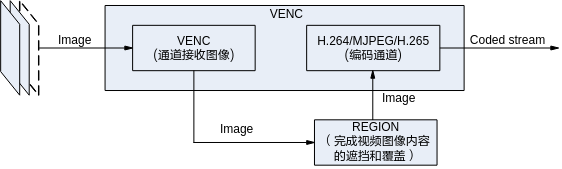
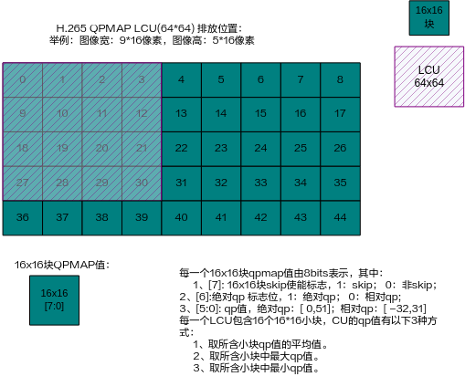
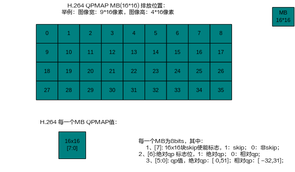

# 概述<a name="ZH-CN_TOPIC_0000002441698133"></a>

VENC模块，即视频编码模块。本模块支持多路实时编码，且每路编码独立，编码协议和编码profile可以不同。本模块支持视频编码同时，调度Region模块对编码图像内容进行叠加和遮挡。

不同型号的解决方案支持不同的编码规格，解决方案支持的编码规格如表1所示。

**表 1**  解决方案编码规格

<a name="_Ref322704612"></a>
<table><thead align="left"><tr id="row15889mcpsimp"><th class="cellrowborder" rowspan="2" valign="top" id="mcps1.2.9.1.1"><p id="p15891mcpsimp"><a name="p15891mcpsimp"></a><a name="p15891mcpsimp"></a>解决方案</p>
</th>
<th class="cellrowborder" colspan="3" valign="top" id="mcps1.2.9.1.2"><p id="p15893mcpsimp"><a name="p15893mcpsimp"></a><a name="p15893mcpsimp"></a>H.264</p>
</th>
<th class="cellrowborder" rowspan="2" valign="top" id="mcps1.2.9.1.3"><p id="p15895mcpsimp"><a name="p15895mcpsimp"></a><a name="p15895mcpsimp"></a>JPEG</p>
</th>
<th class="cellrowborder" rowspan="2" valign="top" id="mcps1.2.9.1.4"><p id="p15897mcpsimp"><a name="p15897mcpsimp"></a><a name="p15897mcpsimp"></a>MOTION JPEG</p>
</th>
<th class="cellrowborder" colspan="2" valign="top" id="mcps1.2.9.1.5"><p id="p15899mcpsimp"><a name="p15899mcpsimp"></a><a name="p15899mcpsimp"></a>H.265</p>
</th>
</tr>
<tr id="row15900mcpsimp"><th class="cellrowborder" valign="top" id="mcps1.2.9.2.1"><p id="p15902mcpsimp"><a name="p15902mcpsimp"></a><a name="p15902mcpsimp"></a>BP</p>
</th>
<th class="cellrowborder" valign="top" id="mcps1.2.9.2.2"><p id="p15904mcpsimp"><a name="p15904mcpsimp"></a><a name="p15904mcpsimp"></a>MP</p>
</th>
<th class="cellrowborder" valign="top" id="mcps1.2.9.2.3"><p id="p15906mcpsimp"><a name="p15906mcpsimp"></a><a name="p15906mcpsimp"></a>HP</p>
</th>
<th class="cellrowborder" valign="top" id="mcps1.2.9.2.4"><p id="p15908mcpsimp"><a name="p15908mcpsimp"></a><a name="p15908mcpsimp"></a>MP</p>
</th>
<th class="cellrowborder" valign="top" id="mcps1.2.9.2.5"><p id="p15910mcpsimp"><a name="p15910mcpsimp"></a><a name="p15910mcpsimp"></a>Main 10</p>
</th>
</tr>
</thead>
<tbody><tr id="row15912mcpsimp"><td class="cellrowborder" valign="top" width="22%" headers="mcps1.2.9.1.1 mcps1.2.9.2.1 "><p id="p15914mcpsimp"><a name="p15914mcpsimp"></a><a name="p15914mcpsimp"></a>SS528V100</p>
</td>
<td class="cellrowborder" valign="top" width="9%" headers="mcps1.2.9.1.2 mcps1.2.9.2.2 "><p id="p15916mcpsimp"><a name="p15916mcpsimp"></a><a name="p15916mcpsimp"></a>支持</p>
</td>
<td class="cellrowborder" valign="top" width="9%" headers="mcps1.2.9.1.2 mcps1.2.9.2.3 "><p id="p15918mcpsimp"><a name="p15918mcpsimp"></a><a name="p15918mcpsimp"></a>支持</p>
</td>
<td class="cellrowborder" valign="top" width="8.99%" headers="mcps1.2.9.1.2 mcps1.2.9.2.4 "><p id="p15920mcpsimp"><a name="p15920mcpsimp"></a><a name="p15920mcpsimp"></a>支持</p>
</td>
<td class="cellrowborder" valign="top" width="11.01%" headers="mcps1.2.9.1.3 mcps1.2.9.2.5 "><p id="p15922mcpsimp"><a name="p15922mcpsimp"></a><a name="p15922mcpsimp"></a>支持</p>
</td>
<td class="cellrowborder" valign="top" width="16%" headers="mcps1.2.9.1.4 "><p id="p15924mcpsimp"><a name="p15924mcpsimp"></a><a name="p15924mcpsimp"></a>支持</p>
</td>
<td class="cellrowborder" valign="top" width="11%" headers="mcps1.2.9.1.5 "><p id="p15926mcpsimp"><a name="p15926mcpsimp"></a><a name="p15926mcpsimp"></a>支持</p>
</td>
<td class="cellrowborder" valign="top" width="13%" headers="mcps1.2.9.1.5 "><p id="p15928mcpsimp"><a name="p15928mcpsimp"></a><a name="p15928mcpsimp"></a>不支持</p>
</td>
</tr>
<tr id="row15929mcpsimp"><td class="cellrowborder" valign="top" width="22%" headers="mcps1.2.9.1.1 mcps1.2.9.2.1 "><p id="p15931mcpsimp"><a name="p15931mcpsimp"></a><a name="p15931mcpsimp"></a>SS625V100</p>
</td>
<td class="cellrowborder" valign="top" width="9%" headers="mcps1.2.9.1.2 mcps1.2.9.2.2 "><p id="p15933mcpsimp"><a name="p15933mcpsimp"></a><a name="p15933mcpsimp"></a>支持</p>
</td>
<td class="cellrowborder" valign="top" width="9%" headers="mcps1.2.9.1.2 mcps1.2.9.2.3 "><p id="p15935mcpsimp"><a name="p15935mcpsimp"></a><a name="p15935mcpsimp"></a>支持</p>
</td>
<td class="cellrowborder" valign="top" width="8.99%" headers="mcps1.2.9.1.2 mcps1.2.9.2.4 "><p id="p15937mcpsimp"><a name="p15937mcpsimp"></a><a name="p15937mcpsimp"></a>支持</p>
</td>
<td class="cellrowborder" valign="top" width="11.01%" headers="mcps1.2.9.1.3 mcps1.2.9.2.5 "><p id="p15939mcpsimp"><a name="p15939mcpsimp"></a><a name="p15939mcpsimp"></a>支持</p>
</td>
<td class="cellrowborder" valign="top" width="16%" headers="mcps1.2.9.1.4 "><p id="p15941mcpsimp"><a name="p15941mcpsimp"></a><a name="p15941mcpsimp"></a>支持</p>
</td>
<td class="cellrowborder" valign="top" width="11%" headers="mcps1.2.9.1.5 "><p id="p15943mcpsimp"><a name="p15943mcpsimp"></a><a name="p15943mcpsimp"></a>支持</p>
</td>
<td class="cellrowborder" valign="top" width="13%" headers="mcps1.2.9.1.5 "><p id="p15945mcpsimp"><a name="p15945mcpsimp"></a><a name="p15945mcpsimp"></a>不支持</p>
</td>
</tr>
<tr id="row15946mcpsimp"><td class="cellrowborder" valign="top" width="22%" headers="mcps1.2.9.1.1 mcps1.2.9.2.1 "><p id="p15948mcpsimp"><a name="p15948mcpsimp"></a><a name="p15948mcpsimp"></a>SS524V100</p>
</td>
<td class="cellrowborder" valign="top" width="9%" headers="mcps1.2.9.1.2 mcps1.2.9.2.2 "><p id="p15950mcpsimp"><a name="p15950mcpsimp"></a><a name="p15950mcpsimp"></a>支持</p>
</td>
<td class="cellrowborder" valign="top" width="9%" headers="mcps1.2.9.1.2 mcps1.2.9.2.3 "><p id="p15952mcpsimp"><a name="p15952mcpsimp"></a><a name="p15952mcpsimp"></a>支持</p>
</td>
<td class="cellrowborder" valign="top" width="8.99%" headers="mcps1.2.9.1.2 mcps1.2.9.2.4 "><p id="p15954mcpsimp"><a name="p15954mcpsimp"></a><a name="p15954mcpsimp"></a>支持</p>
</td>
<td class="cellrowborder" valign="top" width="11.01%" headers="mcps1.2.9.1.3 mcps1.2.9.2.5 "><p id="p15956mcpsimp"><a name="p15956mcpsimp"></a><a name="p15956mcpsimp"></a>支持</p>
</td>
<td class="cellrowborder" valign="top" width="16%" headers="mcps1.2.9.1.4 "><p id="p15958mcpsimp"><a name="p15958mcpsimp"></a><a name="p15958mcpsimp"></a>支持</p>
</td>
<td class="cellrowborder" valign="top" width="11%" headers="mcps1.2.9.1.5 "><p id="p15960mcpsimp"><a name="p15960mcpsimp"></a><a name="p15960mcpsimp"></a>支持</p>
</td>
<td class="cellrowborder" valign="top" width="13%" headers="mcps1.2.9.1.5 "><p id="p15962mcpsimp"><a name="p15962mcpsimp"></a><a name="p15962mcpsimp"></a>不支持</p>
</td>
</tr>
<tr id="row15963mcpsimp"><td class="cellrowborder" valign="top" width="22%" headers="mcps1.2.9.1.1 mcps1.2.9.2.1 "><p id="p15965mcpsimp"><a name="p15965mcpsimp"></a><a name="p15965mcpsimp"></a>SS522V101</p>
</td>
<td class="cellrowborder" valign="top" width="9%" headers="mcps1.2.9.1.2 mcps1.2.9.2.2 "><p id="p15967mcpsimp"><a name="p15967mcpsimp"></a><a name="p15967mcpsimp"></a>支持</p>
</td>
<td class="cellrowborder" valign="top" width="9%" headers="mcps1.2.9.1.2 mcps1.2.9.2.3 "><p id="p15969mcpsimp"><a name="p15969mcpsimp"></a><a name="p15969mcpsimp"></a>支持</p>
</td>
<td class="cellrowborder" valign="top" width="8.99%" headers="mcps1.2.9.1.2 mcps1.2.9.2.4 "><p id="p15971mcpsimp"><a name="p15971mcpsimp"></a><a name="p15971mcpsimp"></a>支持</p>
</td>
<td class="cellrowborder" valign="top" width="11.01%" headers="mcps1.2.9.1.3 mcps1.2.9.2.5 "><p id="p15973mcpsimp"><a name="p15973mcpsimp"></a><a name="p15973mcpsimp"></a>支持</p>
</td>
<td class="cellrowborder" valign="top" width="16%" headers="mcps1.2.9.1.4 "><p id="p15975mcpsimp"><a name="p15975mcpsimp"></a><a name="p15975mcpsimp"></a>支持</p>
</td>
<td class="cellrowborder" valign="top" width="11%" headers="mcps1.2.9.1.5 "><p id="p15977mcpsimp"><a name="p15977mcpsimp"></a><a name="p15977mcpsimp"></a>支持</p>
</td>
<td class="cellrowborder" valign="top" width="13%" headers="mcps1.2.9.1.5 "><p id="p15979mcpsimp"><a name="p15979mcpsimp"></a><a name="p15979mcpsimp"></a>不支持</p>
</td>
</tr>
<tr id="row15980mcpsimp"><td class="cellrowborder" valign="top" width="22%" headers="mcps1.2.9.1.1 mcps1.2.9.2.1 "><p id="p15982mcpsimp"><a name="p15982mcpsimp"></a><a name="p15982mcpsimp"></a>Hi3403V100</p>
</td>
<td class="cellrowborder" valign="top" width="9%" headers="mcps1.2.9.1.2 mcps1.2.9.2.2 "><p id="p15984mcpsimp"><a name="p15984mcpsimp"></a><a name="p15984mcpsimp"></a>支持</p>
</td>
<td class="cellrowborder" valign="top" width="9%" headers="mcps1.2.9.1.2 mcps1.2.9.2.3 "><p id="p15986mcpsimp"><a name="p15986mcpsimp"></a><a name="p15986mcpsimp"></a>支持</p>
</td>
<td class="cellrowborder" valign="top" width="8.99%" headers="mcps1.2.9.1.2 mcps1.2.9.2.4 "><p id="p15988mcpsimp"><a name="p15988mcpsimp"></a><a name="p15988mcpsimp"></a>支持</p>
</td>
<td class="cellrowborder" valign="top" width="11.01%" headers="mcps1.2.9.1.3 mcps1.2.9.2.5 "><p id="p15990mcpsimp"><a name="p15990mcpsimp"></a><a name="p15990mcpsimp"></a>支持</p>
</td>
<td class="cellrowborder" valign="top" width="16%" headers="mcps1.2.9.1.4 "><p id="p15992mcpsimp"><a name="p15992mcpsimp"></a><a name="p15992mcpsimp"></a>支持</p>
</td>
<td class="cellrowborder" valign="top" width="11%" headers="mcps1.2.9.1.5 "><p id="p15994mcpsimp"><a name="p15994mcpsimp"></a><a name="p15994mcpsimp"></a>支持</p>
</td>
<td class="cellrowborder" valign="top" width="13%" headers="mcps1.2.9.1.5 "><p id="p15996mcpsimp"><a name="p15996mcpsimp"></a><a name="p15996mcpsimp"></a>不支持</p>
</td>
</tr>
<tr id="row15997mcpsimp"><td class="cellrowborder" valign="top" width="22%" headers="mcps1.2.9.1.1 mcps1.2.9.2.1 "><p id="p15999mcpsimp"><a name="p15999mcpsimp"></a><a name="p15999mcpsimp"></a>SS626V100</p>
</td>
<td class="cellrowborder" valign="top" width="9%" headers="mcps1.2.9.1.2 mcps1.2.9.2.2 "><p id="p16001mcpsimp"><a name="p16001mcpsimp"></a><a name="p16001mcpsimp"></a>支持</p>
</td>
<td class="cellrowborder" valign="top" width="9%" headers="mcps1.2.9.1.2 mcps1.2.9.2.3 "><p id="p16003mcpsimp"><a name="p16003mcpsimp"></a><a name="p16003mcpsimp"></a>支持</p>
</td>
<td class="cellrowborder" valign="top" width="8.99%" headers="mcps1.2.9.1.2 mcps1.2.9.2.4 "><p id="p16005mcpsimp"><a name="p16005mcpsimp"></a><a name="p16005mcpsimp"></a>支持</p>
</td>
<td class="cellrowborder" valign="top" width="11.01%" headers="mcps1.2.9.1.3 mcps1.2.9.2.5 "><p id="p16007mcpsimp"><a name="p16007mcpsimp"></a><a name="p16007mcpsimp"></a>支持</p>
</td>
<td class="cellrowborder" valign="top" width="16%" headers="mcps1.2.9.1.4 "><p id="p16009mcpsimp"><a name="p16009mcpsimp"></a><a name="p16009mcpsimp"></a>支持</p>
</td>
<td class="cellrowborder" valign="top" width="11%" headers="mcps1.2.9.1.5 "><p id="p16011mcpsimp"><a name="p16011mcpsimp"></a><a name="p16011mcpsimp"></a>支持</p>
</td>
<td class="cellrowborder" valign="top" width="13%" headers="mcps1.2.9.1.5 "><p id="p16013mcpsimp"><a name="p16013mcpsimp"></a><a name="p16013mcpsimp"></a>不支持</p>
</td>
</tr>
</tbody>
</table>

# 功能描述<a name="ZH-CN_TOPIC_0000002408098610"></a>


## 编码数据流程图<a name="ZH-CN_TOPIC_0000002441697779"></a>

**图 1**  VENC的数据流程图<a name="fig1579454103312"></a>  


典型的编码流程包括了输入图像的接收、图像内容的遮挡和覆盖、图像的编码、以及码流的输出等过程。

VENC模块由编码通道子模块（VENC）和编码协议子模块（H.264/H.265/JPEG/MJPEG）组成。

通道支持接收YUV格式图像输入，其中H.264/H.265支持Semi-planar YVU 4:2:0/ Semi-planar YUV 4:2:0或单分量输入\(PIXEL\_FORMAT\_YUV\_400\)，JPEG/MJPEG支持Semi-planar YVU 4:2:0/ Semi-planar YUV 4:2:0、Semi-planar YVU 4:2:2/ Semi-planar YUV 4:2:2或单分量输入\(PIXEL\_FORMAT\_YUV\_400\)。通道模块接收外部原始图像数据，而不关心图像数据是来自哪个外部模块。

SS528V100/SS625V100/SS524V100/SS522V101/Hi3403V100/SS626V100解决方案输入YUV支持的压缩格式：OT\_COMPRESS\_MODE\_NONE、OT\_COMPRESS\_MODE\_SEG、OT\_COMPRESS\_MODE\_SEG\_COMPACT。

SS528V100/SS625V100/SS524V100/SS522V101/SS626V100解决方案输入YUV压缩格式为OT\_COMPRESS\_MODE\_SEG\_COMPACT时，VENC支持YUV的最大宽度为2688；

Hi3403V100解决方案输入YUV压缩格式为OT\_COMPRESS\_MODE\_SEG\_COMPACT时，VENC支持YUV的最大宽度为4096。

通道接收到图像之后，比较图像尺寸和编码通道尺寸：

-   如果输入图像比编码通道尺寸大，VENC将按照编码通道尺寸大小，调用VGS对源图像进行缩小，然后对缩小之后的图像进行编码。
-   如果输入图像比编码通道尺寸小，VENC丢弃源图像。VENC不支持放大输入图像编码。
-   如果输入图像与编码通道尺寸相当，VENC直接接收源图像，进行编码。

> **说明：** 
>1.  通道的帧率控制默认不打开，需要用户调用接口设置。RC中也具有帧率控制功能。推荐使用RC的帧率控制，这样不会对码率控制造成过大的冲击。
>2.  对于H.264/ H.265编码，输入图像格式由非单分量切换为单分量时，由于存在帧间预测量化误差，在编码出下一个I帧之前图像会存有色度残留。建议客户在切换单分量时调用接口`ss_mpi_venc_reset_chn`进行通道复位。

REGION模块支持提供对图像内容的遮挡/叠加信息，编码前先完成遮挡/叠加，再进行编码，输出码流。

## 编码通道<a name="ZH-CN_TOPIC_0000002441697745"></a>

编码通道作为基本容器，保存编码通道的多种用户设置和管理编码通道的多种内部资源。编码通道完成图像转化为码流的功能，具体由码率控制器和编码器协同完成。这里的编码器指的是狭义上的编码器，只完成编码功能。码率控制器提供了对编码参数的控制和调整，从而对输出码率进行控制。

**图 1**  编码通道功能模块划分<a name="fig1125183013363"></a>  


## 码率控制<a name="ZH-CN_TOPIC_0000002441698045"></a>

码率控制器实现对编码码率进行控制。

从信息学的角度分析，图像的压缩比越低，压缩图像的质量越高；图像压缩比例越高，压缩图像的质量越低。在场景变化的情况下，追求图像质量稳定，则编码码率会波动较大；如追求编码码率稳定，则图像质量会波动较大。以H.264编码为例，通常图像Qp越低，图像的质量越好，码率越高；图像Qp越高，图像质量越差，码率越低。

码率控制是针对连续的编码码流而言，所以，JPEG协议编码通道不包括码率控制功能。

码率控制器分别提供了对MJPEG协议编码通道CBR、VBR、FIXQP三种码率控制模式，H.264/H.265协议编码通道CBR、VBR、AVBR、QVBR、CVBR、FIXQP、QPMAP七种码率控制模式，对图像质量和码率进行调节，对于H.264/H.265/协议通道的QPMAP模式，码控的策略由用户决定。

**CBR<a name="section12343123612407"></a>**

CBR（Constant Bit Rate）固定比特率。即在码率统计时间内保证编码码率平稳。码率稳定主要由两个量来评估。

-   码率统计时间stats\_time

    单位为秒\(s\)，码率统计时间越长，每帧图像的码率波动对于码率调节的影响越弱，码率的调节会更缓慢，图像质量的波动会更轻微；码率统计时间越短，每帧图像的码率波动对于码率调节的影响越强，图像码率的调节会更灵敏，图像质量的波动会更剧烈。

-   行级码率控制调节幅度row\_qp\_delta

    行级码率控制调节幅度是一帧内行级调节的最大范围，其中行级以宏块行为单位。调节幅度越大，允许行级调整的QP范围越大，码率越平稳。对于图像复杂度分布不均匀的场景，行级码率控制调节幅度设置过大会带来图像质量不均匀。

**VBR<a name="section734616364405"></a>**

VBR（Variable Bit Rate）可变比特率，即允许在码率统计时间内编码码率波动，从而保证编码图像质量平稳。以H.264编码为例，VENC模块提供用户可设置max\_qp，min\_qp，max\_bit\_rate和chg\_pos。max\_qp，min\_qp用于控制图像的质量范围， max\_bit\_rate用于钳位码率统计时间内的最大编码码率，chg\_pos用于控制开始调整QP的码率基准线。当编码码率大于max\_bit\_rate\*chg\_pos时，图像QP会逐步向max\_qp调整，如果图像QP达到max\_qp，QP会被钳位到最大值，max\_bit\_rate的钳位效果失效，编码码率有可能会超出max\_bit\_rate。当编码码率小于max\_bit\_rate\*chg\_pos时，图像QP会逐步向min\_qp调整，如果图像QP达到min\_qp，此时编码的码率已经达到最大值，而且图像质量最好。

**AVBR<a name="section153462364401"></a>**

AVBR（Adaptive Variable Bit Rate）自适应可变比特率，即允许在码率统计时间内编码码率波动，从而保证编码图像质量平稳。码率控制内部会检测当前场景的运动静止状态，在运动时用较高码率编码，在静止时主动降低目标码率。以H.264编码为例，VENC模块提供用户可设置max\_bit\_rate，chg\_pos和min\_still\_percent。max\_bit\_rate表示运动场景下的最大码率，max\_bit\_rate\*chg\_pos\*min\_still\_percent表示静止情况下的最小码率。根据运动程度的不同目标码率会在最大码率和最小码率间调整。max\_qp，min\_qp用于控制图像的质量范围，码率控制以QP钳位为最高优先级，超出min\_qp，max\_qp范围内码率控制将失效。

**QVBR<a name="section14347736204015"></a>**

QVBR \(Quality Variable Bit Rate\)基于主观图像质量的可变比特率，该码控调节方式是利用实时统计的PSNR（图像质量客观评价指标）的大小来动态调整码率，从而保证编码图像质量平稳。在PSNR较小时主动升高目标码率，PSNR较大时主动降低目标码率。

以H.264编码为例，VENC模块提供用户可设置target\_bit\_rate、max\_bit\_percent、min\_bit\_percent、max\_psnr\_fluctuate和min\_psnr\_fluctuate。

-   当实时统计的PSNR小于max\_psnr\_fluctuate时，适当增加目标码率，最大码率=target\_bit\_rate\* max\_bit\_percent；
-   当实时统计的PSNR大于max\_psnr\_fluctuate时，适当减小目标码率，最小码率= target\_bit\_rate\* min\_bit\_percent，根据当前PSNR的不同目标码率会在最大码率和最小码率间调整，当PSNR值范围超过\[min\_psnr\_fluctuate-4, max\_psnr\_fluctuate+4\]∩ \[20,40\]时PSNR不再起作用，码率会在最大码率和最小码率间调整。max\_qp，min\_qp用于控制图像的质量范围，码率控制以QP钳位为最高优先级，超出min\_qp，max\_qp范围内码率控制将失效。码率浮动上下限的优先级高于PSNR的优先级，例如，当码率浮动到上限依然不能满足PSNR要求，则码率不会再继续上调。

**CVBR<a name="section834813684019"></a>**

CVBR \(Constrained Variable Bit Rate\) 是以VBR为基础，旨在提供平稳的图像质量的码控算法，同时对VBR的码率进行限制，以满足传输带宽以及存储空间的要求。具体来说，CVBR设置了瞬时，短期与长期码率的限制。其中，瞬时码率的限制保证了网络带宽对传输的要求；长期码率限制保证了在长时间视频录制时，存储设备有足够的空间储存数据；同时，短期码率会根据长期码率的设置和实际使用情况进行调节，以在场景复杂的情况下提供更加平稳的图像质量，并在场景简单时节省码率。

**FIXQP<a name="section15348183674010"></a>**

FIXQP固定QP值。在码率统计时间内，编码图像所有宏块QP值相同，采用用户设定的图像QP值，I帧和P帧的QP值可以分别设置。

**QPMAP<a name="section23491536134020"></a>**

QPMAP 模式下允许用户自由决定码控的策略。用户需要申请内存，内存会映射到编码的图像上，通过内存的赋值完成编码图像的每一块QP和选择skip块倾向性大小的配置。QP的设置是以16\*16块为单位，每一个16\*16块的QP值，采用用户设定的相应块的QP值。所有这些块的QP值组成QP表，该表中QP值的组织方式如[图1](#fig14978154218434)和[图2](#fig1569611155114)所示。H.264的skip倾向性配置以16\*16块为单位，H.265的skip倾向性配置以64\*64块为单位，skip倾向性配置表如[图3](#fig16647191164915)和[图4](#fig86961774508)所示。

**图 1**  H.265 QPMAP LCU（64\*64）排放位置<a name="fig14978154218434"></a>  


**图 2**  H.264 QPMAP MB排放位置<a name="fig1569611155114"></a>  


**图 3**  H.265 SkipWeight表排布\(64\*64\)<a name="fig16647191164915"></a>  
.png "H-265-SkipWeight表排布(64-64)")

**图 4**  H.264 SkipWeight表排布\(16\*16\)<a name="fig86961774508"></a>  
.png "H-264-SkipWeight表排布(16-16)")

> **说明：** 
>-   非normal\_p模式下，qp表16x16块skip使能标志需配置为1，如果进行错误检查，处理的数据量较多，影响性能，因此在使用该功能时需保证配置正确。
>-   使用QpMap表实现H.265协议通道编码p\_skip帧/非ROI区域帧率低于ROI区域帧率时，需客户调用`ss_mpi_venc_set_h265_sao`关闭SAO功能。
>-   QpMap模式下需要调用接口`ss_mpi_venc_send_frame_ex`发送图像和qpmap表。
>-   Gop Mode模式为OT\_VENC\_GOP\_MODE\_ADV\_SMART\_P时不支持QpMap模式。
>-   使用Skip Weight时，建议调用接口`ss_mpi_venc_set_skip_bias`  关闭帧级控制cu/mb选择Skip模式的倾向性，否则，Skip Weight是在帧级控制Skip模式的基础上进行调节。
>-   Qpmap模式下，QPMAP Qp表需要内存计算如下：
>    stride = \(width +255\) / 256 \* 256 / 16
>    H.264: qpmap\_size = stride \*\(\(height + 15\) / 16 \* 16 / 16\)
>    H.265: qpmap\_size = stride \*\(\(height + 31\) / 32 \* 32 / 16\)
>-   Qpmap模式下，skipweight表需要内存计算如下：
>    H.264: stride = \(width + 511\) / 512 \* 512 / 32
>    H.265: stride = \(width + 1023\) / 1024 \* 1024 / 64
>    H.264: skipweight\_size = stride \* \(height + 15\) /16 \*16 / 16
>    H.265: skipweight\_size = stride \* \(height + 31\)/ 32 \*32 / 32

## GOP结构<a name="ZH-CN_TOPIC_0000002441698061"></a>

两种编码协议（H.264/H.265）对GOP结构类型模式的支持情况如表1。

**表 1**  编码协议支持GOP结构类型

<a name="_Ref430350630"></a>
<table><thead align="left"><tr id="row3212mcpsimp"><th class="cellrowborder" rowspan="2" valign="top" width="46.53465346534653%" id="mcps1.2.5.1.1"><p id="p3214mcpsimp"><a name="p3214mcpsimp"></a><a name="p3214mcpsimp"></a>GOP 模式</p>
</th>
<th class="cellrowborder" rowspan="2" valign="top" width="10.891089108910892%" id="mcps1.2.5.1.2"><p id="p3216mcpsimp"><a name="p3216mcpsimp"></a><a name="p3216mcpsimp"></a>参考帧个数</p>
</th>
<th class="cellrowborder" valign="top" width="22.772277227722775%" id="mcps1.2.5.1.3"><p id="p3218mcpsimp"><a name="p3218mcpsimp"></a><a name="p3218mcpsimp"></a>SS528V100/SS625V100/Hi3403V100/SS626V100</p>
</th>
<th class="cellrowborder" valign="top" width="19.801980198019802%" id="mcps1.2.5.1.4"><p id="p3220mcpsimp"><a name="p3220mcpsimp"></a><a name="p3220mcpsimp"></a>SS524V100/SS522V101</p>
</th>
</tr>
<tr id="row3221mcpsimp"><th class="cellrowborder" valign="top" id="mcps1.2.5.2.1"><p id="p3223mcpsimp"><a name="p3223mcpsimp"></a><a name="p3223mcpsimp"></a>H.264/H.265</p>
</th>
<th class="cellrowborder" valign="top" id="mcps1.2.5.2.2"><p id="p3225mcpsimp"><a name="p3225mcpsimp"></a><a name="p3225mcpsimp"></a>H.264/H.265</p>
</th>
</tr>
</thead>
<tbody><tr id="row3227mcpsimp"><td class="cellrowborder" valign="top" width="46.53465346534653%" headers="mcps1.2.5.1.1 mcps1.2.5.2.1 "><p id="p3229mcpsimp"><a name="p3229mcpsimp"></a><a name="p3229mcpsimp"></a>OT_VENC_GOP_MODE_NORMAL_P</p>
</td>
<td class="cellrowborder" valign="top" width="10.891089108910892%" headers="mcps1.2.5.1.2 mcps1.2.5.2.2 "><p id="p3231mcpsimp"><a name="p3231mcpsimp"></a><a name="p3231mcpsimp"></a>1</p>
</td>
<td class="cellrowborder" valign="top" width="22.772277227722775%" headers="mcps1.2.5.1.3 "><p id="p3233mcpsimp"><a name="p3233mcpsimp"></a><a name="p3233mcpsimp"></a>支持</p>
</td>
<td class="cellrowborder" valign="top" width="19.801980198019802%" headers="mcps1.2.5.1.4 "><p id="p3235mcpsimp"><a name="p3235mcpsimp"></a><a name="p3235mcpsimp"></a>支持</p>
</td>
</tr>

<tr id="row18779mcpsimp"><td class="cellrowborder" valign="top" width="15.84158415841584%" headers="mcps1.2.12.1.1 mcps1.2.12.3.1 "><p id="p18781mcpsimp"><a name="p18781mcpsimp"></a><a name="p18781mcpsimp"></a>Hi3403V100</p>
</td>
<td class="cellrowborder" valign="top" width="6.930693069306929%" headers="mcps1.2.12.1.2 mcps1.2.12.2.1 mcps1.2.12.3.2 "><p id="p18783mcpsimp"><a name="p18783mcpsimp"></a><a name="p18783mcpsimp"></a>8192</p>
</td>
<td class="cellrowborder" valign="top" width="6.930693069306929%" headers="mcps1.2.12.1.2 mcps1.2.12.2.1 mcps1.2.12.3.3 "><p id="p18785mcpsimp"><a name="p18785mcpsimp"></a><a name="p18785mcpsimp"></a>114</p>
</td>
<td class="cellrowborder" valign="top" width="6.930693069306929%" headers="mcps1.2.12.1.2 mcps1.2.12.2.2 mcps1.2.12.3.4 "><p id="p18787mcpsimp"><a name="p18787mcpsimp"></a><a name="p18787mcpsimp"></a>8192</p>
</td>
<td class="cellrowborder" valign="top" width="6.930693069306929%" headers="mcps1.2.12.1.2 mcps1.2.12.2.2 mcps1.2.12.3.5 "><p id="p18789mcpsimp"><a name="p18789mcpsimp"></a><a name="p18789mcpsimp"></a>114</p>
</td>
<td class="cellrowborder" valign="top" width="13.861386138613858%" headers="mcps1.2.12.1.2 mcps1.2.12.2.3 mcps1.2.12.3.6 "><p id="p18791mcpsimp"><a name="p18791mcpsimp"></a><a name="p18791mcpsimp"></a>2</p>
</td>
<td class="cellrowborder" valign="top" width="7.92079207920792%" headers="mcps1.2.12.1.3 mcps1.2.12.2.4 mcps1.2.12.3.7 "><p id="p18793mcpsimp"><a name="p18793mcpsimp"></a><a name="p18793mcpsimp"></a>16384</p>
</td>
<td class="cellrowborder" valign="top" width="6.930693069306929%" headers="mcps1.2.12.1.3 mcps1.2.12.2.4 mcps1.2.12.3.8 "><p id="p18795mcpsimp"><a name="p18795mcpsimp"></a><a name="p18795mcpsimp"></a>32</p>
</td>
<td class="cellrowborder" valign="top" width="7.92079207920792%" headers="mcps1.2.12.1.3 mcps1.2.12.2.5 "><p id="p18797mcpsimp"><a name="p18797mcpsimp"></a><a name="p18797mcpsimp"></a>16384</p>
</td>
<td class="cellrowborder" valign="top" width="6.930693069306929%" headers="mcps1.2.12.1.3 mcps1.2.12.2.5 "><p id="p18799mcpsimp"><a name="p18799mcpsimp"></a><a name="p18799mcpsimp"></a>32</p>
</td>
<td class="cellrowborder" valign="top" width="12.871287128712869%" headers="mcps1.2.12.1.3 mcps1.2.12.2.6 "><p id="p18801mcpsimp"><a name="p18801mcpsimp"></a><a name="p18801mcpsimp"></a>2</p>
</td>
</tr>
</tbody>
</table>

-   部分解决方案支持多编码器并行编码，H.265e编码支持垂直划分Tile，根据通道宽高和码率控制器输出帧率决定tile划分数目；H.264e编码支持水平划分Tile\(实际是划分slice\)，根据通道宽高和帧率决定Tile划分数目。SS528V100/SS625V100/SS524V100/SS522V101/Hi3403V100/SS626V100不支持。
-   编码器属性必须设置编码码流buffer大小，获取码流方式, 编码profile等，表2详细描述了各种协议的各项属性的特性。

**表 2**  编码器属性的约束

<a name="_Ref196299180"></a>
<table><thead align="left"><tr id="row18814mcpsimp"><th class="cellrowborder" valign="top" width="14.000000000000002%" id="mcps1.2.6.1.1"><p id="p18816mcpsimp"><a name="p18816mcpsimp"></a><a name="p18816mcpsimp"></a>编码协议</p>
</th>
<th class="cellrowborder" valign="top" width="14.000000000000002%" id="mcps1.2.6.1.2"><p id="p18818mcpsimp"><a name="p18818mcpsimp"></a><a name="p18818mcpsimp"></a>编码方式</p>
</th>
<th class="cellrowborder" valign="top" width="37.1%" id="mcps1.2.6.1.3"><p id="p18820mcpsimp"><a name="p18820mcpsimp"></a><a name="p18820mcpsimp"></a>码流buffer大小</p>
</th>
<th class="cellrowborder" valign="top" width="17.9%" id="mcps1.2.6.1.4"><p id="p18822mcpsimp"><a name="p18822mcpsimp"></a><a name="p18822mcpsimp"></a>获取码流模式</p>
</th>
<th class="cellrowborder" valign="top" width="17%" id="mcps1.2.6.1.5"><p id="p18824mcpsimp"><a name="p18824mcpsimp"></a><a name="p18824mcpsimp"></a>编码profile</p>
</th>
</tr>
</thead>
<tbody><tr id="row18826mcpsimp"><td class="cellrowborder" valign="top" width="14.000000000000002%" headers="mcps1.2.6.1.1 "><p id="p18828mcpsimp"><a name="p18828mcpsimp"></a><a name="p18828mcpsimp"></a>H.264</p>
</td>
<td class="cellrowborder" valign="top" width="14.000000000000002%" headers="mcps1.2.6.1.2 "><p id="p18830mcpsimp"><a name="p18830mcpsimp"></a><a name="p18830mcpsimp"></a>Frame</p>
</td>
<td class="cellrowborder" valign="top" width="37.1%" headers="mcps1.2.6.1.3 "><a name="ul18832mcpsimp"></a><a name="ul18832mcpsimp"></a><ul id="ul18832mcpsimp"><li>当H.264 mini_buf_mode=0时，Buffer≥ MaxPicwidth x MaxPicheight x 3/4；</li><li>当H.264 mini_buf_mode=1时，Buffer≥32*1024 byte；</li></ul>
</td>
<td class="cellrowborder" valign="top" width="17.9%" headers="mcps1.2.6.1.4 "><p id="p18836mcpsimp"><a name="p18836mcpsimp"></a><a name="p18836mcpsimp"></a>Frame/Slice</p>
</td>
<td class="cellrowborder" valign="top" width="17%" headers="mcps1.2.6.1.5 "><p id="p18838mcpsimp"><a name="p18838mcpsimp"></a><a name="p18838mcpsimp"></a>Baseline</p>
<p id="p18839mcpsimp"><a name="p18839mcpsimp"></a><a name="p18839mcpsimp"></a>Mainprofile</p>
<p id="p18840mcpsimp"><a name="p18840mcpsimp"></a><a name="p18840mcpsimp"></a>Highprofile</p>
<p id="p18841mcpsimp"><a name="p18841mcpsimp"></a><a name="p18841mcpsimp"></a>svc-t</p>
</td>
</tr>

<tr id="row4906mcpsimp"><td class="cellrowborder" valign="top" width="18%" headers="mcps1.1.4.1.1 "><p id="p4908mcpsimp"><a name="p4908mcpsimp"></a><a name="p4908mcpsimp"></a>h265_vui</p>
</td>
<td class="cellrowborder" valign="top" width="67%" headers="mcps1.1.4.1.2 "><p id="p4910mcpsimp"><a name="p4910mcpsimp"></a><a name="p4910mcpsimp"></a>H.265协议编码通道的Vui属性。</p>
</td>
<td class="cellrowborder" valign="top" width="15%" headers="mcps1.1.4.1.3 "><p id="p4912mcpsimp"><a name="p4912mcpsimp"></a><a name="p4912mcpsimp"></a>输出</p>
</td>
</tr>
</tbody>
</table>

【返回值】

<a name="table4914mcpsimp"></a>
<table><thead align="left"><tr id="row4919mcpsimp"><th class="cellrowborder" valign="top" width="50%" id="mcps1.1.3.1.1"><p id="p4921mcpsimp"><a name="p4921mcpsimp"></a><a name="p4921mcpsimp"></a>返回值</p>
</th>
<th class="cellrowborder" valign="top" width="50%" id="mcps1.1.3.1.2"><p id="p4923mcpsimp"><a name="p4923mcpsimp"></a><a name="p4923mcpsimp"></a>描述</p>
</th>
</tr>
</thead>
<tbody><tr id="row4924mcpsimp"><td class="cellrowborder" valign="top" width="50%" headers="mcps1.1.3.1.1 "><p id="p4926mcpsimp"><a name="p4926mcpsimp"></a><a name="p4926mcpsimp"></a>0</p>
</td>
<td class="cellrowborder" valign="top" width="50%" headers="mcps1.1.3.1.2 "><p id="p4928mcpsimp"><a name="p4928mcpsimp"></a><a name="p4928mcpsimp"></a>成功。</p>
</td>
</tr>
<tr id="row4929mcpsimp"><td class="cellrowborder" valign="top" width="50%" headers="mcps1.1.3.1.1 "><p id="p4931mcpsimp"><a name="p4931mcpsimp"></a><a name="p4931mcpsimp"></a>非0</p>
</td>
<td class="cellrowborder" valign="top" width="50%" headers="mcps1.1.3.1.2 "><p id="p4933mcpsimp"><a name="p4933mcpsimp"></a><a name="p4933mcpsimp"></a>失败，返回错误码。</p>
</td>
</tr>
</tbody>
</table>

【需求】

-   头文件：ot\_common\_venc.h、ss\_mpi\_venc.h
-   库文件：libss\_mpi.a

【注意】

-   本接口用于获取H.265协议编码通道的VUI配置。
-   本接口在编码通道创建之后，编码通道销毁之前调用。
-   建议用户在创建通道之后，启动编码之前调用此接口，减少在编码过程中调用的次数。

【举例】

无。

【相关主题】

无。

## ss\_mpi\_venc\_set\_jpeg\_param<a name="ZH-CN_TOPIC_0000002408098842"></a>

【描述】

设置JPEG协议编码通道的高级参数。

【语法】

```
td_s32 ss_mpi_venc_set_jpeg_param(ot_venc_chn chn, const ot_venc_jpeg_param *jpeg_param);
```

【参数】

<a name="table346mcpsimp"></a>
<table><thead align="left"><tr id="row352mcpsimp"><th class="cellrowborder" valign="top" width="18%" id="mcps1.1.4.1.1"><p id="p354mcpsimp"><a name="p354mcpsimp"></a><a name="p354mcpsimp"></a>参数名称</p>
</th>
<th class="cellrowborder" valign="top" width="67%" id="mcps1.1.4.1.2"><p id="p356mcpsimp"><a name="p356mcpsimp"></a><a name="p356mcpsimp"></a>描述</p>
</th>
<th class="cellrowborder" valign="top" width="15%" id="mcps1.1.4.1.3"><p id="p358mcpsimp"><a name="p358mcpsimp"></a><a name="p358mcpsimp"></a>输入/输出</p>
</th>
</tr>
</thead>
<tbody><tr id="row359mcpsimp"><td class="cellrowborder" valign="top" width="18%" headers="mcps1.1.4.1.1 "><p id="p361mcpsimp"><a name="p361mcpsimp"></a><a name="p361mcpsimp"></a>chn</p>
</td>
<td class="cellrowborder" valign="top" width="67%" headers="mcps1.1.4.1.2 "><p id="p363mcpsimp"><a name="p363mcpsimp"></a><a name="p363mcpsimp"></a>编码通道号。</p>
<p id="p364mcpsimp"><a name="p364mcpsimp"></a><a name="p364mcpsimp"></a>取值范围：[0, OT_VENC_MAX_CHN_NUM)。</p>
</td>
<td class="cellrowborder" valign="top" width="15%" headers="mcps1.1.4.1.3 "><p id="p366mcpsimp"><a name="p366mcpsimp"></a><a name="p366mcpsimp"></a>输入</p>
</td>
</tr>
<tr id="row367mcpsimp"><td class="cellrowborder" valign="top" width="18%" headers="mcps1.1.4.1.1 "><p id="p369mcpsimp"><a name="p369mcpsimp"></a><a name="p369mcpsimp"></a>jpeg_param</p>
</td>
<td class="cellrowborder" valign="top" width="67%" headers="mcps1.1.4.1.2 "><p id="p371mcpsimp"><a name="p371mcpsimp"></a><a name="p371mcpsimp"></a>JPEG协议编码通道的高级参数集合。</p>
</td>
<td class="cellrowborder" valign="top" width="15%" headers="mcps1.1.4.1.3 "><p id="p373mcpsimp"><a name="p373mcpsimp"></a><a name="p373mcpsimp"></a>输入</p>
</td>
</tr>
</tbody>
</table>

【返回值】

<a name="table375mcpsimp"></a>
<table><thead align="left"><tr id="row380mcpsimp"><th class="cellrowborder" valign="top" width="50%" id="mcps1.1.3.1.1"><p id="p382mcpsimp"><a name="p382mcpsimp"></a><a name="p382mcpsimp"></a>返回值</p>
</th>
<th class="cellrowborder" valign="top" width="50%" id="mcps1.1.3.1.2"><p id="p384mcpsimp"><a name="p384mcpsimp"></a><a name="p384mcpsimp"></a>描述</p>
</th>
</tr>
</thead>
<tbody><tr id="row385mcpsimp"><td class="cellrowborder" valign="top" width="50%" headers="mcps1.1.3.1.1 "><p id="p387mcpsimp"><a name="p387mcpsimp"></a><a name="p387mcpsimp"></a>0</p>
</td>
<td class="cellrowborder" valign="top" width="50%" headers="mcps1.1.3.1.2 "><p id="p389mcpsimp"><a name="p389mcpsimp"></a><a name="p389mcpsimp"></a>成功。</p>
</td>
</tr>
<tr id="row390mcpsimp"><td class="cellrowborder" valign="top" width="50%" headers="mcps1.1.3.1.1 "><p id="p392mcpsimp"><a name="p392mcpsimp"></a><a name="p392mcpsimp"></a>非0</p>
</td>
<td class="cellrowborder" valign="top" width="50%" headers="mcps1.1.3.1.2 "><p id="p394mcpsimp"><a name="p394mcpsimp"></a><a name="p394mcpsimp"></a>失败，返回错误码。</p>
</td>
</tr>
</tbody>
</table>

【需求】

-   头文件：ot\_common\_venc.h、ss\_mpi\_venc.h
-   库文件：libss\_mpi.a

【注意】

-   本接口用于设置JPEG协议编码通道的高级参数
-   高级参数主要由五个参数组成
    -   qfactor：量化表因子范围为\[1, 99\]，qfactor越大，量化表中的量化系数越小，得到的图像质量会更好，同时，编码压缩率更低。同理qfactor越小，量化表中的量化系数越大，得到的图像质量会更差，同时，编码压缩率更高。具体的qfactor与量化表的关系请见RFC2435标准。
    -   y\_qt\[OT\_VENC\_JPEG\_QT\_COEF\_NUM\]，cb\_qt\[OT\_VENC\_JPEG\_QT\_COEF\_NUM\]，cr\_qt\[OT\_VENC\_JPEG\_QT\_COEF\_NUM\]：对应三个量化表空间，用户可以通过这三个参数设置用户的量化表。
    -   mcu\_per\_ecs：每个Ecs中包含多少Mcu。系统模式mcu\_per\_ecs = 0，表示当前帧的所有的MCU被编码为一个ECS。mcu\_per\_ecs的最小值为0，最大值不超过\{\(picwidth+15\)\>\>4 \* \(picheight+15\)\>\>4 \* 2, 65535\}的较小值。当mcu\_per\_ecs配置较小时，容易引起CPU占用时间较长等现象，客户需要根据实际使用需求合理配置。
    -   ecs\_output\_en：仅Hi3403V100/SS626V100支持，不支持的默认值为TD\_FALSE。

-   如果用户想使用自己的量化表，在设置量化表的同时，请将qfactor设置为50。
-   本接口在编码通道创建之后，编码通道销毁之前设置。本接口在编码过程中被调用时，等到下一个帧编码时生效。
-   建议用户在创建通道之后，启动编码之前调用此接口，减少在编码过程中调用的次数。
-   建议用户在调用此接口之前，先调用`ss_mpi_venc_get_jpeg_param`接口，获取当前编码通道的jpeg\_param配置，然后再进行设置。

【举例】

无。

【相关主题】

无。

## ss\_mpi\_venc\_get\_jpeg\_param<a name="ZH-CN_TOPIC_0000002441698301"></a>

【描述】

获取JPEG协议编码通道的高级参数配置。

【语法】

```
td_s32 ss_mpi_venc_get_jpeg_param(ot_venc_chn chn, ot_venc_jpeg_param *jpeg_param);
```

【参数】

<a name="table2980mcpsimp"></a>
<table><thead align="left"><tr id="row2986mcpsimp"><th class="cellrowborder" valign="top" width="19%" id="mcps1.1.4.1.1"><p id="p2988mcpsimp"><a name="p2988mcpsimp"></a><a name="p2988mcpsimp"></a>参数名称</p>
</th>
<th class="cellrowborder" valign="top" width="64%" id="mcps1.1.4.1.2"><p id="p2990mcpsimp"><a name="p2990mcpsimp"></a><a name="p2990mcpsimp"></a>描述</p>
</th>
<th class="cellrowborder" valign="top" width="17%" id="mcps1.1.4.1.3"><p id="p2992mcpsimp"><a name="p2992mcpsimp"></a><a name="p2992mcpsimp"></a>输入/输出</p>
</th>
</tr>
</thead>
<tbody><tr id="row2993mcpsimp"><td class="cellrowborder" valign="top" width="19%" headers="mcps1.1.4.1.1 "><p id="p2995mcpsimp"><a name="p2995mcpsimp"></a><a name="p2995mcpsimp"></a>chn</p>
</td>
<td class="cellrowborder" valign="top" width="64%" headers="mcps1.1.4.1.2 "><p id="p2997mcpsimp"><a name="p2997mcpsimp"></a><a name="p2997mcpsimp"></a>编码通道号。</p>
<p id="p2998mcpsimp"><a name="p2998mcpsimp"></a><a name="p2998mcpsimp"></a>取值范围：[0, OT_VENC_MAX_CHN_NUM)。</p>
</td>
<td class="cellrowborder" valign="top" width="17%" headers="mcps1.1.4.1.3 "><p id="p3000mcpsimp"><a name="p3000mcpsimp"></a><a name="p3000mcpsimp"></a>输入</p>
</td>
</tr>
<tr id="row3001mcpsimp"><td class="cellrowborder" valign="top" width="19%" headers="mcps1.1.4.1.1 "><p id="p3003mcpsimp"><a name="p3003mcpsimp"></a><a name="p3003mcpsimp"></a>jpeg_param</p>
</td>
<td class="cellrowborder" valign="top" width="64%" headers="mcps1.1.4.1.2 "><p id="p3005mcpsimp"><a name="p3005mcpsimp"></a><a name="p3005mcpsimp"></a>JPEG协议编码通道的高级参数配置。</p>
</td>
<td class="cellrowborder" valign="top" width="17%" headers="mcps1.1.4.1.3 "><p id="p3007mcpsimp"><a name="p3007mcpsimp"></a><a name="p3007mcpsimp"></a>输出</p>
</td>
</tr>
</tbody>
</table>

【返回值】

<a name="table3009mcpsimp"></a>
<table><thead align="left"><tr id="row3014mcpsimp"><th class="cellrowborder" valign="top" width="50%" id="mcps1.1.3.1.1"><p id="p3016mcpsimp"><a name="p3016mcpsimp"></a><a name="p3016mcpsimp"></a>返回值</p>
</th>
<th class="cellrowborder" valign="top" width="50%" id="mcps1.1.3.1.2"><p id="p3018mcpsimp"><a name="p3018mcpsimp"></a><a name="p3018mcpsimp"></a>描述</p>
</th>
</tr>
</thead>
<tbody><tr id="row3019mcpsimp"><td class="cellrowborder" valign="top" width="50%" headers="mcps1.1.3.1.1 "><p id="p3021mcpsimp"><a name="p3021mcpsimp"></a><a name="p3021mcpsimp"></a>0</p>
</td>
<td class="cellrowborder" valign="top" width="50%" headers="mcps1.1.3.1.2 "><p id="p3023mcpsimp"><a name="p3023mcpsimp"></a><a name="p3023mcpsimp"></a>成功。</p>
</td>
</tr>
<tr id="row3024mcpsimp"><td class="cellrowborder" valign="top" width="50%" headers="mcps1.1.3.1.1 "><p id="p3026mcpsimp"><a name="p3026mcpsimp"></a><a name="p3026mcpsimp"></a>非0</p>
</td>
<td class="cellrowborder" valign="top" width="50%" headers="mcps1.1.3.1.2 "><p id="p3028mcpsimp"><a name="p3028mcpsimp"></a><a name="p3028mcpsimp"></a>失败，返回错误码。</p>
</td>
</tr>
</tbody>
</table>

【需求】

-   头文件：ot\_common\_venc.h、ss\_mpi\_venc.h
-   库文件：libss\_mpi.a

【注意】

-   本接口用于获取JPEG协议编码通道的高级参数配置。
-   本接口在编码通道创建之后，编码通道销毁之前调用。
-   建议用户在创建通道之后，启动编码之前调用此接口，减少在编码过程中调用的次数。

【举例】

无。

【相关主题】

无。

## ss\_mpi\_venc\_set\_mjpeg\_param<a name="ZH-CN_TOPIC_0000002408259114"></a>

【描述】

设置MJPEG协议编码通道的高级参数。

【语法】

```
td_s32 ss_mpi_venc_set_mjpeg_param(ot_venc_chn chn, const ot_venc_mjpeg_param *mjpeg_param);
```

【参数】

<a name="table14108mcpsimp"></a>
<table><thead align="left"><tr id="row14114mcpsimp"><th class="cellrowborder" valign="top" width="19.19%" id="mcps1.1.4.1.1"><p id="p14116mcpsimp"><a name="p14116mcpsimp"></a><a name="p14116mcpsimp"></a>参数名称</p>
</th>
<th class="cellrowborder" valign="top" width="64.65%" id="mcps1.1.4.1.2"><p id="p14118mcpsimp"><a name="p14118mcpsimp"></a><a name="p14118mcpsimp"></a>描述</p>
</th>
<th class="cellrowborder" valign="top" width="16.160000000000004%" id="mcps1.1.4.1.3"><p id="p14120mcpsimp"><a name="p14120mcpsimp"></a><a name="p14120mcpsimp"></a>输入/输出</p>
</th>
</tr>
</thead>
<tbody><tr id="row14121mcpsimp"><td class="cellrowborder" valign="top" width="19.19%" headers="mcps1.1.4.1.1 "><p id="p14123mcpsimp"><a name="p14123mcpsimp"></a><a name="p14123mcpsimp"></a>chn</p>
</td>
<td class="cellrowborder" valign="top" width="64.65%" headers="mcps1.1.4.1.2 "><p id="p14125mcpsimp"><a name="p14125mcpsimp"></a><a name="p14125mcpsimp"></a>编码通道号。</p>
<p id="p14126mcpsimp"><a name="p14126mcpsimp"></a><a name="p14126mcpsimp"></a>取值范围：[0, OT_VENC_MAX_CHN_NUM)。</p>
</td>
<td class="cellrowborder" valign="top" width="16.160000000000004%" headers="mcps1.1.4.1.3 "><p id="p14128mcpsimp"><a name="p14128mcpsimp"></a><a name="p14128mcpsimp"></a>输入</p>
</td>
</tr>
<tr id="row14129mcpsimp"><td class="cellrowborder" valign="top" width="19.19%" headers="mcps1.1.4.1.1 "><p id="p14131mcpsimp"><a name="p14131mcpsimp"></a><a name="p14131mcpsimp"></a>mjpeg_param</p>
</td>
<td class="cellrowborder" valign="top" width="64.65%" headers="mcps1.1.4.1.2 "><p id="p14133mcpsimp"><a name="p14133mcpsimp"></a><a name="p14133mcpsimp"></a>MJPEG协议编码通道的高级参数集合</p>
</td>
<td class="cellrowborder" valign="top" width="16.160000000000004%" headers="mcps1.1.4.1.3 "><p id="p14135mcpsimp"><a name="p14135mcpsimp"></a><a name="p14135mcpsimp"></a>输入</p>
</td>
</tr>
</tbody>
</table>

【返回值】

<a name="table14137mcpsimp"></a>
<table><thead align="left"><tr id="row14142mcpsimp"><th class="cellrowborder" valign="top" width="50%" id="mcps1.1.3.1.1"><p id="p14144mcpsimp"><a name="p14144mcpsimp"></a><a name="p14144mcpsimp"></a>返回值</p>
</th>
<th class="cellrowborder" valign="top" width="50%" id="mcps1.1.3.1.2"><p id="p14146mcpsimp"><a name="p14146mcpsimp"></a><a name="p14146mcpsimp"></a>描述</p>
</th>
</tr>
</thead>
<tbody><tr id="row14147mcpsimp"><td class="cellrowborder" valign="top" width="50%" headers="mcps1.1.3.1.1 "><p id="p14149mcpsimp"><a name="p14149mcpsimp"></a><a name="p14149mcpsimp"></a>0</p>
</td>
<td class="cellrowborder" valign="top" width="50%" headers="mcps1.1.3.1.2 "><p id="p14151mcpsimp"><a name="p14151mcpsimp"></a><a name="p14151mcpsimp"></a>成功。</p>
</td>
</tr>
<tr id="row14152mcpsimp"><td class="cellrowborder" valign="top" width="50%" headers="mcps1.1.3.1.1 "><p id="p14154mcpsimp"><a name="p14154mcpsimp"></a><a name="p14154mcpsimp"></a>非0</p>
</td>
<td class="cellrowborder" valign="top" width="50%" headers="mcps1.1.3.1.2 "><p id="p14156mcpsimp"><a name="p14156mcpsimp"></a><a name="p14156mcpsimp"></a>失败，返回错误码。</p>
</td>
</tr>
</tbody>
</table>

【需求】

-   头文件：ot\_common\_venc.h、ss\_mpi\_venc.h
-   库文件：libss\_mpi.a

【注意】

-   本接口用于设置MJPEG协议编码通道的高级参数
-   高级参数主要由四个参数组成
    -   y\_qt\[OT\_VENC\_MJPEG\_QT\_COEF\_NUM\]，cb\_qt\[OT\_VENC\_MJPEG\_QT\_COEF\_NUM\]，cr\_qt\[OT\_VENC\_MJPEG\_QT\_COEF\_NUM\]：对应三个量化表空间，用户可以通过这三个参数设置用户的量化表。
    -   mcu\_per\_ecs：每个Ecs中包含多少Mcu。系统模式mcu\_per\_ecs = 0，表示当前帧的所有的MCU被编码为一个ECS。mcu\_per\_ecs的最小值为0，最大值不超过\{\(picwidth+15\)\>\>4 \* \(picheight+15\)\>\>4 \* 2，65535\}的较小值。当mcu\_per\_ecs配置较小时，容易引起CPU占用时间较长等现象，客户需要根据实际使用需求合理配置。
    -   ecs\_output\_en：仅Hi3403V100/SS626V100支持，不支持的默认值为TD\_FALSE。

-   如果用户想使用自己的量化表，在设置量化表的同时，请将qfactor设置为50。
-   本接口在编码通道创建之后，编码通道销毁之前设置。本接口在编码过程中被调用时，等到下一个帧编码时生效。
-   建议用户在创建通道之后，启动编码之前调用此接口，减少在编码过程中调用的次数。
-   建议用户在调用此接口之前，先调用`ss_mpi_venc_get_mjpeg_param`接口，获取当前编码通道的mjpeg\_param配置，然后再进行设置。

【举例】

无。

【相关主题】

无。

## ss\_mpi\_venc\_get\_mjpeg\_param<a name="ZH-CN_TOPIC_0000002441697829"></a>

【描述】

获取MJPEG协议编码通道的高级参数配置。

【语法】

```
td_s32 ss_mpi_venc_get_mjpeg_param(ot_venc_chn chn, ot_venc_mjpeg_param *mjpeg_param);
```

【参数】

<a name="table12801mcpsimp"></a>
<table><thead align="left"><tr id="row12807mcpsimp"><th class="cellrowborder" valign="top" width="19%" id="mcps1.1.4.1.1"><p id="p12809mcpsimp"><a name="p12809mcpsimp"></a><a name="p12809mcpsimp"></a>参数名称</p>
</th>
<th class="cellrowborder" valign="top" width="64%" id="mcps1.1.4.1.2"><p id="p12811mcpsimp"><a name="p12811mcpsimp"></a><a name="p12811mcpsimp"></a>描述</p>
</th>
<th class="cellrowborder" valign="top" width="17%" id="mcps1.1.4.1.3"><p id="p12813mcpsimp"><a name="p12813mcpsimp"></a><a name="p12813mcpsimp"></a>输入/输出</p>
</th>
</tr>
</thead>
<tbody><tr id="row12814mcpsimp"><td class="cellrowborder" valign="top" width="19%" headers="mcps1.1.4.1.1 "><p id="p12816mcpsimp"><a name="p12816mcpsimp"></a><a name="p12816mcpsimp"></a>chn</p>
</td>
<td class="cellrowborder" valign="top" width="64%" headers="mcps1.1.4.1.2 "><p id="p12818mcpsimp"><a name="p12818mcpsimp"></a><a name="p12818mcpsimp"></a>编码通道号。</p>
<p id="p12819mcpsimp"><a name="p12819mcpsimp"></a><a name="p12819mcpsimp"></a>取值范围：`ss_mpi_venc_get_rc_param`接口，获取RC高级参数，然后修改相应参数，再调用本接口对高级参数进行设置。
-   RC高级参数现仅支持H.264/H.265/Mjpeg的CBR/VBR码率控制模式和H.264/H.265的AVBR/QVBR/CVBR码率控制模式下行级和宏块级码控的参数的设置。
-   码率控制器的高级参数由以下参数组成：

    -   threshold\_i\[OT\_VENC\_TEXTURE\_THRESHOLD\_SIZE  \]，threshold\_p\[OT\_VENC\_TEXTURE\_THRESHOLD\_SIZE\]，threshold\_b\[OT\_VENC\_TEXTURE\_THRESHOLD\_SIZE\]：分别衡量I帧，P帧，B帧的宏块复杂度的一组阈值。这组阈值按照从小到大的顺序依次排列，每个阈值的取值范围为\[0, 255\]。这组阈值用于在进行宏块级码率控制时，根据图像复杂度对每个宏块的Qp进行适当的调整。对于H.264/H.265协议，宏块级码率控制既有加方向（最大加16），也有减方向（最大减16），加减方向的控制取决于direction，假设direction=j，即如果当前宏块的图像复杂度小于等于threshold\[j-1\]阈值时，当前宏块的Qp值就在宏块行起始Qp值的基础上减去x；如果当前宏块的图像复杂度大于threshold\[j-1\]阈值时，当前宏块的Qp值就在宏块行起始Qp值的基础上加上y。C表示图像复杂度，x，y的取值如下：C <threshold\[0\]时，x=j；threshold\[0\]≤C<threshold\[1\]时，x=j-1；threshold\[1\]≤C<threshold\[2\]时，x=j-2；threshold\[2\]≤C<threshold\[3\]时，x=j-3；依次类推，threshold\[j-1\]≤C≤threshold\[j\]时，x=y=0；threshold\[j\] < C≤threshold\[j+1\]时，y=1; threshold\[j+1\] < C≤threshold\[j+2\]时，y=2；threshold\[j+2\] < C≤threshold\[j+3\]时，y=3；threshold\[j+3\] < C≤threshold\[j+4\]时，y=4；以此类推，threshold\[15\] < C时，y=16-j。

        H.264/H.265默认值为：

        threshold\_i\[0,0,0,0,3,3,5,5,8,8,8,15,15,20,25,25\]、threshold\_p\[0,0,0,0,3,3,5,5,8,8,8,15,15,20,25,25\]、threshold\_b\[0,0,0,0,3,3,5,5,8,8,8,15,15,20,25,25\]。

    -   row\_qp\_delta：在宏块级码率控制时，每一行宏块的起始Qp相对于帧起始Qp的波动幅度值。对于码率波动较严格的场景下，可以尝试将此参数调大，实现更加精确的码率控制，但可能会导致某些帧图像内部的图像质量有差异。在高码率时，该值推荐为0；中码率时推荐该值为0或1；低码率时推荐该值为2～5。
    -   first\_frame\_start\_qp：第一帧的起始Qp值，CBR/VBR/AVBR/QVBR/CVBR有效。first\_frame\_start\_qp 如果为-1则第一帧的起始QP由编码器内部计算，如果为其它合法值则由用户指定该合法值为第一帧起始QP。该值默认为-1。此处第一帧的含义是：通道创建，Gop模式切换，RC模式切换，或分辨率切换后，序列的第一个IDR帧。需要注意如果第一帧编码完成后判定为重编，重编的帧不是第一帧，不受first\_frame\_start\_qp 的约束。
    -   direction：在宏块级码率控制时，用于控制减方向threshold的下标，例如当direction=8，C表示图像复杂度，表示从threshold\[0\]到threshold\[7\]为减方向的阈值，从threshold\[8\]到threshold\[15\]是加方向的阈值。
    -   scene\_chg\_detect：自适应检测当前编码场景是否发生变化，使能后会改善场景切换时的码率波动，VBR/AVBR/QVBR/CVBR有效。使能场景切换检测时可使能自适应插入IDR帧，在场景切换时编码IDR帧。需要注意关闭重编后检测场景切换会失效。

    CBR主要参数如下：

    -   min\_i\_proportion&max\_i\_proportion：CBR高级参数，分别表示的是最小IP比例和最大IP比例。IP比例表示I帧和P帧的Bits数的比例。这两个值用于钳位IP比例的范围。当min\_i\_proportion被调整较大时，会导致I帧清晰，P帧模糊。当max\_i\_proportion被调整较小时，会导致I帧模糊，P帧清晰。在正常情况下不建议对IP大小比进行约束，避免带来呼吸效应和码率波动，默认min\_i\_proportion设为1，max\_i\_proportion设为100。在对I帧大小有约束的场景时，可以根据对I帧大小波动的需求来设置min\_i\_proportion和max\_i\_proportion的值。
    -   max\_qp&min\_qp：CBR高级参数，max\_qp、min\_qp表示的是当前帧的最大Qp和最小Qp。这个钳位效果最强烈，所有其他对图像Qp的调整，如宏块级码率控制，最终都会被约束到这个最大Qp和最小Qp。min\_qp，max\_qp内部有默认值，在对质量无特殊需求下，建议不更改此组参数。
    -   max\_i\_qp&min\_i\_qp：CBR高级参数，max\_i\_qp、min\_i\_qp表示的是当前序列IDR帧的最大Qp和最小Qp。这个钳位效果最强烈，所有其他对图像Qp的调整，如宏块级码率控制，最终都会被约束到这个最大Qp和最小Qp。min\_i\_qp，max\_i\_qp内部有默认值，在对质量无特殊需求下，建议不更改此组参数。

    VBR主要参数如下：

    -   chg\_pos：VBR高级参数，表示的是VBR开始调整Qp时码率与最大码率的比值。系统默认为90，如果在内容变化剧烈且要求不超出最大码率的场景，建议减小此值，同时增大delta\_qp，但码率控制稳定时的码率偏小和质量偏差。
    -   min\_i\_proportion&max\_i\_proportion：VBR高级参数，分别表示的是最小IP比例和最大IP比例。IP比例表示I帧和P帧的Bits数的比例。这两个值用于钳位IP比例的范围。当min\_i\_proportion被调整较大时，会导致I帧清晰，P帧模糊。当max\_i\_proportion被调整较小时，会导致I帧模糊，P帧清晰。在正常情况下不建议对IP大小比进行约束，避免带来呼吸效应和码率波动，默认min\_i\_proportion设为1，max\_i\_proportion设为100。在对I帧大小有约束的场景时，可以根据对I帧大小波动的需求来设置min\_i\_proportion和max\_i\_proportion的值。max\_qp&min\_qp：VBR高级参数，max\_qp、min\_qp表示的是当前帧的最大Qp和最小Qp。这个钳位效果最强烈，所有其他对图像Qp的调整，如宏块级码率控制，最终都会被约束到这个最大Qp和最小Qp。默认值min\_qp为16，max\_qp为51在对质量无特殊需求下，建议不更改此组参数。
    -   max\_i\_qp&min\_i\_qp：VBR高级参数，max\_i\_qp、min\_i\_qp表示的是当前序列IDR帧的最大Qp和最小Qp。这个钳位效果最强烈，所有其他对图像Qp的调整，如宏块级码率控制，最终都会被约束到这个最大Qp和最小Qp。默认值min\_i\_qp为16，max\_i\_qp为51。在对质量无特殊需求下，建议不更改此组参数。

    AVBR主要参数如下：

    -   chg\_pos：AVBR高级参数，表示的是AVBR开始调整Qp时码率与最大码率的比值。系统默认为90，如果在内容变化剧烈且要求不超出最大码率的场景，建议减小此值，同时增大delta\_qp，但码率控制稳定时的码率偏小和质量偏差。
    -   min\_i\_proportion&max\_i\_proportion：AVBR高级参数，分别表示的是最小IP比例和最大IP比例。IP比例表示I帧和P帧的Bits数的比例。这两个值用于钳位IP比例的范围。当min\_i\_proportion被调整较大时，会导致I帧清晰，P帧模糊。当max\_i\_proportion被调整较小时，会导致I帧模糊，P帧清晰。在正常情况下不建议对IP大小比进行约束，避免带来呼吸效应和码率波动，默认min\_i\_proportion设为1，max\_i\_proportion设为100。在对I帧大小有约束的场景时，可以根据对I帧大小波动的需求来设置min\_i\_proportion和max\_i\_proportion的值。
    -   max\_qp&min\_qp：AVBR高级参数，max\_qp、min\_qp表示的是当前帧的最大Qp和最小Qp。这个钳位效果最强烈，所有其他对图像Qp的调整，如宏块级码率控制，最终都会被约束到这个最大Qp和最小Qp。min\_qp和max\_qp内部有默认值，在对质量无特殊需求下，建议不更改此组参数。
    -   max\_i\_qp&min\_i\_qp：AVBR高级参数，max\_i\_qp、min\_i\_qp表示的是当前序列IDR帧的最大Qp和最小Qp。这个钳位效果最强烈，所有其他对图像Qp的调整，如宏块级码率控制，最终都会被约束到这个最大Qp和最小Qp。默认值min\_i\_qp为16，max\_i\_qp为51。min\_qp和max\_qp内部有默认值，在对质量无特殊需求下，建议不更改此组参数。
    -   max\_still\_qp：静止场景QP的最大值，目标码率降低过大会带来静止场景QP升高，图像质量变差，此时可以使用这个变量限制静止场景QP的最大值。
    -   motion\_sensitivity：运动敏感度，该值越大表示码率控制对运动的变化反应更快，但同时对噪声也更敏感。
    -   min\_qp\_delta: 帧级QP最小值和CU级QP最小值的差值，在图像内容比较简单时，码控会降低Qp值，当帧级Qp调节到最小值时，帧级码率控制就不再下调Qp，但是CU/宏块级码率控制依然生效，图像中平坦区域Qp能够下调到更小值。

    QVBR主要参数如下：

    -   min\_i\_proportion&max\_i\_proportion：QVBR高级参数，分别表示的是最小IP比例和最大IP比例。IP比例表示I帧和P帧的Bits数的比例。这两个值用于钳位IP比例的范围。当min\_i\_proportion被调整较大时，会导致I帧清晰，P帧模糊。当max\_i\_proportion被调整较小时，会导致I帧模糊，P帧清晰。在正常情况下不建议对IP大小比进行约束，避免带来呼吸效应和码率波动，默认min\_i\_proportion设为1，max\_i\_proportion设为100。在对I帧大小有约束的场景时，可以根据对I帧大小波动的需求来设置min\_i\_proportion和max\_i\_proportion的值。
    -   max\_qp&min\_qp：QVBR高级参数，max\_qp、min\_qp表示的是当前帧的最大Qp和最小Qp。这个钳位效果最强烈，所有其他对图像Qp的调整，如宏块级码率控制，最终都会被约束到这个最大Qp和最小Qp。默认值min\_qp为16，max\_qp为51在对质量无特殊需求下，建议不更改此组参数。
    -   max\_i\_qp&min\_i\_qp：QVBR高级参数，max\_i\_qp、min\_i\_qp表示的是当前序列IDR帧的最大Qp和最小Qp。这个钳位效果最强烈，所有其他对图像Qp的调整，如宏块级码率控制，最终都会被约束到这个最大Qp和最小Qp。默认值min\_i\_qp为16，max\_i\_qp为51。在对质量无特殊需求下，建议不更改此组参数。
    -   max\_bit\_percent & min\_bit\_percent ：QVBR高级参数，目标码率上浮和下浮的百分比。当场景复杂，编码质量下降时，编码器会在设定的百分比内上浮目标码率，保证图像质量；在场景简单，编码质量升高时，编码器会在设定的百分比内下浮目标码率，节省码率。
    -   max\_psnr\_fluctuate & min\_psnr\_fluctuate ：QVBR高级参数，编码质量PSNR的区间。PSNR越高代表质量越好，PSNR越低代表质量越差。

    CVBR主要参数如下：

    -   min\_i\_proportion&max\_i\_proportion：CVBR高级参数，分别表示的是最小IP比例和最大IP比例。IP比例表示I帧和P帧的Bits数的比例。这两个值用于钳位IP比例的范围。

        当min\_i\_proportion被调整较大时，会导致I帧清晰，P帧模糊。

        当max\_i\_proportion被调整较小时，会导致I帧模糊，P帧清晰。

        在正常情况下不建议对IP大小比进行约束，避免带来呼吸效应和码率波动，默认min\_i\_proportion设为1，max\_i\_proportion设为100。在对I帧大小有约束的场景时，可以根据对I帧大小波动的需求来设置min\_i\_proportion和max\_i\_proportion的值。

    -   max\_qp&min\_qp：CVBR高级参数，max\_qp、min\_qp表示的是当前帧的最大Qp和最小Qp。这个钳位效果最强烈，所有其他对图像Qp的调整，如宏块级码率控制，最终都会被约束到这个最大Qp和最小Qp。默认值min\_qp为22，max\_qp为47在对质量无特殊需求下，建议不更改此组参数。
    -   max\_i\_qp&min\_i\_qp：CVBR高级参数，max\_i\_qp、min\_i\_qp表示的是当前序列IDR帧的最大Qp和最小Qp。这个钳位效果最强烈，所有其他对图像Qp的调整，如宏块级码率控制，最终都会被约束到这个最大Qp和最小Qp。默认值min\_i\_qp为20，max\_i\_qp为47。在对质量无特殊需求下，建议不更改此组参数。
    -   min\_qp\_delta: CVBR高级参数，帧级QP最小值和CU级QP最小值的差值，在图像内容比较简单时，码控会降低Qp值，当帧级Qp调节到最小值时，帧级码率控制就不再下调Qp，但是CU/宏块级码率控制依然生效，图像中平坦区域Qp能够下调到更小值。
    -   max\_qp\_delta: CVBR高级参数，帧级QP最大值和CU级QP最大值的差值，在图像内容比较复杂时，码控会增大Qp值，当帧级Qp调节到最大值时，帧级码率控制就不再上调Qp，但是CU/宏块级码率控制依然生效，图像中强纹理区域Qp能够上升到更大值。

-   建议用户在创建通道之后，启动编码之前调用此接口，减少在编码过程中调用的次数。
-   VPSS-VENC处于卷绕低延时或单帧低延时模式时，不支持码率控制重编功能，请客户设置最大重编次数为0，否则会导致通道频繁丢帧。SS528V100、SS625V100、SS524V100、SS522V101、SS626V100不支持低延时，仅Hi3403V100支持非卷绕低延时。

【举例】

无。

【相关主题】

无。

## ss\_mpi\_venc\_get\_rc\_param<a name="ZH-CN_TOPIC_0000002408258674"></a>

【描述】

获取通道码率控制高级参数。

【语法】

```
td_s32 ss_mpi_venc_get_rc_param(ot_venc_chn chn, ot_venc_rc_param *rc_param);
```

【参数】

<a name="table16842mcpsimp"></a>
<table><thead align="left"><tr id="row16848mcpsimp"><th class="cellrowborder" valign="top" width="22.770000000000003%" id="mcps1.1.4.1.1"><p id="p16850mcpsimp"><a name="p16850mcpsimp"></a><a name="p16850mcpsimp"></a>参数名称</p>
</th>
<th class="cellrowborder" valign="top" width="57.43000000000001%" id="mcps1.1.4.1.2"><p id="p16852mcpsimp"><a name="p16852mcpsimp"></a><a name="p16852mcpsimp"></a>描述</p>
</th>
<th class="cellrowborder" valign="top" width="19.8%" id="mcps1.1.4.1.3"><p id="p16854mcpsimp"><a name="p16854mcpsimp"></a><a name="p16854mcpsimp"></a>输入/输出</p>
</th>
</tr>
</thead>
<tbody><tr id="row16855mcpsimp"><td class="cellrowborder" valign="top" width="22.770000000000003%" headers="mcps1.1.4.1.1 "><p id="p16857mcpsimp"><a name="p16857mcpsimp"></a><a name="p16857mcpsimp"></a>chn</p>
</td>
<td class="cellrowborder" valign="top" width="57.43000000000001%" headers="mcps1.1.4.1.2 "><p id="p16859mcpsimp"><a name="p16859mcpsimp"></a><a name="p16859mcpsimp"></a>编码通道号。</p>
<p id="p16860mcpsimp"><a name="p16860mcpsimp"></a><a name="p16860mcpsimp"></a>取值范围：`ss_mpi_venc_get_slice_split`接口，获取当前通道的slicesplit配置，然后再进行设置。
-   此接口仅支持H.264/H.265通道。

【举例】

无

【相关主题】

无。

## ss\_mpi\_venc\_get\_slice\_split<a name="ZH-CN_TOPIC_0000002408098666"></a>

【描述】

获取H.264/H.265通道的slice分割属性。

【语法】

```
td_s32 ss_mpi_venc_get_slice_split(ot_venc_chn chn, ot_venc_slice_split *slice_split);
```

【参数】

<a name="table10559mcpsimp"></a>
<table><thead align="left"><tr id="row10565mcpsimp"><th class="cellrowborder" valign="top" width="27%" id="mcps1.1.4.1.1"><p id="p10567mcpsimp"><a name="p10567mcpsimp"></a><a name="p10567mcpsimp"></a>参数名称</p>
</th>
<th class="cellrowborder" valign="top" width="56.99999999999999%" id="mcps1.1.4.1.2"><p id="p10569mcpsimp"><a name="p10569mcpsimp"></a><a name="p10569mcpsimp"></a>描述</p>
</th>
<th class="cellrowborder" valign="top" width="16%" id="mcps1.1.4.1.3"><p id="p10571mcpsimp"><a name="p10571mcpsimp"></a><a name="p10571mcpsimp"></a>输入/输出</p>
</th>
</tr>
</thead>
<tbody><tr id="row10573mcpsimp"><td class="cellrowborder" valign="top" width="27%" headers="mcps1.1.4.1.1 "><p id="p10575mcpsimp"><a name="p10575mcpsimp"></a><a name="p10575mcpsimp"></a>chn</p>
</td>
<td class="cellrowborder" valign="top" width="56.99999999999999%" headers="mcps1.1.4.1.2 "><p id="p10577mcpsimp"><a name="p10577mcpsimp"></a><a name="p10577mcpsimp"></a>编码通道号。</p>
<p id="p10578mcpsimp"><a name="p10578mcpsimp"></a><a name="p10578mcpsimp"></a>取值范围：`ss_mpi_venc_get_h265_pu`接口，获取当前通道的PU的配置，然后再进行设置。

【举例】

无。

【相关主题】

无。

## ss\_mpi\_venc\_get\_h265\_pu<a name="ZH-CN_TOPIC_0000002408098806"></a>

【描述】

获取H.265通道的PU属性。

【语法】

```
td_s32 ss_mpi_venc_get_h265_pu(ot_venc_chn chn, ot_venc_h265_pu *pu);
```

【参数】

<a name="table14035mcpsimp"></a>
<table><thead align="left"><tr id="row14041mcpsimp"><th class="cellrowborder" valign="top" width="18%" id="mcps1.1.4.1.1"><p id="p14043mcpsimp"><a name="p14043mcpsimp"></a><a name="p14043mcpsimp"></a>参数名称</p>
</th>
<th class="cellrowborder" valign="top" width="66%" id="mcps1.1.4.1.2"><p id="p14045mcpsimp"><a name="p14045mcpsimp"></a><a name="p14045mcpsimp"></a>描述</p>
</th>
<th class="cellrowborder" valign="top" width="16%" id="mcps1.1.4.1.3"><p id="p14047mcpsimp"><a name="p14047mcpsimp"></a><a name="p14047mcpsimp"></a>输入/输出</p>
</th>
</tr>
</thead>
<tbody><tr id="row14049mcpsimp"><td class="cellrowborder" valign="top" width="18%" headers="mcps1.1.4.1.1 "><p id="p14051mcpsimp"><a name="p14051mcpsimp"></a><a name="p14051mcpsimp"></a>chn</p>
</td>
<td class="cellrowborder" valign="top" width="66%" headers="mcps1.1.4.1.2 "><p id="p14053mcpsimp"><a name="p14053mcpsimp"></a><a name="p14053mcpsimp"></a>编码通道号。</p>
<p xml:lang="pt-BR" id="p14054mcpsimp"><a name="p14054mcpsimp"></a><a name="p14054mcpsimp"></a><span xml:lang="en-US" id="ph14055mcpsimp"><a name="ph14055mcpsimp"></a><a name="ph14055mcpsimp"></a>取值范围：[0, </span>OT_VENC_MAX_CHN_NUM<span xml:lang="en-US" id="ph14057mcpsimp"><a name="ph14057mcpsimp"></a><a name="ph14057mcpsimp"></a>)。</span></p>
</td>
<td class="cellrowborder" valign="top" width="16%" headers="mcps1.1.4.1.3 "><p id="p14059mcpsimp"><a name="p14059mcpsimp"></a><a name="p14059mcpsimp"></a>输入</p>
</td>
</tr>

<tr id="row19694mcpsimp"><td class="cellrowborder" valign="top" width="25%" headers="mcps1.1.4.1.1 "><p id="p19696mcpsimp"><a name="p19696mcpsimp"></a><a name="p19696mcpsimp"></a>super_frame_param</p>
</td>
<td class="cellrowborder" valign="top" width="56.99999999999999%" headers="mcps1.1.4.1.2 "><p id="p19698mcpsimp"><a name="p19698mcpsimp"></a><a name="p19698mcpsimp"></a>编码超大帧配置参数。</p>
</td>
<td class="cellrowborder" valign="top" width="18%" headers="mcps1.1.4.1.3 "><p id="p19700mcpsimp"><a name="p19700mcpsimp"></a><a name="p19700mcpsimp"></a>输出</p>
</td>
</tr>
</tbody>
</table>

【返回值】

<a name="table19702mcpsimp"></a>
<table><thead align="left"><tr id="row19707mcpsimp"><th class="cellrowborder" valign="top" width="50%" id="mcps1.1.3.1.1"><p id="p19709mcpsimp"><a name="p19709mcpsimp"></a><a name="p19709mcpsimp"></a>返回值</p>
</th>
<th class="cellrowborder" valign="top" width="50%" id="mcps1.1.3.1.2"><p id="p19711mcpsimp"><a name="p19711mcpsimp"></a><a name="p19711mcpsimp"></a>描述</p>
</th>
</tr>
</thead>
<tbody><tr id="row19712mcpsimp"><td class="cellrowborder" valign="top" width="50%" headers="mcps1.1.3.1.1 "><p id="p19714mcpsimp"><a name="p19714mcpsimp"></a><a name="p19714mcpsimp"></a>0</p>
</td>
<td class="cellrowborder" valign="top" width="50%" headers="mcps1.1.3.1.2 "><p id="p19716mcpsimp"><a name="p19716mcpsimp"></a><a name="p19716mcpsimp"></a>成功。</p>
</td>
</tr>
<tr id="row19717mcpsimp"><td class="cellrowborder" valign="top" width="50%" headers="mcps1.1.3.1.1 "><p id="p19719mcpsimp"><a name="p19719mcpsimp"></a><a name="p19719mcpsimp"></a>非0</p>
</td>
<td class="cellrowborder" valign="top" width="50%" headers="mcps1.1.3.1.2 "><p id="p19721mcpsimp"><a name="p19721mcpsimp"></a><a name="p19721mcpsimp"></a>失败，返回错误码。</p>
</td>
</tr>
</tbody>
</table>

【需求】

-   头文件：ot\_common\_venc.h、ss\_mpi\_venc.h
-   库文件：libss\_mpi.a

【注意】

-   如果super\_frame\_param为空，则返回失败。
-   本接口仅支持H.264/H.265/MJPEG的CBR/VBR码率控制模式和H.264/H.265的AVBR/QVBR/CVBR码率控制模式。

【举例】

无。

【相关主题】

无。

## ss\_mpi\_venc\_get\_intra\_refresh<a name="ZH-CN_TOPIC_0000002408099166"></a>

【描述】

获取P帧刷Islice的设置参数。

【语法】

```
td_s32 ss_mpi_venc_get_intra_refresh(ot_venc_chn chn, ot_venc_intra_refresh *intra_refresh);
```

【参数】

<a name="table13724mcpsimp"></a>
<table><thead align="left"><tr id="row13730mcpsimp"><th class="cellrowborder" valign="top" width="23%" id="mcps1.1.4.1.1"><p id="p13732mcpsimp"><a name="p13732mcpsimp"></a><a name="p13732mcpsimp"></a>参数名称</p>
</th>
<th class="cellrowborder" valign="top" width="59%" id="mcps1.1.4.1.2"><p id="p13734mcpsimp"><a name="p13734mcpsimp"></a><a name="p13734mcpsimp"></a>描述</p>
</th>
<th class="cellrowborder" valign="top" width="18%" id="mcps1.1.4.1.3"><p id="p13736mcpsimp"><a name="p13736mcpsimp"></a><a name="p13736mcpsimp"></a>输入/输出</p>
</th>
</tr>
</thead>
<tbody><tr id="row13737mcpsimp"><td class="cellrowborder" valign="top" width="23%" headers="mcps1.1.4.1.1 "><p id="p13739mcpsimp"><a name="p13739mcpsimp"></a><a name="p13739mcpsimp"></a>chn</p>
</td>
<td class="cellrowborder" valign="top" width="59%" headers="mcps1.1.4.1.2 "><p id="p13741mcpsimp"><a name="p13741mcpsimp"></a><a name="p13741mcpsimp"></a>通道号。</p>
<p id="p13742mcpsimp"><a name="p13742mcpsimp"></a><a name="p13742mcpsimp"></a>取值范围：[0, OT_VENC_MAX_CHN_NUM)。</p>
</td>
<td class="cellrowborder" valign="top" width="18%" headers="mcps1.1.4.1.3 "><p id="p13744mcpsimp"><a name="p13744mcpsimp"></a><a name="p13744mcpsimp"></a>输入</p>
</td>
</tr>
<tr id="row13745mcpsimp"><td class="cellrowborder" valign="top" width="23%" headers="mcps1.1.4.1.1 "><p id="p13747mcpsimp"><a name="p13747mcpsimp"></a><a name="p13747mcpsimp"></a>intra_refresh</p>
</td>
<td class="cellrowborder" valign="top" width="59%" headers="mcps1.1.4.1.2 "><p id="p13749mcpsimp"><a name="p13749mcpsimp"></a><a name="p13749mcpsimp"></a>刷I slice参数。</p>
</td>
<td class="cellrowborder" valign="top" width="18%" headers="mcps1.1.4.1.3 "><p id="p13751mcpsimp"><a name="p13751mcpsimp"></a><a name="p13751mcpsimp"></a>输出</p>
</td>
</tr>
</tbody>
</table>

【返回值】

<a name="table13753mcpsimp"></a>
<table><thead align="left"><tr id="row13758mcpsimp"><th class="cellrowborder" valign="top" width="50%" id="mcps1.1.3.1.1"><p id="p13760mcpsimp"><a name="p13760mcpsimp"></a><a name="p13760mcpsimp"></a>返回值</p>
</th>
<th class="cellrowborder" valign="top" width="50%" id="mcps1.1.3.1.2"><p id="p13762mcpsimp"><a name="p13762mcpsimp"></a><a name="p13762mcpsimp"></a>描述</p>
</th>
</tr>
</thead>
<tbody><tr id="row13764mcpsimp"><td class="cellrowborder" valign="top" width="50%" headers="mcps1.1.3.1.1 "><p id="p13766mcpsimp"><a name="p13766mcpsimp"></a><a name="p13766mcpsimp"></a>0</p>
</td>
<td class="cellrowborder" valign="top" width="50%" headers="mcps1.1.3.1.2 "><p id="p13768mcpsimp"><a name="p13768mcpsimp"></a><a name="p13768mcpsimp"></a>成功。</p>
</td>
</tr>
<tr id="row13769mcpsimp"><td class="cellrowborder" valign="top" width="50%" headers="mcps1.1.3.1.1 "><p id="p13771mcpsimp"><a name="p13771mcpsimp"></a><a name="p13771mcpsimp"></a>非0</p>
</td>
<td class="cellrowborder" valign="top" width="50%" headers="mcps1.1.3.1.2 "><p id="p13773mcpsimp"><a name="p13773mcpsimp"></a><a name="p13773mcpsimp"></a>失败，返回错误码。</p>
</td>
</tr>
</tbody>
</table>

【需求】

-   头文件：ot\_common\_venc.h、ss\_mpi\_venc.h
-   库文件：libss\_mpi.a

【注意】

-   本接口必须在编码通道创建之后，编码通道销毁之前调用。
-   切换GOP模式时，获取的属性是已设置的最新的属性。

【举例】

无

【相关主题】

无

## ss\_mpi\_venc\_set\_intra\_refresh<a name="ZH-CN_TOPIC_0000002441697933"></a>

【描述】

设置P帧刷I slice的参数。

【语法】

```
td_s32 ss_mpi_venc_set_intra_refresh(ot_venc_chn chn, const ot_venc_intra_refresh *intra_refresh);
```

【参数】

<a name="table8759mcpsimp"></a>
<table><thead align="left"><tr id="row8765mcpsimp"><th class="cellrowborder" valign="top" width="23%" id="mcps1.1.4.1.1"><p id="p8767mcpsimp"><a name="p8767mcpsimp"></a><a name="p8767mcpsimp"></a>参数名称</p>
</th>
<th class="cellrowborder" valign="top" width="59%" id="mcps1.1.4.1.2"><p id="p8769mcpsimp"><a name="p8769mcpsimp"></a><a name="p8769mcpsimp"></a>描述</p>
</th>
<th class="cellrowborder" valign="top" width="18%" id="mcps1.1.4.1.3"><p id="p8771mcpsimp"><a name="p8771mcpsimp"></a><a name="p8771mcpsimp"></a>输入/输出</p>
</th>
</tr>
</thead>
<tbody><tr id="row8773mcpsimp"><td class="cellrowborder" valign="top" width="23%" headers="mcps1.1.4.1.1 "><p id="p8775mcpsimp"><a name="p8775mcpsimp"></a><a name="p8775mcpsimp"></a>chn</p>
</td>
<td class="cellrowborder" valign="top" width="59%" headers="mcps1.1.4.1.2 "><p id="p8777mcpsimp"><a name="p8777mcpsimp"></a><a name="p8777mcpsimp"></a>通道号。</p>
<p id="p8778mcpsimp"><a name="p8778mcpsimp"></a><a name="p8778mcpsimp"></a>取值范围：[0, OT_VENC_MAX_CHN_NUM)。</p>
</td>
<td class="cellrowborder" valign="top" width="18%" headers="mcps1.1.4.1.3 "><p id="p8780mcpsimp"><a name="p8780mcpsimp"></a><a name="p8780mcpsimp"></a>输入</p>
</td>
</tr>
<tr id="row8781mcpsimp"><td class="cellrowborder" valign="top" width="23%" headers="mcps1.1.4.1.1 "><p id="p8783mcpsimp"><a name="p8783mcpsimp"></a><a name="p8783mcpsimp"></a>intra_refresh</p>
</td>
<td class="cellrowborder" valign="top" width="59%" headers="mcps1.1.4.1.2 "><p id="p8785mcpsimp"><a name="p8785mcpsimp"></a><a name="p8785mcpsimp"></a>刷I slice参数。</p>
</td>
<td class="cellrowborder" valign="top" width="18%" headers="mcps1.1.4.1.3 "><p id="p8787mcpsimp"><a name="p8787mcpsimp"></a><a name="p8787mcpsimp"></a>输入</p>
</td>
</tr>
</tbody>
</table>

【需求】

-   头文件：ot\_common\_venc.h、ss\_mpi\_venc.h
-   库文件：libss\_mpi.a

【注意】

-   仅支持H.264, H.265编码通道。
-   改变GOP后需要重新进行设置。
-   设置高级跳帧参考后需要重新进行设置，不支持高级跳帧参考pred\_en为0。
-   保证设置的行数refresh\_num可以在一个Gop内完成I slice刷新，注意高级跳帧参考时只会在base层中OT\_VENC\_BASE\_P\_SLICE\_REF\_BY\_BASE帧进行刷新。refresh\_num需满足[表1描述计算公式：

**表 1**  refresh\_num计算

<a name="_Ref18048144"></a>
<table><thead align="left"><tr id="row8809mcpsimp"><th class="cellrowborder" valign="top" width="11%" id="mcps1.2.4.1.1"><p id="p8811mcpsimp"><a name="p8811mcpsimp"></a><a name="p8811mcpsimp"></a>-</p>
</th>
<th class="cellrowborder" valign="top" width="48%" id="mcps1.2.4.1.2"><p id="p8813mcpsimp"><a name="p8813mcpsimp"></a><a name="p8813mcpsimp"></a>计算公式</p>
</th>
<th class="cellrowborder" valign="top" width="41%" id="mcps1.2.4.1.3"><p id="p8815mcpsimp"><a name="p8815mcpsimp"></a><a name="p8815mcpsimp"></a>备注</p>
</th>
</tr>
</thead>
<tbody><tr id="row8817mcpsimp"><td class="cellrowborder" rowspan="2" valign="top" width="11%" headers="mcps1.2.4.1.1 "><p id="p8819mcpsimp"><a name="p8819mcpsimp"></a><a name="p8819mcpsimp"></a>H.264</p>
</td>
<td class="cellrowborder" valign="top" width="48%" headers="mcps1.2.4.1.2 "><p id="p8821mcpsimp"><a name="p8821mcpsimp"></a><a name="p8821mcpsimp"></a>行<span xml:lang="pt-BR" id="ph8822mcpsimp"><a name="ph8822mcpsimp"></a><a name="ph8822mcpsimp"></a>：</span></p>
<p id="p8823mcpsimp"><a name="p8823mcpsimp"></a><a name="p8823mcpsimp"></a>refresh_num<span xml:lang="pt-BR" id="ph8824mcpsimp"><a name="ph8824mcpsimp"></a><a name="ph8824mcpsimp"></a>*</span>max_refresh_frame_in_gop <span xml:lang="pt-BR" id="ph8825mcpsimp"><a name="ph8825mcpsimp"></a><a name="ph8825mcpsimp"></a>&gt;= (</span>pic_height + 15) / 16</p>
</td>
<td class="cellrowborder" rowspan="4" valign="top" width="41%" headers="mcps1.2.4.1.3 "><p id="p8827mcpsimp"><a name="p8827mcpsimp"></a><a name="p8827mcpsimp"></a>无高级跳帧参考时：max_refresh_frame_in_gop = gop;</p>
<p id="p8828mcpsimp"><a name="p8828mcpsimp"></a><a name="p8828mcpsimp"></a>高级跳帧参考时：</p>
<p id="p8829mcpsimp"><a name="p8829mcpsimp"></a><a name="p8829mcpsimp"></a>max_refresh_frame_in_gop = (gop + (base*(enhance+1) -1))/(base*(enhance+1)）</p>
<p id="p8830mcpsimp"><a name="p8830mcpsimp"></a><a name="p8830mcpsimp"></a>SS528V100/SS625V100/SS524V100/SS522V101/Hi3403V100/SS626V100的lcu_size为32；</p>
</td>
</tr>
<tr id="row8831mcpsimp"><td class="cellrowborder" valign="top" headers="mcps1.2.4.1.1 "><p id="p8833mcpsimp"><a name="p8833mcpsimp"></a><a name="p8833mcpsimp"></a>列：</p>
<p id="p8834mcpsimp"><a name="p8834mcpsimp"></a><a name="p8834mcpsimp"></a>refresh_num<span xml:lang="pt-BR" id="ph8835mcpsimp"><a name="ph8835mcpsimp"></a><a name="ph8835mcpsimp"></a>*</span>max_refresh_frame_in_gop <span xml:lang="pt-BR" id="ph8836mcpsimp"><a name="ph8836mcpsimp"></a><a name="ph8836mcpsimp"></a>&gt;= (</span>pic_width + 15) / 16</p>
</td>
</tr>
<tr id="row8837mcpsimp"><td class="cellrowborder" rowspan="2" valign="top" headers="mcps1.2.4.1.1 "><p id="p8839mcpsimp"><a name="p8839mcpsimp"></a><a name="p8839mcpsimp"></a>H.265</p>
</td>
<td class="cellrowborder" valign="top" headers="mcps1.2.4.1.2 "><p id="p8841mcpsimp"><a name="p8841mcpsimp"></a><a name="p8841mcpsimp"></a>行：refresh_num<span xml:lang="pt-BR" id="ph8842mcpsimp"><a name="ph8842mcpsimp"></a><a name="ph8842mcpsimp"></a>*</span>max_refresh_frame_in_gop <span xml:lang="pt-BR" id="ph8843mcpsimp"><a name="ph8843mcpsimp"></a><a name="ph8843mcpsimp"></a>&gt;= (pic_height </span>+ lcu_size - 1) / lcu_size</p>
</td>
</tr>
<tr id="row8844mcpsimp"><td class="cellrowborder" valign="top" headers="mcps1.2.4.1.1 "><p id="p8846mcpsimp"><a name="p8846mcpsimp"></a><a name="p8846mcpsimp"></a>列：</p>
<p id="p8847mcpsimp"><a name="p8847mcpsimp"></a><a name="p8847mcpsimp"></a>refresh_num<span xml:lang="pt-BR" id="ph8848mcpsimp"><a name="ph8848mcpsimp"></a><a name="ph8848mcpsimp"></a>*</span>Max_refresh_frame_in_gop<span xml:lang="pt-BR" id="ph8849mcpsimp"><a name="ph8849mcpsimp"></a><a name="ph8849mcpsimp"></a> &gt;= (pic_width</span> + lcu_size - 1) / lcu_size</p>
</td>
</tr>
</tbody>
</table>

-   需要等到下一个I帧时生效的接口在进行参数设置后会生成一个I帧，保证参数设置生效。
-   仅支持GOP模式为OT\_VENC\_GOP\_MODE\_NORMAL\_P的编码通道。
-   GOP切换后该接口自动失效。如果GOP模式是从非NORMAL\_P切向NORMAL\_P，模式切换后调用该接口需等到GOP生效后该接口生效。
-   该接口与p\_skip方式丢帧，背景低帧率功能互斥。
-   使能P帧刷I slice，不支持QPMap模式使能skip，内部会自适应关闭skip。
-   如果开启去呼吸效应功能，需关闭去呼吸效应功能，再使能P帧刷I slice，否则返回不允许。
-   使能P帧刷I slice时，需等下一个GOP的IDR帧才能生效。
-   关闭P帧刷I slice参数时会立即生效。
-   动态修改P帧刷I slice参数时，需要等下一个GOP才能生效。

【举例】

无

## ss\_mpi\_venc\_set\_mod\_param<a name="ZH-CN_TOPIC_0000002408099010"></a>

【描述】

设置编码相关的模块参数。

【语法】

```
td_s32 ss_mpi_venc_set_mod_param(const ot_venc_mod_param *mod_param);
```

【参数】

<a name="table3490mcpsimp"></a>
<table><thead align="left"><tr id="row3496mcpsimp"><th class="cellrowborder" valign="top" width="17.82%" id="mcps1.1.4.1.1"><p id="p3498mcpsimp"><a name="p3498mcpsimp"></a><a name="p3498mcpsimp"></a>参数名称</p>
</th>
<th class="cellrowborder" valign="top" width="62.38%" id="mcps1.1.4.1.2"><p id="p3500mcpsimp"><a name="p3500mcpsimp"></a><a name="p3500mcpsimp"></a>描述</p>
</th>
<th class="cellrowborder" valign="top" width="19.8%" id="mcps1.1.4.1.3"><p id="p3502mcpsimp"><a name="p3502mcpsimp"></a><a name="p3502mcpsimp"></a>输入/输出</p>
</th>
</tr>
</thead>
<tbody><tr id="row3503mcpsimp"><td class="cellrowborder" valign="top" width="17.82%" headers="mcps1.1.4.1.1 "><p id="p3505mcpsimp"><a name="p3505mcpsimp"></a><a name="p3505mcpsimp"></a>mod_param</p>
</td>
<td class="cellrowborder" valign="top" width="62.38%" headers="mcps1.1.4.1.2 "><p id="p3507mcpsimp"><a name="p3507mcpsimp"></a><a name="p3507mcpsimp"></a>编码模块参数。</p>
</td>
<td class="cellrowborder" valign="top" width="19.8%" headers="mcps1.1.4.1.3 "><p id="p3509mcpsimp"><a name="p3509mcpsimp"></a><a name="p3509mcpsimp"></a>输入</p>
</td>
</tr>
</tbody>
</table>

【返回值】

<a name="table3511mcpsimp"></a>
<table><thead align="left"><tr id="row3516mcpsimp"><th class="cellrowborder" valign="top" width="50%" id="mcps1.1.3.1.1"><p id="p3518mcpsimp"><a name="p3518mcpsimp"></a><a name="p3518mcpsimp"></a>返回值</p>
</th>
<th class="cellrowborder" valign="top" width="50%" id="mcps1.1.3.1.2"><p id="p3520mcpsimp"><a name="p3520mcpsimp"></a><a name="p3520mcpsimp"></a>描述</p>
</th>
</tr>
</thead>
<tbody><tr id="row3522mcpsimp"><td class="cellrowborder" valign="top" width="50%" headers="mcps1.1.3.1.1 "><p id="p3524mcpsimp"><a name="p3524mcpsimp"></a><a name="p3524mcpsimp"></a>0</p>
</td>
<td class="cellrowborder" valign="top" width="50%" headers="mcps1.1.3.1.2 "><p id="p3526mcpsimp"><a name="p3526mcpsimp"></a><a name="p3526mcpsimp"></a>成功。</p>
</td>
</tr>
<tr id="row3527mcpsimp"><td class="cellrowborder" valign="top" width="50%" headers="mcps1.1.3.1.1 "><p id="p3529mcpsimp"><a name="p3529mcpsimp"></a><a name="p3529mcpsimp"></a>非0</p>
</td>
<td class="cellrowborder" valign="top" width="50%" headers="mcps1.1.3.1.2 "><p id="p3531mcpsimp"><a name="p3531mcpsimp"></a><a name="p3531mcpsimp"></a>失败，返回错误码。</p>
</td>
</tr>
</tbody>
</table>

【需求】

-   头文件：ot\_common\_venc.h、ss\_mpi\_venc.h
-   库文件：libss\_mpi.a

【注意】

-   此接口在通道创建前调用，如果通道已经创建，则返回失败OT\_ERR\_VENC\_NOT\_PERM。
-   可以设置ssxx\_venc.ko、ssxx\_h264e.ko、ssxx\_h265e.ko、ssxx\_jpge.ko模块参数。

【举例】

无。

【相关主题】

无。

## ss\_mpi\_venc\_get\_mod\_param<a name="ZH-CN_TOPIC_0000002441697981"></a>

【描述】

获取编码相关的模块参数。

【语法】

```
td_s32 ss_mpi_venc_get_mod_param(ot_venc_mod_param *mod_param);
```

【参数】

<a name="table6768mcpsimp"></a>
<table><thead align="left"><tr id="row6774mcpsimp"><th class="cellrowborder" valign="top" width="18%" id="mcps1.1.4.1.1"><p id="p6776mcpsimp"><a name="p6776mcpsimp"></a><a name="p6776mcpsimp"></a>参数名称</p>
</th>
<th class="cellrowborder" valign="top" width="61%" id="mcps1.1.4.1.2"><p id="p6778mcpsimp"><a name="p6778mcpsimp"></a><a name="p6778mcpsimp"></a>描述</p>
</th>
<th class="cellrowborder" valign="top" width="21%" id="mcps1.1.4.1.3"><p id="p6780mcpsimp"><a name="p6780mcpsimp"></a><a name="p6780mcpsimp"></a>输入/输出</p>
</th>
</tr>
</thead>
<tbody><tr id="row6781mcpsimp"><td class="cellrowborder" valign="top" width="18%" headers="mcps1.1.4.1.1 "><p id="p6783mcpsimp"><a name="p6783mcpsimp"></a><a name="p6783mcpsimp"></a>mod_param</p>
</td>
<td class="cellrowborder" valign="top" width="61%" headers="mcps1.1.4.1.2 "><p id="p6785mcpsimp"><a name="p6785mcpsimp"></a><a name="p6785mcpsimp"></a>编码模块参数。</p>
</td>
<td class="cellrowborder" valign="top" width="21%" headers="mcps1.1.4.1.3 "><p id="p6787mcpsimp"><a name="p6787mcpsimp"></a><a name="p6787mcpsimp"></a>输出</p>
</td>
</tr>
</tbody>
</table>

【返回值】

<a name="table6789mcpsimp"></a>
<table><thead align="left"><tr id="row6794mcpsimp"><th class="cellrowborder" valign="top" width="50%" id="mcps1.1.3.1.1"><p id="p6796mcpsimp"><a name="p6796mcpsimp"></a><a name="p6796mcpsimp"></a>返回值</p>
</th>
<th class="cellrowborder" valign="top" width="50%" id="mcps1.1.3.1.2"><p id="p6798mcpsimp"><a name="p6798mcpsimp"></a><a name="p6798mcpsimp"></a>描述</p>
</th>
</tr>
</thead>
<tbody><tr id="row6800mcpsimp"><td class="cellrowborder" valign="top" width="50%" headers="mcps1.1.3.1.1 "><p id="p6802mcpsimp"><a name="p6802mcpsimp"></a><a name="p6802mcpsimp"></a>0</p>
</td>
<td class="cellrowborder" valign="top" width="50%" headers="mcps1.1.3.1.2 "><p id="p6804mcpsimp"><a name="p6804mcpsimp"></a><a name="p6804mcpsimp"></a>成功。</p>
</td>
</tr>
<tr id="row6805mcpsimp"><td class="cellrowborder" valign="top" width="50%" headers="mcps1.1.3.1.1 "><p id="p6807mcpsimp"><a name="p6807mcpsimp"></a><a name="p6807mcpsimp"></a>非0</p>
</td>
<td class="cellrowborder" valign="top" width="50%" headers="mcps1.1.3.1.2 "><p id="p6809mcpsimp"><a name="p6809mcpsimp"></a><a name="p6809mcpsimp"></a>失败，返回错误码。</p>
</td>
</tr>
</tbody>
</table>

【需求】

-   头文件：ot\_common\_venc.h、ss\_mpi\_venc.h
-   库文件：libss\_mpi.a

【注意】

-   可以获取ssxx\_venc.ko、ssxx\_h264e.ko、ssxx\_h265e.ko、ssxx\_jpge.ko模块参数。
-   调用本接口模块参数时，需要先配置ot\_venc\_mod\_param-\>mod\_type，否则获取不到对应模块参数。

【举例】

无。

【相关主题】

无。

## ss\_mpi\_venc\_set\_sse\_rgn<a name="ZH-CN_TOPIC_0000002408258734"></a>

【描述】

设置H.264/H.265通道的SSE区域参数。

【语法】

```
td_s32 ss_mpi_venc_set_sse_rgn(ot_venc_chn chn, const ot_venc_sse_rgn *sse_cfg);
```

【参数】

<a name="table10477mcpsimp"></a>
<table><thead align="left"><tr id="row10483mcpsimp"><th class="cellrowborder" valign="top" width="22%" id="mcps1.1.4.1.1"><p id="p10485mcpsimp"><a name="p10485mcpsimp"></a><a name="p10485mcpsimp"></a>参数名称</p>
</th>
<th class="cellrowborder" valign="top" width="60%" id="mcps1.1.4.1.2"><p id="p10487mcpsimp"><a name="p10487mcpsimp"></a><a name="p10487mcpsimp"></a>描述</p>
</th>
<th class="cellrowborder" valign="top" width="18%" id="mcps1.1.4.1.3"><p id="p10489mcpsimp"><a name="p10489mcpsimp"></a><a name="p10489mcpsimp"></a>输入/输出</p>
</th>
</tr>
</thead>
<tbody><tr id="row10490mcpsimp"><td class="cellrowborder" valign="top" width="22%" headers="mcps1.1.4.1.1 "><p id="p10492mcpsimp"><a name="p10492mcpsimp"></a><a name="p10492mcpsimp"></a>chn</p>
</td>
<td class="cellrowborder" valign="top" width="60%" headers="mcps1.1.4.1.2 "><p id="p10494mcpsimp"><a name="p10494mcpsimp"></a><a name="p10494mcpsimp"></a>编码通道号。</p>
<p id="p10495mcpsimp"><a name="p10495mcpsimp"></a><a name="p10495mcpsimp"></a>取值范围：`ss_mpi_venc_get_sse_rgn`接口，获取当前通道的SSE配置，然后再进行设置。
-   仅Hi3403V100的H.264编码通道支持该接口，H.265全支持。

【举例】

无

【相关主题】

无。

## ss\_mpi\_venc\_get\_sse\_rgn<a name="ZH-CN_TOPIC_0000002441658541"></a>

【描述】

获取H.264/H.265 通道的SSE 属性。

【语法】

```
td_s32 ss_mpi_venc_get_sse_rgn(ot_venc_chn chn, td_u32 idx, ot_venc_sse_rgn *sse_cfg);
```

【参数】

<a name="table8870mcpsimp"></a>
<table><thead align="left"><tr id="row8876mcpsimp"><th class="cellrowborder" valign="top" width="19%" id="mcps1.1.4.1.1"><p id="p8878mcpsimp"><a name="p8878mcpsimp"></a><a name="p8878mcpsimp"></a>参数名称</p>
</th>
<th class="cellrowborder" valign="top" width="65%" id="mcps1.1.4.1.2"><p id="p8880mcpsimp"><a name="p8880mcpsimp"></a><a name="p8880mcpsimp"></a>描述</p>
</th>
<th class="cellrowborder" valign="top" width="16%" id="mcps1.1.4.1.3"><p id="p8882mcpsimp"><a name="p8882mcpsimp"></a><a name="p8882mcpsimp"></a>输入/输出</p>
</th>
</tr>
</thead>
<tbody><tr id="row8883mcpsimp"><td class="cellrowborder" valign="top" width="19%" headers="mcps1.1.4.1.1 "><p id="p8885mcpsimp"><a name="p8885mcpsimp"></a><a name="p8885mcpsimp"></a>chn</p>
</td>
<td class="cellrowborder" valign="top" width="65%" headers="mcps1.1.4.1.2 "><p id="p8887mcpsimp"><a name="p8887mcpsimp"></a><a name="p8887mcpsimp"></a>编码通道号。</p>
<p id="p8888mcpsimp"><a name="p8888mcpsimp"></a><a name="p8888mcpsimp"></a>取值范围：`ss_mpi_venc_get_chn_param`接口，获取当前通道的参数配置，然后再进行设置。
-   本接口在编码通道创建之后，编码通道销毁之前设置。

【举例】

无。

【相关主题】

无。

## ss\_mpi\_venc\_get\_chn\_param<a name="ZH-CN_TOPIC_0000002408099214"></a>

【描述】

获取通道参数。

【语法】

```
td_s32 ss_mpi_venc_get_chn_param(ot_venc_chn chn, ot_venc_chn_param *chn_param);
```

【参数】

<a name="table10631mcpsimp"></a>
<table><thead align="left"><tr id="row10637mcpsimp"><th class="cellrowborder" valign="top" width="18%" id="mcps1.1.4.1.1"><p id="p10639mcpsimp"><a name="p10639mcpsimp"></a><a name="p10639mcpsimp"></a>参数名称</p>
</th>
<th class="cellrowborder" valign="top" width="56.99999999999999%" id="mcps1.1.4.1.2"><p id="p10641mcpsimp"><a name="p10641mcpsimp"></a><a name="p10641mcpsimp"></a>描述</p>
</th>
<th class="cellrowborder" valign="top" width="25%" id="mcps1.1.4.1.3"><p id="p10643mcpsimp"><a name="p10643mcpsimp"></a><a name="p10643mcpsimp"></a>输入/输出</p>
</th>
</tr>
</thead>
<tbody><tr id="row10644mcpsimp"><td class="cellrowborder" valign="top" width="18%" headers="mcps1.1.4.1.1 "><p id="p10646mcpsimp"><a name="p10646mcpsimp"></a><a name="p10646mcpsimp"></a>chn</p>
</td>
<td class="cellrowborder" valign="top" width="56.99999999999999%" headers="mcps1.1.4.1.2 "><p id="p10648mcpsimp"><a name="p10648mcpsimp"></a><a name="p10648mcpsimp"></a>编码通道号。</p>
<p id="p10649mcpsimp"><a name="p10649mcpsimp"></a><a name="p10649mcpsimp"></a>取值范围：`ss_mpi_venc_get_fg_protect`接口，获取当前编码通道的前景保护的配置，然后再进行设置。
-   VENC高级参数主要由六个参数决定。
    -   enable：开启或关闭一个通道的前景宏块级码控，关闭后前景和背景都按照接口`ss_mpi_venc_set_rc_param`所设置参数进行进行宏块级码控。
    -   threshold\_p\[OT\_VENC\_TEXTURE\_THRESHOLD\_SIZE\]，threshold\_b \[OT\_VENC\_TEXTURE\_THRESHOLD\_SIZE\]：分别衡量P帧，B帧前景的宏块复杂度的一组阈值，下面说明中简化为thr。这组阈值按照从小到大的顺序依次排列，每个阈值的取值范围为\[0, 255\]。这组阈值用于在进行前景宏块级码率控制时，根据图像复杂度对每个宏块的Qp进行适当的调整。对于H.264/H.265协议，宏块级码率控制既有加方向（最大加16），也有减方向（最大减16），加减方向的控制取决于direction ，假设direction = j，即如果当前宏块的图像复杂度小于等于thr\[j-1\]阈值时，当前宏块的Qp值就在宏块行起始Qp值的基础上减去x；如果当前宏块的图像复杂度大于thr\[j-1\]阈值时，当前宏块的Qp值就在宏块行起始Qp值的基础上加上y。C表示图像复杂度，x，y的取值如下：C <thr\[0\]时，x=j；thr\[0\]≤C<thr\[1\]时，x=j-1；thr\[1\]≤C<thr\[2\]时，x=j-2；thr\[2\]≤C<thr\[3\]时，x=j-3；依次类推，thr\[j-1\]≤C≤thr\[j\]时，x=y=0；thr\[j\] < C≤thr\[j+1\]时，y=1; thr\[j+1\] < C≤thr\[j+2\]时，y=2；thr\[j+2\] < C≤thr\[j+3\]时，y=3；thr\[j+3\] < C≤thr\[j+4\]时，y=4；以此类推，thr\[15\] < C时，y=16-j。
    -   gain和offset是前景检测的控制参数，用于生成前景检测的阈值。阈值计算如下：\(\(gain \* madi + 8\)\>\>4\) + offset，其中madi为当前块像素的平均绝对误差\(首先计算当前块像素的均值，然后计算当前块所有像素与该均值绝对差的均值\)。运动检测的方法：利用运动估计结果残差的SAD，跟这个阈值进行比较，若大于这个阈值则认为是前景部分。因此对于同一场景，阈值越小，检测出来前景区域越大，反之亦然。

【举例】

无。

【相关主题】

无。

## ss\_mpi\_venc\_get\_fg\_protect<a name="ZH-CN_TOPIC_0000002408258646"></a>

【描述】

获取通道的前景保护参数。

【语法】

```
td_s32 ss_mpi_venc_get_fg_protect(ot_venc_chn chn, ot_venc_fg_protect *fg_protect);
```

【参数】

<a name="table16255mcpsimp"></a>
<table><thead align="left"><tr id="row16261mcpsimp"><th class="cellrowborder" valign="top" width="16%" id="mcps1.1.4.1.1"><p id="p16263mcpsimp"><a name="p16263mcpsimp"></a><a name="p16263mcpsimp"></a>参数名称</p>
</th>
<th class="cellrowborder" valign="top" width="70%" id="mcps1.1.4.1.2"><p id="p16265mcpsimp"><a name="p16265mcpsimp"></a><a name="p16265mcpsimp"></a>描述</p>
</th>
<th class="cellrowborder" valign="top" width="14.000000000000002%" id="mcps1.1.4.1.3"><p id="p16267mcpsimp"><a name="p16267mcpsimp"></a><a name="p16267mcpsimp"></a>输入/输出</p>
</th>
</tr>
</thead>
<tbody><tr id="row16268mcpsimp"><td class="cellrowborder" valign="top" width="16%" headers="mcps1.1.4.1.1 "><p id="p16270mcpsimp"><a name="p16270mcpsimp"></a><a name="p16270mcpsimp"></a>chn</p>
</td>
<td class="cellrowborder" valign="top" width="70%" headers="mcps1.1.4.1.2 "><p id="p16272mcpsimp"><a name="p16272mcpsimp"></a><a name="p16272mcpsimp"></a>编码通道号。</p>
<p id="p16273mcpsimp"><a name="p16273mcpsimp"></a><a name="p16273mcpsimp"></a>取值范围：`ss_mpi_venc_reset_chn`。
-   VB池如绑定了开启帧节省模式的编码通道，则销毁VB池前，必须调用ss\_mpi\_venc\_detach\_vb\_pool接口解绑定，或销毁对应绑定的编码通道，VB池的占用才会释放。

## ss\_mpi\_venc\_set\_cu\_pred<a name="ZH-CN_TOPIC_0000002441658497"></a>

【描述】

设置CU模式选择的倾向性。

【语法】

```
td_s32 ss_mpi_venc_set_cu_pred(ot_venc_chn chn, const ot_venc_cu_pred *cu_pred);
```

【参数】

<a name="table6454mcpsimp"></a>
<table><thead align="left"><tr id="row6460mcpsimp"><th class="cellrowborder" valign="top" width="20.200000000000003%" id="mcps1.1.4.1.1"><p id="p6462mcpsimp"><a name="p6462mcpsimp"></a><a name="p6462mcpsimp"></a>参数名称</p>
</th>
<th class="cellrowborder" valign="top" width="63.63999999999999%" id="mcps1.1.4.1.2"><p id="p6464mcpsimp"><a name="p6464mcpsimp"></a><a name="p6464mcpsimp"></a>描述</p>
</th>
<th class="cellrowborder" valign="top" width="16.16%" id="mcps1.1.4.1.3"><p id="p6466mcpsimp"><a name="p6466mcpsimp"></a><a name="p6466mcpsimp"></a>输入/输出</p>
</th>
</tr>
</thead>
<tbody><tr id="row6468mcpsimp"><td class="cellrowborder" valign="top" width="20.200000000000003%" headers="mcps1.1.4.1.1 "><p id="p6470mcpsimp"><a name="p6470mcpsimp"></a><a name="p6470mcpsimp"></a>chn</p>
</td>
<td class="cellrowborder" valign="top" width="63.63999999999999%" headers="mcps1.1.4.1.2 "><p id="p6472mcpsimp"><a name="p6472mcpsimp"></a><a name="p6472mcpsimp"></a>通道号。</p>
</td>
<td class="cellrowborder" valign="top" width="16.16%" headers="mcps1.1.4.1.3 "><p id="p6474mcpsimp"><a name="p6474mcpsimp"></a><a name="p6474mcpsimp"></a>输入</p>
</td>
</tr>

<tr id="row17391mcpsimp"><td class="cellrowborder" valign="top" width="22%" headers="mcps1.1.4.1.1 "><p id="p17393mcpsimp"><a name="p17393mcpsimp"></a><a name="p17393mcpsimp"></a>enable</p>
</td>
<td class="cellrowborder" valign="top" width="62%" headers="mcps1.1.4.1.2 "><p id="p17395mcpsimp"><a name="p17395mcpsimp"></a><a name="p17395mcpsimp"></a>是否使能的标志。</p>
</td>
<td class="cellrowborder" valign="top" width="16%" headers="mcps1.1.4.1.3 "><p id="p17397mcpsimp"><a name="p17397mcpsimp"></a><a name="p17397mcpsimp"></a>输入</p>
</td>
</tr>
</tbody>
</table>

【返回值】

<a name="table17399mcpsimp"></a>
<table><thead align="left"><tr id="row17404mcpsimp"><th class="cellrowborder" valign="top" width="50%" id="mcps1.1.3.1.1"><p id="p17406mcpsimp"><a name="p17406mcpsimp"></a><a name="p17406mcpsimp"></a>返回值</p>
</th>
<th class="cellrowborder" valign="top" width="50%" id="mcps1.1.3.1.2"><p id="p17408mcpsimp"><a name="p17408mcpsimp"></a><a name="p17408mcpsimp"></a>描述</p>
</th>
</tr>
</thead>
<tbody><tr id="row17410mcpsimp"><td class="cellrowborder" valign="top" width="50%" headers="mcps1.1.3.1.1 "><p id="p17412mcpsimp"><a name="p17412mcpsimp"></a><a name="p17412mcpsimp"></a>0</p>
</td>
<td class="cellrowborder" valign="top" width="50%" headers="mcps1.1.3.1.2 "><p id="p17414mcpsimp"><a name="p17414mcpsimp"></a><a name="p17414mcpsimp"></a>成功。</p>
</td>
</tr>
<tr id="row17415mcpsimp"><td class="cellrowborder" valign="top" width="50%" headers="mcps1.1.3.1.1 "><p id="p17417mcpsimp"><a name="p17417mcpsimp"></a><a name="p17417mcpsimp"></a>非0</p>
</td>
<td class="cellrowborder" valign="top" width="50%" headers="mcps1.1.3.1.2 "><p id="p17419mcpsimp"><a name="p17419mcpsimp"></a><a name="p17419mcpsimp"></a>失败，返回错误码。</p>
</td>
</tr>
</tbody>
</table>

【需求】

-   头文件：ot\_common\_venc.h、ss\_mpi\_venc.h
-   库文件：libss\_mpi.a

【注意】

-   本接口用于使能JPEG编码通道的去Block效应。
-   本接口用于在较低qfactor <50的情况下，可以改善块效应。
-   本接口必须在编码通道创建之后，编码通道销毁之前调用。

【举例】

无。

【相关主题】

无。

## ss\_mpi\_venc\_get\_adv\_deblur<a name="ZH-CN_TOPIC_0000002441698053"></a>

【描述】

获取运动物体区域拖尾和残留区域检测参数。

【语法】

```
td_s32 ss_mpi_venc_get_adv_deblur(ot_venc_chn chn, ot_venc_adv_deblur *adv_deblur);
```

【参数】

<a name="table8949143518716"></a>
<table><thead align="left"><tr id="row49496351376"><th class="cellrowborder" valign="top" width="22%" id="mcps1.1.4.1.1"><p id="p29494355717"><a name="p29494355717"></a><a name="p29494355717"></a>参数名称</p>
</th>
<th class="cellrowborder" valign="top" width="62%" id="mcps1.1.4.1.2"><p id="p209491435472"><a name="p209491435472"></a><a name="p209491435472"></a>描述</p>
</th>
<th class="cellrowborder" valign="top" width="16%" id="mcps1.1.4.1.3"><p id="p17949135479"><a name="p17949135479"></a><a name="p17949135479"></a>输入/输出</p>
</th>
</tr>
</thead>
<tbody><tr id="row69501035570"><td class="cellrowborder" valign="top" width="22%" headers="mcps1.1.4.1.1 "><p id="p9950035378"><a name="p9950035378"></a><a name="p9950035378"></a>chn</p>
</td>
<td class="cellrowborder" valign="top" width="62%" headers="mcps1.1.4.1.2 "><p id="p29501335171"><a name="p29501335171"></a><a name="p29501335171"></a>编码通道号。</p>
<p xml:lang="pt-BR" id="p89501235979"><a name="p89501235979"></a><a name="p89501235979"></a>取值范围：[0, OT_VENC_MAX_CHN_NUM)。</p>
</td>
<td class="cellrowborder" valign="top" width="16%" headers="mcps1.1.4.1.3 "><p id="p109501935879"><a name="p109501935879"></a><a name="p109501935879"></a>输入</p>
</td>
</tr>
<tr id="row395012351714"><td class="cellrowborder" valign="top" width="22%" headers="mcps1.1.4.1.1 "><p id="p169501535776"><a name="p169501535776"></a><a name="p169501535776"></a>adv_deblur</p>
</td>
<td class="cellrowborder" valign="top" width="62%" headers="mcps1.1.4.1.2 "><p id="p295053514718"><a name="p295053514718"></a><a name="p295053514718"></a>运动物体区域拖尾和残留区域检测参数。</p>
</td>
<td class="cellrowborder" valign="top" width="16%" headers="mcps1.1.4.1.3 "><p id="p1695015351713"><a name="p1695015351713"></a><a name="p1695015351713"></a>输出</p>
</td>
</tr>
</tbody>
</table>

【返回值】

<a name="table169501235578"></a>
<table><thead align="left"><tr id="row179508351874"><th class="cellrowborder" valign="top" width="50%" id="mcps1.1.3.1.1"><p id="p1595015353718"><a name="p1595015353718"></a><a name="p1595015353718"></a>返回值</p>
</th>
<th class="cellrowborder" valign="top" width="50%" id="mcps1.1.3.1.2"><p id="p159501351473"><a name="p159501351473"></a><a name="p159501351473"></a>描述</p>
</th>
</tr>
</thead>
<tbody><tr id="row495073515720"><td class="cellrowborder" valign="top" width="50%" headers="mcps1.1.3.1.1 "><p id="p18950635476"><a name="p18950635476"></a><a name="p18950635476"></a>0</p>
</td>
<td class="cellrowborder" valign="top" width="50%" headers="mcps1.1.3.1.2 "><p id="p095014357716"><a name="p095014357716"></a><a name="p095014357716"></a>成功。</p>
</td>
</tr>
<tr id="row1295015351775"><td class="cellrowborder" valign="top" width="50%" headers="mcps1.1.3.1.1 "><p id="p2950335770"><a name="p2950335770"></a><a name="p2950335770"></a>非0</p>
</td>
<td class="cellrowborder" valign="top" width="50%" headers="mcps1.1.3.1.2 "><p id="p1595083514714"><a name="p1595083514714"></a><a name="p1595083514714"></a>失败，返回错误码。</p>
</td>
</tr>
</tbody>
</table>

【需求】

-   头文件：ot\_common\_venc.h、ss\_mpi\_venc.h
-   库文件：libss\_mpi.a

【注意】

-   本接口用于H.264/H.265编码通道。
-   本接口用于获取运动物体较近较远区域拖尾和残留区域检测参数。

【举例】

无。

【相关主题】

无。

## ss\_mpi\_venc\_set\_adv\_deblur<a name="ZH-CN_TOPIC_0000002408258806"></a>

【描述】

设置运动物体区域拖尾和残留区域检测参数。

【语法】

```
td_s32 ss_mpi_venc_set_adv_deblur(ot_venc_chn chn, const ot_venc_adv_deblur *adv_deblur);
```

【参数】

<a name="table1516815313596"></a>
<table><thead align="left"><tr id="row1916915345910"><th class="cellrowborder" valign="top" width="22%" id="mcps1.1.4.1.1"><p id="p41691453135911"><a name="p41691453135911"></a><a name="p41691453135911"></a>参数名称</p>
</th>
<th class="cellrowborder" valign="top" width="62%" id="mcps1.1.4.1.2"><p id="p616915319596"><a name="p616915319596"></a><a name="p616915319596"></a>描述</p>
</th>
<th class="cellrowborder" valign="top" width="16%" id="mcps1.1.4.1.3"><p id="p13169753125914"><a name="p13169753125914"></a><a name="p13169753125914"></a>输入/输出</p>
</th>
</tr>
</thead>
<tbody><tr id="row1316935305914"><td class="cellrowborder" valign="top" width="22%" headers="mcps1.1.4.1.1 "><p id="p171691653165911"><a name="p171691653165911"></a><a name="p171691653165911"></a>chn</p>
</td>
<td class="cellrowborder" valign="top" width="62%" headers="mcps1.1.4.1.2 "><p id="p2169115335912"><a name="p2169115335912"></a><a name="p2169115335912"></a>编码通道号。</p>
<p xml:lang="pt-BR" id="p816985311594"><a name="p816985311594"></a><a name="p816985311594"></a>取值范围：[0, OT_VENC_MAX_CHN_NUM)。</p>
</td>
<td class="cellrowborder" valign="top" width="16%" headers="mcps1.1.4.1.3 "><p id="p101694535599"><a name="p101694535599"></a><a name="p101694535599"></a>输入</p>
</td>
</tr>
<tr id="row9169853185914"><td class="cellrowborder" valign="top" width="22%" headers="mcps1.1.4.1.1 "><p id="p1316917533592"><a name="p1316917533592"></a><a name="p1316917533592"></a>adv_deblur</p>
</td>
<td class="cellrowborder" valign="top" width="62%" headers="mcps1.1.4.1.2 "><p id="p151691153115918"><a name="p151691153115918"></a><a name="p151691153115918"></a>运动物体区域拖尾和残留区域检测参数。</p>
</td>
<td class="cellrowborder" valign="top" width="16%" headers="mcps1.1.4.1.3 "><p id="p1516975313593"><a name="p1516975313593"></a><a name="p1516975313593"></a>输入</p>
</td>
</tr>
</tbody>
</table>

【返回值】

<a name="table3169145320596"></a>
<table><thead align="left"><tr id="row31699536595"><th class="cellrowborder" valign="top" width="50%" id="mcps1.1.3.1.1"><p id="p416985315911"><a name="p416985315911"></a><a name="p416985315911"></a>返回值</p>
</th>
<th class="cellrowborder" valign="top" width="50%" id="mcps1.1.3.1.2"><p id="p11169153195920"><a name="p11169153195920"></a><a name="p11169153195920"></a>描述</p>
</th>
</tr>
</thead>
<tbody><tr id="row316995314597"><td class="cellrowborder" valign="top" width="50%" headers="mcps1.1.3.1.1 "><p id="p616955345917"><a name="p616955345917"></a><a name="p616955345917"></a>0</p>
</td>
<td class="cellrowborder" valign="top" width="50%" headers="mcps1.1.3.1.2 "><p id="p816965317596"><a name="p816965317596"></a><a name="p816965317596"></a>成功。</p>
</td>
</tr>
<tr id="row16170145345920"><td class="cellrowborder" valign="top" width="50%" headers="mcps1.1.3.1.1 "><p id="p13170115313590"><a name="p13170115313590"></a><a name="p13170115313590"></a>非0</p>
</td>
<td class="cellrowborder" valign="top" width="50%" headers="mcps1.1.3.1.2 "><p id="p18170155320591"><a name="p18170155320591"></a><a name="p18170155320591"></a>失败，返回错误码。</p>
</td>
</tr>
</tbody>
</table>

【需求】

-   头文件：ot\_common\_venc.h、ss\_mpi\_venc.h
-   库文件：libss\_mpi.a

【注意】

-   本接口用于H.264/H.265编码通道。
-   本接口需要在deblur使能后才生效。

-   本接口用于设置运动物体较近、较远区域拖尾和残留区域检测参数。
-   典型应用场景说明：适用于录像机固定的视频采集场景。
-   与skip\_bias、skip\_weight功能冲突，这两种功能生效时，去背景模糊算法失效。SVC与MD算法都有设置skip\_weight参数，当SVC和MD分别作用时，去背景模糊算法失效。
-   不支持smartp Gop类型。
-   去背景模糊算法副作用：该算法是用于改善运动后背景模糊的算法，本质是针对待定区域进行qp的调节，在定码率较低的情况下，会影响码率的分配，导致I帧的QP升高，从而影响了背景的图像质量，背景清晰度和运动过后的清晰度两者需要衡量，若重点关注背景清晰度，建议该接口关闭。
-   与ot\_venc\_deblur\_param中自适应deblur功能互斥，只有关闭了自适应开关，才能调用该接口设置advanced deblur参数。

【举例】

无。

【相关主题】

无。

## ss\_mpi\_venc\_get\_jpeg\_roi\_adv\_attr<a name="ZH-CN_TOPIC_0000002441698113"></a>

【描述】

获取JPEG和MJPEG编码通道的ROI高级属性。

【语法】

```
td_s32 ss_mpi_venc_get_jpeg_roi_adv_attr(ot_venc_chn chn, td_u32 idx, ot_venc_jpeg_roi_adv_attr *roi_adv_attr);
```

【参数】

<a name="table171752599165"></a>
<table><thead align="left"><tr id="row101761759171612"><th class="cellrowborder" valign="top" width="30.303030303030305%" id="mcps1.1.4.1.1"><p id="p1217675981617"><a name="p1217675981617"></a><a name="p1217675981617"></a>参数名称</p>
</th>
<th class="cellrowborder" valign="top" width="48.484848484848484%" id="mcps1.1.4.1.2"><p id="p1617655919169"><a name="p1617655919169"></a><a name="p1617655919169"></a>描述</p>
</th>
<th class="cellrowborder" valign="top" width="21.21212121212121%" id="mcps1.1.4.1.3"><p id="p91767599165"><a name="p91767599165"></a><a name="p91767599165"></a>输入/输出</p>
</th>
</tr>
</thead>
<tbody><tr id="row21761959121620"><td class="cellrowborder" valign="top" width="30.303030303030305%" headers="mcps1.1.4.1.1 "><p id="p11766591164"><a name="p11766591164"></a><a name="p11766591164"></a>chn</p>
</td>
<td class="cellrowborder" valign="top" width="48.484848484848484%" headers="mcps1.1.4.1.2 "><p id="p617614595163"><a name="p617614595163"></a><a name="p617614595163"></a>通道号</p>
</td>
<td class="cellrowborder" valign="top" width="21.21212121212121%" headers="mcps1.1.4.1.3 "><p id="p1217610599160"><a name="p1217610599160"></a><a name="p1217610599160"></a>输入</p>
</td>
</tr>
<tr id="row01767597161"><td class="cellrowborder" valign="top" width="30.303030303030305%" headers="mcps1.1.4.1.1 "><p id="p13176859101615"><a name="p13176859101615"></a><a name="p13176859101615"></a>idx</p>
</td>
<td class="cellrowborder" valign="top" width="48.484848484848484%" headers="mcps1.1.4.1.2 "><p id="p2176135991611"><a name="p2176135991611"></a><a name="p2176135991611"></a>JPEG/MJPEG编码通道ROI索引</p>
</td>
<td class="cellrowborder" valign="top" width="21.21212121212121%" headers="mcps1.1.4.1.3 "><p id="p101761359161618"><a name="p101761359161618"></a><a name="p101761359161618"></a>输入</p>
</td>
</tr>
<tr id="row10176159151615"><td class="cellrowborder" valign="top" width="30.303030303030305%" headers="mcps1.1.4.1.1 "><p id="p9176145916169"><a name="p9176145916169"></a><a name="p9176145916169"></a>roi_adv_attr</p>
</td>
<td class="cellrowborder" valign="top" width="48.484848484848484%" headers="mcps1.1.4.1.2 "><p id="p7176459191615"><a name="p7176459191615"></a><a name="p7176459191615"></a>对应ROI的高级属性</p>
</td>
<td class="cellrowborder" valign="top" width="21.21212121212121%" headers="mcps1.1.4.1.3 "><p id="p2017615918167"><a name="p2017615918167"></a><a name="p2017615918167"></a>输出</p>
</td>
</tr>
</tbody>
</table>

【返回值】

<a name="table917635971614"></a>
<table><thead align="left"><tr id="row1617635915162"><th class="cellrowborder" valign="top" width="31.34%" id="mcps1.1.3.1.1"><p id="p3176859151616"><a name="p3176859151616"></a><a name="p3176859151616"></a>返回值</p>
</th>
<th class="cellrowborder" valign="top" width="68.66%" id="mcps1.1.3.1.2"><p id="p1617695919169"><a name="p1617695919169"></a><a name="p1617695919169"></a>描述</p>
</th>
</tr>
</thead>
<tbody><tr id="row41761759161617"><td class="cellrowborder" valign="top" width="31.34%" headers="mcps1.1.3.1.1 "><p id="p6176459171610"><a name="p6176459171610"></a><a name="p6176459171610"></a>0</p>
</td>
<td class="cellrowborder" valign="top" width="68.66%" headers="mcps1.1.3.1.2 "><p id="p117635918165"><a name="p117635918165"></a><a name="p117635918165"></a>成功。</p>
</td>
</tr>
<tr id="row181761859181616"><td class="cellrowborder" valign="top" width="31.34%" headers="mcps1.1.3.1.1 "><p id="p61762059141614"><a name="p61762059141614"></a><a name="p61762059141614"></a>非0</p>
</td>
<td class="cellrowborder" valign="top" width="68.66%" headers="mcps1.1.3.1.2 "><p id="p12177195921614"><a name="p12177195921614"></a><a name="p12177195921614"></a>失败，返回错误码。</p>
</td>
</tr>
</tbody>
</table>

【需求】

-   头文件：ot\_common\_venc.h、ss\_mpi\_venc.h
-   库文件：libss\_mpi.a

【注意】

-   本接口用于获取JPEG和MJPEG编码通道索引为idx的ROI高级属性。
-   本接口在编码通道创建之后，编码通道销毁之前调用。
-   建议用户在创建通道之后，启动编码之前调用此接口，减少在编码过程中调用的次数。

【举例】

无。

【相关主题】

无。

## ss\_mpi\_venc\_set\_jpeg\_roi\_adv\_attr<a name="ZH-CN_TOPIC_0000002441698285"></a>

【描述】

设置JPEG和MJPEG编码通道的ROI高级属性。

【语法】

```
td_s32 ss_mpi_venc_set_jpeg_roi_adv_attr(ot_venc_chn chn, const ot_venc_jpeg_roi_adv_attr *roi_adv_attr);
```

【参数】

<a name="table9631mcpsimp"></a>
<table><thead align="left"><tr id="row9637mcpsimp"><th class="cellrowborder" valign="top" width="30.303030303030305%" id="mcps1.1.4.1.1"><p id="p9639mcpsimp"><a name="p9639mcpsimp"></a><a name="p9639mcpsimp"></a>参数名称</p>
</th>
<th class="cellrowborder" valign="top" width="48.484848484848484%" id="mcps1.1.4.1.2"><p id="p9641mcpsimp"><a name="p9641mcpsimp"></a><a name="p9641mcpsimp"></a>描述</p>
</th>
<th class="cellrowborder" valign="top" width="21.21212121212121%" id="mcps1.1.4.1.3"><p id="p9643mcpsimp"><a name="p9643mcpsimp"></a><a name="p9643mcpsimp"></a>输入/输出</p>
</th>
</tr>
</thead>
<tbody><tr id="row9644mcpsimp"><td class="cellrowborder" valign="top" width="30.303030303030305%" headers="mcps1.1.4.1.1 "><p id="p9646mcpsimp"><a name="p9646mcpsimp"></a><a name="p9646mcpsimp"></a>chn</p>
</td>
<td class="cellrowborder" valign="top" width="48.484848484848484%" headers="mcps1.1.4.1.2 "><p id="p9648mcpsimp"><a name="p9648mcpsimp"></a><a name="p9648mcpsimp"></a>通道号</p>
</td>
<td class="cellrowborder" valign="top" width="21.21212121212121%" headers="mcps1.1.4.1.3 "><p id="p9650mcpsimp"><a name="p9650mcpsimp"></a><a name="p9650mcpsimp"></a>输入</p>
</td>
</tr>
<tr id="row9651mcpsimp"><td class="cellrowborder" valign="top" width="30.303030303030305%" headers="mcps1.1.4.1.1 "><p id="p9653mcpsimp"><a name="p9653mcpsimp"></a><a name="p9653mcpsimp"></a>roi_adv_attr</p>
</td>
<td class="cellrowborder" valign="top" width="48.484848484848484%" headers="mcps1.1.4.1.2 "><p id="p9655mcpsimp"><a name="p9655mcpsimp"></a><a name="p9655mcpsimp"></a>ROI高级参数</p>
</td>
<td class="cellrowborder" valign="top" width="21.21212121212121%" headers="mcps1.1.4.1.3 "><p id="p9657mcpsimp"><a name="p9657mcpsimp"></a><a name="p9657mcpsimp"></a>输入</p>
</td>
</tr>
</tbody>
</table>

【返回值】

<a name="table9659mcpsimp"></a>
<table><thead align="left"><tr id="row9664mcpsimp"><th class="cellrowborder" valign="top" width="31.540000000000003%" id="mcps1.1.3.1.1"><p id="p9666mcpsimp"><a name="p9666mcpsimp"></a><a name="p9666mcpsimp"></a>返回值</p>
</th>
<th class="cellrowborder" valign="top" width="68.46%" id="mcps1.1.3.1.2"><p id="p9668mcpsimp"><a name="p9668mcpsimp"></a><a name="p9668mcpsimp"></a>描述</p>
</th>
</tr>
</thead>
<tbody><tr id="row9669mcpsimp"><td class="cellrowborder" valign="top" width="31.540000000000003%" headers="mcps1.1.3.1.1 "><p id="p9671mcpsimp"><a name="p9671mcpsimp"></a><a name="p9671mcpsimp"></a>0</p>
</td>
<td class="cellrowborder" valign="top" width="68.46%" headers="mcps1.1.3.1.2 "><p id="p9673mcpsimp"><a name="p9673mcpsimp"></a><a name="p9673mcpsimp"></a>成功。</p>
</td>
</tr>
<tr id="row9674mcpsimp"><td class="cellrowborder" valign="top" width="31.540000000000003%" headers="mcps1.1.3.1.1 "><p id="p9676mcpsimp"><a name="p9676mcpsimp"></a><a name="p9676mcpsimp"></a>非0</p>
</td>
<td class="cellrowborder" valign="top" width="68.46%" headers="mcps1.1.3.1.2 "><p id="p9678mcpsimp"><a name="p9678mcpsimp"></a><a name="p9678mcpsimp"></a>失败，返回错误码。</p>
</td>
</tr>
</tbody>
</table>

【需求】

-   头文件：ot\_common\_venc.h、ss\_mpi\_venc.h
-   库文件：libss\_mpi.a

【注意】

-   本接口用于设置JPEG和MJPEG编码通道ROI高级属性。
-   ROI参数：
    -   idx：支持每个通道可设置16个ROI，编码器按照0～15的索引号对ROI进行管理，idx表示的用户设置ROI的索引号。ROI之间可以互相叠加，且当发生叠加时，ROI之间的优先级按照索引号0～15依次提高。
    -   enable：指定当前的ROI是否使能。
    -   fg\_level：ROI区域的降码率等级，0\~15依次提高，等级越高降码率相对越多，图像质量损失也相对越多。
    -   bg\_level：非ROI区域的降码率等级，0\~15依次提高，等级越高降码率相对越多，图像质量损失也相对越多。
    -   rect：指定当前的ROI的起始坐标和区域的大小。ROI的起始点坐标必须在图像范围内，且必须16对齐；ROI区域的长宽必须是16对齐并且大于0；ROI区域必须在图像范围内。
    -   仅支持4种不同的level，即最多3种不同的fg\_level和1种不同的bg\_level。

-   本接口属于高级接口，默认不使能ROI，用户必须调用此接口使能ROI。
-   本接口在编码通道创建之后，编码通道销毁之前设置。此接口在编码过程中被调用时，等到下一个帧时生效。
-   建议用户在创建通道之后，启动编码之前调用此接口，减少在编码过程中调用的次数。

【举例】

无。

【相关主题】

无。

