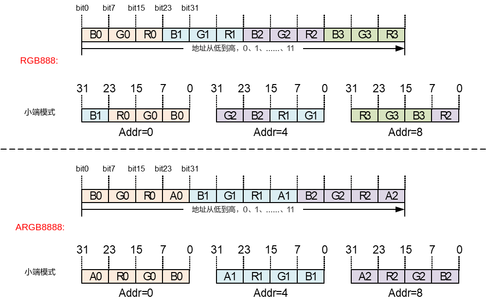

# 视频解码<a name="ZH-CN_TOPIC_0000002441659481"></a>


## 概述<a name="ZH-CN_TOPIC_0000002408100150"></a>

VDEC模块提供驱动视频解码硬件工作的MPI接口，实现视频解码功能。

不同解决方案的VDEC特性如表1所示。

**表 1**  不同解决方案的VDEC特性

<a name="_Ref322355773"></a>
<table><thead align="left"><tr id="row2533mcpsimp"><th class="cellrowborder" valign="top" width="17%" id="mcps1.2.6.1.1"><p id="p2535mcpsimp"><a name="p2535mcpsimp"></a><a name="p2535mcpsimp"></a>解决方案</p>
</th>
<th class="cellrowborder" valign="top" width="14.000000000000002%" id="mcps1.2.6.1.2"><p id="p2537mcpsimp"><a name="p2537mcpsimp"></a><a name="p2537mcpsimp"></a>硬件解码模块</p>
</th>
<th class="cellrowborder" valign="top" width="14.000000000000002%" id="mcps1.2.6.1.3"><p id="p2539mcpsimp"><a name="p2539mcpsimp"></a><a name="p2539mcpsimp"></a>支持最大通道数</p>
</th>
<th class="cellrowborder" valign="top" width="19%" id="mcps1.2.6.1.4"><p id="p2541mcpsimp"><a name="p2541mcpsimp"></a><a name="p2541mcpsimp"></a>支持协议</p>
</th>
<th class="cellrowborder" valign="top" width="36%" id="mcps1.2.6.1.5"><p id="p2543mcpsimp"><a name="p2543mcpsimp"></a><a name="p2543mcpsimp"></a>最大、最小分辨率支持</p>
</th>
</tr>
</thead>
<tbody><tr id="row2545mcpsimp"><td class="cellrowborder" valign="top" width="17%" headers="mcps1.2.6.1.1 "><p xml:lang="sv-SE" id="p2547mcpsimp"><a name="p2547mcpsimp"></a><a name="p2547mcpsimp"></a>SS528V100/SS625V100</p>
</td>
<td class="cellrowborder" valign="top" width="14.000000000000002%" headers="mcps1.2.6.1.2 "><p id="p2550mcpsimp"><a name="p2550mcpsimp"></a><a name="p2550mcpsimp"></a>VDH</p>
<p id="p2551mcpsimp"><a name="p2551mcpsimp"></a><a name="p2551mcpsimp"></a>JPEGD</p>
</td>
<td class="cellrowborder" valign="top" width="14.000000000000002%" headers="mcps1.2.6.1.3 "><p id="p2553mcpsimp"><a name="p2553mcpsimp"></a><a name="p2553mcpsimp"></a>128</p>
</td>
<td class="cellrowborder" valign="top" width="19%" headers="mcps1.2.6.1.4 "><p id="p2555mcpsimp"><a name="p2555mcpsimp"></a><a name="p2555mcpsimp"></a>VDH:</p>
<p id="p2556mcpsimp"><a name="p2556mcpsimp"></a><a name="p2556mcpsimp"></a>H.264/H.265</p>
<p id="p2557mcpsimp"><a name="p2557mcpsimp"></a><a name="p2557mcpsimp"></a>JPEGD:</p>
<p id="p2558mcpsimp"><a name="p2558mcpsimp"></a><a name="p2558mcpsimp"></a>JPEG/MJPEG</p>
</td>
<td class="cellrowborder" valign="top" width="36%" headers="mcps1.2.6.1.5 "><p id="p2560mcpsimp"><a name="p2560mcpsimp"></a><a name="p2560mcpsimp"></a>VDH:</p>
<a name="ul2561mcpsimp"></a><a name="ul2561mcpsimp"></a><ul id="ul2561mcpsimp"><li>H.264: max 8192x8192, min 96x96</li><li>H.265: max 8192x8192, min 96x96</li></ul>
<p id="p2564mcpsimp"><a name="p2564mcpsimp"></a><a name="p2564mcpsimp"></a>JPEGD：</p>
<p id="p2565mcpsimp"><a name="p2565mcpsimp"></a><a name="p2565mcpsimp"></a>JPEG/MJPEG: max 16384x16384, min 8x8</p>
</td>
</tr>
<tr id="row2566mcpsimp"><td class="cellrowborder" valign="top" width="17%" headers="mcps1.2.6.1.1 "><p id="p2568mcpsimp"><a name="p2568mcpsimp"></a><a name="p2568mcpsimp"></a>SS524V100/SS522V101</p>
</td>
<td class="cellrowborder" valign="top" width="14.000000000000002%" headers="mcps1.2.6.1.2 "><p id="p2570mcpsimp"><a name="p2570mcpsimp"></a><a name="p2570mcpsimp"></a>VDH</p>
<p id="p2571mcpsimp"><a name="p2571mcpsimp"></a><a name="p2571mcpsimp"></a>JPEGD</p>
</td>
<td class="cellrowborder" valign="top" width="14.000000000000002%" headers="mcps1.2.6.1.3 "><p id="p2573mcpsimp"><a name="p2573mcpsimp"></a><a name="p2573mcpsimp"></a>128</p>
</td>
<td class="cellrowborder" valign="top" width="19%" headers="mcps1.2.6.1.4 "><p id="p2575mcpsimp"><a name="p2575mcpsimp"></a><a name="p2575mcpsimp"></a>VDH:</p>
<p id="p2576mcpsimp"><a name="p2576mcpsimp"></a><a name="p2576mcpsimp"></a>H.264/H.265</p>
<p id="p2577mcpsimp"><a name="p2577mcpsimp"></a><a name="p2577mcpsimp"></a>JPEGD:</p>
<p id="p2578mcpsimp"><a name="p2578mcpsimp"></a><a name="p2578mcpsimp"></a>JPEG/MJPEG</p>
</td>
<td class="cellrowborder" valign="top" width="36%" headers="mcps1.2.6.1.5 "><p id="p2580mcpsimp"><a name="p2580mcpsimp"></a><a name="p2580mcpsimp"></a>VDH:</p>
<a name="ul2581mcpsimp"></a><a name="ul2581mcpsimp"></a><ul id="ul2581mcpsimp"><li>H.264: max 4096x4096, min 96x96</li><li>H.265: max 4096x4096, min 96x96</li></ul>
<p id="p2584mcpsimp"><a name="p2584mcpsimp"></a><a name="p2584mcpsimp"></a>JPEGD：</p>
<p id="p2585mcpsimp"><a name="p2585mcpsimp"></a><a name="p2585mcpsimp"></a>JPEG/MJPEG: max 16384x16384, min 8x8</p>
</td>
</tr>
<tr id="row2586mcpsimp"><td class="cellrowborder" valign="top" width="17%" headers="mcps1.2.6.1.1 "><p id="p2588mcpsimp"><a name="p2588mcpsimp"></a><a name="p2588mcpsimp"></a>Hi3403V100</p>
</td>
<td class="cellrowborder" valign="top" width="14.000000000000002%" headers="mcps1.2.6.1.2 "><p id="p2590mcpsimp"><a name="p2590mcpsimp"></a><a name="p2590mcpsimp"></a>VDH</p>
<p id="p2591mcpsimp"><a name="p2591mcpsimp"></a><a name="p2591mcpsimp"></a>JPEGD</p>
</td>
<td class="cellrowborder" valign="top" width="14.000000000000002%" headers="mcps1.2.6.1.3 "><p id="p2593mcpsimp"><a name="p2593mcpsimp"></a><a name="p2593mcpsimp"></a>128</p>
</td>
<td class="cellrowborder" valign="top" width="19%" headers="mcps1.2.6.1.4 "><p id="p2595mcpsimp"><a name="p2595mcpsimp"></a><a name="p2595mcpsimp"></a>VDH:</p>
<p id="p2596mcpsimp"><a name="p2596mcpsimp"></a><a name="p2596mcpsimp"></a>H.264/H.265/MPEG4</p>
<p id="p2597mcpsimp"><a name="p2597mcpsimp"></a><a name="p2597mcpsimp"></a>JPEGD:</p>
<p id="p2598mcpsimp"><a name="p2598mcpsimp"></a><a name="p2598mcpsimp"></a>JPEG/MJPEG</p>
</td>
<td class="cellrowborder" valign="top" width="36%" headers="mcps1.2.6.1.5 "><p id="p2600mcpsimp"><a name="p2600mcpsimp"></a><a name="p2600mcpsimp"></a>VDH:</p>
<a name="ul2601mcpsimp"></a><a name="ul2601mcpsimp"></a><ul id="ul2601mcpsimp"><li>H.264: max 8192x8192, min 96x96</li><li>H.265: max 8192x8192, min 96x96</li><li>MPEG4: max 4096x4096, min 64x64</li></ul>
<p id="p2605mcpsimp"><a name="p2605mcpsimp"></a><a name="p2605mcpsimp"></a>JPEGD：</p>
<p id="p2606mcpsimp"><a name="p2606mcpsimp"></a><a name="p2606mcpsimp"></a>JPEG/MJPEG: max 16384x16384, min 8x8</p>
</td>
</tr>
<tr id="row2607mcpsimp"><td class="cellrowborder" valign="top" width="17%" headers="mcps1.2.6.1.1 "><p id="p2609mcpsimp"><a name="p2609mcpsimp"></a><a name="p2609mcpsimp"></a>SS626V100</p>
</td>
<td class="cellrowborder" valign="top" width="14.000000000000002%" headers="mcps1.2.6.1.2 "><p id="p2611mcpsimp"><a name="p2611mcpsimp"></a><a name="p2611mcpsimp"></a>VDH</p>
<p id="p2612mcpsimp"><a name="p2612mcpsimp"></a><a name="p2612mcpsimp"></a>JPEGD</p>
</td>
<td class="cellrowborder" valign="top" width="14.000000000000002%" headers="mcps1.2.6.1.3 "><p id="p2614mcpsimp"><a name="p2614mcpsimp"></a><a name="p2614mcpsimp"></a>128</p>
</td>
<td class="cellrowborder" valign="top" width="19%" headers="mcps1.2.6.1.4 "><p id="p2616mcpsimp"><a name="p2616mcpsimp"></a><a name="p2616mcpsimp"></a>VDH:</p>
<p id="p2617mcpsimp"><a name="p2617mcpsimp"></a><a name="p2617mcpsimp"></a>H.264/H.265/MPEG4</p>
<p id="p2618mcpsimp"><a name="p2618mcpsimp"></a><a name="p2618mcpsimp"></a>JPEGD:</p>
<p id="p2619mcpsimp"><a name="p2619mcpsimp"></a><a name="p2619mcpsimp"></a>JPEG/MJPEG</p>
</td>
<td class="cellrowborder" valign="top" width="36%" headers="mcps1.2.6.1.5 "><p id="p2621mcpsimp"><a name="p2621mcpsimp"></a><a name="p2621mcpsimp"></a>VDH:</p>
<a name="ul2622mcpsimp"></a><a name="ul2622mcpsimp"></a><ul id="ul2622mcpsimp"><li>H.264: max 8192x8192, min 96x96</li><li>H.265: max 8192x8192, min 96x96</li><li>MPEG4: max 4096x4096, min 64x64</li></ul>
<p id="p2626mcpsimp"><a name="p2626mcpsimp"></a><a name="p2626mcpsimp"></a>JPEGD:</p>
<p id="p2627mcpsimp"><a name="p2627mcpsimp"></a><a name="p2627mcpsimp"></a>JPEG/MJPEG: max 16384x16384, min 8x8</p>
</td>
</tr>
</tbody>
</table>

## 重要概念<a name="ZH-CN_TOPIC_0000002408260182"></a>

-   码流发送方式

    VDEC解码器提供三种码流发送方式：

    -   流式发送（OT\_VDEC\_SEND\_MODE\_STREAM）：用户每次可发送任意长度码流到解码器，由解码器内部完成一帧码流的识别过程。须注意，对H.264/H.265/MPEG4而言，在收到下一帧码流才能识别当前帧码流的结束，所以在该发送模式下，输入一帧H.264/H.265/MPEG4码流，不能希望马上开始解码图像。
    -   按帧发送（OT\_VDEC\_SEND\_MODE\_FRAME）：用户每次发送完整一帧码流到解码器，每调用一次发送接口，解码器就认为该帧码流已经结束，开始解码图像，因此需保证每次调用发送接口发送的码流必须为一帧，否则会出现解码错误。通过该发送方式可以达到快速解码的目的。
    -   按兼容模式发送（OT\_VDEC\_SEND\_MODE\_COMPAT）：支持一帧码流分多次发送给解码器，但是每帧码流结束时必须配置帧结束标志end\_of\_frame为TD\_TRUE，否则认为当前帧码流还未结束。

    码流发送方式mode可在接口`ss_mpi_vdec_create_chn`中设置。

-   图像输出方式

    根据H.264/H265/MPEG4协议，解码图像可能不会在解码后立即输出。VDEC解码器可以通过设置不同的图像输出方式达到尽快输出的目的。图像输出方式包括以下两种：

    -   解码序：解码图像按照解码的先后顺序输出。
    -   显示序：解码图像按照H.264/H.265/MPEG4协议输出。

    根据H.264/H.265/MPEG4协议，视频的解码顺序未必是视频的输出顺序（即显示序）。例如B帧解码时需要前后的P帧作为参考，所以B帧后的P帧先于B帧解码，但B帧先于P帧输出。按解码序输出是保证快速输出的一个必要条件，用户选择按解码序输出，需保证码流的解码序与显示序相同。

    按帧发送码流与按解码序输出相结合能达到快速解码和快速输出的目的，用户必须保证每次发送的是完整的一帧码流以及码流的解码序和显示序相同。

    图像输出方式out\_order可在接口`ss_mpi_vdec_set_chn_param`中设置。

-   时间戳（PTS）处理

    在模式OT\_VDEC\_SEND\_MODE\_FRAME下发送码流时，解码输出的图像时间戳PTS为发送码流接口\(`ss_mpi_vdec_send_stream`\)中用户送入的PTS，解码器不会更改此值；如果用户配置的PTS值为0，则表示用户不进行帧率控制，而是由视频输出模块（VO）进行帧率控制；当VDEC为回放模式且VPSS为AUTO模式时，如果用户送入的PTS值为-1，则表示此图像不会被视频输出模块（VO）显示；如果是其他值，则表示视频输出模块（VO）根据用户设置的PTS值进行帧率控制。

    **注意：不能出现PTS值为0和非0混合的情况。**

    在模式OT\_VDEC\_SEND\_MODE\_STREAM下发送码流时，解码输出图像的PTS统一设为0，表示用户不进行帧率控制，而是由视频输出模块（VO）进行帧率控制。

-   用户图片

    当网络异常断开，前端没有码流送来时，用户可通过设置插入用户图片显示在VO上，以提示当前网络异常或没有码流可解码。VDEC提供两种插入用户图片方式：

    -   立刻插入用户图片：VDEC会先清空解码器内部的码流和图像，然后插入用户图片。
    -   延迟插入用户图片：VDEC会先把解码器内部的码流全部解完，待解码图像全部输出之后再插入用户图片。

-   解码帧存分配方式

    -   解码ModuleVB池：创建解码通道时不分配图像Buffer，而是由用户调用相应的MPI接口创建专属于解码模块的ModuleVB池，该VB池只允许VDEC获取VB块，其它模块只能使用不能获取。对于SS626V100，不同的解码通道部署模式使用的模块VB池不同：部署模式为OT\_VDEC\_DEPLOYMENT\_MODE0的通道，模块vb使用uid为OT\_VB\_UID\_VDEC的ModuleVB池；部署模式为OT\_VDEC\_DEPLOYMENT\_MODE1的通道，模块vb使用uid为OT\_VB\_UID\_VDEC\_ADAPT的ModuleVB池。
    -   解码PrivateVB池：创建解码通道时由VDEC创建私有VB池作为该通道的图像Buffer，用户可以在创建通道接口`ss_mpi_vdec_create_chn`中设置私有VB池的个数frame\_buf\_cnt和VB块的大小frame\_buf\_size。
    -   解码UserVB池：创建解码通道时不分配图像Buffer，而是由用户调用接口`ss_mpi_vdec_attach_vb_pool`创建一个视频缓存VB池，再通过调用接口`ss_mpi_vdec_attach_vb_pool`把某个解码通道绑定到固定的视频缓存VB池中。

    三种解码帧存分配方式可通过接口`ss_mpi_vdec_set_mod_param`的参数vb\_src来设置。当解码帧存使用ModuleVB池或者UserVB池方式时，可以不用销毁解码通道直接销毁VB池，但是销毁解码VB池前用户必须保证没有任何模块正在使用这个VB池里的任何一块VB（可通过复位解码通道，以及复位解码直接绑定的后级模块实现，如VDEC绑定VPSS，则就要同时复位VDEC和VPSS；如果用户是从VDEC里获取图像上去，也必须保证全部图像释放回VDEC），否则会出现程序异常的情况。

-   码流Buffer配置模式

    解码码流buffer配置支持两种模式：一般模式和省内存模式。

    -   一般模式：码流Buffer总大小为用户配置的stream\_buf\_size +通道宽x通道高/2，stream\_buf\_size可配置的最小值为通道宽x通道高x3/4，此模式下码流Buffer能容纳每一帧码流，包括超大帧。
    -   省内存模式：码流Buffer的总大小为用户创建解码通道时配置的stream\_buf\_size的大小，stream\_buf\_size可配置的最小值为32KB，但是用户必须保证送入码流每帧大小不能超过stream\_buf\_size的大小。流模式发送码流时省内存模式无效。

    两种模式可通过接口`ss_mpi_vdec_set_mod_param`的参数mini\_buf\_mode来设置。mini\_buf\_mode=1表示省内存模式；mini\_buf\_mode=0表示一般模式。

## 模块参数<a name="ZH-CN_TOPIC_0000002441659509"></a>

-   g\_vdec\_max\_chn\_num

    VDEC模块支持的最大通道数。用户可根据业务场景需求配置一个合理的最大解码通道数，以减少通道上下文相关的内存占用。取值范围：\[1, OT\_VDEC\_MAX\_CHN\_NUM\]。

    使用方法：Linux系统通过加载ssxxx\_vdec.ko或ssxxxx\_vdec.ko时设置g\_vdec\_max\_chn\_num的值。

-   g\_vfmw\_max\_chn\_num

    VFMW模块（H264/H265/MPEG4视频解码模块）支持的最大通道数。用户可根据业务场景需求配置一个合理的最大通道数，以减少通道上下文相关的内存占用。取值范围是\[1, OT\_VDEC\_MAX\_CHN\_NUM\]。

    使用方法：Linux系统通过加载ssxxx\_vfmw.ko或ssxxxx\_vfmw.ko时设置g\_vfmw\_max\_chn\_num的值。

-   g\_vdec\_compat\_mode

    码流兼容模式，范围\[0, 1\]，默认值为0。设置为1后可以提高参考帧语法错误的兼容性，但是会增加内存消耗。

    使用方法：Linux系统通过加载ssxxx\_vdec.ko时设置g\_vdec\_compat\_mode的值。

-   g\_vdec\_affinity

    支持vdec模块timer绑核，取值范围为芯片最大cpu核数，-1时默认不绑核，默认不做绑核操作，SS626V100取值范围\[-1, 7\]。

    使用方法：linux系统通过加载ssxxx\_vdec.ko时设置g\_vdec\_affinity的值。

    动态设置方法：

    1、echo argv \> /sys/module/ot\_vdec/parameters/g\_vdec\_affinity命令将vdec的timer固定绑定某个CPU上，argv参数指定cpu核。

    例如：echo 7 \> /sys/module/ot\_vdec/parameters/g\_vdec\_affinity绑到CPU7上。argv为-1时默认不绑核，取值范围为芯片最大cpu核数，SS626V100取值范围\[0, 7\]。

    2、cat /sys/module/ot\_vdec/parameters/g\_vdec\_affinity指令查看timer绑定到哪个CPU。

-   g\_vfmw\_mdc\_affinity

    支持ot\_vfmw\_mdc线程绑核，取值范围为芯片最大cpu核数，-1时默认不绑核，默认不做绑核操作，SS626V100取值范围\[-1, 7\]。

    使用方法：inux系统通过加载ssxxx\_vfmw.ko时设置g\_vfmw\_mdc\_affinity的值。

    > **须知：** 
    >-   OT\_VDEC\_MAX\_CHN\_NUM是各个解决方案默认支持最大通道数，参考"01 概述"章节中的表1。
    >-   VDEC支持的最大通道数包括H264/H265/MPEG4/JPEG/MJPEG解码通道总数。
    >-   VFMW支持的最大通道数只包含H264/H265/MPEG4解码通道总数。

## API参考<a name="ZH-CN_TOPIC_0000002441659529"></a>

视频解码模块实现创建解码通道、发送视频码流、获取解码后图像等功能。

该功能模块提供以下MPI：

-   `ss_mpi_vdec_set_mod_param`：设置解码模块参数。
-   `ss_mpi_vdec_get_mod_param`：获取解码模块参数。
-   `ss_mpi_vdec_create_chn`：创建视频解码通道。
-   `ss_mpi_vdec_destroy_chn`：销毁视频解码通道。
-   `ss_mpi_vdec_reset_chn`：复位解码通道。
-   `ss_mpi_vdec_get_chn_attr`：获取视频解码通道属性。
-   `ss_mpi_vdec_set_chn_attr`：设置视频解码通道属性。
-   `ss_mpi_vdec_start_recv_stream`：解码器开始接收用户发送的码流。
-   `ss_mpi_vdec_stop_recv_stream`：解码器停止接收用户发送的码流。
-   `ss_mpi_vdec_query_status`：查询解码通道状态。
-   `ss_mpi_vdec_send_stream`：向视频解码通道发送码流数据。
-   `ss_mpi_vdec_get_frame`：获取视频解码通道的解码图像。
-   `ss_mpi_vdec_release_frame`：释放视频解码通道的解码图像。
-   `ss_mpi_vdec_set_chn_param`：设置解码通道参数。
-   `ss_mpi_vdec_get_chn_param`：获取解码通道参数。
-   `ss_mpi_vdec_set_protocol_param`：设置协议相关的内存分配通道参数。
-   `ss_mpi_vdec_get_protocol_param`：获取协议相关的内存分配通道参数。
-   `ss_mpi_vdec_set_user_data_attr`：设置解码通道用户数据属性。
-   `ss_mpi_vdec_get_user_data_attr`：获取解码通道用户数据属性。
-   `ss_mpi_vdec_get_user_data`：获取视频解码通道的用户数据。
-   `ss_mpi_vdec_release_user_data`：释放视频解码通道的用户数据。
-   `ss_mpi_vdec_set_user_pic`：设置用户图片属性。
-   `ss_mpi_vdec_enable_user_pic`：使能插入用户图片。
-   `ss_mpi_vdec_disable_user_pic`：禁止使能插入用户图片。
-   `ss_mpi_vdec_set_display_mode`：设置显示模式。
-   `ss_mpi_vdec_get_display_mode`：获取显示模式。
-   `ss_mpi_vdec_set_rotation`：设置解码图像旋转角度。
-   `ss_mpi_vdec_get_rotation`：获取解码图像旋转角度。
-   `ss_mpi_vdec_attach_vb_pool`：将解码通道绑定到某个视频缓存VB池中。
-   `ss_mpi_vdec_detach_vb_pool`：将解码通道从某个视频缓存VB池中解绑定。
-   `ss_mpi_vdec_get_fd`：获取视频解码通道的设备文件句柄。
-   `ss_mpi_vdec_close_fd`：关闭视频解码通道的设备文件句柄。
-   `ss_mpi_vdec_set_low_delay_attr`：设置解码通道低延时属性。
-   `ss_mpi_vdec_get_low_delay_attr`：获取解码通道低延时属性。
-   `ss_mpi_vdec_set_chn_config`：设置解码通道配置。
-   `ss_mpi_vdec_get_chn_config`：获取解码通道配置。
-   `ss_mpi_vdec_set_deployment_mode1_cfg`：设置部署模式为OT\_VDEC\_DEPLOYMENT\_MODE1的解码通道的配置参数。
-   `ss_mpi_vdec_get_deployment_mode1_cfg`：获取部署模式为OT\_VDEC\_DEPLOYMENT\_MODE1的解码通道的配置参数。


### ss\_mpi\_vdec\_set\_mod\_param<a name="ZH-CN_TOPIC_0000002441659569"></a>

【描述】

设置解码模块参数。

【语法】

```
td_s32 ss_mpi_vdec_set_mod_param(const ot_vdec_mod_param *mod_param);
```

【参数】

<a name="table4888mcpsimp"></a>
<table><thead align="left"><tr id="row4894mcpsimp"><th class="cellrowborder" valign="top" width="19%" id="mcps1.1.4.1.1"><p id="p4896mcpsimp"><a name="p4896mcpsimp"></a><a name="p4896mcpsimp"></a>参数名称</p>
</th>
<th class="cellrowborder" valign="top" width="61%" id="mcps1.1.4.1.2"><p id="p4898mcpsimp"><a name="p4898mcpsimp"></a><a name="p4898mcpsimp"></a>描述</p>
</th>
<th class="cellrowborder" valign="top" width="20%" id="mcps1.1.4.1.3"><p id="p4900mcpsimp"><a name="p4900mcpsimp"></a><a name="p4900mcpsimp"></a>输入/输出</p>
</th>
</tr>
</thead>
<tbody><tr id="row4902mcpsimp"><td class="cellrowborder" valign="top" width="19%" headers="mcps1.1.4.1.1 "><p id="p4904mcpsimp"><a name="p4904mcpsimp"></a><a name="p4904mcpsimp"></a>mod_param</p>
</td>
<td class="cellrowborder" valign="top" width="61%" headers="mcps1.1.4.1.2 "><p id="p4906mcpsimp"><a name="p4906mcpsimp"></a><a name="p4906mcpsimp"></a>模块参数结构体指针。</p>
</td>
<td class="cellrowborder" valign="top" width="20%" headers="mcps1.1.4.1.3 "><p id="p4908mcpsimp"><a name="p4908mcpsimp"></a><a name="p4908mcpsimp"></a>输入</p>
</td>
</tr>
</tbody>
</table>

【返回值】

<a name="table4910mcpsimp"></a>
<table><thead align="left"><tr id="row4915mcpsimp"><th class="cellrowborder" valign="top" width="50%" id="mcps1.1.3.1.1"><p id="p4917mcpsimp"><a name="p4917mcpsimp"></a><a name="p4917mcpsimp"></a>返回值</p>
</th>
<th class="cellrowborder" valign="top" width="50%" id="mcps1.1.3.1.2"><p id="p4919mcpsimp"><a name="p4919mcpsimp"></a><a name="p4919mcpsimp"></a>描述</p>
</th>
</tr>
</thead>
<tbody><tr id="row4921mcpsimp"><td class="cellrowborder" valign="top" width="50%" headers="mcps1.1.3.1.1 "><p id="p4923mcpsimp"><a name="p4923mcpsimp"></a><a name="p4923mcpsimp"></a>0</p>
</td>
<td class="cellrowborder" valign="top" width="50%" headers="mcps1.1.3.1.2 "><p id="p4925mcpsimp"><a name="p4925mcpsimp"></a><a name="p4925mcpsimp"></a>成功。</p>
</td>
</tr>

<tr id="row4017mcpsimp"><td class="cellrowborder" valign="top" width="20%" headers="mcps1.1.4.1.1 "><p id="p4019mcpsimp"><a name="p4019mcpsimp"></a><a name="p4019mcpsimp"></a>low_delay_attr</p>
</td>
<td class="cellrowborder" valign="top" width="63%" headers="mcps1.1.4.1.2 "><p id="p4021mcpsimp"><a name="p4021mcpsimp"></a><a name="p4021mcpsimp"></a>低延时属性。具体请参见“系统控制”章节。</p>
</td>
<td class="cellrowborder" valign="top" width="17%" headers="mcps1.1.4.1.3 "><p id="p4023mcpsimp"><a name="p4023mcpsimp"></a><a name="p4023mcpsimp"></a>输出</p>
</td>
</tr>
</tbody>
</table>

【返回值】

<a name="table4025mcpsimp"></a>
<table><thead align="left"><tr id="row4030mcpsimp"><th class="cellrowborder" valign="top" width="50%" id="mcps1.1.3.1.1"><p id="p4032mcpsimp"><a name="p4032mcpsimp"></a><a name="p4032mcpsimp"></a>返回值</p>
</th>
<th class="cellrowborder" valign="top" width="50%" id="mcps1.1.3.1.2"><p id="p4034mcpsimp"><a name="p4034mcpsimp"></a><a name="p4034mcpsimp"></a>描述</p>
</th>
</tr>
</thead>
<tbody><tr id="row4036mcpsimp"><td class="cellrowborder" valign="top" width="50%" headers="mcps1.1.3.1.1 "><p id="p4038mcpsimp"><a name="p4038mcpsimp"></a><a name="p4038mcpsimp"></a>0</p>
</td>
<td class="cellrowborder" valign="top" width="50%" headers="mcps1.1.3.1.2 "><p id="p4040mcpsimp"><a name="p4040mcpsimp"></a><a name="p4040mcpsimp"></a>成功。</p>
</td>
</tr>
<tr id="row4041mcpsimp"><td class="cellrowborder" valign="top" width="50%" headers="mcps1.1.3.1.1 "><p id="p4043mcpsimp"><a name="p4043mcpsimp"></a><a name="p4043mcpsimp"></a>非0</p>
</td>
<td class="cellrowborder" valign="top" width="50%" headers="mcps1.1.3.1.2 "><p id="p4045mcpsimp"><a name="p4045mcpsimp"></a><a name="p4045mcpsimp"></a>失败，其值为<a href="错误码.md"><span xml:lang="fr-FR" id="ph4047mcpsimp"><a name="ph4047mcpsimp"></a><a name="ph4047mcpsimp"></a>错误码</span></a>。</p>
</td>
</tr>
</tbody>
</table>

【需求】

-   头文件：ss\_mpi\_vdec.h、ot\_common\_video.h
-   库文件：libss\_mpi.a

【注意】

-   获取属性前必须保证通道已创建，否则会返回[OT\_ERR\_VDEC\_UNEXIST`。
-   仅Hi3403V100/SS626V100支持此接口，其他解决方案调用时会返回`OT\_ERR\_VDEC\_NOT\_SUPPORT`。

【举例】

无。

【相关主题】

无。

### ss\_mpi\_vdec\_set\_chn\_config<a name="ZH-CN_TOPIC_0000002441659585"></a>

【描述】

设置解码通道配置。

【语法】

```
td_s32 ss_mpi_vdec_set_chn_config(ot_vdec_chn chn, const ot_vdec_chn_config *chn_config);
```

【参数】

<a name="table2924mcpsimp"></a>
<table><thead align="left"><tr id="row2930mcpsimp"><th class="cellrowborder" valign="top" width="20%" id="mcps1.1.4.1.1"><p id="p2932mcpsimp"><a name="p2932mcpsimp"></a><a name="p2932mcpsimp"></a>参数名称</p>
</th>
<th class="cellrowborder" valign="top" width="61%" id="mcps1.1.4.1.2"><p id="p2934mcpsimp"><a name="p2934mcpsimp"></a><a name="p2934mcpsimp"></a>描述</p>
</th>
<th class="cellrowborder" valign="top" width="19%" id="mcps1.1.4.1.3"><p id="p2936mcpsimp"><a name="p2936mcpsimp"></a><a name="p2936mcpsimp"></a>输入/输出</p>
</th>
</tr>
</thead>
<tbody><tr id="row2938mcpsimp"><td class="cellrowborder" valign="top" width="20%" headers="mcps1.1.4.1.1 "><p id="p2940mcpsimp"><a name="p2940mcpsimp"></a><a name="p2940mcpsimp"></a>chn</p>
</td>
<td class="cellrowborder" valign="top" width="61%" headers="mcps1.1.4.1.2 "><p id="p2942mcpsimp"><a name="p2942mcpsimp"></a><a name="p2942mcpsimp"></a>视频解码通道号。</p>
<p id="p2943mcpsimp"><a name="p2943mcpsimp"></a><a name="p2943mcpsimp"></a>取值范围：`OT_VDEC_MAX_CHN_NUM`：定义最大解码通道数。
-   `ot_vdec_chn`：定义VDEC通道号。
-   `ot_vdec_chn_attr`：定义解码通道属性。
-   `ot_vdec_video_attr`：定义视频解码视频通道属性。
-   `ot_vdec_send_mode`：定义码流发送方式枚举。
-   `ot_vdec_chn_status`：定义通道状态结构体。
-   `ot_vdec_dec_err`：定义解码错误信息结构体。
-   `ot_vdec_event`：定义解码事件上报类型。
-   `ot_vdec_chn_param`：定义解码通道高级参数结构体。
-   `ot_vdec_video_param`：定义视频解码高级参数结构体。
-   `ot_vdec_pic_param`：定义图片解码高级参数结构体。
-   `ot_video_dec_mode`：定义解码模式枚举。
-   `ot_video_out_order`：定义解码输出顺序枚举。
-   `ot_h264_protocol_param`: 与H.264协议相关的内存分配参数。
-   `ot_h265_protocol_param`: 定义与H.265协议相关的内存分配参数。
-   `ot_vdec_protocol_param`：定义与协议相关的内存分配参数结构体。
-   `ot_vdec_frame_type`：定义输出帧类型。
-   `ot_vdec_supplement_info`：定义输出帧补充信息。
-   `ot_vdec_video_supplement_info`：定义输出视频帧补充信息。
-   `ot_vdec_stream`：定义解码码流结构体。
-   `ot_vdec_user_data_attr`：定义用户数据属性。
-   `ot_vdec_user_data`：定义用户数据结构体。
-   `ot_vdec_chn_pool`：定义解码通道绑定的VB池结构体。
-   `ot_vdec_capacity_strategy`：定义解码图像最大宽高能力集。
-   `ot_vdec_video_mod_param`：定义视频解码模块参数结构体。
-   `ot_vdec_pic_mod_param`：定义图片解码模块参数结构体。
-   `ot_vdec_mod_param`：定义解码模块参数结构体。
-   `ot_quick_mark_mode`：定义快速释放参考帧模式枚举。
-   `vdec\_deployment\_mode`：定义解码部署模式枚举。
-   `ot_vdec_chn_config`：定义解码通道配置。
-   `ot_vdec_deployment_mode1_config`：定义部署模式为OT\_VDEC\_DEPLOYMENT\_MODE1的解码通道的配置参数。


### OT\_VDEC\_MAX\_CHN\_NUM<a name="ZH-CN_TOPIC_0000002408260142"></a>

【说明】

定义最大解码通道个数。

【定义】

```
#define  OT_VDEC_MAX_CHN_NUM	128
```

【注意事项】

最大解码通道数：由于最大通道个数涉及到内存的分配，允许用户根据实际需要重新指定最大解码通道个数，具体方式为：Linux系统通过加载ssxxx\_vdec.ko或ssxxxx\_vdec.ko时设置g\_vdec\_max\_chn\_num的值。

【相关数据类型及接口】

无。

### ot\_vdec\_chn<a name="ZH-CN_TOPIC_0000002408100302"></a>

【说明】

定义VDEC通道号。

【定义】

```
typedef   td_s32 	ot_vdec_chn；
```

【注意事项】

取值范围：\[0, OT\_VDEC\_MAX\_CHN\_NUM\)。

【相关数据类型及接口】

无。

### ot\_vdec\_chn\_attr<a name="ZH-CN_TOPIC_0000002441659485"></a>

【说明】

定义解码通道属性结构体。

【定义】

```
typedef struct {
    ot_payload_type type; 
    ot_vdec_send_mode mode;  
    td_u32 pic_width;  
    td_u32 pic_height;  
    td_u32 stream_buf_size; 
    td_u32 frame_buf_size;
    td_u32 frame_buf_cnt;
    union {
    ot_vdec_video_attr video_attr;
    };
} ot_vdec_chn_attr;
```

【成员】

<a name="table514mcpsimp"></a>
<table><thead align="left"><tr id="row519mcpsimp"><th class="cellrowborder" valign="top" width="23%" id="mcps1.1.3.1.1"><p id="p521mcpsimp"><a name="p521mcpsimp"></a><a name="p521mcpsimp"></a>成员名称</p>
</th>
<th class="cellrowborder" valign="top" width="77%" id="mcps1.1.3.1.2"><p id="p523mcpsimp"><a name="p523mcpsimp"></a><a name="p523mcpsimp"></a>描述</p>
</th>
</tr>
</thead>
<tbody><tr id="row525mcpsimp"><td class="cellrowborder" valign="top" width="23%" headers="mcps1.1.3.1.1 "><p xml:lang="fr-FR" id="p527mcpsimp"><a name="p527mcpsimp"></a><a name="p527mcpsimp"></a>type</p>
</td>
<td class="cellrowborder" valign="top" width="77%" headers="mcps1.1.3.1.2 "><p id="p529mcpsimp"><a name="p529mcpsimp"></a><a name="p529mcpsimp"></a>解码协议类型枚举值。</p>
<p id="p530mcpsimp"><a name="p530mcpsimp"></a><a name="p530mcpsimp"></a>动态属性。</p>
<p id="p531mcpsimp"><a name="p531mcpsimp"></a><a name="p531mcpsimp"></a>具体描述请参见“系统控制”章节，其中JPEG和MJPEG在解码器内部无任何区别。H264、MPEG4与H265之间，JPEG与MJPEG之间可以进行通道协议切换。</p>
</td>
</tr>
<tr id="row532mcpsimp"><td class="cellrowborder" valign="top" width="23%" headers="mcps1.1.3.1.1 "><p xml:lang="fr-FR" id="p534mcpsimp"><a name="p534mcpsimp"></a><a name="p534mcpsimp"></a>mode</p>
</td>
<td class="cellrowborder" valign="top" width="77%" headers="mcps1.1.3.1.2 "><p id="p536mcpsimp"><a name="p536mcpsimp"></a><a name="p536mcpsimp"></a>码流发送方式。</p>
<p id="p537mcpsimp"><a name="p537mcpsimp"></a><a name="p537mcpsimp"></a>动态属性。</p>
</td>
</tr>
<tr id="row538mcpsimp"><td class="cellrowborder" valign="top" width="23%" headers="mcps1.1.3.1.1 "><p xml:lang="fr-FR" id="p540mcpsimp"><a name="p540mcpsimp"></a><a name="p540mcpsimp"></a>pic_width</p>
</td>
<td class="cellrowborder" valign="top" width="77%" headers="mcps1.1.3.1.2 "><p xml:lang="fr-FR" id="p542mcpsimp"><a name="p542mcpsimp"></a><a name="p542mcpsimp"></a>通道支持的解码图像最大宽（以像素为单位）</p>
<p xml:lang="fr-FR" id="p543mcpsimp"><a name="p543mcpsimp"></a><a name="p543mcpsimp"></a>静态属性。</p>
</td>
</tr>
<tr id="row544mcpsimp"><td class="cellrowborder" valign="top" width="23%" headers="mcps1.1.3.1.1 "><p xml:lang="fr-FR" id="p546mcpsimp"><a name="p546mcpsimp"></a><a name="p546mcpsimp"></a>pic_height</p>
</td>
<td class="cellrowborder" valign="top" width="77%" headers="mcps1.1.3.1.2 "><p xml:lang="fr-FR" id="p548mcpsimp"><a name="p548mcpsimp"></a><a name="p548mcpsimp"></a>通道支持的解码图像最大高（以像素为单位）</p>
<p xml:lang="fr-FR" id="p549mcpsimp"><a name="p549mcpsimp"></a><a name="p549mcpsimp"></a>静态属性。</p>
</td>
</tr>
<tr id="row550mcpsimp"><td class="cellrowborder" valign="top" width="23%" headers="mcps1.1.3.1.1 "><p xml:lang="fr-FR" id="p552mcpsimp"><a name="p552mcpsimp"></a><a name="p552mcpsimp"></a>stream_buf_size</p>
</td>
<td class="cellrowborder" valign="top" width="77%" headers="mcps1.1.3.1.2 "><p xml:lang="fr-FR" id="p554mcpsimp"><a name="p554mcpsimp"></a><a name="p554mcpsimp"></a>码流缓存的大小。</p>
<p xml:lang="fr-FR" id="p555mcpsimp"><a name="p555mcpsimp"></a><a name="p555mcpsimp"></a>取值范围：帧模式或者兼容模式解码且使用码流Buffer省内存模式时，大于等于32KB；其它情况大于等于解码通道大小（宽x高）的3/4倍，即420图像大小的一半（宽x高x3/2x1/2），以byte为单位。</p>
<p xml:lang="fr-FR" id="p556mcpsimp"><a name="p556mcpsimp"></a><a name="p556mcpsimp"></a>推荐值：一幅YUV420解码图像大小。即：宽x高x1.5。</p>
<p xml:lang="fr-FR" id="p557mcpsimp"><a name="p557mcpsimp"></a><a name="p557mcpsimp"></a>静态属性。</p>
</td>
</tr>
<tr id="row558mcpsimp"><td class="cellrowborder" valign="top" width="23%" headers="mcps1.1.3.1.1 "><p xml:lang="fr-FR" id="p560mcpsimp"><a name="p560mcpsimp"></a><a name="p560mcpsimp"></a>frame_buf_size</p>
</td>
<td class="cellrowborder" valign="top" width="77%" headers="mcps1.1.3.1.2 "><p xml:lang="fr-FR" id="p562mcpsimp"><a name="p562mcpsimp"></a><a name="p562mcpsimp"></a>解码图像帧存buffer大小。</p>
<p xml:lang="fr-FR" id="p563mcpsimp"><a name="p563mcpsimp"></a><a name="p563mcpsimp"></a>取值范围：大于0，但是用户必须保证所配置的帧存大小满足解码码流内存要求，否则不能正常解码。</p>
<p xml:lang="fr-FR" id="p564mcpsimp"><a name="p564mcpsimp"></a><a name="p564mcpsimp"></a>仅PrivateVB模式有效。</p>
<p id="p329495612588"><a name="p329495612588"></a><a name="p329495612588"></a>静态属性。</p>
</td>
</tr>
<tr id="row565mcpsimp"><td class="cellrowborder" valign="top" width="23%" headers="mcps1.1.3.1.1 "><p id="p567mcpsimp"><a name="p567mcpsimp"></a><a name="p567mcpsimp"></a>frame_buf_cnt</p>
</td>
<td class="cellrowborder" valign="top" width="77%" headers="mcps1.1.3.1.2 "><p xml:lang="fr-FR" id="p569mcpsimp"><a name="p569mcpsimp"></a><a name="p569mcpsimp"></a>解码图像帧存个数。</p>
<p xml:lang="fr-FR" id="p570mcpsimp"><a name="p570mcpsimp"></a><a name="p570mcpsimp"></a>取值范围：(0, 33]，但是用户必须保证所配置的帧存个数满足解码码流帧存个数要求，否则无法正常解码。</p>
<p xml:lang="fr-FR" id="p571mcpsimp"><a name="p571mcpsimp"></a><a name="p571mcpsimp"></a>H.264/H.265/MPEG4解码所需帧存个数为参考帧+显示帧+1。</p>
<p xml:lang="fr-FR" id="p572mcpsimp"><a name="p572mcpsimp"></a><a name="p572mcpsimp"></a>JPEG/MJPEG解码所需帧存个数为显示帧+1。</p>
<p xml:lang="fr-FR" id="p573mcpsimp"><a name="p573mcpsimp"></a><a name="p573mcpsimp"></a>仅PrivateVB模式有效。</p>
<p xml:lang="fr-FR" id="p574mcpsimp"><a name="p574mcpsimp"></a><a name="p574mcpsimp"></a>静态属性。</p>
</td>
</tr>
<tr id="row575mcpsimp"><td class="cellrowborder" valign="top" width="23%" headers="mcps1.1.3.1.1 "><p xml:lang="fr-FR" id="p577mcpsimp"><a name="p577mcpsimp"></a><a name="p577mcpsimp"></a>video_attr</p>
</td>
<td class="cellrowborder" valign="top" width="77%" headers="mcps1.1.3.1.2 "><p xml:lang="fr-FR" id="p579mcpsimp"><a name="p579mcpsimp"></a><a name="p579mcpsimp"></a>视频(H.264/H.265/MPEG4)解码通道属性。</p>
</td>
</tr>
</tbody>
</table>

【描述】

无。

【相关数据类型及接口】

无。

### ot\_vdec\_video\_attr<a name="ZH-CN_TOPIC_0000002408100202"></a>

【说明】

定义视频解码视频通道属性。

【定义】

```
typedef struct {
    td_u32 ref_frame_num; 
    td_bool temporal_mvp_en;
    td_u32 tmv_buf_size; 
} ot_vdec_video_attr;
```

【成员】

<a name="table594mcpsimp"></a>
<table><thead align="left"><tr id="row599mcpsimp"><th class="cellrowborder" valign="top" width="37%" id="mcps1.1.3.1.1"><p id="p601mcpsimp"><a name="p601mcpsimp"></a><a name="p601mcpsimp"></a>成员名称</p>
</th>
<th class="cellrowborder" valign="top" width="63%" id="mcps1.1.3.1.2"><p id="p603mcpsimp"><a name="p603mcpsimp"></a><a name="p603mcpsimp"></a>描述</p>
</th>
</tr>
</thead>
<tbody><tr id="row605mcpsimp"><td class="cellrowborder" valign="top" width="37%" headers="mcps1.1.3.1.1 "><p xml:lang="fr-FR" id="p607mcpsimp"><a name="p607mcpsimp"></a><a name="p607mcpsimp"></a>ref_frame_num</p>
</td>
<td class="cellrowborder" valign="top" width="63%" headers="mcps1.1.3.1.2 "><p id="p609mcpsimp"><a name="p609mcpsimp"></a><a name="p609mcpsimp"></a>参考帧的数目。</p>
<p id="p610mcpsimp"><a name="p610mcpsimp"></a><a name="p610mcpsimp"></a>取值范围：[0, 16]，以帧为单位。</p>
<p id="p611mcpsimp"><a name="p611mcpsimp"></a><a name="p611mcpsimp"></a>参考帧的数目决定解码时需要的参考帧个数，会较大的影响内存VB块占用，根据实际情况设置合适的值。</p>
<a name="ul612mcpsimp"></a><a name="ul612mcpsimp"></a><ul id="ul612mcpsimp"><li>自编码流：推荐设为3。如果复合解码使能，推荐设置为6。</li><li>其他码流：推荐设为5。</li><li>测试码流：推荐设为16。</li></ul>
<p id="p616mcpsimp"><a name="p616mcpsimp"></a><a name="p616mcpsimp"></a>动态属性。</p>
</td>
</tr>
<tr id="row617mcpsimp"><td class="cellrowborder" valign="top" width="37%" headers="mcps1.1.3.1.1 "><p xml:lang="fr-FR" id="p619mcpsimp"><a name="p619mcpsimp"></a><a name="p619mcpsimp"></a>temporal_mvp_en</p>
</td>
<td class="cellrowborder" valign="top" width="63%" headers="mcps1.1.3.1.2 "><p id="p621mcpsimp"><a name="p621mcpsimp"></a><a name="p621mcpsimp"></a><span xml:lang="fr-FR" id="ph622mcpsimp"><a name="ph622mcpsimp"></a><a name="ph622mcpsimp"></a>是否</span>支持时域运动矢量预测</p>
<p xml:lang="fr-FR" id="p623mcpsimp"><a name="p623mcpsimp"></a><a name="p623mcpsimp"></a>取值范围：[0, 1]。</p>
<p xml:lang="fr-FR" id="p624mcpsimp"><a name="p624mcpsimp"></a><a name="p624mcpsimp"></a><span xml:lang="en-US" id="ph625mcpsimp"><a name="ph625mcpsimp"></a><a name="ph625mcpsimp"></a>如果</span>H.264、MPEG4<span xml:lang="en-US" id="ph626mcpsimp"><a name="ph626mcpsimp"></a><a name="ph626mcpsimp"></a>解码不需要解码</span>B<span xml:lang="en-US" id="ph627mcpsimp"><a name="ph627mcpsimp"></a><a name="ph627mcpsimp"></a>帧</span>，<span xml:lang="en-US" id="ph628mcpsimp"><a name="ph628mcpsimp"></a><a name="ph628mcpsimp"></a>或者</span>H.265<span xml:lang="en-US" id="ph629mcpsimp"><a name="ph629mcpsimp"></a><a name="ph629mcpsimp"></a>解码不需要解码支持时域运动矢量预测</span>（sps_temporal_mvp_enabled_flag = 1）<span xml:lang="en-US" id="ph630mcpsimp"><a name="ph630mcpsimp"></a><a name="ph630mcpsimp"></a>的码流</span>，<span xml:lang="en-US" id="ph631mcpsimp"><a name="ph631mcpsimp"></a><a name="ph631mcpsimp"></a>则配置</span>temporal_mvp_en为0，否则配置为1。</p>
<p xml:lang="fr-FR" id="p632mcpsimp"><a name="p632mcpsimp"></a><a name="p632mcpsimp"></a>当配置为0时，可不分配输出tmv信息的VB块，节省MMZ内存。</p>
<p xml:lang="fr-FR" id="p633mcpsimp"><a name="p633mcpsimp"></a><a name="p633mcpsimp"></a>静态属性。</p>
</td>
</tr>
<tr id="row634mcpsimp"><td class="cellrowborder" valign="top" width="37%" headers="mcps1.1.3.1.1 "><p xml:lang="fr-FR" id="p636mcpsimp"><a name="p636mcpsimp"></a><a name="p636mcpsimp"></a>tmv_buf_size</p>
</td>
<td class="cellrowborder" valign="top" width="63%" headers="mcps1.1.3.1.2 "><p xml:lang="fr-FR" id="p638mcpsimp"><a name="p638mcpsimp"></a><a name="p638mcpsimp"></a>视频解码图像tmv Buffer大小，仅PrivateVB模式且temporal_mvp_en为1时有效。</p>
<p xml:lang="fr-FR" id="p639mcpsimp"><a name="p639mcpsimp"></a><a name="p639mcpsimp"></a>静态属性。</p>
</td>
</tr>
</tbody>
</table>

【注意事项】

-   帧码流解码只解I帧时可以把参考帧设置为0以节省帧存。
-   仅SS626V100支持解码H264/H265场码流。

【相关数据类型及接口】

无。

### ot\_vdec\_send\_mode<a name="ZH-CN_TOPIC_0000002408100274"></a>

【说明】

定义码流发送方式。

【定义】

```
typedef enum {
    OT_VDEC_SEND_MODE_STREAM = 0,
    OT_VDEC_SEND_MODE_FRAME,
    OT_VDEC_SEND_MODE_COMPAT,
    OT_VDEC_SEND_MODE_BUTT
} ot_vdec_send_mode;
```

【成员】

<a name="table3214mcpsimp"></a>
<table><thead align="left"><tr id="row3219mcpsimp"><th class="cellrowborder" valign="top" width="46.79%" id="mcps1.1.3.1.1"><p id="p3221mcpsimp"><a name="p3221mcpsimp"></a><a name="p3221mcpsimp"></a>成员名称</p>
</th>
<th class="cellrowborder" valign="top" width="53.21%" id="mcps1.1.3.1.2"><p id="p3223mcpsimp"><a name="p3223mcpsimp"></a><a name="p3223mcpsimp"></a>描述</p>
</th>
</tr>
</thead>
<tbody><tr id="row3225mcpsimp"><td class="cellrowborder" valign="top" width="46.79%" headers="mcps1.1.3.1.1 "><p xml:lang="fr-FR" id="p3227mcpsimp"><a name="p3227mcpsimp"></a><a name="p3227mcpsimp"></a>OT_VDEC_SEND_MODE_STREAM</p>
</td>
<td class="cellrowborder" valign="top" width="53.21%" headers="mcps1.1.3.1.2 "><p id="p3229mcpsimp"><a name="p3229mcpsimp"></a><a name="p3229mcpsimp"></a>按流方式发送码流。JPEG/MJPEG解码不支持此模式。</p>
</td>
</tr>

<tr id="row474mcpsimp"><td class="cellrowborder" valign="top" width="25%" headers="mcps1.1.3.1.1 "><p id="p476mcpsimp"><a name="p476mcpsimp"></a><a name="p476mcpsimp"></a>quick_mark_mode</p>
</td>
<td class="cellrowborder" valign="top" width="75%" headers="mcps1.1.3.1.2 "><p id="p478mcpsimp"><a name="p478mcpsimp"></a><a name="p478mcpsimp"></a>快速释放参考帧模式。仅SS528V100/SS625V100/SS524V100/SS522V101/SS626V100支持。</p>
<p id="p479mcpsimp"><a name="p479mcpsimp"></a><a name="p479mcpsimp"></a>Default：OT_QUICK_MARK_ADAPT。</p>
<p id="p480mcpsimp"><a name="p480mcpsimp"></a><a name="p480mcpsimp"></a>SS626V100使能mdc解码的通道不支持，默认OT_QUICK_MARK_NONE。</p>
</td>
</tr>
</tbody>
</table>

【注意事项】

-   普通码流composite\_dec\_en设置为TD\_TRUE解码器可能无图像输出，请设置为默认值TD\_FALSE。
-   复合解码使能在下一个GOP生效。关闭复合解码立即生效。
-   开启输出低延时后，错误阈值失效。
-   开启slice低延时后，如果解码带B帧码流，需要设置为IPB解码模式，否则会出现解码错误。
-   视频解码仅支持OT\_PIXEL\_FORMAT\_YVU\_SEMIPLANAR\_420格式输出。

【相关数据类型及接口】

无。

### ot\_vdec\_pic\_param<a name="ZH-CN_TOPIC_0000002441699349"></a>

【说明】

定义图形解码高级参数。

【定义】

```
typedef struct {
    ot_pixel_format pixel_format;
    td_u32 alpha;
} ot_vdec_pic_param;
```

【成员】

<a name="table2340mcpsimp"></a>
<table><thead align="left"><tr id="row2345mcpsimp"><th class="cellrowborder" valign="top" width="23%" id="mcps1.1.3.1.1"><p id="p2347mcpsimp"><a name="p2347mcpsimp"></a><a name="p2347mcpsimp"></a>成员名称</p>
</th>
<th class="cellrowborder" valign="top" width="77%" id="mcps1.1.3.1.2"><p id="p2349mcpsimp"><a name="p2349mcpsimp"></a><a name="p2349mcpsimp"></a>描述</p>
</th>
</tr>
</thead>
<tbody><tr id="row2351mcpsimp"><td class="cellrowborder" valign="top" width="23%" headers="mcps1.1.3.1.1 "><p xml:lang="fr-FR" id="p2353mcpsimp"><a name="p2353mcpsimp"></a><a name="p2353mcpsimp"></a>pixel_format</p>
</td>
<td class="cellrowborder" valign="top" width="77%" headers="mcps1.1.3.1.2 "><p xml:lang="fr-FR" id="p2355mcpsimp"><a name="p2355mcpsimp"></a><a name="p2355mcpsimp"></a>JPEG(MJPEG)解码输出格式。<span xml:lang="en-US" id="ph2356mcpsimp"><a name="ph2356mcpsimp"></a><a name="ph2356mcpsimp"></a>具体描述请参见“系统控制”章节。</span></p>
<p xml:lang="fr-FR" id="p2357mcpsimp"><a name="p2357mcpsimp"></a><a name="p2357mcpsimp"></a>取值范围：仅支持以下几种输出格式</p>
<p xml:lang="fr-FR" id="p2358mcpsimp"><a name="p2358mcpsimp"></a><a name="p2358mcpsimp"></a>OT_PIXEL_FORMAT_RGB_565、OT_PIXEL_FORMAT_BGR_565、</p>
<p xml:lang="fr-FR" id="p2360mcpsimp"><a name="p2360mcpsimp"></a><a name="p2360mcpsimp"></a>OT_PIXEL_FORMAT_RGB_888、OT_PIXEL_FORMAT_BGR_888、</p>
<p xml:lang="fr-FR" id="p2362mcpsimp"><a name="p2362mcpsimp"></a><a name="p2362mcpsimp"></a>OT_PIXEL_FORMAT_ARGB_1555、OT_PIXEL_FORMAT_ABGR_1555、</p>
<p xml:lang="fr-FR" id="p2364mcpsimp"><a name="p2364mcpsimp"></a><a name="p2364mcpsimp"></a>OT_PIXEL_FORMAT_ARGB_8888、OT_PIXEL_FORMAT_ABGR_8888、</p>
<p xml:lang="fr-FR" id="p2366mcpsimp"><a name="p2366mcpsimp"></a><a name="p2366mcpsimp"></a>OT_PIXEL_FORMAT_YVU_SEMIPLANAR_420、OT_PIXEL_FORMAT_YVU_SEMIPLANAR_422</p>
<p xml:lang="fr-FR" id="p2368mcpsimp"><a name="p2368mcpsimp"></a><a name="p2368mcpsimp"></a>Default：OT_PIXEL_FORMAT_YVU_SEMIPLANAR_420</p>
</td>
</tr>
<tr id="row2369mcpsimp"><td class="cellrowborder" valign="top" width="23%" headers="mcps1.1.3.1.1 "><p xml:lang="fr-FR" id="p2371mcpsimp"><a name="p2371mcpsimp"></a><a name="p2371mcpsimp"></a>alpha</p>
</td>
<td class="cellrowborder" valign="top" width="77%" headers="mcps1.1.3.1.2 "><p xml:lang="fr-FR" id="p2373mcpsimp"><a name="p2373mcpsimp"></a><a name="p2373mcpsimp"></a>ARGB格式输出时的全局alpha，仅ARGB输出时有效。</p>
<p xml:lang="fr-FR" id="p2374mcpsimp"><a name="p2374mcpsimp"></a><a name="p2374mcpsimp"></a>取值范围：[0, 255]。</p>
<p xml:lang="fr-FR" id="p2375mcpsimp"><a name="p2375mcpsimp"></a><a name="p2375mcpsimp"></a>Default：255。</p>
<p xml:lang="fr-FR" id="p2376mcpsimp"><a name="p2376mcpsimp"></a><a name="p2376mcpsimp"></a>注：当输出格式为ARGB1555或者ABGR1555时，[0, 127]表示透明，[128, 255]表示不透明。</p>
</td>
</tr>
</tbody>
</table>

【注意事项】

-   如果原JPEG图片格式是YUV400，则解码输出的YUV只能是OT\_PIXEL\_FORMAT\_YUV\_400格式。
-   SS528V100/SS625V100/SS524V100/SS522V101仅支持OT\_PIXEL\_FORMAT\_YVU\_SEMIPLANAR\_420输出，Hi3403V100/SS626V100支持OT\_PIXEL\_FORMAT\_YVU\_SEMIPLANAR\_420和OT\_PIXEL\_FORMAT\_YVU\_SEMIPLANAR\_422输出。
-   当原JPEG图片格式是YUV422/YVU422且设置输出格式为OT\_PIXEL\_FORMAT\_YVU\_SEMIPLANAR\_422时，才能正确输出YVU422图像。
-   RGB888、ARGB8888格式的图像的在内存存储示意图如下，其他格式类似。

**图 1**  RGB888/ARGB8888格式的图像在内存存储示意图<a name="fig2193194318491"></a>  


【相关数据类型及接口】

无。

### ot\_video\_dec\_mode<a name="ZH-CN_TOPIC_0000002408100210"></a>

【说明】

定义视频解码模式枚举。

【定义】

```
typedef enum {
    OT_VIDEO_DEC_MODE_IPB = 0,
    OT_VIDEO_DEC_MODE_IP,
    OT_VIDEO_DEC_MODE_I,
    OT_VIDEO_DEC_MODE_BUTT
} ot_video_dec_mode;
```

【成员】

<a name="table2884mcpsimp"></a>
<table><thead align="left"><tr id="row2889mcpsimp"><th class="cellrowborder" valign="top" width="38%" id="mcps1.1.3.1.1"><p id="p2891mcpsimp"><a name="p2891mcpsimp"></a><a name="p2891mcpsimp"></a>成员名称</p>
</th>
<th class="cellrowborder" valign="top" width="62%" id="mcps1.1.3.1.2"><p id="p2893mcpsimp"><a name="p2893mcpsimp"></a><a name="p2893mcpsimp"></a>描述</p>
</th>
</tr>
</thead>
<tbody><tr id="row2895mcpsimp"><td class="cellrowborder" valign="top" width="38%" headers="mcps1.1.3.1.1 "><p id="p2897mcpsimp"><a name="p2897mcpsimp"></a><a name="p2897mcpsimp"></a>OT_VIDEO_DEC_MODE_IPB</p>
</td>
<td class="cellrowborder" valign="top" width="62%" headers="mcps1.1.3.1.2 "><p xml:lang="fr-FR" id="p2899mcpsimp"><a name="p2899mcpsimp"></a><a name="p2899mcpsimp"></a><span xml:lang="en-US" id="ph2900mcpsimp"><a name="ph2900mcpsimp"></a><a name="ph2900mcpsimp"></a>IPB模式，即</span>I、P、B帧都解码。</p>
</td>
</tr>
<tr id="row2901mcpsimp"><td class="cellrowborder" valign="top" width="38%" headers="mcps1.1.3.1.1 "><p id="p2903mcpsimp"><a name="p2903mcpsimp"></a><a name="p2903mcpsimp"></a>OT_VIDEO_DEC_MODE_IP</p>
</td>
<td class="cellrowborder" valign="top" width="62%" headers="mcps1.1.3.1.2 "><p xml:lang="fr-FR" id="p2905mcpsimp"><a name="p2905mcpsimp"></a><a name="p2905mcpsimp"></a>IP模式，即只解码I帧和P帧。</p>
</td>
</tr>
<tr id="row2906mcpsimp"><td class="cellrowborder" valign="top" width="38%" headers="mcps1.1.3.1.1 "><p id="p2908mcpsimp"><a name="p2908mcpsimp"></a><a name="p2908mcpsimp"></a>OT_VIDEO_DEC_MODE_I</p>
</td>
<td class="cellrowborder" valign="top" width="62%" headers="mcps1.1.3.1.2 "><p id="p2910mcpsimp"><a name="p2910mcpsimp"></a><a name="p2910mcpsimp"></a>I模式，即只解码I帧。</p>
</td>
</tr>
</tbody>
</table>

【注意事项】

设置为I模式只解码I帧时，可把参考帧个数设置为0以节省帧存。

【相关数据类型及接口】

无。

### ot\_video\_out\_order<a name="ZH-CN_TOPIC_0000002408260106"></a>

【说明】

定义视频解码输出顺序枚举。

【定义】

```
typedef enum {
    OT_VIDEO_OUT_ORDER_DISPLAY = 0,
    OT_VIDEO_OUT_ORDER_DEC,
    OT_VIDEO_OUT_ORDER_BUTT
} ot_video_out_order;
```

【成员】

<a name="table3463mcpsimp"></a>
<table><thead align="left"><tr id="row3468mcpsimp"><th class="cellrowborder" valign="top" width="47%" id="mcps1.1.3.1.1"><p id="p3470mcpsimp"><a name="p3470mcpsimp"></a><a name="p3470mcpsimp"></a>成员名称</p>
</th>
<th class="cellrowborder" valign="top" width="53%" id="mcps1.1.3.1.2"><p id="p3472mcpsimp"><a name="p3472mcpsimp"></a><a name="p3472mcpsimp"></a>描述</p>
</th>
</tr>
</thead>
<tbody><tr id="row3474mcpsimp"><td class="cellrowborder" valign="top" width="47%" headers="mcps1.1.3.1.1 "><p id="p3476mcpsimp"><a name="p3476mcpsimp"></a><a name="p3476mcpsimp"></a>OT_VIDEO_OUT_ORDER_DISPLAY</p>
</td>
<td class="cellrowborder" valign="top" width="53%" headers="mcps1.1.3.1.2 "><p id="p3478mcpsimp"><a name="p3478mcpsimp"></a><a name="p3478mcpsimp"></a>显示序输出<span xml:lang="fr-FR" id="ph3479mcpsimp"><a name="ph3479mcpsimp"></a><a name="ph3479mcpsimp"></a>。</span></p>
</td>
</tr>
<tr id="row3480mcpsimp"><td class="cellrowborder" valign="top" width="47%" headers="mcps1.1.3.1.1 "><p id="p3482mcpsimp"><a name="p3482mcpsimp"></a><a name="p3482mcpsimp"></a>OT_VIDEO_OUT_ORDER_DEC</p>
</td>
<td class="cellrowborder" valign="top" width="53%" headers="mcps1.1.3.1.2 "><p xml:lang="fr-FR" id="p3484mcpsimp"><a name="p3484mcpsimp"></a><a name="p3484mcpsimp"></a>解码序输出。</p>
</td>
</tr>
</tbody>
</table>

【注意事项】

解码有B帧的码流应设置为显示序输出。

【相关数据类型及接口】

无。

### ot\_h264\_protocol\_param<a name="ZH-CN_TOPIC_0000002441699397"></a>

【说明】

与H.264协议相关的内存分配参数。

【定义】

```
typedef struct {
    td_s32 max_slice_num;  
    td_s32 max_sps_num;  
    td_s32 max_pps_num;  
} ot_h264_protocol_param;
```

【成员】

<a name="table3166mcpsimp"></a>
<table><thead align="left"><tr id="row3171mcpsimp"><th class="cellrowborder" valign="top" width="42%" id="mcps1.1.3.1.1"><p id="p3173mcpsimp"><a name="p3173mcpsimp"></a><a name="p3173mcpsimp"></a>成员名称</p>
</th>
<th class="cellrowborder" valign="top" width="57.99999999999999%" id="mcps1.1.3.1.2"><p id="p3175mcpsimp"><a name="p3175mcpsimp"></a><a name="p3175mcpsimp"></a>描述</p>
</th>
</tr>
</thead>
<tbody><tr id="row3177mcpsimp"><td class="cellrowborder" valign="top" width="42%" headers="mcps1.1.3.1.1 "><p id="p3179mcpsimp"><a name="p3179mcpsimp"></a><a name="p3179mcpsimp"></a>max_slice_num</p>
</td>
<td class="cellrowborder" valign="top" width="57.99999999999999%" headers="mcps1.1.3.1.2 "><p id="p3181mcpsimp"><a name="p3181mcpsimp"></a><a name="p3181mcpsimp"></a>该通道解码支持的最大Slice个数。</p>
<p id="p3182mcpsimp"><a name="p3182mcpsimp"></a><a name="p3182mcpsimp"></a>取值范围：[1, 600]</p>
<p id="p3183mcpsimp"><a name="p3183mcpsimp"></a><a name="p3183mcpsimp"></a>Default：16。</p>
</td>
</tr>
<tr id="row3184mcpsimp"><td class="cellrowborder" valign="top" width="42%" headers="mcps1.1.3.1.1 "><p id="p3186mcpsimp"><a name="p3186mcpsimp"></a><a name="p3186mcpsimp"></a>max_sps_num</p>
</td>
<td class="cellrowborder" valign="top" width="57.99999999999999%" headers="mcps1.1.3.1.2 "><p id="p3188mcpsimp"><a name="p3188mcpsimp"></a><a name="p3188mcpsimp"></a>该通道解码支持的最大SPS个数。</p>
<p id="p3189mcpsimp"><a name="p3189mcpsimp"></a><a name="p3189mcpsimp"></a>取值范围：[1, 32]</p>
<p id="p3190mcpsimp"><a name="p3190mcpsimp"></a><a name="p3190mcpsimp"></a>Default：2。</p>
</td>
</tr>
<tr id="row3191mcpsimp"><td class="cellrowborder" valign="top" width="42%" headers="mcps1.1.3.1.1 "><p id="p3193mcpsimp"><a name="p3193mcpsimp"></a><a name="p3193mcpsimp"></a>max_pps_num</p>
</td>
<td class="cellrowborder" valign="top" width="57.99999999999999%" headers="mcps1.1.3.1.2 "><p id="p3195mcpsimp"><a name="p3195mcpsimp"></a><a name="p3195mcpsimp"></a>该通道解码支持的最大PPS个数。</p>
<p id="p3196mcpsimp"><a name="p3196mcpsimp"></a><a name="p3196mcpsimp"></a>取值范围：[1, 256]</p>
<p id="p3197mcpsimp"><a name="p3197mcpsimp"></a><a name="p3197mcpsimp"></a>Default：2。</p>
</td>
</tr>
</tbody>
</table>

【注意事项】

无。

【相关数据类型及接口】

[ot\_vdec\_protocol\_param](#ot_vdec_protocol_param)

### ot\_h265\_protocol\_param<a name="ZH-CN_TOPIC_0000002408260230"></a>

【说明】

定义与H.265协议相关的内存分配参数。

【定义】

```
typedef struct {
    td_s32 max_slice_segment_num;  
    td_s32 max_vps_num;
    td_s32 max_sps_num; 
    td_s32 max_pps_num;
} ot_h265_protocol_param;
```

【成员】

<a name="table154mcpsimp"></a>
<table><thead align="left"><tr id="row159mcpsimp"><th class="cellrowborder" valign="top" width="36%" id="mcps1.1.3.1.1"><p id="p161mcpsimp"><a name="p161mcpsimp"></a><a name="p161mcpsimp"></a>成员名称</p>
</th>
<th class="cellrowborder" valign="top" width="64%" id="mcps1.1.3.1.2"><p id="p163mcpsimp"><a name="p163mcpsimp"></a><a name="p163mcpsimp"></a>描述</p>
</th>
</tr>
</thead>
<tbody><tr id="row165mcpsimp"><td class="cellrowborder" valign="top" width="36%" headers="mcps1.1.3.1.1 "><p id="p167mcpsimp"><a name="p167mcpsimp"></a><a name="p167mcpsimp"></a>max_slice_segment_num</p>
</td>
<td class="cellrowborder" valign="top" width="64%" headers="mcps1.1.3.1.2 "><p id="p169mcpsimp"><a name="p169mcpsimp"></a><a name="p169mcpsimp"></a>该通道解码支持的最大<span xml:lang="fr-FR" id="ph170mcpsimp"><a name="ph170mcpsimp"></a><a name="ph170mcpsimp"></a>SliceSegment</span>个数。</p>
<p xml:lang="fr-FR" id="p171mcpsimp"><a name="p171mcpsimp"></a><a name="p171mcpsimp"></a><span xml:lang="en-US" id="ph172mcpsimp"><a name="ph172mcpsimp"></a><a name="ph172mcpsimp"></a>取值范围</span>：[1, 600]</p>
<p xml:lang="fr-FR" id="p173mcpsimp"><a name="p173mcpsimp"></a><a name="p173mcpsimp"></a>Default：16<span xml:lang="en-US" id="ph174mcpsimp"><a name="ph174mcpsimp"></a><a name="ph174mcpsimp"></a>。</span></p>
</td>
</tr>
<tr id="row175mcpsimp"><td class="cellrowborder" valign="top" width="36%" headers="mcps1.1.3.1.1 "><p id="p177mcpsimp"><a name="p177mcpsimp"></a><a name="p177mcpsimp"></a>max_vps_num</p>
</td>
<td class="cellrowborder" valign="top" width="64%" headers="mcps1.1.3.1.2 "><p id="p179mcpsimp"><a name="p179mcpsimp"></a><a name="p179mcpsimp"></a>该通道解码支持的最大VPS个数。</p>
<p id="p180mcpsimp"><a name="p180mcpsimp"></a><a name="p180mcpsimp"></a>取值范围：[1, 16]。</p>
<p id="p181mcpsimp"><a name="p181mcpsimp"></a><a name="p181mcpsimp"></a>Default：2。</p>
</td>
</tr>
<tr id="row182mcpsimp"><td class="cellrowborder" valign="top" width="36%" headers="mcps1.1.3.1.1 "><p id="p184mcpsimp"><a name="p184mcpsimp"></a><a name="p184mcpsimp"></a>max_sps_num</p>
</td>
<td class="cellrowborder" valign="top" width="64%" headers="mcps1.1.3.1.2 "><p id="p186mcpsimp"><a name="p186mcpsimp"></a><a name="p186mcpsimp"></a>该通道解码支持的最大SPS个数。</p>
<p id="p187mcpsimp"><a name="p187mcpsimp"></a><a name="p187mcpsimp"></a>取值范围：[1, 16]。</p>
<p id="p188mcpsimp"><a name="p188mcpsimp"></a><a name="p188mcpsimp"></a>Default：2。</p>
</td>
</tr>
<tr id="row189mcpsimp"><td class="cellrowborder" valign="top" width="36%" headers="mcps1.1.3.1.1 "><p id="p191mcpsimp"><a name="p191mcpsimp"></a><a name="p191mcpsimp"></a>max_pps_num</p>
</td>
<td class="cellrowborder" valign="top" width="64%" headers="mcps1.1.3.1.2 "><p id="p193mcpsimp"><a name="p193mcpsimp"></a><a name="p193mcpsimp"></a>该通道解码支持的最大PPS个数。</p>
<p id="p194mcpsimp"><a name="p194mcpsimp"></a><a name="p194mcpsimp"></a>取值范围：[1, 64]。</p>
<p id="p195mcpsimp"><a name="p195mcpsimp"></a><a name="p195mcpsimp"></a>Default：2。</p>
</td>
</tr>
</tbody>
</table>

【注意事项】

无。

【相关数据类型及接口】

[ot\_vdec\_protocol\_param](#ot_vdec_protocol_param)

### ot\_vdec\_protocol\_param<a name="ZH-CN_TOPIC_0000002441699373"></a>

【说明】

定义与协议相关的内存分配参数。

【定义】

```
typedef struct {
    ot_payload_type type;  
    union {
        ot_h264_protocol_param h264_param;  
        ot_h265_protocol_param h265_param;  
    };
} ot_vdec_protocol_param;
```

【成员】

<a name="table2643mcpsimp"></a>
<table><thead align="left"><tr id="row2648mcpsimp"><th class="cellrowborder" valign="top" width="42%" id="mcps1.1.3.1.1"><p id="p2650mcpsimp"><a name="p2650mcpsimp"></a><a name="p2650mcpsimp"></a>成员名称</p>
</th>
<th class="cellrowborder" valign="top" width="57.99999999999999%" id="mcps1.1.3.1.2"><p id="p2652mcpsimp"><a name="p2652mcpsimp"></a><a name="p2652mcpsimp"></a>描述</p>
</th>
</tr>
</thead>
<tbody><tr id="row2654mcpsimp"><td class="cellrowborder" valign="top" width="42%" headers="mcps1.1.3.1.1 "><p id="p2656mcpsimp"><a name="p2656mcpsimp"></a><a name="p2656mcpsimp"></a>type</p>
</td>
<td class="cellrowborder" valign="top" width="57.99999999999999%" headers="mcps1.1.3.1.2 "><p id="p2658mcpsimp"><a name="p2658mcpsimp"></a><a name="p2658mcpsimp"></a>解码通道支持的协议。具体描述请参见“系统控制”章节。</p>
</td>
</tr>
<tr id="row2659mcpsimp"><td class="cellrowborder" valign="top" width="42%" headers="mcps1.1.3.1.1 "><p id="p2661mcpsimp"><a name="p2661mcpsimp"></a><a name="p2661mcpsimp"></a>h264_param</p>
</td>
<td class="cellrowborder" valign="top" width="57.99999999999999%" headers="mcps1.1.3.1.2 "><p id="p2663mcpsimp"><a name="p2663mcpsimp"></a><a name="p2663mcpsimp"></a>H.264协议参数。</p>
</td>
</tr>
<tr id="row2664mcpsimp"><td class="cellrowborder" valign="top" width="42%" headers="mcps1.1.3.1.1 "><p id="p2666mcpsimp"><a name="p2666mcpsimp"></a><a name="p2666mcpsimp"></a>h265_param</p>
</td>
<td class="cellrowborder" valign="top" width="57.99999999999999%" headers="mcps1.1.3.1.2 "><p id="p2668mcpsimp"><a name="p2668mcpsimp"></a><a name="p2668mcpsimp"></a>H.265协议参数。</p>
</td>
</tr>
</tbody>
</table>

【注意事项】

无。

【相关数据类型及接口】

无。

### ot\_vdec\_frame\_type<a name="ZH-CN_TOPIC_0000002441699357"></a>

【说明】

定义输出帧类型。

【定义】

```
typedef enum {
     OT_VDEC_FRAME_TYPE_I = 0,
     OT_VDEC_FRAME_TYPE_P = 1,
     OT_VDEC_FRAME_TYPE_B = 2,
     OT_VDEC_FRAME_TYPE_BUTT
} ot_vdec_frame_type;
```

【成员】

<a name="table2769mcpsimp"></a>
<table><thead align="left"><tr id="row2774mcpsimp"><th class="cellrowborder" valign="top" width="38%" id="mcps1.1.3.1.1"><p id="p2776mcpsimp"><a name="p2776mcpsimp"></a><a name="p2776mcpsimp"></a>成员名称</p>
</th>
<th class="cellrowborder" valign="top" width="62%" id="mcps1.1.3.1.2"><p id="p2778mcpsimp"><a name="p2778mcpsimp"></a><a name="p2778mcpsimp"></a>描述</p>
</th>
</tr>
</thead>
<tbody><tr id="row2780mcpsimp"><td class="cellrowborder" valign="top" width="38%" headers="mcps1.1.3.1.1 "><p id="p2782mcpsimp"><a name="p2782mcpsimp"></a><a name="p2782mcpsimp"></a>OT_VDEC_FRAME_TYPE_I</p>
</td>
<td class="cellrowborder" valign="top" width="62%" headers="mcps1.1.3.1.2 "><p id="p2784mcpsimp"><a name="p2784mcpsimp"></a><a name="p2784mcpsimp"></a>IDR帧。</p>
</td>
</tr>
<tr id="row2785mcpsimp"><td class="cellrowborder" valign="top" width="38%" headers="mcps1.1.3.1.1 "><p id="p2787mcpsimp"><a name="p2787mcpsimp"></a><a name="p2787mcpsimp"></a>OT_VDEC_FRAME_TYPE_P</p>
</td>
<td class="cellrowborder" valign="top" width="62%" headers="mcps1.1.3.1.2 "><p id="p2789mcpsimp"><a name="p2789mcpsimp"></a><a name="p2789mcpsimp"></a>P帧。</p>
</td>
</tr>
<tr id="row2790mcpsimp"><td class="cellrowborder" valign="top" width="38%" headers="mcps1.1.3.1.1 "><p id="p2792mcpsimp"><a name="p2792mcpsimp"></a><a name="p2792mcpsimp"></a>OT_VDEC_FRAME_TYPE_B</p>
</td>
<td class="cellrowborder" valign="top" width="62%" headers="mcps1.1.3.1.2 "><p id="p2794mcpsimp"><a name="p2794mcpsimp"></a><a name="p2794mcpsimp"></a>B帧。</p>
</td>
</tr>
</tbody>
</table>

【注意事项】

无。

【相关数据类型及接口】

无。

### ot\_vdec\_supplement\_info<a name="ZH-CN_TOPIC_0000002408260150"></a>

【说明】

定义输出帧补充信息。

【定义】

```
typedef struct {
    ot_payload_type type;
    union {
        ot_vdec_video_supplement_info video_supplement_info;
    };
} ot_vdec_ supplement_info;
```

【成员】

<a name="table4608mcpsimp"></a>
<table><thead align="left"><tr id="row4613mcpsimp"><th class="cellrowborder" valign="top" width="36%" id="mcps1.1.3.1.1"><p id="p4615mcpsimp"><a name="p4615mcpsimp"></a><a name="p4615mcpsimp"></a>成员名称</p>
</th>
<th class="cellrowborder" valign="top" width="64%" id="mcps1.1.3.1.2"><p id="p4617mcpsimp"><a name="p4617mcpsimp"></a><a name="p4617mcpsimp"></a>描述</p>
</th>
</tr>
</thead>
<tbody><tr id="row4619mcpsimp"><td class="cellrowborder" valign="top" width="36%" headers="mcps1.1.3.1.1 "><p xml:lang="fr-FR" id="p4621mcpsimp"><a name="p4621mcpsimp"></a><a name="p4621mcpsimp"></a>type</p>
</td>
<td class="cellrowborder" valign="top" width="64%" headers="mcps1.1.3.1.2 "><p id="p4623mcpsimp"><a name="p4623mcpsimp"></a><a name="p4623mcpsimp"></a>解码协议类型枚举值。</p>
</td>
</tr>
<tr id="row4624mcpsimp"><td class="cellrowborder" valign="top" width="36%" headers="mcps1.1.3.1.1 "><p id="p4626mcpsimp"><a name="p4626mcpsimp"></a><a name="p4626mcpsimp"></a>video_supplement_info</p>
</td>
<td class="cellrowborder" valign="top" width="64%" headers="mcps1.1.3.1.2 "><p id="p4628mcpsimp"><a name="p4628mcpsimp"></a><a name="p4628mcpsimp"></a>视频帧补充信息。</p>
</td>
</tr>
</tbody>
</table>

【注意事项】

无。

【相关数据类型及接口】

无。

### ot\_vdec\_video\_supplement\_info<a name="ZH-CN_TOPIC_0000002408260094"></a>

【说明】

定义输出视频帧补充信息。

【定义】

```
typedef struct {
    ot_vdec_frame_type frame_type;
    td_u32 err_rate;
    td_u32 poc;
} ot_vdec_video_supplement_info;
```

【成员】

<a name="table994mcpsimp"></a>
<table><thead align="left"><tr id="row999mcpsimp"><th class="cellrowborder" valign="top" width="21%" id="mcps1.1.3.1.1"><p id="p1001mcpsimp"><a name="p1001mcpsimp"></a><a name="p1001mcpsimp"></a>成员名称</p>
</th>
<th class="cellrowborder" valign="top" width="79%" id="mcps1.1.3.1.2"><p id="p1003mcpsimp"><a name="p1003mcpsimp"></a><a name="p1003mcpsimp"></a>描述</p>
</th>
</tr>
</thead>
<tbody><tr id="row1005mcpsimp"><td class="cellrowborder" valign="top" width="21%" headers="mcps1.1.3.1.1 "><p id="p1007mcpsimp"><a name="p1007mcpsimp"></a><a name="p1007mcpsimp"></a>frame_type</p>
</td>
<td class="cellrowborder" valign="top" width="79%" headers="mcps1.1.3.1.2 "><p id="p1009mcpsimp"><a name="p1009mcpsimp"></a><a name="p1009mcpsimp"></a>解码帧类型。</p>
</td>
</tr>
<tr id="row1010mcpsimp"><td class="cellrowborder" valign="top" width="21%" headers="mcps1.1.3.1.1 "><p id="p1012mcpsimp"><a name="p1012mcpsimp"></a><a name="p1012mcpsimp"></a>err_rate</p>
</td>
<td class="cellrowborder" valign="top" width="79%" headers="mcps1.1.3.1.2 "><p id="p1014mcpsimp"><a name="p1014mcpsimp"></a><a name="p1014mcpsimp"></a>错误率。</p>
</td>
</tr>
<tr id="row1015mcpsimp"><td class="cellrowborder" valign="top" width="21%" headers="mcps1.1.3.1.1 "><p id="p1017mcpsimp"><a name="p1017mcpsimp"></a><a name="p1017mcpsimp"></a>poc</p>
</td>
<td class="cellrowborder" valign="top" width="79%" headers="mcps1.1.3.1.2 "><p id="p1019mcpsimp"><a name="p1019mcpsimp"></a><a name="p1019mcpsimp"></a>POC值。</p>
</td>
</tr>
</tbody>
</table>

【注意事项】

无。

【相关数据类型及接口】

无。

### ot\_vdec\_stream<a name="ZH-CN_TOPIC_0000002408260118"></a>

【说明】

定义视频解码的码流结构体。

【定义】

```
typedef struct {
    td_bool end_of_frame; 
    td_bool end_of_stream; 
    td_bool need_display; 
    td_u64 pts; 
    td_u64 private_data; 
    td_u32 len; 
    td_u8 *ATTRIBUTE addr; 
} ot_vdec_stream;
```

【成员】

<a name="table1560mcpsimp"></a>
<table><thead align="left"><tr id="row1565mcpsimp"><th class="cellrowborder" valign="top" width="28.999999999999996%" id="mcps1.1.3.1.1"><p id="p1567mcpsimp"><a name="p1567mcpsimp"></a><a name="p1567mcpsimp"></a>成员名称</p>
</th>
<th class="cellrowborder" valign="top" width="71%" id="mcps1.1.3.1.2"><p id="p1569mcpsimp"><a name="p1569mcpsimp"></a><a name="p1569mcpsimp"></a>描述</p>
</th>
</tr>
</thead>
<tbody><tr id="row1571mcpsimp"><td class="cellrowborder" valign="top" width="28.999999999999996%" headers="mcps1.1.3.1.1 "><p xml:lang="fr-FR" id="p1573mcpsimp"><a name="p1573mcpsimp"></a><a name="p1573mcpsimp"></a>end_of_frame</p>
</td>
<td class="cellrowborder" valign="top" width="71%" headers="mcps1.1.3.1.2 "><p id="p1575mcpsimp"><a name="p1575mcpsimp"></a><a name="p1575mcpsimp"></a>当前帧是否结束。</p>
<p id="p1576mcpsimp"><a name="p1576mcpsimp"></a><a name="p1576mcpsimp"></a>仅COMPAT模式发送码流时有效。</p>
</td>
</tr>
<tr id="row1577mcpsimp"><td class="cellrowborder" valign="top" width="28.999999999999996%" headers="mcps1.1.3.1.1 "><p xml:lang="fr-FR" id="p1579mcpsimp"><a name="p1579mcpsimp"></a><a name="p1579mcpsimp"></a>end_of_stream</p>
</td>
<td class="cellrowborder" valign="top" width="71%" headers="mcps1.1.3.1.2 "><p id="p1581mcpsimp"><a name="p1581mcpsimp"></a><a name="p1581mcpsimp"></a>是否发完所有码流。</p>
</td>
</tr>
<tr id="row1582mcpsimp"><td class="cellrowborder" valign="top" width="28.999999999999996%" headers="mcps1.1.3.1.1 "><p xml:lang="fr-FR" id="p1584mcpsimp"><a name="p1584mcpsimp"></a><a name="p1584mcpsimp"></a>need_display</p>
</td>
<td class="cellrowborder" valign="top" width="71%" headers="mcps1.1.3.1.2 "><p id="p1586mcpsimp"><a name="p1586mcpsimp"></a><a name="p1586mcpsimp"></a>当前帧是否输出显示。</p>
<p id="p1587mcpsimp"><a name="p1587mcpsimp"></a><a name="p1587mcpsimp"></a>0：不显示；</p>
<p id="p1588mcpsimp"><a name="p1588mcpsimp"></a><a name="p1588mcpsimp"></a>1：显示。</p>
</td>
</tr>
<tr id="row1589mcpsimp"><td class="cellrowborder" valign="top" width="28.999999999999996%" headers="mcps1.1.3.1.1 "><p xml:lang="fr-FR" id="p1591mcpsimp"><a name="p1591mcpsimp"></a><a name="p1591mcpsimp"></a>pts</p>
</td>
<td class="cellrowborder" valign="top" width="71%" headers="mcps1.1.3.1.2 "><p id="p1593mcpsimp"><a name="p1593mcpsimp"></a><a name="p1593mcpsimp"></a>码流包的时间戳。</p>
<p id="p1594mcpsimp"><a name="p1594mcpsimp"></a><a name="p1594mcpsimp"></a>以μs为单位。</p>
</td>
</tr>
<tr id="row1595mcpsimp"><td class="cellrowborder" valign="top" width="28.999999999999996%" headers="mcps1.1.3.1.1 "><p xml:lang="fr-FR" id="p1597mcpsimp"><a name="p1597mcpsimp"></a><a name="p1597mcpsimp"></a>private_data</p>
</td>
<td class="cellrowborder" valign="top" width="71%" headers="mcps1.1.3.1.2 "><p id="p1599mcpsimp"><a name="p1599mcpsimp"></a><a name="p1599mcpsimp"></a>私有数据，仅支持帧模式和兼容模式。</p>
</td>
</tr>
<tr id="row1600mcpsimp"><td class="cellrowborder" valign="top" width="28.999999999999996%" headers="mcps1.1.3.1.1 "><p xml:lang="fr-FR" id="p1602mcpsimp"><a name="p1602mcpsimp"></a><a name="p1602mcpsimp"></a>len</p>
</td>
<td class="cellrowborder" valign="top" width="71%" headers="mcps1.1.3.1.2 "><p id="p1604mcpsimp"><a name="p1604mcpsimp"></a><a name="p1604mcpsimp"></a>码流包的长度。</p>
<p id="p1605mcpsimp"><a name="p1605mcpsimp"></a><a name="p1605mcpsimp"></a>以byte为单位。</p>
</td>
</tr>
<tr id="row1606mcpsimp"><td class="cellrowborder" valign="top" width="28.999999999999996%" headers="mcps1.1.3.1.1 "><p xml:lang="fr-FR" id="p1608mcpsimp"><a name="p1608mcpsimp"></a><a name="p1608mcpsimp"></a>addr</p>
</td>
<td class="cellrowborder" valign="top" width="71%" headers="mcps1.1.3.1.2 "><p id="p1610mcpsimp"><a name="p1610mcpsimp"></a><a name="p1610mcpsimp"></a>码流包的地址。</p>
</td>
</tr>
</tbody>
</table>

【注意事项】

-   按帧/兼容模式发送时，解码图像的时间戳等于码流包中的时间戳。
-   按流发送时，解码图像的时间戳等于0。
-   当发完所有码流后，把end\_of\_stream置为1，表示码流文件结束，这时解码器会解完发送下来的所有码流并输出所有图像。如果发完所有码流后把end\_of\_stream置为0，解码器内部可能残余大于等于一帧的图像未解码输出，因为解码器必须等到下一帧码流到来才能知道当前帧已经结束，送入解码。
-   VDEC支持发送一包end\_of\_stream为1的空码流包（地址为空或长度为0）。
-   JPEG/MJPEG解码或者流模式发送码流时need\_display标志无效。
-   按兼容模式发送时，建议同一帧中每包的私有数据参数设置为相同的值。
-   解码完成后，私有数据private\_data存放至图像帧结构体ot\_video\_frame中user\_data\[0\]。具体请参考“系统控制”章节。

**【**相关数据类型及接口**】**

无。

### ot\_vdec\_user\_data\_attr<a name="ZH-CN_TOPIC_0000002441659537"></a>

【说明】

定义用户数据属性。

【定义】

```
typedef struct {
    td_bool   enable;
    td_u32  max_user_data_len;
} ot_vdec_user_data_attr;
```

【成员】

<a name="table2125mcpsimp"></a>
<table><thead align="left"><tr id="row2130mcpsimp"><th class="cellrowborder" valign="top" width="27%" id="mcps1.1.3.1.1"><p id="p2132mcpsimp"><a name="p2132mcpsimp"></a><a name="p2132mcpsimp"></a>成员名称</p>
</th>
<th class="cellrowborder" valign="top" width="73%" id="mcps1.1.3.1.2"><p id="p2134mcpsimp"><a name="p2134mcpsimp"></a><a name="p2134mcpsimp"></a>描述</p>
</th>
</tr>
</thead>
<tbody><tr id="row2136mcpsimp"><td class="cellrowborder" valign="top" width="27%" headers="mcps1.1.3.1.1 "><p id="p2138mcpsimp"><a name="p2138mcpsimp"></a><a name="p2138mcpsimp"></a>enable</p>
</td>
<td class="cellrowborder" valign="top" width="73%" headers="mcps1.1.3.1.2 "><p id="p2140mcpsimp"><a name="p2140mcpsimp"></a><a name="p2140mcpsimp"></a>是否支持用户数据，默认值1。范围为[0,1]</p>
</td>
</tr>
<tr id="row2141mcpsimp"><td class="cellrowborder" valign="top" width="27%" headers="mcps1.1.3.1.1 "><p id="p2143mcpsimp"><a name="p2143mcpsimp"></a><a name="p2143mcpsimp"></a>max_user_data_len</p>
</td>
<td class="cellrowborder" valign="top" width="73%" headers="mcps1.1.3.1.2 "><p id="p2145mcpsimp"><a name="p2145mcpsimp"></a><a name="p2145mcpsimp"></a>单个用户数据最大长度，默认值1024。范围为(0, 65536]，单位为字节。</p>
</td>
</tr>
</tbody>
</table>

【注意事项】

无。

【相关数据类型及接口】

无。

### ot\_vdec\_user\_data<a name="ZH-CN_TOPIC_0000002441699389"></a>

【说明】

定义用户数据结构体。

【定义】

```
typedef struct {
    td_phys_addr_t phys_addr;  
    td_u32 len;  
    td_bool is_valid;  
    td_u8 *ATTRIBUTE virt_addr;  
} ot_vdec_user_data;
```

【成员】

<a name="table1187mcpsimp"></a>
<table><thead align="left"><tr id="row1192mcpsimp"><th class="cellrowborder" valign="top" width="21%" id="mcps1.1.3.1.1"><p id="p1194mcpsimp"><a name="p1194mcpsimp"></a><a name="p1194mcpsimp"></a>成员名称</p>
</th>
<th class="cellrowborder" valign="top" width="79%" id="mcps1.1.3.1.2"><p id="p1196mcpsimp"><a name="p1196mcpsimp"></a><a name="p1196mcpsimp"></a>描述</p>
</th>
</tr>
</thead>
<tbody><tr id="row1198mcpsimp"><td class="cellrowborder" valign="top" width="21%" headers="mcps1.1.3.1.1 "><p id="p1200mcpsimp"><a name="p1200mcpsimp"></a><a name="p1200mcpsimp"></a>phys_addr</p>
</td>
<td class="cellrowborder" valign="top" width="79%" headers="mcps1.1.3.1.2 "><p id="p1202mcpsimp"><a name="p1202mcpsimp"></a><a name="p1202mcpsimp"></a>用户数据的物理地址</p>
</td>
</tr>
<tr id="row1203mcpsimp"><td class="cellrowborder" valign="top" width="21%" headers="mcps1.1.3.1.1 "><p xml:lang="fr-FR" id="p1205mcpsimp"><a name="p1205mcpsimp"></a><a name="p1205mcpsimp"></a>len</p>
</td>
<td class="cellrowborder" valign="top" width="79%" headers="mcps1.1.3.1.2 "><p id="p1207mcpsimp"><a name="p1207mcpsimp"></a><a name="p1207mcpsimp"></a>用户数据的长度。</p>
<p id="p1208mcpsimp"><a name="p1208mcpsimp"></a><a name="p1208mcpsimp"></a>以byte为单位。</p>
</td>
</tr>
<tr id="row1209mcpsimp"><td class="cellrowborder" valign="top" width="21%" headers="mcps1.1.3.1.1 "><p id="p1211mcpsimp"><a name="p1211mcpsimp"></a><a name="p1211mcpsimp"></a>is_valid</p>
</td>
<td class="cellrowborder" valign="top" width="79%" headers="mcps1.1.3.1.2 "><p id="p1213mcpsimp"><a name="p1213mcpsimp"></a><a name="p1213mcpsimp"></a>当前数据的有效标识。</p>
<p xml:lang="fr-FR" id="p1214mcpsimp"><a name="p1214mcpsimp"></a><a name="p1214mcpsimp"></a>取值范围：{0, 1}。</p>
<a name="ul1215mcpsimp"></a><a name="ul1215mcpsimp"></a><ul id="ul1215mcpsimp"><li><span xml:lang="fr-FR" id="ph1217mcpsimp"><a name="ph1217mcpsimp"></a><a name="ph1217mcpsimp"></a>1：</span>有效。</li><li><span xml:lang="fr-FR" id="ph1219mcpsimp"><a name="ph1219mcpsimp"></a><a name="ph1219mcpsimp"></a>0：</span>无效。</li></ul>
</td>
</tr>
<tr id="row1220mcpsimp"><td class="cellrowborder" valign="top" width="21%" headers="mcps1.1.3.1.1 "><p id="p1222mcpsimp"><a name="p1222mcpsimp"></a><a name="p1222mcpsimp"></a>virt_addr</p>
</td>
<td class="cellrowborder" valign="top" width="79%" headers="mcps1.1.3.1.2 "><p id="p1224mcpsimp"><a name="p1224mcpsimp"></a><a name="p1224mcpsimp"></a>用户数据的虚拟地址。</p>
</td>
</tr>
</tbody>
</table>

【注意事项】

-   获取用户数据失败时，is\_valid等于0。
-   获取用户数据成功时，is\_valid等于1。

【相关数据类型及接口】

无。

### ot\_vdec\_chn\_pool<a name="ZH-CN_TOPIC_0000002441659633"></a>

【说明】

定义解码通道绑定的VB池结构体。

【定义】

```
typedef struct {
    ot_vb_pool pic_vb_pool;
    ot_vb_pool tmv_vb_pool;
} ot_vdec_chn_pool;
```

【成员】

<a name="table3411mcpsimp"></a>
<table><thead align="left"><tr id="row3416mcpsimp"><th class="cellrowborder" valign="top" width="21%" id="mcps1.1.3.1.1"><p id="p3418mcpsimp"><a name="p3418mcpsimp"></a><a name="p3418mcpsimp"></a>成员名称</p>
</th>
<th class="cellrowborder" valign="top" width="79%" id="mcps1.1.3.1.2"><p id="p3420mcpsimp"><a name="p3420mcpsimp"></a><a name="p3420mcpsimp"></a>描述</p>
</th>
</tr>
</thead>
<tbody><tr id="row3422mcpsimp"><td class="cellrowborder" valign="top" width="21%" headers="mcps1.1.3.1.1 "><p id="p3424mcpsimp"><a name="p3424mcpsimp"></a><a name="p3424mcpsimp"></a>pic_vb_pool</p>
</td>
<td class="cellrowborder" valign="top" width="79%" headers="mcps1.1.3.1.2 "><p id="p3426mcpsimp"><a name="p3426mcpsimp"></a><a name="p3426mcpsimp"></a>用于存储pic的VB池Poold。</p>
</td>
</tr>
<tr id="row3427mcpsimp"><td class="cellrowborder" valign="top" width="21%" headers="mcps1.1.3.1.1 "><p id="p3429mcpsimp"><a name="p3429mcpsimp"></a><a name="p3429mcpsimp"></a>tmv_vb_pool</p>
</td>
<td class="cellrowborder" valign="top" width="79%" headers="mcps1.1.3.1.2 "><p id="p3431mcpsimp"><a name="p3431mcpsimp"></a><a name="p3431mcpsimp"></a>用于存储tmv信息的VB池pool id。</p>
</td>
</tr>
</tbody>
</table>

【注意事项】

-   H.264/MPEG4解码且支持B帧或者H.265解码支持时域运动矢量预测（sps\_temporal\_mvp\_enabled\_flag = 1）的码流，pic\_vb\_pool和tmv\_vb\_pool都必须是已创建VB池的有效pool id。
-   H.264/MPEG4解码且不支持B帧或者JPEG/MJPEG解码，只需要配置pic\_vb\_pool是已创建VB池的有效pool id。

【相关数据类型及接口】

无。

### ot\_vdec\_capacity\_strategy<a name="ZH-CN_TOPIC_0000002408100226"></a>

【说明】

定义解码图像的最大宽高能力集策略。

【定义】

```
typedef enum {
    OT_VDEC_CAPACITY_STRATEGY_BY_MOD = 0,
    OT_VDEC_CAPACITY_STRATEGY_BY_CHN = 1,
    OT_VDEC_CAPACITY_STRATEGY_BUTT
} ot_vdec_capacity_strategy;
```

【成员】

<a name="table3811mcpsimp"></a>
<table><thead align="left"><tr id="row3816mcpsimp"><th class="cellrowborder" valign="top" width="36%" id="mcps1.1.3.1.1"><p id="p3818mcpsimp"><a name="p3818mcpsimp"></a><a name="p3818mcpsimp"></a>成员名称</p>
</th>
<th class="cellrowborder" valign="top" width="64%" id="mcps1.1.3.1.2"><p id="p3820mcpsimp"><a name="p3820mcpsimp"></a><a name="p3820mcpsimp"></a>描述</p>
</th>
</tr>
</thead>
<tbody><tr id="row3822mcpsimp"><td class="cellrowborder" valign="top" width="36%" headers="mcps1.1.3.1.1 "><p id="p3824mcpsimp"><a name="p3824mcpsimp"></a><a name="p3824mcpsimp"></a>OT_VDEC_CAPACITY_STRATEGY_BY_MOD</p>
</td>
<td class="cellrowborder" valign="top" width="64%" headers="mcps1.1.3.1.2 "><p id="p3826mcpsimp"><a name="p3826mcpsimp"></a><a name="p3826mcpsimp"></a>输入码流的宽或高超过模块参数的最大宽或高，解码器自动丢弃源码流。</p>
</td>
</tr>
<tr id="row3827mcpsimp"><td class="cellrowborder" valign="top" width="36%" headers="mcps1.1.3.1.1 "><p id="p3829mcpsimp"><a name="p3829mcpsimp"></a><a name="p3829mcpsimp"></a>OT_VDEC_CAPACITY_STRATEGY_BY_CHN</p>
</td>
<td class="cellrowborder" valign="top" width="64%" headers="mcps1.1.3.1.2 "><p id="p3831mcpsimp"><a name="p3831mcpsimp"></a><a name="p3831mcpsimp"></a>输入码流的宽或高超过通道创建的属性最大宽或高，解码器自动丢弃源码流。</p>
</td>
</tr>
</tbody>
</table>

【注意事项】

无。

【相关数据类型及接口】

无。

### ot\_vdec\_video\_mod\_param<a name="ZH-CN_TOPIC_0000002441699365"></a>

【说明】

定义视频解码模块参数结构体。

【定义】

```
typedef struct {
    td_u32 max_pic_width;
    td_u32 max_pic_height;
    td_u32 max_slice_num;
    td_u32 vdh_msg_num;
    td_u32 compat_no_ref;
} ot_vdec_video_mod_param;
```

【成员】

<a name="table1978mcpsimp"></a>
<table><thead align="left"><tr id="row1983mcpsimp"><th class="cellrowborder" valign="top" width="36%" id="mcps1.1.3.1.1"><p id="p1985mcpsimp"><a name="p1985mcpsimp"></a><a name="p1985mcpsimp"></a>成员名称</p>
</th>
<th class="cellrowborder" valign="top" width="64%" id="mcps1.1.3.1.2"><p id="p1987mcpsimp"><a name="p1987mcpsimp"></a><a name="p1987mcpsimp"></a>描述</p>
</th>
</tr>
</thead>
<tbody><tr id="row1989mcpsimp"><td class="cellrowborder" valign="top" width="36%" headers="mcps1.1.3.1.1 "><p id="p1991mcpsimp"><a name="p1991mcpsimp"></a><a name="p1991mcpsimp"></a>max_pic_width</p>
</td>
<td class="cellrowborder" valign="top" width="64%" headers="mcps1.1.3.1.2 "><p id="p1993mcpsimp"><a name="p1993mcpsimp"></a><a name="p1993mcpsimp"></a>视频解码支持的最大宽度。</p>
<p id="p1994mcpsimp"><a name="p1994mcpsimp"></a><a name="p1994mcpsimp"></a>取值范围：参见<a href="概述.md#_Ref322355773">表1</a>，最小值为H.264/MPEG4/H.265解码支持分辨率的最小宽度。最大值为H.264/MPEG4/H.265解码支持分辨率的最大宽度。默认为最大值。</p>
</td>
</tr>
<tr id="row1996mcpsimp"><td class="cellrowborder" valign="top" width="36%" headers="mcps1.1.3.1.1 "><p id="p1998mcpsimp"><a name="p1998mcpsimp"></a><a name="p1998mcpsimp"></a>max_pic_height</p>
</td>
<td class="cellrowborder" valign="top" width="64%" headers="mcps1.1.3.1.2 "><p id="p2000mcpsimp"><a name="p2000mcpsimp"></a><a name="p2000mcpsimp"></a>视频解码支持的最大高度。</p>
<p id="p2001mcpsimp"><a name="p2001mcpsimp"></a><a name="p2001mcpsimp"></a>取值范围：参见<a href="概述.md#_Ref322355773">表1</a>，最小值为H.264/MPEG4/H.265解码支持分辨率的最小宽度。最大值为H.264/MPEG4/H.265解码支持分辨率的最大宽度。默认为最大值。</p>
</td>
</tr>
<tr id="row2003mcpsimp"><td class="cellrowborder" valign="top" width="36%" headers="mcps1.1.3.1.1 "><p id="p2005mcpsimp"><a name="p2005mcpsimp"></a><a name="p2005mcpsimp"></a>max_slice_num</p>
</td>
<td class="cellrowborder" valign="top" width="64%" headers="mcps1.1.3.1.2 "><p id="p2007mcpsimp"><a name="p2007mcpsimp"></a><a name="p2007mcpsimp"></a>H.264/H.265解码支持的最大slice个数。</p>
<p id="p2008mcpsimp"><a name="p2008mcpsimp"></a><a name="p2008mcpsimp"></a>取值范围：最小值为1，最大值为H264/H265解码支持slice的最大个数。默认为最大值。</p>
</td>
</tr>
<tr id="row2009mcpsimp"><td class="cellrowborder" valign="top" width="36%" headers="mcps1.1.3.1.1 "><p id="p2011mcpsimp"><a name="p2011mcpsimp"></a><a name="p2011mcpsimp"></a>vdh_msg_num</p>
</td>
<td class="cellrowborder" valign="top" width="64%" headers="mcps1.1.3.1.2 "><p id="p2013mcpsimp"><a name="p2013mcpsimp"></a><a name="p2013mcpsimp"></a>VDH解码消息池个数。</p>
<p id="p2014mcpsimp"><a name="p2014mcpsimp"></a><a name="p2014mcpsimp"></a>取值范围：[1, 8]。默认值为8。仅SS528V100/SS625V100/Hi3403V100/SS626V100有效。</p>
</td>
</tr>
<tr id="row1707245123711"><td class="cellrowborder" valign="top" width="36%" headers="mcps1.1.3.1.1 "><p id="p2708154583717"><a name="p2708154583717"></a><a name="p2708154583717"></a>compat_no_ref</p>
</td>
<td class="cellrowborder" valign="top" width="64%" headers="mcps1.1.3.1.2 "><p id="p57081145183719"><a name="p57081145183719"></a><a name="p57081145183719"></a>兼容无参考帧的异常码流。</p>
<p id="p13846144244017"><a name="p13846144244017"></a><a name="p13846144244017"></a>取值范围：[0, 1]。默认值为1。</p>
<p id="p810621004110"><a name="p810621004110"></a><a name="p810621004110"></a>0：不兼容无参考帧的异常，解码器进行丢帧处理；</p>
<p id="p9318141154115"><a name="p9318141154115"></a><a name="p9318141154115"></a>1：兼容无参考帧的异常，解码器会尝试进行强制解码，解码出的图像会存在花屏。</p>
</td>
</tr>
</tbody>
</table>

【注意事项】

-   vdh\_msg\_num是VDH消息池“vdh\_msg\_num”的个数，参数值改小后，可能会导致解码性能下降，因此需要按具体的使用场景进行配置，一般建议单路解码vdh\_msg\_num设置为3，若场景超过3路解码，建议该值配置为8。
-   max\_slice\_num配置需要根据实际Slice数限制，否则可能导致超出限制的帧无法正常解码。其取值大小与VDH消息池“vfmw\_vdh\_msg”大小有关。
-   max\_pic\_width及max\_pic\_height建议根据实际情况配置，否则可能导致高于该分辨率无法正常解码。它们的取值大小与VDH片外内存“vfmw\_vdh\_ext”大小有关。

【相关数据类型及接口】

无。

### ot\_vdec\_pic\_mod\_param<a name="ZH-CN_TOPIC_0000002408260158"></a>

【说明】

定义图片解码模块参数结构体。

【定义】

```
typedef struct {
    td_u32 max_pic_width;
    td_u32 max_pic_height;
    td_bool progressive_en;
    td_bool dynamic_alloc_en;
    ot_vdec_capacity_strategy capacity_strategy;
} ot_vdec_pic_mod_param;
```

【成员】

<a name="table2813mcpsimp"></a>
<table><thead align="left"><tr id="row2818mcpsimp"><th class="cellrowborder" valign="top" width="27%" id="mcps1.1.3.1.1"><p id="p2820mcpsimp"><a name="p2820mcpsimp"></a><a name="p2820mcpsimp"></a>成员名称</p>
</th>
<th class="cellrowborder" valign="top" width="73%" id="mcps1.1.3.1.2"><p id="p2822mcpsimp"><a name="p2822mcpsimp"></a><a name="p2822mcpsimp"></a>描述</p>
</th>
</tr>
</thead>
<tbody><tr id="row2824mcpsimp"><td class="cellrowborder" valign="top" width="27%" headers="mcps1.1.3.1.1 "><p id="p2826mcpsimp"><a name="p2826mcpsimp"></a><a name="p2826mcpsimp"></a>max_pic_width</p>
</td>
<td class="cellrowborder" valign="top" width="73%" headers="mcps1.1.3.1.2 "><p id="p2828mcpsimp"><a name="p2828mcpsimp"></a><a name="p2828mcpsimp"></a>图片解码支持的最大宽度，默认值为当前解决方案支持最大宽度。</p>
<p id="p2829mcpsimp"><a name="p2829mcpsimp"></a><a name="p2829mcpsimp"></a>取值范围：参见<a href="概述.md#_Ref322355773">表1</a>，最小值为JPEG/MJPEG解码支持分辨率的最小宽度。最大值为JPEG/MJPEG解码支持分辨率的最大宽度。默认为最大值。</p>
</td>
</tr>
<tr id="row2831mcpsimp"><td class="cellrowborder" valign="top" width="27%" headers="mcps1.1.3.1.1 "><p id="p2833mcpsimp"><a name="p2833mcpsimp"></a><a name="p2833mcpsimp"></a>max_pic_height</p>
</td>
<td class="cellrowborder" valign="top" width="73%" headers="mcps1.1.3.1.2 "><p id="p2835mcpsimp"><a name="p2835mcpsimp"></a><a name="p2835mcpsimp"></a>图片解码支持的最大高度，默认值为当前解决方案支持最大高度。</p>
<p id="p2836mcpsimp"><a name="p2836mcpsimp"></a><a name="p2836mcpsimp"></a>取值范围：参见<a href="概述.md#_Ref322355773">表1</a>，最小值为JPEG/MJPEG解码支持分辨率的最小宽度。最大值为JPEG/MJPEG解码支持分辨率的最大宽度。默认为最大值。</p>
</td>
</tr>
<tr id="row2838mcpsimp"><td class="cellrowborder" valign="top" width="27%" headers="mcps1.1.3.1.1 "><p id="p2840mcpsimp"><a name="p2840mcpsimp"></a><a name="p2840mcpsimp"></a>progressive_en</p>
</td>
<td class="cellrowborder" valign="top" width="73%" headers="mcps1.1.3.1.2 "><p id="p2842mcpsimp"><a name="p2842mcpsimp"></a><a name="p2842mcpsimp"></a>JPEG/MJPEG解码是否支持progressive格式。</p>
<p id="p2843mcpsimp"><a name="p2843mcpsimp"></a><a name="p2843mcpsimp"></a>取值范围：[0, 1]。默认为0。</p>
</td>
</tr>
<tr id="row2844mcpsimp"><td class="cellrowborder" valign="top" width="27%" headers="mcps1.1.3.1.1 "><p id="p2846mcpsimp"><a name="p2846mcpsimp"></a><a name="p2846mcpsimp"></a>dynamic_alloc_en</p>
</td>
<td class="cellrowborder" valign="top" width="73%" headers="mcps1.1.3.1.2 "><p id="p2848mcpsimp"><a name="p2848mcpsimp"></a><a name="p2848mcpsimp"></a>JPEG/MJPEG解码支持progressive格式时，所需buf分配方式，默认值为0。</p>
<p id="p2849mcpsimp"><a name="p2849mcpsimp"></a><a name="p2849mcpsimp"></a>0：静态分配， progressive_en置为1时按照max_pic_width和max_pic_height分配buf，运行过程中不销毁，如需释放需要用户调用接口置位progressive_en为0。推荐场景，progressive图片多，对内存碎片敏感。</p>
<p id="p2850mcpsimp"><a name="p2850mcpsimp"></a><a name="p2850mcpsimp"></a>1：动态分配，progressive_en置为1时不分配buf，运行过程中根据实际图像宽高分配buf，解码当前帧完成后自动释放。推荐场景，progressive图片少，允许部分内存碎片。</p>
</td>
</tr>
<tr id="row2851mcpsimp"><td class="cellrowborder" valign="top" width="27%" headers="mcps1.1.3.1.1 "><p id="p2853mcpsimp"><a name="p2853mcpsimp"></a><a name="p2853mcpsimp"></a>capacity_strategy</p>
</td>
<td class="cellrowborder" valign="top" width="73%" headers="mcps1.1.3.1.2 "><p id="p2855mcpsimp"><a name="p2855mcpsimp"></a><a name="p2855mcpsimp"></a>解码图像的最大宽高能力集策略。默认值为OT_VDEC_CAPACITY_STRATEGY_BY_MOD。</p>
</td>
</tr>
</tbody>
</table>

【注意事项】

-   progressive\_en置位为1时，buf计算公式：ALIGN\_UP\(pic\_width, 64\) \* 16 \* 3 \* sizeof\(td\_s16\) + 4096，所有通道共用一个buf。此外，如果内存分配失败，静态分配时，接口上报错误码；动态分配时，自动丢弃源码流。
-   Progressive解码支持像素格式为：YUV420、YUV422\_2x1、YUV422\_1x2和YUV 444。
    -   YUV422\_2x1表示2:1的水平取样，没有垂直下采样；
    -   YUV422\_1x2表示没有水平下采样，2:1的垂直下采样。

-   Progressive解码仅支持软解码，其中输出图像不支持RGB格式。
-   所有创建通道宽和高必须小于或等于模块参数最大宽和高。

【相关数据类型及接口】

无。

### ot\_vdec\_mod\_param<a name="ZH-CN_TOPIC_0000002408260202"></a>

【说明】

定义解码模块参数结构体。

【定义】

```
typedef struct {
    ot_vb_src vb_src;
    td_u32 mini_buf_mode;
    td_u32 timer_interval;
    td_bool rotation_support;
    td_bool low_delay_support;
    ot_vdec_video_mod_param video_mod_param;
    ot_vdec_pic_mod_param pic_mod_param;
} ot_vdec_mod_param;
```

【成员】

<a name="table1644mcpsimp"></a>
<table><thead align="left"><tr id="row1649mcpsimp"><th class="cellrowborder" valign="top" width="39%" id="mcps1.1.3.1.1"><p id="p1651mcpsimp"><a name="p1651mcpsimp"></a><a name="p1651mcpsimp"></a>成员名称</p>
</th>
<th class="cellrowborder" valign="top" width="61%" id="mcps1.1.3.1.2"><p id="p1653mcpsimp"><a name="p1653mcpsimp"></a><a name="p1653mcpsimp"></a>描述</p>
</th>
</tr>
</thead>
<tbody><tr id="row1655mcpsimp"><td class="cellrowborder" valign="top" width="39%" headers="mcps1.1.3.1.1 "><p id="p1657mcpsimp"><a name="p1657mcpsimp"></a><a name="p1657mcpsimp"></a>vb_src</p>
</td>
<td class="cellrowborder" valign="top" width="61%" headers="mcps1.1.3.1.2 "><p id="p1659mcpsimp"><a name="p1659mcpsimp"></a><a name="p1659mcpsimp"></a>解码帧存VB来源。</p>
<p id="p1660mcpsimp"><a name="p1660mcpsimp"></a><a name="p1660mcpsimp"></a>取值范围：仅支持OT_VB_SRC_MOD、OT_VB_SRC_PRIVATE、OT_VB_SRC_USER</p>
<p id="p1661mcpsimp"><a name="p1661mcpsimp"></a><a name="p1661mcpsimp"></a>Default：OT_VB_SRC_MOD</p>
<p id="p1662mcpsimp"><a name="p1662mcpsimp"></a><a name="p1662mcpsimp"></a>具体描述请参见“系统控制”章节</p>
</td>
</tr>
<tr id="row1663mcpsimp"><td class="cellrowborder" valign="top" width="39%" headers="mcps1.1.3.1.1 "><p id="p1665mcpsimp"><a name="p1665mcpsimp"></a><a name="p1665mcpsimp"></a>mini_buf_mode</p>
</td>
<td class="cellrowborder" valign="top" width="61%" headers="mcps1.1.3.1.2 "><p id="p1667mcpsimp"><a name="p1667mcpsimp"></a><a name="p1667mcpsimp"></a>码流buffer配置模式。</p>
<p id="p1668mcpsimp"><a name="p1668mcpsimp"></a><a name="p1668mcpsimp"></a>0：一般模式；</p>
<p id="p1669mcpsimp"><a name="p1669mcpsimp"></a><a name="p1669mcpsimp"></a>1：省内存模式。</p>
</td>
</tr>
<tr id="row5670115118459"><td class="cellrowborder" valign="top" width="39%" headers="mcps1.1.3.1.1 "><p id="p1567045164510"><a name="p1567045164510"></a><a name="p1567045164510"></a>timer_interval</p>
</td>
<td class="cellrowborder" valign="top" width="61%" headers="mcps1.1.3.1.2 "><p id="p8670751134520"><a name="p8670751134520"></a><a name="p8670751134520"></a>timer定时器间隔时间。</p>
<p id="p8825101816477"><a name="p8825101816477"></a><a name="p8825101816477"></a>取值范围：[1，20]，默认为10。</p>
</td>
</tr>
<tr id="row7961446466"><td class="cellrowborder" valign="top" width="39%" headers="mcps1.1.3.1.1 "><p id="p1296542466"><a name="p1296542466"></a><a name="p1296542466"></a>rotation_support</p>
</td>
<td class="cellrowborder" valign="top" width="61%" headers="mcps1.1.3.1.2 "><p id="p91041132125410"><a name="p91041132125410"></a><a name="p91041132125410"></a>是否支持旋转。</p>
<p id="p17963444615"><a name="p17963444615"></a><a name="p17963444615"></a>取值范围：[0, 1]，默认为TD_TRUE。</p>
</td>
</tr>
<tr id="row1630181064616"><td class="cellrowborder" valign="top" width="39%" headers="mcps1.1.3.1.1 "><p id="p63012101469"><a name="p63012101469"></a><a name="p63012101469"></a>low_delay_support</p>
</td>
<td class="cellrowborder" valign="top" width="61%" headers="mcps1.1.3.1.2 "><p id="p36221455155417"><a name="p36221455155417"></a><a name="p36221455155417"></a>是否支持解码通道低延时。</p>
<p id="p13051017467"><a name="p13051017467"></a><a name="p13051017467"></a>取值范围：[0, 1]，默认为TD_TRUE。</p>
</td>
</tr>
<tr id="row1670mcpsimp"><td class="cellrowborder" valign="top" width="39%" headers="mcps1.1.3.1.1 "><p id="p1672mcpsimp"><a name="p1672mcpsimp"></a><a name="p1672mcpsimp"></a>video_mod_param</p>
</td>
<td class="cellrowborder" valign="top" width="61%" headers="mcps1.1.3.1.2 "><p id="p1674mcpsimp"><a name="p1674mcpsimp"></a><a name="p1674mcpsimp"></a>视频解码模块参数。对JPEG/MJPEG无效。</p>
</td>
</tr>
<tr id="row1675mcpsimp"><td class="cellrowborder" valign="top" width="39%" headers="mcps1.1.3.1.1 "><p id="p1677mcpsimp"><a name="p1677mcpsimp"></a><a name="p1677mcpsimp"></a>pic_mod_param</p>
</td>
<td class="cellrowborder" valign="top" width="61%" headers="mcps1.1.3.1.2 "><p id="p1679mcpsimp"><a name="p1679mcpsimp"></a><a name="p1679mcpsimp"></a>图片解码模块参数。对H264/MPEG4/H265无效。</p>
</td>
</tr>
</tbody>
</table>

【注意事项】

无。

【相关数据类型及接口】

无。

### ot\_quick\_mark\_mode<a name="ZH-CN_TOPIC_0000002441699321"></a>

【说明】

定义快速释放参考帧模式枚举。

【定义】

```
typedef enum {
    OT_QUICK_MARK_ADAPT = 0,
    OT_QUICK_MARK_FORCE,
    OT_QUICK_MARK_NONE,
    OT_QUICK_MARK_BUTT
} ot_quick_mark_mode;
```

【成员】

<a name="table112mcpsimp"></a>
<table><thead align="left"><tr id="row117mcpsimp"><th class="cellrowborder" valign="top" width="40%" id="mcps1.1.3.1.1"><p id="p119mcpsimp"><a name="p119mcpsimp"></a><a name="p119mcpsimp"></a>成员名称</p>
</th>
<th class="cellrowborder" valign="top" width="60%" id="mcps1.1.3.1.2"><p id="p121mcpsimp"><a name="p121mcpsimp"></a><a name="p121mcpsimp"></a>描述</p>
</th>
</tr>
</thead>
<tbody><tr id="row123mcpsimp"><td class="cellrowborder" valign="top" width="40%" headers="mcps1.1.3.1.1 "><p xml:lang="fr-FR" id="p125mcpsimp"><a name="p125mcpsimp"></a><a name="p125mcpsimp"></a>OT_QUICK_MARK_ADAPT</p>
</td>
<td class="cellrowborder" valign="top" width="60%" headers="mcps1.1.3.1.2 "><p id="p127mcpsimp"><a name="p127mcpsimp"></a><a name="p127mcpsimp"></a>自适应模式<span xml:lang="fr-FR" id="ph128mcpsimp"><a name="ph128mcpsimp"></a><a name="ph128mcpsimp"></a>。</span></p>
</td>
</tr>
<tr id="row129mcpsimp"><td class="cellrowborder" valign="top" width="40%" headers="mcps1.1.3.1.1 "><p id="p131mcpsimp"><a name="p131mcpsimp"></a><a name="p131mcpsimp"></a>OT_QUICK_MARK_FORCE</p>
</td>
<td class="cellrowborder" valign="top" width="60%" headers="mcps1.1.3.1.2 "><p xml:lang="fr-FR" id="p133mcpsimp"><a name="p133mcpsimp"></a><a name="p133mcpsimp"></a>强制模式。</p>
</td>
</tr>
<tr id="row134mcpsimp"><td class="cellrowborder" valign="top" width="40%" headers="mcps1.1.3.1.1 "><p id="p136mcpsimp"><a name="p136mcpsimp"></a><a name="p136mcpsimp"></a>OT_QUICK_MARK_NONE</p>
</td>
<td class="cellrowborder" valign="top" width="60%" headers="mcps1.1.3.1.2 "><p xml:lang="fr-FR" id="p138mcpsimp"><a name="p138mcpsimp"></a><a name="p138mcpsimp"></a>普通模式。</p>
</td>
</tr>
</tbody>
</table>

【注意事项】

无。

【相关数据类型及接口】

无。

### vdec\_deployment\_mode<a name="ZH-CN_TOPIC_0000002408260126"></a>

【说明】

解码部署模式枚举。

【定义】

```
typedef enum {
    OT_VDEC_DEPLOYMENT_MODE0,
    OT_VDEC_DEPLOYMENT_MODE1,
    OT_VDEC_DEPLOYMENT_BUTT
} vdec_deployment_mode;
```

【成员】

<a name="table2232mcpsimp"></a>
<table><thead align="left"><tr id="row2237mcpsimp"><th class="cellrowborder" valign="top" width="46%" id="mcps1.1.3.1.1"><p id="p2239mcpsimp"><a name="p2239mcpsimp"></a><a name="p2239mcpsimp"></a>成员名称</p>
</th>
<th class="cellrowborder" valign="top" width="54%" id="mcps1.1.3.1.2"><p id="p2241mcpsimp"><a name="p2241mcpsimp"></a><a name="p2241mcpsimp"></a>描述</p>
</th>
</tr>
</thead>
<tbody><tr id="row2243mcpsimp"><td class="cellrowborder" valign="top" width="46%" headers="mcps1.1.3.1.1 "><p xml:lang="fr-FR" id="p2245mcpsimp"><a name="p2245mcpsimp"></a><a name="p2245mcpsimp"></a>OT_VDEC_DEPLOYMENT_MODE0</p>
</td>
<td class="cellrowborder" valign="top" width="54%" headers="mcps1.1.3.1.2 "><p id="p2247mcpsimp"><a name="p2247mcpsimp"></a><a name="p2247mcpsimp"></a>解码部署模式0<span xml:lang="fr-FR" id="ph2248mcpsimp"><a name="ph2248mcpsimp"></a><a name="ph2248mcpsimp"></a>。</span></p>
</td>
</tr>
<tr id="row2249mcpsimp"><td class="cellrowborder" valign="top" width="46%" headers="mcps1.1.3.1.1 "><p xml:lang="fr-FR" id="p2251mcpsimp"><a name="p2251mcpsimp"></a><a name="p2251mcpsimp"></a>OT_VDEC_DEPLOYMENT_MODE1</p>
</td>
<td class="cellrowborder" valign="top" width="54%" headers="mcps1.1.3.1.2 "><p id="p2253mcpsimp"><a name="p2253mcpsimp"></a><a name="p2253mcpsimp"></a>解码部署模式1<span xml:lang="fr-FR" id="ph2254mcpsimp"><a name="ph2254mcpsimp"></a><a name="ph2254mcpsimp"></a>。</span></p>
</td>
</tr>
</tbody>
</table>

【注意事项】

仅SS626V100支持OT\_VDEC\_DEPLOYMENT\_MODE1。

【相关数据类型及接口】

无。

### ot\_vdec\_chn\_config<a name="ZH-CN_TOPIC_0000002408100266"></a>

【说明】

定义解码通道配置。

【定义】

```
typedef struct {
    vdec_deployment_mode deployment_mode;
} ot_vdec_chn_config;
```

【成员】

<a name="table1336mcpsimp"></a>
<table><thead align="left"><tr id="row1341mcpsimp"><th class="cellrowborder" valign="top" width="32.690000000000005%" id="mcps1.1.3.1.1"><p id="p1343mcpsimp"><a name="p1343mcpsimp"></a><a name="p1343mcpsimp"></a>成员名称</p>
</th>
<th class="cellrowborder" valign="top" width="67.31%" id="mcps1.1.3.1.2"><p id="p1345mcpsimp"><a name="p1345mcpsimp"></a><a name="p1345mcpsimp"></a>描述</p>
</th>
</tr>
</thead>
<tbody><tr id="row1347mcpsimp"><td class="cellrowborder" valign="top" width="32.690000000000005%" headers="mcps1.1.3.1.1 "><p id="p1349mcpsimp"><a name="p1349mcpsimp"></a><a name="p1349mcpsimp"></a>deployment_mode</p>
</td>
<td class="cellrowborder" valign="top" width="67.31%" headers="mcps1.1.3.1.2 "><p xml:lang="fr-FR" id="p199602254536"><a name="p199602254536"></a><a name="p199602254536"></a><span xml:lang="en-US" id="ph1196112585311"><a name="ph1196112585311"></a><a name="ph1196112585311"></a>解码部署模式</span></p>
<p xml:lang="fr-FR" id="p1351mcpsimp"><a name="p1351mcpsimp"></a><a name="p1351mcpsimp"></a><span xml:lang="en-US" id="ph1352mcpsimp"><a name="ph1352mcpsimp"></a><a name="ph1352mcpsimp"></a>默认值在驱动加载后第一次创建通道时确定，h264/h265/mpeg4通道为</span>OT_VDEC_DEPLOYMENT_MODE1；jpeg/mjpeg通道为OT_VDEC_DEPLOYMENT_MODE0。</p>
</td>
</tr>
</tbody>
</table>

【注意事项】

仅SS626V100支持此数据类型。

【相关数据类型及接口】

-   ss\_mpi\_vdec\_set\_chn\_config
-   ss\_mpi\_vdec\_get\_chn\_config

### ot\_vdec\_deployment\_mode1\_config<a name="ZH-CN_TOPIC_0000002408100158"></a>

【说明】

定义部署模式为OT\_VDEC\_DEPLOYMENT\_MODE1的解码通道的配置参数。

【定义】

```
typedef struct {
td_u32 max_chn_num;
} ot_vdec_deployment_mode1_config;
```

【成员】

<a name="table1336mcpsimp"></a>
<table><thead align="left"><tr id="row1341mcpsimp"><th class="cellrowborder" valign="top" width="32.690000000000005%" id="mcps1.1.3.1.1"><p id="p1343mcpsimp"><a name="p1343mcpsimp"></a><a name="p1343mcpsimp"></a>成员名称</p>
</th>
<th class="cellrowborder" valign="top" width="67.31%" id="mcps1.1.3.1.2"><p id="p1345mcpsimp"><a name="p1345mcpsimp"></a><a name="p1345mcpsimp"></a>描述</p>
</th>
</tr>
</thead>
<tbody><tr id="row1347mcpsimp"><td class="cellrowborder" valign="top" width="32.690000000000005%" headers="mcps1.1.3.1.1 "><p id="p1349mcpsimp"><a name="p1349mcpsimp"></a><a name="p1349mcpsimp"></a>max_chn_num</p>
</td>
<td class="cellrowborder" valign="top" width="67.31%" headers="mcps1.1.3.1.2 "><p xml:lang="fr-FR" id="p199602254536"><a name="p199602254536"></a><a name="p199602254536"></a>定义mdc侧最大部署解码通道路数。</p>
<p id="p6919135132012"><a name="p6919135132012"></a><a name="p6919135132012"></a>取值范围：[0，OT_VDEC_MAX_CHN_NUM]，默认值为96。</p>
</td>
</tr>
</tbody>
</table>

【注意事项】

仅SS626V100支持此数据类型。

【相关数据类型及接口】

-   ss\_mpi\_vdec\_set\_deployment\_mode1\_cfg
-   ss\_mpi\_vdec\_get\_deployment\_mode1\_cfg

## 错误码<a name="ZH-CN_TOPIC_0000002408100294"></a>

**表 1**  VDEC API错误码

<a name="table1845mcpsimp"></a>
<table><thead align="left"><tr id="row1853mcpsimp"><th class="cellrowborder" valign="top" width="21%" id="mcps1.2.4.1.1"><p id="p1855mcpsimp"><a name="p1855mcpsimp"></a><a name="p1855mcpsimp"></a>错误代码</p>
</th>
<th class="cellrowborder" valign="top" width="45%" id="mcps1.2.4.1.2"><p id="p1857mcpsimp"><a name="p1857mcpsimp"></a><a name="p1857mcpsimp"></a>宏定义</p>
</th>
<th class="cellrowborder" valign="top" width="34%" id="mcps1.2.4.1.3"><p id="p1859mcpsimp"><a name="p1859mcpsimp"></a><a name="p1859mcpsimp"></a>描述</p>
</th>
</tr>
</thead>
<tbody><tr id="row1861mcpsimp"><td class="cellrowborder" valign="top" width="21%" headers="mcps1.2.4.1.1 "><p id="p1863mcpsimp"><a name="p1863mcpsimp"></a><a name="p1863mcpsimp"></a>0xa0058003</p>
</td>
<td class="cellrowborder" valign="top" width="45%" headers="mcps1.2.4.1.2 "><p id="OT_ERROT_ERR_VDEC_INVALID_CHN_ID"><a name="OT_ERROT_ERR_VDEC_INVALID_CHN_ID"></a><a name="OT_ERROT_ERR_VDEC_INVALID_CHN_ID"></a>OT_ERR_VDEC_INVALID_CHN_ID</p>
</td>
<td class="cellrowborder" valign="top" width="34%" headers="mcps1.2.4.1.3 "><p id="p1866mcpsimp"><a name="p1866mcpsimp"></a><a name="p1866mcpsimp"></a>通道ID超出合法范围</p>
</td>
</tr>
<tr id="row1867mcpsimp"><td class="cellrowborder" valign="top" width="21%" headers="mcps1.2.4.1.1 "><p id="p1869mcpsimp"><a name="p1869mcpsimp"></a><a name="p1869mcpsimp"></a>0xa0058007</p>
</td>
<td class="cellrowborder" valign="top" width="45%" headers="mcps1.2.4.1.2 "><p xml:lang="it-IT" id="OT_ERR_VDEC_ILLEGAL_PARAM"><a name="OT_ERR_VDEC_ILLEGAL_PARAM"></a><a name="OT_ERR_VDEC_ILLEGAL_PARAM"></a>OT_ERR_VDEC_ILLEGAL_PARAM</p>
</td>
<td class="cellrowborder" valign="top" width="34%" headers="mcps1.2.4.1.3 "><p id="p1872mcpsimp"><a name="p1872mcpsimp"></a><a name="p1872mcpsimp"></a>参数超出合法范围</p>
</td>
</tr>
<tr id="row1873mcpsimp"><td class="cellrowborder" valign="top" width="21%" headers="mcps1.2.4.1.1 "><p id="p1875mcpsimp"><a name="p1875mcpsimp"></a><a name="p1875mcpsimp"></a>0xa0058008</p>
</td>
<td class="cellrowborder" valign="top" width="45%" headers="mcps1.2.4.1.2 "><p id="OT_ERR_VDEC_EXIST"><a name="OT_ERR_VDEC_EXIST"></a><a name="OT_ERR_VDEC_EXIST"></a>OT_ERR_VDEC_EXIST</p>
</td>
<td class="cellrowborder" valign="top" width="34%" headers="mcps1.2.4.1.3 "><p id="p1878mcpsimp"><a name="p1878mcpsimp"></a><a name="p1878mcpsimp"></a>试图创建已经存在的通道</p>
</td>
</tr>
<tr id="row1879mcpsimp"><td class="cellrowborder" valign="top" width="21%" headers="mcps1.2.4.1.1 "><p id="p1881mcpsimp"><a name="p1881mcpsimp"></a><a name="p1881mcpsimp"></a>0xa0058009</p>
</td>
<td class="cellrowborder" valign="top" width="45%" headers="mcps1.2.4.1.2 "><p id="OT_ERR_VDEC_UNEXIST"><a name="OT_ERR_VDEC_UNEXIST"></a><a name="OT_ERR_VDEC_UNEXIST"></a>OT_ERR_VDEC_UNEXIST</p>
</td>
<td class="cellrowborder" valign="top" width="34%" headers="mcps1.2.4.1.3 "><p id="p1884mcpsimp"><a name="p1884mcpsimp"></a><a name="p1884mcpsimp"></a>通道未创建或已销毁</p>
</td>
</tr>
<tr id="row1885mcpsimp"><td class="cellrowborder" valign="top" width="21%" headers="mcps1.2.4.1.1 "><p id="p1887mcpsimp"><a name="p1887mcpsimp"></a><a name="p1887mcpsimp"></a>0xa005800a</p>
</td>
<td class="cellrowborder" valign="top" width="45%" headers="mcps1.2.4.1.2 "><p xml:lang="de-DE" id="OT_ERR_VDEC_NULL_PTR"><a name="OT_ERR_VDEC_NULL_PTR"></a><a name="OT_ERR_VDEC_NULL_PTR"></a>OT_ERR_VDEC_NULL_PTR</p>
</td>
<td class="cellrowborder" valign="top" width="34%" headers="mcps1.2.4.1.3 "><p id="p1890mcpsimp"><a name="p1890mcpsimp"></a><a name="p1890mcpsimp"></a>函数参数中有空指针</p>
</td>
</tr>
<tr id="row1891mcpsimp"><td class="cellrowborder" valign="top" width="21%" headers="mcps1.2.4.1.1 "><p id="p1893mcpsimp"><a name="p1893mcpsimp"></a><a name="p1893mcpsimp"></a>0xa005800b</p>
</td>
<td class="cellrowborder" valign="top" width="45%" headers="mcps1.2.4.1.2 "><p id="OT_ERR_VDEC_NOT_CFG"><a name="OT_ERR_VDEC_NOT_CFG"></a><a name="OT_ERR_VDEC_NOT_CFG"></a>OT_ERR_VDEC_NOT_CFG</p>
</td>
<td class="cellrowborder" valign="top" width="34%" headers="mcps1.2.4.1.3 "><p id="p1896mcpsimp"><a name="p1896mcpsimp"></a><a name="p1896mcpsimp"></a>使用前未配置</p>
</td>
</tr>
<tr id="row1897mcpsimp"><td class="cellrowborder" valign="top" width="21%" headers="mcps1.2.4.1.1 "><p id="p1899mcpsimp"><a name="p1899mcpsimp"></a><a name="p1899mcpsimp"></a>0xa005800c</p>
</td>
<td class="cellrowborder" valign="top" width="45%" headers="mcps1.2.4.1.2 "><p id="OT_ERR_VDEC_NOT_SUPPORT"><a name="OT_ERR_VDEC_NOT_SUPPORT"></a><a name="OT_ERR_VDEC_NOT_SUPPORT"></a>OT_ERR_VDEC_NOT_SUPPORT</p>
</td>
<td class="cellrowborder" valign="top" width="34%" headers="mcps1.2.4.1.3 "><p id="p1902mcpsimp"><a name="p1902mcpsimp"></a><a name="p1902mcpsimp"></a>不支持的参数或者功能</p>
</td>
</tr>
<tr id="row1903mcpsimp"><td class="cellrowborder" valign="top" width="21%" headers="mcps1.2.4.1.1 "><p id="p1905mcpsimp"><a name="p1905mcpsimp"></a><a name="p1905mcpsimp"></a>0xa005800d</p>
</td>
<td class="cellrowborder" valign="top" width="45%" headers="mcps1.2.4.1.2 "><p id="OT_ERR_VDEC_NOT_PERM"><a name="OT_ERR_VDEC_NOT_PERM"></a><a name="OT_ERR_VDEC_NOT_PERM"></a>OT_ERR_VDEC_NOT_PERM</p>
</td>
<td class="cellrowborder" valign="top" width="34%" headers="mcps1.2.4.1.3 "><p id="p1908mcpsimp"><a name="p1908mcpsimp"></a><a name="p1908mcpsimp"></a>该操作不允许</p>
</td>
</tr>
<tr id="row1909mcpsimp"><td class="cellrowborder" valign="top" width="21%" headers="mcps1.2.4.1.1 "><p id="p1911mcpsimp"><a name="p1911mcpsimp"></a><a name="p1911mcpsimp"></a>0xa0058014</p>
</td>
<td class="cellrowborder" valign="top" width="45%" headers="mcps1.2.4.1.2 "><p id="OT_ERR_VDEC_NO_MEM"><a name="OT_ERR_VDEC_NO_MEM"></a><a name="OT_ERR_VDEC_NO_MEM"></a>OT_ERR_VDEC_NO_MEM</p>
</td>
<td class="cellrowborder" valign="top" width="34%" headers="mcps1.2.4.1.3 "><p id="p1914mcpsimp"><a name="p1914mcpsimp"></a><a name="p1914mcpsimp"></a>分配内存失败，如系统内存不足</p>
</td>
</tr>
<tr id="row1915mcpsimp"><td class="cellrowborder" valign="top" width="21%" headers="mcps1.2.4.1.1 "><p id="p1917mcpsimp"><a name="p1917mcpsimp"></a><a name="p1917mcpsimp"></a>0xa0058015</p>
</td>
<td class="cellrowborder" valign="top" width="45%" headers="mcps1.2.4.1.2 "><p id="OT_ERR_VDEC_NO_BUF"><a name="OT_ERR_VDEC_NO_BUF"></a><a name="OT_ERR_VDEC_NO_BUF"></a>OT_ERR_VDEC_NO_BUF</p>
</td>
<td class="cellrowborder" valign="top" width="34%" headers="mcps1.2.4.1.3 "><p id="p1920mcpsimp"><a name="p1920mcpsimp"></a><a name="p1920mcpsimp"></a>分配缓存失败，如申请的数据缓冲区太大</p>
</td>
</tr>
<tr id="row1921mcpsimp"><td class="cellrowborder" valign="top" width="21%" headers="mcps1.2.4.1.1 "><p id="p1923mcpsimp"><a name="p1923mcpsimp"></a><a name="p1923mcpsimp"></a>0xa0058016</p>
</td>
<td class="cellrowborder" valign="top" width="45%" headers="mcps1.2.4.1.2 "><p xml:lang="de-DE" id="OT_ERR_VDEC_BUF_EMPTY"><a name="OT_ERR_VDEC_BUF_EMPTY"></a><a name="OT_ERR_VDEC_BUF_EMPTY"></a>OT_ERR_VDEC_BUF_EMPTY</p>
</td>
<td class="cellrowborder" valign="top" width="34%" headers="mcps1.2.4.1.3 "><p id="p1926mcpsimp"><a name="p1926mcpsimp"></a><a name="p1926mcpsimp"></a>缓冲区中无数据</p>
</td>
</tr>
<tr id="row1927mcpsimp"><td class="cellrowborder" valign="top" width="21%" headers="mcps1.2.4.1.1 "><p id="p1929mcpsimp"><a name="p1929mcpsimp"></a><a name="p1929mcpsimp"></a>0xa0058017</p>
</td>
<td class="cellrowborder" valign="top" width="45%" headers="mcps1.2.4.1.2 "><p id="OT_ERR_VDEC_BUF_FULL"><a name="OT_ERR_VDEC_BUF_FULL"></a><a name="OT_ERR_VDEC_BUF_FULL"></a>OT_ERR_VDEC_BUF_FULL</p>
</td>
<td class="cellrowborder" valign="top" width="34%" headers="mcps1.2.4.1.3 "><p id="p1932mcpsimp"><a name="p1932mcpsimp"></a><a name="p1932mcpsimp"></a>缓冲区中数据满</p>
</td>
</tr>
<tr id="row1933mcpsimp"><td class="cellrowborder" valign="top" width="21%" headers="mcps1.2.4.1.1 "><p id="p1935mcpsimp"><a name="p1935mcpsimp"></a><a name="p1935mcpsimp"></a>0xa0058018</p>
</td>
<td class="cellrowborder" valign="top" width="45%" headers="mcps1.2.4.1.2 "><p id="OT_ERR_VDEC_SYS_NOT_READY"><a name="OT_ERR_VDEC_SYS_NOT_READY"></a><a name="OT_ERR_VDEC_SYS_NOT_READY"></a>OT_ERR_VDEC_SYS_NOT_READY</p>
</td>
<td class="cellrowborder" valign="top" width="34%" headers="mcps1.2.4.1.3 "><p id="p1938mcpsimp"><a name="p1938mcpsimp"></a><a name="p1938mcpsimp"></a>系统没有初始化或者相关依赖的模块没有加载</p>
</td>
</tr>
<tr id="row1939mcpsimp"><td class="cellrowborder" valign="top" width="21%" headers="mcps1.2.4.1.1 "><p id="p1941mcpsimp"><a name="p1941mcpsimp"></a><a name="p1941mcpsimp"></a>0xa0058021</p>
</td>
<td class="cellrowborder" valign="top" width="45%" headers="mcps1.2.4.1.2 "><p id="OT_ERR_VDEC_BAD_ADDR"><a name="OT_ERR_VDEC_BAD_ADDR"></a><a name="OT_ERR_VDEC_BAD_ADDR"></a>OT_ERR_VDEC_BAD_ADDR</p>
</td>
<td class="cellrowborder" valign="top" width="34%" headers="mcps1.2.4.1.3 "><p id="p1944mcpsimp"><a name="p1944mcpsimp"></a><a name="p1944mcpsimp"></a>地址错误</p>
</td>
</tr>
<tr id="row1945mcpsimp"><td class="cellrowborder" valign="top" width="21%" headers="mcps1.2.4.1.1 "><p id="p1947mcpsimp"><a name="p1947mcpsimp"></a><a name="p1947mcpsimp"></a>0xa0058022</p>
</td>
<td class="cellrowborder" valign="top" width="45%" headers="mcps1.2.4.1.2 "><p id="OT_ERR_VDEC_BUSY"><a name="OT_ERR_VDEC_BUSY"></a><a name="OT_ERR_VDEC_BUSY"></a>OT_ERR_VDEC_BUSY</p>
</td>
<td class="cellrowborder" valign="top" width="34%" headers="mcps1.2.4.1.3 "><p id="p1950mcpsimp"><a name="p1950mcpsimp"></a><a name="p1950mcpsimp"></a>系统忙</p>
</td>
</tr>
</tbody>
</table>

