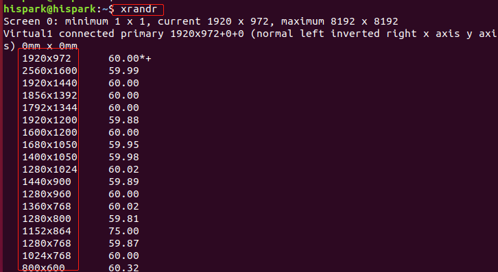
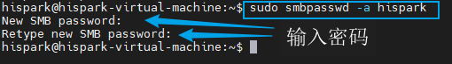
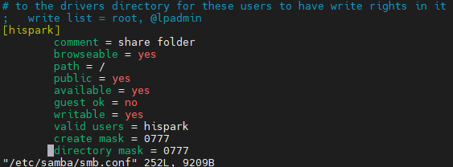
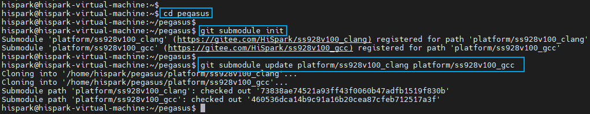
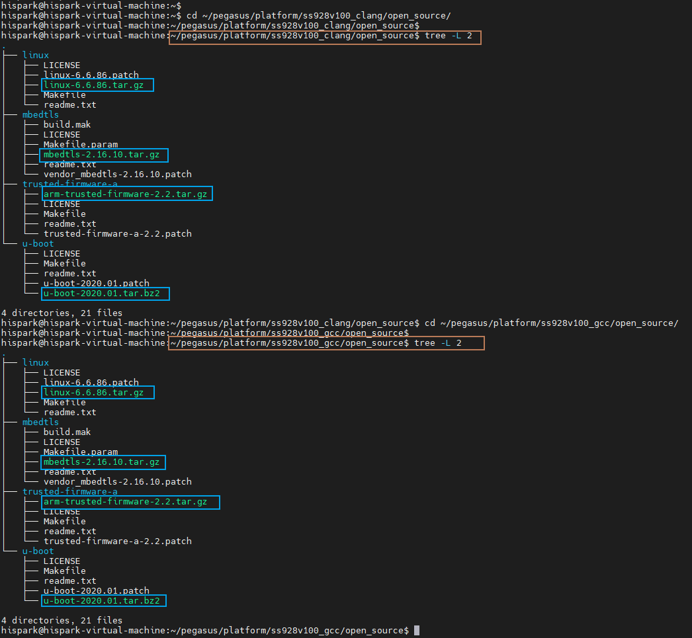
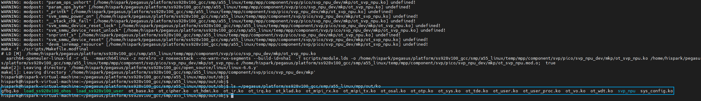

# Set up the development environment

title: "Hi3403V100 Environment Setup Guide"
source: /sessions/sharp-sweet-allen/mnt/hi3403-build/pegasus/docs/zh-CN/Hi3403V100环境搭建指南/Hi3403V100环境搭建指南.md
--- # Hi3403V100 Environment Setup Guide - Development platform: - Server: Ubuntu 22.04 ## 1. Setting Up the Virtual Machine Environment ### 1.1. Software Downloads **(Note: The following software packages are for educational purposes only. Redistribution for commercial use without permission is prohibited.)** | Tool Name | Purpose | Version | Download Link |
| ----------- | ---------------------------------------------------- | ----------- | ------------------------------------------------------------- |
| Virtual Box | Virtual machine for installing Ubuntu on Windows | 6.1.36 | [Virtual Box download](https:/download.virtualbox.org/virtualbox/6.1.36/Virtual Box-6.1.36-152435-Win.exe) |
| Ubuntu22.04 | Linux system required for the build environment | 22.04 | [Ubuntu22.04 download](https:/releases.ubuntu.com/22.04/ubuntu-22.04.5-desktop-amd64.iso) |
| V Scode | IDE for reading and editing code | 1.70.1 | [V Scode download](https:/code.visualstudio.com/) |
| Moba Xterm | Terminal debugging tool | V22.1 | [Moba Xterm download](https:/download.mobatek.net/2212022060563542/MobaXterm_Installer_v22.1.zip) | ### 1.2. Installing Virtual Box - Double-click the Virtual Box-6.1.36-152435-Win.exe installer downloaded in **section 1.1**, click Next, and install Virtual Box. [](figures/1660296543764.png) - Click Browse to change the Virtual Box installation path, then click OK and then Next. [](figures/1660296754355.png) - When the following screen appears, click Next. [](figures/1660296839014.png) - When the following screen appears, click Yes. [](figures/1660296858985.png) - When the installation screen appears, click Install. [](figures/1660296894293.png) - Click Finish to complete the Virtual Box installation. [](figures/1660296945033.png) ### 1.3. Installing Ubuntu 22.04 in Virtual Box \* Note: This guide uses Virtual Box as an example. Developers may use other virtual machine software according to their own preferences. #### Step 1: Import the Ubuntu 22.04 Image into Virtual Box - Open Virtual Box and click New. [](figures/1660297859905.png) - Set the virtual machine name to **hispark**, change the installation folder (the default is on the C drive; it is recommended to change to another drive), set the type to Linux, and select Ubuntu (64-bit) as the version, then click Next. [](figures/1660298040734.png) - Set the memory size to 4 GB, then click Next. [](figures/1660298548447.png) - Select "Create a virtual hard disk now" and click Create. [](figures/1660299094251.png) - Select VDI (Virtual Box Disk Image) and click Next. [](figures/1660299447519.png) - Select Dynamically allocated and click Next. [](figures/1660299605429.png) - Set the disk size to 100 GB and click Create. Allocate at least 100 GB; otherwise subsequent steps may fail due to insufficient space. [](figures/1660543557813.png) - Click Settings, select General, and under Advanced set both Shared Clipboard and Drag'n'Drop to Bidirectional, then click OK. [](figures/1660535140230.png) - Click Settings, then System, select Processor, and set the processor count to 4.
- Note: If your machine has 4 or fewer processors, reduce this number accordingly. [](figures/1660524570782.png) - Click Network, select Adapter 2, check Enable Network Adapter, choose Host-only Adapter, and click OK. [](figures/1660526866883.png) - Click Settings, select Storage, choose the empty optical drive, click the disk icon, and select Choose a disk file. [](figures/image-20221008204335405.png) - Select the Ubuntu 22.04 ISO image downloaded in **section 1.1**, then click Open.  - Click OK to close Settings. [](figures/image-20221008204748937.png) - Select USB, uncheck Enable USB Controller to disable the USB device, then click OK. (Some machines may not support this step — it can be skipped.) [](figures/1677850636004.png) - Click Start to boot the Ubuntu system. [](figures/image-20221008204846859.png) #### Step 2: Installing Ubuntu - Select your language, then click Install Ubuntu. [](figures/image-20221008205114466.png) - If the display is incomplete due to resolution issues and the buttons at the bottom are not visible, press `Ctrl+Alt+T` to open a terminal, then type `xrandr` to see the supported resolutions.  - For example, to set 1920x1200, run `xrandr -s 1920x1200` and press Enter. [](figures/1660528406710.png) - Select your keyboard layout and click Continue. [](figures/image-20221008205422524.png) - Uncheck "Download updates while installing Ubuntu" and click Continue. [](figures/1660528559616.png) - Click Install Now. [](figures/1660528682567.png) - Click Continue. [](figures/1660528767526.png) - Select your timezone (e.g., Shanghai) and click Continue. [](figures/1660528851907.png) - Set the account and password, then click Continue. The account and password configured here are used to log in to Ubuntu.
- Follow this guide's configuration: username: **hispark**, password: **hispark**. [](figures/1660528966097.png) - Installation begins. [](figures/1660529074917.png) - After Ubuntu installation is complete, click Restart Now. [](figures/1660530895384.png) - If the prompt **"please remove the installation medium"** appears during restart, click the close button, select Force Quit, and click OK. [](figures/image-20221008211749642.png) [](figures/image-20221008211932823.png) - In Virtual Box, click Devices and then Install Guest Additions. [](figures/1660531880704.png) - When a dialog asks whether to run the autorun software, click Cancel. [](figures/image-20221206112854144.png) - A disc icon will appear in the left task bar. Click it to open the folder. [](figures/1660532499347.png) - Right-click in the empty area of the disc folder and select "Open in Terminal". [](figures/1660532614696.png) - Run the following commands to install the Guest Additions. `sudo apt-get install gcc make perl -y sudo ./V Box Linux Additions.run` [](figures/1660534104460.png) [](figures/1660533974180.png) - After successful installation, run the `reboot` command in the terminal to restart Ubuntu. `reboot` [](figures/image-20221011145610949.png) #### Step 3: Update Software - After Ubuntu restarts, click the nine-dot icon in the lower-left corner and open Software & Updates. [](figures/image-20221011150040989.png) - Click the Ubuntu Software tab, then click the "Download from" dropdown and select Other. [](figures/1660534504940.png) - Under **China**, select **Alibaba Cloud (aliyun)**, then click Choose Server. [](figures/1660534590521.png) - An authentication dialog will appear. Enter your Ubuntu login password (hispark in this guide). [](figures/1660534734924.png) - Click Close, then click Reload in the dialog that appears. Wait while the software lists are updated. [](figures/1660534898362.png) - After the update is complete, right-click on the Ubuntu desktop and select "Open Terminal". [](figures/image-20221011153823669.png) - Run the following two commands to update software packages. `sudo apt-get update
sudo apt-get upgrade -y` [](figures/image-20220817160453331.png) #### Step 4: Configure SSH Service on Ubuntu - Run the following command to install the SSH server. `sudo apt-get install openssh-server -y` [](figures/image-20221012145535748.png) - Run the following command to start the SSH service. `sudo systemctl start ssh` [](figures/image-20221012145800709.png) #### Step 5: Install Moba Xterm and Connect to Ubuntu - On the Windows host, extract the MobaXterm\_Installer\_v22.1.zip downloaded in **section 1.1**, then double-click MobaXterm\_installer\_22.1.msi to install MobaXterm.
- Keep clicking Next to complete the installation. [](figures/image-20221012150919332.png) - Run the following command to install net-tools. `sudo apt install net-tools -y` [](figures/image-20220817175838126.png) - Run the following command to view the Ubuntu IP address. In this example the IP address is 192.168.56.106. `ifconfig` [](figures/image-20221011162217364.png) - Open Moba Xterm on Windows, click the Session icon in the top-left corner, click the SSH icon in the dialog, enter your Ubuntu IP address, check "Specify username" and fill in your Ubuntu username, then click OK. [](figures/image-20221012151654877.png) - After clicking OK, enter your Ubuntu login password when prompted to access the Ubuntu terminal. [](figures/image-20221012152351010.png) #### Step 6: Configure Samba Service on Ubuntu - Run the following command in the Ubuntu terminal to install Samba. `sudo apt-get install vim samba samba-common`  - Run the following command to grant read/write permissions on the Samba share. `sudo chmod 777 /` - Run the following command to create a Samba account. You will be prompted to enter a Samba password. `sudo smbpasswd -a hispark`  - Run the following command to edit the Samba configuration file. `sudo vim /etc/samba/smb.conf` - Append the following Samba share configuration to the end of the file. `[hispark] comment = share folder browseable = yes path = / public = yes available = yes guest ok = no writable = yes valid users = hispark create mask = 0777 directory mask = 0777`  - Run the following command to restart the Samba service and apply changes. `sudo service smbd restart` #### Step 7: Map a Network Drive - On Windows, right-click This PC and select "Map network drive". [](figures/image-20220507194232987-1761559591651-82.png) - Enter \\Ubuntu IP address, click Finish, then enter the account (hispark) and password (the Samba password configured earlier). `\\192.168.56.106\hispark`  - The root directory will now appear as a Windows network drive, enabling easy file sharing between Windows and the Ubuntu environment. [](figures/image-20230202110442244-1761559591651-83.png) ## 2. Setting Up the SDK Environment - Some content in this section overlaps with the Open Harmony Small system build environment setup. For details, refer to the development environment chapter of the *Open Harmony Small Version User Guide*.
- Hi3403V100 has two SD Ks supporting `clang` and `gcc` toolchains, corresponding to `Hi3403V100_clang` and `Hi3403V100_gcc` respectively. | | Compiler | Runtime Library |
| ----------------- | ------------ | ----------------- |
| `Hi3403V100_clang` | `llvm 15.04` | `musl libc 1.2.5` |
| `Hi3403V100_gcc` | `gcc 12.3.0` | `glibc 2.38` | - The u-boot for both `Hi3403V100_clang` and `Hi3403V100_gcc` is compiled with `gcc`. Therefore, a full `Hi3403V100_clang` build depends on both `clang` and `gcc` toolchains, while a full `Hi3403V100_gcc` build depends only on `gcc`. It is recommended to install both toolchains. ### 2.1. Setting Up the Base Environment - Install deb packages. On Ubuntu 22.04, install python3 directly; on Ubuntu 20.04 install python3.9; on Ubuntu 18.04 install python3.8. `sudo apt-get update -y
sudo apt-get install -y sudo apt-get install -y apt-utils binutils bison flex bc build-essential make mtd-utils gcc-arm-linux-gnueabi u-boot-tools python3 python3-pip git zip unzip curl wget gcc g++ ruby dosfstools mtools default-jre default-jdk scons python3-distutils perl openssl libssl-dev cpio git-lfs m4 ccache zlib1g-dev tar rsync liblz4-tool genext2fs binutils-dev device-tree-compiler e2fsprogs git-core gnupg gnutls-bin gperf lib32ncurses5-dev libffi-dev zlib* libelf-dev libx11-dev libgl1-mesa-dev lib32z1-dev xsltproc x11proto-core-dev libc6-dev-i386 libxml2-dev lib32z-dev libdwarf-dev sudo apt-get install -y grsync xxd libglib2.0-dev libpixman-1-dev kmod jfsutils reiserfsprogs xfsprogs squashfs-tools pcmciautils quota ppp libtinfo-dev libtinfo5 libncurses5 libncurses5-dev libncursesw5 libstdc++6 gcc-arm-none-eabi vim ssh locales doxygen sudo apt-get install -y libxinerama-dev libxcursor-dev libxrandr-dev libxi-dev` - Download the repo tool. `curl -s https:/gitee.com/oschina/repo/raw/fork_flow/repo-py3 >repo
sudo cp repo /usr/bin/repo
sudo chmod +x /usr/bin/repo`  - Install Python modules. `pip3 install --trusted-host https:/repo.huaweicloud.com -i https:/repo.huaweicloud.com/repository/pypi/simple requests setuptools pymongo kconfiglib pycryptodome ecdsa ohos-build pyyaml prompt_toolkit==1.0.14 redis json2html yagmail python-jenkins pip3 install esdk-obs-python --trusted-host pypi.org -i https:/repo.huaweicloud.com/repository/pypi/simple pip3 install six --upgrade --ignore-installed six -i https:/repo.huaweicloud.com/repository/pypi/simple` - Create a Python symlink. `sudo ln -s /usr/bin/python3 /usr/bin/python`  - Switch the shell type. `sudo rm -rf /bin/sh
sudo ln -s /bin/bash /bin/sh`  ### 2.2. Cloning the Repository - Clone the Hi3403 main repository. `cd ~
git clone https:/gitee.com/Hi Spark/pegasus.git`  - Initialize and update the `Hi3403V100_clang` and `Hi3403V100_gcc` submodules. `cd pegasus
git submodule init
git submodule update platform/Hi3403V100_clang platform/Hi3403V100_gcc`  ### 2.3. Downloading Open-Source Software - Building the uboot/kernel or driver ko files depends on certain open-source software packages that must be downloaded manually from their official sources.
- Download each open-source package listed in the table below and copy it to both specified paths. Mirrored sources within China provide significantly faster download speeds and are recommended where available. | Official Source | Mirror Source | Copy Path |
| ------------------------------------------------------------ | ------------------------------------------------------------ | ------------------------------------------------------------ |
| [linux](https:/www.kernel.org/pub/linux/kernel/v6.x/linux-6.6.86.tar.gz) | [Alibaba Cloud](https:/mirrors.aliyun.com/linux-kernel/v6.x/linux-6.6.86.tar.gz) | 1. ~/pegasus/platform/Hi3403V100\_clang/open\_source/linux  
2. ~/pegasus/platform/Hi3403V100\_gcc/open\_source/linux |
| [mbedtls](https:/github.com/AR Mmbed/mbedtls/archive/refs/tags/v2.16.10.tar.gz) | \ | 1. ~/pegasus/platform/Hi3403V100\_clang/open\_source/mbedtls  
2. ~/pegasus/platform/Hi3403V100\_gcc/open\_source/mbedtls |
| [trusted-firmware-a](https:/github.com/ARM-software/arm-trusted-firmware/archive/v2.2.tar.gz) | \ | 1. ~/pegasus/platform/Hi3403V100\_clang/open\_source/trusted-firmware-a  
2. ~/pegasus/platform/Hi3403V100\_gcc/open\_source/trusted-firmware-a |
| [u-boot](https:/ftp.denx.de/pub/u-boot/u-boot-2020.01.tar.bz2) | \ | 1. ~/pegasus/platform/Hi3403V100\_clang/open\_source/u-boot  
2. ~/pegasus/platform/Hi3403V100\_gcc/open\_source/u-boot |  ### 2.4. Installing the Cross-Compiler - Both `clang` and `gcc` toolchains are supported. For the toolchain-to-SDK mapping, see the [table above](#section1). Both toolchains are installed here. #### 2.4.1. Installing the clang Cross-Compiler - Enter the `os/Open Harmony` directory and use the repo tool to initialize and sync the Open Harmony source code. The repo manifest file `devboard_hispark_aifly_5.1.0.xml` is optimized for the Small system and excludes non-essential repositories. `cd os/Open Harmony
repo init -u https:/gitee.com/Hi Spark/pegasus.git -m os/OpenHarmony/manifest/devboard_hispark_aifly_5.1.0.xml
repo sync -c
repo forall -c 'git lfs pull'` After these steps, you will have the Hi3403V100 and chip integrated Open Harmony-v5.1.0-release source environment. - Run the `os/OpenHarmony/manifest/prebuilts_setup.sh` script to prepare the prebuilt environment. This script performs the following tasks: - Fixes known issues in `system_util.py` and `patch_process.py` - Copies the `platform/Hi3403V100_clang` directory to the SDK target path - Downloads the mbedtls v2.16.10 source package (stored in `os/Open Harmony/device/soc/hisilicon/hi3403v100/sdk_linux/open_source/mbedtls/`) - Downloads the arm-trusted-firmware v2.2 source package (stored in `os/Open Harmony/device/soc/hisilicon/hi3403v100/sdk_linux/open_source/trusted-firmware-a/`) - Calls `build/prebuilts_download.sh` to download the Open Harmony build toolchain (clang, gn, ninja, cmake, nodejs, etc.) - Uses sparse-checkout to download the `prebuilts` directory from the kernel\_linux\_patches repository - Uses sparse-checkout to download the `device/soc/hisilicon/common/platform` directory from the hi3403 repository - Configures the SDK toolchain environment variables, adds `os/Open Harmony/prebuilts/clang/ohos/linux-x86_64/llvm/bin` to PATH, verifies with `command -v clang`, and persists the configuration by writing to `~/.bashrc` `./os/OpenHarmony/manifest/prebuilts_setup.sh` - The `Hi3403V100_clang` SDK sample build depends on the sysroot generated by the Open Harmony build, so the Open Harmony build must be run first. #### First-Time Build The first build requires applying patches. Add the `--patch` flag: `cd os/Open Harmony
./build.sh --product-name=ipcamera_hispark_aifly_linux --ccache --no-prebuilt-sdk --patch --gn-args build_xts=true` > **Note:**

> - Patch configuration: `os/Open Harmony/vendor/hisilicon/hispark_aifly_linux/patch.yml`.
> - To revert all patches in patch.yml, run the `patch_revert.py` script under `os/Open Harmony/vendor/hisilicon/hispark_aifly_linux`:
>   ```
>   cd os/Open Harmony/vendor/hisilicon/hispark_aifly_linux
>   python3 patch_revert.py
>   ```
> - To revert a single patch manually, e.g., the build patch, run in the build directory:
>   `patch -p1 -R < ../../device/soc/hisilicon/patches/build/build_001.patch` #### Subsequent Builds After patches are applied, omit the `--patch` flag: `cd os/Open Harmony
>   ./build.sh --product-name=ipcamera_hispark_aifly_linux --ccache --no-prebuilt-sdk --gn-args build_xts=true` - The `prebuilts_setup.sh` script has already added the clang toolchain to the environment. Now configure the sysroot path by editing `~/.bashrc` and appending `export SYSROOT_PATH=<your hi3403 directory>/os/OpenHarmony/out/hispark_aifly/ipcamera_hispark_aifly_linux/sysroot`. `vim ~/.bashrc` - Apply the environment changes. `shell
>   source ~/.bashrc` - Verify the cross-compiler environment variables. `which clang
>   echo $SYSROOT_PATH` #### 2.4.2. Installing the gcc Cross-Compiler - Click [here](https:/gitee.com/openeuler/yocto-meta-openeuler/releases) and download all compressed packages for version 0.1.8 arm64 as shown in the figure below.  - Copy all arm64 packages to the Ubuntu hispark user home directory, then run the following commands to concatenate them into one archive and extract it. `shell
>   cat 1_openeuler_gcc_arm64le.tar.gz 2_openeuler_gcc_arm64le.tar.gz 3_openeuler_gcc_arm64le.tar.gz 4_openeuler_gcc_arm64le.tar.gz > openeuler_gcc_arm64le.tar.gz rm 1_openeuler_gcc_arm64le.tar.gz 2_openeuler_gcc_arm64le.tar.gz 3_openeuler_gcc_arm64le.tar.gz 4_openeuler_gcc_arm64le.tar.gz tar -xzvf openeuler_gcc_arm64le.tar.gz
>   rm -rf openeuler_gcc_arm64le.tar.gz` - The cross-compiler executables are now located in `openeuler_gcc_arm64le/bin/`.  - Open `~/.bashrc` and append `export PATH="/home/hispark/openeuler_gcc_arm64le/bin:$PATH"` to the end. `shell
>   vim ~/.bashrc`  - Apply the environment changes. `shell
>   source ~/.bashrc`  - Verify that the cross-compiler toolchain is available. `shell
>   aarch64-openeuler-linux-gnu-gcc -v`  ## 3. Building - The `Hi3403V100_clang` and `Hi3403V100_gcc` builds follow essentially the same process, differing mainly in the LLVM flag. For detailed full-build and component-build instructions, see `~/pegasus/platform/Hi3403V100_clang/osdrv/readme_cn.txt` or `~/pegasus/platform/Hi3403V100_gcc/osdrv/readme_cn.txt`. ### 3.1. Building Hi3403V100\_clang - This build mode depends on both the clang and gcc cross-compilers. See [section 2.4](#2.4、Install Cross Compiler) for installation instructions. #### 3.1.1. Full Build - Enter `~/pegasus/platform/Hi3403V100_clang/osdrv` and run the build command. `cd ~/pegasus/platform/Hi3403V100_clang/osdrv
>   make LLVM=1 BOOT_MEDIA=emmc CHIP=Hi3403V100 all`  - Build output images are located in the `osdrv/pub/xxx` directory, including: - `boot_image.bin` — bootloader image - `u-boot-Hi3403V100.bin` — u-boot image (used when OTP fast boot is enabled) - `uImage_Hi3403V100` — Linux kernel image #### 3.1.2. Component Build ##### 3.1.2.1. Build u-boot - Enter `~/pegasus/platform/Hi3403V100_clang/osdrv` and run the build command. Output images are located in `osdrv/pub/xxx`. `make BOOT_MEDIA=emmc gslboot_build -j 20`  ##### 3.1.2.2. Build kernel - Enter `~/pegasus/platform/Hi3403V100_clang/osdrv` and run the build command. Output images are located in `osdrv/pub/xxx`. `make LLVM=1 BOOT_MEDIA=emmc atf -j 20`  #### 3.1.3. Build Samples - Enter `~/pegasus/platform/Hi3403V100_clang/smp/a55_linux/mpp/sample` and run the build command. Executables are generated in each sample's subdirectory. `shell
>   cd ~/pegasus/platform/Hi3403V100_clang/smp/a55_linux/mpp/sample
>   make`  #### 3.1.4. Build ko Modules - Enter `~/pegasus/platform/Hi3403V100_clang/smp/a55_linux/mpp/out/obj` and run the build command. Generated ko files are located in `~/pegasus/platform/Hi3403V100_clang/smp/a55_linux/mpp/out/ko`. `shell
>   cd ~/pegasus/platform/Hi3403V100_clang/smp/a55_linux/mpp/out/obj
>   make`  ### 3.2. Building Hi3403V100\_gcc - This build mode depends only on the gcc cross-compiler. See [section 2.4.2](#2.4.2、Installgcc Cross Compiler) for installation instructions. #### 3.2.1. Full Build - Enter `~/pegasus/platform/Hi3403V100_gcc/osdrv` and run the build command. `cd ~/pegasus/platform/Hi3403V100_gcc/osdrv
>   make LLVM=0 BOOT_MEDIA=emmc CHIP=Hi3403V100 all`  - Build output images are located in the `osdrv/pub/xxx` directory, including: - `boot_image.bin` — bootloader image - `u-boot-Hi3403V100.bin` — u-boot image (used when OTP fast boot is enabled) - `uImage_Hi3403V100` — Linux kernel image #### 3.2.2. Component Build ##### 3.2.2.1. Build u-boot - Enter `~/pegasus/platform/Hi3403V100_gcc/osdrv` and run the build command. Output images are located in `osdrv/pub/xxx`. `make BOOT_MEDIA=emmc gslboot_build -j 20`  ##### 3.2.2.2. Build kernel - Enter `~/pegasus/platform/Hi3403V100_gcc/osdrv` and run the build command. Output images are located in `osdrv/pub/xxx`. `make LLVM=0 BOOT_MEDIA=emmc atf -j 20`  #### 3.2.3. Build Samples - Enter `~/pegasus/platform/Hi3403V100_gcc/smp/a55_linux/mpp/sample` and run the build command. Executables are generated in each sample's subdirectory. `shell
>   cd ~/pegasus/platform/Hi3403V100_gcc/smp/a55_linux/mpp/sample
>   make`  #### 3.2.4. Build ko Modules - Enter `~/pegasus/platform/Hi3403V100_gcc/smp/a55_linux/mpp/out/obj` and run the build command. Generated ko files are located in `~/pegasus/platform/Hi3403V100_gcc/smp/a55_linux/mpp/out/ko`. `shell
>   cd ~/pegasus/platform/Hi3403V100_gcc/smp/a55_linux/mpp/out/obj
>   make`  ## 4. Installing VS Code - If VS Code is already installed, skip this step.
> - Double-click the VS Code installer downloaded in **section 1.1** and click Next to install. [](figures/1660616774005.png) - Click Browse to select the VS Code installation path, then click Next. [](figures/1660616884682.png) - When the following screen appears, click Next. [](figures/1660616935702.png) - When the following screen appears, click Next. [](figures/1660617000292.png) - When the following screen appears, click Install. [](figures/1660617037533.png) - When the following screen appears, click Finish. [](figures/1660617098393.png) ## 5. Importing the Code into VS Code - Click File in the upper-left corner of VS Code, then click Open Folder. [](figures/1660617664316.png) - Select `/home/hispark/hi3403` as shown below, then click Select Folder.  - After the code is imported successfully, a dialog will appear. Check the trust option and click "Yes, I trust the authors". [](figures/image-20221109141616499.png) - The code has now been successfully imported.