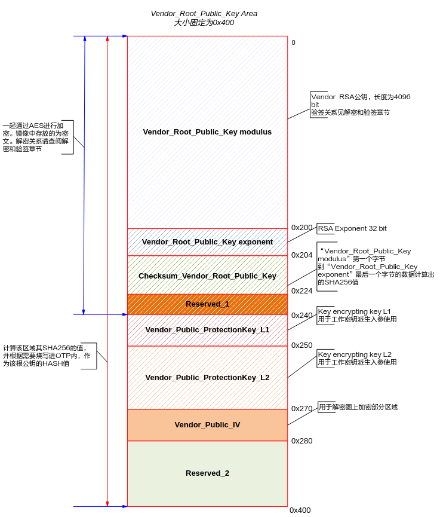
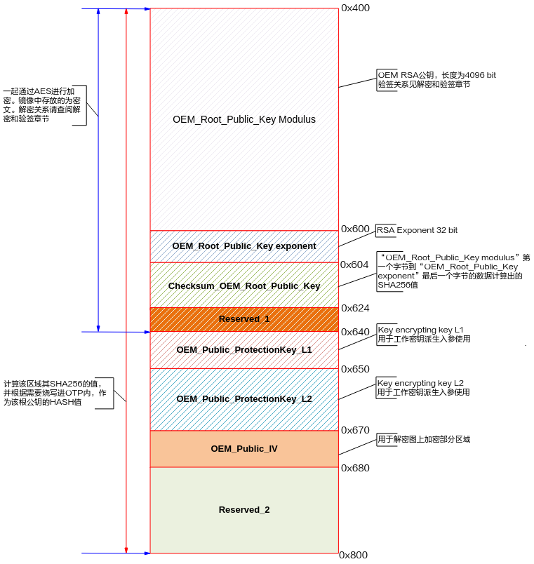
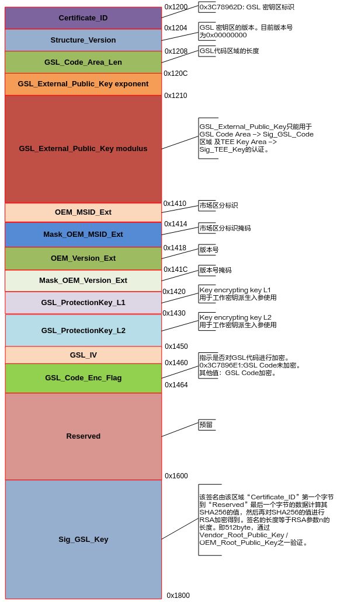
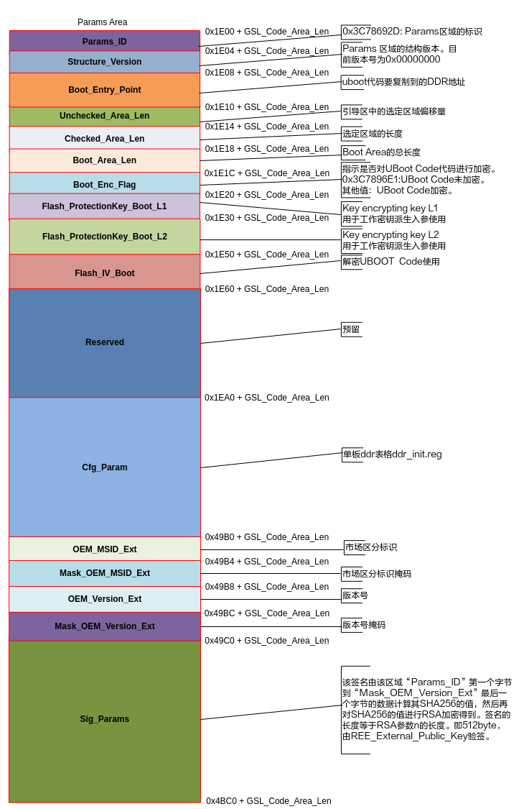
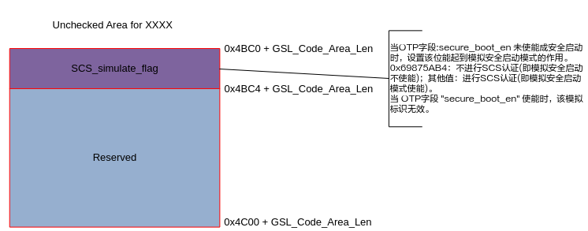

# Secure Boot

title: "Preface"
source: /sessions/sharp-sweet-allen/mnt/hi3403-build/pegasus/docs/zh-CN/Hi3403V100╱ 安全启动使用指南/Hi3403V100╱ 安全启动使用指南.md
--- # Preface
**Overview** This document is intended to guide personnel using this secure boot solution in understanding the overall security solution process, and then using this secure boot solution through specific operational steps and methods. It mainly introduces the specifications and features of this secure boot, including the basic secure boot flow, the key hierarchy and signature verification logic, and the overall usage of the secure boot solution. > **Note:**

> This document takes the Hi3403V100 description as an example. Unless otherwise specified, the content for is identical to that of Hi3403V100. **Product Version** The product versions corresponding to this document are as follows.

| Product Name | Product Version |
| --- | --- |
| Hi3403V100 | V100 |

**Intended Audience** This document (guide) is mainly applicable to the following engineers: - Technical Support Engineer
- Software Development Engineer **Symbol Conventions** The following symbols may appear in this document, and their meanings are as described below.

| **Symbol** | **Description** |
| --- | --- |
| | Indicates a high-risk hazard which, if not avoided, will result in death or serious injury. |

**Revision History**

| **Document Version** | **Release Date** | **Revision Description** |
| --- | --- | --- |
| 00B01 | 2025-09-15 | First interim version release. |

# Security Features
The chip provides a variety of rich security features based on a hardware root of trust, meeting the requirements of different application scenarios and security levels, facilitating the implementation and deployment of customer product secure boot solutions. Key features are as follows: ## On-Chip OTP Resources OTP is a special type of non-volatile memory that allows programming once, with data remaining valid permanently. Leveraging the physical characteristic of one-time programmability, OTP stores irreversible control switches, hardware root keys, etc. The key region provides multiple symmetric root key slots for storing multiple symmetric root keys. The key region can only be programmed once, is automatically locked, and cannot be read back. The status control region and user-defined region can be programmed multiple times, with corresponding bits only changeable from 0 to 1; bits that are already 1 cannot be updated. If the content needs to remain unchangeable after one-time programming, the region can be locked after writing. The version control region can be programmed multiple times, with all bits only changeable from 0 to 1; this is irreversible and cannot be locked. ## Built-in Key Management Module For each symmetric root key already programmed into the OTP, the key management module performs multi-level derivation based on the corresponding external input (key derivation material), generates the corresponding working key, and directly delivers the working key to the encryption/decryption engine (SPACC) to perform encryption/decryption operations on the final data. The entire key derivation process is completed within the hardware logic. The root key, key protection key, and working key never appear in memory and cannot be read by software, improving key security. ## Built-in Hardware Cryptographic Algorithm Engine The chip's hardware encryption/decryption algorithm engine supports a variety of common asymmetric cryptographic algorithms, symmetric cryptographic algorithms, and hash algorithms. The secure boot solution uses RSA4096 and SHA256 algorithms for signature verification of images. Secure boot can also support encryption protection of images based on customer requirements, using the AES256 encryption/decryption algorithm. ## Security Trust Chain The chip supports secure boot based on a hardware root of trust, implementing step-by-step verification starting from the hardware root of trust to ensure the trustworthiness of the boot process. Customers can store the public key hash in OTP, and the chip's BOOTROM completes the integrity and authenticity verification of the root public key, as well as the step-by-step verification of subordinate public keys and images. ## Version Anti-Rollback A version control region is reserved in the chip's OTP to implement version anti-rollback control during secure boot and secure upgrades, preventing attackers from using a defective historical version to replace a new version and attack the device. ## Unified Image Structure Secure boot involves multiple keys and signatures that need to be appended to the final image. To avoid various issues introduced by multiple versions during image creation and usage, and to reduce complexity, this boot solution unifies the images used for secure boot and non-secure boot into a single format. When the SoC does not enable secure boot, a non-encrypted secure boot image (with corresponding keys and signatures) can still boot normally. # Boot Schemes
- Supports 3 boot schemes: fast boot, non-secure boot, and secure boot.
- Fast boot has only one level of Bootloader (U-Boot), where U-Boot directly boots Linux.
- Non-secure boot and secure boot include two levels of Bootloader. - GSL is the primary Bootloader; - U-Boot is the secondary Bootloader, where customers can configure and develop corresponding functions as needed, such as Flash drivers and Linux system boot. - [Table 1](#table23618501607) compares the characteristics of each boot scheme, with "√" indicating the scheme has that characteristic, and "-" indicating it does not. **Table 1** Comparison of Boot Scheme Characteristics

| Characteristic | Fast Boot | Non-Secure Boot | Secure Boot |
| --- | --- | --- | --- |
| Uses U-Boot | √ | √ | √ |
| Uses GSL | - | √ | √ |
| Decryption & Signature Verification of Images | - | - | √ |

> **Caution:**
> The boot scheme used by the chip is controlled by OTP. At the factory, the OTP is configured by default for non-secure boot. The boot scheme can be changed by configuring the OTP. For OTP configuration methods, refer to the "[OTP Configuration and Programming](#ZH-CN_TOPIC_0000002457876665)" section below. ## Fast Boot To be compatible with traditional boot schemes, the chip supports a fast boot scheme. The fast boot flow is shown in [Figure 1](#fig9466924175919), starting directly from U-Boot, which then boots Linux. This scheme does not verify the legitimacy of the boot image and is non-secure. Fast boot is faster than secure boot and non-secure boot and can be used in scenarios where secure boot is not required but speed is. **Figure 1** Fast Boot Flow
> ## Non-Secure Boot In non-secure boot mode, the chip starts from GSL, with the flow shown in [Figure 1](#fig1746041719160). This scheme does not verify the legitimacy of the boot image and is non-secure. **Figure 1** Non-Secure Boot Flow
> ## Secure Boot Compared with the non-secure boot scheme, the secure boot scheme verifies the legitimacy of the boot image. The scheme is detailed in "[Image Decryption and Signature Verification](#ZH-CN_TOPIC_0000002457836477)". The decryption and verification of images are interdependent at each stage. If verification fails at any intermediate stage, boot fails, thereby ensuring the legitimacy, integrity, and confidentiality of the image. Secure boot adds image legitimacy verification steps on top of non-secure boot, with the flow shown in [Figure 1](#fig157715217257). **Figure 1** Secure Boot Flow
> > **Caution:**
> The U-Boot signature verification of Kernel and Rootfs has not been implemented. Customers can refer to "[Reference for Kernel and Filesystem Secure Boot Signature Verification Solution](#ZH-CN_TOPIC_0000002457836481)" and implement it by calling the Cipher API interface based on the application scenario. # Secure Boot Image Layout and Structure

## Secure Boot Mode Image Layout The secure boot image on the boot medium is mainly divided into 3 major blocks: - The first block is the Boot image, which integrates GSL and U-Boot binary files as well as DDR table content. The layout is shown in [Figure 1](#fig1050352493314).[¶](#secure-boot-mode-image-layout-the-secure-boot-image-on-the-boot-medium-is-mainly-divided-into-3-major-blocks-the-first-block-is-the-boot-image-which-integrates-gsl-and-u-boot-binary-files-as-well-as-ddr-table-content-the-layout-is-shown-in-figure-1 "锚链接")

- The second block is the Linux kernel.
- The third block is the filesystem. **Figure 1** Secure Boot Image Layout Diagram
 > **Caution:**
 > Label 1 in the layout diagram: The Boot image area must be placed at the starting address 0x00 of the boot medium. There are no special requirements for the placement of other areas; they can be allocated according to the usage scenario. ## Image Structure Breakdown Diagram ### Vendor\_Root\_Public\_Key Area Its image distribution diagram is shown in [Figure 1](#fig2809231153619). **Figure 1** Vendor\_Root\_Public\_Key Area
 >  ### OEM\_Root\_Public\_Key Area Its image distribution diagram is shown in [Figure 1](#fig71661085015). **Figure 1** OEM\_Root\_Public\_Key Area
 >  ### Third\_party\_Root\_Public\_Key Area Its image distribution diagram is shown in [Figure 1](#fig129062192012). **Figure 1** Third\_party\_Root\_Public\_Key Area
 >  ### GSL Flash Mapping #### GSL third party Key Area Its image distribution is shown in [Figure 1](#fig065525410618). **Figure 1** GSL third party Key Area
 >  #### GSL Key Area Its image distribution diagram is shown in [Figure 1](#fig2404758151111). **Figure 1** GSL Key Area
 >  #### GSL Code Area Its image distribution diagram is shown in [Figure 1](#fig9794191161715). **Figure 1** GSL Code Area
 >  ### Boot Flash Mapping #### Key Area Its image distribution diagram is shown in [Figure 1](#fig984510341212). **Figure 1** Key Area
 >  #### Params Area Its image distribution diagram is shown in [Figure 1](#fig488863262618). **Figure 1** Params Area
 >  #### Unchecked Area for Vendor Its image distribution diagram is shown in [Figure 1](#fig148151331193817). **Figure 1** Unchecked Area for Vendor
 >  > **Caution:**
 > The SCS\_simulate\_flag is a switch reserved in the "[Boot Flash Mapping](#ZH-CN_TOPIC_0000002457876645)" area for debugging under secure boot. When the OTP corresponding KEY and other information bits have been programmed, but the OTP secure boot flag (field: secure\_boot\_en) is not yet enabled, this flag takes effect. Its purpose is: after the user has programmed OTP without enabling the secure boot flag, this flag can be configured to simulate the secure boot flag being enabled, for debugging the "[Boot Flash Mapping](#ZH-CN_TOPIC_0000002457876645)" area. #### U-Boot Area Its image distribution diagram is shown in [Figure 1](#fig1359117512415). **Figure 1** U-Boot Area
 >  # Image Decryption and Signature Verification
 > This secure boot solution supports integrity verification of images and the use of encrypted images. Whether each level of image is encrypted, and the encryption key used, can be independently controlled. For encrypted images, the boot flow follows the principle of decryption first, then signature verification. The secure boot solution supports a third party performing a secondary signature, providing dual confirmation of image integrity. According to the "[Secure Boot Image Layout and Structure](#ZH-CN_TOPIC_0000002424197926)", a secure boot image is divided into multiple regions. The data content in each region, along with the encryption/decryption and integrity verification of the data content, is the responsibility of the Owner of that region. The ownership for each region is shown in [Table 1](#table1690721754513). **Table 1** Region Owners

| Region Name | Secure Boot Owner |
| --- | --- |
| Vendor\_Root\_Public\_Key Area | Data invalid in this region |
| OEM\_Root\_Public\_Key Area | OEM |
| Third\_party\_Root\_Public\_Key Area | Third party |
| GSL third party Key Area |
| GSL Key Area | OEM |
| GSL Code Area |
| Key Area | OEM |
| Params Area |
| Uncheck Area for Vendor |
| U-Boot Area |

## SoC Secure Boot Public Key Framework The SoC public key hierarchy architecture design supports starting from the OTP root public key hash during chip boot, performing integrity verification on each level of image, as well as integrity verification on the next level of public key. This achieves trust transfer across all stages of the boot flow. The signature verification for secure boot uses the RSA4096 algorithm and SHA256. The secure boot solution provides 3 trust chains based on three root public key hashes (stored in OTP). These are Vendor, OEM, and Third Party, with corresponding root public keys being Vendor\_Root\_Public\_Key, OEM\_Root\_Public\_Key, and Third\_party\_Root\_Public\_Key. In secure boot mode, image signature verification is the responsibility of OEM, with the verification relationship hierarchy shown in [Figure 1](#fig1816828175512). **Figure 1** Secure Boot Mode Public Key Signature Verification Relationship Diagram
## Symmetric Key Management For secure boot requiring image decryption functionality, the chip's OTP needs to have corresponding symmetric cryptographic algorithm (AES) root keys built in. The chip OTP reserves 4 128-bit root key slots for deriving the corresponding key protection keys and the final working key. Customers can program one or more root keys as needed. Additionally, the chip is pre-configured with a 128-bit Vendor root key stored in a separate OTP space (see Section 2.2 "S Sxxxx OTP Field Definitions" in the "Security Subsystem Usage Guide"). ### Chip Key Derivation The SoC provides three levels of key derivation, with its working principle shown in [Figure 1](#fig248010331147). RKP retrieves the root key protected by RKP from OTP (OTP KEY), generates the actual root key within the RKP hardware, and sends it to KLAD through a secure channel. KLAD can perform two levels of key derivation, with each level's key derivation material inputtable from memory. The first-level key derivation material ProtectionKey\_L1 is 128 bits, and the second-level key derivation material ProtectionKey\_L2 is 256 bits. Based on the OTP KEY and key derivation materials, KLAD ultimately outputs the actual working key to the hardware encryption/decryption engine. **Figure 1** Key Derivation
### Key Management and Image Decryption in Secure Boot Mode The symmetric key hierarchy and image decryption relationship for secure boot are shown in [Figure 1](#fig1739414716164). The root key originates from OTP and is generated and programmed by OEM. **Figure 1** Secure Boot Mode Decryption Relationship Diagram
# Boot Image Creation and Programming
Hi3403V100 supports multiple boot schemes. The creation and programming steps for boot images must correspond to the boot scheme. Additionally, the OTP of Hi3403V100 controls the boot flow, including boot scheme selection, image legitimacy verification, and version verification, and must be configured and programmed according to the boot scheme. This chapter describes the Hi3403V100 image creation steps, OTP programming steps, image programming methods, and provides reference values for environment variable configuration. Before starting, the following must be clarified: - Which boot scheme is to be used? For an introduction to boot schemes, please refer to "[Boot Schemes](#ZH-CN_TOPIC_0000002424357774)";
- Whether dual-signature (Third\_party signing of the image) functionality is required. For related information, please refer to "[SoC Secure Boot Public Key Framework](#ZH-CN_TOPIC_0000002424197942)". ## Boot Image Creation Steps The image creation method for the fast boot scheme is the same as the traditional boot scheme. To create boot images for non-secure boot and secure boot, the "image\_map" image creation script needs to be used. This section describes the image creation steps for each boot scheme of Hi3403V100. ### Fast Boot When using the fast boot scheme, the following images need to be created: - U-Boot image
- ATF+Kernel image
- Filesystem image For image compilation and creation methods, please refer to "osdrv/readme\_cn.txt". ### Non-Secure Boot When using the non-secure boot scheme, the following images need to be created: - ATF+Kernel image
- Filesystem image
- Boot image Image characteristics and creation instructions are as follows: - The compilation and creation methods for the ATF+Kernel image and filesystem image can be found in "osdrv/readme\_cn.txt".
- The Boot image contains the binary code of GSL and U-Boot and needs to be created using the "image\_map" image creation script. The following are the specific steps for creating the Boot image: 1. Enter the `osdrv/components/` directory, extract `boot.tar.gz`, and obtain the GSL code and "image\_map" image creation script. `tar xf boot.tar.gz` The GSL source code and "image\_map" image creation script are located in the `boot/gsl/` directory and `boot/image_map/` directory, respectively. 2. Compile GSL to obtain the GSL image `gsl.bin`. `cd boot/gsl/ make CHIP=Hi3403V100` The GSL binary image `gsl.bin` will be generated in the `pub/` directory. 3. Enter the `open_source/u-boot/` directory and compile U-Boot to obtain the U-Boot image `u-boot-Hi3403V100.bin`. For compilation methods, please refer to "osdrv/readme\_cn.txt". 4. Copy the compiled GSL and U-Boot images, along with the U-Boot table, to the `image_map/` directory. `cp osdrv/components/boot/gsl/pub/gsl.bin osdrv/components/boot/image_map/ cp open_source/u-boot/u-boot-2020.01/u-boot-Hi3403V100.bin osdrv/components/boot/image_map/u-boot-original.bin cp open_source/u-boot/u-boot-2020.01/.reg osdrv/components/boot/image_map/.reg` 5. Enter the `osdrv/components/boot/image_map/` directory and create the non-secure boot Boot image. `cd osdrv/components/boot/image_map/ python oem/oem_quick_build.py` The binary file `boot_image.bin` generated in the `image/oem/` directory is the non-secure boot Boot image. ### Secure Boot When using the secure boot scheme, the following images need to be created: - ATF+Kernel image
- Filesystem image
- Boot image Image characteristics and creation instructions are as follows: - The ATF+Kernel image and filesystem image used for secure boot are the same as for non-secure boot. Compilation and creation methods can be found in "osdrv/readme\_cn.txt".
- The secure boot Boot image not only includes the GSL image and U-Boot image, but also data used to ensure the integrity, legitimacy, and confidentiality of the Boot image, including asymmetric keys, symmetric keys, MSID, and version numbers. These data are managed by the Owner of each region.
- When creating the Boot image, each Owner passes data to the image creation script through a JSON configuration file.
- Different boot scenarios (e.g., whether GSL and U-Boot need encryption) depend on different configuration items, and the required configuration files may vary. For ease of use, the image creation script also provides functionality to generate configuration files based on the boot scenario. The following are the steps for OEM to create the Boot image: 1. Compile GSL to obtain the GSL image `gsl.bin`. The operation is the same as steps 1-2 in "[Non-Secure Boot](#ZH-CN_TOPIC_0000002457836493)". 2. Compile U-Boot to obtain the U-Boot image `u-boot-Hi3403V100.bin`. The operation is the same as step 3 in "[Non-Secure Boot](#ZH-CN_TOPIC_0000002457836493)". 3. Enter the `osdrv/components/boot/image_map/` directory and generate the OEM JSON configuration file `oem_config.json`. `cd osdrv/components/boot/image_map/ python oem/oem_main.py gencfg oem/oem_config.json` The option selection method is as follows: `Security Mode: 0.Non-Secure 1.Secure > 1 Input:1 Start Flow: 0.Non-TEE 1.TEE > 0 Input:0 Encrypt GSL Code: 0.No 1.YES > (Enter 0 for GSL not encrypted, 1 for GSL encrypted) Encrypt Boot Code: 0.No 1.YES > (Enter 0 for U-Boot not encrypted, 1 for U-Boot encrypted)` After completing the option selection, the configuration file `oem/oem_config.json` will be generated. 4. Fill in the unconfigured fields in `oem_config.json` (enclosed by "//", remove "//" when filling). For configuration methods, please refer to the "Hi3403V100 Secure Boot Script Configuration Guide" document. For the `GSL_Code` and `Boot_Code` fields, fill in the paths to `gsl.bin` and `u-boot-Hi3403V100.bin` generated in steps 1 and 2 respectively. For the `Cfg_Param` field, fill in the path to the U-Boot table (the `.reg` file used for compiling U-Boot in step 2). 5. Create a Boot image with OEM signature. `python oem/oem_main.py build oem/oem_config.json` The `boot_image.bin` in the `image/oem/` directory is the secure boot Boot image. If a Third\_party needs to sign the Boot image, the following operations must be completed: 1. Enter the `osdrv/components/boot/image_map/` directory and confirm that the OEM-generated single-signature Boot image is in the `image/oem/` directory, named `boot_image.bin`.
2. Generate the Third party JSON configuration file `third_party_config.json`. `python third_party/third_party_main.py gencfg third_party/third_party_config.json Start Flow: 0.Non-TEE 1.TEE > 0 Input:0` After completing the option selection, the configuration file `third_party/third_party_config.json` will be generated. 3. Fill in the unconfigured fields in `third_party_config.json` (enclosed by "//", remove "//" when filling). For configuration methods, please refer to the "Hi3403V100 Secure Boot Script Configuration Guide" document.
4. Sign the Boot image. `python third_party/third_party_main.py build third_party/third_party_config.json` The `boot_image.bin` in the `image/third_party/` directory is the dual-signature (signed by both OEM and Third\_party) secure boot Boot image. ## OTP Configuration and Programming Hi3403V100 supports multiple boot schemes. The boot scheme used by the chip needs to be configured through OTP. This section describes the OTP configuration method and how to use U-Boot to complete OTP programming. Please be aware of the following before reading: - OTP programming operations cannot be undone. Incorrect OTP configuration and programming may cause irreparable boot failures or even introduce security risks. Please proceed with caution.
- The "osdrv/components/boot.tar.gz" package provides an OTP programming code example at "image\_map/sample/write\_otp\_fun.c". This section uses this example to complete OTP configuration and programming.
- The operations described in this section will generate a Boot image used for programming OTP. Please distinguish this Boot image from the one generated in "[Boot Image Creation Steps](#ZH-CN_TOPIC_0000002424197890)". The following are the specific steps for OTP configuration and programming: 1. Enter the `osdrv/components/` directory and create a directory `boot-otp` for creating the Boot image. `cd osdrv/components/ mkdir boot-otp/ tar xf boot.tar.gz --strip-components=1 -C boot-otp/` 2. Enter the `open_source/u-boot/` directory, create a directory `u-boot-otp` for compiling U-Boot, and copy `osdrv/components/boot-otp/image_map/sample/write_otp_fun.c` to the `open_source/u-boot/u-boot-otp/cmd/` directory. `cd open_source/u-boot/ mkdir u-boot-otp/ tar xf u-boot-2020.01.tar.bz2 --strip-components=1 -C u-boot-otp/ cd u-boot-otp/ patch -p1 < ../u-boot-2020.01.patch cp ../../../osdrv/components/boot-otp/image_map/sample/write_otp_fun.c ./cmd/` 3. Configure the OTP fields to be programmed in the `g_otp_startup_burn_fields` array in the `./cmd/write_otp_fun.c` file. [Table 1](#_table192164754414) specifies the OTP fields that need to be configured for different boot schemes, along with configuration references. "√" indicates the field needs to be configured; "-" indicates the field configuration is invalid. Please refer to the "Security Subsystem Usage Guide" to determine the values of each OTP field, then uncomment the OTP fields as needed in the `g_otp_startup_burn_fields` array and fill in the field values (hexadecimal strings starting with "0x"). **Table 1** OTP Fields Required for Each Boot Scheme

| Field**Name** | Fast Boot | Non-Secure Boot | Secure Boot | Reference Values and Notes |
| --- | --- | --- | --- | --- |
| quick\_boot | √ | √ | √ | 0x5: Fast boot; 0xF: Non-secure boot and secure boot. |
| secure\_boot\_en | - | √ | √ | 0x42: Non-secure boot; 0x FF: Secure boot. Before enabling secure boot, the SCS\_simulate\_flag in the image can be used to simulate the behavior of secure\_boot\_en being enabled for debugging the [Boot Flash Mapping](#ZH-CN_TOPIC_0000002457876645) area, preventing irreparable chip errors due to incorrect OTP programming. Please refer to the description of the SCS\_simulate\_flag in the "Hi3403V100 Secure Boot Script Configuration Guide". |
| gsl\_dec\_en | - | √ | √ | 0xF: GSL decryption enabled; 0xA: Whether to decrypt GSL depends on the GSL\_Code\_Enc\_Flag in the image. The "Hi3403V100 Secure Boot Script Configuration Guide" describes the GSL\_Code\_Enc\_Flag configuration method. GSL is not decrypted only when gsl\_dec\_en is configured as 0xA and GSL\_Code\_Enc\_Flag is configured as 0x3C7896E1. |
| bload\_dec\_en | - | √ | √ | 0x1: U-Boot decryption enabled; 0x0: Whether to decrypt U-Boot depends on the Boot\_Enc\_Flag in the image. The "Hi3403V100 Secure Boot Script Configuration Guide" describes the Boot\_Enc\_Flag configuration method. U-Boot is not decrypted only when bload\_dec\_en is configured as 0x0 and Boot\_Enc\_Flag is configured as 0x3C7896E1. |
| uboot\_redundance | - | - | √ | 0x0: Disable Boot Image backup. 0x1: Enable Boot Image backup; |
| oem\_rk\_deob\_en | - | - | √ | The field value must be consistent with the oem\_rk\_deob\_en value used by the KDFTool in the "Hi3403V100 Secure Boot Script Configuration Guide". If inconsistent, secure boot will fail. |
| oem\_root\_public\_key\_sha256 | - | - | √ | Fill in the SHA256 checksum of the OEM\_Root\_Public\_Key Area (see "OEM\_Root\_Public\_Key Area" for related principles). After OEM creates the Boot image, this value can be obtained from the file "osdrv/components/boot/image\_map/oem/tmp/oem\_root\_public\_key\_area\_checksum.txt". |
| oem\_root\_symc\_key0 | - | - | √ | This field is the OTP KEY described in "[Chip Key Derivation](#ZH-CN_TOPIC_0000002457836485)". It is **sensitive information and must not be disclosed**. The field value must be consistent with the oem\_root\_symc\_key field used by the KDFTool in the "Hi3403V100 Secure Boot Script Configuration Guide", and cannot be all zeros; otherwise, secure boot will fail. |
| oem\_root\_symc\_key0\_flag | - | - | √ | Control flag for oem\_root\_symc\_key0; fill in 0x00000000. |
| oem\_msid | - | - | √ | OEM customer market segment identifier (ID). If it does not match the OEM\_MSID\_Ext in the "Hi3403V100 Secure Boot Script Configuration Guide", secure boot will fail. |
| oem\_version | - | - | √ | OEM version number. The number of Bit 1s in the field represents the version number, used for Boot Image anti-rollback. If the version number indicated by OEM\_Version\_Ext in the "Hi3403V100 Secure Boot Script Configuration Guide" is less than the version number indicated by this field, secure boot will fail. |
| double\_sign\_en | - | √ | √ | 0xA: Disable dual signature; 0xF: Enable dual signature. After enabling dual signature, Third\_party must sign the boot image. The dual signature operation by Third\_party is described in "[Secure Boot](#ZH-CN_TOPIC_0000002424357722)". |
| tp\_root\_public\_key\_sha256 | - | - | √ | This field is related to dual signature and is only valid when double\_sign\_en is enabled. Fill in the SHA256 checksum of the Third\_party\_Root\_Public\_Key Area (see "[Third\_party\_Root\_Public\_Key Area](#ZH-CN_TOPIC_0000002457876617)" for related principles). After Third\_party performs dual signature on the Boot image, this value can be obtained from the file "osdrv/components/boot/image\_map/third\_party/tmp/third\_party\_root\_public\_key\_area\_checksum.txt". |
| third\_party\_msid | - | - | √ | This field is related to dual signature and is only valid when double\_sign\_en is enabled. It represents the third-party market segment identifier (ID). If it does not match the Third\_party\_MSID\_Ext in the "Hi3403V100 Secure Boot Script Configuration Guide", secure boot will fail. |
| third\_party\_version | - | - | √ | This field is related to dual signature and is only valid when double\_sign\_en is enabled. The number of Bit 1s in the field represents the third-party version number, used for Boot Image anti-rollback. If the version number indicated by Third\_party\_Version\_Ext in the "Hi3403V100 Secure Boot Script Configuration Guide" is less than the version number indicated by this field, secure boot will fail. |

4. Add the following content to the `./cmd/Makefile` file to include the OTP programming command compilation item. `obj-y += write_otp_fun.o` 5. Add the following macro definition in the `./include/configs/Hi3403V100.h` file to enable the OTP driver. `#define CONFIG_OTP_ENABLE` 6. Compile U-Boot with the OTP programming command. Before compiling U-Boot, use a Windows system to enter the `osdrv/tools/pc/uboot_tools/` directory, open the Excel file for the corresponding board, select the `main` tab, and click the "Generate reg bin file" button to generate the U-Boot table file `reg_info.bin` for the corresponding platform. Then return to the Linux system to execute the operations: `cp configs/Hi3403V100_defconfig .config make ARCH=arm CROSS_COMPILE=aarch64-v01c01-linux-gnu- menuconfig make ARCH=arm CROSS_COMPILE=aarch64-v01c01-linux-gnu- -j 20 cp ../../../osdrv/tools/pc/uboot_tools/reg_info.bin .reg make ARCH=arm CROSS_COMPILE=aarch64-v01c01-linux-gnu- u-boot-z.bin` The above operations take SPI NOR/NAND as the boot medium as an example. If the boot medium is e MMC, change the configuration file `configs/Hi3403V100_defconfig` to `Hi3403V100_emmc_defconfig`. 7. Verify OTP configuration values (optional step). Enter the `osdrv/components/boot-otp/image_map/` directory, open `oem/otp_check.json`, fill in the OTP values set in "Step 3", and then execute the command: `# Obtain the KDF tool cp ../../../tools/pc/kdf_customer/parameter.bin ./ tar xf ../../../tools/pc/kdf_customer/KDFTools_V1.0.3.tar.gz --strip-components=1 # Verify OTP configuration values (choose one of the following commands based on the boot scenario) # Secure boot python3 oem/oem_main.py check oem/otp_check.json <Boot Image Path>` Replace "" in the command with the actual image path generated in "[Boot Image Creation Steps](#ZH-CN_TOPIC_0000002424197890)". Printing "Boot Image is OK." indicates that the OTP configuration values of the Boot Image have passed verification; an error indicates incorrect OTP configuration values. 8. Enter the `osdrv/components/boot-otp/gsl/` directory and compile the GSL image to obtain `gsl.bin`. `make CHIP=Hi3403V100` 9. Enter `osdrv/components/boot-otp/image_map` to create the Boot image. `cp ../../../../open_source/u-boot/u-boot-otp/u-boot-Hi3403V100.bin ./u-boot-original.bin cp ../../../../open_source/u-boot/u-boot-otp/.reg ./ cp ../gsl/pub/gsl.bin ./ python oem/oem_quick_build.py` The `boot_image.bin` generated in the `image/oem/` directory has OTP programming capability. 10. Program the new `image/oem/boot_image.bin` to the storage medium.
11. After programming is complete, reset and enter U-Boot, then execute the `write_otp` command to complete OTP programming. This completes the OTP programming. Afterwards, follow the description in "[Image Programming](#ZH-CN_TOPIC_0000002457836489)" to program the boot image created in "[Boot Image Creation Steps](#ZH-CN_TOPIC_0000002424197890)", and configure the environment variables in U-Boot according to "[Board Environment Variable Configuration Reference](#ZH-CN_TOPIC_0000002424357730)". After configuring the environment variables, reset the chip to verify whether the system boots successfully. > **Caution:**
> - The keys programmed into OTP are sensitive information and must be kept confidential. This example code is only for programming OTP. For formal release, the `write_otp_fun.c` file used for OTP programming must be deleted from U-Boot; otherwise, there is a risk of key leakage.
> - It is strongly recommended that customers set all feature/function switch bits to their required values and force lock them before final product release. Even if default values meet requirements, locking is still required.
> - After programming OTP, the OTP values take effect only after the chip is powered off and on again, or by using the `dog_reset` command in U-Boot. Chip soft reset will not take effect.
> - The SCS\_simulate\_flag in the Unchecked Area for Vendor within the image structure can be used for secure boot debugging when secure boot is not enabled. ## Image Programming This section uses the SPI NOR storage medium as an example to describe how to use the Tool Platform tool to program the boot image. When using other storage media (SPI NAND, e MMC), the filesystem type and programming length differ from SPI NOR, but the remaining image sizes and programming layout are the same as SPI NOR. ### Fast Boot The image programming layout for fast boot is shown in [Figure 1](#_fig1991144012019). **Figure 1** Fast Boot Tool Platform Programming Partition Reference Diagram
> ### Non-Secure Boot and Non-TEE Secure Boot The image programming layout is shown in [Figure 1](#__Ref55287952). **Figure 1** Tool Platform Programming Partition Reference Diagram
> > **Caution:**
> The `uImage_Hi3403V100` file programmed in [Figure 1](#_fig1991144012019) and [Figure 1](#__Ref55287952) is the ATF+Kernel image. ## Board Environment Variable Configuration Reference This section provides examples of environment variable configuration when using SPI NOR, SPI NAND, and e MMC as the boot medium, based on the image layout from "[Image Programming](#ZH-CN_TOPIC_0000002457836489)". - SPI NOR `setenv bootargs 'mem=128M console=tty AMA0,115200 root=/dev/mtdblock2 rw rootfstype=jffs2 mtdparts=sfc:1M(boot),12M(kernel),18M(rootfs)';sa setenv bootcmd 'sf probe 0;sf read 0x42000000 0x100000 0xc00000;bootm 0x42000000';sa` - SPI NAND and Parallel NAND `setenv bootargs 'mem=128M console=ttyAMA0,115200 clk_ignore_unused ubi.mtd=2 root=ubi0:ubifs rootfstype=ubifs rw mtdparts=nand:1M(boot),12M(kernel),32M(rootfs.ubifs)';sa setenv bootcmd 'nand read 0x42000000 0x100000 0xc00000;bootm 0x42000000';sa` - e MMC `setenv bootargs 'mem=128M console=ttyAMA0,115200 clk_ignore_unused rw rootwait root=/dev/mmcblk0p3 rootfstype=ext4 blkdevparts=mmcblk0:1M(boot),12M(kernel),96M(rootfs)';sa setenv bootcmd 'mmc read 0 0x42000000 0x800 0x6000; bootm 0x42000000';sa` # Secure Boot Image Backup Feature
> To use the secure Boot image backup feature, first program the "uboot\_redundance" field in OTP (see the "OTP Configuration and Programming" section for details). The programmed backup Boot Image start address must be 64K-aligned and within the first 1MB of the storage medium. When the primary Boot Image verification fails, the boot program searches for an available backup Boot Image on the boot medium and boots from it. > **Note:**
> When the storage medium is NAND Flash, do not erase the first block of the medium; otherwise, there is a risk of backup failure. # Reference for Kernel and Filesystem Secure Boot Signature Verification Solution
> This reference solution is based on the features of the above secure boot solution. After U-Boot passes signature verification, it implements kernel signature verification in U-Boot. Before the previous stage boots the next stage system, it performs signature verification on the system to be booted. If verification succeeds, the Linux system is booted; otherwise, the system fails to boot. The signature verification mechanism ensures the integrity of the system image. If the image is tampered with or damaged, the system will not boot. ## Secure Boot Flow The description in this document only covers BOOTROM verification before booting U-Boot, and U-Boot verification before booting the Kernel, as shown in [Figure 1](#fig135231753812). The verification flow for other components such as the filesystem, as well as related data encryption/decryption protection, can be designed and developed following this model and is not described in this document. The solution first aligns the size of the non-secure U-Boot original image to 16 bytes before the image, then appends information such as the kernel's secure verification public key to the end of the Boot original image. After appending this information, a new secure boot image is generated through "[Boot Image Creation Steps](#ZH-CN_TOPIC_0000002424197890)". **Figure 1** Kernel and Filesystem Boot Verification Flow Block Diagram
> For the hash calculation and asymmetric RSA encryption/decryption involved in the secure boot verification flow, please consult relevant resources on your own; this document does not elaborate further. For further development of encryption/decryption functionality, you may explore other encryption algorithms, such as the symmetric AES encryption algorithm. ## U-Boot Image Structure with Verification Information The structure of the U-Boot image with appended verification information is shown in [Figure 1](#fig13141855185214). Kernel-related security information is appended to the end of the U-Boot image, and then the U-Boot image with Kernel verification information is made into a secure boot image. **Figure 1** U-Boot Image Structure with Verification Information
> ## Secure Kernel Image Structure The secure Kernel image consists of header information, the Kernel image, and signature information, as shown in [Figure 1](#fig47919505579). It is assembled on top of the original Kernel image structure, where the Kernel image is a compressed image. The RSA public key used for Kernel signature verification is stored in the U-Boot original image and is integrated into the secure boot image along with the secure image. **Figure 1** Secure Kernel Image Structure Diagram
> ## Functional Implementation For implementing the U-Boot signature verification of the Kernel, please refer to the RSA signature and verification usage flow section in the "CIPHER API Reference" document, and call the corresponding API interfaces. # Code Solution Reference for Increased U-Boot Table Size
> **Note:**
> This method is only applicable to non-secure boot and secure boot and is invalid for fast boot.
> The modification must ensure that `gsl.bin` size (corresponding to GSL\_Code\_Area\_Len) + U-Boot table size (16-byte aligned) < 70.76KB. ## Purpose To increase the U-Boot table size limit from 10.77KB (0x2B10 bytes) to 16.00KB (0x4000 bytes). ## Method 1. Modify `gsl/include/flash_map.h` `#define CFG_PARAM_SIZE 0x2B10` Change to: `#define CFG_PARAM_SIZE 0x4000` 2. Modify `image_map/common/area_tool.py` `class Area Cfg: CFG_PARAM_SIZE = 0x2B10 # reg table size` Change to: `class Area Cfg: CFG_PARAM_SIZE = 0x4000 # reg table size.` # Error Code List
> **Table 1** Error Code List

| Error Code | Description |
| --- | --- |
| E4D1 | PCIe boot data acquisition failed |
| E4D2 | UART data download failed |
| E4D3 | SD card data acquisition failed |
| E4D4 | USB data download failed |
| E4D5 | Flash backup acquisition failed |
| E4D6 | Flash data acquisition failed |
| E4D7 | eMMC backup acquisition failed |
| E4D8 | eMMC data acquisition failed |
| E6Dx | GSL\_Third\_party\_Key Area verification failed |
| E7Dx | GSL\_Key\_Area verification failed |
| E8D1 | Flash GSL Code Area acquisition failed |
| E8D2 | eMMC GSL Code Area acquisition failed |
| E8D3 |
| E9Dx | GSL\_Code\_Area verification failed |
| G4S1 | PC Ie boot data acquisition failed |
| G4S2 | UART data download failed |
| G4S3 | SD card data acquisition failed |
| G4S4 | USB data download failed |
| G4S5 | Flash data acquisition failed |
| G4S7 |
| G4S6 | e MMC data acquisition failed |
| G4S8 |
| G4S9 |
| G4Sa |
| G4Sb |
| G5Sx | Boot Key Area verification failed |
| G6Sx | Boot Params Area verification failed |
| G8s1 | PCIe boot data acquisition failed |
| G8s2 | UART data download failed |
| G8s3 | SD card data acquisition failed |
| G8s4 | USB data download failed |
| G8s5 | Flash data acquisition failed |
| G8s6 | eMMC data acquisition failed |
| G8s7 |
| G8s8 |
| G8s9 |
| G9Sx | Boot Area verification failed |

> **Note:**
> In the error code table, "x" represents any digit. For example, "G5Sx" refers to "G5S1", "G5S2", "G5S3", etc. # Abbreviations

| | |
| --- | --- |
| **A** | |
| AES | Advanced Encryption Standard |
| ATF | Arm Trust Firmware |
| **C** | |
| CPU | Central Processing Unit |
| **G** | |
| GSL | Secure Bootloader |
| **J** | |
| JTAG | Joint Test Action Group |
| **K** | |
| Key Ladder | A structured multi-level key mechanism that ensures secure transmission of control words. |
| **M** | |
| M Cipher | Multi-channel Cipher module |
| MSID | Market Segment ID. |
| **O** | |
| OEM | Original Equipment Manufacturer |
| OTP | One Time Programmable |
| **R** | |
| REE | Rich Execution Environment |
| RKP | Root Key Process |
| **S** | |
| SCS | Secure Chipset Startup |
| SMC | Secure Monitor Call |

