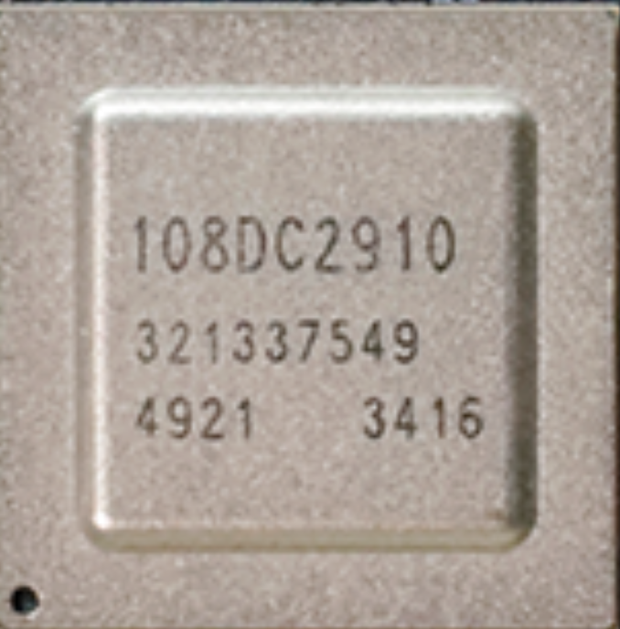

# Hi3403V100 Professional Ultra-HD Smart IP Camera SoC

<div class="hero-banner" markdown>

<div class="hero-left" markdown>

**10.4 TOPS AI · 4K60 Flagship Intelligent Vision Chip**

The Hi3403V100 is HiSilicon's professional SoC for high-end surveillance, AI edge computing, and multi-sensor panoramic cameras. It integrates a dual-engine heterogeneous NPU, 4K60 AI ISP, 4-channel hardware video stitching, and rich peripherals — with typical power consumption of just 5.2 W.

<div class="hero-actions" markdown>

[:material-rocket-launch: Quick Start](#quickstart){ .md-button .md-button--primary }
[:fontawesome-brands-github: GitHub](https://github.com/HivsDev/pegasus_doc){ .md-button }

</div>

</div>

<div class="hero-right" markdown>

<figure class="hero-chip-image" markdown>

</figure>

</div>

</div>

<div class="spec-strip" markdown>

<div class="spec-two-col" markdown>

<div class="spec-col" markdown>

- :material-cpu-64-bit: **CPU**&ensp;Quad Cortex A55 @ 1.4 GHz, built-in 32bit MCU @ 500 MHz, TrustZone
- :material-brain: **NPU**&ensp;Dual-engine, 10.4 TOPS INT8 / 15.2 TOPS INT4, dual Vision Q6 DSP
- :material-camera-iris: **ISP**&ensp;4K60 AI ISP, 3F WDR, 6-DoF EIS, ultra-low-light HNR
- :material-video-3d: **Codec**&ensp;H.265/H.264 4K60 encode, 10-ch 1080p decode, JPEG codec
- :material-wall: **Stitching**&ensp;4-ch hardware panoramic stitching, 2×4K or 4×2.6K input
- :material-memory: **Storage**&ensp;DDR4/LPDDR4x up to 8 GB, eMMC 5.1 up to 2 TB, SPI/NAND Flash

</div>

<div class="spec-col" markdown>

- :material-lan: **Network**&ensp;Dual GbE (RGMII/RMII), 2× USB 3.0 / USB 2.0
- :material-expansion-card: **Interfaces**&ensp;2-Lane PCIe 2.0 (RC/EP), 2× SDIO 3.0, HDMI 2.0 output
- :material-camera: **Input**&ensp;8-Lane MIPI/LVDS/Sub-LVDS/HiSPi, up to 4 sensors, max 8192×8192
- :material-shield-lock: **Security**&ensp;Secure boot, TrustZone TEE, AES/RSA/SHA/HMAC, 30 Kbit OTP
- :material-power-plug: **Power**&ensp;Typ. 5.2 W (4K30 + 4TOPS), advanced low-power process
- :material-package-variant: **Package**&ensp;FC-BGA 23×23 mm, 0.65 mm pitch

</div>

</div>

</div>

---

## :material-rocket-launch: Quick Start { #quickstart }

<div class="step-grid" markdown>

<div class="step-card" markdown>
<div class="step-number">1</div>

### Hardware Setup

- **Power**: USB-C 5V / 2A, or 12V DC adapter
- **Essential**: USB-TTL serial module (3.3V), Micro SD card (≥ 8 GB, Class 10)
- **Optional**: HDMI display, Ethernet cable, CSI/DSI camera

</div>

<div class="step-card" markdown>
<div class="step-number">2</div>

### Dev Environment

Install SDK and cross-compilation toolchain:

```bash
git clone https://github.com/HivsDev/pegasus_doc.git
cd pegasus_doc && ./setup.sh
```

:material-microsoft-windows: [Windows Guide](getting-started/Hi3403V100环境搭建指南.md) ·
:material-apple: [macOS Guide](getting-started/Hi3403V100环境搭建指南.md) ·
:material-linux: [Linux Guide](getting-started/Hi3403V100环境搭建指南.md)

</div>

<div class="step-card" markdown>
<div class="step-number">3</div>

### Flash Your First Program

**LED Blink** — complete dev flow in 10 minutes:

```bash
cd examples/led_blink
make && make flash
```

:material-arrow-right: [Full Tutorial](getting-started/快速上手指南.md)

Once the LED lights up, explore the [Application Development Guide](getting-started/应用开发指南.md).

</div>

</div>

---

## :material-bookshelf: Documentation

<div class="grid cards" markdown>

-   :material-rocket-launch: **Quick Start**

    ---

    - [Quick Start Guide](getting-started/快速上手指南.md) — Get started in 30 minutes
    - [Environment Setup](getting-started/Hi3403V100环境搭建指南.md) — Toolchain & SDK installation
    - [Application Development](getting-started/应用开发指南.md) — Framework & API reference
    - [Graphics Development](getting-started/图形开发用户指南.md) — Graphics subsystem & UI
    - [Security Subsystem](getting-started/安全子系统使用说明.md) — Secure boot & encryption

-   :material-cog-outline: **System Architecture**

    ---

    - [Product Overview](system-architecture/产品简介.md) — Hi3403V100/SS927V100 SoC specs & features
    - [SDK Setup & Upgrade](system-architecture/SDK安装与升级.md) — SDK environment & version management
    - [SS928V100 Product Overview](getting-started/SS928V100%20超高清智能网络录像机%20SoC%20产品简介.md) — SS928V100 product specs
    - [SS928V100/SS927V100 SDK](getting-started/SS928V100╱SS927V100%20SDK%20安装以及升级使用说明.md) — SDK installation details

-   :material-memory: **Hardware Manual**

    ---

    - [Peripheral Drivers](hardware/外围设备驱动%20操作指南.md) — GPIO / I2C / SPI / UART
    - [DDR Miniaturization](hardware/DDR%20小型化指南.md) — DDR layout & routing optimization
    - [U-Boot Porting](hardware/U-boot%20移植应用开发指南.md) — Bootloader porting guide
    - [Secure Boot](hardware/安全启动使用指南.md) — Secure boot configuration
    - [Memory Layout](hardware/内存布局调整指南.md) — Memory partition & address mapping

-   :material-code-json: **Module API**

    ---

    - [Media Processing (MPP)](modules/mpp/01%20概述.md) — Video/Audio/Graphics subsystem
    - [ISP Image Processor](modules/isp/ISP%20开发参考（1--2）.md) — Image signal processing reference
    - [IVE/IVS Smart Vision](modules/ive/IVE%20API%20参考（1--2）.md) — Intelligent vision acceleration API
    - [AI Engine](modules/ai/SVP2.0%20开发指南.md) — SVP2.0 NN inference & ATC tools
    - [Chip Reference API](modules/reference/CIPHER%20API%20参考.md) — CIPHER / KLAD / OTP / TDE

-   :material-lightbulb-on-outline: **Examples**

    ---

    - [SS928V100 Porting Case](getting-started/小型系统SS928V100移植案例.md) — Small system porting example
    - [Splash Screen Guide](getting-started/开机画面使用指南.md) — Boot animation & logo config
    - [Snapshot Guide](getting-started/抓拍%20使用指南.md) — Image capture & snapshot

-   :material-wrench: **Tools Platform**

    ---

    - [BurnTool](tools/BurnTool%20工具使用指南.md) — Firmware flashing & partition management
    - [ToolPlatform](tools/ToolPlatform工具平台使用指南.md) — Chip debug & configuration platform
    - [MindCmd](tools/MindCmd%20使用指南.md) — CLI debugging & diagnostics
    - [DIS Debug Guide](tools/DIS%20调试指南.md) — Digital image stabilization tuning

</div>

---

## :material-code-braces: Example Projects

<div class="examples-section" markdown>

<div class="grid cards" markdown>

-   :fontawesome-brands-github: **Official Examples**

    ---

    Peripheral drivers (:material-chip: GPIO · I2C · SPI · UART), multimedia (:material-video: VI/VO/VENC), AI inference (:material-brain: SVP2.0), and more — ready to use out of the box.

    [:octicons-arrow-right-24: pegasus_doc](https://github.com/HivsDev/pegasus_doc)

-   :material-account-group: **Community Highlights**

    ---

    **:material-robot: AI Door Access** — Face recognition access control powered by Hi3403V100

    **:material-factory: Industrial Inspection** — Real-time defect detection at the edge

    **:material-camera: 4K IP Camera** — Ultra-low latency 4K60 video streaming

</div>

</div>

---

<div class="footer-strip" markdown>

<div class="footer-col" markdown>

### :material-storefront: Purchase

- :material-cart: Official Store
- :material-package-variant: Distributors
- :material-download: [SDK Downloads](https://developers.hisilicon.com)

</div>

<div class="footer-col" markdown>

### :material-forum: Community

- :fontawesome-brands-github: [Issue Tracker](https://github.com/HivsDev/pegasus_doc/issues)
- :material-file-document-edit: [Contribute](https://github.com/HivsDev/pegasus_doc)
- :material-chat-question: [Developer Community](https://developers.hisilicon.com)

</div>

<div class="footer-col" markdown>

### :material-update: Changelog

- **v1.1-beta3** — Added MPP FAQ, Sensor debug guide
- **v1.1-beta2** — ISP color tuning, dual fusion dev guide
- **v1.0-beta1** — Initial docs: MPP / ISP / AI

[:octicons-arrow-right-24: Full Changelog](other/Pegasus-v1.1-beta3.md)

</div>

</div>
