# Developer Guide

title: "Preface"
source: /sessions/sharp-sweet-allen/mnt/hi3403-build/pegasus/docs/zh-CN/SVP2.0开发指南/SVP2.0 开发指南.md
--- # Preface
**Overview** This document is intended to help users understand the hardware features, toolchain, and development workflow of the SVP (Smart Vision Platform) 2.0 platform, enabling rapid onboarding and the development of recognition solutions that fully exploit SVP 2.0 capabilities. > **Note:** >This document uses Hi3403V100 as the reference. Unless otherwise specified, the content for is identical to Hi3403V100. **Product Version** The product versions corresponding to this document are listed below.

| Product Name | Product Version |
| --- | --- |
| Hi3403V100 | V100 |

**Intended Audience** This document (guide) is primarily intended for the following engineers: - Technical support engineers
- Software development engineers **Symbol Conventions** The following symbols may appear in this document with the meanings described below.

| **Symbol** | **Description** |
| --- | --- |
| | Indicates a high-risk hazard that, if not avoided, will result in death or serious injury. |

**Revision History**

| **Document Version** | **Release Date** | **Change Description** |
| --- | --- | --- |
| 00B01 | 2025-09-15 | First preliminary release. |

# Overview

## SVP Introduction SVP (Smart Vision Platform) is a heterogeneous acceleration platform for vision recognition. The platform includes multiple hardware processing units such as CPU, DSP, and NNIE (Neural Network Inference Engine), along with an SDK development environment running on these hardware units and an accompanying toolchain development environment. This document primarily introduces the hardware features, toolchain, and development workflow of SVP, aimed at helping users get started quickly and develop recognition applications that fully leverage SVP hardware capabilities. For software development API references, see the *SVP2.0 API Reference* document. ## Development Framework The SVP development framework is shown in [Figure 1](#__fig46510526497). SVP currently contains hardware processing units including CPU, vision DSP, and NNIE, some of which may be multi-core. Different hardware units come with different toolchains; user applications must be developed using these tools. **Figure 1** SVP Development Framework [¶](#svp-introduction-svp-smart-vision-platform-is-a-heterogeneous-acceleration-platform-for-vision-recognition-the-platform-includes-multiple-hardware-processing-units-such-as-cpu-dsp-and-nnie-neural-network-inference-engine-along-with-an-sdk-development-environment-running-on-these-hardware-units-and-an-accompanying-toolchain-development-environment-this-document-primarily-introduces-the-hardware-features-toolchain-and-development-workflow-of-svp-aimed-at-helping-users-get-started-quickly-and-develop-recognition-applications-that-fully-leverage-svp-hardware-capabilities-for-software-development-api-references-see-the-svp20-api-reference-document-development-framework-the-svp-development-framework-is-shown-in-figure-1-svp-currently-contains-hardware-processing-units-including-cpu-vision-dsp-and-nnie-some-of-which-may-be-multi-core-different-hardware-units-come-with-different-toolchains-user-applications-must-be-developed-using-these-tools-figure-1-svp-development-framework "锚链接")

## Hardware Resources Different solutions use different SVP hardware resources, as shown in [Table 1](#__toc3205560). **Table 1** SVP hardware resources for different solutions [¶](#hardware-resources-different-solutions-use-different-svp-hardware-resources-as-shown-in-table-1-table-1-svp-hardware-resources-for-different-solutions "锚链接")

| Solution Name | CPU | DSP |
| --- | --- | --- |
| Hi3403V100 | Quad-core A55 | 2 |
| Quad-core A55 | 2 |

For detailed CPU specifications, refer to the official ARM documentation. For DSP hardware specifications, refer to the corresponding chip manual. > **Notice:** >Different solutions may use different SVP hardware resources. Even when using the same hardware model, the hardware configuration may differ. ## Software Development SVP is a recognition acceleration platform and must be used together with the MPP platform for software development. Refer to the *MPP Media Processing Software Vx.0 Development Reference* for more information. Users can develop vision processing applications that maximize the utilization of SVP hardware resources based on its software and hardware features. ## Development Environment Different solutions run SVP in different environments, as shown in [Table 1](#__toc3205561). **Table 1** SVP runtime environment for different solutions

| Solution Name | System Architecture |
| --- | --- |
| Hi3403V100 | SMP(Linux) |
| SMP(Linux) |

## Related Documents *SVP2.0 API Reference* *MPP Media Processing Software Vx.0 Development Reference* # DSP Development Guide

> **Notice:** >This chapter is not currently supported for the open-source ecosystem versions Hi3403V100. ## Development Tool Introduction Xtensa Xplorer is an integrated development environment provided by Cadence for software development targeting its DSP. It includes functions for software development, compilation, debugging, simulation, profiling, and hardware trace. For installation and usage of Xtensa Xplorer, refer to the official Cadence documentation. It is referred to simply as Xplorer throughout this document. Since SVP may use different DS Ps across different solutions — and even the same DSP model may have different hardware configurations — the development package for solutions with a DSP provides a configuration core matching the hardware configuration for simulation-based development in Xplorer. The configuration core is located in the directory matching the DSP model used in the solution under the `tool` directory of `DSP_PC_Vx.x.x.x`, for example `tools/vq6`. Files with names `*_linux_*.tgz` and `*_win32_*.tgz` represent the Xplorer configuration cores for Linux and Windows environments, respectively. ## DSP Toolchain and Configuration Core Versions [Table 1](#__toc3205562) describes the DSP toolchain and configuration core for each solution. Note that `linux` and `win32` refer to the corresponding toolchain and configuration core for Linux and Windows environments, respectively. **Table 1** DSP toolchain and configuration core for different solutions

| Solution Name | Toolchain | Configuration Core |
| --- | --- | --- |
| Hi3403V100 | XtensaTools\_RH\_2018\_7\_linux.tgz XtensaTools\_RH\_2018\_7\_win32.tgz | Otechn\_VisionQ6\_v3\_linux\_redist.tgz Otechn\_VisionQ6\_v3\_win32\_redist.tgz |

> **Notice:** >- The toolchain can be downloaded within Xplorer and is therefore not included in the release package.
> - The `tool` directory of `DSP_PC_Vx.x.x.x` provides only one DSP configuration core per DSP configuration. If more than one is present, the solution contains DS Ps with different configurations. ## DSP Specification Differences [Table 1](#_table115661432114018) describes the DSP specification differences for each solution. **Table 1** DSP specification differences for different solutions

| Solution Name | DSP Version | Count | DRAM | IDMA Interface Bus | IDMA Address Space Range | Channels |
| --- | --- | --- | --- | --- | --- | --- |
| | VP6 | 4 | 256K\*2 | 32bit | Theoretically 4 GB; in practice only the 3 GB–64 MB interval is accessible | 1 |
| Hi3403V100 | VQ6 | 2 | 160K\*2 | 36bit | Entire DDR address space | 2 |
| VQ6 | 2 | 160K\*2 | 36bit | Entire DDR address space | 2 |

> **Note:** >For additional differences, refer to the section "Vision Q6 DSP Enhancements and Differences vs Vision P6 DSP" on page 203 of *visionq6\_ug.pdf*. This document is available in the installation directory after the toolchain is installed. ## Installing the DSP Toolchain and Configuration Core on Windows This section assumes that Xplorer 8.0.7 has already been installed on Windows and uses the Hi3403V100 VQ6 configuration core Otechn\_VisionQ6\_v3 as an example. The installation procedure for other solutions and configuration cores in different Xplorer versions is similar. > **Notice:** >The Hi3403V100 VQ6 configuration core Otechn\_VisionQ6\_v3 must be used with the RH-2018.7 toolchain (see Table 1, XtensaTools\_RH\_2018\_7\_win32.tgz). Xplorer 8.0.7 bundles the RG2016.4 toolchain by default. If using another Xplorer version, the RH-2018.7 toolchain must be installed separately. 1. Open Xplorer 8.0.7, right-click **Configurations** in the System Overview panel (as shown in [Figure 1](#fig31925394563)), and click **Find and Install a Configuration Build**. **Figure 1** System Overview 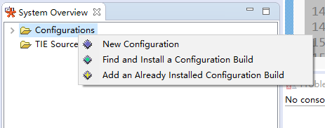 2. In the Find and Install a Configuration Build window, click **Browse**, select the configuration core to install (in this example, Otechn\_VisionQ6\_v3\_win32\_redist), and click **OK** to begin installation. **Figure 2** Find and Install a Configuration Build  After installation, the newly installed configuration core appears under **Configurations** in the System Overview panel, as shown in [Figure 3](#fig1742717500572). The Otechn\_VisionQ6\_v3 configuration core is now installed successfully. **Figure 3** Viewing the installed configuration core 3. When running a project (using Hello World as an example), select **C: Otechn\_VisionQ6\_v3** as shown in [Figure 4](#fig185297106715) to use the Otechn\_VisionQ6\_v3 configuration core. **Figure 4** Project creation window ## memmap Configuration The memmap.xmm file is located in the `dsp_liteos/dspxx/liteos/dspxx_ldscripts` directory of the release package, where `xx` represents a number. The DSP memory layout is generated from the memmap.xmm configuration file; users can use this file to understand and analyze the DSP memory layout. The memory map can be modified to suit the development environment. Refer to the *Xtensa® Linker Support Packages (LS Ps) Reference Manual* for details on memmap.xmm. ## Viewing Stack Usage Procedure: 1. Click **Tools -> Stack Usage** in Xplorer. **Figure 1** Stack usage inspection interface 2. A Stack Usage window appears. Select a project, right-click the compiled executable file, select **Binary File Info**, then select **Stack Usage** to view the stack usage for that file. **Figure 2** Stack usage display window [¶](#memmap-configuration-the-memmapxmm-file-is-located-in-the-dsp_liteosdspxxliteosdspxx_ldscripts-directory-of-the-release-package-where-xx-represents-a-number-the-dsp-memory-layout-is-generated-from-the-memmapxmm-configuration-file-users-can-use-this-file-to-understand-and-analyze-the-dsp-memory-layout-the-memory-map-can-be-modified-to-suit-the-development-environment-refer-to-the-xtensa-linker-support-packages-ls-ps-reference-manual-for-details-on-memmapxmm-viewing-stack-usage-procedure-1-click-tools-stack-usage-in-xplorer-figure-1-stack-usage-inspection-interface-2-a-stack-usage-window-appears-select-a-project-right-click-the-compiled-executable-file-select-binary-file-info-then-select-stack-usage-to-view-the-stack-usage-for-that-file-figure-2-stack-usage-display-window "锚链接")

## Installing the DSP Toolchain and Configuration Core on Linux For installing the Cadence DSP toolchain and configuration core on Linux, refer to the official Cadence document `dev_tools_install_guide.pdf`. When developing board-side DSP programs using the accompanying SDK package, it is recommended to install the DSP toolchain and configuration core as described below. ### Installing the DSP Toolchain The following procedure uses Xplorer-8.0.7-linux-x64-installer.bin as an example: 1. Create the directory `/opt/xtensa` on the server with root privileges.[¶](#installing-the-dsp-toolchain-and-configuration-core-on-linux-for-installing-the-cadence-dsp-toolchain-and-configuration-core-on-linux-refer-to-the-official-cadence-document-dev_tools_install_guidepdf-when-developing-board-side-dsp-programs-using-the-accompanying-sdk-package-it-is-recommended-to-install-the-dsp-toolchain-and-configuration-core-as-described-below-installing-the-dsp-toolchain-the-following-procedure-uses-xplorer-807-linux-x64-installerbin-as-an-example-1-create-the-directory-optxtensa-on-the-server-with-root-privileges "锚链接")

1. Copy the Xplorer-8.0.7-linux-x64-installer.bin installation package to `/opt/xtensa` and run the installer as follows: `root@XXX:/opt/xtensa# ./Xplorer-8.0.7-linux-x64-installer.bin ---------------------------------------------------------------------------- Welcome to the Xtensa Xplorer Setup Wizard. ---------------------------------------------------------------------------- Please read the following License Agreement. You must accept the terms of this agreement before continuing with the installation. Press [Enter] to continue: Cadence Tools Software Use Agreement Your use of the software you are about to install is subject to one or more licensing agreements. Portions of this software are subject to the terms of either (1) a technology license agreement between Cadence and the user ("you") - a direct Cadence licensee, (2) an end user license agreement between an existing Cadence licensee and you, or (3) a limited use evaluation agreement between Cadence and you. In addition, each directory contains files that identify any open source licenses or copyrights that apply to each component. For a copy of the license agreement that applies to your use of this software, please make an inquiry to the organization that provided this copy of the software to you. Press [Enter] to continue: Do you accept this license? [y/n]: y ---------------------------------------------------------------------------- Xtensa Xplorer Installation Directory Please enter the path to the Xtensa Xplorer root directory. The Xtensa Xplorer 8.0.7 and Xt Dev Tools directories will be installed in this directory. It is recommended that you use the same Xplorer root directory as your previous installations of Xplorer so that the Xt Dev Tools directory can be shared, which will allow this version of Xplorer to use all previous installations of Xtensa configurations and tools. Xtensa Xplorer Root Directory [/opt/xtensa]: ---------------------------------------------------------------------------- Select the components you want to install; clear the components you do not want to install. Click Next when you are ready to continue. Xplorer and Xtensa Development Tools : Y (Cannot be edited) Is the selection above correct? [Y/n]: y ---------------------------------------------------------------------------- Xplorer components selected Selected the following components: + Xtensa Xplorer and Development Tools Press [Enter] to continue: ---------------------------------------------------------------------------- Disk Space Report Installation space report Required disk space is : 3850 MB Current disk has free space : 8851 MB Press [Enter] to continue: ---------------------------------------------------------------------------- Installation Summary Xtensa products will be installed as follows Xtensa Xplorer will be installed to: /opt/xtensa/Xplorer-8.0.7 Xtensa Tools will be installed to: /opt/xtensa/Xt Dev Tools/install/tools/RH-2018.7 Xtensa Tools and samples bundles will be stored at: /opt/xtensa/Xt Dev Tools/downloads/RH-2018.7 Xtensa Xplorer workspace default location: /opt/xtensa/Xplorer-8.0.7-workspaces Press [Enter] to continue: ---------------------------------------------------------------------------- Pre-installation Message The Xplorer installer runs in 2 phases. The last phase (post-installation) is installing tools and any configurations selected, and may run for several minutes without appearing to make progress. Please be patient. Press [Enter] to continue: ---------------------------------------------------------------------------- Setup is now ready to begin installing Xtensa Xplorer on your computer. Do you want to continue? [Y/n]: y ---------------------------------------------------------------------------- Please wait while Setup installs Xtensa Xplorer on your computer. Installing 0% ______________ 50% ______________ 100% ######################################### Post Installation Script Result Congratulations !! You have finished installing Xplorer-8.0.7 Please review the following message log to make sure of the success of the installation. ================================================================================= INSTALLING Xtensa Tools ====== LOCATE utils plugin ====== WHERE_UTILS_RESULT=/opt/xtensa/Xplorer-8.0.7/eclipse/plugins/other.xide.external. utils_8.0.7.2000 INSTALL XTTOOLS COMMAND :: /opt/xtensa/Xplorer-8.0.7/eclipse/jre/bin/java -cp /opt/xtensa/Xplorer-8.0.7/eclipse/plugins/other.xide.external.utils_8.0.7.2000/ut ils.jar other.xide.external.utils.io.Unpack /opt/xtensa/Xt Dev Tools/downloads/RH-2018.7/tools/XtensaTools_RH_2018_7_linux.tgz /opt/xtensa/Xt Dev Tools/install/tools/ /opt/xtensa/Xplorer-8.0.7/eclipse/plugins/other.xide.external.utils_8.0.7.2000 INSTALL Xtensa Tools RESULT :: 0 , SUCCESS ====== LOCATE dynamic plugin files ====== INSTALL XOS Document Plugin WHERE_XOS_RESULT=/opt/xtensa/XtDevTools/install/tools/RH-2018.7-linux/Xtensa Tools /doc/xos-2.02.zip INSTALL XOS COMMAND :: /opt/xtensa/Xplorer-8.0.7/eclipse/jre/bin/java -cp /opt/xtensa/Xplorer-8.0.7/eclipse/plugins/other.xide.external.utils_8.0.7.2000/ut Press [Enter] to continue: ils.jar other.xide.external.utils.io.Unpack /opt/xtensa/Xt Dev Tools/install/tools/RH-2018.7-linux/Xtensa Tools/doc/xos-2.02.zip /opt/xtensa/Xplorer-8.0.7/eclipse/dropins/ /opt/xtensa/Xplorer-8.0.7/eclipse/plugins/other.xide.external.utils_8.0.7.2000 INSTALL XOS HELP PLUGIN RESULT :: 0 , SUCCESS Checking Xtensa Registry dir... Check Xtensa Registry RH-2018.7 DIR DONE:: /opt/xtensa/Xt Dev Tools/Xtensa Registry/RH-2018.7-linux INSTALLING User selected Xtensa config builds from Xt Dev Tools/downloads/RH-2018.7/builds IF EXISTS Setting Xplorer configuration and then initializing configuration cache INITIALIZE Xtensa Xplorer RESULT :: 0, SUCCESS Press [Enter] to continue: ---------------------------------------------------------------------------- Setup has finished installing Xtensa Xplorer on your computer. Run Xtensa Xplorer now (Recommended) (This initializes workspace location defaults) [Y/n]: n` > **Note:** >On some Linux environments, a graphical (Gtk) interface may appear during installation. Follow the installation method described in this section. ### Installing the DSP Configuration Core The following uses the Otechn\_VisionQ6\_v3 core as a reference. The process for other configuration cores is similar. 1. With root privileges, copy the Otechn\_VisionQ6\_v3\_linux\_redist.tgz package to the previously created `/opt/xtensa` directory and extract it using the command `tar -zxf Otechn_VisionQ6_v3_linux_redist.tgz`. This extracts the `/opt/xtensa/RH-2018.7-linux/Otechn_VisionQ6_v3/` directory.
2. Navigate to `/opt/xtensa/RH-2018.7-linux/Otechn_VisionQ6_v3/` and run `./install` to install the configuration core. Example output: `root@XXX:/opt/xtensa/RH-2018.7-linux/Otechn_VisionQ6_v3# ./install Xtensa Processor Configuration Installation Tool Copyright (c) 2001-2018 Tensilica Inc. For Xtensa Tools Version 13.0.7 Before you can use a new Xtensa processor configuration, you must run this tool to complete the installation. Two separate packages are required: 1) The Xtensa Tools cross-development software toolkit package. These tools are configuration-independent and are shared by all your Xtensa processor configurations. You do not need a separate copy for each configuration. 2) The configured Xtensa processor files, of which this script is a part. You must have already downloaded both packages and extracted the files on your system before you can continue. Are you ready to proceed? [y] y Continuing... Enter the path to the Xtensa Tools directory: /opt/xtensa/Xt Dev Tools/install/tools/RH-2018.7-linux/Xtensa Tools The files for this Xtensa processor configuration will now be set up to work with the installation directories that you have chosen. This process will take a few minutes, and once it has begun the installation directories cannot be changed. If you abort this script after this point, or if you need to change the installation directories for some reason, you will need to start over with the original files that you downloaded for this configuration. (The Xtensa Tools files are not modified in this process so you do not need to reinstall the Xtensa Tools package.) The directories to be used are: Xtensa Tools: /opt/xtensa/Xt Dev Tools/install/tools/RH-2018.7-linux/Xtensa Tools Configured Processor: /opt/xtensa/RH-2018.7-linux/Otechn_VisionQ6_v3/. Do you want to continue? [y] y The files for this processor configuration have now been set to use the directory names you have chosen. The next installation step is to add this processor configuration to the list of available configurations in a registry of Xtensa cores. The configuration will be registered with the default name, which is the Core ID from the Xtensa Processor Generator. You must ensure that each core in the registry has a unique name. Please refer to the "Xtensa Software Development Toolkit User's Guide" to learn how to register this configuration with a different name. This script will update only one registry of Xtensa cores, and in most cases, you should use the default Xtensa registry. If you are sharing the Xtensa Tools installation with others, and you do not want this processor configuration to be shared, you can specify an alternate registry. Please refer to the "Xtensa Software Development Toolkit User's Guide" for instructions on adding this configuration to additional Xtensa core registries. The default registry is: /opt/xtensa/Xt Dev Tools/install/tools/RH-2018.7-linux/Xtensa Tools/config What registry would you like to use? [default] /opt/xtensa/Xt Dev Tools/Xtensa Registry/RH-2018.7-linux Do you want to make "Otechn_VisionQ6_v3" the default Xtensa core? [y] y The installation process is now complete.` > **Notice:** >- When developing with the SDK, it is best to specify the configuration core path according to the installation path shown above. Otherwise, when developing DSP programs, you must modify the Makefile to specify the actual toolchain and configuration core paths (refer to the Cadence document *xtensa\_xcc\_compiler\_ug.pdf* at `/opt/xtensa/XtDevTools/downloads/RH-2018.7/docs`).
 > - Official Cadence documents are available at `/opt/xtensa/Xt Dev Tools/downloads/RH-2018.7/docs`.
 > - **If different solutions require different Xtensa Tools versions for their DS Ps, extract the required Xtensa Tools package to `/opt/xtensa/Xt Dev Tools/install/tools` and select that path when installing the configuration core.** ### Configuring Environment Variables Open the `/etc/profile` file and add the following environment variable settings: - Set the Cadence license: export XTENSAD\_LICENSE\_FILE=port@serverip Example: port is 28001, serverip is 192.168.1.100 - Set the configuration core registry path: export XTENSA\_SYSTEM=/opt/xtensa/XtDevTools/Xtensa Registry/RH-2018.7-linux - Set the default configuration core: export XTENSA\_CORE=Otechn\_VisionQ6\_v3 - Set the cross-compilation toolchain path: export PATH="/opt/xtensa/Xt Dev Tools/install/tools/RH-2018.7-linux/Xtensa Tools/bin:$PATH" ## Development Workflow DSP development is divided into PC-side and board-side environments: - PC-side environment: Use Xplorer for DSP algorithm development. The Xplorer simulation environment enables rapid algorithm development and verification. Code developed on the PC can be directly ported to the board for compilation and debugging. Refer to the previous sections for Xplorer setup.
3. Board-side environment: Develop board-side programs using the accompanying SDK package. ### Board-Side Development Workflow The DSP application development block diagram is shown in [Figure 1](#__fig11884284184). **Figure 1** DSP application development block diagram As shown in [Figure 1](#__fig11884284184), DSP program development and usage consists of the following parts: - CPU side - Load DSP Binary: Call ss\_mpi\_svp\_dsp\_load\_bin to load the DSP executable, then call ss\_mpi\_svp\_dsp\_enable\_core to enable the DSP. - MPI: DSP MPI interface. - DRV: Driver module. - IPCM: Inter-core communication module. - DSP side - Runtime: Operator scheduling and management on the DSP. - ALGO: Parse parameters and invoke DSP operators. - Lib: DSP operator library. - IPCM: Inter-core communication module. > **Caution:** >To accelerate compilation, the DSP-side library/code does not include optimization flags (-O). Users can add these during the performance tuning phase. The example below adds -O2 in the `Hi3403V100_SDK_V2.0.0.3_B020/smp/dsp_liteos/dspXX/Makefile.param` file (using Hi3403V100 SMP as an example, where XX is the DSP core number). #### Adapting TileManager The Tile Manager software package provided by Cadence must be adapted for wide-address operations before use. After adapting the code, copy the Tile Manager source to the `Hi3403V100_SDK_V2.0.0.3_B020/smp/dsp_liteos/dspXX/tm/vendor` directory (using Hi3403V100 SMP as an example, where XX is the DSP core number). Only then is the Tile Manager adaptation complete. In the adaptation code diagrams in the following sections, the left side shows the original code and the right side shows the modified code. ##### Adapting tileManager.h Adaptation point 1: Enable the wide-address macro  Adaptation point 2: Adapt the p Frame Buffer/p Frame Data fields of the frame structure to 64-bit operations  Adaptation point 3: Adapt the DRAM address validity check  Adaptation point 4: Add type-conversion macros and high/low 32-bit operation macros 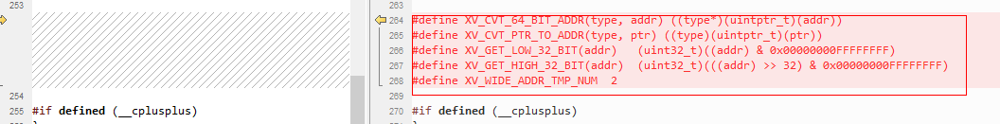 ##### Adapting tileManager\_api.h Adaptation point 1: Modify the bank count  Adaptation point 2: Adapt p Frame Buffer/p Frame Data fields of the frame structure to 64-bit operations  Adaptation point 3: Adapt p Frame Buffer/p Frame Data fields of the frame structure to 64-bit  Adaptation point 4: Adapt destination and source pointer types of xv Add Idma Request Multi Channel to 64-bit 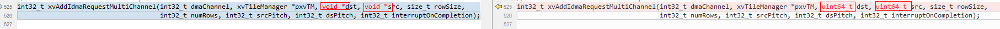 Adaptation point 5: Adapt the frame address pointer type of xv Create Frame to 64-bit 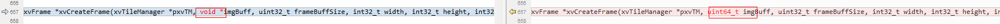 ##### Adapting tileManager.c Adaptation point 1: Adapt the DRAM validation in xv Init Mem Allocator 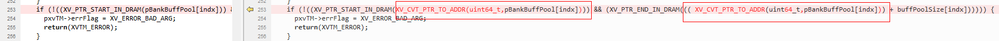 Adaptation point 2: Adapt the frame address pointer type and validation in xv Create Frame to 64-bit  Adaptation point 3: Adapt the inline function add Idma Request Inline Multi Channel for wide-address operations and move it before the xv Add Idma Request Multi Channel implementation 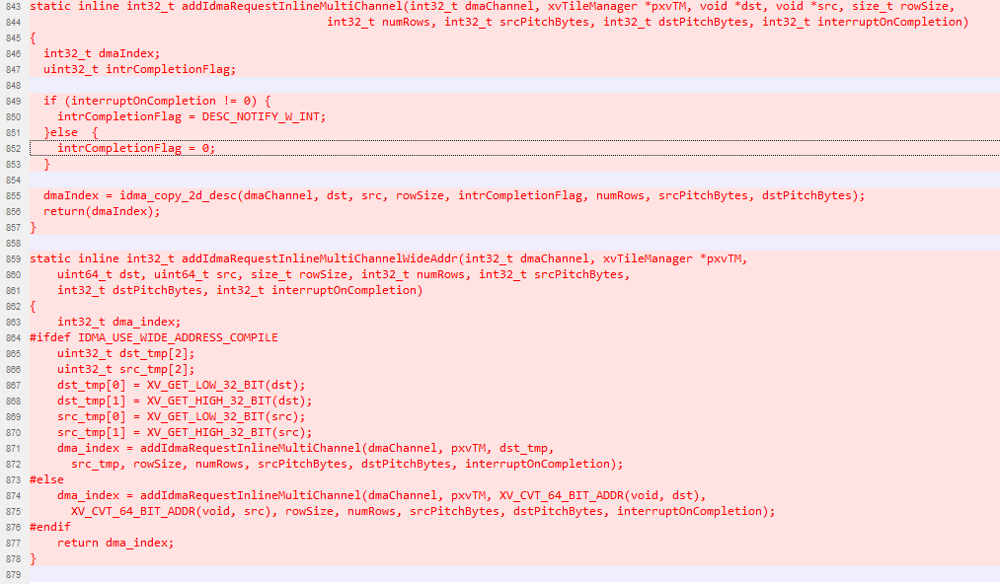 Adaptation point 4: Adapt destination and source pointer types of xv Add Idma Request Multi Channel to 64-bit 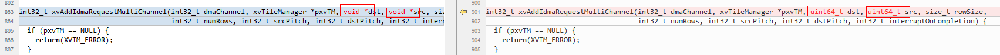 Adaptation point 5: Adapt destination/source address validation and copy operations in xv Add Idma Request Multi Channel, replacing them with the inline function add Idma Request Inline Multi Channel  Adaptation point 6: Adapt solve ForX for 64-bit source and wide-address operations   Adaptation point 7: Adapt xv Req Tile Transfer In Multi Channel for 64-bit source and wide-address operations  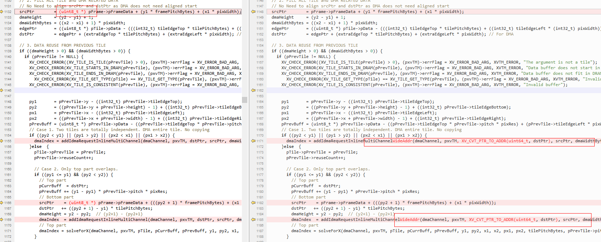 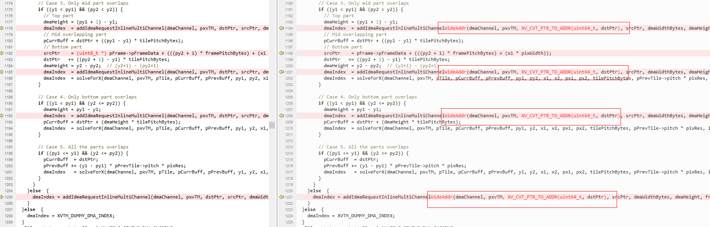 Adaptation point 8: Add inline IDMA wide-address 2D copy operations  Adaptation point 9: Adapt xv Req Tile Transfer In Fast Multi Channel for 64-bit source and wide-address operations  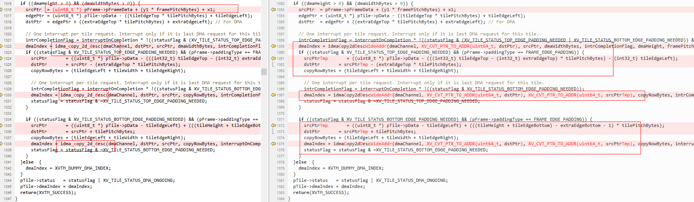 Adaptation point 10: Adapt xv Req Tile Transfer In Fast16Multi Channel for 64-bit source and wide-address operations 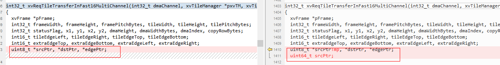  Adaptation point 11: Adapt xv Req Tile Transfer Out Multi Channel for 64-bit destination and wide-address operations  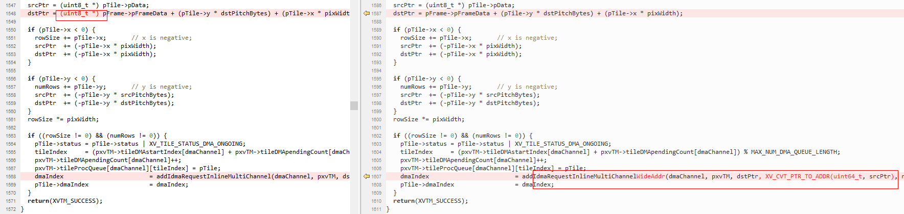 Adaptation point 12: Adapt xv Req Tile Transfer Out Fast Multi Channel for 64-bit destination and wide-address operations  Adaptation point 13: Adapt xv Req Tile Transfer Out Fast16Multi Channel for 64-bit destination and wide-address operations  Adaptation point 14: Adapt the frame pointer field validity check in xv Pad Edges 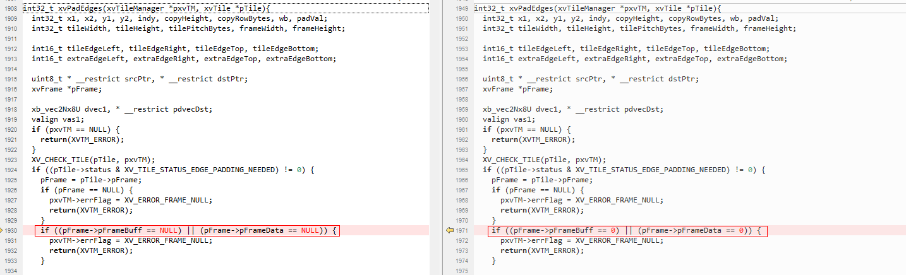 Adaptation point 15: Adapt the frame pointer field validity check in xv Pad Edges16 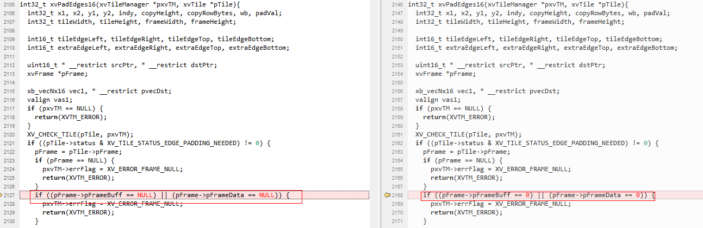 Adaptation point 16: Remove the index < 0 validation for the xv Check For Idma Index Multi Channel function parameter  #### Developing Custom Operators On the CPU side: 1. Call ss\_mpi\_svp\_dsp\_power\_on to power on the DSP during program initialization.
4. Call ss\_mpi\_svp\_dsp\_load\_bin to load the four binaries (ot\_iram.bin, ot\_sram.bin, ot\_dram0.bin, ot\_dram1.bin) to their respective locations.
5. Call ss\_mpi\_svp\_dsp\_enable\_core to enable the DSP. Develop custom operators by wrapping the ss\_mpi\_svp\_dsp\_rpc / ss\_mpi\_svp\_dsp\_query interfaces. > **Note:** >Refer to the sample (sample\_svp\_dsp\_enca\_dilate\_3x3 / sample\_svp\_dsp\_enca\_erode\_3x3 wrappers) and the *SVP2.0 API Reference* for the ss\_mpi\_svp\_dsp\_rpc / ss\_mpi\_svp\_dsp\_query interface descriptions. On the DSP side: 1. Develop frame-level or tile-level operators under the `algo/include/int` directory in the release package. > **Note:** >Users can refer to `algo/include/int/svp_dsp_frm.h` and `algo/src/svp_dsp_frm.c` to develop frame-level operators. 2. Add calls to custom operators in the `svp_dsp_algo_process` function in `algo/src/svp_dsp_algo.c`.
6. Run `algo/Makefile` to recompile the code under the `algo` directory into a library.
7. Run `runtime/obj/Makefile` to compile the .o and .a files into an ELF file and convert it into four binaries. > **Note:** >The four binaries are ot\_iram.bin, ot\_sram.bin, ot\_dram0.bin, and ot\_dram1.bin, and are placed in `runtime/obj/bin`. > **Notice:** >- The number of DS Ps and the IRAM/SRAM/DRAM addressing differ across solutions. Refer to the corresponding chip manual for details.
 > - Due to the Reorder Buf logic, there is a constraint on IDMA usage: the idma\_init programming interface can only use MAX\_BLOCK\_2 / MAX\_BLOCK\_4 / MAX\_BLOCK\_8, not MAX\_BLOCK\_16.
 > - On Hi3403V100, the CPU accesses DDR in the address range [0x40000000, 0x2FFFFFFFF]. On the DSP side, IDMA maps this to [0x440000000, 0x6FFFFFFFF] for access — i.e., the IDMA DDR address must have offset 0x400000000 added (the idma\_offset value). This mapping framework is already built into the SDK; users can simply refer to the framework sample for usage.