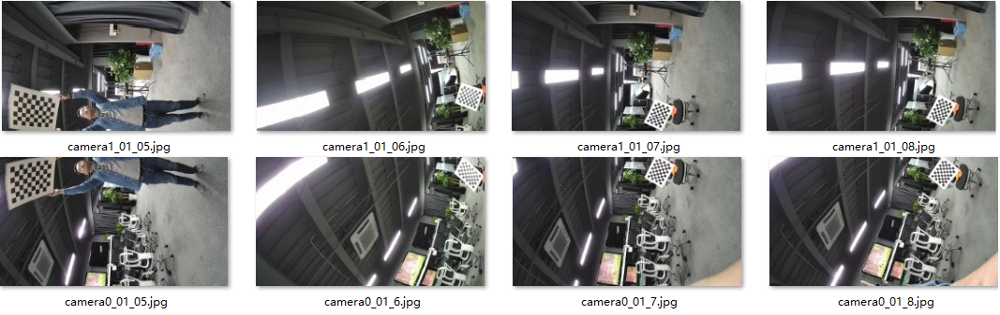
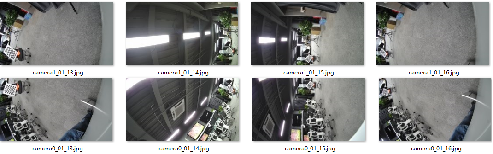
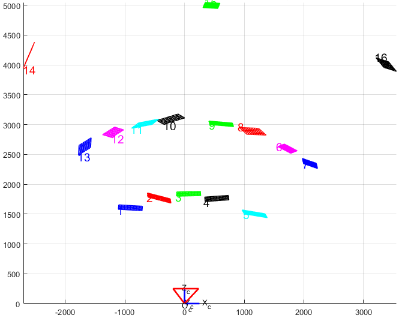
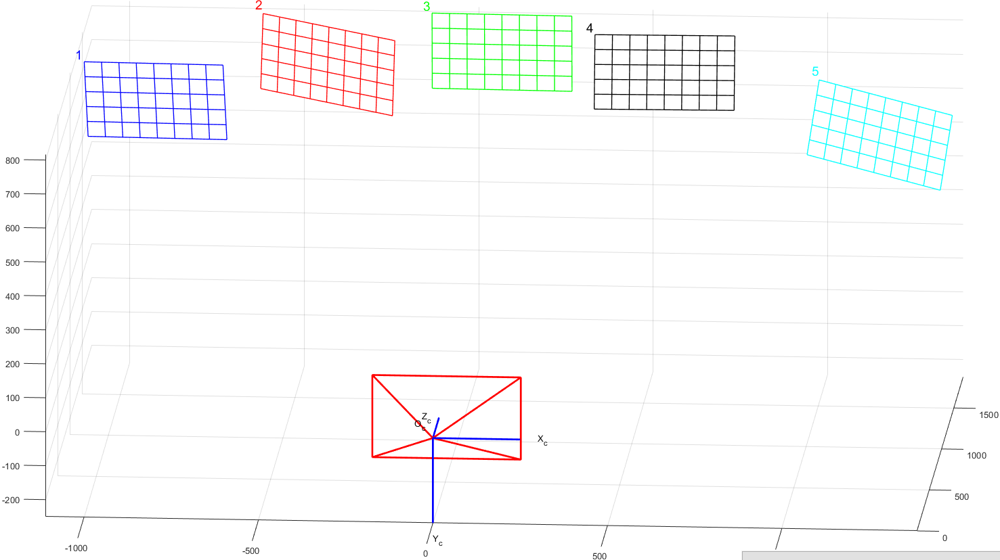
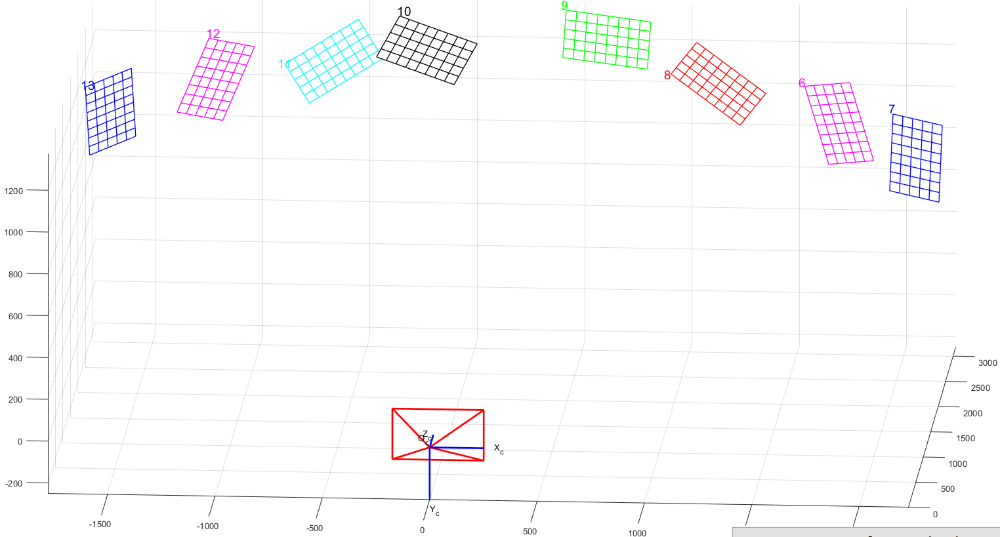
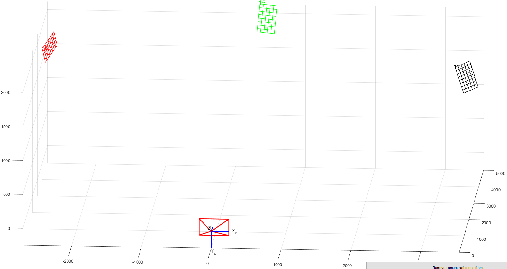

title: "Preface"
source: /sessions/sharp-sweet-allen/mnt/hi3403-build/pegasus/docs/zh-CN/拼接 FAQ/拼接 FAQ.md
--- # Preface
**Overview** This document is written for developers using AVSP panoramic stitching, intended to provide solutions and assistance for issues encountered during development. **Product Version** The product versions corresponding to this document are as follows.

| Product Name | Product Version |
| --- | --- |
| Hi3403V100 | V100 |

**Intended Audience** This document (this guide) is primarily intended for the following engineers: - Technical support engineers
- Software development engineers
- Hardware development engineers **Revision History** The revision history accumulates the description of each document update. The latest version of the document contains all update content from previous versions.

| **Document Version** | **Release Date** | **Modification Description** |
| --- | --- | --- |
| 00B01 | 2025-09-15 | First temporary version release. |

# Production-Line Calibration

## How to Understand the Ideal Production-Line Calibration Environment [Symptom] The AVSP module requires a special production-line calibration environment, which is difficult for customers to understand. [Analysis] The ideal calibration environment must be customized according to algorithm design requirements, as described below. [Solution] The ideal panoramic stitching calibration environment is a checkerboard sphere, and the environment design is shown in [Figure 1](#fig6703175413384). **Figure 1** Schematic diagram of the production-line calibration environment The recommended sphere radius is between 0.6 m and 2 m, with clear focus imaging of the checkerboard as a reference. If a fisheye lens is used, the depth of field is relatively large and near-distance focusing is clear, so the sphere radius can be correspondingly reduced, which also reduces the difficulty of fabricating the production-line calibration environment and the space it occupies. If a non-fisheye lens is used, since the depth of field is relatively small and the focusing distance is farther, the sphere radius needs to be correspondingly larger; otherwise the captured images will be blurry, corner detection inaccurate, and calibration abnormal. The sphere surface must be covered with black-and-white checkerboard patterns. Based on the concept of world map latitude-longitude, it is recommended to have 36 grids between the north and south poles and 72 grids around the equator, with each grid spanning 5° in both latitude and longitude directions. Due to the characteristics of latitude and longitude, the horizontal width of each grid becomes increasingly smaller in high-latitude regions. To make grid sizes uniform, in the latitude 60°–80° region, grids are merged every 3 in the longitude direction, i.e., each grid spans 15° in longitude; in the latitude 0°–90° region, each grid spans 45° in longitude, as shown in [Figure 1](#fig6703175413384)(b). When collecting calibration images, place the optical center of the lens corresponding to model calibration channel 0 at the center of the sphere. Under ideal conditions, the distance from all checkerboard corner points on the sphere surface to the sphere center equals the sphere radius R. In practice, due to factors such as camera placement position and checkerboard structure tolerances, the consistency of the distance between corner points and the optical center of the channel 0 lens must be maintained within 10%, i.e., within the range of [0.95*R, 1.05*R]. Since the entire sphere surface is covered with checkerboard patterns, there is theoretically no special requirement for the camera orientation. However, because the grid size differences in high-latitude areas are large, it is recommended to avoid high-latitude areas for the overlap regions as much as possible and place them in low-latitude areas. If the checkerboard does not cover the entire sphere surface, it must be ensured that the overlap regions between cameras all have checkerboard corner points. Technically speaking, the checkerboard only needs to cover the imaging overlap regions. Therefore, for non-panoramic cameras, the ideal calibration environment can be simplified according to the product form and production-line requirements, while ensuring that the checkerboard is distributed on a spherical arc surface, with grid sizes kept as consistent as possible and evenly distributed. The following sections will illustrate using dual-fisheye and four-channel horizontal structures as examples. For other panoramic camera structures, please adjust according to the actual situation. > **Note:** >The size of the production-line calibration environment is not related to the optimal stitching distance. After calibration is complete, any optimal stitching distance can be configured when generating the LUT. ## How to Understand the Production-Line Calibration Environment for Dual-Fisheye Structures [Symptom] For dual-fisheye structures, the production-line calibration environment can be simplified based on the ideal calibration environment, which is difficult for customers to understand. [Analysis] The production-line calibration environment for dual-fisheye structures must be customized according to algorithm design requirements, as described below. [Solution] The overlap region of a dual-fisheye structure appears as a ring on the sphere surface. Therefore, based on the ideal sphere, the upper and lower regions (high-latitude regions) of the sphere can be cut away, retaining only the ring-shaped area near the equator. It is recommended that each grid be 5°, so there are still 72 grids around the ring, and the number of grids in the vertical direction (latitude direction) is designed based on the size of the overlap region. For example, if the lens FOV is 200°, then there is a 40° overlap region, in which case more than 8 grids are needed in the vertical direction, with 1 grid reserved above and below — 10 grids would be more appropriate. In this case, the checkerboard covers the area between 25°S and 25°N latitude. The effect is shown in [Figure 1](#fig261314513443), where the physical image has 16 grids in the vertical direction covering an 80° overlap region to accommodate different lens selections. Customers can adjust according to their own product form. **Figure 1** Schematic diagram of the dual-fisheye structure production-line calibration environment Since fisheye lenses have a large depth of field and can focus clearly at close range, the recommended ring radius is between 0.6 m and 1 m, and can be consistent with the optimal stitching distance targeted by the product to ensure the best results at that distance. For example, if the product is most concerned about the stitching effect at a distance of 0.8 m, the ring radius can be designed as 0.8 m to ensure the best effect at the 0.8 m position. During calibration, place the dual-fisheye structure at the center of the ring and ensure that the background (i.e., areas not covered by the checkerboard) is clean and free of other checkerboard-like patterns, to avoid false detections and matching errors that could cause calibration failure. Since the dual-fisheye structure is a 720° panoramic camera, the camera base will always have some occlusion, which is normal. The overlap region does not necessarily need to cover all checkerboard patterns. If occlusion cannot be completely avoided, try to cover as much as possible. The actual production-line calibration test effect is shown in [Figure 2](#fig1566112562484)(a). A demo version camera is used here, with a relatively large base and significant occlusion; the actual product can control occlusion better. [Figure 2](#fig1566112562484)(b) shows the stitching effect in the production-line calibration environment after production-line calibration. **Figure 2** Dual-fisheye structure production-line calibration images [¶](#how-to-understand-the-ideal-production-line-calibration-environment-symptom-the-avsp-module-requires-a-special-production-line-calibration-environment-which-is-difficult-for-customers-to-understand-analysis-the-ideal-calibration-environment-must-be-customized-according-to-algorithm-design-requirements-as-described-below-solution-the-ideal-panoramic-stitching-calibration-environment-is-a-checkerboard-sphere-and-the-environment-design-is-shown-in-figure-1-figure-1-schematic-diagram-of-the-production-line-calibration-environment-the-recommended-sphere-radius-is-between-06-m-and-2-m-with-clear-focus-imaging-of-the-checkerboard-as-a-reference-if-a-fisheye-lens-is-used-the-depth-of-field-is-relatively-large-and-near-distance-focusing-is-clear-so-the-sphere-radius-can-be-correspondingly-reduced-which-also-reduces-the-difficulty-of-fabricating-the-production-line-calibration-environment-and-the-space-it-occupies-if-a-non-fisheye-lens-is-used-since-the-depth-of-field-is-relatively-small-and-the-focusing-distance-is-farther-the-sphere-radius-needs-to-be-correspondingly-larger-otherwise-the-captured-images-will-be-blurry-corner-detection-inaccurate-and-calibration-abnormal-the-sphere-surface-must-be-covered-with-black-and-white-checkerboard-patterns-based-on-the-concept-of-world-map-latitude-longitude-it-is-recommended-to-have-36-grids-between-the-north-and-south-poles-and-72-grids-around-the-equator-with-each-grid-spanning-5-in-both-latitude-and-longitude-directions-due-to-the-characteristics-of-latitude-and-longitude-the-horizontal-width-of-each-grid-becomes-increasingly-smaller-in-high-latitude-regions-to-make-grid-sizes-uniform-in-the-latitude-6080-region-grids-are-merged-every-3-in-the-longitude-direction-ie-each-grid-spans-15-in-longitude-in-the-latitude-090-region-each-grid-spans-45-in-longitude-as-shown-in-figure-1b-when-collecting-calibration-images-place-the-optical-center-of-the-lens-corresponding-to-model-calibration-channel-0-at-the-center-of-the-sphere-under-ideal-conditions-the-distance-from-all-checkerboard-corner-points-on-the-sphere-surface-to-the-sphere-center-equals-the-sphere-radius-r-in-practice-due-to-factors-such-as-camera-placement-position-and-checkerboard-structure-tolerances-the-consistency-of-the-distance-between-corner-points-and-the-optical-center-of-the-channel-0-lens-must-be-maintained-within-10-ie-within-the-range-of-095r-105r-since-the-entire-sphere-surface-is-covered-with-checkerboard-patterns-there-is-theoretically-no-special-requirement-for-the-camera-orientation-however-because-the-grid-size-differences-in-high-latitude-areas-are-large-it-is-recommended-to-avoid-high-latitude-areas-for-the-overlap-regions-as-much-as-possible-and-place-them-in-low-latitude-areas-if-the-checkerboard-does-not-cover-the-entire-sphere-surface-it-must-be-ensured-that-the-overlap-regions-between-cameras-all-have-checkerboard-corner-points-technically-speaking-the-checkerboard-only-needs-to-cover-the-imaging-overlap-regions-therefore-for-non-panoramic-cameras-the-ideal-calibration-environment-can-be-simplified-according-to-the-product-form-and-production-line-requirements-while-ensuring-that-the-checkerboard-is-distributed-on-a-spherical-arc-surface-with-grid-sizes-kept-as-consistent-as-possible-and-evenly-distributed-the-following-sections-will-illustrate-using-dual-fisheye-and-four-channel-horizontal-structures-as-examples-for-other-panoramic-camera-structures-please-adjust-according-to-the-actual-situation-note-the-size-of-the-production-line-calibration-environment-is-not-related-to-the-optimal-stitching-distance-after-calibration-is-complete-any-optimal-stitching-distance-can-be-configured-when-generating-the-lut-how-to-understand-the-production-line-calibration-environment-for-dual-fisheye-structures-symptom-for-dual-fisheye-structures-the-production-line-calibration-environment-can-be-simplified-based-on-the-ideal-calibration-environment-which-is-difficult-for-customers-to-understand-analysis-the-production-line-calibration-environment-for-dual-fisheye-structures-must-be-customized-according-to-algorithm-design-requirements-as-described-below-solution-the-overlap-region-of-a-dual-fisheye-structure-appears-as-a-ring-on-the-sphere-surface-therefore-based-on-the-ideal-sphere-the-upper-and-lower-regions-high-latitude-regions-of-the-sphere-can-be-cut-away-retaining-only-the-ring-shaped-area-near-the-equator-it-is-recommended-that-each-grid-be-5-so-there-are-still-72-grids-around-the-ring-and-the-number-of-grids-in-the-vertical-direction-latitude-direction-is-designed-based-on-the-size-of-the-overlap-region-for-example-if-the-lens-fov-is-200-then-there-is-a-40-overlap-region-in-which-case-more-than-8-grids-are-needed-in-the-vertical-direction-with-1-grid-reserved-above-and-below-10-grids-would-be-more-appropriate-in-this-case-the-checkerboard-covers-the-area-between-25s-and-25n-latitude-the-effect-is-shown-in-figure-1-where-the-physical-image-has-16-grids-in-the-vertical-direction-covering-an-80-overlap-region-to-accommodate-different-lens-selections-customers-can-adjust-according-to-their-own-product-form-figure-1-schematic-diagram-of-the-dual-fisheye-structure-production-line-calibration-environment-since-fisheye-lenses-have-a-large-depth-of-field-and-can-focus-clearly-at-close-range-the-recommended-ring-radius-is-between-06-m-and-1-m-and-can-be-consistent-with-the-optimal-stitching-distance-targeted-by-the-product-to-ensure-the-best-results-at-that-distance-for-example-if-the-product-is-most-concerned-about-the-stitching-effect-at-a-distance-of-08-m-the-ring-radius-can-be-designed-as-08-m-to-ensure-the-best-effect-at-the-08-m-position-during-calibration-place-the-dual-fisheye-structure-at-the-center-of-the-ring-and-ensure-that-the-background-ie-areas-not-covered-by-the-checkerboard-is-clean-and-free-of-other-checkerboard-like-patterns-to-avoid-false-detections-and-matching-errors-that-could-cause-calibration-failure-since-the-dual-fisheye-structure-is-a-720-panoramic-camera-the-camera-base-will-always-have-some-occlusion-which-is-normal-the-overlap-region-does-not-necessarily-need-to-cover-all-checkerboard-patterns-if-occlusion-cannot-be-completely-avoided-try-to-cover-as-much-as-possible-the-actual-production-line-calibration-test-effect-is-shown-in-figure-2a-a-demo-version-camera-is-used-here-with-a-relatively-large-base-and-significant-occlusion-the-actual-product-can-control-occlusion-better-figure-2b-shows-the-stitching-effect-in-the-production-line-calibration-environment-after-production-line-calibration-figure-2-dual-fisheye-structure-production-line-calibration-images "锚链接")

## How to Understand the Production-Line Calibration Environment for Four-Channel Horizontal Structures [Symptom] For four-channel horizontal structures, the production-line calibration environment can be simplified based on the ideal calibration environment, which is difficult for customers to understand. [Analysis] The production-line calibration environment for four-channel horizontal structures must be customized according to algorithm design requirements, as described below. [Solution] The four-channel horizontal structure is generally used in the field of *public safety video capture*. The structure is generally as shown in [Figure 1](#fig087182975116). The FOV of the stitched image in the horizontal direction for this type of four-channel horizontal structure is typically equal to or less than 180°. Therefore, there are two options to choose from: hemisphere or three-arc target surface. **Figure 1** Schematic diagram of the four-channel horizontal structure The hemisphere solution is relatively simple — it is a simple cropping on the basis of the fully ideal sphere, retaining 180° of the checkerboard sphere in the horizontal direction, and cropping in the vertical direction according to the lens FOV, as shown in [Figure 2](#fig1064814233245). In this diagram, only the region from 60°S to 60°N latitude is retained, with high-latitude regions cropped. For downward-tilted panoramic camera structures, this calibration environment is also applicable — simply tilt the panoramic camera upward so that its entire field of view faces the checkerboard region. The advantage of this solution is its unified structure — the sphere center position is easy to locate and relatively accurate, and it is applicable to downward-tilted panoramic camera structures. The disadvantage is greater fabrication difficulty, inconvenient handling and transportation, and large space occupation. Detailed specifications are not described here; please refer to the three-arc target surface solution. **Figure 2** Hemisphere production-line calibration environment for four-channel horizontal structure Technically speaking, when capturing images, the checkerboard only needs to cover the overlap regions between cameras. The four-channel horizontal structure has three overlap regions, so it can be further simplified from the hemisphere above to a three-arc target surface. As shown in [Figure 3](#fig4215154493014), only the checkerboard arc surfaces corresponding to the three overlap regions are retained. To make the environment even simpler, three identical independent and separately movable checkerboard spherical arc surfaces can be fabricated and placed at the corresponding positions of the three overlap regions during use. **Figure 3** Three-arc target surface calibration environment for four-channel horizontal structure This product form is generally paired with non-fisheye lenses with a focal length of about 4 mm–6 mm. Their depth of field is smaller than that of fisheye lenses, and the focusing distance is farther. Therefore, it is recommended to design the arc surface radius as 1.5 m. Although this distance is not the optimal focusing distance of the panoramic camera, it can still produce relatively clear images with distinct corner points. If the paired lens has a larger focal length, consider correspondingly increasing the radius of the checkerboard sphere surface so that corner points can be clearly imaged, ensuring calibration quality. A single spherical arc target surface is recommended to cover a 30° horizontal sphere surface and a 120° vertical sphere surface. Also drawing on the concept of world map latitude-longitude, with each grid designed at 5°: - In the horizontal direction, there are 6 black-and-white grids, and the horizontal arc length at the equator is approximately L1=θ1*R=π/6*1.5=0.785 m - In the vertical direction, there are 24 black-and-white grids centered on the equator, symmetrical above and below, with an arc length of approximately L2=θ2*R=π*2/3*1.5=3.14 m The actual height is approximately H = 2.6 m. If the actual overlap region is larger, the arc surface size and number of black-and-white grids can be correspondingly increased; conversely, if the actual overlap region is smaller, the arc surface size and number of black-and-white grids can be correspondingly reduced. It is only necessary to ensure coverage of the overlap region. Special attention is required: in the calibration images, each overlap region must have at least more than one column of checkerboard, i.e., more than two columns of corner points. Otherwise, calibration cannot proceed. Due to lens distortion, structural tolerances, camera shooting angles, and other factors, please ensure that the overlap region between panoramic camera lenses is at least 10° or more, or even larger, to guarantee the best calibration quality. Before use, move the sphere centers corresponding to the three spherical arc surfaces to the same position, and based on the angles between lenses, adjust the angles between the arc surfaces while keeping the sphere centers stationary, so that all overlap regions have checkerboard coverage. During calibration, fix the optical center of the lens corresponding to pipe0 of the panoramic camera at the sphere center position. Considering tolerance conditions, maintain corner point distance consistency within 10%, ensuring that the distance between all checkerboard corner points and the pipe0 lens optical center is within [1.425 m, 1.575 m] to guarantee the best stitching effect. When shooting, please ensure that the background (i.e., areas not covered by the checkerboard) is clean and free of other checkerboard-like patterns, to avoid false detections and matching errors that could cause calibration failure. The advantage of this solution is that the production-line environment is less difficult to fabricate, occupies less space, and can be adjusted according to the panoramic camera overlap, making it adaptable to different four-channel horizontal structures, such as multi-channel surround structures. The disadvantage is that the center point is difficult to locate; it is recommended to use auxiliary guide rails for movement. The actual production-line measured calibration images are shown in [Figure 4](#fig18248161755212). For ease of comparison, the calibration images are rotated 90° for illustration in the document. The actual image resolution is the same as the sensor output, 3840×2160, and is consistent with the first step of model calibration. The images do not need to be rotated during calibration. The stitching effect after calibration is shown in [Figure 5](#fig1826815454525).* *Figure 4* *Four-channel horizontal structure production-line calibration images* *Figure 5* *Four-channel horizontal structure production-line calibration effect Other suggestions and considerations regarding the production-line calibration environment are as follows: - Checkerboard application recommendations The key difficulty in the entire production-line calibration environment fabrication process lies in the application of the checkerboard. The checkerboard needs to be applied on a spherical surface, and the area is relatively large. Applying the checkerboard as a single whole piece is difficult; it can be cut into strips and then applied strip by strip on the spherical surface to form the final complete checkerboard pattern.* *Figure 6* *Checkerboard corner point quality When applying strips, direct alignment between each strip has some tolerance, and there may be some misalignment between strips. For this misalignment, from a technical analysis perspective, the corner points in [Figure 6](#fig151051344185812)(a) are complete — although there is misalignment in the middle of the checkerboard, the impact on corner point detection is small. The corner points in [Figure 6](#fig151051344185812)(b) have misalignment, which affects detection accuracy during calibration. Based on the above analysis, to ensure corner point quality and integrity, each strip can be cut along the middle of the checkerboard rather than at the corner point positions. As shown in [Figure 7](#_Ref513707564), which demonstrates cutting the checkerboard pattern into strips along the horizontal direction in a four-channel horizontal structure calibration environment — the cutting positions follow the green lines, which does not affect corner point integrity. Similarly, if cutting vertically, it is also recommended to cut along the middle of the checkerboard grids.* *Figure 7*\* Checkerboard cutting diagram [¶](#how-to-understand-the-production-line-calibration-environment-for-four-channel-horizontal-structures-symptom-for-four-channel-horizontal-structures-the-production-line-calibration-environment-can-be-simplified-based-on-the-ideal-calibration-environment-which-is-difficult-for-customers-to-understand-analysis-the-production-line-calibration-environment-for-four-channel-horizontal-structures-must-be-customized-according-to-algorithm-design-requirements-as-described-below-solution-the-four-channel-horizontal-structure-is-generally-used-in-the-field-of-public-safety-video-capture-the-structure-is-generally-as-shown-in-figure-1-the-fov-of-the-stitched-image-in-the-horizontal-direction-for-this-type-of-four-channel-horizontal-structure-is-typically-equal-to-or-less-than-180-therefore-there-are-two-options-to-choose-from-hemisphere-or-three-arc-target-surface-figure-1-schematic-diagram-of-the-four-channel-horizontal-structure-the-hemisphere-solution-is-relatively-simple-it-is-a-simple-cropping-on-the-basis-of-the-fully-ideal-sphere-retaining-180-of-the-checkerboard-sphere-in-the-horizontal-direction-and-cropping-in-the-vertical-direction-according-to-the-lens-fov-as-shown-in-figure-2-in-this-diagram-only-the-region-from-60s-to-60n-latitude-is-retained-with-high-latitude-regions-cropped-for-downward-tilted-panoramic-camera-structures-this-calibration-environment-is-also-applicable-simply-tilt-the-panoramic-camera-upward-so-that-its-entire-field-of-view-faces-the-checkerboard-region-the-advantage-of-this-solution-is-its-unified-structure-the-sphere-center-position-is-easy-to-locate-and-relatively-accurate-and-it-is-applicable-to-downward-tilted-panoramic-camera-structures-the-disadvantage-is-greater-fabrication-difficulty-inconvenient-handling-and-transportation-and-large-space-occupation-detailed-specifications-are-not-described-here-please-refer-to-the-three-arc-target-surface-solution-figure-2-hemisphere-production-line-calibration-environment-for-four-channel-horizontal-structure-technically-speaking-when-capturing-images-the-checkerboard-only-needs-to-cover-the-overlap-regions-between-cameras-the-four-channel-horizontal-structure-has-three-overlap-regions-so-it-can-be-further-simplified-from-the-hemisphere-above-to-a-three-arc-target-surface-as-shown-in-figure-3-only-the-checkerboard-arc-surfaces-corresponding-to-the-three-overlap-regions-are-retained-to-make-the-environment-even-simpler-three-identical-independent-and-separately-movable-checkerboard-spherical-arc-surfaces-can-be-fabricated-and-placed-at-the-corresponding-positions-of-the-three-overlap-regions-during-use-figure-3-three-arc-target-surface-calibration-environment-for-four-channel-horizontal-structure-this-product-form-is-generally-paired-with-non-fisheye-lenses-with-a-focal-length-of-about-4-mm6-mm-their-depth-of-field-is-smaller-than-that-of-fisheye-lenses-and-the-focusing-distance-is-farther-therefore-it-is-recommended-to-design-the-arc-surface-radius-as-15-m-although-this-distance-is-not-the-optimal-focusing-distance-of-the-panoramic-camera-it-can-still-produce-relatively-clear-images-with-distinct-corner-points-if-the-paired-lens-has-a-larger-focal-length-consider-correspondingly-increasing-the-radius-of-the-checkerboard-sphere-surface-so-that-corner-points-can-be-clearly-imaged-ensuring-calibration-quality-a-single-spherical-arc-target-surface-is-recommended-to-cover-a-30-horizontal-sphere-surface-and-a-120-vertical-sphere-surface-also-drawing-on-the-concept-of-world-map-latitude-longitude-with-each-grid-designed-at-5-in-the-horizontal-direction-there-are-6-black-and-white-grids-and-the-horizontal-arc-length-at-the-equator-is-approximately-l11r6150785-m-in-the-vertical-direction-there-are-24-black-and-white-grids-centered-on-the-equator-symmetrical-above-and-below-with-an-arc-length-of-approximately-l22r2315314-m-the-actual-height-is-approximately-h-26-m-if-the-actual-overlap-region-is-larger-the-arc-surface-size-and-number-of-black-and-white-grids-can-be-correspondingly-increased-conversely-if-the-actual-overlap-region-is-smaller-the-arc-surface-size-and-number-of-black-and-white-grids-can-be-correspondingly-reduced-it-is-only-necessary-to-ensure-coverage-of-the-overlap-region-special-attention-is-required-in-the-calibration-images-each-overlap-region-must-have-at-least-more-than-one-column-of-checkerboard-ie-more-than-two-columns-of-corner-points-otherwise-calibration-cannot-proceed-due-to-lens-distortion-structural-tolerances-camera-shooting-angles-and-other-factors-please-ensure-that-the-overlap-region-between-panoramic-camera-lenses-is-at-least-10-or-more-or-even-larger-to-guarantee-the-best-calibration-quality-before-use-move-the-sphere-centers-corresponding-to-the-three-spherical-arc-surfaces-to-the-same-position-and-based-on-the-angles-between-lenses-adjust-the-angles-between-the-arc-surfaces-while-keeping-the-sphere-centers-stationary-so-that-all-overlap-regions-have-checkerboard-coverage-during-calibration-fix-the-optical-center-of-the-lens-corresponding-to-pipe0-of-the-panoramic-camera-at-the-sphere-center-position-considering-tolerance-conditions-maintain-corner-point-distance-consistency-within-10-ensuring-that-the-distance-between-all-checkerboard-corner-points-and-the-pipe0-lens-optical-center-is-within-1425-m-1575-m-to-guarantee-the-best-stitching-effect-when-shooting-please-ensure-that-the-background-ie-areas-not-covered-by-the-checkerboard-is-clean-and-free-of-other-checkerboard-like-patterns-to-avoid-false-detections-and-matching-errors-that-could-cause-calibration-failure-the-advantage-of-this-solution-is-that-the-production-line-environment-is-less-difficult-to-fabricate-occupies-less-space-and-can-be-adjusted-according-to-the-panoramic-camera-overlap-making-it-adaptable-to-different-four-channel-horizontal-structures-such-as-multi-channel-surround-structures-the-disadvantage-is-that-the-center-point-is-difficult-to-locate-it-is-recommended-to-use-auxiliary-guide-rails-for-movement-the-actual-production-line-measured-calibration-images-are-shown-in-figure-4-for-ease-of-comparison-the-calibration-images-are-rotated-90-for-illustration-in-the-document-the-actual-image-resolution-is-the-same-as-the-sensor-output-38402160-and-is-consistent-with-the-first-step-of-model-calibration-the-images-do-not-need-to-be-rotated-during-calibration-the-stitching-effect-after-calibration-is-shown-in-figure-5-figure-4-four-channel-horizontal-structure-production-line-calibration-images-figure-5-four-channel-horizontal-structure-production-line-calibration-effect-other-suggestions-and-considerations-regarding-the-production-line-calibration-environment-are-as-follows-checkerboard-application-recommendations-the-key-difficulty-in-the-entire-production-line-calibration-environment-fabrication-process-lies-in-the-application-of-the-checkerboard-the-checkerboard-needs-to-be-applied-on-a-spherical-surface-and-the-area-is-relatively-large-applying-the-checkerboard-as-a-single-whole-piece-is-difficult-it-can-be-cut-into-strips-and-then-applied-strip-by-strip-on-the-spherical-surface-to-form-the-final-complete-checkerboard-pattern-figure-6-checkerboard-corner-point-quality-when-applying-strips-direct-alignment-between-each-strip-has-some-tolerance-and-there-may-be-some-misalignment-between-strips-for-this-misalignment-from-a-technical-analysis-perspective-the-corner-points-in-figure-6a-are-complete-although-there-is-misalignment-in-the-middle-of-the-checkerboard-the-impact-on-corner-point-detection-is-small-the-corner-points-in-figure-6b-have-misalignment-which-affects-detection-accuracy-during-calibration-based-on-the-above-analysis-to-ensure-corner-point-quality-and-integrity-each-strip-can-be-cut-along-the-middle-of-the-checkerboard-rather-than-at-the-corner-point-positions-as-shown-in-figure-7-which-demonstrates-cutting-the-checkerboard-pattern-into-strips-along-the-horizontal-direction-in-a-four-channel-horizontal-structure-calibration-environment-the-cutting-positions-follow-the-green-lines-which-does-not-affect-corner-point-integrity-similarly-if-cutting-vertically-it-is-also-recommended-to-cut-along-the-middle-of-the-checkerboard-grids-figure-7-checkerboard-cutting-diagram "锚链接")

- Watch out for checkerboard backlight and reflection Under backlight and reflection conditions, the checkerboard imaging effect is greatly affected, which in turn affects the calibration effect. Therefore, the checkerboard material must be matte and non-reflective, and attention must be paid to the lighting of the production-line environment to avoid backlight projection on the checkerboard. ## How to Create a Color Checkerboard Production-Line Calibration Environment [Symptom] The black-and-white checkerboard requires that the individual consistency of panoramic cameras be controlled within half a grid. When individual consistency is poor, a color checkerboard calibration environment can be used for production-line calibration. The color checkerboard calibration environment can relax the individual difference requirement to 1 grid. [Analysis] The color checkerboard must be created according to certain requirements, as described below. [Solution] The color checkerboard calibration environment can be based on the black-and-white checkerboard environment, with circular colored stickers uniformly and alternately affixed in the black and white grids according to a certain pattern. The colors include: magenta (RGB: 255, 0, 255), green (RGB: 0, 255, 0), and cyan (RGB: 0, 255, 255) — three colors in total. This expands the original two black-and-white grid types to eight grid types. The eight types are: pure white, white with magenta, white with green, white with cyan, pure black, black with magenta, black with green, and black with cyan. The application pattern of these eight grid types is shown in [Figure 1](#fig10683514734). Please note that the positions of the different types of color checkerboard do not need to exactly match the pattern. The basic idea is: different types of grids are uniformly affixed so that the spacing between grids of the same type is as large as possible, to reduce feature point matching misalignment. In [Figure 1](#fig10683514734)(a), grids of the same type are spaced 4 grids apart in both horizontal and vertical directions, and 2 grids apart in diagonal directions. If the original black-and-white checkerboard distribution is uneven (such as the polar/near-polar regions in [Figure 1](#fig6703175413384)), then try to satisfy the pattern as closely as possible. The diameter of the colored circular stickers is approximately 0.5–0.9 times the grid side length, as long as they do not connect to adjacent grids. The colored circles do not need to be exactly the same shape and size. When black-and-white grid sizes differ significantly, the size of the colored stickers can also be adjusted. The colored stickers do not need to be perfectly circular — elliptical shapes are also acceptable. It is only required that the color accounts for more than 50% of the grid area for optimal results. Of course, try to avoid patterns with right-angle-like features to prevent false detection as checkerboard corner points. For dual-fisheye or four-channel horizontal structure simplified calibration environments, the colored circular stickers are also affixed based on the original black-and-white checkerboard following the same distribution pattern. **Figure 1** Color checkerboard pattern Compared to the black-and-white checkerboard, the production-line calibration process based on the color checkerboard environment should avoid interference to image detection from anomalies such as noise and color cast, and must meet the following conditions: - If there is a color cast situation, first ensure color accuracy — the calibration images must be able to clearly distinguish the three colors of the color checkerboard.
- The illumination intensity at the checkerboard position must be greater than 300 lux, i.e., typical indoor illumination intensity, with low noise in the calibration images.
- The lighting across the entire sphere checkerboard should be uniform, without obvious reflection, shadow, or other issues. ## How to Resolve Checkerboard Corner Point Matching Misalignment During Production-Line Calibration [Symptom] In the stitched image under the production-line calibration environment, the seam is misaligned by one grid, as shown in [Figure 1](#_Ref7939578). **Figure 1** Production-line calibration misaligned by one grid [Analysis] When the seam is exactly misaligned by one or more grids, this is due to checkerboard corner point matching errors during the production-line calibration process causing stitching misalignment. For localization, create a "tmp" folder in the main directory of the production-line calibration tool, and the corner point matching marked images will be saved during the production-line calibration program run. For the above use case, the corner point matching results of the two rightmost production-line calibration images are shown in [Figure 2](#fig99661723895). The same numbers in the figure indicate corner point matching pairs calculated by the calibration algorithm. In this use case, all corner point matches have misalignment — the right image is shifted downward by one grid. **Figure 2** Production-line calibration feature point matching error [Solution] During production-line calibration, the calibration algorithm searches for the nearest neighboring feature corner point matching pairs based on the positional relationship between adjacent images determined by model calibration. To resolve this issue, optimization can be performed in the following four aspects: 1. Eliminate the calibration error of model calibration at the distance corresponding to the production-line spherical calibration checkerboard radius. Specific measure: use the .cal file obtained after production-line calibration of the model calibration machine as the seed for production-line calibration of other devices, rather than directly using the .cal file obtained from model calibration as the seed. 2. Optimize individual structural differences. Optimize individual structural differences to ensure individual consistency. More specifically, the structural difference between the production-line calibration individual and the model calibration individual must be controlled within 0.5 grids to avoid the above corner point matching error issue. 3. Enlarge the checkerboard grids. The recommended checkerboard for production-line calibration is 5° per grid. When individual structural differences are large, the checkerboard grid size can be appropriately enlarged to relax the consistency requirement. However, special attention is needed: ensure that the narrowest position of the overlap region must cover more than two grids, i.e., regardless of how the camera is placed, the overlap region can see at least one complete grid. Since corner point matching is based on black or white grids as reference, without a complete black/white checkerboard grid, corner points may not be found at all. 4. Use the color checkerboard calibration solution. The color checkerboard relaxes the structural difference requirement to 1 grid. For details, please refer to the "[How to Create a Color Checkerboard Production-Line Calibration Environment](#ZH-CN_TOPIC_0000002431386026)" section, and configure the color checkerboard mode when calling the production-line calibration interface. ## How to Resolve the Issue of No Corner Point Matching Pairs During Production-Line Calibration [Symptom] When production-line calibration does not return for a long time, or the stitching effect is very abnormal after production-line calibration, it may be caused by a complete absence of corner point matching pairs for a certain pair of adjacent images. [Analysis] First, when encountering abnormal issues during production-line calibration, create a "tmp" folder in the main directory of the production-line calibration tool to output corner point marked images for viewing and locating corner point matching situations. [Solution] When the configuration is correct, it is impossible for production-line calibration to have no corner point matching pairs. Therefore, when this issue occurs, the configuration must be reviewed and located, including whether the .cal file from model calibration was read correctly, whether the configured spherical checkerboard radius for production-line calibration is accurate, whether the image reading is normal, etc. When the resolution and rotation direction of model calibration images and production-line calibration images do not match, this issue may also occur. A simple localization method is to perform offline stitching in the PQ Tools tool and check whether the stitching effect is normal. > **Note:** >The LUT imported for offline stitching is the LUT table generated from the model calibration .cal file (i.e., the "seed" of production-line calibration), and the imported images are the calibration images captured during production-line calibration. Since the production-line individual and the model calibration individual have some structural differences, the stitched image will have some misalignment, which is normal. If other abnormal situations occur, the problem can be located through the stitched image effect. ## How to Optimize the Production-Line Calibration Stitching Effect [Symptom] When production-line calibration is correct, a nearly misalignment-free stitched image can generally be obtained in the production-line environment. However, when calibration is poor, there may still be some misalignment at the seam position; or the effect is ideal and misalignment-free in the production-line environment, but misalignment occurs when the stitching distance is switched to a farther distance. [Analysis] This issue is caused by insufficient calibration accuracy and must be optimized from two aspects: model calibration and the production-line environment. [Solution] 1. Optimize model calibration accuracy. Model calibration accuracy evaluation can be assessed by referring to the "[How to Use the tmp Files in PQ Tools to Evaluate Model Calibration Effect](#ZH-CN_TOPIC_0000002431386010)" section, or based on the model calibration machine, directly view the stitching effect at different distances. If the stitching effect of the model calibration itself is poor, it will affect the final calibration effect when used as the seed for production-line calibration. When dissatisfied with the model calibration effect, refer to the "[Model Calibration](#ZH-CN_TOPIC_0000002464864629)" guidance for correction and optimization. Alternatively, select multiple machines for model calibration and choose the best result as the seed for production-line calibration. 2. Adjust the production-line calibration environment. Based on the basic requirements of the production-line calibration environment: the distance from the checkerboard to the lens must be kept as consistent as possible, i.e., the checkerboard is distributed on a spherical surface, the calibration machine is located at the sphere center, and the error is maintained within 10%. 3. Use the .cal file obtained after production-line calibration of the model calibration machine as the seed for production-line calibration, rather than directly using the .cal file from model calibration as the seed. It is recommended that after model calibration, place the model calibration machine in the production-line environment for production-line calibration to obtain the model calibration production-line calibration .cal file, and use this .cal file as the production-line calibration seed for other machines. Whether it is the .cal obtained from model calibration or the .cal output from production-line calibration, the format and meaning are the same. Theoretically, every .cal can serve as a seed for production-line calibration. Therefore, you can also try to select a .cal with better stitching effect as the production-line calibration seed and continuously iterate and optimize the production-line stitching effect during the production process. # Model Calibration

## How to Understand the Basic Requirements for Model Calibration Images [Symptom] Capturing model calibration images requires the use of checkerboard target cards, and there are certain requirements for target card placement and calibration images, which customers cannot accurately understand. [Analysis] A summary of considerations. [Solution] Model calibration considerations are as follows: - The calibration environment should have **sufficient lighting** that is as uniform as possible; otherwise, significant **noise** may affect the detection of the calibration algorithm.[¶](#how-to-understand-the-basic-requirements-for-model-calibration-images-symptom-capturing-model-calibration-images-requires-the-use-of-checkerboard-target-cards-and-there-are-certain-requirements-for-target-card-placement-and-calibration-images-which-customers-cannot-accurately-understand-analysis-a-summary-of-considerations-solution-model-calibration-considerations-are-as-follows-the-calibration-environment-should-have-sufficient-lighting-that-is-as-uniform-as-possible-otherwise-significant-noise-may-affect-the-detection-of-the-calibration-algorithm "锚链接")

- The checkerboard target card must not have obvious **reflections/shadows** or other areas of uneven brightness. This can be avoided by adjusting the relative positions of the lens, target card, and light source.
- The checkerboard target card should not be too small. Generally speaking, each grid side length should be **no less than 10 pixels**. If the checkerboard occupies too few pixels in the frame, consider moving the checkerboard target card closer to the lens or replacing it with a larger target card (reducing the number of checkerboard grids if necessary — the minimum number of checkerboard corner points is 4×3).
- **Multiple checkerboards** or props resembling checkerboard patterns must not appear in the frame. If this occurs, remove or cover the props in advance, or manually paint over that part in an image editing tool.
- Each checkerboard target card must be **complete** in the frame; otherwise, detection will fail. It is recommended to leave a white border of at least half a grid width at the edges.
- The placement of all checkerboards must **cover the entire frame** (for extrinsic parameters, it means covering the entire overlap region).
- The checkerboard needs to cover at least **3 different distances**, and these distances should preferably include the most commonly used distance.
- The checkerboard needs to cover **different angles**.
- The checkerboard in each captured image must be **clear** without blurriness. If not clear enough, first confirm that focus is sharp and depth of field is good. **Focusing/zooming** operations on the lens are not allowed during the entire calibration process; after refocusing, all calibration steps must be restarted.
- The target card should achieve a certain degree of coverage, which should include the actual calibration distance, effective image area, different angles, etc. Multiple identical images at the same position are meaningless. During calibration in the Stitching Tool, the tmp folder in the PQ Tools directory will save the corner point detection results of each calibration image. The images in this folder can be used to determine whether the calibration images meet the requirements. ## How to Capture High-Quality Model Calibration Images [Symptom] The model calibration process requires capturing many calibration images. To obtain the best calibration effect, there are certain requirements for calibration image capture. Customers are not particularly clear about these requirements. [Analysis] Model calibration images need to cover different distances, different positions, and different rotation angles. To more clearly describe the requirements for calibration image capture, text and image methods will be combined to demonstrate the details of calibration image capture. [Solution] To better explain the method of capturing model calibration images, a four-channel horizontal structure will be used as an example for illustrated explanation. The camera structure is shown in the schematic diagram of the four-channel horizontal structure, and other parameters are as follows: **Table 1** Camera structure parameters

| Item | Parameter | Remarks |
| --- | --- | --- |
| Horizontal FOV of each lens | 55° | The smaller the lens FOV, the more all distances in model calibration intrinsic calibration need to be correspondingly increased; conversely, all distances need to be correspondingly decreased. |
| FOV after stitching | Approx. 180° | - |
| FOV of each overlap region | Approx. 11° | The smaller the overlap region FOV, the more all distances in model calibration extrinsic calibration need to be correspondingly increased; at the same time, the distance range (or multiple) that can be covered during extrinsic calibration also correspondingly decreases. |

### Intrinsic Parameter Calibration Image Capture Method **Table 1** Intrinsic calibration image capture guide

| Step | Objective | Calibration Method | Quantity | Reference Distance |
| --- | --- | --- | --- | --- |
| 1 | Close distance, single target card full coverage | Ensure the checkerboard target card is complete and maximized in the frame | 1 | 350 mm |

> **Note:** >The actual distances for intrinsic parameter calibration are related to the FOV of a single lens: the smaller the lens FOV, the more all distances in model calibration intrinsic calibration need to be correspondingly increased; conversely, all distances need to be correspondingly decreased. The reference distances in this section are all estimated relative to a lens with a 55° FOV. The effect of one set of extrinsic calibration images is shown in [Figure 1](#_Ref520292586). **Figure 1** A complete set of intrinsic calibration images To illustrate the intrinsic calibration process and requirements, the checkerboard target cards from the actual calibration images are extracted and drawn in a 3D model, with the effect shown in [Figure 2](#_Ref520292652). **Figure 2** A 3D projection view of a complete set of intrinsic calibration images The specific meaning of each image in the 3D projection diagram is as follows. **Figure 3** Description of the 3D projection diagram meaning The following four steps describe the intrinsic calibration process in detail. 1. Single image full-frame coverage Bring the target card close to the lens so that the entire card is exactly **centered and fills** the entire frame (as long as it fills either vertically or horizontally), capturing approximately 1 image. > **Note:** >- Priority should be given to ensuring the **completeness** of the target card. If the card exceeds the frame, increase the distance until all parts of the card appear in the frame. >- Priority should be given to ensuring that the lines and corner points of the target card are **clear**. If blurriness is obvious, increase the distance until the image is clear. >- The image may have **distortion**, but it cannot be excessive. Excessive distortion will cause the calibration algorithm to be unable to detect successfully. In this case, increase the distance to reduce the degree of line curvature. >- A single target card can cover the entire frame. At this time, the card is generally very **close** to the lens, but an excessively close distance may produce line curvature or blurriness. Usually, the closest distance should not be less than 300 mm, to be determined through actual preview effects. >- Under the above conditions, keeping the target card at its maximum proportion in the frame is sufficient. >- The target card having **slight tilt in various directions does not affect** calibration. The target card does not need to be perfectly upright. >- Generally, for fisheye lenses, due to the excessively large FOV, it is difficult for the target card to cover the entire frame. In this case, just cover as much as possible. Example: As shown in [Figure 4](#fig525635941410), a checkerboard with a single grid side length of 50 mm and 9×6 internal corner points is used to calibrate the single-channel coverage image for four-channel non-fisheye stitching. **Figure 4** Intrinsic calibration: single target card covering full screen 1. Multiple images covering the entire frame Multiple image full coverage uses the **4 corners + 4 edges** method. The checkerboard target card occupies approximately 1/4 of the frame, covering the 4 corners and 4 edges of the image respectively. At the 4 edges, the target card is tilted approximately **30**° with the adjacent edge as the axis. Capture approximately 8 images. **Figure 5** Intrinsic calibration: actual images of four-corner coverage **Figure 6** Intrinsic calibration: actual images of four-edge coverage **Figure 7** Intrinsic calibration: 3D projection view of four-edge and four-corner coverage 2. Coverage at different distances and angles Increase the distance between the target card and the lens **by approximately one time**. Select three vertex positions of a triangle in the entire frame, and rotate the target card approximately **30****°** each time at each position. Capture approximately **3** images. **Figure 8** Intrinsic calibration: actual images of coverage at different distances, angles, and positions **Figure 9** Intrinsic calibration: 3D projection view of coverage at different distances, angles, and positions 3. Coverage at long distances and different angles Increase the distance between the target card and the lens again by approximately **4** times (note: when the target card occupies too few pixels or the indoor test environment length is insufficient, the adjustment multiple can be appropriately reduced). Select three points at another triangle position in the entire frame, and rotate the target card approximately **30****°** each time at each position. Capture approximately 3 images. **Figure 10** Intrinsic calibration: actual images of coverage at long distances and different angles and positions **Figure 11** Intrinsic calibration: 3D projection view of coverage at long distances and different angles and positions ### Extrinsic Parameter Calibration Image Capture Method **Table 1** Extrinsic calibration image capture guide [¶](#extrinsic-parameter-calibration-image-capture-method-table-1-extrinsic-calibration-image-capture-guide "锚链接")

| Step | Objective | Calibration Method | Quantity | Reference Distance |
| --- | --- | --- | --- | --- |
| 1 | Full coverage of the overlap region at the closest distance | Align both sides of the narrow edge with the overlap region to maximize the checkerboard | 5 | 1800 mm |

> **Note:** >The extrinsic calibration distance is related to the overlap region FOV: the smaller the overlap region FOV, the more all distances in model calibration extrinsic calibration need to be correspondingly increased; at the same time, the distance range (or multiple) that can be covered during extrinsic calibration also correspondingly decreases. The overlap region FOV in this section is 11°. Taking four-channel non-fisheye horizontal stitching as an example, the effect of one set of extrinsic calibration images for adjacent lenses is shown below (note that for typesetting convenience, the single board is placed vertically), with approximately 16 pairs of images captured in total: **Figure 1** A complete set of extrinsic calibration images >    To illustrate the extrinsic calibration process and requirements, the checkerboard target cards from the actual calibration images are extracted and drawn in a 3D model, with the effect shown in [Figure 2](#_Ref520294639). **Figure 2** A 3D projection view of a complete set of extrinsic calibration images 3D projection viewing angle 1  3D projection viewing angle 2 1. Full coverage of the overlap region at the closest distance Covering the entire overlap region at the closest distance can reduce the number of calibration target cards and improve the sufficiency of calibration. The method is to align the side of the target card with fewer corner points with both sides of the overlap region, making the checkerboard complete and maximized. Move the target card from one side of the overlap region to the other, capturing one image at each position. The checkerboard does not need a specific rotation angle during this calibration period (otherwise it is easy to cause the checkerboard target card to exceed a certain overlap region). During the movement process, ensure that all captured target cards combined can cover the entire overlap region. Generally, capturing approximately 5 pairs of images is sufficient (the dual-fisheye back-to-back structure is relatively special and may require more pairs of images). This is shown in [Figure 3](#fig139332300472). **Figure 3** Extrinsic calibration: full coverage of the overlap region at the closest distance (a) Extrinsic calibration: actual images of full coverage of the overlap region at the closest distance  (b) Extrinsic calibration: 3D projection image of full coverage of the overlap region at the closest distance 2. Full coverage of the overlap region at different angles Full coverage of the overlap region at **different angles** can cover more shapes and angles. Since the checkerboard target card is square, it actually only needs to cover a 90° rotation of the target card. It is necessary to adjust the target card distance farther (generally increased to 1.8 times relative to step 1, so that the checkerboard **diagonal** just appears in the overlap region; refer to the following calibration reference image camera2\_23\_12.jpg, so that the target card can rotate arbitrarily in the overlap region without exceeding it) so that the checkerboard target card diagonal is close to the two edge overlap regions. Each pair of images is shot while moving the target card once and simultaneously **rotating** approximately 30°. This step captures approximately 8 pairs of images. This is shown in [Figure 4](#_Ref520294947). **Figure 4** Extrinsic calibration: full coverage of the overlap region at all angles  (a) Extrinsic calibration: actual images of full coverage of the overlap region at all angles  (b) Extrinsic calibration: 3D projection view of overlap region coverage at all angles 3. Coverage at long distances and different angles **Long-distance** coverage at different angles: increase the distance between the target card and the lens by approximately 1 time relative to step 2, with positions generally covering the two ends and the middle position of the overlap region. Capture approximately 3 pairs of images. > **Note:** >- Each grid of the target card must not occupy too few pixels in the frame. It is generally required that each grid be no less than 10 pixels. If the grids are too small, reduce the distance between the checkerboard and the lens. >- If the indoor environment space is limited, the distance can be appropriately reduced. >- When the distance is sufficient and the checkerboard still occupies relatively many pixels, the distance can also be appropriately increased. >- During the calibration process, try to ensure that the target card is in the **middle area** of the two overlap regions. >- The distance can be obtained through **visual estimation** or **direct estimation**. **Figure 5** Extrinsic calibration: coverage of the long-distance overlap region at different angles Extrinsic calibration: actual images of coverage of the long-distance overlap region at different angles  Extrinsic calibration: 3D projection view of coverage of the long-distance overlap region at different angles ## How to Use the tmp Files in PQ Tools to Evaluate Model Calibration Effect [Symptom] When using PQ Tools for AVSP model calibration, the tmp folder in PQ Tools generates some temporary files used to evaluate the effect of this AVSP calibration. Customers are not familiar with these temporary files. [Analysis] During the model calibration process, three types of temporary files are generated in the tmp folder of PQTools: QA\_measures.txt, distance.csv, and checkerboard marked JPG images. The meaning and usage of these files are explained. [Solution] Please refer to the descriptions from the "[QA\_measures.txt File Content and Usage Instructions](#ZH-CN_TOPIC_0000002464984725)" section to the "[Checkerboard Marked JPG Images](#ZH-CN_TOPIC_0000002431386006)" section. ### QA\_measures.txt File Content and Usage Instructions This file is generated after model calibration is complete and is used to evaluate the effect of model calibration. [Figure 1](#fig230116251091) is a use case generated from dual-lens calibration. QA\_measures.txt is mainly divided into two parts: Total QA Measures and Each QA Measures. **Figure 1** QA\_measures.txt file content Total QA Measures is the overall calibration effect evaluation; Each QA Measures is the calibration effect evaluation for a single lens or each seam, allowing supplementation or optimization of calibration images based on a specific lens or overlap region. The meanings of the evaluation content are as follows: - Average Reprojection Error: refers to the average reprojection error, in pixels. The reprojection error is the error between the theoretical projection point and the actual projection point in the stitched image, which can be simply understood as the average stitching misalignment size. The smaller this value, the better. Based on testing experience, a value in the range of (0, 1] indicates an excellent effect, in the range of (1, 2] a very good effect, in the range of (2, 3] a good effect, and when this value exceeds 3, the effect is average. Different product forms may vary; specifics can be evaluated through actual stitching assessment during the product evaluation phase.
> - Maximum Reprojection Error: refers to the maximum reprojection error, which can determine whether there are checkerboard internal corner point matching errors during the calibration process. If this value is greater than 20, it is necessary to evaluate whether multiple checkerboards appear in the calibration images or if there are naming errors.
> - Matched Point Count: refers to the number of successfully matched corner point pairs, related to the number of images and the number of checkerboard internal corner points.
> - Total Dist Ratio or Dist Ratio: checkerboard distance evaluation coefficient. In model calibration images, checkerboards need to be placed at different distances to enrich the calibration model calculation. The larger the Dist Ratio, the richer the distance coverage, and theoretically the better the calibration effect, which also benefits production-line calibration. Based on testing experience, if this value is greater than 1.0, it indicates that the model calibration effect is acceptable; if greater than 3, it indicates that the model calibration effect will be relatively good.
> - Minimum Dist Ratio: minimum checkerboard distance evaluation parameter. The checkerboard distance evaluation parameters are calculated by lens and overlap region. Similarly, if this value is greater than 1.0, the model calibration effect is acceptable; if greater than 3, the model calibration effect will be relatively good. ### distance.csv File Content and Usage Instructions This file provides a more detailed checkerboard distance distribution, including the checkerboard distance corresponding to each image and the checkerboard distance histogram distribution in each lens or each seam calibration image, allowing for a more intuitive evaluation of whether the checkerboard placement is correct. As shown in [Figure 1](#fig38491323325), this is a use case generated from dual-lens calibration. Region A represents the checkerboard distance corresponding to each calibration image. If a calibration image is marked TRUE, it indicates that this calibration image participates in the lens intrinsic/extrinsic parameter calibration calculation; if FALSE, it indicates that this calibration image does not participate in the intrinsic/extrinsic parameter calibration calculation. Whether a calibration image is TRUE depends on the iterative calculation during the calibration process. However, when there are many FALSE calibration images — more than half — it is necessary to consider re-capturing the calibration images. Region B represents the checkerboard distance histogram distribution for a single lens or overlap region, and the last column is the checkerboard distance histogram distribution for all calibration images, with distance units in millimeters (mm). The checkerboard distance histogram is used to further determine whether the calibration image capture meets the standards. If there are anomalies, it can improve the efficiency of problem localization. **Figure 1** distance.csv file content ### Checkerboard Marked JPG Images Each calibration image will be copied in the tmp folder, and the checkerboard corner point positions in the image will be indicated with colored dots and lines, used to determine whether the checkerboard detection is accurate. This is shown in [Figure 1](#fig4128149192015). - Figure a has colored dot and line markings, indicating that all corner points of the checkerboard were detected successfully, i.e., this calibration image is valid.[¶](#checkerboard-marked-jpg-images-each-calibration-image-will-be-copied-in-the-tmp-folder-and-the-checkerboard-corner-point-positions-in-the-image-will-be-indicated-with-colored-dots-and-lines-used-to-determine-whether-the-checkerboard-detection-is-accurate-this-is-shown-in-figure-1-figure-a-has-colored-dot-and-line-markings-indicating-that-all-corner-points-of-the-checkerboard-were-detected-successfully-ie-this-calibration-image-is-valid "锚链接")

- Figure b has only a portion of gray dot markings, indicating that the checkerboard corner point detection failed, i.e., this calibration image is invalid.
- Figure c has no dot or line markings at all, indicating that the checkerboard corner point detection failed, i.e., this calibration image is invalid. When calibration images with failed checkerboard detection appear, supplement them as much as possible if conditions permit, to ensure the best calibration effect. Image naming follows the format avsp\_calib\_X\_vid\_Y\_Z.jpg, where if X is a single number, it indicates that this image is an intrinsic calibration image corresponding to camera X; if X is two numbers, it indicates that this image is an extrinsic calibration image between these two cameras. Y is the lens suffix number, which only functions in extrinsic calibration images. Z is the image suffix, numbered starting from 0. **Figure 1** Checkerboard marking diagram # LUT-Related Debugging Methods[¶](#lut-related-debugging-methods "锚链接")

## When Pipes Cannot Be Numbered Sequentially, How to Correctly Generate and Configure LUT Tables [Symptom] In certain special scenarios, such as WDR scenarios, pipe numbers cannot be assigned sequentially starting from 0. In such cases, it is unclear how to name calibration images according to the documentation guidance, and there are also difficulties in generating and configuring LUT lookup tables (i.e., .bin files). [Analysis] In the AVSP module, each pipe channel has an independent LUT lookup table that implements coordinate mapping between the output image and the input image. When used, each LUT file is first read into the board-side memory, and the memory address of each LUT is configured in the corresponding pipe channel register. Since the LU Ts are independent and unrelated during actual use, the scattered pipe numbers can be mapped to sequential numbers when naming the captured calibration images, and sequentially named LUT lookup table files can be generated. During use, configure the LUT memory addresses to the corresponding pipe channels. [Solution] Taking a four-channel stitching WDR scenario as an example, the VI output pipe channel numbers are 0, 2, 4, and 6. It is generally required that the pipe channel order is consistent with the physical order of the lenses in the hardware structure — for example, pipe channels from small to large correspond to lens positions from left to right. It is recommended not to be out of order, otherwise the debugging process will be prone to errors. The calibration tool's requirement for calibration image naming is: image numbers must be sequentially numbered starting from 0. Therefore, when capturing calibration images, pipe0 can be named camera0, pipe2 named camera1, pipe4 named camera2, and pipe6 named camera3. After capturing the calibration images, perform model or production-line calibration and generate the calibration file (i.e., .cal file). If using PQ Tools or the production-line calibration library to generate LU Ts, the output LUT file suffixes will be sequentially named starting from 0. For example, PQ Tools will automatically name them avsp\_mesh\_out\_0.bin, avsp\_mesh\_out\_1.bin, avsp\_mesh\_out\_2.bin, and avsp\_mesh\_out\_3.bin. When using them, avsp\_mesh\_out\_0.bin needs to be read into the board-side memory address configured for pipe0, avsp\_mesh\_out\_1.bin read into the board-side memory address configured for pipe2, avsp\_mesh\_out\_2.bin read into the board-side memory address configured for pipe4, and avsp\_mesh\_out\_3.bin read into the board-side memory address configured for pipe6. If using the board-side avs\_lut library to generate LUTs, since this library only stores LUT data in memory addresses, customers can save the corresponding LUT memory as any name. In this case, the LU Ts can be remapped to names corresponding to pipe numbers, for example, saving the third LUT memory as the avsp\_mesh\_out\_4.bin file. Of course, it can also be used directly by only needing to configure the memory address in the corresponding AVSP register. ## LUT Optimal Stitching Distance and Parallax Issues [Symptom] When generating the LUT, stitching distance adjustment is supported. Even when calibration is completely correct, in general scenes, no matter how the stitching distance is adjusted, there will always be some ghosting or misalignment at the seam position. [Analysis] Since in a panoramic camera, adjacent lenses cannot be placed in the same position, the imaging effect will inevitably have parallax issues. As a result, objects at different distances in the overlap region have different relative positions in the image after imaging, making it impossible to achieve truly seamless stitching. General scenes inevitably have a certain depth of field, and seamless stitching cannot be guaranteed across the entire depth of field range. The stitching seam will therefore have some ghosting or misalignment. As shown in [Figure 1](#fig347372415259), in adjacent images, the foreground and background have different distances, creating a parallax phenomenon that causes the relative positions of the foreground and background to differ slightly, as shown in the red box. If the stitching distance is adjusted to the foreground position, the background will inevitably have ghosting caused by parallax, as shown in figure b; conversely, if the stitching distance is adjusted to the background object, the foreground will have misalignment. **Figure 1** Parallax example [Solution] This issue is an objective problem that exists in all stitching algorithms and cannot be fundamentally resolved. It can only be mitigated from the hardware side and through stitching distance debugging to reduce the misalignment problem caused by parallax and optimize the stitching effect. The simplified formula for parallax is as follows: In the above formula: W is the pixel width, in pixels; w is the sensor width, in mm; f is the lens focal length, in mm; b is the spacing between adjacent lenses, in mm; Z1/Z2 are the imaging distances of different objects, in mm. Among these, W, w, and f are fixed values. Parallax is proportional to b and . Therefore, to reduce the misalignment effect caused by parallax, the spacing between adjacent lenses should be minimized as much as possible. Z1 and Z2 are scene-related and cannot be directly controlled. [Table 1](#table1228mcpsimp) shows the parallax sizes at different object distances calculated under certain conditions. It can be seen that when the object distance is closer, the parallax effect is greater. Therefore, panoramic cameras are more suitable for outdoor large and distant scenes. In indoor scenes, the parallax effect is more pronounced, making misalignment and ghosting issues more likely to occur. **Table 1** Parallax examples at different object distances [¶](#when-pipes-cannot-be-numbered-sequentially-how-to-correctly-generate-and-configure-lut-tables-symptom-in-certain-special-scenarios-such-as-wdr-scenarios-pipe-numbers-cannot-be-assigned-sequentially-starting-from-0-in-such-cases-it-is-unclear-how-to-name-calibration-images-according-to-the-documentation-guidance-and-there-are-also-difficulties-in-generating-and-configuring-lut-lookup-tables-ie-bin-files-analysis-in-the-avsp-module-each-pipe-channel-has-an-independent-lut-lookup-table-that-implements-coordinate-mapping-between-the-output-image-and-the-input-image-when-used-each-lut-file-is-first-read-into-the-board-side-memory-and-the-memory-address-of-each-lut-is-configured-in-the-corresponding-pipe-channel-register-since-the-lu-ts-are-independent-and-unrelated-during-actual-use-the-scattered-pipe-numbers-can-be-mapped-to-sequential-numbers-when-naming-the-captured-calibration-images-and-sequentially-named-lut-lookup-table-files-can-be-generated-during-use-configure-the-lut-memory-addresses-to-the-corresponding-pipe-channels-solution-taking-a-four-channel-stitching-wdr-scenario-as-an-example-the-vi-output-pipe-channel-numbers-are-0-2-4-and-6-it-is-generally-required-that-the-pipe-channel-order-is-consistent-with-the-physical-order-of-the-lenses-in-the-hardware-structure-for-example-pipe-channels-from-small-to-large-correspond-to-lens-positions-from-left-to-right-it-is-recommended-not-to-be-out-of-order-otherwise-the-debugging-process-will-be-prone-to-errors-the-calibration-tools-requirement-for-calibration-image-naming-is-image-numbers-must-be-sequentially-numbered-starting-from-0-therefore-when-capturing-calibration-images-pipe0-can-be-named-camera0-pipe2-named-camera1-pipe4-named-camera2-and-pipe6-named-camera3-after-capturing-the-calibration-images-perform-model-or-production-line-calibration-and-generate-the-calibration-file-ie-cal-file-if-using-pq-tools-or-the-production-line-calibration-library-to-generate-lu-ts-the-output-lut-file-suffixes-will-be-sequentially-named-starting-from-0-for-example-pq-tools-will-automatically-name-them-avsp_mesh_out_0bin-avsp_mesh_out_1bin-avsp_mesh_out_2bin-and-avsp_mesh_out_3bin-when-using-them-avsp_mesh_out_0bin-needs-to-be-read-into-the-board-side-memory-address-configured-for-pipe0-avsp_mesh_out_1bin-read-into-the-board-side-memory-address-configured-for-pipe2-avsp_mesh_out_2bin-read-into-the-board-side-memory-address-configured-for-pipe4-and-avsp_mesh_out_3bin-read-into-the-board-side-memory-address-configured-for-pipe6-if-using-the-board-side-avs_lut-library-to-generate-luts-since-this-library-only-stores-lut-data-in-memory-addresses-customers-can-save-the-corresponding-lut-memory-as-any-name-in-this-case-the-lu-ts-can-be-remapped-to-names-corresponding-to-pipe-numbers-for-example-saving-the-third-lut-memory-as-the-avsp_mesh_out_4bin-file-of-course-it-can-also-be-used-directly-by-only-needing-to-configure-the-memory-address-in-the-corresponding-avsp-register-lut-optimal-stitching-distance-and-parallax-issues-symptom-when-generating-the-lut-stitching-distance-adjustment-is-supported-even-when-calibration-is-completely-correct-in-general-scenes-no-matter-how-the-stitching-distance-is-adjusted-there-will-always-be-some-ghosting-or-misalignment-at-the-seam-position-analysis-since-in-a-panoramic-camera-adjacent-lenses-cannot-be-placed-in-the-same-position-the-imaging-effect-will-inevitably-have-parallax-issues-as-a-result-objects-at-different-distances-in-the-overlap-region-have-different-relative-positions-in-the-image-after-imaging-making-it-impossible-to-achieve-truly-seamless-stitching-general-scenes-inevitably-have-a-certain-depth-of-field-and-seamless-stitching-cannot-be-guaranteed-across-the-entire-depth-of-field-range-the-stitching-seam-will-therefore-have-some-ghosting-or-misalignment-as-shown-in-figure-1-in-adjacent-images-the-foreground-and-background-have-different-distances-creating-a-parallax-phenomenon-that-causes-the-relative-positions-of-the-foreground-and-background-to-differ-slightly-as-shown-in-the-red-box-if-the-stitching-distance-is-adjusted-to-the-foreground-position-the-background-will-inevitably-have-ghosting-caused-by-parallax-as-shown-in-figure-b-conversely-if-the-stitching-distance-is-adjusted-to-the-background-object-the-foreground-will-have-misalignment-figure-1-parallax-example-solution-this-issue-is-an-objective-problem-that-exists-in-all-stitching-algorithms-and-cannot-be-fundamentally-resolved-it-can-only-be-mitigated-from-the-hardware-side-and-through-stitching-distance-debugging-to-reduce-the-misalignment-problem-caused-by-parallax-and-optimize-the-stitching-effect-the-simplified-formula-for-parallax-is-as-follows-in-the-above-formula-w-is-the-pixel-width-in-pixels-w-is-the-sensor-width-in-mm-f-is-the-lens-focal-length-in-mm-b-is-the-spacing-between-adjacent-lenses-in-mm-z1z2-are-the-imaging-distances-of-different-objects-in-mm-among-these-w-w-and-f-are-fixed-values-parallax-is-proportional-to-b-and-therefore-to-reduce-the-misalignment-effect-caused-by-parallax-the-spacing-between-adjacent-lenses-should-be-minimized-as-much-as-possible-z1-and-z2-are-scene-related-and-cannot-be-directly-controlled-table-1-shows-the-parallax-sizes-at-different-object-distances-calculated-under-certain-conditions-it-can-be-seen-that-when-the-object-distance-is-closer-the-parallax-effect-is-greater-therefore-panoramic-cameras-are-more-suitable-for-outdoor-large-and-distant-scenes-in-indoor-scenes-the-parallax-effect-is-more-pronounced-making-misalignment-and-ghosting-issues-more-likely-to-occur-table-1-parallax-examples-at-different-object-distances "锚链接")

| Z1/Z2 | 1 m | 2 m | 3 m | 5 m | 8 m | 10 m |
| --- | --- | --- | --- | --- | --- | --- |
| 1 m | 0 pixel | - | - | - | - | - |
| 2 m | 160 | 0 | - | - | - | - |
| 3 m | 213 | 53 | 0 | - | - | - |
| 5 m | 256 | 96 | 43 | 0 | - | - |
| 8 m | 280 | 120 | 67 | 8 | 0 | - |
| 10 m | 288 | 128 | 75 | 10 | 8 | 0 |

This model is calculated purely considering parallax under ideal conditions and is for reference only. In actual applications, misalignment is also related to other factors such as lens distortion and hardware differences between adjacent lenses. The more severe the lens distortion, such as with wide-angle lenses, the more severe the misalignment may be. ## Fine Tuning Debugging Method [Symptom] The Fine Tuning function is implemented in the board-side LUT library, meaning each Fine Tuning operation is realized by refreshing the LUT table. Fine Tuning parameters and debugging methods have a certain level of difficulty in understanding. [Analysis] Fine Tuning can adjust the image position of each channel in multi-channel stitching. The parameters have five dimensions, as follows: - Attitude angles Yaw, Pitch, and Roll — three dimensions. Generally, the adjustment effect is equivalent to: Yaw translates the overall image in the X direction of the input image distortion center, Pitch translates the overall image in the Y direction of the input image distortion center, and Roll rotates the image around the input image distortion center as the axis.
- Distortion center translation OffsetX and OffsetY — two dimensions. Generally, the adjustment effect is: OffsetX changes the X coordinate of the input image distortion center, and OffsetY changes the Y coordinate of the input image distortion center. It is not recommended for customers to open the Fine Tuning function for closed-loop panoramic stitching (such as back-to-back dual-fisheye stitching, multi-channel horizontal surround 360° stitching, etc.), because after adjusting a single image, it is difficult to balance the left and right adjacent lenses. Fine Tuning is generally applied in multi-channel horizontal stitching (non-360°) scenarios. [Solution] Below, using the four-channel horizontal stitching scenario where Fine Tuning is most commonly applied as an example, guidance is provided on how to implement Fine Tuning. For simplification, it is recommended to open only the three dimensions of Yaw, Pitch, and Roll. Furthermore, to facilitate end-user understanding and usage, Yaw can be converted to OffsetH (i.e., horizontal offset), and Pitch converted to OffsetV (i.e., vertical offset). The Fine Tuning direction is fine-tuned based on the original image, while the final debugging effect is based on the stitched image effect. Therefore, OffsetH and OffsetV should be the up/down/left/right movement of a single image in the final stitched image. How to convert OffsetH and OffsetV into Yaw and Pitch in Fine Tuning is key. Roll is rotation and does not need conversion. Generally, for four-channel horizontal stitching use cases, the position of the original image in the stitched image may be rotated clockwise by 0°, 90°, 180°, and 270°. The conversion methods for these four common cases are as follows: - Clockwise 0° rotation case: Yaw = K1\*OffsetH Pitch = K2\*OffsetV - Clockwise 90° rotation case: Yaw = - K1\*OffsetV Pitch = K2\*OffsetH - Clockwise 180° rotation case: Yaw = - K1\*OffsetH Pitch = - K2\*OffsetV - Clockwise 270° rotation case: Yaw = K1\*OffsetV Pitch = - K2\*OffsetH Where K1 and K2 are the conversions between angles and pixel coordinates, depending on the stitched image resolution, FOV, and fine-tuning precision, which can be obtained through actual configuration testing. To further illustrate with a specific example, assume the original images and stitched image are as shown in [Figure 1](#fig8890314113117). The FOV of each lens is 90°×55°, the overlap region is 15%, the output stitched image resolution is 3840×2160, and the output FOV is approximately 195°×90°. Then in the horizontal direction, K1=195/3840=0.05, and in the vertical direction, K2=90/2160=0.04. Note that the original image rotation direction differs for different channels, so the conversion for each channel is as shown in [Table 1](#_Ref9347211). **Figure 1** Original image and stitched image illustration **Table 1** Fine Tuning conversion results

| Channel 0 (270°) | Channel 1 (90°) | Channel 2 (270°) | Channel 3 (90°) |
| --- | --- | --- | --- |
| Yaw = 0.05\*OffsetV Pitch = -0.04\*OffsetH | Yaw = - 0.05\*OffsetV Pitch = 0.04\*OffsetH | Yaw = 0.05\*OffsetV Pitch = -0.04\*OffsetH | Yaw = - 0.05\*OffsetV Pitch = 0.04\*OffsetH |

