# 前言<a name="ZH-CN_TOPIC_0000002374732936"></a>

**概述<a name="section191mcpsimp"></a>**

本文档基于OpenHarmony 5.1.0 Release版本适配Hi3403V100/SS927V100，支持OpenHarmony Small型系统运行媒体、图形基本功能，支持XTS认证。

> **说明：** 
>-   本文以Hi3403V100为例，未有特殊说明，SS927V100与Hi3403V100内容一致。
>-   在Hi3403V100和SS927V100上运行OpenHarmony依赖Hi3403V100\_SDK版本包。

**产品版本<a name="section196mcpsimp"></a>**

与本文档相对应的产品版本如下。

<a name="table199mcpsimp"></a>
<table><thead align="left"><tr id="row204mcpsimp"><th class="cellrowborder" valign="top" width="21.029999999999998%" id="mcps1.1.3.1.1"><p id="p206mcpsimp"><a name="p206mcpsimp"></a><a name="p206mcpsimp"></a>产品名称</p>
</th>
<th class="cellrowborder" valign="top" width="78.97%" id="mcps1.1.3.1.2"><p id="p208mcpsimp"><a name="p208mcpsimp"></a><a name="p208mcpsimp"></a>产品版本</p>
</th>
</tr>
</thead>
<tbody><tr id="row9557295316"><td class="cellrowborder" valign="top" width="21.029999999999998%" headers="mcps1.1.3.1.1 "><p id="p18558211536"><a name="p18558211536"></a><a name="p18558211536"></a>Hi3403V100</p>
</td>
<td class="cellrowborder" valign="top" width="78.97%" headers="mcps1.1.3.1.2 "><p id="p8554215538"><a name="p8554215538"></a><a name="p8554215538"></a>V100</p>
</td>
</tr>
<tr id="row83018832212"><td class="cellrowborder" valign="top" width="21.029999999999998%" headers="mcps1.1.3.1.1 "><p id="p12301983225"><a name="p12301983225"></a><a name="p12301983225"></a>SS927</p>
</td>
<td class="cellrowborder" valign="top" width="78.97%" headers="mcps1.1.3.1.2 "><p id="p3301118102211"><a name="p3301118102211"></a><a name="p3301118102211"></a>V100</p>
</td>
</tr>
</tbody>
</table>

**符号约定<a name="section133020216410"></a>**

在本文中可能出现下列标志，它们所代表的含义如下。

<a name="table2622507016410"></a>
<table><thead align="left"><tr id="row1530720816410"><th class="cellrowborder" valign="top" width="20.580000000000002%" id="mcps1.1.3.1.1"><p id="p6450074116410"><a name="p6450074116410"></a><a name="p6450074116410"></a><strong id="b2136615816410"><a name="b2136615816410"></a><a name="b2136615816410"></a>符号</strong></p>
</th>
<th class="cellrowborder" valign="top" width="79.42%" id="mcps1.1.3.1.2"><p id="p5435366816410"><a name="p5435366816410"></a><a name="p5435366816410"></a><strong id="b5941558116410"><a name="b5941558116410"></a><a name="b5941558116410"></a>说明</strong></p>
</th>
</tr>
</thead>
<tbody><tr id="row1372280416410"><td class="cellrowborder" valign="top" width="20.580000000000002%" headers="mcps1.1.3.1.1 "><p id="p3734547016410"><a name="p3734547016410"></a><a name="p3734547016410"></a><a name="image2670064316410"></a><a name="image2670064316410"></a><span></span></p>
</td>
<td class="cellrowborder" valign="top" width="79.42%" headers="mcps1.1.3.1.2 "><p id="p1757432116410"><a name="p1757432116410"></a><a name="p1757432116410"></a>表示如不避免则将会导致死亡或严重伤害的具有高等级风险的危害。</p>
</td>
</tr>
<tr id="row466863216410"><td class="cellrowborder" valign="top" width="20.580000000000002%" headers="mcps1.1.3.1.1 "><p id="p1432579516410"><a name="p1432579516410"></a><a name="p1432579516410"></a><a name="image4895582316410"></a><a name="image4895582316410"></a><span></span></p>
</td>
<td class="cellrowborder" valign="top" width="79.42%" headers="mcps1.1.3.1.2 "><p id="p959197916410"><a name="p959197916410"></a><a name="p959197916410"></a>表示如不避免则可能导致死亡或严重伤害的具有中等级风险的危害。</p>
</td>
</tr>
<tr id="row123863216410"><td class="cellrowborder" valign="top" width="20.580000000000002%" headers="mcps1.1.3.1.1 "><p id="p1232579516410"><a name="p1232579516410"></a><a name="p1232579516410"></a><a name="image1235582316410"></a><a name="image1235582316410"></a><span></span></p>
</td>
<td class="cellrowborder" valign="top" width="79.42%" headers="mcps1.1.3.1.2 "><p id="p123197916410"><a name="p123197916410"></a><a name="p123197916410"></a>表示如不避免则可能导致轻微或中度伤害的具有低等级风险的危害。</p>
</td>
</tr>
<tr id="row5786682116410"><td class="cellrowborder" valign="top" width="20.580000000000002%" headers="mcps1.1.3.1.1 "><p id="p2204984716410"><a name="p2204984716410"></a><a name="p2204984716410"></a><a name="image4504446716410"></a><a name="image4504446716410"></a><span></span></p>
</td>
<td class="cellrowborder" valign="top" width="79.42%" headers="mcps1.1.3.1.2 "><p id="p4388861916410"><a name="p4388861916410"></a><a name="p4388861916410"></a>用于传递设备或环境安全警示信息。如不避免则可能会导致设备损坏、数据丢失、设备性能降低或其它不可预知的结果。</p>
<p id="p1238861916410"><a name="p1238861916410"></a><a name="p1238861916410"></a>“须知”不涉及人身伤害。</p>
</td>
</tr>
<tr id="row2856923116410"><td class="cellrowborder" valign="top" width="20.580000000000002%" headers="mcps1.1.3.1.1 "><p id="p5555360116410"><a name="p5555360116410"></a><a name="p5555360116410"></a><a name="image799324016410"></a><a name="image799324016410"></a><span></span></p>
</td>
<td class="cellrowborder" valign="top" width="79.42%" headers="mcps1.1.3.1.2 "><p id="p4612588116410"><a name="p4612588116410"></a><a name="p4612588116410"></a>对正文中重点信息的补充说明。</p>
<p id="p1232588116410"><a name="p1232588116410"></a><a name="p1232588116410"></a>“说明”不是安全警示信息，不涉及人身、设备及环境伤害信息。</p>
</td>
</tr>
</tbody>
</table>

**读者对象<a name="section214mcpsimp"></a>**

本文档（本指南）主要适用于以下工程师：

-   技术支持工程师
-   软件开发工程师

**修订记录<a name="section220mcpsimp"></a>**

修订记录累积了每次文档更新的说明。最新版本的文档包含以前所有文档版本的更新内容。

<a name="table1557726816410"></a>
<table><thead align="left"><tr id="row2942532716410"><th class="cellrowborder" valign="top" width="20.72%" id="mcps1.1.4.1.1"><p id="p3778275416410"><a name="p3778275416410"></a><a name="p3778275416410"></a><strong id="b5687322716410"><a name="b5687322716410"></a><a name="b5687322716410"></a>文档版本</strong></p>
</th>
<th class="cellrowborder" valign="top" width="26.119999999999997%" id="mcps1.1.4.1.2"><p id="p5627845516410"><a name="p5627845516410"></a><a name="p5627845516410"></a><strong id="b5800814916410"><a name="b5800814916410"></a><a name="b5800814916410"></a>发布日期</strong></p>
</th>
<th class="cellrowborder" valign="top" width="53.16%" id="mcps1.1.4.1.3"><p id="p2382284816410"><a name="p2382284816410"></a><a name="p2382284816410"></a><strong id="b3316380216410"><a name="b3316380216410"></a><a name="b3316380216410"></a>修改说明</strong></p>
</th>
</tr>
</thead>
<tbody><tr id="row183551726133118"><td class="cellrowborder" valign="top" width="20.72%" headers="mcps1.1.4.1.1 "><p id="p1767033112316"><a name="p1767033112316"></a><a name="p1767033112316"></a>00B02</p>
</td>
<td class="cellrowborder" valign="top" width="26.119999999999997%" headers="mcps1.1.4.1.2 "><p id="p867063119315"><a name="p867063119315"></a><a name="p867063119315"></a>2025-11-15</p>
</td>
<td class="cellrowborder" valign="top" width="53.16%" headers="mcps1.1.4.1.3 "><p id="p16670231163119"><a name="p16670231163119"></a><a name="p16670231163119"></a>第2次临时版本发布。</p>
<p id="p897525895316"><a name="p897525895316"></a><a name="p897525895316"></a>“2.2.1 ohos编译”、“2.2.3 SDK sample编译”章节涉及修改。</p>
</td>
</tr>
<tr id="row5947359616410"><td class="cellrowborder" valign="top" width="20.72%" headers="mcps1.1.4.1.1 "><p id="p2149706016410"><a name="p2149706016410"></a><a name="p2149706016410"></a>00B01</p>
</td>
<td class="cellrowborder" valign="top" width="26.119999999999997%" headers="mcps1.1.4.1.2 "><p id="p648803616410"><a name="p648803616410"></a><a name="p648803616410"></a>2025-09-15</p>
</td>
<td class="cellrowborder" valign="top" width="53.16%" headers="mcps1.1.4.1.3 "><p id="p1946537916410"><a name="p1946537916410"></a><a name="p1946537916410"></a>第1次临时版本发布。</p>
</td>
</tr>
</tbody>
</table>

# 版本介绍<a name="ZH-CN_TOPIC_0000002408172497"></a>


## OpenHarmony版本<a name="ZH-CN_TOPIC_0000002408172597"></a>

SS927V100/Hi3403V100 OpenHarmony版本基于5.1.0 Release版本开发。

-   OpenHarmony 5.1.0社区发布地址：

    https://gitee.com/openharmony/docs/blob/master/zh-cn/release-notes/OpenHarmony-v5.1.0-release.md

-   OpenHarmony社区漏洞发布地址：

    https://gitee.com/openharmony/security/blob/master/zh/security-disclosure/README.md

## OpenHarmony Small版系统源码移植修改说明<a name="ZH-CN_TOPIC_0000002408172717"></a>

-   为减小发布包大小，裁剪非必要的软件模块，主要裁剪的软件如[表1](#_Ref152754168)所示。如果产品开发需要引入，请从社区OpenHarmony 5.1.0 Release版本中同步，放到对应目录即可。

    **表 1**  软件裁剪

    <a name="_Ref152754168"></a>
    <table><thead align="left"><tr id="row258mcpsimp"><th class="cellrowborder" valign="top" width="20.549999999999997%" id="mcps1.2.3.1.1"><p id="p260mcpsimp"><a name="p260mcpsimp"></a><a name="p260mcpsimp"></a>软件模块</p>
    </th>
    <th class="cellrowborder" valign="top" width="79.45%" id="mcps1.2.3.1.2"><p id="p262mcpsimp"><a name="p262mcpsimp"></a><a name="p262mcpsimp"></a>路径</p>
    </th>
    </tr>
    </thead>
    <tbody><tr id="row274mcpsimp"><td class="cellrowborder" valign="top" width="20.549999999999997%" headers="mcps1.2.3.1.1 "><p id="p276mcpsimp"><a name="p276mcpsimp"></a><a name="p276mcpsimp"></a>vk-gl-cts</p>
    </td>
    <td class="cellrowborder" valign="top" width="79.45%" headers="mcps1.2.3.1.2 "><p id="p278mcpsimp"><a name="p278mcpsimp"></a><a name="p278mcpsimp"></a>third_party/vk-gl-cts</p>
    </td>
    </tr>
    <tr id="row279mcpsimp"><td class="cellrowborder" valign="top" width="20.549999999999997%" headers="mcps1.2.3.1.1 "><p id="p281mcpsimp"><a name="p281mcpsimp"></a><a name="p281mcpsimp"></a>libabigail</p>
    </td>
    <td class="cellrowborder" valign="top" width="79.45%" headers="mcps1.2.3.1.2 "><p id="p283mcpsimp"><a name="p283mcpsimp"></a><a name="p283mcpsimp"></a>third_party/libabigail</p>
    </td>
    </tr>
    <tr id="row284mcpsimp"><td class="cellrowborder" valign="top" width="20.549999999999997%" headers="mcps1.2.3.1.1 "><p id="p286mcpsimp"><a name="p286mcpsimp"></a><a name="p286mcpsimp"></a>skia</p>
    </td>
    <td class="cellrowborder" valign="top" width="79.45%" headers="mcps1.2.3.1.2 "><p id="p288mcpsimp"><a name="p288mcpsimp"></a><a name="p288mcpsimp"></a>third_party/skia</p>
    </td>
    </tr>
    <tr id="row289mcpsimp"><td class="cellrowborder" valign="top" width="20.549999999999997%" headers="mcps1.2.3.1.1 "><p id="p291mcpsimp"><a name="p291mcpsimp"></a><a name="p291mcpsimp"></a>openmax</p>
    </td>
    <td class="cellrowborder" valign="top" width="79.45%" headers="mcps1.2.3.1.2 "><p id="p293mcpsimp"><a name="p293mcpsimp"></a><a name="p293mcpsimp"></a>third_party/openmax</p>
    </td>
    </tr>
    <tr id="row294mcpsimp"><td class="cellrowborder" valign="top" width="20.549999999999997%" headers="mcps1.2.3.1.1 "><p id="p296mcpsimp"><a name="p296mcpsimp"></a><a name="p296mcpsimp"></a>spirv-tools</p>
    </td>
    <td class="cellrowborder" valign="top" width="79.45%" headers="mcps1.2.3.1.2 "><p id="p298mcpsimp"><a name="p298mcpsimp"></a><a name="p298mcpsimp"></a>third_party/spirv-tools</p>
    </td>
    </tr>
    <tr id="row304mcpsimp"><td class="cellrowborder" valign="top" width="20.549999999999997%" headers="mcps1.2.3.1.1 "><p id="p306mcpsimp"><a name="p306mcpsimp"></a><a name="p306mcpsimp"></a>libphonenumber</p>
    </td>
    <td class="cellrowborder" valign="top" width="79.45%" headers="mcps1.2.3.1.2 "><p id="p308mcpsimp"><a name="p308mcpsimp"></a><a name="p308mcpsimp"></a>third_party/libphonenumber</p>
    </td>
    </tr>
    </tbody>
    </table>

-   完成Hi3403V100和SS927V100的代码仓适配，如：vendor/hisilicon、device/soc/hisilicon、device/board/hisilicon
-   完成Linux6.6内核升级，内核升级需要融合芯片SDK kernel特性和OpenHarmony内核特性。
-   基于OpenHarmony Small型系统XTS最小集系统的Config.json文件范围适配OpenHarmony 的子系统，满足通过所有XTS用例。
-   完成Hi3403V100和SS927V100的继承OpenHarmony图形、媒体和增强特性开发，满足媒体和图形Sample功能。

> **说明：** 
>-   该OpenHarmony版本主要适配SS927V100/Hi3403V100 ，涉及多个OpenHarmony原生仓的修改，解决编译、功能问题。
>-   鸿蒙版本的uboot是直接使用各芯片SDK版本的uboot，所以对各芯片的各类介质Uboot可以在原SDK版本按相关文档进行编译。
>-   鸿蒙版本默认使用的是toybox，不支持vi，当客户需要使用vi时，可以切换为busybox。
>-   在SS927V100/Hi3403V100板子上配置IP和mount指令可参考如下指令：
>    ```
>    ifconfig eth0 150.1.xx.x netmask 255.255.248.0
>    route add default gw 150.1.48.1
>    echo 0 9999999 > /proc/sys/net/ipv4/ping_group_range
>    telnetd &
>    mount -t nfs -o nolock,addr=150.1.xx.x 150.1.xx.x:/home/pub /tmp
>    ```

## 在rootfs中打包自定义文件或目录<a name="ZH-CN_TOPIC_0000002374573036"></a>

> **说明：** 
>-   本章节所有代码中加粗部分为文件中新增内容。
>-   在rootfs中打包自定义文件时，可根据实际业务场景需求选择在“[在rootfs中新增目录打包文件](在rootfs中新增目录打包文件.md)”或者“[往rootfs现有目录下打包文件](往rootfs现有目录下打包文件.md)”章节指导应用。


### 在rootfs中新增目录打包文件<a name="ZH-CN_TOPIC_0000002374732860"></a>

1.  修改ohos\\vendor\\hisilicon\\hispark\_ss928v100\_linux\\fs.yml。

    ```
    -
    fs_dir_name: rootfs
    fs_dirs:
    -
    ....
    -
    source_dir: sbin
    target_dir: sbin
    -
    source_dir: usr/bin
    target_dir: usr/bin
    -
    source_dir: usr/sbin
    target_dir: usr/sbin
    -
    source_dir: data
    target_dir: storage/data
    -
    target_dir: proc
    -
    target_dir: mnt
    -
    source_dir: xxx
    target_dir: xxx
    ```

    > **说明：** 
    >此过程会进行rootfs内容的拷贝，将source\_dir下内容拷贝到target\_dir，然后制作文件系统。
    >-   source\_dir是out（out/hispark\_ss928v100/ipcamera\_hispark\_ss928v100\_linux）目标文件目录。
    >-   target\_dir是文件系统下对应的目录，会创建rootfs/xxx文件目录。

2.  为实现拷贝目标文件到out/hispark\_ss928v100/ipcamera\_hispark\_ss928v100\_linux/xxx目录下，在ohos\\vendor\\hisilicon\\hispark\_ss928v100\_linux\\init\_configs\\BUILD.gn文件可以修改为如下。

    ```
    ...
    copy("copy_xxx") {  
      sources = [ "xxx/xxx.sh" ]  
      outputs = [ "$root_out_dir/xxx/{{source_file_part}}" ]
    }
    ```

    最终xxx.sh可以放到rootfs/xxx目录下。

3.  再修改外面一层的ohos\\vendor\\hisilicon\\hispark\_ss928v100\_linux\\BUILD.gn，增加copy\_xxx为依赖。

    **图 1**  调用copy\_xxx修改后图<a name="fig977502404017"></a>  
    

4.  在ohos目录下执行 rm -rf out/，再重新编译 ./build.sh --product-name=ipcamera\_hispark\_ss928v100\_linux --ccache --no-prebuilt-sdk即可。

    **图 2**  rootfs中新增xxx目录<a name="fig523011572911"></a>  
    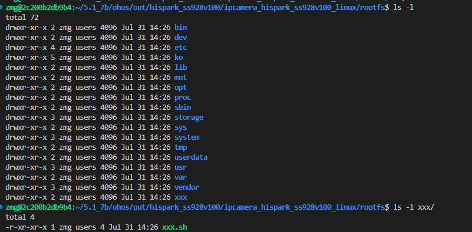

### 往rootfs现有目录下打包文件<a name="ZH-CN_TOPIC_0000002408172613"></a>

参考ohos\\vendor\\hisilicon\\hispark\_ss928v100\_linux\\init\_configs目录实现，拷贝xxx/xxx.sh文件到etc/xxx目录下。

1.  先将要拷贝的文件放到对应目录中xxx/xxx.sh，同时修改ohos\\vendor\\hisilicon\\hispark\_ss928v100\_linux\\init\_configs\\BUILD.gn。

    **图 1**  新增copy\_xxx执行拷贝目标文件至etc/xxx<a name="fig96529774011"></a>  
    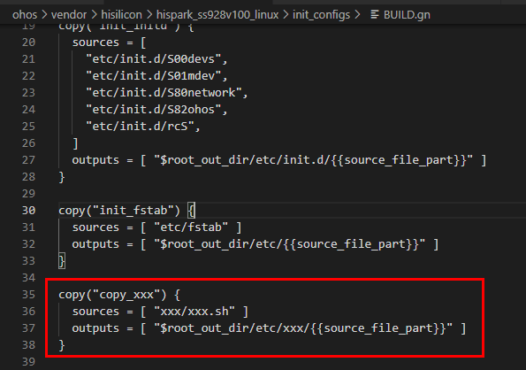

2.  再修改外面一层的ohos\\vendor\\hisilicon\\hispark\_ss928v100\_linux\\BUILD.gn，增加copy\_xxx为依赖。

    **图 2**  调用copy\_xxx修改后图<a name="fig977502404017"></a>  
    

3.  重新编译，则xxx.sh会被打包到rootfs的etc/xxx/xxx.sh。

    **图 3**  目标文件打包到/etc/xxx验证结果<a name="fig2225153414401"></a>  
    

4.  在ohos目录下执行 rm -rf out/，再重新编译./build.sh --product-name=ipcamera\_hispark\_ss928v100\_linux --ccache --no-prebuilt-sdk即可。

### 在rootfs中生成软链接<a name="ZH-CN_TOPIC_0000002374733056"></a>

如同时想生成yyy的软链接指向xxx.sh，则可修改ohos\\vendor\\hisilicon\\hispark\_ss928v100\_linux\\fs.yml，如下。

```
fs_symlink:
-
source: libc.so
link_name: ${fs_dir}/lib/ld-musl-aarch64.so.1
-
source: mksh
link_name: ${fs_dir}/bin/sh
-
source: ./
link_name: ${fs_dir}/usr/lib/a7_softfp_neon-vfpv4
-
source: mksh
link_name: ${fs_dir}/bin/shell
-
source: xxx.sh
link_name: ${fs_dir}/xxx/yyy
```

在ohos目录下执行 rm -rf out/，再重新编译./build.sh --product-name=ipcamera\_hispark\_ss928v100\_linux --ccache --no-prebuilt-sdk即可。

### 基于shell脚本整目录拷贝到rootfs中<a name="ZH-CN_TOPIC_0000002374732880"></a>

1.  在ohos\\vendor\\hisilicon\\hispark\_ss928v100\_linux目录中，新建[图1](#fig2443324185012)所示的rootfs目录。

    **图 1**  源码中新增rootfs目录<a name="fig2443324185012"></a>  
    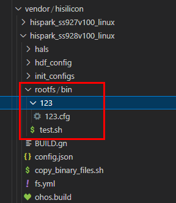

    然后给上述新增的目录授予权限，执行如下命令。

    ```
    chmod -R 777 rootfs
    ```

2.  新增ohos\\vendor\\hisilicon\\hispark\_ss928v100\_linux\\BUILD.gn文件内容如下加粗部分。

    ```
    # Copyright (C) 2020 Hisilicon (Shanghai) Technologies Co., Ltd. All rights reserved.
    group("hispark_ss928v100_linux") {
    deps = [
    "hals/utils/sys_param:vendor.para",
    "init_configs",
    "init_configs:init_fstab",
    "init_configs:init_initd",
    "init_configs:copy_xxx",
        ":copy_binary",
    ]
    }
    import("//build/lite/config/component/lite_component.gni")
    build_ext_component("copy_binary") {
      exec_path = rebase_path(".", root_build_dir)
      outdir = rebase_path("$root_out_dir")
      command = "./copy_binary_files.sh ${outdir}"
    }
    ```

    此新增脚本含义：**调用build\_ext\_component执行command对应的命令。**

3.  新增copy\_binary\_files.sh脚本到当前目录ohos\\vendor\\hisilicon\\hispark\_ss928v100\_linux\\中，内容如下。

    ```
    #! /bin/sh
    echo "--------------------- copy binary files to rootfs folder, current folder is $PWD ---------------------"
    mkdir -p $1/rootfs_binary_files
    cp -Rf ./rootfs/bin/* $1/rootfs_binary_files
    ```

    此脚本作用：将上面新增的源目录rootfs/bin/\*所有文件和目录拷贝到out/.../.../rootfs\_binary\_files（本例中：out/hispark\_ss928v100\_linux/ipcamera\_hispark\_ss928v100\_linux/rootfs\_binary\_files）目录中。备注：脚本可以自己根据业务情况调整和修改。

    授予上述copy\_binary\_files.sh脚本执行权限，执行如下命令。

    ```
    chmod 777 copy_binary_files.sh
    ```

4.  将rootfs\_binary\_files拷贝到rootfs中，还需要修改ohos\\vendor\\hisilicon\\hispark\_ss928v100\_linux\\fs.yml文件。

    ```
    -
    fs_dir_name: rootfs
    fs_dirs:
    -
    source_dir: ${root_path}/out/preloader/${product_name}/system
    target_dir: system
    -
    source_dir: rootfs_binary_files
    target_dir: bin
    -
    source_dir: bin
    target_dir: bin
    ignore_files:
    - Test.bin
    - TestSuite.bin
    - query.bin
    - cve
    - checksum
    is_strip: TRUE
    ```

    如需要拷贝到自定义目录中，可根据[在rootfs中新增目录打包文件](在rootfs中新增目录打包文件.md)修改。

5.  在ohos目录下执行 rm -rf out/，再重新编译 ./build.sh --product-name=ipcamera\_hispark\_ss928v100\_linux --ccache --no-prebuilt-sdk即可。

# 开发环境<a name="ZH-CN_TOPIC_0000002374573048"></a>

OpenHarmony 5.1社区代码压缩包下载地址。

-   网页下载地址：[https://repo.huaweicloud.com/openharmony/os/5.1.0-Release/code-v5.1.0-Release.tar.gz](https://repo.huaweicloud.com/openharmony/os/5.1.0-Release/code-v5.1.0-Release.tar.gz)
-   linux服务器下载的命令：

    ```
    curl -# https://repo.huaweicloud.com/openharmony/os/5.1.0-Release/code-v5.1.0-Release.tar.gz -O code-v5.1.0-Release.tar.gz -k
    ```


## 搭建OpenHarmony开发环境<a name="ZH-CN_TOPIC_0000002408172585"></a>


### 搭建OpenHarmony Small型系统编译环境<a name="ZH-CN_TOPIC_0000002465545977"></a>

**图 1**  OpenHarmony Small型系统开发环境<a name="fig1027713362117"></a>  
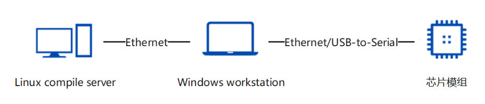

Ubuntu配置OpenHarmony开发环境，请参考OpenHarmony社区文档。

-   OpenHarmony官方社区参考地址

    https://docs.openharmony.cn/pages/v5.1/zh-cn/OpenHarmony-Overview\_zh.md

-   **OpenHarmony编译构建指导**

    https://docs.openharmony.cn/pages/v5.1/zh-cn/device-dev/subsystems/subsys-build-all.md

编译环境目前主要支持Ubuntu18.04和Ubuntu20.04（Ubuntu22.04暂不支持）。推荐使用“apt-get和pip3 install命令安装”，如[图2](#fig1466793985111)所示。

**图 2**  apt-get和pip3 install命令安装<a name="fig1466793985111"></a>  


如果出现[图3](#fig1560035719163)问题"Your system shell isn't bash..."，请执行如下命令。

```
ln -s /bin/bash /bin/sh
```

**图 3**  构建镜像不支持dash命令报错<a name="fig1560035719163"></a>  
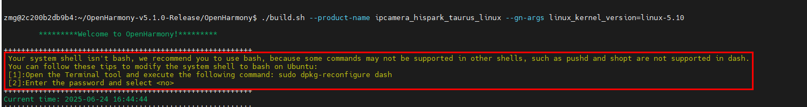

### 搭建代码开发环境<a name="ZH-CN_TOPIC_0000002482342753"></a>

通过以下步骤配置Hi3403V100和SS927V100 OpenHarmony版本的编译目录。

1.  下载HiSpark社区Pegasus仓代码，由于ss928v100\_clang和ss928v100\_gcc为Pegasus的子仓，而OpenHarmony使用LLVM-Clang工具链的SDK，估此步骤下载得到Pegasus和ss928v100\_clang代码目录。

    ```
    git clone https://gitee.com/HiSpark/pegasus.git
    cd pegasus
    git submodule init
    git submodule update platform/ss928v100_clang
    ```

2.  从HiSpark社区下载Hi3403V100和SS927V100的移植适配OpenHarmony5.1补丁，路径为Pegasus仓下：os/OpenHarmony得到middleware.、patch\_build.sh、patch目录文件。
3.  提前下载好开源鸿蒙的OpenHarmony-v5.1.0-release代码压缩包文件code-v5.1.0-Release.tar.gz文件。可按如下2种方法配置，任选其一即可得到ohos目录以及middleware目录。
    -   此方法用于指定脚本读取/path/to/code-v5.1.0-Release.tar.gz的解压路径。执行./patch\_build.sh --path=/path/to
    -   将code-v5.1.0-Release.tar.gz文件拷贝至./patch\_build.sh同级目录，执行./patch\_build.sh命令；执行完成后会删除当前目录下的code-v5.1.0-Release.tar.gz

4.  从HiSpark社区下载clang的sdk包，路径为Pegasus仓下的子仓：platform/ss928v100\_clang。
5.  将ss928v100\_clang目录改名为sdk，将sdk放置在和ohos同级目录
    -   编译uboot/kernel或驱动ko会依赖部分开源软件，需要从各个开源软件的官方源提供的路径进行下载，需要根据指导从各个软件的官方链接下手动下载，具体如下：
        -   linux：目录为sdk/open\_source/linux，需要按照sdk/open\_source/linux/readme.txt指导从https://www.kernel.org/pub/linux/kernel/v6.x/linux-6.6.86.tar.gz  下载，将源码压缩包放置于sdk/open\_source/linux目录下。
        -   mbedtls：目录为sdk/open\_source/mbedtls，需要按照sdk/open\_source/mbedtls/readme.txt指导从https://github.com/ARMmbed/mbedtls/archive/refs/tags/v2.16.10.tar.gz  下载，将源码压缩包放置于sdk/open\_source/mbedtls目录下。
        -   trusted-firmware-a：目录为sdk/open\_source/trusted-firmware-a，需要按照sdk/open\_source/trusted-firmware-a/readme.txt指导从https://github.com/ARM-software/arm-trusted-firmware/archive/v2.2.tar.gz  下载，将源码压缩包放置于sdk/open\_source/trusted-firmware-a目录下。
        -   u-boot：目录为sdk/open\_source/u-boot，需要按照sdk/open\_source/u-boot/readme.txt指导从https://ftp.denx.de/pub/u-boot/u-boot-2020.01.tar.bz2  下载，将源码压缩包放置于sdk/open\_source/u-boot目录下。

通过以上步骤操作，得到Hi3403V100和SS927V100 OpenHarmony版本文件目录如下。

```
├── ohos
└── sdk
└── middleware
```

-   ohos目录是OpenHarmony代码根目录。
-   sdk目录是Hi3403V100的SDK源码和二进制库。请从HiSpark社区下载，并将解压出来的目录名称修改为sdk，ohos代码中SDK目录（device/soc/hisilicon/ss928v100/sdk\_linux）没有源码，只包含SDK的修改补丁，并创建了软连接指向最外层的sdk目录。

> **说明：** 
>由于SS927V100和Hi3403V100相似，因此SS927V100的SDK能复用Hi3403V100的SDK源码，共用device/soc/hisilicon/ss928v100/sdk\_linux目录。

### 配置SDK编译工具链<a name="ZH-CN_TOPIC_0000002432267298"></a>

SDK包中提供内核驱动源码和Sample源码，可以通过源码进行编译。在编译前，需要配置编译工具链，将编译工具链路径加入到环境变量中。

-   将Clang编译工具链路径加到环境变量中，执行：export PATH=/path/to/toolchains:$PATH

    例如，Clang所在的路径为：/path/to/pegasus/os/OpenHarmony/ohos/prebuilts/clang/ohos/linux-x86\_64/llvm/bin

    ```
    export PATH=/path/to/pegasus/os/OpenHarmony/ohos/prebuilts/clang/ohos/linux-x86_64/llvm/bin:$PATH
    ```

    检查Clang配置环境变量是否生效。

    ```
    command -v clang
    ```

-   将SYSROOT\_PATH导入环境变量，此处配置仅用于编译SDK sample，配置方法如下。

1.  配置之前请先执行ohos编译，编译生成依赖的sysroot。

    > **说明：** 
    >使用LLVM-Clang工具链来编译SDK sample时，会依赖ohos编译后的产物：out/hispark\_ss928v100/ipcamera\_hispark\_ss928v100\_linux/sysroot，因此需要提前进行ohos编译。

2.  假设工具链的sysroot路径为/path/to/pegasus/os/OpenHarmony/ohos/out/hispark\_ss928v100/ipcamera\_hispark\_ss928v100\_linux/sysroot，将工具链的sysroot设置到环境变量SYSROOT\_PATH。

    ```
    export SYSROOT_PATH=/path/to/pegasus/os/OpenHarmony/ohos/out/hispark_ss928v100/ipcamera_hispark_ss928v100_linux/sysroot
    ```

3.  检查SYSROOT\_PATH配置是否生效。

    ```
    echo $SYSROOT_PATH
    ```

## 版本编译<a name="ZH-CN_TOPIC_0000002432107446"></a>


### ohos编译<a name="ZH-CN_TOPIC_0000002465705861"></a>

基于Hi3403V100和SS927V100的 OpenHarmony版本编译方式遵循社区编译方式，以Hi3403V100为例。

1.  进入Hi3403V100 OpenHarmony代码根目录ohos（如果是其他解决方案目录层级，请参考解决方案编译指导）。

1.  执行如下编译命令，成功之后显示=====build  successful=====

    ```
    ./build.sh --product-name=ipcamera_hispark_ss928v100_linux --ccache --no-prebuilt-sdk
    ```

    > **说明：** 
    >若要编译SS927V100，执行如下编译命令
    >```
    >./build.sh --product-name=ipcamera_hispark_ss927v100_linux --ccache --no-prebuilt-sdk
    >```

> **说明：** 
>ohos版本需重编时，可以先rm -rf ./out，再重新执行./build.sh --product-name=ipcamera\_hispark\_ss928v100\_linux --ccache --no-prebuilt-sdk编译指令即可。

### uboot编译<a name="ZH-CN_TOPIC_0000002465545981"></a>

编译uboot需要进入SDK的osdrv目录，执行如下步骤：

```
cd sdk/osdrv/
make BOOT_MEDIA=emmc gslboot_build -j 20
```

编译成功后，生成的uboot文件位于sdk/osdrv/pub/ss928v100\_emmc\_image\_musl目录下。

### SDK sample编译<a name="ZH-CN_TOPIC_0000002432267302"></a>

进入sdk/smp/a55\_linux/mpp/sample，执行：make

编译完成后，各sample可执行文件位于sdk/smp/a55\_linux/mpp/sample对应的目录下。

> **说明：** 
>sample中使用了SDK\_init和SDK\_exit来进行MPP各个模块的初始化和退出。hnr需要使用pqp模块，SDK\_init中默认未初始化pqp模块，因此需要单独对hnr的sample进行重编，具体步骤为：
>1. 将sdk/smp/a55\_linux/mpp/sample/common/sdk\_module\_init.h头文件中的宏定义INIT\_PQP修改为1；
>2. 进入hnr目录重编，命令如下。
>```
>cd sdk/smp/a55_linux/mpp/sample/hnr
>make clean
>make
>```

> **注意：** 
>在鸿蒙系统下运行SDK sample前需要关闭媒体和图形进程，具体操作方法为：
>方法一：
>1. 在vendor/hisilicon/hispark\_ss928v100\_linux/init\_configs/init\_linux\_openharmony.cfg文件中删除
>"start media\_server",
>"start wms\_server",
>2.参考[ohos编译](ohos编译.md)重新编译鸿蒙
>3.完成单板烧写镜像后，即可运行SDK sample
>方法二：
>1. 在板端文件/etc/init.cfg中删除如下配置
>"start media\_server",
>"start wms\_server",
>2. 完成单板上电重启后，即可运行SDK sample

## 版本烧写<a name="ZH-CN_TOPIC_0000002408332445"></a>

Hi3403V100和SS927V100 OpenHarmony版本，编译好的镜像文件在如下目录。

```
out/hispark_ss928v100/ipcamera_hispark_ss928v100_linux
```

1.  ohos编译出的out/hispark\_ss928v100/ipcamera\_hispark\_ss928v100\_linux目录下默认是EMMC。
2.  参考[uboot编译](uboot编译.md)生成boot\_image.bin。
3.  通过ToolPlatform加载emmc\_burn\_table.xml烧写，uboot选择sdk/osdrv/pub/ss928v100\_emmc\_image\_musl/boot\_image.bin。ToolPlatform截图信息如[图1](#fig598741418184)所示。

    **图 1**  EMMC版本烧写截图<a name="fig598741418184"></a>  
    
    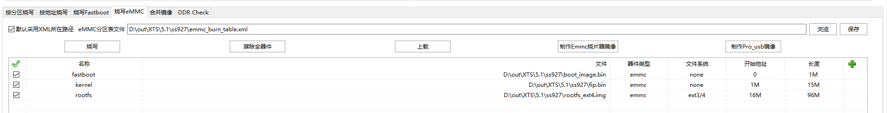

4.  烧写完成后，按照实际介质大小和分区来配置bootargs启动参数；提供内核15M的bootargs如下，供客户参考。

    ```
    setenv bootargs 'mem=512M console=ttyAMA0,115200 clk_ignore_unused rw rootwait root=/dev/mmcblk0p3 rootfstype=ext4 blkdevparts=mmcblk0:1M(uboot.bin),15M(kernel),96M(rootfs.ext4),-'
    setenv bootcmd  'mmc read 0 0x50000000 0x800 0x7800; bootm 50000000'
    sa;
    re
    ```

    > **说明：** 
    >mmc读取数值的计算方法：使用程序员计算器，计算过程选择DEC十进制转换、最后结果转换成HEX进制。举例说明0x6800由来，内核镜像size大小15M，mmc每512字节为一个单位，15\*1024\*1024/512=0x7800 \(计算结果转换成HEX进制\)。

## 鸿蒙内核选项修改<a name="ZH-CN_TOPIC_0000002374573204"></a>

需要修改鸿蒙Linux内核选项时，以打开“RAM Disk”内核选项为例，可参考如下步骤操作。

1.  先完成ohos目录的编译。
2.  进入ohos/out/hispark\_ss928v100/ipcamera\_hispark\_ss928v100\_linux/kernel/linux-6.6目录。
3.  输入命令。

    ```
    #CROSS_COMPILE_DIR为kernel/linux/build/kernel.mk中配置的交叉工具链的路径，参考当前路径如：ohos/prebuilts/gcc/linux-x86/aarch64/gcc-linaro-7.5.0-2019.12-x86_64_aarch64-linux-gnu/bin/aarch64-linux-gnu-
    make ARCH=arm64 CROSS_COMPILE=${CROSS_COMPILE_DIR} menuconfig
    ```

4.  选择 “ General setup“（按Enter键）进入子页面。

    **图 1**  General setup<a name="fig16202103415304"></a>  
    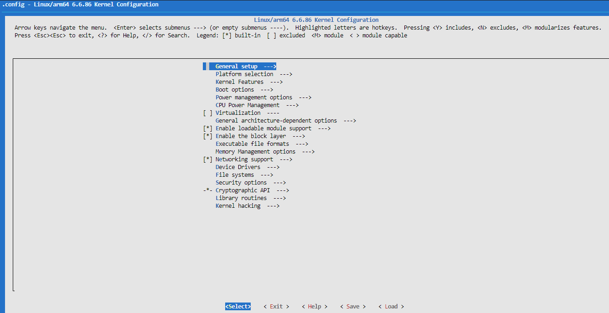

5.  在子页面中选择“Initial RAM filesystem and RAM disk \(initramfs/initrd\) support”\(按空格键进行选择，按下Save键保存）。

    **图 2**  配置Initial RAM filesystem and RAM disk \(initramfs/initrd\) support<a name="fig18004118318"></a>  
    -support.png "配置Initial-RAM-filesystem-and-RAM-disk-(initramfs-initrd)-support")

    按Exit键返回到“General setup”页面，选择Device Drivers-\> Block devices-\>RAM block device support，如[图3](#fig8963165320518)所示。

    **图 3**  Block devices页面<a name="fig8963165320518"></a>  
    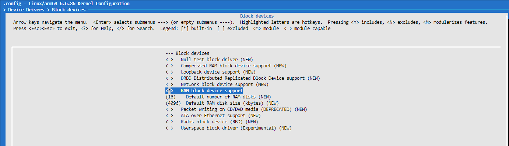

1.  确认保存配置后退出即可。

    **图 4**  退出图<a name="fig895461173415"></a>  
    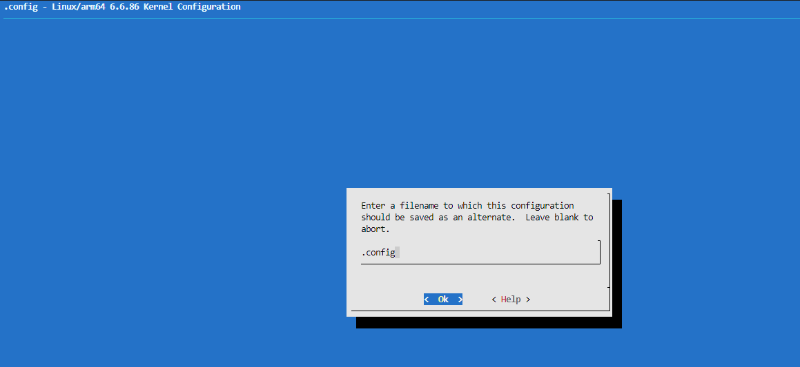

2.  在当前目录下将文件拷贝到ohos/kernel/linux/config/linux-6.6/arch/arm64/configs/目录，命令参考：cp .config \~/\{XX\}/ohos/kernel/linux/config/linux-6.6/arch/arm64/configs/。
3.  进入到ohos/kernel/linux/config/linux-6.6/arch/arm64/configs/目录，将原有的hispark\_ss928v100\_small\_defconfig 删除，将.config拷贝成hispark\_ss928v100\_small\_defconfig该文件。

1.  回到ohos目录下面，将out目录删除，再次重新编译ohos。

## XTS测试说明<a name="ZH-CN_TOPIC_0000002374732940"></a>

-   XTS测试套编译需要指定参数--gn-args build\_xts=true，参考如下示例。

    ```
    ./build.sh --product-name=ipcamera_hispark_ss928v100_linux --gn-args build_xts=true --ccache --no-prebuilt-sdk
    ```

    编译结束之后会在out/hispark\_ss928v100/ipcamera\_hispark\_ss928v100\_linux/目录下生成suites文件夹，里面的acts文件即为测试套。

-   XTS环境搭建与测试请参考OpenHarmony社区兼容性测评服务指导：

    [https://www.openharmony.cn/certification/document/guid](https://www.openharmony.cn/certification/document/guid)

    请参考链接中“兼容性测试执行环境搭建”章节，配置Windows环境，安装必要的软件。Hi3403V100和SS927V100是小型系统，请参考“小型系统应用兼容性测试指导”章节完成环境搭建和配置。

    XTS测试需要的资源文件，请下载社区OpenHarmony 5.1.0 Release 小型系统ACTS资源文件，替换acts\\resource目录下的文件。

    下载地址：[https://www.openharmony.cn/certification/document/xts](https://www.openharmony.cn/certification/document/xts)

    **图 1**  小型系统资源文件<a name="fig18181965513"></a>  
    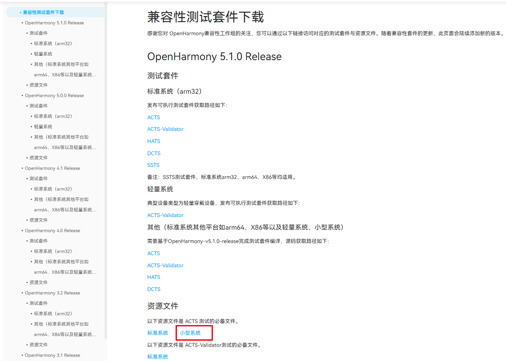

    > **须知：** 
    >OH5.0及以前社区下载的resource\\tools\\query.bin是32位的，无法在64位的设备上使用。客户需要使用自行编译生成的query.bin文件（out/hispark\_ss928v100/ipcamera\_hispark\_ss928v100\_linux/suites/acts/resource/tools/query.bin）。
    >OH5.1社区下载resource没有tools目录。


### XTS测试套补充说明<a name="ZH-CN_TOPIC_0000002374573168"></a>

带屏幕和应用的产品，需要测试ActsAbilityMgrTest和ActsBundleMgrTest。若客户产品需过鸿蒙XTS认证A标，需要测试此两项。

1.  请ohos/test/xts/acts/build\_lite/BUILD.gn文件第106行和第107行的代码（删除前面的“\#”号）。
2.  重新编译工程后，在acts/testcases/ability目录下生成测试套ActsAbilityMgrTest.bin，在acts/testcases/appexecfwk目录下生成测试套ActsBundleMgrTest.bin。

### XTS测试命令说明<a name="ZH-CN_TOPIC_0000002374573068"></a>

-   全量执行命令

    ```
    run acts
    ```

-   单模块执行命令

    ```
    run -l ActsSamgrTest 
    ```

-   多模块执行命令

    ```
    run -l ActsSamgrTest;ActsPMSTest;ActsBootstrapTest;ActsParameterTest
    ```

### XTS申请测评注意事项<a name="ZH-CN_TOPIC_0000002374733068"></a>

1.  请参考《OpenHarmony设备兼容性规范x.x自检表\_小型系统 .xlsx》 sheet1表格的规范要求修改配置文件vendor/hisilicon/hispark\_ss928v100\_linux/hals/utils/sys\_param/vendor.para，自行设置产品信息。

    OpenHarmony设备兼容性规范自检表下载地址：https://www.openharmony.cn/certification/document/pcs/ 

    **图 1**  小型系统 PCS5.x 自检表<a name="fig1252105314519"></a>  
    

2.  填写申请测评电子流的时候需要上传PCID.sc文件，请从out目录下获取（out/hispark\_ss928v100/ipcamera\_hispark\_ss928v100\_linux/PCID.sc）。
3.  送测时需要执行全量XTS，acts\\reports目录下生成的测试报告摘要（summary\_report.html）里面必须包含产品信息。

    **图 2**  XTS测试报告描述信息<a name="fig36354481512"></a>  
    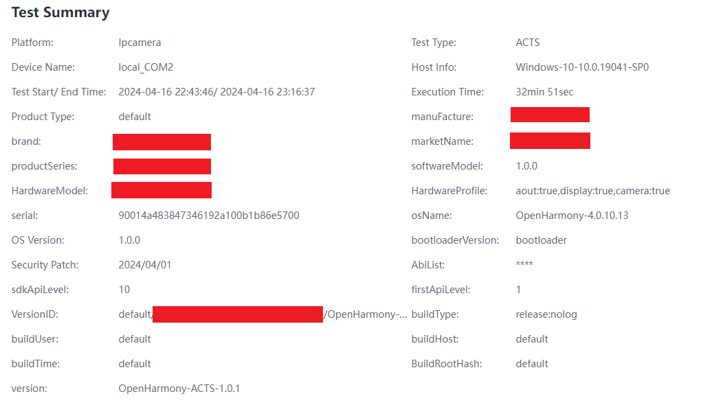

4.  请按照如下目录准备测评材料。注意提交测评的外观图片要和送测的实物保持一致；且芯片丝印要带有芯片对外传播名称。

    **图 3**  XTS认证送检材料参考目录<a name="fig1406506511"></a>  
    

### 硬件单板烧写<a name="ZH-CN_TOPIC_0000002374732952"></a>

Hi3403V100和SS927V100硬件单板烧写KEY0步骤。

1.  进入 U-Boot 命令行，依次执行如下命令

    ```
    mw 0x10122008 0x6
    # 以下四行为设置需要烧写的 key，
    # 以 key=128'h00010203_04050607_08090a0b_0c0d0e0f 为例
    mw 0x1012200C 0x0c0d0e0f
    mw 0x10122010 0x08090a0b
    mw 0x10122014 0x04050607
    mw 0x10122018 0x00010203
    mw 0x10123000 0x2
    mw 0x10122004 0x1acce551
    ```

    > **警告：** 
    >上述烧写命令中 key 的烧写只是一个参数，实际烧写请使用随机数，不可使用示例中的 key。

2.  对单板上下电重启，烧写的key0生效（reboot软重启无法生效，需上下电才能生效），再跑XTS用例可看出XTS认证的huks用例都PASS。

## 配置telnetd无密码连接使用<a name="ZH-CN_TOPIC_0000002378611298"></a>

OpenHarmony5.1 toybox的telnetd连接默认需要密码，按如下两种方法配置可正常使用无密码连接。

-   进入板端执行如下命令可直接修改/etc/passwd文件

    ```
    sed -i "s#root:x:0:0:::/bin/false#root::0:0::/root/:/bin/sh#g" /etc/passwd
    ```

-   通过本地PC上挂载NFS服务器，把板端/etc/passwd拷贝到本地PC上完成修改

1.  修改板端passwd，需先mount本地服务器，把板端/etc/passwd拷贝到本地服务器，对本地passwd文件按[图2](#fig377520345458)方式修改，再拷贝回去替换板端/etc/passwd文件。

    **图 1**  修改前:（root:x:0:0:::/bin/false）<a name="fig13430148164010"></a>  
    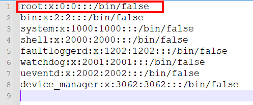

    **图 2**  修改后:（root::0:0::/root:/bin/sh）<a name="fig377520345458"></a>  
    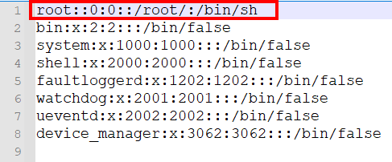

2.  修改后使用telnet连接无需密码。

## 媒体功能使用指导<a name="ZH-CN_TOPIC_0000002408172697"></a>

1.  在vendor/hisilicon/hispark\_ss928v100\_linux/config.json文件中，新增子系统。

    ```
          {
            "subsystem": "arkui",
            "components": [
              { "component": "ui_lite", "features":[ "ui_lite_enable_graphic_font_config = true" ] }
            ]
          },
          {
            "subsystem": "graphic",
            "components": [
              { "component": "graphic_utils_lite", "features":[] },
              { "component": "surface_lite", "features":[] }
            ]
          },
          {
            "subsystem": "window",
            "components": [
              { "component": "window_manager_lite", "features":[] }
            ]
          },
          {
            "subsystem": "multimedia",
            "components": [
              { "component": "camera_lite", "features":[] },
              { "component": "media_lite", "features":[] },
              { "component": "audio_lite", "features":[] },
              { "component": "media_service", "features":[] }
            ]
          },
    ```

2.  在vendor/hisilicon/hispark\_ss928v100\_linux/init\_configs/init\_linux\_openharmony.cfg文件中，新增代码，启动媒体服务如下：

    ```
                    "start media_server",
    ```

    **图 1**  新增启动服务<a name="fig18331161515913"></a>  
    

3.  在编译版本之前，需要重新编译libsns\_hy\_s0603.so，因为此库动态加载的时候，会报链接的错误，所以需要修改编译脚本进行重新编译，编译脚本路径如下：

    \\sdk\\smp\\a55\_linux\\mpp\\cbb\\isp\\user\\sensor\\ss928v100\\hy\_s0603\\Makefile

    修改方式如[图2](#fig13477396910)所示。

    **图 2**  修改方式<a name="fig13477396910"></a>  
    

    需要新增的链接依赖项：-lot\_isp -lsecurec -lss\_ae -lss\_isp -lss\_awb -L$\(REL\_LIB\)

    编译完成后libsns\_hy\_s0603.so 会生成在\\sdk\\smp\\a55\_linux\\mpp\\out\\lib目录下面，**还原所有修改的链接依赖项**，然后可直接进行ohos的版本编译。

    **另一种解决方式：**

    如果编译环境上有patchelf工具，可以通过如下命令为libsns\_hy\_s0603.so添加链接依赖，而不用重新编译：

    patchelf --add-needed libss\_awb.so libsns\_hy\_s0603.so

    patchelf --add-needed libss\_ae.so libsns\_hy\_s0603.so

    patchelf --add-needed libot\_mpi\_isp.so libsns\_hy\_s0603.so

    patchelf --add-needed libsecurec.so libsns\_hy\_s0603.so

    通过如下命令验证是否成功添加链接依赖：

    readelf -d libsns\_hy\_s0603.so

    出现如图显示即OK：

    

4.  如果有HDMI输出需要的，需要手动打开图形层服务，具体操作如下：

    单板执行命令：./bin/wms\_server & 打开图形层服务，此命令只需要执行一次，重复执行会导致报错。

    > **须知：** 
    >媒体的所有sample都需要按照指定的命令进行退出操作，默认是输入q退出。


### 预览功能<a name="ZH-CN_TOPIC_0000002374573208"></a>

1.  单板上下电，执行/tmp/camera\_sample。

    **图 1**  串口显示信息<a name="fig14211281966"></a>  
    

2.  按提示输入3。

    **图 2**  启动预览服务<a name="fig10116238963"></a>  
    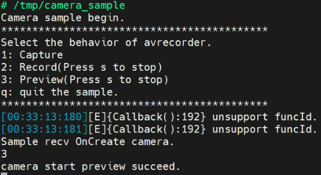

3.  预期结果：显示设备上显示Sensor采集的画面。

### 录制功能<a name="ZH-CN_TOPIC_0000002374573072"></a>

1.  单板上下电，执行/tmp/camera\_sample。

    > **须知：** 
    >录制文件默认保存在单板/userdata/norm/文件夹。如若需要修改录制文件保存的路径，修改applications/sample/camera/media/camera\_sample.cpp 218行代码，对应下图中的DEFAULT\_SAVE\_PATH变量。

    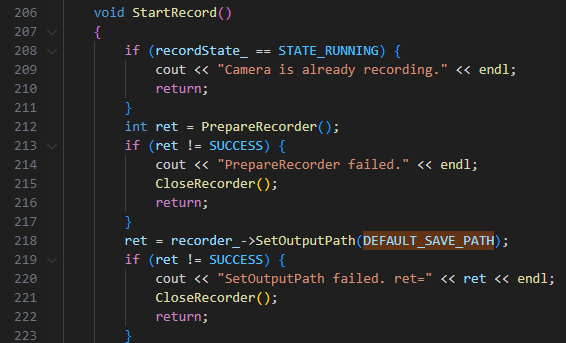

2.  按提示输入2。

    **图 1**  启动录制服务<a name="fig15386293427"></a>  
    
    

3.  来回移动下sensor的位置，确保录制的图像是动态的，输入s，回车，再输入q，回车，结束录制。

    **图 2**  结束录制<a name="fig11720358124218"></a>  
    
    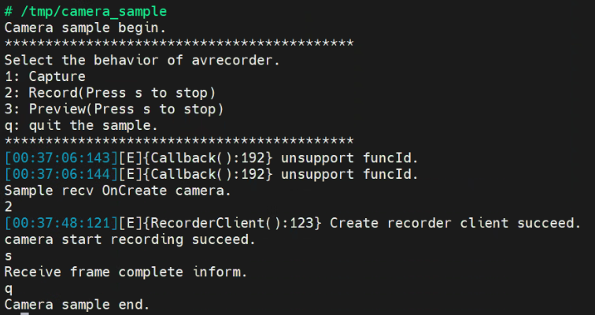

4.  录制的视频保存在如下位置：

    **图 3**  串口显示信息<a name="fig1959145145414"></a>  
    
    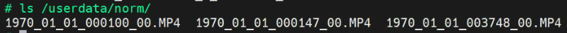

    可以用后续的player\_sample播放。

    > **说明：** 
    >手动修改系统时间方式，使用date命令：date -u "YYYY-MM-DD HH:mm:ss"，例如：date -u "2024-04-10 12:00:00"。具体业务场景建议设备与服务端进行时间校准。

### 播放功能<a name="ZH-CN_TOPIC_0000002374573172"></a>

1.  使用播放Demo，播放视频，命令如下：

    ```
    /tmp/player_sample /tmp/1970_01_02_202516_00.MP4
    如果播放的是aac等码流，命令如下：
    /tmp/player_sample /tmp/audio_1970-01-01-00-03-36.aac 2
    ```

2.  预期结果：显示器画面正常播放录制的视频，单板插上耳机，有正常声音输出

    **图 1**  启动播放功能<a name="fig824648174310"></a>  
    

### 采集H264码流功能<a name="ZH-CN_TOPIC_0000002374573076"></a>

> **须知：** 
>媒体子系统提供的Demo仅用于OpenHarmony基础功能测试，商用业务场景需要基于OpenHarmony API自行开发。

### sensor切换指导<a name="ZH-CN_TOPIC_0000002408332573"></a>

默认sensor是hy\_s0603，时序是1080P 60帧，VI采集时是30帧，最终显示的输出是60帧。

同时支持hy\_s0603，时序是4K 30帧，VI采集时是30帧，最终显示的输出也是30帧。

若需要从1080P切换为4K，步骤如下：

1.  在foundation/multimedia/media\_lite/services目录新增cameradev\_hy\_s0603\_4k30\_928.ini，并在该文件中适配4k对应参数。
2.  在foundation/multimedia/media\_lite/services/BUILD.gn文件中，将cameradev\_hy\_s0603\_928.ini替换为cameradev\_hy\_s0603\_4k30\_928.ini。

    **图 1**  修改sensor配置文件<a name="fig83672365584"></a>  
    

3.  重新编译，烧写。

### 音频采集功能<a name="ZH-CN_TOPIC_0000002408172589"></a>

1.  单板上下电，如果要测试talkvqe的功能，需要先执行export LD\_PRELOAD=/usr/lib/libsecurec.so:/usr/lib/libvqe\_hpf.so

    预先把需要的so路径加载进来。

2.  执行/tmp/audio\_capature\_sample。

    **图 1**  配置音频采集参数<a name="fig115573685212"></a>  
    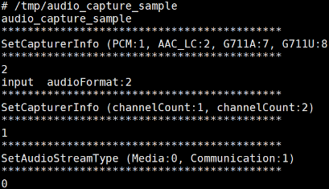

3.  按照提示输入参数，当前支持PCM、AAC\_LC、G711A、G711U格式。
4.  输入s或S，开始录制，输入p或P，停止录制，输入q或Q，退出录制。

    **图 2**  启动音频采集功能<a name="fig1449912474490"></a>  
    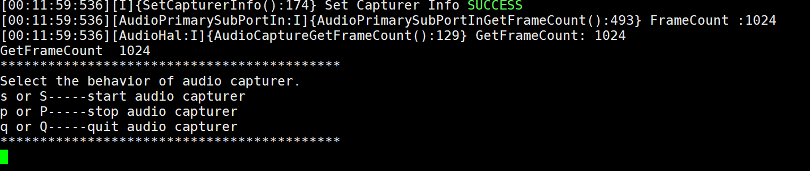

5.  录制成功的文件保存在/userdata目录，可以使用player\_sample播放。

    **图 3**  音频采集文件<a name="fig1977325816493"></a>  
    

## 图形示例应用使用指导<a name="ZH-CN_TOPIC_0000002408172677"></a>

图形子系统提供两个示例应用。包含控件示例应用，和窗口示例应用。控件示例应用主要覆盖图形子系统的控件能力，例如Button、Label、ScrollView等。窗口示例应用主要覆盖窗口管理能力，包含窗口的创建、删除、以及位置设置。


### 预置条件<a name="ZH-CN_TOPIC_0000002374573024"></a>

打开图形子系统，步骤如下：

1.  在vendor/hisilicon/hispark\_ss928v100\_linux/config.json文件，"subsystems"标签中添加如下代码。

    ```
          {
               "subsystem": "arkui",
               "components": [
                  { "component": "ui_lite", "features":[ "ui_lite_enable_graphic_font_config = true" ] }
              ]
          },
          {
               "subsystem": "graphic",
               "components": [
                  { "component": "graphic_utils_lite", "features":[] },
                  { "component": "surface_lite", "features":[] }
               ]
          },
          {
               "subsystem": "window",
               "components": [
                  { "component": "window_manager_lite", "features":[] }
            ]
          },
    ```

1.  重新编译烧写。


#### 资源路径<a name="ZH-CN_TOPIC_0000002374573152"></a>

[表1](#table386mcpsimp)中描述了示例应用依赖的资源文件，以及资源资源文件的目录\(路径相对于OpenHarmony根目录\)

**表 1**  资源路径说明

<a name="table386mcpsimp"></a>
<table><thead align="left"><tr id="row391mcpsimp"><th class="cellrowborder" valign="top" width="26.150000000000002%" id="mcps1.2.3.1.1"><p id="p393mcpsimp"><a name="p393mcpsimp"></a><a name="p393mcpsimp"></a>文件名</p>
</th>
<th class="cellrowborder" valign="top" width="73.85000000000001%" id="mcps1.2.3.1.2"><p id="p395mcpsimp"><a name="p395mcpsimp"></a><a name="p395mcpsimp"></a>文件路径</p>
</th>
</tr>
</thead>
<tbody><tr id="row397mcpsimp"><td class="cellrowborder" valign="top" width="26.150000000000002%" headers="mcps1.2.3.1.1 "><p id="p399mcpsimp"><a name="p399mcpsimp"></a><a name="p399mcpsimp"></a>sample_ui（控件示例应用）</p>
</td>
<td class="cellrowborder" valign="top" width="73.85000000000001%" headers="mcps1.2.3.1.2 "><p id="p401mcpsimp"><a name="p401mcpsimp"></a><a name="p401mcpsimp"></a>out\hispark_ss928v100\ipcamera_hispark_ss928v100_linux\dev_tools\bin\</p>
</td>
</tr>
<tr id="row402mcpsimp"><td class="cellrowborder" valign="top" width="26.150000000000002%" headers="mcps1.2.3.1.1 "><p id="p404mcpsimp"><a name="p404mcpsimp"></a><a name="p404mcpsimp"></a>sample_window（窗口示例应用）</p>
</td>
<td class="cellrowborder" valign="top" width="73.85000000000001%" headers="mcps1.2.3.1.2 "><p id="p406mcpsimp"><a name="p406mcpsimp"></a><a name="p406mcpsimp"></a>out\hispark_ss928v100\ipcamera_hispark_ss928v100_linux\dev_tools\bin\</p>
</td>
</tr>
<tr id="row412mcpsimp"><td class="cellrowborder" valign="top" width="26.150000000000002%" headers="mcps1.2.3.1.1 "><p id="p414mcpsimp"><a name="p414mcpsimp"></a><a name="p414mcpsimp"></a>字体资源</p>
</td>
<td class="cellrowborder" valign="top" width="73.85000000000001%" headers="mcps1.2.3.1.2 "><p id="p416mcpsimp"><a name="p416mcpsimp"></a><a name="p416mcpsimp"></a>out\hispark_ss928v100\ipcamera_hispark_ss928v100_linux\data</p>
</td>
</tr>
<tr id="row417mcpsimp"><td class="cellrowborder" valign="top" width="26.150000000000002%" headers="mcps1.2.3.1.1 "><p id="p419mcpsimp"><a name="p419mcpsimp"></a><a name="p419mcpsimp"></a>图片资源</p>
</td>
<td class="cellrowborder" valign="top" width="73.85000000000001%" headers="mcps1.2.3.1.2 "><p id="p421mcpsimp"><a name="p421mcpsimp"></a><a name="p421mcpsimp"></a>foundation\arkui\ui_lite\tools\qt\simulator\config\images</p>
<p id="p422mcpsimp"><a name="p422mcpsimp"></a><a name="p422mcpsimp"></a>foundation\arkui\ui_lite\ tools\qt\simulator\config\faces</p>
<p id="p423mcpsimp"><a name="p423mcpsimp"></a><a name="p423mcpsimp"></a>foundation\arkui\ui_lite\ tools\qt\simulator\default_resource</p>
</td>
</tr>
</tbody>
</table>

#### 设备端需具备条件<a name="ZH-CN_TOPIC_0000002374572984"></a>

1.  连接HDMI显示设备，如显示器、电视。
2.  确认板端能访问到测试需要文件。例如，通过tftp进行网络的挂载，或者使用SD卡。
3.  确认设备驱动gfbg.ko、ot\_tde.ko已加载（可在板端使用lsmod命令查看）。
4.  \(如需支持鼠标\)执行“echo host\>/proc/10320000.usb30drd/mode”。
5.  执行"wms\_server &"，确认wms\_server进程正常启动（在板端top命令查看当前运行进程是否存在该进程，且显示器点亮为蓝屏），移动鼠标，如果无鼠标，执行“cat /dev/input/event0”。

### 实例应用说明<a name="ZH-CN_TOPIC_0000002408332477"></a>


#### sample\_window<a name="ZH-CN_TOPIC_0000002408332429"></a>

验证步骤

1.  配置网络；

    ```
    ifconfig eth0 **.***.**.**
    ```

2.  挂载可执行文件；

    ```
    mount -t nfs -o addr=**.***.**.**,nolock,tcp **.***.**.**:$ sample_window所在路径 /mnt
    ```

3.  执行sample\_window。

    ```
    ./sample_window
    ```

#### sample\_ui<a name="ZH-CN_TOPIC_0000002374573100"></a>

1.  配置网络

    ```
    ifconfig eth0 **.***.**.**
    ```

2.  挂载资源

    ```
    mount -t nfs -o addr=**.***.**.**,nolock,tcp **.***.**.**:$资源所在服务器路径 /user/data
    ```

    [表1](#table440mcpsimp)中描述了对应资源文件的板端路径，需要按该表把资源复制到对应板端路径

    **表 1**  资源说明表

    <a name="table440mcpsimp"></a>
    <table><thead align="left"><tr id="row445mcpsimp"><th class="cellrowborder" valign="top" width="45.050000000000004%" id="mcps1.2.3.1.1"><p id="p447mcpsimp"><a name="p447mcpsimp"></a><a name="p447mcpsimp"></a>文件名</p>
    </th>
    <th class="cellrowborder" valign="top" width="54.949999999999996%" id="mcps1.2.3.1.2"><p id="p449mcpsimp"><a name="p449mcpsimp"></a><a name="p449mcpsimp"></a>板端路径</p>
    </th>
    </tr>
    </thead>
    <tbody><tr id="row450mcpsimp"><td class="cellrowborder" valign="top" width="45.050000000000004%" headers="mcps1.2.3.1.1 "><p id="p452mcpsimp"><a name="p452mcpsimp"></a><a name="p452mcpsimp"></a>line_cj.brk</p>
    </td>
    <td class="cellrowborder" valign="top" width="54.949999999999996%" headers="mcps1.2.3.1.2 "><p id="p454mcpsimp"><a name="p454mcpsimp"></a><a name="p454mcpsimp"></a>/user/data</p>
    </td>
    </tr>
    <tr id="row455mcpsimp"><td class="cellrowborder" valign="top" width="45.050000000000004%" headers="mcps1.2.3.1.1 "><p id="p457mcpsimp"><a name="p457mcpsimp"></a><a name="p457mcpsimp"></a>SourceHanSansSC-Regular.otf</p>
    </td>
    <td class="cellrowborder" valign="top" width="54.949999999999996%" headers="mcps1.2.3.1.2 "><p id="p459mcpsimp"><a name="p459mcpsimp"></a><a name="p459mcpsimp"></a>/user/data</p>
    </td>
    </tr>
    <tr id="row460mcpsimp"><td class="cellrowborder" valign="top" width="45.050000000000004%" headers="mcps1.2.3.1.1 "><p id="p462mcpsimp"><a name="p462mcpsimp"></a><a name="p462mcpsimp"></a>图片资源</p>
    </td>
    <td class="cellrowborder" valign="top" width="54.949999999999996%" headers="mcps1.2.3.1.2 "><p id="p464mcpsimp"><a name="p464mcpsimp"></a><a name="p464mcpsimp"></a>/storage/data</p>
    </td>
    </tr>
    </tbody>
    </table>

1.  挂载可执行文件

    ```
    mount -t nfs -o addr=**.***.**.**,nolock,tcp **.***.**.**:$ sample_ui所在路径 /mnt
    ```

2.  执行sample\_ui，显示如[图1](#fig042845495519)画面。

    ```
    ./sample_ui
    ```

    **图 1**  启动画面结果<a name="fig042845495519"></a>  
    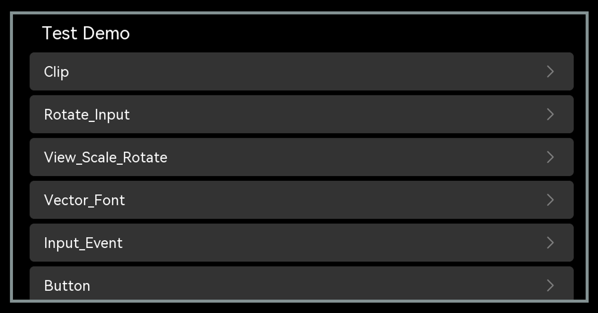

