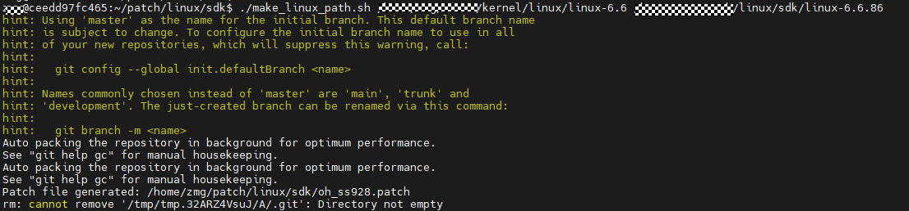
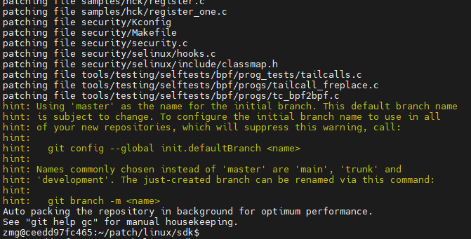

# 前言<a name="ZH-CN_TOPIC_0000002474693681"></a>

**概述<a name="section4537382116410"></a>**

本文档详细的描述了如何将SS928V100 SDK的内核补丁和OpenHarmony内核源码进行合并的操作指导，来生成同时具有SS928V100 SDK内核相关特性和OpenHarmony内核相关特性的内核源码。

**读者对象<a name="section182761247132418"></a>**

本文档主要适用于视觉芯片OpenHarmony Small系统升级的操作人员。操作人员必须具备以下经验和技能：

-   熟悉OpenHarmony源码编译构建。
-   熟悉视觉类芯片SDK版本。

**符号约定<a name="section133020216410"></a>**

在本文中可能出现下列标志，它们所代表的含义如下。

<a name="table2622507016410"></a>
<table><thead align="left"><tr id="row1530720816410"><th class="cellrowborder" valign="top" width="20.580000000000002%" id="mcps1.1.3.1.1"><p id="p6450074116410"><a name="p6450074116410"></a><a name="p6450074116410"></a><strong id="b2136615816410"><a name="b2136615816410"></a><a name="b2136615816410"></a>符号</strong></p>
</th>
<th class="cellrowborder" valign="top" width="79.42%" id="mcps1.1.3.1.2"><p id="p5435366816410"><a name="p5435366816410"></a><a name="p5435366816410"></a><strong id="b5941558116410"><a name="b5941558116410"></a><a name="b5941558116410"></a>说明</strong></p>
</th>
</tr>
</thead>
<tbody><tr id="row1372280416410"><td class="cellrowborder" valign="top" width="20.580000000000002%" headers="mcps1.1.3.1.1 "><p id="p3734547016410"><a name="p3734547016410"></a><a name="p3734547016410"></a><a name="image2670064316410"></a><a name="image2670064316410"></a><span></span></p>
</td>
<td class="cellrowborder" valign="top" width="79.42%" headers="mcps1.1.3.1.2 "><p id="p1757432116410"><a name="p1757432116410"></a><a name="p1757432116410"></a>表示如不避免则将会导致死亡或严重伤害的具有高等级风险的危害。</p>
</td>
</tr>
<tr id="row466863216410"><td class="cellrowborder" valign="top" width="20.580000000000002%" headers="mcps1.1.3.1.1 "><p id="p1432579516410"><a name="p1432579516410"></a><a name="p1432579516410"></a><a name="image4895582316410"></a><a name="image4895582316410"></a><span></span></p>
</td>
<td class="cellrowborder" valign="top" width="79.42%" headers="mcps1.1.3.1.2 "><p id="p959197916410"><a name="p959197916410"></a><a name="p959197916410"></a>表示如不避免则可能导致死亡或严重伤害的具有中等级风险的危害。</p>
</td>
</tr>
<tr id="row123863216410"><td class="cellrowborder" valign="top" width="20.580000000000002%" headers="mcps1.1.3.1.1 "><p id="p1232579516410"><a name="p1232579516410"></a><a name="p1232579516410"></a><a name="image1235582316410"></a><a name="image1235582316410"></a><span></span></p>
</td>
<td class="cellrowborder" valign="top" width="79.42%" headers="mcps1.1.3.1.2 "><p id="p123197916410"><a name="p123197916410"></a><a name="p123197916410"></a>表示如不避免则可能导致轻微或中度伤害的具有低等级风险的危害。</p>
</td>
</tr>
<tr id="row5786682116410"><td class="cellrowborder" valign="top" width="20.580000000000002%" headers="mcps1.1.3.1.1 "><p id="p2204984716410"><a name="p2204984716410"></a><a name="p2204984716410"></a><a name="image4504446716410"></a><a name="image4504446716410"></a><span></span></p>
</td>
<td class="cellrowborder" valign="top" width="79.42%" headers="mcps1.1.3.1.2 "><p id="p4388861916410"><a name="p4388861916410"></a><a name="p4388861916410"></a>用于传递设备或环境安全警示信息。如不避免则可能会导致设备损坏、数据丢失、设备性能降低或其它不可预知的结果。</p>
<p id="p1238861916410"><a name="p1238861916410"></a><a name="p1238861916410"></a>“须知”不涉及人身伤害。</p>
</td>
</tr>
<tr id="row2856923116410"><td class="cellrowborder" valign="top" width="20.580000000000002%" headers="mcps1.1.3.1.1 "><p id="p5555360116410"><a name="p5555360116410"></a><a name="p5555360116410"></a><a name="image799324016410"></a><a name="image799324016410"></a><span></span></p>
</td>
<td class="cellrowborder" valign="top" width="79.42%" headers="mcps1.1.3.1.2 "><p id="p4612588116410"><a name="p4612588116410"></a><a name="p4612588116410"></a>对正文中重点信息的补充说明。</p>
<p id="p1232588116410"><a name="p1232588116410"></a><a name="p1232588116410"></a>“说明”不是安全警示信息，不涉及人身、设备及环境伤害信息。</p>
</td>
</tr>
</tbody>
</table>

**修订记录<a name="section220mcpsimp"></a>**

修订记录累积了每次文档更新的说明。最新版本的文档包含以前所有文档版本的更新内容。

<a name="table1557726816410"></a>
<table><thead align="left"><tr id="row2942532716410"><th class="cellrowborder" valign="top" width="20.72%" id="mcps1.1.4.1.1"><p id="p3778275416410"><a name="p3778275416410"></a><a name="p3778275416410"></a><strong id="b5687322716410"><a name="b5687322716410"></a><a name="b5687322716410"></a>文档版本</strong></p>
</th>
<th class="cellrowborder" valign="top" width="26.119999999999997%" id="mcps1.1.4.1.2"><p id="p5627845516410"><a name="p5627845516410"></a><a name="p5627845516410"></a><strong id="b5800814916410"><a name="b5800814916410"></a><a name="b5800814916410"></a>发布日期</strong></p>
</th>
<th class="cellrowborder" valign="top" width="53.16%" id="mcps1.1.4.1.3"><p id="p2382284816410"><a name="p2382284816410"></a><a name="p2382284816410"></a><strong id="b3316380216410"><a name="b3316380216410"></a><a name="b3316380216410"></a>修改说明</strong></p>
</th>
</tr>
</thead>
<tbody><tr id="row5947359616410"><td class="cellrowborder" valign="top" width="20.72%" headers="mcps1.1.4.1.1 "><p id="p2149706016410"><a name="p2149706016410"></a><a name="p2149706016410"></a>00B01</p>
</td>
<td class="cellrowborder" valign="top" width="26.119999999999997%" headers="mcps1.1.4.1.2 "><p id="p648803616410"><a name="p648803616410"></a><a name="p648803616410"></a>2025-09-15</p>
</td>
<td class="cellrowborder" valign="top" width="53.16%" headers="mcps1.1.4.1.3 "><p id="p1946537916410"><a name="p1946537916410"></a><a name="p1946537916410"></a>第1次临时版本发布。</p>
</td>
</tr>
</tbody>
</table>

# 概述<a name="ZH-CN_TOPIC_0000002411988992"></a>

本文档介绍了如何适配SS928V100 SDK的内核补丁到OpenHarmony内核源码中，来生成同时具有SS928V100 SDK内核相关特性和OpenHarmony内核相关特性的内核源码。SS928V100 SDK的linux-6.6内核源码是基于linux开源内核代码（版本号为linux-6.6.86）打上SDK内核补丁后得到的。OpenHarmony（下面简称OH）的linux-6.6内核源码也是基于linux开源内核代码（版本号为linux-6.6.86）打上OpenHarmony系统特性相关内核补丁后得到的。基于同一linux-6.686内核版本下，适配SS928V100 SDK内核补丁到OpenHarmony内核源码的过程即是将两者的内核补丁进行合并的过程。首先会基于SDK内核源码与OH内核源码的差异制作成SDK的内核补丁文件，称为oh\_ss928.patch。接着，将OH内核独立的特性解耦成一份OH内核补丁文件，称为oh\_feature.patch。最终编译过程中依次打入SDK的内核补丁和OH内核补丁生成内核源码。

# 制作SDK特性patch<a name="ZH-CN_TOPIC_0000002482249621"></a>

基于SDK内核源码与OH内核源码的差异制作成SDK的内核补丁文件，称为oh\_ss928.patch。具体步骤如下：

1.  使用开源Linux-6.6.86源码和SDK软件包提供的内核patch还原SDK内核源码。

    从HiSpark社区的platform/ss928v100\_clang/open\_source/linux目录下获取补丁文件linux-6.6.86.patch，从该目录的readme.txt中获取linux-6.6.86源码下载路径并下载源码压缩包linux-6.6.86.tar.gz，使用如下命令还原出linux-6.6.86源码。

    ```
    tar -zxvf  linux-6.6.86.tar.gz
    cd linux-6.6.86
    patch -p1 < ../linux-6.6.86.patch
    ```

2.  使用git比较OH与SDK内核源码得到差异patch文件。新建如下make\_linux\_path.sh脚本文件。

    ```
    #!/bin/bash
    make_sdk_patch() {
        # 入参1为：OH内核源码绝对目录，如OpenHarmony-v5.1.0-Release/OpenHarmony/kernel/linux/linux-6.6
        # 入参2为：SDK内核源码绝对目录，如sdk/platform/open_source/linux/linux-6.6.86
        local oh_kernel_dir=$1
        local sdk_kernel_dir=$2
        local patch_file="oh_ss928.patch"
        local current_dir=$(pwd)
        local temp_dir=$(mktemp -d)
        cp -rf $oh_kernel_dir "$temp_dir"/A
        cd "$temp_dir"/A || exit
        rm -rf .git
        # 初始化git仓库并提交
        git init > /dev/null
        git add --all
        git commit -m "Initial commit (A)" > /dev/null
        rm -rf *
        # 复制目录B到临时目录
        cp -rf $sdk_kernel_dir/* ./
        git add --all
        git commit -m "Update to B" > /dev/null
        # 生成补丁文件
        git diff HEAD^ HEAD > $current_dir/$patch_file
        # 返回补丁文件路径
        echo "Patch file generated: $current_dir/$patch_file"
        # 清理临时目录,若脚本清理不掉可手动命令清理
        cd ..
        rm -rf "$temp_dir"
    }
    
    make_sdk_patch $1 $2
    ```

3.  授予make\_linux\_path.sh脚本执行权限。

    ```
    chmod +x make_linux_path.sh
    ```

4.  执行下述命令即可生成oh\_ss928.patch。

    ```
    ./make_linux_path.sh /path/to/OpenHarmony-v5.1.0-Release/OpenHarmony/kernel/linux/linux-6.6 /path/to/sdk/platform/open_source/linux/linux-6.6.86
    ```

    > **说明：** 
    >-   上述/path/to/OpenHarmony-v5.1.0-Release/OpenHarmony/kernel/linux/linux-6.6和/path/to/sdk/platform/ss928v100\_clang/open\_source/linux/linux-6.6.86为举例，实际应用请传正确的路径。
    >-   要求传入OH内核源码的目录和SDK内核源码的目录绝对路径。

    **图 1**  ./make\_linux\_path.sh执行成功截图<a name="fig9271112516378"></a>  
    

5.  生成的oh\_ss928.patch在当前目录下。

# 制作OH特性patch<a name="ZH-CN_TOPIC_0000002466098289"></a>

内核适配中需要的OH系统相关内核特性包括如下几个目录及相关文件。

-   drivers/staging/hilog
-   drivers/staging/hievent
-   drivers/staging/hisysevent
-   drivers/staging/blackbox

具体方法可参考如下步骤解耦出OH特性patch：

1.  使用脚本拷贝出部分目录文件。

    新增make\_oh\_feature\_patch.sh脚本文件。

    ```
    #!/bin/bash
    make_oh_feature_patch() {
        # 入参1为：OH内核源码目录，如OpenHarmony-v5.1.0-Release/OpenHarmony/kernel/linux/linux-6.6，使用绝对路径
        # 入参2为：第2章中制作出的SDK内核补丁文件oh_ss928.patch的绝对路径
        local oh_kernel_dir=$1
        local sdk_patch_file=$2
        local current_dir=$(pwd)
        if [ -d "$current_dir/A" ]; then
            echo "当前目录下存在目录A，请先删除或重命名"
            exit 0
        fi
        cp -rf $oh_kernel_dir $current_dir/A 
        cd A || exit
        patch -p1 < $sdk_patch_file
        rm -rf .git
        git init > /dev/null
        git add --all
        git commit -m "Initial commit (A)" > /dev/null
        mkdir -p drivers/staging/blackbox
        mkdir -p drivers/staging/hievent
        mkdir -p drivers/staging/hilog
        mkdir -p drivers/staging/hisysevent
        mkdir -p include/dfx
        cp $oh_kernel_dir/drivers/staging/blackbox/* drivers/staging/blackbox/
        cp $oh_kernel_dir/drivers/staging/hievent/* drivers/staging/hievent/
        cp $oh_kernel_dir/drivers/staging/hilog/* drivers/staging/hilog/
        cp $oh_kernel_dir/drivers/staging/hisysevent/* drivers/staging/hisysevent/
        cp $oh_kernel_dir/include/dfx/hiview_hisysevent.h include/dfx/
        cp $oh_kernel_dir/include/linux/blackbox.h include/linux/
        cp $oh_kernel_dir/include/linux/blackbox_*.h include/linux/
        git add drivers/staging/blackbox/*
        git add drivers/staging/hievent/*
        git add drivers/staging/hilog/*
        git add drivers/staging/hisysevent/*
        git add include/dfx/*
        git add include/linux/blackbox.h
        git add include/linux/blackbox_*.h
    }
    
    make_oh_feature_patch $1 $2
    ```

    授予make\_oh\_feature\_patch.sh执行权限。

    ```
    chmod +x make_oh_feature_patch.sh
    ```

2.  执行下述命令。

    ```
    ./make_oh_feature_patch.sh /path/to/OpenHarmony-v5.1.0-Release/OpenHarmony/kernel/linux/linux-6.6 /path/to/oh_ss928.patch
    ```

    > **说明：** 
    >-   上述/path/to/OpenHarmony-v5.1.0-Release/OpenHarmony/kernel/linux/linux-6.6和/path/to/oh\_ss928.patch为举例，实际应用请传正确的路。
    >-   要求传入OH内核源码的目录和SDK patch文件的绝对路径。执行完会将OH内核源码复制到在当前目录下的目录A，因此执行前要保证执行目录下没有目录名称为A的目录 。

    **图 1**  执行make\_oh\_feature\_patch.sh执行成功后截图<a name="fig1772263045310"></a>  
    

3.  修改如下三个文件，添加修改中的加粗部分。

    1. A/drivers/staging/Kconfig

    ```
    ...
    source "drivers/staging/vme_user/Kconfig"
    source "drivers/staging/hilog/Kconfig"
    source "drivers/staging/hievent/Kconfig"
    source "drivers/staging/hisysevent/Kconfig"
    source "drivers/staging/blackbox/Kconfig"
     endif # STAGING
    ...
    ```

    2. A/drivers/staging/Makefile

    ```
    ...
    obj-$(CONFIG_XIL_AXIS_FIFO)    += axis-fifo/
    obj-$(CONFIG_FIELDBUS_DEV)     += fieldbus/
    obj-$(CONFIG_QLGE)     += qlge/
    obj-$(CONFIG_HILOG)        += hilog/
    obj-$(CONFIG_HIEVENT)      += hievent/
    obj-$(CONFIG_HISYSEVENT)   += hisysevent/
    obj-$(CONFIG_BLACKBOX)     += blackbox/
    ...
    ```

    3. A/scripts/Makefile.lib

    ```
    ...
    ld_flags       = $(KBUILD_LDFLAGS) $(ldflags-y) $(LDFLAGS_$(@F))
    DTC_INCLUDE    := $(srctree)/scripts/dtc/include-prefixes
    DTC_INCLUDE    += $(srctree)/include
    dtc_cpp_flags  = -Wp,-MMD,$(depfile).pre.tmp -nostdinc                    \
            $(addprefix -I,$(DTC_INCLUDE))
    ...
    ```

4.  修改完后在目录A下使用git add添加修改过的文件。

    ```
    git add drivers/staging/Kconfig
    git add drivers/staging/Makefile
    git add scripts/Makefile.lib
    ```

5.  在目录A下使用git比较两次提交的差异制作出oh\_feature.patch

    ```
    git commit -m "Update to B"
    git diff HEAD^ HEAD > ../oh_feature.patch
    ```

6.  生成的oh\_feature.patch在A目录的父目录下

# 内核编译<a name="ZH-CN_TOPIC_0000002466178417"></a>

OH系统内核编译脚本在OpenHarmony/kernel/linux/build目录下, 编译前中会依次打入三个patch文件到内核源码: hdf.patch, oh\_ss928.patch, oh\_feature.patch。hdf.patch是OH代码中单独存放的hdf驱动相关的补丁，oh\_ss928.patch就是第2章中制作的patch它主要包含了sdk的补丁，oh\_feature.patch就是第3章中制作的patch它主要包含了OH系统特性的补丁。


## 生成内核编译配置<a name="ZH-CN_TOPIC_0000002470851033"></a>

通过如下步骤生成OH内核编译配置文件：

1.  复制SS928V100 SDK提供的默认内核编译配置文件/path/to/sdk/open\_source/linux/linux-6.6.86/arch/arm64/configs/ss928v100\_emmc\_defconfig到ohos的目录下ohos/kernel/linux/config/linux-6.6/arch/arm64/configs/hispark\_ss928v100\_small\_defconfig。

    > **说明：** 
    >ss928v100\_emmc\_defconfig为emmc存储介质的配置，ss928v100\_nand\_defconfig为spi nand存储介质的配置。

2.  在配置文件hispark\_ss928v100\_small\_defconfig中添加如下的OH特性的内核选项配置，然后保存文件。

    ```
    CONFIG_STAGING=y
    CONFIG_HILOG=y
    CONFIG_HILOG_BUFFER_SIZE=4096
    CONFIG_HIEVENT=y
    CONFIG_BBOX_BUFFER_SIZE=2048
    CONFIG_ANDROID_BINDER_IPC=y
    CONFIG_ANDROID_BINDER_DEVICES="binder,hwbinder,vndbinder"
    ```

## 编译内核<a name="ZH-CN_TOPIC_0000002470930921"></a>

在ohos目录下SS928V100单独编译内核的命令如下。

```
./build.sh --product-name=ipcamera_hispark_ss928v100_linux --ccache --no-prebuilt-sdk -T linux_kernel
```

编译结束之后会在out/hispark\_ss928v100/ipcamera\_hispark\_ss928v100\_linux/目录下生成编译产物。

